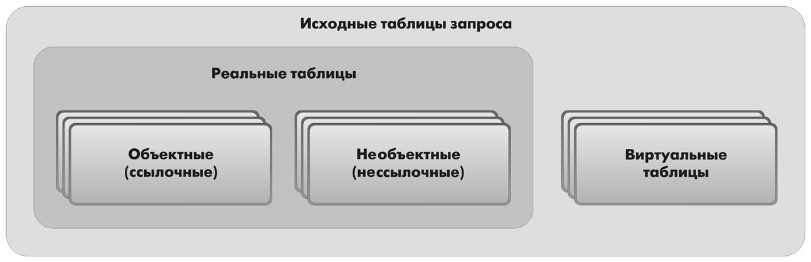
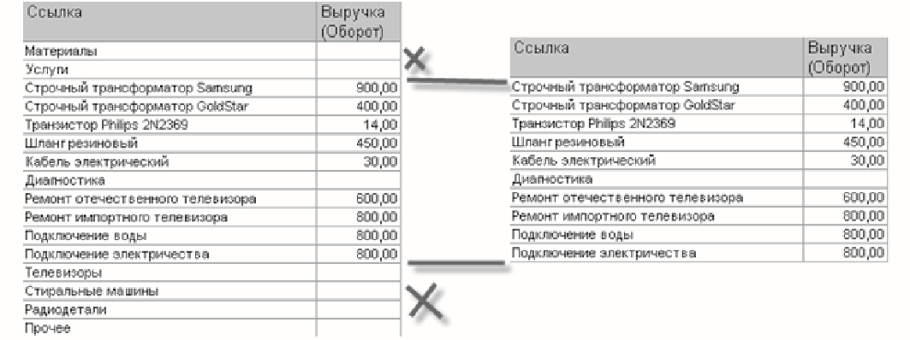
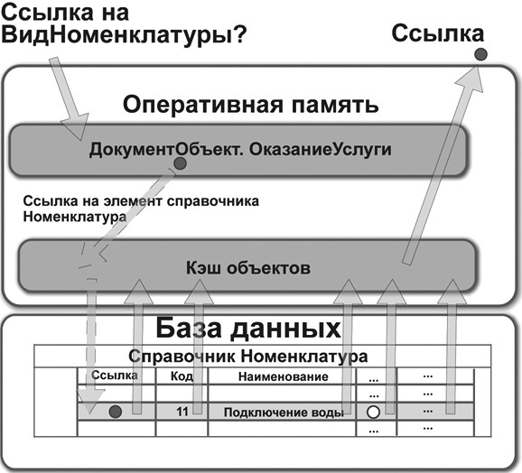

Оглавление

<a href="#_Toc454870446">Лекция №1 Вводное занятие. Инструктаж	3</a>

<a href="#_Toc454870447">Лекция №2 Регистрация хозяйственных операций	7</a>

<a href="#_Toc454870448">Лекция №3 Движение денежных средств	10</a>

<a href="#_Toc454870449">Лекция №4 Учет денежных средств и расчетов	15</a>

<a href="#_Toc454870450">Лекция №5 Документы для поставщиков	18</a>

<a href="#_Toc454870451">Лекция №6 Учет материалов и ОС	24</a>

<a href="#_Toc454870452">Лекция №7 Учет работ по наладке оборудования	28</a>

<a href="#_Toc454870453">Лекция №8 Учет производственных запасов	31</a>

<a href="#_Toc454870454">Лекция №9 Учет затрат на производство	35</a>

<a href="#_Toc454870455">Лекция №10 НМА. Амортизация	38</a>

<a href="#_Toc454870456">Лекция №11 Документы на отпуск материалов	41</a>

<a href="#_Toc454870457">Лекция №12 Начисление зарплаты и отчислений	44</a>

<a href="#_Toc454870458">Лекция №13 Документы на выпуск  готовой продукции	48</a>

<a href="#_Toc454870459">Лекция №14 Документы на реализацию готовой продукции	52</a>

<a href="#_Toc454870460">Лекция №15 Финансовый результат	56</a>

<a href="#_Toc454870461">Лекция №16 Формирование регламентированных отчетов	60</a>

<a href="#_Toc454870462">Лекция №17 Введение в программирование 1С	63</a>

<a href="#_Toc454870463">Лекция №18 Основные понятия бухгалтерского учета	69</a>

<a href="#_Toc454870464">Лекция №19 Функционирование системы.	72</a>

<a href="#_Toc454870465">Лекция №20 Краткое описание понятий (объектов).	76</a>

<a href="#_Toc454870466">Лекция №21 Средства конфигурирования и администрирования системы 1С	80</a>

<a href="#_Toc454870467">Лекция №22 Разработка структуры конфигурации	84</a>

<a href="#_Toc454870468">Лекция №23 Приемы работы с конфигуратором	88</a>

<a href="#_Toc454870469">Лекция №24 Приемы работы с конфигуратором	92</a>

<a href="#_Toc454870470">Литература	97</a>
<h1>Лекция №1 Вводное занятие. Инструктаж</h1>
План:
<ol><li>разработка прикладных решений</li><li>Общие сведения о системе</li><li>Конфигурация и прикладное решение</li><li>Режимы работы системы</li></ol>
<strong>Программирование или разработка?</strong>

Что же я делаю?! Такой вопрос периодически возникает у всех, кто 	сталкивался 	или 	просто 	интересовался 	разработками на «1С:Предприятии».

«Пишу программу», – вот наиболее частый ответ. «На чем?» – «На 1С». «На чем вы работаете?» – «На 1С». «На чем это написано?» – «На 1С». «Требуется бухгалтер со знанием 1С», «требуется программист «1С» на неполный рабочий день…» и т. д. 

Такие фразы можно встретить постоянно, и вам они наверняка хорошо знакомы. Для человека непосвященного в них нет ничего особенного. Однако тех, кто имеет представление о разработке на «1С:Предприятии», такие вопросы зачастую могут поставить в тупик, потому что в этих фразах термином <em>1С</em> обозначаются совершенно разные предметы, а термин <em>программа</em> и вовсе сбивает с толку…

Если ваша цель – научиться «программировать на 1С», то эта цель не совсем верная. В системе «1С:Предприятие» есть встроенный язык, но он занимает далеко не главное место в процессе разработки. Эта дисциплина учит <em>разработке прикладных решений на основе платформы «1С:Предприятие»</em> – процессу, в котором программирование, безусловно, присутствует, но лишь как один из инструментов разработки.

Это важно понимать с самого начала, еще до того, как вы начнете делать первые шаги в «1С:Предприятии». 

А чтобы было понятно, что именно мы будем создавать с вами на протяжении этой дисциплины, объясним сначала, что представляет собой система «1С:Предприятие» вообще.

<strong>Общие сведения о системе</strong>

«1С:Предприятие» является универсальной системой автоматизации экономической и организационной деятельности предприятия. Поскольку такая деятельность может быть довольно разнообразной, система «1С:Предприятие» может приспосабливаться к особенностям конкретной области деятельности, в которой она применяется. Для обозначения такой способности используется термин <em>конфигурируемость</em>, то есть возможность настройки системы на особенности конкретного предприятия и класса решаемых задач. 

Это достигается благодаря тому, что «1С:Предприятие» – это не просто программа, существующая в виде набора неизменяемых файлов, а совокупность различных программных инструментов, с которыми работают разработчики и пользователи. Логически всю систему можно разделить на две большие части, которые тесно взаимодействуют друг с другом, – <em>конфигурацию и платформу</em>, которая управляет работой конфигурации. 

Для того чтобы легче понять взаимодействие этих частей системы, сравним ее с проигрывателем компакт-дисков. Как вы хорошо знаете, проигрыватель служит для того, чтобы слушать музыку. На вкус и цвет товарищей нет, поэтому существует множество разнообразных компакт-дисков, на которых записаны музыкальные произведения на любой вкус. 

Чтобы прослушать какую-либо композицию, нужно вставить компакт-диск в проигрыватель, и проигрыватель воспроизведет записанное на диске музыкальное произведение. Более того, современный проигрыватель компакт-дисков даже позволит вам записать собственную подборку музыкальных произведений, то есть создать новый компакт-диск. 

Сам по себе проигрыватель совершенно бесполезен без компактдиска, точно так же, как компакт-диск не может принести нам никакой пользы (кроме как стать подставкой под чашку кофе), если у нас нет проигрывателя. 

Возвращаясь к системе «1С:Предприятие», можно сказать, что платформа является своеобразным «проигрывателем», а конфигурация – «компакт-диском». Платформа обеспечивает работу конфигурации и позволяет вносить в нее изменения или создавать собственную конфигурацию.

Существует одна платформа («1С:Предприятие») и множество конфигураций. Для функционирования какого-либо прикладного решения всегда необходима платформа и какая-либо (одна) конфигурация (рис. 1.1). 

<strong>Рис. 1.1.</strong> Конфигураций много, а платформа одна

Сама по себе платформа не может выполнить никаких задач автоматизации, так как она создана для обеспечения работы какой-либо конфигурации. То же самое с конфигурацией: чтобы выполнить те задачи, для которых она создана, необходимо наличие платформы, управляющей ее работой.

<strong>Конфигурация и прикладное решение</strong>

Здесь следует сказать о небольшой двойственности терминологии, которая будет использоваться в дальнейшем. Двойственность заключается в употреблении разных терминов для обозначения одного и того же предмета: <em>конфигурация</em> и <em>прикладное решение</em>. 

Эти термины обозначают ту часть системы «1С:Предприятие», которая работает под управлением платформы и которую видят все пользователи. Бывает, конечно, что пользователи работают и с инструментальными средствами платформы, но это продвинутые пользователи. Употребление одного или другого термина зависит от контекста, в котором ведется изложение. 

Если речь идет о действиях разработчика, то употребляется термин «конфигурация», поскольку это точный термин «1С:Предприятия». Термин «прикладное решение», напротив, является более общепринятым и понятным для пользователя системы «1С:Предприятие».

Итак, поскольку задачи автоматизации, как было упомянуто выше, могут быть самыми разными, фирма «1С» и ее партнеры выпускают прикладные решения, каждое из которых предназначено для автоматизации одной определенной области человеческой деятельности. В качестве примера существующих прикладных решений можно перечислить следующие типовые решения:
<ul><li>«1С:Бухгалтерия 8», </li><li>«1С:Управление небольшой фирмой 8»,</li><li>«1С:Управление торговлей 8», </li><li>«1С:Зарплата и управление персоналом 8», </li><li>«1С:Управление производственным предприятием 8», </li><li>«1С:Налогоплательщик 8», </li><li>«1С:Документооборот 8»,  «1С:Консолидация 8». </li></ul>
Существует также множество других типовых прикладных решений. Более подробно о них можно узнать на сайте http://v8.1c.ru/solutions/applied_solutions.htm.

Типовое прикладное решение является, по сути, универсальным и способно удовлетворить потребности самых разных предприятий, работающих в одной области деятельности. И это хорошо. 

С другой стороны, такая универсальность неизбежно приведет к тому, что на конкретном предприятии будут использоваться далеко не все возможности прикладного решения, а каких-то возможностей в нем будет недоставать (нельзя угодить всем). 

Вот тут и выходит на передний план <em>конфигурируемость</em> системы, поскольку платформа, помимо управления работой конфигурации, содержит средства, позволяющие вносить изменения в используемую конфигурацию. Более того, платформа позволяет создать свою собственную конфигурацию с нуля, если по каким-либо причинам использование типовой конфигурации представляется нецелесообразным. 

Обратите внимание, как мы в одном абзаце перешли от <em>прикладного</em> <em>решения</em> к <em>конфигурации</em>. Ничего не поделаешь, для пользователя понятнее так, а для разработчика – по-другому.

Таким образом, если вернуться к сравнению с проигрывателем компакт-дисков, мы можем изменять по своему вкусу мелодии, которые были ранее записаны на компакт-диске, и даже создавать диски со своими собственными музыкальными произведениями. При этом нам не потребуются какие-либо музыкальные инструменты – все необходимое для создания мелодий есть в нашем проигрывателе компакт-дисков.

<strong>Режимы работы системы</strong>

Для того чтобы обеспечить такие возможности, система «1С:Предприятие» имеет различные режимы работы: <em>1С:Пред- приятие </em>и <em>Конфигуратор</em>.

Режим 1С:Предприятие является основным и служит для работы пользователей системы. В этом режиме пользователи вносят данные, обрабатывают их и получают итоговые результаты. 

Режим Конфигуратор используется разработчиками и администраторами информационных баз. Именно этот режим и предоставляет инструменты, необходимые для модификации существующей или создания новой конфигурации.

Поскольку задача дициплины состоит в том, чтобы научить вас создавать собственные конфигурации и изменять существующие, дальнейшее повествование будет в основном посвящено работе с системой в режиме Конфигуратор. И лишь иногда, чтобы проверить результаты нашей работы, мы будем запускать систему в режиме 1С:Предприятие. 

Изучение этой дисциплины предполагает, что у вас уже установлена на компьютере система «1С:Предприятие 8.3». Если это не так, то сейчас самое время это сделать, так как далее будет непосредственно описываться последовательность работы с программой.

Вопросы:
<ol><li>разработка прикладных решений</li><li>Общие сведения о системе</li><li>Конфигурация и прикладное решение</li><li>Режимы работы системы</li></ol><h1>Лекция №2 Регистрация хозяйственных операций</h1>
План:
<ol><li>Что такое подсистема</li><li>объект конфигурации</li><li>палитра свойств</li></ol>
<strong>Что такое подсистема</strong>

Подсистемы – это основные элементы для построения интерфейса «1С:Предприятия». Поэтому первое, с чего следует начинать разработку конфигурации, – это проектирование состава подсистем.

При этом перед разработчиком стоит важная и ответственная задача – тщательно продумать состав подсистем и затем аккуратно и осмысленно привязать к подсистемам те объекты конфигурации, которые он будет создавать.

В простых прикладных решениях можно не использовать подсистемы, но мы рассмотрим общий случай, когда подсистемы используются. 

Объекты конфигурации Подсистема позволяют выделить в конфигурации функциональные части, на которые логически разбивается создаваемое прикладное решение. 

Эти объекты располагаются в ветке объектов 	Общие 	и позволяют строить древовидную структуру, состоящую из подсистем и подчиненных им подсистем (рис. 2.1).

<strong>Рис. 2.1.</strong> Структура подсистем конфигурации

Подсистемы верхнего уровня являются основными элементами интерфейса, так как образуют разделы прикладного решения 

(рис. 2.2).

<strong>Рис. 2.2.</strong> Разделы прикладного решения

Каждый объект конфигурации может быть включен в одну или сразу несколько подсистем, в составе которых он будет отображаться. 

Забегая вперед, скажем, что с помощью подсистем, используя видимость по ролям, можно предоставить пользователю удобный и функциональный интерфейс, не содержащий лишних элементов. Например, кладовщик должен иметь возможность принять и выдать товар, и ему совсем не нужно видеть все, что относится к области бухгалтерского учета и оказанию услуг.

Таким образом, наличие подсистем определяет структуру прикладного решения, организует весь пользовательский интерфейс, позволяет рассортировать различные документы, справочники и отчеты по логически связанным с ними разделам, в которых пользователю будет проще их найти и удобнее с ними работать. При этом каждому конкретному пользователю будут видны лишь те разделы, то есть та функциональность прикладного решения, которые ему нужны в процессе работы.

Даже в такой небольшой конфигурации, как наша, можно выделить несколько функциональных частей, представляющих собой отдельные предметные области. 

Так, можно выделить в отдельную подсистему все, что имеет отношение к бухгалтерскому учету. 

Кроме этого, отдельной предметной областью является расчет зарплаты сотрудников предприятия. 

Всю производственную деятельность нашей фирмы ООО «На все руки мастер» можно разделить на учет материалов и оказание услуг. 

А кроме этого, для выполнения специальных административных функций с базой данных нам нужно иметь отдельную подсистему, в которую будет иметь доступ только администратор.

Поэтому сейчас мы создадим в нашей конфигурации пять новых объектов конфигурации Подсистема, которые будут иметь имена: 

Бухгалтерия, РасчетЗарплаты, УчетМатериалов, ОказаниеУслуг и Предприятие. Чтобы это сделать, выполним следующие действия.

На первый взгляд окно редактирования объекта и палитра свойств дублируют друг друга. В самом деле в палитре свойств отображены все свойства объекта конфигурации. Зачем было создавать еще и окно редактирования объекта? И если существует окно редактирования объекта, то зачем тогда палитра свойств, которая содержит все то же самое, только в другом виде?

Окно редактирования объекта конфигурации предназначено в первую очередь для быстрого создания новых объектов. Быстрое создание подразумевает ввод исчерпывающей информации об объекте. Значит, нужно очень хорошо знать структуру объекта, а на это требуется время… Выходит, быстро создать объект не получится?

Получится! Окно редактирования объекта имеет в своей основе механизм «мастеров»: разработчику в нужной последовательности предлагается ввести необходимые данные. Последовательность ввода данных разработана таким образом, чтобы предыдущие данные могли служить основой для ввода последующих. Движение управляется кнопками Далее и Назад. На каждом шаге предлагается ввести группу логически связанных между собой данных.

Но, предположим, вы уже освоились со структурой объектов, или вам просто нужно изменить несколько свойств объекта. Чтобы при этом опять не «прокручивать» все с самого начала, окно редактирования объекта содержит закладки, позволяющие вам перейти непосредственно к тому шагу, на котором вводятся интересующие вас данные. Таким образом, окно редактирования объекта помогает быстро создать незнакомый объект конфигурации и в то же время обеспечивает удобный доступ к нужным свойствам при редактировании существующих объектов.

Что же касается палитры свойств, то она предоставляет одну абсолютно незаменимую возможность. Дело в том, что она не привязана по своей структуре к какому-то конкретному виду объектов конфигурации. Ее содержимое меняется в зависимости от того, какой объект является текущим. За счет этого она может запоминать, какое свойство объекта в ней выбрано, и при переходе в дереве к другому объекту будет подсвечивать у себя все то же свойство, но уже другого объекта. 

Такая способность палитры свойств абсолютно незаменима, когда, например, среди трех десятков справочников конфигурации вам нужно быстро найти подчиненные какому-нибудь другому. В этом случае вы выбираете мышью в палитре свойств свойство Владелец любого справочника, затем переходите в дерево объектов конфигурации и просто пробегаете его при помощи стрелок  или .

Вопросы:
<ol><li>Что такое подсистема</li><li>объект конфигурации</li><li>палитра свойств</li></ol><h1>Лекция №3 Движение денежных средств</h1>
План:
<ol><li>Что такое справочник</li><li>Формы справочника</li><li>Предопределенные элементы</li><li>Основная конфигурация и конфигурация базы данных</li></ol>
<strong>Что такое справочник</strong>

Объект конфигурации Справочник предназначен для работы со списками данных. Как правило, в работе любой фирмы используются списки сотрудников, списки товаров, списки клиентов, поставщиков и т. д. Свойства и структура этих списков описываются в объектах конфигурации Справочник, на основе которых платформа создает в базе данных таблицы для хранения информации из этих справочников. 

Справочник состоит из <em>элементов</em>. Например, для справочника сотрудников элементом является сотрудник, для справочника товаров – товар и т. д. Пользователь в процессе работы может самостоятельно добавлять новые элементы в справочник: например, добавить новых сотрудников, создать новый товар или внести нового клиента. 

В базе данных каждый элемент справочника представляет собой отдельную запись в основной таблице, хранящей информацию из этого справочника (рис. 3.1).

Каждый элемент справочника, как правило, содержит некоторую дополнительную 	информацию, 	которая 	подробнее 	описывает этот элемент. Например, все элементы справочника Товары могут содержать дополнительную информацию о производителе, сроке годности и др. Набор такой информации является одинаковым для всех элементов справочника, и для описания такого набора используются <em>реквизиты</em> объекта конфигурации Справочник, которые также, в свою очередь, являются объектами конфигурации (рис. 3.2).

<strong>Рис. 3.1.</strong> Справочник «Товары» в режиме «Конфигуратор», в режиме «1С:Предприятие» и в базе данных

<strong>Рис. 3.2.</strong> Стандартные реквизиты справочника и реквизиты, созданные разработчиком

Поскольку эти объекты конфигурации логически связаны с объектом Справочник, они называются <em>подчиненными</em> этому объекту. 

Большинство реквизитов разработчик создает самостоятельно, однако у каждого объекта конфигурации Справочник по умолчанию существует набор стандартных реквизитов: Код и Наименование и пр. (см. рис. 3.2). Причем доступность стандартных реквизитов зависит от свойств справочника. 

Например, если справочник иерархический, у него будет доступен стандартный реквизит Родитель. Если справочник подчинен другому объекту конфигурации, у него будет доступен реквизит Владелец. Если установить длину стандартного реквизита Код равной нулю, то у справочника будет недоступен этот реквизит. То же самое относится к реквизиту Наименование. Однако как минимум либо Код, либо Наименование должны присутствовать в реквизитах справочника, иначе такой справочник не имеет смысла.

Таким образом, в базе данных справочник хранится в виде таблицы, в строках которой расположены элементы списка, а каждому реквизиту (стандартному или созданному разработчиком) в этой таблице соответствует отдельный столбец. Соответственно, в ячейках этой таблицы хранится значение конкретного реквизита для конкретного элемента справочника (рис. 3.3).

<strong>Рис. 3.3.</strong> Справочник «Товары» в режиме «Конфигуратор», в режиме «1С:Предприятие» и в базе данных

Кроме этого, каждый элемент справочника может содержать некоторый набор информации, которая одинакова по своей структуре, но различна по количеству и предназначена для разных элементов справочника. 

<strong>Формы справочника</strong>

В зависимости от того, какие действия мы хотим выполнять со справочником, нам требуется изображать справочник в «разном виде». Например, для того чтобы выбрать некоторый элемент справочника, удобнее представить справочник в виде списка, а для того чтобы изменить какой-то элемент справочника, удобнее представить все реквизиты этого элемента справочника в одной форме

(рис. 3.9).

<strong>Рис. 3.9.</strong> Форма списка и форма редактирования элемента справочника «Сотрудники»

Система может самостоятельно сгенерировать все формы, которые нужны для представления данных, содержащихся в справочнике. Причем система знает, какие именно формы нужно использовать в каких ситуациях. 

Вообще 	говоря, 	для 	отображения 	справочника 	в различных ситуациях требуется максимум пять форм для справочника.

Обратите внимание, что в различных местах конфигуратора одни и те же формы называются немного по-разному (табл. 3.1). Следующая таблица представляет различные названия форм:
<ul><li>в контекстном меню справочника (Открыть основную форму…), в дереве конфигурации и в палитре свойств справочника;</li><li>в конструкторе форм;</li><li>на закладке Формы окна редактирования справочника.</li></ul>
<strong>таблица 3.1.</strong> Формы справочника
<table><tr><td>
В контекстном меню и в палитре свойств (рис. 3.12)
</td><td>
В конструкторе форм 

(рис. 3.11)
</td><td>
На закладке 

«Формы» (рис. 3.10)
</td></tr><tr><td>
Основная форма объекта
</td><td>
Форма элемента справочника
</td><td>
Элемента
</td></tr><tr><td>
Основная форма группы
</td><td>
Форма группы справочника
</td><td>
Группы
</td></tr><tr><td>
Основная форма списка
</td><td>
Форма списка справочника
</td><td>
Списка
</td></tr><tr><td>
Основная форма выбора
</td><td>
Форма выбора справочника
</td><td>
Выбора
</td></tr><tr><td>
Основная форма выбора группы
</td><td>
Форма выбора группы справочника
</td><td>
Выбора группы
</td></tr></table>
<strong>Предопределенные элементы</strong>

Обратите внимание, что система отмечает различными пиктограммами обычный и предопределенный элементы справочника

(см. рис. 3.73). 

Несмотря на то, что можно изменить код или наименование у обоих элементов, имя предопределенного элемента, которое мы задали в конфигураторе (Основной), остается неизменным, и в дальнейшем мы сможем обратиться к предопределенному элементу справочника по этому имени из встроенного языка.

Таким образом, на предопределенные элементы могут опираться алгоритмы работы конфигурации.

Из этого видно, в чем заключается принципиальная с точки зрения конфигурации разница между обычными и предопределенными элементами справочника. 

Обычные элементы непостоянны для конфигурации. В процессе работы пользователя они могут появиться, исчезнуть. Поэтому конфигурация хоть и может отличить их друг от друга, но рассчитывать на них в выполнении каких-либо алгоритмов она не может в силу их непостоянства. 

Предопределенные элементы, напротив, постоянны. В процессе работы пользователя они находятся всегда на своих местах и исчезнуть не могут. 

То есть теоретически пользователь может их удалить, но для облегчения задачи мы не даем пользователю прав не только на интерактивное удаление предопределенных элементов, но и на интерактивное удаление объектов вообще. 

Поэтому конфигурация может работать с ними вполне уверенно и опираться на них при отработке различных алгоритмов. По этой причине каждый из предопределенных элементов имеет уникальное имя для того, чтобы к нему можно было обратиться средствами встроенного языка.

<strong>Основная конфигурация и конфигурация базы данных</strong>

Кроме этого, вне информационной базы может существовать хранилище. В нем находится конфигурация, предназначенная для групповой разработки.

Вне информационной базы может существовать также некоторое количество файлов конфигураций, в том числе файлы новой поставки (рис. 3.74).

Конфигурация поставщика, находящаяся в информационной базе, содержит предыдущее состояние поставки. Возможна ситуация, когда конфигурация находится на поддержке одновременно у нескольких поставщиков, каждый из которых поддерживает только свою часть в виде отдельной конфигурации. В этом случае информационная база будет хранить несколько конфигураций поставщиков (состояние предыдущей поставки для каждого поставщика отдельно). 

Файлы новой поставки могут существовать в виде файлов конфигураций (<em>полная поставка</em>) и файлов обновлений (<em>поставка обновлений</em>).

<strong>Рис. 3.74.</strong> Структура конфигурации

<em>Хранилище конфигурации</em> содержит конфигурацию, предназначенную для групповой разработки. Она хранится не в виде единой конфигурации, а в виде отдельных объектов в разрезе версий конфигурации. Таким образом, мы можем получить из хранилища конфигурацию любой версии – для этого она «собирается» из объектов нужной версии.

Теперь представьте, что между всеми этими видами конфигураций существует возможность сравнения и обновления. В этом случае очень легко запутаться, и название <em>Основная конфигурация</em> как нельзя лучше отражает конечную цель всех изменений.

Вопросы:
<ol><li>Что такое справочник</li><li>Формы справочника</li><li>Предопределенные элементы</li><li>Основная конфигурация и конфигурация базы данных</li></ol><h1>Лекция №4 Учет денежных средств и расчетов</h1>
План:
<ol><li>Что такое документ</li><li>Формы документа</li><li>типообразующие объекты конфигурации</li><li>Документ «Приходная накладная»</li></ol>
<strong>Что такое документ</strong>

Объект конфигурации <em>Документ</em> предназначен для описания информации о совершенных хозяйственных операциях или о событиях, произошедших в жизни организации вообще. Как правило, в работе любой фирмы используются такие документы, как приходные накладные, приказы о приеме на работу, платежные поручения, счета и т. д. Свойства и структура этих документов описываются в объектах конфигурации Документ, на основе которых платформа создает в базе данных таблицы для хранения информации из этих документов. 

Логика работы документов отличается от логики работы других объектов конфигурации. Документ обладает способностью <em>проведения</em>. Факт проведения документа означает, что событие, которое он отражает, повлияло на состояние учета. 

До тех пор, пока документ не проведен, состояние учета неизменно, и документ не более чем черновик, заготовка. Как только документ будет проведен, изменения, вносимые документом в учет, вступят в силу и состояние учета будет изменено. 

Поскольку документ вносит изменения в состояние учета, он всегда «привязан» к конкретному моменту времени. Это позволяет отражать в базе данных фактическую последовательность событий.

Следующим важным фактом, вытекающим из двух предыдущих, является то, что система «1С:Предприятие» имеет механизмы, позволяющие отслеживать правильность состояния учета. Предположим, что мы изменили один из проведенных ранее документов и снова провели его задним числом. В этом случае система «1С:Предприятие» способна отследить, повлияют ли внесенные нами изменения на последующие проведенные документы, и, если это так, система способна перепровести необходимые документы. 

В процессе работы пользователь может самостоятельно создавать новые документы – приходные и расходные накладные, счета и т. п. 

В базе данных каждый документ представляет собой отдельную запись в основной таблице, хранящей информацию об этом виде документов (рис. 4.1).

<strong>Рис. 4.1.</strong> Стандартные реквизиты документа «Приходная накладная»  в режиме «Конфигуратор», в режиме «1С:Предприятие» и в базе данных

<strong>Формы документа</strong>

Для визуализации документа существует несколько основных форм, которые, как мы уже говорили, имеют несколько вариантов названий (табл. 4.1).

<strong>таблица 4.1.</strong> Основные формы документа
<table><tr><td>
<strong>В контекстном меню и в палитре свойств</strong>
</td><td>
<strong>В конструкторе форм</strong>
</td><td>
<strong>на закладке формы</strong>
</td></tr><tr><td>
Форма объекта
</td><td>
Форма документа
</td><td>
Документа
</td></tr><tr><td>
Форма списка
</td><td>
Форма списка документа
</td><td>
Списка
</td></tr><tr><td>
Форма выбора
</td><td>
Форма выбора документа
</td><td>
Выбора
</td></tr></table>
<strong>типы данных, типообразующие объекты конфигурации</strong>

Прежде чем мы приступим к практическому созданию документов, необходимо сделать отступление о том, какие типы данных могут использоваться в системе «1С:Предприятие». 

На предыдущем занятии, когда мы создавали реквизиты справочников или табличных частей, мы всегда указывали тип значения, которое может принимать этот реквизит. Это были <em>примитивные</em> типы данных: Число, Строка, Дата и Булево. Примитивные типы данных изначально определены в системе, и их набор ограничен. 

Наряду с такими изначально определенными в любой конфигурации типами могут существовать типы данных, определяемые только конкретной конфигурацией. То есть такие типы, которые не присутствуют в конфигурации постоянно, а появляются в результате того, что добавлены некоторые объекты конфигурации.

Например, после того как мы создали объект конфигурации Справочник Склады, сразу же появилось несколько новых типов данных, связанных с этим справочником. Среди них, например, СправочникСсылка.Склады. И если теперь мы укажем какому-либо реквизиту этот тип данных, то сможем хранить в нем ссылку на конкретный объект справочника Склады.

Объекты конфигурации, которые могут образовывать новые типы данных, называются <em>типообразующими</em>. 

Например, после создания нового справочника Номенклатура становятся доступны следующие типы данных:  СправочникМенеджер.Номенклатура,
<ul><li>СправочникСсылка.Номенклатура,</li><li>СправочникОбъект.Номенклатура, </li><li>СправочникВыборка.Номенклатура.</li></ul>
Следует еще раз отметить, что эти типы данных не поддерживаются платформой изначально и существуют только в конкретном прикладном решении.

Это небольшое отступление было необходимо потому, что уже при создании первого документа мы столкнемся с использованием типов данных СправочникСсылка.Склады и СправочникСсылка.Номенклатура, которые появились в нашей конфигурации в результате создания объектов конфигурации Справочник Склады и Номенклатура.

<strong>Документ «Приходная накладная»</strong>

После того как мы познакомились с объектом конфигурации Документ, создадим несколько таких объектов, чтобы иметь возможность фиксировать события, происходящие в нашем ООО «На все руки мастер».

Одними из самых популярных услуг нашего предприятия является ремонт телевизоров и установка стиральных машин. И в том, и в другом случае требуются некоторые материалы, которые расходуются в процессе оказания этих услуг. Поэтому двумя важнейшими событиями в хозяйственной жизни нашей организации будут являться поступление материалов и оказание услуг. 

Для отражения этих событий в базе данных мы создадим два документа: Приходная накладная и Оказание услуги. 

Документ Приходная накладная будет фиксировать факт поступления в нашу организацию необходимых материалов, а документ Оказание услуги – фиксировать оказание услуг и расход материалов, которые используются при оказании этих услуг.

Вопросы:
<ol><li>Что такое документ</li><li>Формы документа</li><li>типообразующие объекты конфигурации</li><li>Документ «Приходная накладная»</li></ol><h1>Лекция №5 Документы для поставщиков</h1>
План:
<ol><li>Механизм основных форм</li><li>Обработчики событий</li><li>Модули</li></ol>
<strong>Механизм основных форм</strong>

На предыдущем занятии мы создали форму документа Приходная накладная и назначили эту форму основной. Что это значит?

У всех прикладных объектов конфигурации существует некоторое количество основных форм. Они служат для отображения данных объекта в том или ином виде. 

Если разработчик не назначит в качестве основных форм объекта свои собственные, система будет генерировать необходимые формы объекта самостоятельно, в те моменты, когда к ним происходит обращение. 

Наличие такого механизма позволяет разработчику не тратить время на создание форм для тестирования своей разработки, а воспользоваться тем, что платформа создаст по умолчанию.

Создание этих форм происходит динамически, в процессе работы системы. Форма создается в тот момент, когда к ней происходит обращение. Причем не важно, интерактивное это обращение или программное. 

Так, форма списка для справочника Клиенты будет создана как при интерактивном выборе в меню Все функции  Справочники  Клиенты, так и при программном вызове глобального метода ПолучитьФорму() (листинг 5.1).

<strong>листинг </strong> Программный вызов метода «ПолучитьФорму()» 

ФормаСписка = ПолучитьФорму(&quot;Справочник.Клиенты.ФормаСписка&quot;);

Также примечательным фактом является то, что состав основных форм, определенных для объекта конфигурации, может не совпадать с перечнем тех форм, которые вообще можно создать для данного объекта, используя конструктор формы.

Например, для большинства регистров в конфигураторе можно задать основную форму списка. Однако если открыть конструктор форм для регистра, вы увидите, что кроме формы списка предлагается создать и форму набора записей регистра, которая отсутствует в перечне основных форм.

Дело в том, что состав основных форм определяется исходя из того, какое представление данных может понадобиться в процессе интерактивной работы пользователя. Для этих представлений разработчик может создать свои формы и указать их в качестве основных, а может использовать те формы, которые система создаст автоматически.

Конструктор форм, напротив, исходит из потребностей разработчика. Если разработчик посчитает нужным использовать для какого-либо регистра вместо обычной формы списка форму набора записей, он сможет это сделать, воспользовавшись конструктором и определив ее в качестве основной формы регистра. Но для логики работы системы это не будет иметь принципиального значения. 

<strong>Обработчики событий</strong>

При работе с событиями на платформе «1С:Предприятие» следует различать два типа событий: события, связанные с формой и ее элементами, и все остальные.

Разница заключается в том, что обработчики событий, связанных с формой и ее элементами, – назначаемые, а обработчики всех остальных событий – фиксированные.

Фиксированный обработчик события должен иметь имя, совпадающие с именем события. Только в этом случае он будет вызываться при возникновении соответствующего события.

Назначаемый обработчик может иметь произвольное имя. Если имя процедуры совпадает с именем события формы или ее элемента, этого совсем недостаточно для вызова процедуры обработки события с таким именем. Требуется явное назначение процедуры обработчиком этого события в палитре свойств, в соответствующем событии. 

Таким образом, любая процедура, расположенная в модуле формы, может быть назначена обработчиком любого события (или сразу нескольких событий) формы или ее элемента, расположенного в форме. Имя процедуры в этом случае не имеет значения. Важно лишь то, что она назначена обрабатывать какое-либо событие. 

Назначение обработчика может выполняться интерактивно, при работе с формой в конфигураторе, или программно, используя методы формы и ее элементов – УстановитьДействие(). 

<strong>Модули</strong>

На предыдущем занятии мы рассматривали код обработчиков событий. Мы узнали, что эти процедуры располагаются в модуле формы – неком хранилище текста программы на встроенном языке. 

Теперь расскажем о модулях подробнее и внимательнее познакомимся с устройством модуля формы.

Виды модулей

В конфигурации существуют различные виды модулей. Они могут принадлежать некоторым объектам конфигурации (например, формам), а могут существовать сами по себе (принадлежать всей конфигурации в целом).

Текст программы, содержащийся в модулях, будет использоваться платформой в заранее известные моменты работы системы «1С:Предприятие» – <em>события</em>, о которых мы рассказывали ранее.

В «1С:Предприятии» существуют следующие виды модулей.

<em>Модуль управляемого приложения</em>. Модуль управляемого приложения выполняется при старте и окончании работы системы «1С:Предприятие» в режимах тонкого клиента и веб-клиента. 

В нем возможно объявление переменных, а также объявление и описание процедур и функций, которые будут доступны в любом модуле конфигурации (кроме модуля внешнего соединения). Их доступность также обеспечивается для неглобальных общих модулей с установленным свойством Клиент (управляемое приложение). В контексте модуля управляемого приложения доступны экспортируемые процедуры и функции общих модулей.

Чтобы открыть модуль управляемого приложения, нужно выделить корень дерева объектов конфигурации (строку ПособиеДляНачинающих) и вызвать из контекстного меню команду Открыть модуль управляемого приложения (рис. 5.1).

<em>Общие модули</em>. В общих модулях хранятся процедуры и функции, которые вызываются из других модулей системы. Сам по себе общий модуль не исполняется. Исполняются отдельные его процедуры/ функции в момент их вызова из других модулей. 

Чтобы открыть общий модуль, нужно раскрыть ветвь Общие в дереве объектов конфигурации, затем раскрыть ветвь Общие модули и дважды щелкнуть мышью на нужном модуле (рис. 5.2).

<em>Модули объектов</em>. Модули объектов – это, например, модуль элемента справочника или модуль документа. 

Эти модули вызываются тогда, когда программно создается этот объект средствами встроенного языка, например, методами СоздатьЭлемент() менеджеров справочников или СоздатьДокумент() менеджеров документов, либо когда пользователь создает новый элемент справочника или документ интерактивно. 

При записи измененных данных объекта в базу данных вызываются различные обработчики событий, которые располагаются в модуле объекта. 

Чтобы открыть модуль объекта, нужно в окне редактирования объекта конфигурации перейти на закладку Прочее и нажать кнопку Модуль объекта (рис. 5.3). Или, выделив нужный объект в дереве объектов конфигурации, вызвать из контекстного меню команду Открыть модуль объекта.

<em>Модули форм</em>. Каждая форма, определенная в конфигурации, имеет свой собственный модуль. Этот модуль исполняется при создании объекта УправляемаяФорма встроенного языка. Этот объект создается системой в режиме 1С:Предприятие в тот момент, когда мы программно (методами ПолучитьФорму() или ОткрытьФорму()) или интерактивно открываем форму некоторого элемента.

Чтобы открыть модуль формы, нужно открыть подчиненный объект Форма нужного объекта конфигурации и в окне редактора форм перейти на закладку Модуль (рис. 5.4).

<strong>Рис. 5.4.</strong> Открытие модуля формы

<em>Модуль сеанса</em>. Модулем сеанса называется модуль, который автоматически выполняется при старте системы «1С:Предприятие» в момент загрузки конфигурации. Модуль сеанса предназначен для инициализации параметров сеанса и отработки действий, связанных с сеансом работы. Модуль сеанса не содержит экспортируемых процедур и функций и может использовать процедуры из общих модулей конфигурации.

Чтобы открыть модуль сеанса, нужно выделить корень дерева объектов конфигурации (строку ПособиеДляНачинающих) и вызвать из контекстного меню команду Открыть модуль сеанса (рис. 5.5).

<em>Модуль внешнего соединения </em>предназначен для размещения в нем текстов функций и процедур, которые могут вызываться в сессии внешнего соединения. 

Чтобы открыть модуль сеанса, нужно выделить корень дерева объектов конфигурации (строку ПособиеДляНачинающих) и вызвать из контекстного меню команду Открыть модуль внешнего соединения (см. рис. 5.5).

<em>Модуль менеджера</em>. Для каждого прикладного объекта существует менеджер, предназначенный для управления этим объектом как объектом конфигурации. С помощью менеджера можно создавать объекты, работать с формами и макетами. Модуль менеджера позволяет расширить функциональность менеджеров, предоставляемых системой, за счет написания процедур и функций на встроенном языке. 

<strong>Рис. 5.15.</strong> Описание объектов в синтакс-помощнике

Таким образом, в модуле формы, где основной реквизит содержит данные документа (рис. 5.16), можно обратиться к свойству расширения управляемой формы для документа АвтоВремя (листинг 5.7). 

Вопросы:
<ol><li>Механизм основных форм</li><li>Обработчики событий</li><li>Модули</li></ol><h1>Лекция №6 Учет материалов и ОС</h1>
План:
<ol><li>Зачем нужен регистр накопления</li><li>Что такое регистр накопления</li><li>способы работы с коллекцией</li></ol>
<strong>Зачем нужен регистр накопления</strong>

Итак, мы с вами подошли к одному из главных моментов разработки любой конфигурации – созданию механизма учета накопления данных. 

Казалось бы, все необходимое мы с вами уже создали: у нас есть что расходовать и приходовать (справочники), и у нас есть чем расходовать и приходовать (документы). Осталось только построить несколько отчетов, и автоматизация ООО «На все руки мастер» будет закончена. 

Однако это не так. 

<em>Во-первых</em>, путем анализа документов можно, конечно, получить требуемые нам выходные данные. Но представьте, что завтра ООО «На все руки мастер» решит немного изменить свои бизнеспроцессы, и нам потребуется ввести в конфигурацию еще один документ (или несколько документов). 

Например, сейчас мы полагаем, что товары поступают в ООО «На все руки мастер» и затем расходуются. Руководство захотело усилить материальный контроль и решило приходовать товары на основной склад организации и затем выдавать их материально ответственным лицам. В этом случае нам придется добавить в конфигурацию еще один документ, который будет фиксировать перемещение материалов между основным складом и материально ответственными лицами. И очевидно, нам придется переработать все отчеты, которые были нами созданы к этому моменту, с тем, чтобы они учитывали изменения, вносимые новым документом. А представьте, если в нашей конфигурации не два, а двадцать документов?!

<em>Во-вторых</em>, отчеты, анализирующие документы, будут работать довольно медленно, что будет вызывать раздражение пользователей и недовольство руководителей.

Поэтому в системе «1С:Предприятие» есть несколько объектов конфигурации, которые позволяют создавать в базе данных структуры, предназначенные для накопления информации в удобном для последующего анализа виде. Использование таких хранилищ данных позволяет нам, с одной стороны, накапливать в них данные, поставляемые различными документами (или другими объектами базы данных), а с другой стороны, легко создавать нужные нам отчеты или использовать эти данные в алгоритмах работы конфигурации (рис. 6.1).

<strong>Рис. 6.1.</strong> Алгоритм работы конфигурации

В конфигурации существует несколько объектов, называемых <em>регистрами</em>, для описания подобных хранилищ. Сейчас мы рассмотрим один из них.

<strong>Что такое регистр накопления</strong>

Объект конфигурации <em>Регистр накопления</em> предназначен для описания структуры накопления данных. На основе объекта конфигурации Регистр накопления платформа создает в базе данных таблицы, в которых будут накапливаться данные, поставляемые различными объектами базы данных. 

Эти данные будут храниться в таблицах в виде отдельных записей, каждая из которых имеет одинаковую заданную в конфигураторе структуру (рис. 6.2).

На основании таблицы движений регистра накопления система рассчитывает таблицу итогов регистра, которая хранит в базе данных итоги на момент времени последнего движения (актуальные итоги).

<strong>Рис. 6.2.</strong> Регистр накопления «Остатки товаров» в конфигураторе и в базе данных

Отличительной особенностью регистра накопления является то, что он не предназначен для интерактивного редактирования пользователем. 

Разработчик может при необходимости предоставить пользователю возможность редактировать регистр накопления. Но предназначение регистра накопления заключается в том, чтобы его модификация производилась на основе алгоритмов работы других объектов базы данных, а не в результате непосредственных действий пользователя.

Основным назначением регистра накопления является накопление числовой информации в разрезе нескольких <em>измерений</em>, которые описываются разработчиком в соответствующем объекте конфигурации Регистр накопления и являются подчиненными объектами конфигурации. 

Виды числовой информации, накапливаемой регистром накопления, называются <em>ресурсами</em>, также являются подчиненными объектами и описываются в конфигураторе. 

Например, регистр накопления может накапливать информацию о количестве и сумме товаров на складах. В этом случае он будет иметь измерения Товар и Склад и ресурсы Количество и Сумма 

(см. рис. 6.2).

Изменение состояния регистра накопления происходит, как правило, при проведении документа и заключается в том, что в регистр добавляется некоторое количество записей. Каждая запись содержит значения измерений, значения приращений ресурсов, ссылку на документ, который вызвал эти изменения (регистратор), и «направление» приращения (приход или расход). Такой набор записей называется <em>движениями</em> регистра накопления. Каждому движению регистра накопления всегда должен соответствовать <em>регистратор</em> – объект информационной базы (как правило, документ), который произвел эти движения. 

Кроме этого, регистр накопления может хранить дополнительную информацию, описывающую каждое движение. Набор такой дополнительной информации задается разработчиком при помощи <em>реквизитов</em> объекта конфигурации Регистр накопления.

<strong>способы работы с коллекцией</strong>

В процессе формирования движений документов, когда в цикле обходили табличные части документов ПриходнаяНакладная и ОказаниеУслуги, мы столкнулись с одним из объектов встроенного языка, который является коллекцией. 

Многие объекты встроенного языка являются коллекциями. Коллекция представляет собой совокупность объектов. Существуют общие принципы работы с любой коллекцией.

Во-первых, доступ к каждому объекту коллекции возможен путем перебора элементов коллекции в цикле. Для этого используется конструкция языка Для Каждого Из … Цикл … (листинг 6.3).

<strong>листинг 6.3.</strong> Перебор элементов коллекции в цикле
<table><tr><td>
Для Каждого СтрокаТабличнойЧасти Из ТабличнаяЧасть Цикл 
</td></tr><tr><td></td></tr><tr><td>
Сообщить(СтрокаТабличнойЧасти.Услуга);
</td></tr><tr><td></td></tr><tr><td>
КонецЦикла;
</td></tr></table>
В этом примере ТабличнаяЧасть – это коллекция строк табличной части объекта конфигурации. При каждом проходе цикла в переменной СтрокаТабличнойЧасти будет содержаться очередная строка из этой коллекции.

Во-вторых, существует доступ напрямую к элементу коллекции, без перебора коллекции в цикле. Здесь возможны различные комбинации двух обращений.
<ol><li>Во встроенном языке бывают именованные коллекции. То есть коллекции, в которых каждый элемент имеет некоторое уникальное имя. В этом случае обращение к элементу коллекции возможно по этому имени (листинг 6.4). <strong>листинг 6.4.</strong> Обращение к элементу коллекции</li></ol><table><tr><td>
Справочники.Сотрудники;
</td></tr><tr><td></td></tr><tr><td>
Справочники[&quot;Сотрудники&quot;];
</td></tr></table>
В этом примере Справочники – это коллекция менеджеров всех справочников, содержащихся в конфигурации. Так как каждый справочник конфигурации имеет свое уникальное имя, то к конкретному элементу этой коллекции (к менеджеру конкретного справочника) можно обратиться, указав имя этого справочника: Справочники[«Сотрудники»].
<ol><li>Если нет смысла в «персонификации» элементов коллекции (коллекция неименованная), тогда обращение к элементу коллекции возможно по индексу (индекс первого элемента коллекции – ноль), листинг 6.5.</li></ol>
<strong>листинг 6.5.</strong> Обращение к элементу коллекции по индексу

ТабличнаяЧасть[0];

В этом примере ТабличнаяЧасть – это коллекция строк табличной части объекта конфигурации. И мы обращаемся к первому элементу этой коллекции, указывая его индекс – 0.

Следует отметить, что существуют коллекции, сочетающие оба вида обращений. Например, к коллекции колонок таблицы значений можно обращаться как по именам колонок, так и по индексу.

Вопросы:
<ol><li>Зачем нужен регистр накопления</li><li>Что такое регистр накопления</li><li>способы работы с коллекцией</li></ol><h1>Лекция №7 Учет работ по наладке оборудования</h1>
План:
<ol><li>Что такое отчет</li><li>Добавление отчета</li><li>Макет</li><li>Схема компоновки данных</li></ol>
<strong>Что такое отчет</strong>

Объект конфигурации Отчет предназначен для описания алгоритмов, при помощи которых пользователь сможет получать необходимые ему выходные данные. Алгоритм формирования выходных данных описывается при помощи визуальных средств или с использованием встроенного языка. В реальной жизни объектам конфигурации Отчет соответствуют всевозможные таблицы выходных данных, сводных данных, диаграммы и пр.

<strong>Добавление отчета</strong>

В режиме «Конфигуратор»

Теперь у нас все готово для того, чтобы можно было получать выходные данные. Поэтому приступим к созданию отчета, который будет показывать нам приход, расход и остатки материалов (рис. 7.1).

<strong>Рис. 7.1.</strong> Результат отчета

На этом примере мы покажем, как быстро и легко разработать отчет с использованием только визуальных средств разработки «без единой строчки кода».

Откроем в конфигураторе нашу учебную конфигурацию и добавим новый объект конфигурации Отчет. 

Для этого выделим в дереве объектов конфигурации ветвь Отчеты и нажмем кнопку Добавить в командной панели окна конфигурации 

(рис. 7.2).

В 	открывшемся 	окне 	редактирования 	объекта 	конфигурации на закладке Основные зададим имя отчета – Материалы. 

Больше никаких свойств, определяющих представление объекта в интерфейсе приложения, задавать не будем. Вместо них будет использоваться Синоним объекта, который создается автоматически на основании имени объекта.

Создадим основу для построения любого отчета – <em>схему компоновки данных</em>. Для этого нажмем кнопку Открыть схему компоновки данных или кнопку открытия  со значком лупы (рис. 7.3).

Макет

Так как у отчета, который мы создаем, еще не существует схемы компоновки данных, платформа предложит создать новую схему. Схема компоновки данных с точки зрения конфигурации является макетом, поэтому 	будет 	открыт конструктор макета, предлагающий выбрать единст- венный 	тип 	макета 	– Схема компоновки данных 

(рис. 7.4).

<strong>Рис. 7.4.</strong> Создание схемы компоновки данных отчета

Нажмем кнопку Готово. 

<strong>Схема компоновки данных</strong>

Платформа создаст новый макет, содержащий схему компоновки данных, и сразу же откроет конструктор схемы компоновки данных. 

Конструктор обладает большим количеством возможностей для визуального проектирования отчетов, но мы сейчас воспользуемся только самыми простыми его возможностями и определим те данные, которые хотим видеть в результате работы нашего отчета. 

Набор данных

Добавим новый набор данных – запрос. Для этого нажмем кнопку Добавить или вызовем контекстное меню ветки Наборы данных 

(рис. 7.5).

<strong>Рис. 7.5.</strong> Добавление набора данных в конструкторе схемы компоновки

Текст запроса

Для того чтобы создать текст запроса, запустим конструктор запроса – нажмем кнопку Конструктор запроса (рис. 7.6).

<em>Конструктор запроса</em> – инструмент, созданный для помощи разработчику, позволяющий визуально конструировать запрос. Даже пользователь, не знакомый с языком запросов, может с помощью конструктора создать синтаксически правильный запрос. 

В окне конструктора запроса, в списке База данных представлены таблицы для создания запроса. На основе их данных мы имеем возможность построить отчет. 

Если раскрыть ветку РегистрыНакопления, то мы увидим, что кроме таблицы регистра ОстаткиМатериалов в этой ветке присутствуют еще несколько <em>виртуальных таблиц</em>, которые формирует система 

Вопросы:
<ol><li>Что такое отчет</li><li>Добавление отчета</li><li>Макет</li><li>Схема компоновки данных</li></ol><h1>Лекция №8 Учет производственных запасов</h1>
План:
<ol><li>Что такое макет</li><li>Макет печатной формы</li></ol>
<strong>Что такое макет</strong>

Объект конфигурации Макет предназначен для хранения различных форм представления данных, которые могут потребоваться каким-либо объектам конфигурации или всему прикладному решению в целом. 

Макет может содержать табличный или текстовый документ, двоичные данные, HTML-документ или Active Document, графическую или географическую схему, схему компоновки данных или макет оформления схемы компоновки данных. 

Макеты могут существовать как сами по себе (общие макеты), так и быть подчинены какому-либо объекту конфигурации.

Одно из предназначений макета, подчиненного объекту конфигурации и содержащего табличный документ, – создание печатной формы этого объекта. Создание печатной формы заключается в конструировании ее составных частей – именованных областей, из которых затем «собирается» готовая печатная форма. 

Порядок заполнения областей данными и вывода их в итоговую форму описывается при помощи встроенного языка. Печатная форма может включать в себя различные графические объекты: картинки, OLE-объекты, диаграммы и т. д.

Помимо создания макета «вручную» конфигуратор предоставляет разработчику возможность воспользоваться специальным инструментом – <em>конструктором печати</em>, который берет на себя большинство рутинной работы по созданию макета.

<strong>Макет печатной формы</strong>

В режиме «Конфигуратор»

Наша цель будет заключаться в создании печатной формы документа Оказание услуги.

Откроем в конфигураторе окно редактирования объекта конфигурации Документ ОказаниеУслуги. 

Перейдем на закладку Макеты, нажмем кнопку Конструкторы и запустим конструктор печати (рис. 8.1).

В открывшемся окне конструктора на первом шаге укажем, что будет создана новая команда Печать для формирования печатной формы документа (рис. 8.2).

Нажмем Далее. 

На втором шаге нажатием кнопки  определим, что все реквизиты нашего документа будут отображены в шапке печатной формы 

(рис. 8.3).

Нажмем Далее. 

На третьем шаге точно так же определим, что все реквизиты табличной части документа будут отображены в печатной форме 

(рис. 8.4).

Нажмем Далее. 

На четвертом шаге конструктор предложит сформировать нам подвал (нижнюю часть) печатной формы. Мы не станем ничего указывать (подвал в данном случае использовать не будем), нажмем Далее и перейдем к пятому шагу (рис. 8.5).

Здесь ничего изменять не будем. Тем самым согласимся с тем, что команда для вызова процедуры формирования печатной формы будет помещена в командную панель формы, в раздел Важное. 

Нажмем OK.

В конфигураторе откроется модуль команды Печать, модуль менеджера документа ОказаниеУслуги и макет этого документа 

(рис. 8.6).

<strong>Рис. 8.6.</strong> Макет документа «Оказание услуги»

Заметим, что разработчик может создать макет печатной формы с нуля и для ее вывода создать соответствующую команду и кнопку в форме документа, но в данном случае всю работу сделал за нас конструктор печати:
<ul><li>Создан макет печатной формы документа ОказаниеУслуги с именем Печать (см. рис. 8.6).</li><li>Создана команда документа ОказаниеУслуги с именем Печать. </li></ul>
В модуль этой команды помещен обработчик, вызывающий процедуру 	печати 	документа, выполняющуюся 	на 	сервере. Сама процедура печати помещена в модуль менеджера документа ОказаниеУслуги (рис. 8.7).

<strong>Рис. 8.7.</strong> Структура документа 

«Оказание услуги»  в дереве объектов конфигурации
<ul><li>В командную панель формы документа ОказаниеУслуги помещена команда Печать для формирования печатной формы документа </li></ul>
(рис. 8.8).

Причем поскольку команда Печать принадлежит документу ОказаниеУслуги в целом, а не конкретной его форме, эту команду можно будет помещать в любую форму, созданную для документа.

В будущем мы будем самостоятельно создавать процедуры обработчиков команд и размещать соответствующие им кнопки в форме, но пока воспользуемся результатами работы конструктора печати и проверим макет в работе.

<strong>Рис. 8.8.</strong> Макет документа «Оказание услуги»

Вопросы:
<ol><li>Что такое макет</li><li>Макет печатной формы</li></ol><h1>Лекция №9 Учет затрат на производство</h1>
План:
<ol><li>Зачем нужен периодический регистр сведений</li><li>Что такое регистр сведений</li><li>периодический регистр сведений</li></ol>
<strong>Зачем нужен периодический регистр сведений</strong>

Начнем мы с того, что обратим ваше внимание на документ Оказание услуги. Как вы помните, в этом документе мы выбираем услугу, которая оказывается, и затем указываем цену.

Очевидно, что в ООО «На все руки мастер» существует перечень услуг, который определяет стоимость каждой услуги. Казалось бы, стоимость услуги является неотъемлемым свойством самой услуги, и поэтому ее следует добавить в качестве реквизита справочника Номенклатура. 

Однако стоимость услуг имеет особенность меняться со временем. И может сложиться такая ситуация, когда нам потребуется внести изменения или уточнения в один из ранее проведенных документов Оказание услуги. В этом случае мы не сможем получить правильную стоимость услуги, поскольку в реквизите справочника будет храниться последнее введенное значение.

Кроме этого, не исключено, что руководство ООО «На все руки мастер» пожелает видеть зависимость прибыли предприятия от изменения стоимости оказываемых услуг. И тогда просто необходимо будет иметь возможность анализировать изменение стоимости услуг во времени.

Поэтому для хранения стоимости услуг мы используем новый пока еще для нас объект – <em>Регистр сведений</em>.

<strong>Что такое регистр сведений</strong>

Объект конфигурации Регистр cведений предназначен для описания структуры хранения данных в разрезе нескольких измерений. На основе объекта конфигурации Регистр сведений платформа создает в базе данных таблицу, в которой может храниться произвольная информация, «привязанная» к набору измерений (рис. 9.1).

<strong>Рис. 9.1.</strong> Независимый периодический регистр сведений «Цены» в конфигураторе и в базе данных

Принципиальное отличие регистра сведений от регистра накопления заключается в том, что каждое движение регистра сведений устанавливает новое значение ресурса, в то время как движение регистра накопления изменяет существующее значение ресурса. По этой причине регистр сведений может хранить любые данные (а не только числовые, как регистр накопления). 

Следующей важной особенностью регистра сведений является его способность (при необходимости) хранить данные с привязкой ко времени. Благодаря этому регистр сведений может хранить не только актуальные значения данных, но и историю их изменения во времени. Регистр сведений, использующий привязку ко времени, называют <em>периодическим</em> <em>регистром сведений</em>. 

Периодичность регистра сведений можно определить одним из следующих значений:
<ul><li>в пределах секунды;</li><li>в пределах дня;</li><li>в пределах месяца;</li><li>в пределах квартала;</li><li>в пределах года;</li><li>в пределах регистратора (если установлен режим записи Подчинение регистратору).</li></ul>
Периодический регистр сведений всегда содержит служебное поле Период, добавляемое системой автоматически. Оно имеет тип Дата и служит для указания факта принадлежности записи к какому-либо периоду. При записи данных в регистр платформа всегда приводит значение этого поля к началу того периода, в который он попадает. 

Например, если в регистр сведений с периодичностью в пределах месяца записать данные, в которых период указан как 08.04.2013, то регистр сохранит эти данные со значением периода, равным 01.04.2013.

Как и для других регистров, система контролирует уникальность записей для регистра сведений. Однако если для прочих регистров уникальным идентификатором записи является регистратор и номер строки, то для регистра сведений применяется другой принцип формирования ключевого значения.

<em>Ключом записи</em>, однозначно идентифицирующим запись, является в данном случае совокупность значений измерений регистра и периода (в случае, если регистр сведений периодический). Например, для периодического регистра сведений с измерением Товар и ресурсом Цена (см. рис. 9.1) ключом записи будет набор значений полей Период и Товар. Регистр сведений не может содержать несколько записей с одинаковыми ключами.

Если продолжать сравнение с регистром накопления, то можно сказать, что регистр сведений предоставляет больше свободы в редактировании хранимых данных. Наряду с возможностью использования в режиме подчинения регистратору (когда записи регистра сведений «привязаны» к документу-регистратору) регистр сведений может применяться и в независимом режиме, в котором пользователю предоставляется полная свобода интерактивной работы с данными регистра. Регистр сведений, не использующий подчинение регистратору, называют <em>независимым регистром сведений</em>.

Вопросы:
<ol><li>Зачем нужен периодический регистр сведений</li><li>Что такое регистр сведений</li><li>периодический регистр сведений</li></ol><h1>Лекция №10 НМА. Амортизация</h1>
План:
<ol><li>Что такое перечисление</li><li>Добавление перечисления</li><li>Привязка номенклатуры к значениям перечисления</li><li>Произвольное представление номенклатуры</li></ol>
<strong>Что такое перечисление</strong>

Объект конфигурации <em>Перечисление</em> предназначен для описания структуры хранения постоянных наборов значений, не изменяемых в процессе работы конфигурации. На основе объекта конфигурации Перечисление платформа создает в базе данных таблицу, в которой может храниться набор некоторых постоянных значений. 

В реальной жизни этому объекту может соответствовать, например, перечисление вариантов указания цены («включая НДС», «без НДС»). Набор всех возможных значений, которые содержит перечисление, задается при конфигурировании системы, и пользователь не может изменять их, удалять или добавлять новые.

Из этого следует важная особенность перечисления: значения перечисления не «обезличены» для конфигурации, на них могут опираться алгоритмы работы программы.

<em> </em>

<strong>Добавление перечисления</strong>

В режиме «Конфигуратор»

Откроем конфигуратор и создадим сначала новый объект конфигурации Перечисление с именем ВидыНоменклатуры.

На закладке Данные добавим два значения перечисления: Материал и Услуга. 

Для этого нажмем кнопку Добавить над списком значений перечисления (рис. 10.1).

<strong>Привязка номенклатуры к значениям перечисления</strong> «ВидНоменклатуры»

Чтобы привязать номенклатуру к значениям перечисления, мы сделаем следующее:
<ul><li>в режиме Конфигуратор создадим у справочника Номенклатура реквизит, который будет хранить значение перечисления;</li><li>в режиме 1С:Предприятие проставим нужные значения этого рек-</li></ul>
визита для всех элементов справочника Номенклатура.

В режиме «Конфигуратор»

Добавим в справочник Номенклатура новый реквизит ВидНоменклатуры с типом ПеречислениеСсылка.ВидыНоменклатуры. 

Для этого откроем окно редактирования объекта конфигурации Справочник Номенклатура и на закладке Данные нажмем кнопку Добавить над списком реквизитов справочника (рис. 10.2).

<strong>Рис. 10.2.</strong> Данные справочника «Номенклатура» 

В режиме «1С:Предприятие»

После этого запустим «1С:Предприятие» в режиме отладки. 

В режиме 1С:Предприятие зададим для каждого элемента справочника Номенклатура соответствующее значение реквизита Вид номенклатуры (рис. 10.3).

Теперь посмотрим, как можно применить новые данные, полученные благодаря использованию перечисления ВидыНоменклатуры.

<strong>Рис. 10.3.</strong> Данные справочника «Номенклатура» 

<strong>Произвольное представление номенклатуры</strong>

Теперь, используя реквизит Вид номенклатуры, зададим произвольное представление номенклатуры в интерфейсе «1С:Предприятия». 

Представление номенклатуры используется везде, где отображаются поля, ссылающиеся на элементы справочника Номенклатура. Такие поля мы видим в табличной части наших документов, в регистре сведений, регистре накопления и т. д.

Стандартное представление номенклатуры (как и любого другого элемента справочника) определяется свойством справочника Основное представление. По умолчанию это свойство установлено в значение В виде наименования (рис. 10.4).

Поэтому, например, в табличной части документов в колонке Номенклатура мы видим не ссылку на номенклатуру, а ее наименование 

(рис. 10.5).

<strong>Рис. 10.5.</strong> Документ «Оказание услуги»

Было бы удобно, чтобы при отображении ссылок на номенклатуру в интерфейсе «1С:Предприятия» рядом с наименованием номенклатуры показывался бы и ее вид (материал или услуга). 

Вопросы:
<ol><li>Что такое перечисление</li><li>Добавление перечисления</li><li>Привязка номенклатуры к значениям перечисления</li><li>Произвольное представление номенклатуры</li></ol><h1>Лекция №11 Документы на отпуск материалов</h1>
План:
<ol><li>Зачем нужно проведение документа по нескольким регистрам</li><li>Добавление еще одного регистра накопления</li><li>Проведение приходной накладной по двум регистрам</li></ol>
<strong>Зачем нужно проведение документа по нескольким регистрам</strong>

До сих пор мы с вами учитывали только количественное движение материалов в ООО «На все руки мастер». Для этих целей мы создали регистр накопления ОстаткиМатериалов. 

Однако как вы, наверное, догадываетесь, одного только количественного учета совершенно недостаточно для нужд нашего предприятия. Очевидно, что необходимо также знать, какие денежные средства были затрачены на приобретение тех или иных материалов и каковы материальные запасы ООО «На все руки мастер» в денежном выражении.

После того как мы начали автоматизировать наше предприятие, руководство ООО «На все руки мастер» высказало пожелание, чтобы весь суммовой учет материалов велся бы теперь по средней стоимости. 

То есть при закупке материалов они должны учитываться в ценах приобретения, а при расходе – по средней стоимости, которая рассчитывается исходя из общей суммы закупок данного материала и общего количества этого материала, находящегося в ООО «На все руки мастер».

Поскольку подобная информация имеет совершенно другую структуру, нежели количественный учет, для хранения данных об общей стоимости тех или иных материалов мы будем использовать еще один регистр накопления СтоимостьМатериалов. 

Таким образом, документы ПриходнаяНакладная и ОказаниеУслуги должны будут создавать движения не только в регистре ОстаткиМатериалов, но одновременно и в регистре СтоимостьМатериалов, отражая изменения суммового учета.

<strong>Добавление еще одного регистра накопления</strong>

В режиме «Конфигуратор»

Регистр СтоимостьМатериалов совсем не сложен, поэтому мы не будем подробно останавливаться на его создании. 

Создадим новый объект конфигурации Регистр накопления с именем СтоимостьМатериалов. 

Расширенное представление списка зададим как Движения по регистру Стоимость материалов. Этот заголовок будет отображаться в окне списка записей регистра.

На закладке Подсистемы отметим, что этот регистр будет отображаться в подсистемах Бухгалтерия, Учет материалов и Оказание услуг. 

На закладке Данные создадим для регистра одно измерение – Материал типа СправочникСсылка.Номенклатура и один ресурс – Стоимость типа Число длиной 15 и точностью 2.

После создания регистр СтоимостьМатериалов должен выглядеть в дереве конфигурации следующим образом 

Теперь отредактируем командный интерфейс, чтобы в разделах Бухгалтерия, Оказание услуг и Учет материалов была доступна команда для просмотра нашего регистра накопления. 

В дереве объектов конфигурации выделим ветвь Подсистемы, вызовем ее контекстное меню и выберем пункт Все подсистемы. 

В открывшемся окне слева в списке Подсистемы выделим подсистему Бухгалтерия. 

Справа в списке Командный интерфейс отразятся все команды выбранной подсистемы. 

В группе Панель навигации.Обычное включим видимость у команды 

Стоимость материалов и мышью перетащим ее в группу Панель 

<strong>Рис. 11.2.</strong> Настройка командного интерфейса подсистем

Аналогично, выделив подсистемы ОказаниеУслуг и УчетМатериалов, в группе Панель навигации.Обычное включим видимость у команды Стоимость материалов и перенесем ее в группу Панель навигации.См. также.

Теперь мы можем приступить к внесению изменений в процедуры проведения наших документов. 

Начнем с самого простого – документа Приходная накладная.

<strong>Проведение приходной накладной по двум регистрам</strong>

В режиме «Конфигуратор»

Изменение процедуры проведения

Откроем в конфигураторе окно редактирования объекта конфигурации Документ ПриходнаяНакладная и перейдем на закладку Движения. 

В списке регистров отметим, что документ будет создавать теперь движения и по регистру СтоимостьМатериалов (рис. 11.3).

в регистре «Стоимость материалов»

Нажмем кнопку Конструктор движений. На вопрос системы о замещении процедуры проведения документа на новую, сформированную конструктором, ответим утвердительно. Мы ничего не потеряем, так как конструктор в обработке проведения сформирует движения уже по двум регистрам, а в прежнюю процедуру проведения мы никаких изменений не вносили. 

В открывшемся окне конструктора движений мы увидим, что для регистра ОстаткиМатериалов все поля конструктора уже содержат информацию, которую мы задавали ранее при формировании движений для этого регистра. Над списком Регистры нажмем кнопку Добавить и добавим еще один регистр СтоимостьМатериалов (рис. 11.4).

<strong>Рис. 11.4.</strong> Конструктор движений регистров

Вопросы:
<ol><li>Зачем нужно проведение документа по нескольким регистрам</li><li>Добавление еще одного регистра накопления</li><li>Проведение приходной накладной по двум регистрам</li></ol><h1>Лекция №12 Начисление зарплаты и отчислений</h1>
План:
<ol><li>Зачем нужно создавать еще один регистр</li><li>Что такое оборотный регистр накопления</li><li>Добавление оборотного регистра накопления</li></ol>
<strong>Зачем нужно создавать еще один регистр</strong>

Продолжим рассматривать работу нашего документа ОказаниеУслуги. 

До сих пор мы создавали в регистрах накопления движения только для строк документа, которые содержат материалы. Услуги, содержащиеся в документе, мы никак не учитывали.

Дело в том, что при учете услуг важны совершенно другие критерии, нежели при учете материалов. 

Прежде всего, бессмысленно говорить о том, сколько услуг было и сколько их осталось, важна только сумма и количество услуг, которые были оказаны за определенный промежуток времени. 

Кроме этого, интересны следующие моменты:
<ul><li>какие именно услуги были оказаны (чтобы составить рейтинг услуг);</li><li>какому именно клиенту оказывались услуги (чтобы, например, предоставить ему скидку от объема оплаченных ранее услуг);</li><li>какой мастер предоставлял услуги (чтобы начислить ему заработную плату).</li></ul>
Очевидно, что существующие регистры накопления совершенно не подходят для решения таких задач. 

Поэтому мы создадим еще одно хранилище данных, которое будет использоваться в нашей программе, – оборотный регистр накопления Продажи.

<strong>Что такое оборотный регистр накопления</strong>

Когда мы создавали регистры ОстаткиМатериалов и СтоимостьМатериалов, мы специально не останавливались на видах регистров накопления, которые существуют в системе «1С:Предприятие». Сейчас пришло время сказать об этом несколько слов.

Регистры накопления могут быть <em>регистрами остатков</em> и <em>регистрами оборотов</em>.

Существующие в нашей учебной конфигурации регистры ОстаткиМатериалов и СтоимостьМатериалов являются регистрами остатков. 

Если вы помните, при создании отчета Материалы в конструкторе запроса мы видели, что для таких регистров система создает три виртуальные таблицы: таблицу остатков, таблицу оборотов и совокупную таблицу остатков и оборотов.

Оборотный регистр накопления очень похож на знакомый уже нам регистр остатков, но для него понятие «остаток» не имеет смысла. Оборотный регистр накапливает только обороты, остатки ему безразличны. Поэтому единственной виртуальной таблицей, которую будет создавать система для такого регистра, будет таблица оборотов. В остальном оборотный регистр ничем не отличается от регистра остатков.

Следует сказать об одной особенности конструирования регистров накопления, напрямую связанной с возможностью получения остатков. При создании оборотного регистра накопления нет особой сложности в определении того, какие именно данные должны являться измерениями регистра – мы можем назначить в качестве его измерений любые нужные нам данные.

Совсем иная ситуация в случае регистра накопления, поддерживающего накопление остатков. Для него выбор измерений должен выполняться исходя из того, что движения регистра могут быть осуществлены в две стороны: приход и расход. Таким образом, в качестве измерений нужно выбирать те данные, по которым движения точно будут осуществляться как в одну, так и в другую сторону.

Например, если ведется учет материалов в разрезах номенклатуры и склада, очевидно, что и номенклатура, и склад могут быть измерениями, поскольку как приход, так и расход материалов всегда будут осуществляться с указанием конкретной номенклатуры и конкретного склада. Если же в этой ситуации появляется желание отразить учет материалов еще и в разрезе поставщика, то здесь уже нужно исходить из конкретной схемы учета, принятой на предприятии.

Скорее всего, при поступлении материалов поставщик будет указан, а вот при расходовании материалов с большой долей вероятности поставщик указываться не будет. В большинстве случаев это совершенно лишняя информация. 

Значит, поставщика следует добавить не как измерение, а как реквизит регистра накопления. 

Если же при расходе материалов поставщик будет указываться наверняка, имеет смысл добавить поставщика в измерения регистра. 

Иными словами, по каждому из измерений регистра накопления остатков ресурсы обязательно должны изменяться в обе стороны: приход и расход. Не должно существовать таких измерений, по которым осуществляется только приход или только расход. 

Нарушение этого принципа построения регистров накопления будет вести к непроизводительному использованию ресурсов системы и как следствие к замедлению работы и падению производительности.

Для реквизитов же регистра этот принцип не важен. По реквизитам регистра ресурсы могут только приходоваться или только расходоваться. 

<strong>Добавление оборотного регистра накопления</strong>

В режиме «Конфигуратор»

Теперь, когда мы знаем практически все о регистрах накопления, откроем конфигуратор и создадим новый объект конфигурации Регистр накопления. 

Назовем его Продажи и определим вид регистра – Обороты. 

Кроме этого, зададим Расширенное представление списка как Движения по регистру Продажи. Этот заголовок будет отображаться в окне списка записей регистра (рис. 12.1).

На закладке Подсистемы отметим, что этот регистр будет отображаться в подсистемах Бухгалтерия, Учет материалов и Оказание услуг.

На закладке Данные создадим измерения регистра:
<ul><li>Номенклатура, тип СправочникСсылка.Номенклатура;</li><li>Клиент, тип СправочникСсылка.Клиенты;</li><li>Мастер, тип СправочникСсылка.Сотрудники.</li></ul>
<strong>Рис. 12.1.</strong> Создание оборотного регистра накопления

У регистра будет три ресурса:
<ul><li>Количество, тип Число, длина 15, точность 3;</li><li>Выручка, тип Число, длина 15, точность 2;</li><li>Стоимость, тип Число, длина 15, точность 2.</li></ul>
После создания регистр Продажи должен выглядеть в дереве конфи-

	гурации 	следующим 	образом 

(рис. 12.2).

<strong>Рис. 12.2.</strong> Оборотный регистр накопления «Продажи»

Теперь отредактируем командный интерфейс, чтобы в подсистемах Бухгалтерия, Оказание услуг и Учет материалов была доступна команда для просмотра нашего оборотного регистра накопления. 

В дереве объектов конфигурации выделим ветвь Подсистемы, вызовем ее контекстное меню и выберем пункт Все подсистемы. 

В открывшемся окне слева в списке Подсистемы выделим подсистему Бухгалтерия. 

Справа в списке Командный интерфейс отразятся все команды выбранной подсистемы. 

В группе Панель навигации.Обычное включим видимость у команды Продажи и мышью перетащим ее в группу Панель навигации.См. также. 

Аналогично, выделив подсистемы ОказаниеУслуг и УчетМатериалов, в группе Панель навигации.Обычное включим видимость у команды Продажи и перенесем ее в группу Панель навигации.См. также.

Вопросы:
<ol><li>Зачем нужно создавать еще один регистр</li><li>Что такое оборотный регистр накопления</li><li>Добавление оборотного регистра накопления</li></ol><h1>Лекция №13 Документы на выпуск  готовой продукции</h1>
План:
<ol><li>система компоновки данных</li><li>Способы доступа к данным</li><li>Работа с запросами</li><li>Язык запросов</li></ol>
Настало время, чтобы познакомиться с одним важным инструментом платформы «1С:Предприятие» – <em>системой компоновки данных</em>. На этом занятии мы рассмотрим построение нескольких отчетов, которые будут использоваться в нашей конфигурации, и на их примере объясним основные возможности системы компоновки данных.

Любой отчет, как правило, подразумевает получение сложной выборки данных, сгруппированных и отсортированных определенным образом. Система компоновки данных представляет собой мощный и гибкий механизм, позволяющий выполнить все необходимые действия – от получения данных из различных источников до представления этих данных в виде, удобном для пользователя. 

Чаще всего исходные данные, необходимые для отчета, находятся в базе данных. Для того чтобы указать системе компоновки данных, какая информация и откуда должна быть получена, используется язык запросов системы «1С:Предприятие».

На этапе разработки отчета можно задать стандартные настройки отчета для того, чтобы пользователь мог сразу же запустить отчет на выполнение. В то же время пользователь может самостоятельно изменить настройки отчета и выполнить его. При этом система компоновки данных сгенерирует другой запрос и другим образом представит конечные данные – в соответствии с новыми настройками, заданными пользователем.

В начале этого занятия мы познакомимся с общими сведениями о языке запросов системы «1С:Предприятие» и о системе компоновки данных. 

Затем на примерах создания конкретных отчетов мы научимся использовать систему компоновки данных для решения различных практических задач.

<strong>Способы доступа к данным</strong>

Система «1С:Предприятие» поддерживает два способа доступа к данным, хранящимся в базе данных:

 объектный (для чтения и записи);  табличный (для чтения).

<em>Объектный способ</em> доступа к данным реализован посредством использования объектов встроенного языка. 

С некоторыми из этих объектов мы уже познакомились на предыдущих занятиях. 

Важной особенностью объектного способа доступа к данным является то, что, обращаясь к какому-либо объекту встроенного языка, мы обращаемся к некоторой совокупности данных, находящихся в базе данных, как к единому целому. 

Например, объект ДокументОбъект.ОказаниеУслуги будет содержать значения всех реквизитов документа Оказание услуги и всех его табличных частей.

Объектная техника обеспечивает сохранение целостности объектов, кеширование объектов, вызов соответствующих обработчиков событий и т. д.

<em>Табличный доступ</em> к данным в «1С:Предприятии» реализован с помощью запросов к базе данных, которые составляются на <em>языке запросов</em>. 

В этой технике разработчик получает возможность оперировать отдельными полями таблиц базы данных, в которых хранятся те или иные данные. 

Табличная техника предназначена для получения информации из базы данных по некоторым условиям (отбор, группировка, сортировка, объединение нескольких выборок, расчет итогов и т. д.). Табличная техника оптимизирована для обработки больших объемов информации, расположенной в базе данных, и получения данных, отвечающих заданным критериям. 

<strong>Работа с запросами</strong>

Для работы с запросами используется объект встроенного языка Запрос. Он позволяет получать информацию, хранящуюся в полях базы данных, в виде выборки, сформированной по заданным правилам. <strong>Источники данных запросов</strong>

Исходную информацию запрос получает из набора таблиц. Эти таблицы представляют разработчику данные реальных таблиц базы данных в удобном для анализа виде. 

Все таблицы, которыми оперирует язык запросов, можно разделить на две большие группы: реальные таблицы и виртуальные таблицы 

(рис. 13.1).

<strong>Рис. 13.1.</strong> Таблицы запросов

Посмотреть состав таблиц, доступных для запроса, и их описание можно в синтакс-помощнике в разделе Работа с запросами  Таблицы запросов.

Отличительной особенностью реальных таблиц является то, что они содержат данные какой-либо одной реальной таблицы, хранящейся в базе данных. 

Например, реальной является таблица Справочник.Клиенты, соответствующая справочнику Клиенты, или таблица РегистрНакопления.ОстаткиМатериалов, соответствующая регистру накопления ОстаткиМатериалов.

Виртуальные таблицы формируются в основном из данных нескольких таблиц базы данных. 

Например, виртуальной является таблица РегистрНакопления.ОстаткиМатериалов.ОстаткиИОбороты, формируемая из нескольких таблиц регистра накопления Остатки Материалов. 

Иногда виртуальные таблицы могут формироваться и из одной реальной таблицы (например, виртуальная таблица Цены.СрезПоследних формируется на основе таблицы регистра сведений Цены). 

Однако общим для всех виртуальных таблиц является то, что им можно задать ряд параметров, определяющих, какие данные будут включены в эти виртуальные таблицы. Набор таких параметров может быть различным для разных виртуальных таблиц и определяется данными, хранящимися в исходных таблицах базы данных. 

Реальные таблицы подразделяются на <em>объектные</em> (ссылочные) и <em>необъектные</em> (нессылочные).

В объектных (ссылочных) таблицах представлена информация ссылочных типов данных (справочники, документы, планы видов характеристик и т. д.). А в необъектных (нессылочных) – всех остальных типов данных (константы, регистры и т. д.).

Отличительной особенностью объектных (ссылочных) таблиц является то, что они включают в себя поле Ссылка, содержащее ссылку на текущую запись. Кроме этого, для таких таблиц возможно получение пользовательского представления объекта. Эти таблицы могут быть иерархическими, и поля таких таблиц могут содержать вложенные таблицы (табличные части).

<strong>Язык запросов</strong>

Алгоритм, по которому данные будут выбраны из исходных таблиц запроса, описывается на специальном языке – <em>языке запросов</em>. 

Текст запроса может состоять из нескольких частей:
<ul><li>описание запроса,</li><li>объединение запросов,</li><li>упорядочивание результатов,</li><li>автоупорядочивание,  описание итогов.</li></ul>
Обязательной частью запроса является только первая – описание запроса. Все остальные присутствуют по необходимости.

<em>Описание запроса</em> определяет источники данных, поля выборки, группировки и т. д.

<em>Объединение запросов</em> определяет, как будут объединены результаты выполнения нескольких запросов.

<em>Упорядочивание результатов</em> определяет условия упорядочивания строк результата запроса.

<em>Автоупорядочивание </em>позволяет включить режим автоматического упорядочивания строк результата запроса.

<em>Описание итогов</em> определяет, какие итоги необходимо рассчитывать в запросе и каким образом группировать результат.

Следует заметить, что в случае, когда язык запросов используется для описания источников данных в системе компоновки данных, секция описания итогов языка запросов не используется. Это связано с тем, что система компоновки данных самостоятельно рассчитывает итоги на основании тех настроек, которые сделаны разработчиком или пользователем.

Применение различных синтаксических конструкций языка запросов подробно описано во встроенной справке в режиме Конфигуратор: Справка  Содержание справки  1С:Предприятие  Встроенный язык  Работа с запросами, а также в документации «1С:Предприятие 8.3. Руководство разработчика», глава 8 «Работа с запросами». 

Детальнее с языком запросов мы познакомимся далее, в процессе создания конкретных отчетов. 

Мы не будем писать запросы руками. Для большинства отчетов, разрабатываемых с помощью системы компоновки данных, запрос можно создать при помощи конструктора запросов. 

Поэтому наша задача на этом занятии – научиться читать и понимать тексты этих запросов, чтобы в дальнейшем иметь возможность изменять их.

Вопросы:
<ol><li>система компоновки данных</li><li>Способы доступа к данным</li><li>Работа с запросами</li><li>Язык запросов</li></ol><h1>Лекция №14 Документы на реализацию готовой продукции</h1>
План:
<ol><li>Выбор данных из двух таблиц</li><li>Запрос для набора данных</li><li>Условие отбора записей</li></ol>
<strong>Выбор данных из двух таблиц</strong>

Отчет Рейтинг услуг будет содержать информацию о том, выполнение каких услуг принесло ООО «На все руки мастер» наибольшую прибыль в указанном периоде (рис. 13.18).

На примере отчета Рейтинг услуг мы проиллюстрируем, как отбирать данные в некотором периоде, как задавать параметры запроса, как использовать в запросе данные из нескольких таблиц и как включать в результат запроса все данные одного из источников. 

Также мы узнаем, как работать с параметрами системы компоновки данных, как использовать стандартные даты, и познакомимся с быстрыми пользовательскими настройками отчетов. 

Кроме этого, мы научимся более детально настраивать отбор и условное оформление в отчетах.

<strong>Запрос для набора данных</strong>

Левое соединение двух таблиц

В качестве источника данных для запроса выберем объектную (ссылочную) таблицу Номенклатура и виртуальную таблицу регистра накопления Продажи.Обороты. 

Чтобы исключить неоднозначность имен в запросе, переименуем таблицу Номенклатура в спрНоменклатура. 

Для этого выделим ее в списке Таблицы, вызовем ее контекстное меню и выберем пункт Переименовать таблицу (рис. 13.19).

<strong>Рис. 13.19.</strong> Переименование таблицы в запросе

В список полей перенесем поля СпрНоменклатура.Ссылка и Прода- жиОбороты.ВыручкаОборот из этих таблиц (рис. 13.20).

   <strong>Рис. 13.20.</strong> Выбранные поля Перейдем на закладку Связи. 

Так как в запросе теперь участвуют несколько таблиц, требуется определить связь между ними. 

По умолчанию платформой уже будет создана связь по полю Номенклатура. То есть значение измерения Номенклатура регистра Продажи должно быть равно ссылке на элемент справочника Номенклатура. 

Но нам нужно снять флажок Все у таблицы ПродажиОбороты и установить его у таблицы спрНоменклатура. 

Тем самым мы задаем тип связи как Левое соединение, то есть в результат запроса будут включены все записи справочника Номенклатура и те записи регистра Продажи, которые удовлетворяют условию связи по полю Номенклатура. 

Таким образом, в результате запроса будут присутствовать все услуги, и для некоторых из них будут указаны обороты выручки. Для тех услуг, которые не производились в выбранном периоде, не будет указано ничего.

Описанную связь двух таблиц схематично можно представить следующим примером (рис. 13.21).

<strong>Рис. 13.21.</strong> Связь записей таблиц в запросе

В результате описанных выше действий закладка Связи будет иметь следующий вид (рис. 13.22).

<strong>Рис. 13.22.</strong> Определение связи между таблицами

<strong>Условие отбора записей</strong>

Перейдем на закладку Условия и установим отбор, чтобы группы справочника Номенклатура не попадали в отчет. 

Для этого раскроем таблицу спрНоменклатура, перетащим мышью поле ЭтоГруппа в список условий, установим флажок Произвольное и напишем в поле Условие следующий текст (листинг 13.5).

<strong>листинг 13.5.</strong> Условие запроса

спрНоменклатура.ЭтоГруппа = ЛОЖЬ

Тем самым мы указали, что из базы данных нужно выбрать только те записи справочника Номенклатура, которые не являются группами.

Работу этого условия можно проиллюстрировать на следующем примере. Слева – исходная таблица справочника Номенклатура, а справа – записи, которые будут выбраны из этой таблицы (рис. 13.23).

<strong>Рис. 13.23.</strong> Отбор записей номенклатуры в запросе

Вторым условием должно быть то, что выбранный элемент является услугой. Это Простое условие. Чтобы его создать, перетащим мышью поле ВидНоменклатуры в список условий. 

Платформа автоматически сформирует условие, согласно которому вид номенклатуры должен быть равен значению параметра ВидНоменклатуры.

В дальнейшем перед выполнением запроса мы передадим в параметр ВидНоменклатуры значение перечисления – Услуга.

Работу этого условия тоже можно проиллюстрировать на примере. Слева – записи справочника Номенклатура, выбранные согласно первому условию. Справа – только те записи, которые являются услугами (рис. 13.24).

<strong>Рис. 13.24.</strong> Отбор записей номенклатуры в запросе

В результате закладка Условия примет вид (рис. 13.25).

<strong>Рис. 13.25.</strong> Создание условия запроса

Вопросы:
<ol><li>Выбор данных из двух таблиц</li><li>Запрос для набора данных</li><li>Условие отбора записей</li></ol><h1>Лекция №15 Финансовый результат</h1>
План:
<ol><li>Вывод данных по всем дням в выбранном периоде</li><li>Запрос для набора данных</li><li>Анализ текста запроса</li><li>Диаграмма</li></ol>
<strong>Вывод данных по всем дням в выбранном периоде</strong>

Следующий отчет, который мы добавим, будет называться Выручка мастеров.

Он будет содержать информацию о том, какая выручка была получена ООО «На все руки мастер» благодаря работе каждого из мастеров, с детализацией по всем дням в выбранном периоде и разворотом по клиентам, обслуженным в каждый из дней (рис. 13.57).

На примере этого отчета мы проиллюстрируем, как строить многоуровневые группировки в запросе и как обходить все даты в выбранном периоде. 

Также продемонстрируем настройку отдельных элементов структуры отчета, научимся выводить данные в диаграмму и создавать несколько вариантов отчета в конфигураторе.

Добавим новый объект конфигурации Отчет. Назовем его ВыручкаМастеров и запустим конструктор схемы компоновки данных.

Добавим новый Набор данных – запрос и вызовем конструктор запроса. 

В качестве источника данных для запроса выберем виртуальную таблицу регистра накопления Продажи.Обороты.

<strong>Запрос для набора данных</strong>

Параметры виртуальной таблицы

Зададим один из параметров этой виртуальной таблицы – Периодичность.

Для этого перейдем в поле Таблицы, выделим таблицу и нажмем кнопку Параметры виртуальной таблицы (рис. 13.58).

<strong>Рис. 13.58.</strong> Изменение параметров виртуальной таблицы

В открывшемся окне параметров зададим значение параметра Периодичность – День (рис. 13.59). 

<strong>Рис. 13.59.</strong> Параметры виртуальной таблицы

Нажмем OK. После этого выберем из таблицы следующие поля 

(рис. 13.60):
<ul><li>ПродажиОбороты.Мастер,</li><li>ПродажиОбороты.Период,</li><li>ПродажиОбороты.Клиент,</li><li>ПродажиОбороты.ВыручкаОборот.</li></ul>
    <strong>Рис. 13.60.</strong> Выбранные поля

Теперь перейдем на закладку Объединения/Псевдонимы и зададим псевдоним Выручка для поля ПродажиОбороты.ВыручкаОборот 

<strong>Рис. 13.61.</strong> Объединения/Псевдонимы

<strong>Анализ текста запроса</strong>

Нажмем ОК и рассмотрим текст запроса, сформированный конструктором (листинг 13.10).

<strong>листинг 13.10.</strong> Текст запроса
<table><tr><td>
ВЫБРАТЬ
</td></tr><tr><td></td></tr><tr><td>
ПродажиОбороты.Мастер,
</td></tr><tr><td></td></tr><tr><td>
ПродажиОбороты.Период,
</td></tr><tr><td></td></tr><tr><td>
ПродажиОбороты.Клиент,
</td></tr><tr><td></td></tr><tr><td>
ПродажиОбороты.ВыручкаОборот КАК Выручка
</td></tr><tr><td></td></tr><tr><td>
ИЗ
</td></tr><tr><td></td></tr><tr><td>
РегистрНакопления.Продажи.Обороты( , , День, ) КАК ПродажиОбороты 
</td></tr></table>
В части описания запроса обратите внимание, что у источника данных задана периодичность выбираемых данных – День (листинг 13.11).

<strong>листинг 13.11.</strong> Задание периодичности виртуальной таблицы
<table><tr><td>
ИЗ
</td></tr><tr><td></td></tr><tr><td>
РегистрНакопления.Продажи.Обороты( , , День, ) КАК ПродажиОбороты
</td></tr></table>
Именно благодаря этому у нас появляется возможность описать среди выбранных полей поле Период. <strong>Ресурсы</strong>

Теперь перейдем к редактированию схемы компоновки данных. 

На закладке Ресурсы нажмем кнопку  и убедимся, что конструктор выбрал единственный имеющийся у нас ресурс – Выручка. 

Параметры

На закладке Параметры выполним те же действия, что и при создании предыдущего отчета. 

Для параметров НачалоПериода и КонецПериода в поле Тип зададим состав даты – Дата. 

Для параметра КонецПериода зададим Выражение (листинг 13.12).

<strong>листинг 13.12.</strong> Выражение для расчета значения параметра «КонецПериода»

КонецПериода(&amp;КонецПериода, &quot;День&quot;)

В результате перечисленных действий параметры компоновки данных будут иметь следующий вид (рис. 13.62).

<strong>Рис. 13.62.</strong> Параметры компоновки данных

<strong>Диаграмма</strong>

Диаграмма предназначена для размещения в таблицах и формах диаграмм и графиков различного вида. 

Логически диаграмма является совокупностью точек, серий и значений серий в точке (рис. 13.76).

   <strong>Рис. 13.76.</strong> Пример диаграммы

Как правило, в качестве <em>точек</em> используются моменты или объекты, для которых мы получаем значения характеристик, а в качестве <em>серий</em> – характеристики, значения которых нас интересуют. На пересечении серии и точки находится <em>значение</em> диаграммы.

Например, диаграмма продаж видов номенклатуры по месяцам будет состоять из точек – месяцев, серий – видов номенклатуры и значений – оборотов продаж.

Диаграмма как объект встроенного языка имеет три области, которые позволяют управлять оформлением диаграммы: область построения, область заголовка и область легенды (рис. 13.77).

   <strong>Рис. 13.77.</strong> Области диаграммы

Диаграмма может быть вставлена в структуру отчета как отдельный элемент. В следующем варианте настроек отчета ВыручкаМастеров мы будем использовать диаграмму в структуре настроек схемы компоновки данных.

Вопросы:
<ol><li>Вывод данных по всем дням в выбранном периоде</li><li>Запрос для набора данных</li><li>Анализ текста запроса</li><li>Диаграмма</li></ol><h1>Лекция №16 Формирование регламентированных отчетов</h1>
План:
<ol><li>Получение актуальных значений из периодического регистра сведений</li><li>Запрос для набора данных</li><li>Параметры виртуальной таблицы</li><li>Использование вычисляемого поля в отчете</li></ol>
<strong>Получение актуальных значений из периодического регистра сведений</strong>

Следующий отчет – Перечень услуг – будет содержать информацию о том, какие услуги и по какой цене оказывает ООО «На все руки мастер» (рис. 13.85).

На его примере мы познакомимся с возможностью получения последних 	значений 	из 	периодического 	регистра 	сведений и с возможностью вывода иерархических справочников.

<strong>Запрос для набора данных</strong>

В качестве источника данных для запроса выберем объектную (ссылочную) таблицу справочника Номенклатура и виртуальную таблицу регистра сведений Цены.СрезПоследних. 

Для того чтобы исключить неоднозначность имен в запросе, переименуем таблицу Номенклатура в СпрНоменклатура. Для этого выделим ее в списке Таблицы, вызовем ее контекстное меню и выберем пункт Переименовать таблицу.

<strong>Параметры виртуальной таблицы</strong>

Вызовем 	диалог 	ввода 	параметров 	виртуальной 	таблицы

Цены.СрезПоследних и укажем, что период будет передан в параметре ДатаОтчета. Для этого выделим эту таблицу в списке Таблицы и нажмем кнопку Параметры виртуальной таблицы (рис. 13.86).

Затем выберем из таблиц следующие поля (рис. 13.87):
<ul><li>СпрНоменклатура.Родитель,</li><li>СпрНоменклатура.Ссылка,</li><li>ЦеныСрезПоследних.Цена. </li></ul>
Левое соединение таблиц

Перейдем на закладку Связи. Мы видим, что платформа автоматически добавила условие связи таблиц, при котором значение измерения Номенклатура регистра сведений должно быть равно ссылке на элемент справочника Номенклатура. Нас это устраивает.

Снимем флажок Все у таблицы регистра и установим его у таблицы справочника, тем самым установив вид связи как левое соединение для таблицы справочника (рис. 13.88).

На закладке Условия зададим условие выбора элементов справочника Номенклатура – выбираемые элементы должны соответствовать виду номенклатуры, переданному в параметре запроса ВидНоменклатуры (рис. 13.89).

Псевдонимы полей 

На закладке Объединения/Псевдонимы укажем, что поле Родитель будет иметь псевдоним ГруппаУслуг, а поле Ссылка – Услуга (рис. 13.90).

На этом создание запроса завершено, нажмем OK. 

<strong>Использование вычисляемого поля в отчете</strong>

Следующий отчет – Рейтинг клиентов – будет показывать в графическом виде, каков доход от оказания услуг каждому из клиентов за все время работы ООО «На все руки мастер» (рис. 13.99).

На его примере мы продемонстрируем возможность использования вычисляемого поля и вывод результата в виде круговой диаграммы и в виде гистограммы.

Вопросы:
<ol><li>Получение актуальных значений из периодического регистра сведений</li><li>Запрос для набора данных</li><li>Параметры виртуальной таблицы</li><li>Использование вычисляемого поля в отчете</li></ol><h1>Лекция №17 Введение в программирование 1С</h1>
План:
<ol><li>Как понять работу кода на встроенном языке</li><li>Анализ кода с помощью синтакс-помощника</li><li>Анализ кода с помощью отладчика</li></ol>
<strong>Как понять работу кода на встроенном языке</strong>

На предыдущем занятии мы писали код обработчика события МатериалыКоличествоПриИзменении (листинг 4.1) и кратко объясняли смысл написанного. 

Теперь мы покажем два способа, как самому разобраться с множеством незнакомых свойств и методов объектов конфигурации, чтобы в будущем самостоятельно изучать фрагменты кода или создавать свои собственные процедуры на встроенном языке.

<em>Синтакс-помощник</em> – инструмент, созданный для помощи разработчику, содержащий описание всех программных объектов, которые использует система, их методов, свойств, событий и пр. 

Чтобы открыть синтакс-помощник, нужно нажать соответствующую кнопку  на панели инструментов конфигуратора или выполнить команду главного меню Справка  Синтакс-помощник (рис. 5.20).

Как и любая другая справочная система, он представляет собой древовидную структуру, состоящую из глав, разделов, подразделов и т. п. Содержание синтакс-помощника полностью дублирует описание встроенного языка в пяти томах, входящих в стандартный комплект поставки «1С:Предприятия». Однако пользоваться синтакспомощником, на наш взгляд, удобнее, так как он находится сразу под рукой и имеет возможность контекстной помощи (Ctrl + F1).

Кроме того, в синтакс-помощнике в конце каждого описания находится ссылка Методическая информация (см. рис. 5.20). По этой ссылке открывается окно браузера, в котором подобраны методические материалы для выбранного раздела. Источниками материалов являются: ИТС, партнерская конференция, база знаний по технологическим вопросам крупных внедрений, сайт «1С:Предприятия», конференция начинающих разработчиков и др. Ссылки на методические материалы постоянно обновляются. Таким образом, разработчики могут быстро, не отрываясь от работы, найти информацию по нужному вопросу на различных ресурсах фирмы «1С».

<strong>Анализ кода с помощью синтакс-помощника</strong>

Пользоваться синтакс-помощником удобно в тех случаях, когда нужно разобраться в уже написанном незнакомом коде. На примере нашего обработчика события МатериалыКоличествоПриИзменении 

(см. листинг 4.1) продемонстрируем, как понять код обработчика, используя синтакс-помощник.

Найти нужный раздел в содержании и спускаться вниз по дереву, раскрывая нужные подразделы, свойства, ссылки и т. п. 

Итак, перед нами первая строка нашего обработчика (листинг 5.19).

<strong>листинг 5.19.</strong> Процедура «МатериалыКоличествоПриИзменении» (первая строка)

СтрокаТабличнойЧасти = Элементы.Материалы.ТекущиеДанные;

Чтобы понять этот код, нужно прежде всего понимать, в каком контексте он исполняется. Программный контекст зависит от того, в каком модуле располагается код. В данном случае процедура обработчика находится в модуле формы, следовательно, мы находимся в контексте модуля формы.

Будем изучать нашу строку последовательно слева направо. Что такое СтрокаТабличнойЧасти? Слева от оператора присваивания 

(=) находится либо какое-то свойство, доступное нам непосредственно в этом контексте, либо переменная. 

Согласно алгоритму, мы должны проверить:

Объявлена ли в модуле формы переменная СтрокаТабличнойЧасти? Откроем модуль формы. Мы не видим здесь строки описания переменной (Перем СтрокаТабличнойЧасти;), значит это не переменная модуля формы.
<ul><li>Есть ли у формы реквизит СтрокаТабличнойЧасти? Откроем форму документа ПриходнаяНакладная и перейдем в окно реквизитов формы, расположенное справа вверху редактора форм </li></ul>
(рис. 5.21).

Мы видим, что у формы один основной (он выделен жирным шрифтом) реквизит Объект. Значит, реквизита СтрокаТабличнойЧасти у формы нет.
<ul><li>Есть ли у объекта УправляемаяФорма свойство СтрокаТабличнойЧасти? Посмотрим в синтакс-помощнике свойства управляемой формы. Откроем синтакс-помощник на закладке Содержание. Управляемая форма – это объект интерфейса управляемого приложения, поэтому раскроем раздел Интерфейс (управляемый)  Управляемая форма. Затем раскроем объект УправляемаяФорма и его </li></ul>
Свойства (рис. 5.22).

<strong>Рис. 5.22.</strong> Список свойств объекта «УправляемаяФорма» в синтакс-помощнике

Свойства расположены в алфавитном порядке. Мы видим, что среди них нет свойства СтрокаТабличнойЧасти.
<ul><li>Есть ли у расширения формы свойство СтрокаТабличнойЧасти? Мы знаем, что основной реквизит формы содержит данные объекта ДокументОбъект.ПриходнаяНакладная (см. рис. 5.21). Следовательно, в модуле формы становятся доступны свойства, методы объекта встроенного языка Расширение управляемой формы для документа (синтакс-помощник – Интерфейс (управляемый)  Управляемая форма  Расширение документа). Посмотрим на них (рис. 5.23).</li></ul>
для документа» в синтакс-помощнике

Мы видим, что среди них нет свойства СтрокаТабличнойЧасти.
<ul><li>Есть ли свойство глобального контекста СтрокаТабличнойЧасти? Откроем в синтакс-помощнике свойства глобального контекста (рис. 5.24).</li></ul>
Мы видим, что среди них нет свойства СтрокаТабличнойЧасти. Выражение СтрокаТабличнойЧасти также не может быть именем неглобального общего модуля, так как к его процедурам следует обращаться через точку (СтрокаТабличнойЧасти.). Также это выражение не может быть экспортируемой процедурой глобального общего модуля, так как в этом случае мы могли бы только вызвать эту процедуру как СтрокаТабличнойЧасти (), а<strong> </strong>не присваивать ей что-то.
<ul><li>Есть ли в модуле управляемого приложения экспортная переменная СтрокаТабличнойЧасти? Откроем модуль управляемого приложения. Мы не видим здесь строки описания переменных (Перем СтрокаТабличнойЧасти Экспорт;), значит, это не переменная модуля управляемого приложения.</li></ul>
Таким образом, понятно, что выражение СтрокаТабличнойЧасти – это локальная переменная процедуры МатериалыКоличествоПриИзменении. В процессе выполнения программы ей присваивается какое-то значение. Переменные во встроенном языке не типизированные, поэтому в любой момент ей можно присвоить значение любого типа. Если переменная локальная, то есть используется только в контексте данной процедуры, то не требуется и ее явного объявления. Она объявляется в момент первого ее использования.

<strong>Анализ кода с помощью отладчика</strong>

Пользоваться отладчиком наиболее удобно в тех случаях, когда нужно написать какой-то собственный код. Потому что в отличие от синтакс-помощника, где нужно, вообще говоря, хорошо представлять контексты исполнения, структуру объектов и пр., с помощью отладчика ничего этого представлять не нужно. 

Можно просто остановиться в конкретном месте программы и посмотреть, какие же свойства здесь доступны или какие программные объекты здесь используются.

<em>Отладчик</em> – вспомогательный инструмент, облегчающий разработку и отладку программных модулей системы «1С:Предприятие». Отладчик предоставляет следующие возможности: 
<ul><li>пошаговое выполнение модуля,</li><li>расстановка точек останова,</li><li>прерывание и продолжение выполнения модуля,</li><li>возможность отладки нескольких модулей одновременно,</li><li>вычисление выражений для анализа состояния переменных,</li><li>просмотр стека вызовов процедур и функций,  возможность остановки по возникновению ошибки,</li><li>возможность редактирования модуля в процессе отладки.</li></ul>
Но мы пока не будем подробно останавливаться на всех этих возможностях, а рассмотрим использование отладчика для того, чтобы разобраться с обработчиком события МатериалыКоличествоПриИзменении, приведенном в листинге 4.1.

Если в режиме Конфигуратор редактируется текст модуля, то становятся доступными команды пункта главного меню Отладка, позволяющие расставлять и убирать точки останова. <em>Точки останова</em> позволяют прерывать выполнение программы в тех местах, где они установлены. Затем разработчик может проанализировать значение и тип выражений и переменных модуля в момент остановки и продолжить выполнение программы до следующей точки останова и т. д. 

Итак, откроем форму документа ПриходнаяНакладная, перейдем на закладку Модуль, откроем текст процедуры МатериалыКоличествоПриИзменении. Мы видим, что в пункте главного меню Отладка и на панели инструментов конфигуратора стали доступны команды для работы с точками останова (рис. 5.36).

   <strong>Рис. 5.36.</strong> Панель инструментов «Точки останова»

Вопросы:
<ol><li>Как понять работу кода на встроенном языке</li><li>Анализ кода с помощью синтакс-помощника</li><li>Анализ кода с помощью отладчика</li></ol><h1>Лекция №18 Основные понятия бухгалтерского учета</h1>
План:
<ol><li>особенности использования ссылочных данных</li><li>кеш объектов</li></ol>
<strong>особенности использования ссылочных данных</strong>

В этом разделе мы поговорим об особенностях использования ссылочных данных, так как, используя доступ к этим данным с помощью запросов, мы можем значительно повысить скорость проведения документа и оптимизировать этот процесс.

Термином «ссылочные данные» мы будем обозначать данные, хранящиеся в базе данных, доступ к которым возможен при помощи объектов встроенного языка вида Ссылка: СправочникСсылка.&lt;имя&gt;, ДокументСсылка.&lt;имя&gt; 	и 	т. д. 	Для 	того 	чтобы 	дальнейшее изложение было понятнее, мы построим объяснение на примере получения ссылки на вид номенклатуры при проведении документа ОказаниеУслуги.

Не все данные, хранящиеся в базе данных, являются ссылочными. Это связано с тем, что в модели данных «1С:Предприятия» существует деление на данные, представляющие объектные сущности (справочники, планы счетов, документы и т. д.), и данные, представляющие необъектные сущности (регистры сведений, регистры накопления и т. д.). 

С точки зрения платформы некоторая совокупность объектных данных определяется не только значениями своих полей, но и самим фактом своего существования. Другими словами, удалив из базы некоторую совокупность объектных данных, мы не сможем вернуть систему в то же состояние, которое было до удаления. Даже если мы заново создадим ту же самую совокупность объектных данных с теми же самыми значениями полей, с точки зрения системы это будет ДРУГАЯ совокупность объектных данных. 

Каждую такую совокупность объектных данных, уникальную с точки зрения системы, называют объектом базы данных. 

Для того чтобы система могла отличить один объект базы данных от другого, каждый объект базы данных (совокупность объектных данных) имеет внутренний идентификатор. Различные объекты базы данных всегда будут иметь разные внутренние идентификаторы. Этот идентификатор хранится вместе с остальными данными объекта в специальном поле Ссылка.

Необъектные данные хранятся в виде записей и с точки зрения системы определяются исключительно значениями своих полей. 

Таким образом, удалив некоторую запись и записав после этого новую, с точно такими же значениями всех полей, мы получим то же самое состояние базы данных, которое было до удаления.

Таким образом, поскольку мы можем однозначно указать на каждый объект базы данных, у нас появляется возможность хранить такой указатель в полях других таблиц базы данных, выбирать его в поле ввода, указывать в параметрах запроса при поиске по ссылке и т. д. 

Во всех этих случаях как раз и будет использоваться объект встроенного языка вида Ссылка. Фактически этот объект хранит только внутренний идентификатор, находящийся в поле Ссылка.

Например, если взять наш документ ОказаниеУслуги, то в поле, хранящем реквизит табличной части Номенклатура, на самом деле находится внутренний идентификатор, указывающий на элемент справочника Номенклатура (рис. 14.1).

<strong>Рис. 14.1.</strong> Ссылка на элемент справочника «Номенклатура»

Когда в обработчике события ОбработкаПроведения документа 

ОказаниеУслуги мы присваиваем значение реквизита табличной части Номенклатура какой-либо переменной, мы имеем дело с объектом встроенного языка ДокументОбъект.ОказаниеУслуги. 

Этот объект содержит в себе значения всех реквизитов документа и реквизитов его табличных частей. 

Поэтому обращение (листинг 14.1) приводит к тому, что мы просто читаем данные, хранящиеся в оперативной памяти, в этом самом объекте встроенного языка (рис. 14.2).

<strong>листинг 14.1.</strong> Обращение к реквизиту объекта 

Движение.Материал = ТекСтрокаПереченьНоменклатуры.Номенклатура; 

<strong>Рис. 14.2.</strong> Чтение данных из оперативной памяти

Однако когда мы обращаемся к виду номенклатуры как к реквизиту того элемента справочника, ссылка на который указана в табличной части документа (листинг 14.2), происходит буквально следующее (рис. 14.3).

<strong>листинг 14.2.</strong> Обращение к реквизиту ссылки
<table><tr><td>
Если ТекСтрокаПереченьНоменклатуры.Номенклатура.ВидНоменклатуры = 
</td></tr><tr><td></td></tr><tr><td>
Перечисления.ВидыНоменклатуры.Материал Тогда
</td></tr></table>

<strong>Рис. 14.3.</strong> Использование кеша объектов

Поскольку в объекте ДокументОбъект.ОказаниеУслуги есть только ссылка на элемент справочника Номенклатура и больше никаких данных об этом элементе нет, платформа возьмет эту ссылку и обратится по ней в кеш объектов в надежде найти там данные того объекта, ссылка на который у нее есть. 

Если кеш объектов не будет иметь нужных данных, он обратится к базе данных с тем, чтобы прочитать все данные объекта, ссылкой на который он обладает. 

После того как все данные, хранящиеся в реквизитах нужного элемента справочника и в реквизитах его табличных частей, будут считаны в кеш объектов, кеш объектов вернет запрашиваемую ссылку, хранящуюся в реквизите ВидНоменклатуры справочника Номенклатура.

Если же в алгоритме проведения требуется анализировать дополнительные реквизиты объектов, ссылки на которые содержатся в документе, а также использовать результаты расчета итогов регистров, следует использовать запросы для более быстрой выборки данных из базы данных.

То же самое справедливо в отношении выполнения любых участков программы, критичных по производительности. Механизм запросов лучше «читает» информационную базу и может за один раз выбрать только те данные, которые необходимы. Поэтому, например, в<strong> </strong>типовых решениях вы практически не увидите использования объекта встроенного языка СправочникВыборка.&lt;имя&gt;. Вместо этого повсеместно используются запросы к базе данных.

Вопросы:
<ol><li>особенности использования ссылочных данных</li><li>кеш объектов</li></ol><h1>Лекция №19 Функционирование системы.</h1>
План:
<ol><li>Объекты</li><li>Сервер и клиенты</li><li>Компиляция общих модулей</li></ol>
<strong>Объекты.</strong>

Что такое объект в терминах «1С:Предприятия»? Этот вопрос зачастую ставит в тупик не только начинающих разработчиков, но и людей, имеющих определенный опыт разработки на платформе «1С:Предприятие».

Основная трудность заключается в том, что всегда нужно ясно представлять себе, в каком контексте употребляется этот термин.

Как правило, термин <em>объект</em> употребляется в одном из трех контекстов:
<ul><li>конфигурация,</li><li>база данных,</li><li>встроенный язык.</li></ul>
Говоря о конфигурации, термином <em>объект конфигурации</em> мы обозначаем некоторую совокупность описания данных и алгоритмов работы с этими данными. Например, в конфигурации может существовать объект Справочник Сотрудники.

На основании каждого объекта конфигурации в базе данных создается информационная структура, в которой будут храниться данные.

Так вот, когда мы говорим о базе данных, термином «объект» мы обозначаем всего лишь некий элемент такой информационной структуры. Характерной особенностью такого элемента является то, что на него (как на совокупность данных) существует ссылка, которая может являться значением какого-либо поля другой информационной структуры.

Например, в базе данных существует справочник Сотрудники, в котором есть сотрудник Иванов. В этом случае элемент справочника, содержащий информацию о сотруднике Иванове, будет являться объектом базы данных. И если в документе ПриходнаяНакладная будет существовать реквизит ОтветственноеЛицо, то тип значения этого реквизита будет ссылкой на объект базы данных, то есть на элемент справочника, содержащий информацию об Иванове.

Если же мы начинаем говорить о встроенном языке и о том, каким образом средствами встроенного языка работать со справочниками, то термином «объект» мы обозначаем тип данных, позволяющий получить доступ к данным и обладающий набором свойств и<strong> </strong>методов. 

Существует целый ряд объектов встроенного языка, позволяющих работать со справочниками (СправочникиМенеджер, СправочникМенеджер.&lt;имя&gt;, СправочникСсылка.&lt;имя&gt; и т. д.). 

Среди них есть один объект, который предоставляет доступ к объекту справочника в базе данных, – СправочникОбъект.&lt;имя&gt; (рис. 5.45).

<strong>Рис. 5.45.</strong> Объект конфигурации, объект базы данных, 

объекты встроенного языка

<strong>Сервер и клиенты</strong>

На предыдущем занятии мы создали одну процедуру для обработки нескольких событий и поместили ее в общий модуль РаботаСДокументами. В свойствах этого общего модуля мы устанавливали флажки Клиент и Сервер. Объясним подробнее, откуда в «1С:Предприятии» взялись вообще какие-то «клиенты» и «серверы».

Система «1С:Предприятие» поддерживает два варианта работы системы: файловый и клиент-серверный. 

Файловый вариант работы с информационной базой рассчитан на персональную работу одного пользователя или работу небольшого количества пользователей в локальной сети. В этом варианте все данные информационной базы (конфигурация, база данных, административная информация) располагаются в одном файле (рис. 5.46).

<strong>Рис. 5.46.</strong> Файловый вариант работы

Основное назначение файлового варианта – быстро и легко установить систему и работать с ней. Например, чтобы что-то посмотреть или доработать дома на ноутбуке. В файловом варианте тоже можно вести реальную учетную работу, но при этом нужно понимать, что он не предоставляет абсолютно всех тех же возможностей по масштабируемости, защите данных, какие имеет клиент-серверный вариант. Поэтому, если вы самостоятельно ведете бухгалтерский учет или у вас небольшой коллектив сотрудников, и вам не требуется гарантированная защита данных от несанкционированного использования сотрудниками, и вы имеете относительно небольшой объем данных, можно работать в файловом варианте. В остальных же случаях нужно использовать клиент-серверный вариант.

Клиент-серверный вариант предназначен для использования в рабочих группах или в масштабе предприятия. Он реализован на основе трехуровневой архитектуры «<em>клиентсервер</em>

Клиент-серверный вариант работы – это основной вариант для работы в многопользовательской среде с большим объемом данных. Он предоставляет абсолютно все возможности по масштабируемости, администрированию и защите данных. Однако он требует значительных усилий по установке и администрированию.

При этом физически серверная и клиентские части системы «1С:Предприятие» могут располагаться как на разных компьютерах, так и на одном. Главное, что пользователь не имеет непосредственного доступа к серверу баз данных, и это позволяет обеспечивать безопасность данных. А в файловом варианте база данных должна находиться на некотором общем сетевом ресурсе, доступном всем пользователям. 

Система «1С:Предприятие» изначально рассчитана на клиентсерверный вариант работы. Хотя сейчас вы разрабатываете свою учебную конфигурацию в файловом варианте работы, она будет работать и в клиент-серверном варианте без ваших дополнительных усилий. 

Прикладные решения разрабатываются один раз и одинаково работают, что в одном, что в другом варианте. То есть переход с одного варианта на другой не требует переделки конфигурации. 

Это достигается за счет того, что конфигурация разрабатывается всегда исходя из клиент-серверной архитектуры. В системе «1С:Предприятие» просто нет возможности разрабатывать ее по-другому. И в том случае, когда используется файловый вариант работы, система при исполнении прикладного решения просто «имитирует» наличие сервера на клиентском компьютере.

<em>Клиент-серверная архитектура</em> разделяет всю работающую систему на три различные части, определенным образом взаимодействующие между собой, – клиент, сервер «1С:Предприятия» и сервер баз данных. 

<em>Клиентское приложение</em> – это программа, часть системы «1С:Предприятие». Основное ее назначение – организация пользовательского интерфейса, отображение данных с возможностью их изменения. Кроме этого, клиентское приложение может исполнять код на встроенном языке (то есть какие-то алгоритмы разработчика), но оперирует при этом лишь очень ограниченным пространством типов встроенного языка. Такой подход позволяет клиентскому приложению быть очень «легким», не требовать много ресурсов, «путешествовать» по Интернету и работать даже в среде веб-браузеров.

Клиентское приложение взаимодействует с сервером «1С:Предприятия». <em>Сервер «1С:Предприятия»</em> – это тоже программа, часть системы «1С:Предприятие». 

Одна из основных задач этой программы – передавать запросы от клиентского приложения к серверу баз данных и возвращать обратно клиенту результаты этих запросов. 

Другая задача сервера – исполнение большинства алгоритмов на встроенном языке, подготовка данных для отображения форм, отчетов и т. д. То есть все сложные вычисления, требующие непосредственной работы с данными, исполняются именно на сервере. При этом на сервере доступно практически все пространство типов встроенного языка «1С:Предприятия» (за исключением, естественно, чисто интерфейсных типов, потому что у сервера нет никакой интерфейсной части, так как он общается не с пользователями, а только с другими программами: клиентским приложением и с сервером баз данных).

<em>Сервер баз данных</em> – это тоже программа. Она уже не является частью системы «1С:Предприятие», это специализированная программа, поставляемая сторонними производителями.

Ее основное назначение – это организация и ведение баз данных – структурированных организованных наборов данных, описывающих характеристики каких-либо физических или виртуальных систем.

В настоящее время система «1С:Предприятие» может работать со следующими серверами баз данных:
<ul><li>Microsoft SQL Server,</li><li>PostgreSQL,</li><li>IBM DB2,</li><li>Oracle Database.</li></ul>
<strong>Компиляция общих модулей</strong>

На предыдущем занятии  мы создали одну процедуру для обработки нескольких событий и поместили ее в общий модуль РаботаСДокументами. У этого модуля, как и у всякого общего модуля конфигурации, существует набор свойств: Клиент (управляемое приложение), Сервер и Внешнее соединение. Значения этих свойств (истина/ложь) определяют, где будут скомпилированы экземпляры этих модулей.

Расскажем подробнее о том, что происходит, когда мы устанавливаем те или иные флажки у общего модуля.

Прежде всего, необходимо понимать, зачем необходима компиляция. Дело в том, что все, что мы разработали и написали в конфигурации, – пока только некая «заготовка». Платформа, когда мы запускаем ее в режиме 1С:Предприятие, превращает все это в программу, которую уже можно исполнить на компьютере, – компилирует. При этом, как мы уже сказали ранее, есть разные части системы, в которых исполняется код – сервер, клиентские приложения. Поэтому для общих модулей мы можем и должны в явном виде указать, где, на какой «стороне» они должны быть скомпилированы – на сервере или клиенте.

Вопросы:
<ol><li>Объекты</li><li>Сервер и клиенты</li><li>Компиляция общих модулей</li></ol><h1>Лекция №20 Краткое описание понятий (объектов).</h1>
План:
<ol><li>Логическая связь объектов</li><li>Создание новых объектов конфигурации</li><li>Описание характеристик вариантов номенклатуры</li></ol>
<strong>Логическая связь объектов</strong>

Для реализации этого примера нам понадобятся три новых объекта конфигурации. 

Прежде всего, это План видов характеристик. Он будет хранить виды характеристик, которыми в принципе можно описывать материалы. 

Кроме этого, нам понадобится специальный справочник, подчиненный справочнику Номенклатура. Элементы этого справочника будут идентифицировать партии материалов с некоторым фиксированным набором значений характеристик. 

И третий объект – это регистр сведений, в котором собственно и будет храниться соответствие конкретных значений характеристик некоторому варианту материала (см. рис. 15.4).

<strong>Рис. 15.4.</strong> Логическая связь объектов

В результате использования такой логической структуры объектов мы получим возможность описывать каждую поступающую партию материала любым количеством видов характеристик, поскольку это соответствие будет храниться в регистре сведений. 

И вместе с этим мы получим возможность вести учет в разрезе видов характеристик, добавив в регистры накопления еще одно измерение для хранения ссылки на элемент справочника, подчиненного справочнику Номенклатура (рис. 15.4).

В результате для того, чтобы узнать остатки материалов, обладающих некоторым значением характеристики, достаточно будет выбрать из регистра сведений все элементы подчиненного справочника с этим значением характеристики и затем по ним и их владельцам получить остатки регистра накопления.

<strong>Создание новых объектов конфигурации</strong>

Как мы уже говорили, нам понадобится создать несколько новых объектов конфигурации:
<ul><li>справочник ВариантыНоменклатуры, чтобы описывать партии материалов;</li><li>справочник ДополнительныеСвойстваНоменклатуры, чтобы задавать значения видов характеристик, для которых нет подходящих типов в конфигурации;</li><li>план видов характеристик СвойстваНоменклатуры, чтобы создавать виды характеристик;</li><li>регистр сведений ЗначенияСвойствНоменклатуры, чтобы хранить значения видов характеристик для различных партий материалов.</li></ul>
Сначала создадим объект конфигурации Справочник с именем

ВариантыНоменклатуры и укажем, что он будет подчинен справочнику Номенклатура. Для этого на закладке Владельцы добавим справочник Номенклатура в список владельцев справочника ВариантыНоменклатуры.

Затем создадим еще один объект конфигурации Справочник с именем ДополнительныеСвойстваНоменклатуры.

После этого создадим объект конфигурации План видов характеристик с именем СвойстваНоменклатуры. 

Установим его свойство Тип значения характеристик. 

Для этого нажмем кнопку выбора  и зададим составной тип данных следующим образом (рис. 15.5):
<ul><li>Число, длина 15, точность 3;</li><li>Строка, длина 25;</li><li>Дата;</li><li>Булево;</li><li>СправочникСсылка.ДополнительныеСвойстваНоменклатуры.</li></ul>
<strong>Рис. 15.5.</strong> Определение составного типа данных для типа значения характеристик плана видов характеристик

Затем справочнику ДополнительныеСвойстваНоменклатуры укажем владельца – план видов характеристик СвойстваНоменклатуры 

<strong>Описание характеристик вариантов номенклатуры</strong>

В заключение для справочника ВариантыНоменклатуры опишем, где хранятся свойства вариантов номенклатуры и как получить значения этих свойств. Это описание платформа будет использовать автоматически при выполнении отчетов и при формировании различных динамических списков, в которых задействуются варианты номенклатуры. 

В контекстном меню справочника ВариантыНоменклатуры выберем команду Характеристики (рис. 15.10).

<strong>Рис. 15.10.</strong> Переход  к характеристикам справочника 

«ВариантыНоменклатуры»

Откроется диалог описания характеристик. С помощью кнопки Добавить в командной панели добавим в него новую запись. В качестве источника характеристик выберем план видов характеристик СвойстваНоменклатуры. Платформа автоматически определит, что полем ключа будет являться поле Ссылка этого объекта конфигурации (рис. 15.11).

Два оставшихся поля, Поле отбора видов и Значение отбора, оставим пустыми. В нашем случае эти поля не понадобятся.

Перейдем к описанию того, где и как хранятся значения наших свойств. В качестве источника значений характеристик выберем регистр сведений ЗначенияСвойствНоменклатуры. Платформа автоматически определит, что в этом регистре полем объекта является измерение НаборСвойств, а полем вида – измерение ВидСвойства. 

<strong>Рис. 15.11.</strong> Описание источника видов характеристик

Поэтому единственное, что нам останется указать самостоятельно, что значения свойств хранятся в ресурсе Значение. В результате описание характеристик для справочника ВариантыНоменклатуры будет выглядеть следующим образом (рис. 15.12).

<strong>Рис. 15.12.</strong> Описание характеристик для справочника 

«ВариантыНоменклатуры»

Вопросы:
<ol><li>Логическая связь объектов</li><li>Создание новых объектов конфигурации</li><li>Описание характеристик вариантов номенклатуры</li></ol><h1>Лекция №21 Средства конфигурирования и администрирования системы 1С</h1>
План:
<ol><li>План счетов</li><li>Регистр бухгалтерии</li><li>План видов характеристик в бухгалтерском учете</li><li>Что такое «План счетов»</li></ol>
На этом занятии мы проиллюстрируем возможность ведения бухгалтерского учета средствами «1С:Предприятия». В рамках этого занятия мы не будем объяснять и рассматривать основы бухгалтерского учета. Поэтому если у вас нет знаний бухгалтерии, то, конечно, лучше сначала прочитать какую-нибудь популярную литературу о том, как вообще устроен бухгалтерский учет в нашей стране.

Для организации бухгалтерского учета мы используем уже знакомый нам объект конфигурации – план видов характеристик и два новых объекта  – <em>План счетов</em> и <em>Регистр бухгалтерии</em>.

Регистр бухгалтерии будет использоваться нами для накопления данных о совершенных хозяйственных операциях. 

С помощью плана счетов мы будем описывать счета, в разрезе которых ведется учет, а план видов характеристик будет служить для описания объектов аналитического учета, в разрезе которых должен вестись учет на счетах.

Сразу оговоримся, что план счетов, который мы будем использовать в нашей учебной конфигурации, очень сильно упрощен. Он содержит всего несколько условных счетов, которые, однако, позволят нам познакомиться с основными методами организации бухгалтерского учета средствами «1С:Предприятия».

<strong>План видов характеристик в бухгалтерском учете</strong>

Объект конфигурации План видов характеристик был подробно рассмотрен нами на предыдущем занятии, поэтому сейчас мы проиллюстрируем только использование этого объекта в контексте бухгалтерского учета.

Бухгалтерский учет, как правило, подразумевает ведение аналитического учета на большинстве счетов. Для обозначения разрезов аналитического учета мы будем использовать термин <em>виды субконто</em>. То есть на каждом счете учет может вестись в разрезе нескольких видов субконто. 

А для обозначения конкретных объектов аналитического учета мы будем использовать термин <em>субконто</em>. 

Например, на 41 счете (Товары) учет ведется обычно в разрезе Номенклатуры и Складов, которые являются видами субконто.

А вот конкретная номенклатура Паста шоколадная и конкретный склад Основной, указанные для некоторой проводки по 41 счету, – это субконто.

Так вот, частным случаем использования плана видов характеристик является применение его для описания видов субконто. То есть все разрезы аналитического учета описываются в соответствующем плане видов характеристик, и там же задаются типы значений, которые могут принимать те или иные субконто.

<strong>Добавление плана видов характеристик </strong>

Приступим к созданию плана видов характеристик, который будет содержать описания разрезов аналитического учета – видов субконто.

Откроем конфигуратор и добавим новый объект конфигурации План видов характеристик. Зададим его имя – ВидыСубконто. На закладке Подсистемы укажем, что план счетов будет отображаться в подсистеме Бухгалтерия.

Поскольку нам понадобится некий вспомогательный справочник, в котором пользователи будут осуществлять «свободное творчество» по созданию значений новых объектов аналитического учета, добавим объект конфигурации Справочник и назовем его Субконто. 

Затем на закладке Владельцы укажем, что этот справочник будет подчинен плану видов характеристик ВидыСубконто. 

Для этого на закладке Владельцы нажмем кнопку Редактировать элемент списка и выберем в качестве владельца справочника план видов характеристик ВидыСубконто (рис. 16.1).

Закроем окно редактирования справочника и вернемся к нашему плану видов характеристик. 

На закладке Основные установим свойство Тип значения характеристик. Нажмем кнопку выбора и зададим составной тип данных следующим образом (рис. 16.2):  

Бухгалтерия нашего ООО «На все руки мастер» ведет учет движения денежных средств только в разрезе материалов и клиентов, но не исключено, что в дальнейшем понадобится дополнительная аналитика (поэтому мы и используем справочник Субконто). 

Обратите внимание, что тот справочник, который будет использован в качестве дополнительных значений характеристик, тоже должен входить в составной тип данных типа значений характеристик, иначе конфигуратор выдаст сообщение об ошибке.

Затем укажем, что дополнительные значения характеристик будут находиться в справочнике Субконто. 

После этого перейдем на закладку Прочее и, нажав кнопку Предопределенные, начнем ввод предопределенных значений плана видов характеристик (рис. 16.3). То есть тех видов аналитического учета, в разрезе которых мы будем вести учет.

<strong>Рис. 16.3.</strong> Предопределенные виды характеристик

Нажимая кнопку Добавить, создадим предопределенный вид субконто Материалы с кодом 000000001 и типом СправочникСсылка.Номенклатура. 

Затем создадим вид субконто Клиенты с кодом 000000002 и типом СправочникСсылка.Клиенты.

На этом создание видов субконто завершено, и мы можем перейти к знакомству со следующим объектом конфигурации, который будет использован нами, – План счетов.

<strong>Что такое «План счетов»</strong>

Объект конфигурации <em>План счетов</em> предназначен для описания структуры хранения информации о совокупности синтетических счетов предприятия, которые созданы для группировки данных о его хозяйственной деятельности. 

На основе объекта конфигурации План счетов платформа создает в базе данных таблицы, в которых будет храниться информация о том, какие счета и каким образом будет использовать предприятие. 

Это может быть система бухгалтерских счетов, установленная государством, план управленческих счетов или произвольный набор счетов, используемых для анализа тех или иных видов деятельности предприятия.

План счетов в системе «1С:Предприятие» поддерживает иерархию субсчетов: к каждому счету первого уровня может быть открыто несколько субсчетов, которые, в свою очередь, могут иметь свои субсчета, и так далее. 

Например, законодательно утвержденный план счетов для ведения бухучета в России имеет следующий вид (рис. 16.4).

<strong>Рис. 16.4.</strong> Российский план счетов

По любому счету или субсчету может вестись аналитический учет в разрезе субконто, описанных в плане видов характеристик. Связь между планом счетов и планом видов характеристик задается разработчиком на этапе конфигурирования. 

Для описания используемых субконто система создает в плане счетов специальную табличную часть ВидыСубконто, которая не видна в конфигураторе (но доступна средствами встроенного языка).

Вопросы:
<ol><li>План счетов</li><li>Регистр бухгалтерии</li><li>План видов характеристик в бухгалтерском учете</li><li>Что такое «План счетов»</li></ol><h1>Лекция №22 Разработка структуры конфигурации </h1>
План:
<ol><li>план видов расчета и регистр расчета</li><li>Зависимость по базовому периоду</li><li>Вытеснение по периоду действия</li><li>план видов расчета</li></ol>
<strong>Зачем нужен план видов расчета и регистр расчета?</strong>

На этом занятии мы рассмотрим, какие возможности для автоматизации сложных периодических расчетов предоставляет система «1С:Предприятие». 

Такие расчеты используются прежде всего при расчете заработной платы. Поэтому дальнейшее их рассмотрение мы будем строить на примере расчета заработной платы сотрудников, которые работают в нашем ООО «На все руки мастер».

В общем случае сумма заработной платы сотрудника складывается из множества частей (например, оплата по окладу, премии, штрафы, оплаты по больничному листу, разовые выплаты и т. д.). Каждая из этих частей рассчитывается по некоторому алгоритму, присущему только этой части. 

Например, сумма штрафа может определяться просто фиксированной суммой, сумма премии может рассчитываться как процент от оклада, а сумма оплаты по окладу рассчитывается исходя из количества рабочих дней в месяце и количества дней, отработанных сотрудником. Поэтому для обозначения каждой такой части мы будем использовать термин <em>вид расчета</em>. 

Алгоритм каждого вида расчета опирается в общем случае на две категории параметров: период, за который нужно получить конечные данные, и набор некоторых исходных данных, используемых при расчете. 

Как правило, в реальной жизни различные виды расчета существуют не сами по себе, а оказывают некоторое влияние на другие виды расчета. Исходя из того, что вид расчета опирается на две различные категории параметров, такое влияние тоже имеет двойственный характер.

<strong>Зависимость по базовому периоду</strong>

Это может быть влияние на исходные данные, используемые при расчете. 

В качестве примера можно привести начисление премии в виде процента от оплаты по окладу. При изменении оплаты по окладу размер премии тоже должен быть пересчитан, исходя из новой суммы начисленного оклада. Другими словами, сумма начисленного оклада является базой для расчета премии. 

Причем поскольку оклад рассчитывается за некоторый период, при расчете премии нам интересно знать не значение оклада вообще, а сумму, начисленную в том периоде, который влияет на расчет премии. Такой период мы будем называть <em>базовым</em>, а подобную зависимость между видами расчета – <em>зависимостью по базовому периоду</em>.

В качестве примера рассмотрим начисление премии за апрель. Премия должна начисляться в размере 10 % от суммы, начисленной в качестве оплаты по окладу. Следовательно, необходимо проанализировать все записи о начислениях оплаты по окладу, которые попадают в интересующий нас базовый период, а именно апрель. 

Допустим, общая сумма таких начислений составила 8 000 рублей – в этом случае премия должна быть начислена в размере 800 рублей (рис. 17.1).

<strong>Рис. 17.1.</strong> Зависимость премии от оклада по базовому периоду

<strong>Вытеснение по периоду действия</strong>

Это влияние может быть не на исходные данные, а на сам период, за который производится расчет. 

В качестве примера можно привести расчет оплаты по окладу и невыход на работу. Предположим, мы начислили сотруднику оплату по окладу за март. В этом случае период действия такого расчета будет с 01.03.2013 по 31.03.2013. 

После этого мы получили информацию от руководителя отдела, что, оказывается, сотрудник отсутствовал на работе с 1 по 10 марта по неизвестной причине. В этом случае нам нужно будет произвести расчет Невыход (в котором можно рассчитать какие-то удержания с сотрудника). 

Но кроме этого необходимо будет пересчитать и оклад сотрудника, исходя из того, что фактический период действия расчета Оклад стал теперь с 11.03.2013 по 31.03.2013. 

Такое влияние мы будем называть <em>вытеснением по периоду действия</em>. 

В результате если за полный месяц работы сотруднику должно было быть начислено 9 300 рублей, то теперь, за фактический период работы, начисление составит 6 300 рублей (рис. 17.2).

<strong>Рис. 17.2.</strong> Запись расчета «Невыход» вытесняет запись расчета «Оклад» по периоду действия

Таким образом, исходя из двух видов взаимного влияния расчетов, можно сказать, что в общем случае с каждым видом расчета будет связано три периода: период действия, фактический период и базовый период. 
<ul><li><em>Период действия</em> является «запрашиваемым». То есть, указывая период действия, мы говорим: «Мы хотели бы, чтобы результат действовал в этом периоде». </li><li><em>Фактический период</em> – это то, что получилось из периода действия после анализа всех периодов действия расчетов, которые вытесняют наш по периоду действия. </li><li><em>Базовый период</em> – это период, в котором мы анализируем результаты других расчетов, влияющих на наш по базовому периоду.</li></ul>
Как видите, взаимное влияние между видами расчетов может быть довольно разнообразным и, что самое сложное, многоуровневым. То есть один вид расчета может влиять на другой, который, в свою очередь, влияет на третий и т. д.

Очевидно, что в этой ситуации требуется некий универсальный механизм, позволяющий описать каждый из видов расчетов (его алгоритм, влияние на другие виды расчетов, зависимость от других видов расчетов), обеспечить хранение данных, полученных в результате этих расчетов, и контроль необходимости перерасчета результатов зависимых расчетов в случае изменения результатов первичных расчетов.

В системе «1С:Предприятие» такой универсальный механизм реализован при помощи планов видов расчета и регистров расчета. 

И первым объектом конфигурации, с которым мы начнем знакомиться на этом занятии, будет План видов расчета.

<strong>Что такое план видов расчета</strong>

Объект конфигурации <em>План видов расчета</em> предназначен для описания структуры хранения информации о возможных видах расчетов. На основе объекта конфигурации План видов расчета платформа создает в базе данных таблицу, в которой будет храниться информация о том, какие существуют виды расчета и каковы взаимосвязи между ними. 

Отличительной особенностью плана видов расчета является то, что пользователь в процессе работы может добавлять новые виды расчета. Такая возможность делает механизм периодических расчетов более гибким и позволяет пользователю создавать собственные виды расчета, помимо тех, которые заданы разработчиком как предопределенные.

Объект конфигурации План видов расчета имеет свойство Использует период действия. С его помощью определяется, будут ли в этом плане находиться виды расчета, которые могут быть вытеснены по периоду действия. 

Если это свойство установлено, то разработчик получает возможность указать для каждого вида расчета те виды, которые вытесняют его по периоду действия.

Следующим важным свойством объекта конфигурации План видов расчета является Зависимость от базы. Оно определяет, будут ли в этом плане находиться зависимые по базовому периоду виды расчета. 

Если это свойство установлено, появляется возможность указать, в каком плане видов расчета будут находиться базовые виды расчета и, кроме этого, как будет определяться эта зависимость. 

Существует возможность указать один из двух видов зависимости от базы: Зависимость по периоду действия и Зависимость по периоду регистрации.

Еще одной важной особенностью плана видов расчета является возможность создания предопределенных видов расчета и описания их взаимного влияния. При этом в общем случае разработчик имеет возможность указать три категории видов расчета, влияющих на предопределенный вид расчета:
<ul><li><em>Базовые</em> – их результаты должны быть использованы при перерасчете этого вида расчета;</li><li><em>Вытесняющие</em> – вытесняют этот вид расчета по периоду действия;</li><li><em>Ведущие</em> – изменение их результатов должно приводить к необходимости перерасчета этого вида расчета.</li></ul>
Вопросы:
<ol><li>план видов расчета и регистр расчета</li><li>Зависимость по базовому периоду</li><li>Вытеснение по периоду действия</li><li>план видов расчета</li></ol><h1>Лекция №23 Приемы работы с конфигуратором</h1>
План:
<ol><li>Диаграмма Ганта</li><li>Добавление документа о начислениях</li><li>Общие сведения о механизме полнотекстового поиска в данных</li></ol>
Теперь у нас все готово для того, чтобы начать разработку системы расчета заработной платы ООО «На все руки мастер». 

В этой главе мы создадим документ, с помощью которого будут выполняться различные виды начислений; посмотрим, как и когда платформа формирует записи перерасчета; увидим, как работают механизмы вытеснения по периоду действия и зависимости по базовому периоду. 

Кроме этого, мы создадим отчет, показывающий начисления сотрудникам ООО «На все руки мастер», и сделаем так, чтобы данные расчетов можно было поддерживать в актуальном состоянии.

В заключение мы познакомимся с новым элементом формы – <em>Диаграмма Ганта</em> – и с его помощью наглядно проиллюстрируем работу некоторых механизмов расчета.

<strong>Добавление документа о начислениях</strong>

Для того чтобы иметь возможность регистрировать в базе данных начисления, производимые сотрудникам ООО «На все руки мастер», нам понадобится специальный документ.

Откроем конфигуратор и добавим новый объект конфигурации Документ. Назовем его НачисленияСотрудникам. Зададим представление объекта как Начисление сотрудникам. На закладке Нумерация установим:
<ul><li>Тип номера – Число,</li><li>Длина номера – 5 (рис. 18.1).</li></ul>
На закладке Подсистемы укажем, что документ будет отображаться в подсистеме РасчетЗарплаты.

На закладке Данные укажем, что этот документ будет иметь табличную часть Начисления, содержащую следующие реквизиты:
<ul><li>Сотрудник, тип СправочникСсылка.Сотрудники;</li><li>ГрафикРаботы, тип СправочникСсылка.ВидыГрафиковРаботы;</li><li>ДатаНачала, тип Дата;</li><li>ДатаОкончания, тип Дата;</li><li>ВидРасчета, тип ПланВидовРасчетаСсылка.ОсновныеНачисления;  Начислено, Число, длина 15, точность 2.</li></ul>

<strong>Рис. 18.1.</strong> Нумерация документа

Реквизиты ДатаНачала и ДатаОкончания понадобятся нам для того, чтобы задавать период, в котором должна действовать запись расчета.

На закладке Движения запретим оперативное проведение документа. 

Отметим, что документ будет создавать движения по регистру расчета Начисления, и запустим конструктор движений (рис. 18.2).

<strong>Рис. 18.2.</strong> Движения документа

В окне конструктора выберем табличную часть Начисления и нажмем Заполнить выражения. 

Для реквизитов ПериодДействияКонец и БазовыйПериодКонец укажем выражение КонецДня(ТекСтрокаНачисления.ДатаОкончания). 

Для поля ПериодРегистрации укажем выражение Дата.

Реквизиту ИсходныеДанные поставим в соответствие реквизит табличной части Начислено, а для ресурса Результат оставим пустое выражение, так как мы будем его потом рассчитывать (рис. 18.3).

Информационная база нашей фирмы ООО «На все руки мастер» пока еще очень мала. В самом деле в процессе создания и проверки работы конфигурации мы добавили в нее всего лишь несколько элементов номенклатуры, провели небольшое количество документов. 

Однако реальные информационные базы содержат гораздо больше разнообразной информации, и иногда поиск нужных данных становится достаточно сложной задачей, особенно для пользователя, плохо знакомого с номенклатурой товаров (услуг) или с перечнем контрагентов, с которыми работает фирма.

Специально для того, чтобы облегчить поиск незнакомой информации в базе данных, система «1С:Предприятие» содержит механизм полнотекстового поиска в данных. Преимущества этого механизма заключаются в том, что он позволяет искать данные, вводя поисковый запрос в простой и естественной форме, например: «телефон абдулова». При этом можно использовать специальные операторы, наподобие тех, что применяются при поиске в Интернете (И, ИЛИ, НЕ и т. д.). 

Полнотекстовый поиск чрезвычайно удобен в тех случаях, когда мы не знаем точно, где находятся нужные нам данные (например, в каком справочнике). Также полнотекстовый поиск оказывается незаменим тогда, когда мы не знаем точно, что нужно искать (например, не помним точное название номенклатуры или контрагента). 

Кроме этих возможностей полнотекстовый поиск позволяет находить данные там, где другие методы поиска крайне трудоемки или требуют создания специальных алгоритмов и обработок. Например, полнотекстовый поиск хорошо умеет работать с текстовыми полями большой длины и полями типа ХранилищеЗначения.

На этом занятии мы познакомимся с общими сведениями о механизме полнотекстового поиска в данных, создадим полнотекстовый индекс и на его основе попробуем найти нужные данные в базе данных нашего ООО «На все руки мастер».

<strong>Общие сведения о механизме полнотекстового поиска в данных</strong>

Механизм полнотекстового поиска «1С:Предприятия» основан на использовании двух составляющих:
<ul><li>полнотекстового индекса,</li><li>средств выполнения полнотекстового поиска.</li></ul>
Для того чтобы была возможность выполнять полнотекстовый поиск, обязательно должен существовать полнотекстовый индекс. Полнотекстовый индекс создается один раз и затем должен периодически обновляться. 

Поиск осуществляется по тем данным, которые содержатся в полнотекстовом индексе. Таким образом, если ведется интенсивная работа с базой данных (например, данные изменяются, добавляются новые), то полнотекстовый индекс следует обновлять как можно чаще. Если же объем изменяемых или новых данных невелик, то обновление полнотекстового индекса можно выполнять реже, например раз в сутки, в период наименьшей загруженности системы.

Создание и обновление полнотекстового индекса может выполняться как интерактивно, в режиме 1С:Предприятие, так и программно, средствами встроенного языка. На этом занятии мы рассмотрим возможности интерактивного индексирования, а на следующем занятии вы узнаете, как можно обновлять полнотекстовый индекс в автоматическом режиме.

В процессе работы информационной базы система отслеживает факт изменения данных в тех объектах конфигурации, которые могут участвовать в полнотекстовом поиске. Такими объектами являются, например, планы обмена, справочники, документы, планы видов характеристик, планы счетов, планы видов расчета, регистры (сведений, накопления, бухгалтерии, расчета), бизнес-процессы и задачи.

Впоследствии при создании или обновлении полнотекстового индекса система анализирует данные, содержащиеся в реквизитах этих объектов, и включает эти данные в полнотекстовый индекс. 

При этом анализироваться могут не все реквизиты, а только те, которые имеют тип Строка, Число, Дата, ХранилищеЗначения или ссылочный тип (например, СправочникСсылка.Номенклатура).

Собственно сам полнотекстовый поиск выполняется средствами встроенного языка. Немного забегая вперед, необходимо отметить, что полнотекстовый поиск выполняется в соответствии с правами пользователя. Таким образом, если какая-то информация недоступна данному пользователю, он не сможет получить ее и при помощи полнотекстового поиска.

Результаты полнотекстового поиска возвращаются порциями, и, кроме этого, они отсортированы в определенном порядке. Это сделано для того, чтобы с большой долей вероятности пользователь получал требуемые ему данные в начале первой порции. Как показывает практика, при правильно составленном поисковом запросе требуемые данные возвращаются в первой тройке-пятерке результатов.

Теперь, когда мы в общем виде представляем себе, как работает полнотекстовый поиск, приступим к первой части необходимых действий – созданию полнотекстового индекса. 

Далее с помощью стандартного механизма платформы мы будем собственно выполнять полнотекстовый поиск, используя созданный нами индекс.

Вопросы:
<ol><li>Диаграмма Ганта</li><li>Добавление документа о начислениях</li><li>Общие сведения о механизме полнотекстового поиска в данных</li></ol><h1>Лекция №24 Приемы работы с конфигуратором</h1>
План:
<ol><li>Что такое роль</li><li>Создание ролей</li></ol>
<strong>Что такое роль</strong>

Для описания подобных разрешений используются объекты конфигурации <em>Роль</em>. С помощью такого объекта разработчик получает возможность описать набор прав на выполнение тех или иных действий над каждым объектом базы данных и над всей конфигурацией в целом. 

Как правило, роли создаются отдельно для каждого вида деятельности, и каждому пользователю системы ставится в соответствие одна или несколько ролей. 

Если пользователю поставлено в соответствие несколько ролей, предоставление доступа будет осуществляться по следующему алгоритму:
<ul><li>если хотя бы в одной роли есть разрешение, то доступ будет открыт;</li><li>если во всех ролях разрешение отсутствует, то доступ будет закрыт.</li></ul>
<strong>Создание ролей</strong>

При создании ролей исходят, как правило, из того, какие полномочия требуются различным группам пользователей на доступ к информации. Для этого мы воспользуемся подсистемами, которые значительно облегчат нашу задачу. 

Администратор

Первая роль, которую мы создадим, будет Администратор. Она должна включать в себя полные права на работу с данными информационной базы.

Раскроем ветвь Общие дерева объектов конфигурации. Выделим строку Роли и добавим новый объект конфигурации Роль. Зададим его имя – Администратор (рис. 22.1).

<strong>Рис. 22.1.</strong> Создание роли

Откроется окно редактирования прав этой роли (рис. 22.2).

Слева, в списке объектов, перечислены все объекты и виды объектов конфигурации, а справа, в окне прав, – доступные права для выбранного объекта или видов объектов конфигурации. 

<strong>Рис. 22.2.</strong> Окно редактирования прав для роли «Администратор»

Администратор должен иметь права на все объекты и все виды объектов. Для этого выполним команду Действия  Установить все права в командной панели окна. 

После этого все права для всех объектов будут помечены. 

Однако можно поставить или снять отметку для прав конкретного объекта конфигурации, пользуясь кнопками Отметить все элементы и Снять отметку со всех элементов, расположенными над окном прав. 

Теперь единственное, что следует сделать, – снять разрешение на интерактивное удаление для всех объектов. Это необходимо для того, чтобы администратор случайно не мог удалить какой-либо объект базы данных. Для этого пройдемся по всем видам объектов конфигурации (Справочники, Документы и т. д.) и снимем отметку с команды Интерактивное удаление. Заметьте, что одновременно с отключением права на интерактивное удаление объектов снимается также отметка с права Интерактивное удаление предопределенных (см. рис. 22.2). 

Для того чтобы наш Администратор мог работать с объектами, которые мы будем создавать после расстановки прав, зададим для него параметр Устанавливать права для новых объектов (см. рис. 22.2).

На этом создание роли Администратор закончено.

Директор

Следующей ролью, которую мы создадим, будет роль Директор. 

Создадим новый объект конфигурации Роль с именем Директор. 

Нас устраивает, что у новой роли нет прав на доступ ко всем объектам, за исключением тех видов объектов конфигурации, для которых не создано ни одного объекта. Для таких видов объектов конфигурации останутся установленными полные права. 

Убедимся, что право Вывод для всей конфигурации у этой роли установлено.

Теперь нам останется лишь пройти по видам объектов конфигурации и установить для них право Просмотр (права Чтение и Использование при этом установятся автоматически).

Затем раскроем ветвь Общие, выделим ветвь Подсистемы и отметим право Просмотр у всех подсистем. Тем самым мы предоставим директору возможность просматривать все данные информационной базы, а позднее с помощью установки видимости команд по ролям мы исключим из его интерфейса все действия, которые по логике нашей конфигурации не относятся к прикладной ее части (рис. 22.3).

Вторая роль нашей конфигурации готова.

Мастер

Следующая роль, которую мы создадим, будет роль Мастер. Снова добавим новый объект конфигурации Роль с именем Мастер. Выполним команду Действия  Установить по подсистемам… и выберем подсистемы УчетМатериалов и ОказаниеУслуг. Нажмем Установить.

В результате будут установлены все права на объекты конфигурации, относящиеся к данным подсистемам. 

Если теперь установить фильтр объектов по подсистемам УчетМатериалов и ОказаниеУслуг, то можно при необходимости внести уточнения в установленные права (рис. 22.4).

<strong>Рис. 22.4.</strong> Установка фильтра по подсистеме

В частности, для справочника Сотрудники мы запретим права Добавление, Изменение и Удаление. 

Обратите внимание, что при запрете права Добавление исчезла отметка и у права Интерактивное добавление, так как оно является «уточнением» права Добавление. Точно так же уточненные права запрещаются и при отмене прав на изменение и удаление. 

Кроме этого, мы снова снимем разрешения на интерактивное удаление для всех объектов базы данных. Для этого пройдем по всем видам объектов конфигурации и снимем у всех право Интерактивное удаление.

Затем снимем фильтр и установим все права, кроме интерактивного удаления для следующих объектов конфигурации: 
<ul><li>справочник ВариантыНоменклатуры,</li><li>справочник ДополнительныеСвойстваНоменклатуры, </li><li>план видов характеристик СвойстваНоменклатуры,  регистр сведений ЗначенияСвойствНоменклатуры. </li></ul>
Эти объекты мы не привязывали ни к каким подсистемам, но они будут нужны для работы с характеристиками номенклатуры.

В заключение раскроем ветвь Общие, выделим ветвь Подсистемы и отметим право Просмотр у подсистемы Предприятие. Тем самым мы предоставим доступ к нормативно-справочной информации, которая будет находиться в этой подсистеме. А ненужную мастерам функциональность скроем с помощью видимости команд по ролям.

Роль Мастер готова.

Расчетчик

В заключение нам с вами осталось создать две роли: Бухгалтер и Расчетчик. 

Мы разделим права по расчету зарплаты и по ведению бухгалтерского учета. 

Дело в том, что в ООО «На все руки мастер» есть бухгалтер и помощник бухгалтера. Помощник бухгалтера занят в основном расчетом зарплаты, но иногда это делает и главный бухгалтер. 

Поэтому главному бухгалтеру необходимо будет назначить обе роли, в то время как помощнику – только роль Расчетчик.

Создадим новый объект конфигурации Роль с именем Расчетчик. 

В окне редактирования прав установим их по подсистеме РасчетЗарплаты (и не забудем запретить интерактивное удаление). А также установим право Просмотр для объекта конфигурации: Регистр накопления Продажи и справочника Клиенты.

В заключение установим право Просмотр у подсистемы Предприятие. 

Роль Расчетчик готова.

Бухгалтер

В заключение создадим объект конфигурации Роль с именем Бухгалтер. В окне редактирования прав установим их по подсистеме Бухгалтерия. 

После этого отфильтруем список объектов по этой подсистеме и для справочника Номенклатура запретим добавление, изменение и удаление. 

Также запретим интерактивное удаление для всех объектов.

Затем снимем фильтр и установим все права, кроме интерактивного удаления для объекта конфигурации Справочник Субконто. 

А также установим право Просмотр для следующих объектов конфигурации:
<ul><li>Справочник Склады, </li><li>Справочник ВариантыНоменклатуры, </li><li>Справочник ДополнительныеСвойстваНоменклатуры,</li><li>План видов характеристик СвойстваНоменклатуры,  	Регистр сведений ЗначенияСвойствНоменклатуры.</li></ul>
В заключение установим право Просмотр у подсистемы Предприятие. 

Вопросы:
<ol><li>Что такое роль</li><li>Создание ролей</li></ol><h1></h1><h1>Литература</h1><ol><li>1С:Бухгалтерия 8. Учебная версия (ред. 3.0) (+CD). Издание 8 М., 2013.- 484с.</li><li>Чистов Д.В., С.А. Харитонов «Хозяйственные операции в 1с:Бухгалтерия 8(редакция 3.0). Учебное пособие» - М, 2014 год, 365с.</li><li>Радченко М. Г., Хрусталева Е. Ю 1C:Предприятие 8.3. Практическое пособие разработчика. Примеры и типовые приемы- М., 965 стр, 2012 год.</li><li>Чистов Д.В  Бухгалтерский и налоговый учет в &quot;1С:Бухгалтерии 8&quot; (редакция 3.0) Издание 6.-М, 2014 год, 795 стр.</li></ol>