
Оглавление

<a href="#_Toc454870646">Лабораторная работа № 1 «Создание БД в 1С» 4</a>

<a href="#_Toc454870647">Лабораторная работа № 2 «Заполнение сведений о фирме» 15</a>

<a href="#_Toc454870648">Лабораторная работа № 3 Ввод операций 22</a>

<a href="#_Toc454870649">Лабораторная работа №4 Кассовые операции 37</a>

<a href="#_Toc454870650">Лабораторная работа № 5 Банковские операции 53</a>

<a href="#_Toc454870651">Лабораторная работа № 6 Учетные документы 58</a>

<a href="#_Toc454870652">Лабораторная работа № 7 Оформление банковского поручения 66</a>

<a href="#_Toc454870653">Лабораторная работа № 8 Расчеты с поставщиками 78</a>

<a href="#_Toc454870654">Лабораторная работа № 9Поступление и учет ОС 93</a>

<a href="#_Toc454870655">Лабораторная работа № 10 Учет материалов 101</a>

<a href="#_Toc454870656">Лабораторная работа № 11 Монтажные и наладочные работы 111</a>

<a href="#_Toc454870657">Лабораторная работа № 12 Оприходование МПЗ 121</a>

<a href="#_Toc454870658">Лабораторная работа № 13 Покупка МПЗ за наличный расчет 131</a>

<a href="#_Toc454870659">Лабораторная работа № 14 Учет затрат на производство 139</a>

<a href="#_Toc454870660">Лабораторная работа № 15Учет НМА 147</a>

<a href="#_Toc454870661">Лабораторная работа № 16 Отпуск материалов 154</a>

<a href="#_Toc454870662">Лабораторная работа № 17 Начисление зарплаты 162</a>

<a href="#_Toc454870663">Лабораторная работа № 18 Прием на работу 186</a>

<a href="#_Toc454870664">Лабораторная работа № 19 Передача готовой продукции 200</a>

<a href="#_Toc454870665">Лабораторная работа № 20 Реализация по безналу 215</a>

<a href="#_Toc454870666">Лабораторная работа № 21 Закрытие месяца 234</a>

<a href="#_Toc454870667">Лабораторная работа № 22 Защита отчетов 255</a>

<a href="#_Toc454870668">Лабораторная работа № 23 Учет фирмы в 1С 271</a>

<a href="#_Toc454870669">Лабораторная работа № 24 Пакетная печать документа 286</a>

<a href="#_Toc454870670">Лабораторная работа № 25 Создание БД учета кадров 300</a>

<a href="#_Toc454870671">Лабораторная работа № 26 Работа с БД учета кадров 307</a>

<a href="#_Toc454870672">Лабораторная работа № 27 Основные конструкции языка 1С 321</a>

<a href="#_Toc454870673">Лабораторная работа № 28 Основы работы со справочниками 332</a>

<a href="#_Toc454870674">Лабораторная работа № 29 Программирование справочников 353</a>

<a href="#_Toc454870675">Лабораторная работа № 30 Создание БД для отдела кадров 362</a>

<a href="#_Toc454870676">Лабораторная работа № 31Программирование документов 372</a>

<a href="#_Toc454870677">Лабораторная работа № 32 Система учета библиотеки 376</a>

<a href="#_Toc454870678">Лабораторная работа № 33 Программирование отчетов 382</a>

<a href="#_Toc454870679">Лабораторная работа № 34 Интернет-магазин 388</a>

<a href="#_Toc454870680">Лабораторная работа № 35 Программирование регистров 396</a>

<a href="#_Toc454870681">Лабораторная работа № 36 Работа с регистрами 404</a>

<a href="#_Toc454870682">Лабораторная работа № 37 Программирование запросов 414</a>

<a href="#_Toc454870683">Лабораторная работа № 39 Программирование таблицы значений 423</a>

<a href="#_Toc454870684">Лабораторная работа № 40 Программирование форм 433</a>

<a href="#_Toc454870685">Лабораторная работа № 41Работа с компонентой. Расчет 476</a>

<a href="#_Toc454870686">Лабораторная работа № 42 Создание новой заданной конфигурации 504</a>

<a href="#_Toc454870687">Лабораторная работа № 43 Система расчета зарплаты 515</a>

<a href="#_Toc454870688">Литература 534</a>

<h1>Лабораторная работа № 1 «Создание БД в 1С»</h1>

<strong>Порядок выполнения работы </strong>

1. Ознакомьтесь с теоретическими основами в настоящих указаниях и конспектах лекций. 

2. Получите задание у преподавателя. 

3. Сделайте скриншоты (кнопка клавиатуры PrtSc) выполненных заданий в текстовом (Word) файле <em>Фамилия_ЛР</em>

4. Составьте отчет по лабораторной работе. 

5. Отчитайте работу преподавателю.

<strong>Создание новой информационной базы</strong>

При установке системы «1С:Предприятие» у вас не должно возникнуть никаких трудностей. Процесс установки подробно
	описан в документации «1С:Предприятие 8.3. Руководство администратора». 

Также у вас не должно возникнуть трудностей при запуске системы и создании информационной базы, которая содержит
	пустую конфигурацию. 

Будьте внимательны! Для выполнения примера, вам потребуется информационная база для разработки новой конфигурации, а
	не база, созданная из шаблона. Для этого вам нужно выполнить следующие действия.

Запустите «1С:Предприятие». В открывшемся диалоге вы увидите список информационных баз, с которыми вы работаете. Если
	этот список пуст, система сама предложит вам создать новую базу. Если же в списке информационных баз содержится
	какая-либо база, например, у вас установлена демонстрационная конфигурация, то для создания новой базы нажмите
	кнопку Добавить (рис. 1.2).

<strong>Рис. 1.2.</strong> Создание новой информационной базы. Шаг 1

В открывшемся диалоге выберите пункт Создание новой информационной базы (рис. 1.3).

Нажмите кнопку Далее. На следующем шаге выберите пункт Создание информационной базы без конфигурации... (рис.
	1.4).

Нажмите кнопку Далее. На следующем шаге задайте наименование вашей информационной базы и выберите тип ее расположения
	На данном компьютере… (рис. 1.5).

Нажмите кнопку Далее. На следующем шаге укажите каталог для расположения вашей информационной базы. Язык по умолчанию
	установлен в значение Русский (рис. 1.6).

Нажмите кнопку Далее. На следующем шаге нажмите кнопку Готово 

(рис. 1.7).

В диалоге запуска «1С:Предприятия», в списке информационных баз вы увидите созданную вами новую пустую базу (рис.
	1.8).

<strong>В режиме «Конфигуратор»</strong>

Знакомство с конфигуратором

Итак, запустим «1С:Предприятие» в режиме Конфигуратор. Для этого нажмем кнопку Конфигуратор в диалоге запуска
	системы 

(см. рис. 1.8). 

Перед вами окно конфигуратора (рис. 1.9). 

Именно с помощью этого инструмента мы будем создавать нашу конфигурацию. Сразу под заголовком окна находится главное
	меню конфигуратора, содержащее пункты Файл, Правка, Конфигурация, Администрирование и т. п. В каждом из этих пунктов
	содержится много подпунктов, вызов которых обеспечивает выполнение различных действий конфигуратора. 

Ниже находится панель инструментов конфигуратора, в которую в виде кнопок-пиктограмм помещены наиболее часто
	используемые действия, вызываемые из меню. 

Таким образом, одни и те же действия можно выполнить двумя разными способами: вызвав определенный пункт меню или
	нажав соответствующую ему кнопку на панели инструментов.

Большое количество незнакомых пиктограмм часто смущает начинающего разработчика. Не следует этого бояться – со
	временем вы сможете свободно ориентироваться среди них. Просто подведите к какой-либо кнопке мышь, задержите ее на
	несколько секунд, и появится всплывающая подсказка, поясняющая назначение этой кнопки (см. рис. 1.9). 

Вероятно, сначала вы будете пользоваться пунктами меню, но постепенно ваша работа сама собой переместится на панель
	инструментов, так как это удобнее. Со временем в случае надобности вы сможете настраивать панель инструментов под
	себя, удаляя или добавляя нужные вам кнопки (рис. 1.10).

<strong>Рис. 1.10.</strong> Настройка панели инструментов конфигуратора

Дерево объектов конфигурации

Выполним первую команду, с которой начинается работа с любой конфигурацией, – откроем конфигурацию с помощью пункта
	меню Конфигурация  Открыть конфигурацию или соответствующей кнопки на панели инструментов (см. рис. 1.9). 

На экране откроется <em>дерево объектов конфигурации</em> (рис. 1.11).

Можно сказать, что дерево объектов конфигурации – основной инструмент, с которым работает разработчик. Дерево
	объектов конфигурации содержит в себе практически всю информацию о том, из чего состоит конфигурация.

Наверняка у вас уже возник вопрос: почему в дереве что-то есть, если мы пока еще ничего не создавали? 

Дело в том, что для облегчения работы разработчика все, из чего состоит конфигурация, сгруппировано, и сейчас дерево
	и показывает вам эти группы. Если вы будете перемещаться по дереву и нажимать на +, то увидите, что ни в одной
	группе ничего нет. Исключение составит лишь группа Общие  Языки, в которой вы обнаружите «нечто» под названием
	«Русский». Этот «Русский» платформа создала для вас сама, поскольку в данном случае конфигуратор использует
	русскоязычный интерфейс.

Хотелось бы уже начать что-нибудь делать, но прежде следует определиться с терминами. Вы наверняка уже заметили, что,
	говоря о содержимом конфигурации, мы сознательно избегали использования каких-либо терминов. Но теперь настало
	время, когда можно определиться с терминологией и рассказать про<em> объекты конфигурации</em>.

Что такое объекты конфигурации

Конфигурация представляет собой описание. Она описывает структуру данных, которые пользователь будет использовать в
	режиме работы 1С:Предприятие. 

Кроме этого, конфигурация описывает всевозможные алгоритмы обработки этих данных, содержит информацию о том, как эти
	данные должны будут выглядеть на экране и на принтере и т. д. В дальнейшем платформа «1С:Предприятие» на основании
	этого описания создаст базу данных, которая будет иметь необходимую структуру и предоставит пользователю возможность
	работать с этой базой данных. 

Для того чтобы систему «1С:Предприятие» можно было быстро и легко настраивать на нужные прикладные задачи, все
	описание, которое содержит конфигурация, состоит из неких логических единиц, называемых объектами конфигурации. 

Поэтому что такое объекты конфигурации, мы объясним на бытовом уровне. Однако это даст вам возможность правильно
	понимать назначение объектов применительно к тем задачам, которые мы будем решать.

С одной стороны, объекты конфигурации представляют собой детали «конструктора», из которого собирается конфигурация.
	Обычно в конструкторе существует некоторый набор деталей. Детали могут быть разного вида: длинные, короткие,
	квадратные, прямоугольные и т. д. Теперь представьте, что деталей каждого вида мы можем создавать столько, сколько
	нам нужно (скажем, 5 длинных и 3 короткие). Мы можем соединять детали между собой различными способами. 

То же и с объектами конфигурации. Мы можем создавать только объекты определенных видов. Но каждого вида объектов мы
	можем создать столько, сколько нам нужно. Объекты одного вида отличаются от объектов другого вида тем, что имеют
	разные свойства (точнее говоря, разный набор свойств). Объекты могут взаимодействовать друг с другом, и мы можем
	описать такое взаимодействие.

В чем еще сходство объектов конфигурации с деталями конструктора? В конструкторе обычно есть блоки, которые можно
	скрепить между собой, и есть другие детали, например колеса, которые скрепить между собой нельзя, зато их можно
	соединить с осью, и тогда колеса будут вращаться. То есть разные детали конструктора по-разному ведут себя. 

Объекты конфигурации также обладают различным поведением, и оно зависит от вида объекта. Одни объекты могут выполнять
	какие-то действия, другие этих действий выполнять не могут, зато у них есть свой собственный набор действий.

Следующую особенность объектов конфигурации можно продемонстрировать на примере автомобиля. Автомобиль состоит из
	большого количества деталей. Одна из деталей автомобиля – это двигатель. Но двигатель, в свою очередь, тоже состоит
	из набора деталей, причем в разных двигателях могут использоваться одни и те же детали. 

Так же «сложные» объекты конфигурации состоят из более «простых», и одни и те же «простые» объекты могут входить в
	состав сложных объектов. Такая структура позволяет упростить работу с объектами конфигурации, поскольку если мы
	знаем, как работать с каким-либо «простым» объектом, то в любом «сложном» объекте, в состав которого он входит, мы
	будем работать с ним все тем же образом.

И, наконец, самое важное качество объектов конфигурации – это их прикладная направленность. Объекты конфигурации не
	просто некие абстрактные конструкции, при помощи которых разработчик пытается описать поставленную перед ним задачу.
	Они представляют собой аналоги реальных объектов, которыми оперирует предприятие в ходе своей работы. 

Например, на каждом предприятии существуют различные документы, с помощью которых оно фиксирует факты совершения
	хозяйственных операций. Точно так же в конфигурации существуют объекты вида Документ. 

Кроме этого, на каждом предприятии обязательно ведется список сотрудников, справочник номенклатуры или товаров. В
	конфигурации тоже есть специальные объекты вида Справочник, которые позволяют разработчику создавать компьютерные
	аналоги таких списков.

Как мы уже говорили, на основе объектов конфигурации платформа создает в базе данных таблицы, в которых будут
	храниться данные. В литературе, как правило, объект конфигурации и соответствующий ему набор таблиц базы данных
	принято называть одинаково. 

Например, если в конфигурации существует объект Справочник Сотрудники, то набор таблиц, созданный платформой на
	основе этого объекта конфигурации, также называют Справочник Сотрудники. 

Мы отойдем от такого «размытого» стиля изложения и в тех местах, где речь пойдет о конфигурации, будем использовать
	явное уточнение – объект конфигурации справочник Сотрудники. Там же, где речь пойдет о базе данных, мы будем
	говорить просто: справочник Сотрудники.

Как добавить объект конфигурации

Прежде чем мы приступим к добавлению первых объектов конфигурации, нужно иметь в виду, что для разработки собственной
	конфигурации, автоматизирующей хозяйственную деятельность предприятия, разработчик может использовать только
	ограниченный набор объектов конфигурации, «жестко зашитый» в платформе. Ему не дано возможности создавать
	собственные объекты конфигурации. Он только может добавлять в конфигурацию какой-либо из стандартных объектов,
	поставляемых системой.

Перед началом работы следует объяснить некоторые приемы работы с конфигуратором. 

Для того чтобы открыть и закрыть конфигурацию, следует использовать пункты меню Конфигурация  Открыть конфигурацию и
	Конфигурация  Закрыть конфигурацию или соответствующие им кнопки на панели инструментов. 

После того как конфигурация открыта, ее состав появляется в окне дерева конфигурации (см. рис. 1.11). Это окно вы
	можете закрыть, как любое другое окно Windows, при этом конфигурация останется открытой (то есть доступной для
	редактирования). Чтобы снова отобразить на экране окно дерева конфигурации, следует воспользоваться командой меню
	Конфигурация  Окно конфигурации.

Добавить новый объект конфигурации можно несколькими способами, и вы можете использовать наиболее понятный и удобный
	для вас. 

<em>Первый</em> <em>способ</em>. Необходимо установить курсор на ту ветку объектов конфигурации, которая вас
	интересует, и в командной панели окна конфигурации нажать кнопку Действия  Добавить (рис. 1.12).

<em>Второй способ.</em> Вы можете воспользоваться контекстным меню, которое вызывается при нажатии на правую клавишу
	мыши. Установите курсор на интересующую вас ветку объектов конфигурации и нажмите правую клавишу мыши. В появившемся
	меню выберите пункт Добавить (рис. 1.13).

<em>Третий способ. </em>Установите курсор на интересующую вас ветку объектов конфигурации и в командной панели окна
	конфигурации нажмите кнопку Добавить (с пиктограммой +), рис. 1.14.

Последний способ, на наш взгляд, наиболее удобен, поэтому в основном мы будем использовать именно его.

Палитра свойств

Итак, мы начинаем!

Зададим имя нашей конфигурации и на этом примере познакомимся с палитрой свойств, с помощью которой разработчик может
	задавать свойства создаваемых им объектов конфигурации. 

<em>Палитра свойств</em> – это специальное служебное окно, которое позволяет редактировать все свойства объекта
	конфигурации и другую связанную с ним информацию. Поскольку разные объекты конфигурации имеют самые разные свойства,
	содержимое этого окна будет меняться в зависимости от того, какой объект является текущим (на каком объекте
	конфигурации установлен курсор). 

Выделим в дереве объектов конфигурации корневой элемент Конфигурация и двойным щелчком мыши откроем его палитру
	свойств. 

Зададим имя конфигурации ПособиеДляНачинающих. 

Соответствующий ему синоним устанавливается автоматически, но его можно изменить по своему усмотрению. В дальнейшем
	именно его мы будем видеть в рабочем окне «1С:Предприятия» (рис. 1.15).

<strong>Рис. 1.15.</strong> Палитра свойств конфигурации

При некоторых действиях разработчика палитра свойств открывается автоматически. Но разработчик всегда может открыть
	палитру свойств объекта конфигурации самостоятельно, воспользовавшись пунктом Свойства контекстного меню правой
	кнопки мыши. 

В этом случае, как и сейчас, палитра свойств откроется и будет закреплена на рабочей области конфигуратора. То есть
	при выделении какого-либо объекта конфигурации окно его свойств всегда будет открыто. Однако есть удобная
	возможность открепить палитру свойств, используя символ кнопки в заголовке окна палитры свойств (рис. 1.16).

<strong>Рис. 1.16.</strong> «Открепим» палитру свойств

В этом состоянии, при наведении курсора мыши на любое другое окно, палитра свойств будет сворачиваться на
	дополнительную панель в правой части экрана (рис. 1.17).

<strong>Рис. 1.17.</strong> Кнопка на дополнительной панели

При наведении курсора мыши на символ свернутой палитры свойств она будет открываться. 

Подобным поведением (возможностью быть прикрепленным, прячущимся и т. д.) обладает не только окно палитры свойств, но
	и другие окна конфигуратора (например, окно дерева конфигурации).

Запуск отладки в режиме «1С:Предприятие»

Теперь проверим наши первые изменения в режиме 1С:Предприятие. 

Для этого выполним пункт меню Отладка  Начать отладку или нажмем соответствующую кнопку  на
	панели инструментов конфигуратора. Система сама анализирует наличие изменений в конфигурации и выдает
	соответствующий вопрос об обновлении конфигурации базы данных (рис. 1.18).

Мы не будем пока останавливаться подробно на том, почему это происходит, а рассмотрим этот вопрос в разделе «Основная
	конфигурация и конфигурация базы данных». 

На вопрос конфигуратора ответим Да, и на экране появится окно «1С:Предприятия» (рис. 1.19).

<strong>В режиме «1С:Предприятие»</strong>

Внешний вид интерфейса прикладного решения

В заголовке окна мы видим название нашей конфигурации. Пустое пространство – это <em>рабочая область</em> приложения,
	которая пока ничем не заполнена.

Итак, мы видим, что кроме заголовка конфигурации в окне «1С:Предприятия» ничего не появилось. И этого следовало
	ожидать. 

Мы еще не создали никаких объектов конфигурации и не создали никаких подсистем, в которых бы эти объекты
	отображались. 

О подсистемах как основе разработки интерфейса «1С:Предприятия» и пойдет речь на следующем занятии. А пока, взглянув
	на список кратких итогов первого занятия, проверьте, насколько хорошо вы поняли изложенный материал. 

<h1>Лабораторная работа № 2 «Заполнение сведений о фирме»</h1>

<strong>Порядок выполнения работы </strong>

1. Ознакомьтесь с теоретическими основами в настоящих указаниях и конспектах лекций. 

2. Получите задание у преподавателя. 

3. Сделайте скриншоты (кнопка клавиатуры PrtSc) выполненных заданий в текстовом (Word) файле <em>Фамилия_ЛР</em>

4. Составьте отчет по лабораторной работе. 

5. Отчитайте работу преподавателю.

<strong>Добавление подсистемы</strong>

В режиме «Конфигуратор»

Закроем приложение и вернемся в конфигуратор. Чтобы создать новые подсистемы, раскроем ветвь Общие в дереве объектов
	конфигурации, нажав на + слева от нее. 

Затем выделим ветвь Подсистемы, вызовем ее контекстное меню и выберем пункт Добавить или нажмем соответствующую
	кнопку в командной панели окна конфигурации (рис. 2.3).

После этого система откроет <em>окно</em> <em>редактирования объекта конфигурации</em>. 

<strong>Рис. 2.3.</strong> Добавление новой подсистемы в дерево объектов конфигурации

Оно предназначено специально для сложных объектов конфигурации и позволяет путем выполнения последовательных действий
	быстро создавать такие объекты. 

Для того чтобы придерживаться правильной последовательности действий, в нижней части окна имеются кнопки Далее и
	Назад. Кнопка Далее позволяет задавать свойства объекта в нужной последовательности, чтобы ничего не пропустить и не
	проскочить вперед, где потребуются данные, которые должны были быть введены ранее. Кнопка Назад позволяет вернуться
	на несколько шагов назад, если вы обнаружили, что ранее ввели не все или ошибочные данные. Впоследствии вы сможете
	задавать свойства объектов, сразу выделяя нужную вам закладку, например, Данные. При открытии окна редактирования
	объекта конфигурации мы попадаем на закладку Основные.

Зададим <em>имя</em> подсистемы – Бухгалтерия. На основании имени платформа автоматически создаст <em>синоним</em> –
	Бухгалтерия (рис. 2.4).

<strong>Рис. 2.4.</strong> Установка имени и синонима подсистемы

Имя и синоним объекта конфигурации

Имя является основным свойством любого объекта конфигурации. При создании нового объекта система автоматически
	присваивает ему некоторое имя. 

Можно использовать имя, присвоенное системой, но лучше заменить его своим, понятным именем. Имя можно задавать любое,
	главное чтобы оно начиналось с буквы и не содержало некоторых специальных символов (например, пробел). 

Для удобства чтения конфигурации принято составлять интуитивно понятные имена и, если они состоят из нескольких слов,
	удалять пробелы между словами и каждое слово начинать с большой буквы. Имя объекта является уникальным и служит для
	обращения к свойствам и методам объекта на встроенном языке.

Свойство Синоним также есть у любого объекта конфигурации. Оно предназначено для хранения альтернативного
	наименования объекта конфигурации, которое будет использовано в элементах интерфейса нашей программы, то есть будет
	показано пользователю. Поэтому на синоним практически нет никаких ограничений, и его можно задавать в привычном для
	человека виде.

Картинка подсистемы

В целях усовершенствования интерфейса приложения мы можем также задать картинку для отображения подсистемы. 

Нажмем кнопку выбора в поле Картинка (см. рис. 2.4). В окне выбора картинки добавим картинку в список на зак- ладке
	Из конфигурации. Для этого нажмем кнопку 

Добавить (рис. 2.5).

<strong>Рис. 2.5.</strong> Выбор картинки для представления подсистемы

Система создаст объект конфигурации <em>Общая картинка</em> и откроет окно редактирования его свойств. 

Дадим картинке имя Бухгалтерия. Чтобы задать саму картинку, нажмем кнопку Выбрать из файла (рис. 2.6).

Далее выберем папку Image, содержащую картинки, и укажем нужный файл с изображением. 

Для просмотра изображений установим флажок Просмотр. 

Отметим файл Бухгалтерия и нажмем кнопку Открыть (рис. 2.7).

<strong>Рис. 2.7.</strong> Выбор картинки для представления подсистемы

Выбранная нами картинка появится в окне редактирования общей картинки.

Закроем окно редактирования объекта конфигурации Общая картинка и вернемся в окно выбора картинки для подсистемы
	Бухгалтерия. Мы видим, что в списке картинок на закладке Из конфигурации появилась добавленная нами картинка. Нажмем
	ОК (рис. 2.8).

После наших действий в дереве объектов конфигурации в ветке Общие картинки появилась картинка Бухгалтерия, которую мы
	можем редактировать и использовать в дальнейшем в нашей конфигурации (рис. 2.9).

<strong>Рис. 2.9.</strong> Общие картинки в дереве объектов конфигурации

Итак, мы вернулись в окно редактирования объекта конфигурации Подсистема Бухгалтерия. Мы видим, что выбранная нами
	одноименная картинка установилась в качестве картинки для подсистемы (рис. 2.10).

Таким образом, в интерфейсе «1С:Предприятия» в качестве названия раздела будет показан синоним подсистемы, и над ним
	будет выводиться указанная картинка. 

Отсутствие картинки у подсистемы не препятствует отображению раздела в интерфейсе. В этом случае рядом с названием
	раздела отображается стандартная картинка по умолчанию.

Снова выделим ветвь Подсистемы, нажмем кнопку Добавить в дереве объектов конфигурации и создадим подсистемы с именами
	УчетМатериалов и ОказаниеУслуг. Установим для них в качестве картинок соответственно общие картинки Материалы и
	Услуги, добавив их из файлов Материалы и Услуги так же, как мы это делали для подсистемы Бухгалтерия.

Теперь воспользуемся другим способом для добавления подсистем. Вызовем контекстное меню одной из созданных подсистем.
	Выберем в нем пункт Добавить. Он разбивается на два подпункта. Выбор подпункта Подсистема позволяет добавить
	подсистему того же уровня иерархии, что и выделенная. Выбор подпункта Подчиненная Подсистема позволяет добавить
	подсистему, подчиненную выделенной (рис. 2.11).

Поскольку в нашей конфигурации не планируется сложной многоуровневой структуры, выберем первый вариант и добавим
	подсистему РасчетЗарплаты. Установим для нее в качестве картинки общую картинку Зарплата, добавив ее из файла
	Зарплата.

В заключение добавим подсистему Предприятие с соответствующей картинкой для доступа к административным и сервисным
	функциям. 

<strong>Панель разделов прикладного решения</strong>

В режиме «1С:Предприятие»

Запустим «1С:Предприятие» в режиме отладки и увидим результат наших изменений. Вид разрабатываемого нами
	приложения 

<strong>Рис. 2.12.</strong> «1С:Предприятие»

Сразу под заголовком приложения с названием нашей конфигурации и областью системных команд располагается <em>панель
	разделов </em>приложения, где и отражены созданные нами подсистемы. Причем все разделы выводятся с выбранными в их
	свойствах картинками.

Разделы представлены в форме гиперссылок, нажав на которые пользователь может открыть связанные с ними документы,
	справочники, отчеты и т. п. Сейчас состав разделов пуст, так как мы еще не создали наполняющих их объектов
	конфигурации.

<strong>Порядок разделов</strong>

В режиме «Конфигуратор»

Однако порядок расположения подсистем нас не совсем устраивает. Изменим его.

Закроем приложение и вернемся в конфигуратор. Выделим корень дерева объектов конфигурации ПособиеДляНачинающих,
	нажатием правой кнопки мыши вызовем контекстное меню и выберем пункт Открыть командный интерфейс конфигурации (рис.
	2.13).

В открывшемся окне Командный интерфейс вы увидите список созданных вами подсистем (разделов приложения). С помощью
	кнопок Вверх, Вниз изменим порядок расположения разделов в этом списке. 

Расположим сначала подсистемы, отражающие производственную деятельность нашей фирмы: Учет материалов и Оказание
	услуг, затем бухгалтерскую деятельность и расчет зарплаты сотрудников: Бухгалтерия и Расчет зарплаты, а затем
	подсистему Предприятие (рис. 2.14).

<strong>В режиме «1С:Предприятие»</strong>

Запустим «1С:Предприятие» в режиме отладки и увидим, что порядок расположения подсистем в панели разделов приложения
	изменился так, как мы его задали (рис. 2.15).

Заметьте, что если список подсистем не помещается на панель разделов, то появляется возможность прокрутки этой
	панели.

Закроем приложение и вернемся в конфигуратор. На следующем занятии мы начнем создавать первые объекты конфигурации,
	привязывать их к различным подсистемам и продемонстрируем их конкретное применение в интерфейсе
	«1С:Предприятия». 

<h1>Лабораторная работа № 3 Ввод операций</h1>

<strong>Порядок выполнения работы </strong>

1. Ознакомьтесь с теоретическими основами в настоящих указаниях и конспектах лекций. 

2. Получите задание у преподавателя. 

3. Сделайте скриншоты (кнопка клавиатуры PrtSc) выполненных заданий в текстовом (Word) файле <em>Фамилия_ЛР</em>

4. Составьте отчет по лабораторной работе. 

5. Отчитайте работу преподавателю.

<strong>Простой справочник</strong>

Теперь, когда мы немного познакомились с возможностями объекта конфигурации Справочник, создадим несколько таких
	объектов, чтобы описать справочники, которые будут использоваться в нашей базе данных.

Так как наше ООО «На все руки мастер» оказывает услуги по ремонту бытовой техники, очевидно, что для ведения учета
	нам потребуется хранить некоторую списочную информацию. 

Для начала нам понадобится список сотрудников предприятия, которые будут оказывать услуги. 

Затем нам будет нужен список клиентов, с которыми работает наше ООО «На все руки мастер». 

После этого нам понадобится перечень услуг, которые может оказывать наше предприятие, и список материалов, которые
	могут быть израсходованы. Кроме этого, нам потребуется список складов, на которых могут находиться материалы ООО «На
	все руки мастер».

Начнем с простых вещей – списка сотрудников и списка клиентов. Сначала создадим справочник, в котором будут храниться
	наименования наших клиентов.

В режиме «Конфигуратор»

Откроем в конфигураторе нашу учебную конфигурацию, выделим в дереве объектов конфигурации ветвь Справочники и нажмем
	кнопку Добавить в командной панели окна конфигурации (рис. 3.16).

В открывшемся окне редактирования объекта конфигурации зададим имя справочника – Клиенты. На основании имени
	платформа автоматически создаст синоним – Клиенты. Напомним, что свойство Синоним служит для представления объекта в
	интерфейсе нашей программы. 

Также у разработчика есть возможность установки дополнительных свойств, определяющих пользовательское представление
	объектов. Эти свойства задавать не обязательно. Если они не заданы, то для представления объекта в интерфейсе
	«1С:Предприятия» используется синоним объекта конфигурации Справочник. Но, как мы увидим дальше, это не всегда
	хорошо.

Представления объекта конфигурации

Представление объекта определяет название объекта в единственном числе и используется в названии стандартной команды,
	например, команды создания объекта – Клиент: создать. Представление объекта нужно задавать тогда, когда синоним
	объекта конфигурации задан во множественном числе или когда он описывает множество объектов, потому что в интерфейсе
	автоматически формируются команды открытия списка справочника и команды создания нового элемента справочника. 

Если синоним задан во множественном числе, то для команды открытия списка это вполне подходит – Клиенты, то есть
	посмотреть всех клиентов. Но для команды создания элемента справочника – одного клиента – это неудачный
	вариант. 

Для этой команды нужно задать представление в единственном числе – Клиент. Представление объекта как раз и
	используется для того, чтобы описать, как будет выглядеть в интерфейсе команда добавления нового клиента. Также оно
	будет использовано в заголовке формы клиента (если не указано расширенное представление объекта) и в представлении
	ссылки на клиента. 

Расширенное представление объекта определяет заголовок формы объекта, например формы для создания нового элемента
	справочника. 

Если это свойство не задано, то вместо него используется свойство Представление объекта.

Представление списка определяет название списка объектов и используется в названии стандартной команды, например,
	команды открытия списка объектов – Клиенты. Представление списка нужно задавать тогда, когда синоним задан в
	единственном числе. 

Например, это часто бывает у документов (Приходная накладная). Тогда в представлении списка нужно указывать название
	объекта конфигурации во множественном числе (Приходные накладные).

Расширенное представление списка определяет заголовок формы списка, например формы списка справочника. Если это
	свойство не задано, то вместо него используется свойство Представление списка.

Зададим два свойства Представление объекта – Клиент и Представление списка – Клиенты. Последнее можно было и не
	задавать, так как синоним справочника совпадает со свойством Представление списка (рис. 3.17). 

В представлении списка вроде бы подразумевается название Список клиентов, но идущие подряд строки Список сотрудников,
	Список клиентов, Список складов не очень хорошо смотрятся в интерфейсе приложения. 

<strong>Рис. 3.17.</strong> Установка основных свойств справочника 

Принадлежность объекта к подсистемам

Нажмем кнопку Далее и перейдем на закладку Подсистемы окна редактирования объекта конфигурации Справочник. На этой
	закладке определяется, в каких подсистемах будет отображаться данный справочник. 

В списке подсистем мы видим подсистемы, созданные нами ранее при определении структуры приложения. Логично
	предположить, что список клиентов должен быть доступен в разделе Оказание услуг, так как оказываемые услуги
	относятся к определенному клиенту. Бухгалтерская отчетность, формируемая в разделе Бухгалтерия, также может быть
	представлена в разрезе клиентов.

Поэтому отметим в списке подсистемы Бухгалтерия и ОказаниеУслуг 

(рис. 3.18). 

<strong>Рис. 3.18.</strong> Определение списка подсистем, в которых отображается справочник

Теперь откроем окно редактирования одной из отмеченных подсистем, например Бухгалтерия, и перейдем на закладку
	Состав. Мы видим, что в составе объектов этой подсистемы появился новый объект конфигурации Справочник Клиенты (рис.
	3.19). 

Обратите внимание, что на закладке Состав также можно изменять список объектов, входящих в подсистему.

<strong>Рис. 3.19.</strong> Состав объектов, входящих в подсистему

Код и наименование справочника

Теперь вернемся к окну редактирования объекта конфигурации Справочник и нажмем на закладку Данные. 

Здесь для нас представляют интерес длина кода и длина наименования. 

Длина кода – важное свойство справочника. Как правило, код справочника используется для идентификации элементов
	справочника и содержит уникальные для каждого элемента справочника значения. Платформа может сама контролировать
	уникальность кодов и поддерживать автоматическую нумерацию элементов справочника. Поэтому от длины кода будет
	зависеть количество элементов, содержащихся в справочнике. 

Длина кода – 9 символов. В результате мы сможем использовать коды от 1 до 999999999 – этого вполне достаточно для
	нашего небольшого ООО «На все руки мастер». 

Перейдем к длине наименования. 25 символов для нас явно мало, увеличим длину наименования до 50 (рис. 3.20).

Кроме того, хотелось бы чтобы вместо обозначения стандартного реквизита справочника Наименование в интерфейсе
	приложения выводилось бы более соответствующее обозначение для клиентов. Так как Наименование более подходит для
	неодушевленных предметов, а тут мы имеем дело с людьми.

Поскольку в интерфейсе приложения отображаются синонимы объектов, то изменим свойство Синоним стандартного реквизита
	Наименование нашего справочника.

Для этого нажмем внизу окна кнопку Стандартные реквизиты. Выделим в списке реквизит Наименование, вызовем его
	контекстное меню и выберем пункт Свойства (рис. 3.21).

<strong>Рис. 3.21.</strong> Состав стандартных реквизитов справочника

В палитре свойств стандартного реквизита Наименование установим свойство Синоним как Ф. И. О. (рис. 3.22).

Обратите внимание, что мы изменили синоним реквизита объекта конфигурации, а не реквизита формы. В данном случае
	форма элемента справочника Клиенты вообще сгенерирована системой автоматически. 

Теперь во всех видах форм данный реквизит будет иметь установленный синоним, если, конечно, разработчик не захочет
	его изменить при создании своей собственной формы.

Заодно обратите внимание, что свойство Проверка заполнения по умолчанию установлено в значение Выдавать ошибку. Это
	означает, что если реквизит Наименование не заполнен, то будет выведено сообщение об ошибке (см. рис. 3.29).

Команда добавления нового элемента

Прежде чем запускать «1С:Предприятие», настроим интерфейс приложения, чтобы нам было удобнее вводить новые элементы
	справочника. 

Дело в том, что для размещения стандартных команд открытия списков и создания новых объектов конфигурации в
	интерфейсе «1С:Предприятия» существует общий стандартный алгоритм, который мы сейчас объясним на примере
	справочников. Но это справедливо и для документов, планов счетов и т. п.

Команда для открытия списка справочника, как и команда для создания его новых элементов, автоматически добавляется в
	интерфейс тех разделов (подсистем), в которых будет отображаться справочник. Но команда создания новых элементов по
	умолчанию невидима в интерфейсе приложения. 

Это объясняется тем, что возможность просматривать списки справочника нужна, как правило, всегда. А возможность
	создания новых элементов справочника используется не так часто. Поэтому соответствующую команду следует включать
	только для тех справочников (объектов конфигурации), создание новых элементов которых является основной
	деятельностью для пользователей в данном разделе прикладного решения.

Сделаем доступной в панели команд раздела ОказаниеУслуг стандартную команду для создания новых клиентов. 

Для этого откроем окно редактирования объекта конфигурации 

Подсистема ОказаниеУслуг и нажмем кнопку Командный интерфейс 

(рис. 3.23).

В открывшемся окне Командный интерфейс отразятся все команды этой подсистемы. 

При создании справочника в группу Панель навигации.Обычное добавилась команда Клиенты для открытия этого списка. Она
	включена по умолчанию. В группу Панель действий.Создать добавилась команда Клиент: создать для создания нового
	элемента справочника, но она невидима по умолчанию. 

Включим видимость у этой команды (рис. 3.24).

Для подсистемы Бухгалтерия команд для создания новых элементов справочника добавлять не будем, так как это
	определяется прикладной логикой работы. 

В данном случае мы предполагаем, что основную ежедневную работу с клиентами ведет менеджер, занимающийся оказанием
	услуг. В том числе он создает в базе новых клиентов, если они появляются. А бухгалтерия просто обрабатывает
	имеющиеся в базе данные для получения регламентированной отчетности. 

Именно поэтому команду создания нового клиента мы отражаем в разделе Оказание услуг, где работает менеджер, а для
	бухгалтерии она невидима, так как не предполагается, что бухгалтеры будут вводить новых клиентов. 

Однако это не лишает бухгалтера такой возможности – он может создать нового клиента, используя список клиентов
	(открыть список клиентов и добавить нового клиента). Наличие команды создания нового элемента без использования
	списка элементов – это вопрос удобства работы, а не ограничения прав пользователя, и мы предоставляем эту удобную
	возможность менеджеру, а не бухгалтеру.

Закроем окно редактирования справочника Клиенты и запустим «1С:Предприятие» в режиме отладки. Ответим утвердительно
	на запрос конфигуратора об обновлении конфигурации и увидим окно, содержащее список изменений в структуре
	конфигурации, автоматически сгенерированный платформой. В данном случае мы добавили справочник Клиенты. 

Нажмем кнопку Принять (рис. 3.25).

<strong>Рис. 3.25.</strong> Список изменений в структуре конфигурации

<strong>В режиме «1С:Предприятие»</strong>

Панель команд текущего раздела

Перед нами откроется окно системы в режиме 1С:Предприятие. Мы видим, что если перейти в раздел Оказание услуг или
	Бухгалтерия, то под панелью разделов появится <em>панель команд текущего</em> <em>раздела</em> (рис. 3.26).

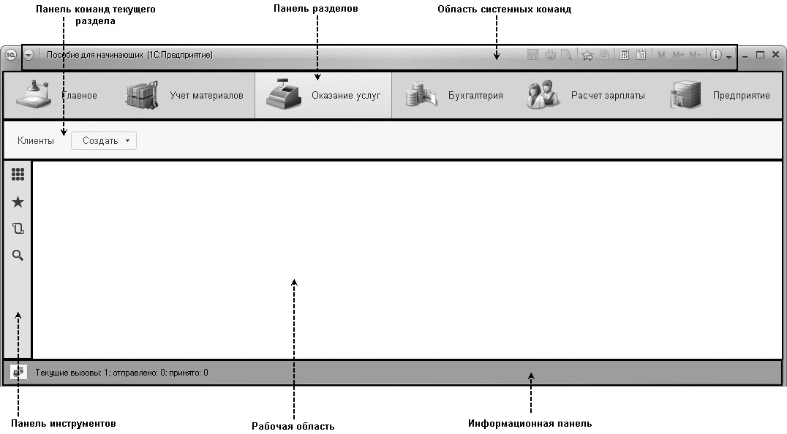

<strong>Рис. 3.26.</strong> Окно «1С:Предприятия»

Панель команд текущего раздела содержит команды, соответствующие выделенному разделу. В начале панели расположены
	команды, позволяющие открыть какие-либо списки, а затем команды, позволяющие создать новые элементы данных,
	сформировать какой-нибудь отчет или выполнить обработку. 

В окне настройки командного интерфейса подсистемы Оказа- ниеУслуг (см. рис. 3.24) в группе команд Панель
	навигации.Обычное мы оставили без изменения видимость команды для открытия справочника Клиенты. Также эта команда по
	умолчанию доступна и в подсистеме Бухгалтерия. Поэтому при выборе соответствующих разделов прикладного решения в
	панели команд этих разделов мы видим команду для открытия нашего первого списка – Клиенты.

Обратите внимание, что название команды Клиенты определяется свойством Представление списка, которое мы задали для
	этого справочника. Если это свойство не задано, то для представления списка используется значение синонима объекта
	конфигурации Справочник. 

Команды, с помощью которых можно выполнить какие-то другие действия (кроме открытия списков) в данном разделе,
	объединены в стандартные группы, представленные в виде подменю: Создать, Отчеты, Сервис и группы, созданные
	разработчиком. Подменю Создать включает в себя команды создания новых объектов базы данных, например, документов или
	элементов справочников. 

Мы видим, что в разделе Оказание услуг рядом с командой Клиенты появилось подменю Создать (см. рис. 3.26). В этом
	подменю содержится команда для создания элементов нашего первого справочника Клиенты, которую мы сделали видимой в
	интерфейсе этого раздела (в группе команд Панель действий.Создать, см. рис. 3.24). Этой командой мы и воспользуемся
	для создания новых элементов справочника, не открывая при этом списка клиентов. 

Обратите внимание, что название стандартной команды создания нового элемента Клиент определяется свойством
	Представление объекта, которое мы задали для этого справочника. Если бы мы это свойство не задали, то в названии
	команды использовался бы синоним объекта конфигурации Справочник Клиенты – Клиенты. Это неудобно, так как ничем не
	отличается от команды открытия списка, и не совсем верно, ведь при создании элемента справочника мы создаем только
	одного нового клиента. 

Заметьте, что у других разделов прикладного решения панель команд пуста, так как для этих подсистем мы не
	устанавливали возможность отображения справочника Клиенты.

Создание элементов справочника

Пока наш справочник пуст, поэтому добавим в него несколько элементов. Для этого в панели команд раздела Оказание
	услуг раскроем подменю Создать и выполним команду Клиент.

Перед нами откроется форма для создания элемента справочника 

(рис. 3.27). 

Внесем Ф. И. О. нового клиента Иванов Михаил Юрьевич. Код вносить не будем, так как он генерируется
	автоматически. 

Нажмем Записать и закрыть. 

<strong>Рис. 3.27.</strong> Создание нового элемента справочника

При этом в правом нижнем углу экрана появится информационное сообщение о том, какой элемент был создан либо изменен.
	Это позволяет не пользоваться списком для того, чтобы убедиться, что нужный элемент записан.

Добавим еще одного клиента с Ф. И. О. Роман. 

Последнего клиента с Ф. И. О. Спиридонова Галина добавим, пользуясь формой списка клиентов. 

Для этого выполним команду Клиенты, расположенную в панели команд раздела Оказание услуг. После этого откроется форма
	списка клиентов (рис. 3.28).

Добавить новый элемент в справочник можно при помощи кнопки Создать в командной панели формы или клавишей
	Insert. 

Нажмем кнопку Создать. 

Обратите внимание, что поле Ф. И. О. при вводе нового клиента подсвечено красным пунктиром. Это значит, что для этого
	поля по умолчанию выполняется проверка заполнения. Если это поле оставить пустым и попытаться записать клиента, то
	будет получено сообщение об ошибке (рис. 3.29).

<strong>Рис. 3.28.</strong> Основная форма списка клиентов

<strong>Рис. 3.29.</strong> Сообщение об ошибке при вводе нового элемента справочника

Так происходит потому, что система автоматически устанавливает проверку заполнения у некоторых стандартных реквизитов
	объектов, например у наименования справочника (если основное представление справочника в виде наименования). 

Внесем Ф. И. О. клиента – Спиридонова Галина. 

После добавления элементов справочник будет выглядеть следующим образом (рис. 3.30). 

Чтобы открыть существующий элемент справочника для редактирования, нужно дважды щелкнуть на нем мышью. 

Для быстрого доступа к недавно открытым, созданным или отредактированным объектам базы данных (документам, элементам
	справочников и др.) можно воспользоваться историей работы пользователя, которую сохраняет «1С:Предприятие». Команда
	для открытия <em>панели истории</em> находится в <em>панели инструментов</em> (рис. 3.31). 

Из панели истории можно быстро открыть недавно созданный объект базы данных (например, элемент справочника) или
	выполнить команду прикладного решения. Если список истории достаточно большой, то можно воспользоваться строкой
	поиска, находящейся вверху формы.

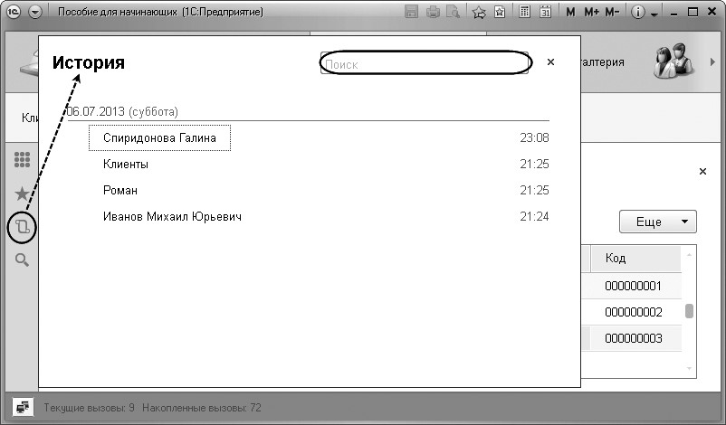

<strong>Рис. 3.31.</strong> Форма истории работы пользователя

Однако для начинающих разработчиков может быть удобнее, чтобы панель истории была всегда открыта. 

Настройка отображения панелей прикладного решения

По умолчанию панель истории не отображается в интерфейсе приложения. Пользователь может самостоятельно включить
	отображение этой панели в режиме 1С:Предприятие (Главное меню  Вид  Настройка панелей…). Или это может сделать
	разработчик в конфигураторе. Воспользуемся для примера второй возможностью.

В режиме «Конфигуратор»

Закроем приложение и вернемся в конфигуратор. Выделим корень дерева объектов конфигурации ПособиеДляНачинающих,
	нажатием правой кнопки мыши вызовем контекстное меню и выберем пункт Открыть интерфейс клиентского приложения (рис.
	3.32). 

В появившемся окне Интерфейс клиентского приложения справа находится список всех стандартных панелей прикладного
	решения. Перетащим элемент Панель истории в левую часть окна, в группу Низ (рис. 3.33). 

<strong>Рис. 3.33.</strong> Настройка расположения панелей прикладного решения

Соответственно, если какая-то панель не должна отображаться в прикладном решении по замыслу разработчика, достаточно
	перетащить ее из левого списка направо или нажать кнопку Удалить в командной панели окна. Перетаскиванием мышью в
	различные группы (Лево, Право и т. п.) левого списка можно поменять расположение видимых панелей в окне прикладного
	решения.

В режиме «1С:Предприятие»

Запустим «1С:Предприятие» в режиме отладки и увидим, что в нижней части окна приложения отображается панель истории
	работы пользователя. Нажав на ссылку в этой панели, мы можем открыть для редактирования один из последних измененных
	элементов справочника (рис. 3.34).

<strong>Рис. 3.34.</strong> Вызов клиентов из панели истории работы пользователя

Теперь уберем отображение этой панели в режиме 1С:Предприятие, так как постоянно панель истории на экране нам не
	нужна, она только будет занимать лишнее место. Для этого выполним команду главного меню приложения Вид  Настройка
	панелей… (рис. 3.35). 

В открывшемся окне Редактор панелей перетащим мышью панель истории в невидимую область, выделенную серым цветом,
	внизу окна (рис. 3.36). 

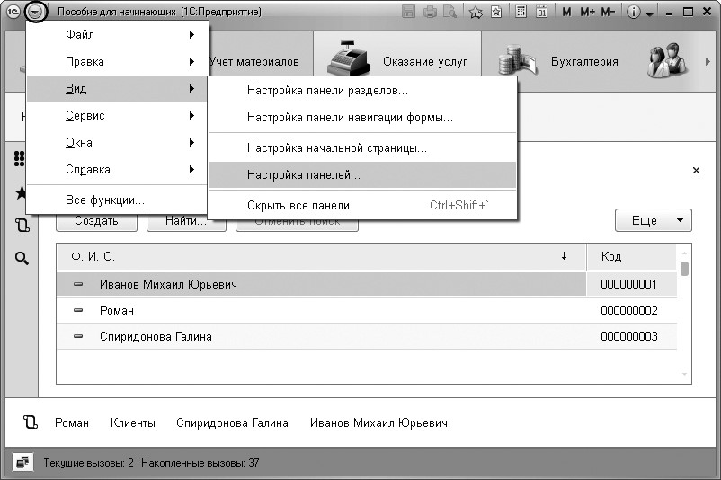

<strong>Рис. 3.35.</strong> Вызов настройки расположения панелей прикладного решения

Нажмем ОК. В результате панель станет невидимой в окне прикладного решения, но она всегда может быть открыта в виде
	отдельной формы из панели инструментов при нажатии кнопки . 

Путем перетаскивания мышью можно не только изменить видимость любой панели, но и поменять ее расположение в окне
	прикладного решения.

Таким образом, на примере панели истории мы показали возможность настройки отображения панелей прикладного решения в
	режимах Конфигуратор и 1С:Предприятие. При этом необходимо иметь в виду, что настройка панелей в конфигураторе будет
	актуальна для всех пользователей прикладного решения, в то время как настройка панелей в режиме 1С:Предприятие будет
	доступна только тому пользователю, который ее выполнил.

<h1>Лабораторная работа №4 Кассовые операции</h1>

<strong>Порядок выполнения работы </strong>

1. Ознакомьтесь с теоретическими основами в настоящих указаниях и конспектах лекций. 

2. Получите задание у преподавателя. 

3. Сделайте скриншоты (кнопка клавиатуры PrtSc) выполненных заданий в текстовом (Word) файле <em>Фамилия_ЛР</em>

4. Составьте отчет по лабораторной работе. 

5. Отчитайте работу преподавателю.

<strong>Справочник с табличной частью</strong>

Теперь мы можем перейти к созданию второго справочника, который будет использоваться в нашей конфигурации, –
	справочника Сотрудники. 

Этот справочник будет устроен несколько сложнее, чем справочник Клиенты. Дело в том, что в нем мы будем хранить не
	только фамилию, имя и отчество сотрудника, но и информацию о его прошлой трудовой деятельности. 

Эта информация однородна по своей структуре (организация, начало, окончание работы, занимаемая должность), но
	количество предыдущих мест работы у разных сотрудников может быть различным. Поэтому для хранения такой информации
	мы будем использовать табличную часть справочника.

В режиме «Конфигуратор»

Добавим новый объект конфигурации Справочник. Назовем его Сотрудники. 

На основании имени платформа автоматически заполнит его синоним. 

Зададим Представление объекта как Сотрудник. 

Представление списка устанавливать не будем, а Расширенное представление списка зададим как Список сотрудников (рис.
	3.37).

<strong>Рис. 3.37.</strong> Установка основных свойств справочника 

Нажмем кнопку Далее и перейдем на закладку Подсистемы. 

По логике нашей конфигурации список сотрудников должен быть доступен в разделах Оказание услуг и Расчет зарплаты.
	Действительно, при оказании услуг должен быть указан сотрудник, оказавший эти услуги, и по результатам этой работы
	мы будем начислять зарплату каждому сотруднику. 

Поэтому отметим в списке подсистем Оказание услуг и Расчет зарплаты (рис. 3.38).

Перейдем на закладку Данные. Оставим по умолчанию длину и тип кода, длину наименования справочника зададим равной 50
	символам. 

Здесь, также как и для предыдущего справочника, изменим свойство Синоним стандартного реквизита Наименование, так как
	речь идет о сотрудниках.

Для этого нажмем внизу окна кнопку Стандартные реквизиты. Выделим в списке реквизит Наименование и двойным щелчком
	мыши откроем его палитру свойств. Установим свойство Синоним как Ф. И. О. (рис. 3.39).

<strong>Рис. 3.38.</strong> Определение списка подсистем, в которых отображается справочник

Табличная часть

Наша задача – создать справочник, имеющий табличную часть. Поэтому добавим в справочник новую табличную часть с
	именем ТрудоваяДеятельность. 

Для этого нажмем кнопку Добавить табличную часть над списком табличных частей справочника (рис. 3.40). 

Зададим имя табличной части – ТрудоваяДеятельность (рис. 3.41).

Создадим реквизиты табличной части ТрудоваяДеятельность. 

Для этого нажмем кнопку Добавить реквизит над списком табличных частей справочника (рис. 3.42):

Добавим следующие реквизиты:

<ul>
	<li>Организация – тип Строка, длина 100;</li>
	<li>НачалоРаботы – тип Дата, состав даты – Дата;  ОкончаниеРаботы – тип Дата, состав даты – Дата;  Должность – тип
		Строка, длина 100.
	</li>
</ul>

<strong>Рис. 3.42.</strong> Добавление нового реквизита в табличную часть справочника

Для реквизитов НачалоРаботы и ОкончаниеРаботы мы выбрали состав даты – Дата (рис. 3.43), поскольку в системе
	«1С:Предприятие» значения типа Дата содержат как дату, так и время. В данном случае время начала и окончания работы
	нам безразлично.

В заключение отредактируем командный интерфейс раздела РасчетЗарплаты, чтобы нам было удобнее вводить новые элементы
	справочника. Сделаем видимой стандартную команду для создания новых сотрудников. 

Для этого откроем окно редактирования объекта конфигурации Подсистема РасчетЗарплаты и нажмем кнопку Командный
	интерфейс. В открывшемся окне Командный интерфейс отразятся все команды этой подсистемы. 

В группе Панель действий.Создать включим видимость у команды Сотрудник: создать. 

Также мы видим, что в группу Панель навигации.Обычное добавилась команда Сотрудники для открытия этого списка. Она
	включена по умолчанию (рис. 3.44).

Для подсистемы ОказаниеУслуг никаких команд добавлять не будем, так как вряд ли понадобится пополнять список
	сотрудников, находясь в этом разделе.

На этом создание справочника Сотрудники завершено. 

Закроем окно редактирования справочника Сотрудники и запустим «1С:Предприятие» в режиме отладки. 

<strong>Рис. 3.44.</strong> Окно настройки командного интерфейса подсистемы

Ответим утвердительно на запрос конфигуратора об обновлении конфигурации и увидим окно, содержащее список изменений в
	структуре конфигурации, автоматически сгенерированный платформой. 

В данном случае мы добавили справочник Сотрудники. Нажмем кнопку Принять (рис. 3.45).

<strong>Рис. 3.45.</strong> Список изменений в структуре конфигурации

В режиме «1С:Предприятие»

В открывшемся окне «1С:Предприятия» мы видим, что в панелях команд разделов Оказание услуг и Расчет зарплаты
	появилась команда Сотрудники для открытия списка сотрудников (рис. 3.46).

Название этой команды определяется синонимом объекта, так как Представление списка мы для этого справочника не
	задавали. 

Кроме того, в панели команд раздела Расчет зарплаты появилось подменю Создать, содержащее команду Сотрудник, для
	создания новых сотрудников (см. рис. 3.46). Название этой команды определяется свойством Представление объекта,
	которое мы задали для этого справочника. 

Этой командой мы и воспользуемся для создания новых элементов справочника, не открывая при этом списка
	сотрудников.

Заполнение табличной части

Выполним команду Сотрудник. 

Перед нами откроется форма для создания элемента справочника. Заголовок этой формы определяется свойством
	Представление объекта. 

Эта форма содержит табличную часть с реквизитами, которые мы описали в конфигураторе для этого справочника.

Создадим следующих сотрудников (рис. 3.47, 3.48, 3.49):

 Гусаков Николай Дмитриевич. Трудовая деятельность:

 □ Организация – ЗАО «НТЦ», 

□ Начало работы – 01.02.2009, □ Окончание работы – 16.04.2012, □ Должность – Ведущий специалист.  Деловой Иван
	Сергеевич.

Трудовая деятельность:

□ 1:

○ Организация – ООО «Автоматизация», 

○ Начало работы – 22.01.2006, ○ Окончание работы – 31.12.2012, 

○ Должность – Инженер. □ 2:

○ Организация – ЗАО «НПО СпецСвязь», 

○ Начало работы – 20.06.1996, ○ Окончание работы – 21.01.2005, 

○ Должность – Начальник производства.  Симонов Валерий Михайлович.

Трудовая деятельность:

 □ Организация – ООО «СтройМастер», 

□ Начало работы – 06.02.2009, □ Окончание работы – 03.04.2012, □ Должность – Прораб.

Строки табличной части справочника можно добавлять кнопкой Добавить, Insert или просто перемещением курсора вниз из
	последней строки таблицы (рис. 3.47).

<strong>Рис. 3.47.</strong> Заполнение элемента справочника «Сотрудники»

Если табличная часть состоит из нескольких строк, то расположить их в произвольном порядке можно путем перетаскивания
	мышью в нужное место или с помощью команд Переместить вверх, Переместить вниз из подменю Еще, находящегося в
	командной панели таблицы. Для того чтобы удалить только что созданную пустую строку табличной части, достаточно
	просто установить курсор на другую, заполненную строку таблицы.

<strong>Рис. 3.48.</strong> Заполнение элемента справочника «Сотрудники»

<strong>Рис. 3.49.</strong> Заполнение элемента справочника «Сотрудники»

Чтобы просмотреть список добавленных сотрудников, выполним команду Сотрудники. 

Откроется форма списка сотрудников. 

Обратите внимание, что заголовок этой формы определяется свойством Расширенное представление списка, которое мы
	задали 

<strong>Рис. 3.50.</strong> Список сотрудников

Теперь мы можем приступить к созданию следующего справочника – Номенклатура.

<strong>Иерархический справочник</strong>

Справочник Номенклатура будет содержать информацию об услугах, которые оказывает ООО «На все руки мастер», и о тех
	материалах, которые при этом могут быть использованы.

Этот справочник не будет сложным. Единственная особенность, которой он будет обладать, – наличие иерархической
	структуры. Для того чтобы справочником было удобно пользоваться, мы сгруппируем услуги в одну группу, а материалы –
	в другую. 

Кроме этого, поскольку ООО «На все руки мастер» оказывает самые разные услуги, они также будут логически собраны в
	несколько групп. То же самое можно сказать и про материалы.

В режиме «Конфигуратор»

Создадим новый объект конфигурации Справочник и назовем его Номенклатура. На основании имени платформа автоматически
	заполнит его синоним. 

Поскольку понятие Номенклатура не имеет единственного числа, больше никаких свойств, определяющих представление
	объекта в интерфейсе приложения, задавать не будем. Вместо Представления объекта и Представления списка будет
	использоваться Синоним объекта – Номенклатура.

Перейдем на закладку Подсистемы. 

По логике нашей конфигурации список номенклатуры должен быть доступен в разделах Учет материалов, Оказание услуг и
	Бухгалтерия. Действительно, к первым двум разделам этот справочник имеет прямое отношение, а для бухгалтерского
	анализа всегда может понадобиться список материалов и услуг. Поэтому отметим в списке подсистем эти подсистемы (рис.
	3.51).

Наша задача состоит в создании иерархического справочника. Перейдем на закладку Иерархия и установим флажок
	Иерархический справочник (рис. 3.52).

<strong>Рис. 3.51.</strong> Определение списка подсистем, в которых отображается справочник

На закладке Данные оставим по умолчанию длину и тип кода, длину наименования справочника зададим равной 100
	символам. 

Здесь же изменим Синоним стандартного реквизита Родитель нашего справочника на более понятное обозначение. Для этого
	нажмем внизу окна кнопку Стандартные реквизиты. Выделим в списке реквизит Родитель и двойным щелчком мыши откроем
	его палитру свойств. Установим свойство Синоним как Группа номенклатуры 

(рис. 3.53).

Прежде чем запускать «1С:Предприятие», настроим интерфейс приложения, чтобы нам было удобнее вводить новые элементы
	справочника. Сделаем доступной в панели команд разделов УчетМатериалов и ОказаниеУслуг стандартную команду для
	создания новых элементов списка номенклатуры. 

Для этого в дереве объектов конфигурации выделим ветвь Подсистемы, вызовем ее контекстное меню и выберем пункт Все
	подсистемы (рис. 3.54).

В открывшемся окне слева в списке Подсистемы выделим подсистему УчетМатериалов. 

Справа в списке Командный интерфейс отразятся все команды выбранной подсистемы. 

В группе Панель действий.Создать включим видимость у команды Номенклатура: создать. 

Также мы видим, что в группу Панель навигации.Обычное добавилась команда Номенклатура для открытия этого списка. Она
	включена по умолчанию (рис. 3.55).

<strong>Рис. 3.55.</strong> Окно настройки подсистем

Выделив в списке подсистем ОказаниеУслуг, проделаем те же действия. 

А для подсистемы Бухгалтерия никаких команд добавлять в панель действий не будем, так как вряд ли понадобится
	пополнять список номенклатуры, находясь в этом разделе.

<strong>пРиМеЧАние</strong>

Вызвать и настроить фрагмент командного интерфейса для конкретной подсистемы можно также из окна редактирования этой
	подсистемы, нажав кнопку Командный интерфейс. Но в случае, когда нужно настроить командный интерфейс сразу для
	нескольких подсистем, удобнее пользоваться редактором Все подсистемы.

Теперь заполним справочник Номенклатура. В процессе заполнения мы покажем, как создавать группы и переносить элементы
	из одной группы в другую. 

Закроем окно редактирования справочника Номенклатура и запустим «1С:Предприятие» в режиме отладки. 

Ответим утвердительно на запрос конфигуратора об обновлении конфигурации и увидим окно, содержащее список изменений в
	структуре конфигурации, автоматически сгенерированный платформой. В данном случае мы добавили справочник
	Номенклатура. 

Нажмем кнопку Принять (рис. 3.56).

<strong>Рис. 3.56.</strong> Список изменений в структуре конфигурации

В режиме «1С:Предприятие»

В открывшемся окне «1С:Предприятия» мы видим, что в панелях команд разделов Учет материалов, Оказание услуг и
	Бухгалтерия появилась команда Номенклатура для открытия списка номенклатуры 

(рис. 3.57). 

Название этой команды определяется синонимом объекта, так как других представлений мы для этого справочника не
	задавали. 

Выполним команду Номенклатура в разделе Учет материалов. 

Откроется форма списка номенклатуры. 

Создание элементов в иерархическом справочнике 

Создадим две группы в корне справочника: Материалы и Услуги. 

Для этого нажмем кнопку Создать группу в командной панели формы списка (рис. 3.57).

<strong>Рис. 3.57.</strong> Создание групп справочника «Номенклатура»

Зададим наименование групп: Материалы, Услуги. Поля Группа номенклатуры и Код заполнять не будем.

Затем двойным щелчком мыши раскроем группу Материалы и создадим в ней пять элементов:

<ul>
	<li>Строчный трансформатор Samsung,</li>
	<li>Строчный трансформатор GoldStar,</li>
	<li>Транзистор Philips 2N2369,</li>
	<li>Шланг резиновый,</li>
	<li>Кабель электрический.</li>
</ul>

Для добавления элемента в открытую группу справочника нажмем кнопку Создать в командной панели формы списка
	справочника. 

Перед нами откроется форма для создания элемента справочника. Причем если новый элемент добавляется из формы списка в
	некоторую открытую группу, то система автоматически подставляет в качестве группы номенклатуры текущую группу (рис.
	3.58).

<strong>Рис. 3.58.</strong> Создание элементов в группе «Материалы»

Для создания нового элемента справочника можно также воспользоваться командой Номенклатура, которая появилась в
	разделах Учет материалов и Оказание услуг в подменю Создать. 

В этом случае, если элемент добавляется командой из панели команд текущего раздела, она никак не связана со списком
	номенклатуры. Поэтому система не знает, в какую группу добавлять элемент, и группу номенклатуры нужно указывать
	вручную (рис. 3.59).

<strong>Рис. 3.59.</strong> Создание элементов в группе «Материалы»

Причем при выборе значения в поле Группа номенклатуры можно воспользоваться удобной возможностью поиска по строке
	нужного значения из справочника. Достаточно ввести первые несколько букв искомого наименования, и подходящее
	значение будет предложено для выбора.

При создании новых материалов или услуг список номенклатуры открывать необязательно. Факт добавления элемента в
	справочник отражается в сообщении в нижнем углу экрана.

Затем раскроем группу Услуги и тоже создадим в ней несколько элементов – услуги по ремонту телевизоров (рис.
	3.60). 

<ul>
	<li>Диагностика,</li>
	<li>Ремонт отечественного телевизора,  Ремонт импортного телевизора.</li>
</ul>

И услуги по установке стиральных машин:

<ul>
	<li>Подключение воды,</li>
</ul>

<strong>Рис. 3.60.</strong> Создание элементов в группе «Услуги»

Перенос элементов в другие группы

Теперь разнесем услуги по двум смысловым группам: услуги по ремонту телевизоров и услуги по установке стиральных
	машин. 

Для этого в группе Услуги создадим еще две группы: Телевизоры и Стиральные машины (рис. 3.61).

Для того чтобы переместить услуги в соответствующие группы, можно мышью перетащить выделенный элемент справочника в
	нужную группу или выполнить команду Переместить в группу из подменю Еще, находящегося в командной панели формы
	списка. 

Можно также открыть для редактирования выделенный элемент справочника и изменить поле Группа номенклатуры (рис.
	3.62).

<strong>Рис. 3.61.</strong> Создание новых групп в группе «Услуги»

Переместим в группу Телевизоры услуги Диагностика, Ремонт отечественного телевизора и Ремонт импортного
	телевизора. 

Услуги Подключение воды и Подключение электричества переместим в группу Стиральные машины.

Затем в группе Материалы создадим две группы: Радиодетали и Прочее. В группу Прочее поместим Кабель электрический и
	Шланг резиновый. Остальные материалы переместим в группу Радиодетали.

На этом примере покажем, как создавать недостающие элементы справочников во время их выбора в других полях. 

Откроем элемент Кабель электрический из группы Материалы. Нам нужно заменить значение в поле Группа номенклатуры на
	Прочее. Но такой группы номенклатуры еще нет. В окне выбора значения нажмем кнопку Создать со знаком +. Таким
	образом, платформа «понимает», что мы хотим добавить новую группу, и открывает форму для создания группы справочника
	(рис. 3.63). 

Введем в этой форме наименование группы Прочее, выберем в качестве поля Группа номенклатуры для новой группы уже
	имеющеюся группу Материалы и нажмем Записать и закрыть. После этого внутри группы Материалы будет создана группа
	Прочее, и ссылка на нее будет подставлена в поле Группа номенклатуры для элемента номенклатуры Кабель
	электрический.

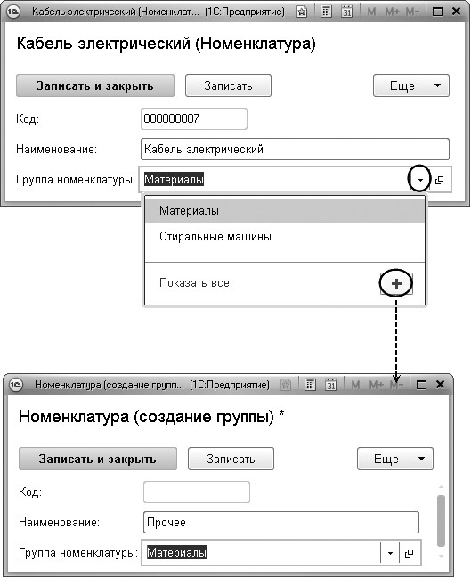

<strong>Рис. 3.63.</strong> Создание группы номенклатуры при выборе в поле «Группа номенклатуры»

Представим теперь список номенклатуры в виде дерева. Для этого из подменю Еще в командной панели формы списка
	номенклатуры вызовем пункт Режим просмотра и выберем режим Дерево. В результате список номенклатуры будет выглядеть
	следующим образом 

(рис. 3.64).

<strong>Рис. 3.64.</strong> Список номенклатуры в виде дерева

<h1>Лабораторная работа № 5 Банковские операции</h1>

<strong>Порядок выполнения работы </strong>

1. Ознакомьтесь с теоретическими основами в настоящих указаниях и конспектах лекций. 

2. Получите задание у преподавателя. 

3. Сделайте скриншоты (кнопка клавиатуры PrtSc) выполненных заданий в текстовом (Word) файле <em>Фамилия_ЛР</em>

4. Составьте отчет по лабораторной работе. 

5. Отчитайте работу преподавателю.

<strong>Справочник с предопределенными элементами</strong>

В заключение мы создадим справочник Склады, который будет содержать информацию о складах, используемых ООО «На все
	руки мастер». 

Этот справочник будет включать в себя один предопределенный элемент – склад Основной, на который будут поступать все
	материалы. 

Наша задача – создать справочник, содержащий предопределенные элементы. 

В режиме «Конфигуратор»

Откроем конфигуратор и создадим новый объект конфигурации Справочник с именем Склады. На основании имени платформа
	автоматически заполнит его синоним. 

Зададим Представление объекта как Склад. Вместо свойства Представления списка будет использоваться Синоним объекта –
	Склады (рис. 3.65).

Перейдем на закладку Подсистемы. 

По логике нашей конфигурации список складов должен быть доступен в разделах Оказание услуг и Учет материалов, так как
	поступление материалов и оказание услуг, как правило, учитываются в разрезе складов. Поэтому отметим в списке
	подсистем эти подсистемы (рис. 3.66).

<strong>Рис. 3.66.</strong> Определение списка подсистем, в которых отображается справочник

Свойство «Быстрый выбор»

Заполним еще одно свойство справочника Склады – Быстрый выбор. Для этого перейдем на закладку Поле ввода и установим
	соответствующий флажок (рис. 3.67).

Дело в том, что по умолчанию при нажатии кнопки выбора поле, содержащем ссылку на элемент справочника, открывается
	форма выбора элемента справочника. Она может быть не всегда удобна, особенно в том случае, когда справочник
	неиерархический и заведомо содержит небольшое количество элементов.

Свойство Быстрый выбор как раз позволяет выбирать элементы не из отдельной формы, а из небольшого выпадающего списка,
	заполненного элементами этого справочника (рис. 3.68).

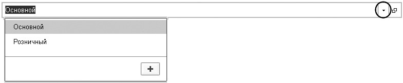

<strong>Рис. 3.68.</strong> Выбор склада из выпадающего списка

Этот вариант наиболее удобен для списка складов, так как их, вероятно, будет немного. 

Для остальных справочников свойство Быстрый выбор мы не устанавливали, так как Номенклатура – иерархический
	справочник, и, следовательно, быстрый выбор для него не имеет смысла. А список сотрудников и, особенно, список
	клиентов может быть очень большим, и выпадающий список в этом случае будет неудобно прокручивать.

Предопределенные элементы

Перейдем на закладку Прочее и нажмем кнопку Предопределенные. Система откроет список предопределенных элементов
	справочника. 

Сейчас он пуст, поэтому нажмем кнопку Добавить и создадим предопределенный элемент с именем Основной (рис. 3.69).

Обратите внимание на то, что помимо наименования мы задали еще и <em>имя</em> предопределенного элемента справочника.

<strong>Рис. 3.69.</strong> Заполнение предопределенного элемента справочника

В дальнейшем, когда мы будем использовать встроенный язык, мы сможем обратиться к этому элементу справочника,
	используя имя, присвоенное ему в конфигураторе. Дело в том, что наименование предопределенного элемента справочника
	пользователь может изменить, а имя пользователь не видит и изменить не может.

Прежде чем запускать «1С:Предприятие», настроим интерфейс приложения, чтобы нам было удобнее вводить новые элементы
	справочника. В разделе Учет материалов сделаем доступной стандартную команду для создания новых складов. 

Для этого откроем окно редактирования объекта конфигурации Подсистема УчетМатериалов и нажмем кнопку Командный
	интерфейс. В открывшемся окне Командный интерфейс отразятся все команды этой подсистемы. 

В группе Панель действий.Создать включим видимость у команды Склад: создать. 

Также мы видим, что в группу Панель навигации.Обычное добавилась команда Склады для открытия этого списка. Она
	включена по умолчанию (рис. 3.70).

Закроем окно редактирования справочника Склады и запустим «1С:Предприятие» в режиме отладки. 

Ответим утвердительно на запрос конфигуратора об обновлении конфигурации и увидим окно, содержащее список изменений в
	структуре конфигурации, автоматически сгенерированный платформой. В данном случае мы добавили справочник
	Склады. 

Нажмем кнопку Принять (рис. 3.71).

<strong>В режиме «1С:Предприятие»</strong>

В открывшемся окне «1С:Предприятия» мы видим, что в разделе Учет материалов в подменю Создать добавилась команда
	Склад для создания новых складов (рис. 3.72).

Название этой команды определяется синонимом объекта конфигурации, так как Представление списка мы для этого
	справочника не задавали.

Кроме того, в разделах Оказание услуг и Учет материалов появилась команда Склады для открытия списка складов (см.
	рис. 3.72). Название этой команды определяется свойством Представление объекта, которое мы задали для этого
	справочника. 

Выполним команду Склады в разделе Учет материалов. Откроется форма списка складов. 

В списке складов уже есть один элемент с наименованием Основной. Это предопределенный элемент, который мы создали в
	конфигураторе. 

Выполнив команду Склад из подменю Создать, добавим в справочник еще один склад, который назовем Розничный (рис.
	3.73).

<strong>Рис. 3.73.</strong> Элементы справочника «Склады»

На этом мы завершим подготовительную работу по созданию справочников и сделаем теоретическое отступление, касающееся
	предопределенных элементов и тех вопросов, которые постоянно появляются у вас на экране при запуске и продолжении
	отладки.

<h1>Лабораторная работа № 6 Учетные документы</h1>

<strong>Порядок выполнения работы </strong>

1. Ознакомьтесь с теоретическими основами в настоящих указаниях и конспектах лекций. 

2. Получите задание у преподавателя. 

3. Сделайте скриншоты (кнопка клавиатуры PrtSc) выполненных заданий в текстовом (Word) файле <em>Фамилия_ЛР</em>

4. Составьте отчет по лабораторной работе. 

5. Отчитайте работу преподавателю.

<strong>Документ «Приходная накладная»</strong>

После того как мы познакомились с объектом конфигурации Документ, создадим несколько таких объектов, чтобы иметь
	возможность фиксировать события, происходящие в нашем ООО «На все руки мастер».

Одними из самых популярных услуг нашего предприятия является ремонт телевизоров и установка стиральных машин. И в
	том, и в другом случае требуются некоторые материалы, которые расходуются в процессе оказания этих услуг. Поэтому
	двумя важнейшими событиями в хозяйственной жизни нашей организации будут являться поступление материалов и оказание
	услуг. 

Для отражения этих событий в базе данных мы создадим два документа: Приходная накладная и Оказание услуги. 

Документ Приходная накладная будет фиксировать факт поступления в нашу организацию необходимых материалов, а документ
	Оказание услуги – фиксировать оказание услуг и расход материалов, которые используются при оказании этих услуг.

В режиме «Конфигуратор»

Добавление документа

Откроем конфигуратор и добавим новый объект конфигурации Документ. На закладке Основные зададим имя документа –
	ПриходнаяНакладная. На основании имени платформа автоматически заполнит его синоним. 

Здесь же определим, как будет представлен документ в интерфейсе «1С:Предприятия». Представление объекта задавать не
	будем, вместо него будет использоваться Синоним объекта. Это нам вполне подходит, так как мы задали его имя в
	единственном числе. 

Представление списка, наоборот, зададим во множественном числе как Приходные накладные (рис. 4.4).

<strong>Рис. 4.4.</strong> Установка основных свойств документа

Нажмем Далее и перейдем на закладку Подсистемы. 

По логике нашей конфигурации список приходных накладных должен быть доступен в разделах Учет материалов и
	Бухгалтерия. Действительно, к первому разделу этот документ имеет прямое отношение, а для бухгалтерского анализа
	всегда может понадобиться список документов, отражающих поступление материалов. 

Поэтому отметим в списке подсистем эти подсистемы (рис. 4.5).

Перейдем на закладку Данные и создадим реквизит документа с именем Склад. Для этого нажмем кнопку Добавить над
	списком реквизитов документа (рис. 4.6).

<strong>Рис. 4.5.</strong> Определение списка подсистем, в которых будет отражаться документ

<strong>Рис. 4.6.</strong> Создание реквизита документа

Реквизиты ссылочного типа

Выберем для реквизита ссылочный тип данных СправочникСсылка.Склады. Этот тип стал доступен в конфигурации после
	создания объекта конфигурации Справочник Склады (рис. 4.7).

<strong>Рис. 4.7.</strong> Свойства реквизита документа

Свойство «Значение заполнения» реквизита объекта конфигурации

Теперь покажем, как можно облегчить жизнь пользователя при приходовании материалов. Работа в автоматизируемой нами
	фирме построена таким образом, что, как правило, все поступающие товары приходуются на основной склад. 

Поэтому в палитре свойств для созданного нами реквизита Склад документа найдем свойство Значение заполнения.

В качестве значения этого свойства выберем предопределенный элемент справочника Склады – Основной.

Таким образом, при создании нового документа склад будет сразу заполняться значением Основной, и пользователю не
	придется делать это вручную (рис. 4.8).

<strong>Рис. 4.9.</strong> Создание новой табличной части документа

Проверка заполнения табличной части

Кроме имени табличной части установим свойство Проверка заполнения в значение Выдавать ошибку. Тем самым мы задаем
	условие, что документ Приходная накладная обязательно должен содержать табличную часть, то есть список приходуемых
	материалов. Иначе будет выдано сообщение об ошибке, и документ не будет сохранен.

Создадим реквизиты табличной части Материалы. Для этого нажмем кнопку Добавить реквизит в разделе описания табличных
	частей документа (рис. 4.10):

<ul>
	<li>Материал, тип СправочникСсылка.Номенклатура;</li>
	<li>Количество, тип Число, длина 15, точность 3, неотрицательное;</li>
	<li>Цена, тип Число, длина 15, точность 2, неотрицательное;</li>
	<li>Сумма, тип Число, длина 15, точность 2, неотрицательное.</li>
</ul>

Для каждого реквизита табличной части также установим свойство 

Проверка заполнения в значение Выдавать ошибку. Тем самым при записи документа будет проверяться на заполнение не
	только табличная часть в целом, но и ее отдельные реквизиты.

<strong>Рис. 4.10.</strong> Создание реквизитов табличной части документа

Перейдем на закладку Нумерация и убедимся, что свойство Автонумерация включено. Это обеспечит автоматическую
	генерацию уникальных номеров для создаваемых нами документов.

В заключение отредактируем командный интерфейс, чтобы в разделе Учет материалов была доступна команда создания новых
	документов. 

Для этого откроем окно редактирования объекта конфигурации Подсистема УчетМатериалов и нажмем кнопку Командный
	интерфейс. В открывшемся окне Командный интерфейс отразятся все команды этой подсистемы. 

В группе Панель действий.Создать включим видимость у команды Приходная накладная: создать (рис. 4.11).

<strong>В режиме «1С:Предприятие»</strong>

Запустим «1С:Предприятие» в режиме отладки и протестируем получившийся документ.

В открывшемся окне «1С:Предприятия» мы видим, что в разделах Бухгалтерия и Учет материалов появилась команда
	Приходные накладные для открытия списка приходных накладных (рис. 4.12). 

Название этой команды определяется свойством Представление списка, которое мы задали для этого документа. 

Кроме того, в разделе Учет материалов в подменю Создать добавилась команда Приходная накладная для создания новых
	документов этого вида. Название этой команды определяется синонимом, так как Представление объекта мы для этого
	документа не задавали (см. рис. 4.12).

Добавление приходных накладных

Пока в нашей базе данных нет ни одного документа Приходная накладная, поэтому выполним команду Приходная накладная из
	подменю Создать в разделе Учет материалов и создадим новую приходную накладную. 

Откроется форма документа. Заголовок этой формы Приходная накладная совпадает с синонимом документа. 

Система автоматически подставит текущую дату создания документа и нулевое время, так как документ еще не проведен. В
	качестве времени документа при оперативном проведении ему присваивается оперативная отметка времени. 

Поле Номер не заполнено, но система сама сгенерирует для нового документа уникальный номер, так как свойство
	Автонумерация для документа включено по умолчанию. Новый номер будет сохранен в момент записи документа.

Обратите внимание, что склад уже заполнен значением Основной, как мы и задали в свойствах этого реквизита. 

Нам осталось только заполнить табличную часть приходной накладной материалами для ремонта телевизоров так, как
	показано на рисунке (рис. 4.13).

<strong>Рис. 4.13.</strong> Создание нового документа «Приходная накладная № 1»

Обратите внимание, что при переходе к еще незаполненной колонке Материал (в табличной части документа) автоматически
	открывается окно выбора значения из справочника Номенклатура, так как этот реквизит имеет ссылочный тип данных и
	ссылается на справочник Номенклатура (см. рис. 4.13). 

Как только мы начнем вводить название материала в это поле, платформа автоматически найдет материалы, наименование
	которых начинается с введенных нами символов, и предложит их нам для выбора. А также при нажатии кнопки Показать все
	открывается форма для выбора элементов этого справочника.

Нажмем Провести и закрыть. 

Документ будет сохранен и проведен, ему будет присвоен автоматически сгенерированный системой номер и текущее время
	проведения документа. 

Аналогичным образом мы создадим второй документ, который будет приходовать на Основной склад материалы для установки
	стиральных машин (рис. 4.14).

<strong>Рис. 4.14.</strong> Создание нового документа «Приходная накладная № 2»

Нажмем Провести и закрыть. 

Документ будет сохранен и проведен, ему будет присвоен автоматически сгенерированный системой номер и текущее время
	проведения документа. 

Обратите внимание, что при вводе нового документа табличная часть в целом и каждая ее колонка подсвечены красным
	пунктиром. Это значит, что для них выполняется проверка заполнения. Если не ввести ни одной строки в табличную часть
	документа или оставить незаполненной какую-либо колонку табличной части и попытаться провести документ, то будет
	получено сообщение об ошибке (рис. 4.15).

Чтобы просмотреть список созданных документов, выполним команду Приходные накладные. 

В форме списка мы видим два созданных нами документа, отмеченных пиктограммой, указывающей на то, что документы
	проведены (зеленая галочка в пиктограмме документа, рис. 4.16).

<strong>Рис. 4.15.</strong> Сообщение об ошибке при вводе нового элемента документа

<strong>Рис. 4.16.</strong> Список приходных накладных

<h1>Лабораторная работа № 7 Оформление банковского поручения</h1>

<strong>Порядок выполнения работы </strong>

1. Ознакомьтесь с теоретическими основами в настоящих указаниях и конспектах лекций. 

2. Получите задание у преподавателя. 

3. Сделайте скриншоты (кнопка клавиатуры PrtSc) выполненных заданий в текстовом (Word) файле <em>Фамилия_ЛР</em>

4. Составьте отчет по лабораторной работе. 

5. Отчитайте работу преподавателю.

<strong>Автоматический пересчет суммы в строках документа</strong>

Наверняка вы обратили внимание на то, что при заполнении документа приходится вводить сумму в каждой строке. Это
	неудобно, и возникает естественное желание автоматизировать работу документа так, чтобы сумма вычислялась
	автоматически каждый раз при изменении цены или количества материалов в строке.

Это совсем не сложно, и для этого нам потребуется сначала создать собственную форму документа, а затем
	воспользоваться возможностями встроенного языка. 

Дело в том, что до сих пор мы использовали предопределенные формы объектов, которые система «1С:Предприятие» по
	умолчанию создавала для нас сама. Теперь же у нас возникла необходимость слегка изменить логику работы формы
	документа, поэтому нам нужно создать свою собственную форму документа ПриходнаяНакладная для того, чтобы в ней с
	помощью встроенного языка описать тот алгоритм, который нам нужен. И система будет использовать нашу форму вместо
	формы по умолчанию.

В режиме «Конфигуратор»

Форма документа

Вернемся в конфигуратор и откроем окно редактирования объекта конфигурации Документ ПриходнаяНакладная. 

В этом окне нас интересует закладка Формы. 

Как мы видим, ни одна из основных форм документа пока не задана. 

Для того чтобы создать форму документа, нажмем кнопку открытия  со значком лупы в поле ввода или
	кнопку Добавить над списком форм (рис. 4.17).

<strong>Рис. 4.17.</strong> Создание формы документа

Система вызовет еще один полезный инструмент разработчика – <em>конструктор формы</em> (рис. 4.18).

Этот инструмент также построен по принципу «мастеров»: ввод данных в определенной последовательности и передвижение
	кнопками Далее и Назад. 

Выберем тип формы Форма документа и нажмем кнопку Готово, согласившись тем самым со всем, что нам предложила
	система 

(см. рис. 4.18).

Обратите внимание, что в дереве объектов конфигурации у объекта конфигурации Документ ПриходнаяНакладная появилась
	форма ФормаДокумента (рис. 4.19), а на экране открылось окно редактора форм, содержащее эту форму (рис. 4.20).

<em>Редактор форм</em> объединяет несколько окон взаимосвязанных между собой редакторов. Мы не будем здесь разбирать
	подробно работу с редактором форм, а коснемся только тех моментов, которые нужны для выполнения простейших действий,
	связанных с нашей задачей. 

<strong>подРобнее</strong>

За более подробной информацией о работе с редактором форм следует обратиться к документации «1С:Предприятие 8.3.
	Руководство разработчика», раздел 26.1 «Редактор формы».

Пока мы рассмотрим только окно формы документа в режиме просмотра, расположенное внизу, и окно редактора элементов
	формы, расположенное слева в верхней части окна редактора форм.

Прежде всего, необходимо понимать, что при разработке форм объектов конфигурации разработчик не имеет возможности
	нарисовать форму. Он может только указать, из каких элементов будет состоять форма, а система уже сама
	самостоятельно расположит эти элементы в форме.

Элементы формы в верхнем левом окне редактора форм образуют иерархическую структуру, из которой следует, что чем выше
	в списке находится элемент, тем выше и левее на форме он будет располагаться. 

Эта структура редактируется на закладке Элементы и позволяет управлять отображением и редактированием данных в
	форме. 

Мы видим, что на основе описания в конфигурации документа ПриходнаяНакладная система создала структуру элементов,
	которая определяет, как будет выглядеть форма. 

Эти элементы имеют разное назначение и разное поведение. Однако все они служат для того, чтобы отображать информацию,
	хранящуюся в базе данных, и организовывать интерактивную работу с этой информацией.

Вы можете попробовать перетащить мышью поля в дереве элементов и поменять местами, например, реквизиты табличной
	части. Результат изменений сразу отразится в форме документа в нижней части редактора форм. При этом разработчику не
	нужно задумываться над вопросами конкретного (до пикселя) расположения того или иного элемента формы, его размеров и
	привязки к другим элементам. Эту работу берет на себя система.

Но разработчик может через палитру свойств изменить свойства элемента, которые повлияют на его отображение в форме.
	Он может также изменить структуру элементов формы – создать новое поле, группу полей, добавить табличную часть,
	связав эти элементы с данными формы. 

Но пока нам ничего этого не нужно делать. Нас интересуют три элемента табличной части: МатериалыКоличество,
	МатериалыЦена и МатериалыСумма (см. рис. 4.20).

Мы хотим, чтобы каждый раз, когда меняется значение в поле Количество или в поле Цена, в поле Сумма автоматически
	устанавливалось значение, равное произведению значений полей Количество и Цена. 

Очевидно, что для этого нужно написать на встроенном языке команду, похожую на Сумма = Количество*Цена, которая будет
	выполняться при изменении значения поля Количество или Цена. Но как «поймать» эти моменты изменения?

Обработчик события

Как мы уже видели, система сама умеет работать с теми объектами, которые описаны в дереве конфигурации: показывать их
	данные, добавлять новые элементы и пр. То есть у нее есть некие «стандартные представления» о том, как это все
	должно работать. 

Но, как правило, разработчиков эти «стандартные представления» устраивают только в самых простых случаях. Реальные
	задачи гораздо разнообразнее. Поэтому у системы существуют <em>события</em>, которые связаны с самыми различными
	моментами ее «стандартного» функционирования. В том числе события, связанные с функционированием форм и элементов,
	расположенных в этих формах. 

Используя встроенный язык, разработчик может «вклиниться» в эти события и описать собственный алгоритм того, что
	должно происходить при наступлении этого события. Что мы сейчас и сделаем.

Дважды щелкнем на элементе формы МатериалыКоличество или правой кнопкой мыши откроем для него палитру свойств (пункт
	контекстного меню Свойства). 

Прокрутив список до конца, мы увидим перечень событий, которые могут быть связаны с этим полем. 

Очевидно, что нам нужно событие ПриИзменении, которое возникает после изменения значения поля. Найдем его в списке
	событий и нажмем кнопку открытия 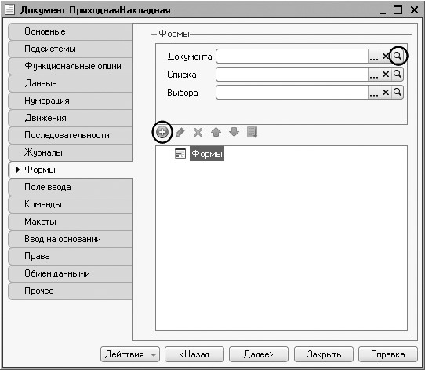 со значком лупы в поле ввода (рис. 4.21).

Система предложит окно для выбора типа обработчика события, который мы хотим создать (рис. 4.22).

Оставим без изменения вариант Создать на клиенте, предложенный по умолчанию. Пока мы не будем более подробно
	рассматривать этот момент.

поля табличной части «Количество»

<strong>Рис. 4.22.</strong> Окно для выбора типа создаваемого обработчика события

После этого система создаст шаблон процедуры <em>обработчика</em> этого события в модуле<em> </em>нашей формы и
	откроет закладку Модуль редактора формы (рис. 4.23).

<em>Модуль</em> – это «хранилище» для текста программы на встроенном языке. Модулей существует несколько, и каждый из
	них предназначен для описания алгоритмов, относящихся к тому или иному моменту работы программы. В данном случае это
	модуль формы, так как обработчики всех интерактивных событий, связанных с элементами формы, помещаются именно в
	модуль формы.

<strong>Рис. 4.23.</strong> Шаблон обработчика события «ПриИзменении» поля табличной части «Количество»

В модуль формы, в процедуру МатериалыКоличествоПриИзменении() мы и добавим следующий текст (листинг 4.1).

<strong>листинг 4.1.</strong> Процедура «МатериалыКоличествоПриИзменении()»

<table>
	<tr>
		<td>
СтрокаТабличнойЧасти = Элементы.Материалы.ТекущиеДанные;
</td>
	</tr>
	<tr>
		<td></td>
	</tr>
	<tr>
		<td>
СтрокаТабличнойЧасти.Сумма = СтрокаТабличнойЧасти.Количество * СтрокаТабличнойЧасти.Цена;
</td>
	</tr>
</table>

Объясним назначение этих строк. 

В первой строке мы сначала создаем переменную СтрокаТабличнойЧасти, в которую будет помещен объект, содержащий
	данные, находящиеся в строке табличной части, которую нам нужно пересчитать. 

Мягкая типизация данных встроенного языка позволяет сделать это, не объявляя переменную и ее тип заранее. Мы создаем
	переменную прямо по ходу работы, и ее тип определяется типом значения, которое она содержит.

Поскольку мы находимся в модуле формы, то в нем доступны все свойства и методы объекта встроенного языка
	УправляемаяФорма. Поэтому мы можем обращаться к ним напрямую. В данном случае после знака равенства мы обращаемся к
	коллекции элементов формы, используя одно из свойств объекта УправляемаяФорма – свойство Элементы.

Коллекция элементов формы является объектом встроенного языка ВсеЭлементыФормы, содержащим все элементы формы. То
	есть это программный аналог корня дерева элементов формы. 

Каждый элемент формы можно получить, указав его имя в качестве свойства этого объекта, то есть через точку от него. В
	данном случае мы обращаемся к табличной части документа Материалы (Элементы.Материалы).

Табличная часть документа представляет собой объект встроенного языка ТаблицаФормы. Получить ту строку, в которой в
	настоящее время осуществляется редактирование, можно при помощи свойства программного объекта ТаблицаФормы –
	ТекущиеДанные (Элементы.Материалы.ТекущиеДанные). 

Таким образом, в результате выполнения первой строки процедуры обработчика переменная СтрокаТабличнойЧасти будет
	содержать объект ДанныеФормыСтруктура. Этот объект содержит данные, находящиеся в текущей строке табличной части
	документа (Элементы.Материалы.ТекущиеДанные).

Получив этот объект, мы можем обратиться к данным конкретной колонки табличной части, указав имя колонки в качестве
	свойства объекта. Например, используя обращение СтрокаТабличнойЧасти.Количество, мы получаем число, которое
	находится в редактируемой строке в колонке Количество. 

Таким образом, во второй строке процедуры обработчика вычисляется значение колонки Сумма как произведение значений
	колонок Количество и Цена. 

<strong>В режиме «1С:Предприятие»</strong>

Теперь посмотрим, как это работает. Запустим «1С:Предприятие» в режиме отладки, откроем список документов Приходные
	накладные и откроем любой из двух созданных нами документов. Если теперь вы поменяете количество в любой строке
	документа, то сумма в строке будет пересчитана автоматически.

Одна процедура для обработки нескольких событий

Итак, мы убедились, что при изменении количества в любой строке документа Приходная накладная сумма в этой строке
	пересчитывается автоматически. 

Замечательно. Но теперь хотелось бы и для поля Цена сделать то же самое. А если заглянуть вперед, то мы увидим, что
	подобное автоматическое заполнение поля Сумма может нам понадобиться и в других документах. 

Поэтому лучше будет поместить расчет суммы в некоторое «общедоступное» место, чтобы разные документы, имеющие
	аналогичные реквизиты табличной части, могли использовать этот алгоритм. 

Для описания таких «общедоступных» мест служат объекты конфигурации <em>Общий модуль</em>, расположенные в ветке
	Общие  Общие модули. Процедуры и функции, содержащиеся в этих модулях, могут быть доступны для любых объектов
	конфигурации. 

Поэтому создадим общий модуль и перенесем в него нашу процедуру расчета суммы. А в документе просто оставим вызовы
	этой процедуры из общего модуля.

В режиме «Конфигуратор»

Общий модуль

Добавим объект конфигурации Общий модуль. 

Для этого раскроем ветвь Общие в дереве объектов конфигурации, нажав на + слева от нее. Затем выделим ветвь Общие
	модули и нажмем кнопку Добавить в командной панели окна конфигурации (рис. 4.24).

Откроется окно для ввода текста модуля и окно палитры его свойств. Дадим имя модулю – РаботаСДокументами и установим
	в его свойствах флажок Клиент (управляемое приложение), а флажок Сервер снимем. Это означает, что экземпляры этого
	модуля будут скомпилированы в контексте тонкого клиента и в контексте веб-клиента (рис. 4.25).

Внесем в модуль следующий текст (листинг 4.2).

<strong>листинг 4.2.</strong> Процедура «РассчитатьСумму()»

<table>
	<tr>
		<td>
Процедура РассчитатьСумму(СтрокаТабличнойЧасти) Экспорт
</td>
	</tr>
	<tr>
		<td></td>
	</tr>
	<tr>
		<td>
СтрокаТабличнойЧасти.Сумма = 
</td>
	</tr>
	<tr>
		<td></td>
	</tr>
	<tr>
		<td>
СтрокаТабличнойЧасти.Количество * СтрокаТабличнойЧасти.Цена; 
</td>
	</tr>
	<tr>
		<td></td>
	</tr>
	<tr>
		<td>
КонецПроцедуры 
</td>
	</tr>
</table>

Прокомментируем этот код. В процедуру РассчитатьСумму() мы передаем переменную СтрокаТабличнойЧасти, которую мы
	определили в обработчике события ПриИзменении поля Количество. Она содержит данные редактируемой строки табличной
	части документа ПриходнаяНакладная. 

Теперь, используя эту переменную, мы можем получить доступ к данным колонок табличной части и рассчитать сумму как
	произведение цены на количество. 

Ключевое слово Экспорт в заголовке процедуры указывает на то, что эта процедура может быть доступна из других
	программных модулей. 

Теперь в модуле нашей формы изменим текст обработчика МатериалыКоличествоПриИзменении (листинг 4.3).

<strong>листинг 4.3.</strong> Процедура «МатериалыКоличествоПриИзменении()»

<table>
	<tr>
		<td>
&amp;НаКлиенте
</td>
	</tr>
	<tr>
		<td></td>
	</tr>
	<tr>
		<td>
Процедура МатериалыКоличествоПриИзменении(Элемент)
</td>
	</tr>
	<tr>
		<td></td>
	</tr>
	<tr>
		<td>
СтрокаТабличнойЧасти = Элементы.Материалы.ТекущиеДанные;
</td>
	</tr>
	<tr>
		<td></td>
	</tr>
	<tr>
		<td>
<strong>РаботаСДокументами.РассчитатьСумму(СтрокаТабличнойЧасти);</strong>
</td>
	</tr>
	<tr>
		<td></td>
	</tr>
	<tr>
		<td>
КонецПроцедуры
</td>
	</tr>
</table>

Мы видим, что первая строка процедуры осталась без изменений. А во второй строке вместо непосредственного расчета
	суммы мы вызываем процедуру РассчитатьСумму() из общего модуля РаботаСДокументами и передаем ей в качестве параметра
	текущую строку табличной части.

Проверим, как это работает, и убедимся, что ничего не изменилось.

Теперь осталось и для поля Цена установить такой же обработчик. Так как однажды мы уже написали в модуле формы нужную
	нам процедуру, то мы просто могли бы сопоставить ее также и другому событию другого элемента управления,
	расположенного в форме. Однако стандарты разработки конфигураций фирмы «1С» не допускают такого решения.

<strong>УзнАй больше!</strong>

<em>Согласно стандартам разработки фирмы «1С» у каждого события должен быть свой обработчик. Если одинаковые действия
	должны выполняться при изменении разных элементов управления (например, при нажатии нескольких кнопок), то в этом
	случае следует поступать следующим образом: </em>

<ul>
	<li><em>создается отдельная процедура (функция), выполняющая необходимые действия;</em></li>
	<li><em>для каждого элемента управления создается отдельный обработчик с именем, назначаемым по умолчанию;</em></li>
	<li><em>из каждого обработчика вызывается требуемая процедура</em></li>
</ul>

<em>(функция).</em>

Поэтому мы создадим обработчик события ПриИзменении для поля табличной части МатериалыЦена так же, как мы делали это
	для поля МатериалыКоличество, и повторим в нем вызов процедуры РассчитатьСумму из общего модуля (листинг 4.4).

<strong>листинг 4.4.</strong> Процедура «МатериалыЦенаПриИзменении()»

&amp;НаКлиенте

<table>
	<tr>
		<td>
Процедура МатериалыЦенаПриИзменении(Элемент)
</td>
	</tr>
	<tr>
		<td></td>
	</tr>
	<tr>
		<td>
СтрокаТабличнойЧасти = Элементы.Материалы.ТекущиеДанные;
</td>
	</tr>
	<tr>
		<td></td>
	</tr>
	<tr>
		<td>
РаботаСДокументами.РассчитатьСумму(СтрокаТабличнойЧасти);
</td>
	</tr>
	<tr>
		<td></td>
	</tr>
	<tr>
		<td>
КонецПроцедуры
</td>
	</tr>
</table>

<strong>В режиме «1С:Предприятие»</strong>

Запустим «1С:Предприятие» в режиме отладки и убедимся, что теперь сумма в строках табличной части документов
	ПриходнаяНакладная пересчитывается как при изменении количества, так и при изменении цены.

Документ «Оказание услуги»

Теперь мы аналогичным образом создадим второй документ, необходимый нам, – Оказание услуги. Для этого потребуется
	выполнить уже знакомые нам действия, которые мы выполняли по созданию документа Приходная накладная.

В режиме «Конфигуратор»

Добавим новый объект конфигурации Документ и назовем его ОказаниеУслуги. 

На закладке Основные определим, как будет представлен документ в интерфейсе «1С:Предприятия». 

Представление объекта задавать не будем, вместо него будет использоваться Синоним объекта. 

Представление списка зададим как Оказание услуг. На закладке Подсистемы отметим, что документ будет доступен в
	подсистемах Оказание услуг и Бухгалтерия. На закладке Данные создадим реквизиты документа:

<ul>
	<li>Склад, тип СправочникСсылка.Склады. Выберем для свойства Значение заполнения предопределенный элемент Основной
		справочника Склады;
	</li>
	<li>Клиент, тип СправочникСсылка.Клиенты. Установим свойство Проверка заполнения в значение Выдавать ошибку;</li>
	<li>Мастер, тип СправочникСсылка.Сотрудники. Установим свойство Проверка заполнения в значение Выдавать ошибку.</li>
</ul>

Создадим табличную часть этого документа ПереченьНоменклатуры с реквизитами:

<ul>
	<li>Номенклатура, тип СправочникСсылка.Номенклатура;</li>
	<li>Количество, тип Число, длина 15, точность 3, неотрицательное;</li>
	<li>Цена, тип Число, длина 15, точность 2, неотрицательное,</li>
	<li>Сумма, тип Число, длина 15, точность 2, неотрицательное.</li>
</ul>

Установим для табличной части в целом и для каждого ее реквизита свойство Проверка заполнения в значение Выдавать
	ошибку.

На закладке Формы создадим основную форму документа. 

Для поля ПереченьНоменклатурыКоличество создадим обработчик события ПриИзменении (выполняющийся на клиенте), в
	котором будем вызывать процедуру РассчитатьСумму из общего модуля РаботаСДокументами. 

При этом откроется модуль формы с шаблоном обработчика события ПереченьНоменклатурыКоличествоПриИзменении, который мы
	пока заполнять не будем, а перейдем в окно элементов формы на закладку 

Форма и аналогичным образом создадим обработчик события ПереченьНоменклатурыЦенаПриИзменении для поля
	ПереченьНоменклатурыЦена.

Далее модуль формы документа ОказаниеУслуги нужно заполнить следующим образом (листинг 4.5).

<strong>листинг 4.5.</strong> Модуль формы документа «ОказаниеУслуги» 

<table>
	<tr>
		<td>
&amp;НаКлиенте
</td>
	</tr>
	<tr>
		<td></td>
	</tr>
	<tr>
		<td>
Процедура ПереченьНоменклатурыКоличествоПриИзменении(Элемент)
</td>
	</tr>
	<tr>
		<td></td>
	</tr>
	<tr>
		<td>
СтрокаТабличнойЧасти = Элементы.ПереченьНоменклатуры.ТекущиеДанные;
</td>
	</tr>
	<tr>
		<td></td>
	</tr>
	<tr>
		<td>
РаботаСДокументами.РассчитатьСумму(СтрокаТабличнойЧасти);
</td>
	</tr>
	<tr>
		<td></td>
	</tr>
	<tr>
		<td>
КонецПроцедуры
</td>
	</tr>
	<tr>
		<td></td>
	</tr>
	<tr>
		<td></td>
	</tr>
	<tr>
		<td></td>
	</tr>
	<tr>
		<td>
&amp;НаКлиенте
</td>
	</tr>
	<tr>
		<td></td>
	</tr>
	<tr>
		<td>
Процедура ПереченьНоменклатурыЦенаПриИзменении(Элемент)
</td>
	</tr>
	<tr>
		<td></td>
	</tr>
	<tr>
		<td>
СтрокаТабличнойЧасти = Элементы.ПереченьНоменклатуры.ТекущиеДанные;
</td>
	</tr>
	<tr>
		<td></td>
	</tr>
	<tr>
		<td>
РаботаСДокументами.РассчитатьСумму(СтрокаТабличнойЧасти);
</td>
	</tr>
	<tr>
		<td></td>
	</tr>
	<tr>
		<td>
КонецПроцедуры 
</td>
	</tr>
</table>

В заключение отредактируем командный интерфейс, чтобы в разделе Оказание услуг была доступна команда создания новых
	документов. 

Для этого откроем окно редактирования объекта конфигурации Подсистема ОказаниеУслуг и нажмем кнопку Командный
	интерфейс. 

В открывшемся окне отразятся все команды данной подсистемы. 

В группе Панель действий.Создать включим видимость у команды Оказание услуги: создать (рис. 4.26).

lдействий будет 

В режиме «1С:Предприятие»

Запустим «1С:Предприятие» в режиме отладки. 

В разделе Оказание услуг выполним команду создания документа Оказание услуги из подменю Создать и заполним его
	следующим образом (рис. 4.28).

<strong>Рис. 4.28.</strong> Создание документа «Оказание услуги № 1»

Обратите внимание, что склад Основной подставляется по умолчанию, а для полей Мастер и Клиент выполняется проверка
	заполнения. А также при вводе цены и количества в табличную часть документа Оказание услуги сумма пересчитывается по
	нашему алгоритму.

<h1>Лабораторная работа № 8 Расчеты с поставщиками</h1>

<strong>Порядок выполнения работы </strong>

1. Ознакомьтесь с теоретическими основами в настоящих указаниях и конспектах лекций. 

2. Получите задание у преподавателя. 

3. Сделайте скриншоты (кнопка клавиатуры PrtSc) выполненных заданий в текстовом (Word) файле <em>Фамилия_ЛР</em>

4. Составьте отчет по лабораторной работе. 

5. Отчитайте работу преподавателю.

<strong>Добавление регистра накопления</strong>

Теперь, когда мы знаем, для чего предназначены регистры накопления, посмотрим, как можно их использовать в нашем
	примере. 

Прежде всего, нас интересует информация о том, сколько и каких материалов есть у нас на складах. Для накопления такой
	информации мы создадим регистр ОстаткиМатериалов.

В режиме «Конфигуратор»

Откроем в конфигураторе нашу учебную конфигурацию и добавим новый объект конфигурации Регистр накопления. 

Для этого выделим в дереве объектов конфигурации ветвь Регистры накопления и нажмем кнопку Добавить в командной
	панели окна конфигурации.

В открывшемся окне редактирования объекта конфигурации на закладке Основные зададим имя регистра –
	ОстаткиМатериалов. 

Также зададим и Расширенное представление списка как Движения по регистру Остатки материалов. Этот заголовок будет
	отображаться в окне списка записей регистра. 

Нажмем Далее и перейдем на закладку Подсистемы. 

По логике нашей конфигурации данный регистр должен быть доступен в разделах Учет материалов, Оказание услуг и
	Бухгалтерия. Поэтому отметим в списке подсистем эти подсистемы (рис. 6.3).

<strong>Рис. 6.3.</strong> Определение списка подсистем, в которых будет отражаться регистр

Выделим закладку Данные и перейдем к созданию структуры регистра. Создадим измерения регистра:

 Материал, тип СправочникСсылка.Номенклатура;  Склад, тип СправочникСсылка.Склады.

Для этого выделим ветвь Измерения и нажмем кнопку Добавить в командной панели окна (рис. 6.4).

Затем создадим ресурс Количество с длиной 15 и точностью 3. Для этого выделим ветвь Ресурсы и нажмем кнопку Добавить
	в командной панели окна (рис. 6.5).

<strong>Рис. 6.5.</strong> Создание ресурсов регистра

В результате этих действий регистр ОстаткиМатериалов должен иметь следующий вид (рис. 6.6).

<strong>Рис. 6.6.</strong> Регистр «ОстаткиМатериалов»

Если вы сейчас попытаетесь запустить «1С:Предприятие» в режиме отладки, то система выдаст сообщение об ошибке:
	«РегистрНакопления.ОстаткиМатериалов: Ни один из документов не является регистратором для регистра». Это сообщение
	еще раз подтверждает тот факт, что назначение регистра накопления в том, чтобы аккумулировать данные, поставляемые
	различными документами. 

Поэтому мы сформируем движения регистра накопления ОстаткиМатериалов в процессе проведения двух созданных нами
	документов ПриходнаяНакладная и ОказаниеУслуг.

Движения документа

<em>Движения документа</em> – это записи в регистрах, которые создаются в процессе проведения документа и отражают
	изменения, производимые документом. 

Откроем окно редактирования объекта конфигурации Документ 

ПриходнаяНакладная. Перейдем на закладку Движения, раскроем список Регистры накопления и отметим регистр
	накопления

ОстаткиМатериалов (рис. 6.7).

в регистре «ОстаткиМатериалов»

Обратите внимание, что сразу после отметки выбранного регистра становится доступной кнопка Конструктор движений.
	Нажмем ее и воспользуемся этим конструктором.

Конструктор устроен просто. В списке Регистры перечислены регистры, в которых документ может создавать движения. В
	нашем случае там пока один регистр ОстаткиМатериалов. 

В списке Реквизиты документа должны находиться исходные данные для создания движений – реквизиты документа
	ПриходнаяНакладная. 

А в таблице Поле – Выражение должны быть заданы формулы, по которым будут вычисляться значения измерений и ресурсов
	регистра при записи движений (рис. 6.8).

Обратите внимание, что по умолчанию конструктор предлагает нам создавать движения прихода (Тип движения регистра –
	Приход, символ + рядом с названием регистра) по регистру ОстаткиМатериалов. Это нас вполне устраивает, ведь документ
	ПриходнаяНакладная и должен приходовать материалы. 

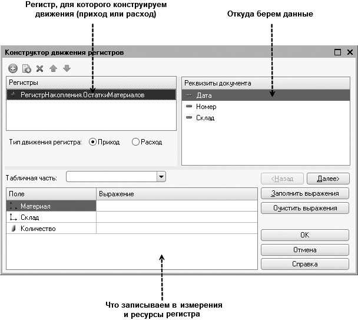

<strong>Рис. 6.8.</strong> Конструктор движений

В поле выбора Табличная часть выберем табличную часть нашего документа – Материалы. 

Список реквизитов документа, который уже заполнен реквизитами шапки документа, автоматически дополнится реквизитами
	нашей табличной части. 

Теперь нажмем кнопку Заполнить выражения. 

В нижнем окне сформируется соответствие полей (измерений и ресурсов) регистра и выражений для их расчета (рис.
	6.9).

Как видите, конструктор движений установил соответствия подходящим образом: в качестве материала в регистр будет
	записан материал из табличной части документа, в качестве склада – склад, указанный в шапке документа, а в качестве
	количества – количество из табличной части документа.

Нажмем кнопку OK и посмотрим, какой текст сформировал конструктор в модуле документа ПриходнаяНакладная (листинг
	6.1).

для расчета движений регистра

<strong>листинг 6.1.</strong> Процедура «ОбработкаПроведения()»

<table>
	<tr>
		<td>
Процедура ОбработкаПроведения(Отказ, Режим)
</td>
	</tr>
	<tr>
		<td></td>
	</tr>
	<tr>
		<td>
//{{__КОНСТРУКТОР_ДВИЖЕНИЙ_РЕГИСТРОВ
</td>
	</tr>
	<tr>
		<td></td>
	</tr>
	<tr>
		<td>
// Данный фрагмент построен конструктором.
</td>
	</tr>
	<tr>
		<td></td>
	</tr>
	<tr>
		<td>
// При повторном использовании конструктора внесенные вручную изменения будут утеряны!!!
</td>
	</tr>
	<tr>
		<td></td>
	</tr>
	<tr>
		<td></td>
	</tr>
	<tr>
		<td></td>
	</tr>
	<tr>
		<td>
// регистр ОстаткиМатериалов Приход
</td>
	</tr>
	<tr>
		<td></td>
	</tr>
	<tr>
		<td>
Движения.ОстаткиМатериалов.Записывать = Истина;
</td>
	</tr>
	<tr>
		<td></td>
	</tr>
	<tr>
		<td>
Для Каждого ТекСтрокаМатериалы Из Материалы Цикл
</td>
	</tr>
	<tr>
		<td></td>
	</tr>
	<tr>
		<td>
Движение = Движения.ОстаткиМатериалов.Добавить();
</td>
	</tr>
	<tr>
		<td></td>
	</tr>
	<tr>
		<td>
Движение.ВидДвижения = ВидДвиженияНакопления.Приход;
</td>
	</tr>
	<tr>
		<td></td>
	</tr>
	<tr>
		<td>
Движение.Период = Дата;
</td>
	</tr>
	<tr>
		<td></td>
	</tr>
	<tr>
		<td>
Движение.Материал = ТекСтрокаМатериалы.Материал;
</td>
	</tr>
	<tr>
		<td></td>
	</tr>
	<tr>
		<td>
Движение.Склад = Склад;
</td>
	</tr>
	<tr>
		<td></td>
	</tr>
	<tr>
		<td>
Движение.Количество = ТекСтрокаМатериалы.Количество;
</td>
	</tr>
	<tr>
		<td></td>
	</tr>
	<tr>
		<td>
КонецЦикла;
</td>
	</tr>
	<tr>
		<td></td>
	</tr>
	<tr>
		<td></td>
	</tr>
	<tr>
		<td></td>
	</tr>
	<tr>
		<td>
//}}__КОНСТРУКТОР_ДВИЖЕНИЙ_РЕГИСТРОВ
</td>
	</tr>
	<tr>
		<td></td>
	</tr>
	<tr>
		<td>
КонецПроцедуры
</td>
	</tr>
</table>

Конструктор создал обработчик события ОбработкаПроведения объекта конфигурации Документ ПриходнаяНакладная, поместил
	его в модуль объекта и открыл текст модуля. 

Событие ОбработкаПроведения является одним из важнейших событий, связанных с документом. Это событие возникает при
	проведении документа. Основное назначение обработчика данного события – генерация движений по документу. Выполнение
	различных операций с данными в процедуре обработчика влияет на состояние учета. Таким образом, именно в эту
	процедуру разработчик должен поместить собственные алгоритмы преобразования данных, выполняемые в момент проведения
	документа.

Поясним текст процедуры обработчика.

Объект встроенного языка ДокументОбъект имеет свойство Движения. Оно возвращает объект КоллекцияДвижений, содержащий
	коллекцию наборов записей регистров, по которым этот документ может формировать движения. 

К конкретному набору записей этой коллекции можно обратиться, указав через точку имя регистра, которому принадлежит
	этот набор записей. Например, Движения.ОстаткиМатериалов. 

Затем через точку можно использовать различные методы набора записей регистра, например,
	Движения.ОстаткиМатериалов.Добавить(). Метод Добавить() добавляет новую запись в набор записей.

В первой строке процедуры мы устанавливаем свойство Записывать набора записей регистра в значение Истина. То есть в
	явном виде указываем, что после завершения обработки проведения платформа должна будет записать этот набор записей в
	базу данных.

Внутри обработчика расположен цикл Для Каждого … Из … Цикл. Он предназначен для перебора строк табличной части нашего
	документа. 

В цикле обращение к табличной части документа происходит по имени (Материалы). Переменная ТекСтрокаМатериалы содержит
	объект с данными текущей строки табличной части документа. Эта переменная создается в начале цикла и меняется по
	мере его прохождения. 

В первой строке тела цикла, используя метод Добавить(), мы добавляем к набору записей, который создает наш документ в
	регистре, новую запись. Тем самым мы создаем объект РегистрНакопленияЗапись и сохраняем его в переменной
	Движение. 

Используя этот объект, мы можем обратиться к полям этой записи, указав имя поля через точку от этой переменной
	(например, Движение.Количество). 

Причем Движение.Материал, Движение.Склад – это измерения регистра, Движение.Количество – это ресурс регистра, а
	Движение.ВидДвижения и Движение.Период – стандартные реквизиты регистра, которые создаются автоматически.

Чтобы присвоить полям новой записи регистра соответствующие значения полей документа, мы обращаемся к полям табличной
	части, указав имя поля через точку от переменной ТекСтрокаМатериалы (например, ТекСтрокаМатериалы.Материал). 

Заметим, что Склад – это реквизит шапки документа, а Дата – стандартный реквизит документа, который создается
	автоматически. Причем в цикле меняются только значения полей табличной части документа – ТекСтрокаМатериалы.Материал
	и ТекСтрокаМатериалы.Количество. Остальные поля не меняются, так как относятся к документу в целом и не зависят от
	текущей строки табличной части документа. 

ВидДвиженияНакопления.Приход – это значение системного перечисления, которое определяет вид движения регистра
	накопления как Приход.

Таким образом, мы присваиваем нужные значения всем полям новой записи. После перебора всех строк документа (после
	завершения цикла) в этом наборе записей (Движения.ОстаткиМатериалов) будет содержаться столько записей, сколько
	строк в табличной части проводимого документа. 

Если мы теперь откроем окно редактирования объекта конфигурации Регистр накопления ОстаткиМатериалов и перейдем на
	закладку Регистраторы, то в списке документов, созданных в конфигурации, мы увидим отмеченный документ
	ПриходнаяНакладная, так как мы задали в модуле этого документа формирование движений в регистре ОстаткиМатериалов
	(рис. 6.10).

В заключение отредактируем командный интерфейс, чтобы в разделах Бухгалтерия, Оказание услуг и Учет материалов была
	доступна ссылка для просмотра записей нашего регистра накопления. 

Дело в том, что команды открытия регистров также добавляются в панель команд разделов, но по умолчанию они невидимы,
	в отличие от команд открытия справочников и документов. 

В дереве объектов конфигурации выделим ветвь Подсистемы, вызовем ее контекстное меню и выберем пункт Все подсистемы.
	В открывшемся окне слева в списке Подсистемы выделим подсистему УчетМатериалов. Справа в списке Командный интерфейс
	отразятся все команды выбранной подсистемы. 

В группе Панель навигации.Обычное включим видимость у команды 

Остатки материалов и мышью перетащим ее в группу Панель 

<strong>Рис. 6.11.</strong> Настройка командного интерфейса подсистем

Тем самым мы переносим команды открытия списка регистров накопления в конец списка подобных команд раздела, так как
	эти команды не так часто используются и их приоритет невысок.

Аналогично, выделив подсистемы ОказаниеУслуг и Бухгалтерия, в группе Панель навигации.Обычное включим видимость у
	команды Остатки материалов и перенесем ее в группу Панель навигации См.также.

В режиме «1С:Предприятие»

Запустим «1С:Предприятие» в режиме отладки и протестируем внесенные нами изменения. 

В открывшемся окне «1С:Предприятия» мы видим, что в панели команд разделов Бухгалтерия, Оказание услуг и Учет
	материалов в конце списка команд для открытия различных списков, перед подменю Создать, Отчеты (если они есть)
	появилась команда для открытия списка регистра Остатки материалов (рис. 6.12).

<strong>Рис. 6.12.</strong> Список регистра накопления «ОстаткиМатериалов»

Чтобы проследить связь между проведением документа и накоплением информации в регистре, откроем список приходных
	накладных, выполнив команду Приходные накладные в разделе Учет материалов. 

Откроем Приходную накладную № 1 и нажмем Провести и закрыть, то есть перепроведем ее. То же самое сделаем для
	Приходной накладной № 2. 

Перепровести документы можно и не открывая документов. Для этого следует выделить нужный документ в списке (или
	выделить мышью группу документов, удерживая клавишу Ctrl), раскрыть подменю Еще в командной панели формы списка и
	выбрать пункт Провести (рис. 6.13).

Теперь выполним команду Остатки материалов и откроем список нашего регистра накопления (рис. 6.14). 

Мы видим, что при проведении приходных накладных появляются соответствующие записи в регистре накопления Остатки
	материалов. Обратите внимание, что добавилось пять записей – первые три после проведения первого документа, что
	соответствует количеству строк в его табличной части, и последние две после проведения второго документа. 

Все поля регистра заполнились данными документов так, как мы задали в обработчике проведения документа
	ПриходнаяНакладная. Пиктограмма со знаком + слева от каждой записи указывает на тип движения – Приход. 

<strong>Рис. 6.14.</strong> Список регистра накопления «ОстаткиМатериалов»

Как мы видим, заголовок формы списка записей регистра соответствует заданному нами в свойстве Расширенное
	представление списка для этого регистра.

<strong>Команда перехода к движениям в форме документа</strong>

В режиме «Конфигуратор»

При реальной работе записей в регистре ОстаткиМатериалов будет много, и будет трудно понять, какие записи относятся к
	определенному документу. 

Поэтому наряду с общим списком регистра хотелось бы иметь возможность вызывать из формы документа список регистра, в
	котором показаны движения, произведенные только этим документом. 

Чтобы реализовать такую возможность, вернемся в конфигуратор и откроем форму документа ПриходнаяНакладная. 

В левом верхнем окне перейдем на закладку Командный интерфейс. 

В разделе Панель навигации раскроем группу Перейти и увидим команду для открытия списка регистра накопления Остатки
	материалов. Эта команда была автоматически помещена в панель навигации формы документа, так как он является
	регистратором, то есть создает движения в нашем регистре. 

Установим свойство Видимость для этой команды (рис. 6.15).

В режиме «1С:Предприятие»

Запустим «1С:Предприятие» в режиме отладки и откроем Приходную накладную № 2 (рис. 6.16). 

<strong>Рис. 6.16.</strong> Панель навигации формы документа «Приходная накладная»

Под заголовком формы документа появилась панель навигации, в которой мы можем переходить к списку записей регистра
	Остатки Материалов, связанному с документом (рис. 6.17), и обратно к содержимому документа (ссылка Главное).

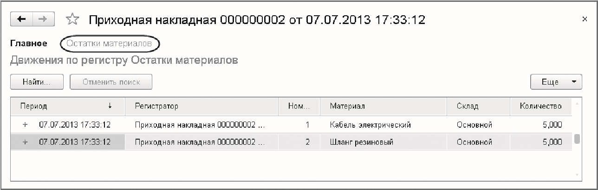

<strong>Рис. 6.17.</strong> Переход к регистру накопления из формы документа

Обратите внимание, что до этого панель навигации в форме приходной накладной была не видна, так как в ней не было
	отображено ни одной команды.

<strong>Движения документа «Оказание услуги»</strong>

Теперь мы аналогичным образом создадим движения документа ОказаниеУслуги. Для этого потребуется выполнить уже
	знакомые нам действия.

В режиме «Конфигуратор»

Откроем окно редактирования объекта конфигурации Документ ОказаниеУслуги. 

Перейдем на закладку Движения и в списке регистров конфигурации отметим регистр накопления ОстаткиМатериалов. 

Нажмем кнопку Конструктор движений.

В открывшемся окне конструктора изменим тип движения регистра на Расход, так как документ ОказаниеУслуги должен
	расходовать материалы. Пиктограмма слева от названия регистра изменится на знак –. В поле выбора Табличная часть
	выберем табличную часть нашего документа – ПереченьНоменклатуры. 

Список реквизитов документа, который уже заполнен реквизитами шапки документа, автоматически дополнится реквизитами
	нашей табличной части. 

Теперь нажмем кнопку Заполнить выражения. 

В нижнем окне сформируется соответствие полей (измерений и ресурсов) регистра и выражений для их расчета. Однако при
	автоматическом заполнении поле Материал не заполнится. 

Так происходит потому, что имя поля табличной части Номенклатура не совпадает с именем измерения регистра – Материал.
	Если мы оставим это так, как есть, то в регистре накопления в строках с типом Движение регистра – расход
	номенклатура фиксироваться не будет. 

Чтобы избежать этого, нужно выделить поле регистра Материал и в окне Реквизиты документа дважды щелкнуть по строке
	ТекСтро- каПереченьНоменклатуры.Номенклатура. 

Таким образом, номенклатура для движений регистра накопления будет выбираться из табличной части документа (рис.
	6.18).

для расчета движений регистра

Нажмем кнопку OK. 

Конструктор создал обработчик события ОбработкаПроведения объекта конфигурации Документ ОказаниеУслуги и поместил его
	в модуль объекта (листинг 6.2).

<strong>листинг 6.2.</strong> Процедура «ОбработкаПроведения()»

<table>
	<tr>
		<td>
Процедура ОбработкаПроведения(Отказ, Режим)
</td>
	</tr>
	<tr>
		<td></td>
	</tr>
	<tr>
		<td>
//{{__КОНСТРУКТОР_ДВИЖЕНИЙ_РЕГИСТРОВ
</td>
	</tr>
	<tr>
		<td></td>
	</tr>
	<tr>
		<td>
// Данный фрагмент построен конструктором.
</td>
	</tr>
	<tr>
		<td></td>
	</tr>
	<tr>
		<td>
// При повторном использовании конструктора внесенные вручную изменения будут утеряны!!!
</td>
	</tr>
	<tr>
		<td></td>
	</tr>
	<tr>
		<td></td>
	</tr>
	<tr>
		<td></td>
	</tr>
	<tr>
		<td>
// регистр ОстаткиМатериалов Расход
</td>
	</tr>
	<tr>
		<td></td>
	</tr>
	<tr>
		<td>
Движения.ОстаткиМатериалов.Записывать = Истина;
</td>
	</tr>
	<tr>
		<td></td>
	</tr>
	<tr>
		<td>
Для Каждого ТекСтрокаПереченьНоменклатуры Из ПереченьНоменклатуры Цикл
</td>
	</tr>
	<tr>
		<td></td>
	</tr>
	<tr>
		<td>
Движение = Движения.ОстаткиМатериалов.Добавить();
</td>
	</tr>
	<tr>
		<td></td>
	</tr>
	<tr>
		<td>
Движение.ВидДвижения = ВидДвиженияНакопления.Расход;
</td>
	</tr>
	<tr>
		<td></td>
	</tr>
	<tr>
		<td>
Движение.Период = Дата;
</td>
	</tr>
	<tr>
		<td></td>
	</tr>
	<tr>
		<td>
Движение.Материал = ТекСтрокаПереченьНоменклатуры.Номенклатура;
</td>
	</tr>
	<tr>
		<td></td>
	</tr>
	<tr>
		<td>
Движение.Склад = Склад;
</td>
	</tr>
	<tr>
		<td></td>
	</tr>
	<tr>
		<td>
Движение.Количество = ТекСтрокаПереченьНоменклатуры.Количество;
</td>
	</tr>
	<tr>
		<td></td>
	</tr>
	<tr>
		<td>
КонецЦикла;
</td>
	</tr>
	<tr>
		<td></td>
	</tr>
	<tr>
		<td></td>
	</tr>
	<tr>
		<td></td>
	</tr>
	<tr>
		<td>
//}}__КОНСТРУКТОР_ДВИЖЕНИЙ_РЕГИСТРОВ
</td>
	</tr>
	<tr>
		<td></td>
	</tr>
	<tr>
		<td>
КонецПроцедуры
</td>
	</tr>
</table>

Обратите внимание, что строка Движение.ВидДвижения = ВидДвиженияНакопления.Расход определяет вид движения регистра
	накопления, производимый этим документом как Расход, а в остальном процедура обработчика ОбработкаПроведения
	документа ОказаниеУслуги идентична обработчику документа ПриходнаяНакладная (см. листинг 6.1), подробно разобранному
	нами ранее.

В заключение отредактируем командный интерфейс формы документа, чтобы в панели навигации формы иметь возможность
	переходить к списку записей регистра Остатки Материалов, связанному с документом. 

Для этого откроем форму документа ОказаниеУслуги. В левом верхнем окне перейдем на закладку Командный интерфейс. 

В разделе Панель навигации раскроем группу Перейти и установим видимость для команды открытия регистра накопления
	Остатки материалов. 

В режиме «1С:Предприятие»

Запустим «1С:Предприятие» в режиме отладки. В разделе Оказание услуг откроем документ Оказание услуги № 1 и нажмем
	Провести и закрыть, то есть перепроведем его. 

Теперь выполним команду Остатки материалов и откроем список нашего регистра накопления (рис. 6.19).

<strong>Рис. 6.19.</strong> Список регистра накопления «ОстаткиМатериалов»

Мы видим, что в регистре накопления Остатки материалов появилась еще одна запись, что соответствует количеству строк
	в табличной части проведенного документа. 

Все поля регистра заполнились данными документа так, как мы задали в обработчике проведения документа Оказание
	услуги. 

Пиктограмма со знаком минус слева от записи указывает на тип движения – Расход (см. рис. 6.19).

Сейчас мы видим весь список движений регистра. Открыв этот список из формы документа, мы можем отфильтровать движения
	по документу-регистратору. 

Для этого откроем еще раз документ Оказание услуги № 1. 

В форме документа появилась панель навигации, в которой мы можем переходить к списку записей регистра Остатки
	материалов, связанному с документом, и обратно к содержимому документа (рис. 6.20).

<strong>Рис. 6.20.</strong> Переход к регистру накопления из формы документа

Однако сформированные таким образом движения этого документа будут не совсем правильны. 

Дело в том, что в документе Оказание услуги, в отличие от документа Приходная накладная, могут содержаться не только
	расходуемые материалы, но и услуги. Поэтому в регистр Остатки материалов будут попадать записи и о расходуемых
	услугах, что неправильно. 

Пока мы ничего не будем делать с движениями, которые сформировал конструктор, но как только познакомимся с
	перечислениями, мы внесем в обработчик проведения необходимые изменения.

<h1>Лабораторная работа № 9Поступление и учет ОС</h1>

<strong>Порядок выполнения работы </strong>

1. Ознакомьтесь с теоретическими основами в настоящих указаниях и конспектах лекций. 

2. Получите задание у преподавателя. 

3. Сделайте скриншоты (кнопка клавиатуры PrtSc) выполненных заданий в текстовом (Word) файле <em>Фамилия_ЛР</em>

4. Составьте отчет по лабораторной работе. 

5. Отчитайте работу преподавателю.

<strong>Добавление отчета</strong>

В режиме «Конфигуратор»

Теперь у нас все готово для того, чтобы можно было получать выходные данные. Поэтому приступим к созданию отчета,
	который будет показывать нам приход, расход и остатки материалов (рис. 7.1).

<strong>Рис. 7.1.</strong> Результат отчета

На этом примере мы покажем, как быстро и легко разработать отчет с использованием только визуальных средств
	разработки «без единой строчки кода».

Откроем в конфигураторе нашу учебную конфигурацию и добавим новый объект конфигурации Отчет. 

Для этого выделим в дереве объектов конфигурации ветвь Отчеты и нажмем кнопку Добавить в командной панели окна
	конфигурации 

(рис. 7.2).

В открывшемся окне редактирования объекта конфигурации на закладке Основные зададим имя отчета – Материалы. 

Больше никаких свойств, определяющих представление объекта в интерфейсе приложения, задавать не будем. Вместо них
	будет использоваться Синоним объекта, который создается автоматически на основании имени объекта.

Создадим основу для построения любого отчета – <em>схему компоновки данных</em>. Для этого нажмем кнопку Открыть
	схему компоновки данных или кнопку открытия  со значком лупы (рис. 7.3).

Макет

Так как у отчета, который мы создаем, еще не существует схемы компоновки данных, платформа предложит создать новую
	схему. Схема компоновки данных с точки зрения конфигурации является макетом, поэтому будет открыт конструктор
	макета, предлагающий выбрать единст- венный тип макета – Схема компоновки данных 

(рис. 7.4).

<strong>Рис. 7.4.</strong> Создание схемы компоновки данных отчета

Нажмем кнопку Готово. 

Схема компоновки данных

Платформа создаст новый макет, содержащий схему компоновки данных, и сразу же откроет конструктор схемы компоновки
	данных. 

Конструктор обладает большим количеством возможностей для визуального проектирования отчетов, но мы сейчас
	воспользуемся только самыми простыми его возможностями и определим те данные, которые хотим видеть в результате
	работы нашего отчета. 

Набор данных

Добавим новый набор данных – запрос. Для этого нажмем кнопку Добавить или вызовем контекстное меню ветки Наборы
	данных 

(рис. 7.5).

<strong>Рис. 7.5.</strong> Добавление набора данных в конструкторе схемы компоновки

Текст запроса

Для того чтобы создать текст запроса, запустим конструктор запроса – нажмем кнопку Конструктор запроса (рис.
	7.6).

<em>Конструктор запроса</em> – инструмент, созданный для помощи разработчику, позволяющий визуально конструировать
	запрос. Даже пользователь, не знакомый с языком запросов, может с помощью конструктора создать синтаксически
	правильный запрос. 

В окне конструктора запроса, в списке База данных представлены таблицы для создания запроса. На основе их данных мы
	имеем возможность построить отчет. 

Если раскрыть ветку РегистрыНакопления, то мы увидим, что кроме таблицы регистра ОстаткиМатериалов в этой ветке
	присутствуют еще несколько <em>виртуальных таблиц</em>, которые формирует система 

(рис. 7.7).

Эти виртуальные таблицы, создаваемые платформой для регистров, и используются в основном для построения различных
	отчетов. Поскольку мы хотим видеть как остатки материалов, так и информацию об их поступлении и расходовании, нас
	будет интересовать виртуальная таблица ОстаткиМатериалов.ОстаткиИОбороты. Перетащим мышью эту таблицу в список
	Таблицы и раскроем ее структуру 

(рис. 7.8).

<strong>Рис. 7.8.</strong> Таблица «ОстаткиМатериалов.

ОстаткиИОбороты»

Как вы видите, эта таблица содержит измерения регистра ОстаткиМатериалов – Материал, Склад и кроме этого начальные и
	конечные остатки, а также значения прихода, расхода и оборотов для всех ресурсов регистра ОстаткиМатериалов. 

Начнем выбирать поля таблицы в нужном нам порядке двойным щелчком мыши. 

Сначала выберем Склад и Материал. Затем выберем КоличествоНачальныйОстаток, КоличествоПриход, КоличествоРасход. В
	заключение выберем КоличествоКонечныйОстаток. 

В результате окно Поля должно быть заполнено следующим образом 

(рис. 7.9).

<strong>Рис. 7.9.</strong> Выбранные поля 

Нажмем OK и вернемся в конструктор схемы компоновки данных 

(рис. 7.10).

<strong>Рис. 7.10.</strong> Конструктор схемы компоновки данных

Текст запроса, который был создан с помощью конструктора, платформа поместит в поле Запрос. 

Это поле представляет собой текстовый редактор, в котором можно вручную отредактировать существующий запрос. Кроме
	того, можно снова вызвать конструктор запроса и отредактировать запрос при помощи него. 

Для упрощения восприятия материала мы не будем здесь приводить листинг запроса и разбирать его. Более подробно этот
	вопрос будет рассмотрен в разделе о языке запросов на занятии «Отчеты. В данном случае, как и для многих других
	отчетов, можно не анализировать и не редактировать текст запроса.

Обратите внимание на список полей системы компоновки данных, который платформа заполнила в верхней части
	конструктора. В нем отображаются поля, которые доступны у текущего набора данных. В нашем случае система
	«1С:Предприятие» заполнила данный список автоматически, из текста запроса, и нет необходимости в его ручной
	настройке.

Итак, мы описали, каким образом будут извлекаться данные для отчета. Но пока мы не создадим стандартных настроек
	нашего отчета, мы ничего не увидим в результате. Поэтому создадим самые простые настройки отчета для отображения
	обычных детальных записей информационной базы. 

В нашем случае это будут записи виртуальной таблицы регистра накопления ОстаткиМатериалов, выбранные в линейном
	порядке по мере попадания их в эту таблицу.

Настройки отчета

Перейдем на закладку Настройки. В верхнем правом окне будет находиться иерархическая структура нашего отчета. 

Для добавления нового элемента выделим в дереве структуры отчета корневой элемент Отчет и вызовем его контекстное
	меню. Можно также нажать кнопку Добавить в командной панели окна или нажать клавишу Ins. 

Добавим в отчет группировку (контекстное меню – Новая группировка). При этом не станем указывать поле группировки, а
	просто нажмем OK. 

Тем самым мы определили, что в отчет будут выводиться <em>детальные</em> записи из информационной базы – записи,
	получаемые в результате выполнения запроса без итогов (рис. 7.11).

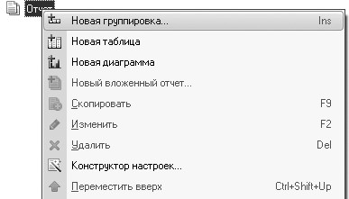

<strong>Рис. 7.11.</strong> Добавление новой группировки в отчет

В структуре отчета появится группировка Детальные записи. 

Теперь настроим поля, которые будут выводиться в результат отчета. 

Для этого перейдем в нижнем окне настроек на закладку Выбранные поля и перенесем мышью из списка доступных полей:

<ul>
	<li>Склад,</li>
	<li>Материал,</li>
	<li>КоличествоНачальныйОстаток,</li>
	<li>КоличествоПриход,</li>
	<li>КоличествоРасход,</li>
	<li>КоличествоКонечныйОстаток.</li>
</ul>

В результате окно настроек отчета должно иметь вид (рис. 7.12).

Затем перейдем на закладку Параметры и укажем, что параметры отчета Дата начала и Дата окончания будут включены в
	состав пользовательских настроек, и эти настройки будут находиться непосредственно в форме отчета, то есть будут
	быстрыми настройками. 

Сначала укажем, что оба эти параметра будут использоваться в отчете – установим флажки в первой колонке. 

Затем выделим каждый из параметров, нажмем кнопку Свойства элемента пользовательских настроек и установим флажок
	Включать в пользовательские настройки (рис. 7.13).

<strong>Рис. 7.13.</strong> Окно настроек отчета

Таким образом, перед формированием отчета пользователь сможет задать отчетный период. Более подробно о параметрах и
	пользовательских настройках отчета будет рассказано позже на занятии. 

В заключение определим, в каких подсистемах будет отображаться наш отчет. 

Закроем конструктор схемы компоновки данных и в окне редактирования объекта конфигурации Отчет Материалы перейдем на
	закладку Подсистемы. 

Отметим в списке подсистем конфигурации ветви Учет материалов, Оказание услуг и Бухгалтерия. 

Таким образом, ссылка на наш отчет автоматически попадет в панель команд этих разделов, в подменю Отчеты (рис.
	7.14).

В режиме «1С:Предприятие»

Запустим «1С:Предприятие» в режиме отладки и посмотрим, как работает отчет. 

В открывшемся окне «1С:Предприятия» мы видим, что в разделах Бухгалтерия, Оказание услуг и Учет материалов появилось
	новое подменю Отчеты, содержащее команды для выполнения отчетов, и в нем команда для формирования отчета Материалы
	(рис. 7.15).

<strong>Рис. 7.15.</strong> Команда для формирования отчета «Материалы»

Выполним ее. Откроется автоматически сформированная системой форма отчета. 

Зададим даты начала и окончания отчетного периода и нажмем кнопку Сформировать (рис. 7.16).

Как видите, наш отчет вполне презентабелен и полностью отражает движение материалов, произошедшее в нашей
	организации. 

<strong>Рис. 7.16.</strong> Отчет «Материалы»

<h1>Лабораторная работа № 10 Учет материалов</h1>

<strong>Порядок выполнения работы </strong>

1. Ознакомьтесь с теоретическими основами в настоящих указаниях и конспектах лекций. 

2. Получите задание у преподавателя. 

3. Сделайте скриншоты (кнопка клавиатуры PrtSc) выполненных заданий в текстовом (Word) файле <em>Фамилия_ЛР</em>

4. Составьте отчет по лабораторной работе. 

5. Отчитайте работу преподавателю.

<strong>Макет печатной формы</strong>

В режиме «Конфигуратор»

Наша цель будет заключаться в создании печатной формы документа Оказание услуги.

Откроем в конфигураторе окно редактирования объекта конфигурации Документ ОказаниеУслуги. 

Перейдем на закладку Макеты, нажмем кнопку Конструкторы и запустим конструктор печати (рис. 8.1).

В открывшемся окне конструктора на первом шаге укажем, что будет создана новая команда Печать для формирования
	печатной формы документа (рис. 8.2).

Нажмем Далее. 

На втором шаге нажатием кнопки  определим, что все реквизиты нашего документа будут отображены в
	шапке печатной формы 

(рис. 8.3).

Нажмем Далее. 

На третьем шаге точно так же определим, что все реквизиты табличной части документа будут отображены в печатной
	форме 

(рис. 8.4).

Нажмем Далее. 

На четвертом шаге конструктор предложит сформировать нам подвал (нижнюю часть) печатной формы. Мы не станем ничего
	указывать (подвал в данном случае использовать не будем), нажмем Далее и перейдем к пятому шагу (рис. 8.5).

Здесь ничего изменять не будем. Тем самым согласимся с тем, что команда для вызова процедуры формирования печатной
	формы будет помещена в командную панель формы, в раздел Важное. 

Нажмем OK.

В конфигураторе откроется модуль команды Печать, модуль менеджера документа ОказаниеУслуги и макет этого
	документа 

(рис. 8.6).

<strong>Рис. 8.6.</strong> Макет документа «Оказание услуги»

Заметим, что разработчик может создать макет печатной формы с нуля и для ее вывода создать соответствующую команду и
	кнопку в форме документа, но в данном случае всю работу сделал за нас конструктор печати:

<ul>
	<li>Создан макет печатной формы документа ОказаниеУслуги с именем Печать (см. рис. 8.6).</li>
	<li>Создана команда документа ОказаниеУслуги с именем Печать.</li>
</ul>

В модуль этой команды помещен обработчик, вызывающий процедуру печати документа, выполняющуюся на сервере. Сама
	процедура печати помещена в модуль менеджера документа ОказаниеУслуги (рис. 8.7).

<strong>Рис. 8.7.</strong> Структура документа 

«Оказание услуги» в дереве объектов конфигурации

<ul>
	<li>В командную панель формы документа ОказаниеУслуги помещена команда Печать для формирования печатной формы
		документа
	</li>
</ul>

(рис. 8.8).

Причем поскольку команда Печать принадлежит документу ОказаниеУслуги в целом, а не конкретной его форме, эту команду
	можно будет помещать в любую форму, созданную для документа.

В будущем мы будем самостоятельно создавать процедуры обработчиков команд и размещать соответствующие им кнопки в
	форме, но пока воспользуемся результатами работы конструктора печати и проверим макет в работе.

<strong>Рис. 8.8.</strong> Макет документа «Оказание услуги»

В режиме «1С:Предприятие»

Запустим «1С:Предприятие» в режиме отладки и откроем документ Оказание услуги № 1. 

Обратите внимание, что в командной панели документа появилась новая кнопка Печать (рис. 8.9).

<strong>Рис. 8.9.</strong> Форма документа «Оказание услуги» с новой кнопкой «Печать»

Кнопка Печать добавилась также и в командную панель формы списка документов Оказание услуги. Поэтому распечатать
	документ можно, не открывая его, а просто выделив в списке и нажав кнопку Печать.

Нажмем эту кнопку (в форме списка или в форме документа) и увидим печатную форму нашего документа (рис. 8.10).

<strong>Рис. 8.10.</strong> Печатная форма документа «Оказание услуги» 

Как видите, конструктор сформировал вполне подходящую печатную форму для нашего документа. Единственное, чего не
	хватает в данной форме, это итоговой суммы документа. 

В следующем разделе на примере добавления итоговой суммы документа мы познакомимся с тем, как можно редактировать
	макеты и формы объектов конфигурации.

<strong>Редактирование макета</strong>

В режиме «Конфигуратор»

Прежде всего, добавим итоговую сумму в печатную форму документа ОказаниеУслуги.

Откроем конфигуратор, раскроем дерево документа Оказание Услуги и дважды щелкнем на макете Печать. 

Как видите, макет документа состоит из именованных областей, которые в определенном порядке выводятся на печать. 

Те именованные области, которые мы видим слева, были созданы с помощью конструктора. Но разработчик может сам
	создавать или удалять области, переименовывать их и т. п.

Добавим новую область для вывода итоговой суммы документа. Выделим мышью две пустые строки под табличной частью
	документа и выполним пункт главного меню Таблица  Имена  Назначить имя… (рис. 8.11).

<strong>Рис. 8.11.</strong> Создание области ячеек для вывода итоговой строки

Назовем область Всего, нажмем ОК. 

Чтобы формат добавленных нами строк совпадал с имеющимся форматом заголовка и табличной части документа, изменим
	ширину колонок.

Для этого потянем мышью в заголовке таблицы за правую границу колонки 2 так, чтобы ее ширина совпала с шириной
	колонки № в шапке таблицы документа. Отпустим мышь.

Платформа предложит создать новый формат для выделенных строк. Согласимся.

Аналогичные действия выполним и для колонок 3, 4, 5 и 6.

В созданной области, в колонке Цена напишем ВСЕГО, а в колонке Сумма напишем ВсегоПоДокументу (рис. 8.12).

<strong>Рис. 8.12.</strong> Создание ячеек для вывода итога

Вызвав палитру свойств для ячейки ВсегоПоДокументу (контекстное меню – Свойства), в свойстве Заполнение укажем, что в
	этой ячейке будет находиться не текст, а параметр (рис. 8.13).

Каждая ячейка редактируемого нами табличного документа может содержать либо текст, либо некоторый параметр, либо
	шаблон. 

<em>Текст</em>, содержащийся в ячейке, будет показан на экране. 

<em>Параметр</em> будет заменен некоторым значением, которое может быть присвоено ему средствами встроенного языка.
	Текст, содержащийся в ячейке, является именем этого параметра.

<em>Шаблон</em> представляет собой текстовую строку, в определенные места которой будут вставлены значения
	параметров.

Поэтому, указав для ячейки в качестве заполнения Параметр, мы определили параметр области с именем ВсегоПоДокументу,
	которому присвоим нужное нам значение при формировании печатной формы.

Откроем модуль менеджера документа ОказаниеУслуги. 

Для этого перейдем на закладку Прочее окна редактирования объекта конфигурации Документ ОказаниеУслуги и нажмем
	кнопку Модуль менеджера (рис. 8.14).

Найдем в нем процедуру Печать и отредактируем ее следующим образом (новые строки выделены жирным шрифтом), листинг
	8.1. <strong>листинг 8.1.</strong> Печать формы документа (фрагмент)

<table>
	<tr>
		<td>
…
</td>
	</tr>
	<tr>
		<td></td>
	</tr>
	<tr>
		<td>
ОбластьЗаголовок = Макет.ПолучитьОбласть(&quot;Заголовок&quot;);
</td>
	</tr>
	<tr>
		<td></td>
	</tr>
	<tr>
		<td>
Шапка = Макет.ПолучитьОбласть(&quot;Шапка&quot;);
</td>
	</tr>
	<tr>
		<td></td>
	</tr>
	<tr>
		<td>
ОбластьПереченьНоменклатурыШапка = Макет.ПолучитьОбласть(&quot;ПереченьНоменклатурыШапка&quot;);
</td>
	</tr>
	<tr>
		<td></td>
	</tr>
	<tr>
		<td>
ОбластьПереченьНоменклатуры = Макет.ПолучитьОбласть(&quot;ПереченьНоменклатуры&quot;);
</td>
	</tr>
	<tr>
		<td></td>
	</tr>
	<tr>
		<td>
<strong>ОбластьИтог =
			Макет.ПолучитьОбласть(</strong>&quot;<strong>Всего</strong>&quot;<strong>);</strong>
</td>
	</tr>
	<tr>
		<td></td>
	</tr>
	<tr>
		<td>
ТабДок.Очистить();
</td>
	</tr>
	<tr>
		<td></td>
	</tr>
	<tr>
		<td></td>
	</tr>
	<tr>
		<td></td>
	</tr>
	<tr>
		<td>
ВставлятьРазделительСтраниц = Ложь;
</td>
	</tr>
	<tr>
		<td></td>
	</tr>
	<tr>
		<td>
Пока Выборка.Следующий() Цикл
</td>
	</tr>
	<tr>
		<td></td>
	</tr>
	<tr>
		<td>
Если ВставлятьРазделительСтраниц Тогда
</td>
	</tr>
	<tr>
		<td></td>
	</tr>
	<tr>
		<td>
ТабДок.ВывестиГоризонтальныйРазделительСтраниц();
</td>
	</tr>
	<tr>
		<td></td>
	</tr>
	<tr>
		<td>
КонецЕсли;
</td>
	</tr>
	<tr>
		<td></td>
	</tr>
	<tr>
		<td></td>
	</tr>
	<tr>
		<td></td>
	</tr>
	<tr>
		<td>
ТабДок.Вывести(ОбластьЗаголовок);
</td>
	</tr>
	<tr>
		<td></td>
	</tr>
	<tr>
		<td></td>
	</tr>
	<tr>
		<td></td>
	</tr>
	<tr>
		<td>
Шапка.Параметры.Заполнить(Выборка);
</td>
	</tr>
	<tr>
		<td></td>
	</tr>
	<tr>
		<td>
ТабДок.Вывести(Шапка, Выборка.Уровень());
</td>
	</tr>
	<tr>
		<td></td>
	</tr>
	<tr>
		<td></td>
	</tr>
	<tr>
		<td></td>
	</tr>
	<tr>
		<td>
ТабДок.Вывести(ОбластьПереченьНоменклатурыШапка);
</td>
	</tr>
	<tr>
		<td></td>
	</tr>
	<tr>
		<td>
ВыборкаПереченьНоменклатуры = Выборка.ПереченьНоменклатуры.Выбрать();
</td>
	</tr>
	<tr>
		<td></td>
	</tr>
	<tr>
		<td>
<strong>СуммаИтог = 0;</strong>
</td>
	</tr>
	<tr>
		<td></td>
	</tr>
	<tr>
		<td>
Пока ВыборкаПереченьНоменклатуры.Следующий() Цикл
</td>
	</tr>
	<tr>
		<td></td>
	</tr>
	<tr>
		<td>
ОбластьПереченьНоменклатуры.Параметры.Заполнить(ВыборкаПереченьНоменклатуры);
</td>
	</tr>
</table>

ТабДок.Вывести(ОбластьПереченьНоменклатуры, 

ВыборкаПереченьНоменклатуры.Уровень());

<table>
	<tr>
		<td>
<strong>СуммаИтог = СуммаИтог + ВыборкаПереченьНоменклатуры.Сумма;</strong>
</td>
	</tr>
	<tr>
		<td></td>
	</tr>
	<tr>
		<td>
КонецЦикла;
</td>
	</tr>
	<tr>
		<td></td>
	</tr>
	<tr>
		<td></td>
	</tr>
	<tr>
		<td></td>
	</tr>
	<tr>
		<td>
<strong>ОбластьИтог.Параметры.ВсегоПоДокументу = СуммаИтог;</strong>
</td>
	</tr>
	<tr>
		<td></td>
	</tr>
	<tr>
		<td>
<strong>ТабДок.Вывести(ОбластьИтог);</strong>
</td>
	</tr>
	<tr>
		<td></td>
	</tr>
	<tr>
		<td>
ВставлятьРазделительСтраниц = Истина;
</td>
	</tr>
	<tr>
		<td></td>
	</tr>
	<tr>
		<td>
КонецЦикла;
</td>
	</tr>
	<tr>
		<td></td>
	</tr>
	<tr>
		<td>
…
</td>
	</tr>
</table>

Смысл добавленного фрагмента прост. Мы обращаемся к макету документа ОказаниеУслуги по его имени – Макет. 

Используя его метод ПолучитьОбласть(), получаем область Всего (ту, которую мы только что добавили к макету) и
	сохраняем ее в переменной ОбластьИтог. 

В цикле обхода строк табличной части документа, полученных в результате выполнения запроса, мы накапливаем в
	переменной СуммаИтог значение суммы табличной части документа по колонке Сумма. 

Затем мы обращаемся к параметру ВсегоПоДокументу (ОбластьИтог.Параметры.ВсегоПоДокументу), находящемуся в области
	Всего, и присваиваем ему значение переменной СуммаИтог.

В заключение мы выводим итоговую область в табличный документ, который будет показан на экране и распечатан
	пользователем – ТабДок.Вывести(ОбластьИтог). 

Отображение табличного документа на экране выполняется в обработчике команды Печать, в модуле этой команды на
	клиенте, в то время как сама процедура заполнения печатной формы данными, описанная в модуле менеджера документа,
	выполняется на сервере.

В режиме «1С:Предприятие»

Запустим «1С:Предприятие» в режиме отладки и проверим результат наших изменений (рис. 8.15).

<strong>Рис. 8.15.</strong> Печатная форма документа «Оказание услуги»

Подобным образом, создавая именованные области и ячейки макета, используя их свойства и управляя порядком их вывода c
	помощью встроенного языка, разработчик имеет возможность создать печатную форму любого дизайна.

<h1>Лабораторная работа № 11 Монтажные и наладочные работы</h1>

<strong>Порядок выполнения работы </strong>

1. Ознакомьтесь с теоретическими основами в настоящих указаниях и конспектах лекций. 

2. Получите задание у преподавателя. 

3. Сделайте скриншоты (кнопка клавиатуры PrtSc) выполненных заданий в текстовом (Word) файле <em>Фамилия_ЛР</em>

4. Составьте отчет по лабораторной работе. 

5. Отчитайте работу преподавателю.

<strong>Добавление периодического регистра сведений </strong>

Приступим к созданию периодического регистра сведений, который будет хранить развернутые во времени розничные цены
	материалов и стоимости услуг, оказываемых нашим ООО «На все руки мастер».

В режиме «Конфигуратор»

Откроем в конфигураторе нашу учебную конфигурацию и добавим новый объект конфигурации Регистр сведений. 

Для этого выделим в дереве объектов конфигурации ветвь Регистры сведений и нажмем кнопку Добавить в командной панели
	окна конфигурации.

В открывшемся окне редактирования объекта конфигурации на закладке Основные зададим имя регистра – Цены. 

Установим свойство Периодичность этого регистра – В пределах секунды. 

Такую периодичность мы выбрали для того, чтобы иметь возможность отслеживать цены несколько раз в течение дня. Если
	же так часто не предполагается изменять цены, то можно выбрать, вообще говоря, в пределах дня.

Здесь же определим представление объекта в интерфейсе приложения. 

Зададим свойства Представление записи как Цена, а Представление списка как Цены на номенклатуру (рис. 9.2).

<strong>Рис. 9.2.</strong> Основные свойства регистра 

сведений «Цены»

Обратите внимание на свойство Режим записи. По умолчанию оно имеет значение – Независимый, то есть мы создаем
	независимый регистр сведений и сможем в дальнейшем вводить в него данные без использования регистратора,
	вручную. 

Нажмем Далее и перейдем на закладку Подсистемы. 

По логике нашей конфигурации данный регистр должен быть доступен в разделах Учет материалов, Оказание услуг и
	Бухгалтерия. 

Измерения и ресурсы

Перейдем на закладку Данные и создадим измерение Номенклатура с типом СправочникСсылка.Номенклатура. 

Для этого выделим ветвь Измерения и нажмем кнопку Добавить в командной панели окна.

Укажем, что это измерение будет ведущим (рис. 9.4).

<strong>Рис. 9.4.</strong> Создание ведущего измерения регистра сведений 

Свойство Ведущее имеет смысл использовать лишь тогда, когда измерение имеет тип ссылки на объект базы данных.
	Установка свойства Ведущее будет говорить о том, что запись регистра сведений представляет интерес, пока существует
	тот объект, ссылка на который выбрана в качестве значения этого измерения в этой записи. При удалении объекта все
	записи регистра сведений по этому объекту тоже будут автоматически удалены. 

Также в результате того, что это измерение регистра мы сделали ведущим, в форме элемента справочника Номенклатура, в
	панели навигации в группе Перейти появится ссылка. По ней возможен переход к записям этого регистра, которые
	содержат в измерении Номенклатура ссылку на этот элемент справочника.

Затем создадим ресурс Цена, тип Число, длина 15, точность 2, неотрицательное. 

Для этого выделим ветвь Ресурсы и нажмем кнопку Добавить в командной панели окна (рис. 9.5).

<strong>Рис. 9.5.</strong> Создание ресурса регистра сведений

В режиме «1С:Предприятие»

Теперь запустим «1С:Предприятие» в режиме отладки и посмотрим, как работает наш периодический регистр сведений
	Цены. 

В открывшемся окне «1С:Предприятия» мы видим, что в разделах Бухгалтерия, Оказание услуг и Учет материалов появилась
	команда для открытия списка регистра Цены на номенклатуру (рис. 9.6).

<strong>Рис. 9.6.</strong> Команда для открытия периодического регистра сведений «Цены»

Команда для открытия регистра сведений по умолчанию доступна в интерфейсе разделов, в которых отображается регистр,
	так как в отличие от регистров накопления предполагается изменение данных регистра пользователем. Но в данном случае
	она находится в подменю Еще вместе с другими командами, которые не помещаются на панели команд текущего раздела окна
	приложения.

Создание записей в регистре сведений

Выполним команду для открытия списка регистра Цены на номенклатуру. Чтобы добавить новую запись в регистр сведений,
	нажмем кнопку Создать.

Зададим стоимость услуг ООО «На все руки мастер» следующим образом (рис. 9.7). 

При этом период зададим задним числом, так как он должен быть меньше или равен дате создания документа об оказании
	услуг, в нашем случае 08.07.2013.

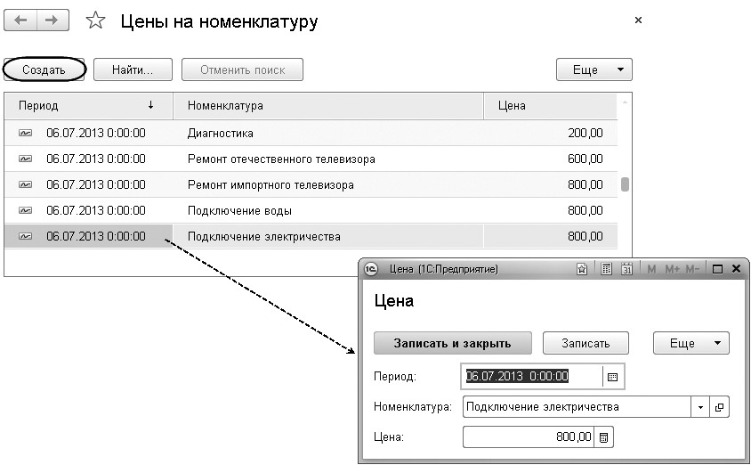

<strong>Рис. 9.7.</strong> Цены на услуги в регистре сведений «Цены»

После этого зададим розничные цены на материалы (рис. 9.8).

<strong>Рис. 9.8.</strong> Цены на материалы в регистре сведений «Цены»

Итак, мы с вами имеем очень полезную возможность в нашей программе – установка цен на услуги и материалы. Поскольку
	цены хранятся с привязкой к дате, мы можем заранее установить новые цены и быть уверены в том, что новые цены
	вступят в действие не раньше указанного для них времени.

<strong>Автоматическая подстановка цены в документ при выборе номенклатуры</strong>

Наша задача заключается в следующем. Цена номенклатуры у нас теперь хранится в отдельном регистре сведений. Когда мы
	создаем или изменяем документ ОказаниеУслуги и добавляем в табличную часть какую-либо номенклатуру, нам хочется,
	чтобы одновременно с этим в документ подставлялась бы сразу и актуальная цена этой номенклатуры, полученная из
	регистра сведений и соответствующая дате документа. 

Для этого нам нужно сделать две вещи. 

Сначала написать некую функцию, которая будет возвращать нам актуальную цену номенклатуры, а затем вызвать эту
	функцию в тот момент, когда в документ добавляется номенклатура, и подставить в документ цену номенклатуры, которую
	вернет эта функция. 

Поскольку такой сервис понадобится нам, скорее всего, не только в этом, но и в других документах, которые содержат в
	табличной части номенклатуру, мы поместим функцию в некоторое общедоступное место – в общий модуль.

В режиме «Конфигуратор»

Функция, возвращающая цену номенклатуры

Сначала мы создадим функцию РозничнаяЦена(), которая будет возвращать нам актуальную розничную цену номенклатуры, и
	поместим ее в общий модуль конфигурации.

Откроем конфигуратор, в ветке Общие  Общие модули добавим новый объект конфигурации Общий модуль и назовем его Рабо-
	таСоСправочниками. 

В палитре этого свойств модуля мы видим, что у модуля по умолчанию установлен флажок Сервер. Это означает, что
	экземпляры этого модуля будут скомпилированы только на стороне сервера. 

Кроме этого, установим флажок Вызов сервера для того, чтобы экспортные процедуры и функции этого модуля можно было
	вызывать с клиента (рис. 9.9).

<strong>Рис. 9.9.</strong> Свойства общего модуля

Поместим в него следующий текст (листинг 9.1).

<strong>листинг 9.1.</strong> Функция «РозничнаяЦена()»

<table>
	<tr>
		<td>
Функция РозничнаяЦена(АктуальнаяДата, ЭлементНоменклатуры) Экспорт 
</td>
	</tr>
	<tr>
		<td></td>
	</tr>
	<tr>
		<td>
// Создать вспомогательный объект &quot;Отбор&quot;.
</td>
	</tr>
	<tr>
		<td></td>
	</tr>
	<tr>
		<td>
Отбор = Новый Структура(&quot;Номенклатура&quot;, ЭлементНоменклатуры);
</td>
	</tr>
	<tr>
		<td></td>
	</tr>
	<tr>
		<td></td>
	</tr>
	<tr>
		<td></td>
	</tr>
	<tr>
		<td>
// Получить актуальные значения ресурсов регистра.
</td>
	</tr>
	<tr>
		<td></td>
	</tr>
	<tr>
		<td>
ЗначенияРесурсов = РегистрыСведений.Цены.ПолучитьПоследнее(АктуальнаяДата, Отбор);
</td>
	</tr>
	<tr>
		<td></td>
	</tr>
	<tr>
		<td>
Возврат ЗначенияРесурсов.Цена;
</td>
	</tr>
	<tr>
		<td></td>
	</tr>
	<tr>
		<td>
КонецФункции
</td>
	</tr>
</table>

Поясним эту функцию.

Для получения розничной цены мы будем передавать в функцию два параметра:

<ul>
	<li>АктуальнаяДата – параметр типа Дата, определяет точку на оси времени, в которой нас интересует значение
		розничной цены;
	</li>
	<li>ЭлементНоменклатуры – ссылка на элемент справочника Номенклатура, для которого мы хотим получить розничную
		цену.
	</li>
</ul>

В теле функции мы сначала создаем вспомогательный объект Отбор. 

Это структура, содержащая отбор по измерениям регистра. С его помощью определяем, что нас будут интересовать записи
	регистра, в которых измерение регистра Номенклатура равно переданной в функцию ссылке на элемент справочника. 

Имя ключа структуры («Номенклатура») должно совпадать с именем измерения регистра, заданного в конфигураторе, а
	значение элемента структуры (ЭлементНоменклатуры) задает отбираемое по данному измерению значение.

Во второй строке мы обращаемся к менеджеру регистра сведений Цены (РегистрыСведений.Цены) и выполняем метод
	ПолучитьПоследнее(), который возвращает нам значения ресурсов самой поздней записи регистра, соответствующей
	передаваемой в функцию дате (АктуальнаяДата) и значениям измерений регистра (Отбор).

Метод ПолучитьПоследнее возвращает структуру, содержащую значения ресурсов, которая сохраняется в переменной
	ЗначенияРесурсов. Вообще говоря, у регистра может быть несколько ресурсов. В нашем регистре ресурс один, но все
	равно будет возвращена структура, содержащая единственный элемент.

Поэтому в следующей строке мы получаем искомую нами розничную цену, просто указав имя нужного нам ресурса регистра
	через точку (ЗначенияРесурсов.Цена), и возвращаем ее при выполнении функции.

Теперь эту функцию нужно вызвать в некоторый момент работы документа.

Вызов функции при выборе номенклатуры и заполнение цены в документе

Итак, задача, которая перед нами стоит, заключается в следующем. При редактировании документа ОказаниеУслуги нам
	необходимо обеспечить автоматическое заполнение поля Цена после того, как пользователь выберет услугу. Причем цена
	услуги должна определяться исходя из даты создаваемого документа.

Найдем в конфигураторе документ ОказаниеУслуги и откроем его форму ФормаДокумента. 

Дважды щелкнем на элементе формы ПереченьНоменклатурыНоменклатура или правой кнопкой мыши откроем для него палитру
	свойств (пункт контекстного меню Свойства). Прокрутив список до конца, найдем событие ПриИзменении, которое
	возникает после изменения значения поля. 

Нажмем кнопку открытия  со значком лупы в поле ввода. 

На вопрос конфигуратора о типе обработчика события, создаваемого в форме, оставим без изменения предложенное значение
	Создать на клиенте, так как мы хотим создать клиентский обработчик события, являющегося результатом интерактивных
	действий пользователя 

(рис. 9.10).

Система создаст шаблон процедуры обработчика этого события в модуле нашей формы и откроет закладку Модуль редактора
	формы. 

Внесем в него следующий текст (листинг 9.2).

<strong>листинг 9.2.</strong> Процедура 

«ПереченьНоменклатурыНоменклатураПриИзменении()»

<table>
	<tr>
		<td>
// Получить текущую строку табличной части.
</td>
	</tr>
	<tr>
		<td></td>
	</tr>
	<tr>
		<td>
СтрокаТабличнойЧасти = Элементы.ПереченьНоменклатуры.ТекущиеДанные;
</td>
	</tr>
	<tr>
		<td></td>
	</tr>
	<tr>
		<td></td>
	</tr>
	<tr>
		<td></td>
	</tr>
	<tr>
		<td>
// Установить цену.
</td>
	</tr>
	<tr>
		<td></td>
	</tr>
	<tr>
		<td>
СтрокаТабличнойЧасти.Цена = РаботаСоСправочниками.РозничнаяЦена(
</td>
	</tr>
	<tr>
		<td></td>
	</tr>
	<tr>
		<td>
Объект.Дата, СтрокаТабличнойЧасти.Номенклатура);
</td>
	</tr>
	<tr>
		<td></td>
	</tr>
	<tr>
		<td></td>
	</tr>
	<tr>
		<td></td>
	</tr>
	<tr>
		<td>
// Пересчитать сумму строки
</td>
	</tr>
	<tr>
		<td></td>
	</tr>
	<tr>
		<td>
РаботаСДокументами.РассчитатьСумму(СтрокаТабличнойЧасти);
</td>
	</tr>
</table>

Прокомментируем содержимое обработчика.

Первая строка обработчика вам уже знакома по процедурам ПереченьНоменклатурыКоличествоПриИзменении и
	ПереченьНоменклатурыЦенаПриИзменении. Сначала мы получаем текущую строку табличной части документа, так как она нам
	понадобится в дальнейшем, и сохраняем ее в переменной СтрокаТабличнойЧасти.

Затем мы вызываем нашу функцию РозничнаяЦена() из общего модуля РаботаСоСправочниками. 

Первым параметром мы передаем в эту функцию дату документа, на которую необходимо получить цену. Дату документа мы
	получаем из основного реквизита формы – Объект.Дата. 

Вторым параметром мы передаем ссылку на элемент справочника Номенклатура, который содержится в текущей строке
	табличной части документа (СтрокаТабличнойЧасти.Номенклатура). 

Функция возвращает последнее значение цены, и это значение мы присваиваем полю Цена в текущей строке табличной части
	документа (СтрокаТабличнойЧасти.Цена).

Затем мы вызываем процедуру РассчитатьСумму из общего модуля РаботаСДокументами. Эту процедуру мы создали с вами на
	предыдущих занятиях для того, чтобы при изменении цены или количества в документе пересчитывать сумму в строке
	документа.

Заметьте, что сама процедура ПереченьНоменклатурыНоменклатураПриИзменении() начинает работать в модуле формы на
	стороне клиента, так как это обработчик интерактивного события формы. Создавая заготовку этой процедуры, платформа
	автоматически разместила перед описанием процедуры директиву компиляции &amp;НаКлиенте.

Затем вызывается функция РозничнаяЦена(). Поскольку эта функция не будет найдена на стороне клиента, то исполнение
	будет передано в общий модуль РаботаСоСправочниками, который выполняется на сервере. После завершения функции
	программный код продолжит исполняться на клиенте.

Почему в данном случае использована такая хитрость? Зачем нужно было передавать исполнение кода на сервер?

Дело в том, что любая работа с базой данных (чтение данных, запись) возможна только на сервере. В данном случае нам
	необходимо было прочитать последние данные из регистра сведений для некоторой номенклатуры. 

Такие действия можно выполнить только на сервере, и если посмотреть в синтакс-помощнике описание метода
	ПолучитьПоследнее() регистра сведений, то можно заметить, что этот метод доступен только на сервере, в толстом
	клиенте и во внешнем соединении. 

Толстый клиент и внешнее соединение – это клиентские приложения прежней версии платформы, которые существуют для
	совместимости с прежними прикладными решениями.

Мы же с вами разрабатываем совершенно новое прикладное решение, которое работает в тонком клиенте или в веб-клиенте.
	Поэтому в нашем случае для получения каких-либо данных из базы данных нужно передать исполнение кода на сервер, там
	получить нужные данные и вернуть эти данные на клиента. Что мы и сделали.

В режиме «1С:Предприятие»

Проверим, как теперь работает наш документ. 

Запустим «1С:Предприятие» в режиме отладки и откроем регистр сведений Цены. 

Для транзистора Philips добавим другим числом новую цену 

(рис. 9.11).

Теперь откроем документ Оказание услуги № 1. Как вы помните, этим документом мы как раз «израсходовали» один такой
	транзистор. 

Оставим дату документа без изменения и повторим выбор транзистора в колонке Номенклатура табличной части документа.
	Автоматически установится значение цены транзистора от 06.07.2013. Это последнее значение цены на дату документа
	(рис. 9.12).

Теперь изменим дату документа на 10.07.2013 и снова повторим выбор транзистора. Будет установлено новое значение
	цены, последнее на эту дату (рис. 9.13).

<strong>Рис. 9.12.</strong> Заполнение документа «Оказание услуги» 

<strong>Рис. 9.13.</strong> Заполнение документа «Оказание услуги»

Таким образом, в документе появляется актуальная на момент создания документа цена услуги.

<h1>Лабораторная работа № 12 Оприходование МПЗ</h1>

<strong>Порядок выполнения работы </strong>

1. Ознакомьтесь с теоретическими основами в настоящих указаниях и конспектах лекций. 

2. Получите задание у преподавателя. 

3. Сделайте скриншоты (кнопка клавиатуры PrtSc) выполненных заданий в текстовом (Word) файле <em>Фамилия_ЛР</em>

4. Составьте отчет по лабораторной работе. 

5. Отчитайте работу преподавателю.

<strong>Добавление перечисления</strong>

В режиме «Конфигуратор»

Откроем конфигуратор и создадим сначала новый объект конфигурации Перечисление с именем ВидыНоменклатуры.

На закладке Данные добавим два значения перечисления: Материал и Услуга. 

Для этого нажмем кнопку Добавить над списком значений перечисления (рис. 10.1).

<strong>Привязка номенклатуры к значениям перечисления «ВидНоменклатуры»</strong>

Чтобы привязать номенклатуру к значениям перечисления, мы сделаем следующее:

<ul>
	<li>в режиме Конфигуратор создадим у справочника Номенклатура реквизит, который будет хранить значение
		перечисления;
	</li>
	<li>в режиме 1С:Предприятие проставим нужные значения этого рек-</li>
</ul>

визита для всех элементов справочника Номенклатура.

В режиме «Конфигуратор»

Добавим в справочник Номенклатура новый реквизит ВидНоменклатуры с типом ПеречислениеСсылка.ВидыНоменклатуры. 

Для этого откроем окно редактирования объекта конфигурации Справочник Номенклатура и на закладке Данные нажмем кнопку
	Добавить над списком реквизитов справочника (рис. 10.2).

<strong>Рис. 10.2.</strong> Данные справочника «Номенклатура» 

В режиме «1С:Предприятие»

После этого запустим «1С:Предприятие» в режиме отладки. 

В режиме 1С:Предприятие зададим для каждого элемента справочника Номенклатура соответствующее значение реквизита Вид
	номенклатуры (рис. 10.3).

Теперь посмотрим, как можно применить новые данные, полученные благодаря использованию перечисления
	ВидыНоменклатуры.

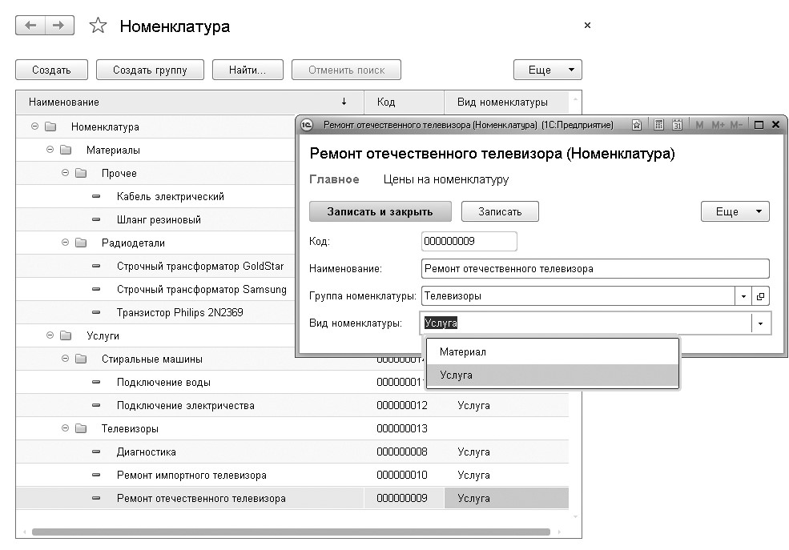

<strong>Рис. 10.3.</strong> Данные справочника «Номенклатура» 

<strong>Произвольное представление номенклатуры</strong>

Теперь, используя реквизит Вид номенклатуры, зададим произвольное представление номенклатуры в интерфейсе
	«1С:Предприятия». 

Представление номенклатуры используется везде, где отображаются поля, ссылающиеся на элементы справочника
	Номенклатура. Такие поля мы видим в табличной части наших документов, в регистре сведений, регистре накопления и т.
	д.

Стандартное представление номенклатуры (как и любого другого элемента справочника) определяется свойством справочника
	Основное представление. По умолчанию это свойство установлено в значение В виде наименования (рис. 10.4).

Поэтому, например, в табличной части документов в колонке Номенклатура мы видим не ссылку на номенклатуру, а ее
	наименование 

(рис. 10.5).

<strong>Рис. 10.5.</strong> Документ «Оказание услуги»

Было бы удобно, чтобы при отображении ссылок на номенклатуру в интерфейсе «1С:Предприятия» рядом с наименованием
	номенклатуры показывался бы и ее вид (материал или услуга). 

Выполним это изменение.

В режиме «Конфигуратор»

Механизм формирования представления объекта конфигурации состоит из двух этапов: определение реквизитов, участвующих
	в формировании представления, и собственно формирование представления. Для этого используются обработчики событий
	ОбработкаПолученияПолейПредставления и ОбработкаПолученияПредставления менеджера соответствующего объекта.

Вернемся в конфигуратор, выделим в дереве объектов конфигурации справочник Номенклатура, вызовем контекстное меню и
	выберем пункт Открыть модуль менеджера 

Открывшийся модуль менеджера справочника заполним следующим образом (листинги 10.1, 10.2).

<strong>листинг 10.1.</strong> Модуль менеджера справочника «Номенклатура» 

<table>
	<tr>
		<td>
Процедура ОбработкаПолученияПолейПредставления(Поля, СтандартнаяОбработка)
</td>
	</tr>
	<tr>
		<td></td>
	</tr>
	<tr>
		<td></td>
	</tr>
	<tr>
		<td></td>
	</tr>
	<tr>
		<td>
СтандартнаяОбработка = Ложь;
</td>
	</tr>
	<tr>
		<td></td>
	</tr>
	<tr>
		<td>
Поля.Добавить(&quot;Наименование&quot;);
</td>
	</tr>
	<tr>
		<td></td>
	</tr>
	<tr>
		<td>
Поля.Добавить(&quot;ВидНоменклатуры&quot;);
</td>
	</tr>
	<tr>
		<td></td>
	</tr>
	<tr>
		<td></td>
	</tr>
	<tr>
		<td></td>
	</tr>
	<tr>
		<td>
КонецПроцедуры
</td>
	</tr>
</table>

<strong>листинг 10.2.</strong> Модуль менеджера справочника «Номенклатура»

<table>
	<tr>
		<td>
Процедура ОбработкаПолученияПредставления(Данные, Представление, СтандартнаяОбработка)
</td>
	</tr>
	<tr>
		<td></td>
	</tr>
	<tr>
		<td></td>
	</tr>
	<tr>
		<td></td>
	</tr>
	<tr>
		<td>
СтандартнаяОбработка = Ложь;
</td>
	</tr>
	<tr>
		<td></td>
	</tr>
	<tr>
		<td>
Если ЗначениеЗаполнено(Данные.ВидНоменклатуры) Тогда 
</td>
	</tr>
	<tr>
		<td></td>
	</tr>
	<tr>
		<td>
Представление = Данные.Наименование + &quot; (&quot; + 
</td>
	</tr>
	<tr>
		<td></td>
	</tr>
	<tr>
		<td>
НРег(Строка(Данные.ВидНоменклатуры)) + &quot;)&quot;;
</td>
	</tr>
	<tr>
		<td></td>
	</tr>
	<tr>
		<td>
Иначе
</td>
	</tr>
	<tr>
		<td></td>
	</tr>
	<tr>
		<td>
Представление = Данные.Наименование;
</td>
	</tr>
	<tr>
		<td></td>
	</tr>
	<tr>
		<td>
КонецЕсли;
</td>
	</tr>
	<tr>
		<td></td>
	</tr>
	<tr>
		<td></td>
	</tr>
	<tr>
		<td></td>
	</tr>
	<tr>
		<td>
КонецПроцедуры
</td>
	</tr>
</table>

Прокомментируем этот код.

В обработчике события ОбработкаПолученияПолейПредставления мы описываем, какие реквизиты будут участвовать в
	формировании представления документа. Для этого сначала мы устанавливаем параметр СтандартнаяОбработка в значение
	Ложь, а затем добавляем в массив Поля нужные реквизиты справочника. Если параметр СтандартнаяОбработка в обработчике
	не установлен в значение Ложь, то массив Поля будет заполнен реквизитами, используемыми для формирования
	стандартного представления данного объекта (в нашем случае – это Наименование).

В обработчике события ОбработкаПолученияПредставления мы описываем алгоритм получения параметра Представление из
	массива полей, заданных нами в предыдущем обработчике. Данные, необходимые для формирования представления,
	передаются с помощью параметра Данные типа Структура. Для этого сначала мы устанавливаем параметр
	СтандартнаяОбработка в значение Ложь, а затем получаем представление номенклатуры путем добавления к ее наименованию
	вида номенклатуры, заключенного в скобки. Если параметр СтандартнаяОбработка в обработчике не установлен в значение
	Ложь, то система попытается сформировать стандартное представление объекта, исходя из переданных данных.

В режиме «1С:Предприятие»

Запустим «1С:Предприятие» в режиме отладки. 

В результате при открытии документа Оказание услуги в табличной части мы видим заданное нами представление
	номенклатуры 

(рис. 10.6).

<strong>Рис. 10.6.</strong> Документ «Оказание услуги»

По аналогии с рассмотренным примером произвольные представления объектов конфигурации можно задавать не только для
	справочников, но и для документов, планов видов характеристик, планов счетов и т. п. 

<strong>Регистрация расхода только той номенклатуры, которая является материалом</strong>

Если вы помните, на шестом занятии, когда создавались движения документа ОказаниеУслуги по регистру накопления
	ОстаткиМатериалов, мы сказали, что они не совсем правильные, поскольку в регистр будут попадать не только записи об
	израсходованных материалах, но и записи об оказанных услугах (листинг 10.3).

<strong>листинг 10.3.</strong> Процедура «ОбработкаПроведения()» документа «ОказаниеУслуги»

<table>
	<tr>
		<td>
Процедура ОбработкаПроведения(Отказ, Режим)
</td>
	</tr>
	<tr>
		<td></td>
	</tr>
	<tr>
		<td>
//{{__КОНСТРУКТОР_ДВИЖЕНИЙ_РЕГИСТРОВ
</td>
	</tr>
	<tr>
		<td></td>
	</tr>
	<tr>
		<td>
// Данный фрагмент построен конструктором.
</td>
	</tr>
	<tr>
		<td></td>
	</tr>
	<tr>
		<td>
// При повторном использовании конструктора внесенные вручную изменения будут утеряны!!!
</td>
	</tr>
	<tr>
		<td></td>
	</tr>
	<tr>
		<td></td>
	</tr>
	<tr>
		<td></td>
	</tr>
	<tr>
		<td>
// регистр ОстаткиМатериалов Расход
</td>
	</tr>
	<tr>
		<td></td>
	</tr>
	<tr>
		<td>
Движения.ОстаткиМатериалов.Записывать = Истина;
</td>
	</tr>
	<tr>
		<td></td>
	</tr>
	<tr>
		<td>
Для Каждого ТекСтрокаПереченьНоменклатуры Из ПереченьНоменклатуры Цикл
</td>
	</tr>
	<tr>
		<td></td>
	</tr>
	<tr>
		<td>
Движение = Движения.ОстаткиМатериалов.Добавить();
</td>
	</tr>
	<tr>
		<td></td>
	</tr>
	<tr>
		<td>
Движение.ВидДвижения = ВидДвиженияНакопления.Расход;
</td>
	</tr>
	<tr>
		<td></td>
	</tr>
	<tr>
		<td>
Движение.Период = Дата;
</td>
	</tr>
	<tr>
		<td></td>
	</tr>
	<tr>
		<td>
Движение.Материал = ТекСтрокаПереченьНоменклатуры.Номенклатура;
</td>
	</tr>
	<tr>
		<td></td>
	</tr>
	<tr>
		<td>
Движение.Склад = Склад;
</td>
	</tr>
	<tr>
		<td></td>
	</tr>
	<tr>
		<td>
Движение.Количество = ТекСтрокаПереченьНоменклатуры.Количество;
</td>
	</tr>
	<tr>
		<td></td>
	</tr>
	<tr>
		<td>
КонецЦикла;
</td>
	</tr>
	<tr>
		<td></td>
	</tr>
	<tr>
		<td></td>
	</tr>
	<tr>
		<td></td>
	</tr>
	<tr>
		<td>
//}}__КОНСТРУКТОР_ДВИЖЕНИЙ_РЕГИСТРОВ
</td>
	</tr>
	<tr>
		<td></td>
	</tr>
	<tr>
		<td>
КонецПроцедуры
</td>
	</tr>
</table>

Теперь мы доработаем документ таким образом, чтобы в регистре появлялись только записи, относящиеся к расходу
	материалов. 

Для этого мы сначала в режиме Конфигуратор изменим процедуру проведения документа так, чтобы в регистр попадали
	записи только о той номенклатуре, которая является материалом, а потом в режиме 1С:Предприятие заново проведем
	(перепроведем) все документы Оказание услуги, чтобы данные в регистре изменились в соответствии с новым алгоритмом
	проведения документа.

Эта доработка будет не совсем эффективна с точки зрения производительности, зато позволит нам получить нужные данные
	в регистре ОстаткиМатериалов. 

В режиме «Конфигуратор»

Скорректируем движения документа, исключив из обработки те строки табличной части, в которых находятся услуги.

Для этого откроем в конфигураторе модуль документа ОказаниеУслуги 

(контекстное меню документа – Открыть модуль объекта) и добавим в обработчик события ОбработкаПроведения это
	условие. 

Текст следует добавить в начало цикла обхода табличной части документа после строки Для Каждого
	ТекСтрокаПереченьНоменклатуры Из ПереченьНоменклатуры Цикл. 

В результате процедура ОбработкаПроведения должна выглядеть следующим образом (листинг 10.4). <strong>листинг
	10.4.</strong> Движения документа «ОказаниеУслуги» 

<table>
	<tr>
		<td>
Процедура ОбработкаПроведения(Отказ, Режим)
</td>
	</tr>
	<tr>
		<td></td>
	</tr>
	<tr>
		<td>
//{{__КОНСТРУКТОР_ДВИЖЕНИЙ_РЕГИСТРОВ
</td>
	</tr>
	<tr>
		<td></td>
	</tr>
	<tr>
		<td>
// Данный фрагмент построен конструктором.
</td>
	</tr>
	<tr>
		<td></td>
	</tr>
	<tr>
		<td>
// При повторном использовании конструктора внесенные вручную изменения будут утеряны!!!
</td>
	</tr>
	<tr>
		<td></td>
	</tr>
	<tr>
		<td></td>
	</tr>
	<tr>
		<td></td>
	</tr>
	<tr>
		<td>
// регистр ОстаткиМатериалов Расход
</td>
	</tr>
	<tr>
		<td></td>
	</tr>
	<tr>
		<td>
Движения.ОстаткиМатериалов.Записывать = Истина;
</td>
	</tr>
	<tr>
		<td></td>
	</tr>
	<tr>
		<td>
Для Каждого ТекСтрокаПереченьНоменклатуры Из ПереченьНоменклатуры Цикл
</td>
	</tr>
	<tr>
		<td></td>
	</tr>
	<tr>
		<td>
<strong>Если ТекСтрокаПереченьНоменклатуры.Номенклатура.ВидНоменклатуры = </strong>
</td>
	</tr>
	<tr>
		<td></td>
	</tr>
	<tr>
		<td>
<strong>Перечисления.ВидыНоменклатуры.Материал Тогда </strong>
</td>
	</tr>
	<tr>
		<td></td>
	</tr>
	<tr>
		<td>
Движение = Движения.ОстаткиМатериалов.Добавить();
</td>
	</tr>
	<tr>
		<td></td>
	</tr>
	<tr>
		<td>
Движение.ВидДвижения = ВидДвиженияНакопления.Расход;
</td>
	</tr>
	<tr>
		<td></td>
	</tr>
	<tr>
		<td>
Движение.Период = Дата;
</td>
	</tr>
	<tr>
		<td></td>
	</tr>
	<tr>
		<td>
Движение.Материал = ТекСтрокаПереченьНоменклатуры.Номенклатура;
</td>
	</tr>
	<tr>
		<td></td>
	</tr>
	<tr>
		<td>
Движение.Склад = Склад;
</td>
	</tr>
	<tr>
		<td></td>
	</tr>
	<tr>
		<td>
Движение.Количество = ТекСтрокаПереченьНоменклатуры.Количество;
</td>
	</tr>
	<tr>
		<td></td>
	</tr>
	<tr>
		<td>
<strong>КонецЕсли;</strong>
</td>
	</tr>
	<tr>
		<td></td>
	</tr>
	<tr>
		<td>
КонецЦикла;
</td>
	</tr>
	<tr>
		<td></td>
	</tr>
	<tr>
		<td></td>
	</tr>
	<tr>
		<td></td>
	</tr>
	<tr>
		<td>
//}}__КОНСТРУКТОР_ДВИЖЕНИЙ_РЕГИСТРОВ
</td>
	</tr>
	<tr>
		<td></td>
	</tr>
	<tr>
		<td>
КонецПроцедуры
</td>
	</tr>
</table>

Добавленный текст исключает выполнение операторов цикла для тех строк табличной части документа, в которых
	номенклатура не является материалом. Поясним это условие.

В переменной ТекСтрокаПереченьНоменклатуры содержатся на каждом шаге цикла данные текущей строки табличной части
	ПереченьНоменклатуры. 

Указывая через точку имя колонки Номенклатура (ТекСтрокаПереченьНоменклатуры.Номенклатура), мы обращаемся к ссылке на
	элемент номенклатуры, которая содержится в этой строке табличной части.

Затем, указывая через точку ВидНоменклатуры (ТекСтрокаПереченьНоменклатуры.Номенклатура.ВидНоменклатуры), мы
	обращаемся к реквизиту ВидНоменклатуры этого элемента справочника Номенклатура. 

Полученное значение с помощью оператора сравнения (=) мы сравниваем со значением Материал перечисления
	ВидыНоменклатуры (Перечисления.ВидыНоменклатуры.Материал).

Если значения совпадают, операторы цикла выполняются. Если нет, мы переходим к следующей итерации цикла, к следующей
	строке табличной части.

В режиме «1С:Предприятие»

Запустим «1С:Предприятие» в режиме отладки и проверим работу процедуры проведения документа Оказание услуги. 

Откроем список документов, выполнив команду Оказание услуг в разделе Оказание услуг. 

Откроем документ Оказание услуги № 1 и внесем в него следующие изменения: 

<ul>
	<li>удалим из табличной части строку, содержащую Транзистор</li>
</ul>

Philips;

<ul>
	<li>добавим услугу – Подключение воды;</li>
	<li>добавим материал – Шланг резиновый (рис. 10.7).</li>
</ul>

<strong>Рис. 10.7.</strong> Измененный документ «Оказание услуги № 1»

Обратите внимание, что цены подставляются автоматически из регистра сведений Цены. 

Нажмем кнопку Провести в командной панели формы документа. 

Затем выполним команду Остатки материалов в панели навигации формы, чтобы перейти к записям регистра Остатки
	материалов, связанным с данным документом (рис. 10.8).

<strong>Рис. 10.8.</strong> Записи регистра «Остатки материалов»

Как мы видим, в движения по регистру Остатки материалов включаются только строки, содержащие материалы. Запись про
	услугу Подключение воды в движения не попала.

Это особенно заметно, так как теперь в поле Материал регистра Остатки материалов представление номенклатуры включает
	также и вид номенклатуры, как мы задали в предыдущем разделе.

<h1>Лабораторная работа № 13 Покупка МПЗ за наличный расчет</h1>

<strong>Порядок выполнения работы </strong>

1. Ознакомьтесь с теоретическими основами в настоящих указаниях и конспектах лекций. 

2. Получите задание у преподавателя. 

3. Сделайте скриншоты (кнопка клавиатуры PrtSc) выполненных заданий в текстовом (Word) файле <em>Фамилия_ЛР</em>

4. Составьте отчет по лабораторной работе. 

5. Отчитайте работу преподавателю.

<strong>Добавление еще одного регистра накопления</strong>

В режиме «Конфигуратор»

Регистр СтоимостьМатериалов совсем не сложен, поэтому мы не будем подробно останавливаться на его создании. 

Создадим новый объект конфигурации Регистр накопления с именем СтоимостьМатериалов. 

Расширенное представление списка зададим как Движения по регистру Стоимость материалов. Этот заголовок будет
	отображаться в окне списка записей регистра.

На закладке Подсистемы отметим, что этот регистр будет отображаться в подсистемах Бухгалтерия, Учет материалов и
	Оказание услуг. 

На закладке Данные создадим для регистра одно измерение – Материал типа СправочникСсылка.Номенклатура и один ресурс –
	Стоимость типа Число длиной 15 и точностью 2.

После создания регистр СтоимостьМатериалов должен выглядеть в дереве конфигурации следующим образом 

(рис. 11.1).

<strong>Рис. 11.1.</strong> Регистр накопления 

«Стоимость материалов»

Теперь отредактируем командный интерфейс, чтобы в разделах Бухгалтерия, Оказание услуг и Учет материалов была
	доступна команда для просмотра нашего регистра накопления. 

В дереве объектов конфигурации выделим ветвь Подсистемы, вызовем ее контекстное меню и выберем пункт Все
	подсистемы. 

В открывшемся окне слева в списке Подсистемы выделим подсистему Бухгалтерия. 

Справа в списке Командный интерфейс отразятся все команды выбранной подсистемы. 

В группе Панель навигации.Обычное включим видимость у команды 

Стоимость материалов и мышью перетащим ее в группу Панель 

<strong>Рис. 11.2.</strong> Настройка командного интерфейса подсистем

Аналогично, выделив подсистемы ОказаниеУслуг и УчетМатериалов, в группе Панель навигации.Обычное включим видимость у
	команды Стоимость материалов и перенесем ее в группу Панель навигации.См. также.

Теперь мы можем приступить к внесению изменений в процедуры проведения наших документов. 

Начнем с самого простого – документа Приходная накладная.

<strong>Проведение приходной накладной по двум регистрам</strong>

В режиме «Конфигуратор»

Изменение процедуры проведения

Откроем в конфигураторе окно редактирования объекта конфигурации Документ ПриходнаяНакладная и перейдем на закладку
	Движения. 

В списке регистров отметим, что документ будет создавать теперь движения и по регистру СтоимостьМатериалов (рис.
	11.3).

в регистре «Стоимость материалов»

Нажмем кнопку Конструктор движений. На вопрос системы о замещении процедуры проведения документа на новую,
	сформированную конструктором, ответим утвердительно. Мы ничего не потеряем, так как конструктор в обработке
	проведения сформирует движения уже по двум регистрам, а в прежнюю процедуру проведения мы никаких изменений не
	вносили. 

В открывшемся окне конструктора движений мы увидим, что для регистра ОстаткиМатериалов все поля конструктора уже
	содержат информацию, которую мы задавали ранее при формировании движений для этого регистра. Над списком Регистры
	нажмем кнопку Добавить и добавим еще один регистр СтоимостьМатериалов (рис. 11.4).

<strong>Рис. 11.4.</strong> Конструктор движений регистров

Тип движения регистра СтоимостьМатериалов по умолчанию будет установлен как Приход (пиктограмма со знаком + слева от
	имени регистра).

В поле выбора Табличная часть выберем табличную часть нашего документа – Материалы. 

Список реквизитов документа, который уже заполнен реквизитами шапки документа, автоматически дополнится реквизитами
	нашей табличной части. 

Теперь нажмем кнопку Заполнить выражения. В нижнем окне сформируется соответствие полей (измерений и ресурсов)
	регистра и выражений для их расчета.

Чтобы задать нужное соответствие для поля регистра Стоимость, нужно его выделить и в окне Реквизиты документа дважды
	щелкнуть по строке ТекСтрокаМатериалы.Сумма (рис. 11.5).

Нажмем ОК. После этого откроется модуль объекта документа Приходная накладная. Откроем процедуру обработчика события
	ОбработкаПроведения.

<strong>Рис. 11.5.</strong> Конструктор движений регистров

Мы увидим, что конструктор сформировал новый текст обработчика, содержащий движения по двум регистрам (листинг 11.1).
	<strong>листинг 11.1.</strong> Движения документа «ПриходнаяНакладная»

<table>
	<tr>
		<td>
Процедура ОбработкаПроведения(Отказ, Режим)
</td>
	</tr>
	<tr>
		<td></td>
	</tr>
	<tr>
		<td>
//{{__КОНСТРУКТОР_ДВИЖЕНИЙ_РЕГИСТРОВ
</td>
	</tr>
	<tr>
		<td></td>
	</tr>
	<tr>
		<td>
// Данный фрагмент построен конструктором.
</td>
	</tr>
	<tr>
		<td></td>
	</tr>
	<tr>
		<td>
// При повторном использовании конструктора внесенные вручную изменения будут утеряны!!!
</td>
	</tr>
	<tr>
		<td></td>
	</tr>
	<tr>
		<td></td>
	</tr>
	<tr>
		<td></td>
	</tr>
	<tr>
		<td>
// регистр ОстаткиМатериалов Приход
</td>
	</tr>
	<tr>
		<td></td>
	</tr>
	<tr>
		<td>
Движения.ОстаткиМатериалов.Записывать = Истина;
</td>
	</tr>
	<tr>
		<td></td>
	</tr>
	<tr>
		<td>
Для Каждого ТекСтрокаМатериалы Из Материалы Цикл
</td>
	</tr>
	<tr>
		<td></td>
	</tr>
	<tr>
		<td>
Движение = Движения.ОстаткиМатериалов.Добавить();
</td>
	</tr>
	<tr>
		<td></td>
	</tr>
	<tr>
		<td>
Движение.ВидДвижения = ВидДвиженияНакопления.Приход;
</td>
	</tr>
	<tr>
		<td></td>
	</tr>
	<tr>
		<td>
Движение.Период = Дата;
</td>
	</tr>
	<tr>
		<td></td>
	</tr>
	<tr>
		<td>
Движение.Материал = ТекСтрокаМатериалы.Материал;
</td>
	</tr>
	<tr>
		<td></td>
	</tr>
	<tr>
		<td>
Движение.Склад = Склад;
</td>
	</tr>
	<tr>
		<td></td>
	</tr>
	<tr>
		<td>
Движение.Количество = ТекСтрокаМатериалы.Количество;
</td>
	</tr>
	<tr>
		<td></td>
	</tr>
	<tr>
		<td>
КонецЦикла;
</td>
	</tr>
	<tr>
		<td></td>
	</tr>
	<tr>
		<td></td>
	</tr>
	<tr>
		<td></td>
	</tr>
	<tr>
		<td>
<strong>// регистр СтоимостьМатериалов Приход</strong>
</td>
	</tr>
	<tr>
		<td></td>
	</tr>
	<tr>
		<td>
<strong>Движения.СтоимостьМатериалов.Записывать = Истина;</strong>
</td>
	</tr>
	<tr>
		<td></td>
	</tr>
	<tr>
		<td>
<strong>Для Каждого ТекСтрокаМатериалы Из Материалы Цикл</strong>
</td>
	</tr>
	<tr>
		<td></td>
	</tr>
	<tr>
		<td>
<strong>Движение = Движения.СтоимостьМатериалов.Добавить();</strong>
</td>
	</tr>
	<tr>
		<td></td>
	</tr>
	<tr>
		<td>
<strong>Движение.ВидДвижения = ВидДвиженияНакопления.Приход;</strong>
</td>
	</tr>
	<tr>
		<td></td>
	</tr>
	<tr>
		<td>
<strong>Движение.Период = Дата;</strong>
</td>
	</tr>
	<tr>
		<td></td>
	</tr>
	<tr>
		<td>
<strong>Движение.Материал = ТекСтрокаМатериалы.Материал;</strong>
</td>
	</tr>
</table>

Движение.Стоимость = ТекСтрокаМатериалы.Сумма;

<table>
	<tr>
		<td>
<strong>КонецЦикла;</strong>
</td>
	</tr>
	<tr>
		<td></td>
	</tr>
	<tr>
		<td></td>
	</tr>
	<tr>
		<td></td>
	</tr>
	<tr>
		<td>
//}}__КОНСТРУКТОР_ДВИЖЕНИЙ_РЕГИСТРОВ
</td>
	</tr>
	<tr>
		<td></td>
	</tr>
	<tr>
		<td>
КонецПроцедуры
</td>
	</tr>
</table>

Мы видим, что фрагмент, добавленный конструктором в процедуру обработки проведения документа для регистра
	СтоимостьМатериалов, аналогичен фрагменту для формирования движений по регистру ОстаткиМатериалов. 

Однако сразу бросается в глаза, что совершенно не нужно обходить два одинаковых цикла по элементам табличной части
	Материалы. Можно в одном цикле формировать движения сразу по двум регистрам.

Выполним эту небольшую оптимизацию. И еще удалим комментарии, внесенные конструктором.

В результате процедура ОбработкаПроведения будет выглядеть следующим образом (листинг 11.2). <strong>листинг
	11.2.</strong> Движения документа «ПриходнаяНакладная»

<table>
	<tr>
		<td>
Процедура ОбработкаПроведения(Отказ, Режим)
</td>
	</tr>
	<tr>
		<td></td>
	</tr>
	<tr>
		<td></td>
	</tr>
	<tr>
		<td></td>
	</tr>
	<tr>
		<td>
Движения.ОстаткиМатериалов.Записывать = Истина;
</td>
	</tr>
	<tr>
		<td></td>
	</tr>
	<tr>
		<td>
Движения.СтоимостьМатериалов.Записывать = Истина;
</td>
	</tr>
	<tr>
		<td></td>
	</tr>
	<tr>
		<td></td>
	</tr>
	<tr>
		<td></td>
	</tr>
	<tr>
		<td>
Для Каждого ТекСтрокаМатериалы Из Материалы Цикл
</td>
	</tr>
	<tr>
		<td></td>
	</tr>
	<tr>
		<td></td>
	</tr>
	<tr>
		<td></td>
	</tr>
	<tr>
		<td>
// Регистр ОстаткиМатериалов Приход
</td>
	</tr>
	<tr>
		<td></td>
	</tr>
	<tr>
		<td>
Движение = Движения.ОстаткиМатериалов.Добавить();
</td>
	</tr>
	<tr>
		<td></td>
	</tr>
	<tr>
		<td>
Движение.ВидДвижения = ВидДвиженияНакопления.Приход;
</td>
	</tr>
	<tr>
		<td></td>
	</tr>
	<tr>
		<td>
Движение.Период = Дата;
</td>
	</tr>
	<tr>
		<td></td>
	</tr>
	<tr>
		<td>
Движение.Материал = ТекСтрокаМатериалы.Материал;
</td>
	</tr>
	<tr>
		<td></td>
	</tr>
	<tr>
		<td>
Движение.Склад = Склад;
</td>
	</tr>
	<tr>
		<td></td>
	</tr>
	<tr>
		<td>
Движение.Количество = ТекСтрокаМатериалы.Количество;
</td>
	</tr>
	<tr>
		<td></td>
	</tr>
	<tr>
		<td></td>
	</tr>
	<tr>
		<td></td>
	</tr>
	<tr>
		<td>
// Регистр Стоимость Материалов Приход
</td>
	</tr>
	<tr>
		<td></td>
	</tr>
	<tr>
		<td>
Движение = Движения.СтоимостьМатериалов.Добавить();
</td>
	</tr>
	<tr>
		<td></td>
	</tr>
	<tr>
		<td>
Движение.ВидДвижения = ВидДвиженияНакопления.Приход;
</td>
	</tr>
	<tr>
		<td></td>
	</tr>
	<tr>
		<td>
Движение.Период = Дата;
</td>
	</tr>
	<tr>
		<td></td>
	</tr>
	<tr>
		<td>
Движение.Материал = ТекСтрокаМатериалы.Материал;
</td>
	</tr>
	<tr>
		<td></td>
	</tr>
	<tr>
		<td>
Движение.Стоимость = ТекСтрокаМатериалы.Сумма;
</td>
	</tr>
	<tr>
		<td></td>
	</tr>
	<tr>
		<td></td>
	</tr>
	<tr>
		<td></td>
	</tr>
	<tr>
		<td>
КонецЦикла;
</td>
	</tr>
	<tr>
		<td></td>
	</tr>
	<tr>
		<td></td>
	</tr>
	<tr>
		<td></td>
	</tr>
	<tr>
		<td>
КонецПроцедуры
</td>
	</tr>
</table>

Команда перехода к записям регистра

В заключение отредактируем командный интерфейс формы документа, чтобы в панели навигации формы иметь возможность
	переходить к списку записей регистра СтоимостьМатериалов, связанному с документом. 

Для этого откроем форму документа ПриходнаяНакладная. В левом верхнем окне перейдем на закладку Командный интерфейс.
	В разделе Панель навигации раскроем группу Перейти и увидим команду для открытия регистра накопления Стоимость
	материалов. Установим свойство Видимость для этой команды (рис. 11.6).

документа «ПриходнаяНакладная»

В режиме «1С:Предприятие»

В режиме 1С:Предприятие наша задача будет заключаться в том, чтобы провести еще раз (перепровести) все приходные
	накладные. Это необходимо для того, чтобы эти документы создали новые записи в регистрах в соответствии с алгоритмом
	проведения, который мы только что изменили. 

Запустим «1С:Предприятие» в режиме отладки. Откроем список документов, выполнив команду Приходные накладные в разделе
	Учет материалов. 

Выделим одновременно, используя клавишу Ctrl, все приходные накладные и перепроведем их, выполнив команду Провести из
	подменю Еще. 

Затем откроем первый документ (рис. 11.7) и, выполнив команды перехода к регистрам Остатки материалов и Стоимость
	материалов, убедимся, что документ создает желаемые записи как в одном (рис. 11.8), так и в другом регистре
	накопления (рис. 11.9).

<strong>Рис. 11.8.</strong> Записи регистра «Остатки материалов»

<strong>Рис. 11.9.</strong> Записи регистра «Стоимость материалов»

<h1>Лабораторная работа № 14 Учет затрат на производство</h1>

<strong>Порядок выполнения работы </strong>

1. Ознакомьтесь с теоретическими основами в настоящих указаниях и конспектах лекций. 

2. Получите задание у преподавателя. 

3. Сделайте скриншоты (кнопка клавиатуры PrtSc) выполненных заданий в текстовом (Word) файле <em>Фамилия_ЛР</em>

4. Составьте отчет по лабораторной работе. 

5. Отчитайте работу преподавателю.

<strong>Проведение документа «Оказание услуги» по двум регистрам</strong>

В заключение мы внесем изменения в процедуру обработки проведения документа ОказаниеУслуги. 

При этом мы будем исходить из пожелания, высказанного руководством ООО «На все руки мастер». Суть его заключается в
	том, что на первом этапе при списании материалов, израсходованных в процессе оказания услуги, должна быть
	возможность указывать различную стоимость для одного и того же материала, которая рассчитана руководством исходя из
	текущих конъюнктурных соображений.

Поскольку в документе ОказаниеУслуги у нас отражена только цена номенклатуры, нам понадобится:

<ol>
	<li>Добавить в табличную часть документа еще один реквизит, в котором будет указываться стоимость номенклатуры.</li>
	<li>После этого изменить процедуру проведения документа ОказаниеУслуги.</li>
	<li>И в заключение в режиме 1С:Предприятие перепровести все эти документы, чтобы отработал новый измененный нами
		алгоритм проведения документов Оказание услуги.
	</li>
</ol>

В режиме «Конфигуратор»

Новый реквизит документа

Откроем в конфигураторе окно редактирования объекта конфигурации Документ ОказаниеУслуги и перейдем на закладку
	Данные. 

Создадим новый реквизит табличной части документа с именем Стоимость, типом Число, длиной 15 и точностью 2,
	неотрицательное (рис. 11.10).

После этого откроем форму ФормаДокумента документа Оказа- ниеУслуги и добавим в табличную часть ПереченьНоменклатуры
	поле, отображающее новый реквизит Стоимость. 

Для этого в правом верхнем окне редактора форм на закладке Реквизиты раскроем реквизит формы Объект (рис.
	11.11). 

<strong>Рис. 11.11.</strong> Изменение формы документа «ОказаниеУслуги»

Мы видим, что он содержит все реквизиты документа ОказаниеУслуги. 

Найдем в табличной части реквизит Стоимость и с помощью мыши перетащим его в окно элементов формы, расположенное
	слева в верхней части редактора форм. 

Новый элемент расположим в структуре элементов формы после поля Номенклатура. Оставим свойства элемента формы,
	предложенные по умолчанию.

Новый реквизит сразу же отобразится в форме документа, расположенной в левом нижнем окне редактора форм (рис.
	11.12).

<strong>Рис. 11.12.</strong> Изменение формы документа «ОказаниеУслуги»

Изменение процедуры проведения

Теперь создадим движения документа ОказаниеУслуги. 

В окне редактирования объекта конфигурации Документ Оказа- ниеУслуги перейдем на закладку Движения. В списке
	регистров отметим, что документ будет создавать теперь движения и по регистру СтоимостьМатериалов. 

Чтобы не потерять изменения, которые мы вносили в процедуру обработки проведения этого документа на предыдущем
	занятии, на этот раз мы не будем использовать конструктор движений документа, а внесем необходимые дополнения прямо
	в обработчик события ОбработкаПроведения документа ОказаниеУслуги. 

Перейдем на закладку Прочее и откроем модуль объекта. Для этого нажмем кнопку Модуль объекта. Откроем процедуру
	обработчика события ОбработкаПроведения. 

В самом конце цикла перед строкой КонецЕсли добавим строки кода, создающие движения регистра СтоимостьМатериалов,
	производимые документом ОказаниеУслуги (листинг 11.3).

<strong>листинг 11.3.</strong> Движения документа «ОказаниеУслуги» (фрагмент)

<table>
	<tr>
		<td>
<strong>// регистр СтоимостьМатериалов Расход</strong>
</td>
	</tr>
	<tr>
		<td></td>
	</tr>
	<tr>
		<td>
<strong>Движение = Движения.СтоимостьМатериалов.Добавить();</strong>
</td>
	</tr>
	<tr>
		<td></td>
	</tr>
	<tr>
		<td>
<strong>Движение.ВидДвижения = ВидДвиженияНакопления.Расход;</strong>
</td>
	</tr>
	<tr>
		<td></td>
	</tr>
	<tr>
		<td>
<strong>Движение.Период = Дата;</strong>
</td>
	</tr>
	<tr>
		<td></td>
	</tr>
	<tr>
		<td>
<strong>Движение.Материал = ТекСтрокаПереченьНоменклатуры.Номенклатура;</strong>
</td>
	</tr>
	<tr>
		<td></td>
	</tr>
	<tr>
		<td>
<strong>Движение.Стоимость = ТекСтрокаПереченьНоменклатуры.Количество * </strong>
</td>
	</tr>
	<tr>
		<td></td>
	</tr>
	<tr>
		<td>
<strong>ТекСтрокаПереченьНоменклатуры.Стоимость;</strong>
</td>
	</tr>
</table>

Перед началом цикла установим свойство Записывать набора записей движений по этому регистру в значение Истина. Удалим
	комментарии, внесенные конструктором.

В результате процедура ОбработкаПроведения будет выглядеть следующим образом (листинг 11.4). <strong>листинг
	11.4.</strong> Движения документа «ОказаниеУслуги»

<table>
	<tr>
		<td>
Процедура ОбработкаПроведения(Отказ, Режим)
</td>
	</tr>
	<tr>
		<td></td>
	</tr>
	<tr>
		<td></td>
	</tr>
	<tr>
		<td></td>
	</tr>
	<tr>
		<td>
Движения.ОстаткиМатериалов.Записывать = Истина;
</td>
	</tr>
	<tr>
		<td></td>
	</tr>
	<tr>
		<td>
<strong>Движения.СтоимостьМатериалов.Записывать = Истина;</strong>
</td>
	</tr>
	<tr>
		<td></td>
	</tr>
	<tr>
		<td></td>
	</tr>
	<tr>
		<td></td>
	</tr>
	<tr>
		<td>
Для Каждого ТекСтрокаПереченьНоменклатуры Из ПереченьНоменклатуры Цикл
</td>
	</tr>
	<tr>
		<td></td>
	</tr>
	<tr>
		<td>
Если ТекСтрокаПереченьНоменклатуры.Номенклатура.ВидНоменклатуры = 
</td>
	</tr>
	<tr>
		<td></td>
	</tr>
	<tr>
		<td>
Перечисления.ВидыНоменклатуры.Материал Тогда 
</td>
	</tr>
	<tr>
		<td></td>
	</tr>
	<tr>
		<td></td>
	</tr>
	<tr>
		<td></td>
	</tr>
	<tr>
		<td>
// Регистр ОстаткиМатериалов Расход
</td>
	</tr>
	<tr>
		<td></td>
	</tr>
	<tr>
		<td>
Движение = Движения.ОстаткиМатериалов.Добавить();
</td>
	</tr>
	<tr>
		<td></td>
	</tr>
	<tr>
		<td>
Движение.ВидДвижения = ВидДвиженияНакопления.Расход;
</td>
	</tr>
	<tr>
		<td></td>
	</tr>
	<tr>
		<td>
Движение.Период = Дата;
</td>
	</tr>
	<tr>
		<td></td>
	</tr>
	<tr>
		<td>
Движение.Материал = ТекСтрокаПереченьНоменклатуры.Номенклатура;
</td>
	</tr>
	<tr>
		<td></td>
	</tr>
	<tr>
		<td>
Движение.Склад = Склад;
</td>
	</tr>
	<tr>
		<td></td>
	</tr>
	<tr>
		<td>
Движение.Количество = ТекСтрокаПереченьНоменклатуры.Количество;
</td>
	</tr>
	<tr>
		<td></td>
	</tr>
	<tr>
		<td></td>
	</tr>
	<tr>
		<td></td>
	</tr>
	<tr>
		<td>
<strong>// Регистр СтоимостьМатериалов Расход</strong>
</td>
	</tr>
	<tr>
		<td></td>
	</tr>
	<tr>
		<td>
<strong>Движение = Движения.СтоимостьМатериалов.Добавить();</strong>
</td>
	</tr>
	<tr>
		<td></td>
	</tr>
	<tr>
		<td>
<strong>Движение.ВидДвижения = ВидДвиженияНакопления.Расход;</strong>
</td>
	</tr>
	<tr>
		<td></td>
	</tr>
	<tr>
		<td>
<strong>Движение.Период = Дата;</strong>
</td>
	</tr>
	<tr>
		<td></td>
	</tr>
	<tr>
		<td>
<strong>Движение.Материал = ТекСтрокаПереченьНоменклатуры.Номенклатура;</strong>
</td>
	</tr>
	<tr>
		<td></td>
	</tr>
	<tr>
		<td>
<strong>Движение.Стоимость = ТекСтрокаПереченьНоменклатуры.Количество </strong>
</td>
	</tr>
	<tr>
		<td></td>
	</tr>
	<tr>
		<td>
<strong>* ТекСтрокаПереченьНоменклатуры.Стоимость;</strong>
</td>
	</tr>
	<tr>
		<td></td>
	</tr>
	<tr>
		<td>
КонецЕсли;
</td>
	</tr>
	<tr>
		<td></td>
	</tr>
	<tr>
		<td>
КонецЦикла;
</td>
	</tr>
	<tr>
		<td></td>
	</tr>
	<tr>
		<td></td>
	</tr>
	<tr>
		<td></td>
	</tr>
	<tr>
		<td>
КонецПроцедуры
</td>
	</tr>
</table>

Обратите внимание, что измерение регистра Стоимость вычисляется как произведение стоимости и количества, указанных в
	табличной части документа.

В заключение отредактируем командный интерфейс формы документа, чтобы в панели навигации формы иметь возможность
	переходить к списку записей регистра Стоимость Материалов, связанному с документом. 

Для этого откроем форму документа ОказаниеУслуги. В левом верхнем окне перейдем на закладку Командный интерфейс. В
	разделе Панель навигации раскроем группу Перейти и увидим команду для открытия регистра накопления Стоимость
	материалов. Установим свойство Видимость для этой команды.

В режиме «1С:Предприятие»

В режиме 1С:Предприятие наша задача будет заключаться в том, чтобы провести еще раз (перепровести) наш документ
	оказания услуги. Это необходимо для того, чтобы этот документ создал новые записи в регистрах в соответствии с
	алгоритмом проведения, который мы только что изменили. 

Запустим «1С:Предприятие» в режиме отладки и откроем список документов, выполнив команду Оказание услуг в разделе
	Оказание услуг. 

Откроем документ Оказание услуги № 1 и укажем в нем стоимость резинового шланга – 100 (рис. 11.13).

<strong>Рис. 11.13.</strong> Документ «Оказание услуги № 1»

Проведем документ Оказание услуги № 1 и посмотрим на движения этого документа по регистру Стоимость материалов. 

Для этого нажмем кнопку Провести и выполним команду перехода к регистру Стоимость материалов (рис. 11.14).

<strong>Рис. 11.14.</strong> Записи регистра «Стоимость материалов»

Теперь создадим и проведем еще два документа Оказание услуги. 

Для этого в форме списка документов нажмем кнопку Создать или в панели действий раздела Оказание услуг выполним
	команду 

<strong>Рис. 11.15.</strong> Создание новых документов

Эти документы понадобятся нам в дальнейшем, поэтому будьте внимательны и обратите внимание на то, что эти документы
	созданы другими датами (рис. 11.16, 11.17).

<strong>Рис. 11.16.</strong> Документ «Оказание услуги № 2»

<strong>Рис. 11.17.</strong> Документ «Оказание услуги № 3»

Движения документов Оказание услуги № 2 и № 3 по регистру Стоимость материалов должны выглядеть соответственно
	следующим образом (рис. 11.18, 11.19).

<strong>Рис. 11.18.</strong> Движения документа «Оказание услуги № 2»

<strong>Рис. 11.19.</strong> Движения документа «Оказание услуги № 3»

<h1>Лабораторная работа № 15Учет НМА</h1>

<strong>Порядок выполнения работы </strong>

1. Ознакомьтесь с теоретическими основами в настоящих указаниях и конспектах лекций. 

2. Получите задание у преподавателя. 

3. Сделайте скриншоты (кнопка клавиатуры PrtSc) выполненных заданий в текстовом (Word) файле <em>Фамилия_ЛР</em>

4. Составьте отчет по лабораторной работе. 

5. Отчитайте работу преподавателю.

<strong>Добавление оборотного регистра накопления</strong>

В режиме «Конфигуратор»

Теперь, когда мы знаем практически все о регистрах накопления, откроем конфигуратор и создадим новый объект
	конфигурации Регистр накопления. 

Назовем его Продажи и определим вид регистра – Обороты. 

Кроме этого, зададим Расширенное представление списка как Движения по регистру Продажи. Этот заголовок будет
	отображаться в окне списка записей регистра (рис. 12.1).

На закладке Подсистемы отметим, что этот регистр будет отображаться в подсистемах Бухгалтерия, Учет материалов и
	Оказание услуг.

На закладке Данные создадим измерения регистра:

<ul>
	<li>Номенклатура, тип СправочникСсылка.Номенклатура;</li>
	<li>Клиент, тип СправочникСсылка.Клиенты;</li>
	<li>Мастер, тип СправочникСсылка.Сотрудники.</li>
</ul>

<strong>Рис. 12.1.</strong> Создание оборотного регистра накопления

У регистра будет три ресурса:

<ul>
	<li>Количество, тип Число, длина 15, точность 3;</li>
	<li>Выручка, тип Число, длина 15, точность 2;</li>
	<li>Стоимость, тип Число, длина 15, точность 2.</li>
</ul>

После создания регистр Продажи должен выглядеть в дереве конфи-

 гурации следующим образом 

(рис. 12.2).

<strong>Рис. 12.2.</strong> Оборотный регистр накопления «Продажи»

Теперь отредактируем командный интерфейс, чтобы в подсистемах Бухгалтерия, Оказание услуг и Учет материалов была
	доступна команда для просмотра нашего оборотного регистра накопления. 

В дереве объектов конфигурации выделим ветвь Подсистемы, вызовем ее контекстное меню и выберем пункт Все
	подсистемы. 

В открывшемся окне слева в списке Подсистемы выделим подсистему Бухгалтерия. 

Справа в списке Командный интерфейс отразятся все команды выбранной подсистемы. 

В группе Панель навигации.Обычное включим видимость у команды Продажи и мышью перетащим ее в группу Панель
	навигации.См. также. 

Аналогично, выделив подсистемы ОказаниеУслуг и УчетМатериалов, в группе Панель навигации.Обычное включим видимость у
	команды Продажи и перенесем ее в группу Панель навигации.См. также.

<strong>Проведение документа «Оказание услуги» по трем регистрам</strong>

В этом разделе мы сначала изменим процедуру проведения документа ОказаниеУслуги, а затем в режиме 1С:Предприятие
	перепроведем все эти документы, чтобы отработал новый, измененный нами алгоритм проведения документов Оказание
	услуги. 

В режиме «Конфигуратор»

Откроем окно редактирования объекта конфигурации Документ ОказаниеУслуги и на закладке Движения укажем, что этот
	документ будет создавать движения еще и по регистру Продажи.

Перейдем на закладку Прочее и откроем модуль документа. Для этого нажмем кнопку Модуль объекта. 

Откроем процедуру обработчика события ОбработкаПроведения. 

В конце цикла после строки КонецЕсли и перед строкой КонецЦикла добавим строки кода, создающие движения регистра
	Продажи, производимые документом ОказаниеУслуги (листинг 12.1).

<strong>листинг 12.1.</strong> Движения документа «ОказаниеУслуги» (фрагмент)

<strong>// Регистр Продажи </strong>

<table>
	<tr>
		<td>
<strong>Движение = Движения.Продажи.Добавить();</strong>
</td>
	</tr>
	<tr>
		<td></td>
	</tr>
	<tr>
		<td>
<strong>Движение.Период = Дата;</strong>
</td>
	</tr>
	<tr>
		<td></td>
	</tr>
	<tr>
		<td>
<strong>Движение.Номенклатура = ТекСтрокаПереченьНоменклатуры.Номенклатура;</strong>
</td>
	</tr>
	<tr>
		<td></td>
	</tr>
	<tr>
		<td>
<strong>Движение.Клиент = Клиент;</strong>
</td>
	</tr>
	<tr>
		<td></td>
	</tr>
	<tr>
		<td>
<strong>Движение.Мастер = Мастер;</strong>
</td>
	</tr>
	<tr>
		<td></td>
	</tr>
	<tr>
		<td>
<strong>Движение.Количество = ТекСтрокаПереченьНоменклатуры.Количество;</strong>
</td>
	</tr>
	<tr>
		<td></td>
	</tr>
	<tr>
		<td>
<strong>Движение.Выручка = ТекСтрокаПереченьНоменклатуры.Сумма;</strong>
</td>
	</tr>
	<tr>
		<td></td>
	</tr>
	<tr>
		<td>
<strong>Движение.Стоимость = ТекСтрокаПереченьНоменклатуры.Стоимость * </strong>
</td>
	</tr>
	<tr>
		<td></td>
	</tr>
	<tr>
		<td>
<strong>ТекСтрокаПереченьНоменклатуры.Количество;</strong>
</td>
	</tr>
</table>

Перед началом цикла установим свойство Записывать набора записей движений по этому регистру в значение Истина.

В результате процедура ОбработкаПроведения будет выглядеть следующим образом (листинг 12.2). <strong>листинг
	12.2.</strong> Движения документа «ОказаниеУслуги»

<table>
	<tr>
		<td>
Процедура ОбработкаПроведения(Отказ, Режим)
</td>
	</tr>
	<tr>
		<td></td>
	</tr>
	<tr>
		<td></td>
	</tr>
	<tr>
		<td></td>
	</tr>
	<tr>
		<td>
Движения.ОстаткиМатериалов.Записывать = Истина;
</td>
	</tr>
	<tr>
		<td></td>
	</tr>
	<tr>
		<td>
Движения.СтоимостьМатериалов.Записывать = Истина;
</td>
	</tr>
	<tr>
		<td></td>
	</tr>
	<tr>
		<td>
<strong>Движения.Продажи.Записывать = Истина;</strong>
</td>
	</tr>
	<tr>
		<td></td>
	</tr>
	<tr>
		<td></td>
	</tr>
	<tr>
		<td></td>
	</tr>
	<tr>
		<td>
Для Каждого ТекСтрокаПереченьНоменклатуры Из ПереченьНоменклатуры Цикл
</td>
	</tr>
	<tr>
		<td></td>
	</tr>
	<tr>
		<td>
Если ТекСтрокаПереченьНоменклатуры.Номенклатура.ВидНоменклатуры = 
</td>
	</tr>
	<tr>
		<td></td>
	</tr>
	<tr>
		<td>
Перечисления.ВидыНоменклатуры.Материал Тогда 
</td>
	</tr>
	<tr>
		<td></td>
	</tr>
	<tr>
		<td>
// Регистр ОстаткиМатериалов Расход
</td>
	</tr>
	<tr>
		<td></td>
	</tr>
	<tr>
		<td>
Движение = Движения.ОстаткиМатериалов.Добавить();
</td>
	</tr>
	<tr>
		<td></td>
	</tr>
	<tr>
		<td>
Движение.ВидДвижения = ВидДвиженияНакопления.Расход;
</td>
	</tr>
	<tr>
		<td></td>
	</tr>
	<tr>
		<td>
Движение.Период = Дата;
</td>
	</tr>
	<tr>
		<td></td>
	</tr>
	<tr>
		<td>
Движение.Материал = ТекСтрокаПереченьНоменклатуры.Номенклатура;
</td>
	</tr>
	<tr>
		<td></td>
	</tr>
	<tr>
		<td>
Движение.Склад = Склад;
</td>
	</tr>
	<tr>
		<td></td>
	</tr>
	<tr>
		<td>
Движение.Количество = ТекСтрокаПереченьНоменклатуры.Количество;
</td>
	</tr>
	<tr>
		<td></td>
	</tr>
	<tr>
		<td></td>
	</tr>
	<tr>
		<td></td>
	</tr>
	<tr>
		<td>
// Регистр СтоимостьМатериалов Расход
</td>
	</tr>
	<tr>
		<td></td>
	</tr>
	<tr>
		<td>
Движение = Движения.СтоимостьМатериалов.Добавить();
</td>
	</tr>
	<tr>
		<td></td>
	</tr>
	<tr>
		<td>
Движение.ВидДвижения = ВидДвиженияНакопления.Расход;
</td>
	</tr>
	<tr>
		<td></td>
	</tr>
	<tr>
		<td>
Движение.Период = Дата;
</td>
	</tr>
	<tr>
		<td></td>
	</tr>
	<tr>
		<td>
Движение.Материал = ТекСтрокаПереченьНоменклатуры.Номенклатура;
</td>
	</tr>
	<tr>
		<td></td>
	</tr>
	<tr>
		<td>
Движение.Стоимость = ТекСтрокаПереченьНоменклатуры.Количество * 
</td>
	</tr>
	<tr>
		<td></td>
	</tr>
	<tr>
		<td>
ТекСтрокаПереченьНоменклатуры.Стоимость;
</td>
	</tr>
	<tr>
		<td></td>
	</tr>
	<tr>
		<td>
КонецЕсли;
</td>
	</tr>
	<tr>
		<td></td>
	</tr>
	<tr>
		<td></td>
	</tr>
	<tr>
		<td></td>
	</tr>
	<tr>
		<td>
<strong>// Регистр Продажи </strong>
</td>
	</tr>
	<tr>
		<td></td>
	</tr>
	<tr>
		<td>
<strong>Движение = Движения.Продажи.Добавить();</strong>
</td>
	</tr>
	<tr>
		<td></td>
	</tr>
	<tr>
		<td>
<strong>Движение.Период = Дата;</strong>
</td>
	</tr>
	<tr>
		<td></td>
	</tr>
	<tr>
		<td>
<strong>Движение.Номенклатура = ТекСтрокаПереченьНоменклатуры.Номенклатура;</strong>
</td>
	</tr>
	<tr>
		<td></td>
	</tr>
	<tr>
		<td>
<strong>Движение.Клиент = Клиент;</strong>
</td>
	</tr>
</table>

<strong>Движение.Мастер = Мастер;</strong>

<strong>Движение.Количество = ТекСтрокаПереченьНоменклатуры.Количество;</strong>

<table>
	<tr>
		<td>
<strong>Движение.Выручка = ТекСтрокаПереченьНоменклатуры.Сумма;</strong>
</td>
	</tr>
	<tr>
		<td></td>
	</tr>
	<tr>
		<td>
<strong>Движение.Стоимость = ТекСтрокаПереченьНоменклатуры.Стоимость * </strong>
</td>
	</tr>
	<tr>
		<td></td>
	</tr>
	<tr>
		<td>
<strong>ТекСтрокаПереченьНоменклатуры.Количество;</strong>
</td>
	</tr>
	<tr>
		<td></td>
	</tr>
	<tr>
		<td>
КонецЦикла;
</td>
	</tr>
	<tr>
		<td></td>
	</tr>
	<tr>
		<td>
КонецПроцедуры
</td>
	</tr>
</table>

Все добавленные конструкции вам уже хорошо известны. 

Обратите внимание лишь на то, что у оборотного регистра отсутствует свойство ВидДвижения, поскольку отражение вида
	движения (приход или расход) имеет смысл лишь при учете остатков. В случае регистра оборотов нас интересует только
	значение, которое должно быть записано в ресурс регистра.

Также заметьте, что мы разместили команды, создающие движения в регистре Продажи, в конце цикла обхода строк
	табличной части документа, после условия выполнения цикла только для материалов. Это важно, так как движения в этом
	регистре создаются как для материалов, так и для услуг.

В заключение отредактируем командный интерфейс формы документа, чтобы в панели навигации формы иметь возможность
	переходить к списку записей регистра Продажи, связанному с документом. 

Для этого откроем форму документа ОказаниеУслуги. В левом верхнем окне перейдем на закладку Командный интерфейс. В
	разделе Панель навигации раскроем группу Перейти и увидим команду для открытия регистра накопления Продажи. 

Установим свойство Видимость для этой команды.

В режиме «1С:Предприятие»

В режиме 1С:Предприятие нам нужно перепровести все документы оказания услуг и проверить, что они создают правильные
	движения в регистре Продажи.

Запустим «1С:Предприятие» в режиме отладки и откроем по очереди каждый документ Оказание услуги. 

Нажмем Провести и перейдем к списку движений этих документов по регистру Продажи. Они должны иметь следующий вид
	(рис. 12.3а, 12.3б, 12.4а, 12.4б, 12.5а, 12.5б).

<strong>Рис. 12.3а.</strong> Движения документа «Оказание услуги № 1» в регистре «Продажи»

<strong>Рис. 12.3б.</strong> Движения документа «Оказание услуги № 1» в регистре «Продажи»

<strong>Рис. 12.4а.</strong> Движения документа «Оказание услуги № 2» в регистре «Продажи»

<strong>Рис. 12.4б.</strong> Движения документа «Оказание услуги № 2» в регистре «Продажи»

<strong>Рис. 12.5а.</strong> Движения документа «Оказание услуги № 3» в регистре «Продажи»

<strong>Рис. 12.5б.</strong> Движения документа «Оказание услуги № 3» в регистре «Продажи»

На рисунках видно, что в регистр Продажи попадают записи о любой номенклатуре, которая является как материалом, так и
	услугой.

Теперь у нас есть практически вся необходимая информация для анализа деятельности ООО «На все руки мастер». 

На следующем занятии мы займемся с вами тем, что создадим несколько отчетов, представляющих нам итоговую информацию о
	работе предприятия.

<h1>Лабораторная работа № 16 Отпуск материалов</h1>

<strong>Порядок выполнения работы </strong>

1. Ознакомьтесь с теоретическими основами в настоящих указаниях и конспектах лекций. 

2. Получите задание у преподавателя. 

3. Сделайте скриншоты (кнопка клавиатуры PrtSc) выполненных заданий в текстовом (Word) файле <em>Фамилия_ЛР</em>

4. Составьте отчет по лабораторной работе. 

5. Отчитайте работу преподавателю.

<strong>Выбор данных из одной таблицы</strong>

Создадим отчет Реестр документов оказание услуги, используя систему компоновки данных. 

На примере этого отчета мы покажем, как выбрать данные из одной таблицы базы данных и как вывести их в определенном
	порядке. Также мы познакомимся с тем, как использовать расшифровку в готовом отчете.

Этот отчет будет выводить список существующих в базе данных документов ОказаниеУслуги в порядке их дат и номеров
	(рис. 13.7).

<strong>Рис. 13.7.</strong> Результат отчета

В режиме «Конфигуратор»

Добавим в конфигураторе объект конфигурации Отчет. Повторим первые шаги по созданию отчета.

На закладке Основные зададим имя отчета – РеестрДокументовОказаниеУслуги. 

Установим свойство Расширенное представление как Список оказанных услуг для представления отчета в интерфейсе
	программы. 

В открывшемся диалоговом окне конструктора макета нажмем Готово. В конструкторе схемы компоновки данных создадим
	Набор данных – запрос (рис. 13.9).

<strong>Рис. 13.9.</strong> Создание набора данных – запрос

Запрос для набора данных

Нажав кнопку Конструктор запроса, запустим конструктор запроса. 

В качестве источника данных для запроса выберем объектную (ссылочную) таблицу документа ОказаниеУслуги. 

Из этой таблицы выберем следующие поля (рис. 13.10):

<ul>
	<li>Склад,</li>
	<li>Мастер,</li>
	<li>Клиент,</li>
</ul>

<strong>Рис. 13.10.</strong> Выбранные поля для запроса

<strong>пРиМеЧАние</strong>

Выделенные элементы можно перенести из одного списка в другой перетаскиванием мышью или двойным щелчком на них. Либо
	можно использовать кнопки .

Псевдонимы полей

Перейдем на закладку Объединения/Псевдонимы и укажем, что поле Ссылка будет иметь псевдоним Документ (рис.
	13.11).

<strong>соВет</strong>

Имена полей лучше изменять в запросе, так как в этом случае в схему компоновки данных они перенесутся сразу в три
	колонки: Поле, Путь и Заголовок, и не нужно будет лишний раз их изменять.

<strong>Рис. 13.11.</strong> Установка псевдонимов полей запроса

Порядок записей

После этого перейдем на закладку Порядок и укажем, что результат запроса должен быть упорядочен по значению поля
	Документ 

(рис. 13.12).

Нажмем ОK и посмотрим, какой запрос сформировал конструктор запроса (листинг 13.1). <strong>листинг 13.1.</strong>
	Текст запроса

<table>
	<tr>
		<td>
ВЫБРАТЬ
</td>
	</tr>
	<tr>
		<td></td>
	</tr>
	<tr>
		<td>
ОказаниеУслуги.Склад,
</td>
	</tr>
	<tr>
		<td></td>
	</tr>
	<tr>
		<td>
ОказаниеУслуги.Мастер,
</td>
	</tr>
	<tr>
		<td></td>
	</tr>
	<tr>
		<td>
ОказаниеУслуги.Клиент,
</td>
	</tr>
	<tr>
		<td></td>
	</tr>
	<tr>
		<td>
ОказаниеУслуги.Ссылка КАК Документ
</td>
	</tr>
	<tr>
		<td></td>
	</tr>
	<tr>
		<td>
ИЗ
</td>
	</tr>
	<tr>
		<td></td>
	</tr>
	<tr>
		<td>
Документ.ОказаниеУслуги КАК ОказаниеУслуги
</td>
	</tr>
	<tr>
		<td></td>
	</tr>
	<tr>
		<td></td>
	</tr>
	<tr>
		<td></td>
	</tr>
	<tr>
		<td>
УПОРЯДОЧИТЬ ПО
</td>
	</tr>
	<tr>
		<td></td>
	</tr>
	<tr>
		<td>
Документ
</td>
	</tr>
</table>

Текст запроса начинается, как мы говорили выше, с <em>части описания запроса</em> (листинг 13.2).

<strong>листинг 13.2.</strong> Описание запроса

<table>
	<tr>
		<td>
ВЫБРАТЬ
</td>
	</tr>
	<tr>
		<td></td>
	</tr>
	<tr>
		<td>
ОказаниеУслуги.Склад,
</td>
	</tr>
	<tr>
		<td></td>
	</tr>
	<tr>
		<td>
ОказаниеУслуги.Мастер,
</td>
	</tr>
	<tr>
		<td></td>
	</tr>
	<tr>
		<td>
ОказаниеУслуги.Клиент,
</td>
	</tr>
	<tr>
		<td></td>
	</tr>
	<tr>
		<td>
ОказаниеУслуги.Ссылка КАК Документ
</td>
	</tr>
	<tr>
		<td></td>
	</tr>
	<tr>
		<td>
ИЗ
</td>
	</tr>
	<tr>
		<td></td>
	</tr>
	<tr>
		<td>
Документ.ОказаниеУслуги КАК ОказаниеУслуги
</td>
	</tr>
</table>

Описание запроса начинается с обязательного ключевого слова ВЫБРАТЬ. 

Затем следует <em>список полей выборки</em>. В нем описываются поля, которые должны содержаться в результате запроса.
	Этот список может содержать как собственно поля, так и некоторые выражения, вычисляемые на основе значений полей.

После ключевого слова ИЗ указываются <em>источники данных</em> – исходные таблицы запроса, содержимое которых
	обрабатывается в запросе. 

В данном случае это объектная (ссылочная) таблица Документ.ОказаниеУслуги. 

После ключевого слова КАК указывается <em>псевдоним источника данных</em>. 

В нашем случае это ОказаниеУслуги. В дальнейшем к этому источнику данных можно будет обращаться в тексте запроса,
	используя его псевдоним.

Такое обращение мы видим в описании полей выборки (листинг 13.3). <strong>листинг 13.3.</strong> Описание полей
	выборки

<table>
	<tr>
		<td>
ВЫБРАТЬ
</td>
	</tr>
	<tr>
		<td></td>
	</tr>
	<tr>
		<td>
<strong>ОказаниеУслуги</strong>.Склад,
</td>
	</tr>
	<tr>
		<td></td>
	</tr>
	<tr>
		<td>
<strong>ОказаниеУслуги</strong>.Мастер,
</td>
	</tr>
	<tr>
		<td></td>
	</tr>
	<tr>
		<td>
<strong>ОказаниеУслуги</strong>.Клиент,
</td>
	</tr>
	<tr>
		<td></td>
	</tr>
	<tr>
		<td>
<strong>ОказаниеУслуги</strong>.Ссылка КАК <strong>Документ</strong>
</td>
	</tr>
</table>

Поля выборки также могут иметь псевдонимы, по которым в дальнейшем в тексте запроса можно обращаться к этому полю. В
	нашем случае это псевдоним Документ у поля Ссылка.

После части описания запроса в нашем примере следует <em>часть упорядочивания результатов</em> (листинг 13.4).
	<strong>листинг 13.4.</strong> Упорядочивание результатов запроса

<table>
	<tr>
		<td>
УПОРЯДОЧИТЬ ПО
</td>
	</tr>
	<tr>
		<td></td>
	</tr>
	<tr>
		<td>
Документ
</td>
	</tr>
</table>

Предложение УПОРЯДОЧИТЬ ПО позволяет сортировать строки в результате запроса. После этого ключевого предложения
	располагается выражение упорядочивания, которое в общем случае представляет собой перечисление полей (выражений) и
	порядка вывода. 

В нашем случае упорядочивание будет выполняться по полю Документ, оно же поле ОказаниеУслуги.Ссылка. Порядок
	сортировки будет по возрастанию (если порядок сортировки не указан явно, выполняется сортировка по
	возрастанию). 

На этом закончим изучение текста запроса и перейдем к настройке схемы компоновки данных.

Настройки

Перейдем на закладку Настройки и создадим стандартные настройки, определяющие, как будет выводиться информация в
	отчет. 

Иерархическая структура отчета может содержать в различных сочетаниях три основных элемента:

<ul>
	<li><em>Группировка</em> – для вывода информации в виде обычного линейного отчета;</li>
	<li><em>Таблица</em> – для вывода информации в виде таблицы;</li>
	<li><em>Диаграмма</em> – для вывода информации в виде диаграммы.</li>
</ul>

Для добавления нового элемента в нашем случае группировки выделим в дереве структуры отчета корневой элемент Отчет и
	вызовем его контекстное меню.

Можно также нажать кнопку Добавить, расположенную в командной панели окна, или нажать клавишу Ins. Выберем пункт меню
	Новая группировка (рис. 13.13).

<strong>Рис. 13.13.</strong> Добавление новой группировки в отчет

В окне выбора поля группировки просто нажмем ОK (тем самым мы указываем, что в группировке будут выводиться детальные
	записи из информационной базы). 

В структуре отчета появится группировка Детальные записи. 

На закладке Выбранные поля перенесем мышью из списка доступных полей те поля, которые будут выводиться в отчет:

<ul>
	<li>Документ,</li>
	<li>Склад,</li>
	<li>Мастер,  Клиент.</li>
</ul>

<strong>пРиМеЧАние</strong>

Добавление доступных полей в список выбранных полей можно осуществить перетаскиванием мышью, двойным щелчком на
	доступных полях либо нажатием кнопки Добавить справа от списка выбранных полей. Порядок выбранных полей можно
	изменить позже кнопками Вверх, Вниз или перетаскиванием мышью.

В результате окно настроек отчета должно иметь вид (рис. 13.14).

На этом создание отчета закончено.

В заключение определим, в каких подсистемах будет отображаться наш отчет. Закроем конструктор схемы компоновки данных
	и в окне редактирования объекта конфигурации Отчет РеестрДокументовОказаниеУслуги перейдем на закладку Подсистемы.
	Отметим в списке подсистему Оказание услуг. 

Таким образом, ссылка на наш отчет автоматически попадет в панель команд этого раздела, в подменю Отчеты (рис.
	13.15).

<strong>Рис. 13.15.</strong> Определение списка подсистем, в которых будет отражаться отчет

В режиме «1С:Предприятие»

Запустим «1С:Предприятие» в режиме отладки и посмотрим, как работает отчет. 

В открывшемся окне «1С:Предприятия» мы видим, что в разделе Оказание услуг в подменю Отчеты, содержащем команды для
	выполнения отчетов, появилась команда для формирования отчета Реестр документов оказание услуги. 

<strong>Рис. 13.16.</strong> Команда для формирования отчета 

Откроется форма отчета, автоматически сформированная системой. 

Заметьте, что заголовок этой формы представлен как Список оказанных услуг, так как он определяется свойством
	Расширенное представление, которое мы задали для отчета.

Нажмем кнопку Сформировать (рис. 13.17).

Мы видим, что отчет содержит реестр документов Оказание услуги. 

Двойным щелчком мыши на поле Документ мы можем открыть исходный документ, а также правой кнопкой мыши вызвать
	контекстное меню «расшифровки», содержащие дополнительные действия по расшифровке (Открыть, Расшифровать и т. п.)
	значений, находящихся в этом поле.

Таким образом, на примере этого отчета мы продемонстрировали, как использовать конструктор схемы компоновки данных, и
	познакомились с некоторыми основными конструкциями языка запросов.

<h1>Лабораторная работа № 17 Начисление зарплаты</h1>

<strong>Порядок выполнения работы </strong>

1. Ознакомьтесь с теоретическими основами в настоящих указаниях и конспектах лекций. 

2. Получите задание у преподавателя. 

3. Сделайте скриншоты (кнопка клавиатуры PrtSc) выполненных заданий в текстовом (Word) файле <em>Фамилия_ЛР</em>

4. Составьте отчет по лабораторной работе. 

5. Отчитайте работу преподавателю.

<strong>Выбор данных из двух таблиц</strong>

Отчет Рейтинг услуг будет содержать информацию о том, выполнение каких услуг принесло ООО «На все руки мастер»
	наибольшую прибыль в указанном периоде (рис. 13.18).

На примере отчета Рейтинг услуг мы проиллюстрируем, как отбирать данные в некотором периоде, как задавать параметры
	запроса, как использовать в запросе данные из нескольких таблиц и как включать в результат запроса все данные одного
	из источников. 

Также мы узнаем, как работать с параметрами системы компоновки данных, как использовать стандартные даты, и
	познакомимся с быстрыми пользовательскими настройками отчетов. 

Кроме этого, мы научимся более детально настраивать отбор и условное оформление в отчетах.

В режиме «Конфигуратор»

Добавим новый объект конфигурации Отчет. 

Назовем его РейтингУслуг и запустим конструктор схемы компоновки данных. 

Добавим новый Набор данных – запрос и вызовем конструктор запроса.

Запрос для набора данных

Левое соединение двух таблиц

В качестве источника данных для запроса выберем объектную (ссылочную) таблицу Номенклатура и виртуальную таблицу
	регистра накопления Продажи.Обороты. 

Чтобы исключить неоднозначность имен в запросе, переименуем таблицу Номенклатура в спрНоменклатура. 

Для этого выделим ее в списке Таблицы, вызовем ее контекстное меню и выберем пункт Переименовать таблицу (рис.
	13.19).

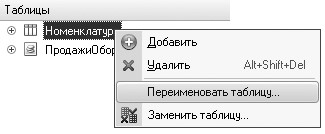<strong>Рис. 13.19.</strong> Переименование таблицы в запросе

В список полей перенесем поля СпрНоменклатура.Ссылка и Прода- жиОбороты.ВыручкаОборот из этих таблиц (рис.
	13.20).

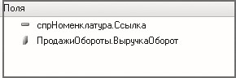 <strong>Рис. 13.20.</strong> Выбранные поля Перейдем на закладку Связи. 

Так как в запросе теперь участвуют несколько таблиц, требуется определить связь между ними. 

По умолчанию платформой уже будет создана связь по полю Номенклатура. То есть значение измерения Номенклатура
	регистра Продажи должно быть равно ссылке на элемент справочника Номенклатура. 

Но нам нужно снять флажок Все у таблицы ПродажиОбороты и установить его у таблицы спрНоменклатура. 

Тем самым мы задаем тип связи как Левое соединение, то есть в результат запроса будут включены все записи справочника
	Номенклатура и те записи регистра Продажи, которые удовлетворяют условию связи по полю Номенклатура. 

Таким образом, в результате запроса будут присутствовать все услуги, и для некоторых из них будут указаны обороты
	выручки. Для тех услуг, которые не производились в выбранном периоде, не будет указано ничего.

Описанную связь двух таблиц схематично можно представить следующим примером (рис. 13.21).

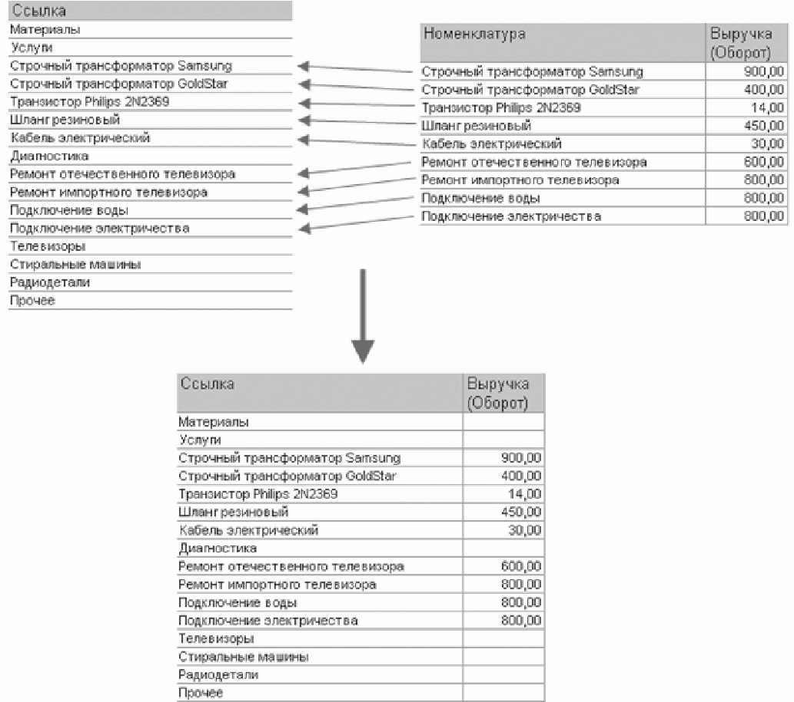

<strong>Рис. 13.21.</strong> Связь записей таблиц в запросе

В результате описанных выше действий закладка Связи будет иметь следующий вид (рис. 13.22).

<strong>Рис. 13.22.</strong> Определение связи между таблицами

Условие отбора записей

Перейдем на закладку Условия и установим отбор, чтобы группы справочника Номенклатура не попадали в отчет. 

Для этого раскроем таблицу спрНоменклатура, перетащим мышью поле ЭтоГруппа в список условий, установим флажок
	Произвольное и напишем в поле Условие следующий текст (листинг 13.5).

<strong>листинг 13.5.</strong> Условие запроса

спрНоменклатура.ЭтоГруппа = ЛОЖЬ

Тем самым мы указали, что из базы данных нужно выбрать только те записи справочника Номенклатура, которые не являются
	группами.

Работу этого условия можно проиллюстрировать на следующем примере. Слева – исходная таблица справочника Номенклатура,
	а справа – записи, которые будут выбраны из этой таблицы (рис. 13.23).

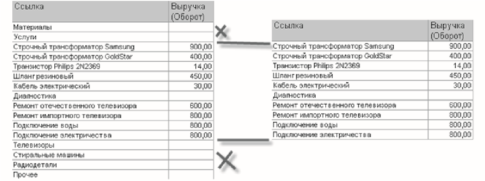

<strong>Рис. 13.23.</strong> Отбор записей номенклатуры в запросе

Вторым условием должно быть то, что выбранный элемент является услугой. Это Простое условие. Чтобы его создать,
	перетащим мышью поле ВидНоменклатуры в список условий. 

Платформа автоматически сформирует условие, согласно которому вид номенклатуры должен быть равен значению параметра
	ВидНоменклатуры.

В дальнейшем перед выполнением запроса мы передадим в параметр ВидНоменклатуры значение перечисления – Услуга.

Работу этого условия тоже можно проиллюстрировать на примере. Слева – записи справочника Номенклатура, выбранные
	согласно первому условию. Справа – только те записи, которые являются услугами (рис. 13.24).

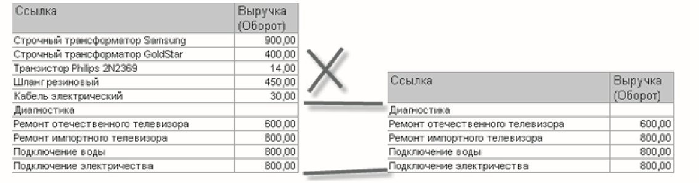

<strong>Рис. 13.24.</strong> Отбор записей номенклатуры в запросе

В результате закладка Условия примет вид (рис. 13.25).

<strong>Рис. 13.25.</strong> Создание условия запроса

<strong>соВет</strong>

Отбор можно применять и в самом запросе, и в настройках отчета. То же касается сортировки и группировки. Отбор лучше
	применять в запросе, если записи, не удовлетворяющие условию запроса, наверняка не понадобятся в отчете. Сортировку
	и группировку лучше применять уже в настройках отчета, чтобы сделать его более гибким.

Псевдонимы полей

Перейдем на закладку Объединения/Псевдонимы и укажем, что представление элемента справочника (поле Ссылка) будет
	иметь псевдоним Услуга, а поле регистра будет иметь псевдоним Выручка (рис. 13.26).

<strong>Рис. 13.26.</strong> Установка псевдонимов полей запроса

Порядок записей

Перейдем на закладку Порядок и укажем, что результат запроса должен быть отсортирован по убыванию значения поля
	Выручка 

(рис. 13.27).

Создание запроса закончено, нажмем кнопку ОK. Вернемся в конструктор схемы компоновки данных. 

Анализ текста запроса

Текст запроса, сформированный платформой, примет вид (листинг 13.6).

<strong>листинг 13.6.</strong> Текст запроса

<table>
	<tr>
		<td>
ВЫБРАТЬ
</td>
	</tr>
	<tr>
		<td></td>
	</tr>
	<tr>
		<td>
СпрНоменклатура.Ссылка КАК Услуга,
</td>
	</tr>
	<tr>
		<td></td>
	</tr>
	<tr>
		<td>
ПродажиОбороты.ВыручкаОборот КАК Выручка
</td>
	</tr>
	<tr>
		<td></td>
	</tr>
	<tr>
		<td>
ИЗ
</td>
	</tr>
	<tr>
		<td></td>
	</tr>
	<tr>
		<td>
Справочник.Номенклатура КАК СпрНоменклатура
</td>
	</tr>
	<tr>
		<td></td>
	</tr>
	<tr>
		<td>
ЛЕВОЕ СОЕДИНЕНИЕ РегистрНакопления.Продажи.Обороты КАК ПродажиОбороты
</td>
	</tr>
	<tr>
		<td></td>
	</tr>
	<tr>
		<td>
ПО ПродажиОбороты.Номенклатура = СпрНоменклатура.Ссылка
</td>
	</tr>
	<tr>
		<td></td>
	</tr>
	<tr>
		<td>
ГДЕ
</td>
	</tr>
	<tr>
		<td></td>
	</tr>
	<tr>
		<td>
СпрНоменклатура.ЭтоГруппа = ЛОЖЬ
</td>
	</tr>
	<tr>
		<td></td>
	</tr>
	<tr>
		<td>
И СпрНоменклатура.ВидНоменклатуры = &amp;ВидНоменклатуры
</td>
	</tr>
	<tr>
		<td></td>
	</tr>
	<tr>
		<td></td>
	</tr>
	<tr>
		<td></td>
	</tr>
	<tr>
		<td>
УПОРЯДОЧИТЬ ПО
</td>
	</tr>
	<tr>
		<td></td>
	</tr>
	<tr>
		<td>
Выручка УБЫВ
</td>
	</tr>
</table>

Сначала, как обычно, идет часть описания запроса, и в ней есть новые для нас конструкции.

При описании источников запроса (после ключевого слова ИЗ) использована возможность определения нескольких источников
	запроса (листинг 13.7).

<strong>листинг 13.7.</strong> Определение нескольких источников запроса

<table>
	<tr>
		<td>
ИЗ
</td>
	</tr>
	<tr>
		<td></td>
	</tr>
	<tr>
		<td>
Справочник.Номенклатура КАК СпрНоменклатура
</td>
	</tr>
	<tr>
		<td></td>
	</tr>
	<tr>
		<td>
ЛЕВОЕ СОЕДИНЕНИЕ РегистрНакопления.Продажи.Обороты КАК ПродажиОбороты
</td>
	</tr>
	<tr>
		<td></td>
	</tr>
	<tr>
		<td>
ПО ПродажиОбороты.Номенклатура = СпрНоменклатура.Ссылка
</td>
	</tr>
</table>

В данном случае выбираются записи из двух источников: СпрНоменклатура и ПродажиОбороты, причем ключевым предложением
	ЛЕВОЕ СОЕДИНЕНИЕ … ПО описан способ, которым будут скомбинированы между собой записи этих двух источников.

ЛЕВОЕ СОЕДИНЕНИЕ означает, что в результат запроса нужно включить комбинации записей из обоих источников, которые
	соответствуют указанному после ключевого слова ПО условию. Кроме этого, в результат запроса нужно включить еще и
	записи из первого (указанного слева от слова СОЕДИНЕНИЕ) источника, для которых не найдено соответствующих условию
	записей из второго источника.

Продолжим рассматривать текст запроса. В части описания запроса есть еще одна новая для нас конструкция – задание
	условий отбора данных из исходных таблиц (листинг 13.8).

<strong>листинг 13.8.</strong> Задание условий отбора

ГДЕ

<table>
	<tr>
		<td>
СпрНоменклатура.ЭтоГруппа = ЛОЖЬ
</td>
	</tr>
	<tr>
		<td></td>
	</tr>
	<tr>
		<td>
И СпрНоменклатура.ВидНоменклатуры = &amp;ВидНоменклатуры
</td>
	</tr>
</table>

Условию отбора всегда предшествует ключевое слово ГДЕ. После него описывается само условие. Обратите внимание, что
	поля исходных таблиц, на которые накладывается условие, могут и не входить в список выборки (как в нашем случае).
	Кроме того, в нашем условии использован параметр запроса ВидНоменклатуры (перед именем параметра указывается символ
	&amp; – амперсанд).

Теперь, когда мы закончили знакомиться с текстом запроса, продолжим формирование нашей схемы компоновки данных.

Ресурсы

В нашем отчете мы хотим видеть итоговые значения выручки для каждой услуги. Для этого нам нужно определить поля
	ресурсов отчета. 

Под <em>ресурсами</em> в системе компоновки данных подразумеваются поля, значения которых рассчитываются на основании
	детальных записей, входящих в группировку. По сути ресурсы являются групповыми или общими итогами отчета. 

Итоговые данные формируются на закладке Ресурсы. 

Перейдем на эту закладку и нажмем кнопку , чтобы конструктор выбрал все доступные ресурсы, по
	которым можно вычислять итоги. В нашем случае это единственный ресурс Выручка. 

Платформа автоматически предложить рассчитывать сумму значений этого поля, что нам и нужно (рис. 13.28).

<strong>Рис. 13.28.</strong> Ресурсы схемы компоновки данных

Параметры

Пользователя, как правило, интересуют данные о хозяйственной деятельности за определенный период. Поэтому практически
	в любом отчете используются параметры, задающие начало и конец отчетного периода. 

<em>Параметры</em> отчета задают условия отбора записей в отчет. В схеме компоновки данных параметры отчета задаются
	на закладке 

Параметры (рис. 13.29).

<strong>Рис. 13.29.</strong> Параметры компоновки данных

На этой закладке мы увидим три параметра: НачалоПериода,

КонецПериода и ВидНоменклатуры. Вы можете спросить: почему параметра три, хотя в запросе мы задавали всего один –
	ВидНоменклатуры? 

Все дело в том, что система компоновки данных самостоятельно анализирует текст запроса и помимо тех параметров,
	которые указаны в нем в явном виде (ВидНоменклатуры), предоставляет возможность настроить также и параметры
	виртуальных таблиц, которые участвуют в запросе. 

Такими параметрами являются НачалоПериода и КонецПериода. Это первые два параметра виртуальной таблицы
	РегистрНакопле- ния.Продажи.Обороты, которую мы использовали в запросе, в левом соединении. 

Если в конструкторе запроса выделить в списке таблиц эту таблицу и нажать кнопку Параметры виртуальной таблицы, то
	появится диалог, где мы увидим параметры НачалоПериода и КонецПериода (рис. 13.30).

<strong>Рис. 13.30.</strong> Параметры виртуальной таблицы

Первым параметром передается начало периода расчета итогов, вторым – конец периода. В результате исходная таблица
	будет содержать только обороты, рассчитанные в переданном периоде. 

Здесь всегда следует помнить, что если мы передаем в качестве этих параметров дату (а в нашем случае так и будет), то
	дата содержит и время с точностью до секунды.

Допустим, заранее известно, что пользователя не будут интересовать результаты работы отчета в периодах, указанных с
	точностью до секунды. В этом случае следует учесть две особенности.

Во-первых, пользователя нужно избавить от необходимости указывать время при вводе даты периода, за который
	формируется отчет. 

Для этого мы изменим существующее описание типа для параметра НачалоПериода. 

Вернемся на закладку Параметры схемы компоновки данных и дважды щелкнем в ячейке Тип, соответствующей параметру
	НачалоПериода.

Затем нажмем кнопку выбора  и в нижней части окна редактирования типа данных установим Состав
	даты в значение Дата. Нажмем ОK (рис. 13.31).

Вторая особенность заключается в том, что по умолчанию время в дате установлено 00:00:00. Поэтому если пользователь
	задаст период отчета с 01.06.2013 по 11.06.2013, итоги регистра будут рассчитаны с начала дня 01.06.2013 00:00:00 по
	начало дня 11.06.2013, 00:00:00. Таким образом, данные за 11-е число, отличные от начала дня, в расчет не войдут,
	что сильно удивит пользователя.

Для того чтобы исключить эту ситуацию, мы добавим еще один параметр ДатаОкончания, в который пользователь будет
	вводить дату окончания. А значение параметра КонецПериода будем рассчитывать автоматически таким образом, чтобы оно
	указывало на конец дня даты, введенной пользователем. 

Поэтому для параметра КонецПериода установим флажок Ограни-

<strong>Рис. 13.32.</strong> Добавление параметра «ДатаОкончания»

Если этот флажок не установлен, то параметр будет доступен для настройки пользователем. Если же установить этот
	флажок, то пользователь не увидит этот параметр. 

Затем с помощью кнопки Добавить в командной панели добавим новый параметр с именем ДатаОкончания (см. рис. 13.32).
	Для этого параметра платформа автоматически сформирует заголовок – Дата окончания. Оставим его без изменений. 

Зададим тип значения параметра – Дата. При этом, как и для параметра Начало Периода, укажем состав даты – Дата (см.
	рис. 13.31). А также для параметра НачалоПериода зададим заголовок, который будет отображаться пользователю, – Дата
	начала.

Обратите внимание, что по умолчанию добавленный нами параметр доступен для пользователя (ограничение доступности в
	колонке снято). Нас это вполне устраивает.

Перейдем к параметру КонецПериода. Для него мы установили флажок Ограничение доступности, поскольку значение этого
	параметра мы собираемся вычислять на основании значения, установленного пользователем для параметра
	ДатаОкончания.

Чтобы задать формулу, по которой будет вычисляться значение параметра КонецПериода, воспользуемся языком выражений
	системы компоновки данных. 

В нем есть функция КонецПериода(), которая позволяет получить дату, соответствующую концу какого-либо периода,
	например, указанного дня. 

В ячейке Выражение зададим для параметра КонецПериода следующее выражение (листинг 13.9).

<strong>листинг 13.9.</strong> Выражение для расчета значения параметра «КонецПериода»

КонецПериода(&amp;ДатаОкончания, &quot;День&quot;)

<strong>пРиМеЧАние</strong>

Подробное описание языка выражений системы компоновки данных содержится во встроенной справке системы в разделе
	Справка  Содержание справки  Встроенный язык  Общие объекты  Система компоновки данных  Язык выражений системы
	компоновки данных.

В результате перечисленных действий параметры компоновки будут иметь следующий вид (рис. 13.33).

<strong>Рис. 13.33.</strong> Параметры системы компоновки

И в заключение настроим параметр ВидНоменклатуры. 

Поскольку отчет должен отображать выручку, полученную только от реализации услуг, значение параметра ВидНоменклатуры
	пользователь изменять не должен. Оно должно быть задано непосредственно в схеме компоновки как
	Перечисление.ВидыНоменклатуры.Услуга. 

Флажок Ограничение доступности у параметра ВидНоменклатуры платформа установила по умолчанию, поэтому нам остается
	только указать нужное значение перечисления ВидыНоменклатуры в ячейке Значение, соответствующей параметру
	ВидНоменклатуры. 

Воспользуемся кнопкой выбора и выберем это значение из списка перечисления видов номенклатуры – Услуга (рис.
	13.34).

<strong>Рис. 13.34.</strong> Установка значения параметра «ВидНоменклатуры»

Настройки

Перейдем к формированию структуры отчета. На закладке Настройки добавим группировку и снова не укажем поле
	группировки. На закладке Выбранные поля укажем поля Услуга и Выручка (рис. 13.35).

<strong>Рис. 13.35.</strong> Структура отчета «РейтингУслуг»

Затем перейдем на закладку Другие настройки и зададим заголовок отчета – Рейтинг услуг (рис. 13.36).

<strong>пРиМеЧАние</strong>

При изменении параметров настроек, которые предполагают выбор некоторого значения, нужно выделить двойным щелчком
	поле Значение и, нажав кнопку выбора , выбрать из списка значений нужный вариант. При этом
	флажок использования значения появится автоматически. 

Этот флажок можно также снять и установить вручную.

Быстрые пользовательские настройки

В заключение мы должны предоставить пользователю возможность задавать отчетный период перед формированием отчета. То
	есть параметры Дата начала и Дата окончания должны быть включены в состав пользовательских настроек. 

Причем поскольку задавать отчетный период требуется практически всегда, эти настройки должны находиться
	непосредственно в форме отчета. 

На закладке Параметры мы видим параметры, для которых мы установили возможность их изменения пользователем, то есть
	сняли флажок Ограничение доступности.

Выделим по очереди каждый из параметров и нажмем кнопку Свойства элемента пользовательских настроек, расположенную в
	правом нижнем углу окна настроек. 

Установим флажок Включать в пользовательские настройки и оставим предложенное по умолчанию для свойства Режим
	редактирования значение Быстрый доступ (рис. 13.37). 

<strong>Рис. 13.37.</strong> Определение пользовательских настроек

Поясним, что флажок Включать в пользовательские настройки означает, что эта настройка будет доступна пользователю в
	отдельном окне (2) при вызове из подменю Еще команды Настройки… (то есть такая настройка, которой он может
	пользоваться, но не очень часто, рис. 

13.38).

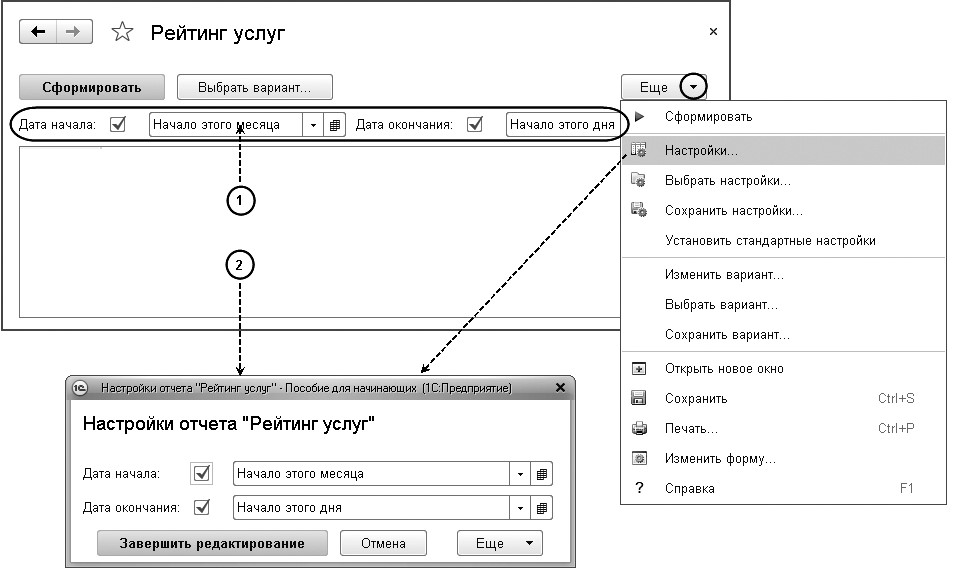

<strong>Рис. 13.38.</strong> Быстрые (1) и обычные (2) пользовательские настройки

А режим редактирования, установленный в значение Быстрый доступ, означает, что эта настройка также будет
	автоматически отображаться непосредственно в отчетной форме (1). Это <em>быстрая пользовательская настройка</em> –
	такая настройка, которая нужна пользователю постоянно, чуть ли не при каждом запуске отчета. Поэтому она должна быть
	всегда «под рукой».

Кроме того, чтобы улучшить интерфейс пользователя, зададим для параметров Дата начала и Дата окончания в качестве
	начальных значений соответственно Начало этого месяца и Начало этого дня (см. рис. 13.37). 

Таким образом, при выполнении отчета даты начала и окончания отчетного периода будут динамически меняться и
	показывать период с начала текущего месяца по сегодняшнее число, и пользователю, возможно, не придется менять их
	вручную.

В заключение определим, в каких подсистемах будет отображаться наш отчет. 

Закроем конструктор схемы компоновки данных и в окне редактирования объекта конфигурации Отчет РейтингУслуг перейдем
	на закладку Подсистемы. Отметим в списке подсистем конфигурации подсистемы Оказание услуг и Бухгалтерия. 

Таким образом, ссылка на наш отчет автоматически попадет в панель команд этих разделов (рис. 13.39).

В режиме «1С:Предприятие»

Запустим «1С:Предприятие» в режиме отладки и посмотрим, как работает отчет. 

В открывшемся окне «1С:Предприятия» мы видим, что в разделах Оказание услуг и Бухгалтерия в подменю Отчеты появилась
	команда для формирования отчета Рейтинг услуг (рис. 13.40). 

Выполним эту команду.

Откроется форма отчета, автоматически сформированная системой. 

<strong>Рис. 13.40.</strong> Команда для формирования отчета

В окне отчета мы видим параметры, определяющие отчетный период. Он по умолчанию задан – с начала месяца по
	сегодняшнее число. Но можно при желании изменить его, воспользовавшись кнопкой календаря. 

Нажмем кнопку Сформировать. Результат будет выглядеть следующим образом (рис. 13.41).

<strong>Рис. 13.41.</strong> Результат выполнения отчета

Мы видим, что выручка от услуг из всех трех введенных нами документов Оказание услуги попала в отчет, так как даты
	создания этих документов входят в отчетный период. 

Заметьте, что вверху окна результата отчета выводится заданный нами заголовок и параметры, определяющие отчетный
	период.

Обратите внимание, что при прокручивании отчета вниз положение шапки отчета остается зафиксированным. Для удобства
	пользователя платформа автоматически фиксирует сверху табличный документ, в который выводится результат отчета.
	Можно также вручную управлять фиксацией строк и столбцов отчета с помощью параметров вывода ФиксацияСлева и
	ФиксацияСверху.

Также заметьте, что название услуг (поле Ссылка справочника Номенклатура) включает как наименование, так и вид
	номенклатуры соответственно заданному нами представлению ссылок на номенклатуру.

Теперь изменим дату окончания на 10.07.2013. Данные за 10 июля из документа Оказание услуги № 1 попадают в отчет
	(рис. 13.42).

<strong>Рис. 13.42.</strong> Результат выполнения отчета

То есть, как и требовалось, благодаря использованию функции КонецПериода() данные за последнее число отчетного
	периода включены в отчет.

Причем поскольку в запросе данных для отчета таблица номенклатуры связана левым соединением с таблицей регистра
	продаж, то услуги, для которых нет данных о продажах, все равно показаны в отчете.

Настройки в конфигураторе и в режиме «1С:Предприятие»

Теперь на примере этого отчета покажем создание и использование других настроек отчета – Условное оформление и
	Отбор. 

В процессе создания этих настроек мы будем выполнять некоторые действия в конфигураторе и затем переходить в режим
	1С:Предприятие, чтобы посмотреть, что получилось. 

На самом деле все то же самое, что мы будем настраивать в режиме Конфигуратор, можно настроить и в режиме
	1С:Предприятие по команде Еще  Изменить вариант... При этом пользователю открывается окно настроек отчета, очень
	похожее на закладку Настройки в схеме компоновки данных. 

Различие состоит в том, что настройки, сделанные в конфигураторе, называются <em>стандартными настройками</em> и
	будут сохранены в самой схеме компоновки данных, то есть будут являться частью конфигурации. Это означает, что любой
	пользователь конфигурации будет видеть отчет именно в таком виде, как мы его настроили в конфигураторе.

Все то же самое можно настроить и в режиме 1С:Предприятие, но эта настройка уже не будет являться частью конфигурации
	и будет доступна только одному конкретному пользователю конкретной информационной базы, который эту настройку
	произвел.

Возможность изменения варианта отчета в режиме 1С:Предприятие не предназначена для рядового пользователя (для него –
	быстрые настройки и пользовательские настройки). Она предназначена для разработчика, осуществляющего внедрение, или
	для администратора, или для очень опытного пользователя.

Настройки, сделанные в режиме 1С:Предприятие, естественно «перекрывают» стандартные настройки. И если пользователь
	все перестроил в отчете так, что его не узнать, всегда можно вернуться к стандартным настройкам по команде Еще 
	Установить стандартные настройки.

Итак, сейчас мы хотим настроить отчет для любых пользователей, которые будут им пользоваться, поэтому делаем это в
	конфигураторе. 

Но если завтра главный бухгалтер попросит вас «сделать отчет красивым», вы сможете повторить все то же самое, не
	меняя конфигурацию и прямо у нее на глазах.

Условное оформление 

В таком отчете, как Рейтинг услуг, было бы удобно выделять цветом записи отчета, содержащие услуги с наименьшей или с
	наибольшей выручкой, или еще по какому-либо условию. 

В режиме «Конфигуратор»

Для этого вернемся в конфигуратор и откроем схему компоновки данных на закладке Настройки. 

В нижней части окна перейдем на закладку Условное оформление и нажмем кнопку Добавить, расположенную в правом верхнем
	углу окна настроек (рис. 13.43). 

Сначала укажем Оформление, то есть то, каким образом должны выделяться интересующие нас поля. 

Нажмем кнопку выбора 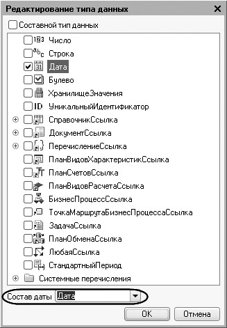 в поле Оформление и установим красный цвет текста (см. рис. 13.43). Нажмем
	ОК. 

Затем укажем Условие, при наступлении которого будет применяться оформление, то есть когда в нашем случае текст будет
	становиться красным. 

Нажмем кнопку выбора  в поле Условие и в появившемся окне добавим Новый элемент отбора. 

Каждый элемент отбора задает одно условие. Условий может быть несколько (рис. 13.44). 

<strong>Рис. 13.44.</strong> Настройка условного оформления

Для этого нажмем кнопку Добавить и укажем в графе Левое значение – поле Выручка, в графе Вид сравнения – Меньше, а в
	графе Правое значение – 700. Нажмем ОК. 

То есть когда в поле Выручка окажется значение меньше 700, «что-то» будет выделено красным цветом текста. 

Теперь укажем это «что-то», то есть зададим список <em>оформляемых полей</em>. 

Если мы хотим выделять всю строку отчета, то можно оставить этот список пустым. Или же нажать кнопку выбора  в поле Оформляемые поля, и в появившемся окне, нажимая кнопку Добавить, можно выбрать поля
	Услуга и Выручка (рис. 13.45).

<strong>Рис. 13.45.</strong> Настройка условного оформления

В нашем случае можно было бы этого не делать, так как Услуга и Выручка и есть все поля отчета. Нажмем ОК. 

В заключение зададим Представление условного оформления как 

<strong>Рис. 13.46.</strong> Настройка условного оформления

Непопулярная услуга – это то, что увидит пользователь в своих настройках. То есть вместо пугающей строки «Выручка
	меньше 700…» пользователь увидит осмысленное выражение, которое задано в поле Представление.

Итак, мы задали условное оформление отчета, по которому все услуги с выручкой менее 700 руб. будут считаться
	«непопулярными» и выделяться красным цветом. 

Теперь добавим это условие в пользовательские настройки. Нажмем кнопку Свойства элемента пользовательских настроек,
	расположенную в правом нижнем углу окна настроек (см. рис. 13.46). Установим флажок Включать в пользовательские
	настройки и установим свойство Режим редактирования в значение Обычный. 

Тем самым мы включили созданную нами настройку условного оформления в обычные пользовательские настройки. Эти
	настройки, в отличие от быстрых настроек, расположены не в форме отчета, а вызываются по команде Еще  Настройки… и
	появляются в отдельном окне, так эти настройки используются значительно реже, чем, например, настройки отчетного
	периода. В режиме «1С:Предприятие»

Перейдем в режим 1С:Предприятие. Вызовем отчет.

Зададим Дату окончания отчетного периода как Начало этого дня и<strong> </strong>нажмем кнопку Сформировать (рис.
	13.47).

<strong>Рис. 13.47.</strong> Результат выполнения отчета

Мы видим, что суммы услуг менее 700 руб. выделены красным цветом. Выполним команду Еще  Настройки… 

Перед нами появится окно пользовательских настроек отчета, содержащее параметры отчетного периода и настройку
	условного оформления Непопулярная услуга. Мы можем снять флажок использования этой настройки, нажать кнопку
	Завершить редактирование (рис. 13.48) и снова сформировать отчет.

<strong>Рис. 13.48.</strong> Окно пользовательских настроек

Выделение цветом исчезнет. Настройка Непопулярная услуга не видна в форме отчета, так как мы установили для нее в
	качестве режима редактирования Обычный, а не Быстрый доступ. 

Однако данная настройка условного оформления задана жестко, и пользователь может лишь включить или выключить признак
	ее использования. Для неопытных пользователей этого, как правило, вполне достаточно. 

Но для более подготовленных пользователей мы можем предоставить более полную свободу в использовании настроек, то
	есть возможность, например, самостоятельно задавать настройки отчета: отбор, порядок, условное оформление и пр. 

Рассмотрим это в следующем примере.

Пользовательские настройки

В режиме «Конфигуратор»

Вернемся в конфигуратор. 

На закладке Настройки схемы компоновки данных содержатся полные настройки отчета, которые задает разработчик. Часть
	из них может быть представлена пользователю для создания произвольного отбора, условного оформления отчета и
	пр. 

Для этого нажмем кнопку Свойства элемента пользовательских настроек, расположенную вверху в командной панели окна
	настроек (рис. 13.49). 

<strong>Рис. 13.49.</strong> Состав пользовательских настроек

В появившемся окне мы можем редактировать состав пользовательских настроек отчета. 

Установим признак использования для настроек Отбор и Условное оформление и установим для них свойство Режим
	редактирования в значение Обычный.

Таким образом, мы включили настройки отбора и условного оформления в состав пользовательских настроек и предоставили
	пользователю возможность задавать их в отдельном окне по команде Еще  Настройки…

Отбор 

В режиме «Конфигуратор»

Теперь создадим настройку отбора в отчете. Для этого в нижней части окна настроек перейдем на закладку Отбор. Слева
	мы видим список доступных полей отчета. Раскроем поле Услуга и двойным щелчком мыши на поле Родитель перенесем его в
	список условий отбора в правой части окна (рис. 13.50).

Таким образом, мы создали возможность отбора по группам услуг, которые пользователь может задать в режиме
	1С:Предприятие.

В режиме «1С:Предприятие»

Откроем отчет в режиме 1С:Предприятие и выполним команду Еще  Настройки… 

В окне пользовательских настроек отчета появились настройки Отбор и Условное оформление, которые мы только что
	отметили (рис. 13.51).

<strong>Рис. 13.51.</strong> Окно пользовательских настроек

На самом деле здесь присутствуют две настройки условного оформления. 

Настройку Непопулярная услуга мы заранее создали в конфигураторе. А теперь, добавив настройку условного оформления
	«вообще», мы предоставили пользователю возможность создавать любое количество собственных условий для условного
	оформления аналогично тому, как мы это делали в конфигураторе. Сейчас мы это делать не будем, но самостоятельно вы
	можете попробовать.

Сейчас мы зададим отбор в отчете так, чтобы в него попадали только услуги, относящиеся к установке стиральных машин.
	Для этого нажмем кнопку выбора  в окне пользовательских настроек в строке Отбор (см. рис.
	13.51). 

В открывшемся окне Редактирование отбора мы видим созданное нами ранее в конфигураторе условие отбора. Нам остается
	только нажать кнопку выбора в строке Значение, ввести первые несколько символов наименования нужной группы
	номенклатуры и выбрать строку Стиральные машины из выпадающего списка под окном ввода значения (рис. 13.52).

Нажмем ОК. 

Таким образом, мы задали отбор по услугам, родителем которых является группа Стиральные машины справочника
	Номенклатура.

В окне пользовательских настроек нажмем кнопку Завершить редактирование и выполним отчет, нажав кнопку Сформировать
	(рис. 13.53).

<strong>Рис. 13.53.</strong> Результат выполнения отчета

Мы видим, что в отчет включены только услуги по установке стиральных машин и в заголовке отчета отражена информация
	об отборе. 

При закрытии окна отчета настройки, сделанные пользователем, запоминаются и становятся настройками по умолчанию для
	текущего пользователя.

<strong>Рис. 13.54.</strong> Окно пользовательских настроек

Таким образом, пользователь сможет при наличии определенной квалификации задавать многие настройки по своему
	желанию. 

Если же такого желания или соответствующих знаний у него нет, лучше задавать эти настройки жестко, а пользователю
	останется только включать или выключать их использование. 

Да, собственно, часто достаточно только отчетного периода или еще какой-то жизненно важной настройки, и такие
	настройки, конечно, нужно размещать непосредственно в отчетной форме.

Если приоритеты пользователя по использованию настроек отличаются от того, как они заданы разработчиком в схеме
	компоновки данных, то пользователь может изменить состав настроек, выполнив команду Еще  Изменить состав настроек…
	(рис. 13.55).

<strong>Рис. 13.55.</strong> Окно пользовательских настроек отчета в режиме «1С:Предприятие»

В открывшемся окне Состав настроек пользователь может указать, какие настройки будут редактироваться в форме отчета
	(правый список), то есть будут быстрыми, а какие будут доступны по команде Еще  Настройки… (левый список). Кнопками
	Добавить, Удалить или двойным щелчком мыши можно перенести настройки из левого списка в правый и наоборот. Например,
	перенесем в список быстрых настроек настройку отбора (рис. 13.56).

<strong>Рис. 13.56.</strong> Редактирование состава настроек в режиме «1С:Предприятие»

В результате настройка отбора будет доступна непосредственно в отчетной форме.

Теперь очистим условие отбора в окне отчета, затем вернемся в конфигуратор и снимем признак использования у настройки
	отбора. Это нам понадобится в дальнейших примерах.

<h1>Лабораторная работа № 18 Прием на работу</h1>

<strong>Порядок выполнения работы </strong>

1. Ознакомьтесь с теоретическими основами в настоящих указаниях и конспектах лекций. 

2. Получите задание у преподавателя. 

3. Сделайте скриншоты (кнопка клавиатуры PrtSc) выполненных заданий в текстовом (Word) файле <em>Фамилия_ЛР</em>

4. Составьте отчет по лабораторной работе. 

5. Отчитайте работу преподавателю.

<strong>Вывод данных по всем дням в выбранном периоде</strong>

Следующий отчет, который мы добавим, будет называться Выручка мастеров.

Он будет содержать информацию о том, какая выручка была получена ООО «На все руки мастер» благодаря работе каждого из
	мастеров, с детализацией по всем дням в выбранном периоде и разворотом по клиентам, обслуженным в каждый из дней
	(рис. 13.57).

На примере этого отчета мы проиллюстрируем, как строить многоуровневые группировки в запросе и как обходить все даты
	в выбранном периоде. 

Также продемонстрируем настройку отдельных элементов структуры отчета, научимся выводить данные в диаграмму и
	создавать несколько вариантов отчета в конфигураторе.

В режиме «Конфигуратор»

Добавим новый объект конфигурации Отчет. Назовем его ВыручкаМастеров и запустим конструктор схемы компоновки
	данных.

Добавим новый Набор данных – запрос и вызовем конструктор запроса. 

В качестве источника данных для запроса выберем виртуальную таблицу регистра накопления Продажи.Обороты.

Запрос для набора данных

Параметры виртуальной таблицы

Зададим один из параметров этой виртуальной таблицы – Периодичность.

Для этого перейдем в поле Таблицы, выделим таблицу и нажмем кнопку Параметры виртуальной таблицы (рис. 13.58).

<strong>Рис. 13.58.</strong> Изменение параметров виртуальной таблицы

В открывшемся окне параметров зададим значение параметра Периодичность – День (рис. 13.59). 

<strong>Рис. 13.59.</strong> Параметры виртуальной таблицы

Нажмем OK. После этого выберем из таблицы следующие поля 

(рис. 13.60):

<ul>
	<li>ПродажиОбороты.Мастер,</li>
	<li>ПродажиОбороты.Период,</li>
	<li>ПродажиОбороты.Клиент,</li>
	<li>ПродажиОбороты.ВыручкаОборот.</li>
</ul>

<strong>Рис. 13.60.</strong> Выбранные поля

Теперь перейдем на закладку Объединения/Псевдонимы и зададим псевдоним Выручка для поля
	ПродажиОбороты.ВыручкаОборот 

<strong>Рис. 13.61.</strong> Объединения/Псевдонимы

Анализ текста запроса

Нажмем ОК и рассмотрим текст запроса, сформированный конструктором (листинг 13.10).

<strong>листинг 13.10.</strong> Текст запроса

<table>
	<tr>
		<td>
ВЫБРАТЬ
</td>
	</tr>
	<tr>
		<td></td>
	</tr>
	<tr>
		<td>
ПродажиОбороты.Мастер,
</td>
	</tr>
	<tr>
		<td></td>
	</tr>
	<tr>
		<td>
ПродажиОбороты.Период,
</td>
	</tr>
	<tr>
		<td></td>
	</tr>
	<tr>
		<td>
ПродажиОбороты.Клиент,
</td>
	</tr>
	<tr>
		<td></td>
	</tr>
	<tr>
		<td>
ПродажиОбороты.ВыручкаОборот КАК Выручка
</td>
	</tr>
	<tr>
		<td></td>
	</tr>
	<tr>
		<td>
ИЗ
</td>
	</tr>
	<tr>
		<td></td>
	</tr>
	<tr>
		<td>
РегистрНакопления.Продажи.Обороты( , , День, ) КАК ПродажиОбороты 
</td>
	</tr>
</table>

В части описания запроса обратите внимание, что у источника данных задана периодичность выбираемых данных – День
	(листинг 13.11).

<strong>листинг 13.11.</strong> Задание периодичности виртуальной таблицы

<table>
	<tr>
		<td>
ИЗ
</td>
	</tr>
	<tr>
		<td></td>
	</tr>
	<tr>
		<td>
РегистрНакопления.Продажи.Обороты( , , День, ) КАК ПродажиОбороты
</td>
	</tr>
</table>

Именно благодаря этому у нас появляется возможность описать среди выбранных полей поле Период.
	<strong>Ресурсы</strong>

Теперь перейдем к редактированию схемы компоновки данных. 

На закладке Ресурсы нажмем кнопку  и убедимся, что конструктор выбрал единственный имеющийся у
	нас ресурс – Выручка. 

Параметры

На закладке Параметры выполним те же действия, что и при создании предыдущего отчета. 

Для параметров НачалоПериода и КонецПериода в поле Тип зададим состав даты – Дата. 

Для параметра КонецПериода зададим Выражение (листинг 13.12).

<strong>листинг 13.12.</strong> Выражение для расчета значения параметра «КонецПериода»

КонецПериода(&amp;КонецПериода, &quot;День&quot;)

В результате перечисленных действий параметры компоновки данных будут иметь следующий вид (рис. 13.62).

<strong>Рис. 13.62.</strong> Параметры компоновки данных

Настройки

Теперь создадим структуру отчета. 

На закладке Настройки последовательно создадим две вложенные группировки:

 верхнего уровня – по полю Мастер;  вложенная в нее – по полю Период. 

Для этого сначала выделим корневой элемент Отчет в структуре отчета, нажмем кнопку Добавить в командной панели окна
	настроек, добавим новую группировку и укажем поле группировки Мастер 

(рис. 13.63).

<strong>Рис. 13.63.</strong> Поле группировки

Затем добавим в группировку Мастер вложенную группировку по полю Период. 

Для этого выделим группировку Мастер, нажмем кнопку Добавить, добавим новую группировку и укажем поле группировки
	Период. 

Затем добавим еще одну группировку, вложенную в группировку по полю Период, – Детальные записи (без указания
	группировочного поля). Для этого выделим группировку Период, нажмем кнопку Добавить и добавим новую группировку без
	указания группировочного поля. После этого перейдем на закладку Выбранные поля и добавим в список выбранных полей
	поля Клиент и Выручка. 

Поля Мастер и Период мы не задаем, так как по этим полям производится группировка данных и их значение будет выведено
	автоматически. 

В результате структура отчета будет иметь вид (рис. 13.64).

В заключение перейдем на закладку Другие настройки и изменим следующие параметры. 

Для параметра Расположение полей группировок установим значение Отдельно и только в итогах. 

По умолчанию поля группировок в отчете располагаются вертикально друг под другом (рис. 13.65).

<strong>Рис. 13.65.</strong> Расположение полей группировок и итогов по вертикали по умолчанию

Установка этого свойства в значение Отдельно и только в итогах означает, что каждая группировка будет располагаться в
	отдельной области отчета слева направо и ее наименование будет выводиться только в данной группировке (рис.
	13.66).

Для параметра Расположение общих итогов по вертикали зададим значение Начало. 

По умолчанию итоги по вертикали располагаются в конце (см. рис. 13.66). Установка этого свойства означает, что общие
	итоги будут отображаться в начале перед строками группировки (рис. 13.67).

<strong>Рис. 13.67.</strong> Расположение итогов по вертикали в начале

В результате другие настройки отчета примут вид (рис. 13.68).

<strong>Рис. 13.68.</strong> Параметры настроек вывода отчета

Здесь же для параметра Заголовок зададим значение Выручка мастеров.

Затем укажем, что параметры Начало периода и Конец периода будут включены в состав пользовательских настроек, и эти
	настройки будут находиться непосредственно в отчетной форме, то есть будут «быстрыми» настройками. 

Таким образом, перед формированием отчета пользователь сможет задать отчетный период (рис. 13.69).

<strong>Рис. 13.69.</strong> Создание быстрых настроек отчетного периода

В заключение определим, в каких подсистемах будет отображаться наш отчет. 

Закроем конструктор схемы компоновки данных и в окне редактирования объекта конфигурации Отчет ВыручкаМастеров
	перейдем на закладку Подсистемы. 

Отметим в списке подсистем конфигурации подсистемы Оказание услуг и Расчет зарплаты. Таким образом, ссылка на наш
	отчет автоматически попадет в панель команд этих разделов.

В режиме «1С:Предприятие»

Запустим «1С:Предприятие» в режиме отладки и посмотрим, как работает отчет. 

В открывшемся окне «1С:Предприятия» мы видим, что в разделах Оказание услуг и Расчет зарплаты в подменю Отчеты
	появилась команда для формирования отчета Выручка мастеров. 

Выполним эту команду. Зададим отчетный период с 10.07.2013 по 15.07.2013 и сформируем отчет (рис. 13.70).

<strong>Рис. 13.70.</strong> Результат выполнения отчета

Если отчетный период для пользователя не важен, то он может снять признак использования параметров (флажок слева от
	параметра). В этом случае отчет будет формироваться по всем записям регистра Продажи, находящимся в базе данных, то
	есть в данном случае результат отчета будет таким же. 

Вывод всех дат в выбранном периоде

Если вы помните, в начале раздела мы говорили, что этот отчет должен показывать данные с детализацией по всем дням в
	выбранном периоде. 

У нас же отображаются только те дни, для которых существуют ненулевые записи в таблице регистра накопления
	Продажи. 

Для детализации данных в отчете система компоновки данных позволяет указывать для группировок <em>дополнение</em>
	периодов с заданной периодичностью в указанном интервале. 

Поэтому сейчас мы изменим настройки отчета таким образом, чтобы в отчет попадала каждая дата из периода, за который
	сформирован отчет. 

В режиме «Конфигуратор»

Вернемся в режим Конфигуратор и выполним более тонкую настройку структуры отчета. Откроем схему компоновки данных на
	закладке Настройки. 

До сих пор все настройки структуры, которые мы выполняли, относились ко всему отчету в целом. Но система компоновки
	данных позволяет настраивать также и каждый элемент структуры в отдельности. 

В нашем случае потребуется изменить настройку группировки Период. 

Для того чтобы перейти к настройкам именно этой группировки, в поле структуры отчета установим курсор на эту
	группировку, а затем нажмем кнопку Период в средней части окна, под деревом структуры отчета. 

В нижней части окна будут отображены настройки, доступные для данной группировки. 

Перейдем на закладку Поля группировки. Для поля Период установим 

<strong>Рис. 13.71.</strong> Установка типа дополнения периода

Тем самым мы укажем, что для этой группировки существующие записи с ненулевым значением ресурса будут дополняться
	записями для каждого из дней. 

После этого следует указать, в каком именно периоде будет выполняться такое дополнение. 

В поля, расположенные строчкой ниже, можно ввести даты начала и окончания этого периода. Но указание дат в явном виде
	нас не устраивает, так как пользователь может сформировать отчет за произвольный период. И нам нужно, чтобы
	дополнение дат выполнялось не в некотором фиксированном периоде, а именно в том периоде, который выбрал пользователь
	для всего отчета.

Для того чтобы обеспечить именно такую работу отчета, войдем в режим редактирования поля Начальная дата периода,
	дважды кликнув на поле, и нажмем кнопку очистки . 

После этого, нажав кнопку выбора типа данных , мы сможем выбрать тип данных, отображаемых в этом
	поле. Выберем Поле 

<strong>Рис. 13.72.</strong> Выбор типа данных

Нажмем OK. 

Теперь нажмем в поле ввода кнопку выбора  и в открывшемся окне выбора поля отметим параметр
	НачалоПериода (рис. 13.73). Нажмем OK.

Для второго поля ввода аналогичным образом укажем, что дата окончания периода будет получена из параметра
	КонецПериода 

(рис. 13.74).

<strong>Рис. 13.74.</strong> Настройки группировки «Период»

В режиме «1С:Предприятие»

Запустим «1С:Предприятие» в режиме отладки и выполним отчет Выручка мастеров за период с 10.07.2013 по 15.07.2013
	(рис. 13.75).

<strong>Рис. 13.75.</strong> Результат выполнения отчета

В результате будет произведена детализация данных из регистра накопления Продажи с разбивкой по дням в указанном
	периоде, то есть в отчете будут отображаться и те дни, за которые не оказывались услуги.

Новый вариант отчета

Для анализа работы мастеров за определенный период может понадобиться представить ту же информацию в другом, более
	наглядном виде. Например, директору при начислении зарплаты, чтобы понять, какой из мастеров лучше работает, вполне
	может понадобиться увидеть диаграмму, отражающую вклад каждого мастера в общую выручку предприятия за период. 

Поэтому мы создадим другой вариант отчета ВыручкаМастеров, представляющий данные в виде диаграммы.

Диаграмма

Диаграмма предназначена для размещения в таблицах и формах диаграмм и графиков различного вида. 

Логически диаграмма является совокупностью точек, серий и значений серий в точке (рис. 13.76).

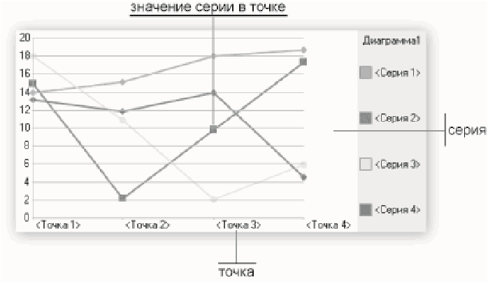 <strong>Рис. 13.76.</strong> Пример диаграммы

Как правило, в качестве <em>точек</em> используются моменты или объекты, для которых мы получаем значения
	характеристик, а в качестве <em>серий</em> – характеристики, значения которых нас интересуют. На пересечении серии и
	точки находится <em>значение</em> диаграммы.

Например, диаграмма продаж видов номенклатуры по месяцам будет состоять из точек – месяцев, серий – видов
	номенклатуры и значений – оборотов продаж.

Диаграмма как объект встроенного языка имеет три области, которые позволяют управлять оформлением диаграммы: область
	построения, область заголовка и область легенды (рис. 13.77).

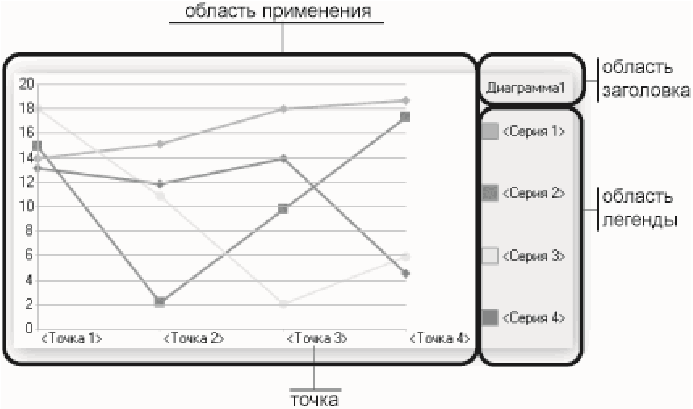 <strong>Рис. 13.77.</strong> Области диаграммы

Диаграмма может быть вставлена в структуру отчета как отдельный элемент. В следующем варианте настроек отчета
	ВыручкаМастеров мы будем использовать диаграмму в структуре настроек схемы компоновки данных.

В режиме «Конфигуратор»

Вернемся в конфигуратор и откроем схему компоновки данных на закладке Настройки. 

В левой части окна находится список вариантов отчета. 

При создании настроек отчета в первый раз система компоновки данных по умолчанию создает Основной вариант настроек. И
	мы видим его в списке вариантов нашего отчета. Чтобы добавить новый вариант, нажмем кнопку Добавить над этим
	списком. Зададим имя варианта – ОбъемВыручки, а представление варианта отчета в интерфейсе как Объем выручки (рис.
	13.78).

Мы видим, что структура отчета и все его настройки очистились. 

Но они не пропали, а стали невидимы, так как относятся к Основному варианту настроек. 

Если у отчета есть несколько вариантов, то мы видим и можем изменять настройки того варианта, который выделен в
	данный момент. Причем вся остальная информация в схеме компоновки данных (ресурсы, параметры, наборы данных)
	осталась без изменений. Данные для отчета будут получены с помощью того же запроса к базе данных. Изменятся лишь
	настройки, которые определят, как будет представлен отчет.

Добавим в структуру отчета диаграмму. Для этого выделим корневой элемент Отчет, вызовем его контекстное меню и
	добавим диаграмму (рис. 13.79).

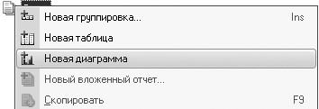

<strong>Рис. 13.79.</strong> Добавление диаграммы в структуру отчета

Затем выделим ветку Точки и добавим в нее группировку по полю Мастер. Серии диаграммы оставим без изменений. 

Для демонстрации вклада мастеров в общий объем выручки хорошо подойдет измерительная диаграмма, которую мы хотим
	показать. Для этого вида диаграммы достаточно задать только точки, поэтому серии мы не задаем. 

В значения диаграммы выводится один или сразу несколько ресурсов отчета. У нас всего один ресурс – Выручка (поле
	ресурса помечено соответствующей пиктограммой и отличается от обычных полей). 

Поэтому перейдем на закладку Выбранные поля и выберем поле Выручка для вывода в отчет. 

Структура отчета должна принять следующий вид (рис. 13.80).

<strong>ВниМАние!</strong>

В диаграмме обязательно должен выводиться один или несколько ресурсов отчета, иначе будет получена ошибка.

<strong>Рис. 13.80.</strong> Структура отчета и настройки диаграммы

На закладке Другие настройки выберем тип диаграммы – Измерительная (рис. 13.81).

Прокрутив вниз список свойств измерительной диаграммы, зададим ее полосы – Плохо, Хорошо и Отлично (рис. 13.82).

В заключение включим параметры Начало периода и Конец периода в состав пользовательских настроек и установим для них
	Режим редактирования – Быстрый доступ. 

<strong>ВниМАние!</strong>

Состав пользовательских настроек для каждого варианта отчета нужно настраивать заново, поскольку у каждого варианта
	отчета – свои пользовательские настройки.

<strong>Рис. 13.82.</strong> Настройка полос измерительной диаграммы

В режиме «1С:Предприятие»

Запустим «1С:Предприятие» в режиме отладки и выполним команду Выручка мастеров в разделе Расчет зарплаты. В
	открывшемся окне отчета нажмем кнопку Выбрать вариант (рис. 13.83). 

В окне вариантов отчета мы видим теперь два варианта – Основной и только что созданный нами вариант Объем выручки.
	Выделим его и нажмем кнопку Выбрать. Нажмем кнопку Сформировать (рис. 13.84).

<strong>Рис. 13.84.</strong> Результат выполнения отчета

В результате мы видим те же данные, что и в основном варианте отчета, представленные в виде измерительной диаграммы.
	На диаграмме хорошо видна доля каждого мастера в общем объеме выручки. Обратите внимание, что при наведении курсора
	на стрелку диаграммы появляется подсказка.

Заметьте, что мы сформировали отчет, не задавая отчетный период. Но все данные об оказании услуг все равно попали в
	отчет. В реальной жизни документов будет, конечно, не три, а намного больше. Поэтому возможность указывать отчетный
	период нужна, чтобы просматривать диаграммы о работе мастеров, например, за месяц и т. п.

Если же понадобится просмотреть данные о работе какого-либо мастера с разбивкой по дням и клиентам, достаточно
	выбрать Основной вариант отчета и переформировать отчет.

Таким образом, на примере отчета Выручка мастеров мы показали создание и использование различных вариантов отчета в
	целях наилучшего представления информации о работе мастеров.

<h1>Лабораторная работа № 19 Передача готовой продукции</h1>

<strong>Порядок выполнения работы </strong>

1. Ознакомьтесь с теоретическими основами в настоящих указаниях и конспектах лекций. 

2. Получите задание у преподавателя. 

3. Сделайте скриншоты (кнопка клавиатуры PrtSc) выполненных заданий в текстовом (Word) файле <em>Фамилия_ЛР</em>

4. Составьте отчет по лабораторной работе. 

5. Отчитайте работу преподавателю.

<strong>Получение актуальных значений из периодического регистра сведений</strong>

Следующий отчет – Перечень услуг – будет содержать информацию о том, какие услуги и по какой цене оказывает ООО «На
	все руки мастер» (рис. 13.85).

На его примере мы познакомимся с возможностью получения последних значений из периодического регистра сведений и с
	возможностью вывода иерархических справочников.

В режиме «Конфигуратор»

Добавим новый объект конфигурации Отчет. Назовем его ПереченьУслуг и запустим конструктор схемы компоновки данных.
	Добавим новый Набор данных – запрос и вызовем конструктор запроса. 

Запрос для набора данных

В качестве источника данных для запроса выберем объектную (ссылочную) таблицу справочника Номенклатура и виртуальную
	таблицу регистра сведений Цены.СрезПоследних. 

Для того чтобы исключить неоднозначность имен в запросе, переименуем таблицу Номенклатура в СпрНоменклатура. Для
	этого выделим ее в списке Таблицы, вызовем ее контекстное меню и выберем пункт Переименовать таблицу.

Параметры виртуальной таблицы

Вызовем диалог ввода параметров виртуальной таблицы

Цены.СрезПоследних и укажем, что период будет передан в параметре ДатаОтчета. Для этого выделим эту таблицу в списке
	Таблицы и нажмем кнопку Параметры виртуальной таблицы (рис. 13.86).

Затем выберем из таблиц следующие поля (рис. 13.87):

<ul>
	<li>СпрНоменклатура.Родитель,</li>
	<li>СпрНоменклатура.Ссылка,</li>
	<li>ЦеныСрезПоследних.Цена.</li>
</ul>

Левое соединение таблиц

Перейдем на закладку Связи. Мы видим, что платформа автоматически добавила условие связи таблиц, при котором значение
	измерения Номенклатура регистра сведений должно быть равно ссылке на элемент справочника Номенклатура. Нас это
	устраивает.

Снимем флажок Все у таблицы регистра и установим его у таблицы справочника, тем самым установив вид связи как левое
	соединение для таблицы справочника (рис. 13.88).

На закладке Условия зададим условие выбора элементов справочника Номенклатура – выбираемые элементы должны
	соответствовать виду номенклатуры, переданному в параметре запроса ВидНоменклатуры (рис. 13.89).

Псевдонимы полей 

На закладке Объединения/Псевдонимы укажем, что поле Родитель будет иметь псевдоним ГруппаУслуг, а поле Ссылка –
	Услуга (рис. 13.90).

На этом создание запроса завершено, нажмем OK. 

Анализ текста запроса

Теперь рассмотрим текст запроса, сформированный конструктором (листинг 13.13).

<strong>листинг 13.13.</strong> Текст запроса

<table>
	<tr>
		<td>
ВЫБРАТЬ
</td>
	</tr>
	<tr>
		<td></td>
	</tr>
	<tr>
		<td>
СпрНоменклатура.Родитель КАК ГруппаУслуг,
</td>
	</tr>
	<tr>
		<td></td>
	</tr>
	<tr>
		<td>
СпрНоменклатура.Ссылка КАК Услуга,
</td>
	</tr>
	<tr>
		<td></td>
	</tr>
	<tr>
		<td>
ЦеныСрезПоследних.Цена
</td>
	</tr>
	<tr>
		<td></td>
	</tr>
	<tr>
		<td>
ИЗ
</td>
	</tr>
	<tr>
		<td></td>
	</tr>
	<tr>
		<td>
Справочник.Номенклатура КАК СпрНоменклатура
</td>
	</tr>
	<tr>
		<td></td>
	</tr>
	<tr>
		<td>
ЛЕВОЕ СОЕДИНЕНИЕ РегистрСведений.Цены.СрезПоследних(&amp;ДатаОтчета, ) 
</td>
	</tr>
	<tr>
		<td></td>
	</tr>
	<tr>
		<td>
 КАК ЦеныСрезПоследних
</td>
	</tr>
	<tr>
		<td></td>
	</tr>
	<tr>
		<td>
ПО ЦеныСрезПоследних.Номенклатура = СпрНоменклатура.Ссылка
</td>
	</tr>
	<tr>
		<td></td>
	</tr>
	<tr>
		<td>
ГДЕ
</td>
	</tr>
	<tr>
		<td></td>
	</tr>
	<tr>
		<td>
СпрНоменклатура.ВидНоменклатуры = &amp;ВидНоменклатуры
</td>
	</tr>
</table>

Практически все конструкции, использованные в этом запросе, нам уже известны. Перейдем к редактированию схемы
	компоновки данных. 

Ресурсы

На закладке Ресурсы нажатием кнопки  выберем единственный доступный ресурс – Цена. В колонке
	Рассчитывать по нажмем кнопку 

<strong>Рис. 13.91.</strong> Ресурсы схемы компоновки

Это сделано для того, чтобы итоги по цене выводились для конкретной услуги, так как для группировок и общих итогов
	рассчитывать цену не имеет смысла.

Параметры

На закладке Параметры зададим значение параметра ВидНоменклатуры как Перечисление.ВидыНоменклатуры.Услуга. 

Кроме этого, снимем ограничение доступности для параметра ДатаОтчета. 

В поле Тип этого параметра зададим состав даты – Дата. Для параметра Период, наоборот, установим ограничение
	доступности (рис. 13.92).

<strong>Рис. 13.92.</strong> Параметры схемы компоновки

Настройки

Приступим к созданию структуры отчета. Перейдем на закладку Настройки и создадим группировку по полю ГруппаУслуг,
	указав тип группировки Иерархия (рис. 13.93).

<strong>Рис. 13.93.</strong> Выбор поля и типа группировки

До сих пор мы использовали тип иерархии по умолчанию – Без иерархии. Существуют следующие типы иерархии для
	группировок отчета:

<ul>
	<li>Без иерархии – в группировке выводятся только неиерархические записи;</li>
	<li>Иерархия – в группировке выводятся как неиерархические, так и иерархические записи;</li>
	<li>Только иерархия – в группировке выводятся только иерархические записи.</li>
</ul>

Внутри этой группировки создадим еще одну группировку без указания группового поля. Она будет содержать детальные
	записи отчета. 

Перейдем на закладку Выбранные поля и укажем, что в отчет будут выводиться поля Услуга и Цена (рис. 13.94).

Теперь настроим внешний вид отчета на закладке Другие настройки. 

Чтобы запретить вывод общих итогов в отчете, установим параметр Расположение общих итогов по вертикали в значение
	Нет. Для параметра Расположение полей группировок укажем значение Отдельно и только в итогах (так наш отчет будет
	лучше читаться). 

Также зададим заголовок отчета – Перечень услуг (рис. 13.95).

<strong>Рис. 13.95.</strong> Параметры настроек вывода отчета

В заключение включим параметр Дата отчета в состав пользовательских настроек и установим для него Режим
	редактирования – Быстрый доступ. Также определим, в каких подсистемах будет отображаться наш отчет. 

Закроем конструктор схемы компоновки данных и в окне редактирования объекта конфигурации Отчет ПереченьУслуг перейдем
	на закладку Подсистемы. Отметим в списке подсистем конфигурации подсистемы Оказание услуг и Бухгалтерия. 

В режиме «1С:Предприятие»

Запустим «1С:Предприятие» в режиме отладки и прежде всего откроем периодический регистр Цены. 

Добавим в него еще одно значение для услуги Диагностика: новая цена услуги на 10.07.2013 – 350 (рис. 13.96). Это
	позволит нам протестировать отчет.

для услуги «Диагностика»

Теперь выполним отчет Перечень услуг по состоянию на 07.07.2013 (рис. 13.97).

Наш отчет правильно отражает цену услуги Диагностика на 

07.07.2013 – 200 руб.

Еще раз выполним отчет, но теперь уже на другую дату – 10.07.2013 (рис. 13.98).

Как видите, показана новая цена услуги Диагностика – 350 руб.

<strong>Рис. 13.97.</strong> Результат выполнения отчета

<strong>Рис. 13.98.</strong> Результат выполнения отчета

Таким образом, на примере этого отчета мы показали, как система компоновки данных получает последние значения из
	периодического регистра сведений и как вывести группировки по иерархии справочника.

<strong>Использование вычисляемого поля в отчете</strong>

Следующий отчет – Рейтинг клиентов – будет показывать в графическом виде, каков доход от оказания услуг каждому из
	клиентов за все время работы ООО «На все руки мастер» (рис. 13.99).

На его примере мы продемонстрируем возможность использования вычисляемого поля и вывод результата в виде круговой
	диаграммы и в виде гистограммы.

В режиме «Конфигуратор»

Добавим новый объект конфигурации Отчет. Назовем его РейтингКлиентов и запустим конструктор схемы компоновки данных.
	Создадим новый Набор данных – запрос и вызовем конструктор запроса. 

Запрос для набора данных

В качестве источника данных для запроса выберем виртуальную таблицу регистра накопления Продажи.Обороты. Затем
	выберем из нее следующие поля (рис. 13.100):

<ul>
	<li>ПродажиОбороты.Клиент,  ПродажиОбороты.ВыручкаОборот,</li>
	<li>ПродажиОбороты.СтоимостьОборот.</li>
</ul>

<strong>Рис. 13.100.</strong> Выбранные поля

На закладке Объединения/Псевдонимы укажем, что поле Выруч- каОборот будет иметь псевдоним Выручка, а поле
	СтоимостьОборот – Стоимость. На этом создание запроса завершено, нажмем OK. 

Ничего нового и непонятного в этом запросе для нас нет, поэтому не будем его подробно рассматривать. Перейдем к
	редактированию схемы компоновки данных. 

Вычисляемые поля

На этом этапе мы столкнулись с необходимостью отразить в отчете поле, которого нет в наборе данных. Раньше мы
	использовали в отчете те поля, которые описывались в наборе данных. Теперь, чтобы отобразить доход от оказания услуг
	в разрезе клиентов, нам необходимо дополнительное поле, рассчитанное как разница между выручкой и стоимостью
	оказания услуг.

Для этого в системе компоновки данных есть возможность определения вычисляемого поля.

<em>Вычисляемые поля</em> представляют собой дополнительные поля схемы компоновки данных, значения которых будут
	вычисляться по некоторой формуле.

Перейдем на закладку Вычисляемые поля схемы компоновки данных и, нажав кнопку Добавить, добавим вычисляемое
	поле. 

400 1С:Предприятие 8.3. Практическое пособие разработчика

Дадим ему имя (Путь к данным) – Доход, в колонку Выражение введем выражение для расчета вычисляемого поля (листинг
	13.14).

<strong>листинг 13.14.</strong> Выражение для расчета вычисляемого поля «Доход»

Выручка - Стоимость

Заголовок вычисляемого поля, который будет отображаться в шапке отчета, задается по умолчанию, но можно его изменить
	(рис. 13.101).

<strong>Рис. 13.101.</strong> Создание вычисляемого поля

Вычисляемое поле можно добавить в ресурсы отчета, чтобы вычислять по нему групповые и общие итоги.

Ресурсы

На закладке Ресурсы нажатием кнопки  выберем все доступные ресурсы отчета. Как мы видим,
	вычисляемое поле Доход также добавилось в список ресурсов (рис. 13.102).

<strong>Рис. 13.102.</strong> Ресурсы схемы компоновки данных

Настройки

На закладке Настройки добавим в структуру отчета диаграмму. Для этого нажмем кнопку Добавить в командной панели окна
	настроек и добавим диаграмму (рис. 13.103).

<strong>Рис. 13.103.</strong> Добавление диаграммы в структуру отчета

Затем выделим ветку Точки и добавим в нее группировку по полю Клиент. 

Серии диаграммы оставим без изменений. 

Дело в том, что для демонстрации рейтинга клиентов хорошо подойдет круговая диаграмма, которую мы хотим показать. Для
	этого вида диаграммы достаточно задать только точки, поэтому серии мы не задаем. 

В значения диаграммы всегда выводится один или сразу несколько ресурсов отчета. Перейдем на закладку Выбранные поля и
	выберем поле Доход для вывода в отчет. 

Структура отчета должна принять следующий вид (рис. 13.104).

<strong>Рис. 13.104.</strong> Структура отчета и настройки диаграммы

На закладке Другие настройки выберем тип диаграммы – Круговая объемная и включим эту настройку в состав быстрых
	пользовательских настроек (рис. 13.105). Также зададим заголовок отчета – 

<strong>Рис. 13.105.</strong> Круговая объемная диаграмма

В заключение определим, в каких подсистемах будет отображаться наш отчет. В окне редактирования объекта конфигурации
	Отчет РейтингКлиентов перейдем на закладку Подсистемы. Отметим в списке подсистем конфигурации подсистемы Оказание
	услуг и Бухгалтерия. 

В режиме «1С:Предприятие»

Запустим «1С:Предприятие» в режиме отладки и выполним команду Рейтинг клиентов в разделе Бухгалтерия. Нажмем
	Сформировать. 

Мы видим данные о доходе от оказания услуг по каждому из клиентов, представленные в виде круговой диаграммы (рис.
	13.106).

Воспользуемся настройкой типа диаграммы, представленной в форме отчета, и изменим тип диаграммы на Гистограмма
	объемная. Заново сформируем отчет (рис. 13.107).

Таким образом, мы продемонстрировали, как можно использовать различные виды диаграмм для визуализации данных
	отчета.

<strong>Рис. 13.106.</strong> Круговая объемная диаграмма

<strong>Рис. 13.107.</strong> Гистограмма объемная

<strong>Вывод данных в таблицу</strong>

На примере создания универсального отчета мы продемонстрируем вывод данных в таблицу (рис. 13.108).

Мы покажем, как сделать отчет максимально универсальным, чтобы позволить пользователю в режиме 1С:Предприятие, не
	обращаясь к полным настройкам отчета (не выполняя Еще  Изменить вариант…), изменять его структуру и внешний вид.
	Например, поменять местами строки и колонки таблицы или изменить данные, выводящиеся в ячейках таблицы. 

В режиме «Конфигуратор»

Добавим новый объект конфигурации Отчет. Назовем его Универсальный и запустим конструктор схемы компоновки данных.
	Создадим новый Набор данных – запрос и вызовем конструктор запроса. 

Запрос для набора данных

В качестве источника данных для запроса выберем виртуальную таблицу регистра накопления Продажи.Обороты. Затем
	выберем из нее все поля (рис. 13.109).

<strong>Рис. 13.109.</strong> Выбранные поля

Анализ текста запроса

Нажмем OK и посмотрим на текст, сформированный конструктором запроса (листинг 13.15). <strong>листинг 13.15.</strong>
	Текст запроса

<table>
	<tr>
		<td>
ВЫБРАТЬ
</td>
	</tr>
	<tr>
		<td></td>
	</tr>
	<tr>
		<td>
ПродажиОбороты.Номенклатура,
</td>
	</tr>
	<tr>
		<td></td>
	</tr>
	<tr>
		<td>
ПродажиОбороты.Клиент,
</td>
	</tr>
	<tr>
		<td></td>
	</tr>
	<tr>
		<td>
ПродажиОбороты.Мастер,
</td>
	</tr>
	<tr>
		<td></td>
	</tr>
	<tr>
		<td>
ПродажиОбороты.КоличествоОборот,
</td>
	</tr>
	<tr>
		<td></td>
	</tr>
	<tr>
		<td>
ПродажиОбороты.ВыручкаОборот,
</td>
	</tr>
	<tr>
		<td></td>
	</tr>
	<tr>
		<td>
ПродажиОбороты.СтоимостьОборот
</td>
	</tr>
	<tr>
		<td></td>
	</tr>
	<tr>
		<td>
ИЗ
</td>
	</tr>
	<tr>
		<td></td>
	</tr>
	<tr>
		<td>
РегистрНакопления.Продажи.Обороты КАК ПродажиОбороты 
</td>
	</tr>
</table>

Ресурсы

На закладке Ресурсы нажатием кнопки  выберем все доступные ресурсы отчета. 

Настройки

На закладке Настройки добавим в структуру отчета таблицу. Для этого нажмем кнопку Добавить в командной панели окна
	настроек и добавим таблицу (рис. 13.110).

<strong>Рис. 13.110.</strong> Добавление таблицы в структуру отчета

Мы не будем здесь задавать строки и колонки этой таблицы, а также список выбранных полей, так как хотим предоставить
	полную свободу пользователю в этих действиях. Для этого выделим в структуре элементов отчета элемент Таблица и
	нажмем кнопку Свойства элемента пользовательских настроек, расположенную вверху в командной панели окна
	настроек. 

В появившемся окне мы можем редактировать состав пользовательских настроек таблицы. 

Установим признак использования для настроек Выбранные поля, Группировки строк и Группировки колонок и оставим для
	них по умолчанию свойство Режим редактирования в значении Быстрый доступ (рис. 13.111).

<strong>Рис. 13.111.</strong> Состав пользовательских настроек

Таким образом, мы предоставили пользователю возможность самостоятельно определять состав выбранных полей, группировок
	строк и колонок таблицы непосредственно в отчетной форме перед формированием отчета.

В заключение определим, в каких подсистемах будет отображаться наш отчет. 

Закроем конструктор схемы компоновки данных и в окне редактирования объекта конфигурации Отчет Универсальный перейдем
	на закладку Подсистемы. Отметим в списке подсистем конфигурации подсистему Оказание услуг. 

В режиме «1С:Предприятие»

Запустим «1С:Предприятие» в режиме отладки и выполним команду Универсальный в разделе ОказаниеУслуг. 

Если мы сейчас нажмем Сформировать, то ничего не увидим в результате, так как список выбранных полей, группировок
	строк и колонок таблицы пуст. Заполним эти быстрые пользовательские настройки.

Нажмем кнопку выбора в строке Выбранные поля и выберем из доступных полей поле ВыручкаОборот. Нажмем кнопку выбора в
	строке Строки и добавим в строки таблицы группировку по полю Номенклатура с типом Иерархия. Нажмем кнопку выбора в
	строке Колонки и добавим в колонки таблицы группировку по полю Мастер. Нажмем Сформировать. 

Отчет примет следующий вид (рис. 13.112).

Заметьте, что при прокручивании отчета вниз и вправо положение шапки отчета и самой левой колонки таблицы остается
	зафиксированным. Для удобства пользователя платформа автоматически фиксирует сверху и слева табличный документ, в
	который выводится результат отчета. Можно также вручную управлять фиксацией строк и столбцов отчета с помощью
	параметров вывода ФиксацияСлева и ФиксацияСверху.

Теперь добавим в список выбранных полей поле СтоимостьОборот. В строки таблицы вместо группировки по полю
	Номенклатура поместим группировку по полю Клиент. 

В результате отчет примет следующий вид (рис. 13.113).

Теперь исключим из списка выбранных полей поле СтоимостьОборот. В строках таблицы заменим прежнюю группировку на
	группировку по полю Номенклатура с типом ТолькоИерархия. В колонки таблицы добавим группировку по полю Клиент и
	поместим ее первой в списке группировок. 

В результате отчет примет следующий вид (рис. 13.114).

Таким образом, используя этот отчет, мы предоставили пользователю альтернативную возможность самостоятельно
	формировать отчет по регистру Продажи.

<h1>Лабораторная работа № 20 Реализация по безналу</h1>

<strong>Порядок выполнения работы </strong>

1. Ознакомьтесь с теоретическими основами в настоящих указаниях и конспектах лекций. 

2. Получите задание у преподавателя. 

3. Сделайте скриншоты (кнопка клавиатуры PrtSc) выполненных заданий в текстовом (Word) файле <em>Фамилия_ЛР</em>

4. Составьте отчет по лабораторной работе. 

5. Отчитайте работу преподавателю.

<strong>Повышение скорости проведения</strong>

Первое, чем мы займемся на этом занятии, – избавимся от «вредной» конструкции
	ТекСтрокаПереченьНоменклатуры.Номенклатура.ВидНоменклатуры. 

<strong>В режиме «Конфигуратор»</strong>

Откроем модуль документа ОказаниеУслуги. 

Напомним, как выглядит сейчас процедура проведения этого документа (листинг 14.3). <strong>листинг 14.3.</strong>
	Процедура «ОбработкаПроведения»

<table>
	<tr>
		<td>
Движения.ОстаткиМатериалов.Записывать = Истина;
</td>
	</tr>
	<tr>
		<td></td>
	</tr>
	<tr>
		<td>
Движения.СтоимостьМатериалов.Записывать = Истина;
</td>
	</tr>
	<tr>
		<td></td>
	</tr>
	<tr>
		<td>
Движения.Продажи.Записывать = Истина;
</td>
	</tr>
	<tr>
		<td></td>
	</tr>
	<tr>
		<td></td>
	</tr>
	<tr>
		<td></td>
	</tr>
	<tr>
		<td>
Для Каждого ТекСтрокаПереченьНоменклатуры Из ПереченьНоменклатуры Цикл
</td>
	</tr>
	<tr>
		<td></td>
	</tr>
	<tr>
		<td>
Если ТекСтрокаПереченьНоменклатуры.Номенклатура.ВидНоменклатуры = 
</td>
	</tr>
	<tr>
		<td></td>
	</tr>
	<tr>
		<td>
Перечисления.ВидыНоменклатуры.Материал Тогда 
</td>
	</tr>
	<tr>
		<td></td>
	</tr>
	<tr>
		<td></td>
	</tr>
	<tr>
		<td></td>
	</tr>
	<tr>
		<td>
// Регистр ОстаткиМатериалов Расход
</td>
	</tr>
	<tr>
		<td></td>
	</tr>
	<tr>
		<td>
Движение = Движения.ОстаткиМатериалов.Добавить();
</td>
	</tr>
	<tr>
		<td></td>
	</tr>
	<tr>
		<td>
Движение.ВидДвижения = ВидДвиженияНакопления.Расход;
</td>
	</tr>
	<tr>
		<td></td>
	</tr>
	<tr>
		<td>
Движение.Период = Дата;
</td>
	</tr>
	<tr>
		<td></td>
	</tr>
	<tr>
		<td>
Движение.Материал = ТекСтрокаПереченьНоменклатуры.Номенклатура;
</td>
	</tr>
	<tr>
		<td></td>
	</tr>
	<tr>
		<td>
Движение.Склад = Склад;
</td>
	</tr>
	<tr>
		<td></td>
	</tr>
	<tr>
		<td>
Движение.Количество = ТекСтрокаПереченьНоменклатуры.Количество;
</td>
	</tr>
	<tr>
		<td></td>
	</tr>
	<tr>
		<td></td>
	</tr>
	<tr>
		<td></td>
	</tr>
	<tr>
		<td>
// Регистр СтоимостьМатериалов Расход
</td>
	</tr>
	<tr>
		<td></td>
	</tr>
	<tr>
		<td>
Движение = Движения.СтоимостьМатериалов.Добавить();
</td>
	</tr>
	<tr>
		<td></td>
	</tr>
	<tr>
		<td>
Движение.ВидДвижения = ВидДвиженияНакопления.Расход;
</td>
	</tr>
	<tr>
		<td></td>
	</tr>
	<tr>
		<td>
Движение.Период = Дата;
</td>
	</tr>
	<tr>
		<td></td>
	</tr>
	<tr>
		<td>
Движение.Материал = ТекСтрокаПереченьНоменклатуры.Номенклатура;
</td>
	</tr>
	<tr>
		<td></td>
	</tr>
	<tr>
		<td>
Движение.Стоимость = ТекСтрокаПереченьНоменклатуры.Количество * 
</td>
	</tr>
	<tr>
		<td></td>
	</tr>
	<tr>
		<td>
ТекСтрокаПереченьНоменклатуры.Стоимость;
</td>
	</tr>
	<tr>
		<td></td>
	</tr>
	<tr>
		<td>
КонецЕсли;
</td>
	</tr>
	<tr>
		<td></td>
	</tr>
	<tr>
		<td></td>
	</tr>
	<tr>
		<td></td>
	</tr>
	<tr>
		<td>
// Регистр Продажи 
</td>
	</tr>
	<tr>
		<td></td>
	</tr>
	<tr>
		<td>
Движение = Движения.Продажи.Добавить();
</td>
	</tr>
	<tr>
		<td></td>
	</tr>
	<tr>
		<td>
Движение.Период = Дата;
</td>
	</tr>
	<tr>
		<td></td>
	</tr>
	<tr>
		<td>
Движение.Номенклатура = ТекСтрокаПереченьНоменклатуры.Номенклатура;
</td>
	</tr>
	<tr>
		<td></td>
	</tr>
	<tr>
		<td>
Движение.Клиент = Клиент;
</td>
	</tr>
	<tr>
		<td></td>
	</tr>
	<tr>
		<td>
Движение.Мастер = Мастер;
</td>
	</tr>
	<tr>
		<td></td>
	</tr>
	<tr>
		<td>
Движение.Количество = ТекСтрокаПереченьНоменклатуры.Количество;
</td>
	</tr>
	<tr>
		<td></td>
	</tr>
	<tr>
		<td>
Движение.Выручка = ТекСтрокаПереченьНоменклатуры.Сумма;
</td>
	</tr>
	<tr>
		<td></td>
	</tr>
	<tr>
		<td>
Движение.Стоимость = ТекСтрокаПереченьНоменклатуры.Стоимость * 
</td>
	</tr>
	<tr>
		<td></td>
	</tr>
	<tr>
		<td>
ТекСтрокаПереченьНоменклатуры.Количество;
</td>
	</tr>
	<tr>
		<td></td>
	</tr>
	<tr>
		<td>
КонецЦикла;
</td>
	</tr>
</table>

Другими словами, все данные, необходимые для проведения документа, мы получаем из самого документа, и только для
	определения того, чем является номенклатура (товаром или услугой), мы обращаемся к базе данных, читая данные всего
	объекта Номенклатура (листинг 14.4).

<strong>листинг 14.4.</strong> Обращение к объекту «Номенклатура»

Если ТекСтрокаПереченьНоменклатуры.Номенклатура.ВидНоменклатуры

Забегая вперед, скажем, что это не единственные данные, которые не содержатся в самом документе и которые в то же
	время будут нужны нам для правильного его проведения.

Поэтому поступим следующим образом: все данные, связанные с номенклатурой, которая содержится в табличной части
	документа, мы будем получать с помощью запроса к базе данных. А данные, связанные с самим документом (например, дата
	документа, склад), мы по-прежнему будем получать из документа. Такой подход позволит нам читать только нужные данные
	и за счет этого максимально ускорить проведение документа.

Итак, запросом мы будем получать:

<ul>
	<li>номенклатуру,</li>
	<li>количество,</li>
	<li>сумму,</li>
	<li>стоимость.</li>
</ul>

Из документа мы возьмем следующие данные:

<ul>
	<li>дата,</li>
	<li>клиент,  мастер,  склад.</li>
</ul>

Приступим к созданию запроса. Установим курсор перед циклом обхода табличной части документа и из контекстного меню
	выберем пункт Конструктор запроса с обработкой результата (рис. 14.4).

Подтвердим, что мы хотим создать новый запрос.

В окне конструктора запросов перейдем на закладку Таблицы и поля и выберем таблицу ОказаниеУслугиПереченьНоменклатуры
	– это табличная часть документа ОказаниеУслуги. 

Из этой таблицы нам нужны поля – Номенклатура, Номенклату- раВидНоменклатуры, Количество, Сумма и Стоимость (рис.
	14.5).

Но нам нужны не все записи этой таблицы, а только те, которые относятся к нашему документу. 

Поэтому перейдем на закладку Условия и зададим условие отбора из таблицы документа только строк проводимого
	документа. 

Для этого перетащим поле Ссылка в список условий запроса (листинг 14.5).

<strong>листинг 14.5.</strong> Условие отбора из таблицы документа

ОказаниеУслугиПереченьНоменклатуры.Ссылка = &amp;Ссылка

Ссылка на этот документ будет передана в параметр запроса Ссылка (рис. 14.6).

<strong>Рис. 14.6.</strong> Условие отбора из таблицы документа

Также следует учесть, что в табличной части документа одна и та же номенклатура может встречаться несколько раз. 

Поэтому на закладке Группировка сгруппируем наши записи по полям Номенклатура и НоменклатураВидНоменклатуры, а
	рассчитывать будем сумму значений для полей Количество и Сумма. 

Благодаря этому в результате значения номенклатуры повторяться не будут, и для каждого из них будут посчитаны
	суммарные значения по полям Количество и Сумма, если в табличной части документа содержится несколько строк с
	одинаковой номенклатурой.

Также в состав суммируемых полей включим и поле Стоимость. По нему будем рассчитывать, например, функцию
	Максимум. 

Мы подразумеваем, что для разных строк одной и той же номенклатуры стоимость будет одинаковой, поэтому функция
	Максимум нужна нам лишь для того, чтобы получить одно из имеющихся значений стоимости (рис. 14.7).

<strong>Рис. 14.7.</strong> Группировка строк таблицы документа

На закладке Объединения/Псевдонимы зададим псевдонимы для полей Количество и Сумма – КоличествоВДокументе и
	СуммаВДокументе, а для поля НоменклатураВидНоменклатуры зададим псевдоним ВидНоменклатуры просто для облегчения
	чтения запроса (рис. 14.8).

Нажмем ОК и посмотрим, какой текст запроса сформировал конструктор (листинг 14.6). <strong>листинг 14.6.</strong>
	Текст запроса

<table>
	<tr>
		<td>
//{{КОНСТРУКТОР_ЗАПРОСА_С_ОБРАБОТКОЙ_РЕЗУЛЬТАТА
</td>
	</tr>
	<tr>
		<td></td>
	</tr>
	<tr>
		<td>
// Данный фрагмент построен конструктором.
</td>
	</tr>
	<tr>
		<td></td>
	</tr>
	<tr>
		<td>
// При повторном использовании конструктора внесенные вручную изменения будут утеряны!!!
</td>
	</tr>
	<tr>
		<td></td>
	</tr>
	<tr>
		<td></td>
	</tr>
	<tr>
		<td></td>
	</tr>
	<tr>
		<td>
Запрос = Новый Запрос;
</td>
	</tr>
	<tr>
		<td></td>
	</tr>
	<tr>
		<td>
Запрос.Текст = 
</td>
	</tr>
	<tr>
		<td></td>
	</tr>
	<tr>
		<td>
&quot;ВЫБРАТЬ
</td>
	</tr>
	<tr>
		<td></td>
	</tr>
	<tr>
		<td>
 | ОказаниеУслугиПереченьНоменклатуры.Номенклатура,
</td>
	</tr>
	<tr>
		<td></td>
	</tr>
	<tr>
		<td>
 | ОказаниеУслугиПереченьНоменклатуры.Номенклатура.ВидНоменклатуры 
</td>
	</tr>
	<tr>
		<td></td>
	</tr>
	<tr>
		<td>
 | КАК ВидНоменклатуры,
</td>
	</tr>
</table>

 | СУММА(ОказаниеУслугиПереченьНоменклатуры.Количество) 

 | КАК КоличествоВДокументе,

 | СУММА(ОказаниеУслугиПереченьНоменклатуры.Сумма) КАК СуммаВДокументе,

<table>
	<tr>
		<td>
 | МАКСИМУМ(ОказаниеУслугиПереченьНоменклатуры.Стоимость) КАК Стоимость
</td>
	</tr>
	<tr>
		<td></td>
	</tr>
	<tr>
		<td>
|ИЗ
</td>
	</tr>
	<tr>
		<td></td>
	</tr>
	<tr>
		<td>
 | Документ.ОказаниеУслуги.ПереченьНоменклатуры 
</td>
	</tr>
	<tr>
		<td></td>
	</tr>
	<tr>
		<td>
 | КАК ОказаниеУслугиПереченьНоменклатуры
</td>
	</tr>
	<tr>
		<td></td>
	</tr>
	<tr>
		<td>
|ГДЕ
</td>
	</tr>
	<tr>
		<td></td>
	</tr>
	<tr>
		<td>
 | ОказаниеУслугиПереченьНоменклатуры.Ссылка = &amp;Ссылка
</td>
	</tr>
	<tr>
		<td></td>
	</tr>
	<tr>
		<td>
 |
</td>
	</tr>
	<tr>
		<td></td>
	</tr>
	<tr>
		<td>
|СГРУППИРОВАТЬ ПО
</td>
	</tr>
	<tr>
		<td></td>
	</tr>
	<tr>
		<td>
 | ОказаниеУслугиПереченьНоменклатуры.Номенклатура,
</td>
	</tr>
	<tr>
		<td></td>
	</tr>
	<tr>
		<td>
 | ОказаниеУслугиПереченьНоменклатуры.Номенклатура.ВидНоменклатуры&quot;;
</td>
	</tr>
	<tr>
		<td></td>
	</tr>
	<tr>
		<td></td>
	</tr>
	<tr>
		<td></td>
	</tr>
	<tr>
		<td>
Запрос.УстановитьПараметр(&quot;Ссылка», Ссылка);
</td>
	</tr>
	<tr>
		<td></td>
	</tr>
	<tr>
		<td></td>
	</tr>
	<tr>
		<td></td>
	</tr>
	<tr>
		<td>
РезультатЗапроса = Запрос.Выполнить();
</td>
	</tr>
	<tr>
		<td></td>
	</tr>
	<tr>
		<td></td>
	</tr>
	<tr>
		<td></td>
	</tr>
	<tr>
		<td>
ВыборкаДетальныеЗаписи = РезультатЗапроса.Выбрать();
</td>
	</tr>
	<tr>
		<td></td>
	</tr>
	<tr>
		<td></td>
	</tr>
	<tr>
		<td></td>
	</tr>
	<tr>
		<td>
Пока ВыборкаДетальныеЗаписи.Следующий() Цикл
</td>
	</tr>
	<tr>
		<td></td>
	</tr>
	<tr>
		<td>
// Вставить обработку выборки ВыборкаДетальныеЗаписи
</td>
	</tr>
	<tr>
		<td></td>
	</tr>
	<tr>
		<td>
КонецЦикла;
</td>
	</tr>
	<tr>
		<td></td>
	</tr>
	<tr>
		<td></td>
	</tr>
	<tr>
		<td></td>
	</tr>
	<tr>
		<td>
//}}КОНСТРУКТОР_ЗАПРОСА_С_ОБРАБОТКОЙ_РЕЗУЛЬТАТА
</td>
	</tr>
</table>

Комментарии конструктора запроса в начале и конце фрагмента можно удалить.

Поскольку для построения запроса мы использовали Конструктор запроса с обработкой результата, конструктор написал за
	нас код для выполнения и обхода записей запроса. Прокомментируем этот код.

Как вы уже знаете, для работы с запросами используется объект встроенного языка Запрос. Вначале создается новый
	объект Запрос и помещается в переменную Запрос. Затем в свойство Текст объекта Запрос помещается сам текст запроса
	(Запрос.Текст = …). 

После этого устанавливается значение параметра запроса &amp;Ссылка как ссылка на тот документ, в модуле которого мы
	сейчас находимся (листинг 14.7).

<strong>листинг 14.7.</strong> Установка параметра запроса

Запрос.УстановитьПараметр(&quot;Ссылка&quot;, Ссылка);

Затем запрос выполняется (Запрос.Выполнить()), получается объект РезультатЗапроса, и выполняется его метод Выбрать(),
	который формирует выборку записей из результата запроса. 

Таким образом, получается объект ВыборкаИзРезультатаЗапроса, который помещается в переменную
	ВыборкаДетальныеЗаписи. 

Далее, используя метод этого объекта Следующий() (ВыборкаДетальныеЗаписи.Следующий()), мы будем в цикле обходить
	выборку записей запроса.

Выполняя метод выборки запроса ВыборкаДетальныеЗаписи.Следующий(), мы на каждом шаге цикла позиционируем указатель на
	следующую запись выборки, пока не будет достигнут конец выборки. 

Чтобы в цикле получить значение какого-либо поля выборки из результата запроса, мы будем обращаться к полям запроса
	через точку от переменной ВыборкаДетальныеЗаписи, которая содержит текущую строку выборки запроса. Например, так:
	ВыборкаДетальныеЗаписи.Номенклатура.

Теперь нам осталось перенести существовавшие ранее в этом модуле строки, описывающие движения регистров, внутрь цикла
	обхода результата запроса (листинг 14.8).

<strong>листинг 14.8.</strong> Цикл обхода записей запроса

<table>
	<tr>
		<td>
Пока ВыборкаДетальныеЗаписи.Следующий() Цикл
</td>
	</tr>
	<tr>
		<td></td>
	</tr>
	<tr>
		<td>
// Вставить обработку выборки ВыборкаДетальныеЗаписи
</td>
	</tr>
	<tr>
		<td></td>
	</tr>
	<tr>
		<td>
КонецЦикла;
</td>
	</tr>
</table>

Сначала вместо комментария «// Вставить обработку выборки ВыборкаДетальныеЗаписи» перенесем условие проверки и весь
	код, формирующий движения по регистрам ОстаткиМатериалов и СтоимостьМатериалов (листинг 14.9). <strong>листинг
		14.9.</strong> Формирование движений регистров

<table>
	<tr>
		<td>
Пока ВыборкаДетальныеЗаписи.Следующий() Цикл
</td>
	</tr>
	<tr>
		<td></td>
	</tr>
	<tr>
		<td>
<strong>Если ТекСтрокаПереченьНоменклатуры.Номенклатура.ВидНоменклатуры = </strong>
</td>
	</tr>
	<tr>
		<td></td>
	</tr>
	<tr>
		<td>
<strong>Перечисления.ВидыНоменклатуры.Материал Тогда </strong>
</td>
	</tr>
	<tr>
		<td></td>
	</tr>
	<tr>
		<td>
<strong>// Регистр ОстаткиМатериалов Расход</strong>
</td>
	</tr>
	<tr>
		<td></td>
	</tr>
	<tr>
		<td>
<strong>Движение = Движения.ОстаткиМатериалов.Добавить();</strong>
</td>
	</tr>
	<tr>
		<td></td>
	</tr>
	<tr>
		<td>
<strong>Движение.ВидДвижения = ВидДвиженияНакопления.Расход;</strong>
</td>
	</tr>
	<tr>
		<td></td>
	</tr>
	<tr>
		<td>
<strong>Движение.Период = Дата;</strong>
</td>
	</tr>
	<tr>
		<td></td>
	</tr>
	<tr>
		<td>
<strong>Движение.Материал = ТекСтрокаПереченьНоменклатуры.Номенклатура;</strong>
</td>
	</tr>
	<tr>
		<td></td>
	</tr>
	<tr>
		<td>
<strong>Движение.Склад = Склад;</strong>
</td>
	</tr>
	<tr>
		<td></td>
	</tr>
	<tr>
		<td>
<strong>Движение.Количество = ТекСтрокаПереченьНоменклатуры.Количество;</strong>
</td>
	</tr>
	<tr>
		<td></td>
	</tr>
	<tr>
		<td></td>
	</tr>
	<tr>
		<td></td>
	</tr>
	<tr>
		<td>
<strong>// Регистр СтоимостьМатериалов Расход</strong>
</td>
	</tr>
	<tr>
		<td></td>
	</tr>
	<tr>
		<td>
<strong>Движение = Движения.СтоимостьМатериалов.Добавить();</strong>
</td>
	</tr>
</table>

<strong>Движение.ВидДвижения = ВидДвиженияНакопления.Расход;</strong>

<strong>Движение.Период = Дата;</strong>

<strong>Движение.Материал = ТекСтрокаПереченьНоменклатуры.Номенклатура;</strong>

<table>
	<tr>
		<td>
<strong>Движение.Стоимость = ТекСтрокаПереченьНоменклатуры.Количество * </strong>
</td>
	</tr>
	<tr>
		<td></td>
	</tr>
	<tr>
		<td>
<strong>ТекСтрокаПереченьНоменклатуры.Стоимость;</strong>
</td>
	</tr>
	<tr>
		<td></td>
	</tr>
	<tr>
		<td>
<strong>КонецЕсли;</strong>
</td>
	</tr>
	<tr>
		<td></td>
	</tr>
	<tr>
		<td>
КонецЦикла;
</td>
	</tr>
</table>

В условии заменим ТекСтрокаПереченьНоменклатуры.Номенклатура на ВыборкаДетальныеЗаписи, так как вид номенклатуры мы
	теперь получаем из запроса. 

В движениях также заменим ТекСтрокаПереченьНоменклатуры на ВыборкаДетальныеЗаписи (листинг 14.10).

<strong>листинг 14.10.</strong> Формирование движений регистров

<table>
	<tr>
		<td>
Пока ВыборкаДетальныеЗаписи.Следующий() Цикл
</td>
	</tr>
	<tr>
		<td></td>
	</tr>
	<tr>
		<td>
Если <strong>ВыборкаДетальныеЗаписи.</strong>ВидНоменклатуры = 
</td>
	</tr>
	<tr>
		<td></td>
	</tr>
	<tr>
		<td>
Перечисления.ВидыНоменклатуры.Материал Тогда 
</td>
	</tr>
	<tr>
		<td></td>
	</tr>
	<tr>
		<td></td>
	</tr>
	<tr>
		<td></td>
	</tr>
	<tr>
		<td>
// Регистр ОстаткиМатериалов Расход
</td>
	</tr>
	<tr>
		<td></td>
	</tr>
	<tr>
		<td>
Движение = Движения.ОстаткиМатериалов.Добавить();
</td>
	</tr>
	<tr>
		<td></td>
	</tr>
	<tr>
		<td>
Движение.ВидДвижения = ВидДвиженияНакопления.Расход;
</td>
	</tr>
	<tr>
		<td></td>
	</tr>
	<tr>
		<td>
Движение.Период = Дата;
</td>
	</tr>
	<tr>
		<td></td>
	</tr>
	<tr>
		<td>
Движение.Материал = <strong>ВыборкаДетальныеЗаписи</strong>.Номенклатура;
</td>
	</tr>
	<tr>
		<td></td>
	</tr>
	<tr>
		<td>
Движение.Склад = Склад;
</td>
	</tr>
	<tr>
		<td></td>
	</tr>
	<tr>
		<td>
Движение.Количество = <strong>ВыборкаДетальныеЗаписи</strong>.Количество;
</td>
	</tr>
	<tr>
		<td></td>
	</tr>
	<tr>
		<td></td>
	</tr>
	<tr>
		<td></td>
	</tr>
	<tr>
		<td>
// Регистр СтоимостьМатериалов Расход
</td>
	</tr>
	<tr>
		<td></td>
	</tr>
	<tr>
		<td>
Движение = Движения.СтоимостьМатериалов.Добавить();
</td>
	</tr>
	<tr>
		<td></td>
	</tr>
	<tr>
		<td>
Движение.ВидДвижения = ВидДвиженияНакопления.Расход;
</td>
	</tr>
	<tr>
		<td></td>
	</tr>
	<tr>
		<td>
Движение.Период = Дата;
</td>
	</tr>
	<tr>
		<td></td>
	</tr>
	<tr>
		<td>
Движение.Материал = <strong>ВыборкаДетальныеЗаписи</strong>.Номенклатура;
</td>
	</tr>
	<tr>
		<td></td>
	</tr>
	<tr>
		<td>
Движение.Стоимость = <strong>ВыборкаДетальныеЗаписи</strong>.Количество * 
</td>
	</tr>
	<tr>
		<td></td>
	</tr>
	<tr>
		<td>
<strong>ВыборкаДетальныеЗаписи</strong>.Стоимость;
</td>
	</tr>
	<tr>
		<td></td>
	</tr>
	<tr>
		<td>
КонецЕсли;
</td>
	</tr>
	<tr>
		<td></td>
	</tr>
	<tr>
		<td>
КонецЦикла;
</td>
	</tr>
</table>

<strong>пРиМеЧАние</strong>

Для упрощения восприятия новый текст в листингах выделен жирным шрифтом.

Не забудем, что для поля Количество мы задали псевдоним в запросе, поэтому заменим его на КоличествоВДокументе
	(листинг 14.11).

<strong>листинг 14.11.</strong> Формирование движений регистров

Пока ВыборкаДетальныеЗаписи.Следующий() Цикл

<table>
	<tr>
		<td>
Если ВыборкаДетальныеЗаписи<strong>.</strong>ВидНоменклатуры = 
</td>
	</tr>
	<tr>
		<td></td>
	</tr>
	<tr>
		<td>
Перечисления.ВидыНоменклатуры.Материал Тогда 
</td>
	</tr>
	<tr>
		<td></td>
	</tr>
	<tr>
		<td></td>
	</tr>
	<tr>
		<td></td>
	</tr>
	<tr>
		<td>
// Регистр ОстаткиМатериалов Расход
</td>
	</tr>
	<tr>
		<td></td>
	</tr>
	<tr>
		<td>
Движение = Движения.ОстаткиМатериалов.Добавить();
</td>
	</tr>
	<tr>
		<td></td>
	</tr>
	<tr>
		<td>
Движение.ВидДвижения = ВидДвиженияНакопления.Расход;
</td>
	</tr>
	<tr>
		<td></td>
	</tr>
	<tr>
		<td>
Движение.Период = Дата;
</td>
	</tr>
	<tr>
		<td></td>
	</tr>
	<tr>
		<td>
Движение.Материал = ВыборкаДетальныеЗаписи.Номенклатура;
</td>
	</tr>
	<tr>
		<td></td>
	</tr>
	<tr>
		<td>
Движение.Склад = Склад;
</td>
	</tr>
	<tr>
		<td></td>
	</tr>
	<tr>
		<td>
Движение.Количество = ВыборкаДетальныеЗаписи.<strong>КоличествоВДокументе</strong>;
</td>
	</tr>
	<tr>
		<td></td>
	</tr>
	<tr>
		<td></td>
	</tr>
	<tr>
		<td></td>
	</tr>
	<tr>
		<td>
// Регистр СтоимостьМатериалов Расход
</td>
	</tr>
	<tr>
		<td></td>
	</tr>
	<tr>
		<td>
Движение = Движения.СтоимостьМатериалов.Добавить();
</td>
	</tr>
	<tr>
		<td></td>
	</tr>
	<tr>
		<td>
Движение.ВидДвижения = ВидДвиженияНакопления.Расход;
</td>
	</tr>
	<tr>
		<td></td>
	</tr>
	<tr>
		<td>
Движение.Период = Дата;
</td>
	</tr>
	<tr>
		<td></td>
	</tr>
	<tr>
		<td>
Движение.Материал = ВыборкаДетальныеЗаписи.Номенклатура;
</td>
	</tr>
	<tr>
		<td></td>
	</tr>
	<tr>
		<td>
Движение.Стоимость = ВыборкаДетальныеЗаписи.<strong>КоличествоВДокументе</strong> * 
</td>
	</tr>
	<tr>
		<td></td>
	</tr>
	<tr>
		<td>
ВыборкаДетальныеЗаписи.Стоимость;
</td>
	</tr>
	<tr>
		<td></td>
	</tr>
	<tr>
		<td>
КонецЕсли;
</td>
	</tr>
	<tr>
		<td></td>
	</tr>
	<tr>
		<td>
КонецЦикла;
</td>
	</tr>
</table>

Теперь перенесем формирование движений по регистру Продажи (листинг 14.12). <strong>листинг 14.12.</strong>
	Формирование движений регистров

<table>
	<tr>
		<td>
Пока ВыборкаДетальныеЗаписи.Следующий() Цикл
</td>
	</tr>
	<tr>
		<td></td>
	</tr>
	<tr>
		<td>
Если ВыборкаДетальныеЗаписи<strong>.</strong>ВидНоменклатуры = 
</td>
	</tr>
	<tr>
		<td></td>
	</tr>
	<tr>
		<td>
Перечисления.ВидыНоменклатуры.Материал Тогда 
</td>
	</tr>
	<tr>
		<td></td>
	</tr>
	<tr>
		<td></td>
	</tr>
	<tr>
		<td></td>
	</tr>
	<tr>
		<td>
// Регистр ОстаткиМатериалов Расход
</td>
	</tr>
	<tr>
		<td></td>
	</tr>
	<tr>
		<td>
Движение = Движения.ОстаткиМатериалов.Добавить();
</td>
	</tr>
	<tr>
		<td></td>
	</tr>
	<tr>
		<td>
Движение.ВидДвижения = ВидДвиженияНакопления.Расход;
</td>
	</tr>
	<tr>
		<td></td>
	</tr>
	<tr>
		<td>
Движение.Период = Дата;
</td>
	</tr>
	<tr>
		<td></td>
	</tr>
	<tr>
		<td>
Движение.Материал = ВыборкаДетальныеЗаписи.Номенклатура;
</td>
	</tr>
	<tr>
		<td></td>
	</tr>
	<tr>
		<td>
Движение.Склад = Склад;
</td>
	</tr>
	<tr>
		<td></td>
	</tr>
	<tr>
		<td>
Движение.Количество = ВыборкаДетальныеЗаписи.КоличествоВДокументе;
</td>
	</tr>
	<tr>
		<td></td>
	</tr>
	<tr>
		<td></td>
	</tr>
	<tr>
		<td></td>
	</tr>
	<tr>
		<td>
// Регистр СтоимостьМатериалов Расход
</td>
	</tr>
	<tr>
		<td></td>
	</tr>
	<tr>
		<td>
Движение = Движения.СтоимостьМатериалов.Добавить();
</td>
	</tr>
	<tr>
		<td></td>
	</tr>
	<tr>
		<td>
Движение.ВидДвижения = ВидДвиженияНакопления.Расход;
</td>
	</tr>
	<tr>
		<td></td>
	</tr>
	<tr>
		<td>
Движение.Период = Дата;
</td>
	</tr>
	<tr>
		<td></td>
	</tr>
	<tr>
		<td>
Движение.Материал = ВыборкаДетальныеЗаписи.Номенклатура;
</td>
	</tr>
	<tr>
		<td></td>
	</tr>
	<tr>
		<td>
Движение.Стоимость = ВыборкаДетальныеЗаписи.КоличествоВДокументе * 
</td>
	</tr>
	<tr>
		<td></td>
	</tr>
	<tr>
		<td>
ВыборкаДетальныеЗаписи.Стоимость;
</td>
	</tr>
	<tr>
		<td></td>
	</tr>
	<tr>
		<td>
КонецЕсли;
</td>
	</tr>
	<tr>
		<td></td>
	</tr>
	<tr>
		<td></td>
	</tr>
	<tr>
		<td></td>
	</tr>
	<tr>
		<td>
<strong>// Регистр Продажи </strong>
</td>
	</tr>
	<tr>
		<td></td>
	</tr>
	<tr>
		<td>
<strong>Движение = Движения.Продажи.Добавить();</strong>
</td>
	</tr>
</table>

<strong>Движение.Период = Дата;</strong>

<strong>Движение.Номенклатура = ТекСтрокаПереченьНоменклатуры.Номенклатура; Движение.Клиент = Клиент;</strong>

<table>
	<tr>
		<td>
<strong>Движение.Мастер = Мастер;</strong>
</td>
	</tr>
	<tr>
		<td></td>
	</tr>
	<tr>
		<td>
<strong>Движение.Количество = ТекСтрокаПереченьНоменклатуры.Количество;</strong>
</td>
	</tr>
	<tr>
		<td></td>
	</tr>
	<tr>
		<td>
<strong>Движение.Выручка = ТекСтрокаПереченьНоменклатуры.Сумма;</strong>
</td>
	</tr>
	<tr>
		<td></td>
	</tr>
	<tr>
		<td>
<strong>Движение.Стоимость = ТекСтрокаПереченьНоменклатуры.Стоимость * </strong>
</td>
	</tr>
	<tr>
		<td></td>
	</tr>
	<tr>
		<td>
<strong>ТекСтрокаПереченьНоменклатуры.Количество;</strong>
</td>
	</tr>
	<tr>
		<td></td>
	</tr>
	<tr>
		<td>
КонецЦикла;
</td>
	</tr>
</table>

Здесь произведем аналогичные замены. ТекСтрокаПереченьНоменклатуры заменим на ВыборкаДетальныеЗаписи (листинг
	14.13).

<strong>листинг 14.13.</strong> Формирование движений регистров

<table>
	<tr>
		<td>
Пока ВыборкаДетальныеЗаписи.Следующий() Цикл
</td>
	</tr>
	<tr>
		<td></td>
	</tr>
	<tr>
		<td>
Если ВыборкаДетальныеЗаписи.ВидНоменклатуры = 
</td>
	</tr>
	<tr>
		<td></td>
	</tr>
	<tr>
		<td>
Перечисления.ВидыНоменклатуры.Материал Тогда 
</td>
	</tr>
	<tr>
		<td></td>
	</tr>
	<tr>
		<td></td>
	</tr>
	<tr>
		<td></td>
	</tr>
	<tr>
		<td>
// Регистр ОстаткиМатериалов Расход
</td>
	</tr>
	<tr>
		<td></td>
	</tr>
	<tr>
		<td>
Движение = Движения.ОстаткиМатериалов.Добавить();
</td>
	</tr>
	<tr>
		<td></td>
	</tr>
	<tr>
		<td>
Движение.ВидДвижения = ВидДвиженияНакопления.Расход;
</td>
	</tr>
	<tr>
		<td></td>
	</tr>
	<tr>
		<td>
Движение.Период = Дата;
</td>
	</tr>
	<tr>
		<td></td>
	</tr>
	<tr>
		<td>
Движение.Материал = ВыборкаДетальныеЗаписи.Номенклатура;
</td>
	</tr>
	<tr>
		<td></td>
	</tr>
	<tr>
		<td>
Движение.Склад = Склад;
</td>
	</tr>
	<tr>
		<td></td>
	</tr>
	<tr>
		<td>
Движение.Количество = ВыборкаДетальныеЗаписи.КоличествоВДокументе;
</td>
	</tr>
	<tr>
		<td></td>
	</tr>
	<tr>
		<td></td>
	</tr>
	<tr>
		<td></td>
	</tr>
	<tr>
		<td>
// Регистр СтоимостьМатериалов Расход
</td>
	</tr>
	<tr>
		<td></td>
	</tr>
	<tr>
		<td>
Движение = Движения.СтоимостьМатериалов.Добавить();
</td>
	</tr>
	<tr>
		<td></td>
	</tr>
	<tr>
		<td>
Движение.ВидДвижения = ВидДвиженияНакопления.Расход;
</td>
	</tr>
	<tr>
		<td></td>
	</tr>
	<tr>
		<td>
Движение.Период = Дата;
</td>
	</tr>
	<tr>
		<td></td>
	</tr>
	<tr>
		<td>
Движение.Материал = ВыборкаДетальныеЗаписи.Номенклатура;
</td>
	</tr>
	<tr>
		<td></td>
	</tr>
	<tr>
		<td>
Движение.Стоимость = ВыборкаДетальныеЗаписи.КоличествоВДокументе * 
</td>
	</tr>
	<tr>
		<td></td>
	</tr>
	<tr>
		<td>
 ВыборкаДетальныеЗаписи.Стоимость;
</td>
	</tr>
	<tr>
		<td></td>
	</tr>
	<tr>
		<td>
КонецЕсли;
</td>
	</tr>
	<tr>
		<td></td>
	</tr>
	<tr>
		<td></td>
	</tr>
	<tr>
		<td></td>
	</tr>
	<tr>
		<td>
// Регистр Продажи 
</td>
	</tr>
	<tr>
		<td></td>
	</tr>
	<tr>
		<td>
Движение = Движения.Продажи.Добавить();
</td>
	</tr>
	<tr>
		<td></td>
	</tr>
	<tr>
		<td>
Движение.Период = Дата;
</td>
	</tr>
	<tr>
		<td></td>
	</tr>
	<tr>
		<td>
Движение.Номенклатура = <strong>ВыборкаДетальныеЗаписи</strong>.Номенклатура;
</td>
	</tr>
	<tr>
		<td></td>
	</tr>
	<tr>
		<td>
Движение.Клиент = Клиент;
</td>
	</tr>
	<tr>
		<td></td>
	</tr>
	<tr>
		<td>
Движение.Мастер = Мастер;
</td>
	</tr>
	<tr>
		<td></td>
	</tr>
	<tr>
		<td>
Движение.Количество = <strong>ВыборкаДетальныеЗаписи</strong>.Количество;
</td>
	</tr>
	<tr>
		<td></td>
	</tr>
	<tr>
		<td>
Движение.Выручка = <strong>ВыборкаДетальныеЗаписи</strong>.Сумма;
</td>
	</tr>
	<tr>
		<td></td>
	</tr>
	<tr>
		<td>
Движение.Стоимость = <strong>ВыборкаДетальныеЗаписи</strong>.Стоимость * 
</td>
	</tr>
	<tr>
		<td></td>
	</tr>
	<tr>
		<td>
<strong>ВыборкаДетальныеЗаписи</strong>.Количество;
</td>
	</tr>
	<tr>
		<td></td>
	</tr>
	<tr>
		<td>
КонецЦикла;
</td>
	</tr>
</table>

Поля запроса Сумма и Количество заменим на СуммаВДокументе и КоличествоВДокументе (листинг 14.14).

<strong>листинг 14.14.</strong> Формирование движений регистров

Пока ВыборкаДетальныеЗаписи.Следующий() Цикл

<table>
	<tr>
		<td>
Если ВыборкаДетальныеЗаписи.ВидНоменклатуры = 
</td>
	</tr>
	<tr>
		<td></td>
	</tr>
	<tr>
		<td>
Перечисления.ВидыНоменклатуры.Материал Тогда 
</td>
	</tr>
	<tr>
		<td></td>
	</tr>
	<tr>
		<td>
// Регистр ОстаткиМатериалов Расход
</td>
	</tr>
	<tr>
		<td>
Движение = Движения.ОстаткиМатериалов.Добавить();
</td>
	</tr>
	<tr>
		<td>
Движение.ВидДвижения = ВидДвиженияНакопления.Расход;
</td>
	</tr>
	<tr>
		<td>
Движение.Период = Дата;
</td>
	</tr>
	<tr>
		<td>
Движение.Материал = ВыборкаДетальныеЗаписи.Номенклатура;
</td>
	</tr>
	<tr>
		<td>
Движение.Склад = Склад;
</td>
	</tr>
	<tr>
		<td>
Движение.Количество = ВыборкаДетальныеЗаписи.КоличествоВДокументе;
</td>
	</tr>
	<tr>
		<td></td>
	</tr>
	<tr>
		<td>
// Регистр СтоимостьМатериалов Расход
</td>
	</tr>
	<tr>
		<td>
Движение = Движения.СтоимостьМатериалов.Добавить();
</td>
	</tr>
	<tr>
		<td>
Движение.ВидДвижения = ВидДвиженияНакопления.Расход;
</td>
	</tr>
	<tr>
		<td>
Движение.Период = Дата;
</td>
	</tr>
	<tr>
		<td>
Движение.Материал = ВыборкаДетальныеЗаписи.Номенклатура;
</td>
	</tr>
	<tr>
		<td>
Движение.Стоимость = ВыборкаДетальныеЗаписи.КоличествоВДокументе * 
</td>
	</tr>
	<tr>
		<td>
ВыборкаДетальныеЗаписи.Стоимость;
</td>
	</tr>
	<tr>
		<td>
КонецЕсли;
</td>
	</tr>
	<tr>
		<td></td>
	</tr>
	<tr>
		<td>
// Регистр Продажи 
</td>
	</tr>
	<tr>
		<td>
Движение = Движения.Продажи.Добавить();
</td>
	</tr>
	<tr>
		<td>
Движение.Период = Дата;
</td>
	</tr>
	<tr>
		<td>
Движение.Номенклатура = ВыборкаДетальныеЗаписи.Номенклатура;
</td>
	</tr>
	<tr>
		<td>
Движение.Клиент = Клиент;
</td>
	</tr>
	<tr>
		<td>
Движение.Мастер = Мастер;
</td>
	</tr>
	<tr>
		<td>
Движение.Количество = ВыборкаДетальныеЗаписи.<strong>КоличествоВДокументе</strong>;
</td>
	</tr>
	<tr>
		<td>
Движение.Выручка = ВыборкаДетальныеЗаписи.<strong>СуммаВДокументе</strong>;
</td>
	</tr>
	<tr>
		<td>
Движение.Стоимость = ВыборкаДетальныеЗаписи.Стоимость * 
</td>
	</tr>
	<tr>
		<td>
ВыборкаДетальныеЗаписи.<strong>КоличествоВДокументе</strong>;
</td>
	</tr>
	<tr>
		<td>
КонецЦикла;
</td>
	</tr>
</table>

Оставшийся цикл обхода табличной части можно удалить (листинг 14.15).

<strong>листинг 14.15.</strong> Ненужные строки

<table>
	<tr>
		<td>
Для Каждого ТекСтрокаПереченьНоменклатуры Из ПереченьНоменклатуры Цикл
</td>
	</tr>
	<tr>
		<td></td>
	</tr>
	<tr>
		<td></td>
	</tr>
	<tr>
		<td>
КонецЦикла;
</td>
	</tr>
</table>

В результате процедура проведения примет следующий вид (листинг 14.16).

<strong>листинг 14.16.</strong> Процедура «ОбработкаПроведения»

<table>
	<tr>
		<td></td>
	</tr>
	<tr>
		<td>
Процедура ОбработкаПроведения(Отказ, Режим)
</td>
	</tr>
	<tr>
		<td></td>
	</tr>
	<tr>
		<td>
Движения.ОстаткиМатериалов.Записывать = Истина;
</td>
	</tr>
	<tr>
		<td></td>
	</tr>
	<tr>
		<td>
Движения.СтоимостьМатериалов.Записывать = Истина;
</td>
	</tr>
	<tr>
		<td></td>
	</tr>
	<tr>
		<td>
Движения.Продажи.Записывать = Истина;
</td>
	</tr>
	<tr>
		<td></td>
	</tr>
	<tr>
		<td></td>
	</tr>
	<tr>
		<td></td>
	</tr>
	<tr>
		<td>
Запрос = Новый Запрос;
</td>
	</tr>
	<tr>
		<td></td>
	</tr>
	<tr>
		<td>
Запрос.Текст = 
</td>
	</tr>
</table>

&quot;ВЫБРАТЬ

 | ОказаниеУслугиПереченьНоменклатуры.Номенклатура,

<table>
	<tr>
		<td>
 | ОказаниеУслугиПереченьНоменклатуры.Номенклатура.ВидНоменклатуры 
</td>
	</tr>
	<tr>
		<td></td>
	</tr>
	<tr>
		<td>
 | КАК ВидНоменклатуры,
</td>
	</tr>
	<tr>
		<td></td>
	</tr>
	<tr>
		<td>
 | СУММА(ОказаниеУслугиПереченьНоменклатуры.Количество) 
</td>
	</tr>
	<tr>
		<td></td>
	</tr>
	<tr>
		<td>
 | КАК КоличествоВДокументе,
</td>
	</tr>
	<tr>
		<td></td>
	</tr>
	<tr>
		<td>
 | СУММА(ОказаниеУслугиПереченьНоменклатуры.Сумма) КАК СуммаВДокументе,
</td>
	</tr>
	<tr>
		<td></td>
	</tr>
	<tr>
		<td>
 | МАКСИМУМ(ОказаниеУслугиПереченьНоменклатуры.Стоимость) КАК Стоимость 
</td>
	</tr>
	<tr>
		<td></td>
	</tr>
	<tr>
		<td>
|ИЗ
</td>
	</tr>
	<tr>
		<td></td>
	</tr>
	<tr>
		<td>
 | Документ.ОказаниеУслуги.ПереченьНоменклатуры 
</td>
	</tr>
	<tr>
		<td></td>
	</tr>
	<tr>
		<td>
 | КАК ОказаниеУслугиПереченьНоменклатуры
</td>
	</tr>
	<tr>
		<td></td>
	</tr>
	<tr>
		<td>
|ГДЕ
</td>
	</tr>
	<tr>
		<td></td>
	</tr>
	<tr>
		<td>
 | ОказаниеУслугиПереченьНоменклатуры.Ссылка = &amp;Ссылка
</td>
	</tr>
	<tr>
		<td></td>
	</tr>
	<tr>
		<td>
 |
</td>
	</tr>
	<tr>
		<td></td>
	</tr>
	<tr>
		<td>
|СГРУППИРОВАТЬ ПО
</td>
	</tr>
	<tr>
		<td></td>
	</tr>
	<tr>
		<td>
 | ОказаниеУслугиПереченьНоменклатуры.Номенклатура,
</td>
	</tr>
	<tr>
		<td></td>
	</tr>
	<tr>
		<td>
 | ОказаниеУслугиПереченьНоменклатуры.Номенклатура.ВидНоменклатуры&quot;;
</td>
	</tr>
	<tr>
		<td></td>
	</tr>
	<tr>
		<td></td>
	</tr>
	<tr>
		<td></td>
	</tr>
	<tr>
		<td>
Запрос.УстановитьПараметр(&quot;Ссылка&quot;, Ссылка);
</td>
	</tr>
	<tr>
		<td></td>
	</tr>
	<tr>
		<td>
РезультатЗапроса = Запрос.Выполнить();
</td>
	</tr>
	<tr>
		<td></td>
	</tr>
	<tr>
		<td>
ВыборкаДетальныеЗаписи = РезультатЗапроса.Выбрать();
</td>
	</tr>
	<tr>
		<td></td>
	</tr>
	<tr>
		<td></td>
	</tr>
	<tr>
		<td></td>
	</tr>
	<tr>
		<td>
Пока ВыборкаДетальныеЗаписи.Следующий() Цикл
</td>
	</tr>
	<tr>
		<td></td>
	</tr>
	<tr>
		<td>
Если ВыборкаДетальныеЗаписи.ВидНоменклатуры = 
</td>
	</tr>
	<tr>
		<td></td>
	</tr>
	<tr>
		<td>
Перечисления.ВидыНоменклатуры.Материал Тогда 
</td>
	</tr>
	<tr>
		<td></td>
	</tr>
	<tr>
		<td>
// Регистр ОстаткиМатериалов Расход
</td>
	</tr>
	<tr>
		<td></td>
	</tr>
	<tr>
		<td>
Движение = Движения.ОстаткиМатериалов.Добавить();
</td>
	</tr>
	<tr>
		<td></td>
	</tr>
	<tr>
		<td>
Движение.ВидДвижения = ВидДвиженияНакопления.Расход;
</td>
	</tr>
	<tr>
		<td></td>
	</tr>
	<tr>
		<td>
Движение.Период = Дата;
</td>
	</tr>
	<tr>
		<td></td>
	</tr>
	<tr>
		<td>
Движение.Материал = ВыборкаДетальныеЗаписи.Номенклатура;
</td>
	</tr>
	<tr>
		<td></td>
	</tr>
	<tr>
		<td>
Движение.Склад = Склад;
</td>
	</tr>
	<tr>
		<td></td>
	</tr>
	<tr>
		<td>
Движение.Количество = ВыборкаДетальныеЗаписи.КоличествоВДокументе;
</td>
	</tr>
	<tr>
		<td></td>
	</tr>
	<tr>
		<td></td>
	</tr>
	<tr>
		<td></td>
	</tr>
	<tr>
		<td>
// Регистр СтоимостьМатериалов Расход
</td>
	</tr>
	<tr>
		<td></td>
	</tr>
	<tr>
		<td>
Движение = Движения.СтоимостьМатериалов.Добавить();
</td>
	</tr>
	<tr>
		<td></td>
	</tr>
	<tr>
		<td>
Движение.ВидДвижения = ВидДвиженияНакопления.Расход;
</td>
	</tr>
	<tr>
		<td></td>
	</tr>
	<tr>
		<td>
Движение.Период = Дата;
</td>
	</tr>
	<tr>
		<td></td>
	</tr>
	<tr>
		<td>
Движение.Материал = ВыборкаДетальныеЗаписи.Номенклатура;
</td>
	</tr>
	<tr>
		<td></td>
	</tr>
	<tr>
		<td>
Движение.Стоимость = ВыборкаДетальныеЗаписи.КоличествоВДокументе * 
</td>
	</tr>
	<tr>
		<td></td>
	</tr>
	<tr>
		<td>
ВыборкаДетальныеЗаписи.Стоимость;
</td>
	</tr>
	<tr>
		<td></td>
	</tr>
	<tr>
		<td>
КонецЕсли;
</td>
	</tr>
	<tr>
		<td></td>
	</tr>
	<tr>
		<td>
// Регистр Продажи 
</td>
	</tr>
	<tr>
		<td></td>
	</tr>
	<tr>
		<td>
Движение = Движения.Продажи.Добавить();
</td>
	</tr>
	<tr>
		<td></td>
	</tr>
	<tr>
		<td>
Движение.Период = Дата;
</td>
	</tr>
	<tr>
		<td></td>
	</tr>
	<tr>
		<td>
Движение.Номенклатура = ВыборкаДетальныеЗаписи.Номенклатура;
</td>
	</tr>
	<tr>
		<td></td>
	</tr>
	<tr>
		<td>
Движение.Клиент = Клиент;
</td>
	</tr>
	<tr>
		<td></td>
	</tr>
	<tr>
		<td>
Движение.Мастер = Мастер;
</td>
	</tr>
	<tr>
		<td></td>
	</tr>
	<tr>
		<td>
Движение.Количество = ВыборкаДетальныеЗаписи.КоличествоВДокументе;
</td>
	</tr>
	<tr>
		<td></td>
	</tr>
	<tr>
		<td>
Движение.Выручка = ВыборкаДетальныеЗаписи.СуммаВДокументе;
</td>
	</tr>
	<tr>
		<td></td>
	</tr>
	<tr>
		<td>
Движение.Стоимость = ВыборкаДетальныеЗаписи.Стоимость * 
</td>
	</tr>
	<tr>
		<td></td>
	</tr>
	<tr>
		<td>
ВыборкаДетальныеЗаписи.КоличествоВДокументе;
</td>
	</tr>
	<tr>
		<td></td>
	</tr>
	<tr>
		<td>
КонецЦикла;
</td>
	</tr>
	<tr>
		<td></td>
	</tr>
	<tr>
		<td>
КонецПроцедуры
</td>
	</tr>
</table>

<strong>В режиме «1С:Предприятие»</strong>

Теперь нужно запустить «1С:Предприятие» в режиме отладки, перепровести документы Оказание услуги и проверить, что
	ничего не изменилось.

Таким образом, мы выполнили первый пункт нашего «плана» – избавились в процедуре проведения от считывания всех данных
	объекта Номенклатура и тем самым оптимизировали выполнение процедуры проведения.

<h1>Лабораторная работа № 21 Закрытие месяца</h1>

<strong>Порядок выполнения работы </strong>

1. Ознакомьтесь с теоретическими основами в настоящих указаниях и конспектах лекций. 

2. Получите задание у преподавателя. 

3. Сделайте скриншоты (кнопка клавиатуры PrtSc) выполненных заданий в текстовом (Word) файле <em>Фамилия_ЛР</em>

4. Составьте отчет по лабораторной работе. 

5. Отчитайте работу преподавателю.

<strong>Автоматический расчет стоимости</strong>

Теперь приступим ко второму этапу нашего плана.

До сих пор стоимость расходуемых материалов мы вписывали в документ Оказание услуги вручную, при его создании. 

Теперь же будем определять стоимость номенклатуры по среднему: для каждой номенклатуры делить ее общую, суммарную
	стоимость на то количество этой номенклатуры, которое у нас имеется, и таким образом получать среднюю стоимость
	одной единицы этой номенклатуры. 

Чтобы выполнить такой расчет, нам понадобятся дополнительные данные, которых у нас сейчас нет. 

Для каждой номенклатуры из табличной части нам понадобятся: 

<ul>
	<li>ее стоимость, хранящаяся в регистре СтоимостьМатериалов;</li>
	<li>общее ее количество на всех складах, хранящееся в регистре ОстаткиМатериалов.</li>
</ul>

Поэтому нам нужно будет доработать наш запрос таким образом, чтобы он получал из базы данных и эти данные тоже. 

Таким образом, нам хотелось бы, чтобы запрос возвращал следующие поля для каждой номенклатуры, которая есть в
	документе (рис. 14.9).

<strong>Рис. 14.9.</strong> Описание полей запроса

Первые четыре поля мы можем получить (и уже получаем) из табличной части самого документа, а вот последние два нужно
	будет получить из других таблиц базы данных: 

<ul>
	<li>стоимость – из регистра СтоимостьМатериалов;</li>
	<li>остатки на всех складах – из регистра ОстаткиМатериалов</li>
</ul>

(рис. 14.10).

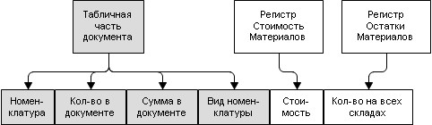

<strong>Рис. 14.10.</strong> Описание полей и таблиц запроса

Это значит, что наш запрос должен содержать два левых соединения таблицы документа с другими таблицами: одно – с
	таблицей РегистрНакопления.СтоимостьМатериалов.Остатки, другое – с таблицей
	РегистрНакопления.ОстаткиМатериалов.Остатки.

Казалось бы, все готово для того, чтобы составить запрос.

Но обратите внимание на важную деталь: в предложенной схеме виртуальные таблицы будут возвращать стоимость и остатки
	номенклатуры абсолютно для всей номенклатуры. А нас интересует только та номенклатура, которая указана в нашем
	документе. 

На маленькой базе эта особенность может почти не проявляться – количество различных элементов номенклатуры в
	справочнике сравнимо с количеством различных элементов номенклатуры в документе. 

Но представьте реальную базу. В справочнике Номенклатура – 15 000 наименований, например. А в документе – всего 5
	наименований. Получится, что сначала виртуальная таблица остатков будет усиленно трудиться и рассчитывать нам
	стоимость (или остатки) по всем 15 000 наименованиям номенклатуры, а в результате, когда мы левым соединением станем
	соединять ее с таблицей документа, мы из этих 15 000 строк стоимости (или остатков) возьмем всего лишь 5 строк – для
	той номенклатуры, которая указана в документе. Остальные 14 995 строк будут просто отброшены – система напрасно их
	рассчитывала.

Естественно, такая расточительность непозволительна в реальных условиях, и такой запрос является очень неоптимальным.
	Поэтому во все виртуальные таблицы, которые мы будем использовать, нужно добавить условие отбора только той
	номенклатуры, которая содержится в табличной части нашего документа. В этом случае стоимость и остатки будут
	рассчитаны не для всей номенклатуры вообще, а только для нужной нам номенклатуры.

В результате схема нашего запроса будет выглядеть следующим образом (рис. 14.11).

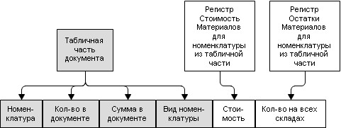

<strong>Рис. 14.11.</strong> Схема запроса

Обратите внимание, что в обеих виртуальных таблицах используется список номенклатуры из табличной части документа (по
	нему ограничиваются рассчитываемые данные). 

Кроме этого, из таблиц документа тоже берутся не все данные, а только данные, относящиеся к одному нашему конкретному
	документу. Чтобы не получать этот список три раза (для документа и в каждой виртуальной таблице заново), мы можем
	сформировать его заранее и затем уже использовать в нужных нам условиях запроса. 

Выполнить эту задачу нам помогут временные таблицы. 

<em>Временные таблицы</em> – это программные объекты, которые разработчик может создать и заполнить данными, а
	запросы могут использовать данные временных таблиц для своих нужд. Например, для наложения некоторого сложного
	условия, как в нашем случае.

Таким образом, схема нашего запроса приобретает следующий вид (рис. 14.12).

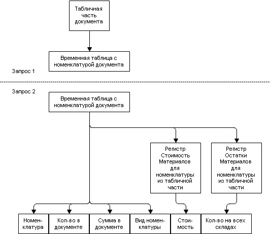

<strong>Рис. 14.12.</strong> Схема запроса

Итак, приступим.

<strong>В режиме «Конфигуратор»</strong>

Первое, что мы сделаем, – удалим реквизит табличной части Стоимость документа ОказаниеУслуги, который нам больше не
	понадобится.

Для этого откроем в конфигураторе окно редактирования объекта конфигурации Документ ОказаниеУслуги, перейдем на
	закладку Данные, раскроем список реквизитов табличной части документа, выделим реквизит Стоимость и нажмем кнопку
	Удалить в командной панели (рис. 14.13).

Также следует удалить соответствующее поле из таблицы Пере- ченьНоменклатуры, расположенной в форме. 

Для этого откроем форму ФормаДокумента документа ОказаниеУслуги и в окне структуры элементов формы выделим поле
	таблицы ПереченьНоменклатурыСтоимость и нажмем кнопку Удалить в командной панели (рис. 14.14).

<strong>Рис. 14.14.</strong> Удаление поля табличной части

Теперь займемся запросом. 

Временную таблицу мы сформируем с помощью того запроса, который у нас уже написан. 

Откроем модуль документа ОказаниеУслуги.

В процедуре ОбработкаПроведения() перед созданием запроса создадим менеджер временных таблиц и укажем, что этот
	запрос будет использовать созданный менеджер временных таблиц (листинг 14.17).

<strong>листинг 14.17.</strong> Использование менеджера временных таблиц

<table>
	<tr>
		<td>
Движения.ОстаткиМатериалов.Записывать = Истина;
</td>
	</tr>
	<tr>
		<td></td>
	</tr>
	<tr>
		<td>
Движения.СтоимостьМатериалов.Записывать = Истина;
</td>
	</tr>
	<tr>
		<td></td>
	</tr>
	<tr>
		<td>
Движения.Продажи.Записывать = Истина;
</td>
	</tr>
	<tr>
		<td></td>
	</tr>
	<tr>
		<td></td>
	</tr>
	<tr>
		<td></td>
	</tr>
	<tr>
		<td>
<strong>// Создать менеджер временных таблиц</strong>
</td>
	</tr>
	<tr>
		<td></td>
	</tr>
	<tr>
		<td>
<strong>МенеджерВТ = Новый МенеджерВременныхТаблиц;</strong>
</td>
	</tr>
	<tr>
		<td></td>
	</tr>
	<tr>
		<td></td>
	</tr>
	<tr>
		<td></td>
	</tr>
	<tr>
		<td>
Запрос = Новый Запрос;
</td>
	</tr>
	<tr>
		<td></td>
	</tr>
	<tr>
		<td></td>
	</tr>
	<tr>
		<td></td>
	</tr>
	<tr>
		<td>
<strong>// Укажем, какой менеджер временных таблиц использует этот запрос</strong>
</td>
	</tr>
	<tr>
		<td></td>
	</tr>
	<tr>
		<td>
<strong>Запрос.МенеджерВременныхТаблиц = МенеджерВТ;</strong>
</td>
	</tr>
	<tr>
		<td></td>
	</tr>
	<tr>
		<td></td>
	</tr>
	<tr>
		<td></td>
	</tr>
	<tr>
		<td>
Запрос.Текст = 
</td>
	</tr>
	<tr>
		<td></td>
	</tr>
	<tr>
		<td>
 &quot;ВЫБРАТЬ
</td>
	</tr>
	<tr>
		<td></td>
	</tr>
	<tr>
		<td>
 | ОказаниеУслугиПереченьНоменклатуры.Номенклатура,
</td>
	</tr>
</table>

Теперь изменим запрос таким образом, чтобы он создавал временную таблицу, которая будет храниться в нашем менеджере
	временных таблиц МенеджерВТ.

Чтобы конструктор запроса смог открыть наш запрос, удалим из него строку (поля Стоимость у нас больше нет), листинг
	14.18.

<strong>листинг 14.18.</strong> Изменение запроса

<table>
	<tr>
		<td>
| 
</td>
		<td>
МАКСИМУМ(ОказаниеУслугиПереченьНоменклатуры.Стоимость) КАК Стоимость
</td>
	</tr>
</table>

Также удалим запятую в конце предыдущей строки (листинг 14.19). <strong>листинг 14.19.</strong> Изменение запроса

<table>
	<tr>
		<td>
| 
</td>
		<td>
СУММА(ОказаниеУслугиПереченьНоменклатуры.Сумма) КАК СуммаВДокументе
</td>
	</tr>
</table>

Теперь установим курсор внутрь текста запроса, например на слове ВЫБРАТЬ, и выполним команду контекстного меню
	Конструктор запроса. Существующий текст запроса будет показан в форме конструктора запросов (рис. 14.15).

Чтобы результат запроса поместить во временную таблицу, перейдем на закладку Дополнительно и отметим пункт Создание
	временной таблицы. 

 Зададим имя временной таблицы – НоменклатураДокумента 

(рис. 14.16).

<strong>Рис. 14.16.</strong> Создание временной таблицы

Нажмем ОК и посмотрим, какой текст сформировал конструктор запроса (листинг 14.20). <strong>листинг 14.20.</strong>
	Текст запроса

<table>
	<tr>
		<td>
&quot;ВЫБРАТЬ
</td>
	</tr>
	<tr>
		<td></td>
	</tr>
	<tr>
		<td>
| ОказаниеУслугиПереченьНоменклатуры.Номенклатура,
</td>
	</tr>
	<tr>
		<td></td>
	</tr>
	<tr>
		<td>
| ОказаниеУслугиПереченьНоменклатуры.Номенклатура.ВидНоменклатуры 
</td>
	</tr>
	<tr>
		<td></td>
	</tr>
	<tr>
		<td>
| КАК ВидНоменклатуры,
</td>
	</tr>
	<tr>
		<td></td>
	</tr>
	<tr>
		<td>
| СУММА(ОказаниеУслугиПереченьНоменклатуры.Количество) КАК КоличествоВДокументе,
</td>
	</tr>
	<tr>
		<td></td>
	</tr>
	<tr>
		<td>
| СУММА(ОказаниеУслугиПереченьНоменклатуры.Сумма) КАК СуммаВДокументе
</td>
	</tr>
	<tr>
		<td></td>
	</tr>
	<tr>
		<td>
<strong>|ПОМЕСТИТЬ НоменклатураДокумента</strong>
</td>
	</tr>
	<tr>
		<td></td>
	</tr>
	<tr>
		<td>
|ИЗ
</td>
	</tr>
	<tr>
		<td></td>
	</tr>
	<tr>
		<td>
| Документ.ОказаниеУслуги.ПереченьНоменклатуры КАК ОказаниеУслугиПереченьНоменклатуры
</td>
	</tr>
	<tr>
		<td></td>
	</tr>
	<tr>
		<td>
|ГДЕ
</td>
	</tr>
	<tr>
		<td></td>
	</tr>
	<tr>
		<td>
| ОказаниеУслугиПереченьНоменклатуры.Ссылка = &amp;Ссылка
</td>
	</tr>
	<tr>
		<td></td>
	</tr>
	<tr>
		<td>
|СГРУППИРОВАТЬ ПО
</td>
	</tr>
	<tr>
		<td></td>
	</tr>
	<tr>
		<td>
| ОказаниеУслугиПереченьНоменклатуры.Номенклатура,
</td>
	</tr>
	<tr>
		<td></td>
	</tr>
	<tr>
		<td>
| ОказаниеУслугиПереченьНоменклатуры.Номенклатура.ВидНоменклатуры&quot;;
</td>
	</tr>
</table>

Новым здесь является только строка (листинг 14.21).

<strong>листинг 14.21.</strong> Создание временной таблицы

|ПОМЕСТИТЬ НоменклатураДокумента

Это означает, что результат запроса будет сохранен во временной таблице НоменклатураДокумента. 

Теперь если мы для другого запроса укажем этот же самый менеджер временных таблиц МенеджерВТ, то в этом другом
	запросе мы сможем обратиться к данным этой временной таблицы.

Таким образом, мы выполнили первую часть нашего плана – создали запрос, помещающий данные табличной части документа
	во временную таблицу (рис. 14.17).

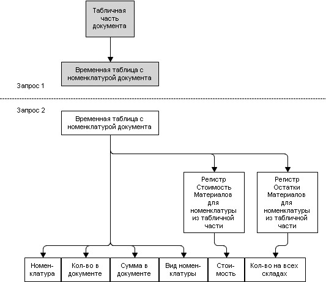

<strong>Рис. 14.17.</strong> Создание первого запроса

Теперь займемся конструированием второго запроса. 

Установим курсор на следующую строку после оператора РезультатЗапроса = Запрос.Выполнить(); (именно здесь выполняется
	создание временной таблицы) и напишем заготовку будущего запроса (листинг 14.22).

<strong>листинг 14.22.</strong> Создание второго запроса

Запрос2 = Новый Запрос;

<table>
	<tr>
		<td>
Запрос2.МенеджерВременныхТаблиц = МенеджерВТ;
</td>
	</tr>
	<tr>
		<td></td>
	</tr>
	<tr>
		<td>
Запрос2.Текст = &quot;&quot;;
</td>
	</tr>
</table>

Мы создали новый объект Запрос и назначили ему тот же самый менеджер временных таблиц, чтобы иметь возможность
	обращаться к созданной нами ранее временной таблице.

Теперь установим курсор внутрь кавычек и выполним команду контекстного меню Конструктор запроса. Согласимся на
	создание нового запроса.

Поскольку мы собираемся выбирать данные из нашей временной таблицы, создадим в запросе описание этой временной
	таблицы. Для этого над списком Таблицы нажмем кнопку Создать описание 

<strong>Рис. 14.18.</strong> Создание описания временной таблицы

В открывшемся окне введем имя нашей временной таблицы НоменклатураДокумента и добавим описание полей:

<ul>
	<li>Номенклатура, тип СправочникСсылка.Номенклатура;</li>
	<li>ВидНоменклатуры, тип ПеречислениеСсылка.ВидыНоменклатуры;</li>
	<li>КоличествоВДокументе, тип Число, 15, 3;  СуммаВДокументе, тип Число, 15, 2.</li>
</ul>

Нажмем ОК. 

В результате у нас получится следующее описание временной таблицы (рис. 14.19).

Нажмем ОК. Выберем из этой таблицы все поля (рис. 14.20) и нажмем кнопку Запрос в левом нижнем углу окна конструктора
	запроса.

Текст запроса будет иметь вид (листинг 14.23).

<strong>листинг 14.23.</strong> Текст второго запроса

<table>
	<tr>
		<td>
ВЫБРАТЬ
</td>
	</tr>
	<tr>
		<td></td>
	</tr>
	<tr>
		<td>
НоменклатураДокумента.Номенклатура,
</td>
	</tr>
	<tr>
		<td></td>
	</tr>
	<tr>
		<td>
НоменклатураДокумента.ВидНоменклатуры,
</td>
	</tr>
	<tr>
		<td></td>
	</tr>
	<tr>
		<td>
НоменклатураДокумента.КоличествоВДокументе,
</td>
	</tr>
	<tr>
		<td></td>
	</tr>
	<tr>
		<td>
НоменклатураДокумента.СуммаВДокументе
</td>
	</tr>
	<tr>
		<td></td>
	</tr>
	<tr>
		<td>
ИЗ
</td>
	</tr>
	<tr>
		<td></td>
	</tr>
	<tr>
		<td>
НоменклатураДокумента КАК НоменклатураДокумента
</td>
	</tr>
</table>

Итак, мы создали первую часть второго запроса – выбрали информацию из временной таблицы (рис. 14.21).

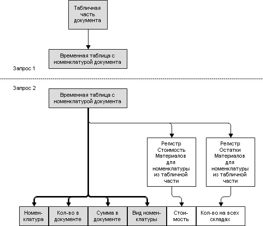

<strong>Рис. 14.21.</strong> Создание второго запроса

Теперь будем соединять эту конструкцию левыми соединениями с таблицами остатков.

Начнем со стоимости материалов. 

Добавим в список таблиц запроса виртуальную таблицу РегистрНакопления.СтоимостьМатериалов.Остатки. Из нее выберем
	поле СтоимостьОстаток. Перейдем на закладку Связи и зададим связь между таблицами. 

Из временной таблицы будем выбирать все записи, и поле Номенклатура временной таблицы должно быть равно полю Материал
	таблицы остатков (рис. 14.22).

<strong>Рис. 14.22.</strong> Связи между таблицами

Нужно не забыть ограничить виртуальную таблицу только той номенклатурой, которая есть в нашей временной таблице.

Поэтому вернемся на закладку Таблицы и поля, выделим в списке таблиц таблицу СтоимостьМатериаловОстатки и нажмем
	кнопку Параметры виртуальной таблицы, расположенную над списком таблиц. 

Зададим параметр Условие следующим образом (листинг 14.24).

<strong>листинг 14.24.</strong> Условие виртуальной таблицы

Материал В (ВЫБРАТЬ НоменклатураДокумента.Номенклатура ИЗ НоменклатураДокумента)

То есть материал должен быть среди номенклатуры, выбранной из временной таблицы.

<strong>УзнАй больше!</strong>

<em>Следует внимательно подходить к использованию виртуальных таблиц запросов. В частности, необходимо уделять особое
	внимание максимально возможному использованию параметров этих таблиц. </em>

<em>Например, в нашем случае можно было бы и не использовать параметр </em>Условие<em>, а ограничить выбранные поля
	уже в самом запросе, указав в условии </em>ПО<em> равенство номенклатуры из документа и материала из таблицы
	остатков. Формально мы получили бы тот же самый результат, однако по производительности этот способ сильно отличался
	бы от того, который мы используем. </em>

<em>В самом деле в нашем варианте виртуальная таблица предоставит нам ровно столько записей, сколько различных
	элементов номенклатуры содержится в проводимом документе. Если же не указывать условие, виртуальная таблица
	предоставит нам записи по абсолютно всем элементам номенклатуры, информация о которых есть в регистре накопления. И
	уже в самом нашем запросе мы будем отбирать из этой огромной массы записей лишь несколько, которые нам действительно
	нужны.</em>

<em>Очевидно, что второй вариант будет работать дольше, и время выполнения такого запроса будет зависеть в основном
	не от количества данных, содержащихся в документе (т. е. реального количества обрабатываемой информации), а от
	размера регистра накопления.</em>

<em>Кроме того что подобный вариант снижает производительность конфигурации, могут возникать ситуации, когда
	результаты, полученные одним и другим способом, будут различны. Такое, например, вполне возможно при использовании
	виртуальной таблицы регистра сведений </em>СрезПоследних<em>. Подробнее можно прочитать об этом на диске ИТС
	(информационно-технологического сопровождения) в статье «Использование отборов в запросах с виртуальными
	таблицами».</em>

Нажмем кнопку Запрос и посмотрим, какой текст запроса сформировал конструктор (листинг 14.25).

<strong>листинг 14.25.</strong> Текст запроса

<table>
	<tr>
		<td>
ВЫБРАТЬ
</td>
	</tr>
	<tr>
		<td></td>
	</tr>
	<tr>
		<td>
НоменклатураДокумента.Номенклатура,
</td>
	</tr>
	<tr>
		<td></td>
	</tr>
	<tr>
		<td>
НоменклатураДокумента.ВидНоменклатуры,
</td>
	</tr>
	<tr>
		<td></td>
	</tr>
	<tr>
		<td>
НоменклатураДокумента.КоличествоВДокументе,
</td>
	</tr>
	<tr>
		<td></td>
	</tr>
	<tr>
		<td>
НоменклатураДокумента.СуммаВДокументе,
</td>
	</tr>
	<tr>
		<td></td>
	</tr>
	<tr>
		<td>
СтоимостьМатериаловОстатки.СтоимостьОстаток
</td>
	</tr>
	<tr>
		<td></td>
	</tr>
	<tr>
		<td>
ИЗ
</td>
	</tr>
	<tr>
		<td></td>
	</tr>
	<tr>
		<td>
НоменклатураДокумента КАК НоменклатураДокумента
</td>
	</tr>
	<tr>
		<td></td>
	</tr>
	<tr>
		<td>
<strong>ЛЕВОЕ СОЕДИНЕНИЕ РегистрНакопления.СтоимостьМатериалов.Остатки( , Материал В</strong>
</td>
	</tr>
	<tr>
		<td></td>
	</tr>
	<tr>
		<td>
<strong>(ВЫБРАТЬ</strong>
</td>
	</tr>
	<tr>
		<td></td>
	</tr>
	<tr>
		<td>
<strong>НоменклатураДокумента.Номенклатура</strong>
</td>
	</tr>
	<tr>
		<td></td>
	</tr>
	<tr>
		<td>
<strong>ИЗ</strong>
</td>
	</tr>
	<tr>
		<td></td>
	</tr>
	<tr>
		<td>
<strong>НоменклатураДокумента)) КАК СтоимостьМатериаловОстатки</strong>
</td>
	</tr>
	<tr>
		<td></td>
	</tr>
	<tr>
		<td>
<strong>ПО НоменклатураДокумента.Номенклатура = СтоимостьМатериаловОстатки.Материал</strong>
</td>
	</tr>
</table>

Тем самым мы добавили к выбранным ранее полям стоимость номенклатуры (рис. 14.23).

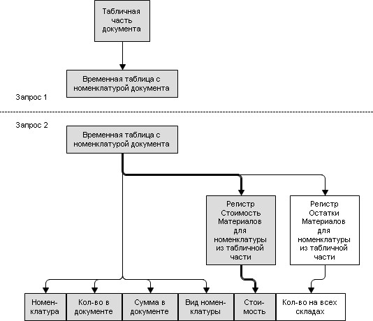

<strong>Рис. 14.23.</strong> Создание второго запроса

Теперь добавим виртуальную таблицу остатков регистра ОстаткиМатериалов.Остатки, из которой выберем поле
	КоличествоОстаток.

Перейдем на закладку Связи и зададим связь между таблицами. 

Из временной таблицы будем выбирать все записи, и поле Номенклатура временной таблицы должно быть равно полю Материал
	таблицы остатков (рис. 14.24).

Также зададим параметры виртуальной таблицы ОстаткиМатериа- ловОстатки. 

В параметр Условие внесем следующий текст (листинг 14.26).

<strong>листинг 14.26.</strong> Условие виртуальной таблицы

Материал В (ВЫБРАТЬ НоменклатураДокумента.Номенклатура ИЗ НоменклатураДокумента)

В результате мы получим следующий текст запроса (листинг 14.27). <strong>листинг 14.27.</strong> Текст запроса

<table>
	<tr>
		<td>
ВЫБРАТЬ
</td>
	</tr>
	<tr>
		<td></td>
	</tr>
	<tr>
		<td>
НоменклатураДокумента.Номенклатура,
</td>
	</tr>
	<tr>
		<td></td>
	</tr>
	<tr>
		<td>
НоменклатураДокумента.ВидНоменклатуры,
</td>
	</tr>
	<tr>
		<td></td>
	</tr>
	<tr>
		<td>
НоменклатураДокумента.КоличествоВДокументе,
</td>
	</tr>
	<tr>
		<td></td>
	</tr>
	<tr>
		<td>
НоменклатураДокумента.СуммаВДокументе,
</td>
	</tr>
	<tr>
		<td></td>
	</tr>
	<tr>
		<td>
СтоимостьМатериаловОстатки.СтоимостьОстаток,
</td>
	</tr>
	<tr>
		<td></td>
	</tr>
	<tr>
		<td>
ОстаткиМатериаловОстатки.КоличествоОстаток
</td>
	</tr>
	<tr>
		<td></td>
	</tr>
	<tr>
		<td>
ИЗ
</td>
	</tr>
	<tr>
		<td></td>
	</tr>
	<tr>
		<td>
НоменклатураДокумента КАК НоменклатураДокумента
</td>
	</tr>
	<tr>
		<td></td>
	</tr>
	<tr>
		<td>
ЛЕВОЕ СОЕДИНЕНИЕ РегистрНакопления.СтоимостьМатериалов.Остатки( , Материал В (
</td>
	</tr>
	<tr>
		<td></td>
	</tr>
	<tr>
		<td>
ВЫБРАТЬ
</td>
	</tr>
	<tr>
		<td></td>
	</tr>
	<tr>
		<td>
НоменклатураДокумента.Номенклатура
</td>
	</tr>
	<tr>
		<td></td>
	</tr>
	<tr>
		<td>
ИЗ
</td>
	</tr>
	<tr>
		<td></td>
	</tr>
	<tr>
		<td>
НоменклатураДокумента)) КАК СтоимостьМатериаловОстатки
</td>
	</tr>
	<tr>
		<td></td>
	</tr>
	<tr>
		<td>
ПО НоменклатураДокумента.Номенклатура = СтоимостьМатериаловОстатки.Материал
</td>
	</tr>
	<tr>
		<td></td>
	</tr>
	<tr>
		<td>
<strong>ЛЕВОЕ СОЕДИНЕНИЕ РегистрНакопления.ОстаткиМатериалов.Остатки( , Материал В (</strong>
</td>
	</tr>
	<tr>
		<td></td>
	</tr>
	<tr>
		<td>
<strong>ВЫБРАТЬ</strong>
</td>
	</tr>
	<tr>
		<td></td>
	</tr>
	<tr>
		<td>
<strong>НоменклатураДокумента.Номенклатура</strong>
</td>
	</tr>
	<tr>
		<td></td>
	</tr>
	<tr>
		<td>
<strong>ИЗ</strong>
</td>
	</tr>
	<tr>
		<td></td>
	</tr>
	<tr>
		<td>
<strong>НоменклатураДокумента)) КАК ОстаткиМатериаловОстатки</strong>
</td>
	</tr>
	<tr>
		<td></td>
	</tr>
	<tr>
		<td>
<strong>ПО НоменклатураДокумента.Номенклатура = ОстаткиМатериаловОстатки.Материал</strong>
</td>
	</tr>
</table>

Тем самым мы добавили к выбранным ранее полям остатки номенклатуры на всех складах (рис. 14.25).

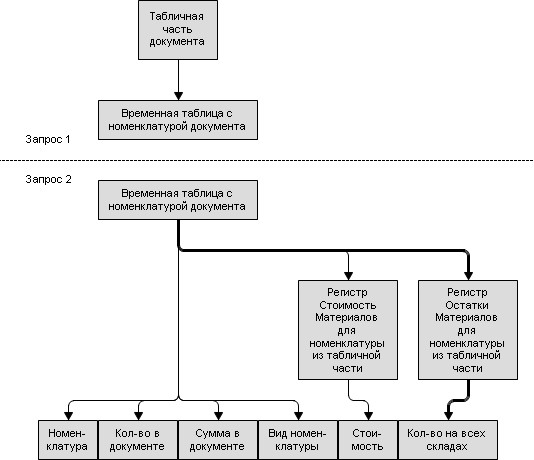

<strong>Рис. 14.25.</strong> Создание второго запроса

В заключение перейдем на закладку Объединения/Псевдонимы и зададим следующие псевдонимы полей (рис. 14.26):

 СтоимостьОстаток – Стоимость;

<strong>Рис. 14.26.</strong> Псевдонимы полей

В результате мы получим следующий текст запроса (листинг 14.28).

<strong>листинг 14.28.</strong> Текст запроса

ВЫБРАТЬ

<table>
	<tr>
		<td>
НоменклатураДокумента.Номенклатура,
</td>
	</tr>
	<tr>
		<td></td>
	</tr>
	<tr>
		<td>
НоменклатураДокумента.ВидНоменклатуры,
</td>
	</tr>
	<tr>
		<td></td>
	</tr>
	<tr>
		<td>
НоменклатураДокумента.КоличествоВДокументе,
</td>
	</tr>
	<tr>
		<td></td>
	</tr>
	<tr>
		<td>
НоменклатураДокумента.СуммаВДокументе,
</td>
	</tr>
	<tr>
		<td></td>
	</tr>
	<tr>
		<td>
СтоимостьМатериаловОстатки.СтоимостьОстаток <strong>КАК Стоимость,</strong>
</td>
	</tr>
	<tr>
		<td></td>
	</tr>
	<tr>
		<td>
ОстаткиМатериаловОстатки.КоличествоОстаток <strong>КАК Количество</strong>
</td>
	</tr>
	<tr>
		<td></td>
	</tr>
	<tr>
		<td>
ИЗ
</td>
	</tr>
	<tr>
		<td></td>
	</tr>
	<tr>
		<td>
НоменклатураДокумента КАК НоменклатураДокумента
</td>
	</tr>
	<tr>
		<td></td>
	</tr>
	<tr>
		<td>
ЛЕВОЕ СОЕДИНЕНИЕ РегистрНакопления.СтоимостьМатериалов.Остатки( , Материал В (
</td>
	</tr>
	<tr>
		<td></td>
	</tr>
	<tr>
		<td>
ВЫБРАТЬ
</td>
	</tr>
	<tr>
		<td></td>
	</tr>
	<tr>
		<td>
НоменклатураДокумента.Номенклатура
</td>
	</tr>
	<tr>
		<td></td>
	</tr>
	<tr>
		<td>
ИЗ
</td>
	</tr>
	<tr>
		<td></td>
	</tr>
	<tr>
		<td>
НоменклатураДокумента)) КАК СтоимостьМатериаловОстатки
</td>
	</tr>
	<tr>
		<td></td>
	</tr>
	<tr>
		<td>
ПО НоменклатураДокумента.Номенклатура = СтоимостьМатериаловОстатки.Материал
</td>
	</tr>
	<tr>
		<td></td>
	</tr>
	<tr>
		<td>
ЛЕВОЕ СОЕДИНЕНИЕ РегистрНакопления.ОстаткиМатериалов.Остатки( , Материал В (
</td>
	</tr>
	<tr>
		<td></td>
	</tr>
	<tr>
		<td>
ВЫБРАТЬ
</td>
	</tr>
	<tr>
		<td></td>
	</tr>
	<tr>
		<td>
НоменклатураДокумента.Номенклатура
</td>
	</tr>
	<tr>
		<td></td>
	</tr>
	<tr>
		<td>
ИЗ
</td>
	</tr>
	<tr>
		<td></td>
	</tr>
	<tr>
		<td>
НоменклатураДокумента)) КАК ОстаткиМатериаловОстатки
</td>
	</tr>
	<tr>
		<td></td>
	</tr>
	<tr>
		<td>
ПО НоменклатураДокумента.Номенклатура = ОстаткиМатериаловОстатки.Материал
</td>
	</tr>
</table>

В качестве последнего штриха нашей работы с запросом нужно предусмотреть тот случай, когда номенклатура в справочнике
	есть, но у нее нет ни остатков, ни стоимости. Это может быть, например, в том случае, когда номенклатуру создали в
	справочнике, но она еще не поступала в нашу фирму. 

В такой ситуации левые соединения с виртуальными таблицами не вернут ничего. На языке запросов это значит, что в
	полях Стоимость и Количество будут значения NULL. 

Чтобы в дальнейшем нам было удобно работать с результатом нашего запроса, сразу же в самом запросе избавимся от этих
	значений. 

Для этого мы применим функцию ЕСТЬNULL() к полям Стоимость и Количество. Если значение этого поля будет NULL, функция
	вернет 0. В остальных случаях функция вернет само значение этого поля.

Перейдем на закладку Таблицы и поля, выделим поле СтоимостьМатериаловОстатки.СтоимостьОстаток и нажмем кнопку
	Изменить текущий элемент (рис. 14.27).

В открывшемся окне отредактируем значение поля следующим образом (листинг 14.29), рис. 14.28.

<strong>Рис. 14.27.</strong> Изменение значения поля в запросе

<strong>листинг 14.29.</strong> Выражение для расчета поля в запросе

ЕСТЬNULL(СтоимостьМатериаловОстатки.СтоимостьОстаток, 0)

<strong>Рис. 14.28.</strong> Изменение значения поля в запросе

Аналогично поступим и с другим полем: ОстаткиМатериаловОстат- ки.КоличествоОстаток.

Нажмем ОК – текст запроса будет вставлен в модуль (листинг 14.30). <strong>листинг 14.30.</strong> Текст запроса

<table>
	<tr>
		<td>
Запрос2.Текст = &quot;ВЫБРАТЬ
</td>
	</tr>
	<tr>
		<td></td>
	</tr>
	<tr>
		<td>
 | НоменклатураДокумента.Номенклатура,
</td>
	</tr>
	<tr>
		<td></td>
	</tr>
	<tr>
		<td>
 | НоменклатураДокумента.ВидНоменклатуры,
</td>
	</tr>
	<tr>
		<td></td>
	</tr>
	<tr>
		<td>
 | НоменклатураДокумента.КоличествоВДокументе,
</td>
	</tr>
	<tr>
		<td></td>
	</tr>
	<tr>
		<td>
 | НоменклатураДокумента.СуммаВДокументе,
</td>
	</tr>
	<tr>
		<td></td>
	</tr>
	<tr>
		<td>
 | <strong>ЕСТЬNULL(СтоимостьМатериаловОстатки.СтоимостьОстаток, 0)</strong> КАК Стоимость,
</td>
	</tr>
	<tr>
		<td></td>
	</tr>
	<tr>
		<td>
 | <strong>ЕСТЬNULL(ОстаткиМатериаловОстатки.КоличествоОстаток, 0)</strong> КАК Количество
</td>
	</tr>
	<tr>
		<td></td>
	</tr>
	<tr>
		<td>
|ИЗ
</td>
	</tr>
	<tr>
		<td></td>
	</tr>
	<tr>
		<td>
 | НоменклатураДокумента КАК НоменклатураДокумента
</td>
	</tr>
	<tr>
		<td></td>
	</tr>
	<tr>
		<td>
 | ЛЕВОЕ СОЕДИНЕНИЕ РегистрНакопления.СтоимостьМатериалов.Остатки( , Материал В (
</td>
	</tr>
</table>

 | ВЫБРАТЬ

 | НоменклатураДокумента.Номенклатура

<table>
	<tr>
		<td>
| 
</td>
		<td>
ИЗ
</td>
	</tr>
	<tr>
		<td></td>
		<td></td>
	</tr>
	<tr>
		<td>
| 
</td>
		<td>
НоменклатураДокумента)) КАК СтоимостьМатериаловОстатки
</td>
	</tr>
	<tr>
		<td></td>
		<td></td>
	</tr>
	<tr>
		<td>
| 
</td>
		<td>
ПО НоменклатураДокумента.Номенклатура = СтоимостьМатериаловОстатки.Материал
</td>
	</tr>
	<tr>
		<td></td>
		<td></td>
	</tr>
	<tr>
		<td>
| 
</td>
		<td>
ЛЕВОЕ СОЕДИНЕНИЕ РегистрНакопления.ОстаткиМатериалов.Остатки( , Материал В (
</td>
	</tr>
	<tr>
		<td></td>
		<td></td>
	</tr>
	<tr>
		<td>
| 
</td>
		<td>
ВЫБРАТЬ
</td>
	</tr>
	<tr>
		<td></td>
		<td></td>
	</tr>
	<tr>
		<td>
| 
</td>
		<td>
НоменклатураДокумента.Номенклатура
</td>
	</tr>
	<tr>
		<td></td>
		<td></td>
	</tr>
	<tr>
		<td>
| 
</td>
		<td>
ИЗ
</td>
	</tr>
	<tr>
		<td></td>
		<td></td>
	</tr>
	<tr>
		<td>
| 
</td>
		<td>
НоменклатураДокумента)) КАК ОстаткиМатериаловОстатки
</td>
	</tr>
	<tr>
		<td></td>
		<td></td>
	</tr>
	<tr>
		<td>
| 
</td>
		<td>
ПО НоменклатураДокумента.Номенклатура = ОстаткиМатериаловОстатки.Материал&quot;;
</td>
	</tr>
</table>

Нам останется всего лишь дописать после него оператор выполнения запроса (листинг 14.31).

<strong>листинг 14.31.</strong> Фрагмент процедуры «ОбработкаПроведения()»

<table>
	<tr>
		<td>
…
</td>
	</tr>
	<tr>
		<td></td>
	</tr>
	<tr>
		<td>
Запрос2 = Новый Запрос;
</td>
	</tr>
	<tr>
		<td></td>
	</tr>
	<tr>
		<td>
Запрос2.МенеджерВременныхТаблиц = МенеджерВТ;
</td>
	</tr>
	<tr>
		<td></td>
	</tr>
	<tr>
		<td>
Запрос2.Текст = &quot;ВЫБРАТЬ
</td>
	</tr>
	<tr>
		<td></td>
	</tr>
	<tr>
		<td>
 | НоменклатураДокумента.Номенклатура,
</td>
	</tr>
	<tr>
		<td></td>
	</tr>
	<tr>
		<td>
…
</td>
	</tr>
	<tr>
		<td></td>
	</tr>
	<tr>
		<td>
 | ПО НоменклатураДокумента.Номенклатура = СтоимостьМатериаловОстатки.Материал&quot;;
</td>
	</tr>
	<tr>
		<td></td>
	</tr>
	<tr>
		<td></td>
	</tr>
	<tr>
		<td></td>
	</tr>
	<tr>
		<td>
<strong>РезультатЗапроса = Запрос2.Выполнить(); </strong>
</td>
	</tr>
	<tr>
		<td></td>
	</tr>
	<tr>
		<td></td>
	</tr>
	<tr>
		<td></td>
	</tr>
	<tr>
		<td>
ВыборкаДетальныеЗаписи = РезультатЗапроса.Выбрать();
</td>
	</tr>
	<tr>
		<td></td>
	</tr>
	<tr>
		<td>
…
</td>
	</tr>
</table>

Теперь разберемся с записью движений. 

Все операторы, которые были написаны нами ранее, будут работать без изменений. 

Единственное, что потребуется изменить, – это способ получения стоимости. Раньше мы просто брали ее из документа,
	теперь же нам нужно ее рассчитать на основании тех данных, которые мы получили запросом.

Стоимость материала равна частному от деления всей стоимости, полученной запросом (Стоимость), на общее количество
	материала на всех складах (Количество).

Но, как мы уже сказали, возможна ситуация, когда поле Количество у нас будет равно 0, а на 0 делить нельзя. Поэтому
	сразу после начала цикла обхода результата запроса рассчитаем стоимость для текущей номенклатуры (листинг
	14.32).

<strong>листинг 14.32.</strong> Фрагмент процедуры «ОбработкаПроведения()»

<table>
	<tr>
		<td>
Пока ВыборкаДетальныеЗаписи.Следующий() Цикл
</td>
	</tr>
	<tr>
		<td></td>
	</tr>
	<tr>
		<td>
<strong>Если ВыборкаДетальныеЗаписи.Количество = 0 Тогда</strong>
</td>
	</tr>
	<tr>
		<td></td>
	</tr>
	<tr>
		<td>
<strong>СтоимостьМатериала = 0;</strong>
</td>
	</tr>
	<tr>
		<td></td>
	</tr>
	<tr>
		<td>
<strong>Иначе</strong>
</td>
	</tr>
	<tr>
		<td></td>
	</tr>
	<tr>
		<td>
<strong>СтоимостьМатериала = </strong>
</td>
	</tr>
	<tr>
		<td></td>
	</tr>
	<tr>
		<td>
<strong>ВыборкаДетальныеЗаписи.Стоимость / ВыборкаДетальныеЗаписи.Количество;</strong>
</td>
	</tr>
	<tr>
		<td></td>
	</tr>
	<tr>
		<td>
<strong>КонецЕсли;</strong>
</td>
	</tr>
	<tr>
		<td></td>
	</tr>
	<tr>
		<td></td>
	</tr>
	<tr>
		<td></td>
	</tr>
	<tr>
		<td>
Если ВыборкаДетальныеЗаписи.ВидНоменклатуры = 
</td>
	</tr>
	<tr>
		<td></td>
	</tr>
	<tr>
		<td>
Перечисления.ВидыНоменклатуры.Материал Тогда 
</td>
	</tr>
	<tr>
		<td></td>
	</tr>
	<tr>
		<td>
…
</td>
	</tr>
</table>

Теперь заменим расчет стоимости в движениях регистров Стои- мостьМатериалов и Продажи (листинг 14.33). <strong>листинг
	14.33.</strong> Фрагмент процедуры «ОбработкаПроведения()»

<table>
	<tr>
		<td>
Пока ВыборкаДетальныеЗаписи.Следующий() Цикл
</td>
	</tr>
	<tr>
		<td></td>
	</tr>
	<tr>
		<td>
Если ВыборкаДетальныеЗаписи.Количество = 0 Тогда
</td>
	</tr>
	<tr>
		<td></td>
	</tr>
	<tr>
		<td>
СтоимостьМатериала = 0;
</td>
	</tr>
	<tr>
		<td></td>
	</tr>
	<tr>
		<td>
Иначе
</td>
	</tr>
	<tr>
		<td></td>
	</tr>
	<tr>
		<td>
СтоимостьМатериала = 
</td>
	</tr>
	<tr>
		<td></td>
	</tr>
	<tr>
		<td>
ВыборкаДетальныеЗаписи.Стоимость / ВыборкаДетальныеЗаписи.Количество;
</td>
	</tr>
	<tr>
		<td></td>
	</tr>
	<tr>
		<td>
КонецЕсли;
</td>
	</tr>
	<tr>
		<td></td>
	</tr>
	<tr>
		<td></td>
	</tr>
	<tr>
		<td></td>
	</tr>
	<tr>
		<td>
Если ВыборкаДетальныеЗаписи.ВидНоменклатуры = 
</td>
	</tr>
	<tr>
		<td></td>
	</tr>
	<tr>
		<td>
Перечисления.ВидыНоменклатуры.Материал Тогда 
</td>
	</tr>
	<tr>
		<td></td>
	</tr>
	<tr>
		<td></td>
	</tr>
	<tr>
		<td></td>
	</tr>
	<tr>
		<td>
// Регистр ОстаткиМатериалов Расход
</td>
	</tr>
	<tr>
		<td></td>
	</tr>
	<tr>
		<td>
Движение = Движения.ОстаткиМатериалов.Добавить();
</td>
	</tr>
	<tr>
		<td></td>
	</tr>
	<tr>
		<td>
Движение.ВидДвижения = ВидДвиженияНакопления.Расход;
</td>
	</tr>
	<tr>
		<td></td>
	</tr>
	<tr>
		<td>
Движение.Период = Дата;
</td>
	</tr>
	<tr>
		<td></td>
	</tr>
	<tr>
		<td>
Движение.Материал = ВыборкаДетальныеЗаписи.Номенклатура;
</td>
	</tr>
	<tr>
		<td></td>
	</tr>
	<tr>
		<td>
Движение.Склад = Склад;
</td>
	</tr>
	<tr>
		<td></td>
	</tr>
	<tr>
		<td>
Движение.Количество = ВыборкаДетальныеЗаписи.Количество;
</td>
	</tr>
	<tr>
		<td></td>
	</tr>
	<tr>
		<td></td>
	</tr>
	<tr>
		<td></td>
	</tr>
	<tr>
		<td>
// Регистр СтоимостьМатериалов Расход
</td>
	</tr>
	<tr>
		<td></td>
	</tr>
	<tr>
		<td>
Движение = Движения.СтоимостьМатериалов.Добавить();
</td>
	</tr>
	<tr>
		<td></td>
	</tr>
	<tr>
		<td>
Движение.ВидДвижения = ВидДвиженияНакопления.Расход;
</td>
	</tr>
	<tr>
		<td></td>
	</tr>
	<tr>
		<td>
Движение.Период = Дата;
</td>
	</tr>
	<tr>
		<td></td>
	</tr>
	<tr>
		<td>
Движение.Материал = ВыборкаДетальныеЗаписи.Номенклатура;
</td>
	</tr>
	<tr>
		<td></td>
	</tr>
	<tr>
		<td>
Движение.Стоимость = ВыборкаДетальныеЗаписи.КоличествоВДокументе * 
</td>
	</tr>
	<tr>
		<td></td>
	</tr>
	<tr>
		<td>
<strong>СтоимостьМатериала</strong>;
</td>
	</tr>
	<tr>
		<td></td>
	</tr>
	<tr>
		<td>
КонецЕсли;
</td>
	</tr>
	<tr>
		<td></td>
	</tr>
	<tr>
		<td></td>
	</tr>
	<tr>
		<td></td>
	</tr>
	<tr>
		<td>
// Регистр Продажи 
</td>
	</tr>
	<tr>
		<td></td>
	</tr>
	<tr>
		<td>
Движение = Движения.Продажи.Добавить();
</td>
	</tr>
	<tr>
		<td></td>
	</tr>
	<tr>
		<td>
Движение.Период = Дата;
</td>
	</tr>
	<tr>
		<td></td>
	</tr>
	<tr>
		<td>
Движение.Номенклатура = ВыборкаДетальныеЗаписи.Номенклатура;
</td>
	</tr>
	<tr>
		<td></td>
	</tr>
	<tr>
		<td>
Движение.Клиент = Клиент;
</td>
	</tr>
</table>

Движение.Мастер = Мастер;

Движение.Количество = ВыборкаДетальныеЗаписи.КоличествоВДокументе; Движение.Выручка =
	ВыборкаДетальныеЗаписи.СуммаВДокументе;

<table>
	<tr>
		<td>
Движение.Стоимость = <strong>СтоимостьМатериала</strong> * 
</td>
	</tr>
	<tr>
		<td></td>
	</tr>
	<tr>
		<td>
ВыборкаДетальныеЗаписи.КоличествоВДокументе;
</td>
	</tr>
	<tr>
		<td></td>
	</tr>
	<tr>
		<td>
КонецЦикла;
</td>
	</tr>
</table>

Теперь все вроде бы хорошо, но остался один важный момент.

Если проводить этот документ в первый раз, то результат получится правильный. 

Однако если документ был проведен ранее и мы заново решим провести его, мы получим неправильный результат.

Дело в том, что когда мы находимся в обработчике проведения документа и этот документ был уже проведен ранее, то в
	базе данных существуют движения этого документа.

Таким образом, читая из базы данных стоимость и остатки материалов, мы прочитаем их с учетом тех движений, которые
	документ выполнил ранее. А это неправильно.

Чтобы в обработчике проведения документа прочитать данные базы данных без учета предыдущих движений, которые мог
	выполнять документ, нужно перед чтением записать пустые наборы записей в те регистры, из которых мы собираемся
	читать.

В нашем случае такими регистрами являются регистры накопления СтоимостьМатериалов и ОстаткиМатериалов.

Поэтому перед выполнением второго запроса добавим следующие две строки: <strong>листинг 14.33а.</strong> Фрагмент
	процедуры «ОбработкаПроведения()»

<table>
	<tr>
		<td>
…
</td>
	</tr>
	<tr>
		<td></td>
	</tr>
	<tr>
		<td>
| ПО НоменклатураДокумента.Номенклатура = СтоимостьМатериаловОстатки.Материал&quot;;
</td>
	</tr>
	<tr>
		<td></td>
	</tr>
	<tr>
		<td></td>
	</tr>
	<tr>
		<td></td>
	</tr>
	<tr>
		<td>
<strong>// Запишем пустые наборы записей, чтобы читать остатки без учета данных в документе</strong>

		</td>
	</tr>
	<tr>
		<td></td>
	</tr>
	<tr>
		<td>
<strong>Движения.СтоимостьМатериалов.Записать();</strong>
</td>
	</tr>
	<tr>
		<td></td>
	</tr>
	<tr>
		<td>
<strong>Движения.ОстаткиМатериалов.Записать();</strong>
</td>
	</tr>
	<tr>
		<td></td>
	</tr>
	<tr>
		<td></td>
	</tr>
	<tr>
		<td></td>
	</tr>
	<tr>
		<td>
РезультатЗапроса = Запрос2.Выполнить();
</td>
	</tr>
</table>

<strong>В режиме «1С:Предприятие»</strong>

Теперь нужно запустить «1С:Предприятие» в режиме отладки, перепровести все документы Оказание услуги и проверить, что
	данные правильно заносятся в регистры.

<h1>Лабораторная работа № 22 Защита отчетов</h1>

<strong>Порядок выполнения работы </strong>

1. Ознакомьтесь с теоретическими основами в настоящих указаниях и конспектах лекций. 

2. Получите задание у преподавателя. 

3. Сделайте скриншоты (кнопка клавиатуры PrtSc) выполненных заданий в текстовом (Word) файле <em>Фамилия_ЛР</em>

4. Составьте отчет по лабораторной работе. 

5. Отчитайте работу преподавателю.

<strong>Контроль остатков</strong>

Общая методика контроля остатков при проведении документа заключается в следующем: сначала, не глядя ни на что, нужно
	записать движения документа, а затем, когда движения уже записаны, прочитать из базы данных остатки. 

Если появились отрицательные остатки, значит, такой документ проводить нельзя. Нужно сообщить пользователю, каких
	материалов не хватает, и отменить проведение документа. 

Если же отрицательных остатков не появилось, тогда можно смело проводить документ.

Полдела у нас уже сделано: мы формируем движения документа и записываем их. Единственное, что нам осталось, – в
	случае оперативного проведения проконтролировать, что получилось, и, если появились отрицательные остатки, отменить
	проведение документа.

<strong>В режиме «Конфигуратор»</strong>

Сделаем заготовку. После цикла обхода результата запроса и перед концом процедуры напишем следующие строки (листинг
	14.35).

<strong>листинг 14.35.</strong> Фрагмент процедуры «ОбработкаПроведения()»

<table>
	<tr>
		<td>
…
</td>
	</tr>
	<tr>
		<td></td>
	</tr>
	<tr>
		<td>
КонецЦикла;
</td>
	</tr>
	<tr>
		<td></td>
	</tr>
	<tr>
		<td></td>
	</tr>
	<tr>
		<td></td>
	</tr>
	<tr>
		<td>
<strong>Движения.Записать();</strong>
</td>
	</tr>
	<tr>
		<td></td>
	</tr>
	<tr>
		<td></td>
	</tr>
	<tr>
		<td></td>
	</tr>
	<tr>
		<td>
<strong>Если Режим = РежимПроведенияДокумента.Оперативный Тогда</strong>
</td>
	</tr>
	<tr>
		<td></td>
	</tr>
	<tr>
		<td>
<strong>// Проверить отрицательные остатки</strong>
</td>
	</tr>
	<tr>
		<td></td>
	</tr>
	<tr>
		<td>
<strong>КонецЕсли;</strong>
</td>
	</tr>
	<tr>
		<td></td>
	</tr>
	<tr>
		<td></td>
	</tr>
	<tr>
		<td></td>
	</tr>
	<tr>
		<td>
КонецПроцедуры
</td>
	</tr>
</table>

Сначала мы записываем движения в регистры. 

Затем определяем режим проведения документа. При выполнении процедуры ОбработкаПроведения() вторым параметром (Режим)
	в нее передается режим проведения документа, и значение этой переменной сравнивается со значением системного
	перечисления РежимПроведенияДокумента. В случае оперативного проведения мы будем выполнять контроль остатков.

Теперь сделаем заготовку запроса для проверки отрицательных остатков. 

Так как нам придется снова получать остатки только для той номенклатуры, которая в документе, укажем, что этот запрос
	будет использовать тот же самый менеджер временных таблиц МенеджерВТ (листинг 14.36).

<strong>листинг 14.36.</strong> Фрагмент процедуры «ОбработкаПроведения()»

<table>
	<tr>
		<td>
Если Режим = РежимПроведенияДокумента.Оперативный Тогда
</td>
	</tr>
	<tr>
		<td></td>
	</tr>
	<tr>
		<td>
// Проверить отрицательные остатки
</td>
	</tr>
	<tr>
		<td></td>
	</tr>
	<tr>
		<td>
<strong>Запрос3 = Новый Запрос;</strong>
</td>
	</tr>
	<tr>
		<td></td>
	</tr>
	<tr>
		<td>
<strong>Запрос3.МенеджерВременныхТаблиц = МенеджерВТ;</strong>
</td>
	</tr>
	<tr>
		<td></td>
	</tr>
	<tr>
		<td>
<strong>Запрос3.Текст = &quot;&quot;;</strong>
</td>
	</tr>
	<tr>
		<td></td>
	</tr>
	<tr>
		<td>
КонецЕсли;
</td>
	</tr>
</table>

Установим курсор внутрь кавычек и вызовем конструктор запроса. Подтвердим создание нового запроса.

Выберем таблицу ОстаткиМатериалов.Остатки и из нее два поля: Материал и КоличествоОстаток. 

Зададим параметры этой таблицы. В параметре Условие напишем: <strong>листинг 14.37.</strong> Условие виртуальной
	таблицы

<table>
	<tr>
		<td>
Материал В (
</td>
	</tr>
	<tr>
		<td></td>
	</tr>
	<tr>
		<td>
ВЫБРАТЬ
</td>
	</tr>
	<tr>
		<td></td>
	</tr>
	<tr>
		<td>
НоменклатураДокумента.Номенклатура
</td>
	</tr>
	<tr>
		<td></td>
	</tr>
	<tr>
		<td>
ИЗ
</td>
	</tr>
	<tr>
		<td></td>
	</tr>
	<tr>
		<td>
НоменклатураДокумента)
</td>
	</tr>
	<tr>
		<td></td>
	</tr>
	<tr>
		<td>
И Склад = &amp;Склад
</td>
	</tr>
</table>

То есть мы получаем итоги только для той номенклатуры, которая содержится в нашей временной таблице, и только по
	складу, который указан в документе.

Затем на закладке Условия перенесем в список условий поле Коли- чествоОстаток, установим флажок Произвольное и
	укажем, что нас интересуют только отрицательные остатки (листинг 14.38).

<strong>листинг 14.38.</strong> Условие запроса

ОстаткиМатериаловОстатки.КоличествоОстаток &lt; 0

Нажмем ОК. Текст запроса будет выглядеть следующим образом (листинг 14.39).

<strong>листинг 14.39.</strong> Текст запроса

// Проверить отрицательные остатки

<table>
	<tr>
		<td>
Запрос3 = Новый Запрос;
</td>
	</tr>
	<tr>
		<td></td>
	</tr>
	<tr>
		<td>
Запрос3.МенеджерВременныхТаблиц = МенеджерВТ;
</td>
	</tr>
	<tr>
		<td></td>
	</tr>
	<tr>
		<td>
Запрос3.Текст = &quot;
</td>
	</tr>
	<tr>
		<td></td>
	</tr>
	<tr>
		<td>
|ВЫБРАТЬ
</td>
	</tr>
	<tr>
		<td></td>
	</tr>
	<tr>
		<td>
 | ОстаткиМатериаловОстатки.Материал,
</td>
	</tr>
	<tr>
		<td></td>
	</tr>
	<tr>
		<td>
 | ОстаткиМатериаловОстатки.КоличествоОстаток
</td>
	</tr>
	<tr>
		<td></td>
	</tr>
	<tr>
		<td>
|ИЗ
</td>
	</tr>
	<tr>
		<td></td>
	</tr>
	<tr>
		<td>
 | РегистрНакопления.ОстаткиМатериалов.Остатки( , Материал В (
</td>
	</tr>
	<tr>
		<td></td>
	</tr>
	<tr>
		<td>
 | ВЫБРАТЬ
</td>
	</tr>
	<tr>
		<td></td>
	</tr>
	<tr>
		<td>
 | НоменклатураДокумента.Номенклатура
</td>
	</tr>
	<tr>
		<td></td>
	</tr>
	<tr>
		<td>
 | ИЗ
</td>
	</tr>
	<tr>
		<td></td>
	</tr>
	<tr>
		<td>
 | НоменклатураДокумента)
</td>
	</tr>
	<tr>
		<td></td>
	</tr>
	<tr>
		<td>
 | И Склад = &amp;Склад) КАК ОстаткиМатериаловОстатки
</td>
	</tr>
	<tr>
		<td></td>
	</tr>
	<tr>
		<td>
|ГДЕ
</td>
	</tr>
	<tr>
		<td></td>
	</tr>
	<tr>
		<td>
 | ОстаткиМатериаловОстатки.КоличествоОстаток &lt; 0&quot;;
</td>
	</tr>
</table>

Теперь осталось только установить параметр запроса, обойти результат запроса и вывести сообщения об отрицательных
	остатках (листинг 14.40).

<strong>листинг 14.40.</strong> Фрагмент процедуры «ОбработкаПроведения()»

<table>
	<tr>
		<td>
// Проверить отрицательные остатки
</td>
	</tr>
	<tr>
		<td></td>
	</tr>
	<tr>
		<td>
Запрос3 = Новый Запрос;
</td>
	</tr>
	<tr>
		<td></td>
	</tr>
	<tr>
		<td>
Запрос3.МенеджерВременныхТаблиц = МенеджерВТ;
</td>
	</tr>
	<tr>
		<td></td>
	</tr>
	<tr>
		<td>
Запрос3.Текст = &quot;
</td>
	</tr>
	<tr>
		<td></td>
	</tr>
	<tr>
		<td>
|ВЫБРАТЬ
</td>
	</tr>
	<tr>
		<td></td>
	</tr>
	<tr>
		<td>
 | ОстаткиМатериаловОстатки.Материал,
</td>
	</tr>
	<tr>
		<td></td>
	</tr>
	<tr>
		<td>
…
</td>
	</tr>
	<tr>
		<td></td>
	</tr>
	<tr>
		<td>
|ГДЕ
</td>
	</tr>
	<tr>
		<td></td>
	</tr>
	<tr>
		<td>
 | ОстаткиМатериаловОстатки.КоличествоОстаток &lt; 0&quot;;
</td>
	</tr>
	<tr>
		<td></td>
	</tr>
	<tr>
		<td></td>
	</tr>
	<tr>
		<td></td>
	</tr>
	<tr>
		<td>
<strong>Запрос3.УстановитьПараметр(</strong>&quot;<strong>Склад</strong>&quot;<strong>, Склад);</strong>
		
</td>
	</tr>
	<tr>
		<td></td>
	</tr>
	<tr>
		<td></td>
	</tr>
	<tr>
		<td></td>
	</tr>
	<tr>
		<td>
<strong>РезультатЗапроса = Запрос3.Выполнить();</strong>
</td>
	</tr>
	<tr>
		<td></td>
	</tr>
	<tr>
		<td>
<strong>ВыборкаДетальныеЗаписи = РезультатЗапроса.Выбрать();</strong>
</td>
	</tr>
	<tr>
		<td></td>
	</tr>
	<tr>
		<td></td>
	</tr>
	<tr>
		<td></td>
	</tr>
	<tr>
		<td>
<strong>Пока ВыборкаДетальныеЗаписи.Следующий() Цикл</strong>
</td>
	</tr>
	<tr>
		<td></td>
	</tr>
	<tr>
		<td>
<strong>Сообщение = Новый СообщениеПользователю();</strong>
</td>
	</tr>
	<tr>
		<td></td>
	</tr>
	<tr>
		<td>
<strong>Сообщение.Текст = </strong>&quot;<strong>Не хватает </strong>&quot;<strong> + Строка(-
			ВыборкаДетальныеЗаписи.КоличествоОстаток) + </strong>
</td>
	</tr>
	<tr>
		<td></td>
	</tr>
	<tr>
		<td>
<strong> </strong>&quot;<strong> единиц материала </strong>&quot;&quot;&quot;<strong> +
			ВыборкаДетальныеЗаписи.Материал + </strong>&quot;&quot;&quot;&quot;<strong>;</strong>
</td>
	</tr>
	<tr>
		<td></td>
	</tr>
	<tr>
		<td>
<strong>Сообщение.Сообщить();</strong>
</td>
	</tr>
	<tr>
		<td></td>
	</tr>
	<tr>
		<td></td>
	</tr>
	<tr>
		<td></td>
	</tr>
	<tr>
		<td>
<strong>Отказ = Истина;</strong>
</td>
	</tr>
	<tr>
		<td></td>
	</tr>
	<tr>
		<td>
<strong>КонецЦикла;</strong>
</td>
	</tr>
</table>

Кратко поясним добавленный текст. 

При выполнении проверки в запрос в параметре Склад передается склад, указанный в документе. 

Затем выполняется запрос для получения отрицательных остатков номенклатуры, содержащейся во временной таблице и на
	складе, указанном в параметре Склад. 

После этого выборка записей запроса обходится в цикле, и, если есть такие записи, они выводятся в сообщениях
	пользователю. 

При этом параметру Отказ процедуры проведения документа присваивается значение Истина, то есть документ не
	проводится, начатая транзакция отменяется, и состояние данных, измененных в процессе проведения, возвращается в
	исходное, до начала проведения документа.

<strong>Блокировка данных, которые читаются и изменяются при проведении</strong>

Казалось бы, это все? Но нет, есть очень важный момент, о котором мы не позаботились.

Сейчас схема нашей процедуры такова:

<ol>
	<li>Выполняем первый запрос с именем Запрос. В результате мы формируем временную таблицу из перечня номенклатуры
		документа.
	</li>
	<li>Выполняем второй запрос с именем Запрос2. В результате мы читаем стоимость и остатки для номенклатуры,
		содержащейся в табличной части документа.
	</li>
	<li>Записываем движения регистров (Движения.Записать()).</li>
	<li>Выполняем третий запрос с именем Запрос3. Тем самым мы проверяем наличие отрицательных остатков.</li>
</ol>

Обратите внимание, что, начиная с выполнения второго запроса и до конца процедуры, нам необходимо обеспечить
	неизменность стоимости и остатков номенклатуры, с которой мы работаем, и запретить другим транзакциям даже читать
	эти данные. Сама система, естественно, заблокирует изменение этих данных, но лишь начиная с того момента, когда мы
	запишем движения.

Однако может возникнуть следующая ситуация. Выполняя второй запрос, мы прочитали, что есть 2 шт. некоторого
	материала. И другая транзакция (другой пользователь), которая собирается списывать материалы, тоже прочитала, что
	есть 2 шт. этого материала. После этого мы записали движения, и система заблокировала эти данные. 

Другая транзакция ждет, когда мы освободим данные. Мы провели документ, списали 2 шт. материала и освободили данные.
	Другая транзакция пытается тоже списать 2 шт. материала, но его уже нет!

Аналогичная ситуация может возникнуть и между п. 3 и п. 4, в результате чего контроль остатков будет работать
	неверно. 

Поэтому, чтобы не происходило таких коллизий, нам необходимо заблокировать остатки от чтения другими транзакциями еще
	до выполнения второго запроса. То есть прежде чем читать что-то, что мы собираемся изменять, нужно запретить чтение
	этих данных другими транзакциями до тех пор, пока мы не закончим свои изменения (или пока не откажемся от проведения
	документа).

<strong>В режиме «Конфигуратор»</strong>

Как это сделать? Хороший вопрос. Давайте посмотрим на свойство Режим управления блокировкой данных нашей
	конфигурации. Оно установлено в значение Управляемый (рис. 14.31).

в свойствах конфигурации

Это значит, что нам нужно использовать управляемые блокировки, которые устанавливаются средствами встроенного
	языка. 

Необходимо заблокировать те данные, которые мы собираемся читать и впоследствии изменять. Для этого у наборов записей
	регистров есть свойство БлокироватьДляИзменения, которым мы и воспользуемся.

 Вставим этот код перед записью пустых наборов записей 

(листинг 14.41).

<strong>листинг 14.41.</strong> Фрагмент процедуры «ОбработкаПроведения()»

<table>
	<tr>
		<td>
…
</td>
	</tr>
	<tr>
		<td></td>
	</tr>
	<tr>
		<td>
| ПО НоменклатураДокумента.Номенклатура = СтоимостьМатериаловОстатки.Материал&quot;;
</td>
	</tr>
	<tr>
		<td></td>
	</tr>
	<tr>
		<td></td>
	</tr>
	<tr>
		<td></td>
	</tr>
	<tr>
		<td>
<strong>// Установим необходимость блокировки данных в регистрах СтоимостьМатериалов </strong>
</td>
	</tr>
	<tr>
		<td></td>
	</tr>
	<tr>
		<td>
<strong>// и ОстаткиМатериалов</strong>
</td>
	</tr>
	<tr>
		<td></td>
	</tr>
	<tr>
		<td>
<strong>Движения.СтоимостьМатериалов.БлокироватьДляИзменения = Истина;</strong>
</td>
	</tr>
	<tr>
		<td></td>
	</tr>
	<tr>
		<td>
<strong>Движения.ОстаткиМатериалов.БлокироватьДляИзменения = Истина;</strong>
</td>
	</tr>
	<tr>
		<td></td>
	</tr>
	<tr>
		<td></td>
	</tr>
	<tr>
		<td></td>
	</tr>
	<tr>
		<td>
// Запишем пустые наборы записей, чтобы читать остатки без учета данных в документе
</td>
	</tr>
	<tr>
		<td></td>
	</tr>
	<tr>
		<td>
Движения.СтоимостьМатериалов.Записать();
</td>
	</tr>
	<tr>
		<td></td>
	</tr>
	<tr>
		<td>
Движения.ОстаткиМатериалов.Записать();
</td>
	</tr>
	<tr>
		<td></td>
	</tr>
	<tr>
		<td></td>
	</tr>
	<tr>
		<td></td>
	</tr>
	<tr>
		<td>
РезультатЗапроса = Запрос2.Выполнить(); 
</td>
	</tr>
</table>

Управляемая блокировка будет установлена в момент записи этих наборов записей, то есть как раз перед выполнением
	второго запроса. Что нам и требовалось.

<strong>Выделение произвольных областей модуля</strong>

Итак, мы закончили редактирование процедуры ОбработкаПроведения() в модуле документа ОказаниеУслуги. Хотя модуль
	содержит всего одну процедуру, эта процедура довольно объемная (особенно для неопытного разработчика), и ее нельзя
	«охватить одним взглядом». Это затрудняет процесс восприятия и понимания текста процедуры, поиск в ней ошибок и т.
	д.

Для удобства разработчика в редакторе модуля существует возможность выделять произвольные области текста,
	группировать и сворачивать их подобно тому, как сворачиваются инструкции циклов, условий, процедур и функций. Каждой
	области текста разработчик может дать собственное имя и таким образом выделить часть модуля, имеющую определенное
	назначение. 

Например, в нашей процедуре можно выделить три логические части: в первой части формируется временная таблица,
	содержащая перечень номенклатуры документа; во второй части рассчитывается стоимость номенклатуры и формируются
	движения в регистрах накопления; и в третьей части производится контроль остатков номенклатуры при оперативном
	проведении документа. 

Выделим эти три области в тексте процедуры, используя инструкции препроцессору #Область &lt;имя области&gt; и
	#КонецОбласти 

(листинг 14.42). <strong>листинг 14.42.</strong> Процедура «ОбработкаПроведения()»

<table>
	<tr>
		<td>
Процедура ОбработкаПроведения(Отказ, Режим)
</td>
	</tr>
	<tr>
		<td></td>
	</tr>
	<tr>
		<td></td>
	</tr>
	<tr>
		<td></td>
	</tr>
	<tr>
		<td>
Движения.ОстаткиМатериалов.Записывать = Истина;
</td>
	</tr>
	<tr>
		<td></td>
	</tr>
	<tr>
		<td>
Движения.СтоимостьМатериалов.Записывать = Истина;
</td>
	</tr>
	<tr>
		<td></td>
	</tr>
	<tr>
		<td>
Движения.Продажи.Записывать = Истина;
</td>
	</tr>
	<tr>
		<td></td>
	</tr>
	<tr>
		<td></td>
	</tr>
	<tr>
		<td></td>
	</tr>
	<tr>
		<td>
// Создать менеджер временных таблиц
</td>
	</tr>
	<tr>
		<td></td>
	</tr>
	<tr>
		<td>
МенеджерВТ = Новый МенеджерВременныхТаблиц;
</td>
	</tr>
	<tr>
		<td></td>
	</tr>
	<tr>
		<td></td>
	</tr>
	<tr>
		<td></td>
	</tr>
	<tr>
		<td>
<strong>#Область НоменклатураДокумента</strong>
</td>
	</tr>
	<tr>
		<td></td>
	</tr>
	<tr>
		<td>
Запрос = Новый Запрос;
</td>
	</tr>
	<tr>
		<td></td>
	</tr>
	<tr>
		<td></td>
	</tr>
	<tr>
		<td></td>
	</tr>
	<tr>
		<td>
// Укажем, какой менеджер временных таблиц использует этот запрос
</td>
	</tr>
	<tr>
		<td></td>
	</tr>
	<tr>
		<td>
Запрос.МенеджерВременныхТаблиц = МенеджерВТ;
</td>
	</tr>
	<tr>
		<td></td>
	</tr>
	<tr>
		<td></td>
	</tr>
	<tr>
		<td></td>
	</tr>
	<tr>
		<td>
Запрос.Текст = 
</td>
	</tr>
	<tr>
		<td></td>
	</tr>
	<tr>
		<td>
&quot;ВЫБРАТЬ
</td>
	</tr>
	<tr>
		<td></td>
	</tr>
	<tr>
		<td>
 | ОказаниеУслугиПереченьНоменклатуры.Номенклатура,
</td>
	</tr>
	<tr>
		<td></td>
	</tr>
	<tr>
		<td>
 | ОказаниеУслугиПереченьНоменклатуры.Номенклатура.ВидНоменклатуры 
</td>
	</tr>
	<tr>
		<td></td>
	</tr>
	<tr>
		<td>
 | КАК ВидНоменклатуры,
</td>
	</tr>
	<tr>
		<td></td>
	</tr>
	<tr>
		<td>
 | СУММА(ОказаниеУслугиПереченьНоменклатуры.Количество) 
</td>
	</tr>
	<tr>
		<td></td>
	</tr>
	<tr>
		<td>
 | КАК КоличествоВДокументе,
</td>
	</tr>
	<tr>
		<td></td>
	</tr>
	<tr>
		<td>
 | СУММА(ОказаниеУслугиПереченьНоменклатуры.Сумма) КАК СуммаВДокументе
</td>
	</tr>
	<tr>
		<td></td>
	</tr>
	<tr>
		<td>
|ПОМЕСТИТЬ НоменклатураДокумента
</td>
	</tr>
	<tr>
		<td></td>
	</tr>
	<tr>
		<td>
|ИЗ
</td>
	</tr>
	<tr>
		<td></td>
	</tr>
	<tr>
		<td>
 | Документ.ОказаниеУслуги.ПереченьНоменклатуры 
</td>
	</tr>
	<tr>
		<td></td>
	</tr>
	<tr>
		<td>
 | КАК ОказаниеУслугиПереченьНоменклатуры
</td>
	</tr>
	<tr>
		<td></td>
	</tr>
	<tr>
		<td>
|ГДЕ
</td>
	</tr>
	<tr>
		<td></td>
	</tr>
	<tr>
		<td>
 | ОказаниеУслугиПереченьНоменклатуры.Ссылка = &amp;Ссылка
</td>
	</tr>
	<tr>
		<td></td>
	</tr>
	<tr>
		<td>
|
</td>
	</tr>
	<tr>
		<td></td>
	</tr>
	<tr>
		<td>
|СГРУППИРОВАТЬ ПО
</td>
	</tr>
	<tr>
		<td></td>
	</tr>
	<tr>
		<td>
 | ОказаниеУслугиПереченьНоменклатуры.Номенклатура,
</td>
	</tr>
	<tr>
		<td></td>
	</tr>
	<tr>
		<td>
 | ОказаниеУслугиПереченьНоменклатуры.Номенклатура.ВидНоменклатуры&quot;;
</td>
	</tr>
	<tr>
		<td></td>
	</tr>
	<tr>
		<td></td>
	</tr>
	<tr>
		<td></td>
	</tr>
	<tr>
		<td>
Запрос.УстановитьПараметр(&quot;Ссылка&quot;, Ссылка);
</td>
	</tr>
	<tr>
		<td></td>
	</tr>
	<tr>
		<td></td>
	</tr>
	<tr>
		<td></td>
	</tr>
	<tr>
		<td>
РезультатЗапроса = Запрос.Выполнить();
</td>
	</tr>
	<tr>
		<td></td>
	</tr>
	<tr>
		<td>
<strong>#КонецОбласти</strong>
</td>
	</tr>
	<tr>
		<td></td>
	</tr>
	<tr>
		<td></td>
	</tr>
	<tr>
		<td></td>
	</tr>
	<tr>
		<td>
<strong>#Область ДвиженияДокумента</strong>
</td>
	</tr>
	<tr>
		<td></td>
	</tr>
	<tr>
		<td>
Запрос2 = Новый Запрос;
</td>
	</tr>
	<tr>
		<td></td>
	</tr>
	<tr>
		<td>
Запрос2.МенеджерВременныхТаблиц = МенеджерВТ;
</td>
	</tr>
</table>

Запрос2.Текст = &quot;ВЫБРАТЬ

| НоменклатураДокумента.Номенклатура,

<table>
	<tr>
		<td>
| НоменклатураДокумента.ВидНоменклатуры,
</td>
	</tr>
	<tr>
		<td></td>
	</tr>
	<tr>
		<td>
| НоменклатураДокумента.КоличествоВДокументе,
</td>
	</tr>
	<tr>
		<td></td>
	</tr>
	<tr>
		<td>
| НоменклатураДокумента.СуммаВДокументе,
</td>
	</tr>
	<tr>
		<td></td>
	</tr>
	<tr>
		<td>
| ЕСТЬNULL(СтоимостьМатериаловОстатки.СтоимостьОстаток, 0) КАК Стоимость,
</td>
	</tr>
	<tr>
		<td></td>
	</tr>
	<tr>
		<td>
| ЕСТЬNULL(ОстаткиМатериаловОстатки.КоличествоОстаток, 0) КАК Количество
</td>
	</tr>
	<tr>
		<td></td>
	</tr>
	<tr>
		<td>
|ИЗ
</td>
	</tr>
	<tr>
		<td></td>
	</tr>
	<tr>
		<td>
| НоменклатураДокумента КАК НоменклатураДокумента
</td>
	</tr>
	<tr>
		<td></td>
	</tr>
	<tr>
		<td>
 | ЛЕВОЕ СОЕДИНЕНИЕ РегистрНакопления.СтоимостьМатериалов.Остатки(
</td>
	</tr>
	<tr>
		<td></td>
	</tr>
	<tr>
		<td>
 | ,
</td>
	</tr>
	<tr>
		<td></td>
	</tr>
	<tr>
		<td>
 | Материал В
</td>
	</tr>
	<tr>
		<td></td>
	</tr>
	<tr>
		<td>
 | (ВЫБРАТЬ
</td>
	</tr>
	<tr>
		<td></td>
	</tr>
	<tr>
		<td>
 | НоменклатураДокумента.Номенклатура
</td>
	</tr>
	<tr>
		<td></td>
	</tr>
	<tr>
		<td>
 | ИЗ
</td>
	</tr>
	<tr>
		<td></td>
	</tr>
	<tr>
		<td>
 | НоменклатураДокумента)) 
</td>
	</tr>
	<tr>
		<td></td>
	</tr>
	<tr>
		<td>
 | КАК СтоимостьМатериаловОстатки
</td>
	</tr>
	<tr>
		<td></td>
	</tr>
	<tr>
		<td>
 | ПО НоменклатураДокумента.Номенклатура = 
</td>
	</tr>
	<tr>
		<td></td>
	</tr>
	<tr>
		<td>
 | СтоимостьМатериаловОстатки.Материал
</td>
	</tr>
	<tr>
		<td></td>
	</tr>
	<tr>
		<td>
 | ЛЕВОЕ СОЕДИНЕНИЕ РегистрНакопления.ОстаткиМатериалов.Остатки(
</td>
	</tr>
	<tr>
		<td></td>
	</tr>
	<tr>
		<td>
 | ,
</td>
	</tr>
	<tr>
		<td></td>
	</tr>
	<tr>
		<td>
 | Материал В
</td>
	</tr>
	<tr>
		<td></td>
	</tr>
	<tr>
		<td>
 | (ВЫБРАТЬ
</td>
	</tr>
	<tr>
		<td></td>
	</tr>
	<tr>
		<td>
 | НоменклатураДокумента.Номенклатура
</td>
	</tr>
	<tr>
		<td></td>
	</tr>
	<tr>
		<td>
 | ИЗ
</td>
	</tr>
	<tr>
		<td></td>
	</tr>
	<tr>
		<td>
 | НоменклатураДокумента)) 
</td>
	</tr>
	<tr>
		<td></td>
	</tr>
	<tr>
		<td>
 | КАК ОстаткиМатериаловОстатки
</td>
	</tr>
	<tr>
		<td></td>
	</tr>
	<tr>
		<td>
 | ПО НоменклатураДокумента.Номенклатура = 
</td>
	</tr>
	<tr>
		<td></td>
	</tr>
	<tr>
		<td>
 | ОстаткиМатериаловОстатки.Материал&quot;;
</td>
	</tr>
	<tr>
		<td></td>
	</tr>
	<tr>
		<td></td>
	</tr>
	<tr>
		<td></td>
	</tr>
	<tr>
		<td>
// Установим необходимость блокировки данных в регистрах СтоимостьМатериалов 
</td>
	</tr>
	<tr>
		<td></td>
	</tr>
	<tr>
		<td>
// и ОстаткиМатериалов
</td>
	</tr>
	<tr>
		<td></td>
	</tr>
	<tr>
		<td>
Движения.СтоимостьМатериалов.БлокироватьДляИзменения = Истина;
</td>
	</tr>
	<tr>
		<td></td>
	</tr>
	<tr>
		<td>
Движения.ОстаткиМатериалов.БлокироватьДляИзменения = Истина;
</td>
	</tr>
	<tr>
		<td></td>
	</tr>
	<tr>
		<td></td>
	</tr>
	<tr>
		<td></td>
	</tr>
	<tr>
		<td>
// Запишем пустые наборы записей, чтобы читать остатки без учета данных в документе
</td>
	</tr>
	<tr>
		<td></td>
	</tr>
	<tr>
		<td>
Движения.СтоимостьМатериалов.Записать();
</td>
	</tr>
	<tr>
		<td></td>
	</tr>
	<tr>
		<td>
Движения.ОстаткиМатериалов.Записать();
</td>
	</tr>
	<tr>
		<td></td>
	</tr>
	<tr>
		<td></td>
	</tr>
	<tr>
		<td></td>
	</tr>
	<tr>
		<td>
РезультатЗапроса = Запрос2.Выполнить(); 
</td>
	</tr>
	<tr>
		<td></td>
	</tr>
	<tr>
		<td></td>
	</tr>
	<tr>
		<td></td>
	</tr>
	<tr>
		<td>
// ТЗ = РезультатЗапроса.Выгрузить();
</td>
	</tr>
	<tr>
		<td></td>
	</tr>
	<tr>
		<td></td>
	</tr>
	<tr>
		<td></td>
	</tr>
	<tr>
		<td>
ВыборкаДетальныеЗаписи = РезультатЗапроса.Выбрать();
</td>
	</tr>
	<tr>
		<td></td>
	</tr>
	<tr>
		<td></td>
	</tr>
	<tr>
		<td></td>
	</tr>
	<tr>
		<td>
Пока ВыборкаДетальныеЗаписи.Следующий() Цикл
</td>
	</tr>
	<tr>
		<td></td>
	</tr>
	<tr>
		<td>
Если ВыборкаДетальныеЗаписи.Количество = 0 Тогда
</td>
	</tr>
	<tr>
		<td></td>
	</tr>
	<tr>
		<td>
СтоимостьМатериала = 0;
</td>
	</tr>
	<tr>
		<td></td>
	</tr>
	<tr>
		<td>
Иначе
</td>
	</tr>
	<tr>
		<td></td>
	</tr>
	<tr>
		<td>
СтоимостьМатериала = ВыборкаДетальныеЗаписи.Стоимость 
</td>
	</tr>
	<tr>
		<td></td>
	</tr>
	<tr>
		<td>
/ ВыборкаДетальныеЗаписи.Количество;
</td>
	</tr>
	<tr>
		<td></td>
	</tr>
	<tr>
		<td>
КонецЕсли;
</td>
	</tr>
	<tr>
		<td></td>
	</tr>
	<tr>
		<td></td>
	</tr>
	<tr>
		<td></td>
	</tr>
	<tr>
		<td>
Если ВыборкаДетальныеЗаписи.ВидНоменклатуры = 
</td>
	</tr>
	<tr>
		<td></td>
	</tr>
	<tr>
		<td>
Перечисления.ВидыНоменклатуры.Материал Тогда 
</td>
	</tr>
</table>

// Регистр ОстаткиМатериалов Расход

Движение = Движения.ОстаткиМатериалов.Добавить();

<table>
	<tr>
		<td>
Движение.ВидДвижения = ВидДвиженияНакопления.Расход;
</td>
	</tr>
	<tr>
		<td></td>
	</tr>
	<tr>
		<td>
Движение.Период = Дата;
</td>
	</tr>
	<tr>
		<td></td>
	</tr>
	<tr>
		<td>
Движение.Материал = ВыборкаДетальныеЗаписи.Номенклатура;
</td>
	</tr>
	<tr>
		<td></td>
	</tr>
	<tr>
		<td>
Движение.Склад = Склад;
</td>
	</tr>
	<tr>
		<td></td>
	</tr>
	<tr>
		<td>
Движение.Количество = ВыборкаДетальныеЗаписи.КоличествоВДокументе;
</td>
	</tr>
	<tr>
		<td></td>
	</tr>
	<tr>
		<td></td>
	</tr>
	<tr>
		<td></td>
	</tr>
	<tr>
		<td>
// Регистр СтоимостьМатериалов Расход
</td>
	</tr>
	<tr>
		<td></td>
	</tr>
	<tr>
		<td>
Движение = Движения.СтоимостьМатериалов.Добавить();
</td>
	</tr>
	<tr>
		<td></td>
	</tr>
	<tr>
		<td>
Движение.ВидДвижения = ВидДвиженияНакопления.Расход;
</td>
	</tr>
	<tr>
		<td></td>
	</tr>
	<tr>
		<td>
Движение.Период = Дата;
</td>
	</tr>
	<tr>
		<td></td>
	</tr>
	<tr>
		<td>
Движение.Материал = ВыборкаДетальныеЗаписи.Номенклатура;
</td>
	</tr>
	<tr>
		<td></td>
	</tr>
	<tr>
		<td>
Движение.Стоимость = ВыборкаДетальныеЗаписи.КоличествоВДокументе 
</td>
	</tr>
	<tr>
		<td></td>
	</tr>
	<tr>
		<td>
* СтоимостьМатериала;
</td>
	</tr>
	<tr>
		<td></td>
	</tr>
	<tr>
		<td>
КонецЕсли;
</td>
	</tr>
	<tr>
		<td></td>
	</tr>
	<tr>
		<td></td>
	</tr>
	<tr>
		<td></td>
	</tr>
	<tr>
		<td>
// Регистр Продажи 
</td>
	</tr>
	<tr>
		<td></td>
	</tr>
	<tr>
		<td>
Движение = Движения.Продажи.Добавить();
</td>
	</tr>
	<tr>
		<td></td>
	</tr>
	<tr>
		<td>
Движение.Период = Дата;
</td>
	</tr>
	<tr>
		<td></td>
	</tr>
	<tr>
		<td>
Движение.Номенклатура = ВыборкаДетальныеЗаписи.Номенклатура;
</td>
	</tr>
	<tr>
		<td></td>
	</tr>
	<tr>
		<td>
Движение.Клиент = Клиент;
</td>
	</tr>
	<tr>
		<td></td>
	</tr>
	<tr>
		<td>
Движение.Мастер = Мастер;
</td>
	</tr>
	<tr>
		<td></td>
	</tr>
	<tr>
		<td>
Движение.Количество = ВыборкаДетальныеЗаписи.КоличествоВДокументе;
</td>
	</tr>
	<tr>
		<td></td>
	</tr>
	<tr>
		<td>
Движение.Выручка = ВыборкаДетальныеЗаписи.СуммаВДокументе;
</td>
	</tr>
	<tr>
		<td></td>
	</tr>
	<tr>
		<td>
Движение.Стоимость = СтоимостьМатериала * 
</td>
	</tr>
	<tr>
		<td></td>
	</tr>
	<tr>
		<td>
ВыборкаДетальныеЗаписи.КоличествоВДокументе;
</td>
	</tr>
	<tr>
		<td></td>
	</tr>
	<tr>
		<td>
КонецЦикла;
</td>
	</tr>
	<tr>
		<td></td>
	</tr>
	<tr>
		<td></td>
	</tr>
	<tr>
		<td></td>
	</tr>
	<tr>
		<td>
Движения.Записать();
</td>
	</tr>
	<tr>
		<td></td>
	</tr>
	<tr>
		<td>
<strong>#КонецОбласти</strong>
</td>
	</tr>
	<tr>
		<td></td>
	</tr>
	<tr>
		<td></td>
	</tr>
	<tr>
		<td></td>
	</tr>
	<tr>
		<td>
<strong>#Область КонтрольОстатков</strong>
</td>
	</tr>
	<tr>
		<td></td>
	</tr>
	<tr>
		<td>
Если Режим = РежимПроведенияДокумента.Оперативный Тогда
</td>
	</tr>
	<tr>
		<td></td>
	</tr>
	<tr>
		<td>
// Проверить отрицательные остатки
</td>
	</tr>
	<tr>
		<td></td>
	</tr>
	<tr>
		<td>
Запрос3 = Новый Запрос;
</td>
	</tr>
	<tr>
		<td></td>
	</tr>
	<tr>
		<td>
Запрос3.МенеджерВременныхТаблиц = МенеджерВТ;
</td>
	</tr>
	<tr>
		<td></td>
	</tr>
	<tr>
		<td>
Запрос3.Текст = &quot;ВЫБРАТЬ
</td>
	</tr>
	<tr>
		<td></td>
	</tr>
	<tr>
		<td>
| ОстаткиМатериаловОстатки.Материал,
</td>
	</tr>
	<tr>
		<td></td>
	</tr>
	<tr>
		<td>
| ОстаткиМатериаловОстатки.КоличествоОстаток
</td>
	</tr>
	<tr>
		<td></td>
	</tr>
	<tr>
		<td>
|ИЗ
</td>
	</tr>
	<tr>
		<td></td>
	</tr>
	<tr>
		<td>
| РегистрНакопления.ОстаткиМатериалов.Остатки(
</td>
	</tr>
	<tr>
		<td></td>
	</tr>
	<tr>
		<td>
 | ,
</td>
	</tr>
	<tr>
		<td></td>
	</tr>
	<tr>
		<td>
 | Материал В
</td>
	</tr>
	<tr>
		<td></td>
	</tr>
	<tr>
		<td>
 | (ВЫБРАТЬ
</td>
	</tr>
	<tr>
		<td></td>
	</tr>
	<tr>
		<td>
 | НоменклатураДокумента.Номенклатура
</td>
	</tr>
	<tr>
		<td></td>
	</tr>
	<tr>
		<td>
 | ИЗ
</td>
	</tr>
	<tr>
		<td></td>
	</tr>
	<tr>
		<td>
 | НоменклатураДокумента)
</td>
	</tr>
	<tr>
		<td></td>
	</tr>
	<tr>
		<td>
 | И Склад = &amp;Склад) КАК ОстаткиМатериаловОстатки
</td>
	</tr>
	<tr>
		<td></td>
	</tr>
	<tr>
		<td>
|ГДЕ
</td>
	</tr>
	<tr>
		<td></td>
	</tr>
	<tr>
		<td>
| ОстаткиМатериаловОстатки.КоличествоОстаток &lt; 0&quot;;
</td>
	</tr>
	<tr>
		<td></td>
	</tr>
	<tr>
		<td></td>
	</tr>
	<tr>
		<td></td>
	</tr>
	<tr>
		<td>
Запрос3.УстановитьПараметр(&quot;Склад&quot;, Склад);
</td>
	</tr>
	<tr>
		<td></td>
	</tr>
	<tr>
		<td></td>
	</tr>
</table>

РезультатЗапроса = Запрос3.Выполнить();

ВыборкаДетальныеЗаписи = РезультатЗапроса.Выбрать();

<table>
	<tr>
		<td>
Пока ВыборкаДетальныеЗаписи.Следующий() Цикл
</td>
	</tr>
	<tr>
		<td></td>
	</tr>
	<tr>
		<td>
Сообщение = Новый СообщениеПользователю();
</td>
	</tr>
	<tr>
		<td></td>
	</tr>
	<tr>
		<td>
Сообщение.Текст = &quot;Не хватает &quot; + Строка(- 
</td>
	</tr>
	<tr>
		<td></td>
	</tr>
	<tr>
		<td>
ВыборкаДетальныеЗаписи.КоличествоОстаток) + 
</td>
	</tr>
	<tr>
		<td></td>
	</tr>
	<tr>
		<td>
&quot; единиц материала &quot;&quot;&quot; + ВыборкаДетальныеЗаписи.Материал + &quot;&quot;&quot;;

		</td>
	</tr>
	<tr>
		<td></td>
	</tr>
	<tr>
		<td>
Сообщение.Сообщить();
</td>
	</tr>
	<tr>
		<td></td>
	</tr>
	<tr>
		<td></td>
	</tr>
	<tr>
		<td></td>
	</tr>
	<tr>
		<td>
Отказ = Истина;
</td>
	</tr>
	<tr>
		<td></td>
	</tr>
	<tr>
		<td>
КонецЦикла;
</td>
	</tr>
	<tr>
		<td></td>
	</tr>
	<tr>
		<td>
КонецЕсли;
</td>
	</tr>
	<tr>
		<td></td>
	</tr>
	<tr>
		<td>
<strong>#КонецОбласти</strong>
</td>
	</tr>
	<tr>
		<td></td>
	</tr>
	<tr>
		<td></td>
	</tr>
	<tr>
		<td></td>
	</tr>
	<tr>
		<td>
КонецПроцедуры
</td>
	</tr>
</table>

В результате мы можем свернуть выделенные программные области в тексте процедуры (рис. 14.32).

<strong>Рис. 14.32.</strong> Выделение произвольных областей в модуле

Затем можно развернуть только нужную область модуля и работать с ней. Текст процедуры станет более компактным и
	читаемым.

В нашем примере мы разбили одну процедуру модуля на три логические части. Но чаще наоборот: когда модуль содержит
	много различных процедур, сходные по назначению процедуры можно объединить в группы. Например, в модуле формы можно
	выделить такие области, как ПрограммныйИнтерфейс, ОбработчикиСобытий, СлужебныеПроцедурыИФункции. Название этих
	областей задается самим разработчиком и говорит само за себя.

Области могут быть вложены друг в друга или в другие группируемые конструкции языка. При расстановке областей в
	модуле нужно следить за тем, чтобы области не пересекались между собой и с другими группируемыми конструкциями.
	Потому что группировка по таким областям работать не будет.

<strong>В режиме «1С:Предприятие»</strong>

Запустим «1С:Предприятие» в режиме отладки и проверим работу нового обработчика события ОбработкаПроведения,
	перепроведя все документы Оказание услуги. 

В результате все работает точно так же, с точки зрения пользователя, но проведение документов организовано
	методически правильно и более эффективно с точки зрения доступа к данным.

<h1>Лабораторная работа № 23 Учет фирмы в 1С</h1>

<strong>Порядок выполнения работы </strong>

1. Ознакомьтесь с теоретическими основами в настоящих указаниях и конспектах лекций. 

2. Получите задание у преподавателя. 

3. Сделайте скриншоты (кнопка клавиатуры PrtSc) выполненных заданий в текстовом (Word) файле <em>Фамилия_ЛР</em>

4. Составьте отчет по лабораторной работе. 

5. Отчитайте работу преподавателю.

<strong>Создание новых объектов конфигурации</strong>

<strong>В режиме «Конфигуратор»</strong>

Как мы уже говорили, нам понадобится создать несколько новых объектов конфигурации:

<ul>
	<li>справочник ВариантыНоменклатуры, чтобы описывать партии материалов;</li>
	<li>справочник ДополнительныеСвойстваНоменклатуры, чтобы задавать значения видов характеристик, для которых нет
		подходящих типов в конфигурации;
	</li>
	<li>план видов характеристик СвойстваНоменклатуры, чтобы создавать виды характеристик;</li>
	<li>регистр сведений ЗначенияСвойствНоменклатуры, чтобы хранить значения видов характеристик для различных партий
		материалов.
	</li>
</ul>

Сначала создадим объект конфигурации Справочник с именем

ВариантыНоменклатуры и укажем, что он будет подчинен справочнику Номенклатура. Для этого на закладке Владельцы
	добавим справочник Номенклатура в список владельцев справочника ВариантыНоменклатуры.

Затем создадим еще один объект конфигурации Справочник с именем ДополнительныеСвойстваНоменклатуры.

После этого создадим объект конфигурации План видов характеристик с именем СвойстваНоменклатуры. 

Установим его свойство Тип значения характеристик. 

Для этого нажмем кнопку выбора  и зададим составной тип данных следующим образом (рис. 15.5):

<ul>
	<li>Число, длина 15, точность 3;</li>
	<li>Строка, длина 25;</li>
	<li>Дата;</li>
	<li>Булево;</li>
	<li>СправочникСсылка.ДополнительныеСвойстваНоменклатуры.</li>
</ul>

<strong>Рис. 15.5.</strong> Определение составного типа данных для типа значения характеристик плана видов
	характеристик

Затем справочнику ДополнительныеСвойстваНоменклатуры укажем владельца – план видов характеристик
	СвойстваНоменклатуры 

(рис. 15.6).

<strong>Рис. 15.6.</strong> Установка владельца справочника

После этого определим, что дополнительные значения характеристик плана видов характеристик будут располагаться в
	справочнике ДополнительныеСвойстваНоменклатуры (рис. 15.7).

<strong>Рис. 15.7.</strong> Окно редактирования плана видов характеристик

Теперь создадим объект конфигурации Регистр сведений с именем ЗначенияСвойствНоменклатуры. 

На закладке Данные создадим измерения регистра:

<ul>
	<li>НаборСвойств, Ведущее, тип СправочникСсылка.ВариантыНоменклатуры;</li>
	<li>ВидСвойства, тип ПланВидовХарактеристикСсылка.СвойстваНоменклатуры.</li>
</ul>

Затем создадим ресурс регистра (рис. 15.8):

<ul>
	<li>Значение, тип Характеристика.СвойстваНоменклатуры.</li>
</ul>

<strong>Рис. 15.8.</strong> Окно редактирования регистра сведений

Обратите внимание, что мы имеем возможность определить тип значения ресурса регистра как Характеристика.&lt;имя&gt;.
	По сути, это определение представляет собой составной тип данных, как он задан в типе значения соответствующего
	плана видов характеристик. То есть ресурс регистра может иметь значение любого типа из тех, которые описаны в типе
	значения плана видов характеристик.

Кроме этого, зададим в свойстве Связь по типу этого ресурса измерение регистра ВидСвойства. Связь по типу будет
	обеспечивать нам соответствие типа значений, вводимых в это поле, и типа характеристики, выбранной в поле Вид
	свойства. А также заполним еще одно свойство – Связи параметров выбора. 

Для этого нажмем кнопку выбора 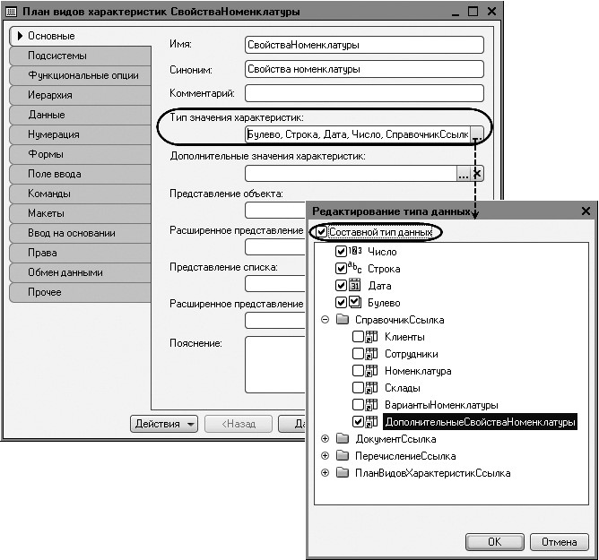 у этого свойства и перенесем из списка доступных реквизитов в
	список параметров измерение регистра ВидСвойства. 

Установка свойства Связи параметров выбора обеспечит нам то, что при выборе значений, содержащихся в справочнике
	Дополнительные свойства номенклатуры, для выбора будут предлагаться только те значения, которые относятся к
	выбранной характеристике, а не все, которые есть в этом справочнике (рис. 15.9).

<strong>Рис. 15.9.</strong> Свойство ресурса «Значение регистра сведений»

<strong>Описание характеристик вариантов номенклатуры</strong>

В заключение для справочника ВариантыНоменклатуры опишем, где хранятся свойства вариантов номенклатуры и как получить
	значения этих свойств. Это описание платформа будет использовать автоматически при выполнении отчетов и при
	формировании различных динамических списков, в которых задействуются варианты номенклатуры. 

В контекстном меню справочника ВариантыНоменклатуры выберем команду Характеристики (рис. 15.10).

<strong>Рис. 15.10.</strong> Переход к характеристикам справочника 

«ВариантыНоменклатуры»

Откроется диалог описания характеристик. С помощью кнопки Добавить в командной панели добавим в него новую запись. В
	качестве источника характеристик выберем план видов характеристик СвойстваНоменклатуры. Платформа автоматически
	определит, что полем ключа будет являться поле Ссылка этого объекта конфигурации (рис. 15.11).

Два оставшихся поля, Поле отбора видов и Значение отбора, оставим пустыми. В нашем случае эти поля не
	понадобятся.

Перейдем к описанию того, где и как хранятся значения наших свойств. В качестве источника значений характеристик
	выберем регистр сведений ЗначенияСвойствНоменклатуры. Платформа автоматически определит, что в этом регистре полем
	объекта является измерение НаборСвойств, а полем вида – измерение ВидСвойства. 

<strong>Рис. 15.11.</strong> Описание источника видов характеристик

Поэтому единственное, что нам останется указать самостоятельно, что значения свойств хранятся в ресурсе Значение. В
	результате описание характеристик для справочника ВариантыНоменклатуры будет выглядеть следующим образом (рис.
	15.12).

<strong>Рис. 15.12.</strong> Описание характеристик для справочника 

«ВариантыНоменклатуры»

<strong>Доработка объектов конфигурации</strong>

Итак, мы создали новые объекты конфигурации и задали их основные свойства, необходимые для реализации нашей
	задачи. 

Но, как мы дальше увидим, не все свойства нас полностью устраивают. И вообще при разработке невозможно предусмотреть
	все заранее. Часто какие-то недочеты становятся видны лишь в процессе работы. То есть, увидев промежуточный
	результат в режиме 1С:Предприятие, важно уметь оценить недостатки и исправить их прямо по ходу работы.

Поэтому на этом занятии мы продемонстрируем процесс разработки от обратного. Это тоже очень ценный опыт, который, мы
	надеемся, будет полезен читателю.

Итак, запустим «1С:Предприятие» в режиме отладки и посмотрим, как взаимодействуют логически связанные объекты
	конфигурации Справочник Номенклатура, Справочник ВариантыНоменклатуры, План видов характеристик СвойстваНоменклатуры
	и Регистр сведений ЗначенияСвойствНоменклатуры.

Обратите внимание, что мы не указывали для этих объектов подсистем, к которым они относятся. Дело в том, что
	отображение этих объектов вне их логической связи друг с другом не имеет особого смысла. Поскольку мы задали
	владельцев справочников, ведущее измерение регистра сведений и т. п., то нужные объекты автоматически попадут в
	панель навигации форм своих владельцев как подчиненная информация. 

Поэтому проигнорируем появившееся системное сообщение об отсутствии привязки созданных нами объектов к
	подсистемам.

<strong>Справочник «Варианты номенклатуры»</strong>

<strong>В режиме «1С:Предприятие»</strong>

Итак, по условию нашей задачи мы хотим создать наборы свойств и составляющие их характеристики для отдельных
	элементов номенклатуры. Наборы свойств, как мы уже говорили, будут храниться в справочнике ВариантыНоменклатуры,
	подчиненном справочнику Номенклатура. 

Сначала мы хотим создать набор свойств для элемента номенклатуры Кабель электрический. 

В разделе Учет материалов откроем справочник Номенклатура и его элемент Кабель электрический из группы Материалы 
	Прочее.

Поскольку справочник Номенклатура является владельцем справочника ВариантыНоменклатуры, мы видим в панели навигации
	формы ссылку для перехода к подчиненному списку. Это значит, что при открытии этого списка мы будем видеть только
	наборы свойств, относящиеся к редактируемому элементу справочника Номенклатура. 

Для этого выполним команду Варианты номенклатуры для перехода к списку, где будут храниться наборы свойств элементов
	номенклатуры (рис. 15.13).

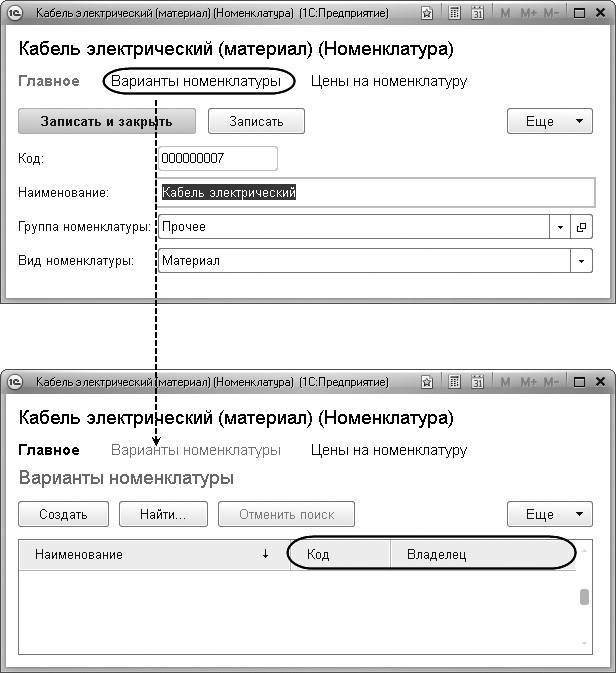

<strong>Рис. 15.13.</strong> Список вариантов номенклатуры

Открывшаяся форма списка вариантов номенклатуры не совсем нас устраивает – столбцы Код и Владелец явно лишние. 

Код нового варианта номенклатуры генерируется автоматически и ни о чем пользователю не говорит. 

Владелец варианта номенклатуры отражен в заголовке формы и тоже в списке не имеет смысла.

Чтобы сделать эти колонки невидимыми, нам нужно создать форму списка справочника ВариантыНоменклатуры и при ее
	создании проанализировать, откуда она открывается (это можно понять по значению параметра формы Отбор). 

Если установлен отбор по владельцу (то есть она открывается из списка номенклатуры), то мы будем в ней скрывать
	колонки Код и Владелец. 

Если же форма открывается другими способами, то эти колонки могут понадобиться, поэтому просто удалить их из формы
	было бы неправильно. 

Поскольку форма создается на сервере, делать это нужно в обработчике события формы ПриСозданииНаСервере. 

<strong>В режиме «Конфигуратор»</strong>

Вернемся в конфигуратор и устраним недостатки формы списка.

Для создания формы откроем окно редактирования объекта конфигурации Справочник ВариантыНоменклатуры, перейдем на
	закладку 

<strong>Рис. 15.14.</strong> Создание основной формы списка 

В открывшемся окне конструктора нажмем Готово. 

Форма, созданная конструктором, в отличие от автогенерируемой формы, не содержит поля Владелец. Поэтому наша задача
	даже упрощается: нам нужно будет скрыть только одно поле – Код.

В открывшемся окне редактора форм вверху слева расположено окно элементов формы. Выделим в нем элемент Форма
	(поскольку нам нужно событие формы в целом) и двойным щелчком мыши откроем палитру свойств этого элемента. 

Прокрутив вниз список свойств формы, найдем событие ПриСозда-

В модуле формы будет создан обработчик события формы ПриСозданииНаСервере, в который мы внесем следующий текст
	(листинг 

15.1). 

<strong>листинг 15.1.</strong> Обработчик события формы «ПриСозданииНаСервере()»

<table>
	<tr>
		<td>
Если Параметры.Отбор.Свойство(&quot;Владелец&quot;) Тогда
</td>
	</tr>
	<tr>
		<td></td>
	</tr>
	<tr>
		<td>
Элементы.Код.Видимость = Ложь;
</td>
	</tr>
	<tr>
		<td></td>
	</tr>
	<tr>
		<td>
КонецЕсли;
</td>
	</tr>
</table>

Прокомментируем этот код. 

Параметры – это свойство управляемой формы, в модуле которой мы находимся. Используя это свойство, мы получаем
	объект, который содержит коллекцию параметров формы. 

К элементу этой коллекции Отбор мы обращаемся по имени. Используя метод Свойство() структуры элементов отбора, мы
	определяем, установлен ли отбор по полю Владелец. 

Если такой отбор установлен, то мы устанавливаем видимость поля Код в значение Ложь, то есть скрываем это поле. Здесь
	Элементы – это свойство управляемой формы, которое позволяет получить доступ ко всем элементам формы.

<strong>В режиме «1С:Предприятие»</strong>

Проверим результат изменений в режиме 1С:Предприятие. 

Форма списка вариантов номенклатуры будет иметь следующий вид (рис. 15.16).

<strong>Рис. 15.16.</strong> Список вариантов номенклатуры

Мы видим, что добились желаемого результата (см. рис. 15.13): было три колонки, а теперь только одна –
	Наименование.

Теперь нажмем кнопку Создать, чтобы создать новый набор свойств для элемента номенклатуры. 

Откроется форма элемента справочника ВариантыНоменклатуры 

(рис. 15.17).

Эта форма сгенерирована системой автоматически. Но в ней также есть недостатки:

<ul>
	<li>заголовок формы должен быть задан в единственном числе;</li>
	<li>лишние поля Код и Владелец;</li>
	<li>команду перехода к подчиненной информации нужно переименовать в более понятную.</li>
</ul>

Вернемся в конфигуратор и исправим их.

<strong>В режиме «Конфигуратор»</strong>

Во-первых, нужно переименовать заголовок формы, чтобы было понятно, что мы создаем в данный момент один вариант
	номенклатуры. 

Для этого в окне редактирования объекта конфигурации Справочник 

ВариантыНоменклатуры на закладке Основные зададим Представление объекта в единственном числе как Вариант номенклатуры
	(рис. 15.18).

<strong>Рис. 15.18.</strong> Установка представления объекта

Это свойство будет использоваться в интерфейсе «1С:Предприятия» как заголовок формы элемента справочника.

Во-вторых, нужно убрать поля Код и Владелец из этой формы. 

Для этого в окне редактирования объекта конфигурации Справочник ВариантыНоменклатуры перейдем на закладку Формы,
	нажмем кнопку открытия и создадим основную форму элемента. 

В окне структуры элементов формы выделим поочередно эти элементы и, нажимая кнопку Удалить в командной панели, удалим
	их из формы (рис. 15.19).

<strong>Рис. 15.19.</strong> Удаление элементов формы

В результате в форме элемента будет отображен только один реквизит справочника – Наименование. 

Его представление мы тоже немного поправим. 

На закладке Данные в окне редактирования объекта конфигурации Справочник ВариантыНоменклатуры нажмем кнопку
	Стандартные реквизиты, в списке этих реквизитов дважды щелкнем на реквизите Наименование и в открывшейся палитре
	свойств зададим Синоним реквизита – Название.

В-третьих, не вяжутся друг с другом заголовок формы Вариант 

Поэтому в окне редактирования объекта конфигурации Регистр сведений ЗначенияСвойствНоменклатуры на закладке Основные
	зададим Представление списка как Состав варианта номенклатуры (рис. 15.20).

Это свойство будет использоваться в интерфейсе «1С:Предприятия» как заголовок формы списка регистра. 

<strong>В режиме «1С:Предприятие»</strong>

Проверим результат изменений в режиме 1С:Предприятие. 

Итак, в разделе Учет материалов откроем справочник Номенклатура и его элемент Кабель электрический из группы
	Материалы  Прочее. 

В форме элемента выполним команду Варианты номенклатуры для перехода к списку наборов свойств данного элемента
	номенклатуры. Пока этот список пуст. 

Нажмем кнопку Создать. Теперь в открывшейся форме варианта номенклатуры нас все устраивает. 

<strong>Регистр сведений «Значения свойств номенклатуры»</strong>

<strong>В режиме «1С:Предприятие»</strong>

Создадим вариант номенклатуры Белые кабели (рис. 15.21).

Выполним команду Состав варианта номенклатуры для перехода к составу редактируемого варианта номенклатуры. 

<strong>подскАзкА</strong>

Как показывает опыт многих читателей, при выполнении данного занятия может возникнуть проблема – в панели навигации
	формы варианта номенклатуры не видна команда для перехода к связанным записям регистра сведений
	ЗначенияСвойствНоменклатуры (Состав варианта номенклатуры). В этом случае, скорее всего, вы забыли установить
	свойство Ведущее для измерения этого регистра НаборСвойств, имеющего тип СправочникСсылка.ВариантыНоменклатуры.

В результате того, что измерение регистра является ведущим, в панели навигации формы элемента справочника
	ВариантыНоменклатуры появляется ссылка, по которой возможен переход к записям регистра, содержащим в измерении
	НаборСвойств ссылку на текущий вариант номенклатуры.

Если новый вариант номенклатуры еще не записан, то появится вопрос о записи данных, на который мы ответим
	утвердительно 

(рис. 15.22).

<strong>Рис. 15.22.</strong> Подтверждение записи данных

После этого откроется форма списка регистра Значения свойств номенклатуры, которая также генерируется по умолчанию
	(рис. 15.23).

В этой форме нас также не все устраивает:

<ul>
	<li>заголовок колонки ВидСвойства лучше переименовать,</li>
	<li>лишняя колонка НаборСвойств.</li>
</ul>

Вернемся в конфигуратор и устраним недостатки формы списка.

<strong>В режиме «Конфигуратор»</strong>

Во-первых, название колонки Вид свойства лучше переименовать в Свойство. 

Для этого в окне редактирования объекта конфигурации Регистр сведений ЗначенияСвойствНоменклатуры на закладке Данные
	откроем палитру свойств измерения ВидСвойства и зададим его Синоним как Свойство (рис. 15.24).

<strong>Рис. 15.24.</strong> Установка синонима для измерения регистра

Во-вторых, поскольку регистр имеет ведущее измерение

НаборСвойств типа СправочникСсылка.ВариантыНоменклатуры, поле 

Набор свойств – лишнее, так как владелец данного набора свойств отражен в заголовке формы. 

Поэтому создадим обработчик события ПриСозданииНаСервере формы списка регистра и в нем сделаем колонку НаборСвойств
	невидимой в случае открытия формы с отбором по этому полю, то есть если форма списка регистра открыта из формы
	элемента справочника Варианты номенклатуры.

Для создания этого обработчика откроем окно редактирования объекта конфигурации Регистр сведений
	ЗначенияСвойствНоменклатуры, перейдем на закладку Формы, нажмем кнопку открытия 
	и<strong> </strong>создадим основную форму списка.

Затем создадим для формы обработчик события формы ПриСозданииНаСервере, в который мы внесем следующий текст
	(листинг 

15.2). 

<strong>листинг 15.2.</strong> Обработчик события формы «ПриСозданииНаСервере()»

<table>
	<tr>
		<td>
Если Параметры.Отбор.Свойство(&quot;НаборСвойств&quot;) Тогда
</td>
	</tr>
	<tr>
		<td></td>
	</tr>
	<tr>
		<td>
Элементы.НаборСвойств.Видимость = Ложь;
</td>
	</tr>
	<tr>
		<td></td>
	</tr>
	<tr>
		<td>
КонецЕсли;
</td>
	</tr>
</table>

Этот код аналогичен коду, приведенному выше в листинге 15.1, поэтому в комментариях не нуждается.

<strong>В режиме «1С:Предприятие»</strong>

Проверим результат изменений в режиме 1С:Предприятие. 

В результате форма списка регистра Состав варианта номенклатуры примет вид (рис. 15.25).

Теперь, если нажать кнопку Создать, чтобы ввести новую запись в состав варианта номенклатуры, откроется форма записи
	регистра ЗначенияСвойствНоменклатуры (рис. 15.26).

Эта форма сгенерирована системой автоматически. Но в ней также есть недостатки:

 заголовок формы должен быть задан в единственном числе,  лишняя колонка НаборСвойств. 

Вернемся в конфигуратор и исправим их.

<strong>В режиме «Конфигуратор»</strong>

Во-первых, нужно переименовать заголовок формы, чтобы было понятно, что мы создаем в данный момент одно свойство и
	его значение в составе варианта номенклатуры. 

Для этого в окне редактирования объекта конфигурации Регистр сведений ЗначенияСвойствНоменклатуры на закладке
	Основные зададим Представление записи как Свойство и значение (рис. 15.27).

Это свойство будет использоваться в интерфейсе «1С:Предприятия» как заголовок формы записи регистра.

Во-вторых, нужно убрать поле НаборСвойств из этой формы. Для этого в окне редактирования объекта конфигурации Регистр
	сведений ЗначенияСвойствНоменклатуры перейдем на закладку Формы, нажмем кнопку открытия  и
	создадим основную форму записи. 

<strong>Рис. 15.27.</strong> Установка представления записи регистра

В окне структуры элементов формы выделим этот элемент и, нажав кнопку Удалить в командной панели, удалим его из
	формы.

<strong>В режиме «1С:Предприятие»</strong>

Проверим результат изменений в режиме 1С:Предприятие. В результате форма записи регистра ЗначенияСвойствНоменклатуры
	примет вид (рис. 15.28).

<h1>Лабораторная работа № 24 Пакетная печать документа</h1>

<strong>Порядок выполнения работы </strong>

1. Ознакомьтесь с теоретическими основами в настоящих указаниях и конспектах лекций. 

2. Получите задание у преподавателя. 

3. Сделайте скриншоты (кнопка клавиатуры PrtSc) выполненных заданий в текстовом (Word) файле <em>Фамилия_ЛР</em>

4. Составьте отчет по лабораторной работе. 

5. Отчитайте работу преподавателю.

<strong>Создание видов характеристик номенклатуры</strong>

<strong>В режиме «1С:Предприятие»</strong>

Теперь создадим различные варианты номенклатуры в режиме 1С:Предприятие. 

Итак, в разделе Учет материалов откроем справочник Номенклатура и его элемент Кабель электрический из группы
	Материалы  Прочее. 

В форме элемента номенклатуры выполним команду Варианты номенклатуры для перехода к списку наборов свойств данного
	элемента номенклатуры. 

В форме списка вариантов номенклатуры откроем набор свойств Белые кабели, который мы создали ранее. 

В форме варианта номенклатуры выполним команду Состав варианта номенклатуры для перехода к составу редактируемого
	варианта номенклатуры. Этот список пока пуст. 

Нажмем кнопку Создать. В открывшейся форме (см. рис. 15.28) создадим свойство Цвет со значением Белый. Для этого
	нажмем кнопку выбора  в поле Свойство и в выпадающем списке нажмем на ссылку Показать все. 

Измерение ВидСвойства(Свойство) регистра ЗначенияСвойствНоменклатуры имеет тип
	ПланВидовХарактеристикСсылка.СвойстваНоменклатуры. Поэтому перед нами появится форма выбора этого плана видов
	характеристик. Список видов характеристик пока пуст. 

Нажмем кнопку Создать. В открывшемся окне формы элемента плана видов характеристик введем наименование вида
	характеристики – Цвет. Тип значения этого вида характеристики оставим по умолчанию – Дополнительные свойства
	номенклатуры (рис. 15.29).

Обратите внимание, что в форме элемента плана видов характеристик (см. рис. 15.29) и в форме элемента справочника
	дополнительных характеристик номенклатуры (см. рис. 15.30) также есть лишнее поле Код. Кроме того, заголовок этих
	форм желательно задать в единственном числе.

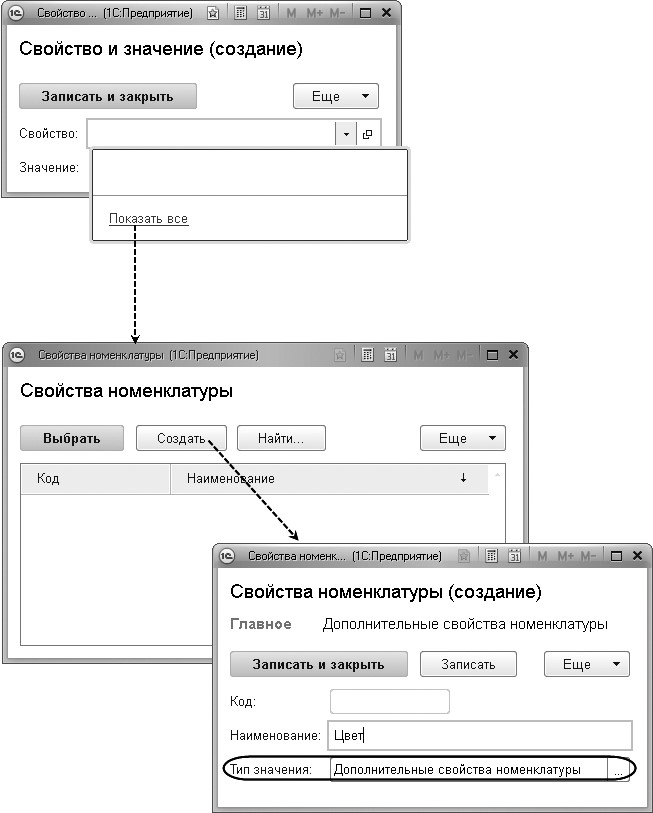

<strong>Рис. 15.29.</strong> Создание вида характеристики в плане видов характеристик

Мы не стали дорабатывать эти формы, так как уже показывали подобные действия ранее. Вы можете сделать это
	самостоятельно аналогично тому, как это показано для формы элемента справочника ВариантыНоменклатуры.

Нажмем Записать и закрыть. В окне выбора плана видов характеристик появится созданный нами вид характеристики. 

Нажмем кнопку Выбрать. В результате мы вернемся в форму записи состава варианта номенклатуры с заголовком Свойство и
	значение. 

Нажмем кнопку выбора  в поле Значение и в выпадающем списке нажмем кнопку Создать (+).

Ресурс Значение регистра ЗначенияСвойствНоменклатуры имеет тип Характеристика.СвойстваНоменклатуры. Это составной тип
	данных, который описан в свойстве Тип значения характеристик плана видов характеристик СвойстваНоменклатуры. 

Так как для вида характеристики Цвет мы задали тип значения СправочникСсылка.ДополнительныеСвойстваНоменклатуры, то
	перед нами появится форма ввода нового элемента этого справочника.

В открывшемся окне формы элемента дополнительных свойств номенклатуры введем тип значения Белый, в поле Владелец
	оставим имеющееся значение – Цвет (рис. 15.30).

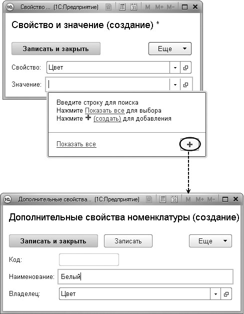

<strong>Рис. 15.30.</strong> Создание дополнительных свойств номенклатуры

Нажмем Записать и закрыть. 

Мы вернемся в форму записи состава варианта номенклатуры с заголовком Свойство и значение и увидим там созданное нами
	свойство Цвет со значением Белый (рис. 15.31).

Нажмем Записать и закрыть. Мы вернемся в форму списка состава варианта номенклатуры. 

Создадим еще одно свойство – Сечение, мм2 – в составе варианта номенклатуры Белые кабели. Для этого повторим только
	что выполненные действия.

Нажмем кнопку Создать (рис. 15.32).

нажмем на ссылку Показать все. 

В форме выбора плана видов характеристик нажмем кнопку Создать. 

В открывшемся окне формы элемента плана видов характеристик введем наименование вида характеристики – Сечение, мм2 и
	выберем Тип значения этого вида характеристики – Число, длина 15, точность 3 (рис. 15.33).

Нажмем Записать и закрыть. В окне выбора плана видов характеристик появится созданный нами вид характеристики. 

Нажмем кнопку Выбрать. Мы вернемся в форму записи состава варианта номенклатуры с заголовком Свойство и
	значение. 

Введем число 2,5 в поле Значение (рис. 15.34).

Нажмем Записать и закрыть. Мы вернемся в форму списка состава варианта номенклатуры. 

Итак, мы видим два свойства и их значения, которые мы создали для варианта номенклатуры Белые кабели (рис.
	15.35).

Теперь аналогичным образом создадим набор свойств для элемента справочника Номенклатура – Шланг резиновый. 

Этот набор свойств будет называться Польша (рис. 15.36) и состоять из следующих свойств (рис. 15.37):

<ul>
	<li>Цвет – Черный;</li>
	<li>Производитель – Fagumit.</li>
</ul>

<strong>Рис. 15.36.</strong> Вариант номенклатуры для элемента номенклатуры 

«Шланг резиновый»

При создании свойства Цвет выберем его из уже имеющихся свойств в плане видов характеристик. 

Значение этого вида характеристики – Черный, сначала добавим в справочник дополнительных свойств номенклатуры и затем
	выберем из него.

При создании свойства Производитель с типом значения Дополнительные свойства номенклатуры сначала добавим это
	свойство в план видов характеристик (тип значения – Дополнительные свойства номенклатуры), а затем выберем из
	него. 

Значение этого вида характеристики – Fagumit, сначала добавим в справочник дополнительных свойств номенклатуры и
	затем выберем из него.

Теперь посмотрим на все, что мы создали, не с точки зрения пользователя, а с точки зрения разработчика.

<strong>Рис. 15.37.</strong> Свойства и значения в составе варианта номенклатуры «Польша»

Перейдем в главное меню программы. Для этого нажмем кнопку с пиктограммой в виде черного треугольника , расположенную в панели системных команд приложения рядом с символом «1С». Выполним команду
	главного меню Все функции. Поочередно откроем все объекты конфигурации, в которых хранится информация о созданных
	нами характеристиках номенклатуры.

В справочнике Варианты номенклатуры хранятся созданные нами наборы свойств номенклатуры. При этом каждый набор
	свойств подчинен конкретному элементу номенклатуры.

В плане видов характеристик Свойства номенклатуры хранятся созданные нами виды характеристик номенклатуры:

<ul>
	<li>Цвет, тип значения СправочникСсылка.ДополнительныеСвойстваНоменклатуры;</li>
	<li>Сечение, мм2, тип значения Число;</li>
	<li>Производитель, тип значения СправочникСсылка.ДополнительныеСвойстваНоменклатуры.</li>
</ul>

В справочнике Дополнительные свойства номенклатуры хранятся значения этих видов характеристик (за исключением вида
	характеристики Сечение типа Число). А в регистре сведений Значе- нияСвойствНоменклатуры хранятся соответствия видов
	характеристик и их значений в разрезе наборов свойств.

Взаимодействие этих объектов конфигурации представлено на следующей схеме (рис. 15.38).

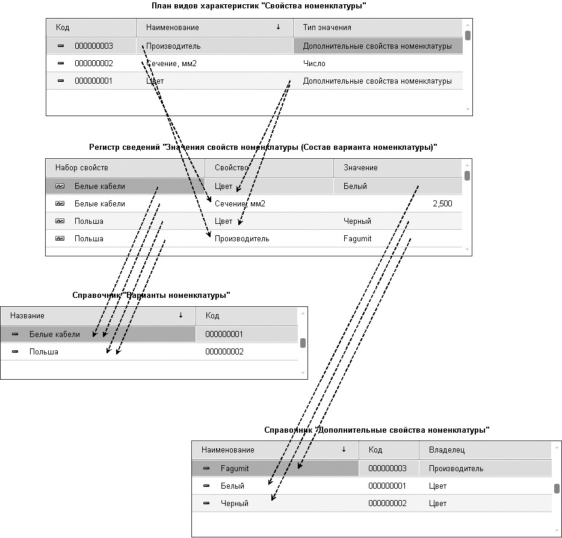

<strong>Рис. 15.38.</strong> Объекты конфигурации, в которых хранится информация 

о характеристиках номенклатуры

<strong>Доработка учетных механизмов</strong>

Итак, мы добавили возможность указывать произвольные характеристики для номенклатуры и создали несколько таких
	характеристик – вариантов номенклатуры.

Но это лишь часть работы. Теперь хотелось бы иметь возможность еще и учитывать номенклатуру в разрезе этих
	характеристик. А именно:

<ul>
	<li>приходовать товар, указывая характеристики;</li>
	<li>расходовать товар, указывая характеристики;</li>
	<li>получать отчеты не просто по номенклатуре, а по номенклатуре с определенными характеристиками.</li>
</ul>

Для этого потребуется доработать имеющиеся регистры и создать новый отчет, который позволит получать данные в разрезе
	свойств номенклатуры.

<strong>Регистр «Остатки материалов»</strong>

<strong>В режиме «Конфигуратор»</strong>

Для обеспечения учета материалов по значениям характеристик необходимо изменить структуру регистра накопления
	ОстаткиМатериалов, чтобы хранить в нем данные еще и в разрезе наборов свойств номенклатуры.

Для этого откроем окно редактирования объекта конфигурации Регистр накопления ОстаткиМатериалов и на закладке Данные
	добавим в него новое измерение НаборСвойств с типом СправочникСсылка.ВариантыНоменклатуры (рис. 15.39).

<strong>Рис. 15.39.</strong> Новое измерение «НаборСвойств»

<strong>Документ «Приходная накладная»</strong>

<strong>В режиме «Конфигуратор»</strong>

Теперь нам нужно доработать документ ПриходнаяНакладная, чтобы при приходовании материалов можно было указать набор
	свойств и чтобы этот набор свойств записывался в регистры при проведении документа.

Для этого откроем окно редактирования объекта конфигурации Документ ПриходнаяНакладная и на закладке Данные добавим в
	табличную часть документа новый реквизит НаборСвойств с типом СправочникСсылка.ВариантыНоменклатуры (рис.
	15.40).

<strong>Рис. 15.40.</strong> Новый реквизит «НаборСвойств»

У этого реквизита необходимо заполнить свойство Связи параметров выбора, чтобы после выбора номенклатуры в этом
	свойстве выбирать только среди тех наборов свойств, которые относятся к данной номенклатуре.

Найдем в палитре свойств свойство Связи параметров выбора и нажмем кнопку выбора . 

Перенесем из списка доступных реквизитов в список параметров реквизит Материалы.Материал (рис. 15.41).

Тем самым мы задали, что при выборе в поле НаборСвойств будет всегда открываться список элементов справочника
	Варианты номенклатуры, подчиненных материалу, выбранному в колонке Материал.

После этого расположим этот реквизит в табличной части формы документа. 

Для этого перейдем на закладку Формы и двойным щелчком мыши на строке ФормаДокумента в списке форм откроем форму
	документа. 

Затем в правом верхнем окне редактора форм на закладке Реквизиты раскроем реквизит формы Объект. 

Мы видим, что он содержит все реквизиты документа ПриходнаяНакладная. 

Найдем в табличной части реквизит НаборСвойств и с помощью мыши перетащим его в окно элементов формы, расположенное
	слева в верхней части редактора форм, в таблицу Материалы. 

Новый элемент расположим в структуре элементов формы после поля Материал (рис. 15.42).

<strong>Рис. 15.42.</strong> Изменение формы документа «Приходная накладная»

Обратите внимание, что в открывшейся палитре свойств элемента формы НаборСвойств в свойстве ПутьКДанным уже указан
	реквизит табличной части НаборСвойств, так как мы перетаскивали реквизит в форму с помощью мыши, и оно заполнилось
	автоматически. 

Свойство ПутьКДанным устанавливает связь элемента формы с реквизитом формы, то есть с отображаемыми данными. Это
	свойство обязательно должно быть заполнено, иначе элемент формы не будет показан!

<strong>пРиМеЧАние</strong>

При добавлении элемента формы с помощью кнопки Добавить свойство ПутьКДанным, устанавливающее связь элемента с
	реквизитом формы, необходимо заполнять вручную.

В заключение в окне редактирования объекта конфигурации Документ ПриходнаяНакладная на закладке Прочее откроем модуль
	объекта. 

Откроем процедуру обработчика события ОбработкаПроведения и добавим к формируемым движениям присвоение значения
	измерению НаборСвойств регистра ОстаткиМатериалов (листинг 15.3). 

<strong>листинг 15.3.</strong> Фрагмент процедуры «ОбработкаПроведения()»

…

<table>
	<tr>
		<td>
// регистр ОстаткиМатериалов Приход
</td>
	</tr>
	<tr>
		<td></td>
	</tr>
	<tr>
		<td>
…
</td>
	</tr>
	<tr>
		<td></td>
	</tr>
	<tr>
		<td>
Движение.Материал = ТекСтрокаМатериалы.Материал;
</td>
	</tr>
	<tr>
		<td></td>
	</tr>
	<tr>
		<td>
<strong>Движение.НаборСвойств = ТекСтрокаМатериалы.НаборСвойств;</strong>
</td>
	</tr>
	<tr>
		<td></td>
	</tr>
	<tr>
		<td>
Движение.Склад = Склад;
</td>
	</tr>
	<tr>
		<td></td>
	</tr>
	<tr>
		<td>
…
</td>
	</tr>
</table>

<strong>Документ «Оказание услуги»</strong>

<strong>В режиме «Конфигуратор»</strong>

Теперь аналогичным образом доработаем документ ОказаниеУслуги. 

Для того чтобы при расходовании материалов пользователь мог указывать набор свойств для каждого расходуемого
	материала, откроем окно редактирования объекта конфигурации Документ ОказаниеУслуги и на закладке Данные добавим в
	табличную часть документа новый реквизит НаборСвойств с типом СправочникСсылка.ВариантыНоменклатуры.

У этого реквизита заполним свойство Связи параметров выбора. Перенесем из списка доступных реквизитов в список
	параметров реквизит ПереченьНоменклатуры.Номенклатура. Тем самым мы задали, что при выборе в поле НаборСвойств будет
	всегда открываться список элементов справочника Варианты номенклатуры, подчиненных материалу, выбранному в колонке
	Номенклатура.

После этого расположим этот реквизит в табличной части формы документа. Откроем форму документа и с помощью мыши
	перетащим его из окна реквизитов формы в окно элементов формы. Новый элемент расположим в структуре элементов формы
	после поля Номенклатура.

В заключение в окне редактирования объекта конфигурации Документ ОказаниеУслуги на закладке Прочее откроем модуль
	объекта. 

Откроем процедуру обработчика события ОбработкаПроведения и добавим к формируемым движениям присвоение значения
	измерению НаборСвойств регистра ОстаткиМатериалов (листинг 15.4). 

<strong>листинг 15.4.</strong> Фрагмент процедуры «ОбработкаПроведения()»

…

<table>
	<tr>
		<td>
// регистр ОстаткиМатериалов Расход
</td>
	</tr>
	<tr>
		<td></td>
	</tr>
	<tr>
		<td>
…
</td>
	</tr>
	<tr>
		<td></td>
	</tr>
	<tr>
		<td>
Движение.Материал = ВыборкаДетальныеЗаписи.Номенклатура;
</td>
	</tr>
	<tr>
		<td></td>
	</tr>
	<tr>
		<td>
<strong>Движение.НаборСвойств = ВыборкаДетальныеЗаписи.НаборСвойств;</strong>
</td>
	</tr>
	<tr>
		<td></td>
	</tr>
	<tr>
		<td>
Движение.Склад = Склад;
</td>
	</tr>
	<tr>
		<td></td>
	</tr>
	<tr>
		<td>
…
</td>
	</tr>
</table>

Поскольку на предыдущем занятии мы оптимизировали процедуру проведения документа и получали все данные документа с
	помощью запроса, то в текст запроса нужно также добавить строки для получения нового реквизита документа (листинг
	15.5). <strong>листинг 15.5.</strong> Фрагмент процедуры «ОбработкаПроведения()»

<table>
	<tr>
		<td>
…
</td>
	</tr>
	<tr>
		<td></td>
	</tr>
	<tr>
		<td>
Запрос = Новый Запрос;
</td>
	</tr>
	<tr>
		<td></td>
	</tr>
	<tr>
		<td></td>
	</tr>
	<tr>
		<td></td>
	</tr>
	<tr>
		<td>
// Укажем, какой менеджер временных таблиц использует этот запрос
</td>
	</tr>
	<tr>
		<td></td>
	</tr>
	<tr>
		<td>
Запрос.МенеджерВременныхТаблиц = МенеджерВТ;
</td>
	</tr>
	<tr>
		<td></td>
	</tr>
	<tr>
		<td></td>
	</tr>
	<tr>
		<td></td>
	</tr>
	<tr>
		<td>
Запрос.Текст = 
</td>
	</tr>
	<tr>
		<td></td>
	</tr>
	<tr>
		<td>
&quot;ВЫБРАТЬ
</td>
	</tr>
	<tr>
		<td></td>
	</tr>
	<tr>
		<td>
 | ОказаниеУслугиПереченьНоменклатуры.Номенклатура,
</td>
	</tr>
	<tr>
		<td></td>
	</tr>
	<tr>
		<td>
 | ОказаниеУслугиПереченьНоменклатуры.Номенклатура.ВидНоменклатуры 
</td>
	</tr>
	<tr>
		<td></td>
	</tr>
	<tr>
		<td>
 | КАК ВидНоменклатуры,
</td>
	</tr>
	<tr>
		<td></td>
	</tr>
	<tr>
		<td>
<strong>| ОказаниеУслугиПереченьНоменклатуры.НаборСвойств,</strong>
</td>
	</tr>
	<tr>
		<td></td>
	</tr>
	<tr>
		<td>
 | СУММА(ОказаниеУслугиПереченьНоменклатуры.Количество) 
</td>
	</tr>
	<tr>
		<td></td>
	</tr>
	<tr>
		<td>
 | КАК КоличествоВДокументе,
</td>
	</tr>
	<tr>
		<td></td>
	</tr>
	<tr>
		<td>
 | СУММА(ОказаниеУслугиПереченьНоменклатуры.Сумма) КАК СуммаВДокументе
</td>
	</tr>
	<tr>
		<td></td>
	</tr>
	<tr>
		<td>
|ПОМЕСТИТЬ НоменклатураДокумента
</td>
	</tr>
	<tr>
		<td></td>
	</tr>
	<tr>
		<td>
|ИЗ
</td>
	</tr>
	<tr>
		<td></td>
	</tr>
	<tr>
		<td>
 | Документ.ОказаниеУслуги.ПереченьНоменклатуры 
</td>
	</tr>
	<tr>
		<td></td>
	</tr>
	<tr>
		<td>
 | КАК ОказаниеУслугиПереченьНоменклатуры
</td>
	</tr>
	<tr>
		<td></td>
	</tr>
	<tr>
		<td>
|ГДЕ
</td>
	</tr>
	<tr>
		<td></td>
	</tr>
	<tr>
		<td>
 | ОказаниеУслугиПереченьНоменклатуры.Ссылка = &amp;Ссылка
</td>
	</tr>
	<tr>
		<td></td>
	</tr>
	<tr>
		<td>
|СГРУППИРОВАТЬ ПО
</td>
	</tr>
	<tr>
		<td></td>
	</tr>
	<tr>
		<td>
 | ОказаниеУслугиПереченьНоменклатуры.Номенклатура,
</td>
	</tr>
	<tr>
		<td></td>
	</tr>
	<tr>
		<td>
 | ОказаниеУслугиПереченьНоменклатуры.Номенклатура.ВидНоменклатуры<strong>,</strong>
</td>
	</tr>
	<tr>
		<td></td>
	</tr>
	<tr>
		<td>
<strong>| ОказаниеУслугиПереченьНоменклатуры.НаборСвойств</strong>&quot;<strong>;</strong>
</td>
	</tr>
	<tr>
		<td></td>
	</tr>
	<tr>
		<td>
...
</td>
	</tr>
	<tr>
		<td></td>
	</tr>
	<tr>
		<td>
Запрос2 = Новый Запрос;
</td>
	</tr>
	<tr>
		<td></td>
	</tr>
	<tr>
		<td>
Запрос2.МенеджерВременныхТаблиц = МенеджерВТ;
</td>
	</tr>
	<tr>
		<td></td>
	</tr>
	<tr>
		<td>
Запрос2.Текст = &quot;ВЫБРАТЬ
</td>
	</tr>
	<tr>
		<td></td>
	</tr>
	<tr>
		<td>
 | НоменклатураДокумента.Номенклатура,
</td>
	</tr>
	<tr>
		<td></td>
	</tr>
	<tr>
		<td>
 | НоменклатураДокумента.ВидНоменклатуры,
</td>
	</tr>
	<tr>
		<td></td>
	</tr>
	<tr>
		<td>
<strong>| НоменклатураДокумента.НаборСвойств,</strong>
</td>
	</tr>
	<tr>
		<td></td>
	</tr>
	<tr>
		<td>
 | НоменклатураДокумента.КоличествоВДокументе,
</td>
	</tr>
	<tr>
		<td></td>
	</tr>
	<tr>
		<td>
 | НоменклатураДокумента.СуммаВДокументе,
</td>
	</tr>
</table>

| ЕСТЬNULL(СтоимостьМатериаловОстатки.СтоимостьОстаток, 0) КАК Стоимость, |
	ЕСТЬNULL(ОстаткиМатериаловОстатки.КоличествоОстаток, 0) КАК Количество |ИЗ

<table>
	<tr>
		<td>
| 
</td>
		<td>
НоменклатураДокумента КАК НоменклатураДокумента
</td>
	</tr>
	<tr>
		<td></td>
		<td></td>
	</tr>
	<tr>
		<td>
…
</td>
		<td></td>
	</tr>
</table>

Кроме этого, понадобится изменить последний запрос, который при оперативном проведении проверяет, не появились ли
	отрицательные остатки. Теперь мы будем получать остатки не «вообще» для номенклатуры из табличной части документа, а
	для номенклатуры именно с тем набором свойств, который указан в строках документа (листинг 15.6). 

<strong>листинг 15.6.</strong> Контроль отрицательных остатков 

при оперативном проведении

<table>
	<tr>
		<td>
…
</td>
	</tr>
	<tr>
		<td></td>
	</tr>
	<tr>
		<td>
Запрос3.Текст = &quot;ВЫБРАТЬ
</td>
	</tr>
	<tr>
		<td></td>
	</tr>
	<tr>
		<td>
 | ОстаткиМатериаловОстатки.Материал,
</td>
	</tr>
	<tr>
		<td></td>
	</tr>
	<tr>
		<td>
<strong>| ОстаткиМатериаловОстатки.НаборСвойств,</strong>
</td>
	</tr>
	<tr>
		<td></td>
	</tr>
	<tr>
		<td>
 | ОстаткиМатериаловОстатки.КоличествоОстаток
</td>
	</tr>
	<tr>
		<td></td>
	</tr>
	<tr>
		<td>
|ИЗ
</td>
	</tr>
	<tr>
		<td></td>
	</tr>
	<tr>
		<td>
 | РегистрНакопления.ОстаткиМатериалов.Остатки( , (Материал<strong>, НаборСвойств</strong>) В
</td>
	</tr>
	<tr>
		<td></td>
	</tr>
	<tr>
		<td>
 | (ВЫБРАТЬ
</td>
	</tr>
	<tr>
		<td></td>
	</tr>
	<tr>
		<td>
 | НоменклатураДокумента.Номенклатура,
</td>
	</tr>
	<tr>
		<td></td>
	</tr>
	<tr>
		<td>
<strong>| НоменклатураДокумента.НаборСвойств</strong>
</td>
	</tr>
	<tr>
		<td></td>
	</tr>
	<tr>
		<td>
 | ИЗ
</td>
	</tr>
	<tr>
		<td></td>
	</tr>
	<tr>
		<td>
 | НоменклатураДокумента) И Склад = &amp;Склад) 
</td>
	</tr>
	<tr>
		<td></td>
	</tr>
	<tr>
		<td>
 | КАК ОстаткиМатериаловОстатки
</td>
	</tr>
	<tr>
		<td></td>
	</tr>
	<tr>
		<td>
|ГДЕ
</td>
	</tr>
	<tr>
		<td></td>
	</tr>
	<tr>
		<td>
 | ОстаткиМатериаловОстатки.КоличествоОстаток &lt; 0&quot;;
</td>
	</tr>
	<tr>
		<td></td>
	</tr>
	<tr>
		<td></td>
	</tr>
	<tr>
		<td></td>
	</tr>
	<tr>
		<td>
Запрос3.УстановитьПараметр(&quot;Склад&quot;, Склад);
</td>
	</tr>
	<tr>
		<td></td>
	</tr>
	<tr>
		<td></td>
	</tr>
	<tr>
		<td></td>
	</tr>
	<tr>
		<td>
РезультатЗапроса = Запрос3.Выполнить();
</td>
	</tr>
	<tr>
		<td></td>
	</tr>
	<tr>
		<td>
ВыборкаДетальныеЗаписи = РезультатЗапроса.Выбрать();
</td>
	</tr>
	<tr>
		<td></td>
	</tr>
	<tr>
		<td></td>
	</tr>
	<tr>
		<td></td>
	</tr>
	<tr>
		<td>
Пока ВыборкаДетальныеЗаписи.Следующий() Цикл
</td>
	</tr>
	<tr>
		<td></td>
	</tr>
	<tr>
		<td>
Сообщение = Новый СообщениеПользователю();
</td>
	</tr>
	<tr>
		<td></td>
	</tr>
	<tr>
		<td>
Сообщение.Текст = &quot;Не хватает &quot; + Строка(- ВыборкаДетальныеЗаписи.КоличествоОстаток) + 

		</td>
	</tr>
	<tr>
		<td></td>
	</tr>
	<tr>
		<td>
&quot; единиц материала &quot;&quot;&quot; + ВыборкаДетальныеЗаписи.Материал + &quot;&quot;&quot;&quot;
			+
</td>
	</tr>
	<tr>
		<td></td>
	</tr>
	<tr>
		<td>
<strong> </strong>&quot;<strong> из набора свойств </strong>&quot;&quot;&quot;<strong> +
			ВыборкаДетальныеЗаписи.НаборСвойств + </strong>&quot;&quot;&quot;&quot;<strong>;</strong>
</td>
	</tr>
	<tr>
		<td></td>
	</tr>
	<tr>
		<td>
Сообщение.Сообщить();
</td>
	</tr>
	<tr>
		<td></td>
	</tr>
	<tr>
		<td></td>
	</tr>
	<tr>
		<td></td>
	</tr>
	<tr>
		<td>
Отказ = Истина;
</td>
	</tr>
	<tr>
		<td></td>
	</tr>
	<tr>
		<td>
КонецЦикла;
</td>
	</tr>
	<tr>
		<td></td>
	</tr>
	<tr>
		<td>
…
</td>
	</tr>
</table>
<h1>Лабораторная работа № 25 Создание БД учета кадров</h1>

<strong>Порядок выполнения работы </strong>

1. Ознакомьтесь с теоретическими основами в настоящих указаниях и конспектах лекций. 

2. Получите задание у преподавателя. 

3. Сделайте скриншоты (кнопка клавиатуры PrtSc) выполненных заданий в текстовом (Word) файле <em>Фамилия_ЛР</em>

4. Составьте отчет по лабораторной работе. 

5. Отчитайте работу преподавателю.

<strong>Добавление плана видов характеристик </strong>

<strong>В режиме «Конфигуратор»</strong>

Приступим к созданию плана видов характеристик, который будет содержать описания разрезов аналитического учета –
	видов субконто.

Откроем конфигуратор и добавим новый объект конфигурации План видов характеристик. Зададим его имя – ВидыСубконто. На
	закладке Подсистемы укажем, что план счетов будет отображаться в подсистеме Бухгалтерия.

Поскольку нам понадобится некий вспомогательный справочник, в котором пользователи будут осуществлять «свободное
	творчество» по созданию значений новых объектов аналитического учета, добавим объект конфигурации Справочник и
	назовем его Субконто. 

Затем на закладке Владельцы укажем, что этот справочник будет подчинен плану видов характеристик ВидыСубконто. 

Для этого на закладке Владельцы нажмем кнопку Редактировать элемент списка и выберем в качестве владельца справочника
	план видов характеристик ВидыСубконто (рис. 16.1).

Закроем окно редактирования справочника и вернемся к нашему плану видов характеристик. 

На закладке Основные установим свойство Тип значения характеристик. Нажмем кнопку выбора и зададим составной тип
	данных следующим образом (рис. 16.2):  СправочникСсылка.Клиенты,

 СправочникСсылка.Номенклатура,  СправочникСсылка.Субконто.

Бухгалтерия нашего ООО «На все руки мастер» ведет учет движения денежных средств только в разрезе материалов и
	клиентов, но не исключено, что в дальнейшем понадобится дополнительная аналитика (поэтому мы и используем справочник
	Субконто). 

Обратите внимание, что тот справочник, который будет использован в качестве дополнительных значений характеристик,
	тоже должен входить в составной тип данных типа значений характеристик, иначе конфигуратор выдаст сообщение об
	ошибке.

Затем укажем, что дополнительные значения характеристик будут находиться в справочнике Субконто. 

После этого перейдем на закладку Прочее и, нажав кнопку Предопределенные, начнем ввод предопределенных значений плана
	видов характеристик (рис. 16.3). То есть тех видов аналитического учета, в разрезе которых мы будем вести учет.

<strong>Рис. 16.3.</strong> Предопределенные виды характеристик

Нажимая кнопку Добавить, создадим предопределенный вид субконто Материалы с кодом 000000001 и типом
	СправочникСсылка.Номенклатура. 

Затем создадим вид субконто Клиенты с кодом 000000002 и типом СправочникСсылка.Клиенты.

На этом создание видов субконто завершено, и мы можем перейти к знакомству со следующим объектом конфигурации,
	который будет использован нами, – План счетов.

<strong>Что такое «План счетов»</strong>

Объект конфигурации <em>План счетов</em> предназначен для описания структуры хранения информации о совокупности
	синтетических счетов предприятия, которые созданы для группировки данных о его хозяйственной деятельности. 

На основе объекта конфигурации План счетов платформа создает в базе данных таблицы, в которых будет храниться
	информация о том, какие счета и каким образом будет использовать предприятие. 

Это может быть система бухгалтерских счетов, установленная государством, план управленческих счетов или произвольный
	набор счетов, используемых для анализа тех или иных видов деятельности предприятия.

План счетов в системе «1С:Предприятие» поддерживает иерархию субсчетов: к каждому счету первого уровня может быть
	открыто несколько субсчетов, которые, в свою очередь, могут иметь свои субсчета, и так далее. 

Например, законодательно утвержденный план счетов для ведения бухучета в России имеет следующий вид (рис. 16.4).

<strong>Рис. 16.4.</strong> Российский план счетов

По любому счету или субсчету может вестись аналитический учет в разрезе субконто, описанных в плане видов
	характеристик. Связь между планом счетов и планом видов характеристик задается разработчиком на этапе
	конфигурирования. 

Для описания используемых субконто система создает в плане счетов специальную табличную часть ВидыСубконто, которая
	не видна в конфигураторе (но доступна средствами встроенного языка).

Для каждого счета есть возможность задать несколько видов учета (например, количественный и валютный). Виды учета
	задаются при помощи подчиненных объектов конфигурации <em>признак учета</em>.

Также существует возможность определить несколько видов учета субконто (например, суммовой, валютный или
	количественный). Виды учета субконто задаются при помощи подчиненных объектов конфигурации <em>признак учета
		субконто</em>.

Помимо всего вышеперечисленного каждый счет может иметь набор свойств, которые задаются в качестве реквизитов объекта
	конфигурации План счетов. Они позволяют определять уникальные свойства элементов плана счетов (например, реквизит
	ЗапретитьИспользо- ватьВПроводках).

<strong>Добавление плана счетов</strong>

<strong>В режиме «Конфигуратор»</strong>

Приступим к созданию плана счетов ООО «На все руки мастер». 

Как мы говорили в начале этого занятия, бухгалтерский учет в нашем ООО «На все руки мастер» сильно упрощен. Поэтому
	план счетов, по которому работает бухгалтерия, содержит всего четыре счета: 

<ul>
	<li>Товары,</li>
	<li>РасчетыСПоставщиками,</li>
	<li>Капитал,</li>
	<li>Дебиторская задолженность.</li>
</ul>

Добавим новый объект конфигурации План счетов. Присвоим ему имя – Основной. Свойство Представление списка зададим как
	Основной план счетов. На закладке Подсистемы укажем, что план счетов будет отображаться в подсистеме Бухгалтерия. На
	закладке Данные выделим группу реквизитов Признаки учета и, нажав кнопку Добавить, создадим признак учета
	Количественный (рис. 16.5).

Перейдем на закладку Субконто и укажем, что виды субконто для этого плана счетов будут находиться в плане видов
	характеристик ВидыСубконто. 

Максимальное количество субконто на счете установим равным двум. 

Также создадим признак учета субконто Количественный (рис. 16.6).

Затем откроем закладку Прочее. Нажмем кнопку Предопределенные и создадим четыре предопределенных счета (при создании
	каждого счета, перед тем как нажать кнопку Добавить, нужно выделить корень структуры счетов – строку Счета):

<ul>
	<li>Товары, код 41, активный, с количественным учетом в разрезе материалов (рис. 16.7).</li>
</ul>

<strong>Рис. 16.7.</strong> Предопределенный счет «Товары»

<ul>
	<li>РасчетыСПоставщиками, код 60, активный/пассивный (рис. 16.8).</li>
	<li>ДебиторскаяЗадолженность, код 62, активный/пассивный, в раз-</li>
</ul>

резе клиентов (рис. 16.9).

<ul>
	<li>Капитал, код 90, активный/пассивный (рис. 16.10).</li>
</ul>

<strong>Рис. 16.10.</strong> Предопределенный счет «Капитал»

В результате план счетов нашего ООО «На все руки мастер» будет выглядеть следующим образом (рис. 16.11).

Теперь мы можем перейти к знакомству с последним объектом конфигурации, который понадобится нам для организации
	бухгалтерского учета, – <em>Регистром бухгалтерии</em>.

<h1>Лабораторная работа № 26 Работа с БД учета кадров</h1>

<strong>Порядок выполнения работы </strong>

1. Ознакомьтесь с теоретическими основами в настоящих указаниях и конспектах лекций. 

2. Получите задание у преподавателя. 

3. Сделайте скриншоты (кнопка клавиатуры PrtSc) выполненных заданий в текстовом (Word) файле <em>Фамилия_ЛР</em>

4. Составьте отчет по лабораторной работе. 

5. Отчитайте работу преподавателю.

<strong>Добавление регистра бухгалтерии</strong>

<strong>В режиме «Конфигуратор»</strong>

Создадим новый объект конфигурации Регистр бухгалтерии. Зададим его имя – Управленческий. Свойство Расширенное
	представление списка зададим как Движения в регистре Управленческий. Укажем, что с ним будет связан план счетов
	Основной. Установим флажок Корреспон-

Флажок Корреспонденция будет говорить о том, что создаваемый нами регистр поддерживает корреспонденцию. Это означает,
	что каждая запись регистра имеет дебетовую и кредитовую часть, что позволит нам получать информацию не только об
	остатках и оборотах по счетам, но и о корреспонденциях между счетами. 

Регистры, не поддерживающие корреспонденцию, применяются тогда, когда не нужно использовать принцип двойной записи,
	регламентированный в бухгалтерском учете, и, соответственно, контролировать баланс хозяйственных средств и их
	источников.

На закладке Подсистемы укажем, что регистр будет отображаться в подсистеме Бухгалтерия.

Теперь перейдем на закладку Данные и создадим два ресурса:

<ul>
	<li>Сумма, длина 15, точность 2, Балансовый;</li>
	<li>Количество, длина 15, точность 3, Небалансовый, признак учета – Количественный, признак учета субконто –
		Количественный
	</li>
</ul>

<strong>Рис. 16.13.</strong> Свойства ресурса 

«Количество» регистра бухгалтерии

В заключение сделаем видимой команду для открытия списка регистра в разделе Бухгалтерия и расположим ее после всех
	созданных нами ранее регистров. 

Откроем командный интерфейс подсистемы Бухгалтерия из контекстного меню этой подсистемы, выделив ее в списке
	подсистем в дереве объектов конфигурации. В группе Панель навигации.Обычное включим видимость у команды
	Управленческий и мышью перетащим ее в группу Панель навигации.См. также. 

На этом создание нашего регистра бухгалтерии завершено. 

Теперь настало время познакомиться с тем, каким образом используется созданный нами регистр бухгалтерии
	Управленческий.

<strong>Доработка приходной накладной</strong>

Что нас ждет дальше? 

Сначала мы доработаем оба наши документа (ПриходнаяНакладная и ОказаниеУслуги) так, чтобы они «поставляли» данные не
	только для регистров накопления, но и для регистра бухгалтерии. 

Затем мы создадим бухгалтерский отчет Оборотно-сальдовая ведомость, который будет показывать нам состояние
	товародвижения в ООО «На все руки мастер», основываясь на данных регистра бухгалтерии.

При проведении наши документы будут создавать следующие бухгалтерские проводки – записи в регистре бухгалтерии
	(таблица 16.1).

<strong>таблица 16.1.</strong> Проводки, создаваемые документами

<table>
	<tr>
		<td rowspan="2">
<strong>документы</strong>
</td>
		<td colspan="2">
<strong>проводки</strong>
</td>
		<td colspan="2"></td>
		<td></td>
	</tr>
	<tr>
		<td colspan="2">
<strong>дебет</strong>
</td>
		<td colspan="2">
<strong>кредит</strong>
</td>
		<td>
<strong>сумма</strong>
</td>
	</tr>
	<tr>
		<td>
Приходная накладная
</td>
		<td>
41
</td>
		<td>
Товары
</td>
		<td>
60
</td>
		<td>
Расчеты с поставщиками
</td>
		<td>
Стоимость
</td>
	</tr>
	<tr>
		<td rowspan="2">
Оказание услуги
</td>
		<td>
62
</td>
		<td>
Дебиторская задолженность
</td>
		<td>
90
</td>
		<td>
Капитал
</td>
		<td>
Выручка
</td>
	</tr>
	<tr>
		<td>
90
</td>
		<td>
Капитал
</td>
		<td>
41
</td>
		<td>
Товары
</td>
		<td>
Стоимость
</td>
	</tr>
</table>

Эти проводки мы отразим при создании движений документов в регистре бухгалтерии.

Итак, сначала изменим процедуру проведения документа ПриходнаяНакладная, а затем в режиме 1С:Предприятие перепроведем
	все эти документы, чтобы отработал новый, измененный нами алгоритм проведения документа ПриходнаяНакладная. 

<strong>В режиме «Конфигуратор»</strong>

В окне редактирования объекта конфигурации Документ ПриходнаяНакладная перейдем на закладку Движения. В списке
	регистров отметим, что документ будет создавать теперь движения и по регистру бухгалтерии Управленческий. Перейдем
	на закладку Прочее и откроем модуль объекта. Откроем процедуру обработчика события ОбработкаПроведения. В самом
	конце цикла перед строкой КонецЦикла добавим строки кода, создающие движения регистра Управленческий (листинг
	16.1).

<strong>листинг 16.1.</strong> Движения документа «ПриходнаяНакладная» (фрагмент)

<table>
	<tr>
		<td>
<strong>// Регистр Управленческий </strong>
</td>
	</tr>
	<tr>
		<td></td>
	</tr>
	<tr>
		<td>
<strong>Движение = Движения.Управленческий.Добавить();</strong>
</td>
	</tr>
	<tr>
		<td></td>
	</tr>
	<tr>
		<td>
<strong>Движение.СчетДт = ПланыСчетов.Основной.Товары;</strong>
</td>
	</tr>
	<tr>
		<td></td>
	</tr>
	<tr>
		<td>
<strong>Движение.СчетКт = ПланыСчетов.Основной.РасчетыСПоставщиками;</strong>
</td>
	</tr>
	<tr>
		<td></td>
	</tr>
	<tr>
		<td>
<strong>Движение.Период = Дата;</strong>
</td>
	</tr>
	<tr>
		<td></td>
	</tr>
	<tr>
		<td>
<strong>Движение.Сумма = ТекСтрокаМатериалы.Сумма;</strong>
</td>
	</tr>
	<tr>
		<td></td>
	</tr>
	<tr>
		<td>
<strong>Движение.КоличествоДт = ТекСтрокаМатериалы.Количество;</strong>
</td>
	</tr>
	<tr>
		<td></td>
	</tr>
	<tr>
		<td>
<strong>Движение.СубконтоДт[ПланыВидовХарактеристик.ВидыСубконто.Материалы] = </strong>
</td>
	</tr>
	<tr>
		<td></td>
	</tr>
	<tr>
		<td>
<strong>ТекСтрокаМатериалы.Материал;</strong>
</td>
	</tr>
</table>

Перед началом цикла установим свойство Записывать набора записей регистра Управленческий в значение Истина для записи
	изменений регистра в базу данных. 

В результате процедура ОбработкаПроведения будет выглядеть следующим образом (листинг 16.2). <strong>листинг
	16.2.</strong> Движения документа «ПриходнаяНакладная»

<table>
	<tr>
		<td>
Процедура ОбработкаПроведения(Отказ, Режим)
</td>
	</tr>
	<tr>
		<td></td>
	</tr>
	<tr>
		<td></td>
	</tr>
	<tr>
		<td></td>
	</tr>
	<tr>
		<td>
Движения.ОстаткиМатериалов.Записывать = Истина;
</td>
	</tr>
	<tr>
		<td></td>
	</tr>
	<tr>
		<td>
Движения.СтоимостьМатериалов.Записывать = Истина;
</td>
	</tr>
	<tr>
		<td></td>
	</tr>
	<tr>
		<td>
<strong>Движения.Управленческий.Записывать = Истина;</strong>
</td>
	</tr>
	<tr>
		<td></td>
	</tr>
	<tr>
		<td></td>
	</tr>
	<tr>
		<td></td>
	</tr>
	<tr>
		<td>
Для Каждого ТекСтрокаМатериалы Из Материалы Цикл
</td>
	</tr>
	<tr>
		<td></td>
	</tr>
	<tr>
		<td></td>
	</tr>
	<tr>
		<td></td>
	</tr>
	<tr>
		<td>
// Регистр ОстаткиМатериалов Приход
</td>
	</tr>
	<tr>
		<td></td>
	</tr>
	<tr>
		<td>
Движение = Движения.ОстаткиМатериалов.Добавить();
</td>
	</tr>
</table>

Движение.ВидДвижения = ВидДвиженияНакопления.Приход;

Движение.Период = Дата;

Движение.Материал = ТекСтрокаМатериалы.Материал;

<table>
	<tr>
		<td>
Движение.НаборСвойств = ТекСтрокаМатериалы.НаборСвойств;
</td>
	</tr>
	<tr>
		<td></td>
	</tr>
	<tr>
		<td>
Движение.Склад = Склад;
</td>
	</tr>
	<tr>
		<td></td>
	</tr>
	<tr>
		<td>
Движение.Количество = ТекСтрокаМатериалы.Количество;
</td>
	</tr>
	<tr>
		<td></td>
	</tr>
	<tr>
		<td></td>
	</tr>
	<tr>
		<td></td>
	</tr>
	<tr>
		<td>
// Регистр Стоимость Материалов Приход
</td>
	</tr>
	<tr>
		<td></td>
	</tr>
	<tr>
		<td>
Движение = Движения.СтоимостьМатериалов.Добавить();
</td>
	</tr>
	<tr>
		<td></td>
	</tr>
	<tr>
		<td>
Движение.ВидДвижения = ВидДвиженияНакопления.Приход;
</td>
	</tr>
	<tr>
		<td></td>
	</tr>
	<tr>
		<td>
Движение.Период = Дата;
</td>
	</tr>
	<tr>
		<td></td>
	</tr>
	<tr>
		<td>
Движение.Материал = ТекСтрокаМатериалы.Материал;
</td>
	</tr>
	<tr>
		<td></td>
	</tr>
	<tr>
		<td>
Движение.Стоимость = ТекСтрокаМатериалы.Сумма;
</td>
	</tr>
	<tr>
		<td></td>
	</tr>
	<tr>
		<td></td>
	</tr>
	<tr>
		<td></td>
	</tr>
	<tr>
		<td>
<strong>// Регистр Управленческий </strong>
</td>
	</tr>
	<tr>
		<td></td>
	</tr>
	<tr>
		<td>
<strong>Движение = Движения.Управленческий.Добавить();</strong>
</td>
	</tr>
	<tr>
		<td></td>
	</tr>
	<tr>
		<td>
<strong>Движение.СчетДт = ПланыСчетов.Основной.Товары;</strong>
</td>
	</tr>
	<tr>
		<td></td>
	</tr>
	<tr>
		<td>
<strong>Движение.СчетКт = ПланыСчетов.Основной.РасчетыСПоставщиками;</strong>
</td>
	</tr>
	<tr>
		<td></td>
	</tr>
	<tr>
		<td>
<strong>Движение.Период = Дата;</strong>
</td>
	</tr>
	<tr>
		<td></td>
	</tr>
	<tr>
		<td>
<strong>Движение.Сумма = ТекСтрокаМатериалы.Сумма;</strong>
</td>
	</tr>
	<tr>
		<td></td>
	</tr>
	<tr>
		<td>
<strong>Движение.КоличествоДт = ТекСтрокаМатериалы.Количество;</strong>
</td>
	</tr>
	<tr>
		<td></td>
	</tr>
	<tr>
		<td>
<strong>Движение.СубконтоДт[ПланыВидовХарактеристик.ВидыСубконто.Материалы] = </strong>
</td>
	</tr>
	<tr>
		<td></td>
	</tr>
	<tr>
		<td>
<strong>ТекСтрокаМатериалы.Материал;</strong>
</td>
	</tr>
	<tr>
		<td></td>
	</tr>
	<tr>
		<td></td>
	</tr>
	<tr>
		<td></td>
	</tr>
	<tr>
		<td>
КонецЦикла;
</td>
	</tr>
	<tr>
		<td></td>
	</tr>
	<tr>
		<td></td>
	</tr>
	<tr>
		<td></td>
	</tr>
	<tr>
		<td>
КонецПроцедуры
</td>
	</tr>
</table>

Прокомментируем этот код.

Как видите, движения для регистра бухгалтерии формируются таким же образом, как и для регистра накопления. 

Но платформа (при создании таблицы хранения данных) добавила к созданным нами реквизитам регистра еще ряд полей,
	которые явились следствием использования плана счетов Основной. 

Прежде всего, это поля СчетДт и СчетКт. В этих полях указываются счета, дебет и кредит которых затрагивает данная
	проводка. 

Кроме этого, для измерений и ресурсов регистра, связанных с признаками учета, платформа создает пару полей для
	хранения значения каждого ресурса отдельно по дебету и отдельно по кредиту проводки – КоличествоДт и КоличествоКт. А
	также для счетов, по которым ведется учет в разрезе субконто, платформа создает коллекции СубконтоДт и
	СубконтоКт.

Если обратиться к таблице 16.1, то при проведении приходной накладной счетом по дебету должен быть счет Товары (41),
	а счетом по кредиту – счет РасчетыСПоставщиками (60). 

К счету мы обращаемся с помощью свойства глобального контекста ПланыСчетов. Оно предоставляет доступ ко всем планам
	счетов, созданным в конфигурации. Через точку от него мы указываем имя нужного нам плана счетов – Основной. А далее,
	тоже через точку, указываем имя предопределенного счета в этом плане счетов – Товары. Этот счет (и три других) мы
	создали в конфигураторе.

Так как количественный учет у нас ведется только для счета Товары (41), то поле регистра КоличествоДт заполняется
	количеством товара из табличной части документа. Поле регистра КоличествоКт не заполняется, так как по счету кредита
	проводки (РасчетыСПоставщиками) количественный учет не ведется.

Теперь рассмотрим последнюю строку цикла, в которой присваивается значение субконто дебета.

Дело в том, что количество субконто на счете дебета и на счете кредита в каждой проводке будет различное, в
	зависимости от того, как определены счета в используемом плане счетов. Поэтому для каждой записи движения регистра
	бухгалтерии платформа хранит две коллекции значений: коллекцию субконто дебета и коллекцию субконто кредита. Каждая
	из них содержит ровно столько элементов, сколько видов субконто указано использовать для соответствующего счета
	(дебета или кредита) в плане счетов. 

Обратиться к элементу коллекции можно, указав в квадратных скобках ссылку на соответствующий вид субконто
	(ПланыВидовХарактеристик.ВидыСубконто.Материалы). 

Другой способ – в явном виде указать имя предопределенного вида субконто через точку от коллекции субконто
	дебета.

Другими словами, запись Движение.СубконтоДт[ПланыВидовХарактеристик.ВидыСубконто.Материалы] равносильна записи
	Движение.СубконтоДт.Материалы.

Коллекция регистра СубконтоКт не заполняется, так как по счету кредита проводки (РасчетыСПоставщиками) учет в разрезе
	субконто у нас не ведется.

В заключение отредактируем командный интерфейс формы документа, чтобы в панели навигации формы иметь возможность
	переходить к списку записей регистра Управленческий, связанному с документом. 

Для этого откроем форму документа ПриходнаяНакладная. В левом верхнем окне перейдем на закладку Командный интерфейс.
	В разделе Панель навигации раскроем группу Перейти и установим видимость для команды открытия регистра бухгалтерии
	Управленческий. 

<strong>В режиме «1С:Предприятие»</strong>

Запустим «1С:Предприятие» в режиме отладки. 

Платформа предупредит нас, что регистр бухгалтерии Управленческий и справочник Субконто не включены ни в одну
	подсистему. Проигнорируем это сообщение.

Откроем документ Приходная накладная № 1 и нажмем Провести. 

Выполним команду перехода к регистру Управленческий и посмотрим, какие движения сформировал документ в регистре
	бухгалтерии 

(рис. 16.14, 16.15). 

<strong>Рис. 16.14.</strong> Движения документа «Приходная накладная № 1» в регистре бухгалтерии «Управленческий»

<strong>Рис. 16.15.</strong> Движения документа «Приходная накладная № 1» в регистре бухгалтерии «Управленческий»

Обратите внимание: поскольку на счете 60 (РасчетыСПоставщиками) отсутствует аналитика и ведется только суммовой учет,
	в записях движений регистра Субконто1Кт, Субконто2Кт и КоличествоКт не указаны.

После этого перепроведем документ Приходная накладная № 2 и убедимся, что он тоже формирует правильные проводки по
	регистру бухгалтерии Управленческий.

Теперь перейдем к более сложной задаче: добавлению движений по регистру Управленческий в документ ОказаниеУслуги.
	<strong>Доработка документа «Оказание услуги» </strong>

Сначала мы изменим процедуру проведения документа ОказаниеУслуги, а затем в режиме 1С:Предприятие перепроведем все
	эти документы, чтобы отработал новый, измененный нами алгоритм проведения документов Оказание услуги. 

<strong>В режиме «Конфигуратор»</strong>

В отличие от документа ПриходнаяНакладная, который создавал всего одну бухгалтерскую проводку, документ
	ОказаниеУслуги будет создавать уже две.

Напомним, что бухгалтерия нашего ООО «На все руки мастер» не совсем похожа на настоящую, потому что для облегчения
	своей работы она учитывает только движения материалов. Услуги, которые оказывает организация, для нее как бы не
	существуют. 

Поэтому документ ОказаниеУслуги будет формировать движения по регистру бухгалтерии только в той части, которая
	касается расходования материалов.

В окне редактирования объекта конфигурации Документ ОказаниеУслуги перейдем на закладку Движения. В списке регистров
	отметим, что документ будет создавать теперь движения и по регистру Управленческий. Перейдем на закладку Прочее и
	откроем модуль объекта. Откроем процедуру обработчика события ОбработкаПроведения. 

Поскольку нас интересует только движение материалов, для внесения дополнений подойдет тело условия Если…, в котором
	мы формировали движения по регистрам ОстаткиМатериалов и СтоимостьМатериалов. 

Добавим в конец условия, перед строкой КонецЕсли, движения по регистру бухгалтерии Управленческий (листинг 16.3).

В первой проводке мы указываем розничную сумму материала из документа и субконто дебета, поскольку на счете
	Дебиторская задолженность ведется учет в разрезе клиентов.

<strong>листинг 16.3.</strong> Движения документа «ОказаниеУслуги» (фрагмент)

…

<table>
	<tr>
		<td>
Если ВыборкаДетальныеЗаписи.ВидНоменклатуры = 
</td>
	</tr>
	<tr>
		<td></td>
	</tr>
	<tr>
		<td>
Перечисления.ВидыНоменклатуры.Материал Тогда 
</td>
	</tr>
	<tr>
		<td></td>
	</tr>
	<tr>
		<td></td>
	</tr>
	<tr>
		<td></td>
	</tr>
	<tr>
		<td>
// Регистр ОстаткиМатериалов Расход
</td>
	</tr>
	<tr>
		<td></td>
	</tr>
	<tr>
		<td>
 …
</td>
	</tr>
	<tr>
		<td></td>
	</tr>
	<tr>
		<td></td>
	</tr>
	<tr>
		<td></td>
	</tr>
	<tr>
		<td>
// Регистр СтоимостьМатериалов Расход
</td>
	</tr>
	<tr>
		<td></td>
	</tr>
	<tr>
		<td>
 …
</td>
	</tr>
	<tr>
		<td></td>
	</tr>
	<tr>
		<td></td>
	</tr>
	<tr>
		<td></td>
	</tr>
	<tr>
		<td>
<strong>// Регистр Управленческий </strong>
</td>
	</tr>
	<tr>
		<td></td>
	</tr>
	<tr>
		<td>
<strong>// Первая проводка: Д 62(ДебиторскаяЗадолженность) – К 90 (Капитал) Розничная сумма</strong>

		</td>
	</tr>
	<tr>
		<td></td>
	</tr>
	<tr>
		<td>
<strong>Движение = Движения.Управленческий.Добавить();</strong>
</td>
	</tr>
	<tr>
		<td></td>
	</tr>
	<tr>
		<td>
<strong>Движение.СчетДт = ПланыСчетов.Основной.ДебиторскаяЗадолженность;</strong>
</td>
	</tr>
	<tr>
		<td></td>
	</tr>
	<tr>
		<td>
<strong>Движение.СчетКт = ПланыСчетов.Основной.Капитал;</strong>
</td>
	</tr>
	<tr>
		<td></td>
	</tr>
	<tr>
		<td>
<strong>Движение.Период = Дата;</strong>
</td>
	</tr>
	<tr>
		<td></td>
	</tr>
	<tr>
		<td>
<strong>Движение.Сумма = ВыборкаДетальныеЗаписи.СуммаВДокументе;</strong>
</td>
	</tr>
	<tr>
		<td></td>
	</tr>
	<tr>
		<td>
<strong>Движение.СубконтоДт[ПланыВидовХарактеристик.ВидыСубконто.Клиенты] = Клиент;</strong>
</td>
	</tr>
	<tr>
		<td></td>
	</tr>
	<tr>
		<td></td>
	</tr>
	<tr>
		<td></td>
	</tr>
	<tr>
		<td>
<strong>// Вторая проводка: Д 90 (Капитал) – К 41 (Товары) – себестоимость</strong>
</td>
	</tr>
	<tr>
		<td></td>
	</tr>
	<tr>
		<td>
<strong>Движение = Движения.Управленческий.Добавить();</strong>
</td>
	</tr>
	<tr>
		<td></td>
	</tr>
	<tr>
		<td>
<strong>Движение.СчетДт = ПланыСчетов.Основной.Капитал;</strong>
</td>
	</tr>
	<tr>
		<td></td>
	</tr>
	<tr>
		<td>
<strong>Движение.СчетКт = ПланыСчетов.Основной.Товары;</strong>
</td>
	</tr>
	<tr>
		<td></td>
	</tr>
	<tr>
		<td>
<strong>Движение.Период = Дата;</strong>
</td>
	</tr>
	<tr>
		<td></td>
	</tr>
	<tr>
		<td>
<strong>Движение.Сумма = СтоимостьМатериала * ВыборкаДетальныеЗаписи.КоличествоВДокументе;</strong>

		</td>
	</tr>
	<tr>
		<td></td>
	</tr>
	<tr>
		<td>
<strong>Движение.КоличествоКт = ВыборкаДетальныеЗаписи.КоличествоВДокументе;</strong>
</td>
	</tr>
	<tr>
		<td></td>
	</tr>
	<tr>
		<td>
<strong>Движение.СубконтоКт[ПланыВидовХарактеристик.ВидыСубконто.Материалы] = </strong>
</td>
	</tr>
	<tr>
		<td></td>
	</tr>
	<tr>
		<td>
<strong>ВыборкаДетальныеЗаписи.Номенклатура;</strong>
</td>
	</tr>
	<tr>
		<td></td>
	</tr>
	<tr>
		<td></td>
	</tr>
	<tr>
		<td></td>
	</tr>
	<tr>
		<td>
КонецЕсли;
</td>
	</tr>
	<tr>
		<td>
…
</td>
	</tr>
</table>

Во второй проводке мы указываем стоимость материала, количество и субконто кредита, поскольку на счете Товары ведется
	количественный учет в разрезе материалов.

Теперь в самом начале процедуры установим свойство Записывать регистра бухгалтерии в значение Истина для записи
	изменений регистров в базу данных (листинг 16.4). <strong>листинг 16.4.</strong> Запись движений регистров

<table>
	<tr>
		<td>
Процедура ОбработкаПроведения(Отказ, Режим) 
</td>
	</tr>
	<tr>
		<td></td>
	</tr>
	<tr>
		<td></td>
	</tr>
	<tr>
		<td></td>
	</tr>
	<tr>
		<td>
Движения.ОстаткиМатериалов.Записывать = Истина;
</td>
	</tr>
	<tr>
		<td></td>
	</tr>
	<tr>
		<td>
Движения.СтоимостьМатериалов.Записывать = Истина;
</td>
	</tr>
	<tr>
		<td></td>
	</tr>
	<tr>
		<td>
Движения.Продажи.Записывать = Истина; 
</td>
	</tr>
	<tr>
		<td></td>
	</tr>
	<tr>
		<td>
<strong>Движения.Управленческий.Записывать = Истина; </strong>
</td>
	</tr>
	<tr>
		<td></td>
	</tr>
	<tr>
		<td>
…
</td>
	</tr>
</table>

В заключение отредактируем командный интерфейс формы документа, чтобы в панели навигации формы иметь возможность
	переходить к списку записей регистра Управленческий, связанному с документом. Для этого откроем форму документа
	ОказаниеУслуги. В левом верхнем окне перейдем на закладку Командный интерфейс. В разделе Панель навигации раскроем
	группу Перейти и установим видимость для команды открытия регистра бухгалтерии Управленческий. 

<strong>В режиме «1С:Предприятие»</strong>

Запустим «1С:Предприятие» в режиме отладки, откроем документ Оказание услуги № 1 и нажмем Провести. 

Выполним команду перехода к регистру Управленческий и посмотрим, какие движения сформировал документ в регистре
	бухгалтерии 

(рис. 16.16, 16.17). 

<strong>Рис. 16.16.</strong> Движения документа «Оказание услуги № 1» в регистре бухгалтерии «Управленческий»

<strong>Рис. 16.17.</strong> Движения документа «Оказание услуги № 1» в регистре бухгалтерии «Управленческий»

После этого перепроведем остальные документы Оказание услуги.

<strong>Оборотно-сальдовая ведомость</strong>

Теперь нам только осталось создать отчет для бухгалтерии предприятия «На все руки мастер», и наше знакомство с
	использованием регистра бухгалтерии будет закончено. 

Единственный отчет, которым пользуется бухгалтерия нашего предприятия, – это отчет Оборотно-сальдовая ведомость (рис.
	16.18).

Для того чтобы его создать, откроем конфигуратор и добавим новый объект конфигурации Отчет с именем
	ОборотноСальдоваяВедомость. Создадим новую схему компоновки данных и добавим Набор данных – запрос. Откроем
	конструктор запроса.

<strong>Запрос для набора данных</strong>

Бухгалтерский отчет Оборотно-сальдовая ведомость представляет собой таблицу, в строках которой перечислены все
	имеющиеся в плане счетов счета, а в колонках – начальное сальдо, оборот и конечное сальдо по дебету и кредиту
	каждого счета.

Поэтому нам для построения такого отчета понадобятся две исходные таблицы: 

<ul>
	<li>объектная (ссылочная) таблица плана счетов Основной;</li>
	<li>виртуальная таблица регистра бухгалтерии Управленческий.ОстаткиИОбороты (рис. 16.19).</li>
</ul>

<strong>Рис. 16.19.</strong> Таблицы запроса

Из таблицы Основной мы выберем поле Ссылка, а из таблицы УправленческийОстаткиИОбороты возьмем следующие поля (рис.
	16.20):

<ul>
	<li>СуммаНачальныйРазвернутыйОстатокДт,</li>
	<li>СуммаНачальныйРазвернутыйОстатокКт,</li>
	<li>СуммаОборотДт,</li>
	<li>СуммаОборотКт,</li>
	<li>СуммаКонечныйРазвернутыйОстатокДт,  СуммаКонечныйРазвернутыйОстатокКт.</li>
</ul>

<strong>Рис. 16.20.</strong> Выбранные поля

Перейдем на закладку Связи и укажем, что из таблицы Основной мы будем выбирать все записи, а из таблицы регистра –
	только те, которые соответствуют условию связи (рис. 16.21). 

Затем на закладке Объединения/Псевдонимы зададим псевдонимы полей отчета: Счет, СальдоНачДт, СальдоНачКт, ОборотДт,
	ОборотКт, СальдоКонДт и СальдоКонКт (рис. 16.22). 

На этом создание запроса закончено, нажмем ОK.

<strong>Ресурсы</strong>

Перейдем на закладку Ресурсы и с помощью кнопки Добавить все ресурсы (&gt;&gt;) выберем все доступные ресурсы.

<strong>Параметры</strong>

Бухгалтерские отчеты, как правило, формируются для определенного периода: месяц, квартал, год и т. д. Поэтому на
	примере нашего отчета продемонстрируем использование стандартного периода для указания периода отчета.

На закладке Параметры добавим параметр с именем Период типа СтандартныйПериод, а для параметров НачалоПериода и
	КонецПериода укажем Выражение для расчета и запретим их редактирование пользователем (листинг 16.5).

<strong>листинг 16.5.</strong> Выражение для расчета параметров «НачалоПериода» и «КонецПериода»

<table>
	<tr>
		<td>
&amp;Период.ДатаНачала
</td>
	</tr>
	<tr>
		<td></td>
	</tr>
	<tr>
		<td>
&amp;Период.ДатаОкончания
</td>
	</tr>
</table>

Поскольку бухгалтерские отчеты всегда формируются за определенный период, для параметра Период в колонке
	Использование укажем значение Всегда. В результате в отчетной форме не будет доступен признак использования
	отчетного периода (флажок слева от параметра), и параметр будет использоваться всегда, независимо от желания
	пользователя.

Таким образом, параметры компоновки данных примут вид 

(рис. 16.23).

<strong>Рис. 16.23.</strong> Параметры схемы компоновки данных

Заметим, что даты начала и конца стандартного периода также содержат и время. Однако здесь, в отличие от параметров
	НачалоПериода и КонецПериода, начальная дата имеет время 00:00:00, а конечная дата – 23:59:59. Таким образом,
	последний день включается в отчет, и не нужно использовать функцию КонецПериода().

<strong>Настройки</strong>

В заключение перейдем на закладку Настройки и создадим структуру отчета. Добавим группировку, содержащую детальные
	записи. Затем на закладке Выбранные поля выберем поле Счет, затем реквизит этого поля Наименование (для этого
	раскроем поле Счет), а также все остальные поля для вывода в отчет и разместим их в следующем порядке (рис.
	16.24): 

<strong>Рис. 16.24.</strong> Поля и группировки отчета

На закладке Другие настройки укажем заголовок отчета – Оборотно-сальдовая ведомость. Для параметра Расположение общих
	итогов по вертикали укажем значение Начало и конец. 

Затем на закладке Параметры выберем для параметра Период значение из списка стандартных периодов – Этот месяц (рис.
	16.25). 

<strong>Рис. 16.25.</strong> Создание быстрых настроек отчетного периода

Тем самым мы обеспечим, что при открытии формы отчета в настройке отчетного периода всегда будет указан текущий
	месяц. Причем даты начала и конца периода будут динамически меняться в зависимости от даты выполнения отчета. А
	также, нажав кнопку 

Свойства элемента пользовательских настроек, укажем, что параметр Период будет включен в состав пользовательских
	настроек, и эта настройка будет находиться непосредственно в отчетной форме (режим редактирования Быстрый
	доступ). 

В заключение определим, в каких подсистемах будет отображаться наш отчет. 

Закроем конструктор схемы компоновки данных и в окне редактирования объекта конфигурации Отчет
	ОборотноСальдоваяВедомость перейдем на закладку Подсистемы. 

Отметим в списке подсистем конфигурации подсистему Бухгалтерия. 

<strong>В режиме «1С:Предприятие»</strong>

Запустим «1С:Предприятие» в режиме отладки и посмотрим, как работает отчет. 

В разделе Бухгалтерия откроем отчет и нажмем Сформировать 

(рис. 16.26). 

Мы видим, что стандартный период отчета задан по умолчанию – Этот месяц. Пользоваться стандартным периодом отчета
	очень удобно, когда пользователь регулярно выполняет отчет за определенный интервал времени. Тогда можно заранее
	установить в настройках нужный период, и пользователю не придется задавать его перед формированием отчета. Но при
	желании в режиме 1С:Предприятие пользователь может выбрать другой период из списка стандартных периодов.

<h1>Лабораторная работа № 27 Основные конструкции языка 1С</h1>

<strong>Порядок выполнения работы </strong>

1. Ознакомьтесь с теоретическими основами в настоящих указаниях и конспектах лекций. 

2. Получите задание у преподавателя. 

3. Сделайте скриншоты (кнопка клавиатуры PrtSc) выполненных заданий в текстовом (Word) файле <em>Фамилия_ЛР</em>

4. Составьте отчет по лабораторной работе. 

5. Отчитайте работу преподавателю.

<strong>Добавление плана видов расчета</strong>

Приступим теперь к созданию плана видов расчета ОсновныеНачисления, который будет использоваться в нашей
	конфигурации.

<strong>В режиме «Конфигуратор»</strong>

Откроем конфигуратор и создадим новый объект конфигурации План видов расчета. 

Зададим его имя – ОсновныеНачисления, а также зададим Представление списка как Виды расчетов.

На закладке Подсистемы укажем, что план видов расчета будет отображаться в подсистеме РасчетЗарплаты.

На закладке Расчет укажем, что он будет использовать период действия и зависеть от базы по периоду действия. 

В качестве базового плана видов расчета укажем его самого, поскольку все наши виды расчетов будут храниться в
	единственном плане видов расчета (рис. 17.4).

зависимость от базы и базовые планы видов расчета

Перейдем на закладку Прочее и зададим предопределенные виды расчета. 

Как и в случае с бухгалтерией, расчеты в нашем ООО «На все руки мастер» будут скромные, поэтому мы создадим всего три
	элемента (рис. 17.5):

<ul>
	<li>Невыход – с именем и наименованием Невыход и кодом Невыход;</li>
	<li>Оклад – с именем, кодом и наименованием Оклад, с вытесняющим его видом расчета Невыход и ведущим видом расчета
		Невыход;
	</li>
	<li>Премия – с именем, кодом и наименованием Премия, с базовым видом расчета Оклад и ведущими видами расчета
		Невыход
	</li>
</ul>

«ОсновныеНачисления»

Теперь мы перейдем к рассмотрению второго объекта, используемого при реализации механизмов сложных периодических
	расчетов, – регистра расчета.

<strong>Что такое регистр расчета</strong>

Объект конфигурации <em>Регистр расчета</em> предназначен для описания структуры накопления данных, являющихся
	результатами расчетов. На основе объекта конфигурации Регистр расчета платформа создает в базе данных таблицы, в
	которых будут накапливаться данные, формируемые различными объектами базы данных. 

Отличительной особенностью регистра расчета является то, что он не предназначен для интерактивного редактирования
	пользователем. Разработчик может при необходимости предоставить пользователю возможность редактировать регистр
	расчета, но предназначение регистра расчета заключается в том, чтобы его модификация производилась на основе
	алгоритмов работы объектов базы данных, а не в результате непосредственных действий пользователя.

Как и другие регистры, регистр расчета имеет ресурсы, в которых хранит числовые данные; имеет измерения, в разрезе
	которых можно получать значения ресурсов регистра; имеет реквизиты, которые характеризуют каждую запись регистра
	расчета. 

Отличительными же особенностями регистра расчета является его периодичность, возможность использования механизмов
	вытеснения по периоду действия и зависимости по базовому периоду, а также связь с планом видов расчета. Рассмотрим
	все эти особенности по порядку.

<strong>Периодичность</strong>

Периодичность регистра расчета может быть определена одним из следующих значений:

<ul>
	<li>День,</li>
	<li>Месяц,  Квартал,  Год.</li>
</ul>

Периодичность регистра расчета определяет промежуток времени, к которому будет относиться каждая запись
	регистра. 

Если указана периодичность День, то каждая запись регистра будет относиться к какому-либо дню; если периодичность –
	Месяц, то к какому-либо месяцу и т. д. 

Для указания факта принадлежности записи к какому-либо периоду регистр имеет служебный реквизит ПериодРегистрации
	типа Дата. При записи данных в регистр платформа всегда приводит значение этого реквизита к началу того периода, в
	который он попадает. 

Например, если в регистр расчета с периодичностью месяц записать данные, где ПериодРегистрации задан как 08.04.2004,
	то регистр сохранит эти данные со значением поля ПериодРегистрации 01.04.2004 (рис. 17.6).

Если в этой же ситуации периодичность регистра будет год, сохраненное значение периода регистрации будет 01.01.2004
	(рис. 17.7).

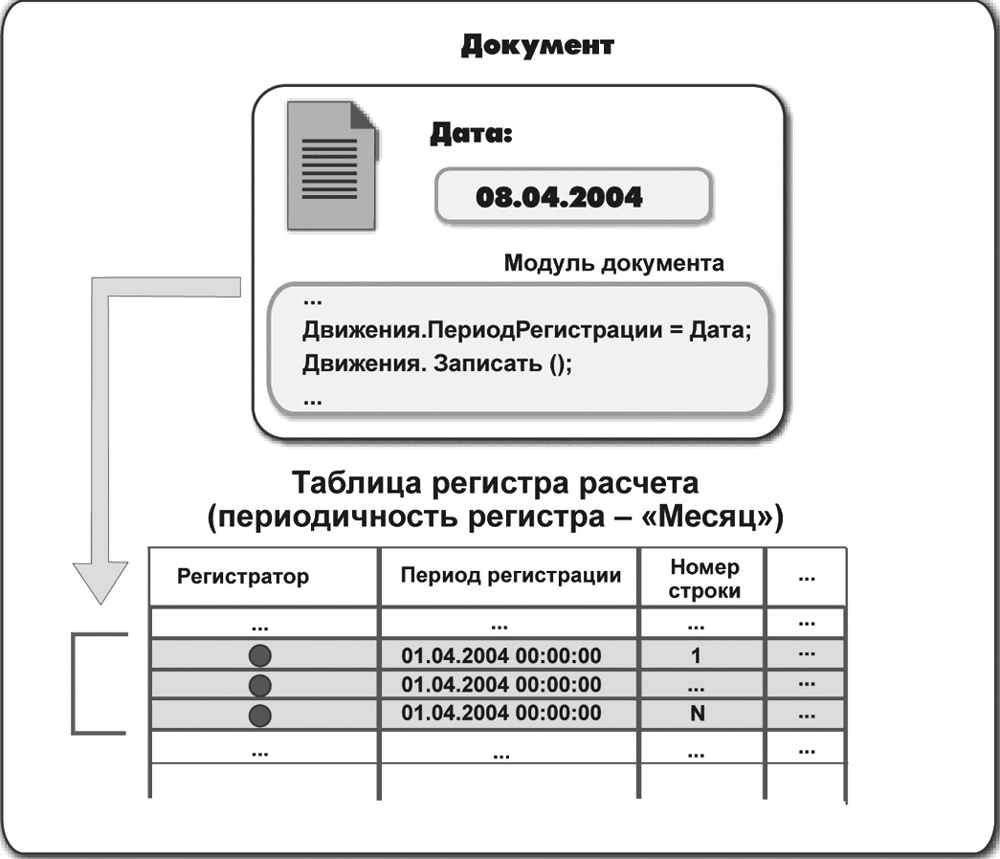

<strong>Рис. 17.6.</strong> Запись данных из документа в регистр расчета видов расчета

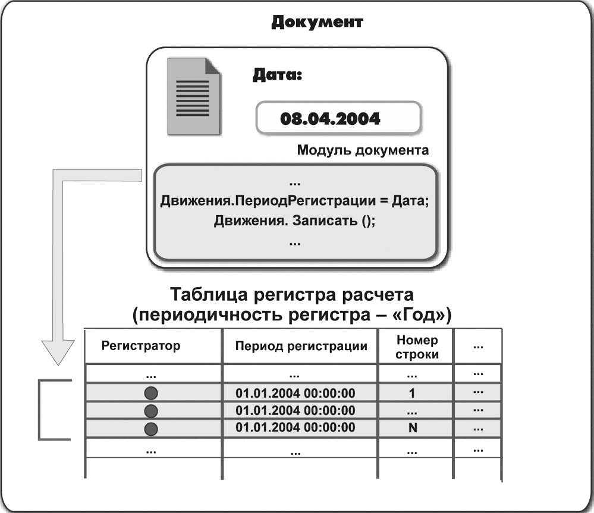

<strong>Рис. 17.7.</strong> Запись данных из документа в регистр расчета видов расчета

<strong>Вытеснение по периоду действия</strong>

Следующей важной особенностью регистра расчета является возможность использования механизма вытеснения одних записей
	другими по периоду действия. 

При этом для каждой записи регистр расчета формирует фактический период действия, который является в общем случае
	совокупностью нескольких периодов, расположенных внутри периода действия (рис. 17.8).

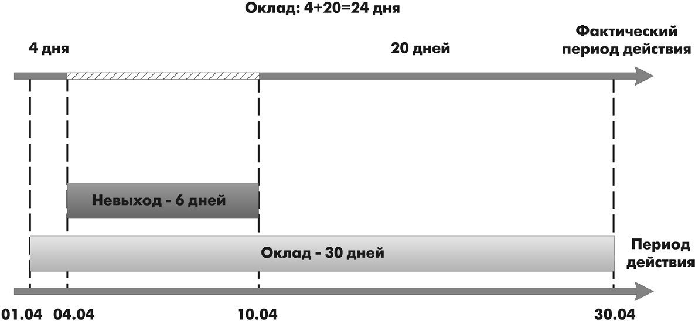

<strong>Рис. 17.8.</strong> Запись расчета «Невыход» вытесняет запись расчета «Оклад» по периоду действия

Если рассмотреть структуру записей таблиц регистра расчета, то после внесения записи о начислении по окладу таблицы
	регистра будут выглядеть следующим образом (таблицы 17.1, 17.2).

<strong>таблица 17.1.</strong> Таблица регистра расчета

<table>
	<tr>
		<td>
<strong>…</strong>
</td>
		<td>
<strong>начало периода действия</strong>
</td>
		<td>
<strong>конец периода действия</strong>
</td>
		<td>
<strong>Вид расчета</strong>
</td>
		<td>
<strong>…</strong>
</td>
	</tr>
	<tr>
		<td>
…
</td>
		<td>
…
</td>
		<td>
…
</td>
		<td>
…
</td>
		<td>
…
</td>
	</tr>
	<tr>
		<td>
…
</td>
		<td>
01.04.2013 00:00:00
</td>
		<td>
30.04.2013 23:59:59
</td>
		<td>
Оклад
</td>
		<td>
…
</td>
	</tr>
	<tr>
		<td>
…
</td>
		<td>
…
</td>
		<td>
…
</td>
		<td>
…
</td>
		<td>
…
</td>
	</tr>
</table>

<strong>таблица 17.2.</strong> Таблица фактического периода действия 

<table>
	<tr>
		<td>
<strong>…</strong>
</td>
		<td>
<strong>начало периода действия</strong>
</td>
		<td>
<strong>конец периода действия</strong>
</td>
		<td>
<strong>Вид расчета</strong>
</td>
		<td>
<strong>…</strong>
</td>
	</tr>
	<tr>
		<td>
…
</td>
		<td>
…
</td>
		<td>
…
</td>
		<td>
…
</td>
		<td>
…
</td>
	</tr>
	<tr>
		<td>
…
</td>
		<td>
01.04.2013 00:00:00
</td>
		<td>
30.04.2013 23:59:59
</td>
		<td>
Оклад
</td>
		<td>
…
</td>
	</tr>
	<tr>
		<td>
…
</td>
		<td>
…
</td>
		<td>
…
</td>
		<td>
…
</td>
		<td>
…
</td>
	</tr>
</table>

После добавления в регистр записи вида расчета Невыход, который вытесняет вид расчета Оклад по периоду действия,
	записи о начислении по окладу примут следующий вид (таблицы 17.3, 17.4).

<strong>таблица 17.3.</strong> Таблица регистра расчета

<table>
	<tr>
		<td>
<strong>…</strong>
</td>
		<td>
<strong>начало периода действия</strong>
</td>
		<td>
<strong>конец периода действия</strong>
</td>
		<td>
<strong>Вид расчета</strong>
</td>
		<td>
<strong>…</strong>
</td>
	</tr>
	<tr>
		<td>
…
</td>
		<td>
…
</td>
		<td>
…
</td>
		<td>
…
</td>
		<td>
…
</td>
	</tr>
	<tr>
		<td>
…
</td>
		<td>
01.04.2013 00:00:00
</td>
		<td>
30.04.2013 23:59:59
</td>
		<td>
Оклад
</td>
		<td>
…
</td>
	</tr>
	<tr>
		<td>
…
</td>
		<td>
04.04.2013 00:00:00
</td>
		<td>
10.04.2013 23:59:59
</td>
		<td>
Невыход
</td>
		<td>
…
</td>
	</tr>
	<tr>
		<td>
…
</td>
		<td>
…
</td>
		<td>
…
</td>
		<td>
…
</td>
		<td>
…
</td>
	</tr>
</table>

<strong>таблица 17.4.</strong> Таблица фактического периода действия

<table>
	<tr>
		<td>
<strong>…</strong>
</td>
		<td>
<strong>начало периода действия</strong>
</td>
		<td>
<strong>конец периода действия</strong>
</td>
		<td>
<strong>Вид расчета</strong>
</td>
		<td>
<strong>…</strong>
</td>
	</tr>
	<tr>
		<td>
…
</td>
		<td>
…
</td>
		<td>
…
</td>
		<td>
…
</td>
		<td>
…
</td>
	</tr>
	<tr>
		<td>
…
</td>
		<td>
01.04.2013 00:00:00
</td>
		<td>
03.04.2013 23:59:59
</td>
		<td>
Оклад
</td>
		<td>
…
</td>
	</tr>
	<tr>
		<td>
…
</td>
		<td>
11.04.2013 00:00:00
</td>
		<td>
31.04.2013 23:59:59
</td>
		<td>
Оклад
</td>
		<td>
…
</td>
	</tr>
	<tr>
		<td>
…
</td>
		<td>
…
</td>
		<td>
…
</td>
		<td>
…
</td>
		<td>
…
</td>
	</tr>
</table>

<strong>Зависимость по базовому периоду</strong>

Другим механизмом, который поддерживает регистр расчета, является зависимость записей по базовому периоду. Этот
	механизм позволяет основывать расчет зависимых (вторичных) записей регистра на данных, полученных в результате
	расчета первичных записей. 

Регистр расчета может поддерживать два вида зависимости от базы: зависимость по периоду действия и зависимость по
	периоду регистрации.

<strong>Зависимость по периоду действия</strong>

Зависимость по периоду действия означает, что при анализе базовых записей будут выбираться те, для которых найдено
	пересечение их фактического периода действия и указанного базового периода. 

Например, в начале апреля производится расчет зарплаты за март. Премия за март должна быть начислена исходя из оплаты
	по окладу за март. В этом случае, как правило, используется зависимость по периоду действия (рис. 17.9).

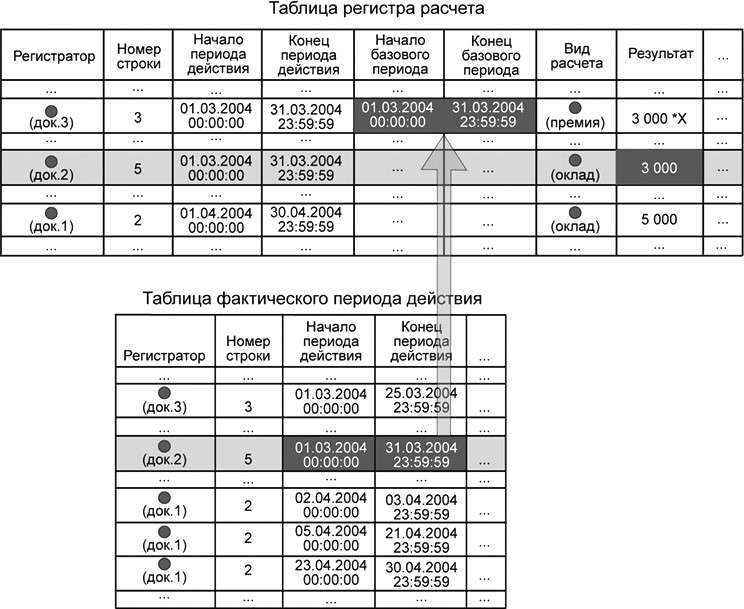

<strong>Рис. 17.9.</strong> Зависимость по периоду действия

Следует сделать два замечания к приведенному рисунку.

Поля Начало базового периода и Конец базового периода имеют смысл только для записей тех видов расчета, для которых
	определена зависимость по базовому периоду (в нашем случае для записи расчета премии).

Значение базы, которая будет получена от конкретной влияющей записи, в общем случае не равно результату, который
	содержит эта запись. База будет рассчитана пропорционально тому, какую часть от фактического интервала влияющей
	записи составляет перекрывающийся с указанным базовым периодом участок. При этом будут использованы данные графика,
	связанного с записью.

<strong>Зависимость по периоду регистрации</strong>

Зависимость по периоду регистрации означает, что при анализе базовых записей будут выбираться те, которые попадают в
	указанный базовый период значением своего поля Период регистрации. 

В качестве примера можно привести расчет штрафов при начислении зарплаты за март. В качестве базы для расчета суммы
	штрафов должны браться записи о прогулах, зарегистрированные в марте месяце (это могут быть как записи о мартовских
	прогулах, так и записи о прогулах в феврале). В этом случае, как правило, используется зависимость по периоду
	регистрации (рис. 17.10).

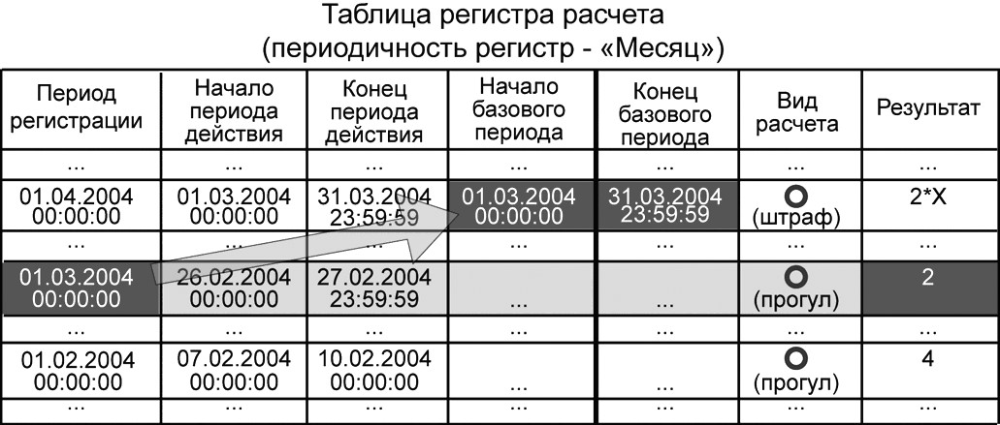

<strong>Рис. 17.10.</strong> Зависимость по периоду регистрации

Важной заключительной особенностью регистра расчета является его связь с планом видов расчета. Именно на основе этой
	связи работают механизмы вытеснения по периоду действия и зависимости по базовому периоду, поскольку в плане видов
	расчета описано взаимное влияние видов расчета друг на друга.

У регистра расчета могут существовать подчиненные объекты <em>Перерасчет</em>. Они предназначены для регистрации
	фактов появления в регистре записей, влияющих на результат расчета уже существующих записей регистра. Объект
	конфигурации Перерасчет может иметь несколько измерений, каждое из которых устанавливает связь между измерениями
	данного регистра расчета и влияющих регистров расчета. В частном случае это может быть один и тот же регистр. 

В таблице, созданной в базе данных на основе объекта конфигурации Перерасчет, платформа хранит информацию о том,
	какие записи регистра подлежат перерасчету. Таблицы перерасчета заполняются автоматически как на основании записей
	регистров расчета, затронутых ведущими видами расчета, так и на основании записей регистра расчета, для которых
	изменился фактический период действия. Исходя из этой информации, разработчик может принимать решение о
	необходимости перерасчета записей регистра.

Последним замечанием, которое следует сделать, говоря о регистре расчета, является возможность установки связи
	регистра расчета с графиком. Такой график должен представлять собой регистр сведений (непериодический, с
	обязательным измерением типа Дата и ресурсом типа Число), в котором содержится временная схема исходных данных,
	участвующих в расчетах. Измерениями этого графика могут быть, например, график работы (ссылка на справочник) и дата,
	а ресурсом – количество рабочих часов в этой дате. В этом случае можно будет связать запись регистра расчета с
	какимлибо конкретным графиком работы (указав в качестве реквизита записи ссылку на справочник ВидыГрафиковРаботы) и
	в дальнейшем средствами встроенного языка получать информацию о количестве рабочих часов в периоде действия,
	фактическом периоде действия или периоде регистрации этой записи.

<strong>Добавление регистра расчета</strong>

Прежде чем мы начнем создавать объект конфигурации Регистр расчета Начисления, нам потребуется создать два
	дополнительных объекта конфигурации:

<ul>
	<li>регистр сведений ГрафикиРаботы,</li>
	<li>справочник ВидыГрафиковРаботы.</li>
</ul>

Справочник понадобится нам для хранения информации о том, какие графики работы существуют в ООО «На все руки мастер»,
	а регистр сведений – для указания того, какие дни в месяце являются рабочими, поскольку сумма оплаты по окладу будет
	рассчитываться исходя из того, сколько дней отработал сотрудник в расчетном месяце.

<strong>В режиме «Конфигуратор»</strong>

Откроем конфигуратор и создадим новый объект конфигурации Справочник с именем ВидыГрафиковРаботы. 

На закладке Подсистемы укажем, что справочник будет отображаться в подсистеме РасчетЗарплаты.

На закладке Прочее создадим для справочника два предопределенных графика работы (рис. 17.11) – ГрафикАдминистрации и
	ГрафикМа-

<strong>Рис. 17.11.</strong> Предопределенные графики работы

После этого создадим объект конфигурации Регистр сведений с именем ГрафикиРаботы. 

Этот регистр будет иметь два измерения:

 ГрафикРаботы, тип СправочникСсылка.ВидыГрафиковРаботы;  Дата, тип Дата.

Затем создадим единственный ресурс регистра – Значение с типом Число, длиной 1. На закладке Подсистемы укажем, что
	регистр сведений будет отображаться в подсистеме РасчетЗарплаты. Теперь заполним регистр сведений ГрафикиРаботы
	данными о рабочих днях июля графика мастеров. 

<strong>В режиме «1С:Предприятие»</strong>

Запустим «1С:Предприятие» в режиме отладки и в разделе Расчет зарплаты выполним команду Графики работы. Поочередно
	создадим 31 запись в регистре. 

Чтобы проще выполнить эту довольно однообразную работу, воспользуйтесь возможностью добавления элементов в регистр
	копированием текущего элемента (команда Еще  Скопировать (F9)). В качестве измерения ГрафикРаботы нашего регистра
	выберем предопределенный элемент График мастеров справочника ВидыГрафи- ковРаботы. В качестве ресурса Значение у
	рабочих дней проставим 1, а у выходных – 0 (рис. 17.12).

<strong>Рис. 17.12.</strong> Записи регистра «Графики работы»

Теперь все готово для создания регистра расчета. 

<strong>В режиме «Конфигуратор»</strong>

Добавим новый объект конфигурации Регистр расчета с именем 

Начисления. Зададим Расширенное представление списка как Движения в регистре Начисления. В качестве плана видов
	расчета, используемого регистром, выберем ОсновныеНачисления. 

Установим, что регистр будет использовать период действия, график будет задаваться в регистре сведений ГрафикиРаботы,
	значение графика будет находиться в ресурсе Значение, а дата графика – в измерении Дата. 

Укажем, что регистр расчета будет использовать базовый период и периодичность регистра будет Месяц (рис. 17.13).

На закладке Подсистемы укажем, что регистр расчета будет отображаться в подсистеме РасчетЗарплаты.

Затем перейдем на закладку Данные и создадим (рис. 17.14):

<ul>
	<li>измерение Сотрудник, тип СправочникСсылка.Сотрудники, Базовое;</li>
	<li>ресурс Результат, тип Число, длина 15, точность 2,</li>
	<li>реквизит ГрафикРаботы, тип СправочникСсылка.ВидыГрафиковРаботы, в разделе свойств Данные зададим свойство Связь
		с графиком по измерению ГрафикРаботы;
	</li>
	<li>реквизит ИсходныеДанные, тип Число, длина 15, точность 2.</li>
</ul>

Реквизит ГрафикРаботы мы будем использовать для того, чтобы связать запись регистра с используемым графиком работы, а
	реквизит ИсходныеДанные – чтобы хранить в нем данные, которые могут понадобиться при расчете или перерасчете (в
	нашем примере это будет расчет оклада).

<strong>Рис. 17.14.</strong> Измерения, ресурсы и реквизиты регистра расчета

Теперь перейдем на закладку Перерасчеты. Создадим объект конфигурации Перерасчет, который так и назовем –
	Перерасчет. 

У него будет единственное измерение – Сотрудник, для которого в разделе Связь мы укажем:

<ul>
	<li>измерение регистра – Сотрудник;</li>
	<li>данные ведущих регистров – выберем то же самое измерение Сотрудник регистра расчета Начисления (рис. 17.15).
	</li>
</ul>

В заключение отредактируем командный интерфейс, чтобы в разделе Расчет зарплаты была доступна команда для просмотра
	записей регистра расчета. 

Для этого в дереве объектов конфигурации выделим подсистему РасчетЗарплаты, вызовем контекстное меню и выполним
	команду Открыть командный интерфейс. 

В открывшемся окне командного интерфейса подсистемы в группе Панель навигации.Обычное включим видимость у команды
	Начисления.

На этом создание объекта конфигурации Регистр расчета Начисления завершено.

<h1>Лабораторная работа № 28 Основы работы со справочниками</h1>

<strong>Порядок выполнения работы </strong>

1. Ознакомьтесь с теоретическими основами в настоящих указаниях и конспектах лекций. 

2. Получите задание у преподавателя. 

3. Сделайте скриншоты (кнопка клавиатуры PrtSc) выполненных заданий в текстовом (Word) файле <em>Фамилия_ЛР</em>

4. Составьте отчет по лабораторной работе. 

5. Отчитайте работу преподавателю.

<strong>Добавление документа о начислениях</strong>

Для того чтобы иметь возможность регистрировать в базе данных начисления, производимые сотрудникам ООО «На все руки
	мастер», нам понадобится специальный документ.

<strong>В режиме «Конфигуратор»</strong>

Откроем конфигуратор и добавим новый объект конфигурации Документ. Назовем его НачисленияСотрудникам. Зададим
	представление объекта как Начисление сотрудникам. На закладке Нумерация установим:

<ul>
	<li>Тип номера – Число,</li>
	<li>Длина номера – 5 (рис. 18.1).</li>
</ul>

На закладке Подсистемы укажем, что документ будет отображаться в подсистеме РасчетЗарплаты.

На закладке Данные укажем, что этот документ будет иметь табличную часть Начисления, содержащую следующие
	реквизиты:

<ul>
	<li>Сотрудник, тип СправочникСсылка.Сотрудники;</li>
	<li>ГрафикРаботы, тип СправочникСсылка.ВидыГрафиковРаботы;</li>
	<li>ДатаНачала, тип Дата;</li>
	<li>ДатаОкончания, тип Дата;</li>
	<li>ВидРасчета, тип ПланВидовРасчетаСсылка.ОсновныеНачисления;  Начислено, Число, длина 15, точность 2.</li>
</ul>

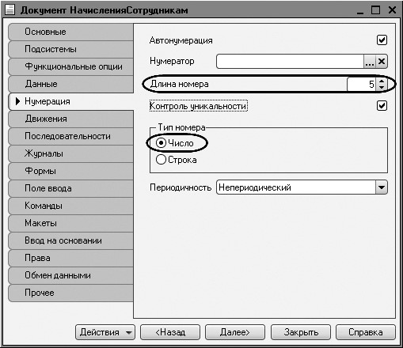

<strong>Рис. 18.1.</strong> Нумерация документа

Реквизиты ДатаНачала и ДатаОкончания понадобятся нам для того, чтобы задавать период, в котором должна действовать
	запись расчета.

На закладке Движения запретим оперативное проведение документа. 

Отметим, что документ будет создавать движения по регистру расчета Начисления, и запустим конструктор движений (рис.
	18.2).

<strong>Рис. 18.2.</strong> Движения документа

В окне конструктора выберем табличную часть Начисления и нажмем Заполнить выражения. 

Для реквизитов ПериодДействияКонец и БазовыйПериодКонец укажем выражение
	КонецДня(ТекСтрокаНачисления.ДатаОкончания). 

Для поля ПериодРегистрации укажем выражение Дата.

Реквизиту ИсходныеДанные поставим в соответствие реквизит табличной части Начислено, а для ресурса Результат оставим
	пустое выражение, так как мы будем его потом рассчитывать (рис. 18.3).

<strong>Рис. 18.3.</strong> Движения документа «НачисленияСотрудникам» по регистру расчета

Нажмем OK и посмотрим текст обработчика, созданный конструктором (листинг 18.1). <strong>листинг 18.1.</strong> Текст
	обработчика, созданный конструктором движений

<table>
	<tr>
		<td>
Процедура ОбработкаПроведения(Отказ, Режим)
</td>
	</tr>
	<tr>
		<td></td>
	</tr>
	<tr>
		<td></td>
	</tr>
	<tr>
		<td></td>
	</tr>
	<tr>
		<td>
//{{__КОНСТРУКТОР_ДВИЖЕНИЙ_РЕГИСТРОВ
</td>
	</tr>
	<tr>
		<td></td>
	</tr>
	<tr>
		<td>
// Данный фрагмент построен конструктором
</td>
	</tr>
	<tr>
		<td></td>
	</tr>
	<tr>
		<td>
// При повторном использовании конструктора 
</td>
	</tr>
	<tr>
		<td></td>
	</tr>
	<tr>
		<td>
// внесенные вручную изменения будут утеряны!!!
</td>
	</tr>
</table>

Движения.Начисления.Записывать = Истина;

// Регистр Начисления

<table>
	<tr>
		<td>
Для Каждого ТекСтрокаНачисления Из Начисления Цикл
</td>
	</tr>
	<tr>
		<td></td>
	</tr>
	<tr>
		<td></td>
	</tr>
	<tr>
		<td></td>
	</tr>
	<tr>
		<td>
Движение = Движения.Начисления.Добавить();
</td>
	</tr>
	<tr>
		<td></td>
	</tr>
	<tr>
		<td>
Движение.Сторно = Ложь;
</td>
	</tr>
	<tr>
		<td></td>
	</tr>
	<tr>
		<td>
Движение.ВидРасчета = ТекСтрокаНачисления.ВидРасчета;
</td>
	</tr>
	<tr>
		<td></td>
	</tr>
	<tr>
		<td>
Движение.ПериодДействияНачало = ТекСтрокаНачисления.ДатаНачала;
</td>
	</tr>
	<tr>
		<td></td>
	</tr>
	<tr>
		<td>
Движение.ПериодДействияКонец = КонецДня(ТекСтрокаНачисления.ДатаОкончания);
</td>
	</tr>
	<tr>
		<td></td>
	</tr>
	<tr>
		<td>
Движение.ПериодРегистрации = Дата;
</td>
	</tr>
	<tr>
		<td></td>
	</tr>
	<tr>
		<td>
Движение.БазовыйПериодНачало = ТекСтрокаНачисления.ДатаНачала;
</td>
	</tr>
	<tr>
		<td></td>
	</tr>
	<tr>
		<td>
Движение.БазовыйПериодКонец = КонецДня(ТекСтрокаНачисления.ДатаОкончания);
</td>
	</tr>
	<tr>
		<td></td>
	</tr>
	<tr>
		<td>
Движение.Сотрудник = ТекСтрокаНачисления.Сотрудник;
</td>
	</tr>
	<tr>
		<td></td>
	</tr>
	<tr>
		<td>
Движение.ГрафикРаботы = ТекСтрокаНачисления.ГрафикРаботы;
</td>
	</tr>
	<tr>
		<td></td>
	</tr>
	<tr>
		<td>
Движение.ИсходныеДанные = ТекСтрокаНачисления.Начислено;
</td>
	</tr>
	<tr>
		<td></td>
	</tr>
	<tr>
		<td></td>
	</tr>
	<tr>
		<td></td>
	</tr>
	<tr>
		<td>
КонецЦикла;
</td>
	</tr>
	<tr>
		<td></td>
	</tr>
	<tr>
		<td>
//}}__КОНСТРУКТОР_ДВИЖЕНИЙ_РЕГИСТРОВ 
</td>
	</tr>
	<tr>
		<td></td>
	</tr>
	<tr>
		<td></td>
	</tr>
	<tr>
		<td></td>
	</tr>
	<tr>
		<td>
КонецПроцедуры
</td>
	</tr>
</table>

Прокомментируем этот код. 

В целом в нем нет ничего принципиально нового по сравнению с прежними обработчиками проведения документов, создающими
	движения регистров. 

Напомним лишь, что Начисления – имя регистра расчета, и в выражениях Движения.Начисления.Записывать() и
	Движения.Начисления.Добавить() мы обращаемся к методам набора записей этого регистра. 

В строке Для Каждого ТекСтрокаНачисления Из Начисления Цикл мы обращаемся по имени (Начисления) к табличной части
	нашего документа и организуем цикл обхода этой табличной части. 

В цикле мы добавляем к движениям новую запись и присваиваем ее полям значения из табличной части документа. 

Для присвоения значений полям ПериодДействияКонец, БазовыйПериодКонец мы используем функцию КонецДня(). Аналогичным
	образом мы поступали при создании отчетов, чтобы последний день периода попал в отчет.

В заключение отредактируем командный интерфейс, чтобы в разделе Расчет зарплаты была доступна команда создания новых
	документов. 

Для этого в дереве объектов конфигурации выделим подсистему РасчетЗарплаты, вызовем контекстное меню и выполним
	команду Открыть командный интерфейс. 

В группе Панель действий.Создать включим видимость у команды Начисление сотрудникам: создать (рис. 18.4).

<strong>В режиме «1С:Предприятие»</strong>

Запустим «1С:Предприятие» в режиме отладки и посмотрим, как работает наш документ. 

В разделе Расчет зарплаты выполним команду Начисление сотрудникам и начислим оклад за июль всем сотрудникам ООО «На
	все руки мастер» (рис. 18.5).

<strong>Рис. 18.5.</strong> Документ «Начисления сотрудникам № 1»

Проведем документ и посмотрим, какие движения он сформировал в регистре Начисления (рис. 18.6, 18.7).

<strong>Рис. 18.6.</strong> Движения документа «Начисление сотрудникам № 1» в регистре расчета «Начисления»

<strong>Рис. 18.7.</strong> Движения документа «Начисление сотрудникам № 1» в регистре расчета «Начисления»

Обратите внимание на то, что платформа привела период регистрации каждой записи к началу периода регистра расчета –
	началу месяца (в обработчике проведения мы указывали значение даты документа – 24.07.2013).

Кроме этого заметьте, что в каждой записи мы сохранили в реквизите ИсходныеДанные размер оклада сотрудника, введенный
	в документе, чтобы в дальнейшем рассчитать сумму оплаты по окладу.

Для дальнейшего изучения работы регистра расчета нам понадобится служебный отчет, с помощью которого мы сможем
	посмотреть содержимое записей перерасчета.

<strong>Иллюстрация механизмов вытеснения и зависимости от базы</strong>

<strong>Отчет по перерасчетам</strong>

<strong>В режиме «Конфигуратор»</strong>

Создадим новый объект конфигурации Отчет. Назовем его Перерасчет. Создадим основную схему компоновки данных, добавим
	источник данных – запрос и откроем конструктор запроса. 

В списке База данных раскроем ветвь Перерасчеты и из виртуальной таблицы перерасчета Начисления.Перерасчет выберем
	все поля:

<ul>
	<li>ОбъектПерерасчета,</li>
	<li>ВидРасчета,</li>
</ul>

<strong>Рис. 18.8.</strong> Поля и таблицы запроса

На этом создание запроса закончено, нажмем ОK.

Перейдем на закладку Настройки и добавим группировку детальных записей. На закладке Выбранные поля выберем для вывода
	в отчет поля ОбъектПерерасчета, ВидРасчета и Сотрудник. 

На этом создание схемы компоновки данных закончено, закроем ее. 

В окне редактирования объекта конфигурации Отчет Перерасчет на закладке Подсистемы укажем, что отчет будет
	принадлежать подсистеме РасчетЗарплаты. 

<strong>Зависимость по базовому периоду </strong>

<strong>В режиме «1С:Предприятие»</strong>

Если сейчас мы выполним отчет в режиме 1С:Предприятие, то мы увидим, что ни один перерасчет еще не выполнялся.

Поэтому создадим новый документ Начисление сотрудникам 

№ 2, в котором начислим премию за июль Гусакову и Деловому 

(рис. 18.9).

<strong>Рис. 18.9.</strong> Документ «Начисления сотрудникам № 2»

Этим документом мы зафиксируем тот факт, что сотрудникам Гусакову и Деловому нужно начислить премию по итогам работы
	за июль. Поскольку размер премии нам неизвестен (он будет рассчитываться по некоторому алгоритму), поле Начислено мы
	оставляем пустым. Нажмем Провести и закрыть.

Теперь снова откроем документ Начисление сотрудникам № 1 и изменим оклад Гусакова с 10 000 на 7 000. Нажмем Провести
	и<strong> </strong>закрыть. 

Сформируем отчет Перерасчет (рис. 18.10).

<strong>Рис. 18.10.</strong> Отчет «Перерасчет»

Как видите, отчет теперь содержит какие-то данные. 

В самом деле вид расчета Премия зависит у нас по базовому периоду от вида расчета Оклад. Как только мы изменили
	существовавшие в регистре записи по виду расчета Оклад, платформа сразу же сформировала набор записей перерасчета,
	которые должны быть рассчитаны заново, так как изменилась их база.

Вы можете спросить: почему в перерасчет попали записи как про Делового, так и про Гусакова, хотя оклад мы меняли
	только Гусакову? 

Дело в том, что платформа не отслеживает конкретные изменения, которые пользователь внес в записи документа. Она
	отслеживает лишь факт изменения набора записей регистра расчета в результате проведения (перепроведения)
	документа. 

Поэтому в набор записей перерасчета она включает информацию обо ВСЕХ записях регистра, значение ресурсов которых
	МОЖЕТ измениться в результате перепроведения документа, создавшего базовые записи регистра.

Перепроведем документ Начисления сотрудникам № 2 (которым мы начисляли премию) и сформируем отчет Перерасчет. 

Он снова не содержит никаких данных – система отметила тот факт, что мы «пересчитали» зависимые записи, и очистила
	таблицу перерасчета. 

На этом примере мы с вами познакомились с работой механизма поддержки зависимости по базовому периоду у регистра
	расчета.

<strong>Вытеснение по периоду действия</strong>

<strong>В режиме «1С:Предприятие»</strong>

Теперь посмотрим, как работает механизм вытеснения по периоду действия. 

Для этого нам понадобится создать документ Начисления сотрудникам № 3 (рис. 18.11).

Этим документом мы зафиксируем тот факт, что Гусаков не выходил на работу с 1 по 10 июля. 

Очевидно, что в этом случае потребуется пересчитать его оплату по окладу и как следствие начисленную премию. 

<strong>Рис. 18.11.</strong> Документ «Начисления сотрудникам № 3»

Нажмем Провести и закрыть и затем сформируем отчет Перерасчет (рис. 18.12).

Как вы видите, в перерасчет попала запись о начислении оклада Гусакову. Это явилось результатом работы механизма
	вытеснения по периоду действия, ведь вид расчета Невыход вытесняет у нас вид расчета Оклад. 

Обратите внимание, что в перерасчет попала и запись о начислении премии Гусакову. 

Если вы помните, при создании предопределенных видов расчета мы указали, что результат вида расчета Премия будет
	зависеть от изменения результата вида расчета Невыход. Эта зависимость косвенная, но поскольку явно указали такую
	зависимость, платформа ее отследила.

Перепроведем документы Начисления сотрудникам № 1 и № 2 и убедимся, что таблица перерасчета очистилась.

<strong>Процедура расчета записей регистра расчета</strong>

<strong>В режиме «Конфигуратор»</strong>

До сих пор мы с вами просто заносили в регистр расчета Начисления записи о том, что необходимо выполнить какой-либо
	вид расчета. Но каким именно образом получать эти результаты, мы не говорили. 

Теперь настало время описать алгоритмы формирования различных видов расчетов.

Поскольку эти алгоритмы нужно будет использовать не только в документе Начисление сотрудникам, удобнее всего будет
	разместить их в отдельном общем модуле. 

Откроем в конфигураторе текст обработчика проведения документа НачисленияСотрудникам и добавим в него после
	завершения создания движений в регистре Начисления вызов процедуры РассчитатьНачисления() из общего модуля
	ПроведениеРасчетов (листинг 18.2).

<strong>листинг 18.2.</strong> Обработчик проведения документа 

«НачисленияСотрудникам»

<table>
	<tr>
		<td>
Процедура ОбработкаПроведения(Отказ, Режим)
</td>
	</tr>
	<tr>
		<td></td>
	</tr>
	<tr>
		<td>
 …
</td>
	</tr>
	<tr>
		<td></td>
	</tr>
	<tr>
		<td>
КонецЦикла;
</td>
	</tr>
	<tr>
		<td></td>
	</tr>
	<tr>
		<td>
//}}__КОНСТРУКТОР_ДВИЖЕНИЙ_РЕГИСТРОВ
</td>
	</tr>
	<tr>
		<td></td>
	</tr>
	<tr>
		<td></td>
	</tr>
	<tr>
		<td></td>
	</tr>
	<tr>
		<td>
<strong>// Записываем движения регистров</strong>
</td>
	</tr>
	<tr>
		<td></td>
	</tr>
	<tr>
		<td>
<strong>Движения.Начисления.Записать();</strong>
</td>
	</tr>
	<tr>
		<td></td>
	</tr>
	<tr>
		<td></td>
	</tr>
	<tr>
		<td></td>
	</tr>
	<tr>
		<td>
<strong>// Получим список всех сотрудников, содержащихся в документе</strong>
</td>
	</tr>
	<tr>
		<td></td>
	</tr>
	<tr>
		<td>
<strong>Запрос = Новый Запрос(</strong>
</td>
	</tr>
	<tr>
		<td></td>
	</tr>
	<tr>
		<td>
&quot;<strong>ВЫБРАТЬ РАЗЛИЧНЫЕ</strong>
</td>
	</tr>
	<tr>
		<td></td>
	</tr>
	<tr>
		<td>
<strong>| НачисленияСотрудникамНачисления.Сотрудник</strong>
</td>
	</tr>
	<tr>
		<td></td>
	</tr>
	<tr>
		<td>
<strong>|ИЗ</strong>
</td>
	</tr>
	<tr>
		<td></td>
	</tr>
	<tr>
		<td>
<strong>| Документ.НачисленияСотрудникам.Начисления КАК НачисленияСотрудникамНачисления</strong>
</td>
	</tr>
	<tr>
		<td></td>
	</tr>
	<tr>
		<td>
<strong> |</strong>
</td>
	</tr>
	<tr>
		<td></td>
	</tr>
	<tr>
		<td>
<strong>|ГДЕ</strong>
</td>
	</tr>
	<tr>
		<td></td>
	</tr>
	<tr>
		<td>
<strong>| НачисленияСотрудникамНачисления.Ссылка = &amp;ТекущийДокумент</strong>&quot;<strong>);</strong>
		
</td>
	</tr>
	<tr>
		<td></td>
	</tr>
	<tr>
		<td></td>
	</tr>
	<tr>
		<td></td>
	</tr>
	<tr>
		<td>
<strong>Запрос.УстановитьПараметр(</strong>&quot;<strong>ТекущийДокумент</strong>&quot;<strong>,
			Ссылка);</strong>
</td>
	</tr>
	<tr>
		<td></td>
	</tr>
	<tr>
		<td></td>
	</tr>
	<tr>
		<td></td>
	</tr>
	<tr>
		<td>
<strong>// Сформируем список сотрудников</strong>
</td>
	</tr>
	<tr>
		<td></td>
	</tr>
	<tr>
		<td>
<strong>ТаблЗнач = Запрос.Выполнить().Выгрузить();</strong>
</td>
	</tr>
	<tr>
		<td></td>
	</tr>
	<tr>
		<td>
<strong>МассивСотрудников =
			ТаблЗнач.ВыгрузитьКолонку(</strong>&quot;<strong>Сотрудник</strong>&quot;<strong>);</strong>
</td>
	</tr>
</table>

<strong>// Вызов процедуры РассчитатьНачисления из общего модуля</strong>

<table>
	<tr>
		<td>
<strong>ПроведениеРасчетов.РассчитатьНачисления(Движения.Начисления, </strong>
</td>
	</tr>
	<tr>
		<td></td>
	</tr>
	<tr>
		<td>
<strong>ПланыВидовРасчета.ОсновныеНачисления.Оклад, МассивСотрудников);</strong>
</td>
	</tr>
	<tr>
		<td></td>
	</tr>
	<tr>
		<td>
<strong>Движения.Начисления.Записать( , Истина);</strong>
</td>
	</tr>
	<tr>
		<td></td>
	</tr>
	<tr>
		<td></td>
	</tr>
	<tr>
		<td></td>
	</tr>
	<tr>
		<td>
<strong>ПроведениеРасчетов.РассчитатьНачисления(Движения.Начисления, ПланыВидовРасчета.</strong>
</td>
	</tr>
	<tr>
		<td></td>
	</tr>
	<tr>
		<td>
<strong>ОсновныеНачисления.Премия, МассивСотрудников);</strong>
</td>
	</tr>
	<tr>
		<td></td>
	</tr>
	<tr>
		<td>
<strong>Движения.Начисления.Записать( , Истина);</strong>
</td>
	</tr>
	<tr>
		<td></td>
	</tr>
	<tr>
		<td></td>
	</tr>
	<tr>
		<td></td>
	</tr>
	<tr>
		<td>
КонецПроцедуры
</td>
	</tr>
</table>

Обратите внимание: при проведении документа мы сначала записываем движения, сформированные документом, в регистр
	(Движения.Начисления.Записать()), а затем передаем этот набор записей регистра в процедуру расчета
	РассчитатьНачисления(), которую мы создадим в общем модуле ПроведениеРасчетов. 

Эту процедуру мы вызываем сначала для расчета первичных записей (Оклад), а затем для расчета вторичных (Премия). 

Процедура расчета на основе описанных в ней алгоритмов и данных, содержащихся в записях регистра, должна сформировать
	значения ресурсов регистра.

После того как ресурсы будут рассчитаны, мы перезаписываем набор записей регистра без формирования записей
	перерасчета (второй параметр в методе Записать() – Истина). 

Перед вызовом процедуры из общего модуля мы с помощью запроса формируем массив сотрудников, перечисленных в
	документе, чтобы передать его в вызываемую процедуру. 

Для параметра запроса ТекущийДокумент устанавливаем значение стандартного реквизита документа – Ссылка. Используя
	метод запроса Запрос.Выполнить().Выгрузить(), выгружаем результат запроса в таблицу значений (переменную ТаблЗнач).
	Затем формируем массив МассивСотрудников, содержащий колонку Сотрудник из этой таблицы значений.

Теперь создадим в ветке Общие новый общий модуль ПроведениеРасчетов. 

Установим флажок Вызов сервера для видимости его экспортных процедур и функций (рис. 18.13).

Добавим в него заготовку процедуры РассчитатьНачисления (листинг 18.3).

<strong>листинг 18.3.</strong> Заготовка процедуры «РассчитатьНачисления»

<table>
	<tr>
		<td>
Процедура РассчитатьНачисления(НаборЗаписейРегистра, ТребуемыйВидРасчета, 
</td>
	</tr>
	<tr>
		<td></td>
	</tr>
	<tr>
		<td>
СписокСотрудников) Экспорт
</td>
	</tr>
	<tr>
		<td></td>
	</tr>
	<tr>
		<td></td>
	</tr>
	<tr>
		<td></td>
	</tr>
	<tr>
		<td>
Регистратор = НаборЗаписейРегистра.Отбор.Регистратор.Значение; 
</td>
	</tr>
	<tr>
		<td></td>
	</tr>
	<tr>
		<td></td>
	</tr>
	<tr>
		<td></td>
	</tr>
	<tr>
		<td>
// Рассчитать первичные записи
</td>
	</tr>
	<tr>
		<td></td>
	</tr>
	<tr>
		<td>
Если ТребуемыйВидРасчета = ПланыВидовРасчета.ОсновныеНачисления.Оклад Тогда
</td>
	</tr>
	<tr>
		<td></td>
	</tr>
	<tr>
		<td></td>
	</tr>
	<tr>
		<td></td>
	</tr>
	<tr>
		<td>
// Рассчитать вторичные записи
</td>
	</tr>
	<tr>
		<td></td>
	</tr>
	<tr>
		<td>
ИначеЕсли ТребуемыйВидРасчета = ПланыВидовРасчета.ОсновныеНачисления.Премия Тогда
</td>
	</tr>
	<tr>
		<td></td>
	</tr>
	<tr>
		<td></td>
	</tr>
	<tr>
		<td></td>
	</tr>
	<tr>
		<td>
КонецЕсли;
</td>
	</tr>
	<tr>
		<td></td>
	</tr>
	<tr>
		<td></td>
	</tr>
	<tr>
		<td></td>
	</tr>
	<tr>
		<td>
КонецПроцедуры 
</td>
	</tr>
</table>

Алгоритм расчета начислений будет различным при расчете первичных (вид расчета – Оклад) и вторичных записей (вид
	расчета – Премия), и каждая из его частей будет находиться в своей ветке условия Если...

При расчете первичных записей нам понадобятся данные графика из регистра расчета, поэтому добавим в первую ветку
	условия запроса по виртуальной таблице регистра расчета РегистрРасчета.Начис- ления.ДанныеГрафика (листинг
	18.4).

<strong>листинг 18.4.</strong> Изменение процедуры «РассчитатьНачисления»

Процедура РассчитатьНачисления(НаборЗаписейРегистра, ТребуемыйВидРасчета, 

<table>
	<tr>
		<td>
СписокСотрудников) Экспорт
</td>
	</tr>
	<tr>
		<td></td>
	</tr>
	<tr>
		<td></td>
	</tr>
	<tr>
		<td></td>
	</tr>
	<tr>
		<td>
Регистратор = НаборЗаписейРегистра.Отбор.Регистратор.Значение; 
</td>
	</tr>
	<tr>
		<td></td>
	</tr>
	<tr>
		<td></td>
	</tr>
	<tr>
		<td></td>
	</tr>
	<tr>
		<td>
// Рассчитать первичные записи
</td>
	</tr>
	<tr>
		<td></td>
	</tr>
	<tr>
		<td>
Если ТребуемыйВидРасчета = ПланыВидовРасчета.ОсновныеНачисления.Оклад Тогда
</td>
	</tr>
	<tr>
		<td></td>
	</tr>
	<tr>
		<td></td>
	</tr>
	<tr>
		<td></td>
	</tr>
	<tr>
		<td>
<strong>Запрос = Новый Запрос;</strong>
</td>
	</tr>
	<tr>
		<td></td>
	</tr>
	<tr>
		<td>
<strong>Запрос.Текст = </strong>
</td>
	</tr>
	<tr>
		<td></td>
	</tr>
	<tr>
		<td>
<strong> </strong>&quot;<strong>ВЫБРАТЬ</strong>
</td>
	</tr>
	<tr>
		<td></td>
	</tr>
	<tr>
		<td>
<strong>| НачисленияДанныеГрафика.ЗначениеПериодДействия КАК Норма,</strong>
</td>
	</tr>
	<tr>
		<td></td>
	</tr>
	<tr>
		<td>
<strong>| НачисленияДанныеГрафика.ЗначениеФактическийПериодДействия КАК Факт,</strong>
</td>
	</tr>
	<tr>
		<td></td>
	</tr>
	<tr>
		<td>
<strong>| НачисленияДанныеГрафика.НомерСтроки КАК НомерСтроки</strong>
</td>
	</tr>
	<tr>
		<td></td>
	</tr>
	<tr>
		<td>
<strong>|ИЗ</strong>
</td>
	</tr>
	<tr>
		<td></td>
	</tr>
	<tr>
		<td>
<strong>| РегистрРасчета.Начисления.ДанныеГрафика(Регистратор = &amp;Регистратор И </strong>
</td>
	</tr>
	<tr>
		<td></td>
	</tr>
	<tr>
		<td>
<strong>| ВидРасчета = &amp;ВидРасчета И Сотрудник В (&amp;СписокСотрудников)) </strong>
</td>
	</tr>
	<tr>
		<td></td>
	</tr>
	<tr>
		<td>
<strong>| КАК НачисленияДанныеГрафика</strong>&quot;<strong>;</strong>
</td>
	</tr>
	<tr>
		<td></td>
	</tr>
	<tr>
		<td></td>
	</tr>
	<tr>
		<td></td>
	</tr>
	<tr>
		<td>
<strong>Запрос.УстановитьПараметр(</strong>&quot;<strong>Регистратор</strong>&quot;<strong>,
			Регистратор);</strong>
</td>
	</tr>
	<tr>
		<td></td>
	</tr>
	<tr>
		<td>
<strong>Запрос.УстановитьПараметр(</strong>&quot;<strong>ВидРасчета</strong>&quot;<strong>,
			ТребуемыйВидРасчета);</strong>
</td>
	</tr>
	<tr>
		<td></td>
	</tr>
	<tr>
		<td>
<strong>Запрос.УстановитьПараметр(</strong>&quot;<strong>СписокСотрудников</strong>&quot;<strong>,
			СписокСотрудников);</strong>
</td>
	</tr>
	<tr>
		<td></td>
	</tr>
	<tr>
		<td></td>
	</tr>
	<tr>
		<td></td>
	</tr>
	<tr>
		<td>
<strong>ВыборкаРезультата = Запрос.Выполнить().Выбрать(); </strong>
</td>
	</tr>
	<tr>
		<td></td>
	</tr>
	<tr>
		<td></td>
	</tr>
	<tr>
		<td></td>
	</tr>
	<tr>
		<td>
// Рассчитать вторичные записи
</td>
	</tr>
	<tr>
		<td></td>
	</tr>
	<tr>
		<td>
ИначеЕсли ТребуемыйВидРасчета = ПланыВидовРасчета.ОсновныеНачисления.Премия Тогда 
</td>
	</tr>
	<tr>
		<td></td>
	</tr>
	<tr>
		<td></td>
	</tr>
	<tr>
		<td></td>
	</tr>
	<tr>
		<td>
КонецЕсли; 
</td>
	</tr>
	<tr>
		<td></td>
	</tr>
	<tr>
		<td></td>
	</tr>
	<tr>
		<td></td>
	</tr>
	<tr>
		<td>
КонецПроцедуры
</td>
	</tr>
</table>

В этом запросе мы выбираем из виртуальной таблицы данных графика регистра расчета значение графика для периода
	действия и для фактического периода действия. При задании параметров виртуальной таблицы мы ограничиваем выборку
	регистратором, нужным нам видом расчета и списком сотрудников, по которым нужно получить значения графика.

Теперь добавим обход переданного в процедуру набора записей и расчет записей, для которых получены значения графика
	(листинг 18.5).

<strong>листинг 18.5.</strong> Добавление обхода набора записей и расчета первичных записей 

<table>
	<tr>
		<td>
Процедура РассчитатьНачисления(НаборЗаписейРегистра, ТребуемыйВидРасчета, 
</td>
	</tr>
	<tr>
		<td></td>
	</tr>
	<tr>
		<td>
СписокСотрудников) Эспорт
</td>
	</tr>
	<tr>
		<td></td>
	</tr>
	<tr>
		<td></td>
	</tr>
	<tr>
		<td></td>
	</tr>
	<tr>
		<td>
Регистратор = НаборЗаписейРегистра.Отбор.Регистратор.Значение;
</td>
	</tr>
	<tr>
		<td></td>
	</tr>
	<tr>
		<td></td>
	</tr>
	<tr>
		<td></td>
	</tr>
	<tr>
		<td>
// Рассчитать первичные записи 
</td>
	</tr>
	<tr>
		<td></td>
	</tr>
	<tr>
		<td>
Если ТребуемыйВидРасчета = ПланыВидовРасчета.ОсновныеНачисления.Оклад Тогда
</td>
	</tr>
	<tr>
		<td></td>
	</tr>
	<tr>
		<td>
…
</td>
	</tr>
	<tr>
		<td></td>
	</tr>
	<tr>
		<td>
ВыборкаРезультата = Запрос.Выполнить().Выбрать(); 
</td>
	</tr>
	<tr>
		<td></td>
	</tr>
	<tr>
		<td></td>
	</tr>
	<tr>
		<td></td>
	</tr>
	<tr>
		<td>
<strong>Для Каждого ЗаписьРегистра Из НаборЗаписейРегистра Цикл</strong>
</td>
	</tr>
	<tr>
		<td></td>
	</tr>
	<tr>
		<td>
<strong>СтруктураНомер = Новый Структура(&quot;НомерСтроки&quot;);</strong>
</td>
	</tr>
	<tr>
		<td></td>
	</tr>
	<tr>
		<td>
<strong>СтруктураНомер.НомерСтроки = ЗаписьРегистра.НомерСтроки;</strong>
</td>
	</tr>
	<tr>
		<td></td>
	</tr>
	<tr>
		<td>
<strong>ВыборкаРезультата.Сбросить(); </strong>
</td>
	</tr>
	<tr>
		<td></td>
	</tr>
	<tr>
		<td></td>
	</tr>
	<tr>
		<td></td>
	</tr>
	<tr>
		<td>
<strong>Если ВыборкаРезультата.НайтиСледующий(СтруктураНомер) Тогда</strong>
</td>
	</tr>
	<tr>
		<td></td>
	</tr>
	<tr>
		<td></td>
	</tr>
	<tr>
		<td></td>
	</tr>
	<tr>
		<td>
<strong>Если ВыборкаРезультата.Норма = 0 Тогда</strong>
</td>
	</tr>
	<tr>
		<td></td>
	</tr>
	<tr>
		<td>
<strong>Сообщение = Новый СообщениеПользователю;</strong>
</td>
	</tr>
	<tr>
		<td></td>
	</tr>
	<tr>
		<td>
<strong>Сообщение.Текст = </strong>&quot;<strong>Вид расчета: Оклад – </strong>
</td>
	</tr>
	<tr>
		<td></td>
	</tr>
	<tr>
		<td>
<strong>Нет рабочих дней в заданном периоде</strong>&quot;<strong>;</strong>
</td>
	</tr>
	<tr>
		<td></td>
	</tr>
	<tr>
		<td>
<strong> Сообщение.Сообщить();</strong>
</td>
	</tr>
	<tr>
		<td></td>
	</tr>
	<tr>
		<td>
<strong> ЗаписьРегистра.Результат = 0;</strong>
</td>
	</tr>
	<tr>
		<td></td>
	</tr>
	<tr>
		<td></td>
	</tr>
	<tr>
		<td></td>
	</tr>
	<tr>
		<td>
<strong>Иначе</strong>
</td>
	</tr>
	<tr>
		<td></td>
	</tr>
	<tr>
		<td></td>
	</tr>
	<tr>
		<td></td>
	</tr>
	<tr>
		<td>
<strong>// Рассчитать оклад по фактическому периоду и исходным данным</strong>
</td>
	</tr>
	<tr>
		<td></td>
	</tr>
	<tr>
		<td>
<strong>ЗаписьРегистра.Результат = (ЗаписьРегистра.ИсходныеДанные </strong>
</td>
	</tr>
	<tr>
		<td></td>
	</tr>
	<tr>
		<td>
<strong>ВыборкаРезультата.Норма) * ВыборкаРезультата.Факт;</strong>
</td>
	</tr>
	<tr>
		<td></td>
	</tr>
	<tr>
		<td>
<strong>Сообщение = Новый СообщениеПользователю;</strong>
</td>
	</tr>
	<tr>
		<td></td>
	</tr>
	<tr>
		<td>
<strong>Сообщение.Текст = </strong>&quot;<strong>Выполнен расчет </strong>&quot;<strong> +
			ЗаписьРегистра.Регистратор </strong>
</td>
	</tr>
	<tr>
		<td></td>
	</tr>
	<tr>
		<td>
<strong>+ </strong>&quot;<strong> – </strong>&quot;<strong> + ЗаписьРегистра.ВидРасчета + </strong>&quot;<strong>
			– </strong>&quot;<strong> + </strong>
</td>
	</tr>
	<tr>
		<td></td>
	</tr>
	<tr>
		<td>
<strong>ЗаписьРегистра.Сотрудник;</strong>
</td>
	</tr>
	<tr>
		<td></td>
	</tr>
	<tr>
		<td>
<strong>Сообщение.Сообщить();</strong>
</td>
	</tr>
	<tr>
		<td></td>
	</tr>
	<tr>
		<td></td>
	</tr>
	<tr>
		<td></td>
	</tr>
	<tr>
		<td>
<strong>КонецЕсли;</strong>
</td>
	</tr>
	<tr>
		<td></td>
	</tr>
	<tr>
		<td></td>
	</tr>
	<tr>
		<td></td>
	</tr>
	<tr>
		<td>
<strong>КонецЕсли;</strong>
</td>
	</tr>
	<tr>
		<td></td>
	</tr>
	<tr>
		<td></td>
	</tr>
	<tr>
		<td></td>
	</tr>
	<tr>
		<td>
<strong>КонецЦикла;</strong>
</td>
	</tr>
	<tr>
		<td></td>
	</tr>
	<tr>
		<td></td>
	</tr>
	<tr>
		<td></td>
	</tr>
	<tr>
		<td>
// Рассчитать вторичные записи
</td>
	</tr>
	<tr>
		<td></td>
	</tr>
	<tr>
		<td>
ИначеЕсли ТребуемыйВидРасчета = ПланыВидовРасчета.ОсновныеНачисления.Премия Тогда
</td>
	</tr>
	<tr>
		<td></td>
	</tr>
	<tr>
		<td></td>
	</tr>
	<tr>
		<td></td>
	</tr>
	<tr>
		<td>
КонецЕсли; 
</td>
	</tr>
	<tr>
		<td></td>
	</tr>
	<tr>
		<td></td>
	</tr>
	<tr>
		<td></td>
	</tr>
	<tr>
		<td>
КонецПроцедуры
</td>
	</tr>
</table>

Для каждой записи из набора записей регистра расчета мы получаем номер строки, идентифицирующий начисление для
	конкретного сотрудника, и по этому номеру ищем соответствующую запись в выборке из результата запроса.

Если в результате запроса есть запись с таким номером строки, мы рассчитываем результат записи регистра расчета. То
	есть мы получаем начисление по окладу для каждого сотрудника как результат от деления начисленной суммы (поле
	регистра ИсходныеДанные) на количество рабочих дней в месяце (Норма) и умножения на фактически отработанные рабочие
	дни (Факт).

Добавим текст запроса во вторую ветку условия Если… с той лишь разницей, что теперь мы будем получать значения базы,
	используя виртуальную таблицу регистра расчета РегистрРасчета.Начис- ления.БазаНачисления (листинг 18.6). <strong>листинг
		18.6.</strong> Добавление текста запроса во вторую ветку условия

<table>
	<tr>
		<td>
Процедура РассчитатьНачисления(НаборЗаписейРегистра, ТребуемыйВидРасчета, 
</td>
	</tr>
	<tr>
		<td></td>
	</tr>
	<tr>
		<td>
СписокСотрудников) Экспорт
</td>
	</tr>
	<tr>
		<td></td>
	</tr>
	<tr>
		<td>
Регистратор = НаборЗаписейРегистра.Отбор.Регистратор.Значение;
</td>
	</tr>
	<tr>
		<td></td>
	</tr>
	<tr>
		<td>
// Рассчитать первичные записи 
</td>
	</tr>
	<tr>
		<td>
Если ТребуемыйВидРасчета = ПланыВидовРасчета.ОсновныеНачисления.Оклад Тогда
</td>
	</tr>
	<tr>
		<td>
…
</td>
	</tr>
	<tr>
		<td>
// Рассчитать вторичные записи
</td>
	</tr>
	<tr>
		<td>
ИначеЕсли ТребуемыйВидРасчета = ПланыВидовРасчета.ОсновныеНачисления.Премия Тогда 
</td>
	</tr>
	<tr>
		<td></td>
	</tr>
	<tr>
		<td>
<strong>Запрос = Новый Запрос;</strong>
</td>
	</tr>
	<tr>
		<td>
<strong>Запрос.Текст = </strong>
</td>
	</tr>
	<tr>
		<td>
<strong> </strong>&quot;<strong>ВЫБРАТЬ</strong>
</td>
	</tr>
	<tr>
		<td>
<strong>| НачисленияБазаНачисления.РезультатБаза КАК База,</strong>
</td>
	</tr>
	<tr>
		<td>
<strong>| НачисленияБазаНачисления.НомерСтроки КАК НомерСтроки</strong>
</td>
	</tr>
	<tr>
		<td>
<strong>|ИЗ</strong>
</td>
	</tr>
	<tr>
		<td>
<strong>| РегистрРасчета.Начисления.БазаНачисления(&amp;ИзмеренияОсновного, </strong>
</td>
	</tr>
	<tr>
		<td>
<strong>| &amp;ИзмеренияБазового, , Регистратор = </strong>
</td>
	</tr>
	<tr>
		<td>
<strong>| &amp;Регистратор И ВидРасчета = &amp;ВидРасчета И </strong>
</td>
	</tr>
	<tr>
		<td>
<strong>| Сотрудник В (&amp;СписокСотрудников))</strong>
</td>
	</tr>
	<tr>
		<td>
<strong>| КАК НачисленияБазаНачисления</strong>&quot;<strong>;</strong>
</td>
	</tr>
	<tr>
		<td></td>
	</tr>
	<tr>
		<td>
<strong>Измер = Новый Массив(1);</strong>
</td>
	</tr>
	<tr>
		<td>
<strong>Измер[0] = </strong>&quot;<strong>Сотрудник</strong>&quot;<strong>;</strong>
</td>
	</tr>
	<tr>
		<td></td>
	</tr>
	<tr>
		<td>
<strong>Запрос.УстановитьПараметр(</strong>&quot;<strong>ИзмеренияОсновного</strong>&quot;<strong>,
			Измер);</strong>
</td>
	</tr>
	<tr>
		<td>
<strong>Запрос.УстановитьПараметр(</strong>&quot;<strong>ИзмеренияБазового</strong>&quot;<strong>,
			Измер);</strong>
</td>
	</tr>
	<tr>
		<td>
<strong>Запрос.УстановитьПараметр(</strong>&quot;<strong>Регистратор</strong>&quot;<strong>,
			Регистратор);</strong>
</td>
	</tr>
	<tr>
		<td>
<strong>Запрос.УстановитьПараметр(</strong>&quot;<strong>ВидРасчета</strong>&quot;<strong>,
			ТребуемыйВидРасчета);</strong>
</td>
	</tr>
	<tr>
		<td>
<strong>Запрос.УстановитьПараметр(</strong>&quot;<strong>СписокСотрудников</strong>&quot;<strong>,
			СписокСотрудников);</strong>
</td>
	</tr>
	<tr>
		<td></td>
	</tr>
	<tr>
		<td>
<strong>ВыборкаРезультата = Запрос.Выполнить().Выбрать();</strong>
</td>
	</tr>
	<tr>
		<td></td>
	</tr>
	<tr>
		<td>
КонецЕсли;
</td>
	</tr>
	<tr>
		<td></td>
	</tr>
	<tr>
		<td>
КонецПроцедуры
</td>
	</tr>
</table>

В параметрах виртуальной таблицы запроса мы кроме привычных для нас регистратора, вида расчета и списка сотрудников
	задаем еще измерения основного и базового регистров. В нашем случае это будет один и тот же регистр Начисления, а
	нужное нам измерение – Сотрудник.

В заключение осталось добавить во второе условие Если… обход набора записей регистра расчета и вычисление результата
	вторичных записей (листинг 18.7).

<strong>листинг 18.7.</strong> Добавление обхода набора записей регистра 

и вычисления результата вторичных записей

<table>
	<tr>
		<td>
Процедура РассчитатьНачисления(НаборЗаписейРегистра, ТребуемыйВидРасчета, 
</td>
	</tr>
	<tr>
		<td></td>
	</tr>
	<tr>
		<td>
СписокСотрудников) Экспорт
</td>
	</tr>
	<tr>
		<td></td>
	</tr>
	<tr>
		<td></td>
	</tr>
	<tr>
		<td></td>
	</tr>
	<tr>
		<td>
Регистратор = НаборЗаписейРегистра.Отбор.Регистратор.Значение;
</td>
	</tr>
	<tr>
		<td></td>
	</tr>
	<tr>
		<td></td>
	</tr>
	<tr>
		<td></td>
	</tr>
	<tr>
		<td>
// Рассчитать первичные записи 
</td>
	</tr>
	<tr>
		<td></td>
	</tr>
	<tr>
		<td>
Если ТребуемыйВидРасчета = ПланыВидовРасчета.ОсновныеНачисления.Оклад Тогда
</td>
	</tr>
	<tr>
		<td></td>
	</tr>
	<tr>
		<td>
…
</td>
	</tr>
	<tr>
		<td></td>
	</tr>
	<tr>
		<td>
// Рассчитать вторичные записи
</td>
	</tr>
	<tr>
		<td></td>
	</tr>
	<tr>
		<td>
ИначеЕсли ТребуемыйВидРасчета = ПланыВидовРасчета.ОсновныеНачисления.Премия Тогда
</td>
	</tr>
	<tr>
		<td></td>
	</tr>
	<tr>
		<td></td>
	</tr>
	<tr>
		<td></td>
	</tr>
	<tr>
		<td>
ВыборкаРезультата = Запрос.Выполнить().Выбрать(); 
</td>
	</tr>
	<tr>
		<td></td>
	</tr>
	<tr>
		<td></td>
	</tr>
	<tr>
		<td></td>
	</tr>
	<tr>
		<td>
<strong>Для Каждого ЗаписьРегистра Из НаборЗаписейРегистра Цикл</strong>
</td>
	</tr>
	<tr>
		<td></td>
	</tr>
	<tr>
		<td>
<strong>СтруктураНомер = Новый
			Структура(</strong>&quot;<strong>НомерСтроки</strong>&quot;<strong>);</strong>
</td>
	</tr>
	<tr>
		<td></td>
	</tr>
	<tr>
		<td>
<strong>СтруктураНомер.НомерСтроки = ЗаписьРегистра.НомерСтроки;</strong>
</td>
	</tr>
	<tr>
		<td></td>
	</tr>
	<tr>
		<td>
<strong>ВыборкаРезультата.Сбросить(); </strong>
</td>
	</tr>
	<tr>
		<td></td>
	</tr>
	<tr>
		<td></td>
	</tr>
	<tr>
		<td></td>
	</tr>
	<tr>
		<td>
<strong>Если ВыборкаРезультата.НайтиСледующий(СтруктураНомер) Тогда</strong>
</td>
	</tr>
	<tr>
		<td></td>
	</tr>
	<tr>
		<td>
<strong>ЗаписьРегистра.Результат = ВыборкаРезультата.База * (10 / 100);</strong>
</td>
	</tr>
	<tr>
		<td></td>
	</tr>
	<tr>
		<td>
<strong>Сообщение = Новый СообщениеПользователю;</strong>
</td>
	</tr>
	<tr>
		<td></td>
	</tr>
	<tr>
		<td>
<strong> Сообщение.Текст = </strong>&quot;<strong>Выполнен расчет </strong>&quot;<strong> +
			ЗаписьРегистра.Регистратор + </strong>&quot;<strong> – </strong>&quot;<strong> + </strong>
</td>
	</tr>
	<tr>
		<td></td>
	</tr>
	<tr>
		<td>
<strong>ЗаписьРегистра.ВидРасчета + </strong>&quot;<strong> – </strong>&quot;<strong> +
			ЗаписьРегистра.Сотрудник;</strong>
</td>
	</tr>
	<tr>
		<td></td>
	</tr>
	<tr>
		<td>
<strong>Сообщение.Сообщить();</strong>
</td>
	</tr>
	<tr>
		<td></td>
	</tr>
	<tr>
		<td></td>
	</tr>
	<tr>
		<td></td>
	</tr>
	<tr>
		<td>
<strong>КонецЕсли;</strong>
</td>
	</tr>
	<tr>
		<td></td>
	</tr>
	<tr>
		<td></td>
	</tr>
	<tr>
		<td></td>
	</tr>
	<tr>
		<td>
<strong>КонецЦикла;</strong>
</td>
	</tr>
	<tr>
		<td></td>
	</tr>
	<tr>
		<td></td>
	</tr>
	<tr>
		<td></td>
	</tr>
	<tr>
		<td>
КонецЕсли;
</td>
	</tr>
	<tr>
		<td></td>
	</tr>
	<tr>
		<td></td>
	</tr>
	<tr>
		<td></td>
	</tr>
	<tr>
		<td>
КонецПроцедуры
</td>
	</tr>
</table>

Сумму начисленной премии мы рассчитываем как 10 % от рассчитанной оплаты по окладу.

<strong>В режиме «1С:Предприятие»</strong>

Запустим «1С:Предприятие» в режиме отладки и проверим правильность работы процедуры расчета. 

Отменим проведение документа Начисления сотрудникам № 3 (Еще  Отмена проведения) и перепроведем документы Начисления
	сотрудникам № 1 и № 2. Регистр расчета Начисления должен выглядеть следующим образом (рис. 18.14, 18.15).

<strong>Рис. 18.15.</strong> Записи регистра «Начисления»

Мы видим, что всем сотрудникам произведены начисления по окладу (поле Результат) за полный месяц в соответствии с
	исходными данными (поле Исходные данные). 

Сотрудникам Гусакову и Деловому начислена премия в размере 10 % от суммы начисления по окладу. 

Проведем документ Начисление сотрудникам № 3, а затем № 1 и № 2. 

При этом отчет Перерасчет должен быть пуст. 

Состояние регистра изменится следующим образом (рис. 18.16, 18.17).

<strong>Рис. 18.17.</strong> Записи регистра «Начисления»

В результате невыхода Гусакова на работу сумма оплаты по окладу будет уменьшена, и соответствующим образом уменьшится
	начисленная ему премия.

<h1>Лабораторная работа № 29 Программирование справочников</h1>

<strong>Порядок выполнения работы </strong>

1. Ознакомьтесь с теоретическими основами в настоящих указаниях и конспектах лекций. 

2. Получите задание у преподавателя. 

3. Сделайте скриншоты (кнопка клавиатуры PrtSc) выполненных заданий в текстовом (Word) файле <em>Фамилия_ЛР</em>

4. Составьте отчет по лабораторной работе. 

5. Отчитайте работу преподавателю.

<strong>Отчет о начислениях сотрудникам</strong>

Теперь мы посмотрим, каким образом можно использовать данные, хранящиеся в регистре расчета, для получения в отчете
	итоговой информации о начислениях сотрудникам (рис. 18.18).

<strong>Рис. 18.18.</strong> Результат отчета

<strong>В режиме «Конфигуратор»</strong>

Создадим в конфигураторе новый объект конфигурации Отчет. Назовем его НачисленияСотрудникам. Создадим основную схему
	компоновки данных отчета, добавим новый Набор данных – запрос, откроем конструктор запроса. 

<strong>Запрос для набора данных</strong>

Выберем таблицу регистра расчета Начисления (рис. 18.19).

<strong>Рис. 18.19.</strong> Состав полей таблицы «Начисления»

Из нее выберем следующие поля: 

<ul>
	<li>Сотрудник,</li>
	<li>ВидРасчета,</li>
	<li>ПериодДействияНачало,</li>
	<li>ПериодДействияКонец,</li>
	<li>Регистратор,</li>
	<li>Результат (рис. 18.20).</li>
</ul>

<strong>Рис. 18.20.</strong> Выбранные поля

На закладке Объединения/Псевдонимы определим следующие псевдонимы полей ПериодДействияНачало и ПериодДействияКонец
	(рис. 18.21).

На этом создание запроса закончено, нажмем ОK. 

<strong>Ресурсы</strong>

Перейдем на закладку Ресурсы и укажем, что должна быть рассчитана сумма по полю Результат.

<strong>Настройки</strong>

После этого перейдем на закладку Настройки и создадим структуру отчета. 

Добавим группировку по полю Сотрудник и в ней – подчиненную группировку детальных записей. 

В качестве полей, выводимых в отчет, выберем поля ВидРасчета, Начало, Окончание, Регистратор и Результат. 

В результате окно настроек отчета должно иметь вид (рис. 18.22).

<strong>Рис. 18.22.</strong> Структура и выбранные поля отчета

На закладке Сортировка укажем, что сортировка должна выполняться по возрастанию значения поля Сотрудник и Регистратор
	(рис. 18.23).

<strong>Рис. 18.23.</strong> Настройка сортировки отчета

И в заключение на закладке Другие настройки зададим заголовок отчета – Начисления сотрудникам. 

На этом создание схемы компоновки данных закончено, закроем ее. 

В окне редактирования объекта конфигурации Отчет НачисленияСотрудникам на закладке подсистемы укажем, что отчет будет
	вызываться из подсистем РасчетЗарплаты и Бухгалтерия.

<strong>В режиме «1С:Предприятие»</strong>

Запустим «1С:Предприятие» в режиме отладки. 

В командной панели раздела Расчет зарплаты выполним команду Начисления сотрудникам и сформируем отчет (рис.
	18.24).

<strong>Рис. 18.24.</strong> Результат отчета

<strong>Перерасчет</strong>

Итак, в нашем алгоритме работы с данными расчета осталось одно узкое место – контроль актуальности данных,
	содержащихся в регистре расчета. 

До сих пор мы с вами использовали служебный отчет Перерасчет для того, чтобы определить, являются ли данные в
	регистре расчета актуальными (если отчет пуст), или же они требуют перерасчета.

Теперь мы с вами создадим специальную процедуру, которая будет определять, требуется ли перерасчет данных регистра
	расчета, и, если такая необходимость есть, выполнять перерасчет.

Поскольку единственным способом получения итоговой информации о начислениях сотрудникам в нашей конфигурации является
	отчет НачисленияСотрудникам, для вызова этой процедуры мы создадим форму этого отчета и добавим в командную панель
	формы кнопку Перерассчитать, по которой будет выполняться перерасчет данных регистра.

<strong>В режиме «Конфигуратор»</strong>

Для этого в окне редактирования объекта конфигурации Отчет НачисленияСотрудникам перейдем на закладку Формы, нажмем
	кнопку открытия  и создадим основную форму отчета. 

Затем в правом верхнем окне редактора форм перейдем на закладку Команды и на закладке Команды формы создадим команду
	формы Перерассчитать (рис. 18.25).

Теперь нужно установить Действие для этой команды. 

Для этого нажмем кнопку открытия  в строке Действие. 

На запрос конфигуратора о типе обработчика команды ответим, что мы хотим создать обработчик, выполняющийся на
	клиенте.

В модуле формы будет создан шаблон клиентской процедуры Перерассчитать(), в которую мы поместим вызов процедуры
	ПерерассчитатьНачисления() из общего модуля ПроведениеРасчетов (листинг 18.8).

Саму процедуру перерасчета поместим в общем модуле Проведе- ниеРасчетов (листинг 18.9).

<strong>Рис. 18.25.</strong> Добавление команды формы

<strong>листинг 18.8.</strong> Текст обработчика команды «Перерассчитать»

<table>
	<tr>
		<td>
&amp;НаКлиенте
</td>
	</tr>
	<tr>
		<td></td>
	</tr>
	<tr>
		<td>
Процедура Перерассчитать(Команда)
</td>
	</tr>
	<tr>
		<td></td>
	</tr>
	<tr>
		<td>
ПроведениеРасчетов.ПерерассчитатьНачисления(ПредопределенноеЗначение(
</td>
	</tr>
	<tr>
		<td></td>
	</tr>
	<tr>
		<td>
&quot;ПланВидовРасчета.ОсновныеНачисления.Оклад&quot;));
</td>
	</tr>
	<tr>
		<td></td>
	</tr>
	<tr>
		<td>
ПроведениеРасчетов.ПерерассчитатьНачисления(ПредопределенноеЗначение(
</td>
	</tr>
	<tr>
		<td></td>
	</tr>
	<tr>
		<td>
&quot;ПланВидовРасчета.ОсновныеНачисления.Премия&quot;));
</td>
	</tr>
	<tr>
		<td>
КонецПроцедуры
</td>
	</tr>
</table>

<strong>листинг 18.9.</strong> Процедура перерасчета начислений

<table>
	<tr>
		<td>
Процедура ПерерассчитатьНачисления(ТребуемыйВидРасчета) Экспорт
</td>
	</tr>
	<tr>
		<td></td>
	</tr>
	<tr>
		<td></td>
	</tr>
	<tr>
		<td></td>
	</tr>
	<tr>
		<td>
// Здесь следует выбрать из набора записей перерасчета записи в следующей последовательности:
</td>
	</tr>
	<tr>
		<td></td>
	</tr>
	<tr>
		<td>
// записи документа1 для сотрудников из списка,
</td>
	</tr>
	<tr>
		<td></td>
	</tr>
	<tr>
		<td>
// записи документа2 для сотрудников из списка и т. д.
</td>
	</tr>
	<tr>
		<td></td>
	</tr>
	<tr>
		<td>
Запрос = Новый Запрос(
</td>
	</tr>
	<tr>
		<td></td>
	</tr>
	<tr>
		<td>
&quot;ВЫБРАТЬ
</td>
	</tr>
	<tr>
		<td></td>
	</tr>
	<tr>
		<td>
 | НачисленияПерерасчет.ОбъектПерерасчета,
</td>
	</tr>
	<tr>
		<td></td>
	</tr>
	<tr>
		<td>
 | НачисленияПерерасчет.Сотрудник
</td>
	</tr>
	<tr>
		<td></td>
	</tr>
	<tr>
		<td>
|ИЗ
</td>
	</tr>
	<tr>
		<td></td>
	</tr>
	<tr>
		<td>
 | РегистрРасчета.Начисления.Перерасчет КАК НачисленияПерерасчет
</td>
	</tr>
	<tr>
		<td></td>
	</tr>
	<tr>
		<td>
|ГДЕ
</td>
	</tr>
	<tr>
		<td></td>
	</tr>
	<tr>
		<td>
 | НачисленияПерерасчет.ВидРасчета = &amp;ТребуемыйВидРасчета
</td>
	</tr>
	<tr>
		<td></td>
	</tr>
	<tr>
		<td>
|ИТОГИ ПО
</td>
	</tr>
	<tr>
		<td></td>
	</tr>
	<tr>
		<td>
 | НачисленияПерерасчет.ОбъектПерерасчета&quot;);
</td>
	</tr>
	<tr>
		<td></td>
	</tr>
	<tr>
		<td></td>
	</tr>
</table>

Запрос.УстановитьПараметр(&quot;ТребуемыйВидРасчета&quot;, ТребуемыйВидРасчета); СписокСотрудников = Новый
	СписокЗначений;

<table>
	<tr>
		<td>
// Перебрать группировку по регистратору.
</td>
	</tr>
	<tr>
		<td></td>
	</tr>
	<tr>
		<td>
ВыборкаПоРегистратору = Запрос.Выполнить().Выбрать(ОбходРезультатаЗапроса.ПоГруппировкам);
</td>
	</tr>
	<tr>
		<td></td>
	</tr>
	<tr>
		<td>
Пока ВыборкаПоРегистратору.Следующий() Цикл
</td>
	</tr>
	<tr>
		<td></td>
	</tr>
	<tr>
		<td>
Регистратор = ВыборкаПоРегистратору.ОбъектПерерасчета;
</td>
	</tr>
	<tr>
		<td></td>
	</tr>
	<tr>
		<td></td>
	</tr>
	<tr>
		<td></td>
	</tr>
	<tr>
		<td>
// Перебрать группировку по сотрудникам для выбранного регистратора 
</td>
	</tr>
	<tr>
		<td></td>
	</tr>
	<tr>
		<td>
// и создать список сотрудников.
</td>
	</tr>
	<tr>
		<td></td>
	</tr>
	<tr>
		<td>
ВыборкаПоСотрудникам = ВыборкаПоРегистратору.Выбрать();
</td>
	</tr>
	<tr>
		<td></td>
	</tr>
	<tr>
		<td>
СписокСотрудников.Очистить();
</td>
	</tr>
	<tr>
		<td></td>
	</tr>
	<tr>
		<td>
Пока ВыборкаПоСотрудникам.Следующий() Цикл
</td>
	</tr>
	<tr>
		<td></td>
	</tr>
	<tr>
		<td>
 СписокСотрудников.Добавить(ВыборкаПоСотрудникам.Сотрудник);
</td>
	</tr>
	<tr>
		<td></td>
	</tr>
	<tr>
		<td>
КонецЦикла;
</td>
	</tr>
	<tr>
		<td></td>
	</tr>
	<tr>
		<td></td>
	</tr>
	<tr>
		<td></td>
	</tr>
	<tr>
		<td>
// Получить набор записей регистра расчета для выбранного регистратора.
</td>
	</tr>
	<tr>
		<td></td>
	</tr>
	<tr>
		<td>
НаборЗаписей = РегистрыРасчета.Начисления.СоздатьНаборЗаписей();
</td>
	</tr>
	<tr>
		<td></td>
	</tr>
	<tr>
		<td>
НаборЗаписей.Отбор.Регистратор.Значение = Регистратор;
</td>
	</tr>
	<tr>
		<td></td>
	</tr>
	<tr>
		<td>
НаборЗаписей.Прочитать();
</td>
	</tr>
	<tr>
		<td></td>
	</tr>
	<tr>
		<td></td>
	</tr>
	<tr>
		<td></td>
	</tr>
	<tr>
		<td>
РассчитатьНачисления(НаборЗаписей, ТребуемыйВидРасчета, СписокСотрудников);
</td>
	</tr>
	<tr>
		<td></td>
	</tr>
	<tr>
		<td>
НаборЗаписей.Записать( , Истина);
</td>
	</tr>
	<tr>
		<td></td>
	</tr>
	<tr>
		<td></td>
	</tr>
	<tr>
		<td></td>
	</tr>
	<tr>
		<td>
// Очистить перерассчитанные записи в перерасчете.
</td>
	</tr>
	<tr>
		<td></td>
	</tr>
	<tr>
		<td>
НаборЗаписейПерерасчета = 
</td>
	</tr>
	<tr>
		<td></td>
	</tr>
	<tr>
		<td>
РегистрыРасчета.Начисления.Перерасчеты.Перерасчет.СоздатьНаборЗаписей();
</td>
	</tr>
	<tr>
		<td></td>
	</tr>
	<tr>
		<td>
НаборЗаписейПерерасчета.Отбор.ОбъектПерерасчета.Значение = Регистратор;
</td>
	</tr>
	<tr>
		<td></td>
	</tr>
	<tr>
		<td>
НаборЗаписейПерерасчета.Записать();
</td>
	</tr>
	<tr>
		<td></td>
	</tr>
	<tr>
		<td>
КонецЦикла;
</td>
	</tr>
	<tr>
		<td></td>
	</tr>
	<tr>
		<td></td>
	</tr>
	<tr>
		<td></td>
	</tr>
	<tr>
		<td>
КонецПроцедуры
</td>
	</tr>
</table>

В самом начале процедуры мы запросом выбираем данные о записях перерасчетов, содержащие переданный вид расчета и
	сгруппированные по объекту перерасчета. 

Далее при обходе результата запроса мы формируем для каждого объекта перерасчета список сотрудников, читаем
	соответствующие записи регистра расчета и вызываем процедуру РассчитатьНачисления(), которая использовалась нами при
	расчете записей документа НачисленияСотрудникам. 

После того как расчет записей выполнен, мы записываем набор записей без формирования записей перерасчета и очищаем
	записи перерасчета по тому объекту перерасчета, который только что обработали.

Вернемся в форму отчета НачислениеСотрудникам.

Итак, мы указали для команды Перерассчитать действие, то есть процедуру для ее выполнения. Но чтобы можно было
	воспользоваться этой командой, нужно создать в форме кнопку и связать ее с этой командой (в строке ИмяКоманды). 

Проще всего это сделать перетаскиванием команды из окна Команды формы в окно элементов формы. 

Перетащим мышью команду Перерассчитать в группу элементов формы ОсновнаяКоманднаяПанель. 

При этом в форме появится кнопка Перерассчитать, а связь кнопки с командой будет установлена автоматически (рис.
	18.26).

<strong>В режиме «1С:Предприятие»</strong>

Запустим «1С:Предприятие» и проверим, как выполняется перерасчет записей регистра расчета. 

Отменим проведение всех документов Начисления сотрудникам и проведем документ Начисления сотрудникам № 1 и затем №
	2. 

Сформируем отчет Начисления сотрудникам (рис. 18.27).

Теперь откроем документ Начисления сотрудникам № 1, изменим оклад Гусакова на 10 000 и проведем документ. 

В отчете Начисления сотрудникам нажмем кнопку Перерассчитать. 

<strong>Рис. 18.27.</strong> Отчет «Начисления сотрудникам»

Будет выполнен перерасчет начисления премии Гусакову и Деловому (рис. 18.28).

Чтобы увидеть в отчете актуальные данные, нажмем кнопку Сформировать. 

Результат работы отчета будет содержать новые значения премии Гусакова (рис. 18.29).

<strong>Рис. 18.29.</strong> Отчет «Начисления сотрудникам»

И, наконец, проведем документ Начисления сотрудникам № 3 и нажмем Перерассчитать в отчете Начисления
	сотрудникам. 

Снова будет произведен перерасчет оклада и премии Гусакова 

(рис. 18.30).

<strong>Рис. 18.30.</strong> Окно служебных сообщений

Затем нажмем кнопку Сформировать. Данные отчета будут содержать актуальные значения начисления оклада и премии (рис.
	18.31).

<strong>Рис. 18.31.</strong> Отчет «Начисления сотрудникам»

<h1>Лабораторная работа № 30 Создание БД для отдела кадров</h1>

<strong>Порядок выполнения работы </strong>

1. Ознакомьтесь с теоретическими основами в настоящих указаниях и конспектах лекций. 

2. Получите задание у преподавателя. 

3. Сделайте скриншоты (кнопка клавиатуры PrtSc) выполненных заданий в текстовом (Word) файле <em>Фамилия_ЛР</em>

4. Составьте отчет по лабораторной работе. 

5. Отчитайте работу преподавателю.

<strong>Диаграмма Ганта</strong>

Помимо наглядной демонстрации работы механизма вытеснения записей по периоду действия этот отчет позволит нам
	познакомиться с элементом формы, позволяющим создавать <em>диаграммы Ганта</em>.

<em>Диаграмма Ганта</em> представляет собой диаграмму интервалов на шкале времени (рис. 18.32) и отражает
	использование объектами (точками) ресурсов (серий).

Чтобы проще было представить себе составные части диаграммы Ганта, изучим диаграмму, которая должна получиться в
	результате работы создаваемого нами отчета.

Как мы уже говорили, эта диаграмма будет отображать для каждого сотрудника фактический период действия записи по
	каждому из видов расчета, имеющих место для этого сотрудника.

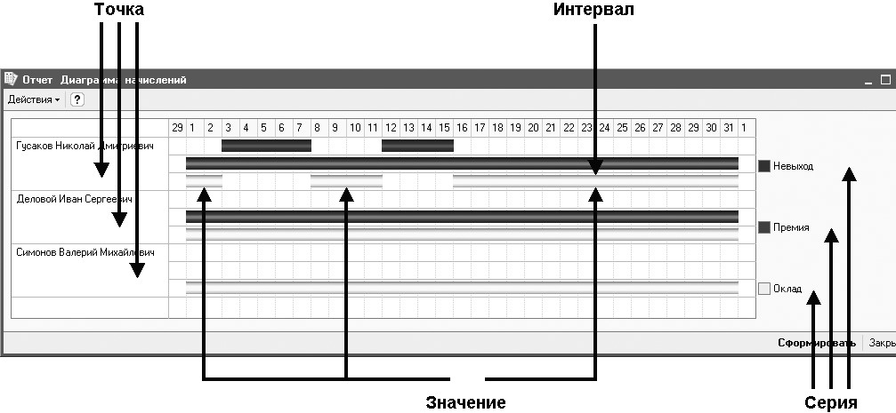

<strong>Рис. 18.32.</strong> Пример диаграммы Ганта

Итак, диаграмма Ганта представляет собой совокупность точек, серий и значений для каждой пары точка-серия. 

В нашем случае точками диаграммы являются сотрудники, а сериями – виды расчетов. Таким образом, для каждого
	сотрудника существует некоторое значение диаграммы по каждой из серий, то есть по каждому из видов расчета. 

Значение диаграммы Ганта представляет собой специальный объект, который автоматически формируется системой на
	основании того, какие точки и какие серии определены для данной диаграммы. 

Этот объект является совокупностью (коллекцией) интервалов, то есть может содержать не один, а несколько интервалов,
	которые соответствуют паре серия-точка (создаваемый по умолчанию объект ЗначениеДиаграммыГанта не содержит ни одного
	интервала). Разработчик может получить значение диаграммы, указав интересующую его точку и серию, и затем добавить в
	коллекцию необходимое количество интервалов.

Все интервалы всех значений диаграммы располагаются с привязкой к единой оси времени, что дает возможность видеть их
	взаимное расположение.

Теперь коротко объясним последовательность наших дальнейших действий. 

В качестве исходных данных для построения такой диаграммы мы возьмем данные регистра расчета Начисления. Каждая
	запись этого регистра уже содержит все необходимое для построения диаграммы: сотрудника, вид расчета, начало и конец
	интервала. 

Нам останется только средствами встроенного языка разместить все это в диаграмме. 

Итак, приступим.

<strong>В режиме «Конфигуратор»</strong>

Создадим новый объект конфигурации Отчет и назовем его ДиаграммаНачислений. 

Для этого отчета мы не будем создавать схему компоновки данных, а создадим основную форму отчета и обеспечим
	формирование и настройку диаграммы Ганта с помощью кода на встроенном языке. В окне редактирования объекта
	конфигурации Отчет ДиаграммаНачислений перейдем на закладку Формы, нажмем кнопку открытия  и
	создадим основную форму отчета. 

В правом верхнем окне редактора форм на закладке Реквизиты находятся реквизиты формы. Мы видим здесь основной
	реквизит формы Отчет, который был создан автоматически при создании формы. 

Нажмем кнопку Добавить и добавим новый реквизит формы. Назовем его ДиаграммаГанта и выберем его тип ДиаграммаГанта
	(рис. 18.33).

Теперь перетащим новый реквизит в окно элементов формы, которое пока пусто. 

В окне элементов формы будет создано новое поле для отображения диаграммы Ганта, а в нижнем окне просмотра формы мы
	сразу увидим поле диаграммы (рис. 18.34).

<strong>Рис. 18.34.</strong> Добавление диаграммы Ганта в форму

На закладке Команды создадим команду формы Сформировать 

(рис. 18.35).

<strong>Рис. 18.35.</strong> Добавление команды формы

Теперь нужно установить Действие для этой команды. 

Для этого нажмем кнопку открытия  в строке Действие. 

На запрос конфигуратора о типе обработчика команды ответим, что мы хотим создать клиентский обработчик команды формы
	с вызовом из него процедуры, выполняющейся на сервере без контекста формы (рис. 18.36).

<strong>Рис. 18.36.</strong> Выбор типа обработчика команды формы

В модуле формы будут созданы шаблоны двух процедур: клиентской процедуры Сформировать() и серверной внеконтекстной
	процедуры СформироватьНаСервере(), которая вызывается из процедуры Сформировать().

Мы не будем сейчас подробно рассматривать, что такое серверная внеконтекстная процедура. Отметим только, что
	внеконтекстная процедура выполняется на сервере значительно быстрее за счет того, что на сервер с клиента не
	передается весь контекст формы.

Однако нам нужно передать в процедуру СформироватьНаСервере() в качестве параметра ссылку на реквизит формы
	ДиаграммаГанта, чтобы на сервере заполнить его данными. Поэтому изменим текст модуля следующим образом (листинг
	18.10).

<strong>листинг 18.10.</strong> Текст обработчика команды «Сформировать»

<table>
	<tr>
		<td>
&amp;НаКлиенте
</td>
	</tr>
	<tr>
		<td></td>
	</tr>
	<tr>
		<td>
Процедура Сформировать(Команда)
</td>
	</tr>
	<tr>
		<td></td>
	</tr>
	<tr>
		<td>
СформироватьНаСервере(<strong>ДиаграммаГанта</strong>);
</td>
	</tr>
	<tr>
		<td></td>
	</tr>
	<tr>
		<td>
КонецПроцедуры
</td>
	</tr>
	<tr>
		<td></td>
	</tr>
	<tr>
		<td></td>
	</tr>
	<tr>
		<td></td>
	</tr>
	<tr>
		<td>
&amp;НаСервереБезКонтекста
</td>
	</tr>
	<tr>
		<td></td>
	</tr>
	<tr>
		<td>
Процедура СформироватьНаСервере(<strong>Диаграмма</strong>)
</td>
	</tr>
	<tr>
		<td></td>
	</tr>
	<tr>
		<td>
// Вставить содержимое обработчика.
</td>
	</tr>
	<tr>
		<td></td>
	</tr>
	<tr>
		<td>
КонецПроцедуры
</td>
	</tr>
</table>

В процедуру СформироватьНаСервере() мы вставим заготовку запроса (листинг 18.11).

<strong>листинг 18.11.</strong> Процедура «СформироватьНаСервере()»

<table>
	<tr>
		<td>
&amp;НаСервереБезКонтекста
</td>
	</tr>
	<tr>
		<td></td>
	</tr>
	<tr>
		<td>
Процедура СформироватьНаСервере(Диаграмма)
</td>
	</tr>
	<tr>
		<td></td>
	</tr>
	<tr>
		<td></td>
	</tr>
	<tr>
		<td></td>
	</tr>
	<tr>
		<td>
Запрос = Новый Запрос;
</td>
	</tr>
	<tr>
		<td></td>
	</tr>
	<tr>
		<td>
Запрос.Текст = ;
</td>
	</tr>
	<tr>
		<td></td>
	</tr>
	<tr>
		<td></td>
	</tr>
	<tr>
		<td></td>
	</tr>
	<tr>
		<td>
КонецПроцедуры
</td>
	</tr>
</table>

Установим курсор перед точкой с запятой, вызовем контекстное меню, откроем конструктор запроса и создадим новый
	запрос. 

Выберем виртуальную таблицу регистра расчета Начисления.ФактическийПериодДействия. 

Из этой таблицы выберем следующие поля (рис. 18.37):

<ul>
	<li>Сотрудник,</li>
	<li>ВидРасчета,</li>
	<li>ПериодДействияНачало,</li>
	<li>ПериодДействияКонец,</li>
	<li>Результат,</li>
	<li>Регистратор,</li>
</ul>

<strong>Рис. 18.37.</strong> Выбранные поля

Все, запрос готов. 

Теперь нажмем OK и после текста запроса добавим в процедуру следующий текст (листинг 18.12). <strong>листинг
	18.12.</strong> Процедура «СформироватьНаСервере()»

<table>
	<tr>
		<td>
&amp;НаСервереБезКонтекста
</td>
	</tr>
	<tr>
		<td></td>
	</tr>
	<tr>
		<td>
Процедура СформироватьНаСервере(Диаграмма)
</td>
	</tr>
	<tr>
		<td></td>
	</tr>
	<tr>
		<td></td>
	</tr>
	<tr>
		<td></td>
	</tr>
	<tr>
		<td>
Запрос = Новый Запрос;
</td>
	</tr>
	<tr>
		<td></td>
	</tr>
	<tr>
		<td>
Запрос.Текст = 
</td>
	</tr>
	<tr>
		<td></td>
	</tr>
	<tr>
		<td>
&quot;ВЫБРАТЬ
</td>
	</tr>
	<tr>
		<td></td>
	</tr>
	<tr>
		<td>
 | НачисленияФактическийПериодДействия.Сотрудник,
</td>
	</tr>
	<tr>
		<td></td>
	</tr>
	<tr>
		<td>
 | НачисленияФактическийПериодДействия.ВидРасчета,
</td>
	</tr>
	<tr>
		<td></td>
	</tr>
	<tr>
		<td>
 | НачисленияФактическийПериодДействия.ПериодДействияНачало,
</td>
	</tr>
	<tr>
		<td></td>
	</tr>
	<tr>
		<td>
 | НачисленияФактическийПериодДействия.ПериодДействияКонец,
</td>
	</tr>
	<tr>
		<td></td>
	</tr>
	<tr>
		<td>
 | НачисленияФактическийПериодДействия.Результат,
</td>
	</tr>
	<tr>
		<td></td>
	</tr>
	<tr>
		<td>
 | НачисленияФактическийПериодДействия.Регистратор,
</td>
	</tr>
	<tr>
		<td></td>
	</tr>
	<tr>
		<td>
 | НачисленияФактическийПериодДействия.Регистратор.Представление
</td>
	</tr>
	<tr>
		<td></td>
	</tr>
	<tr>
		<td>
|ИЗ
</td>
	</tr>
	<tr>
		<td></td>
	</tr>
	<tr>
		<td>
 | РегистрРасчета.Начисления.ФактическийПериодДействия 
</td>
	</tr>
	<tr>
		<td></td>
	</tr>
	<tr>
		<td>
 | КАК НачисленияФактическийПериодДействия&quot;;
</td>
	</tr>
	<tr>
		<td></td>
	</tr>
	<tr>
		<td></td>
	</tr>
	<tr>
		<td></td>
	</tr>
	<tr>
		<td>
<strong>ВыборкаРезультата = Запрос.Выполнить().Выбрать();</strong>
</td>
	</tr>
	<tr>
		<td></td>
	</tr>
	<tr>
		<td></td>
	</tr>
	<tr>
		<td></td>
	</tr>
	<tr>
		<td>
<strong>// Запретить обновление диаграммы.</strong>
</td>
	</tr>
	<tr>
		<td></td>
	</tr>
	<tr>
		<td>
<strong>Диаграмма.Обновление = Ложь;</strong>
</td>
	</tr>
	<tr>
		<td></td>
	</tr>
	<tr>
		<td></td>
	</tr>
	<tr>
		<td></td>
	</tr>
	<tr>
		<td>
<strong>Диаграмма.Очистить();</strong>
</td>
	</tr>
	<tr>
		<td></td>
	</tr>
	<tr>
		<td>
<strong>Диаграмма.ОтображатьЗаголовок = Ложь;</strong>
</td>
	</tr>
	<tr>
		<td></td>
	</tr>
	<tr>
		<td></td>
	</tr>
	<tr>
		<td></td>
	</tr>
	<tr>
		<td>
<strong>// Заполнить диаграмму.</strong>
</td>
	</tr>
	<tr>
		<td></td>
	</tr>
	<tr>
		<td>
<strong>Пока ВыборкаРезультата.Следующий() Цикл</strong>
</td>
	</tr>
	<tr>
		<td></td>
	</tr>
	<tr>
		<td></td>
	</tr>
	<tr>
		<td></td>
	</tr>
	<tr>
		<td>
<strong>// Получить серию, точку и значение для них.</strong>
</td>
	</tr>
	<tr>
		<td></td>
	</tr>
	<tr>
		<td>
<strong>ТекущаяСерия = Диаграмма.УстановитьСерию(ВыборкаРезультата.ВидРасчета);</strong>
</td>
	</tr>
</table>

<strong>ТекущаяТочка = Диаграмма.УстановитьТочку(ВыборкаРезультата.Сотрудник);</strong>

<strong>ТекущееЗначение = Диаграмма.ПолучитьЗначение(ТекущаяТочка, ТекущаяСерия);</strong>

<table>
	<tr>
		<td>
<strong>// Создать нужные нам интервалы в значении. </strong>
</td>
	</tr>
	<tr>
		<td></td>
	</tr>
	<tr>
		<td>
<strong>ТекущийИнтервал = ТекущееЗначение.Добавить();</strong>
</td>
	</tr>
	<tr>
		<td></td>
	</tr>
	<tr>
		<td>
<strong>ТекущийИнтервал.Начало = ВыборкаРезультата.ПериодДействияНачало;</strong>
</td>
	</tr>
	<tr>
		<td></td>
	</tr>
	<tr>
		<td>
<strong>ТекущийИнтервал.Конец = ВыборкаРезультата.ПериодДействияКонец;</strong>
</td>
	</tr>
	<tr>
		<td></td>
	</tr>
	<tr>
		<td>
<strong>ТекущийИнтервал.Текст = ВыборкаРезультата.РегистраторПредставление;</strong>
</td>
	</tr>
	<tr>
		<td></td>
	</tr>
	<tr>
		<td>
<strong>ТекущийИнтервал.Расшифровка = ВыборкаРезультата.Регистратор;</strong>
</td>
	</tr>
	<tr>
		<td></td>
	</tr>
	<tr>
		<td></td>
	</tr>
	<tr>
		<td></td>
	</tr>
	<tr>
		<td>
<strong>КонецЦикла;</strong>
</td>
	</tr>
	<tr>
		<td></td>
	</tr>
	<tr>
		<td></td>
	</tr>
	<tr>
		<td></td>
	</tr>
	<tr>
		<td>
<strong>// Раскрасить серии своими цветами.</strong>
</td>
	</tr>
	<tr>
		<td></td>
	</tr>
	<tr>
		<td>
<strong>Для Каждого Серия из Диаграмма.Серии Цикл</strong>
</td>
	</tr>
	<tr>
		<td></td>
	</tr>
	<tr>
		<td>
<strong>Если Серия.Значение = ПланыВидовРасчета.ОсновныеНачисления.Оклад Тогда</strong>
</td>
	</tr>
	<tr>
		<td></td>
	</tr>
	<tr>
		<td>
<strong>Серия.Цвет = WEBЦвета.Желтый;</strong>
</td>
	</tr>
	<tr>
		<td></td>
	</tr>
	<tr>
		<td></td>
	</tr>
	<tr>
		<td></td>
	</tr>
	<tr>
		<td>
<strong>ИначеЕсли Серия.Значение = ПланыВидовРасчета.ОсновныеНачисления.Премия Тогда</strong>
</td>
	</tr>
	<tr>
		<td></td>
	</tr>
	<tr>
		<td>
<strong>Серия.Цвет = WEBЦвета.Зеленый;</strong>
</td>
	</tr>
	<tr>
		<td></td>
	</tr>
	<tr>
		<td></td>
	</tr>
	<tr>
		<td></td>
	</tr>
	<tr>
		<td>
<strong>ИначеЕсли Серия.Значение = ПланыВидовРасчета.ОсновныеНачисления.Невыход Тогда</strong>
</td>
	</tr>
	<tr>
		<td></td>
	</tr>
	<tr>
		<td>
<strong>Серия.Цвет = WEBЦвета.Красный;</strong>
</td>
	</tr>
	<tr>
		<td></td>
	</tr>
	<tr>
		<td></td>
	</tr>
	<tr>
		<td></td>
	</tr>
	<tr>
		<td>
<strong>КонецЕсли;</strong>
</td>
	</tr>
	<tr>
		<td></td>
	</tr>
	<tr>
		<td></td>
	</tr>
	<tr>
		<td></td>
	</tr>
	<tr>
		<td>
<strong>КонецЦикла;</strong>
</td>
	</tr>
	<tr>
		<td></td>
	</tr>
	<tr>
		<td></td>
	</tr>
	<tr>
		<td></td>
	</tr>
	<tr>
		<td>
<strong>// Разрешить обновление диаграммы.</strong>
</td>
	</tr>
	<tr>
		<td></td>
	</tr>
	<tr>
		<td>
<strong>Диаграмма.Обновление = Истина;</strong>
</td>
	</tr>
	<tr>
		<td></td>
	</tr>
	<tr>
		<td></td>
	</tr>
	<tr>
		<td></td>
	</tr>
	<tr>
		<td>
КонецПроцедуры
</td>
	</tr>
</table>

Сначала мы запрещаем обновление диаграммы на то время, пока мы будем заполнять ее данными. Это нужно для того, чтобы
	в процессе заполнения не выполнялись пересчеты при каждом изменении данных диаграммы. После окончания заполнения
	диаграммы мы разрешим обновление, и все пересчеты будут выполнены один раз.

Затем в цикле по выборке запроса мы заполняем диаграмму. 

Сначала, используя методы УстановитьСерию() и Установить Точку(), мы получаем либо существующие, либо новые точку и
	серию. Точки и серии однозначно идентифицируются своими значениями, в качестве которых мы используем сотрудника и
	вид расчета из результата запроса.

После того как точка и серия получены, с помощью метода ПолучитьЗначение() мы получаем соответствующее им значение
	диаграммы.

Затем мы добавляем в значение диаграммы новый интервал, задаем его начало и конец, задаем текст интервала, который
	будет показываться во всплывающей подсказке, и задаем расшифровку интервала, которая будет выполняться при двойном
	щелчке мышью на этом интервале.

После того как все значения диаграммы сформированы, мы раскрашиваем серии своими цветами. Серии диаграммы
	представляют собой коллекцию значений, которую мы перебираем при помощи конструкции Для Каждого … Цикл.

Теперь вернемся в форму и добавим в нее кнопку для выполнения команды Сформировать. 

Для этого перетащим мышью команду Сформировать из окна Команды формы в окно элементов формы (рис. 18.38).

В заключение в окне редактирования объекта конфигурации Отчет ДиаграммаНачислений на закладке подсистемы укажем, что
	отчет будет вызываться из подсистемы РасчетЗарплаты.

<strong>В режиме «1С:Предприятие»</strong>

Запустим «1С:Предприятие» в режиме отладки и посмотрим на результат работы отчета (рис. 18.39).

<strong>Рис. 18.39.</strong> Отчет «Диаграмма начислений»

А теперь посмотрим, как выглядит механизм вытеснения по периоду действия на конкретном примере.

Откроем документ Начисления сотрудникам № 3 и вместо одного прогула с 1 по 10 число зададим Гусакову два прогула: с 3
	по 7 число и с 12 по 15 число. 

Проведем документ и снова нажмем Сформировать в нашем отчете (рис. 18.40).

<strong>Рис. 18.40.</strong> Отчет «Диаграмма начислений»

Теперь вы наглядно видите, как записи вида расчета Невыход вытеснили по периоду действия запись расчета Оклад,
	изменив ее фактический период действия.

Следует отметить, что существует также возможность интерактивной настройки параметров диаграммы Ганта в режиме
	1С:Предприятие, доступная через пункт контекстного меню Настройка… Также настройку параметров диаграммы, таких как
	Отображать заголовок, Отображать легенду, Прозрачный фон и т. п., можно выполнить в конфигураторе, в редакторе формы
	отчета Диаграмма начислений. Для этого в панели свойств реквизита, содержащего диаграмму, нужно выполнить команду
	Настройка Открыть.

<h1>Лабораторная работа № 31Программирование документов</h1>

<strong>Порядок выполнения работы </strong>

1. Ознакомьтесь с теоретическими основами в настоящих указаниях и конспектах лекций. 

2. Получите задание у преподавателя. 

3. Сделайте скриншоты (кнопка клавиатуры PrtSc) выполненных заданий в текстовом (Word) файле <em>Фамилия_ЛР</em>

4. Составьте отчет по лабораторной работе. 

5. Отчитайте работу преподавателю.

<strong>Полнотекстовый индекс</strong>

Прежде всего, познакомимся со свойствами конфигурации и ее объектов, которые отвечают за полнотекстовый поиск. 

<strong>В режиме «Конфигуратор»</strong>

Каждый объект конфигурации, данные которого могут участвовать в полнотекстовом индексировании, имеет свойство
	Полнотекстовый поиск. По умолчанию при создании нового объекта это свойство установлено в значение
	Использовать. 

Таким образом, в данный момент от нас не требуется вносить какиелибо изменения, но, тем не менее, для знакомства
	откроем окно редактирования объекта конфигурации Справочник Номенклатура на закладке Прочее (рис. 19.1).

Кроме объектов конфигурации свойство Полнотекстовый поиск существует и у реквизитов этих объектов. Таким образом, мы
	имеем возможность указывать конкретные реквизиты, данные которых должны участвовать в полнотекстовом
	индексировании. 

<strong>Рис. 19.1.</strong> Свойство «Полнотекстовый поиск»

По умолчанию для новых реквизитов это свойство также устанавливается в значение Использовать, поэтому и в данном
	случае не требуется вносить каких-либо изменений. 

Например, откроем палитру свойств реквизита ВидНоменклатуры справочника Номенклатура (рис. 19.2).

<strong>Рис. 19.2.</strong> Свойство 

«Полнотекстовый поиск»

Таким образом, по умолчанию в нашей конфигурации полнотекстовый поиск используется для всех возможных реквизитов всех
	возможных объектов конфигурации. 

Перейдем в режим 1С:Предприятие.

<strong>В режиме «1С:Предприятие»</strong>

Выполним команду главного меню приложения Все функции  Стандартные  Управление полнотекстовым поиском (рис.
	19.3).

<strong>Рис. 19.3.</strong> Вызов диалога управления полнотекстовым поиском

В результате будет открыто окно управления полнотекстовым поиском (рис. 19.4).

<strong>Рис. 19.4.</strong> Окно управления полнотекстовым поиском

Это окно позволяет создавать и обновлять полнотекстовый индекс интерактивно. Кроме этого, оно позволяет разрешать или
	запрещать вообще все операции, связанные с полнотекстовым поиском: обновление, очистка полнотекстового индекса,
	полнотекстовый поиск.

Как вы видите, по умолчанию полнотекстовый поиск стандартно разрешен.

Также система сообщает нам о том, что требуется обновление полнотекстового индекса. Это действительно так, потому что
	в нашем случае индекс вообще отсутствует (дата актуальности индекса пуста). Для того чтобы создать (или обновить)
	полнотекстовый индекс, нажмем кнопку Обновить индекс. 

Обратите внимание, что при больших размерах информационной базы создание и обновление полнотекстового индекса могут
	занимать несколько минут. Поэтому в процессе обновления индекса в нижнем правом углу экрана всплывает сообщение о
	том, какая часть данных в данный момент обрабатывается. 

После того как создание полнотекстового индекса будет закончено, система сообщит об этом (рис. 19.5), и в окне
	управления полнотекстовым поиском будет отображена дата актуальности полнотекстового индекса – дата, когда последний
	раз выполнялось обновление индекса (см. рис. 19.6).

<strong>Рис. 19.6.</strong> Окно управления полнотекстовым поиском

Итак, мы создали полнотекстовый индекс для нашей информационной базы. Теперь, используя этот индекс, выполним
	полнотекстовый поиск в базе данных.

<h1>Лабораторная работа № 32 Система учета библиотеки</h1>

<strong>Порядок выполнения работы </strong>

1. Ознакомьтесь с теоретическими основами в настоящих указаниях и конспектах лекций. 

2. Получите задание у преподавателя. 

3. Сделайте скриншоты (кнопка клавиатуры PrtSc) выполненных заданий в текстовом (Word) файле <em>Фамилия_ЛР</em>

4. Составьте отчет по лабораторной работе. 

5. Отчитайте работу преподавателю.

<strong>Примеры поиска в базе данных</strong>

<strong>В режиме «1С:Предприятие»</strong>

Поиск в данных на основе полнотекстового индекса является стандартной функцией платформы «1С:Предприятие». Для начала
	поиска достаточно нажать кнопку Поиск (со значком лупы) в панели инструментов приложения (рис. 19.7).

Количество данных в нашей базе данных невелико, но даже и на них мы сможем познакомиться с основными возможностями
	полнотекстового поиска. 

Для начала попробуем найти данные, связанные с Ивановым. Введем в строку поиска значение иванов и нажмем Найти или
	клавишу Enter (рис. 19.8).

<strong>Рис. 19.8.</strong> Поиск по выражению «иванов»

Результат поиска содержит 5 элементов, и найденные слова в реквизитах этих элементов выделены жирным шрифтом. 

Обратите внимание, что кроме элемента справочника Иванов и документа оказания услуги клиенту Иванов система нашла
	также и другие объекты, которые содержат различные словоформы введенного выражения (в данном случае – Иван). 

Чтобы выполнить точный поиск по указанному выражению, его необходимо заключить в кавычки (рис. 19.9).

<strong>Рис. 19.9.</strong> Поиск по выражению «иванов»

Часто пользователь не помнит точно, например, название номенклатуры. В этом случае можно выполнить поиск по
	нескольким начальным символам слова, заменив последние символы звездочкой (*). Например, при поиске по выражению
	тран* будут найдены элементы номенклатуры: транзистор и трансформатор (рис. 19.10).

<strong>Рис. 19.10.</strong> Поиск по первым символам поискового слова

Как правило, для получения наилучших результатов полнотекстового поиска рекомендуется использовать в поисковом
	выражении пару слов. 

Например, если требуется узнать, какого числа клиенту Симонову заменили трансформатор в телевизоре, можно ввести
	поисковое выражение трансформатор симонов (рис. 19.11).

<strong>Рис. 19.11.</strong> Поиск по выражению «трансформатор Симонов»

При нажатии на гиперссылку система откроет документ Оказание услуги № 3, и можно будет просмотреть полный перечень
	работ, выполненных для этого клиента.

Система индексирует не только данные, содержащиеся в объектах конфигурации, но и имена реквизитов и объектов
	метаданных. 

Поэтому, например, если требуется найти информацию о сотруднике по фамилии Деловой, в поисковом выражении следует
	указать имя справочника, который нас интересует: сотрудник деловой (рис. 19.12).

<strong>Рис. 19.12.</strong> Поиск по выражению «сотрудник Деловой»

Как видите, система нашла также и документы начисления сотрудникам, которые содержат формы слова «сотрудники», но,
	несмотря на это, искомый нами справочник Сотрудники находится первым в списке найденных.

Система позволяет выполнять также нечеткий поиск. Например, пользователь не уверен в правильности написания
	поискового слова. В этом случае в поисковом выражении можно задать признак нечеткого поиска – решетку (#) и
	количество символов после нее, на которое поисковое выражение может отличаться от оригинала в базе данных. В
	результате, даже если пользователь ввел в поисковую строку римонт#2, в базе данных будут найдены все объекты,
	содержащие слово ремонт (рис. 19.13).

<strong>Рис. 19.13.</strong> Нечеткий поиск по выражению «римонт»

Также можно выполнять поиск по синонимам слов. Для этого перед поисковым выражением нужно поставить символ !
	(восклицательный знак). Например, поиск по выражению !починка даст такой же результат (см. рис. 19.13), так как
	ремонт и починка являются синонимами.

Для составления поисковых выражений можно использовать разнообразные операторы, которые подробно описаны в
	документации «1С:Предприятие 8.3. Руководство разработчика», приложение 5 «Поисковые выражения полнотекстового
	поиска». Их использование не должно вызвать у вас затруднений.

Форма поиска, которая появляется при нажатии кнопки Поиск в панели инструментов приложения (рис. 19.7–19.13),
	стандартно генерируется платформой. Так происходит потому, что свойство конфигурации ОсновнаяФормаПоиска по
	умолчанию не определено. 

Но при желании можно внести изменения в стандартный механизм поиска. Для этого нужно нажать кнопку открытия (со
	значком лупы) возле этого свойства. При этом будет вызван конструктор общих форм и сконструирована ровно та форма,
	которую вызывает платформа. Можно изменить ее по своему желанию, и тогда для поиска будет использоваться именно
	она.

<strong>Поиск при вводе по строке</strong>

<strong>В режиме «Конфигуратор»</strong>

В платформе «1С:Предприятие» реализован мощный механизм поиска при вводе по строке в поле ввода. Мы с вами уже
	неоднократно использовали его, когда добавляли номенклатуру в табличную часть документов.

Настроить параметры поиска при вводе по строке можно на закладке Поле ввода окна редактирования объектов
	конфигурации, которые используются в прикладном решении в качестве ссылочных полей. При этом можно настроить
	свойства: Способ поиска строки (по умолчанию – Начало), Полнотекстовый поиск (по умолчанию – Не использовать) и
	Режим получения данных выбора (по умолчанию – Непосредственно).

Установим параметры поиска поля ввода для справочника Номенклатура так, как показано на рис. 19.14.

Таким образом, при вводе значений в поля, ссылающиеся на номенклатуру, будет использоваться полнотекстовый поиск, и
	этот поиск будет выполняться в фоновом режиме, т. е. с помощью фонового задания. Возможность задействовать
	полнотекстовый поиск, а также возможность выполнять поиск фоновым заданием наиболее полезна при больших объемах
	данных.

Если база данных невелика, то можно не использовать полнотекстовый поиск, но при этом искать в любом месте поля
	ввода, а не только по началу строки (Способ поиска строки – Любая часть).

<strong>Рис. 19.14.</strong> Свойства поиска по строке в поле ввода

Все перечисленные свойства можно, при необходимости, переопределить в процессе выполнения прикладного решения из
	встроенного языка. Для этого используются клиентские обработчики событий поля ввода АвтоПодбор и
	ОкончаниеВводаТекста. А также это можно сделать в модуле менеджера того объекта, в данных которого выполняется
	поиск, в обработчике события ОбработкаПолученияДанныхВыбора (за исключением свойства
	РежимПолученияДанныхВыбора).

<strong>В режиме «1С:Предприятие»</strong>

Запустим «1С:Предприятие» и начнем вводить новую цену на номенклатуру в регистр Цены на номенклатуру.

Как только мы начинаем вводить символы в поле ввода Номенклатура, имеющего тип ссылки на номенклатуру, в выпадающем
	окне под полем ввода отображаются наименования номенклатуры, содержащие в начале слов, составляющих название,
	введенные нами символы (рис. 19.15).

<strong>Рис. 19.15.</strong> Поиск по строке в поле ввода

При этом согласно установленным в конфигураторе свойствам будет задействован полнотекстовый поиск, который будет
	выполняться в фоновом режиме.

<h1>Лабораторная работа № 33 Программирование отчетов</h1>

<strong>Порядок выполнения работы </strong>

1. Ознакомьтесь с теоретическими основами в настоящих указаниях и конспектах лекций. 

2. Получите задание у преподавателя. 

3. Сделайте скриншоты (кнопка клавиатуры PrtSc) выполненных заданий в текстовом (Word) файле <em>Фамилия_ЛР</em>

4. Составьте отчет по лабораторной работе. 

5. Отчитайте работу преподавателю.

<strong>Создание регламентных заданий </strong>

<strong>В режиме «Конфигуратор»</strong>

Сначала создадим первое регламентное задание по обновлению индекса. 

Раскроем ветвь Общие дерева объектов конфигурации. Выделим строку Регламентные задания и добавим новый объект
	конфигурации Регламентное задание. Зададим его имя – ОбновлениеИндекса (рис. 20.1).

После этого создадим процедуру, которая и будет выполнять обновление полнотекстового индекса нашей информационной
	базы. 

<strong>Рис. 20.1.</strong> Создание регламентного задания

В качестве такой процедуры может выступать любая процедура или функция неглобального общего модуля, которую можно
	вызвать на сервере (у общего модуля должно быть установлено свойство Сервер).

Добавим в конфигурацию общий модуль с именем Регламент- ныеПроцедуры и установим флажок Вызов сервера для видимости
	его экспортных процедур и функций 

(рис. 20.2).

<strong>Рис. 20.2.</strong> Свойства общего модуля

Вернемся к свойствам регламентного задания ОбновлениеИндекса. Нажмем кнопку открытия  у поля
	ввода Имя метода. 

Система откроет окно выбора общего модуля (рис. 20.3).

<strong>Рис. 20.3.</strong> Выбор обработчика события

Выберем модуль РегламентныеПроцедуры. В этом модуле будет создан шаблон процедуры ОбновлениеИндекса(). Заполним его
	следующим образом (листинг 20.1).

<strong>листинг 20.1.</strong> Процедура обновления индекса

<table>
	<tr>
		<td>
Если ПолнотекстовыйПоиск.ПолучитьРежимПолнотекстовогоПоиска() = 
</td>
	</tr>
	<tr>
		<td></td>
	</tr>
	<tr>
		<td>
РежимПолнотекстовогоПоиска.Разрешить Тогда
</td>
	</tr>
	<tr>
		<td></td>
	</tr>
	<tr>
		<td>
Если Не ПолнотекстовыйПоиск.ИндексАктуален() Тогда
</td>
	</tr>
	<tr>
		<td></td>
	</tr>
	<tr>
		<td>
ПолнотекстовыйПоиск.ОбновитьИндекс( , Истина);
</td>
	</tr>
	<tr>
		<td></td>
	</tr>
	<tr>
		<td>
КонецЕсли;
</td>
	</tr>
	<tr>
		<td></td>
	</tr>
	<tr>
		<td>
КонецЕсли;
</td>
	</tr>
</table>

Сначала в этой процедуре проверяется возможность выполнения операций, связанных с полнотекстовым поиском (ведь они
	могут быть запрещены, например, интерактивно, см. рис. 19.4.).

Если операции полнотекстового поиска разрешены, проверяется, актуален ли полнотекстовый индекс (если после последнего
	индексирования данные, подлежащие полнотекстовому индексированию, не изменялись, то индекс будет актуален и
	повторное индексирование не требуется). 

В случае необходимости индексирования вызывается метод ОбновитьИндекс() менеджера полнотекстового поиска. 

Первый параметр этого метода отвечает за слияние индексов и по умолчанию имеет значение Ложь. Это значит, что слияние
	индексов выполняться не будет. 

Второй параметр метода определяет, какое количество данных будет индексироваться: сразу все, которые необходимо
	проиндексировать, или порциями. Наша задача – выполнить индексирование как можно быстрее, поэтому указываем, что
	индексирование будет выполняться порциями (значение Истина). 

Размер одной порции фиксирован – 10 000 объектов. Таким образом, если в данный момент требуется проиндексировать,
	например, 15 000 объектов, то при вызове этого метода из них будет проиндексировано только 10 000 (первая порция), а
	оставшиеся объекты будут проиндексированы при следующем вызове этого метода (при следующем запуске нашего
	регламентного задания).

Перейдем к составлению расписания запуска регламентного задания. 

Нажмем на ссылку Открыть в свойствах регламентного задания (в строке Расписание), и система откроет диалог
	редактирования расписания (рис. 20.4).

<strong>Рис. 20.4.</strong> Диалог редактирования расписания

Диалог содержит несколько закладок, которые позволяют задать различные виды расписаний; в нижней части диалога
	отображается итоговый результат всех установок.

Наша задача – запускать регламентное задание ежедневно, каждую минуту. 

закладке Общие укажем, что запуск задания должен повторяться каждый день 

(Повторять каждые: 1 дн.), рис. 20.5.

<strong>Рис. 20.5.</strong> Запуск задания каждый день

задания в течение дня. 

Укажем, что запуск задания должен повторяться каждые 60 секунд 

(Повторять через: 60 сек.), рис. 20.6.

<strong>Рис. 20.6.</strong> Запуск задания каждую минуту

В нижней части диалога отображено созданное нами расписание запуска: Выполнять: каждый день; каждые 60 сек. 

Вроде бы мы получили то, что хотели: регламентное задание запускается ежедневно, каждую минуту. 

Однако наше ООО «На все руки мастер» не работает круглосуточно, и запуск этого задания в ночное время будет явно
	бесполезным – данные в базе данных не изменяются. В то же время вполне возможна ситуация, когда некоторые сотрудники
	задерживаются после окончания рабочего 

Поэтому доработаем расписание следующим образом: укажем Время начала: 08:00 (рис. 20.7).

<strong>Рис. 20.7.</strong> Указание времени начала запуска

В результате запуск задания будет выполняться не круглые сутки, а только с 8 часов утра. Так как время окончания
	запуска не указано, запуск задания будет прекращен по окончании текущих суток. Таким образом, с 00:00 до 08:00 часов
	запуск задания выполняться не будет. 

На этом создание расписания регламентного задания закончено, нажмем ОK.

В качестве последнего штриха установим в свойствах регламентного задания флажок Предопределенное (рис. 20.8).

Установка этого свойства означает, что после запуска системы в режиме 1С:Предприятие будет создано одно
	предопределенное регламентное задание. В противном случае такое задание пришлось бы создавать средствами встроенного
	языка. 

На этом создание регламентного задания Обновление индекса завершено.

<strong>Рис. 20.8.</strong> Предопределенное регламентное задание

Теперь по аналогии создадим второе регламентное задание – СлияниеИндексов. В палитре его свойств нажмем кнопку
	открытия  у поля ввода Имя метода. В открывшемся диалоге выберем модуль РегламентныеПроцедуры.

В этом модуле будет создан шаблон процедуры СлияниеИндексов(). Заполним его следующим образом (листинг 20.2).

<strong>листинг 20.2.</strong> Процедура «СлияниеИндексов»

<table>
	<tr>
		<td>
Если ПолнотекстовыйПоиск.ПолучитьРежимПолнотекстовогоПоиска() = 
</td>
	</tr>
	<tr>
		<td></td>
	</tr>
	<tr>
		<td>
РежимПолнотекстовогоПоиска.Разрешить Тогда
</td>
	</tr>
	<tr>
		<td></td>
	</tr>
	<tr>
		<td>
Если Не ПолнотекстовыйПоиск.ИндексАктуален() Тогда
</td>
	</tr>
	<tr>
		<td></td>
	</tr>
	<tr>
		<td>
ПолнотекстовыйПоиск.ОбновитьИндекс(Истина);
</td>
	</tr>
	<tr>
		<td></td>
	</tr>
	<tr>
		<td>
КонецЕсли;
</td>
	</tr>
	<tr>
		<td></td>
	</tr>
	<tr>
		<td>
КонецЕсли;
</td>
	</tr>
</table>

Эта процедура аналогична показанной в листинге 20.1, за исключением того, что при обновлении индекса выполняется
	слияние индексов (первый параметр Истина), и индексирование выполняется целиком, для всех данных (второй параметр
	Ложь по умолчанию), поскольку в данном случае время выполнения индексирования для нас не критично.

В свойствах задания установим также флажок Предопределенное и приступим к редактированию расписания. Для этого нажмем
	на ссылку Открыть в свойствах регламентного задания (в строке Расписание).

На закладке Общее укажем, что задание будет запускаться каждый день (Повторять каждые: 1 дн.), а на закладке Дневное
	укажем время начала выполнения задания (Время начала: 01:00), рис. 20.9.

В результате мы получим следующее расписание запуска регламентного задания: Выполнять: каждый день; с 1:00 один раз в
	день. 

На этом создание регламентного задания СлияниеИндексов завершено, нажмем ОK.

<strong>Запуск регламентных заданий</strong>

Дальнейшее выполнение регламентных заданий не требует никаких дополнительных действий разработчика.

Система «1С:Предприятие» поддерживает два варианта работы: файловый и клиент-серверный. 

Наша демонстрационная информационная база работает в файловом варианте работы. При старте клиентского приложения
	запускается еще один поток с подключением к базе данных, последовательно выполняющий регламентные задания,
	инициированные клиентом.

Если бы наша информационная база работала в клиент-серверном варианте, то для автоматического запуска и выполнения
	созданных нами заданий также не требовалось бы дополнительных действий. 

Можно было бы обновить конфигурацию базы данных, и менеджер кластера серверов «1С:Предприятия» начал бы
	самостоятельно выполнять задания в соответствии с указанным расписанием. 

<strong>В режиме «1С:Предприятие»</strong>

Итак, проверим, как работают наши регламентные задания. 

Запустим «1С:Предприятие» и изменим состояние базы данных. Например, добавим новый элемент номенклатуры и затем
	удалим его. Подождем пару минут. 

Затем выполним команду главного меню приложения Все функции &gt; Стандартные &gt; Управление полнотекстовым поиском.
	Дата актуальности индекса будет соответствовать дате и времени нашей последней манипуляции с базой данных плюс еще
	минуту (рис. 20.10).

<strong>Рис. 20.10.</strong> Изменение даты актуальности полнотекстового индекса

Таким образом, мы видим, что задание обновления индекса запускается каждые 60 секунд, как мы и указали в расписании.
	Чтобы обеспечить выполнение обоих регламентных заданий, нужно не закрывать хотя бы один экземпляр приложения в
	течение суток.

<h1>Лабораторная работа № 34 Интернет-магазин</h1>

<strong>Порядок выполнения работы </strong>

1. Ознакомьтесь с теоретическими основами в настоящих указаниях и конспектах лекций. 

2. Получите задание у преподавателя. 

3. Сделайте скриншоты (кнопка клавиатуры PrtSc) выполненных заданий в текстовом (Word) файле <em>Фамилия_ЛР</em>

4. Составьте отчет по лабораторной работе. 

5. Отчитайте работу преподавателю.

<strong>В режиме «Конфигуратор»</strong>

Создадим новый объект конфигурации Документ с именем ВводНачальныхОстатковНоменклатуры. 

На закладке Движения запретим проведение документа (поскольку сами будем формировать записи регистра) и отметим, что
	движения документа будут находиться в регистре накопления ОстаткиМатериалов (рис. 21.1).

После этого перейдем на закладку Формы и создадим основную форму документа. 

В окне редактора форм на закладке Реквизиты раскроем основной реквизит формы Объект, затем раскроем коллекцию
	движений Движения, найдем строку ОстаткиМатериалов и перетащим ее в окно элементов формы. На вопрос системы
	«Добавить колонки таблицы?» ответим утвердительно (рис. 21.2). 

Обратите внимание, что в палитре свойств этой таблицы в строке Данные автоматически будет установлена связь с данными
	набора записей регистра Объект.Движения.ОстаткиМатериалов. 

<strong>Рис. 21.2.</strong> Редактирование формы документа 

«Ввод начальных остатков номенклатуры»

Немного изменим внешний вид формы. В окне элементов формы добавим группу полей типа Обычная группа без отображения с
	типом группировки Горизонтальная и перетащим в нее поля документа Номер и Дата. А также поменяем местами поля
	таблицы Движе- нияОстаткиМатериалов НаборСвойств и Склад (рис. 21.3).

<strong>Рис. 21.3.</strong> Измененная форма документа 

«Ввод начальных остатков номенклатуры»

В заключение отредактируем командный интерфейс формы документа, чтобы в панели навигации формы иметь возможность
	переходить к списку записей регистра ОстаткиМатериалов, связанному с документом. 

Для этого в левом верхнем окне редактора форм перейдем на закладку Командный интерфейс. 

В группе Панель навигации в подгруппе Перейти установим видимость для команды открытия регистра Остатки материалов
	(рис. 21.4).

<strong>Рис. 21.4.</strong> Редактирование командного интерфейса формы

В окне редактирования объекта конфигурации Документ ВводНачальныхОстатковНоменклатуры на закладке Подсистемы мы
	укажем его принадлежность к подсистеме Бухгалтерия. 

В заключение отредактируем командный интерфейс этой подсистемы. Для этого в дереве объектов конфигурации выделим
	подсистему Бухгалтерия, вызовем контекстное меню и выполним команду Открыть командный интерфейс. 

В группе Панель действий.Создать включим видимость у команды Ввод начальных остатков номенклатуры: создать. 

<strong>В режиме «1С:Предприятие»</strong>

Запустим «1С:Предприятие» в режиме отладки и проверим работу нашего документа. 

Выполним команду Ввод начальных остатков номенклатуры в разделе Бухгалтерия. 

Создадим документ для ввода начальных остатков в регистр ОстаткиМатериалов и внесем в него следующие данные (рис.
	21.5).

<strong>Рис. 21.5.</strong> Документ «Ввод начальных остатков номенклатуры № 1»

Обратите внимание на то, что дата документа не совпадает с датами отдельных записей, которые мы создаем в движениях
	документа. 

Нажмем Записать и в панели навигации формы документа перейдем к движениям нашего документа в регистре
	ОстаткиМатериалов 

(рис. 21.6).

<strong>Рис. 21.6.</strong> Записи регистра «ОстаткиМатериалов»

Таким образом, мы добились поставленной цели: с одной стороны, задавая дату документа, мы можем фиксировать момент
	внесения изменений в записи регистра; с другой стороны, для каждой создаваемой нами записи регистра мы можем указать
	индивидуальное значение поля Период.

Теперь займемся ужесточением требований, предъявляемых к тому, как наш документ формирует записи регистра, и
	рассмотрим два типичных варианта.

<strong>Программное редактирование записей регистра</strong>

<strong>Запись движений регистра из формы</strong>

<strong>В режиме «Конфигуратор»</strong>

Первое требование, которое мы реализуем, будет заключаться в том, что записи регистра должны формироваться той же
	датой, что и дата документа. Иначе говоря, синхронизируем дату движений с датой документа.

Для этого создадим для формы документа клиентский обработчик события ПередЗаписью и добавим в него следующий текст
	(листинг 21.1). <strong>листинг 21.1.</strong> Обработчик события «ПередЗаписью» формы документа

<table>
	<tr>
		<td>
Для Каждого ЗаписьРегистра Из Объект.Движения.ОстаткиМатериалов Цикл
</td>
	</tr>
	<tr>
		<td></td>
	</tr>
	<tr>
		<td>
ЗаписьРегистра.Период = Объект.Дата;
</td>
	</tr>
	<tr>
		<td></td>
	</tr>
	<tr>
		<td>
КонецЦикла;
</td>
	</tr>
</table>

<strong>В режиме «1С:Предприятие»</strong>

Снова запустим «1С:Предприятие» в режиме отладки, откроем наш документ и нажмем Записать. 

Открыв движения документа в регистре ОстаткиМатериалов, увидим, что значение поля Период у всех записей стало равно
	дате документа (рис. 21.7).

<strong>Рис. 21.7.</strong> Измененные записи регистра «ОстаткиМатериалов»

Можно сказать, что мы достигли поставленной цели, но лишь в ситуации, когда запись документа выполняется
	интерактивными средствами. 

<strong>Программная запись движений регистра</strong>

Если программно вызвать метод Записать() у объекта нашего документа, он будет записан без участия формы документа.
	Это значит, что событие ПередЗаписью формы документа вызвано не будет и наш код обработчика не отработает.

Чтобы предусмотреть возможность синхронизации периода движений документа с датой документа и в случае программной
	записи объекта Документ, следует использовать обработчик события ПередЗаписью объекта Документ, а не формы
	документа.

Событие ПередЗаписью в случае интерактивной записи документа сначала будет вызвано у формы документа, а затем у
	объекта Документ. 

<strong>В режиме «Конфигуратор»</strong>

Поэтому вернемся в конфигуратор, закомментируем в модуле формы добавленный нами текст и создадим обработчик события
	ПередЗаписью в модуле объекта Документ ВводНачальныхОстатковНоменклатуры. 

Для этого на закладке Прочее окна редактирования этого объекта конфигурации откроем модуль объекта и внесем в него
	следующий текст (листинг 21.2). <strong>листинг 21.2.</strong> Обработчик события «ПередЗаписью» модуля объекта 

<table>
	<tr>
		<td>
Процедура ПередЗаписью(Отказ, РежимЗаписи, РежимПроведения)
</td>
	</tr>
	<tr>
		<td></td>
	</tr>
	<tr>
		<td></td>
	</tr>
	<tr>
		<td></td>
	</tr>
	<tr>
		<td>
// Определить, нужно ли обновлять дату в движениях.
</td>
	</tr>
	<tr>
		<td></td>
	</tr>
	<tr>
		<td>
ОбновитьДатуДвижений = ЭтоНовый() Или Движения.ОстаткиМатериалов.Модифицированность();
</td>
	</tr>
	<tr>
		<td></td>
	</tr>
	<tr>
		<td>
Если Не ОбновитьДатуДвижений Тогда
</td>
	</tr>
	<tr>
		<td></td>
	</tr>
	<tr>
		<td></td>
	</tr>
	<tr>
		<td></td>
	</tr>
	<tr>
		<td>
// Проверить, что дата изменилась.
</td>
	</tr>
	<tr>
		<td></td>
	</tr>
	<tr>
		<td>
Запрос = Новый Запрос;
</td>
	</tr>
	<tr>
		<td></td>
	</tr>
	<tr>
		<td>
Запрос.УстановитьПараметр(&quot;ТекущийДокумент&quot;, Ссылка);
</td>
	</tr>
	<tr>
		<td></td>
	</tr>
	<tr>
		<td>
Запрос.Текст = 
</td>
	</tr>
	<tr>
		<td></td>
	</tr>
	<tr>
		<td>
&quot;ВЫБРАТЬ
</td>
	</tr>
	<tr>
		<td></td>
	</tr>
	<tr>
		<td>
 | Дата
</td>
	</tr>
	<tr>
		<td></td>
	</tr>
	<tr>
		<td>
|ИЗ 
</td>
	</tr>
	<tr>
		<td></td>
	</tr>
	<tr>
		<td>
 | Документ.ВводНачальныхОстатковНоменклатуры 
</td>
	</tr>
	<tr>
		<td></td>
	</tr>
	<tr>
		<td>
|ГДЕ
</td>
	</tr>
	<tr>
		<td></td>
	</tr>
	<tr>
		<td>
 | Ссылка = &amp;ТекущийДокумент&quot;;
</td>
	</tr>
	<tr>
		<td></td>
	</tr>
	<tr>
		<td></td>
	</tr>
	<tr>
		<td></td>
	</tr>
	<tr>
		<td>
Выборка = Запрос.Выполнить().Выбрать();
</td>
	</tr>
	<tr>
		<td></td>
	</tr>
	<tr>
		<td>
Выборка.Следующий();
</td>
	</tr>
	<tr>
		<td></td>
	</tr>
	<tr>
		<td>
ОбновитьДатуДвижений = Выборка.Дата &lt;&gt; Дата; 
</td>
	</tr>
	<tr>
		<td></td>
	</tr>
	<tr>
		<td></td>
	</tr>
	<tr>
		<td></td>
	</tr>
	<tr>
		<td>
КонецЕсли;
</td>
	</tr>
	<tr>
		<td></td>
	</tr>
	<tr>
		<td></td>
	</tr>
	<tr>
		<td></td>
	</tr>
	<tr>
		<td>
// Установить всем новую дату, если нужно.
</td>
	</tr>
	<tr>
		<td></td>
	</tr>
	<tr>
		<td>
Если ОбновитьДатуДвижений Тогда
</td>
	</tr>
	<tr>
		<td></td>
	</tr>
	<tr>
		<td></td>
	</tr>
	<tr>
		<td></td>
	</tr>
	<tr>
		<td>
Если Не Движения.ОстаткиМатериалов.Выбран() 
</td>
	</tr>
	<tr>
		<td></td>
	</tr>
	<tr>
		<td>
И Не Движения.ОстаткиМатериалов.Модифицированность() Тогда
</td>
	</tr>
	<tr>
		<td></td>
	</tr>
	<tr>
		<td>
Движения.ОстаткиМатериалов.Прочитать(); 
</td>
	</tr>
	<tr>
		<td></td>
	</tr>
	<tr>
		<td>
КонецЕсли;
</td>
	</tr>
	<tr>
		<td></td>
	</tr>
	<tr>
		<td></td>
	</tr>
	<tr>
		<td></td>
	</tr>
	<tr>
		<td>
Для Каждого ЗаписьРегистра Из Движения.ОстаткиМатериалов Цикл
</td>
	</tr>
	<tr>
		<td></td>
	</tr>
	<tr>
		<td>
ЗаписьРегистра.Период = Дата;
</td>
	</tr>
	<tr>
		<td></td>
	</tr>
	<tr>
		<td>
КонецЦикла;
</td>
	</tr>
	<tr>
		<td></td>
	</tr>
	<tr>
		<td></td>
	</tr>
	<tr>
		<td></td>
	</tr>
	<tr>
		<td>
КонецЕсли;
</td>
	</tr>
	<tr>
		<td></td>
	</tr>
	<tr>
		<td></td>
	</tr>
	<tr>
		<td></td>
	</tr>
	<tr>
		<td>
КонецПроцедуры
</td>
	</tr>
</table>

Как вы видите, в этом случае обработчик содержит больше кода за счет дополнительных проверок, которые выполняются в
	результате возможности как интерактивной, так и программной записи объекта.

Поясним содержание обработчика. Если записывается новый документ или были изменены его движения, следует обновить
	дату движений. В противном случае мы считываем запросом дату документа из базы данных и сравниваем ее с датой,
	установленной у записываемого объекта. Если даты разные, также следует обновить дату движений.

Перед установкой даты мы проверяем, был ли прочитан набор записей в свойстве Движения объекта и изменялся ли он. Если
	оба эти условия ложны, значит набор записей в свойстве Движения объекта пуст, и это состояние не связано с его
	изменением. В этом случае, чтобы предотвратить ошибочное удаление записей в регистре (перезапись пустым набором
	записей), мы предварительно читаем движения из регистра в набор записей в свойстве Движения. 

Затем, как и в предыдущем случае (при записи из формы документа), устанавливаем нужную дату для всех записей этого
	набора. При выполнении записи объекта Документ этот набор будет записан в регистр накопления.

<strong>В режиме «1С:Предприятие»</strong>

Запустим «1С:Предприятие» в режиме отладки и убедимся, что, указав новую дату (например, 03.09.2013) для нашего
	документа и записав его, мы получим движения в регистре накопления с новой датой.

В процессе записи нашего документа можно управлять не только периодом записей регистра накопления, но и значениями
	других полей регистра.

Например, по аналогичному принципу может быть создан документ Операция, позволяющий вводить ручные операции в регистр
	бухгалтерии. 

При этом вероятно, что кроме управления периодом записей регистра вам потребуется управлять значением поля Активность
	(«включать» и «выключать» проводки документа) и т. д.

<strong>Где создавать обработчики событий</strong>

В заключение следует сказать, что выбор обработчика, в который будет помещен текст процедуры, зависит от логики
	работы создаваемого объекта. Если конфигурация не предусматривает программной записи объекта, можно выбрать
	обработчик модуля формы. Если предполагается и программная модификация объекта, следует выбирать обработчик модуля
	объекта. 

Заметьте, что оба эти способа не исключают модификацию записей регистра через объект Регистр&lt;…&gt;НаборЗаписей.&lt;имя
	регистра&gt;. Поэтому если логика конфигурации подразумевает возможность программной модификации объекта
	НаборЗаписей, код обработки следует помещать в обработчик события набора записей. Все попытки изменить данные
	регистра будут сведены в конечном счете к записи именно набора записей.

<h1>Лабораторная работа № 35 Программирование регистров</h1>

<strong>Порядок выполнения работы </strong>

1. Ознакомьтесь с теоретическими основами в настоящих указаниях и конспектах лекций. 

2. Получите задание у преподавателя. 

3. Сделайте скриншоты (кнопка клавиатуры PrtSc) выполненных заданий в текстовом (Word) файле <em>Фамилия_ЛР</em>

4. Составьте отчет по лабораторной работе. 

5. Отчитайте работу преподавателю.

<strong>Создание ролей</strong>

<strong>В режиме «Конфигуратор»</strong>

При создании ролей исходят, как правило, из того, какие полномочия требуются различным группам пользователей на
	доступ к информации. Для этого мы воспользуемся подсистемами, которые значительно облегчат нашу задачу. 

<strong>Администратор</strong>

Первая роль, которую мы создадим, будет Администратор. Она должна включать в себя полные права на работу с данными
	информационной базы.

Раскроем ветвь Общие дерева объектов конфигурации. Выделим строку Роли и добавим новый объект конфигурации Роль.
	Зададим его имя – Администратор (рис. 22.1).

<strong>Рис. 22.1.</strong> Создание роли

Откроется окно редактирования прав этой роли (рис. 22.2).

Слева, в списке объектов, перечислены все объекты и виды объектов конфигурации, а справа, в окне прав, – доступные
	права для выбранного объекта или видов объектов конфигурации. 

<strong>Рис. 22.2.</strong> Окно редактирования прав для роли «Администратор»

Администратор должен иметь права на все объекты и все виды объектов. Для этого выполним команду Действия  Установить
	все права в командной панели окна. 

После этого все права для всех объектов будут помечены. 

Однако можно поставить или снять отметку для прав конкретного объекта конфигурации, пользуясь кнопками Отметить все
	элементы и Снять отметку со всех элементов, расположенными над окном прав. 

Теперь единственное, что следует сделать, – снять разрешение на интерактивное удаление для всех объектов. Это
	необходимо для того, чтобы администратор случайно не мог удалить какой-либо объект базы данных. Для этого пройдемся
	по всем видам объектов конфигурации (Справочники, Документы и т. д.) и снимем отметку с команды Интерактивное
	удаление. Заметьте, что одновременно с отключением права на интерактивное удаление объектов снимается также отметка
	с права Интерактивное удаление предопределенных (см. рис. 22.2). 

Для того чтобы наш Администратор мог работать с объектами, которые мы будем создавать после расстановки прав, зададим
	для него параметр Устанавливать права для новых объектов (см. рис. 22.2).

На этом создание роли Администратор закончено.

<strong>Директор</strong>

Следующей ролью, которую мы создадим, будет роль Директор. 

Создадим новый объект конфигурации Роль с именем Директор. 

Нас устраивает, что у новой роли нет прав на доступ ко всем объектам, за исключением тех видов объектов конфигурации,
	для которых не создано ни одного объекта. Для таких видов объектов конфигурации останутся установленными полные
	права. 

Убедимся, что право Вывод для всей конфигурации у этой роли установлено.

Теперь нам останется лишь пройти по видам объектов конфигурации и установить для них право Просмотр (права Чтение и
	Использование при этом установятся автоматически).

Затем раскроем ветвь Общие, выделим ветвь Подсистемы и отметим право Просмотр у всех подсистем. Тем самым мы
	предоставим директору возможность просматривать все данные информационной базы, а позднее с помощью установки
	видимости команд по ролям мы исключим из его интерфейса все действия, которые по логике нашей конфигурации не
	относятся к прикладной ее части (рис. 22.3).

Вторая роль нашей конфигурации готова.

<strong>Мастер</strong>

Следующая роль, которую мы создадим, будет роль Мастер. Снова добавим новый объект конфигурации Роль с именем Мастер.
	Выполним команду Действия  Установить по подсистемам… и выберем подсистемы УчетМатериалов и ОказаниеУслуг. Нажмем
	Установить.

В результате будут установлены все права на объекты конфигурации, относящиеся к данным подсистемам. 

Если теперь установить фильтр объектов по подсистемам УчетМатериалов и ОказаниеУслуг, то можно при необходимости
	внести уточнения в установленные права (рис. 22.4).

<strong>Рис. 22.4.</strong> Установка фильтра по подсистеме

В частности, для справочника Сотрудники мы запретим права Добавление, Изменение и Удаление. 

Обратите внимание, что при запрете права Добавление исчезла отметка и у права Интерактивное добавление, так как оно
	является «уточнением» права Добавление. Точно так же уточненные права запрещаются и при отмене прав на изменение и
	удаление. 

Кроме этого, мы снова снимем разрешения на интерактивное удаление для всех объектов базы данных. Для этого пройдем по
	всем видам объектов конфигурации и снимем у всех право Интерактивное удаление.

Затем снимем фильтр и установим все права, кроме интерактивного удаления для следующих объектов конфигурации: 

<ul>
	<li>справочник ВариантыНоменклатуры,</li>
	<li>справочник ДополнительныеСвойстваНоменклатуры,</li>
	<li>план видов характеристик СвойстваНоменклатуры,  регистр сведений ЗначенияСвойствНоменклатуры.</li>
</ul>

Эти объекты мы не привязывали ни к каким подсистемам, но они будут нужны для работы с характеристиками
	номенклатуры.

В заключение раскроем ветвь Общие, выделим ветвь Подсистемы и отметим право Просмотр у подсистемы Предприятие. Тем
	самым мы предоставим доступ к нормативно-справочной информации, которая будет находиться в этой подсистеме. А
	ненужную мастерам функциональность скроем с помощью видимости команд по ролям.

Роль Мастер готова.

<strong>Расчетчик</strong>

В заключение нам с вами осталось создать две роли: Бухгалтер и Расчетчик. 

Мы разделим права по расчету зарплаты и по ведению бухгалтерского учета. 

Дело в том, что в ООО «На все руки мастер» есть бухгалтер и помощник бухгалтера. Помощник бухгалтера занят в основном
	расчетом зарплаты, но иногда это делает и главный бухгалтер. 

Поэтому главному бухгалтеру необходимо будет назначить обе роли, в то время как помощнику – только роль
	Расчетчик.

Создадим новый объект конфигурации Роль с именем Расчетчик. 

В окне редактирования прав установим их по подсистеме РасчетЗарплаты (и не забудем запретить интерактивное удаление).
	А также установим право Просмотр для объекта конфигурации: Регистр накопления Продажи и справочника Клиенты.

В заключение установим право Просмотр у подсистемы Предприятие. 

Роль Расчетчик готова.

<strong>Бухгалтер</strong>

В заключение создадим объект конфигурации Роль с именем Бухгалтер. В окне редактирования прав установим их по
	подсистеме Бухгалтерия. 

После этого отфильтруем список объектов по этой подсистеме и для справочника Номенклатура запретим добавление,
	изменение и удаление. 

Также запретим интерактивное удаление для всех объектов.

Затем снимем фильтр и установим все права, кроме интерактивного удаления для объекта конфигурации Справочник
	Субконто. 

А также установим право Просмотр для следующих объектов конфигурации:

<ul>
	<li>Справочник Склады,</li>
	<li>Справочник ВариантыНоменклатуры,</li>
	<li>Справочник ДополнительныеСвойстваНоменклатуры,</li>
	<li>План видов характеристик СвойстваНоменклатуры,  Регистр сведений ЗначенияСвойствНоменклатуры.</li>
</ul>

В заключение установим право Просмотр у подсистемы Предприятие. 

<strong>Права на запуск клиентских приложений</strong>

В заключение убедимся, что у каждой роли есть права на запуск клиентского приложения (тонкого клиента и
	веб-клиента).

Для этого воспользуемся другим, более удобным инструментом – редактором Все роли. В дереве объектов конфигурации
	выделим ветку Роли и в контекстном меню выполним команду Все роли. Мы видим, что права Тонкий клиент и Веб-клиент
	включены для всех ролей (рис. 22.5).

Администратор также имеет возможность подключаться и с помощью других клиентских приложений.

Список прав для каждой роли можно получить, выполнив в окне редактирования прав команду Действия  Вывести список…
	(рис. 22.6).

Аналогичный список, но только для всех ролей, которые есть в конфигурации, можно получить из редактора Все роли.

<strong>Рис. 22.6.</strong> Список прав для роли «Бухгалтер»

<strong>Добавление новых пользователей</strong>

Для того чтобы иметь возможность отличать друг от друга пользователей, работающих с информационной базой, в системе
	«1С:Предприятие» существует <em>список пользователей</em>. 

Можно создавать и удалять пользователей системы, назначать им роли и т. д. 

<strong>В режиме «Конфигуратор»</strong>

Прежде чем мы приступим к созданию пользователей, необходимо выполнить обновление конфигурации базы данных
	(Конфигурация  Обновить конфигурацию базы данных (F7) ), поскольку пользователю можно поставить
	в соответствие только те роли, которые существуют в конфигурации базы данных.

После того как обновление произведено, выполним команду главного меню Администрирование  Пользователи. 

Откроется список пользователей системы. Пока что он пуст, поэтому добавим нового пользователя (Действия  Добавить)
	или нажмем кнопку Добавить в командной панели окна (рис. 22.7).

Откроется окно редактирования пользователя (рис. 22.8).

<strong>ВниМАние!</strong>

Если вы используете учебную версию платформы «1С:Пред- приятие 8.3», то возможность задания паролей пользователей и
	аутентификация операционной системы будут недоступны. Это ограничения учебной версии.

Имя пользователя – это идентификатор, который будет появляться в окне выбора пользователей при запуске системы в
	режиме 1С:Предприятие. 

Полное имя – строка, которая может быть использована внутри конфигурации при выводе различной справочной информации.
	Хорошим стилем администрирования считается указание в качестве полного имени фамилии, имени и отчества пользователя
	(без сокращений).

Следующие две области окна посвящены способам аутентификации пользователя.

Аутентификация средствами «1С:Предприятия» подразумевает, что после запуска системы пользователю будет предложено
	выбрать имя одного из пользователей системы и ввести пароль. Если введенный пароль соответствует сохраненному в
	системе для этого идентификатора пользователя, система открывается с правами, которые указаны для этого
	пользователя. При этом он сможет поменять пароль, если флажок Пользователю запрещено изменять пароль не
	установлен.

Аутентификация операционной системы подразумевает, что при запуске системы «1С:Предприятие» от пользователя не
	требуется никакой дополнительной информации. Система «1С:Предприятие» определяет, под каким пользователем запущена
	операционная система, и затем обращается к своему списку пользователей. Если она находит в нем пользователя,
	которому поставлен в соответствие текущий пользователь операционной системы, информационная база открывается с
	правами, указанными для этого пользователя.

Приступим к созданию пользователей.

Зададим имя пользователя Администратор, полное имя тоже Администратор. Перейдем на закладку Прочие. Отметим роль
	Администратор и язык конфигурации выберем Русский (рис. 22.9).

<strong>Рис. 22.9.</strong> Закладка «Прочие» окна редактирования пользователя

Нажмем ОК.

После этого создадим остальных пользователей системы (рис. 22.10). Для всех них мы будем использовать аутентификацию
	«1С:Предприятия» и русский язык.

<strong>Рис. 22.10.</strong> Список пользователей системы

<strong>пРиМеЧАние</strong>

Если некоторые колонки, например Роли, не видны в списке пользователей, можно настроить список, выполнив команду
	Действия Настройка списка…, и добавить нужные колонки.

Обратите внимание, что главному бухгалтеру Назаровой поставлены в соответствие две роли: Расчетчик и Бухгалтер,
	поскольку она должна иметь возможность не только вести бухгалтерский учет, но и рассчитывать зарплату.

Список пользователей, зарегистрированных в системе, можно получить, выполнив команду Действия  Вывести список…

<h1>Лабораторная работа № 36 Работа с регистрами</h1>

<strong>Порядок выполнения работы </strong>

1. Ознакомьтесь с теоретическими основами в настоящих указаниях и конспектах лекций. 

2. Получите задание у преподавателя. 

3. Сделайте скриншоты (кнопка клавиатуры PrtSc) выполненных заданий в текстовом (Word) файле <em>Фамилия_ЛР</em>

4. Составьте отчет по лабораторной работе. 

5. Отчитайте работу преподавателю.

<strong>Ограничение доступа к данным на уровне записей и полей базы данных</strong>

В системе «1С:Предприятие» используется <em>механизм ограничения доступа на уровне записей и полей базы данных</em>.
	Этот механизм позволяет для четырех основных прав (чтение, добавление, изменение и удаление) уточнить, какие же
	именно данные информационной базы будут доступны пользователю.

Такое уточнение записывается на специальном языке, являющемся подмножеством языка запросов.

Далее на примере документа Начисления сотрудникам мы рассмотрим небольшой пример, когда мастерам нужно дать
	возможность просмотреть начисленную им зарплату, но руководство запрещает им доступ к информации о начисленной
	премии. 

Другими словами, мастерам нужно запретить просмотр тех документов Начисления сотрудникам, в которых есть записи о
	начислении премии.

<strong>В режиме «Конфигуратор»</strong>

Для решения этой задачи сначала установим для роли Мастер право Просмотр для документа НачисленияСотрудникам.

Поскольку этот документ принадлежит подсистеме РасчетЗарплаты, дадим право на просмотр этой подсистемы. Также дадим
	права на просмотр справочника ВидыГрафиковРаботы и плана видов расчета Основные начисления, т. к. ссылки на эти
	объекты используются в документе НачисленияСотрудникам. Вернемся к редактированию прав для документа
	НачисленияСотрудникам.

Как мы видим, при установке права Просмотр право Чтение документа НачисленияСотрудникам установилось автоматически.
	Выделим его. В правой нижней части экрана находится поле Ограничение доступа к данным. Нажмем кнопку Добавить (рис.
	22.11).

Мы хотим запретить доступ ко всем полям документа Начисления сотрудникам. 

Поэтому мы не будем выбирать поля, а нажмем кнопку выбора в поле Ограничение доступа (рис. 22.12).

Откроется окно Ограничение доступа, в котором можно задать текст на специальном языке, являющемся подмножеством языка
	запроса.

Для облегчения работы мы воспользуемся конструктором запроса. Нажмем кнопку Конструктор запроса. 

Откроется конструктор ограничений доступа к данным. Он похож на конструктор запросов (см. рис. 22.13). 

Таблица НачисленияСотрудникам автоматически попала на закладку Таблицы и поля, а конструктор открылся на закладке
	Условия. 

Перенесем в список условий поле ВидРасчета табличной части Начисления, установим флажок Произвольное и заполним
	правую часть условия, как показано в листинге 22.1 (рис. 22.13).

<strong>Рис. 22.12.</strong> Вызов редактора ограничений доступа

<strong>листинг 22.1.</strong> Ограничение доступа к данным

<table>
	<tr>
		<td>
НачисленияСотрудникам.Начисления.ВидРасчета &lt;&gt; 
</td>
	</tr>
	<tr>
		<td></td>
	</tr>
	<tr>
		<td>
ЗНАЧЕНИЕ(ПланВидовРасчета.ОсновныеНачисления.Премия)
</td>
	</tr>
</table>

<strong>Рис. 22.13.</strong> Конструктор ограничений доступа к данным

Нажмем ОК (рис. 22.14). 

<strong>Рис. 22.14.</strong> Текст ограничения доступа к данным

Текущий пользователь имеет право прочитать или изменить некоторый объект базы данных только в том случае, если
	ограничение доступа предоставляет ему такое право. То есть когда условие ограничения истинно. 

В нашем случае пользователь сможет прочитать документ Начисления сотрудникам НачисленияСотрудникам ГДЕ… только в том
	случае, если в его табличной части Начисления … ГДЕ НачисленияСотрудникам.Начисления … есть виды расчета … ГДЕ
	НачисленияСотрудникам.Начисления.ВидРасчета …, не являющиеся видом расчета Премия … &lt;&gt;
	ЗНАЧЕНИЕ(ПланВидовРасчета.ОсновныеНачисления.Премия).

Нажмем ОК.

Окно ограничений доступа к данным для роли Мастер будет выглядеть следующим образом (рис. 22.15).

<strong>Рис. 22.15.</strong> Ограничение доступа для роли «Мастер»

<strong>В режиме «1С:Предприятие»</strong>

Обновим информационную базу, нажав F7, и запустим «1С:Пред- приятие» для пользователя с ролью Мастер, например, для
	пользователя Гусаков.

В разделе Расчет зарплаты откроем список документов НачисленияСотрудникам (рис. 22.16).

<strong>Рис. 22.16.</strong> Список документов «Начисления сотрудникам»

Как мы видим, в списке показаны только документы № 1 и № 3, так как в документе № 2 начисляется премия.

Хотя это и не относится к вопросу ограничения доступа к данным, поясним по ходу еще один момент.

На рис. 22.16 мы видим внизу окна приложения панель истории. Так получилось потому, что еще на третьем занятии, в
	момент заполнения данными первого справочника, мы задали ее отображение в конфигураторе. Затем мы убрали видимость
	этой панели, но уже в режиме 1С:Предприятие. Но, как уже говорилось, настройка панелей прикладного решения в режиме
	1С:Предприятие относится только к тому пользователю, кто эту настройку выполнил, в то время как настройка
	отображения панелей в конфигураторе относится к конфигурации в целом. В тот момент у нас еще не было заведено
	пользователей, поэтому панель истории стала опять видна. И так будет для каждого нового пользователя.

Чтобы этого не происходило, вернемся в конфигуратор и уберем видимость панели истории. Эта настройка будет
	действовать сразу для всех пользователей.

<strong>В режиме «Конфигуратор»</strong>

Выделим корень дерева объектов конфигурации и из контекстного меню выберем пункт Открыть интерфейс клиентского
	приложения. В появившемся окне Интерфейс клиентского приложения выделим элемент Панель истории в левом списке и
	нажмем кнопку Удалить в командной панели окна (рис. 22.17).

<strong>Рис. 22.17.</strong> Настройка панелей прикладного решения в конфигураторе

Вернемся к вопросу ограничения доступа к данным.

Немного усложним задачу. Мы все так же не хотим, чтобы мастер видел начисленные премии, но в то же время не хотим
	скрывать от него факт существования такого документа.

Другими словами, в списке документов мастер должен его видеть, но не должен иметь возможности открыть его.

Посмотрим на наше ограничение доступа к данным документа Начисления сотрудникам для роли Мастер.

Мы не задавали никаких полей, поэтому ограничение применяется ко всем полям документа (см. рис. 22.15).

Поэтому сейчас мы безусловно разрешим читать те поля документа, которые необходимы для отображения документа в
	списке. 

Тем самым мы разрешим документу отображаться в списке. Но поскольку существующее условие на прочие поля мы удалять не
	будем, то открыть документ, как и раньше, можно будет только в том случае, если в его табличной части есть виды
	расчета, отличные от Премия.

Добавим к ограничениям доступа еще одно условие.

В списке полей выберем поля:

<ul>
	<li>Ссылка,</li>
	<li>ПометкаУдаления,</li>
	<li>Номер,</li>
	<li>Дата,</li>
	<li>Проведен.</li>
</ul>

В ограничении доступа напишем ГДЕ ИСТИНА (рис. 22.18).

<strong>Рис. 22.18.</strong> Установка ограничений доступа к данным для роли «Мастер»

Закроем окно редактирования прав.

<strong>В режиме «1С:Предприятие»</strong>

Обновим информационную базу, нажав F7, и запустим «1С:Пред- приятие» для пользователя с ролью Мастер, например, для
	пользователя Гусаков.

В разделе Расчет зарплаты откроем список документов НачисленияСотрудникам (рис. 22.19).

<strong>Рис. 22.19.</strong> Список документов «Начисления сотрудникам»

В списке документов мы увидим все документы начислений. Документы № 1 и № 3 мы сможем открыть и просмотреть, но при
	попытке открыть документ № 2 мы получим сообщение о нарушении прав доступа (рис. 22.20).

То есть мы добились того, чего хотели.

Теперь обратим внимание на следующий момент.

Все хорошо, пока в документе № 2 содержатся записи только о расчете премии. Но вспомним, как формулируется наше
	ограничение доступа: пользователь сможет прочитать документ Начисления сотрудникам только в том случае, если в его
	табличной части Начисления есть виды расчета, не являющиеся видом расчета Премия. 

<strong>Рис. 22.20.</strong> Сообщение о нарушении прав доступа к данным

Это значит, что если в этом документе окажутся виды расчета, отличные от Премия, мастер сможет его открыть и
	просмотреть.

Убедимся в этом.

Запустим «1С:Предприятие» от имени пользователя Администратор.

В разделе Расчет зарплаты откроем список документов Начисле- нияСотрудникам. Откроем документ № 2 и скопируем любую
	его строку. В новой строке изменим вид расчета на Оклад. Проведем и закроем документ. Завершим сеанс работы.

Теперь запустим «1С:Предприятие» от имени пользователя Гусаков. Точно так же в разделе Расчет зарплаты откроем список
	документов НачисленияСотрудникам. 

Откроем документ № 2. Документ откроется, и мы увидим все его строки.

<strong>В режиме «Конфигуратор»</strong>

Вернемся в конфигуратор.

Для того чтобы документ невозможно было просмотреть и в этой ситуации, нам нужно будет изменить существующее условие
	ограничения доступа.

Новое условие будет более сложным, поэтому заодно мы продемонстрируем использование шаблонов в ограничениях
	доступа.

Итак, откроем роль Мастер и перейдем на закладку Шаблоны ограничений (рис. 22.21).

к данным для роли «Мастер»

Здесь добавим новый шаблон, назовем его ЕстьПремия.

Текст шаблона будет выглядеть следующим образом (листинг 22.2). <strong>листинг 22.2.</strong> Ограничение доступа к
	данным

<table>
	<tr>
		<td>
ВЫБРАТЬ
</td>
	</tr>
	<tr>
		<td></td>
	</tr>
	<tr>
		<td>
 1
</td>
	</tr>
	<tr>
		<td></td>
	</tr>
	<tr>
		<td>
ИЗ
</td>
	</tr>
	<tr>
		<td></td>
	</tr>
	<tr>
		<td>
Документ.НачисленияСотрудникам.Начисления
</td>
	</tr>
	<tr>
		<td></td>
	</tr>
	<tr>
		<td>
ГДЕ
</td>
	</tr>
	<tr>
		<td></td>
	</tr>
	<tr>
		<td>
Документ.НачисленияСотрудникам.Начисления.ВидРасчета = 
</td>
	</tr>
	<tr>
		<td></td>
	</tr>
	<tr>
		<td>
ЗНАЧЕНИЕ(ПланВидовРасчета.ОсновныеНачисления.Премия)
</td>
	</tr>
	<tr>
		<td></td>
	</tr>
	<tr>
		<td>
И Документ.НачисленияСотрудникам.Начисления.Ссылка = #Параметр(1).Ссылка
</td>
	</tr>
</table>

По сути это запрос к табличной части документа НачисленияСотрудникам, который либо не вернет нам ничего, либо вернет
	одну запись с одним полем, в котором будет значение 1. 

Такую запись он вернет нам в том случае, если в табличной части документа есть вид расчета Премия.

Второе условие в этом запросе нужно нам для того, чтобы указать, табличная часть какого именно документа нас
	интересует. В этом условии используется возможность указания параметров в шаблоне.

<strong>листинг 22.3.</strong> Ограничение доступа к данным

И Документ.НачисленияСотрудникам.Начисления.Ссылка = <strong>#Параметр(1)</strong>.Ссылка

Вместо #Параметр(1) будет подставлена та строка, которую мы укажем при вызове этого шаблона в условии ограничения
	доступа.

Теперь вернемся на закладку Права.

В имеющемся ограничении прав доступа для прочих полей (в первой строке списка ограничений) заменим старый текст новым
	(листинг 22.4), рис. 22.22.

<strong>листинг 22.4.</strong> Ограничение доступа к данным

ДокНачисления ГДЕ НЕ 1 В (#ЕстьПремия(&quot;ДокНачисления&quot;))

<strong>Рис. 22.22.</strong> Установка ограничений доступа к данным для роли «Мастер»

Здесь с помощью конструкции #ЕстьПремия(&quot;ДокНачисления&quot;) мы обращаемся к нашему шаблону. Текст шаблона
	просто механически будет подставлен в это место, причем строка ДокНачисления заменит собой первый параметр шаблона
	(#Параметр(1)).

Как мы уже говорили, если в табличной части есть начисление Премия, запрос в шаблоне вернет единственную запись со
	значе- нием 1. 

Поэтому это условие (см. листинг 22.4) разрешит нам прочитать ДокНачисления тогда, когда запрос из шаблона не
	возвращает 1: ГДЕ НЕ 1 В (#ЕстьПремия(«ДокНачисления»))

То есть тогда, когда в табличной части нет начисления Премия.

Можно было бы записать это условие ограничения и без использования шаблонов. 

Но, во-первых, такая запись была бы менее читаемой (листинг 22.5), а во-вторых, использование шаблонов позволяет
	выделить и не дублировать части условий ограничений, которые могут использоваться в разных условиях.

<strong>листинг 22.5.</strong> Ограничение доступа к данным

<table>
	<tr>
		<td>
ДокНачисления ГДЕ НЕ 1 В (
</td>
	</tr>
	<tr>
		<td></td>
	</tr>
	<tr>
		<td>
ВЫБРАТЬ
</td>
	</tr>
	<tr>
		<td></td>
	</tr>
	<tr>
		<td>
1
</td>
	</tr>
	<tr>
		<td></td>
	</tr>
	<tr>
		<td>
 ИЗ
</td>
	</tr>
	<tr>
		<td></td>
	</tr>
	<tr>
		<td>
Документ.НачисленияСотрудникам.Начисления
</td>
	</tr>
	<tr>
		<td></td>
	</tr>
	<tr>
		<td>
ГДЕ
</td>
	</tr>
	<tr>
		<td></td>
	</tr>
	<tr>
		<td>
Документ.НачисленияСотрудникам.Начисления.ВидРасчета = 
</td>
	</tr>
	<tr>
		<td></td>
	</tr>
	<tr>
		<td>
ЗНАЧЕНИЕ(ПланВидовРасчета.ОсновныеНачисления.Премия)
</td>
	</tr>
	<tr>
		<td></td>
	</tr>
	<tr>
		<td>
 И Документ.НачисленияСотрудникам.Начисления.Ссылка = ДокНачисления.Ссылка)
</td>
	</tr>
</table>

Закроем окно редактирования прав. Проверим, как это работает.

<strong>В режиме «1С:Предприятие»</strong>

Обновим информационную базу, нажав F7, и запустим «1С:Пред- приятие» от имени пользователя Гусаков. 

В разделе Расчет зарплаты откроем список документов НачисленияСотрудникам. 

Как вы помните, в документе № 2 есть строки и с видом расчета Премия, и с видом расчета Оклад. Раньше этот документ у
	нас открывался.

Попробуем открыть его теперь.

Мы получим сообщение о нарушении прав доступа, что нам и требовалось (см. рис. 22.20).

<strong>В режиме «Конфигуратор»</strong>

Поскольку пример с ограничением прав доступа на уровне записей и полей базы данных мы делали скорее в
	демонстрационных целях, вернемся к исходному состоянию конфигурации.

Снимем для роли Мастер право Чтение для документа НачисленияСотрудникам. Снимем право Просмотр для подсистемы
	РасчетЗарплаты. Снимем право Чтение для справочника ВидыГрафиковРаботы и для плана видов расчета Основные
	начисления. Запустим «1С:Предприятие» от имени пользователя Администратор. В разделе Расчет зарплаты откроем список
	документов НачисленияСотрудникам. Откроем документ № 2 и удалим последнюю строку (которую мы добавляли). Проведем и
	закроем документ.

<h1>Лабораторная работа № 37 Программирование запросов</h1>

<strong>Порядок выполнения работы </strong>

1. Ознакомьтесь с теоретическими основами в настоящих указаниях и конспектах лекций. 

2. Получите задание у преподавателя. 

3. Сделайте скриншоты (кнопка клавиатуры PrtSc) выполненных заданий в текстовом (Word) файле <em>Фамилия_ЛР</em>

4. Составьте отчет по лабораторной работе. 

5. Отчитайте работу преподавателю.

<strong>Настройка командного интерфейса разделов</strong>

До сих пор мы практически не занимались организацией командного интерфейса разделов (подсистем), так как занимались
	другими, более важными, с точки зрения разработчика, вопросами.

Теперь пришло время заняться этим очень существенным для пользователя моментом, то есть осмысленно рассортировать
	команды, разложить их по группам в зависимости от приоритета и частоты использования. 

Кроме этого, с помощью видимости команд по ролям мы облегчим интерфейс разделов и сделаем его более «прозрачным» для
	отдельных пользователей.

<strong>В режиме «Конфигуратор»</strong>

Если сейчас посмотреть на интерфейс разделов, то мы увидим, что он довольно хаотичен, и много места в нем занимают
	команды для открытия списков и создания новых элементов справочников. 

Поскольку работать со справочниками в той или иной мере нужно всем пользователям, то логично все справочники
	перенести в подсистему Предприятие, доступ к которой мы предоставили всем ролям на предыдущем занятии. Конечно, не
	все пользователи смогут изменять эти справочники (например, Директор), но удобно, когда вся нормативно-справочная
	информация находится в одном месте. А интерфейс остальных разделов будет разгружен за счет этой перестановки.

Итак, откроем поочередно окно редактирования каждого справочника и на закладке Подсистемы отметим единственную
	подсистему Предприятие (рис. 23.1).

Это изменение относится также и к тем справочникам, для которых раньше не было установлено ни одной подсистемы
	(например, ВариантыНоменклатуры, Субконто и т. п.).

Также зададим подсистему Предприятие для регистра сведений ЗначенияСвойствНоменклатуры, который содержит соответствие
	характеристик номенклатуры и их значений.

Теперь займемся настройкой командного интерфейса для каждого раздела. Расположим команды в порядке их приоритета,
	установим или скроем их видимость для отдельных ролей.

Раскроем ветвь Подсистемы, выделим подсистему УчетМатериалов и вызовем из контекстного меню команду Открыть командный
	интерфейс (рис. 23.2).

На подсистему УчетМатериалов имеют права пользователи с ролями Администратор, Директор, Мастер.

Зададим расположение и общую видимость команд подсистемы следующим образом:

<ul>
	<li>С помощью мыши переместим команду Приходные накладные из группы Панель навигации.Обычное в группу команд Панель
		навигации.Важное. Это обусловлено тем, что в разделе Учет материалов наиболее часто пользователю может
		понадобиться создавать приходные накладные и просматривать их список. Команды из группы Важное будут выделены
		жирным шрифтом в панели команд раздела.
	</li>
	<li>В группе Панель действий.Создать включим видимость команды Цена:создать и зададим следующий порядок расположения
		этих команд:
	</li>
</ul>

□ Приходная накладная: создать, □ Цена:создать.

Следующие группы команд оставим без изменения:

<ul>
	<li>Группа Панель навигации.Обычное:</li>
</ul>

□ Цены на Номенклатуру.

<ul>
	<li>Группа Панель навигации.См. также:</li>
</ul>

□ Остатки материалов,

□ Стоимость материалов, □ Продажи.

<ul>
	<li>Группа Панель действий.Отчеты: □ Материалы,</li>
</ul>

□ Остатки материалов по свойствам.

То есть мы расположили команды в порядке важности и частоты их использования.

Теперь настроим видимость команд по ролям, исходя из следующих соображений:

<ul>
	<li>Просматривать полностью все движения в регистрах накопления (из группы Панель навигации.См. также) может
		понадобиться только Администратору, поэтому отключим видимость этих команд для Директора и Мастера.
	</li>
	<li>Команды создания приходной накладной и новой цены (из группы Панель навигации.Создать) нужны только Мастеру.
		Директор вообще может только просматривать документы, а Администратор не занимается массовым вводом данных, при
		необходимости он может создать новые документы через их списки. Поэтому скроем эти команды для Администратора и
		Директора.
	</li>
</ul>

В результате командный интерфейс подсистемы примет вид 

(рис. 23.3).

<strong>Рис. 23.3.</strong> Командный интерфейс подсистемы «УчетМатериалов»

Руководствуясь подобными соображениями, отредактируем командный интерфейс остальных подсистем.

На подсистему ОказаниеУслуг имеют права пользователи с ролями Администратор, Директор, Мастер.

Зададим расположение и общую видимость команд подсистемы следующим образом:

<ul>
	<li>Группа Панель навигации.Важное:</li>
</ul>

□ Оказание услуг.

<ul>
	<li>Группа Панель навигации.Обычное:</li>
</ul>

□ Цены на Номенклатуру.

<ul>
	<li>Группа Панель навигации.См. также:</li>
</ul>

□ Остатки материалов, □ Стоимость материалов, □ Продажи.

<ul>
	<li>Группа Панель действий.Создать:</li>
</ul>

□ Оказание услуги: создать, □ Цена:создать.

<ul>
	<li>Группа Панель действий.Отчеты:</li>
</ul>

□ Материалы,

□ Реестр документов Оказание услуги,

□ Рейтинг услуг,

□ Выручка мастеров, 

□ Перечень услуг,

□ Рейтинг клиентов, □ Универсальный.

Настроим видимость команд по ролям, исходя из следующих соображений:

<ul>
	<li>Просматривать полностью все движения в регистрах накопления (из группы Панель навигации.См. также) может
		понадобиться только Администратору, поэтому отключим видимость этих команд для Директора и Мастера.
	</li>
	<li>Команды создания документов Оказание услуги и новой цены (из группы Панель навигации.Создать) нужны только
		Мастеру. Директор вообще может только просматривать документы, а Администратор не занимается массовым вводом
		данных,
	</li>
</ul>

при необходимости он может создать новые документы через их списки. Поэтому скроем эти команды для Администратора и
	Директора.

В результате командный интерфейс подсистемы примет вид 

(рис. 23.4).

<strong>Рис. 23.4.</strong> Командный интерфейс подсистемы «ОказаниеУслуг»

На подсистему Бухгалтерия имеют права пользователи с ролями Администратор, Директор, Бухгалтер.

Зададим расположение и общую видимость команд подсистемы следующим образом:

<ul>
	<li>Группа Панель навигации.Важное:</li>
</ul>

□ Управленческий,

□ Основной план счетов,

□ Ввод начальных остатков номенклатуры.

<ul>
	<li>Группа Панель навигации.Обычное:</li>
</ul>

□ Приходные накладные,

□ Оказание услуг,

□ Цены на Номенклатуру.

<ul>
	<li>Группа Панель навигации.См. также:</li>
</ul>

□ Виды субконто,

□ Остатки материалов, □ Стоимость материалов, □ Продажи.

<ul>
	<li>Группа Панель действий.Создать: сделаем все команды невидимыми, так как в этом разделе не предполагается
		массового создания объектов.
	</li>
	<li>Группа Панель действий.Отчеты:</li>
</ul>

□ Оборотно-сальдовая ведомость,

□ Начисления сотрудникам,

□ Материалы,

□ Рейтинг услуг,

□ Перечень услуг,

□ Рейтинг клиентов,

□ Остатки материалов по свойствам.

Настроим видимость команд по ролям, исходя из следующих соображений:

<ul>
	<li>Просматривать полностью все движения в регистрах накопления (из группы Панель навигации.См. также) может
		понадобиться только Администратору, поэтому отключим видимость этих команд для Директора и Бухгалтера.
	</li>
	<li>Команда для просмотра видов субконто (из группы Панель навигации.См. также) не понадобится Директору, так как
		это чисто бухгалтерская специфика. Отключим видимость этой команды для Директора.
	</li>
</ul>

В результате командный интерфейс подсистемы примет вид 

(рис. 23.5).

На подсистему РасчетЗарплаты имеют права пользователи с ролями Администратор, Директор, Расчетчик.

Зададим расположение и общую видимость команд подсистемы следующим образом:

<ul>
	<li>Группа Панель навигации.Важное:</li>
</ul>

□ Начисления сотрудникам, □ Графики работы.

<ul>
	<li>Группа Панель навигации.Обычное:</li>
</ul>

□ Виды расчетов, □ Начисления.

<ul>
	<li>Группа Панель действий.Создать:</li>
</ul>

□ Начисления сотрудникам: создать.

<ul>
	<li>Группа Панель действий.Отчеты:</li>
</ul>

□ Начисления сотрудникам, □ Диаграмма начислений, □ Выручка мастеров.

<strong>Рис. 23.5.</strong> Командный интерфейс подсистемы «Бухгалтерия»

Настроим видимость команд по ролям, исходя из следующих соображений:

<ul>
	<li>Команда для просмотра плана видов расчетов (из группы Панель навигации.Обычное) не понадобится Директору. Скроем
		эту команду для Директора.
	</li>
	<li>Команда для анализа движений в регистре Начисления (из группы Панель навигации.Обычное) может понадобиться
		только Администратору. Поэтому скроем эту команду для Директора и Расчетчика.
	</li>
	<li>Команда для создания документов Начисления сотрудникам (из группы Панель навигации.Создать) нужна только
		Расчетчику. Поэтому отключим видимость этой команды для Директора и Администратора. А для команд создания
		графиков работы и видов расчетов (ОсновныеНачисления) мы отключили общую видимость, так как массового ввода этих
		данных не предполагается.
	</li>
	<li>Для отчета Перерасчет отключим общую видимость, так как это чисто технический отчет, который мы использовали в
		18-м занятии.
	</li>
</ul>

В результате командный интерфейс подсистемы примет вид 

(рис. 23.6):

<strong>Рис. 23.6.</strong> Командный интерфейс подсистемы «РасчетЗарплаты»

На подсистему Предприятие имеют права все пользователи. В данном разделе будет отображаться нормативно справочная
	информация.

Команды для открытия списков справочников расположим в порядке их приоритета и частоты использования, а для команд
	создания элементов справочников отключим общую видимость. Дело в том, что массового ввода этих данных не
	предполагается, а там, где возникает необходимость создания таких новых объектов, их удобно создавать прямо из
	выпадающего списка в поле ввода.

В результате командный интерфейс подсистемы будет выглядеть следующим образом:

<ul>
	<li>Группа Панель навигации.Важное:</li>
</ul>

□ Номенклатура,

□ Клиенты,

□ Сотрудники, □ Склады.

<ul>
	<li>Группа Панель навигации.Обычное:</li>
</ul>

□ Варианты номенклатуры,

□ Дополнительные свойства номенклатуры,

□ Субконто,

□ Виды графиков работы,

□ Состав варианта номенклатуры.

Для Директора отключим видимость команд для просмотра списков справочников из группы Панель навигации.Обычное, так
	как это несущественные «подробности» для пользователя с этой ролью.

В результате командный интерфейс подсистемы примет вид 

(рис. 23.7).

<strong>Рис. 23.7.</strong> Командный интерфейс подсистемы «Предприятие»

<strong>В режиме «1С:Предприятие»</strong>

Запустим «1С:Предприятие» в режиме отладки. 

Поскольку мы создали пользователей нашей конфигурации и присвоили им роли, то теперь перед запуском приложения нужно
	указать пользователя. 

Выберем пользователя Администратор, пароль для пользователей указывать не нужно, так как мы его не задавали. 

Если же вы уже вошли в конфигуратор под ролью Администратор, то при запуске «1С:Предприятия» из конфигуратора
	пользователя указывать не потребуется.

Посмотрим, как структурировано и лаконично выглядит теперь интерфейс приложения, например, в разделе Расчет
	зарплаты 

(рис. 23.8).

<strong>Рис. 23.8.</strong> Командный интерфейс раздела «Расчет зарплаты»

Группы команд в каждом разделе зрительно отделены друг от друга, а наиболее важные команды в панели команд разделов
	выделены жирным шрифтом. Те команды, которые не поместились в панели команд текущего раздела, содержатся в подменю
	Еще.

Итак, мы настроили командный интерфейс разделов согласно нашим представлениям о работе прикладного решения. 

Однако если у пользователя – другие предпочтения, то в режиме 1С:Предприятие он может настраивать командный интерфейс
	по своему усмотрению. Для этого нужно вызвать меню функций раздела из панели инструментов приложения (или дважды
	щелкнуть мышью на названии раздела) и выполнить команду Настройка навигации или Настройка действий (см. рис.
	23.9).

Помимо этого, пользователь может открыть меню функций раздела и пометить как избранные наиболее часто используемые им
	команды. Они будут помечены звездочкой слева от названия команды (рис. 23.9).

<strong>Рис. 23.9.</strong> Меню функций раздела «Бухгалтерия»

Затем, открыв Избранное из панели инструментов, можно также пометить наиболее важные из списка избранных элементов.
	Они будут помечены специальной пиктограммой (рис. 23.10). Также они будут выделены жирным шрифтом и расположены
	вверху списка избранного, чтобы пользователь мог быстро их найти.

<strong>Рис. 23.10.</strong> Список избранного для пользователя с ролью «Бухгалтер»

<h1>Лабораторная работа № 39 Программирование таблицы значений</h1>

<strong>Раздел «Главное». </strong>

<strong>Настройка начальной страницы</strong>

Раздел Главное в интерфейсе приложения предназначен для размещения наиболее часто используемых пользователем
	документов, отчетов, справочников и т. п. 

В рабочей области раздела Главное для каждого пользователя содержится <em>начальная страница</em>, на которую нужно
	поместить те формы документов, отчетов и пр., работа с которыми входит в его ежедневные должностные обязанности. В
	панели команд раздела Главное для каждого пользователя нужно поместить наиболее важные для него команды в
	соответствии с его ролью.

Например, для кладовщика было бы удобно иметь под руками список номенклатуры и список приходных накладных, для
	менеджера – список клиентов и документов оказания услуг и т. д.

При запуске «1С:Предприятия» раздел Главное становится активным по умолчанию и нужные формы сразу открываются в
	рабочей области приложения (рис. 23.11).

<strong>Рис. 23.11.</strong> Раздел «Главное» для пользователя с ролью «Директор»

Таким образом, пользователю не нужно ходить по разделам, искать в них нужную команду, а можно сразу начинать
	работать, предварительно включив компьютер и запустив «1С:Предприятие». 

Однако не стоит перегружать раздел Главное различными формами и командами, иначе вместо удобства пользователь будет
	ощущать дискомфорт.

<strong>В режиме «Конфигуратор»</strong>

Итак, начнем настраивать командный интерфейс раздела Главное.

Выделим корень дерева объектов конфигурации ПособиеДляНачинающих, вызовем его контекстное меню и выберем пункт
	Открыть командный интерфейс основного раздела (рис. 23.12).

основного раздела

В открывшемся окне слева расположены все созданные нами объекты конфигурации, сгруппированные по видам объектов, и
	команды для работы с ними. Двойным щелчком мыши будем переносить их направо, заполняя командный интерфейс основного
	раздела и устанавливая видимость для каждой роли.

Для роли Мастер наиболее важными командами будут команды для создания документов Приходная накладная и Оказание
	услуги, а также команды для открытия отчетов Материалы и Выручка мастеров. Для команд создания документов установим
	общую видимость и скроем эти команды для всех ролей, кроме Мастера. Для команд открытия отчетов снимем видимость для
	всех ролей, кроме Мастера и Директора (рис. 23.13).

<strong>Рис. 23.13.</strong> Окно настройки командного интерфейса основного раздела

Для роли Расчетчик приоритетными командами являются команды для создания документа Начисление сотрудникам и просмотра
	отчета Начисления сотрудникам. Для команды создания документа установим общую видимость и скроем эту команду для
	всех ролей, кроме Расчетчика. Для команды открытия отчета оставим видимость только для Расчетчика и Директора.

Для роли Бухгалтер вынесем в панель команд основного раздела команды для создания документа Ввод начальных остатков
	номенклатуры и просмотра отчета Оборотно-сальдовая ведомость. Для команды создания документа установим общую
	видимость и скроем эту команду для всех ролей, кроме Бухгалтера. Для команды открытия отчета оставим видимость
	только для Бухгалтера и Директора.

Для роли Директор приоритетными являются команды для просмотра самых важных отчетов: Материалы, Выручка мастеров,
	Начисления сотрудникам, Оборотно-сальдовая ведомость. Эти команды мы уже добавили в панель команд основного раздела
	и сделали их видимыми для Директора.

Для Администратора панель команд основного раздела остается пока пустой, а позднее мы поместим туда команды
	управления обменом данными.

В результате окно настройки командного интерфейса основного раздела примет следующий вид (рис. 23.14).

<strong>Рис. 23.14.</strong> Окно настройки командного интерфейса основного раздела

Теперь выполним настройку начальной страницы.

Выделим корень дерева объектов конфигурации ПособиеДляНачинающих, вызовем его контекстное меню и выберем пункт
	Открыть рабочую область начальной страницы (см. рис. 23.12).

Откроется окно настройки начальной страницы (рис. 23.15). Сначала вверху окна выберем шаблон рабочего стола Две
	колонки разной 

<strong>Рис. 23.15.</strong> Окно настройки начальной страницы

Это значит, что формы на начальной странице будут располагаться в две колонки, при этом левая колонка будет в два
	раза шире правой. 

Можно выбрать другой шаблон, при котором колонки будут одинаковой ширины или будет всего одна колонка. Но кажется,
	что предпочтительнее первый вариант (2:1), так как в этом случае взгляд пользователя сразу будет падать на наиболее
	приоритетные для работы формы, которые мы расположим в левой колонке. 

Следует иметь в виду, что автоматически сгенерированные системой формы нельзя располагать на начальной странице.
	Поэтому прежде чем добавлять форму на начальную страницу, нужно создать ее в явном виде в конфигурации. Чтобы не
	путаться, будем создавать нужные формы прямо по ходу.

<strong>ВниМАние!</strong>

Для того чтобы создавать новые формы и любые другие объекты конфигурации, нужно зайти в конфигуратор от имени
	пользователя с ролью Администратор. Так как только у администратора есть права на вновь создаваемые объекты.

Итак, начнем настройку рабочего стола для роли Мастер. 

Наше ООО «На все руки мастер» – фирма по оказанию услуг, и мастера имеют к этому непосредственное отношение. Поэтому
	логично, если для мастеров в левой колонке начальной страницы будет располагаться список документов об оказании
	услуг, а в правой колонке – список приходных накладных. 

Перечисленные формы списка отсутствуют в конфигурации, поэтому создадим формы списка для объектов конфигурации:

 документ ПриходнаяНакладная,  документ ОказаниеУслуги. 

По умолчанию в форме списка документов присутствуют только колонки Дата и Номер. Добавим вручную в форму списка
	документа ПриходнаяНакладная колонку Склад (рис. 23.16).

Аналогично добавим в форму списка документа ОказаниеУслуги колонки Склад, Клиент, Мастер.

Теперь перейдем в окно настройки начальной страницы и над списком форм левой колонки нажмем Добавить. 

<strong>Рис. 23.16.</strong> Создание формы списка документа «Приходная накладная» Выберем форму списка документа
	ОказаниеУслуги (рис. 23.17).

<strong>Рис. 23.17.</strong> Настройка начальной страницы для пользователя с ролью 

«Мастер»

Аналогичным образом в правую колонку добавим формы списка документа ПриходнаяНакладная.

Теперь для каждой из форм нажмем ссылку в колонке Видимость и установим видимость этих форм только для роли
	Мастер 

(рис. 23.18).

<strong>Рис. 23.18.</strong> Настройка начальной страницы для пользователя с ролью «Мастер»

Теперь настроим начальную страницу для роли Бухгалтер. 

Предположим, бухгалтер наиболее часто будет пользоваться оборотно-сальдовой ведомостью. Расположим этот отчет в левой
	колонке начальной страницы, а правую оставим пустой. 

Создадим форму отчета для отчета ОборотноСальдоваяВедомость. Затем перейдем в окно настройки начальной страницы,
	добавим эту форму в левую колонку и установим видимость этой формы только для роли Бухгалтер. 

Затем настроим начальную страницу для роли Расчетчик. 

По роду деятельности расчетчик в основном пользуется документами и отчетами о начислениях сотрудникам. Расположим
	список документов о начислениях сотрудникам в правой колонке начальной страницы. А отчет о начислениях сотрудникам
	расчетчик всегда может открыть из панели команд раздела Главное.

Создадим форму списка документа НачисленияСотрудникам. Перейдем в окно настройки начальной страницы, добавим форму
	списка в правую колонку и установим видимость этой формы только для роли Расчетчик. 

Затем настроим начальную страницу для роли Директор. 

Мы предполагаем, что эта роль будет назначена пользователю, осуществляющему руководящие функции. Ему не нужно вводить
	никаких документов, да у него и нет на это прав. Но ему понадобится регулярно просматривать отчеты о деятельности
	фирмы, чтобы принимать руководящие решения.

Команды для открытия наиболее важных для директора отчетов будут находиться в панели команд раздела Главное. На его
	начальной странице расположим один отчет Выручка мастеров. Создадим форму этого отчета, затем перейдем в окно
	настройки начальной страницы, добавим эту форму в левую колонку и установим видимость этой формы только для роли
	Директор.

Для роли Администратор начальная страница останется пока пустой, а позднее мы расположим на ней формы для управления
	обменом данными.

В результате окно настройки начальной страницы должно принять следующий вид (рис. 23.19).

<strong>Рис. 23.19.</strong> Окно настройки начальной страницы 

Если у пользователя на начальной странице видима только какая-то одна форма (например, у директора – отчет Выручка
	мастеров, у расчетчика – список документов о начислениях сотрудникам), то эти формы в интерфейсе приложения
	растягиваются на всю ширину начальной страницы, независимо от того, в какой колонке начальной страницы (правой или
	левой) они изначально находились в конфигураторе.

Если же для одной роли видимы несколько форм и все они расположены в какой-то одной колонке начальной страницы в
	конфигураторе, то в интерфейсе приложения на начальной странице они будут показаны друг под другом.

<strong>В режиме «1С:Предприятие»</strong>

Теперь, если мы зайдем в систему в режиме 1С:Предприятие, указав пользователя Назарова (с ролями Бухгалтер и
	Расчетчик), мы увидим такую начальную страницу (рис. 23.20).

<strong>Рис. 23.20.</strong> Начальная страница для пользователя с ролью «Бухгалтер», «Расчетчик»

<strong>ВниМАние!</strong>

Чтобы зайти в режим 1С:Предприятие под различными пользователями, нужно выполнить обновление конфигурации и запустить
	«1С:Предприятие» еще раз, выбрав режим 1С:Предприятие (тонкий клиент) и нужного пользователя. Если вы, как обычно,
	запустите «1С:Предприятие» в режиме отладки, то есть из конфигуратора, то система будет считать, что вы заходите в
	программу под тем же пользователем, что и в конфигуратор, то есть Администратор.

Обратите внимание, что на рабочем столе находится также список документов о начислениях сотрудникам, так как
	пользователь 

Назарова имеет две роли – Бухгалтер и Расчетчик. А также этому пользователю доступны разделы Бухгалтерия, Расчет
	зарплаты и Предприятие в соответствии с правами, которые мы установили для этих ролей на предыдущем занятии.

А для пользователя Деловой (с ролью Директор) начальная страница будет выглядеть следующим образом (рис. 23.21).

<strong>Рис. 23.21.</strong> Начальная страница для пользователя с ролью «Директор»

Причем для директора нужно показывать красивый вариант этого отчета в виде измерительной диаграммы. Поскольку в
	конфигурации задать стартовый вариант отчета нельзя, то нужно зайти в систему от имени пользователя с ролью Директор
	и выбрать вариант отчета Объем выручки. В дальнейшем этот вариант отчета станет вариантом по умолчанию для данного
	пользователя.

Для пользователя Гусаков (с ролью Мастер) начальная страница будет выглядеть следующим образом (рис. 23.22).

Этому пользователю доступны разделы Учет материалов, Оказание услуг и Предприятие в соответствии с правами, которые
	мы установили для этой роли на предыдущем занятии.

<strong>Рис. 23.22.</strong> Начальная страница для пользователя с ролью «Мастер»

Если теперь мастер откроет какой-то из документов, то слева от заголовка документа будет доступна кнопка Начальная
	страница (с иконкой домика) для перехода на начальную страницу (рис. 23.23).

<strong>Рис. 23.23.</strong> Возврат на начальную страницу

Таким образом, мы добились того, что при запуске «1С:Предприятия» для каждой роли, например для пользователя с ролью
	Мастер, на начальной странице сразу открываются формы списков документов, нужные ему для работы. А в панели команд
	раздела Главное находятся команды для создания этих документов и наиболее важные для Мастера отчеты.

Кроме начальной страницы каждый пользователь, безусловно, может пользоваться всей функциональностью других разделов
	прикладного решения, которая ему доступна в соответствии с его правами.

И наконец, в процессе работы «1С:Предприятия» пользователь может настраивать начальную страницу по своему усмотрению,
	выполнив команду главного меню Вид  Настройка начальной страницы. 

Но следует иметь в виду, что пользователь может размещать на своей начальной странице только те формы, которые
	разработчик создал в<strong> </strong>конфигурации.

Если же какой-то пользователь решит минимизировать командный интерфейс и тем самым расширить рабочее пространство, то
	он может скрыть все панели прикладного решения, кроме панели инструментов, по команде главного меню Вид  Скрыть все
	панели (рис. 23.24).

<strong>Рис. 23.24.</strong> Минималистичный командный интерфейс приложения

В реальной конфигурации, конечно, роли пользователей и наполнение их начальных страниц будут другими. Это зависит от
	специфики работы предприятия и пожеланий заказчика. 

На последних двух занятиях мы показали только принцип организации интерфейса прикладного решения по ролям и
	ограничения доступа к отдельным командам и разделам в целом в зависимости от прав пользователя.

<h1>Лабораторная работа № 40 Программирование форм</h1>

<strong>Константа для обмена данных</strong>

<strong>В режиме «Конфигуратор»</strong>

<strong>ВниМАние!</strong>

Поскольку на предыдущем занятии мы создали в конфигурации

список пользователей, теперь при входе в конфигуратор система спросит имя пользователя. Нужно указать пользователя –
	Администратор, так как он имеет полный доступ ко всем объектам конфигурации. Пароль задавать не нужно, так как мы
	его не устанавливали.

Объект конфигурации Константа предназначен для создания в базе данных таблиц, в которых будет храниться информация,
	не изменяющаяся во времени или изменяющаяся очень редко. 

Каждый объект конфигурации Константа описывает таблицу для хранения одного значения. 

Теперь приступим к созданию константы, в которой мы будем хранить значение префикса номеров.

Откроем конфигуратор и добавим новый объект конфигурации Константа с именем ПрефиксНумерации. 

Определим тип значения константы – Строка с фиксированной длиной 2 символа.

<strong>Доработка объектов конфигурации, участвующих в обмене</strong>

<strong>В режиме «Конфигуратор»</strong>

Первое, что нам следует сделать, – внести изменения в модули всех объектов, участвующих в обмене (в нашем случае это
	будут документы, справочники и планы видов характеристик). 

Эти изменения будут заключаться в том, что теперь при формировании номера документа и кода справочника или плана
	видов характеристик будет использоваться значение константы ПрефиксНумерации для обеспечения уникальности номеров и
	кодов в каждой из наших баз.

Функцию формирования префикса номера мы вынесем в общий модуль, поскольку не исключена возможность того, что в
	будущем алгоритм формирования префикса документов может быть изменен.

Добавим общий модуль Обмен. 

В модуль поместим следующую функцию (листинг 24.1).

<strong>листинг 24.1.</strong> Функция формирования префикса номера

<table>
	<tr>
		<td>
Функция ПолучитьПрефиксНомера() Экспорт
</td>
	</tr>
	<tr>
		<td></td>
	</tr>
	<tr>
		<td>
Возврат Константы.ПрефиксНумерации.Получить();
</td>
	</tr>
	<tr>
		<td></td>
	</tr>
	<tr>
		<td>
КонецФункции 
</td>
	</tr>
</table>

Как вы видите, эта функция просто возвращает значение константы ПрефиксНумерации.

Теперь доработаем справочник Клиенты. 

Выделим этот объект в дереве объектов конфигурации, вызовем контекстное меню и откроем модуль объекта. 

Добавим в него обработчик события ПриУстановкеНовогоКода (листинг 24.2).

<strong>листинг 24.2.</strong> Обработчик события «ПриУстановкеНовогоКода»

<table>
	<tr>
		<td>
Процедура ПриУстановкеНовогоКода(СтандартнаяОбработка, Префикс)
</td>
	</tr>
	<tr>
		<td></td>
	</tr>
	<tr>
		<td>
Префикс = Обмен.ПолучитьПрефиксНомера();
</td>
	</tr>
	<tr>
		<td></td>
	</tr>
	<tr>
		<td>
КонецПроцедуры
</td>
	</tr>
</table>

Событие ПриУстановкеНовогоКода возникает в момент, когда выполняется установка нового кода элемента справочника.
	Обратите внимание, что мы пишем этот код не в модуле формы, а в модуле объекта, поскольку это событие возникает не
	для формы, а для объекта в целом.

Вторым параметром вызова обработчика передается префикс, который будет заполнен в данной процедуре и использован
	системой для генерации кода. 

В обработчике события мы вызываем функцию общего модуля. Поскольку модуль неглобальный, то обращаемся к ней по имени
	модуля и имени функции (Обмен.ПолучитьПрефиксНомера). В этой процедуре мы устанавливаем префикс равным значению
	константы ПрефиксНумерации. 

Такие же обработчики нужно будет добавить во все справочники и планы видов характеристик, участвующие в обмене. 

В нашем случае это:

<ul>
	<li>справочники:</li>
</ul>
<table>
	<tr>
		<td>
□ 
</td>
		<td>
Сотрудники, 
</td>
	</tr>
	<tr>
		<td>
□ 
</td>
		<td>
Склады,
</td>
	</tr>
	<tr>
		<td>
□ 
</td>
		<td>
Номенклатура, 
</td>
	</tr>
	<tr>
		<td>
□ 
</td>
		<td>
ВариантыНоменклатуры,
</td>
	</tr>
	<tr>
		<td>
□ 
</td>
		<td>
ДополнительныеСвойстваНоменклатуры, 
</td>
	</tr>
</table>
<ul>
	<li>план видов характеристик: СвойстваНоменклатуры.</li>
</ul>

После этого у всех этих объектов и у справочника Клиенты нужно (в палитре свойств объекта конфигурации) увеличить
	длину кода до 11 символов.

Теперь займемся доработкой документов. 

В модуль документа ПриходнаяНакладная добавим обработчик события ПриУстановкеНовогоНомера (листинг 24.3).

<strong>листинг 24.3.</strong> Обработчик события «ПриУстановкеНовогоНомера»

<table>
	<tr>
		<td>
Процедура ПриУстановкеНовогоНомера(СтандартнаяОбработка, Префикс)
</td>
	</tr>
	<tr>
		<td></td>
	</tr>
	<tr>
		<td>
Префикс = Обмен.ПолучитьПрефиксНомера();
</td>
	</tr>
	<tr>
		<td></td>
	</tr>
	<tr>
		<td>
КонецПроцедуры
</td>
	</tr>
</table>

Такие же обработчики нужно будет добавить во все документы, участвующие в обмене. 

В нашем случае это единственный документ – ОказаниеУслуги. 

После этого для обоих документов нужно (в палитре свойств объекта конфигурации) увеличить длину номера до 11
	символов.

На этом подготовительная работа с существующими объектами конфигурации завершена, и мы можем перейти к созданию
	процедур обмена данными.

<strong>Добавление плана обмена</strong>

<strong>В режиме «Конфигуратор»</strong>

Теперь займемся созданием центра любого алгоритма обмена данными, вокруг которого группируются прочие механизмы, –
	плана обмена. 

Раскроем ветвь Общие дерева объектов конфигурации и добавим новый объект конфигурации План обмена с именем Филиалы,
	представление объекта – Филиал. 

На закладке Данные создадим реквизит плана обмена Главный, имеющий тип Булево (рис. 24.2).

<strong>Рис. 24.2.</strong> Реквизит плана обмена

Этот реквизит понадобится нам для того, чтобы разрешать <em>коллизии</em> при обмене данными. Под коллизией
	понимается ситуация, когда один и тот же объект обмена данными был изменен одновременно в двух узлах. 

В этом случае мы будем анализировать значение реквизита Главный и принимать изменения только в том случае, если они
	сделаны в главном узле. В случае коллизии изменения, произведенные не в главном узле, мы будем отвергать.

Теперь определим состав объектов, участвующих в обмене. Для этого на закладке Основные нажмем кнопку Состав. Включим
	в обмен все объекты, не относящиеся к ведению бухгалтерии и расчету зарплаты. 

Обратите внимание, что константа ПрефиксНумерации не участвует в обмене, поскольку ее значение должно быть уникальным
	для каждой базы, участвующей в обмене.

Состав данных обмена должен выглядеть следующим образом 

(рис. 24.3).

Теперь на закладке Формы окна редактирования объекта конфигурации нажмем кнопку открытия и с помощью конструктора
	создадим основную форму узла (рис. 24.4).

<strong>Рис. 24.4.</strong> Создание формы узла обмена

В окне элементов формы выделим корневой элемент Форма, вызовем из контекстного меню палитру его свойств и создадим
	обработчик события формы ПриСозданииНаСервере. 

Этот обработчик понадобится нам для того, чтобы запретить установку реквизита Главный для предопределенного узла,
	соответствующего данной информационной базе (листинг 24.4).

<strong>листинг 24.4.</strong> Обработчик события формы «ПриСозданииНаСервере»

<table>
	<tr>
		<td>
&amp;НаСервере
</td>
	</tr>
	<tr>
		<td></td>
	</tr>
	<tr>
		<td>
Процедура ПриСозданииНаСервере(Отказ, СтандартнаяОбработка)
</td>
	</tr>
	<tr>
		<td></td>
	</tr>
	<tr>
		<td></td>
	</tr>
	<tr>
		<td></td>
	</tr>
	<tr>
		<td>
Если Объект.Ссылка = ПланыОбмена.Филиалы.ЭтотУзел() Тогда
</td>
	</tr>
	<tr>
		<td></td>
	</tr>
	<tr>
		<td>
Элементы.Главный.Доступность = Ложь;
</td>
	</tr>
	<tr>
		<td></td>
	</tr>
	<tr>
		<td>
КонецЕсли;
</td>
	</tr>
	<tr>
		<td></td>
	</tr>
	<tr>
		<td></td>
	</tr>
	<tr>
		<td></td>
	</tr>
	<tr>
		<td>
КонецПроцедуры
</td>
	</tr>
</table>

В этой процедуре мы используем метод менеджера плана обмена ЭтотУзел(), который возвращает ссылку на узел плана
	обмена, соответствующий данной информационной базе.

Затем создадим основную форму списка плана обмена, чтобы описать в ней некоторые действия по регистрации нового узла
	обмена. 

Суть этих действий будет заключаться в том, что при регистрации нового узла обмена мы должны будем сформировать для
	него все необходимые записи регистрации изменений для всех объектов конфигурации, входящих в данный план обмена. Это
	будет своего рода начальная синхронизация узла обмена всеми данными обмена.

Для этого на закладке Команды создадим команду ЗарегистрироватьИзменения.

В открывшейся палитре свойств нажмем кнопку открытия в строке Действие. 

На запрос конфигуратора о типе обработчика команды ответим, что мы хотим создать клиентский обработчик команды формы
	с вызовом из него процедуры, выполняющейся на сервере без контекста формы (выберем вариант Создать на клиенте и
	процедуру на сервере без контекста).

В модуле формы будут созданы шаблоны двух процедур: клиентской процедуры ЗарегистрироватьИзменения() и серверной
	внеконтекстной процедуры ЗарегистрироватьИзмененияНаСервере(), которая вызывается из клиентской процедуры.

Как мы уже знаем, внеконтекстная процедура выполняется на сервере значительно быстрее за счет того, что на сервер с
	клиента не передается весь контекст формы.

В процедуру ЗарегистрироватьИзмененияНаСервере() нам нужно передать в качестве параметра ссылку на объект
	ПланОбмена.Филиалы, используя свойство ТекущаяСтрока для таблицы Список (источником данных этой таблицы является
	динамический список узлов плана обмена Филиалы).

Поэтому изменим текст модуля следующим образом (листинг 24.5). <strong>листинг 24.5.</strong> Текст обработчика
	команды «ЗарегистрироватьИзменения»

<table>
	<tr>
		<td>
&amp;НаКлиенте
</td>
	</tr>
	<tr>
		<td></td>
	</tr>
	<tr>
		<td>
Процедура ЗарегистрироватьИзменения(Команда)
</td>
	</tr>
	<tr>
		<td></td>
	</tr>
	<tr>
		<td>
ЗарегистрироватьИзмененияНаСервере(<strong>Элементы.Список.ТекущаяСтрока</strong>);
</td>
	</tr>
	<tr>
		<td></td>
	</tr>
	<tr>
		<td>
КонецПроцедуры
</td>
	</tr>
	<tr>
		<td></td>
	</tr>
	<tr>
		<td></td>
	</tr>
	<tr>
		<td></td>
	</tr>
	<tr>
		<td>
&amp;НаСервереБезКонтекста
</td>
	</tr>
	<tr>
		<td></td>
	</tr>
	<tr>
		<td>
Процедура ЗарегистрироватьИзмененияНаСервере(<strong>Узел</strong>)
</td>
	</tr>
	<tr>
		<td></td>
	</tr>
	<tr>
		<td>
// Вставить содержимое обработчика.
</td>
	</tr>
	<tr>
		<td></td>
	</tr>
	<tr>
		<td>
КонецПроцедуры
</td>
	</tr>
</table>

В процедуру ЗарегистрироватьИзмененияНаСервере() мы поместим следующий текст (листинг 24.6).

<strong>листинг 24.6.</strong> Процедура «ЗарегистрироватьИзмененияНаСервере»

<table>
	<tr>
		<td>
&amp;НаСервереБезКонтекста
</td>
	</tr>
	<tr>
		<td></td>
	</tr>
	<tr>
		<td>
Процедура ЗарегистрироватьИзмененияНаСервере(Узел)
</td>
	</tr>
	<tr>
		<td></td>
	</tr>
	<tr>
		<td>
// Регистрация изменений всех данных для узла.
</td>
	</tr>
	<tr>
		<td></td>
	</tr>
	<tr>
		<td>
ПланыОбмена.ЗарегистрироватьИзменения(Узел); 
</td>
	</tr>
	<tr>
		<td></td>
	</tr>
	<tr>
		<td>
КонецПроцедуры
</td>
	</tr>
</table>

В этой процедуре мы обращаемся к механизму регистрации изменений, вызывая метод менеджера планов обмена –
	ЗарегистрироватьИзменения(). 

В этот метод передается ссылка на текущий узел плана обмена Филиалы. 

В результате выполнения этой процедуры в информационной базе будут созданы записи регистрации изменений,
	предназначенные для пересылки в созданный нами узел, для всех объектов обмена, указанных в составе данного плана
	обмена.

В заключение перейдем на закладку Форма и перетащим команду ЗарегистрироватьИзменения из окна команд в командную
	панель формы. 

В результате форма списка примет вид (рис. 24.5).

<strong>Рис. 24.5.</strong> Форма списка плана обмена

Заметьте, что при перетаскивании команды в дерево элементов формы имя кнопки может не совпадать с именем команды, с
	которой она связана. В частности, при перетаскивании команды в командную панель формы к имени команды автоматически
	добавляется префикс «Форма». Поэтому кнопке присваивается имя ФормаЗарегистрироватьИзменения. Именно по этому имени
	мы будем обращаться к кнопке из встроенного языка (см. листинг 24.8).

Причем кнопка Зарегистрировать изменения должна быть доступна только в случае, если текущий узел не является
	предопределенным для данной информационной базы, иначе регистрация изменений невозможна. 

Чтобы обеспечить такое поведение кнопки, создадим в модуле формы списка функцию, выполняющуюся на сервере без
	контекста и возвращающую истину, если переданный в функцию узел является предопределенным (листинг 24.7).

<strong>листинг 24.7.</strong> Функция «ПредопределенныйУзел()»

<table>
	<tr>
		<td>
&amp;НаСервереБезКонтекста
</td>
	</tr>
	<tr>
		<td></td>
	</tr>
	<tr>
		<td>
Функция ПредопределенныйУзел(Узел)
</td>
	</tr>
	<tr>
		<td></td>
	</tr>
	<tr>
		<td>
Возврат Узел = ПланыОбмена.Филиалы.ЭтотУзел();
</td>
	</tr>
	<tr>
		<td></td>
	</tr>
	<tr>
		<td>
КонецФункции
</td>
	</tr>
</table>

Затем в окне элементов формы выделим элемент Список, вызовем его палитру свойств и создадим обработчик события
	ПриАктивизацииСтроки. Укажем, что событие будет обрабатываться только на клиенте.

Заполним обработчик следующим образом (листинг 24.8).

<strong>листинг 24.8.</strong> Обработчик события «ПриАктивизацииСтроки()» 

элемента формы «Список»

<table>
	<tr>
		<td>
&amp;НаКлиенте
</td>
	</tr>
	<tr>
		<td></td>
	</tr>
	<tr>
		<td>
Процедура СписокПриАктивизацииСтроки(Элемент)
</td>
	</tr>
	<tr>
		<td></td>
	</tr>
	<tr>
		<td></td>
	</tr>
	<tr>
		<td></td>
	</tr>
	<tr>
		<td>
Если ПредопределенныйУзел(Элемент.ТекущаяСтрока) Тогда
</td>
	</tr>
	<tr>
		<td></td>
	</tr>
	<tr>
		<td>
Элементы.ФормаЗарегистрироватьИзменения.Доступность = Ложь;
</td>
	</tr>
	<tr>
		<td></td>
	</tr>
	<tr>
		<td></td>
	</tr>
	<tr>
		<td></td>
	</tr>
	<tr>
		<td>
Иначе
</td>
	</tr>
	<tr>
		<td></td>
	</tr>
	<tr>
		<td>
Элементы.ФормаЗарегистрироватьИзменения.Доступность = Истина;
</td>
	</tr>
	<tr>
		<td></td>
	</tr>
	<tr>
		<td></td>
	</tr>
	<tr>
		<td></td>
	</tr>
	<tr>
		<td>
КонецЕсли;
</td>
	</tr>
	<tr>
		<td></td>
	</tr>
	<tr>
		<td></td>
	</tr>
	<tr>
		<td></td>
	</tr>
	<tr>
		<td>
КонецПроцедуры
</td>
	</tr>
</table>

В этой процедуре доступность кнопки Зарегистрировать изменения определяется в зависимости от значения функции
	ПредопределенныйУзел(), в которую передается ссылка на текущий узел (Элемент.ТекущаяСтрока).

На этом создание плана обмена завершено, и мы можем перейти непосредственно к созданию процедур обмена данными.

<strong>Процедуры обмена данными</strong>

<strong>В режиме «Конфигуратор»</strong>

Для инициализации обмена данными мы используем обработку. 

Добавим новый объект конфигурации Обработка с именем

ОбменДанными. На закладке Формы создадим основную форму обработки. В окне редактора форм на закладке Команды создадим
	команду формы ВыполнитьОбмен. В строке Действие нажмем кнопку открытия.

На запрос конфигуратора о типе обработчика команды выберем вариант Создать на клиенте и процедуру на сервере без
	контекста. В модуле формы будут созданы шаблоны двух процедур: клиентской процедуры ВыполнитьОбмен() и серверной
	внеконтекстной процедуры ВыполнитьОбменНаСервере(), которая вызывается из клиентской процедуры.

Процедура ВыполнитьОбмен() автоматически будет заполнена следующим образом (листинг 24.9).

<strong>листинг 24.9.</strong> Обработчик команды «ВыполнитьОбмен»

<table>
	<tr>
		<td>
&amp;НаКлиенте
</td>
	</tr>
	<tr>
		<td></td>
	</tr>
	<tr>
		<td>
Процедура ВыполнитьОбмен(Команда)
</td>
	</tr>
	<tr>
		<td></td>
	</tr>
	<tr>
		<td>
ВыполнитьОбменНаСервере();
</td>
	</tr>
	<tr>
		<td></td>
	</tr>
	<tr>
		<td>
КонецПроцедуры 
</td>
	</tr>
</table>

В процедуру ВыполнитьОбменНаСервере() поместим следующий текст (листинг 24.10).

<strong>листинг 24.10.</strong> Создание процедуры «ВыполнитьОбменНаСервере»

<table>
	<tr>
		<td>
&amp;НаСервереБезКонтекста
</td>
	</tr>
	<tr>
		<td></td>
	</tr>
	<tr>
		<td>
Процедура ВыполнитьОбменНаСервере() Экспорт
</td>
	</tr>
	<tr>
		<td></td>
	</tr>
	<tr>
		<td>
ВыборкаУзлов = ПланыОбмена.Филиалы.Выбрать();
</td>
	</tr>
	<tr>
		<td></td>
	</tr>
	<tr>
		<td>
Пока ВыборкаУзлов.Следующий() Цикл
</td>
	</tr>
</table>

// Произвести обмен данными со всеми узлами, кроме текущего (ЭтотУзел). Если ВыборкаУзлов.Ссылка &lt;&gt;
	ПланыОбмена.Филиалы.ЭтотУзел() Тогда

<table>
	<tr>
		<td>
УзелОбъект = ВыборкаУзлов.ПолучитьОбъект();
</td>
	</tr>
	<tr>
		<td></td>
	</tr>
	<tr>
		<td></td>
	</tr>
	<tr>
		<td></td>
	</tr>
	<tr>
		<td>
// Получить сообщение.
</td>
	</tr>
	<tr>
		<td></td>
	</tr>
	<tr>
		<td>
УзелОбъект.ПрочитатьСообщениеСИзменениями();
</td>
	</tr>
	<tr>
		<td></td>
	</tr>
	<tr>
		<td></td>
	</tr>
	<tr>
		<td></td>
	</tr>
	<tr>
		<td>
// Сформировать сообщение.
</td>
	</tr>
	<tr>
		<td></td>
	</tr>
	<tr>
		<td>
УзелОбъект.ЗаписатьСообщениеСИзменениями();
</td>
	</tr>
	<tr>
		<td></td>
	</tr>
	<tr>
		<td></td>
	</tr>
	<tr>
		<td></td>
	</tr>
	<tr>
		<td>
КонецЕсли;
</td>
	</tr>
	<tr>
		<td></td>
	</tr>
	<tr>
		<td>
КонецЦикла;
</td>
	</tr>
	<tr>
		<td></td>
	</tr>
	<tr>
		<td></td>
	</tr>
	<tr>
		<td></td>
	</tr>
	<tr>
		<td>
КонецПроцедуры
</td>
	</tr>
</table>

Алгоритм работы этой процедуры заключается в следующем: в цикле мы перебираем узлы, которые содержатся в плане обмена
	Филиалы, и для всех узлов, кроме себя самого, производим сначала чтение сообщений, поступивших из других узлов
	обмена (процедуру ПрочитатьСообщенияСИзменениями мы создадим позднее). 

Затем мы формируем для них сообщения, предназначенные для передачи и содержащие измененные данные для этого узла
	(процедура ЗаписатьСообщениеСИзменениями также будет создана нами позднее).

В заключение перетащим команду ВыполнитьОбмен из окна команд в окно элементов формы. В результате форма обработки
	будет выглядеть следующим образом (рис. 24.6).

<strong>Рис. 24.6.</strong> Форма обработки

<strong>Процедура записи данных</strong>

Сами процедуры записи и чтения данных обмена мы разместим в модуле объекта План обмена Филиалы. 

В окне редактирования этого объекта конфигурации перейдем на закладку Прочее и откроем модуль объекта. Сначала
	создадим процедуру, которая используется нами при обмене данными, – ЗаписатьСообщениеСИзменениями. Создавать ее мы
	будет постепенно.

Сначала мы сформируем имя файла, который будет содержать данные для обмена, и сообщим пользователю о начале и
	окончании выгрузки данных в узел (листинг 24.11).

<strong>листинг 24.11.</strong> Формирование имени файла в процедуре записи данных

<table>
	<tr>
		<td>
Процедура ЗаписатьСообщениеСИзменениями() Экспорт
</td>
	</tr>
	<tr>
		<td></td>
	</tr>
	<tr>
		<td></td>
	</tr>
	<tr>
		<td></td>
	</tr>
	<tr>
		<td>
Сообщение = Новый СообщениеПользователю;
</td>
	</tr>
	<tr>
		<td></td>
	</tr>
	<tr>
		<td>
Сообщение.Текст = &quot;-------- Выгрузка в узел &quot; + Строка(ЭтотОбъект) + &quot;
			------------&quot;;
</td>
	</tr>
	<tr>
		<td></td>
	</tr>
	<tr>
		<td>
Сообщение.Сообщить();
</td>
	</tr>
	<tr>
		<td></td>
	</tr>
	<tr>
		<td>
Каталог = КаталогВременныхФайлов();
</td>
	</tr>
	<tr>
		<td></td>
	</tr>
	<tr>
		<td></td>
	</tr>
	<tr>
		<td></td>
	</tr>
	<tr>
		<td>
// Сформировать имя временного файла.
</td>
	</tr>
	<tr>
		<td></td>
	</tr>
	<tr>
		<td>
ИмяФайла = Каталог + ?(Прав(Каталог, 1) = &quot;\&quot;,&quot;&quot;, &quot;\&quot;) + &quot;Message&quot;
			+ 
</td>
	</tr>
	<tr>
		<td></td>
	</tr>
	<tr>
		<td>
СокрЛП(ПланыОбмена.Филиалы.ЭтотУзел().Код) + &quot;_&quot; + СокрЛП(Ссылка.Код) + &quot;.xml&quot;;

		</td>
	</tr>
	<tr>
		<td></td>
	</tr>
	<tr>
		<td>
Сообщение = Новый СообщениеПользователю;
</td>
	</tr>
	<tr>
		<td></td>
	</tr>
	<tr>
		<td>
Сообщение.Текст = &quot;-------- Конец выгрузки ------------&quot;;
</td>
	</tr>
	<tr>
		<td></td>
	</tr>
	<tr>
		<td>
Сообщение.Сообщить();
</td>
	</tr>
	<tr>
		<td></td>
	</tr>
	<tr>
		<td></td>
	</tr>
	<tr>
		<td></td>
	</tr>
	<tr>
		<td>
КонецПроцедуры 
</td>
	</tr>
</table>

Для упрощения примера мы будем обмениваться сообщениями через каталог временных файлов. Имена сообщений
	стандартизованы и имеют вид MessageКодУзлаОтправителя_КодУзлаПолучателя.xml.

После этого обратимся к механизмам записи/чтения XML-доку- ментов и создадим новый объект – ЗаписьXML. С помощью него
	откроем новый XML-файл для записи, запишем в него объявление XML. В конце процедуры завершим запись XML и закроем
	файл (листинг 24.12). <strong>листинг 24.12.</strong> Создание объекта записи XML в процедуре записи данных

<table>
	<tr>
		<td>
Процедура ЗаписатьСообщениеСИзменениями() Экспорт
</td>
	</tr>
	<tr>
		<td></td>
	</tr>
	<tr>
		<td></td>
	</tr>
	<tr>
		<td></td>
	</tr>
	<tr>
		<td>
Сообщение = Новый СообщениеПользователю;
</td>
	</tr>
	<tr>
		<td></td>
	</tr>
	<tr>
		<td>
Сообщение.Текст = &quot;-------- Выгрузка в узел &quot; + Строка(ЭтотОбъект) + &quot;
			------------&quot;;
</td>
	</tr>
	<tr>
		<td></td>
	</tr>
	<tr>
		<td>
Сообщение.Сообщить();
</td>
	</tr>
</table>

Каталог = КаталогВременныхФайлов();

// Сформировать имя временного файла.

<table>
	<tr>
		<td>
ИмяФайла = Каталог + ?(Прав(Каталог, 1) = &quot;\&quot;,&quot;&quot;, &quot;\&quot;) + &quot;Message&quot;
			+ 
</td>
	</tr>
	<tr>
		<td></td>
	</tr>
	<tr>
		<td>
СокрЛП(ПланыОбмена.Филиалы.ЭтотУзел().Код) + &quot;_&quot; + СокрЛП(Ссылка.Код) + &quot;.xml&quot;;

		</td>
	</tr>
	<tr>
		<td></td>
	</tr>
	<tr>
		<td></td>
	</tr>
	<tr>
		<td></td>
	</tr>
	<tr>
		<td>
<strong>// Создать объект записи XML</strong>
</td>
	</tr>
	<tr>
		<td></td>
	</tr>
	<tr>
		<td>
<strong>// *** ЗаписьXML-документов.</strong>
</td>
	</tr>
	<tr>
		<td></td>
	</tr>
	<tr>
		<td>
<strong>ЗаписьXML = Новый ЗаписьXML;</strong>
</td>
	</tr>
	<tr>
		<td></td>
	</tr>
	<tr>
		<td>
<strong>ЗаписьXML.ОткрытьФайл(ИмяФайла);</strong>
</td>
	</tr>
	<tr>
		<td></td>
	</tr>
	<tr>
		<td>
<strong>ЗаписьXML.ЗаписатьОбъявлениеXML();</strong>
</td>
	</tr>
	<tr>
		<td></td>
	</tr>
	<tr>
		<td>
<strong>ЗаписьXML.Закрыть();</strong>
</td>
	</tr>
	<tr>
		<td></td>
	</tr>
	<tr>
		<td></td>
	</tr>
	<tr>
		<td></td>
	</tr>
	<tr>
		<td>
Сообщение = Новый СообщениеПользователю;
</td>
	</tr>
	<tr>
		<td></td>
	</tr>
	<tr>
		<td>
Сообщение.Текст = &quot;-------- Конец выгрузки ------------&quot;;
</td>
	</tr>
	<tr>
		<td></td>
	</tr>
	<tr>
		<td>
Сообщение.Сообщить();
</td>
	</tr>
	<tr>
		<td></td>
	</tr>
	<tr>
		<td></td>
	</tr>
	<tr>
		<td></td>
	</tr>
	<tr>
		<td>
КонецПроцедуры 
</td>
	</tr>
</table>

Теперь мы обратимся к механизмам инфраструктуры сообщений и создадим новый объект ЗаписьСообщенияОбмена, метод
	которого НачатьЗапись() позволяет, кроме всего прочего, создать очередной номер сообщения и записать заголовок
	сообщения в XML. В конце процедуры мы опять же закончим запись сообщения (листинг 24.13).

<strong>листинг 24.13.</strong> Создание очередного номера сообщения 

и запись заголовка сообщения в XML

<table>
	<tr>
		<td>
Процедура ЗаписатьСообщениеСИзменениями() Экспорт
</td>
	</tr>
	<tr>
		<td></td>
	</tr>
	<tr>
		<td></td>
	</tr>
	<tr>
		<td></td>
	</tr>
	<tr>
		<td>
Сообщение = Новый СообщениеПользователю;
</td>
	</tr>
	<tr>
		<td></td>
	</tr>
	<tr>
		<td>
Сообщение.Текст = &quot;-------- Выгрузка в узел &quot; + Строка(ЭтотОбъект) + &quot;
			------------&quot;;
</td>
	</tr>
	<tr>
		<td></td>
	</tr>
	<tr>
		<td>
Сообщение.Сообщить();
</td>
	</tr>
	<tr>
		<td></td>
	</tr>
	<tr>
		<td>
Каталог = КаталогВременныхФайлов();
</td>
	</tr>
	<tr>
		<td></td>
	</tr>
	<tr>
		<td></td>
	</tr>
	<tr>
		<td></td>
	</tr>
	<tr>
		<td>
// Сформировать имя временного файла.
</td>
	</tr>
	<tr>
		<td></td>
	</tr>
	<tr>
		<td>
ИмяФайла = Каталог + ?(Прав(Каталог, 1) = &quot;\&quot;,&quot;&quot;, &quot;\&quot;) + &quot;Message&quot;
			+ 
</td>
	</tr>
	<tr>
		<td></td>
	</tr>
	<tr>
		<td>
СокрЛП(ПланыОбмена.Филиалы.ЭтотУзел().Код) + &quot;_&quot; + СокрЛП(Ссылка.Код) + &quot;.xml&quot;;

		</td>
	</tr>
	<tr>
		<td></td>
	</tr>
	<tr>
		<td></td>
	</tr>
	<tr>
		<td></td>
	</tr>
	<tr>
		<td>
// Создать объект записи XML.
</td>
	</tr>
	<tr>
		<td></td>
	</tr>
	<tr>
		<td>
// *** ЗаписьXML-документов.
</td>
	</tr>
	<tr>
		<td></td>
	</tr>
	<tr>
		<td>
ЗаписьXML = Новый ЗаписьXML;
</td>
	</tr>
	<tr>
		<td></td>
	</tr>
	<tr>
		<td>
ЗаписьXML.ОткрытьФайл(ИмяФайла);
</td>
	</tr>
	<tr>
		<td></td>
	</tr>
	<tr>
		<td>
ЗаписьXML.ЗаписатьОбъявлениеXML();
</td>
	</tr>
	<tr>
		<td></td>
	</tr>
	<tr>
		<td></td>
	</tr>
	<tr>
		<td></td>
	</tr>
	<tr>
		<td>
<strong>// *** Инфраструктура сообщений.</strong>
</td>
	</tr>
	<tr>
		<td></td>
	</tr>
	<tr>
		<td>
<strong>ЗаписьСообщения = ПланыОбмена.СоздатьЗаписьСообщения();</strong>
</td>
	</tr>
	<tr>
		<td></td>
	</tr>
	<tr>
		<td>
<strong>ЗаписьСообщения.НачатьЗапись(ЗаписьXML, Ссылка);</strong>
</td>
	</tr>
	<tr>
		<td></td>
	</tr>
	<tr>
		<td>
<strong>Сообщение = Новый СообщениеПользователю;</strong>
</td>
	</tr>
	<tr>
		<td></td>
	</tr>
	<tr>
		<td>
<strong>Сообщение.Текст = </strong>&quot;<strong> Номер сообщения: </strong>&quot;<strong> +
			ЗаписьСообщения.НомерСообщения;</strong>
</td>
	</tr>
</table>

<strong>Сообщение.Сообщить();</strong>

<strong>ЗаписьСообщения.ЗакончитьЗапись();</strong>

<table>
	<tr>
		<td>
ЗаписьXML.Закрыть();
</td>
	</tr>
	<tr>
		<td></td>
	</tr>
	<tr>
		<td></td>
	</tr>
	<tr>
		<td></td>
	</tr>
	<tr>
		<td>
Сообщение = Новый СообщениеПользователю;
</td>
	</tr>
	<tr>
		<td></td>
	</tr>
	<tr>
		<td>
Сообщение.Текст = &quot;-------- Конец выгрузки ------------&quot;;
</td>
	</tr>
	<tr>
		<td></td>
	</tr>
	<tr>
		<td>
Сообщение.Сообщить();
</td>
	</tr>
	<tr>
		<td></td>
	</tr>
	<tr>
		<td></td>
	</tr>
	<tr>
		<td></td>
	</tr>
	<tr>
		<td>
КонецПроцедуры 
</td>
	</tr>
</table>

Поскольку мы находимся в модуле объекта, то мы используем стандартный реквизит Ссылка в качестве ссылки на объект
	План обмена Филиалы.

После этого, чтобы получить данные, которые необходимо сохранить в этом файле, мы обратимся к механизму регистрации
	изменений и получим выборку из записей регистрации изменений, предназначенных данному узлу. При формировании выборки
	мы передаем вторым параметром номер сообщения (листинг 24.14).

<strong>листинг 24.14.</strong> Получение выборки из записей регистрации изменений, 

предназначенных данному узлу

<table>
	<tr>
		<td>
Процедура ЗаписатьСообщениеСИзменениями() Экспорт
</td>
	</tr>
	<tr>
		<td></td>
	</tr>
	<tr>
		<td></td>
	</tr>
	<tr>
		<td></td>
	</tr>
	<tr>
		<td>
Сообщение = Новый СообщениеПользователю;
</td>
	</tr>
	<tr>
		<td></td>
	</tr>
	<tr>
		<td>
Сообщение.Текст = &quot;-------- Выгрузка в узел &quot; + Строка(ЭтотОбъект) + &quot;
			------------&quot;;
</td>
	</tr>
	<tr>
		<td></td>
	</tr>
	<tr>
		<td>
Сообщение.Сообщить();
</td>
	</tr>
	<tr>
		<td></td>
	</tr>
	<tr>
		<td>
Каталог = КаталогВременныхФайлов();
</td>
	</tr>
	<tr>
		<td></td>
	</tr>
	<tr>
		<td></td>
	</tr>
	<tr>
		<td></td>
	</tr>
	<tr>
		<td>
// Сформировать имя временного файла.
</td>
	</tr>
	<tr>
		<td></td>
	</tr>
	<tr>
		<td>
ИмяФайла = Каталог + ?(Прав(Каталог, 1) = &quot;\&quot;,&quot;&quot;, &quot;\&quot;) + &quot;Message&quot;
			+ 
</td>
	</tr>
	<tr>
		<td></td>
	</tr>
	<tr>
		<td>
СокрЛП(ПланыОбмена.Филиалы.ЭтотУзел().Код) + &quot;_&quot; + СокрЛП(Ссылка.Код) + &quot;.xml&quot;;

		</td>
	</tr>
	<tr>
		<td></td>
	</tr>
	<tr>
		<td></td>
	</tr>
	<tr>
		<td></td>
	</tr>
	<tr>
		<td>
// Создать объект записи XML
</td>
	</tr>
	<tr>
		<td></td>
	</tr>
	<tr>
		<td>
// *** ЗаписьXML-документов.
</td>
	</tr>
	<tr>
		<td></td>
	</tr>
	<tr>
		<td>
ЗаписьXML = Новый ЗаписьXML;
</td>
	</tr>
	<tr>
		<td></td>
	</tr>
	<tr>
		<td>
ЗаписьXML.ОткрытьФайл(ИмяФайла);
</td>
	</tr>
	<tr>
		<td></td>
	</tr>
	<tr>
		<td>
ЗаписьXML.ЗаписатьОбъявлениеXML();
</td>
	</tr>
	<tr>
		<td></td>
	</tr>
	<tr>
		<td></td>
	</tr>
	<tr>
		<td></td>
	</tr>
	<tr>
		<td>
// *** Инфраструктура сообщений.
</td>
	</tr>
	<tr>
		<td></td>
	</tr>
	<tr>
		<td>
ЗаписьСообщения = ПланыОбмена.СоздатьЗаписьСообщения();
</td>
	</tr>
	<tr>
		<td></td>
	</tr>
	<tr>
		<td>
ЗаписьСообщения.НачатьЗапись(ЗаписьXML, Ссылка);
</td>
	</tr>
	<tr>
		<td></td>
	</tr>
	<tr>
		<td>
Сообщение = Новый СообщениеПользователю;
</td>
	</tr>
	<tr>
		<td></td>
	</tr>
	<tr>
		<td>
Сообщение.Текст = &quot; Номер сообщения: &quot; + ЗаписьСообщения.НомерСообщения;
</td>
	</tr>
	<tr>
		<td></td>
	</tr>
	<tr>
		<td>
Сообщение.Сообщить();
</td>
	</tr>
	<tr>
		<td></td>
	</tr>
	<tr>
		<td></td>
	</tr>
	<tr>
		<td></td>
	</tr>
	<tr>
		<td>
<strong>// Получить выборку измененных данных</strong>
</td>
	</tr>
	<tr>
		<td></td>
	</tr>
	<tr>
		<td>
<strong>// *** Механизм регистрации изменений.</strong>
</td>
	</tr>
</table>

<strong>ВыборкаИзменений = ПланыОбмена.ВыбратьИзменения(ЗаписьСообщения.</strong>

<strong>Получатель,ЗаписьСообщения.НомерСообщения);</strong>

<table>
	<tr>
		<td>
ЗаписьСообщения.ЗакончитьЗапись();
</td>
	</tr>
	<tr>
		<td></td>
	</tr>
	<tr>
		<td>
ЗаписьXML.Закрыть();
</td>
	</tr>
	<tr>
		<td></td>
	</tr>
	<tr>
		<td></td>
	</tr>
	<tr>
		<td></td>
	</tr>
	<tr>
		<td>
Сообщение = Новый СообщениеПользователю;
</td>
	</tr>
	<tr>
		<td></td>
	</tr>
	<tr>
		<td>
Сообщение.Текст = &quot;-------- Конец выгрузки ------------&quot;;
</td>
	</tr>
	<tr>
		<td></td>
	</tr>
	<tr>
		<td>
Сообщение.Сообщить();
</td>
	</tr>
	<tr>
		<td></td>
	</tr>
	<tr>
		<td></td>
	</tr>
	<tr>
		<td></td>
	</tr>
	<tr>
		<td>
КонецПроцедуры 
</td>
	</tr>
</table>

Теперь осталось только перебрать выборку записей в цикле и сериализовать их в открытый XML-файл (листинг 24.15).

<strong>листинг 24.15.</strong> Перебор выборки записей и сериализация их 

в открытый XML-файл

<table>
	<tr>
		<td>
Процедура ЗаписатьСообщениеСИзменениями() Экспорт
</td>
	</tr>
	<tr>
		<td></td>
	</tr>
	<tr>
		<td></td>
	</tr>
	<tr>
		<td></td>
	</tr>
	<tr>
		<td>
Сообщение = Новый СообщениеПользователю;
</td>
	</tr>
	<tr>
		<td></td>
	</tr>
	<tr>
		<td>
Сообщение.Текст = &quot;-------- Выгрузка в узел &quot; + Строка(ЭтотОбъект) + &quot; ------------»;

		</td>
	</tr>
	<tr>
		<td></td>
	</tr>
	<tr>
		<td>
Сообщение.Сообщить();
</td>
	</tr>
	<tr>
		<td></td>
	</tr>
	<tr>
		<td>
Каталог = КаталогВременныхФайлов();
</td>
	</tr>
	<tr>
		<td></td>
	</tr>
	<tr>
		<td></td>
	</tr>
	<tr>
		<td></td>
	</tr>
	<tr>
		<td>
// Сформировать имя временного файла.
</td>
	</tr>
	<tr>
		<td></td>
	</tr>
	<tr>
		<td>
ИмяФайла = Каталог + ?(Прав(Каталог, 1) = &quot;\&quot;,&quot;&quot;, &quot;\&quot;) + &quot;Message&quot;
			+ 
</td>
	</tr>
	<tr>
		<td></td>
	</tr>
	<tr>
		<td>
СокрЛП(ПланыОбмена.Филиалы.ЭтотУзел().Код) + &quot;_&quot; + СокрЛП(Ссылка.Код) + &quot;.xml&quot;;

		</td>
	</tr>
	<tr>
		<td></td>
	</tr>
	<tr>
		<td></td>
	</tr>
	<tr>
		<td></td>
	</tr>
	<tr>
		<td>
// Создать объект записи XML
</td>
	</tr>
	<tr>
		<td></td>
	</tr>
	<tr>
		<td>
// *** ЗаписьXML-документов.
</td>
	</tr>
	<tr>
		<td></td>
	</tr>
	<tr>
		<td>
ЗаписьXML = Новый ЗаписьXML;
</td>
	</tr>
	<tr>
		<td></td>
	</tr>
	<tr>
		<td>
ЗаписьXML.ОткрытьФайл(ИмяФайла);
</td>
	</tr>
	<tr>
		<td></td>
	</tr>
	<tr>
		<td>
ЗаписьXML.ЗаписатьОбъявлениеXML();
</td>
	</tr>
	<tr>
		<td></td>
	</tr>
	<tr>
		<td></td>
	</tr>
	<tr>
		<td></td>
	</tr>
	<tr>
		<td>
// *** Инфраструктура сообщений.
</td>
	</tr>
	<tr>
		<td></td>
	</tr>
	<tr>
		<td>
ЗаписьСообщения = ПланыОбмена.СоздатьЗаписьСообщения();
</td>
	</tr>
	<tr>
		<td></td>
	</tr>
	<tr>
		<td>
ЗаписьСообщения.НачатьЗапись(ЗаписьXML, Ссылка);
</td>
	</tr>
	<tr>
		<td></td>
	</tr>
	<tr>
		<td>
Сообщение = Новый СообщениеПользователю;
</td>
	</tr>
	<tr>
		<td></td>
	</tr>
	<tr>
		<td>
Сообщение.Текст = &quot; Номер сообщения: &quot; + ЗаписьСообщения.НомерСообщения;
</td>
	</tr>
	<tr>
		<td></td>
	</tr>
	<tr>
		<td>
Сообщение.Сообщить();
</td>
	</tr>
	<tr>
		<td></td>
	</tr>
	<tr>
		<td></td>
	</tr>
	<tr>
		<td></td>
	</tr>
	<tr>
		<td>
// Получить выборку измененных данных
</td>
	</tr>
	<tr>
		<td></td>
	</tr>
	<tr>
		<td>
// *** Механизм регистрации изменений.
</td>
	</tr>
	<tr>
		<td></td>
	</tr>
	<tr>
		<td>
ВыборкаИзменений = ПланыОбмена.ВыбратьИзменения(ЗаписьСообщения.
</td>
	</tr>
	<tr>
		<td></td>
	</tr>
	<tr>
		<td>
Получатель,ЗаписьСообщения.НомерСообщения);
</td>
	</tr>
	<tr>
		<td></td>
	</tr>
	<tr>
		<td>
<strong>Пока ВыборкаИзменений.Следующий() Цикл</strong>
</td>
	</tr>
	<tr>
		<td></td>
	</tr>
	<tr>
		<td>
<strong>// Записать данные в сообщение *** XML-сериализация.</strong>
</td>
	</tr>
	<tr>
		<td></td>
	</tr>
	<tr>
		<td>
<strong>ЗаписатьXML(ЗаписьXML, ВыборкаИзменений.Получить());</strong>
</td>
	</tr>
	<tr>
		<td></td>
	</tr>
	<tr>
		<td>
<strong>КонецЦикла;</strong>
</td>
	</tr>
	<tr>
		<td></td>
	</tr>
	<tr>
		<td></td>
	</tr>
</table>

ЗаписьСообщения.ЗакончитьЗапись(); ЗаписьXML.Закрыть();

<table>
	<tr>
		<td>
Сообщение = Новый СообщениеПользователю;
</td>
	</tr>
	<tr>
		<td></td>
	</tr>
	<tr>
		<td>
Сообщение.Текст = &quot;-------- Конец выгрузки ------------&quot;;
</td>
	</tr>
	<tr>
		<td></td>
	</tr>
	<tr>
		<td>
Сообщение.Сообщить();
</td>
	</tr>
	<tr>
		<td></td>
	</tr>
	<tr>
		<td></td>
	</tr>
	<tr>
		<td></td>
	</tr>
	<tr>
		<td>
КонецПроцедуры 
</td>
	</tr>
</table>

На этом создание процедуры записи данных обмена закончено.

<strong>Процедура чтения данных</strong>

Порядок создания процедуры чтения данных обмена будет таким же, как и ранее: сначала мы сформируем имя файла,
	содержащего данные обмена (листинг 24.16).

<strong>листинг 24.16.</strong> Формирование имени файла, 

содержащего данные обмена

<table>
	<tr>
		<td>
Процедура ПрочитатьСообщениеСИзменениями() Экспорт
</td>
	</tr>
	<tr>
		<td></td>
	</tr>
	<tr>
		<td></td>
	</tr>
	<tr>
		<td></td>
	</tr>
	<tr>
		<td>
Каталог = КаталогВременныхФайлов();
</td>
	</tr>
	<tr>
		<td></td>
	</tr>
	<tr>
		<td></td>
	</tr>
	<tr>
		<td></td>
	</tr>
	<tr>
		<td>
// Сформировать имя файла.
</td>
	</tr>
	<tr>
		<td></td>
	</tr>
	<tr>
		<td>
ИмяФайла = Каталог + ?(Прав(Каталог, 1) = &quot;\&quot;, &quot;&quot;, &quot;\&quot;) + &quot;Message&quot;
			+ СокрЛП(Ссылка.Код) + &quot;_&quot; + 
</td>
	</tr>
	<tr>
		<td></td>
	</tr>
	<tr>
		<td>
СокрЛП(ПланыОбмена.Филиалы.ЭтотУзел().Код) + &quot;.xml&quot;;
</td>
	</tr>
	<tr>
		<td></td>
	</tr>
	<tr>
		<td>
Файл = Новый Файл(ИмяФайла);
</td>
	</tr>
	<tr>
		<td></td>
	</tr>
	<tr>
		<td>
Если Не Файл.Существует() Тогда
</td>
	</tr>
	<tr>
		<td></td>
	</tr>
	<tr>
		<td>
Возврат;
</td>
	</tr>
	<tr>
		<td></td>
	</tr>
	<tr>
		<td>
КонецЕсли;
</td>
	</tr>
	<tr>
		<td></td>
	</tr>
	<tr>
		<td></td>
	</tr>
	<tr>
		<td></td>
	</tr>
	<tr>
		<td>
УдалитьФайлы(ИмяФайла);
</td>
	</tr>
	<tr>
		<td></td>
	</tr>
	<tr>
		<td></td>
	</tr>
	<tr>
		<td></td>
	</tr>
	<tr>
		<td>
Сообщение = Новый СообщениеПользователю;
</td>
	</tr>
	<tr>
		<td></td>
	</tr>
	<tr>
		<td>
Сообщение.Текст = &quot;-------- Конец загрузки ------------&quot;;
</td>
	</tr>
	<tr>
		<td></td>
	</tr>
	<tr>
		<td>
Сообщение.Сообщить();
</td>
	</tr>
	<tr>
		<td></td>
	</tr>
	<tr>
		<td></td>
	</tr>
	<tr>
		<td></td>
	</tr>
	<tr>
		<td>
КонецПроцедуры
</td>
	</tr>
</table>

Мы формируем имя файла, которое надеемся найти в этом каталоге, а затем, создав новый объект Файл с таким именем,
	проверяем, существует ли он. Если такого файла нет, мы завершаем работу процедуры. Если же такой файл найден, нужно
	будет удалить его после того, как все данные, содержащиеся в нем, будут обработаны.

Теперь добавим в процедуру команды чтения найденного файла с данными обмена (листинг 24.17).

<strong>листинг 24.17.</strong> Добавление чтения найденного файла с данными обмена

Процедура ПрочитатьСообщениеСИзменениями() Экспорт

<table>
	<tr>
		<td></td>
	</tr>
	<tr>
		<td></td>
	</tr>
	<tr>
		<td>
Каталог = КаталогВременныхФайлов();
</td>
	</tr>
	<tr>
		<td></td>
	</tr>
	<tr>
		<td></td>
	</tr>
	<tr>
		<td></td>
	</tr>
	<tr>
		<td>
// Сформировать имя файла.
</td>
	</tr>
	<tr>
		<td></td>
	</tr>
	<tr>
		<td>
ИмяФайла = Каталог + ?(Прав(Каталог, 1) = &quot;\&quot;, &quot;&quot;, &quot;\&quot;) + &quot;Message&quot;
			+ СокрЛП(Ссылка.Код) + &quot;_&quot; + 
</td>
	</tr>
	<tr>
		<td></td>
	</tr>
	<tr>
		<td>
СокрЛП(ПланыОбмена.Филиалы.ЭтотУзел().Код) + &quot;.xml&quot;;
</td>
	</tr>
	<tr>
		<td></td>
	</tr>
	<tr>
		<td>
Файл = Новый Файл(ИмяФайла);
</td>
	</tr>
	<tr>
		<td></td>
	</tr>
	<tr>
		<td>
Если Не Файл.Существует() Тогда
</td>
	</tr>
	<tr>
		<td></td>
	</tr>
	<tr>
		<td>
Возврат;
</td>
	</tr>
	<tr>
		<td></td>
	</tr>
	<tr>
		<td>
КонецЕсли;
</td>
	</tr>
	<tr>
		<td></td>
	</tr>
	<tr>
		<td></td>
	</tr>
	<tr>
		<td></td>
	</tr>
	<tr>
		<td>
<strong>// *** Чтение документов XML </strong>
</td>
	</tr>
	<tr>
		<td></td>
	</tr>
	<tr>
		<td>
<strong>// Попытаться открыть файл.</strong>
</td>
	</tr>
	<tr>
		<td></td>
	</tr>
	<tr>
		<td>
<strong>ЧтениеXML = Новый ЧтениеXML;</strong>
</td>
	</tr>
	<tr>
		<td></td>
	</tr>
	<tr>
		<td>
<strong>Попытка </strong>
</td>
	</tr>
	<tr>
		<td></td>
	</tr>
	<tr>
		<td>
<strong>ЧтениеXML.ОткрытьФайл(ИмяФайла);</strong>
</td>
	</tr>
	<tr>
		<td></td>
	</tr>
	<tr>
		<td></td>
	</tr>
	<tr>
		<td></td>
	</tr>
	<tr>
		<td>
<strong>Исключение </strong>
</td>
	</tr>
	<tr>
		<td></td>
	</tr>
	<tr>
		<td>
<strong>Сообщение = Новый СообщениеПользователю;</strong>
</td>
	</tr>
	<tr>
		<td></td>
	</tr>
	<tr>
		<td>
<strong>Сообщение.Текст = &quot;Невозможно открыть файл обмена данными.&quot;;</strong>
</td>
	</tr>
	<tr>
		<td></td>
	</tr>
	<tr>
		<td>
<strong>Сообщение.Сообщить();</strong>
</td>
	</tr>
	<tr>
		<td></td>
	</tr>
	<tr>
		<td></td>
	</tr>
	<tr>
		<td></td>
	</tr>
	<tr>
		<td>
<strong>Возврат;</strong>
</td>
	</tr>
	<tr>
		<td></td>
	</tr>
	<tr>
		<td></td>
	</tr>
	<tr>
		<td></td>
	</tr>
	<tr>
		<td>
<strong>КонецПопытки;</strong>
</td>
	</tr>
	<tr>
		<td></td>
	</tr>
	<tr>
		<td></td>
	</tr>
	<tr>
		<td></td>
	</tr>
	<tr>
		<td>
<strong>Сообщение = Новый СообщениеПользователю;</strong>
</td>
	</tr>
	<tr>
		<td></td>
	</tr>
	<tr>
		<td>
<strong>Сообщение.Текст = &quot;-------- Загрузка из &quot; + Строка(ЭтотОбъект) + &quot; ------------&quot;;</strong>
		
</td>
	</tr>
	<tr>
		<td></td>
	</tr>
	<tr>
		<td>
<strong>Сообщение.Сообщить();</strong>
</td>
	</tr>
	<tr>
		<td></td>
	</tr>
	<tr>
		<td>
<strong>Сообщение = Новый СообщениеПользователю;</strong>
</td>
	</tr>
	<tr>
		<td></td>
	</tr>
	<tr>
		<td>
<strong>Сообщение.Текст = &quot; – Считывается файл &quot; + ИмяФайла;</strong>
</td>
	</tr>
	<tr>
		<td></td>
	</tr>
	<tr>
		<td>
<strong>Сообщение.Сообщить();</strong>
</td>
	</tr>
	<tr>
		<td></td>
	</tr>
	<tr>
		<td></td>
	</tr>
	<tr>
		<td></td>
	</tr>
	<tr>
		<td>
<strong>ЧтениеXML.Закрыть();</strong>
</td>
	</tr>
	<tr>
		<td></td>
	</tr>
	<tr>
		<td>
УдалитьФайлы(ИмяФайла);
</td>
	</tr>
	<tr>
		<td></td>
	</tr>
	<tr>
		<td></td>
	</tr>
	<tr>
		<td></td>
	</tr>
	<tr>
		<td>
Сообщение = Новый СообщениеПользователю;
</td>
	</tr>
	<tr>
		<td></td>
	</tr>
	<tr>
		<td>
Сообщение.Текст = &quot;-------- Конец загрузки ------------&quot;;
</td>
	</tr>
	<tr>
		<td></td>
	</tr>
	<tr>
		<td>
Сообщение.Сообщить();
</td>
	</tr>
	<tr>
		<td></td>
	</tr>
	<tr>
		<td></td>
	</tr>
	<tr>
		<td></td>
	</tr>
	<tr>
		<td>
КонецПроцедуры
</td>
	</tr>
</table>

Именно в этот момент мы обращаемся к механизмам записи/чтения документов XML, которые работают с ними на базовом
	уровне.

Для этого мы создаем новый объект ЧтениеXML, с помощью которого открываем найденный файл для чтения. В случае успеха
	мы выводим сообщение о начале загрузки данных из файла. В конце процедуры мы также прекращаем чтение XML-данных из
	файла методом 

Закрыть().

Полученные таким образом данные должны являться некоторым сообщением обмена данными. Для того чтобы представить их в
	терминах сообщений, мы добавим в процедуру следующий код (листинг 24.18). <strong>листинг 24.18.</strong> Добавление
	чтения заголовка XML-сообщения

<table>
	<tr>
		<td>
Процедура ПрочитатьСообщениеСИзменениями() Экспорт
</td>
	</tr>
	<tr>
		<td></td>
	</tr>
	<tr>
		<td></td>
	</tr>
	<tr>
		<td></td>
	</tr>
	<tr>
		<td>
Каталог = КаталогВременныхФайлов();
</td>
	</tr>
	<tr>
		<td></td>
	</tr>
	<tr>
		<td></td>
	</tr>
	<tr>
		<td></td>
	</tr>
	<tr>
		<td>
// Сформировать имя файла.
</td>
	</tr>
	<tr>
		<td></td>
	</tr>
	<tr>
		<td>
ИмяФайла = Каталог + ?(Прав(Каталог, 1) = &quot;\&quot;, &quot;&quot;, &quot;\&quot;) + &quot;Message&quot;
			+ СокрЛП(Ссылка.Код) + &quot;_&quot; + 
</td>
	</tr>
	<tr>
		<td></td>
	</tr>
	<tr>
		<td>
СокрЛП(ПланыОбмена.Филиалы.ЭтотУзел().Код) + &quot;.xml&quot;;
</td>
	</tr>
	<tr>
		<td></td>
	</tr>
	<tr>
		<td>
Файл = Новый Файл(ИмяФайла);
</td>
	</tr>
	<tr>
		<td></td>
	</tr>
	<tr>
		<td>
Если Не Файл.Существует() Тогда
</td>
	</tr>
	<tr>
		<td></td>
	</tr>
	<tr>
		<td>
Возврат;
</td>
	</tr>
	<tr>
		<td></td>
	</tr>
	<tr>
		<td>
КонецЕсли;
</td>
	</tr>
	<tr>
		<td></td>
	</tr>
	<tr>
		<td></td>
	</tr>
	<tr>
		<td></td>
	</tr>
	<tr>
		<td>
// *** Чтение документов XML 
</td>
	</tr>
	<tr>
		<td></td>
	</tr>
	<tr>
		<td>
// Попытаться открыть файл.
</td>
	</tr>
	<tr>
		<td></td>
	</tr>
	<tr>
		<td>
ЧтениеXML = Новый ЧтениеXML;
</td>
	</tr>
	<tr>
		<td></td>
	</tr>
	<tr>
		<td>
Попытка 
</td>
	</tr>
	<tr>
		<td></td>
	</tr>
	<tr>
		<td>
ЧтениеXML.ОткрытьФайл(ИмяФайла);
</td>
	</tr>
	<tr>
		<td></td>
	</tr>
	<tr>
		<td></td>
	</tr>
	<tr>
		<td></td>
	</tr>
	<tr>
		<td>
Исключение 
</td>
	</tr>
	<tr>
		<td></td>
	</tr>
	<tr>
		<td>
Сообщение = Новый СообщениеПользователю;
</td>
	</tr>
	<tr>
		<td></td>
	</tr>
	<tr>
		<td>
Сообщение.Текст = &quot;Невозможно открыть файл обмена данными.&quot;;
</td>
	</tr>
	<tr>
		<td></td>
	</tr>
	<tr>
		<td>
Сообщение.Сообщить();
</td>
	</tr>
	<tr>
		<td></td>
	</tr>
	<tr>
		<td></td>
	</tr>
	<tr>
		<td></td>
	</tr>
	<tr>
		<td>
Возврат;
</td>
	</tr>
	<tr>
		<td></td>
	</tr>
	<tr>
		<td></td>
	</tr>
	<tr>
		<td></td>
	</tr>
	<tr>
		<td>
КонецПопытки;
</td>
	</tr>
	<tr>
		<td></td>
	</tr>
	<tr>
		<td></td>
	</tr>
	<tr>
		<td></td>
	</tr>
	<tr>
		<td>
Сообщение = Новый СообщениеПользователю;
</td>
	</tr>
	<tr>
		<td></td>
	</tr>
	<tr>
		<td>
Сообщение.Текст = &quot;-------- Загрузка из &quot; + Строка(ЭтотОбъект) + &quot; ------------&quot;;

		</td>
	</tr>
	<tr>
		<td></td>
	</tr>
	<tr>
		<td>
Сообщение.Сообщить();
</td>
	</tr>
	<tr>
		<td></td>
	</tr>
	<tr>
		<td>
Сообщение = Новый СообщениеПользователю;
</td>
	</tr>
	<tr>
		<td></td>
	</tr>
	<tr>
		<td>
Сообщение.Текст = &quot; – Считывается файл &quot; + ИмяФайла;
</td>
	</tr>
	<tr>
		<td></td>
	</tr>
	<tr>
		<td>
Сообщение.Сообщить();
</td>
	</tr>
	<tr>
		<td></td>
	</tr>
	<tr>
		<td></td>
	</tr>
	<tr>
		<td></td>
	</tr>
	<tr>
		<td>
<strong>// Загрузить из найденного файла</strong>
</td>
	</tr>
	<tr>
		<td></td>
	</tr>
	<tr>
		<td>
<strong>// *** Инфраструктура сообщений.</strong>
</td>
	</tr>
	<tr>
		<td></td>
	</tr>
	<tr>
		<td>
<strong>ЧтениеСообщения = ПланыОбмена.СоздатьЧтениеСообщения();</strong>
</td>
	</tr>
	<tr>
		<td></td>
	</tr>
	<tr>
		<td></td>
	</tr>
	<tr>
		<td></td>
	</tr>
	<tr>
		<td>
<strong>// Читать заголовок сообщения обмена данными – файла XML.</strong>
</td>
	</tr>
	<tr>
		<td></td>
	</tr>
	<tr>
		<td>
<strong>ЧтениеСообщения.НачатьЧтение(ЧтениеXML);</strong>
</td>
	</tr>
	<tr>
		<td></td>
	</tr>
	<tr>
		<td></td>
	</tr>
	<tr>
		<td></td>
	</tr>
	<tr>
		<td>
<strong>ЧтениеСообщения.ЗакончитьЧтение();</strong>
</td>
	</tr>
	<tr>
		<td></td>
	</tr>
	<tr>
		<td></td>
	</tr>
	<tr>
		<td></td>
	</tr>
	<tr>
		<td>
ЧтениеXML.Закрыть();
</td>
	</tr>
</table>

УдалитьФайлы(ИмяФайла);

Сообщение = Новый СообщениеПользователю;

<table>
	<tr>
		<td>
Сообщение.Текст = &quot;-------- Конец загрузки ------------&quot;;
</td>
	</tr>
	<tr>
		<td></td>
	</tr>
	<tr>
		<td>
Сообщение.Сообщить();
</td>
	</tr>
	<tr>
		<td></td>
	</tr>
	<tr>
		<td></td>
	</tr>
	<tr>
		<td></td>
	</tr>
	<tr>
		<td>
КонецПроцедуры
</td>
	</tr>
</table>

Здесь мы обращаемся к механизмам инфраструктуры сообщений планов обмена и создаем объект ЧтениеСообщенияОбмена.
	Используя метод этого объекта НачатьЧтение(), мы считываем заголовок XML-сообщения, в котором содержится в том числе
	информация об отправителе сообщения. После того как все сообщение будет нами обработано, мы заканчиваем чтение.

Теперь, когда мы представили данные обмена в виде сообщения и получили его заголовок, можно произвести одну проверку,
	перед тем как начать собственно обрабатывать данные (листинг 24.19). <strong>листинг 24.19.</strong> Добавление
	проверки сообщения

<table>
	<tr>
		<td>
Процедура ПрочитатьСообщениеСИзменениями() Экспорт
</td>
	</tr>
	<tr>
		<td></td>
	</tr>
	<tr>
		<td></td>
	</tr>
	<tr>
		<td></td>
	</tr>
	<tr>
		<td>
Каталог = КаталогВременныхФайлов();
</td>
	</tr>
	<tr>
		<td></td>
	</tr>
	<tr>
		<td></td>
	</tr>
	<tr>
		<td></td>
	</tr>
	<tr>
		<td>
// Сформировать имя файла.
</td>
	</tr>
	<tr>
		<td></td>
	</tr>
	<tr>
		<td>
ИмяФайла = Каталог + ?(Прав(Каталог, 1) = &quot;\&quot;, &quot;&quot;, &quot;\&quot;) + &quot;Message&quot;
			+ СокрЛП(Ссылка.Код) + &quot;_&quot; + 
</td>
	</tr>
	<tr>
		<td></td>
	</tr>
	<tr>
		<td>
СокрЛП(ПланыОбмена.Филиалы.ЭтотУзел().Код) + &quot;.xml&quot;;
</td>
	</tr>
	<tr>
		<td></td>
	</tr>
	<tr>
		<td>
Файл = Новый Файл(ИмяФайла);
</td>
	</tr>
	<tr>
		<td></td>
	</tr>
	<tr>
		<td>
Если Не Файл.Существует() Тогда
</td>
	</tr>
	<tr>
		<td></td>
	</tr>
	<tr>
		<td>
Возврат;
</td>
	</tr>
	<tr>
		<td></td>
	</tr>
	<tr>
		<td>
КонецЕсли;
</td>
	</tr>
	<tr>
		<td></td>
	</tr>
	<tr>
		<td></td>
	</tr>
	<tr>
		<td></td>
	</tr>
	<tr>
		<td>
// *** Чтение документов XML 
</td>
	</tr>
	<tr>
		<td></td>
	</tr>
	<tr>
		<td>
// Попытаться открыть файл.
</td>
	</tr>
	<tr>
		<td></td>
	</tr>
	<tr>
		<td>
ЧтениеXML = Новый ЧтениеXML;
</td>
	</tr>
	<tr>
		<td></td>
	</tr>
	<tr>
		<td>
Попытка 
</td>
	</tr>
	<tr>
		<td></td>
	</tr>
	<tr>
		<td>
ЧтениеXML.ОткрытьФайл(ИмяФайла);
</td>
	</tr>
	<tr>
		<td></td>
	</tr>
	<tr>
		<td></td>
	</tr>
	<tr>
		<td></td>
	</tr>
	<tr>
		<td>
Исключение 
</td>
	</tr>
	<tr>
		<td></td>
	</tr>
	<tr>
		<td>
Сообщение = Новый СообщениеПользователю;
</td>
	</tr>
	<tr>
		<td></td>
	</tr>
	<tr>
		<td>
Сообщение.Текст = &quot;Невозможно открыть файл обмена данными.&quot;;
</td>
	</tr>
	<tr>
		<td></td>
	</tr>
	<tr>
		<td>
Сообщение.Сообщить();
</td>
	</tr>
	<tr>
		<td></td>
	</tr>
	<tr>
		<td></td>
	</tr>
	<tr>
		<td></td>
	</tr>
	<tr>
		<td>
Возврат;
</td>
	</tr>
	<tr>
		<td></td>
	</tr>
	<tr>
		<td></td>
	</tr>
	<tr>
		<td></td>
	</tr>
	<tr>
		<td>
КонецПопытки;
</td>
	</tr>
	<tr>
		<td></td>
	</tr>
	<tr>
		<td></td>
	</tr>
	<tr>
		<td></td>
	</tr>
	<tr>
		<td>
Сообщение = Новый СообщениеПользователю;
</td>
	</tr>
	<tr>
		<td></td>
	</tr>
	<tr>
		<td>
Сообщение.Текст = &quot;-------- Загрузка из &quot; + Строка(ЭтотОбъект) + &quot; ------------&quot;;

		</td>
	</tr>
</table>

Сообщение.Сообщить();

Сообщение = Новый СообщениеПользователю;

Сообщение.Текст = &quot; – Считывается файл &quot; + ИмяФайла;

<table>
	<tr>
		<td>
Сообщение.Сообщить();
</td>
	</tr>
	<tr>
		<td></td>
	</tr>
	<tr>
		<td></td>
	</tr>
	<tr>
		<td></td>
	</tr>
	<tr>
		<td>
// Загрузить из найденного файла
</td>
	</tr>
	<tr>
		<td></td>
	</tr>
	<tr>
		<td>
// *** Инфраструктура сообщений.
</td>
	</tr>
	<tr>
		<td></td>
	</tr>
	<tr>
		<td>
ЧтениеСообщения = ПланыОбмена.СоздатьЧтениеСообщения();
</td>
	</tr>
	<tr>
		<td></td>
	</tr>
	<tr>
		<td></td>
	</tr>
	<tr>
		<td></td>
	</tr>
	<tr>
		<td>
// Читать заголовок сообщения обмена данными – файла XML.
</td>
	</tr>
	<tr>
		<td></td>
	</tr>
	<tr>
		<td>
ЧтениеСообщения.НачатьЧтение(ЧтениеXML);
</td>
	</tr>
	<tr>
		<td></td>
	</tr>
	<tr>
		<td></td>
	</tr>
	<tr>
		<td></td>
	</tr>
	<tr>
		<td>
<strong>// Сообщение предназначено не для этого узла.</strong>
</td>
	</tr>
	<tr>
		<td></td>
	</tr>
	<tr>
		<td>
<strong>Если ЧтениеСообщения.Отправитель &lt;&gt; Ссылка Тогда</strong>
</td>
	</tr>
	<tr>
		<td></td>
	</tr>
	<tr>
		<td>
<strong>ВызватьИсключение &quot;Неверный узел&quot;;</strong>
</td>
	</tr>
	<tr>
		<td></td>
	</tr>
	<tr>
		<td>
<strong>КонецЕсли;</strong>
</td>
	</tr>
	<tr>
		<td></td>
	</tr>
	<tr>
		<td></td>
	</tr>
	<tr>
		<td></td>
	</tr>
	<tr>
		<td>
ЧтениеСообщения.ЗакончитьЧтение();
</td>
	</tr>
	<tr>
		<td></td>
	</tr>
	<tr>
		<td>
ЧтениеXML.Закрыть();
</td>
	</tr>
	<tr>
		<td></td>
	</tr>
	<tr>
		<td>
УдалитьФайлы(ИмяФайла);
</td>
	</tr>
	<tr>
		<td></td>
	</tr>
	<tr>
		<td></td>
	</tr>
	<tr>
		<td></td>
	</tr>
	<tr>
		<td>
Сообщение = Новый СообщениеПользователю;
</td>
	</tr>
	<tr>
		<td></td>
	</tr>
	<tr>
		<td>
Сообщение.Текст = &quot;-------- Конец загрузки ------------&quot;;
</td>
	</tr>
	<tr>
		<td></td>
	</tr>
	<tr>
		<td>
Сообщение.Сообщить();
</td>
	</tr>
	<tr>
		<td></td>
	</tr>
	<tr>
		<td></td>
	</tr>
	<tr>
		<td></td>
	</tr>
	<tr>
		<td>
КонецПроцедуры
</td>
	</tr>
</table>

Мы проверяем, является ли отправитель сообщения тем узлом, для которого мы в данном вызове этой процедуры производим
	обмен данными. 

Если все в порядке, то перед тем как начать чтение данных, следует удалить все записи регистрации изменений, которые
	были сделаны для этого узла и соответствовали номерам сообщений меньше или равным указанному в обрабатываемом нами
	сообщении как номер принятого. Это делается затем, чтобы исключить дублирование данных, которые уже были ранее
	посланы этому узлу и им обработаны (листинг 24.20).

<strong>листинг 24.20.</strong> Удаление записей регистрации изменений 

для узла отправителя

<table>
	<tr>
		<td>
Процедура ПрочитатьСообщениеСИзменениями() Экспорт
</td>
	</tr>
	<tr>
		<td></td>
	</tr>
	<tr>
		<td></td>
	</tr>
	<tr>
		<td></td>
	</tr>
	<tr>
		<td>
Каталог = КаталогВременныхФайлов();
</td>
	</tr>
	<tr>
		<td></td>
	</tr>
	<tr>
		<td></td>
	</tr>
	<tr>
		<td></td>
	</tr>
	<tr>
		<td>
// Сформировать имя файла.
</td>
	</tr>
	<tr>
		<td></td>
	</tr>
	<tr>
		<td>
ИмяФайла = Каталог + ?(Прав(Каталог, 1) = &quot;\&quot;, &quot;&quot;, &quot;\&quot;) + &quot;Message&quot;
			+ СокрЛП(Ссылка.Код) + &quot;_&quot; + 
</td>
	</tr>
	<tr>
		<td></td>
	</tr>
	<tr>
		<td>
СокрЛП(ПланыОбмена.Филиалы.ЭтотУзел().Код) + &quot;.xml&quot;;
</td>
	</tr>
</table>

Файл = Новый Файл(ИмяФайла);

Если Не Файл.Существует() Тогда

Возврат;

<table>
	<tr>
		<td>
КонецЕсли;
</td>
	</tr>
	<tr>
		<td></td>
	</tr>
	<tr>
		<td></td>
	</tr>
	<tr>
		<td></td>
	</tr>
	<tr>
		<td>
// *** Чтение документов XML 
</td>
	</tr>
	<tr>
		<td></td>
	</tr>
	<tr>
		<td>
// Попытаться открыть файл.
</td>
	</tr>
	<tr>
		<td></td>
	</tr>
	<tr>
		<td>
ЧтениеXML = Новый ЧтениеXML;
</td>
	</tr>
	<tr>
		<td></td>
	</tr>
	<tr>
		<td>
Попытка 
</td>
	</tr>
	<tr>
		<td></td>
	</tr>
	<tr>
		<td>
ЧтениеXML.ОткрытьФайл(ИмяФайла);
</td>
	</tr>
	<tr>
		<td></td>
	</tr>
	<tr>
		<td></td>
	</tr>
	<tr>
		<td></td>
	</tr>
	<tr>
		<td>
Исключение 
</td>
	</tr>
	<tr>
		<td></td>
	</tr>
	<tr>
		<td>
Сообщение = Новый СообщениеПользователю;
</td>
	</tr>
	<tr>
		<td></td>
	</tr>
	<tr>
		<td>
Сообщение.Текст = &quot;Невозможно открыть файл обмена данными.&quot;;
</td>
	</tr>
	<tr>
		<td></td>
	</tr>
	<tr>
		<td>
Сообщение.Сообщить();
</td>
	</tr>
	<tr>
		<td></td>
	</tr>
	<tr>
		<td></td>
	</tr>
	<tr>
		<td></td>
	</tr>
	<tr>
		<td>
Возврат;
</td>
	</tr>
	<tr>
		<td></td>
	</tr>
	<tr>
		<td></td>
	</tr>
	<tr>
		<td></td>
	</tr>
	<tr>
		<td>
КонецПопытки;
</td>
	</tr>
	<tr>
		<td></td>
	</tr>
	<tr>
		<td></td>
	</tr>
	<tr>
		<td></td>
	</tr>
	<tr>
		<td>
Сообщение = Новый СообщениеПользователю;
</td>
	</tr>
	<tr>
		<td></td>
	</tr>
	<tr>
		<td>
Сообщение.Текст = &quot;-------- Загрузка из &quot; + Строка(ЭтотОбъект) + &quot; ------------&quot;;

		</td>
	</tr>
	<tr>
		<td></td>
	</tr>
	<tr>
		<td>
Сообщение.Сообщить();
</td>
	</tr>
	<tr>
		<td></td>
	</tr>
	<tr>
		<td>
Сообщение = Новый СообщениеПользователю;
</td>
	</tr>
	<tr>
		<td></td>
	</tr>
	<tr>
		<td>
Сообщение.Текст = &quot; – Считывается файл &quot; + ИмяФайла;
</td>
	</tr>
	<tr>
		<td></td>
	</tr>
	<tr>
		<td>
Сообщение.Сообщить();
</td>
	</tr>
	<tr>
		<td></td>
	</tr>
	<tr>
		<td></td>
	</tr>
	<tr>
		<td></td>
	</tr>
	<tr>
		<td>
// Загрузить из найденного файла
</td>
	</tr>
	<tr>
		<td></td>
	</tr>
	<tr>
		<td>
// *** Инфраструктура сообщений.
</td>
	</tr>
	<tr>
		<td></td>
	</tr>
	<tr>
		<td>
ЧтениеСообщения = ПланыОбмена.СоздатьЧтениеСообщения();
</td>
	</tr>
	<tr>
		<td></td>
	</tr>
	<tr>
		<td></td>
	</tr>
	<tr>
		<td></td>
	</tr>
	<tr>
		<td>
// Читать заголовок сообщения обмена данными – файла XML.
</td>
	</tr>
	<tr>
		<td></td>
	</tr>
	<tr>
		<td>
ЧтениеСообщения.НачатьЧтение(ЧтениеXML);
</td>
	</tr>
	<tr>
		<td></td>
	</tr>
	<tr>
		<td></td>
	</tr>
	<tr>
		<td></td>
	</tr>
	<tr>
		<td>
// Сообщение предназначено не для этого узла.
</td>
	</tr>
	<tr>
		<td></td>
	</tr>
	<tr>
		<td>
Если ЧтениеСообщения.Отправитель &lt;&gt; Ссылка Тогда
</td>
	</tr>
	<tr>
		<td></td>
	</tr>
	<tr>
		<td>
ВызватьИсключение &quot;Неверный узел&quot;;
</td>
	</tr>
	<tr>
		<td></td>
	</tr>
	<tr>
		<td>
КонецЕсли;
</td>
	</tr>
	<tr>
		<td></td>
	</tr>
	<tr>
		<td></td>
	</tr>
	<tr>
		<td></td>
	</tr>
	<tr>
		<td>
<strong>// Удаляем регистрацию изменений для узла отправителя сообщения.</strong>
</td>
	</tr>
	<tr>
		<td></td>
	</tr>
	<tr>
		<td>
<strong>// *** Служба регистрации изменений.</strong>
</td>
	</tr>
	<tr>
		<td></td>
	</tr>
	<tr>
		<td>
<strong>ПланыОбмена.УдалитьРегистрациюИзменений(ЧтениеСообщения.Отправитель, </strong>
</td>
	</tr>
	<tr>
		<td></td>
	</tr>
	<tr>
		<td>
<strong>ЧтениеСообщения.НомерПринятого);</strong>
</td>
	</tr>
	<tr>
		<td></td>
	</tr>
	<tr>
		<td></td>
	</tr>
	<tr>
		<td></td>
	</tr>
	<tr>
		<td>
ЧтениеСообщения.ЗакончитьЧтение();
</td>
	</tr>
	<tr>
		<td></td>
	</tr>
	<tr>
		<td>
ЧтениеXML.Закрыть();
</td>
	</tr>
	<tr>
		<td></td>
	</tr>
	<tr>
		<td>
УдалитьФайлы(ИмяФайла);
</td>
	</tr>
	<tr>
		<td></td>
	</tr>
	<tr>
		<td></td>
	</tr>
	<tr>
		<td></td>
	</tr>
	<tr>
		<td>
Сообщение = Новый СообщениеПользователю;
</td>
	</tr>
	<tr>
		<td></td>
	</tr>
	<tr>
		<td>
Сообщение.Текст = &quot;-------- Конец загрузки ------------&quot;;
</td>
	</tr>
	<tr>
		<td></td>
	</tr>
	<tr>
		<td>
Сообщение.Сообщить();
</td>
	</tr>
	<tr>
		<td></td>
	</tr>
	<tr>
		<td></td>
	</tr>
	<tr>
		<td></td>
	</tr>
	<tr>
		<td>
КонецПроцедуры
</td>
	</tr>
</table>

Обратите внимание, что здесь мы обращаемся к службе регистрации изменений и используем метод
	УдалитьРегистрациюИзменений() для выполнения описанных действий.

Теперь, наконец, мы можем приступить к чтению непосредственно самих данных, содержащихся в сообщении (листинг 24.21).
	<strong>листинг 24.21.</strong> Чтение данных из сообщения

<table>
	<tr>
		<td>
Процедура ПрочитатьСообщениеСИзменениями() Экспорт
</td>
	</tr>
	<tr>
		<td></td>
	</tr>
	<tr>
		<td></td>
	</tr>
	<tr>
		<td></td>
	</tr>
	<tr>
		<td>
Каталог = КаталогВременныхФайлов();
</td>
	</tr>
	<tr>
		<td></td>
	</tr>
	<tr>
		<td></td>
	</tr>
	<tr>
		<td></td>
	</tr>
	<tr>
		<td>
// Сформировать имя файла.
</td>
	</tr>
	<tr>
		<td></td>
	</tr>
	<tr>
		<td>
ИмяФайла = Каталог + ?(Прав(Каталог, 1) = &quot;\&quot;, &quot;&quot;, &quot;\&quot;) + &quot;Message&quot;
			+ СокрЛП(Ссылка.Код) + &quot;_&quot; + 
</td>
	</tr>
	<tr>
		<td></td>
	</tr>
	<tr>
		<td>
СокрЛП(ПланыОбмена.Филиалы.ЭтотУзел().Код) + &quot;.xml&quot;;
</td>
	</tr>
	<tr>
		<td></td>
	</tr>
	<tr>
		<td>
Файл = Новый Файл(ИмяФайла);
</td>
	</tr>
	<tr>
		<td></td>
	</tr>
	<tr>
		<td>
Если Не Файл.Существует() Тогда
</td>
	</tr>
	<tr>
		<td></td>
	</tr>
	<tr>
		<td>
Возврат;
</td>
	</tr>
	<tr>
		<td></td>
	</tr>
	<tr>
		<td>
КонецЕсли;
</td>
	</tr>
	<tr>
		<td></td>
	</tr>
	<tr>
		<td></td>
	</tr>
	<tr>
		<td></td>
	</tr>
	<tr>
		<td>
// *** Чтение документов XML 
</td>
	</tr>
	<tr>
		<td></td>
	</tr>
	<tr>
		<td>
// Попытаться открыть файл.
</td>
	</tr>
	<tr>
		<td></td>
	</tr>
	<tr>
		<td>
ЧтениеXML = Новый ЧтениеXML;
</td>
	</tr>
	<tr>
		<td></td>
	</tr>
	<tr>
		<td>
Попытка 
</td>
	</tr>
	<tr>
		<td></td>
	</tr>
	<tr>
		<td>
ЧтениеXML.ОткрытьФайл(ИмяФайла);
</td>
	</tr>
	<tr>
		<td></td>
	</tr>
	<tr>
		<td></td>
	</tr>
	<tr>
		<td></td>
	</tr>
	<tr>
		<td>
Исключение 
</td>
	</tr>
	<tr>
		<td></td>
	</tr>
	<tr>
		<td>
Сообщение = Новый СообщениеПользователю;
</td>
	</tr>
	<tr>
		<td></td>
	</tr>
	<tr>
		<td>
Сообщение.Текст = &quot;Невозможно открыть файл обмена данными.&quot;;
</td>
	</tr>
	<tr>
		<td></td>
	</tr>
	<tr>
		<td>
Сообщение.Сообщить();
</td>
	</tr>
	<tr>
		<td></td>
	</tr>
	<tr>
		<td></td>
	</tr>
	<tr>
		<td></td>
	</tr>
	<tr>
		<td>
Возврат;
</td>
	</tr>
	<tr>
		<td></td>
	</tr>
	<tr>
		<td></td>
	</tr>
	<tr>
		<td></td>
	</tr>
	<tr>
		<td>
КонецПопытки;
</td>
	</tr>
	<tr>
		<td></td>
	</tr>
	<tr>
		<td></td>
	</tr>
	<tr>
		<td></td>
	</tr>
	<tr>
		<td>
Сообщение = Новый СообщениеПользователю;
</td>
	</tr>
	<tr>
		<td></td>
	</tr>
	<tr>
		<td>
Сообщение.Текст = &quot;-------- Загрузка из &quot; + Строка(ЭтотОбъект) + &quot; ------------&quot;;

		</td>
	</tr>
	<tr>
		<td></td>
	</tr>
	<tr>
		<td>
Сообщение.Сообщить();
</td>
	</tr>
	<tr>
		<td></td>
	</tr>
	<tr>
		<td>
Сообщение = Новый СообщениеПользователю;
</td>
	</tr>
	<tr>
		<td></td>
	</tr>
	<tr>
		<td>
Сообщение.Текст = &quot; – Считывается файл &quot; + ИмяФайла;
</td>
	</tr>
	<tr>
		<td></td>
	</tr>
	<tr>
		<td>
Сообщение.Сообщить();
</td>
	</tr>
	<tr>
		<td></td>
	</tr>
	<tr>
		<td></td>
	</tr>
	<tr>
		<td></td>
	</tr>
	<tr>
		<td>
// Загрузить из найденного файла
</td>
	</tr>
	<tr>
		<td></td>
	</tr>
	<tr>
		<td>
// *** Инфраструктура сообщений.
</td>
	</tr>
	<tr>
		<td></td>
	</tr>
	<tr>
		<td>
ЧтениеСообщения = ПланыОбмена.СоздатьЧтениеСообщения();
</td>
	</tr>
	<tr>
		<td></td>
	</tr>
	<tr>
		<td></td>
	</tr>
	<tr>
		<td></td>
	</tr>
	<tr>
		<td>
// Читать заголовок сообщения обмена данными – файла XML.
</td>
	</tr>
	<tr>
		<td></td>
	</tr>
	<tr>
		<td>
ЧтениеСообщения.НачатьЧтение(ЧтениеXML);
</td>
	</tr>
	<tr>
		<td></td>
	</tr>
	<tr>
		<td></td>
	</tr>
	<tr>
		<td></td>
	</tr>
	<tr>
		<td>
// Сообщение предназначено не для этого узла.
</td>
	</tr>
	<tr>
		<td></td>
	</tr>
	<tr>
		<td>
Если ЧтениеСообщения.Отправитель &lt;&gt; Ссылка Тогда
</td>
	</tr>
	<tr>
		<td></td>
	</tr>
	<tr>
		<td>
ВызватьИсключение &quot;Неверный узел&quot;;
</td>
	</tr>
	<tr>
		<td></td>
	</tr>
	<tr>
		<td>
КонецЕсли;
</td>
	</tr>
</table>

// Удаляем регистрацию изменений для узла отправителя сообщения.

// *** Служба регистрации изменений

<table>
	<tr>
		<td>
ПланыОбмена.УдалитьРегистрациюИзменений(ЧтениеСообщения.Отправитель, 
</td>
	</tr>
	<tr>
		<td></td>
	</tr>
	<tr>
		<td>
ЧтениеСообщения.НомерПринятого);
</td>
	</tr>
	<tr>
		<td></td>
	</tr>
	<tr>
		<td></td>
	</tr>
	<tr>
		<td></td>
	</tr>
	<tr>
		<td>
<strong>// Читаем данные из сообщения *** XML-сериализация.</strong>
</td>
	</tr>
	<tr>
		<td></td>
	</tr>
	<tr>
		<td>
<strong>Пока ВозможностьЧтенияXML(ЧтениеXML) Цикл</strong>
</td>
	</tr>
	<tr>
		<td></td>
	</tr>
	<tr>
		<td></td>
	</tr>
	<tr>
		<td></td>
	</tr>
	<tr>
		<td>
<strong>КонецЦикла;</strong>
</td>
	</tr>
	<tr>
		<td></td>
	</tr>
	<tr>
		<td></td>
	</tr>
	<tr>
		<td></td>
	</tr>
	<tr>
		<td>
ЧтениеСообщения.ЗакончитьЧтение();
</td>
	</tr>
	<tr>
		<td></td>
	</tr>
	<tr>
		<td>
ЧтениеXML.Закрыть();
</td>
	</tr>
	<tr>
		<td></td>
	</tr>
	<tr>
		<td>
УдалитьФайлы(ИмяФайла);
</td>
	</tr>
	<tr>
		<td></td>
	</tr>
	<tr>
		<td></td>
	</tr>
	<tr>
		<td></td>
	</tr>
	<tr>
		<td>
Сообщение = Новый СообщениеПользователю;
</td>
	</tr>
	<tr>
		<td></td>
	</tr>
	<tr>
		<td>
Сообщение.Текст = &quot;-------- Конец загрузки ------------&quot;;
</td>
	</tr>
	<tr>
		<td></td>
	</tr>
	<tr>
		<td>
Сообщение.Сообщить();
</td>
	</tr>
	<tr>
		<td></td>
	</tr>
	<tr>
		<td></td>
	</tr>
	<tr>
		<td></td>
	</tr>
	<tr>
		<td>
КонецПроцедуры
</td>
	</tr>
</table>

Чтение данных выполняется в цикле, причем мы снова обращаемся к механизмам XML-сериализации и методом глобального
	контекста ВозможностьЧтенияXML() получаем очередной тип данных XML из объекта ЧтениеXML и определяем, имеется ли
	соответствующий тип «1С:Предприятия». В случае успеха выполнение цикла продолжается.

И первое, что нам нужно сделать, – представить данные XML в виде некоторого значения, имеющего тип «1С:Предприятия».
	Для этого мы используем метод глобального контекста ПрочитатьXML(), листинг 24.22. <strong>листинг 24.22.</strong>
	Представление данных XML в виде значения, имеющего тип

<table>
	<tr>
		<td>
Процедура ПрочитатьСообщениеСИзменениями() Экспорт
</td>
	</tr>
	<tr>
		<td></td>
	</tr>
	<tr>
		<td></td>
	</tr>
	<tr>
		<td></td>
	</tr>
	<tr>
		<td>
Каталог = КаталогВременныхФайлов();
</td>
	</tr>
	<tr>
		<td></td>
	</tr>
	<tr>
		<td></td>
	</tr>
	<tr>
		<td></td>
	</tr>
	<tr>
		<td>
// Сформировать имя файла.
</td>
	</tr>
	<tr>
		<td></td>
	</tr>
	<tr>
		<td>
ИмяФайла = Каталог + ?(Прав(Каталог, 1) = &quot;\&quot;, &quot;&quot;, &quot;\&quot;) + &quot;Message&quot;
			+ СокрЛП(Ссылка.Код) + &quot;_&quot; + 
</td>
	</tr>
	<tr>
		<td></td>
	</tr>
	<tr>
		<td>
СокрЛП(ПланыОбмена.Филиалы.ЭтотУзел().Код) + &quot;.xml&quot;;
</td>
	</tr>
	<tr>
		<td></td>
	</tr>
	<tr>
		<td>
Файл = Новый Файл(ИмяФайла);
</td>
	</tr>
	<tr>
		<td></td>
	</tr>
	<tr>
		<td>
Если Не Файл.Существует() Тогда
</td>
	</tr>
	<tr>
		<td></td>
	</tr>
	<tr>
		<td>
Возврат;
</td>
	</tr>
	<tr>
		<td></td>
	</tr>
	<tr>
		<td>
КонецЕсли;
</td>
	</tr>
	<tr>
		<td></td>
	</tr>
	<tr>
		<td></td>
	</tr>
	<tr>
		<td></td>
	</tr>
	<tr>
		<td>
// *** Чтение документов XML 
</td>
	</tr>
	<tr>
		<td></td>
	</tr>
	<tr>
		<td>
// Попытаться открыть файл.
</td>
	</tr>
	<tr>
		<td></td>
	</tr>
	<tr>
		<td>
ЧтениеXML = Новый ЧтениеXML;
</td>
	</tr>
	<tr>
		<td></td>
	</tr>
	<tr>
		<td>
Попытка 
</td>
	</tr>
</table>

ЧтениеXML.ОткрытьФайл(ИмяФайла);

Исключение 

<table>
	<tr>
		<td>
Сообщение = Новый СообщениеПользователю;
</td>
	</tr>
	<tr>
		<td></td>
	</tr>
	<tr>
		<td>
Сообщение.Текст = &quot;Невозможно открыть файл обмена данными.&quot;;
</td>
	</tr>
	<tr>
		<td></td>
	</tr>
	<tr>
		<td>
Сообщение.Сообщить();
</td>
	</tr>
	<tr>
		<td></td>
	</tr>
	<tr>
		<td></td>
	</tr>
	<tr>
		<td></td>
	</tr>
	<tr>
		<td>
Возврат;
</td>
	</tr>
	<tr>
		<td></td>
	</tr>
	<tr>
		<td></td>
	</tr>
	<tr>
		<td></td>
	</tr>
	<tr>
		<td>
КонецПопытки;
</td>
	</tr>
	<tr>
		<td></td>
	</tr>
	<tr>
		<td></td>
	</tr>
	<tr>
		<td></td>
	</tr>
	<tr>
		<td>
Сообщение = Новый СообщениеПользователю;
</td>
	</tr>
	<tr>
		<td></td>
	</tr>
	<tr>
		<td>
Сообщение.Текст = &quot;-------- Загрузка из &quot; + Строка(ЭтотОбъект) + &quot; ------------&quot;;

		</td>
	</tr>
	<tr>
		<td></td>
	</tr>
	<tr>
		<td>
Сообщение.Сообщить();
</td>
	</tr>
	<tr>
		<td></td>
	</tr>
	<tr>
		<td>
Сообщение = Новый СообщениеПользователю;
</td>
	</tr>
	<tr>
		<td></td>
	</tr>
	<tr>
		<td>
Сообщение.Текст = &quot; – Считывается файл &quot; + ИмяФайла;
</td>
	</tr>
	<tr>
		<td></td>
	</tr>
	<tr>
		<td>
Сообщение.Сообщить();
</td>
	</tr>
	<tr>
		<td></td>
	</tr>
	<tr>
		<td></td>
	</tr>
	<tr>
		<td></td>
	</tr>
	<tr>
		<td>
// Загрузить из найденного файла
</td>
	</tr>
	<tr>
		<td></td>
	</tr>
	<tr>
		<td>
// *** Инфраструктура сообщений.
</td>
	</tr>
	<tr>
		<td></td>
	</tr>
	<tr>
		<td>
ЧтениеСообщения = ПланыОбмена.СоздатьЧтениеСообщения();
</td>
	</tr>
	<tr>
		<td></td>
	</tr>
	<tr>
		<td></td>
	</tr>
	<tr>
		<td></td>
	</tr>
	<tr>
		<td>
// Читать заголовок сообщения обмена данными – файла XML.
</td>
	</tr>
	<tr>
		<td></td>
	</tr>
	<tr>
		<td>
ЧтениеСообщения.НачатьЧтение(ЧтениеXML);
</td>
	</tr>
	<tr>
		<td></td>
	</tr>
	<tr>
		<td></td>
	</tr>
	<tr>
		<td></td>
	</tr>
	<tr>
		<td>
// Сообщение предназначено не для этого узла.
</td>
	</tr>
	<tr>
		<td></td>
	</tr>
	<tr>
		<td>
Если ЧтениеСообщения.Отправитель &lt;&gt; Ссылка Тогда
</td>
	</tr>
	<tr>
		<td></td>
	</tr>
	<tr>
		<td>
ВызватьИсключение &quot;Неверный узел&quot;;
</td>
	</tr>
	<tr>
		<td></td>
	</tr>
	<tr>
		<td>
КонецЕсли;
</td>
	</tr>
	<tr>
		<td></td>
	</tr>
	<tr>
		<td></td>
	</tr>
	<tr>
		<td></td>
	</tr>
	<tr>
		<td>
// Удаляем регистрацию изменений для узла отправителя сообщения.
</td>
	</tr>
	<tr>
		<td></td>
	</tr>
	<tr>
		<td>
// *** Служба регистрации изменений.
</td>
	</tr>
	<tr>
		<td></td>
	</tr>
	<tr>
		<td>
ПланыОбмена.УдалитьРегистрациюИзменений(ЧтениеСообщения.Отправитель, 
</td>
	</tr>
	<tr>
		<td></td>
	</tr>
	<tr>
		<td>
ЧтениеСообщения.НомерПринятого);
</td>
	</tr>
	<tr>
		<td></td>
	</tr>
	<tr>
		<td></td>
	</tr>
	<tr>
		<td></td>
	</tr>
	<tr>
		<td>
// Читаем данные из сообщения *** XML-сериализация.
</td>
	</tr>
	<tr>
		<td></td>
	</tr>
	<tr>
		<td>
Пока ВозможностьЧтенияXML(ЧтениеXML) Цикл
</td>
	</tr>
	<tr>
		<td></td>
	</tr>
	<tr>
		<td></td>
	</tr>
	<tr>
		<td></td>
	</tr>
	<tr>
		<td>
<strong>// Читаем очередное значение.</strong>
</td>
	</tr>
	<tr>
		<td></td>
	</tr>
	<tr>
		<td>
<strong>Данные = ПрочитатьXML(ЧтениеXML);</strong>
</td>
	</tr>
	<tr>
		<td></td>
	</tr>
	<tr>
		<td></td>
	</tr>
	<tr>
		<td></td>
	</tr>
	<tr>
		<td>
КонецЦикла;
</td>
	</tr>
	<tr>
		<td></td>
	</tr>
	<tr>
		<td></td>
	</tr>
	<tr>
		<td></td>
	</tr>
	<tr>
		<td>
ЧтениеСообщения.ЗакончитьЧтение();
</td>
	</tr>
	<tr>
		<td></td>
	</tr>
	<tr>
		<td>
ЧтениеXML.Закрыть();
</td>
	</tr>
	<tr>
		<td></td>
	</tr>
	<tr>
		<td>
УдалитьФайлы(ИмяФайла);
</td>
	</tr>
	<tr>
		<td></td>
	</tr>
	<tr>
		<td></td>
	</tr>
	<tr>
		<td></td>
	</tr>
	<tr>
		<td>
Сообщение = Новый СообщениеПользователю;
</td>
	</tr>
	<tr>
		<td></td>
	</tr>
	<tr>
		<td>
Сообщение.Текст = &quot;-------- Конец загрузки ------------&quot;;
</td>
	</tr>
	<tr>
		<td></td>
	</tr>
	<tr>
		<td>
Сообщение.Сообщить();
</td>
	</tr>
	<tr>
		<td></td>
	</tr>
	<tr>
		<td></td>
	</tr>
	<tr>
		<td></td>
	</tr>
	<tr>
		<td>
КонецПроцедуры
</td>
	</tr>
</table>

В результате выполнения этого метода переменная Данные будет содержать объект «1С:Предприятия», соответствующий
	данным XML.

Теперь, после того как объект «1С:Предприятия» получен, следует разрешить возможную коллизию (листинг 24.23).
	<strong>листинг 24.23.</strong> Разрешение возможных коллизий

<table>
	<tr>
		<td>
Процедура ПрочитатьСообщениеСИзменениями() Экспорт
</td>
	</tr>
	<tr>
		<td></td>
	</tr>
	<tr>
		<td></td>
	</tr>
	<tr>
		<td></td>
	</tr>
	<tr>
		<td>
Каталог = КаталогВременныхФайлов();
</td>
	</tr>
	<tr>
		<td></td>
	</tr>
	<tr>
		<td></td>
	</tr>
	<tr>
		<td></td>
	</tr>
	<tr>
		<td>
// Сформировать имя файла.
</td>
	</tr>
	<tr>
		<td></td>
	</tr>
	<tr>
		<td>
ИмяФайла = Каталог + ?(Прав(Каталог, 1) = &quot;\&quot;, &quot;&quot;, &quot;\&quot;) + &quot;Message&quot;
			+ СокрЛП(Ссылка.Код) + &quot;_&quot; + 
</td>
	</tr>
	<tr>
		<td></td>
	</tr>
	<tr>
		<td>
СокрЛП(ПланыОбмена.Филиалы.ЭтотУзел().Код) + &quot;.xml&quot;;
</td>
	</tr>
	<tr>
		<td></td>
	</tr>
	<tr>
		<td>
Файл = Новый Файл(ИмяФайла);
</td>
	</tr>
	<tr>
		<td></td>
	</tr>
	<tr>
		<td>
Если Не Файл.Существует() Тогда
</td>
	</tr>
	<tr>
		<td></td>
	</tr>
	<tr>
		<td>
Возврат;
</td>
	</tr>
	<tr>
		<td></td>
	</tr>
	<tr>
		<td>
КонецЕсли;
</td>
	</tr>
	<tr>
		<td></td>
	</tr>
	<tr>
		<td></td>
	</tr>
	<tr>
		<td></td>
	</tr>
	<tr>
		<td>
// *** Чтение документов XML 
</td>
	</tr>
	<tr>
		<td></td>
	</tr>
	<tr>
		<td>
// Попытаться открыть файл.
</td>
	</tr>
	<tr>
		<td></td>
	</tr>
	<tr>
		<td>
ЧтениеXML = Новый ЧтениеXML;
</td>
	</tr>
	<tr>
		<td></td>
	</tr>
	<tr>
		<td>
Попытка 
</td>
	</tr>
	<tr>
		<td></td>
	</tr>
	<tr>
		<td>
ЧтениеXML.ОткрытьФайл(ИмяФайла);
</td>
	</tr>
	<tr>
		<td></td>
	</tr>
	<tr>
		<td></td>
	</tr>
	<tr>
		<td></td>
	</tr>
	<tr>
		<td>
Исключение 
</td>
	</tr>
	<tr>
		<td></td>
	</tr>
	<tr>
		<td>
Сообщение = Новый СообщениеПользователю;
</td>
	</tr>
	<tr>
		<td></td>
	</tr>
	<tr>
		<td>
Сообщение.Текст = &quot;Невозможно открыть файл обмена данными.&quot;;
</td>
	</tr>
	<tr>
		<td></td>
	</tr>
	<tr>
		<td>
Сообщение.Сообщить();
</td>
	</tr>
	<tr>
		<td></td>
	</tr>
	<tr>
		<td></td>
	</tr>
	<tr>
		<td></td>
	</tr>
	<tr>
		<td>
Возврат;
</td>
	</tr>
	<tr>
		<td></td>
	</tr>
	<tr>
		<td></td>
	</tr>
	<tr>
		<td></td>
	</tr>
	<tr>
		<td>
КонецПопытки;
</td>
	</tr>
	<tr>
		<td></td>
	</tr>
	<tr>
		<td></td>
	</tr>
	<tr>
		<td></td>
	</tr>
	<tr>
		<td>
Сообщение = Новый СообщениеПользователю;
</td>
	</tr>
	<tr>
		<td></td>
	</tr>
	<tr>
		<td>
Сообщение.Текст = &quot;-------- Загрузка из &quot; + Строка(ЭтотОбъект) + &quot; ------------&quot;;

		</td>
	</tr>
	<tr>
		<td></td>
	</tr>
	<tr>
		<td>
Сообщение.Сообщить();
</td>
	</tr>
	<tr>
		<td></td>
	</tr>
	<tr>
		<td>
Сообщение = Новый СообщениеПользователю;
</td>
	</tr>
	<tr>
		<td></td>
	</tr>
	<tr>
		<td>
Сообщение.Текст = &quot; – Считывается файл &quot; + ИмяФайла;
</td>
	</tr>
	<tr>
		<td></td>
	</tr>
	<tr>
		<td>
Сообщение.Сообщить();
</td>
	</tr>
	<tr>
		<td></td>
	</tr>
	<tr>
		<td></td>
	</tr>
	<tr>
		<td></td>
	</tr>
	<tr>
		<td>
// Загрузить из найденного файла
</td>
	</tr>
	<tr>
		<td></td>
	</tr>
	<tr>
		<td>
// *** Инфраструктура сообщений.
</td>
	</tr>
	<tr>
		<td></td>
	</tr>
	<tr>
		<td>
ЧтениеСообщения = ПланыОбмена.СоздатьЧтениеСообщения();
</td>
	</tr>
	<tr>
		<td></td>
	</tr>
	<tr>
		<td></td>
	</tr>
	<tr>
		<td></td>
	</tr>
	<tr>
		<td>
// Читать заголовок сообщения обмена данными – файла XML.
</td>
	</tr>
	<tr>
		<td></td>
	</tr>
	<tr>
		<td>
ЧтениеСообщения.НачатьЧтение(ЧтениеXML);
</td>
	</tr>
	<tr>
		<td></td>
	</tr>
	<tr>
		<td></td>
	</tr>
	<tr>
		<td></td>
	</tr>
	<tr>
		<td>
// Сообщение предназначено не для этого узла.
</td>
	</tr>
</table>

Если ЧтениеСообщения.Отправитель &lt;&gt; Ссылка Тогда ВызватьИсключение &quot;Неверный узел&quot;; КонецЕсли;

<table>
	<tr>
		<td></td>
	</tr>
	<tr>
		<td></td>
	</tr>
	<tr>
		<td>
// Удаляем регистрацию изменений для узла - отправителя сообщения.
</td>
	</tr>
	<tr>
		<td></td>
	</tr>
	<tr>
		<td>
// *** Служба регистрации изменений.
</td>
	</tr>
	<tr>
		<td></td>
	</tr>
	<tr>
		<td>
ПланыОбмена.УдалитьРегистрациюИзменений(ЧтениеСообщения.Отправитель, 
</td>
	</tr>
	<tr>
		<td></td>
	</tr>
	<tr>
		<td>
ЧтениеСообщения.НомерПринятого);
</td>
	</tr>
	<tr>
		<td></td>
	</tr>
	<tr>
		<td></td>
	</tr>
	<tr>
		<td></td>
	</tr>
	<tr>
		<td>
// Читаем данные из сообщения *** XML-сериализация.
</td>
	</tr>
	<tr>
		<td></td>
	</tr>
	<tr>
		<td>
Пока ВозможностьЧтенияXML(ЧтениеXML) Цикл
</td>
	</tr>
	<tr>
		<td></td>
	</tr>
	<tr>
		<td></td>
	</tr>
	<tr>
		<td></td>
	</tr>
	<tr>
		<td>
// Читаем очередное значение. 
</td>
	</tr>
	<tr>
		<td></td>
	</tr>
	<tr>
		<td>
Данные = ПрочитатьXML(ЧтениеXML);
</td>
	</tr>
	<tr>
		<td></td>
	</tr>
	<tr>
		<td></td>
	</tr>
	<tr>
		<td></td>
	</tr>
	<tr>
		<td>
<strong>// Не переносим изменение, полученное в главный из неглавного, </strong>
</td>
	</tr>
	<tr>
		<td></td>
	</tr>
	<tr>
		<td>
<strong>// если есть регистрация изменения.</strong>
</td>
	</tr>
	<tr>
		<td></td>
	</tr>
	<tr>
		<td>
<strong>Если Не ЧтениеСообщения.Отправитель.Главный И </strong>
</td>
	</tr>
	<tr>
		<td></td>
	</tr>
	<tr>
		<td>
<strong>ПланыОбмена.ИзменениеЗарегистрировано(</strong>
</td>
	</tr>
	<tr>
		<td></td>
	</tr>
	<tr>
		<td>
<strong>ЧтениеСообщения.Отправитель, Данные) Тогда</strong>
</td>
	</tr>
	<tr>
		<td></td>
	</tr>
	<tr>
		<td>
<strong>Сообщение = Новый СообщениеПользователю;</strong>
</td>
	</tr>
	<tr>
		<td></td>
	</tr>
	<tr>
		<td>
<strong>Сообщение.Текст = </strong>&quot;<strong> – Изменения отклонены</strong>&quot;<strong>;</strong>
		
</td>
	</tr>
	<tr>
		<td></td>
	</tr>
	<tr>
		<td>
<strong>Сообщение.Сообщить();</strong>
</td>
	</tr>
	<tr>
		<td></td>
	</tr>
	<tr>
		<td></td>
	</tr>
	<tr>
		<td></td>
	</tr>
	<tr>
		<td>
<strong>Продолжить;</strong>
</td>
	</tr>
	<tr>
		<td></td>
	</tr>
	<tr>
		<td>
<strong>КонецЕсли;</strong>
</td>
	</tr>
	<tr>
		<td></td>
	</tr>
	<tr>
		<td></td>
	</tr>
	<tr>
		<td></td>
	</tr>
	<tr>
		<td>
КонецЦикла;
</td>
	</tr>
	<tr>
		<td></td>
	</tr>
	<tr>
		<td></td>
	</tr>
	<tr>
		<td></td>
	</tr>
	<tr>
		<td>
ЧтениеСообщения.ЗакончитьЧтение();
</td>
	</tr>
	<tr>
		<td></td>
	</tr>
	<tr>
		<td>
ЧтениеXML.Закрыть();
</td>
	</tr>
	<tr>
		<td></td>
	</tr>
	<tr>
		<td>
УдалитьФайлы(ИмяФайла);
</td>
	</tr>
	<tr>
		<td></td>
	</tr>
	<tr>
		<td></td>
	</tr>
	<tr>
		<td></td>
	</tr>
	<tr>
		<td>
Сообщение = Новый СообщениеПользователю;
</td>
	</tr>
	<tr>
		<td></td>
	</tr>
	<tr>
		<td>
Сообщение.Текст = &quot;-------- Конец загрузки ------------&quot;;
</td>
	</tr>
	<tr>
		<td></td>
	</tr>
	<tr>
		<td>
Сообщение.Сообщить();
</td>
	</tr>
	<tr>
		<td></td>
	</tr>
	<tr>
		<td></td>
	</tr>
	<tr>
		<td></td>
	</tr>
	<tr>
		<td>
КонецПроцедуры
</td>
	</tr>
</table>

Возможная коллизия разрешается следующим образом: мы проверяем, является ли узел-отправитель главным узлом и есть ли
	записи об изменении этого объекта для данного узла в нашей базе данных. Если объект изменялся в нашей базе и
	отправитель не является главным узлом, мы отклоняем запись полученного объекта. Во всех остальных случаях мы
	принимаем изменения полученного объекта.

Теперь единственное, что нам осталось сделать, – записать полученные данные (листинг 24.24).

<strong>листинг 24.24.</strong> Запись полученных данных

Процедура ПрочитатьСообщениеСИзменениями() Экспорт

<table>
	<tr>
		<td></td>
	</tr>
	<tr>
		<td></td>
	</tr>
	<tr>
		<td>
Каталог = КаталогВременныхФайлов();
</td>
	</tr>
	<tr>
		<td></td>
	</tr>
	<tr>
		<td></td>
	</tr>
	<tr>
		<td></td>
	</tr>
	<tr>
		<td>
// Сформировать имя файла.
</td>
	</tr>
	<tr>
		<td></td>
	</tr>
	<tr>
		<td>
ИмяФайла = Каталог + ?(Прав(Каталог, 1) = &quot;\&quot;, &quot;&quot;, &quot;\&quot;) + &quot;Message&quot;
			+ СокрЛП(Ссылка.Код) + &quot;_&quot; + 
</td>
	</tr>
	<tr>
		<td></td>
	</tr>
	<tr>
		<td>
СокрЛП(ПланыОбмена.Филиалы.ЭтотУзел().Код) + &quot;.xml&quot;;
</td>
	</tr>
	<tr>
		<td></td>
	</tr>
	<tr>
		<td>
Файл = Новый Файл(ИмяФайла);
</td>
	</tr>
	<tr>
		<td></td>
	</tr>
	<tr>
		<td>
Если Не Файл.Существует() Тогда
</td>
	</tr>
	<tr>
		<td></td>
	</tr>
	<tr>
		<td>
Возврат;
</td>
	</tr>
	<tr>
		<td></td>
	</tr>
	<tr>
		<td>
КонецЕсли;
</td>
	</tr>
	<tr>
		<td></td>
	</tr>
	<tr>
		<td></td>
	</tr>
	<tr>
		<td></td>
	</tr>
	<tr>
		<td>
// *** Чтение документов XML 
</td>
	</tr>
	<tr>
		<td></td>
	</tr>
	<tr>
		<td>
// Попытаться открыть файл.
</td>
	</tr>
	<tr>
		<td></td>
	</tr>
	<tr>
		<td>
ЧтениеXML = Новый ЧтениеXML;
</td>
	</tr>
	<tr>
		<td></td>
	</tr>
	<tr>
		<td>
Попытка 
</td>
	</tr>
	<tr>
		<td></td>
	</tr>
	<tr>
		<td>
ЧтениеXML.ОткрытьФайл(ИмяФайла);
</td>
	</tr>
	<tr>
		<td></td>
	</tr>
	<tr>
		<td></td>
	</tr>
	<tr>
		<td></td>
	</tr>
	<tr>
		<td>
Исключение 
</td>
	</tr>
	<tr>
		<td></td>
	</tr>
	<tr>
		<td>
Сообщение = Новый СообщениеПользователю;
</td>
	</tr>
	<tr>
		<td></td>
	</tr>
	<tr>
		<td>
Сообщение.Текст = &quot;Невозможно открыть файл обмена данными.&quot;;
</td>
	</tr>
	<tr>
		<td></td>
	</tr>
	<tr>
		<td>
Сообщение.Сообщить();
</td>
	</tr>
	<tr>
		<td></td>
	</tr>
	<tr>
		<td></td>
	</tr>
	<tr>
		<td></td>
	</tr>
	<tr>
		<td>
Возврат;
</td>
	</tr>
	<tr>
		<td></td>
	</tr>
	<tr>
		<td></td>
	</tr>
	<tr>
		<td></td>
	</tr>
	<tr>
		<td>
КонецПопытки;
</td>
	</tr>
	<tr>
		<td></td>
	</tr>
	<tr>
		<td></td>
	</tr>
	<tr>
		<td></td>
	</tr>
	<tr>
		<td>
Сообщение = Новый СообщениеПользователю;
</td>
	</tr>
	<tr>
		<td></td>
	</tr>
	<tr>
		<td>
Сообщение.Текст = &quot;-------- Загрузка из &quot; + Строка(ЭтотОбъект) + &quot; ------------&quot;;

		</td>
	</tr>
	<tr>
		<td></td>
	</tr>
	<tr>
		<td>
Сообщение.Сообщить();
</td>
	</tr>
	<tr>
		<td></td>
	</tr>
	<tr>
		<td>
Сообщение = Новый СообщениеПользователю;
</td>
	</tr>
	<tr>
		<td></td>
	</tr>
	<tr>
		<td>
Сообщение.Текст = &quot; – Считывается файл &quot; + ИмяФайла;
</td>
	</tr>
	<tr>
		<td></td>
	</tr>
	<tr>
		<td>
Сообщение.Сообщить();
</td>
	</tr>
	<tr>
		<td></td>
	</tr>
	<tr>
		<td></td>
	</tr>
	<tr>
		<td></td>
	</tr>
	<tr>
		<td>
// Загрузить из найденного файла
</td>
	</tr>
	<tr>
		<td></td>
	</tr>
	<tr>
		<td>
// *** Инфраструктура сообщений.
</td>
	</tr>
	<tr>
		<td></td>
	</tr>
	<tr>
		<td>
ЧтениеСообщения = ПланыОбмена.СоздатьЧтениеСообщения();
</td>
	</tr>
	<tr>
		<td></td>
	</tr>
	<tr>
		<td></td>
	</tr>
	<tr>
		<td></td>
	</tr>
	<tr>
		<td>
// Читать заголовок сообщения обмена данными – файла XML.
</td>
	</tr>
	<tr>
		<td></td>
	</tr>
	<tr>
		<td>
ЧтениеСообщения.НачатьЧтение(ЧтениеXML);
</td>
	</tr>
	<tr>
		<td></td>
	</tr>
	<tr>
		<td></td>
	</tr>
	<tr>
		<td></td>
	</tr>
	<tr>
		<td>
// Сообщение предназначено не для этого узла.
</td>
	</tr>
	<tr>
		<td></td>
	</tr>
	<tr>
		<td>
Если ЧтениеСообщения.Отправитель &lt;&gt; Ссылка Тогда
</td>
	</tr>
	<tr>
		<td></td>
	</tr>
	<tr>
		<td>
ВызватьИсключение &quot;Неверный узел&quot;;
</td>
	</tr>
	<tr>
		<td></td>
	</tr>
	<tr>
		<td>
КонецЕсли;
</td>
	</tr>
	<tr>
		<td></td>
	</tr>
	<tr>
		<td></td>
	</tr>
	<tr>
		<td></td>
	</tr>
	<tr>
		<td>
// Удаляем регистрацию изменений для узла отправителя сообщения
</td>
	</tr>
	<tr>
		<td></td>
	</tr>
	<tr>
		<td>
// *** Служба регистрации изменений.
</td>
	</tr>
	<tr>
		<td></td>
	</tr>
	<tr>
		<td>
ПланыОбмена.УдалитьРегистрациюИзменений(ЧтениеСообщения.Отправитель, 
</td>
	</tr>
	<tr>
		<td></td>
	</tr>
	<tr>
		<td>
ЧтениеСообщения.НомерПринятого);
</td>
	</tr>
	<tr>
		<td></td>
	</tr>
	<tr>
		<td></td>
	</tr>
	<tr>
		<td></td>
	</tr>
	<tr>
		<td>
// Читаем данные из сообщения *** XML-сериализация.
</td>
	</tr>
</table>

Пока ВозможностьЧтенияXML(ЧтениеXML) Цикл

// Читаем очередное значение. 

<table>
	<tr>
		<td>
Данные = ПрочитатьXML(ЧтениеXML);
</td>
	</tr>
	<tr>
		<td></td>
	</tr>
	<tr>
		<td></td>
	</tr>
	<tr>
		<td></td>
	</tr>
	<tr>
		<td>
// Не переносим изменение, полученное в главный из неглавного, 
</td>
	</tr>
	<tr>
		<td></td>
	</tr>
	<tr>
		<td>
// если есть регистрация изменения.
</td>
	</tr>
	<tr>
		<td></td>
	</tr>
	<tr>
		<td>
Если Не ЧтениеСообщения.Отправитель.Главный И 
</td>
	</tr>
	<tr>
		<td></td>
	</tr>
	<tr>
		<td>
ПланыОбмена.ИзменениеЗарегистрировано(
</td>
	</tr>
	<tr>
		<td></td>
	</tr>
	<tr>
		<td>
ЧтениеСообщения.Отправитель, Данные) Тогда
</td>
	</tr>
	<tr>
		<td></td>
	</tr>
	<tr>
		<td>
Сообщение = Новый СообщениеПользователю;
</td>
	</tr>
	<tr>
		<td></td>
	</tr>
	<tr>
		<td>
Сообщение.Текст = &quot; – Изменения отклонены&quot;;
</td>
	</tr>
	<tr>
		<td></td>
	</tr>
	<tr>
		<td>
Сообщение.Сообщить();
</td>
	</tr>
	<tr>
		<td></td>
	</tr>
	<tr>
		<td></td>
	</tr>
	<tr>
		<td></td>
	</tr>
	<tr>
		<td>
Продолжить;
</td>
	</tr>
	<tr>
		<td></td>
	</tr>
	<tr>
		<td>
КонецЕсли;
</td>
	</tr>
	<tr>
		<td></td>
	</tr>
	<tr>
		<td></td>
	</tr>
	<tr>
		<td></td>
	</tr>
	<tr>
		<td>
<strong>// Записать полученные данные.</strong>
</td>
	</tr>
	<tr>
		<td></td>
	</tr>
	<tr>
		<td>
<strong>Данные.ОбменДанными.Отправитель = ЧтениеСообщения.Отправитель;</strong>
</td>
	</tr>
	<tr>
		<td></td>
	</tr>
	<tr>
		<td>
<strong>Данные.ОбменДанными.Загрузка = Истина;</strong>
</td>
	</tr>
	<tr>
		<td></td>
	</tr>
	<tr>
		<td>
<strong>Данные.Записать();</strong>
</td>
	</tr>
	<tr>
		<td></td>
	</tr>
	<tr>
		<td></td>
	</tr>
	<tr>
		<td></td>
	</tr>
	<tr>
		<td>
КонецЦикла;
</td>
	</tr>
	<tr>
		<td></td>
	</tr>
	<tr>
		<td></td>
	</tr>
	<tr>
		<td></td>
	</tr>
	<tr>
		<td>
ЧтениеСообщения.ЗакончитьЧтение();
</td>
	</tr>
	<tr>
		<td></td>
	</tr>
	<tr>
		<td>
ЧтениеXML.Закрыть();
</td>
	</tr>
	<tr>
		<td></td>
	</tr>
	<tr>
		<td>
УдалитьФайлы(ИмяФайла);
</td>
	</tr>
	<tr>
		<td></td>
	</tr>
	<tr>
		<td></td>
	</tr>
	<tr>
		<td></td>
	</tr>
	<tr>
		<td>
Сообщение = Новый СообщениеПользователю;
</td>
	</tr>
	<tr>
		<td></td>
	</tr>
	<tr>
		<td>
Сообщение.Текст = &quot;-------- Конец загрузки ------------&quot;;
</td>
	</tr>
	<tr>
		<td></td>
	</tr>
	<tr>
		<td>
Сообщение.Сообщить();
</td>
	</tr>
	<tr>
		<td></td>
	</tr>
	<tr>
		<td></td>
	</tr>
	<tr>
		<td></td>
	</tr>
	<tr>
		<td>
КонецПроцедуры
</td>
	</tr>
</table>

Перед записью полученного объекта мы устанавливаем у него в параметрах обмена данными узел отправителя для того,
	чтобы система при записи этого объекта в нашей базе данных не формировала записи регистрации изменений этого объекта
	для того узла, от которого мы его только что получили. 

Кроме этого, в параметрах обмена данными мы устанавливаем свойство Загрузка, информирующее систему о том, что запись
	объекта будет происходить в режиме обновления данных, полученных в результате обмена. Такое указание позволяет
	системе упростить процедуру записи объекта, отказавшись от ряда стандартных проверок и исключив изменения связанных
	данных, которые выполняются при обычной записи.

На этом создание процедуры получения и обработки данных обмена закончено.

<h1>Лабораторная работа № 41Работа с компонентой. Расчет</h1>

<strong>Проверка работы обмена данными</strong>

<strong>В режиме «Конфигуратор»</strong>

Чтобы иметь возможность редактировать константу ПрефиксНумерации, раскроем ветвь Общие дерева объектов конфигурации,
	выделим ветвь Общие формы и с помощью конструктора форм создадим форму констант с именем ОбщиеНастройки.

В открывшемся окне свойств Дополнительно для этой формы укажем принадлежность формы к подсистеме Предприятие (рис.
	24.7).

В окне редактирования объекта конфигурации План обмена Филиалы и объекта Обработка ОбменДанными на закладке
	Подсистемы также укажем их принадлежность к подсистеме Предприятие. 

Затем настроим командный интерфейс подсистемы Предприятие, чтобы доступ к командам открытия плана обмена, обработки,
	а также формы констант имел только Администратор, и переместим команду Филиалы в самое начало группы Панель
	навигации.Важное. А также в группе команд Панель действий.Создать включим видимость у команды Филиал: создать только
	для роли Администратор. Затем установим следующий порядок следования команд в группе Панель действий.Сервис:

 Общие настройки,  Обмен данными.

И в заключение создадим новый каталог, в котором будет размещаться база нашего филиала. 

Обновим конфигурацию базы данных (F7). Затем сохраним в созданный каталог нашу конфигурацию, выполнив команду
	главного меню Конфигурация Сохранить конфигурацию в файл…

<strong>Рис. 24.8.</strong> Командный интерфейс подсистемы «Предприятие»

<strong>В режиме «1С:Предприятие»</strong>

Запустим «1С:Предприятие» в режиме отладки и установим необходимые значения в нашей центральной базе. 

Прежде всего, зададим значение константы Префикс нумерации – ЦБ. Для этого выполним команду Общие настройки в подменю
	Сервис панели команд раздела Предприятие (рис. 24.9).

Нажмем Записать и закрыть. После этого откроем план обмена Филиалы и зададим параметры узла по умолчанию, то есть
	параметры нашей базы. 

Для этого выполним команду Филиалы в панели команд раздела Предприятие. В списке планов обмена уже присутствует одна
	запись. Откроем и отредактируем ее. 

Код базы будет ЦБ, а наименование – Центральная база. 

Не забудьте, что именно код идентифицирует узлы обмена в различных базах, поэтому в базе филиала мы будем создавать
	узлы с такими же кодами (рис. 24.10).

<strong>Рис. 24.10.</strong> Создание узла плана обмена

Нажмем Записать и закрыть. 

Затем нажмем кнопку Создать или воспользуемся командой Филиал в подменю Создать.

Создадим новый узел, который будет соответствовать базе филиала, присвоим ему код Фил и наименование Филиал (рис.
	24.11).

<strong>Рис. 24.11.</strong> Создание узла плана обмена

Обратите внимание, что предопределенный узел нашей информационной базы (Центральная база) выделен в списке узлов
	обмена специальной пиктограммой. Кнопка Зарегистрировать изменения недоступна для этого узла. 

Выделим в списке новый узел Филиал и нажмем кнопку Зарегистрировать изменения.

Теперь вызовем обработку Обмен данными и нажмем Выполнить обмен. 

В окне сообщений появится следующий текст (рис. 24.12).

<strong>Рис. 24.12.</strong> Окно служебных сообщений

Таким образом, в результате обмена данными центральная база сформировала файл обмена, содержащий изменения всех
	данных, которыми она обменивается с филиалом. <strong>Запуск базы филиала</strong>

Настало время перейти к базе филиала. 

Запустим «1С:Предприятие» и добавим в список баз новую базу с пустой конфигурацией, которая будет расположена в
	созданном нами каталоге базы филиала. Для этого в окне запуска «1С:Предприятия» нажмем кнопку Добавить и выберем
	Создание новой информационной базы. Нажмем Далее. 

В следующем окне выберем Создание информационной базы без конфигурации для … загрузки выгруженной ранее
	информационной базы. 

Нажмем Далее, затем укажем наименование информационной базы, например, база Филиала. 

Нажмем Далее, затем укажем каталог информационной базы, где находится сохраненная конфигурация, например, D:\
	Практическое пособие разработчика 8.3\Филиал, нажмем Далее и затем Готово. 

В режиме «Конфигуратор»

Откроем созданную нами конфигурацию база Филиала в режиме Конфигуратор. Выполним команду главного меню Конфигурация 
	Открыть конфигурацию. Мы видим, что список объектов конфигурации пуст. 

Теперь загрузим конфигурацию из файла (Конфигурация  Загрузить конфигурацию из файла…). 

В окне выбора файла выберем каталог и имя файла, где находится сохраненная конфигурация, например, D:\Практическое
	пособие разработчика 8.3\Филиал\1Cv8.cf. На вопрос системы об обновлении конфигурации ответим утвердительно и в окне
	изменений структуры конфигурации нажмем Принять. 

Теперь все объекты конфигурации перенесены из нашей центральной базы. 

Однако тут есть одна тонкость, на которой следует остановиться отдельно. Дело в том, что в обмене данными у нас
	участвует справочник Склады, содержащий предопределенный элемент с именем Основной. 

При создании справочников и других объектов конфигурации, которые могут содержать предопределенные элементы, свойство
	Обновление предопределенных данных для этих объектов стандартно устанавливается в значение Авто. Это приводит к
	тому, что при реструктуризации базы данных или при первом обращении к таблице, хранящей данные объекта конфигурации,
	создаются или обновляются элементы данных, связанных по имени с предопределенными элементами данных в
	конфигурации.

В нашем случае при открытии списка складов в базе филиала будет автоматически создан элемент справочника Склады,
	связанный с предопределенным элементом справочника с именем Основной. При этом свойство этого элемента справочника
	ИмяПредопределенныхДанных будет установлено в значение Основной. Изменить эту связь можно только с помощью
	встроенного языка.

Но затем при загрузке данных из центральной базы в справочник Склады будет добавлен еще один элемент данных,
	связанный с предопределенным элементом справочника с именем Основной. В дальнейшем это приведет к ошибке, так как в
	системе не может быть двух объектов, связанных с одинаковым предопределенным элементом.

Чтобы избежать такой ситуации, откроем окно редактирования объекта конфигурации Справочник Склады, перейдем на
	закладку Прочее и установим свойство Обновление предопределенных данных в значение Не обновлять автоматически (рис.
	24.13).

Выполним команду главного меню Администрирование  Пользователи и создадим в конфигурации филиала одного пользователя
	– Администратор с ролью Администратор. Дело в том, что пользователей в каждой информационной базе нужно создавать
	заново.

В режиме «1С:Предприятие»

Запустим «1С:Предприятие» в режиме отладки.

Первым делом зададим значение константы ПрефиксНумерации – ФЛ (рис. 24.14).

<strong>Рис. 24.14.</strong> Редактирование константы

Затем откроем план обмена Филиал и опишем предопределенный узел (узел текущей информационной базы). Для этого
	выполним команду Филиалы в панели команд раздела Предприятие. 

В списке планов обмена уже присутствует одна запись. Откроем и отредактируем ее. Зададим код Фил и наименование
	Филиал 

(рис. 24.15).

<strong>Рис. 24.15.</strong> Создание узла плана обмена

После этого создадим новый узел плана обмена с кодом ЦБ, наименованием Центральная база и признаком Главный (рис.
	24.16).

<strong>Рис. 24.16.</strong> Создание узла плана обмена

Выделим в списке узлов обмена новый узел Центральная база и нажмем кнопку Зарегистрировать изменения.

Теперь для большей наглядности откроем список справочника Клиенты. Сейчас в нем нет ни одного элемента. И в
	справочнике Склады также нет элементов, так как мы установили свойство справочника Обновление предопределенных
	данных в значение Не обновлять автоматически.

Запустим обработку Обмен данными и нажмем Выполнить обмен. Справочники (и другие объекты конфигурации, участвующие в
	обмене данными) будет заполнены элементами, а в окне сообщений появится текст (рис. 24.17).

<strong>пРиМеЧАние</strong>

Чтобы увидеть клиентов, перенесенных из центральной базы, нужно обновить список клиентов (Еще  Обновить – F5).

Теперь проверим, как будет происходить обмен в другую сторону. 

Создадим в справочнике Клиенты нового клиента с произвольным наименованием. 

Обратите внимание, что нумерация кода нового клиента начинается с единицы и имеет префикс ФЛ. 

После этого снова нажмем Выполнить обмен в открытой форме обработки Обмен данными. Затем перейдем в центральную базу,
	также выполним обмен данными и убедимся, что клиент, созданный в базе филиала, перенесен в центральную базу.

<strong>Механизм распределенных информационных баз</strong>

<em>Механизм распределенных информационных баз</em> является развитием универсального механизма обмена данными. 

<strong>ВниМАние!</strong>

Если вы используете учебную версию платформы «1С:Пред- приятие 8.3», то воспроизвести этот пример не удастся, так как
	учебная версия не поддерживает работу с распределенными информационными базами.

Он реализует привычную по прежним версиям «1С:Предприятия» модель распределенной информационной базы, которая
	подразумевает наличие идентичных конфигураций во всех узлах, имеет древовидную структуру и позволяет выполнять обмен
	как измененными данными, так и изменениями, внесенными в конфигурацию.

Механизм распределенных информационных баз реализуется планами обмена. Для этого объект конфигурации План обмена
	содержит свойство Распределенная информационная база. 

Если это свойство установлено, для данного плана обмена включается механизм распределенных информационных баз и
	разработчик получает возможность создать распределенную базу исключительно интерактивными средствами, без написания
	кода. 

Такая возможность не исключает программного управления обменом, которое также доступно при работе с распределенными
	информационными базами. 

В ходе создания примера мы рассмотрим оба варианта организации обмена в распределенных информационных базах.

<strong>Основные сведения</strong>

Как мы уже говорили выше, распределенная информационная база должна иметь четко определенную древовидную структуру.
	Количество уровней в такой структуре не ограничено, главное – между двумя связанными узлами всегда должно быть
	определено отношение «главный – подчиненный» (рис. 24.18).

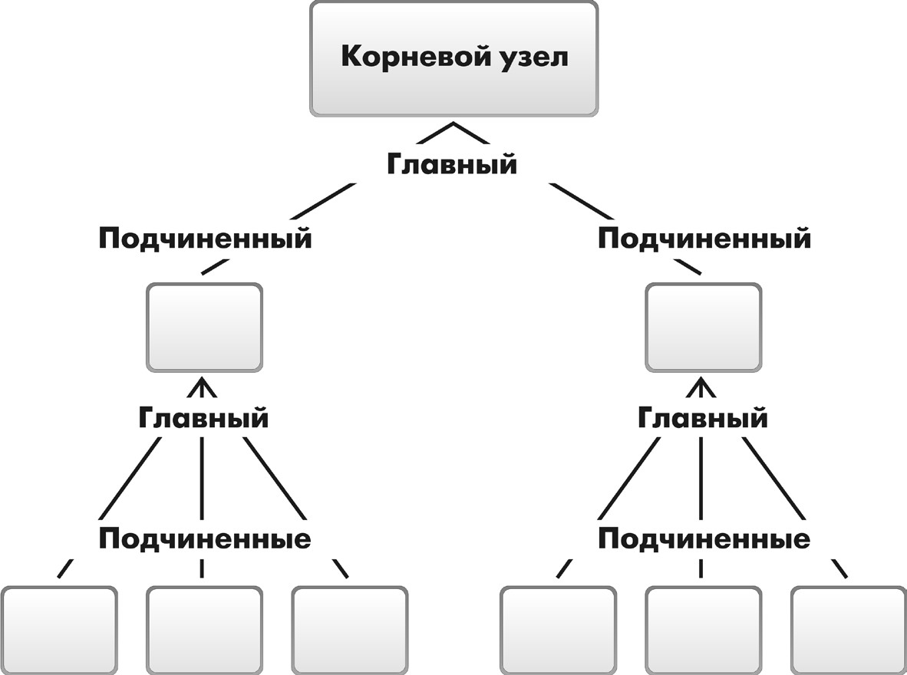

<strong>Рис. 24.18.</strong> Структура распределенной информационной базы

Таким образом, любой узел этой структуры может иметь произвольное количество подчиненных узлов (в том числе и ни
	одного). Кроме этого, все узлы, кроме одного, должны иметь по одному главному узлу, и один узел не будет иметь
	главного узла – это корневой узел. Такое жесткое задание структуры узлов необходимо для определения порядка миграции
	изменений данных и изменений конфигурации.

Конфигурация может быть изменена только в узле, не имеющем главного узла (то есть в корневом). Изменения данных могут
	выполняться в любом узле.

Изменения конфигурации будут передаваться от главного к подчиненным узлам. Изменения данных могут передаваться между
	любыми связанными узлами.

Разрешение коллизий также будет производиться исходя из отношения «главный – подчиненный». Если изменения выполнены
	одновременно и в главном, и в подчиненном узле, при обмене данными будут приняты только изменения главного узла, а
	изменения подчиненного отвергнуты.

Для любого подчиненного узла возможно создание <em>начального образа</em> – информационной базы, созданной на
	основании конфигурации и данных главного узла в соответствии с правилами, определяемыми планом обмена. Процедура
	создания начального образа узла может выполняться неоднократно, при этом удаляются все записи изменений в базе
	главного узла для подчиненного узла. Сразу после создания начальный образ готов к обмену с главным узлом.

Создать подчиненный узел в распределенной информационной базе можно разными способами, но создание начального образа
	является рекомендуемым.

<strong>Постановка задачи</strong>

В качестве примера, на котором мы проиллюстрируем использование механизма распределенных информационных баз, будет
	создание нескольких отделений нашего ООО «На все руки мастер». 

В отличие от филиалов, которые расположены в других городах, являются отдельными юридическими лицами и довольно
	самостоятельны в плане организации учета своей деятельности, отделения нашего предприятия расположены в этом же
	городе, никакой юридической самостоятельностью не обладают и ведут учет в точности так, как это организовано в
	главном офисе. 

Поэтому все они используют ту же конфигурацию, что и главный офис, причем если главный офис вносит какие-либо
	изменения в свою конфигурацию, они должны быть своевременно внесены и в конфигурации отделений.

Для реализации такой схемы работы распределенная информационная база подойдет как нельзя лучше, и сначала мы
	организуем обмен с отделениями, используя исключительно интерактивные средства.

<strong>Интерактивный обмен</strong>

<strong>В режиме «Конфигуратор»</strong>

Для построения распределенной информационной базы нам понадобится создать еще один объект конфигурации План обмена,
	который мы назовем Отделения, представление объекта – Отделение. 

Для этого плана обмена мы установим свойство Распределенная информационная база (рис. 24.19).

На закладке Поле ввода установим флажок Быстрый выбор, чтобы иметь возможность выбора узлов плана обмена из
	выпадающего списка. Затем определим состав объектов, участвующих в обмене. 

На закладке Основные нажмем кнопку Состав и определим тот же состав данных для обмена, что и в плане обмена
	Филиалы. 

Включим в обмен все объекты, не относящиеся к ведению бухгалтерии и расчету зарплаты. 

В результате состав данных обмена должен выглядеть следующим образом (рис. 24.20).

<strong>Рис. 24.20.</strong> Состав данных обмена

На закладке Подсистемы укажем принадлежность плана обмена к подсистеме Предприятие. 

В окне настройки командного интерфейса этой подсистемы перенесем команду для открытия плана обмена Отделения в группу
	Панель навигации.Важное (после команды Филиалы) и установим видимость этой команды только для роли Администратор. А
	также в группе команд Панель действий.Создать включим видимость у команды Отделение: создать только для роли
	Администратор.

<strong>В режиме «1С:Предприятие»</strong>

Запустим «1С:Предприятие» в режиме отладки. Откроем план обмена Отделения и зададим параметры центрального узла
	(предопределенный элемент плана обмена). Для этого выполним команду Отделения в панели команд раздела
	Предприятие. 

В списке планов обмена уже присутствует одна запись. Это предопределенный узел нашей информационной базы. Откроем и
	отредактируем его. 

Внесем код ЦБ и наименование Центральная база. После этого создадим новый узел с кодом Отд и наименованием
	Отделение. 

Для созданного нами узла доступны три кнопки в командной панели формы плана обмена: Записать изменения, Прочитать
	изменения и Создать начальный образ (рис. 24.21).

<strong>Рис. 24.21.</strong> Команды работы с распределенной информационной базой

Не откладывая, воспользуемся одной из них, чтобы создать начальный образ информационной базы нашего отделения. Для
	этого нам потребуется сначала создать на диске новый каталог, в котором будет располагаться база отделения. 

После этого выделим в списке узлов обмена узел Отделение, выполним команду Создать начальный образ. В появившемся
	окне укажем, что информационная база будет расположена на данном компьютере, и нажмем кнопку Создать начальный
	образ. На следующем шаге нажмем Сохранить и укажем каталог информационной базы (рис. 24.22).

<strong>Рис. 24.22.</strong> Создание начального образа информационной базы

Вернемся в диалог создания начального образа информационной базы и нажмем Закрыть. 

Система создаст в указанном каталоге начальный образ информационной базы нашего отделения. <strong>Запуск базы
	отделения</strong>

Теперь перейдем к базе отделения. 

Запустим «1С:Предприятие» и добавим в список баз созданную нами базу, расположенную в каталоге, в который мы
	поместили начальный образ информационной базы нашего отделения.

Для этого в окне запуска «1С:Предприятия» нажмем кнопку Добавить и выберем Добавление существующей информационной
	базы. 

Нажмем Далее, затем укажем наименование информационной базы, например, база Отделения. Нажмем Далее, затем укажем
	каталог информационной базы, например, D:\Практическое пособие разработчика 8.3\Отделение, нажмем Далее и затем
	Готово. 

В режиме «Конфигуратор»

Откроем созданную нами конфигурацию база Отделения в режиме Конфигуратор. 

Выполним команду главного меню Конфигурация  Открыть конфигурацию. Мы видим, что конфигурация нашего отделения стала
	защищенной от изменений средствами управления распределенной информационной базой (рис. 24.23).

от изменений средствами управления распределенной информационной базой

Выполним команду главного меню Администрирование  Пользо- ватели и создадим в конфигурации отделения одного
	пользователя – Администратор с ролью Администратор.

В режиме «1С:Предприятие»

Запустим базу отделения в режиме отладки и откроем план обмена Отделения (рис. 24.24).

<strong>Рис. 24.24.</strong> Узлы плана обмена «Отделения» 

Обратите внимание, что в базе подчиненного узла сам подчиненный узел (Отделение) является предопределенным узлом
	плана обмена, а узел центральной базы отмечен желтой пиктограммой, указывающей на то, что он является главным для
	информационной базы отделения. Кроме этого, для узла центральной базы доступны только команды Записать изменения и
	Прочитать изменения. 

Теперь проверим работу обмена данными. 

Откроем список констант и зададим значение константы ПрефиксНумерации – ОТ. 

<strong>подскАзкА</strong>

Если занятие № 24 Обмен данными выполняется после занятия № 25 Функциональные опции, в панели разделов может быть не
	видно каких-то разделов, использующихся в данном узле (например, Бухгалтерия). В этом случае откройте форму Общие
	настройки и проверьте значения функциональных опций, которые отвечают за видимость разделов (например, Бухгалтерский
	учет). Имейте в виду, что функциональные опции не копируются между узлами, а настраиваются в каждом узле
	отдельно.

После этого откроем справочник клиентов и добавим в него нового клиента. 

Затем откроем план обмена Отделения, выделим узел Центральная база (тот узел, в который нужно передать изменения) и
	выполним команду Записать изменения. В появившемся окне нажмем Записать и сохранить в файл, на следующем шаге нажмем
	Сохранить и укажем имя файла сообщения (рис. 24.25).

<strong>Рис. 24.25.</strong> Диалог записи сообщения с изменениями

Вернемся в диалог записи сообщения с изменениями и нажмем Закрыть. 

Перейдем в центральную базу. Откроем план обмена Отделения, выделим узел Отделение (тот узел, от которого нужно
	принять изменения) и выполним команду Прочитать изменения. В появившемся окне нажмем Выбрать файл и прочитать
	изменения и укажем имя файла сообщения. Вернемся в диалог чтения сообщения с изменениями и нажмем Закрыть. 

Убедимся, что новый клиент, созданный в базе отделения, присутствует и в центральной базе. Закроем окно
	«1С:Предприятия» для центральной базы.

Теперь посмотрим, как будут переноситься изменения конфигурации между главным и подчиненным узлами. В конфигураторе
	центральной базы создадим новую константу с именем НоваяКонстанта. А также добавим новый предопределенный элемент в
	справочник Склады с именем Офис. Выполним обновление конфигурации базы данных и запустим «1С:Предприятие» в режиме
	отладки. 

Откроем план обмена Отделения и выполним запись изменений для подчиненного узла Отделение. 

После этого закроем окно «1С:Предприятия» и конфигуратор информационной базы отделения, запустим эту базу в режиме
	1С:Предприятие и выполним чтение изменений от узла Центральная база. 

По окончании чтения система выдаст следующее сообщение 

(рис. 24.26).

Закроем окно «1С:Предприятия», откроем конфигуратор базы отделения и увидим, что в основной конфигурации появилась
	новая константа НоваяКонстанта, а также новый предопределенный элемент в справочнике Склады с именем Офис. То есть
	изменения, внесенные в конфигурацию центральной базы, были автоматически перенесены в конфигурацию подчиненного
	узла. 

Теперь единственное, что остается сделать, – это выполнить обновление конфигурации базы данных в подчиненном
	узле. 

Следует сказать несколько слов о порядке принятия изменений, когда в одном сообщении получены как изменения
	конфигурации, так и изменения данных. 

В этом случае сначала будет изменена основная конфигурация и выдано сообщение о необходимости выполнения обновления
	конфигурации базы данных. 

Но самих данных, например, новой записи в справочнике Склады, связанной с предопределенным элементом Офис, мы пока не
	увидим. 

Что касается предопределенных данных, то здесь не будет такой проблемы с дублированием данных, связанных с одним
	предопределенным элементом, как при выполнении универсального обмена данными. Дело в том, что автоматическое
	создание предопределенных данных в дочерних узлах распределенной информационной базы не производится.

Затем следует выполнить повторное получение данных, при котором будут приняты уже изменения данных, содержащиеся в
	сообщении. 

Такой порядок принятия изменений не зависит от того, относятся измененные данные к существующим объектам конфигурации
	или к новым.

В заключение удалим объект НоваяКонстанта из дерева объектов нашей конфигурации. Также удалим предопределенный
	элемент Офис из справочника Склады.

<strong>Программный обмен</strong>

Все описанные выше действия по обмену данными в распределенной информационной базе можно выполнить программно. 

Мы создадим обработку, которая будет программно выполнять для выбранного узла все те действия, которые были
	рассмотрены в предыдущем разделе.

<strong>В режиме «Конфигуратор»</strong>

В конфигураторе центральной базы создадим новый объект конфигурации Обработка с именем ОбменСОтделениями. 

На закладке Формы создадим основную форму обработки. В окне редактора форм на закладке Реквизиты добавим реквизит
	формы ПолеВводаОтделение с типом ПланОбменаСсылка.Отделения и перетащим его в окно элементов формы. 

В открывшейся палитре свойств этого поля зададим заголовок – Отделение, вид поля (Поле ввода) оставим по умолчанию
	(рис. 24.27).

<strong>Рис. 24.27.</strong> Редактирование формы обработки

Затем на закладке Команды поочередно создадим команды Соз- датьНачальныйОбраз, ЗаписатьИзменения и
	ПрочитатьИзменения. Нажмем кнопку открытия в строке Действие для каждой команды. 

Создадим клиентские обработчики этих команд в модуле формы, но заполнять их пока не будем, а перейдем на закладку
	Форма и поочередно перетащим эти команды в окно элементов формы. 

В результате форма обработки примет вид (рис. 24.28).

Откроем палитру свойств кнопки СоздатьНачальныйОбраз и снимем флажок у свойства Доступность. 

Таким образом, при открытии обработки кнопка будет недоступной, пока не выбран узел плана обмена в поле
	ПолеВводаОтделение. Эта кнопка также будет недоступной в случае выбора предопределенного узла нашей информационной
	базы, то есть создание начального образа невозможно, если выбранный узел является предопределенным. 

Чтобы обеспечить такое поведение кнопки, создадим в модуле формы обработки функцию, выполняющуюся на сервере и
	возвращающую истину, если переданный в функцию узел является предопределенным (листинг 24.25).

<strong>листинг 24.25.</strong> Функция «ПредопределенныйУзел()»

&amp;НаСервереБезКонтекста

<table>
	<tr>
		<td>
Функция ПредопределенныйУзел(Узел)
</td>
	</tr>
	<tr>
		<td></td>
	</tr>
	<tr>
		<td>
Возврат Узел = ПланыОбмена.Отделения.ЭтотУзел();
</td>
	</tr>
	<tr>
		<td></td>
	</tr>
	<tr>
		<td>
КонецФункции
</td>
	</tr>
</table>

Затем в окне элементов формы выделим элемент ПолеВводаОтделение, вызовем его палитру свойств и создадим клиентский
	обработчик события ОбработкаВыбора. 

Заполним обработчик следующим образом (листинг 24.26).

<strong>листинг 24.26.</strong> Процедура «ПолеВводаОтделениеОбработкаВыбора()»

<table>
	<tr>
		<td>
&amp;НаКлиенте
</td>
	</tr>
	<tr>
		<td></td>
	</tr>
	<tr>
		<td>
Процедура ПолеВводаОтделениеОбработкаВыбора(Элемент, ВыбранноеЗначение, СтандартнаяОбработка)
</td>
	</tr>
	<tr>
		<td></td>
	</tr>
	<tr>
		<td></td>
	</tr>
	<tr>
		<td></td>
	</tr>
	<tr>
		<td>
Если ПредопределенныйУзел(ВыбранноеЗначение)Тогда
</td>
	</tr>
	<tr>
		<td></td>
	</tr>
	<tr>
		<td>
Элементы.СоздатьНачальныйОбраз.Доступность = Ложь;
</td>
	</tr>
	<tr>
		<td></td>
	</tr>
	<tr>
		<td>
Иначе
</td>
	</tr>
	<tr>
		<td></td>
	</tr>
	<tr>
		<td>
Элементы.СоздатьНачальныйОбраз.Доступность = Истина;
</td>
	</tr>
	<tr>
		<td></td>
	</tr>
	<tr>
		<td>
КонецЕсли;
</td>
	</tr>
	<tr>
		<td></td>
	</tr>
	<tr>
		<td></td>
	</tr>
	<tr>
		<td></td>
	</tr>
	<tr>
		<td>
КонецПроцедуры
</td>
	</tr>
</table>

В этой процедуре доступность кнопки СоздатьНачальныйОбраз определяется в зависимости от значения функции
	ПредопределенныйУзел(), в которую передается ссылка на выбранный узел (ВыбранноеЗначение).

Теперь заполним обработчик команды СоздатьНачальныйОбраз следующим образом (листинг 24.27). <strong>листинг
	24.27.</strong> Обработчик нажатия кнопки «Создать начальный образ»

<table>
	<tr>
		<td>
&amp;НаКлиенте
</td>
	</tr>
	<tr>
		<td></td>
	</tr>
	<tr>
		<td>
Процедура СоздатьНачальныйОбраз(Команда)
</td>
	</tr>
	<tr>
		<td></td>
	</tr>
	<tr>
		<td></td>
	</tr>
	<tr>
		<td></td>
	</tr>
	<tr>
		<td>
Диалог = Новый ДиалогВыбораФайла(РежимДиалогаВыбораФайла.ВыборКаталога);
</td>
	</tr>
	<tr>
		<td></td>
	</tr>
	<tr>
		<td>
Диалог.Заголовок = &quot;Укажите каталог информационной базы:&quot;;
</td>
	</tr>
	<tr>
		<td></td>
	</tr>
	<tr>
		<td>
Если Диалог.Выбрать() Тогда
</td>
	</tr>
	<tr>
		<td></td>
	</tr>
	<tr>
		<td>
СоздатьНачальныйОбразНаСервере(ПолеВводаОтделение, Диалог.Каталог);
</td>
	</tr>
	<tr>
		<td></td>
	</tr>
	<tr>
		<td></td>
	</tr>
	<tr>
		<td></td>
	</tr>
	<tr>
		<td>
Сообщение = Новый СообщениеПользователю;
</td>
	</tr>
	<tr>
		<td></td>
	</tr>
	<tr>
		<td>
Сообщение.Текст = &quot;Создание начального образа узла завершено.&quot;;
</td>
	</tr>
	<tr>
		<td></td>
	</tr>
	<tr>
		<td>
Сообщение.Сообщить();
</td>
	</tr>
	<tr>
		<td></td>
	</tr>
	<tr>
		<td>
КонецЕсли;
</td>
	</tr>
	<tr>
		<td></td>
	</tr>
	<tr>
		<td></td>
	</tr>
	<tr>
		<td></td>
	</tr>
	<tr>
		<td>
КонецПроцедуры
</td>
	</tr>
</table>

В начале процедуры мы вызываем диалог выбора каталога, в который будет помещен образ информационной базы, и затем
	вызываем процедуру СоздатьНачальныйОбразНаСервере(), исполняющуюся на сервере без контекста, в которой вызывается
	метод СоздатьНачальныйОбраз() объекта ПланыОбменаМенеджер. 

Именно этот метод и позволяет нам создать образ для подчиненного узла распределенной информационной базы. В первом
	параметре метода передается ссылка на узел (реквизит формы ПолеВводаОтделение), для которого мы хотим создать
	начальный образ, а во втором – строка соединения, указывающая информационную базу (листинг 24.28).

<strong>листинг 24.28.</strong> Процедура «СоздатьНачальныйОбразНаСервере»

<table>
	<tr>
		<td>
&amp;НаСервереБезКонтекста
</td>
	</tr>
	<tr>
		<td></td>
	</tr>
	<tr>
		<td>
Процедура СоздатьНачальныйОбразНаСервере(Узел, КаталогСоединения)
</td>
	</tr>
	<tr>
		<td></td>
	</tr>
	<tr>
		<td>
ПланыОбмена.СоздатьНачальныйОбраз(Узел, &quot;File =&quot;&quot;&quot; + КаталогСоединения + &quot;&quot;&quot;&quot;);

		</td>
	</tr>
	<tr>
		<td></td>
	</tr>
	<tr>
		<td>
КонецПроцедуры
</td>
	</tr>
</table>

Теперь создадим обработчик команды Записать изменения. 

Текст обработчика будет выглядеть следующим образом 

(листинг 24.29).

<strong>листинг 24.29.</strong> Обработчик нажатия кнопки «Записать изменения»

<table>
	<tr>
		<td>
&amp;НаКлиенте
</td>
	</tr>
	<tr>
		<td></td>
	</tr>
	<tr>
		<td>
Процедура ЗаписатьИзменения(Команда)
</td>
	</tr>
	<tr>
		<td></td>
	</tr>
	<tr>
		<td></td>
	</tr>
	<tr>
		<td></td>
	</tr>
	<tr>
		<td>
Диалог = Новый ДиалогВыбораФайла(РежимДиалогаВыбораФайла.Сохранение);
</td>
	</tr>
	<tr>
		<td></td>
	</tr>
	<tr>
		<td>
Диалог.Заголовок = &quot;Укажите файл обмена:&quot;;
</td>
	</tr>
	<tr>
		<td></td>
	</tr>
	<tr>
		<td>
Если Диалог.Выбрать() Тогда
</td>
	</tr>
	<tr>
		<td></td>
	</tr>
	<tr>
		<td>
ЗаписатьИзмененияНаСервере(ПолеВводаОтделение, Диалог.ПолноеИмяФайла);
</td>
	</tr>
	<tr>
		<td></td>
	</tr>
	<tr>
		<td></td>
	</tr>
	<tr>
		<td></td>
	</tr>
	<tr>
		<td>
Сообщение = Новый СообщениеПользователю;
</td>
	</tr>
	<tr>
		<td></td>
	</tr>
	<tr>
		<td>
Сообщение.Текст = &quot;Запись изменений завершена.&quot;;
</td>
	</tr>
	<tr>
		<td></td>
	</tr>
	<tr>
		<td>
Сообщение.Сообщить();
</td>
	</tr>
	<tr>
		<td></td>
	</tr>
	<tr>
		<td>
КонецЕсли;
</td>
	</tr>
	<tr>
		<td></td>
	</tr>
	<tr>
		<td></td>
	</tr>
	<tr>
		<td></td>
	</tr>
	<tr>
		<td>
КонецПроцедуры
</td>
	</tr>
</table>

В начале процедуры мы вызываем диалог ввода имени файла, в который будут записаны изменения, и затем вызываем
	процедуру ЗаписатьИзмененияНаСервере(), исполняющуюся на сервере без контекста. В первом параметре метода передается
	ссылка на узел (реквизит формы ПолеВводаОтделение), для которого будет производиться запись изменений.

В этой процедуре мы создаем объект ЗаписьXML для работы с этим файлом. 

Затем создаем объект ЗаписьСообщенияОбмена, с помощью которого будем делать сообщение обмена. В методе
	НачатьЗапись(), во втором параметре, мы указываем, для какого узла обмена будет создаваться это сообщение. 

После этого мы выполняем метод ЗаписатьИзменения() объекта ПланыОбменаМенеджер, который и записывает изменения,
	предназначенные для передачи в выбранный узел, в указанное сообщение обмена. 

В заключение мы, как обычно, заканчиваем запись сообщения обмена и закрываем файл (листинг 24.30).

<strong>листинг 24.30.</strong> Процедура «ЗаписатьИзмененияНаСервере»

<table>
	<tr>
		<td>
&amp;НаСервереБезКонтекста
</td>
	</tr>
	<tr>
		<td></td>
	</tr>
	<tr>
		<td>
Процедура ЗаписатьИзмененияНаСервере(Узел, ИмяФайла)
</td>
	</tr>
	<tr>
		<td></td>
	</tr>
	<tr>
		<td></td>
	</tr>
	<tr>
		<td></td>
	</tr>
	<tr>
		<td>
// Создать и проинициализировать объект ЗаписьXML. 
</td>
	</tr>
	<tr>
		<td></td>
	</tr>
	<tr>
		<td>
ЗаписьXML = Новый ЗаписьXML;
</td>
	</tr>
	<tr>
		<td></td>
	</tr>
	<tr>
		<td>
ЗаписьXML.ОткрытьФайл(ИмяФайла);
</td>
	</tr>
	<tr>
		<td></td>
	</tr>
	<tr>
		<td></td>
	</tr>
	<tr>
		<td></td>
	</tr>
	<tr>
		<td>
// Создать объект ЗаписьСообщенияОбмена и начать запись сообщения.
</td>
	</tr>
	<tr>
		<td></td>
	</tr>
	<tr>
		<td>
ЗаписьСообщения = ПланыОбмена.СоздатьЗаписьСообщения();
</td>
	</tr>
	<tr>
		<td></td>
	</tr>
	<tr>
		<td>
ЗаписьСообщения.НачатьЗапись(ЗаписьXML, Узел);
</td>
	</tr>
	<tr>
		<td></td>
	</tr>
	<tr>
		<td></td>
	</tr>
	<tr>
		<td></td>
	</tr>
	<tr>
		<td>
// Записать содержимое тела сообщения обмена данными распределенной ИБ.
</td>
	</tr>
	<tr>
		<td></td>
	</tr>
	<tr>
		<td>
ПланыОбмена.ЗаписатьИзменения(ЗаписьСообщения); 
</td>
	</tr>
	<tr>
		<td></td>
	</tr>
	<tr>
		<td></td>
	</tr>
	<tr>
		<td></td>
	</tr>
	<tr>
		<td>
// Закончить запись сообщения и запись XML.
</td>
	</tr>
	<tr>
		<td></td>
	</tr>
	<tr>
		<td>
ЗаписьСообщения.ЗакончитьЗапись();
</td>
	</tr>
	<tr>
		<td></td>
	</tr>
	<tr>
		<td>
ЗаписьXML.Закрыть(); 
</td>
	</tr>
	<tr>
		<td></td>
	</tr>
	<tr>
		<td></td>
	</tr>
	<tr>
		<td></td>
	</tr>
	<tr>
		<td>
КонецПроцедуры
</td>
	</tr>
</table>

<strong>УзнАй больше!</strong>

<em>Следует отметить, что метод «ЗаписатьИзменения()» позволяет задать максимальное число элементов данных, которые
	помещаются в сообщение в рамках одной транзакции базы данных. По умолчанию все данные помещаются в сообщение в
	рамках одной транзакции.</em>

<em>Такой режим является рекомендуемым, так как гарантирует согласованность данных, помещаемых в сообщение. </em>

<em>Но при создании сообщения в многопользовательском режиме могут быть конфликты блокировок между транзакцией, в
	которой данные помещаются в сообщение, и транзакциями, выполняемыми другими пользователями. Для снижения вероятности
	возникновения таких конфликтов можно задать значение этого параметра, отличное от значения по умолчанию. Чем меньше
	значение параметра, тем меньше вероятность конфликта блокировок, но выше вероятность помещения в сообщение
	несогласованных данных.</em>

<em>Учитывая все вышесказанное, идеальным вариантом является выполнение обмена данными в монопольном режиме. Однако
	такой вариант не всегда приемлем в силу специфики организации работы конкретных информационных баз.</em>

И последним мы создадим обработчик команды Прочитать изменения. 

Текст обработчика будет выглядеть следующим образом 

(листинг 24.31).

<strong>листинг 24.31.</strong> Обработчик нажатия кнопки «Прочитать изменения»

<table>
	<tr>
		<td>
&amp;НаКлиенте
</td>
	</tr>
	<tr>
		<td></td>
	</tr>
	<tr>
		<td>
Процедура ПрочитатьИзменения(Команда)
</td>
	</tr>
	<tr>
		<td></td>
	</tr>
	<tr>
		<td></td>
	</tr>
	<tr>
		<td></td>
	</tr>
	<tr>
		<td>
Диалог = Новый ДиалогВыбораФайла(РежимДиалогаВыбораФайла.Открытие);
</td>
	</tr>
	<tr>
		<td></td>
	</tr>
	<tr>
		<td>
Диалог.Заголовок = &quot;Укажите файл обмена:&quot;;
</td>
	</tr>
	<tr>
		<td></td>
	</tr>
	<tr>
		<td>
Если Диалог.Выбрать() Тогда
</td>
	</tr>
	<tr>
		<td></td>
	</tr>
	<tr>
		<td>
ПрочитатьИзмененияНаСервере(Диалог.ПолноеИмяФайла);
</td>
	</tr>
	<tr>
		<td></td>
	</tr>
	<tr>
		<td></td>
	</tr>
	<tr>
		<td></td>
	</tr>
	<tr>
		<td>
Сообщение = Новый СообщениеПользователю;
</td>
	</tr>
	<tr>
		<td></td>
	</tr>
	<tr>
		<td>
Сообщение.Текст = &quot;Чтение изменений завершено.&quot;;
</td>
	</tr>
	<tr>
		<td></td>
	</tr>
	<tr>
		<td>
Сообщение.Сообщить();
</td>
	</tr>
	<tr>
		<td></td>
	</tr>
	<tr>
		<td>
КонецЕсли;
</td>
	</tr>
	<tr>
		<td></td>
	</tr>
	<tr>
		<td></td>
	</tr>
	<tr>
		<td></td>
	</tr>
	<tr>
		<td>
КонецПроцедуры
</td>
	</tr>
</table>

В начале процедуры мы снова вызываем диалог выбора имени файла, который будет прочитан, и затем вызываем процедуру
	ПрочитатьИзмененияНаСервере(), исполняющуюся на сервере без контекста. 

В этой процедуре мы создаем объект ЧтениеXML для работы с этим файлом. Затем создаем объект ЧтениеСообщенияОбмена для
	чтения сообщения, содержащегося в указанном файле. 

Затем методом ПрочитатьИзменения() объекта ПланыОбменаМенеджер мы читаем полученное сообщение. 

В заключение процедуры мы завершаем чтение сообщения обмена и закрываем файл (листинг 24.32).

<strong>листинг 24.32.</strong> Процедура «ПрочитатьИзмененияНаСервере»

&amp;НаСервереБезКонтекста

<table>
	<tr>
		<td>
Процедура ПрочитатьИзмененияНаСервере(ИмяФайла)
</td>
	</tr>
	<tr>
		<td></td>
	</tr>
	<tr>
		<td></td>
	</tr>
	<tr>
		<td>
// Создать и проинициализировать объект ЧтениеXML. 
</td>
	</tr>
	<tr>
		<td>
ЧтениеXML = Новый ЧтениеXML;
</td>
	</tr>
	<tr>
		<td>
ЧтениеXML.ОткрытьФайл(ИмяФайла);
</td>
	</tr>
	<tr>
		<td></td>
	</tr>
	<tr>
		<td>
// Создать объект ЧтениеСообщенияОбмена и начать чтение сообщения.
</td>
	</tr>
	<tr>
		<td>
ЧтениеСообщения = ПланыОбмена.СоздатьЧтениеСообщения();
</td>
	</tr>
	<tr>
		<td>
ЧтениеСообщения.НачатьЧтение(ЧтениеXML);
</td>
	</tr>
	<tr>
		<td></td>
	</tr>
	<tr>
		<td>
// Прочитать содержимое тела сообщения.
</td>
	</tr>
	<tr>
		<td>
ПланыОбмена.ПрочитатьИзменения(ЧтениеСообщения);
</td>
	</tr>
	<tr>
		<td></td>
	</tr>
	<tr>
		<td>
// Закончить чтение сообщения и чтение XML.
</td>
	</tr>
	<tr>
		<td>
ЧтениеСообщения.ЗакончитьЧтение();
</td>
	</tr>
	<tr>
		<td>
ЧтениеXML.Закрыть();
</td>
	</tr>
	<tr>
		<td></td>
	</tr>
	<tr>
		<td>
КонецПроцедуры
</td>
	</tr>
</table>

В заключение на закладке Подсистемы укажем принадлежность обработки ОбменСОтделениями к подсистеме Предприятие. 

Теперь настроим командный интерфейс основного раздела для администратора. Вызовем окно настройки командного
	интерфейса (Открыть командный интерфейс основного раздела) из контекстного меню корня дерева объектов конфигурации.
	Добавим команды для открытия форм Общие настройки, Обмен данными и Обмен с отделениями в список команд основного
	раздела и зададим видимость этих форм только для роли Администратор (рис. 24.29).

<strong>Рис. 24.29.</strong> Настройка командного интерфейса основного раздела для администратора

А также расположим формы списка планов обмена Филиалы и Отделения на начальной странице администратора. Вызовем
	настройку начальной страницы (Открыть рабочую область начальной страницы) из контекстного меню корня дерева объектов
	конфигурации. 

Создадим форму списка плана обмена Отделения. Добавим формы списка планов обмена Филиалы и Отделения в левую часть
	начальной страницы и зададим видимость этих форм только для роли Администратор (рис. 24.30).

<strong>Рис. 24.30.</strong> Настройка начальной страницы для администратора

Теперь выполним пример программного обмена данными. 

<strong>подскАзкА</strong>

При выполнении примера обмена данными нужно правильно задавать узел, в который записываются и от которого принимаются
	изменения. Например, после изменения данных в центральной базе в списке узлов плана обмена нужно выбрать подчиненный
	узел, которому будут передаваться данные (например, Отделение), и нажать кнопку Записать изменения. А в базе узла, в
	который будут загружаться данные, в списке узлов плана обмена нужно выбрать узел, из которого данные были выгружены
	(например, Центральная база), и нажать кнопку Прочитать изменения.

Запустим «1С:Предприятие» для пользователя с ролью Администратор. Откроется начальная страница приложения (рис.
	24.31).

<strong>Рис. 24.31.</strong> Начальная страница «1С:Предприятия» для администратора

Из командной панели раздела Главное, из подменю Сервис откроем форму обработки Обмен с отделениями. Выберем в поле
	ввода Отделение узел обмена Отделение, для которого мы хотим создать начальный образ нашей информационной базы (рис.
	24.32).

Затем выполним команду Создать начальный образ. Создадим каталог, куда будет выгружен начальный образ информационной
	базы, и укажем его в диалоге выбора каталога. 

Теперь создадим в центральной базе нового сотрудника. В форме Обмен с отделениями выберем в поле ввода Отделение узел
	обмена Отделение, в который мы хотим передать изменения. Нажмем кнопку Записать изменения и укажем имя файла
	сообщения с изменениями.

Затем откроем базу отделения (куда был выгружен начальный образ центральной базы) в конфигураторе. Создадим в ней
	пользователя с ролью Администратор и запустим «1С:Предприятие». На начальной странице в форме Обмен с отделениями
	выберем в поле ввода Отделение узел обмена Центральная база, от которого мы хотим принять изменения. Нажмем кнопку
	Прочитать изменения и укажем имя файла сообщения с изменениями.

<strong>Рис. 24.32.</strong> Пример программного обмена с отделениями

Убедимся, что сотрудник центральной базы (с префиксом кода ЦБ) присутствует в базе отделения.

Следует лишь сделать несколько заключительных замечаний. 

При использовании механизма распределенных информационных баз становятся доступными четыре события объекта
	встроенного языка ПланОбменаОбъект.&lt;имя&gt;, которые позволяют управлять отправкой и приемом данных на уровне
	отдельных элементов данных:

<ul>
	<li>ПриОтправкеДанныхГлавному(),</li>
	<li>ПриОтправкеДанныхПодчиненному(),</li>
	<li>ПриПолученииДанныхОтГлавного(),</li>
	<li>ПриПолученииДанныхОтПодчиненного().</li>
</ul>

Эти события будут вызываться для каждого элемента данных, включаемого в сообщение. 

Работу этих событий можно увидеть, добавив в модуль объекта План обмена Отделения следующий текст (листинг
	24.33).

<strong>листинг 24.33.</strong> Просмотр работы событий объекта «ПланОбменаОбъект»

Процедура ПриОтправкеДанныхГлавному(ЭлементДанных, ОтправкаЭлемента)

<table>
	<tr>
		<td></td>
	</tr>
	<tr>
		<td></td>
	</tr>
	<tr>
		<td>
Сообщение = Новый СообщениеПользователю;
</td>
	</tr>
	<tr>
		<td></td>
	</tr>
	<tr>
		<td>
Сообщение.Текст = &quot;ПриОтправкеДанныхГлавному &quot; + ЭлементДанных;
</td>
	</tr>
	<tr>
		<td></td>
	</tr>
	<tr>
		<td>
Сообщение.Сообщить();
</td>
	</tr>
	<tr>
		<td></td>
	</tr>
	<tr>
		<td></td>
	</tr>
	<tr>
		<td></td>
	</tr>
	<tr>
		<td>
КонецПроцедуры 
</td>
	</tr>
	<tr>
		<td></td>
	</tr>
	<tr>
		<td></td>
	</tr>
	<tr>
		<td></td>
	</tr>
	<tr>
		<td>
Процедура ПриОтправкеДанныхПодчиненному(ЭлементДанных, ОтправкаЭлемента)
</td>
	</tr>
	<tr>
		<td></td>
	</tr>
	<tr>
		<td></td>
	</tr>
	<tr>
		<td></td>
	</tr>
	<tr>
		<td>
Сообщение = Новый СообщениеПользователю;
</td>
	</tr>
	<tr>
		<td></td>
	</tr>
	<tr>
		<td>
Сообщение.Текст = &quot;ПриОтправкеДанныхПодчиненному &quot; + ЭлементДанных;
</td>
	</tr>
	<tr>
		<td></td>
	</tr>
	<tr>
		<td>
Сообщение.Сообщить();
</td>
	</tr>
	<tr>
		<td></td>
	</tr>
	<tr>
		<td></td>
	</tr>
	<tr>
		<td></td>
	</tr>
	<tr>
		<td>
КонецПроцедуры
</td>
	</tr>
	<tr>
		<td></td>
	</tr>
	<tr>
		<td></td>
	</tr>
	<tr>
		<td></td>
	</tr>
	<tr>
		<td>
Процедура ПриПолученииДанныхОтГлавного(ЭлементДанных, ПолучениеЭлемента, ОтправкаНазад)
</td>
	</tr>
	<tr>
		<td></td>
	</tr>
	<tr>
		<td></td>
	</tr>
	<tr>
		<td></td>
	</tr>
	<tr>
		<td>
Сообщение = Новый СообщениеПользователю;
</td>
	</tr>
	<tr>
		<td></td>
	</tr>
	<tr>
		<td>
Сообщение.Текст = &quot;ПриПолученииДанныхОтГлавного &quot; + ЭлементДанных;
</td>
	</tr>
	<tr>
		<td></td>
	</tr>
	<tr>
		<td>
Сообщение.Сообщить();
</td>
	</tr>
	<tr>
		<td></td>
	</tr>
	<tr>
		<td></td>
	</tr>
	<tr>
		<td></td>
	</tr>
	<tr>
		<td>
КонецПроцедуры
</td>
	</tr>
	<tr>
		<td></td>
	</tr>
	<tr>
		<td></td>
	</tr>
	<tr>
		<td></td>
	</tr>
	<tr>
		<td>
Процедура ПриПолученииДанныхОтПодчиненного(ЭлементДанных, 
</td>
	</tr>
	<tr>
		<td></td>
	</tr>
	<tr>
		<td>
ПолучениеЭлемента, ОтправкаНазад)
</td>
	</tr>
	<tr>
		<td></td>
	</tr>
	<tr>
		<td></td>
	</tr>
	<tr>
		<td></td>
	</tr>
	<tr>
		<td>
Сообщение = Новый СообщениеПользователю;
</td>
	</tr>
	<tr>
		<td></td>
	</tr>
	<tr>
		<td>
Сообщение.Текст = &quot;ПриПолученииДанныхОтПодчиненного &quot; + ЭлементДанных;
</td>
	</tr>
	<tr>
		<td></td>
	</tr>
	<tr>
		<td>
Сообщение.Сообщить();
</td>
	</tr>
	<tr>
		<td></td>
	</tr>
	<tr>
		<td></td>
	</tr>
	<tr>
		<td></td>
	</tr>
	<tr>
		<td>
КонецПроцедуры
</td>
	</tr>
</table>

В первом параметре всех перечисленных событий находится тот элемент данных, для которого вызвано это событие. 

Параметр ОтправкаЭлемента позволяет управлять тем, какая информация будет помещена в сообщение. Он может принимать
	три значения:

<ul>
	<li>Авто – значение по умолчанию. Указывает на то, что элемент данных будет помещен в сообщение;</li>
	<li>Удалить – в сообщение будет помещено значение, предназначенное для удаления этого элемента данных;</li>
	<li>Игнорировать – в сообщение не будет помещено ничего, связан-</li>
</ul>

ного с этим элементом данных.

Параметр ПолучениеЭлемента позволяет указать, будет ли прочитанный элемент данных записан в базу данных или нет.
	Параметр также может принимать три значения:

<ul>
	<li>Авто – значение по умолчанию. Если элемент данных получен от главного узла, он будет записан всегда. Если
		элемент данных получен от подчиненного узла, он будет записан, только если не зарегистрированы изменения для
		этого элемента данных;
	</li>
	<li>Принять – полученный элемент данных будет записан всегда;</li>
	<li>Игнорировать – проигнорировать получение элемента данных и ничего не записывать.</li>
</ul>

Также в событиях получения данных существует третий параметр – ОтправкаНазад, имеющий тип Булево. 

Этот параметр позволяет выполнять принудительную регистрацию изменений для полученного элемента данных в
	базе-получателе. 

Такая необходимость может возникнуть, например, когда при приеме данных от узла-отправителя обнаружено, что
	полученные данные противоречивы (например, в узле-отправителе была допущена ошибка при изменении данных). 

Тогда мы можем проигнорировать присланные изменения и, установив флажок ОтправкаНазад, вызвать принудительную
	регистрацию изменений полученного элемента данных в нашей базе для узла-отправителя. 

В результате последующего обмена состояние этого элемента данных в узле-отправителе будет установлено таким же, как и
	в нашей базе.

<strong>Изменение структуры узлов</strong>

В заключение следует сказать о том, что механизм распределенных информационных баз содержит программное средство
	реконфигурирования структуры узлов распределенной базы.

Для этого следует использовать метод УстановитьГлавныйУзел() объекта ПланыОбменаМенеджер. 

В параметре этого метода передается ссылка на узел плана обмена распределенной информационной базы, который
	устанавливается главным для текущей базы. Также в этом параметре может быть передано значение Неопределено, и это
	приведет к тому, что у текущей информационной базы будет отсутствовать главный узел.

Допустим, необходимо переместить один из подчиненных узлов в корень дерева (рис. 24.33).

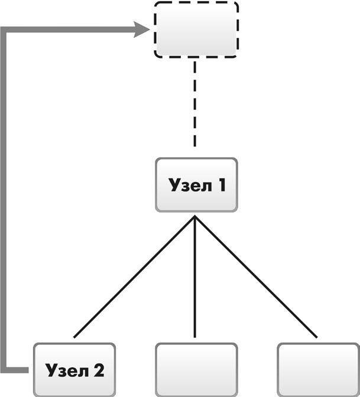

<strong>Рис. 24.33.</strong> Реконфигурирование структуры узлов Для этого нужно выполнить следующие действия (листинг
	24.34). <strong>листинг 24.34.</strong> Перемещение Узла2 в корень дерева

<table>
	<tr>
		<td>
// В информационной базе Узла2.
</td>
	</tr>
	<tr>
		<td></td>
	</tr>
	<tr>
		<td>
ПланыОбменаМенеджер.УстановитьГлавныйУзел(Неопределено);
</td>
	</tr>
	<tr>
		<td></td>
	</tr>
	<tr>
		<td></td>
	</tr>
	<tr>
		<td></td>
	</tr>
	<tr>
		<td>
// В информационной базе Узла1.
</td>
	</tr>
	<tr>
		<td></td>
	</tr>
	<tr>
		<td>
ПланыОбменаМенеджер.УстановитьГлавныйУзел(Узел2);
</td>
	</tr>
</table>

При этом будут удалены все записи регистрации изменений конфигурации Узла1, относящиеся к Узлу2, т. к. передача
	изменений конфигурации будет возможна теперь только от Узла2 к Узлу1. Записи регистрации изменения данных удалены не
	будут, так как передача изменений данных будет по-прежнему возможна между этими узлами.

Таким же образом, используя значение параметра метода Неопределено, мы можем отключать от дерева отдельную
	информационную базу или целое поддерево (рис. 24.34, листинг 24.35). <strong>листинг 24.35.</strong> Перемещение
	Узла2 в корень дерева

<table>
	<tr>
		<td>
// В информационной базе Узла1.
</td>
	</tr>
	<tr>
		<td></td>
	</tr>
	<tr>
		<td>
ПланыОбменаМенеджер.УстановитьГлавныйУзел(Неопределено);
</td>
	</tr>
</table>

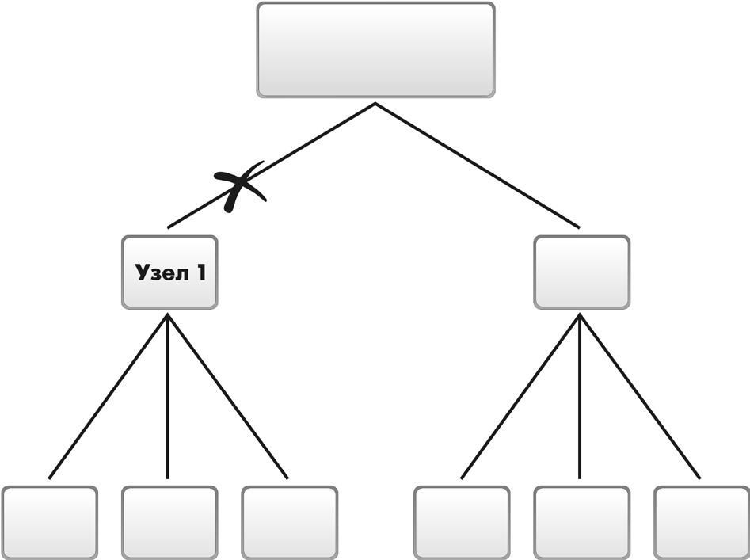

<strong>Рис. 24.34.</strong> Отключение поддерева от распределенной информационной базы

Кроме этого, мы можем создавать распределенную информационную базу из отдельных информационных баз с идентичной
	конфигурацией (рис. 24.35, листинг 24.36).

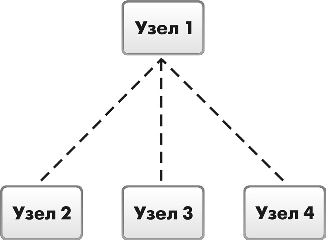

<strong>Рис. 24.35.</strong> Информационная база из отдельных информационных баз с идентичной конфигурацией

<strong>листинг 24.36.</strong> Создание распределенной информационной базы 

из баз с идентичной конфигурацией

<table>
	<tr>
		<td>
// В информационных базах Узла2, Узла3 и Узла4.
</td>
	</tr>
	<tr>
		<td></td>
	</tr>
	<tr>
		<td>
ПланыОбменаМенеджер.УстановитьГлавныйУзел(Узел1);
</td>
	</tr>
</table>
<h1>Лабораторная работа № 42 Создание новой заданной конфигурации</h1>

<strong>Опции «Бухгалтерский учет» и «Расчет зарплаты»</strong>

Предположим, что косметический салон по каким-то причинам не ведет бухгалтерский учет и расчет заработной платы. Для
	отключения соответствующей функциональности мы создадим функциональные опции БухгалтерскийУчет и РасчетЗарплаты,
	установим их для соответствующих объектов конфигурации и отключим их в режиме 1С:Предприятие. 

Таким образом, при совершенно одинаковой конфигурации в прикладном решении косметического салона не будет видно
	никаких действий, связанных с расчетом зарплаты и ведением бухучета, как будто их и нет вовсе.

<strong>В режиме «Конфигуратор»</strong>

Поскольку значения функциональных опций обязательно должны где-то храниться, добавим сначала константы
	БухгалтерскийУчет и РасчетЗарплаты с типом Булево, в которых будут храниться значения функциональных опций (рис.
	25.1).

<strong>Рис. 25.1.</strong> Создание константы

Если значение константы Истина, значит, функциональная опция включена. Если значение Ложь, функциональная опция
	выключена.

Затем раскроем ветвь Общие, выделим ветвь Функциональные опции и создадим функциональные опции БухгалтерскийУчет и
	РасчетЗарплаты, указав в свойстве Хранение соответствующие константы (рис. 25.2).

<strong>Рис. 25.2.</strong> Создание функциональной опции

Теперь нам нужно привязать объекты конфигурации к функциональным опциям.

К ведению бухгалтерского учета в нашей конфигурации относятся следующие объекты:

<ul>
	<li>справочник Субконто,</li>
	<li>документ ВводНачальныхОстатковНоменклатуры,</li>
	<li>отчет ОборотноСальдоваяВедомость,</li>
	<li>план видов характеристик ВидыСубконто,</li>
	<li>план счетов Основной,</li>
	<li>регистр бухгалтерии Управленческий.</li>
</ul>

На закладке Состав отметим эти объекты для функциональной опции БухгалтерскийУчет (рис. 25.3).

К расчету заработной платы в нашей конфигурации относятся следующие объекты:

<ul>
	<li>справочник ВидыГрафиковРаботы,</li>
	<li>документ НачисленияСотрудникам,</li>
	<li>отчет НачисленияСотрудникам,</li>
	<li>отчет Перерасчет,</li>
	<li>отчет ДиаграммаНачислений,</li>
	<li>план видов расчета ОсновныеНачисления,</li>
	<li>регистр сведений ГрафикиРаботы,  регистр расчета Начисления.</li>
</ul>

На закладке Состав отметим эти объекты для функциональной опции РасчетЗарплаты.

Теперь, если мы откроем окно редактирования объекта конфигурации Справочник Субконто или любого другого объекта
	конфигурации, входящего в состав функциональной опции БухгалтерскийУчет, то эта опция будет включена на закладке
	Функциональные опции окна редактирования этого объекта (рис. 25.4).

<strong>Рис. 25.4.</strong> Значение функциональных опций для объектов бухгалтерского учета

Таким образом, отображение объектов конфигурации в интерфейсе приложения зависит от того, включена связанная с ними
	функциональная опция (значение соответствующей константы – Истина) или нет.

У объектов, относящихся к расчету зарплаты, мы увидим включенной функциональную опцию РасчетЗарплаты на закладке
	Функциональные опции окна редактирования этих объектов.

Для остальных объектов конфигурации на закладке Функциональные опции ничего не отмечено. Если функциональная опция
	для объекта выключена, это значит, что данный объект не зависит от значения функциональной опции и отображается
	всегда (рис. 25.5).

<strong>пРиМеЧАние</strong>

Если включить в состав функциональной опции какую-либо подсистему, то мы вообще не увидим соответствующего раздела в
	«1С:Предприятии», пока данная функциональная опция отключена.

После этого раскроем ветвь Общие формы и откроем общую форму констант. Эту форму с именем ОбщиеНастройки мы создали
	на предыдущем занятии, и она уже содержит константу ПрефиксНумерации. 

Теперь нам нужно добавить в нее новые константы, чтобы затем в пользовательском режиме открывать форму констант и
	изменять значение функциональных опций.

На закладке Реквизиты этой формы раскроем основной реквизит НаборКонстант и перетащим константы БухгалтерскийУчет и
	РасчетЗарплаты в окно элементов формы (рис. 25.6).

<strong>Рис. 25.6.</strong> Редактирование общей формы констант

<strong>В режиме «1С:Предприятие»</strong>

Запустим «1С:Предприятие» в режиме отладки и проверим работу функциональных опций. В панели команд раздела Главное
	выполним команду Общие настройки. 

В открывшейся форме констант мы видим, что обе константы имеют значение Ложь (рис. 25.7).

<strong>Рис. 25.7.</strong> Форма констант

Это значит, что соответствующие функциональные опции отключены. 

И действительно, в разделах Бухгалтерия и Расчет зарплаты мы не видим команд для ведения бухучета и расчета
	заработной платы 

(рис. 25.8).

<strong>Рис. 25.8.</strong> Интерфейс раздела «Расчет зарплаты»

Теперь если через некоторое время руководство косметического салона пожелает вести расчет зарплаты, то администратор
	включит соответствующую опцию Расчет зарплаты, и все!

для расчета зарплаты

Нужно только сохранить измененное значение констант и перезапустить «1С:Предприятие», чтобы платформа «отрисовала»
	новый интерфейс. 

В результате раздел Расчет зарплаты будет выглядеть следующим образом (рис. 25.10).

<strong>Рис. 25.10.</strong> Интерфейс раздела «Расчет зарплаты»

А если мы включим и вторую функциональную опцию Бухгалтерский учет, то мы восстановим интерфейс прикладного решения,
	разработанный нами для фирмы ООО «На все руки мастер».

Вот так быстро и легко происходит настройка прикладного решения под требования заказчика.

<strong>Опция «Учет клиентов»</strong>

Нужно отметить, что функциональные опции могут влиять не только на командный интерфейс приложения, но и на внешний
	вид форм, используемых в прикладном решении. Кроме этого, включение/ выключение функциональности можно выполнять и
	без перезапуска клиентского приложения. А если к этому прибавить возможности работы с функциональными опциями во
	встроенном языке, то становится понятным, что механизм функциональных опций может сделать процесс внедрения и
	настройки прикладного решения у заказчика простым и понятным даже для неопытного пользователя. 

Рассмотрим еще один пример.

«Поименный» учет клиентов при оказании услуг востребован далеко не всегда. Зачастую важен лишь сам факт оказания
	услуги, при этом «личность» клиента не имеет значения. 

Поэтому предусмотрим в нашей конфигурации возможность отключить ведение списка клиентов и избавимся от необходимости
	указывать клиента каждый раз при оказании услуги.

Также доработаем существующие функциональные опции, включив в них и подсистемы Бухгалтерия и РасчетЗарплаты, чтобы
	наше решение выглядело «законченным». Раз бухгалтерия не нужна, значит ее нет нигде.

<strong>В режиме «Конфигуратор»</strong>

Откроем состав функциональной опции БухгалтерскийУчет и добавим в него подсистему Бухгалтерия. 

Аналогичным образом добавим в состав функциональной опции РасчетЗарплаты подсистему РасчетЗарплаты (рис. 25.11).

Теперь займемся созданием новой функциональной опции.

и «БухгалтерскийУчет»

Для хранения этой опции добавим константу с именем УчетКлиентов. Она будет иметь тип Булево (рис. 25.12).

Добавим функциональную опцию УчетКлиентов и укажем, что ее значение будет храниться в константе УчетКлиентов (рис.
	25.13).

Теперь на закладке Состав укажем, какие объекты будут входить в эту функциональную опцию.

<strong>Рис. 25.13.</strong> Функциональная опция «УчетКлиентов»

Прежде всего – справочник Клиенты. Затем – реквизит Клиент документа ОказаниеУслуги. И в заключение – измерение
	Клиент регистра накопления Продажи (рис. 25.14).

Теперь доработаем общую форму ОбщиеНастройки, с помощью которой мы устанавливаем значения функциональных опций. 

Прежде всего перенесем в состав элементов формы нашу новую константу УчетКлиентов (рис. 25.15).

После этого обеспечим автоматическую перерисовку интерфейса прикладного решения после установки новых значений
	функциональных опций. 

Для этого в дереве элементов формы выделим корень (Форма), в палитре свойств найдем событие формы ПослеЗаписи и
	нажмем кнопку открытия в поле ввода этого события. Укажем, что событие будет обрабатываться только на клиенте.

В открывшемся модуле формы, в обработчике события формы ПослеЗаписи напишем единственную строку (листинг 25.1).
	<strong>листинг 25.1.</strong> Обработчик события «ПослеЗаписи» формы

<table>
	<tr>
		<td>
&amp;НаКлиенте
</td>
	</tr>
	<tr>
		<td></td>
	</tr>
	<tr>
		<td>
Процедура ПослеЗаписи(ПараметрыЗаписи)
</td>
	</tr>
	<tr>
		<td></td>
	</tr>
	<tr>
		<td>
ОбновитьИнтерфейс();
</td>
	</tr>
	<tr>
		<td></td>
	</tr>
	<tr>
		<td>
КонецПроцедуры
</td>
	</tr>
</table>

ОбновитьИнтерфейс() – это метод глобального контекста, который обновляет командный интерфейс, начальную страницу и
	открытые формы с учетом текущих значений функциональных опций и их параметров.

Для того чтобы проверка работы функциональных опций стала для нас максимально удобной и легкой, сделаем так, чтобы
	открытие этой общей формы не блокировало основное окно программы.

Сейчас при открытии формы ОбщиеНастройки в режиме 1С:Пред- приятие форма, открытая в основном окне программы,
	блокируется. Так происходит потому, что по умолчанию конструктор форм установил для этой формы свойство
	РежимОткрытияОкна в значение Блокировать окно владельца.

Поэтому перейдем за закладку Форма, в дереве элементов формы выделим корневой элемент, в палитре свойств найдем
	свойство РежимОткрытияОкна и установим его в значение Независимый (рис. 

25.16).

<strong>В режиме «1С:Предприятие»</strong>

Запустим систему в режиме 1С:Предприятие. В разделе Главное выполним команду Общие настройки. Мы видим, что
	функциональная опция Учет клиентов отключена (рис. 25.17).

<strong>Рис. 25.17.</strong> Функциональная опция «УчетКлиентов» отключена

Проверим, как это скажется на документе Оказание услуги. Перейдем в раздел Оказание услуг и выполним команду Оказание
	услуг. Откроем любой документ Оказание услуги, например № 2 (рис. 25.18).

<strong>Рис. 25.18.</strong> Документ «Оказание услуги»

Мы видим, что в документе нет поля Клиент, а если в панели навигации формы перейти к движениям регистра Продажи, то
	мы не увидим колонки Клиент. Также в разделе Предприятие нет команды Клиенты.

Теперь вернемся в форму Общие настройки, установим флажок Учет клиентов и нажмем кнопку Записать.

Интерфейс прикладного решения изменится. Для примера откроем снова документ Оказание услуги № 2 (рис. 25.19).

<strong>Рис. 25.19.</strong> Документ «Оказание услуги»

В документе появилось поле Клиент, в списке движений регистра Продажи появилась колонка Клиент, а в разделе
	Предприятие – команда Клиенты.

Аналогичным образом вы можете самостоятельно переключить различные функциональные опции и посмотреть, как при этом
	меняется интерфейс прикладного решения.

В заключение в форме Общие настройки включим все функциональные опции и нажмем кнопку Записать (рис. 25.20).

<strong>Рис. 25.20.</strong> Общие настройки прикладного решения

Таким образом, мы включили всю функциональность разработанного нами прикладного решения. Заметьте, что интерфейс
	приложения перерисовался сразу же после записи общих настроек.

На этом мы фактически завершили разработку нашей конфигурации.

Следующие два занятия будут посвящены отдельным приемам разработки, которые часто используются в
	«1С:Предприятии». 

Некоторые примеры мы будем выполнять в нескольких различных вариантах, поэтому какой из этих вариантов использовать в
	имеющейся конфигурации – это уже дело вашего личного вкуса.

<h1>Лабораторная работа № 43 Система расчета зарплаты</h1>

<strong>Организация подборов</strong>

Задача организации подбора заключается, как правило, в заполнении табличной части документа информацией, которую
	выбирает пользователь в списке какого-либо объекта. 

Для иллюстрации механизма подбора информации в форме мы будем использовать задачу подбора элементов справочника в
	табличную часть документа как наиболее распространенную. 

Поскольку механизм подбора реализован на уровне форм, то в других случаях просто будут задействованы иные прикладные
	объекты. Сама механика подбора не изменится.

Для организации подбора в форму документа следует открыть форму справочника как подчиненную форме документа в целом
	либо одному из элементов формы. Способ получения формы справочника может быть любым, также как и сама форма
	справочника, которая будет использована. Важно лишь то, что эта форма должна быть открыта как подчиненная. 

Результат подбора будет доступен в обработчике события ОбработкаВыбора формы документа или элемента формы (в
	зависимости от того, чему мы подчиним форму справочника при открытии). 

Событие ОбработкаВыбора в форме документа будет вызвано в двух случаях:

<ul>
	<li>когда в форме справочника будет выполнен интерактивный выбор;</li>
	<li>когда в форме справочника будет вызван метод ОповеститьОВыборе().</li>
</ul>

Различные способы подбора мы проиллюстрируем на примере подбора элементов справочника Номенклатура в документ
	ПриходнаяНакладная.

<strong>Одиночный подбор</strong>

При одиночном подборе форма справочника будет закрываться сразу после выбора элемента. Для выбора следующего элемента
	необходимо будет снова инициировать подбор.

<strong>В режиме «Конфигуратор»</strong>

Откроем форму документа ПриходнаяНакладная. 

На закладке Команды создадим команду Подбор и в открывшейся палитре свойств нажмем кнопку открытия в строке Действие.
	Укажем, что команда будет выполняться на клиенте.

Шаблон обработчика команды заполнять пока не будем, а перейдем на закладку Форма и перетащим эту команду в окно
	элементов формы, в командную панель таблицы Материалы (рис. 26.1).

В форме документа в обработчик команды Подбор добавим следующий текст (листинг 26.1).

<strong>листинг 26.1.</strong> Обработчик нажатия кнопки «Подбор»

&amp;НаКлиенте

<table>
	<tr>
		<td>
Процедура Подбор(Команда)
</td>
	</tr>
	<tr>
		<td></td>
	</tr>
	<tr>
		<td>
ОткрытьФорму(&quot;Справочник.Номенклатура.ФормаВыбора&quot;, , Элементы.Материалы);
</td>
	</tr>
	<tr>
		<td></td>
	</tr>
	<tr>
		<td>
КонецПроцедуры
</td>
	</tr>
</table>

В этой процедуре мы открываем форму выбора для справочника Номенклатура, указывая, что она подчинена таблице
	Материалы формы документа ПриходнаяНакладная (Элементы.Материалы). 

При выборе из формы выбора справочника выбранное значение будет передано в обработчик события ОбработкаВыбора таблицы
	формы Материалы, так как она является владельцем открытой формы выбора. 

Поэтому откроем палитру свойств таблицы Материалы и создадим обработчик события ОбработкаВыбора (рис. 26.2). Укажем,
	что событие будет обрабатываться только на клиенте (листинг 26.2).

для таблицы «Материалы»

<strong>листинг 26.2.</strong> Обработчик события «ОбработкаВыбора» таблицы «Материалы»

<table>
	<tr>
		<td>
&amp;НаКлиенте
</td>
	</tr>
	<tr>
		<td></td>
	</tr>
	<tr>
		<td>
Процедура МатериалыОбработкаВыбора(Элемент, ВыбранноеЗначение, СтандартнаяОбработка)
</td>
	</tr>
	<tr>
		<td></td>
	</tr>
	<tr>
		<td></td>
	</tr>
	<tr>
		<td></td>
	</tr>
	<tr>
		<td>
Элементы.Материалы.ДобавитьСтроку();
</td>
	</tr>
	<tr>
		<td></td>
	</tr>
	<tr>
		<td>
Элементы.Материалы.ТекущиеДанные.Материал = ВыбранноеЗначение;
</td>
	</tr>
	<tr>
		<td></td>
	</tr>
	<tr>
		<td></td>
	</tr>
	<tr>
		<td></td>
	</tr>
	<tr>
		<td>
 КонецПроцедуры
</td>
	</tr>
</table>

В этой процедуре мы добавляем новую строку в таблицу Материалы и присваиваем колонке Материал в новой строке
	выбранное в форме выбора справочника значение. Это значение передается в обработчик события в параметре
	ВыбранноеЗначение.

<strong>В режиме «1С:Предприятие»</strong>

Запустим «1С:Предприятие» в режиме отладки. 

Перейдем в раздел Учет материалов, откроем список приходных накладных и создадим новую приходную накладную.

В командной панели списка материалов нажмем кнопку Подбор и двойным щелчком мыши подберем в накладную один
	материал.

<strong>Множественный подбор</strong>

<strong>В режиме «Конфигуратор»</strong>

При множественном подборе форма справочника будет открыта до тех пор, пока пользователь не закроет ее интерактивно
	или не будет вызван метод формы Закрыть(). 

В форме документа ПриходнаяНакладная, в обработчике команды Подбор заменим прежний текст новым (листинг 26.3).
	<strong>листинг 26.3.</strong> Обработчик нажатия кнопки «Подбор»

<table>
	<tr>
		<td>
&amp;НаКлиенте
</td>
	</tr>
	<tr>
		<td></td>
	</tr>
	<tr>
		<td>
Процедура Подбор(Команда)
</td>
	</tr>
	<tr>
		<td></td>
	</tr>
	<tr>
		<td></td>
	</tr>
	<tr>
		<td></td>
	</tr>
	<tr>
		<td>
ПараметрыФормы = Новый Структура(&quot;ЗакрыватьПриВыборе&quot;, Ложь);
</td>
	</tr>
	<tr>
		<td></td>
	</tr>
	<tr>
		<td>
ОткрытьФорму(&quot;Справочник.Номенклатура.ФормаВыбора&quot;, 
</td>
	</tr>
	<tr>
		<td></td>
	</tr>
	<tr>
		<td>
ПараметрыФормы, Элементы.Материалы);
</td>
	</tr>
	<tr>
		<td></td>
	</tr>
	<tr>
		<td></td>
	</tr>
	<tr>
		<td></td>
	</tr>
	<tr>
		<td>
КонецПроцедуры
</td>
	</tr>
</table>

При открытии формы мы используем ее <em>параметры</em>. 

Параметры формы нужны для того, чтобы открыть форму в некотором нужном нам состоянии. Параметры формы представляют
	собой структуру. Каждый элемент этой структуры описывает один параметр формы. Ключ элемента – это имя параметра
	формы.

Такую структуру мы передаем в метод ОткрытьФорму() вторым параметром (переменная ПараметрыФормы).

Предварительно мы эту структуру формируем. В ней у нас всего один элемент с ключом ЗакрыватьПриВыборе. 

Таким образом, передавая эту структуру в метод ОткрытьФорму(), мы устанавливаем параметр открываемой формы
	ЗакрыватьПриВыборе в значение Ложь.

Это значит, что созданная форма выбора после двойного щелчка мыши на номенклатуре закрываться не будет. 

<strong>В режиме «1С:Предприятие»</strong>

Запустим «1С:Предприятие» в режиме отладки. 

Перейдем в раздел Учет материалов, откроем список приходных накладных и создадим новую приходную накладную.

В командной панели списка материалов нажмем кнопку Подбор. Двойным щелчком мыши подберем в накладную один материал,
	затем другой материал. Перейдем в группу Услуги и подберем несколько услуг. 

Когда все желаемые товары и услуги будут выбраны, закроем окно с формой выбора.

<strong>Подбор с использованием множественного выбора</strong>

<strong>В режиме «Конфигуратор»</strong>

Еще одним способом организации подбора является возможность выделения в списке сразу нескольких строк.

Режим множественного выделения в списке устанавливается, как правило, во всех формах списков по умолчанию.

Однако возможность выбрать сразу несколько элементов из списка по умолчанию, как правило, отключена.

Поэтому для того, чтобы в форме списка справочника Номенклатура можно было не только отметить, но и выбрать сразу
	несколько элементов, мы снова воспользуемся одним из параметров расширения формы динамического списка –
	МножественныйВыбор.

В форме документа ПриходнаяНакладная изменим текст обработчика команды Подбор следующим образом (листинг 26.4).
	<strong>листинг 26.4.</strong> Обработчик нажатия кнопки «Подбор»

<table>
	<tr>
		<td>
&amp;НаКлиенте
</td>
	</tr>
	<tr>
		<td></td>
	</tr>
	<tr>
		<td>
Процедура Подбор(Команда)
</td>
	</tr>
	<tr>
		<td></td>
	</tr>
	<tr>
		<td>
ПараметрыФормы = Новый Структура(&quot;МножественныйВыбор&quot;, Истина);
</td>
	</tr>
	<tr>
		<td>
ОткрытьФорму(&quot;Справочник.Номенклатура.ФормаВыбора&quot;, 
</td>
	</tr>
	<tr>
		<td>
ПараметрыФормы, Элементы.Материалы);
</td>
	</tr>
	<tr>
		<td></td>
	</tr>
	<tr>
		<td>
КонецПроцедуры
</td>
	</tr>
</table>

При множественном выборе форма выбора будет возвращать уже не один элемент, а массив элементов.

Поэтому в обработчик события ОбработкаВыбора добавим обход массива переданных элементов (листинг 26.5). 

<strong>листинг 26.5.</strong> Обработчик события «ОбработкаВыбора» таблицы «Материалы»

<table>
	<tr>
		<td>
&amp;НаКлиенте
</td>
	</tr>
	<tr>
		<td></td>
	</tr>
	<tr>
		<td>
Процедура МатериалыОбработкаВыбора(Элемент, ВыбранноеЗначение, СтандартнаяОбработка)
</td>
	</tr>
	<tr>
		<td></td>
	</tr>
	<tr>
		<td></td>
	</tr>
	<tr>
		<td></td>
	</tr>
	<tr>
		<td>
Для Каждого ВыбранныйЭлемент Из ВыбранноеЗначение Цикл
</td>
	</tr>
	<tr>
		<td></td>
	</tr>
	<tr>
		<td>
НоваяСтрока = Объект.Материалы.Добавить();
</td>
	</tr>
	<tr>
		<td></td>
	</tr>
	<tr>
		<td>
НоваяСтрока.Материал = ВыбранныйЭлемент;
</td>
	</tr>
	<tr>
		<td></td>
	</tr>
	<tr>
		<td>
КонецЦикла;
</td>
	</tr>
	<tr>
		<td></td>
	</tr>
	<tr>
		<td></td>
	</tr>
	<tr>
		<td></td>
	</tr>
	<tr>
		<td>
 КонецПроцедуры
</td>
	</tr>
</table>

<strong>В режиме «1С:Предприятие»</strong>

Запустим «1С:Предприятие» в режиме отладки. 

Перейдем в раздел Учет материалов, откроем список приходных накладных и создадим новую приходную накладную.

В командной панели списка материалов нажмем кнопку Подбор. Для удобства в открывшейся форме выбора справочника
	Номенклатура установим режим просмотра в виде списка – Еще  Режим просмотра  Список.

Удерживая клавишу Ctrl, выделим в списке несколько товаров и несколько услуг.

Нажмем кнопку Выбрать.

Отмеченные элементы появятся в табличной части документа.

<strong>Множественный подбор </strong>

<strong>с использованием множественного выбора</strong>

<strong>В режиме «Конфигуратор»</strong>

Последний способ подбора, который мы рассмотрим, будет сочетать в себе оба рассмотренных ранее способа. Мы будем
	отмечать сразу несколько элементов справочника и подбирать их в документ без закрытия формы выбора. Затем снова
	отмечать несколько элементов справочника и подбирать их в документ.

Для этого нам будет необходимо при открытии формы выбора установить оба параметра: ЗакрыватьПриВыборе и
	МножественныйВыбор.

Процедура нажатия кнопки Подбор будет выглядеть следующим образом (листинг 26.6).

<strong>листинг 26.6.</strong> Обработчик нажатия кнопки «Подбор»

<table>
	<tr>
		<td>
&amp;НаКлиенте
</td>
	</tr>
	<tr>
		<td></td>
	</tr>
	<tr>
		<td>
Процедура Подбор(Команда)
</td>
	</tr>
	<tr>
		<td></td>
	</tr>
	<tr>
		<td></td>
	</tr>
	<tr>
		<td></td>
	</tr>
	<tr>
		<td>
ПараметрыФормы = 
</td>
	</tr>
	<tr>
		<td></td>
	</tr>
	<tr>
		<td>
Новый Структура(&quot;ЗакрыватьПриВыборе, МножественныйВыбор&quot;, Ложь, Истина);
</td>
	</tr>
	<tr>
		<td></td>
	</tr>
	<tr>
		<td>
ОткрытьФорму(&quot;Справочник.Номенклатура.ФормаВыбора&quot;, 
</td>
	</tr>
	<tr>
		<td></td>
	</tr>
	<tr>
		<td>
ПараметрыФормы, Элементы.Материалы);
</td>
	</tr>
	<tr>
		<td></td>
	</tr>
	<tr>
		<td></td>
	</tr>
	<tr>
		<td></td>
	</tr>
	<tr>
		<td>
КонецПроцедуры
</td>
	</tr>
</table>

<strong>В режиме «1С:Предприятие»</strong>

Запустим «1С:Предприятие» в режиме отладки. 

Перейдем в раздел Учет материалов, откроем список приходных накладных и создадим новую приходную накладную.

В командной панели списка материалов нажмем кнопку Подбор. 

Откроем группу Услуги  Телевизоры, выделим в ней все услуги и нажмем кнопку Выбрать.

Откроем группу Материалы  Прочее, выделим в ней все материалы и нажмем кнопку Выбрать.

Закроем окно с формой выбора справочника Номенклатура.

<strong>Использование метода «Оповестить о выборе()»</strong>

Метод формы ОповеститьОВыборе() используется в тех случаях, когда алгоритм формирования данных подбора сложен и кроме
	собственно выбора элемента справочника от пользователя требуется указание некоторой дополнительной информации. В
	этом случае метод ОповеститьОВыборе() вызывается тогда, когда вся необходимая информация подбора сформирована.

Метод ОповеститьОВыборе() посылает оповещение владельцу формы о выполнении выбора или подбора, передает ему выбранное
	значение и закрывает форму, если она открыта не в режиме множественного выбора. 

Также метод ОповеститьОВыборе() может использоваться в тех случаях, когда требуется передать в форму документа не
	только выбранный элемент справочника (или массив элементов), а некоторую произвольную структуру данных.

<strong>Особенности разработки в режиме без использования модальности</strong>

На этом же примере с подбором номенклатуры в табличную часть приходной накладной рассмотрим те особенности, которые
	нужно знать разработчику о режиме работы интерфейса без использования модальных окон.

Этот режим является стандартным для новых, создаваемых с нуля конфигураций и определяется свойством конфигурации
	РежимИспользованияМодальности.

<strong>Теория</strong>

Прежде чем приступить к практической части, нужно сказать несколько слов о том, почему стандартно используется именно
	такой режим работы интерфейса.

Исторически сложилось так, что обычные «десктопные» приложения часто используют в своей работе модальные окна. И
	«1С:Предприятие» не является исключением. Модальные окна очень удобны в тех ситуациях, когда от пользователя
	требуется ввод информации, без которой невозможно дальнейшее выполнение алгоритма. При этом полностью блокируется
	весь остальной интерфейс программы, а исполнение программного кода останавливается до тех пор, пока пользователь не
	закроет модальное окно.

Однако с тех пор, как «1С:Предприятие» перестало быть «обычным десктопным приложением», с появлением веб-клиента и с
	переходом «1С:Предприятия» на мобильные платформы использование модальных окон стало вызывать много проблем.

Основные неудобства заключались в том, что для нормальной работы веб-клиента на обычных компьютерах требовалась
	предварительная настройка браузера. А на мобильных устройствах браузеры вообще не поддерживают работу с модальными
	окнами.

Поэтому в «1С:Предприятии» был стандартно реализован специальный режим работы интерфейса без использования модальных
	окон. В чем заключается его основная особенность?

В этом режиме работы интерфейса окно, которое раньше было бы модальным, рисуется в пределах родительского окна и
	точно так же блокирует весь остальной интерфейс. Таким образом обеспечивается «модальность» для пользователя. Он не
	сможет выполнить никакие другие действия, пока не закроет такое окно.

Однако для разработчика в момент отображения блокирующего окна исполнение программного кода не останавливается.
	Программный код продолжает выполняться дальше. Это означает, что алгоритм, который обычно являлся одним целым,
	теперь придется разделить на две части: одну, которая заканчивается открытием блокирующего окна, и вторую, которая
	будет выполнена тогда, когда пользователь закроет это окно. 

Чтобы система знала, с какого места продолжать исполнение программного кода, блокирующему окну передается имя
	процедуры, которая должна быть выполнена тогда, когда пользователь закроет это окно. Именно с этой процедуры и
	продолжится выполнение программного кода.

Суть этих изменений проще всего увидеть на следующем примере. Этот пример немного надуман и вряд ли представляет
	большую практическую ценность. Но он нужен для того, чтобы легче понять второй, уже достаточно практический
	пример.

<strong>Как задать вопрос пользователю в команде формы</strong>

Предположим, прежде чем выполнять подбор номенклатуры в табличную часть приходной накладной, нам нужно задать вопрос
	пользователю о необходимости подбора.

<strong>В режиме «Конфигуратор»</strong>

Прежде всего, откроем палитру свойств нашей конфигурации и посмотрим на свойство Режим использования модальности 

(рис. 26.3).

<strong>Рис. 26.3.</strong> Свойство конфигурации 

«Режим использования модальности»

Мы видим, что это свойство стандартно установлено в значение Не использовать. Этот режим является рекомендуемым. 

Это значит, что при попытке открытия модального окна в режиме 1С:Предприятие будет получена ошибка.

Чтобы этого избежать, зададим вопрос пользователю в обработчике команды Подбор, но будем использовать не модальный
	метод Вопрос(), а его немодальный аналог ПоказатьВопрос(). 

Для разработки конфигураций в режиме отказа от модальности в платформу добавлены методы, аналогичные модальным
	методам, но, в отличие от них, не блокирующие программный код. Эти методы уже не используют модальные окна, поэтому
	могут беспрепятственно использоваться при разработке веб-приложений. Эти методы имеют следующие особенности:

<ul>
	<li>имена этих методов начинаются со слов Показать либо Начать, например ПоказатьВопрос() вместо Вопрос(),
		НачатьПомещениеФайла() вместо ПоместитьФайл() и т. п.;
	</li>
	<li>первым параметром в эти методы передается объект ОписаниеОповещения, указывающий на процедуру модуля, которая
		будет выполнена после того, как пользователь сделает выбор в блокирующем окне;
	</li>
	<li>методы не возвращают значения, вместо этого результат выбора пользователя будет передан в процедуру модуля,
		описанную объектом ОписаниеОповещения.
	</li>
</ul>

<strong>подРобнее</strong>

Соответствие модальных методов их немодальным аналогам приведено в документации «1С:Предприятие 8.3. Руководство
	разработчика», раздел 7.7.3 «Форма. Различные подходы к модальности. Соответствие методов».

Добавим в модуль формы документа следующий код (листинг 26.7).

<strong>листинг 26.7.</strong> Обработчик нажатия кнопки «Подбор» 

с предварительным вопросом пользователю

<table>
	<tr>
		<td>
&amp;НаКлиенте
</td>
	</tr>
	<tr>
		<td></td>
	</tr>
	<tr>
		<td>
Процедура ПодборВопрос(Команда)
</td>
	</tr>
	<tr>
		<td></td>
	</tr>
	<tr>
		<td></td>
	</tr>
	<tr>
		<td></td>
	</tr>
	<tr>
		<td>
Оповещение = Новый ОписаниеОповещения(&quot;ПодборЗавершение&quot;, ЭтотОбъект);
</td>
	</tr>
	<tr>
		<td></td>
	</tr>
	<tr>
		<td>
ПоказатьВопрос(Оповещение, &quot;Подобрать номенклатуру в документ?&quot;, 
</td>
	</tr>
	<tr>
		<td></td>
	</tr>
	<tr>
		<td>
РежимДиалогаВопрос.ДаНет);
</td>
	</tr>
	<tr>
		<td></td>
	</tr>
	<tr>
		<td></td>
	</tr>
	<tr>
		<td></td>
	</tr>
	<tr>
		<td>
КонецПроцедуры
</td>
	</tr>
	<tr>
		<td></td>
	</tr>
	<tr>
		<td></td>
	</tr>
	<tr>
		<td></td>
	</tr>
	<tr>
		<td>
&amp;НаКлиенте
</td>
	</tr>
	<tr>
		<td></td>
	</tr>
	<tr>
		<td>
Процедура ПодборЗавершение(Результат, Параметры) Экспорт
</td>
	</tr>
	<tr>
		<td></td>
	</tr>
	<tr>
		<td></td>
	</tr>
</table>

Если Результат = КодВозвратаДиалога.Да Тогда

ПараметрыФормы = Новый Структура(&quot;МножественныйВыбор&quot;, Истина); ОткрытьФорму(&quot;Справочник.Номенклатура.ФормаВыбора&quot;, 

<table>
	<tr>
		<td>
ПараметрыФормы, Элементы.Материалы);
</td>
	</tr>
	<tr>
		<td></td>
	</tr>
	<tr>
		<td>
КонецЕсли; 
</td>
	</tr>
	<tr>
		<td></td>
	</tr>
	<tr>
		<td></td>
	</tr>
	<tr>
		<td></td>
	</tr>
	<tr>
		<td>
КонецПроцедуры
</td>
	</tr>
</table>

Поясним этот код.

В процедуре ПодборВопрос() сначала создается объект ОписаниеОповещения, в конструкторе которого первым параметром
	указывается имя процедуры – обработчика оповещения, которая будет выполнена после получения ответа пользователя. А
	во втором параметре указывается, в каком модуле расположена эта процедура. 

Процедура – обработчик оповещения может располагаться в модуле управляемой формы, в общем неглобальном клиентском
	модуле или модуле команды. В данном случае эта процедура располагается в модуле нашей формы, на что указывает ссылка
	ЭтотОбъект.

После этого с помощью немодального метода ПоказатьВопрос() отображается окно с вопросом пользователю. В этот метод
	передается объект ОписаниеОповещения, указывающий на процедуру модуля (ПодборЗавершение), которая будет выполнена
	после того, как пользователь сделает выбор в блокирующем окне.

Процедура – обработчик оповещения должна быть объявлена как экспортная, с использованием ключевого слова Экспорт. В
	параметре Результат содержится результат ответа пользователя. Если он положительный, то производится открытие формы
	выбора номенклатуры для подбора в документ.

Чтобы не путаться, установим новый обработчик для команды Подбор. В палитре свойств этой команды в строке Действие
	выберем процедуру ПодборВопрос (рис. 26.4).

<strong>Рис. 26.4.</strong> Установка действия для команды «Подбор»

<strong>В режиме «1С:Предприятие»</strong>

Запустим «1С:Предприятие» в режиме отладки. 

Перейдем в раздел Учет материалов, откроем список приходных накладных и создадим новую приходную накладную. В
	командной панели списка материалов нажмем кнопку Подбор. 

Перед тем как выполнять подбор, всплывает блокирующее окно с вопросом пользователю о необходимости подбора. Это окно
	блокирует интерфейс, но не останавливает выполнение прикладного решения. Подбор номенклатуры в документ выполняется
	только в случае положительного ответа пользователя.

<strong>Как задать вопрос пользователю в обработчике события</strong>

Рассмотрим теперь более сложный пример, когда вопрос пользователю требуется задать в обработчике события. Например,
	перед добавлением номенклатуры в табличную часть приходной накладной нужно спросить, добавлять ли выбранные элементы
	номенклатуры в документ. Причем подтверждение о добавлении номенклатуры в документ у пользователя нужно спрашивать
	только один раз.

Конечно, этот пример (как и предыдущий) вряд ли понадобится при разработке реальной конфигурации, но в целом оба
	примера хорошо демонстрируют общий подход отказа от использования модальных окон, описанный выше в теоретической
	части этого раздела.

Реализуем вариант одиночного подбора с использованием множественного выбора. В форме документа ПриходнаяНакладная
	откроем палитру свойств команды Подбор и в строке Действие установим в качестве обработчика команды процедуру
	Подбор.

Изменим текст обработчика команды Подбор следующим образом (листинг 26.8). <strong>листинг 26.8.</strong> Обработчик
	нажатия кнопки «Подбор»

<table>
	<tr>
		<td>
&amp;НаКлиенте
</td>
	</tr>
	<tr>
		<td></td>
	</tr>
	<tr>
		<td>
Процедура Подбор(Команда)
</td>
	</tr>
	<tr>
		<td></td>
	</tr>
	<tr>
		<td>
ПараметрыФормы = Новый Структура(&quot;МножественныйВыбор&quot;, Истина);
</td>
	</tr>
	<tr>
		<td>
ОткрытьФорму(&quot;Справочник.Номенклатура.ФормаВыбора&quot;, ПараметрыФормы, 
</td>
	</tr>
	<tr>
		<td>
Элементы.Материалы);
</td>
	</tr>
	<tr>
		<td></td>
	</tr>
	<tr>
		<td>
КонецПроцедуры
</td>
	</tr>
</table>

Затем добавим в обработчик события ОбработкаВыбора таблицы 

Материалы открытие блокирующего окна с вопросом пользователю (листинг 26.9).

<strong>листинг 26.9.</strong> Обработчик события «ОбработкаВыбора» таблицы 

«Материалы» с предварительным вопросом пользователю

<table>
	<tr>
		<td>
&amp;НаКлиенте
</td>
	</tr>
	<tr>
		<td></td>
	</tr>
	<tr>
		<td>
Процедура МатериалыОбработкаВыбора(Элемент, ВыбранноеЗначение, СтандартнаяОбработка)
</td>
	</tr>
	<tr>
		<td></td>
	</tr>
	<tr>
		<td></td>
	</tr>
	<tr>
		<td></td>
	</tr>
	<tr>
		<td>
Если ОтветПередДобавлением &lt;&gt; Истина Тогда
</td>
	</tr>
	<tr>
		<td></td>
	</tr>
	<tr>
		<td>
СтандартнаяОбработка = Ложь;
</td>
	</tr>
	<tr>
		<td></td>
	</tr>
	<tr>
		<td>
Оповещение = Новый ОписаниеОповещения(
</td>
	</tr>
	<tr>
		<td></td>
	</tr>
	<tr>
		<td>
&quot;ДобавлениеЗавершение&quot;, ЭтотОбъект, ВыбранноеЗначение);
</td>
	</tr>
	<tr>
		<td></td>
	</tr>
	<tr>
		<td>
ПоказатьВопрос(Оповещение, &quot;Добавить номенклатуру в табличную часть?&quot;, 
</td>
	</tr>
	<tr>
		<td></td>
	</tr>
	<tr>
		<td>
РежимДиалогаВопрос.ДаНет);
</td>
	</tr>
	<tr>
		<td></td>
	</tr>
	<tr>
		<td>
Иначе
</td>
	</tr>
	<tr>
		<td></td>
	</tr>
	<tr>
		<td>
Для Каждого ВыбранныйЭлемент Из ВыбранноеЗначение Цикл
</td>
	</tr>
	<tr>
		<td></td>
	</tr>
	<tr>
		<td>
НоваяСтрока = Объект.Материалы.Добавить();
</td>
	</tr>
	<tr>
		<td></td>
	</tr>
	<tr>
		<td>
НоваяСтрока.Материал = ВыбранныйЭлемент;
</td>
	</tr>
	<tr>
		<td></td>
	</tr>
	<tr>
		<td>
КонецЦикла;
</td>
	</tr>
	<tr>
		<td></td>
	</tr>
	<tr>
		<td>
КонецЕсли; 
</td>
	</tr>
	<tr>
		<td></td>
	</tr>
	<tr>
		<td></td>
	</tr>
	<tr>
		<td></td>
	</tr>
	<tr>
		<td>
 КонецПроцедуры
</td>
	</tr>
</table>

Поясним этот код.

Используя переменную ОтветПередДобавлением, мы определяем, был ли получен ответ от пользователя.

Если нет, то отменяем стандартную обработку для события ОбработкаВыбора и показываем блокирующее окно с вопросом
	пользователю. Если ответ от пользователя уже был получен, то список номенклатуры добавляется в табличную часть без
	вопросов.

Если значение переменной ОтветПередДобавлением не истинно, то сначала создается объект ОписаниеОповещения, в
	конструкторе которого первым параметром указывается имя процедуры – обработчика оповещения, которая будет выполнена
	после получения ответа пользователя. Во втором параметре указывается, в каком модуле расположена эта процедура (в
	нашем случае – в модуле формы). А в третьем параметре в качестве дополнительного параметра передается массив
	выбранных значений номенклатуры (ВыбранноеЗначение).

После этого с помощью немодального метода ПоказатьВопрос() отображается окно с вопросом пользователю. В этот метод
	передается объект ОписаниеОповещения, указывающий на экспортную процедуру модуля (ДобавлениеЗавершение), которая
	будет выполнена после того, как пользователь сделает выбор в блокирующем окне.

В этой процедуре в параметре СписокНоменклатуры содержится массив выбранных значений номенклатуры. В параметре
	Результат содержится результат ответа пользователя. В случае положительного ответа пользователя значение переменной
	ОтветПередДобавлением становится истинным, и затем выполняется добавление выбранных элементов номенклатуры в
	табличную часть документа (листинг 26.10).

<strong>листинг 26.10.</strong> Процедура – обработчик оповещения «ДобавлениеЗавершение()»

<table>
	<tr>
		<td>
&amp;НаКлиенте
</td>
	</tr>
	<tr>
		<td></td>
	</tr>
	<tr>
		<td>
Процедура ДобавлениеЗавершение(Результат, СписокНоменклатуры) Экспорт
</td>
	</tr>
	<tr>
		<td></td>
	</tr>
	<tr>
		<td></td>
	</tr>
	<tr>
		<td></td>
	</tr>
	<tr>
		<td>
Если Результат = КодВозвратаДиалога.Да Тогда
</td>
	</tr>
	<tr>
		<td></td>
	</tr>
	<tr>
		<td>
ОтветПередДобавлением = Истина;
</td>
	</tr>
	<tr>
		<td></td>
	</tr>
	<tr>
		<td></td>
	</tr>
	<tr>
		<td></td>
	</tr>
	<tr>
		<td>
Для Каждого ВыбранныйЭлемент Из СписокНоменклатуры Цикл
</td>
	</tr>
	<tr>
		<td></td>
	</tr>
	<tr>
		<td>
НоваяСтрока = Объект.Материалы.Добавить();
</td>
	</tr>
	<tr>
		<td></td>
	</tr>
	<tr>
		<td>
НоваяСтрока.Материал = ВыбранныйЭлемент;
</td>
	</tr>
	<tr>
		<td></td>
	</tr>
	<tr>
		<td>
КонецЦикла;
</td>
	</tr>
	<tr>
		<td></td>
	</tr>
	<tr>
		<td></td>
	</tr>
	<tr>
		<td></td>
	</tr>
	<tr>
		<td>
КонецЕсли; 
</td>
	</tr>
	<tr>
		<td></td>
	</tr>
	<tr>
		<td></td>
	</tr>
	<tr>
		<td></td>
	</tr>
	<tr>
		<td>
КонецПроцедуры
</td>
	</tr>
</table>

Причем если пользователь уже подтвердил, что он хочет добавить номенклатуру в документ, то больше это вопрос не
	задается, так как значение переменной ОтветПередДобавлением становится истинным.

Остается только объявить эту переменную в самом начале модуля формы (листинг 26.11). <strong>листинг 26.11.</strong>
	Объявление переменной в модуле формы

<table>
	<tr>
		<td>
&amp;НаКлиенте
</td>
	</tr>
	<tr>
		<td></td>
	</tr>
	<tr>
		<td>
Перем ОтветПередДобавлением;
</td>
	</tr>
</table>

<strong>В режиме «1С:Предприятие»</strong>

Запустим «1С:Предприятие» в режиме отладки. 

Результат выполнения примера будет таким же, как и в предыдущем случае, за исключением того, что вопрос пользователю
	будет задан после выбора номенклатуры, а не до этого. А также подтверждение о добавлении номенклатуры в документ
	требуется только один раз.

<strong>пРиМеЧАние</strong>

Проверить код конфигурации на предмет отсутствия модальных методов можно с помощью команды конфигуратора Конфигурация
	 Проверка конфигурации... В окне параметров проверки нужно установить флажок Поиск использования модальности.

<strong>Ввод на основании</strong>

Механизм ввода на основании может быть использован для ввода новых объектов различного типа (документы, справочники,
	планы видов характеристик и т. д.). Мы рассмотрим этот механизм на примере ввода новых документов как наиболее
	распространенном.

Для каждого объекта конфигурации Документ можно разрешить его ввод на основании других объектов базы данных и
	возможность являться основанием для других объектов. 

Действия по заполнению реквизитов при вводе на основании должны быть описаны в модуле объекта Документ, в обработчике
	события ОбработкаЗаполнения. 

Это можно сделать вручную или с использованием конструктора ввода на основании, который позволяет визуальными
	средствами конструировать текст обработчика.

Рассмотрим пример, когда документ ОказаниеУслуги будет вводиться на основании элемента справочника Клиенты.

<strong>Команда ввода на основании</strong>

<strong>В режиме «Конфигуратор»</strong>

Откроем окно редактирования объекта конфигурации Документ ОказаниеУслуги и добавим новый реквизит документа –
	ОбъектОснование с типом СправочникСсылка.Клиенты. 

Создание такого реквизита не является обязательной частью механизма ввода на основании и понадобится нам только для
	того, чтобы впоследствии построить цепочку зависимых документов.

Перейдем на закладку Ввод на основании и определим состав документов, на основании которых может вводиться документ
	ОказаниеУслуги и основанием для которых он может являться. 

Нажмем кнопку Редактировать элемент списка над списком Вводится на основании и выберем справочник Клиенты (рис.
	26.5).

<strong>Рис. 26.5.</strong> Определение состава объектов, на основании которых вводится документ

Затем вызовем конструктор ввода на основании и зададим значения реквизитов документа, создаваемого на основании. Для
	этого воспользуемся кнопкой Заполнить выражения (рис. 26.6).

<strong>Рис. 26.6.</strong> Заполнение значений реквизитов документа, создаваемого на основании

Обратите внимание, что для заполнения реквизита ОбъектОсно- вание конструктор предложил использовать значение
	ДанныеЗаполнения.Ссылка. В данном случае такая запись будет избыточной, поскольку в качестве основания будет
	передана ссылка на элемент справочника. 

Однако в общем случае событие ОбработкаЗаполнения возникает при создании нового объекта на основании некоторого
	переданного значения. Совсем не обязательно, что это значение будет иметь тип ссылки. 

Согласимся со всем, что предложил конструктор, и нажмем OK. 

В модуле документа будет сформирован текст обработчика события ОбработкаЗаполнения (листинг 26.12). <strong>листинг
	26.12.</strong> Обработчик события «ОбработкаЗаполнения»

<table>
	<tr>
		<td>
Процедура ОбработкаЗаполнения(ДанныеЗаполнения, СтандартнаяОбработка)
</td>
	</tr>
	<tr>
		<td></td>
	</tr>
	<tr>
		<td>
//{{__КОНСТРУКТОР_ВВОД_НА_ОСНОВАНИИ
</td>
	</tr>
	<tr>
		<td></td>
	</tr>
	<tr>
		<td>
// Данный фрагмент построен конструктором.
</td>
	</tr>
	<tr>
		<td></td>
	</tr>
	<tr>
		<td>
// При повторном использовании конструктора внесенные вручную изменения будут утеряны!!!
</td>
	</tr>
	<tr>
		<td></td>
	</tr>
	<tr>
		<td>
Если ТипЗнч(ДанныеЗаполнения) = Тип(&quot;СправочникСсылка.Клиенты&quot;) Тогда
</td>
	</tr>
	<tr>
		<td></td>
	</tr>
	<tr>
		<td>
// Заполнение шапки
</td>
	</tr>
	<tr>
		<td></td>
	</tr>
	<tr>
		<td>
Клиент = ДанныеЗаполнения.Ссылка;
</td>
	</tr>
	<tr>
		<td></td>
	</tr>
	<tr>
		<td>
ОбъектОснование = ДанныеЗаполнения.Ссылка;
</td>
	</tr>
	<tr>
		<td></td>
	</tr>
	<tr>
		<td>
КонецЕсли;
</td>
	</tr>
	<tr>
		<td></td>
	</tr>
	<tr>
		<td>
//}}__КОНСТРУКТОР_ВВОД_НА_ОСНОВАНИИ
</td>
	</tr>
	<tr>
		<td></td>
	</tr>
	<tr>
		<td>
КонецПроцедуры
</td>
	</tr>
</table>

Как видите, для каждого типа объекта-основания формируется своя ветка условия Если…, в которой происходит заполнение
	реквизитов нового документа. 

<strong>В режиме «1С:Предприятие»</strong>

Запустим «1С:Предприятие» в режиме отладки и проверим работу ввода на основании. 

Откроем список клиентов. Обратите внимание, что в командной панели формы списка справочника Клиенты появилась команда
	Создать на основании. 

Выделив нужного клиента и выполнив команду Создать на основании  Оказание услуги, создадим новый документ Оказание
	услуги, где в качестве клиента будет выбран выделенный в списке справочника клиент (рис. 26.7).

<strong>Рис. 26.7.</strong> Создание документа «Оказание услуги» на основании клиента

Введите самостоятельно еще несколько документов на основании какого-либо клиента.

<strong>Объекты, введенные на основании</strong>

Наряду с тем, что платформа содержит механизмы, позволяющие создавать одни объекты на основании других, каких-либо
	специальных механизмов для анализа цепочек связанных объектов в платформе нет. 

Для решения подобной задачи мы дадим некоторые рекомендации, которые могут быть положены в основу конкретного
	решения.

Для построения цепочек связанных объектов необходимо у каждого объекта, который будет вводиться на основании, создать
	служебный реквизит для хранения ссылки на объект-основание. Затем следует создать объект конфигурации <em>КритерийОтбора</em>,
	который будет использоваться для установки отбора по требуемому значению служебного реквизита. 

В дальнейшем для получения всех объектов, введенных на основании, достаточно будет установить нужное значение отбора
	в критерии отбора.

<strong>Критерий отбора</strong>

Объект конфигурации КритерийОтбора предназначен для задания правил, по которым может выполняться отбор объектов. 

Этот объект используется в случае поиска различной информации, когда, например, требуется отобрать все документы, в
	которых используется (в реквизитах и в табличных частях) определенный контрагент. 

При этом можно учитывать также и другие условия отбора информации (например, поиск ведется только среди проведенных
	документов или в определенном интервале дат).

<strong>Получение объектов, введенных на основании</strong>

Поскольку задача получения всех объектов, введенных на основании какого-либо другого объекта, чаще всего возникает
	при анализе документов, мы рассмотрим применение описанной выше методики на примере получения списка документов,
	введенных на основании элемента справочника Клиенты.

<strong>В режиме «Конфигуратор»</strong>

Раскроем ветвь Общие и создадим новый объект конфигурации КритерийОтбора с именем ОказаниеУслуги. 

На закладке Данные выберем тип используемого критерия – СправочникСсылка.Клиенты. 

На закладке Состав в качестве объектов, входящих в критерий, выберем реквизит ОбъектОснование документа
	ОказаниеУслуги 

(рис. 26.8).

После этого в панели навигации формы элемента справочника Клиенты в группе Перейти появится команда для открытия
	критерия отбора. 

Создадим эту форму и на закладке Командный интерфейс установим видимость команды Оказание услуги (рис. 26.9).

<strong>Рис. 26.9.</strong> Команда открытия критерия отбора из формы элемента справочника «Клиенты»

<strong>В режиме «1С:Предприятие»</strong>

Запустим «1С:Предприятие» в режиме отладки и проверим работу критерия отбора. 

В форме списка клиентов выделим клиента Роман, на основании которого мы создавали документы Оказание услуги. 

Откроем форму этого клиента. В панели навигации появилась команда Оказание услуги для открытия формы списка
	созданного нами критерия отбора с установленным отбором по открытому элементу справочника Клиенты. Выполним эту
	команду (рис. 26.10).

с отбором по клиенту

Мы видим в этом списке документы Оказание услуги, созданные на основании клиента Роман. К содержимому документа можно
	перейти, нажав соответствующую ссылку в списке документов.

<strong>Литература</strong>

<ol>
	<li>1С:Бухгалтерия 8. Учебная версия (ред. 3.0) (+CD). Издание 8 М., 2013.- 484с.</li>
	<li>Чистов Д.В., С.А. Харитонов «Хозяйственные операции в 1с:Бухгалтерия 8(редакция 3.0). Учебное пособие» - М, 2014
		год, 365с.
	</li>
	<li>Радченко М. Г., Хрусталева Е. Ю 1C:Предприятие 8.3. Практическое пособие разработчика. Примеры и типовые приемы-
		М., 965 стр, 2012 год.
	</li>
	<li>Чистов Д.В Бухгалтерский и налоговый учет в &quot;1С:Бухгалтерии 8&quot; (редакция 3.0) Издание 6.-М, 2014 год,
		795 стр.
	</li>
</ol>