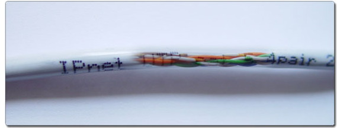

Оглавление

<a href="#_Toc454871113">Лекция №1. Системы телеобработки данных	3</a>

<a href="#_Toc454871114">Лекция №2. Классификация и архитектура информационно-вычислительных сетей	8</a>

<a href="#_Toc454871115">Лекция№3 Понятие сетевой модели. Сетевая модель OSI.	12</a>

<a href="#_Toc454871116">Лекция№4 Понятие протокола.  Принципы работы протоколов разных уровней.	16</a>

<a href="#_Toc454871117">Лекция№5. Состав и характеристики линий связи. Беспроводные линии связи.	19</a>

<a href="#_Toc454871118">Лекция№6 Виды и характеристики кабелей. Стандарты кабелей.	27</a>

<a href="#_Toc454871119">Лекция№7 Ethernet: на витой паре, на коаксиальном (толстом и тонком) кабеле.	31</a>

<a href="#_Toc454871120">Лекция№8 Проблемы с сетевым доступом. Поиск компьютеров в сети	35</a>

<a href="#_Toc454871121">Лекция№9 TCPdump и TCP	40</a>

<a href="#_Toc454871122">Лекция№10 Диагностика сетевых проблем	43</a>

<a href="#_Toc454871123">Лекция№11 Фрагментация пакетов	47</a>

<a href="#_Toc454871124">Лекция№12 Понятие аудита информационной безопасности	51</a>

<a href="#_Toc454871125">Лекция№13 Материальное и программно-техническое обеспечение сети	55</a>

<a href="#_Toc454871126">Лекция№14 Повышение производительности локальных сетей	59</a>

<a href="#_Toc454871127">Лекция№15 Протокол DHCP	64</a>

<a href="#_Toc454871128">Лекция№16  Консольное управление коммуникационными устройствами	68</a>

<a href="#_Toc454871129">Лекция№17  Управление файловой системой и учетными записями в сети	74</a>

<a href="#_Toc454871130">Лекция№18  Прикладные протоколы стека TCP/IP	78</a>

<a href="#_Toc454871131">Лекция№19 Методы передачи данных в глобальных сетях	84</a>

<a href="#_Toc454871132">Литература	89</a>
<h1>Лекция №1. Системы телеобработки данных</h1>
План:
<ol><li>Эволюция компьютерных сетей.</li><li>Появление первых вычислительных машин</li><li>Многотерминальные системы</li><li>глобальные сети</li><li>Наследие телефонных сетей</li></ol>
Сети передачи данных, называемые также вычислительными или компьютерными сетями, являются результатом эволюции двух важнейших научно-технических отраслей современной цивилизации — компьютерных и телекоммуникационных технологий (рис.1.1):
<ol><li>С одной стороны, сети передачи данных представляют собой частный случай распределенных вычислительных систем, в которых группа компьютеров согласованно выполняет набор взаимосвязанных задач, обмениваясь данными в автоматическом режиме. </li><li>С другой стороны, компьютерные сети могут рассматриваться как средство передачи информации на большие расстояния, для чего в них применяются методы кодирования и мультиплексирования данных, получившие развитие в различных телекоммуникационных системах. </li></ol>

 <strong>Рис. 1.1.</strong>  Эволюция компьютерных сетей на стыке вычислительной техники и телекоммуникационных технологий.

Итак,
<ul><li>компьютерная сеть — это набор компьютеров, связанных коммуникационной системой и снабженных соответствующим программным обеспечением, которое предоставляет пользователям сети доступ к ресурсам этого набора компьютеров;</li><li>сеть могут образовывать компьютеры разных типов — небольшие микропроцессоры, рабочие станции, мини-компьютеры, персональные компьютеры или суперкомпьютеры;</li><li>передачу сообщений между любой парой компьютеров сети обеспечивает коммуникационная система, которая может включать кабели, повторители, коммутаторы, маршрутизаторы и другие устройства;</li><li>компьютерная сеть позволяет пользователю работать со своим компьютером, как с автономным, и добавляет к этому возможность доступа к информационным и аппаратным ресурсам других компьютеров сети.</li></ul>
<strong>Появление первых вычислительных машин</strong>

Идея компьютера была предложена английским математиком Чарльзом Бэбиджем (Charles Babbage) в середине девятнадцатого века. Однако его механическая &quot;аналитическая машина&quot; по-настоящему так и не заработала.

Подлинное рождение цифровых вычислительных машин произошло вскоре после окончания второй мировой войны. В середине 40-х были созданы первые ламповые вычислительные устройства. Для этого периода характерно следующее:
<ul><li>компьютер представлял собой скорее предмет исследования, а не инструмент для решения каких-либо практических задач из других областей;</li><li>одна и та же группа людей участвовала и в проектировании, и в эксплуатации, и в программировании вычислительной машины;</li><li>программирование осуществлялось исключительно на машинном языке;</li><li>не было никакого системного программного обеспечения, кроме библиотек математических и служебных подпрограмм;</li><li>операционные системы еще не появились, все задачи организации вычислительного процесса решались вручную каждым программистом с пульта управления.</li></ul>
<strong>Многотерминальные системы — прообраз сети</strong>

Терминальные комплексы могли располагаться на большом расстоянии от процессорных стоек, соединяясь с ними с помощью различных глобальных связей — модемных соединений телефонных сетей или выделенных каналов. Для поддержки удаленной работы терминалов в операционных системах появились специальные программные модули, реализующие различные (в то время, как правило, нестандартные) протоколы связи. Такие вычислительные системы с удаленными терминалами сохраняя централизованный характер обработки данных, в какой-то степени являлись прообразом современных компьютерных сетей (рис.1.3), а соответствующее системное программное обеспечение — прообразом сетевых операционных систем.

 <strong>Рис. 1.3.</strong>  Многотерминальная система — прообраз вычислительной сети.

Многотерминальные централизованные системы уже имели все внешние признаки локальных вычислительных сетей, однако по существу ими <strong>не</strong> являлись, так как сохраняли сущность централизованной обработки данных автономно работающего компьютера.

<strong>Первые сети — глобальные</strong>

Хотя теоретические работы по созданию концепций сетевого взаимодействия велись почти с момента появления вычислительных машин, значимые практические результаты по объединению компьютеров в сети были получены лишь в конце 60-х, когда с помощью глобальных связей и техники коммутации пакетов удалось реализовать взаимодействие машин класса мэйнфреймов и суперкомпьютеров (рис.1.4). Эти дорогостоящие компьютеры хранили уникальные данные и программы, обмен которыми позволил повысить эффективность их использования.

 <strong>Рис. 1.4.</strong>  Объединение удаленных супер-ЭВМ глобальными связями.

В 1969 году министерство обороны США инициировало работы по объединению в общую сеть суперкомпьютеров оборонных и научно-исследовательских центров. Эта сеть, получившая название ARPANET послужила отправной точкой для создания первой и самой известной ныне глобальной сети — Internet. Сеть ARPANET объединяла компьютеры разных типов, работавшие под управлением различных ОС с дополнительными модулями, реализующими коммуникационные протоколы, общие для всех компьютеров сети. Такие ОС можно считать первыми сетевыми операционными системами.

Таким образом, хронологически первыми появились глобальные сети (Wide Area Networks, WAN), то есть сети, объединяющие территориально рассредоточенные компьютеры, возможно, находящиеся в различных городах и странах. Именно при построении глобальных сетей были впервые предложены и отработаны многие основные идеи и концепции современных вычислительных сетей, такие, например, как многоуровневое построение коммуникационных протоколов, технология коммутации пакетов и маршрутизация пакетов в составных сетях.

<strong>Наследие телефонных сетей</strong>

Глобальные компьютерные сети очень многое унаследовали от других, гораздо более старых и глобальных сетей — телефонных.

Главным результатом создания первых глобальных компьютерных сетей был отказ от принципа коммутации каналов, на протяжении многих десятков лет успешно использовавшегося в телефонных сетях.

<strong>Роль персональных компьютеров в эволюции компьютерных сетей</strong>

Создание персональных компьютеров послужило мощным катализатором для бурного роста локальных сетей, поскольку появилась отличная материальная основа в виде десятков и сотен машин, принадлежащих одному предприятию и расположенных в пределах одного здания.

Новые возможности пользователей локальных сетей

Разработчики локальных сетей привнесли в организацию работы пользователей много нового. Так, стало намного проще, чем в глобальных сетях, получать доступ к сетевым ресурсам — в локальной сети пользователю не приходится запоминать сложные идентификаторы разделяемых ресурсов. Для этих целей система предоставляет список ресурсов в удобной для восприятия форме, например в виде древовидной графической структуры (&quot;дерева&quot; ресурсов). Еще один прием, позволяющий оптимизировать работу в локальной сети, состоит в том, что после соединения с удаленным ресурсом пользователь получает возможность обращаться к нему с помощью тех же команд, которые он применял при работе с локальными ресурсами на компьютере. Следствием (и в то же время движущей силой) такого прогресса стало появление огромного количества непрофессиональных пользователей, освобожденных от необходимости изучать специальные (и достаточно сложные) команды для сетевой работы.

<strong>Таблица.</strong> Хронология важнейших событий на пути появления первых компьютерных сетей
<table><tr><td>
Этап
</td><td>
Время
</td></tr><tr><td>
Первые глобальные связи компьютеров, первые эксперименты с пакетными сетями
</td><td>
Конец 60-х
</td></tr><tr><td>
Начало передач по телефонным сетям голоса в цифровой форме
</td><td>
Конец 60-х
</td></tr><tr><td>
Появление больших интегральных схем, первые мини-компьютеры, первые нестандартные локальные сети
</td><td>
Начало 70-х
</td></tr><tr><td>
Создание сетевой архитектуры IBM SNA
</td><td>
1974
</td></tr><tr><td>
Стандартизация технологии Х.25
</td><td>
1974
</td></tr><tr><td>
Появление персональных компьютеров, создание Интернета в современном виде, установка на всех узлах стека TCP/IP
</td><td>
Начало 80-х
</td></tr><tr><td>
Появление стандартных технологий локальных сетей (Ethernet — 1980 г., Token Ring, FDDI - 1985 г.)
</td><td>
Середина 80-х
</td></tr><tr><td>
Начало коммерческого использования Интернета
</td><td>
Конец 80-х
</td></tr><tr><td>
Изобретение Web
</td><td>
1991
</td></tr></table>
Вопросы:
<ol><li>Эволюция компьютерных сетей.</li><li>Появление первых вычислительных машин</li><li>Многотерминальные системы</li><li>глобальные сети</li><li>Наследие телефонных сетей</li></ol><h1>Лекция №2. Классификация и архитектура информационно-вычислительных сетей</h1>
План:
<ol><li>Централизованная обработка данных.</li><li>Распределенная обработка данных</li><li>Системы «терминал — хост»</li><li>Классификация вычислительных сетей</li></ol>
<strong>Централизованная обработка данных</strong> 

<em>Система централизованной обработки данных</em>

При централизованных формах, когда у пользователей нет непосредственного контакта с ЭВМ, его роль сводится к передаче исходных данных на обработку, получению результатов, выявлению и устранению ошибок. Централизованная обработка информации наряду с рядом положительных сторон (высокая степень загрузки и высокопроизводительное использование оборудования, квалифицированный кадровый состав операторов, программистов, инженеров, проектировщиков вычислительных систем и т.п.) имела ряд отрицательных черт, порожденных прежде всего отрывом конечного пользователя (экономиста, плановика, нормировщика и т.п.) от технологического процесса обработки информации.

В эпоху централизованного использования ЭВМ с пакетной обработкой информации пользователи вычислительной техники предпочитали приобретать компьютеры, на которых можно было бы решать почти все классы их задач.                                                                                        

<strong>Распределенная обработка данных </strong>

<em>Didtributed Data Processing (DDP) </em>- обработка данных, выполняемая на независимых, но связанных между собой компьютерах, представляющих распределенную систему.<em> </em>При этом пользователь получает возможность работать с сетевыми службами и прикладными процессами, расположенными в нескольких взаимосвязанных абонентских системах

    <em>Система распределенной обработки данных</em>

Для реализации распределенной обработки данных были созданы многомашинные ассоциации, структура которых разрабатывается по одному из следующих направлений: 
<ul><li>многомашинные вычислительные комплексы (МВК);</li><li>компьютерные (вычислительные) сети. </li></ul>
Многомашинный вычислительный комплекс — группа установленных рядом вычислительных машин, объединенных с помощью специальных средств сопряжения и выполняющих совместно единый информационновычислительный процесс.

<strong> Системы «терминал — хост»</strong>

С созданием интерактивных терминальных устройств, появилась возможность совместной работы пользователей в реальном масштабе времени. Основные этапы развития систем доступа к информационным ресурсам ,представлены на рис. 1.1, включают следующие схемы.

Рис. 1.1<strong><em>.</em></strong><em> Варианты коллективного использования информационно-вычислительных ресурсов:</em>

<em>а</em><strong> — </strong>локальный хост;<em> 6</em> — удаленный хост;<em> в</em> — глобальная сеть;<em> г</em> — коммуникации ПК — ПК;<em> д</em> — локальная сеть;<em> е</em> — Internet    

<strong>Классификация вычислительных сетей</strong>

<em>Классификации </em><strong>—</strong> процесс группирования (отнесения к тому или иному типу) объектов изучения в соответствии с их общими признаками.

Каждый реальный объект может быть наделен множеством признаков.<em> Субъективный </em>характер любой классификации проявляется в том, что имеется некоторый произвол при выборе среди этого множества признаков тех, которые будут использованы для классификации, то есть при выборе<strong> </strong><em>критериев классификации</em><strong>.</strong>

Итак, начнем с самой разветвленной классификации компьютерных сетей, в которой в качестве критериев классификации используются различные технологические характеристики сетей, такие как топология, метод коммутации, метод продвижения пакетов, тип среды передачи и др. Такая классификация может быть названа классификацией в<em> технологическом аспекте.</em>

<strong>1.</strong>Поскольку до недавнего времени выбор технологии, используемой для построения сети, был в первую очередь обусловлен ее территориальным масштабом, мы начнем нашу классификацию с технологических признаков компьютерной сети, обусловленных <em>территорией покрытия.</em> 

В зависимости от территориального расположения абонентских систем вычислительные сети можно разделить на три основных класса:
<ul><li>глобальные (WAN – Wide Area Network);</li><li>региональные (MAN – Metropolitan Area Network);</li><li>локальные (LAN – Local Area Network).</li></ul>
<strong>Глобальная</strong> вычислительная сеть объединяет абонентов, расположенных в различных странах, на различных континентах. Взаимодействие между абонентами такой сети может осуществляться на базе телефонных линий связи, радиосвязи и систем спутниковой связи. Глобальные вычислительные сети позволят решить проблему объединения информационных ресурсов всего человечества и организации доступа<strong> </strong>к этим ресурсам.

<strong>Региональная</strong> вычислительная сеть связывает абонентов, которые находятся на значительном расстоянии друг от друга. Она может включать абонентов внутри большого города, экономического региона, отдельной страны. Обычно расстояние между абонентами региональной вычислительной сети составляет десятки и<strong> </strong>сотни километров.

<strong>Локальная </strong>вычислительная сеть объединяет абонентов, расположенных в пределах небольшой территории. В настоящее время не существует четких ограничений на территориальный разброс абонентов локальной вычислительной сети. Обычно такая сеть привязана к конкретному месту. К 

В зависимости <strong>от<em> функциональной роли в составной сети</em></strong> сети делятся на три класса:

сети доступа, магистральные сети и сети агрегирования трафика.

<strong>Сети доступа</strong> — это сети, предоставляющие доступ индивидуальным и корпоративным абонентам от их помещений (квартир, офисов) до первого помещения (пункта присутствия) оператора сети связи или оператора корпоративной сети. Другими словами, это сети, ответственные за расширение глобальной сети до помещений ее клиентов.

<strong> Магистральные сети</strong> — это сети, представляющие собой наиболее скоростную часть (ядро) глобальной сети, которая объединяет многочисленные сети доступа в единую сеть.

<strong>Сети агрегирования трафика</strong> — это сети, агрегирующие данные от многочисленных сетей доступа для компактной передачи их по небольшому числу каналов связи в магистраль. Сети агрегирования обычно используются только в крупных глобальных сетях, где они занимают промежуточную позицию, помогая магистральной сети обрабатывать трафик, поступающий от большого числа сетей доступа. В сетях среднего и небольшого размера сети агрегирования обычно отсутствуют.

Вопросы:
<ol><li>Централизованная обработка данных.</li><li>Распределенная обработка данных</li><li>Системы «терминал — хост»</li><li>Классификация вычислительных сетей</li></ol><h1>Лекция№3 Понятие сетевой модели. Сетевая модель OSI.</h1>
План:
<ol><li>Понятие открытой системы.</li><li>Модель OSI</li><li>Модель TCP/IP</li></ol>
<strong>Понятие открытой системы</strong>

Что же такое открытая система?

Открытой может быть названа любая система (компьютер, вычислительная сеть, ОС, программный пакет, другие аппаратные и программные продукты), которая построена в соответствии с открытыми спецификациями.

<strong>Модель OSI</strong>

В модели OSI (рис. 1) средства взаимодействия делятся на семь уровней: прикладной, представительный, сеансовый, транспортный, сетевой, канальный и физический. Каждый уровень имеет дело с одним определенным аспектом взаимодействия сетевых устройств.

Рис. 1. Модель взаимодействия открытых систем ISO/OSI

Модель OSI описывает только системные средства взаимодействия, реализуемые операционной системой, системными утилитами, системными аппаратными средствами. Модель не включает средства взаимодействия приложений конечных пользователей. Свои собственные протоколы взаимодействия приложения реализуют, обращаясь к системным средствам. Поэтому необходимо различать уровень взаимодействия приложений и прикладной уровень. 

Рис. 2. Вложенность сообщений различных уровней

<strong>Уровни модели OSI</strong>

<em>Физический уровень</em>

Физический уровень (Physical layer) имеет дело с передачей битов по физическим каналам связи, таким, например, как коаксиальный кабель, витая пара, оптоволоконный кабель или цифровой территориальный канал. 

<em>Канальный уровень</em>

Одной из задач канального уровня (Data Link layer) является проверка доступности среды передачи. Другой задачей канального уровня является реализация механизмов обнаружения и коррекции ошибок. Для этого на канальном уровне биты группируются в наборы, называемые <em>кадрами (frames)</em>. 

<em>Сетевой уровень</em>

Сетевой уровень (Network layer) служит для образования единой транспортной системы, объединяющей несколько сетей, причем эти сети могут использовать совершенно различные принципы передачи сообщений между конечными узлами и обладать произвольной структурой связей. 

<em>Транспортный уровень</em>

Транспортный уровень (Transport layer) обеспечивает приложениям или верхним уровням стека - прикладному и сеансовому - передачу данных с той степенью надежности, которая им требуется. 

<em>Сеансовый уровень</em>

Сеансовый уровень (Session layer) обеспечивает управление диалогом: фиксирует, какая из сторон является активной в настоящий момент, предоставляет средства синхронизации. 

<em>Представительный уровень</em>

Представительный уровень (Presentation layer) имеет дело с формой представления передаваемой по сети информации, не меняя при этом ее содержания. 

<em>Прикладной уровень</em>

Прикладной уровень (Application layer) - это в действительности просто набор разнообразных протоколов, с помощью которых пользователи сети получают доступ к разделяемым ресурсам, таким как файлы, принтеры или гипертекстовые Web-страницы, а также организуют свою совместную работу, например, с помощью протокола электронной почты

<strong>Модель TCP/IP</strong>

Важную часть технологии TCP/IP составляют задачи адресации, к числу которых относятся следующие:
<ol><li>Согласованное использование адресов различного типа. Эта задача включает отображение адресов разных типов, например преобразование сетевого IP-адреса в локальный, доменного имени — в IP-адрес.</li><li> Обеспечение уникальности адресов. В зависимости от типа адреса требуется обеспечивать однозначность адресации в пределах компьютера, подсети, корпоративной сети или Интернета.</li><li>Конфигурирование сетевых интерфейсов и сетевых приложений.</li></ol>

Рис. 3. Иерархическая структура стека TCP/IP

Вопросы:
<ol><li>Понятие открытой системы.</li><li>Модель OSI</li><li>Модель TCP/IP</li></ol><h1>Лекция№4 Понятие протокола.  Принципы работы протоколов разных уровней.</h1>
План:
<ol><li>Понятие протокола</li><li>Стандартные стеки коммуникационных протоколов</li></ol>
<strong>Понятие протокола</strong>

Процедура взаимодействия этих двух узлов может быть описана в виде набора правил взаимодействия каждой пары соответствующих уровней обеих участвующих сторон. Формализованные правила, определяющие последовательность и формат сообщений, которыми обмениваются сетевые компоненты, лежащие на одном уровне, но в разных узлах, называются <em>протоколом</em>.

Рис. 1. Взаимодействие двух узлов

Иерархически организованный набор протоколов, достаточный для организации взаимодействия узлов в сети, называется <em>стеком коммуникационных протоколов</em>.

<strong>Стандартные стеки коммуникационных протоколов</strong>

Важнейшим направлением стандартизации в области вычислительных сетей является стандартизация коммуникационных протоколов. В настоящее время в сетях используется большое количество стеков коммуникационных протоколов. Наиболее популярными являются стеки: TCP/IP, IPX/SPX, NetBIOS/SMB, DECnet, SNA и OSI. Все эти стеки, кроме SNA на нижних уровнях - физическом и канальном, - используют одни и те же хорошо стандартизованные протоколы Ethernet, Token Ring, FDDI и некоторые другие, которые позволяют использовать во всех сетях одну и ту же аппаратуру. Зато на верхних уровнях все стеки работают по своим собственным протоколам. Эти протоколы часто не соответствуют рекомендуемому моделью OSI разбиению на уровни. В частности, функции сеансового и представительного уровня, как правило, объединены с прикладным уровнем. Такое несоответствие связано с тем, что модель OSI появилась как результат обобщения уже существующих и реально используемых стеков, а не наоборот.

Стек OSI

Следует четко различать модель OSI и стек OSI. В то время как модель OSI является концептуальной схемой взаимодействия открытых систем, стек OSI представляет собой набор вполне конкретных спецификаций протоколов. В отличие от других стеков протоколов стек OSI полностью соответствует модели OSI, он включает спецификации протоколов для всех семи уровней взаимодействия, определенных в этой модели. 

Стек TCP/IP

Стек TCP/IP был разработан по инициативе Министерства обороны США более 20 лет назад для связи экспериментальной сети ARPAnet с другими сетями как набор общих протоколов для разнородной вычислительной среды. Большой вклад в развитие стека TCP/IP, который получил свое название по популярным протоколам IP и TCP, внес университет Беркли, реализовав протоколы стека в своей версии ОС UNIX. Популярность этой операционной системы привела к широкому распространению протоколов TCP, IP и других протоколов стека. Сегодня этот стек используется для связи компьютеров всемирной информационной сети Internet, а также в огромном числе корпоративных сетей.

Стек IPX/SPX

Этот стек является оригинальным стеком протоколов фирмы Novell, разработанным для сетевой операционной системы NetWare еще в начале 80-х годов. Протоколы сетевого и сеансового уровней Internetwork Packet Exchange (IPX) и Sequenced Packet Exchange (SPX), которые дали название стеку, являются прямой адаптацией протоколов XNS фирмы Xerox, распространенных в гораздо меньшей степени, чем стек IPX/SPX. 

Стек NetBIOS/SMB

Этот стек широко используется в продуктах компаний IBM и Microsoft. На физическом и канальном уровнях этого стека используются все наиболее распространенные протоколы Ethernet, Token Ring, FDDI и другие. На верхних уровнях работают протоколы NetBEUI и SMB.

Рис. 2. Соответствие популярных стеков протоколов модели OSI

Вопросы:
<ol><li>Понятие протокола</li><li>Стек OSI</li><li>Стек TCP/IP</li><li>Стек IPX/SPX</li><li>Стек NetBIOS/SMB</li></ol><h1>Лекция№5. Состав и характеристики линий связи. Беспроводные линии связи.</h1>
План:
<ol><li>Типы сетевых архитектур</li><li>Одноранговые сети</li><li>Сети с выделенным сервером</li><li>Гибридная сеть</li><li>Топология физических связей</li><li>Архитектура Bluetooth</li><li>Подключение к беспроводным сетям (Wi-Fi)</li><li>Широкополосные беспроводные сети(IEEE 802.16)</li></ol>
<strong>Типы сетевых архитектур</strong>

Основными требованиями, которым должна удовлетворять организация ИВС, являются следующие:
<ol><li><strong>Открытость</strong> - возможность включения дополнительных абонентских, ассоциативных ЭВМ, а также линий (каналов) связи без изменения технических и программных средств существующих компонентов сети. Кроме того, любые две ЭВМ должны взаимодействовать между собой, несмотря на различие в конструкции, производительности, месте изготовления, функциональном назначении. </li><li><strong>Гибкость</strong> - сохранение работоспособности при изменении структуры в результате выхода из строя ЭВМ или линии связи. </li><li><strong>Эффективность</strong> - обеспечение требуемого качества обслуживания пользователей при минимальных затратах.</li></ol>
<strong>Одноранговые сети</strong>

В одноранговых сетях (рис.1) все компьютеры равны в возможностях доступа к ресурсам друг друга. Каждый пользователь может по своему желанию объявить какой-либо ресурс своего компьютера разделяемым, после чего другие пользователи могут с ним работать. 

 <strong>Рис. 1.</strong>  <em>Одноранговая сеть (здесь словом &quot;Коммун.&quot; обозначены коммуникационные средства).</em>

<strong>Сети с выделенным сервером </strong>

В сетях с выделенными серверами (рис. 2.) используются специальные варианты сетевых ОС, которые оптимизированы для работы в роли серверов и называются серверными ОС. Пользовательские компьютеры в таких сетях работают под управлением клиентских ОС.

Рис. 2<strong>.</strong>  <em>Сеть с выделенным сервером.</em>

<strong>Гибридная сеть</strong>

В больших сетях наряду с отношениями клиент-сервер сохраняется необходимость и в одноранговых связях, поэтому такие сети чаще всего строятся по гибридной схеме (рис 3). 

Рис. 3.  <em>Гибридная сеть.</em>

<strong>Топология физических связей</strong>

Как только компьютеров становится больше двух, возникает проблема выбора конфигурации физических связей или топологии. Под топологией сети понимается конфигурация графа, вершинам которого соответствуют конечные узлы сети (например, компьютеры) и коммуникационное оборудование (например, маршрутизаторы), а ребрам — электрические и информационные связи между ними.

Число возможных конфигураций резко возрастает при увеличении числа связываемых устройств. Так, если три компьютера мы можем связать двумя способами, то для четырех компьютеров (рис.4.) можно предложить уже шесть топологически различных конфигураций (при условии неразличимости компьютеров). 

Рис. 4.  <em>Варианты связи компьютеров</em>. 

Среди множества возможных конфигураций различают полносвязные и неполносвязные : 

Рис. 5<strong><em>.</em></strong><em>  Типы конфигураций</em>

Полносвязная топология (рис. 5.)

 соответствует сети, в которой каждый компьютер непосредственно связан со всеми остальными. 

<strong><em>Рис. 5.</em></strong><em>  Полносвязная конфигурация. </em>

Ячеистая топология ( mesh<a href="http://www.intuit.ru/department/network/networkbasics/4/footnote.1.1.htm"> )</a>

 получается из полносвязной путем удаления некоторых возможных связей. Ячеистая топология допускает соединение большого количества компьютеров и характерна для крупных сетей (рис. 6.). 

<em>Рис. 6.  Ячеистая топология. </em>

В сетях с кольцевой конфигурацией (рис. 7.) 

данные передаются по кольцу от одного компьютера к другому. Главное достоинство &quot;кольца&quot; в том, что оно по своей природе обладает свойством резервирования связей. Действительно, любая пара узлов соединена здесь двумя путями — по часовой стрелке и против. 

<strong><em>Рис. 7.</em></strong><em>  Топология &quot;кольцо&quot;.</em> 

Топология &quot;звезда&quot; (рис.8.) 

образуется в том случае, когда каждый компьютер с помощью отдельного кабеля подключается к общему центральному устройству, называемому концентратором<a href="http://www.intuit.ru/department/network/networkbasics/4/footnote.1.2.htm">. </a>

<strong><em>Рис. 8.</em></strong><em>  Топология &quot;звезда&quot;. </em>

«Дерево»

Иногда имеет смысл строить сеть с использованием нескольких концентраторов, иерархически соединенных между собой связями типа &quot;звезда&quot; (рис.9.). 

<strong><em>Рис. 9.</em></strong><em>  Топология &quot;иерархическая звезда&quot; или &quot;дерево&quot;. </em>

Общая шина

Особым частным случаем конфигурации звезда является конфигурация &quot;общая шина&quot; (рис.10.). Здесь в роли центрального элемента выступает пассивный кабель, к которому по схеме &quot;монтажного ИЛИ&quot; подключается несколько компьютеров.

<strong><em>Рис. 10.</em></strong><em>  Топология &quot;общая шина&quot;. </em>

Смешанная топология.

В то время как небольшие сети, как правило, имеют типовую топологию — &quot;звезда&quot;, &quot;кольцо&quot; или &quot;общая шина&quot;, для крупных сетей характерно наличие произвольных связей между компьютерами. В таких сетях можно выделить отдельные произвольно связанные фрагменты (подсети), имеющие типовую топологию, поэтому их называют сетями со смешанной топологией (рис. 11).

<strong><em>Рис. 11.</em></strong><em>  Смешанная топология.</em>

<strong>Характеристика беспроводных каналов связи</strong>

Архитектура Bluetooth

BlueTooth - стандарт беспроводной связи, работающий на частоте 2.45 ГГц. Радиус действия сильно варьируется в зависимости от мощности устройства, наличия помех и составляет от 10 до 100 метров. Помимо связи с телефонами и другими беспроводными устройствами (джойстики, мыши, клавиатуры, принтеры, гарнитуры и т д.), BlueTooth позволяет организовать беспроводную сеть. Микроволновые печи во время своей работы сознают сильные помехи в диапазоне частот 2.45 ГГц, что может значительно снизить скорость связи или вообще прервать соединение.

 Пикосеть 1                                Пикосеть 2

<strong><em>Рис. </em></strong><em>Две пикосети могут, соединившись, сформировать рассеянную сеть</em>

Подключение к беспроводным сетям (Wi-Fi)

В последнее время возросла популярность<em> беспроводных локальных сетей</em> (Wireless LAN, WLAN), в которых физический канал обеспечивается связью в инфракрасном или радиочастотном диапазоне электромагнитных волн. Независимо от физического канала беспроводные сети могут иметь три основных варианта топологии:
<ul><li><em>Неплановая (ad-hoc) сеть</em> — группа узлов с беспроводными адаптерами, которая находится в зоне взаимной «видимости» и может без всякого централизованного управления взаимодействовать между собой. В любой момент новый пользователь может как войти (в прямом смысле) в группу, так и покинуть ее. Здесь все узлы равноправны.</li><li><em>Сеть с инфраструктурой</em> — в «поле зрения» группы узлов имеется<em> точка доступа</em> (access point), которая централизованно координирует их работу. Здесь точка доступа находится в заведомо привилегированном положении.</li></ul>
<em>Сеть с расширинной инфраструктурой </em>– несколько точек доступа, соеденённых между собой (проводной, или беспроводной сетью); клиентские узлы находятся в радиусе действия одной, или нескольких точек доступа. Клиентские узлы по мере перемещения (или изменения условий приёма) могут переходить от одной точки доступа к другой.

Широкополосные беспроводные сети(IEEE<strong> </strong>802.16)

Во многих странах телефонная система в какой-то момент перестала быть жестко управляемой, и появилось множество фирм, предлагающих локальные услуги голосовой связи и интернет-услуги.

Предложений действительно много. Проблема только в том, что прокладка волоконно-оптического кабеля, коаксиала или даже витой пары пятой категории к миллионам абонентов обходится очень дорого. 

Нужны широкополосные беспроводные сети. Установить одну большую антенну на горке где-нибудь рядом с населенным пунктом и расставить на крышах домов абонентов приемные антенны шрадо проще и дешевле, чем рыть траншеи и протягивать кабель. 

Однако еще до недавних пор каждый оператор стремился использовать Свою собственную систему. Отсутствие стандартов означало, что аппаратное и Программное обеспечение не могли быть запущены в массовое производство. Это, в свою очередь, приводило к установке неоправданно высоких цен при низкой популярности.

По традиции, сформировать комитет для разработки стандарта было поручено IEEE. В комитет 802.16 вошли представители крупнейших фирм и научных организаций. Работа была начата в июле 1999 года, а официальный результат был представлен в апреле 2002 года. Название стандарта таково: ^Эфирный интерфейс стационарных широкополосных беспроводных систем Доступа». Тем не менее, большинство предпочитает использовать более короткое название: беспроводные региональные сети, или беспроводные местные линии

Вопросы:
<ol><li>Типы сетевых архитектур</li><li>Одноранговые сети</li><li>Сети с выделенным сервером</li><li>Гибридная сеть</li><li>Топология физических связей</li><li>Архитектура Bluetooth</li><li>Подключение к беспроводным сетям (Wi-Fi)</li><li>Широкополосные беспроводные сети(IEEE 802.16)</li></ol><h1>Лекция№6 Виды и характеристики кабелей. Стандарты кабелей.</h1>
План:
<ol><li>Стандарты кабелей</li><li>коаксиальный кабель</li><li>Кабель «витая пара»</li><li>Волоконно-оптический кабель</li><li>Сравнительные характеристики сетевых проводников</li><li>Проводные и беспроводные компьютерные сети</li></ol>
<strong>Стандарты кабелей</strong>

Наиболее часто в качестве среды передачи используются:

1). Медные кабели для пересылки электрических сигналов;

2). Волоконно-оптические кабели для пересылки световых сигналов;

3). Атмосфера для пересылки света или радиоволн.

Тонкий коаксиальный кабель состоит из медного проводника, окруженного диэлектрическим монитором, который, в свою очередь, заключен в плетеный металлический экран и далее в защитную пластиковую оболочку. 

Кабель «витая пара» содержит четыре пары (т. е. восемь проводников) проводов. Каждый проводник имеет пластиковую оболочку с цветовым кодированием, однозначно определяющим проводник в кабеле. Каждая пара проводников скручена для повышения защищенности передаваемых сигналов от внешних помех. Все пары размещаются в общей пластиковой защитной оболочке. В некоторых типах кабелей пары могут быть скручены все вместе.

    

Волоконно-оптический кабель состоит из цилиндрического стеклянного сердечника (ядра) диаметром 62,5 мкм, окруженного оптической оболочкой, защищающей ядро и отражающей свет обратно в ядро. Оптическая оболочка заключена в силовую кевларовую оболочку. Весь кабель имеет дополнительную защитную оболочку из поливинилхлорида. В отличие от тонкого коаксиального кабеля или кабеля «витая пара», в волоконно-оптическом кабеле для передачи данных используется свет. Источником света обычно служит светоизлучающий диод, формирующий сигнал в видимом инфракрасном диапазоне. На другом конце кабеля устанавливается другой светодиод, принимающий световой сигнал.

 <strong>2.6 Сравнительные характеристики сетевых проводников</strong>
<table><tr><td>
Тип Кабеля (10 Мбит/с = около 1 Мб в сек)
</td><td>
Скорость передачи данных (мегабит в секунду)
</td><td>
Макс официальная длина сегмента, м
</td><td>
Макс неофициальная длина сегмента, м*
</td><td>
Возможность восстановления при повреждении / Наращивание длины
</td><td>
Подверженность помехам
</td><td>
Стоимость
</td></tr><tr><td colspan="7">
<strong>Витая пара</strong>
</td></tr><tr><td>
Неэкранированная Витая пара
</td><td>
100/10/1000 Мбит/с
</td><td>
100/100/100 м
</td><td>
150/300/100 м
</td><td>
Хорошая
</td><td>
Средняя
</td><td>
Низкая, 3-6 руб/метр
</td></tr><tr><td>
Экранированная витая пара
</td><td>
100/10/1000 Мбит/с
</td><td>
100/100/100 м
</td><td>
150/300/100 м
</td><td>
Хорошая
</td><td>
Низкая
</td><td>
Средняя, 8 руб/метр
</td></tr><tr><td>
**Кабель полевой П-296
</td><td>
100/10 Мбит/с
</td><td>
------
</td><td>
300(500)/800 м
</td><td>
Хорошая
</td><td>
Низкая
</td><td>
Высокая, 12-30 руб/метр
</td></tr><tr><td>
**Четырехжильный телефонный кабель
</td><td>
30/10 Мбит/с
</td><td>
------
</td><td>
Не более 30 м
</td><td>
Хорошая
</td><td>
Высокая
</td><td>
Очень низкая, 2 руб/метр
</td></tr><tr><td colspan="7">
<strong>Коаксиальный кабель</strong>
</td></tr><tr><td>
Тонкий коаксиальный кабель
</td><td>
10 Мбит/с
</td><td>
185 м
</td><td>
250(300) м
</td><td>
Плохая Требуется пайка
</td><td>
Высокая
</td><td>
Низкая
</td></tr><tr><td>
Толстый Коаксиальный кабель
</td><td>
10 Мбит/с
</td><td>
500 м
</td><td>
600(700)
</td><td>
Плохая Требуется пайка
</td><td>
Высокая
</td><td>
Средняя
</td></tr><tr><td colspan="7">
<strong>Оптоволокно</strong>
</td></tr><tr><td>
Одномодовое оптоволокно
</td><td>
100-1000 Мбит
</td><td>
До 100 км
</td><td>
----
</td><td>
Требуется спец оборудование
</td><td>
Отсутствует
</td><td>
1-3$ за метр
</td></tr><tr><td>
Многомодовое оптоволокно
</td><td>
1-2 Гбит
</td><td>
До 550 м
</td><td>
----
</td><td>
Требуется спец оборудование
</td><td>
Отсутствует
</td><td>
1-3$ за метр
</td></tr></table>
<strong>Проводные и беспроводные компьютерные сети</strong>

Беспроводная локальная сеть — это локальная сеть, использующая беспроводные каналы связи. 

Впервые беспроводные локальные сети, появившиеся в конце 80-х годов, были представлены на рынке как замена традиционных локальных сетей. 

обычно беспроводная локальная сеть соединяется с кабельной локальной сетью, и эта область приложения называется расширением локальных сетей.

Рис.<em>Пример конфигурации одной ячейки беспроводной локальной сети</em>

Конфигурацию, показанную на рисунке, можно назвать одной ячейкой беспроводной локальной сети. 

Вопросы:
<ol><li>Стандарты кабелей</li><li>коаксиальный кабель</li><li>Кабель «витая пара»</li><li>Волоконно-оптический кабель</li><li>Сравнительные характеристики сетевых проводников</li><li>Проводные и беспроводные компьютерные сети</li></ol><h1>Лекция№7 Ethernet: на витой паре, на коаксиальном (толстом и тонком) кабеле.</h1>
План:
<ol><li>Методы доступа в сетях</li><li>Метод доступа CSMA/CD</li><li>Возникновение коллизии</li><li>Ethernet</li></ol>
<strong>Методы доступа в сетях</strong>

Метод доступа к передающей среде - метод, обеспечивающий выполнение совокупности правил, по которым узлы сети получают доступ к ресурсу.

Существуют <em>два основных класса методов доступа: детерминированные, недетерминированные.</em>

<em>При детерминированных методах</em> доступа передающая среда распределяется между узлами с помощью специального механизма управления, гарантирующего передачу данных узла в течение некоторого, достаточно малого интервала времени.

Недетерминированные - случайные методы доступа предусматривают конкуренцию всех узлов сети за право передачи. Возможны одновременные попытки передачи со стороны нескольких узлов, в результате <em>чего возникают </em><strong><em>коллизии</em>.</strong>

<strong>Метод доступа CSMA/CD</strong>

Метод доступа, используемый в сетях Ethernet на разделяемой проводной среде, носи название CSMA/CD (Carrier Sense Multiple Access with Collision Détection — прослушивание несущей частоты с множественным доступом и распознаванием коллизий). 

Рис. 12.6. <em>Метод случайного доступа CSMA/CD</em>

Возникновение коллизии

Механизм прослушивания среды и пауза между кадрами не гарантируют исключения ситуации, когда две или более станции одновременно решают, что среда свободна, и начинают передавать свои кадры. Говорят, что при этом происходит<strong> коллизия,</strong> так как содержимое обоих кадров сталкивается на общем кабеле и происходит искажение информации.

<strong>Ethernet</strong>

Наибольшее распространение среди стандартных сетей получила сеть <strong>Ethernet</strong>. Впервые она появилась в 1972 году (разработчиком выступила известная фирма Xerox). Сеть оказалась довольно удачной. В 1985 году сеть Ethernet стала международным стандартом, ее приняли крупнейшие международные организации по стандартам: комитет 802 IEEE Стандарт получил название <strong>IEEE 802.3</strong> (по-английски читается как «eight oh two dot three»). Он определяет множественный доступ к моноканалу типа шина с обнаружением конфликтов и контролем передачи, то есть с уже упоминавшимся методом доступа CSMA/CD. Этому стандарту удовлетворяли и некоторые другие сети, так как уровень его детализации невысок. В результате сети стандарта IEEE 802.3 нередко были несовместимы между собой как по конструктивным, так и по электрическим характеристикам. Однако в последнее время <strong>стандарт IEEE 802.3 </strong>считается стандартом именно сети Ethernet.

Основные характеристики первоначального стандарта <strong>IEEE 802.3: </strong>
<ul><li>топология – шина;</li><li>среда передачи – коаксиальный кабель; </li><li>скорость передачи – 10 Мбит/с;</li><li>максимальная длина сети – 5 км; </li><li>максимальное количество абонентов – до 1024; </li><li>длина сегмента сети – до 500 м;</li><li>количество абонентов на одном сегменте – до 100; </li><li>метод доступа – CSMA/CD;</li><li>передача узкополосная, то есть без модуляции (моноканал). </li></ul>
Строго говоря, между стандартами IEEE 802.3 и Ethernet существуют незначительные отличия, но о них обычно предпочитают не вспоминать.

В классической сети Ethernet применялся 50-омный коаксиальный кабель двух видов (толстый и тонкий). Однако в последнее время (с начала 90-х годов) наибольшее распространение получила версия Ethernet, использующая в качестве среды передачи витые пары. В 1995 году появился дополнительный стандарт на более быструю версию Ethernet, работающую на скорости 100 Мбит/с (так называемый Fast Ethernet, стандарт IEEE 802.3u), использующую в качестве среды передачи витую пару или оптоволоконный кабель. В 1997 году появилась и версия на скорость 1000 Мбит/с (Gigabit Ethernet, стандарт IEEE 802.3z). 

Помимо стандартной топологии шина все шире применяются топологии типа пассивная звезда и пассивное дерево. При этом предполагается использование репитеров и репитерных концентраторов, соединяющих между собой различные части (сегменты) сети. В результате может сформироваться древовидная структура на сегментах разных типов (рис.7.1). 

<strong>-</strong> 

 <strong>Рис. 7.1.</strong>  Классическая топология сети Ethernet

Главное требование к полученной в результате топологии – чтобы в ней не было замкнутых путей (петель). Фактически получается, что все абоненты соединены в физическую шину, так как сигнал от каждого из них распространяется сразу во все стороны и не возвращается назад (как в кольце). 

Максимальная длина кабеля сети в целом (максимальный путь сигнала) теоретически может достигать 6,5 километров, но практически не превышает 3,5 километров.

<em>В сети </em><strong><em>Fast Ethernet</em></strong> не предусмотрена физическая топология шина, используется только пассивная звезда или пассивное дерево. К тому же в Fast Ethernet гораздо более жесткие требования к предельной длине сети. Ведь при увеличении в 10 раз скорости передачи и сохранении формата пакета его минимальная длина становится в десять раз короче. Таким образом в 10 раз уменьшается допустимая величина двойного времени прохождения сигнала по сети (5,12 мкс против 51,2 мкс в Ethernet).

Для передачи информации в сети Ethernet применяется стандартный манчестерский код. 

Доступ к сети Ethernet осуществляется по случайному методу CSMA/CD, обеспечивающему равноправие абонентов. В сети используются пакеты переменной длины со структурой, представленной на рис. 7.2. (цифры показывают количество байт)

 <strong>Рис. 7.2.</strong>  Структура пакета сети Ethernet

Развитие технологии Ethernet идет по пути все большего отхода от первоначального стандарта. Применение новых сред передачи и коммутаторов позволяет существенно увеличить размер сети. Отказ от манчестерского кода (в сети Fast Ethernet и Gigabit Ethernet) обеспечивает увеличение скорости передачи данных и снижение требований к кабелю. Отказ от метода управления CSMA/CD (при полнодуплексном режиме обмена) дает возможность резко повысить эффективность работы и снять ограничения с длины сети. Тем не менее, все новые разновидности сети также называются сетью Ethernet.

Вопросы:
<ol><li>Методы доступа в сетях</li><li>Метод доступа CSMA/CD</li><li>Возникновение коллизии</li><li>Ethernet</li></ol><h1>Лекция№8 Проблемы с сетевым доступом. Поиск компьютеров в сети</h1>
План:
<ol><li>Сегменты ЛВС Ethernet </li><li>Ограничения сегментов Ethernet по расстоянию</li><li>Увеличение длины сегмента ЛВС</li><li>Домены коллизий</li></ol>
<strong>Сегменты ЛВС Ethernet</strong>

Длина сегмента - это важная характеристика при использовании технологии Ethernet в ЛВС. В этом разделе описываются сегменты и их ограничения.

Сегмент - это сетевое соединение по отдельному непрерывному сетевому кабелю. Кабели и сегменты Ethernet могут действовать на ограниченном расстоянии, за пределами которого передача данных ухудшается из-за шумов в линии, ослабления уровня сигнала и несоответствия требованиям множественного доступа с контролем несущей и обнаружением коллизий (CSMA/CD) для обнаружения коллизий. Тип кабеля, скорость передачи данных и метод модуляции влияют на максимальную длину сегмента.

Любое устройство, которое работает на уровне 1 модели взаимодействия открытых систем (OSI), не ограничивает сегмент Ethernet ЛВС, так как устройства уровня 1 только повторяют электрические сигналы.

Для каждой спецификации Ethernet определен необходимый тип кабеля, скорость передачи данных и метод модуляции, которые в свою очередь определяют максимальную длину сегмента, как указано в таблице.

Ниже приведены правила для стандарта 10BASE-T (Ethernet по витой паре):
<ul><li>число 10 обозначает поддерживаемую скорость, в данном случае 10 Мбит/с.</li><li>Слово BASE (ОСНОВНОЙ) означает, что Ethernet работает по основной полосе частот.</li><li>Буква «Т» означает витую пару.</li><li>FL означает использование волоконно-оптического кабеля.</li></ul>
<strong>Ограничения сегментов Ethernet по расстоянию</strong>
<table><tr><td>
Спецификация

Ethernet
</td><td>
Описание
</td><td>
Длина сегмента
</td></tr><tr><td>
10BASE-T
</td><td>
Ethernet, 10 Мбит/с, по витой паре
</td><td>
100 м
</td></tr><tr><td>
10BASE-FL
</td><td>
Ethernet, 10 Мбит/с, по

волоконно-оптическому

кабелю
</td><td>
2 000 м
</td></tr><tr><td>
100BASE-TX
</td><td>
Ethernet, 100 Мбит/с, по витой паре
</td><td>
100 м
</td></tr><tr><td>
100BASE-FX
</td><td>
Fast Ethernet, по волоконно- оптическому кабелю.
</td><td>
400 м
</td></tr><tr><td>
1000BASE-T
</td><td>
Gigabit Ethernet, по витой паре
</td><td>
100 м
</td></tr><tr><td>
1000BASE-LX
</td><td>
Gigabit Ethernet, по

волоконно-оптическому

кабелю.
</td><td>
550 м для носителя толщиной 62,5 микрона (с многомодовым волоконно-оптическим кабелем р или 50-р; 10 км с одномодовым волоконно-оптическим кабелем 10-р)
</td></tr><tr><td>
1000BASE-SX
</td><td>
Gigabit Ethernet, по

волоконно-оптическому

кабелю.
</td><td>
250 м по многомодовому волоконно- оптическому кабелю 62,5-р; 550 м по многомодовому волоконно-оптическому кабелю 50-р
</td></tr><tr><td>
1000BASE-CX
</td><td>
Gigabit Ethernet по медному кабелю
</td><td>
25 м
</td></tr></table>
<strong>Увеличение длины сегмента ЛВС</strong>

К ЛВС Ethernet можно добавлять устройства для увеличения длины сегмента. В этом разделе описывается решение проблемы ограничения по расстоянию в ЛВС Ethernet путем добавления повторителей и концентраторов.

Повторитель - это устройство физического уровня, которое принимает сигнал от устройства в сети и действует как усилитель. Добавление повторителей в сеть увеличивает длину сегментов и позволяет передавать данные на большее расстояние. Однако существует ограничение по количеству повторителей, которые можно добавить в сеть.

Концентратор, который также работает на физическом уровне, аналогичен повторителю. Когда концентратор получает сигнал, он усиливает сигнал и ретранслирует его. Однако в отличие от повторителя концентратор может иметь несколько портов для подключения нескольких сетевых устройств. Поэтому концентратор ретранслирует сигнал на каждый порт, к которому подключена рабочая станция или сервер. Концентраторы не анализируют проходящие через них данные и не знают об источнике или получателе кадра.

<strong>Домены коллизий</strong>

При увеличении ЛВС Ethernet для поддержки работы большего числа пользователей с более высокими требованиями к полосе пропускания можно создавать отдельные физические сегменты сети, которые называются доменами коллизий. В результате коллизии ограничиваются отдельным доменом и не распространяются на всю сеть.

В этом разделе описываются домены коллизий.

В традиционных сегментах Ethernet сетевые устройства конкурируют за общую полосу пропускания и только одно устройство может передавать данные в тот или иной момент времени. Сегменты сети, которые пользуются общей полосой пропускания, называются доменами коллизий, так как если два или более устройств в пределах этого сегмента пробуют передать данные одновременно - возникает коллизия.

Однако можно использовать другие сетевые устройства, работающие на уровне 2 и выше модели взаимодействия открытых систем для разделения сети на сегменты и уменьшения количества устройств, конкурирующих за полосу пропускания.

В этом случае каждый новый сегмент становится новым доменом коллизий.

Полоса пропускания, доступная устройствам в сегменте, и коллизии в одном домене не мешают работе других сегментов.

Широковещательный домен - еще одна ключевая концепция. Фильтрация кадров на основе МАС-адресов на коммутаторах <em>не</em> распространяется на фильтрацию широковещательных кадров. По своей природе широковещательные кадры <em>должны </em>пересылаться, поэтому набор соединенных коммутаторов создает отдельный широковещательный домен. Требуется элемент уровня 3, например маршрутизатор, чтобы ограничить широковещательный домен уровня 2

Вопросы:
<ol><li>Сегменты ЛВС Ethernet </li><li>Ограничения сегментов Ethernet по расстоянию</li><li>Увеличение длины сегмента ЛВС</li><li>Домены коллизий</li></ol><h1>Лекция№9 TCPdump и TCP</h1>
План:
<ol><li>Протокол IP </li><li>Общая характеристика протокола IPX</li><li>Дистанционно-векторный протокол RIP</li><li>Протокол «состояния связей» OSPF</li><li>Протоколы TCP и UDP</li></ol>
<strong><em>Протокол IP</em></strong>

Основные функции протокола IP

Основу транспортных средств стека протоколов TCP/IP составляет <em>протокол межсетевого взаимодействия (Internet Protocol, IP).</em> Он обеспечивает передачу дейтаграмм от отправителя к получателям через объединенную систему компьютерных сетей.

Важной особенностью протокола IP, отличающей его от других сетевых протоколов (например, от сетевого протокола IPX), является его способность выполнять динамическую фрагментацию пакетов при передаче их между сетями с различными, максимально допустимыми значениями поля данных кадров MTU. Свойство фрагментации во многом способствовало тому, что протокол IP смог занять доминирующие позиции в сложных составных сетях.

Структура IP-пакета

IP-пакет состоит из заголовка и поля данных. Заголовок, как правило, имеющий длину 20 байт, имеет следующую структуру (рис. 3).

Рис. 3. Структура заголовка IP-пакета

<strong>Общая характеристика протокола IPX</strong>

Протокол <em>Internetwork Packet Exchange (IPX)</em> является оригинальным протоколом сетевого уровня стека Novell, разработанным в начале 80-х годов на основе протокола Internetwork Datagram Protocol (IDP) компании Xerox.

<strong>Дистанционно-векторный протокол RIP</strong>

<em>Построение таблицы маршрутизации</em>

Протокол RIP (Routing Information Protocol) является внутренним протоколом маршрутизации дистанционно-векторного типа, он представляет собой один из наиболее ранних протоколов обмена маршрутной информацией и до сих пор чрезвычайно распространен в вычислительных сетях ввиду простоты реализации. Кроме версии RIP для сетей TCP/IP существует также версия RIP для сетей IPX/SPX компании Novell.

<strong>Протокол «состояния связей» OSPF</strong>

Протокол <em>OSPF (Open Shortest Path First, открытый протокол «кратчайший путь первыми)</em> является достаточно современной реализацией алгоритма состояния связей (он принят в 1991 году) и обладает многими особенностями, ориентированными на применение в больших гетерогенных сетях.

Данной сети соответствует граф, приведенный на рис. 4.

Рис. 4<strong>.</strong> Граф сети, построенный протоколом OSPF

<strong>Протоколы TCP и UDP</strong>

В то время как задачей уровня сетевого взаимодействия, к которому относится протокол IP, является передача данных между сетевыми интерфейсами в составной сети, главная задача протоколов транспортного уровня TCP и UDP заключается в передаче данных между прикладными процессами, выполняющимися на компьютерах в сети. 

Протокол надежной доставки TCP-сообщений

Протокол IP является дейтаграммным протоколом и поэтому по своей природе не может гарантировать надежность передачи данных. Эту задачу - обеспечение надежного канала обмена данными между прикладными процессами в составной сети -решает протокол TCP (Transmission Control Protocol), относящийся к транспортному уровню.

<strong>Протокол UDP</strong>

Среди набора протоколов Интернета есть транспортный протокол без установления соединения, UDP (User Datagram Protocol — пользовательский дейтаграмм- ный протокол). UDP позволяет приложениям отправлять инкапсулированные IP-дейтаграммы без установления соединений. UDP описан в RFC 768. Входящие сообщения со значением 17 в поле<em> протокола</em> IP доставляются в UDP

Вопросы:
<ol><li>Протокол IP </li><li>Общая характеристика протокола IPX</li><li>Дистанционно-векторный протокол RIP</li><li>Протокол «состояния связей» OSPF</li><li>Протоколы TCP и UDP</li></ol><h1>Лекция№10 Диагностика сетевых проблем</h1>
План:
<ol><li>Причины возникновения перегрузки в сети </li><li>Мосты</li><li>Коммутаторы</li><li>Выделенный канал связи между устройствами.</li></ol>
<strong>Стандартные причины возникновения перегрузки в сети</strong>

Подобно быстро растущему городу, испытывающему проблему пробок на дорогах, сети сталкиваются с проблемой перегрузки по мере роста. В этом разделе описываются наиболее распространенные причины перегрузки сети.

Наиболее распространенные причины перегрузки сети:
<ul><li><strong>Рост вычислительной мощности компьютерных и сетевых технологий.</strong></li></ul>
Современные ЦП, шины и периферийные устройства намного быстрее и мощнее, чем те, что использовались в первых ЛВС, поэтому они могут передавать по сети больше данных с более высокой скоростью.
<ul><li><strong>Увеличивающийся объем сетевого трафика. </strong>Передача данных по сети используется все чаще, поскольку для выполнения стандартных задач необходимы удаленные ресурсы. Кроме того, широковещательные сообщения могут неблагоприятно повлиять на производительность конечной станции</li></ul>
и сети, хотя протоколы TCP/IP, в целом, нечасто используют широковещательную рассылку.
<ul><li><strong>Приложения с высокими требованиями к полосе пропускания.</strong></li></ul>
Приложения приобретают все больше функциональных возможностей и требуют все большей пропускной способности для нормальной работы. Настольная издательская система, техническое проектирование, видео по запросу (VoD), электронное обучение и потоковое видео - все эти приложения требуют высокой вычислительной мощности и скорости передачи. Управление передачей файлов этих приложений значительно увеличивает нагрузку на сети и требует совместного использования приложений пользователями.

<strong>Мосты - раннее решение проблемы перегрузки сети</strong>

Сегментация на уровне 2 модели взаимодействия открытых систем (OSI) может уменьшить перегрузку, и мосты стали первым средством такой сегментации.

В этом разделе описывается, как мосты снижают перегрузки сети.

Мосты Ethernet используются для разделения локальной сети Ethernet

на несколько сегментов. Это увеличивает количество доменов коллизий,

что позволяет сократить перегрузку сети.

<strong>Коммутаторы</strong>

Во многом схожие с мостами, сетевые коммутаторы обладают особыми характеристиками, которые делают их эффективным средством снижения перегрузки сетей. В этом разделе описываются характеристики коммутаторов.

Подобно мостам коммутаторы соединяют сегменты ЛВС, используют таблицу МАС-адресов, чтобы определить сегмент для передачи данных, и снижают объемы сетевого трафика. Однако коммутаторы работают на гораздо более высоких скоростях, чем мосты, и предлагают более совершенные функциональные возможности.

<strong>Выделенный канал связи между устройствами.</strong>

<strong> </strong>Это увеличивает пропускную способность канала. Коммутаторы с наличием одного пользователя на порт выполняют микросегментацию сети. При таком типе конфигурации каждый пользователь получает доступ ко всей полосе пропускания и не должен конкурировать за доступную полосу пропускания с другими пользователями. В результате коллизии не возникают.

VLAN - это логический широковещательный домен, который может охватывать несколько физических сегментов локальной сети. В коммутируемых интерсетях VLAN обеспечивают сегментацию и гибкость организации сети. Можно спроектировать структуру VLAN, объединяющую станции с логической сегментацией по функциям, проектным группам и приложениям, независимо от физического расположения пользователей. Каждый порт коммутатора можно назначить только одной сети VLAN, что добавляет дополнительный уровень безопасности. Порты VLAN принимают широковещательные кадры, отправленные с одного из портов этой VLAN, при этом порты в других VLAN не участвуют в широковещательной рассылке. Ограничение широковещательной рассылки одной VLAN улучшает общую производительность сети.

В коммутируемых интерсетях VLAN обеспечивает сегментацию и гибкость организации сети. Технология VLAN позволяет группировать порты коммутатора и пользователей, которые к ним подключены, в логически заданные сообщества, например сотрудники одного отдела, многофункциональная группа разработки товара или группы различных пользователей, использующих одно сетевое приложение.

VLAN может существовать на одном коммутаторе или охватывать несколько коммутаторов. VLAN могут содержстанции внутри одного здания или инфраструктуры, развернутые в нескольких зданиях. Кроме того, VLAN могут связываться через распределенные сети (WAN).

Вопросы:
<ol><li>Причины возникновения перегрузки в сети </li><li>Мосты</li><li>Коммутаторы</li><li>Выделенный канал связи между устройствами.</li></ol><h1>Лекция№11 Фрагментация пакетов</h1>
План:
<ol><li>Сегменты и потоки </li><li>Соединения</li><li>Реализация скользящего окна в протоколе </li></ol>
Сегменты и потоки

Единицей данных протокола TCP является <em>сегмент</em>. Информация, поступающая к протоколу TCP в рамках логического соединения от протоколов более высокого уровня, рассматривается протоколом TCP как неструктурированный <em>поток</em> байтов. 

Соединения

Для организации надежной передачи данных предусматривается установление <em>логического соединения</em> между двумя прикладными процессами. Поскольку соединения устанавливаются через ненадежную коммуникационную систему, основанную на протоколе IP, то во избежание ошибочной инициализации соединений используется специальная многошаговая процедура подтверждения связи.

Реализация скользящего окна в протоколе TCP

В рамках установленного соединения правильность передачи каждого сегмента должна подтверждаться квитанцией получателя. <em>Квитирование</em> - это один из традиционных методов обеспечения надежной связи. В протоколе TCP используется частный случай квитирования - алгоритм скользящего окна. Идея этого алгоритма была изложена в главе 2, «Основы передачи дискретных данных».

Особенность использования алгоритма скользящего окна в протоколе TCP состоит в том, что, хотя единицей передаваемых данных является сегмент, окно определено на множестве нумерованных байтов неструктурированного потока данных, поступающих с верхнего уровня и буферизуемых протоколом TCP. Получающий модуль TCP отправляет «окно» посылающему модулю TCP. Данное окно задает количество байтов (начиная с номера байта, о котором уже была выслана квитанция), которое принимающий модуль TCP готов в настоящий момент принять.

Квитанция (подтверждение) посылается только в случае правильного приема данных, отрицательные квитанции не посылаются. Таким образом, отсутствие квитанции означает либо прием искаженного сегмента, либо потерю сегмента, либо потерю квитанции. В качестве квитанции получатель сегмента отсылает ответное сообщение (сегмент), в которое помещает число, на единицу превышающее максимальный номер байта в полученном сегменте. Это число часто называют <em>номером очереди</em>.

На рис. 7 показан поток байтов, поступающий на вход протокола TCP. Из потока байтов модуль TCP нарезает последовательность сегментов. Для определенности на рисунке принято направление перемещения данных справа налево. В этом потоке можно указать несколько логических границ. Первая граница отделяет сегменты, которые уже были отправлены и на которые уже пришли квитанции. Следующую часть потока составляют сегменты, которые также уже отправлены, так как входят в границы, определенные окном, но квитанции на них пока не получены. Третья часть потока - это сегменты, которые пока не отправлены, но могут быть отправлены, так как входят в пределы окна. И наконец, последняя граница указывает на начало последовательности сегментов, ни один из которых не может быть отправлен до тех пор, пока не придет очередная квитанция и окно не будет сдвинуто вправо.

Рис. 7. Особенности реализации алгоритма скользящего окна в протоколе TCP

Если размер окна равен W, а последняя по времени квитанция содержала значение N, то отправитель может посылать новые сегменты до тех пор, пока в очередной сегмент не попадет байт с номером N+W. Этот сегмент выходит за рамки окна, и передачу в таком случае необходимо приостановить до прихода следующей квитанции.

Надежность передачи достигается благодаря подтверждениям и номерам очереди. Концептуально каждому байту данных присваивается номер очереди. Номер очереди для первого байта данных в сегменте передается вместе с этим сегментом и называется номером очереди для сегмента. Сегменты также несут номер подтверждения, который является номером для следующего ожидаемого байта данных, передаваемого в обратном направлении. Когда протокол TCP передает сегмент с данными, он помещает его копию в очередь повторной передачи и запускает таймер. Когда приходит подтверждение для этих данных, соответствующий сегмент удаляется из очереди. Если подтверждение не приходит до истечения срока, то сегмент посылается повторно.

Выбор времени ожидания (тайм-аута) очередной квитанции является важной задачей, результат решения которой влияет на производительность протокола TCP. Тайм-аут не должен быть слишком коротким, чтобы по возможности исключить избыточные повторные передачи, которые снижают полезную пропускную способность системы. Но он не должен быть и слишком большим, чтобы избежать длительных простоев, связанных с ожиданием несуществующей или «заблудившейся» квитанции.

При выборе величины тайм-аута должны учитываться скорость и надежность физических линий связи, их протяженность и многие другие подобные факторы. В протоколе TCP тайм-аут определяется с помощью достаточно сложного адаптивного алгоритма, идея которого состоит в следующем. При каждой передаче засекается время от момента отправки сегмента до прихода квитанции о его приеме (время оборота). Получаемые значения времени оборота усредняются с весовыми коэффициентами, возрастающими от предыдущего замера к последующему. Это делается с тем, чтобы усилить влияние последних замеров. В качестве тайм-аута выбирается среднее время оборота, умноженное на некоторый коэффициент. Практика показывает, что значение этого коэффициента должно превышать 2. В сетях с большим разбросом времени оборота при выборе тайм-аута учитывается и дисперсия этой величины.

Поскольку каждый байт пронумерован, то каждый из них может быть опознан. Приемлемый механизм опознавания является накопительным, поэтому опознавание номера Х означает, что все байты с предыдущими номерами уже получены. Этот механизм позволяет регистрировать появление дубликатов в условиях повторной передачи. Нумерация байтов в пределах сегмента осуществляется так, чтобы первый байт данных сразу вслед за заголовком имел наименьший номер, а следующие за ним байты имели номера по возрастающей.

Окно, посылаемое с каждым сегментом, определяет диапазон номеров очереди, которые отправитель окна (он же получатель данных) готов принять в настоящее время. Предполагается, что такой механизм связан с наличием в данный момент места в буфере данных.

Варьируя величину окна, можно влиять на загрузку сети. Чем больше окно, тем большую порцию неподтвержденных данных можно послать в сеть. Но если пришло большее количество данных, чем может быть принято программой TCP, данные будут отброшены. Это приведет к излишним пересылкам информации и ненужному увеличению нагрузки на сеть и программу TCP.

С другой стороны, указание окна малого размера может ограничить передачу данных скоростью, которая определяется временем путешествия по сети каждого посылаемого сегмента. Чтобы избежать применения малых окон, получателю данных предлагается откладывать изменение окна до тех пор, пока свободное место не составит 20-40 % от максимально возможного объема памяти для этого соединения. Но и отправителю не стоит спешить с посылкой данных, пока окно не станет достаточно большим. Учитывая эти соображения, разработчики протокола TCP предложили схему, согласно которой при установлении соединения заявляется большое окно, но впоследствии его размер существенно уменьшается.

Если сеть не справляется с нагрузкой, то возникают очереди в промежуточных узлах - маршрутизаторах и в конечных узлах-компьютерах.

При переполнении приемного буфера конечного узла «перегруженный» протокол TCP, отправляя квитанцию, помещает в нее новый, уменьшенный размер окна. Если он совсем отказывается от приема, то в квитанции указывается окно нулевого размера. Однако даже после этого приложение может послать сообщение на отказавшийся от приема порт. Для этого сообщение должно сопровождаться пометкой «срочно». В такой ситуации порт обязан принять сегмент, даже если для этого придется вытеснить из буфера уже находящиеся там данные. После приема квитанции с нулевым значением окна протокол-отправитель время от времени делает контрольные попытки продолжить обмен данными. Если протокол-приемник уже готов принимать информацию, то в ответ на контрольный 'запрос он посылает квитанцию с указанием ненулевого размера окна.

Другим проявлением перегрузки сети является переполнение буферов в маршрутизаторах. В таких случаях они могут централизованно изменить размер окна, посылая управляющие сообщения некоторым конечным узлам, что позволяет им дифференцированно управлять интенсивностью потока данных в разных частях сети.

Вопросы:
<ol><li>Сегменты и потоки </li><li>Соединения</li><li>Реализация скользящего окна в протоколе </li></ol><h1>Лекция№12 Понятие аудита информационной безопасности</h1>
План:
<ol><li>Необходимость в сетевой безопасности </li><li>учет требований сетевой безопасности </li><li>Злоумышленники, их мотивы</li><li>Классы атак</li></ol>
<strong>Необходимость в сетевой безопасности</strong>

В этом разделе описывается, как сложные средства атаки и открытые сети повысили необходимость в сетевой безопасности и динамичных политиках безопасности.

 Проще всего защитить сеть от внешних атак, полностью закрыв ее от окружающего мира. Подключиться к закрытой сети могут только известные и проверенные пользователи и узлы. Из закрытой сети невозможно подключиться к сетям общего пользования.

В силу отсутствия внешних подключений можно считать, что сети, спроектированные таким образом, защищены от внешних атак. Однако остается опасность атаки изнутри. По оценкам Института компьютерной безопасности в Сан-Франциско, Калифорния, от 60 до 80 процентов случаев злонамеренного использования сетей инициируются изнутри пострадавшей организации. 

Сегодня корпоративным сетям требуется доступ в Интернет и другие сети общего пользования. Достаточно часто корпоративные сети имеют несколько точек доступа к сетям общего пользования и другим частным сетям. Обеспечение безопасности открытых сетей крайне важно. 

На графике проиллюстрировано, как совершенствование хакерских средств в сочетании с упрощением их использования привело к увеличению угроз для открытых сетей.

За последние 20 лет с развитием крупных открытых сетей значительно возросли угрозы безопасности. Хакеры выявляют в сетях все больше уязвимых мест, а использование хакерских средств требует все меньше специальных навыков. Теперь можно загрузить приложения, для использования которых не нужны или почти не нужны специальные знания о взломе программ. Даже приложения, созданные для поиска и устранения неисправностей в сетях, а также для их технического обслуживания и оптимизации, в плохих руках могут использоваться с преступными намерениями и представлять серьезную угрозу. 

<strong>Разумный учет требований сетевой безопасности</strong>

В этом разделе описывается задача поиска компромисса между требованиями безопасности сети и процессами электронного бизнеса, юридическими вопросами и государственными правилами.

<strong>Злоумышленники, их мотивы и классификация атак</strong>

Для защиты от атак, направленных на информацию и информационные системы,

организации должны определить угрозу с точки зрения следующих трех понятий.

<strong>Классы атак</strong>

Можно выделить пять классов атак.

■	Пассивная. К пассивным атакам относится анализ трафика, отслеживание незащищенных сеансов обмена данными, расшифровка плохо зашифрованного трафика и перехват данных аутентификации (например, паролей). 

■	Активная. К активным атакам относятся попытки обойти или нарушить средства защиты, внедрить злонамеренный программный код, украсть или изменить информацию

■	С близкого расстояния. При атаках с близкого расстояния группа лиц находится в непосредственной близости от сетей, систем или технических средств с целью изменения и сбора информации, либо для провокации отказа в доступек информации. 

■	Внутренняя. Внутренние атаки могут быть злонамеренными или случайными. Злонамеренные внутренние пользователи намеренно перехватывают, воруют или повреждают информацию, используют информацию с целью мошенничества или отказывают в доступе другим авторизированным пользователям. 

■	Распределенная. Распределенные атаки нацелены на злонамеренную модификацию аппаратного или программного обеспечения во время производства и распространения. 

  

 <strong>Уменьшение основных угроз</strong>

Вопросы:
<ol><li>Необходимость в сетевой безопасности </li><li>учет требований сетевой безопасности </li><li>Злоумышленники, их мотивы</li><li>Классы атак</li></ol><h1>Лекция№13 Материальное и программно-техническое обеспечение сети</h1>
План:
<ol><li>Сетевые адаптеры </li><li>Состав и назначение аппаратных компонентов сетей </li><li>Модем</li><li>Службы xDSL</li></ol>
<strong>Сетевые адаптеры</strong>

Сетевые адаптеры, или сетевые интерфейсные карты (Network Interface Card, NIC), предназначены для<em> передачи и приема кадров</em> Ethernet. В кадре адаптер имеет дело с МАС-адресами источника (Source Address, SA) и получателя (Destination Address, DA), а также CRC-кодом, с помощью которого контролируется целостность кадра. «Продвинутые» адаптеры интересуются и «начинкой» кадра, что позволяет им осуществлять фильтрацию по типам сетевых протоколов, а также, например, аппаратно проверять (и генерировать) контрольные коды для IP-пакетов. Сетевой адаптер содержит следующие узлы:
<ul><li>Физический интерфейс подключения (PHY) состоит из разъема и трансформаторов гальванической развязки. Современные адаптеры имеют один разъем RJ-45 для работы на скоростях 10, 100 и даже 1000 Мбит/с; есть карты и с оптическими интерфейсами. Старые адаптеры имели и разъемы BNC (для коаксиального кабеля), а также разъемы AUI-интерфейса (DB-15) для подключения внешних трансиверов, электрических или оптических.</li><li>МАС-контроллер доступа к среде передачи обеспечивает доступ по методу CSMA/CD или полнодуплексный обмен (с управлением потоком), а также автоматическое согласование режимов.</li><li>Буферная память предназначена для передаваемых и принимаемых кадров.</li><li>Средства доставки обеспечивают передачу данных между буфером кадров и системной памятью компьютера.</li><li>Схема прерываний служит для уведомления ЦП об асинхронных событиях: завершении передачи, приеме кадра и т. п.</li></ul>
<strong>Состав и назначение аппаратных компонентов сетей</strong>

Рассмотрим основные виды сетевого оборудования, используемого при построении локальных сетей.

<em>Коммутационная панель (punch-down panel) — </em>предназначена для соединения оборудования, размещенного в монтажных шкафах, или серверов с кабелями, к которым подключены рабочие станции пользователей. Коммутационные панели очень удобны для организации кабельной сети. Обычно они монтируются на стенах или в стойках аппаратуры и соединяются с настенными розетками в помещениях офиса либо с другими коммутационными панелями. Применение панелей предпочтительнее прямого соединения кабелей сети, поскольку можно быстро изменить конфигурацию кабельной проводки из одного места.
<ul><li><ol><li><em>Сетевой адаптер,</em> или<em> сетевая интерфейсная карта (network interface card)</em> — предназначена для подключения компьютера к сети. Существует множество различных сетевых адаптеров. При выборе адаптера следует выбирать способ подключения адаптера к компьютеру:</li></ol></li><li>подключение к внешнему порту компьютера;</li><li>установка внутри компьютера в слот PCIM/CIA;</li><li>установка в слот шины.</li></ul><ol><li><em>Преобразователь	(media converter)</em> — служит для соединения двух разнотипных кабелей.</li><li><em>Повторитель,</em> или<em> репитер (repeater</em>) — двухпортовый усилитель сигнала. Используется в шинной топологии. При распространении по кабелю мощность сигнала уменьшается и повторители, принимая ослабленный сигнал через один порт, усиливают его и передают на другой порт.</li><li><em>Концентратор,</em>	или<em> хаб (hub)</em>— многопортовый повторитель, используемый в звездообразной топологии, реализованной на кабелях «витая пара». Концентраторы бывают двух типов, линейные (<em>chassis)</em> и каскадные (<em>stackable</em>). Линейный концентратор предназначен для соединения большого числа станций. Число станций определяется числом портов на плате и числом установленных в устройство плат. Плата имеет от 4 до 24 соединителей. Каскадные концентраторы — малогабаритные устройства, имеющие от 7 до 24 портов.</li></ol>
Каскадные бывают двух типов — управляемые (<em>managed stackable hub)</em> и неуправляемые (<em>unmanaged stackable hub).</em> Первые снабжены программным обеспечением для установления связи с конкретным устройством.
<ol><li><em>Мост (bridge</em>) — сетевое устройство с двумя соединителями, для подключения к двум различным участкам сети.</li><li><em>Переключатель	(switch</em>)— объединяет функции мостов и концентраторов. Это устройство не только усиливает сигнал, но и запоминает все МАС-адреса и направляет трафик только в нужный порт.</li><li><em>Маршрутизатор (router</em>) — многопортовое устройство, принимающее решение о пересылке кадров на основе используемого протокола и сетевого адреса.</li></ol>
<strong>Модем</strong>

Устройство, принимающее последовательный поток битов и преобразующее его в выходной сигнал, модулируемый одним или несколькими из приведенных способов, а также выполняющий обратное преобразование, называется модемом (сокращение от «модулятор-демодулятор»). Модем устанавливается между (цифровым) компьютером и (аналоговой) телефонной линией.

<strong>Службы xDSL</strong>

 Итак, альтернативный метод под названием дискретная мультитональная - Модуляция, DMT (Discrete MultiTone), иллюстрируется на рис. 2.24. Суть его состоит в разделении всего спектра местной линии шириной 1,1 МГц на 256 независимых каналов по 4312,5 Гц в каждом. Канал 0 — это POTS. Каналы с 1 по 5 не используются, чтобы голосовой сигнал не имел возможности интерферировать с информационным. Из оставшихся 250 каналов один занят контролем передачи в сторону провайдера, один — в сторону пользователя, а все прочие доступны для передачи пользовательских данных.

трафик

Рис. 2.24. Работа ADSL с использованием дискретной мультитональной модуляции

На противоположном конце кабеля, на оконечной коммутационной станции, также установлен разветвитель. Здесь голосовая составляющая сигнала отделяется от информационной и пересылается на обычный телефонный коммутатор. Сигнал, передающийся на частотах, превышающих 26 кГц, отправляется на устройство нового типа, которое называется мультиплексором доступа к DSL, DSLAM (Digital Subscriber Line Access Multiplexer), в состав которого в качестве ADSL- модема входит сигнальный процессор того же типа, что и у абонента. По мере восстановления по цифровому сигналу битовой последовательности формируются пакеты, отсылающиеся провайдеру.

Рис. 2.25. Типичная конфигурация оборудования ADSL

Вопросы:
<ol><li>Сетевые адаптеры </li><li>Состав и назначение аппаратных компонентов сетей </li><li>Модем</li><li>Службы xDSL</li></ol><h1>Лекция№14 Повышение производительности локальных сетей</h1>
План:
<ol><li>Типы адресов стека TCP/IP </li><li>Классы IP-адресов</li><li>Особые IP-адреса </li><li>Использование масок в IP-адресации</li><li>Отображение IP-адресов на локальные адреса</li></ol>
Типы адресов стека TCP/IP

В стеке TCP/IP используются три типа адресов: локальные (называемые также аппаратными), IP-адреса и символьные доменные имена.

В терминологии TCP/IP под <em>локальным адресом</em> понимается такой тип адреса, который используется средствами базовой технологии для доставки данных в пределах подсети, являющейся элементом составной интерсети. В разных подсетях допустимы разные сетевые технологии, разные стеки протоколов, поэтому при создании стека TCP/IP предполагалось наличие разных типов локальных адресов. Если подсетью интерсети является локальная сеть, то локальный адрес - это МАС - адрес. МАС - адрес назначается сетевым адаптерам и сетевым интерфейсам маршрутизаторов. 

<em>IP-адреса</em> представляют собой основной тип адресов, на основании которых сетевой уровень передает пакеты между сетями. Эти адреса состоят из 4 байт, например 109.26.17.100. IP-адрес назначается администратором во время конфигурирования компьютеров и маршрутизаторов. IP-адрес состоит из двух частей: номера сети и номера узла. Номер сети может быть выбран администратором произвольно, либо назначен по рекомендации специального подразделения Internet (Internet Network Information Center, InterNIC), если сеть должна работать как составная часть Internet. Обычно поставщики услуг Internet получают диапазоны адресов у подразделений InterNIC, а затем распределяют их между своими абонентами. Номер узла в протоколе IP назначается независимо от локального адреса узла. Маршрутизатор по определению входит сразу в несколько сетей. Поэтому каждый порт маршрутизатора имеет собственный IP-адрес. Конечный узел также может входить в несколько IP-сетей. В этом случае компьютер должен иметь несколько IP-адресов, по числу сетевых связей. Таким образом, IP-адрес характеризует не отдельный компьютер или маршрутизатор, а одно сетевое соединение.

<em>Символьные доменные имена.</em> Символьные имена в IP-сетях называются доменными и строятся по иерархическому признаку. Между доменным именем и IP-адресом узла нет никакого алгоритмического соответствия, поэтому необходимо использовать какие-то дополнительные таблицы или службы, чтобы узел сети однозначно определялся как по доменному имени, так и по IP-адресу. В сетях TCP/IP используется специальная распределенная служба Domain Name System (DNS), которая устанавливает это соответствие на основании создаваемых администраторами сети таблиц соответствия. Поэтому доменные имена называют также DNS-именами,

Классы IP-адресов

IP-адрес имеет длину 4 байта и обычно записывается в виде четырех чисел, представляющих значения каждого байта в десятичной форме и разделенных точками, например, 128.10.2.30 - традиционная десятичная форма представления адреса, а 10000000 00001010 00000010 00011110 - двоичная форма представления этого же адреса.

Адрес состоит из двух логических частей - номера сети и номера узла в сети. Какая часть адреса относится к номеру сети, а какая - к номеру узла, определяется значениями первых бит адреса. Значения этих бит являются также признаками того, к какому <em>классу</em> относится тот или иной IP-адрес.

На <em>рис.1</em> показана структура IP-адреса разных классов.

<em>Рис. 1. Структура IP-адреса</em>

<em>Таблица 1. Характеристики адресов разного класса</em>

Большие сети получают адреса класса А, средние - класса В, а маленькие класса С.

Особые IP-адреса

В протоколе IP существует несколько соглашений об особой интерпретации IP-адресов.
<ul><li>Если весь IP-адрес состоит только из двоичных нулей, то он обозначает адрес того узла, который сгенерировал этот пакет; этот режим используется только в некоторых сообщениях ICMP.</li><li>Если в поле номера сети стоят только нули, то по умолчанию считается, что узел назначения принадлежит той же самой сети, что и узел, который отправил пакет.</li><li>Если все двоичные разряды IP-адреса равны 1, то пакет с таким адресом назначения должен рассылаться всем узлам, находящимся в той же сети, что и источник этого пакета. Такая рассылка называется <em>ограниченным широковещательным. сообщением (limited broadcast)</em>.</li><li>Если в поле номера узла назначения стоят только единицы, то пакет, имеющий такой адрес, рассылается всем узлам сети с заданным номером сети. Например, пакет с адресом 192.190.21.255 доставляется всем узлам сети 192.190.21.0. Такая рассылка называется <em>широковещательным сообщением (broadcast)</em>.</li></ul>
Использование масок в IP-адресации

Традиционная схема деления IP-адреса на номер сети и номер узла основана на понятии класса, который определяется значениями нескольких первых бит адреса. Именно потому, что первый байт адреса 185.23.44.206 попадает в диапазон 128-191, мы можем сказать, что этот адрес относится к классу В, а значит, номером сети являются первые два байта, дополненные двумя нулевыми байтами - 185.23.0.0, а номером узла - 0.0.44.206.

А что если использовать какой-либо другой признак, с помощью которого можно было ,бы более гибко устанавливать границу между номером сети и номером узла? В качестве такого признака сейчас получили широкое распространение маски. <em>Маска</em> - это число, которое используется в паре с IP-адресом; двоичная запись маски содержит единицы в тех разрядах, которые должны в IP-адресе интерпретироваться как номер сети. Поскольку номер сети является цельной частью адреса, единицы в маске также должны представлять непрерывную последовательность.

Для стандартных классов сетей маски имеют следующие значения:
<ul><li>класс А - 11111111. 00000000. 00000000. 00000000 (255.0.0.0);</li><li>класс В - 11111111. 11111111. 00000000. 00000000 (255.255.0.0);</li><li>класс С-11111111.11111111.11111111.00000000 (255.255.255.0).</li></ul>

<strong>Рис. 2.</strong> Нерациональное использование пространства IP-адресов

Отображение IP-адресов на локальные адреса

Для определения локального адреса по IP-адресу используется <em>протокол разрешения адреса (Address Resolution Protocol, ARP)</em>. Протокол ARP работает различным образом в зависимости от того, какой протокол канального уровня работает в данной сети - протокол локальной сети (Ethernet, Token Ring, FDDI) с возможностью широковещательного доступа одновременно ко всем узлам сети или же протокол глобальной сети (Х.25, frame relay), как правило не поддерживающий широковещательный доступ. Существует также протокол, решающий обратную задачу - нахождение IP-адреса по известному локальному адресу. Он называется реверсивным ARP (Reverse Address Resolution Protocol, RARP) и используется при старте бездисковых станций, не знающих в начальный момент своего IP-адреса, но знающих адрес своего сетевого адаптера.

<em>Таблица 2. Пример ARP-таблицы</em>

Вопросы:
<ol><li>Типы адресов стека TCP/IP </li><li>Классы IP-адресов</li><li>Особые IP-адреса </li><li>Использование масок в IP-адресации</li><li>Отображение IP-адресов на локальные адреса</li></ol><h1>Лекция№15 Протокол DHCP</h1>
План:
<ol><li>Автоматизация процесса назначения IP-адресов </li><li>Пространство доменных имен</li></ol>
Автоматизация процесса назначения IP-адресов

Назначение IP-адресов узлам сети даже при не очень большом размере сети может представлять для администратора утомительную процедуру. Протокол <em>Dynamic Host Configuration Protocol (DHCP)</em> освобождает администратора от этих проблем, автоматизируя процесс назначения IP-адресов.

DHCP может поддерживать способ автоматического динамического распределения адресов, а также более простые способы ручного и автоматического статического назначения адресов. Протокол DHCP работает в соответствии с моделью клиент-сервер. Во время старта системы компьютер, являющийся DHCP-клиентом, посылает в сеть широковещательный запрос на получение IP-адреса. DHCP - cepвер откликается и посылает сообщение-ответ, содержащее IP-адрес. Предполагается, что DHCP-клиент и DHCP-сервер находятся в одной IP-сети.

При динамическом распределении адресов DHCP-сервер выдает адрес клиенту на ограниченное время, называемое <em>временем аренды (lease duration)</em>, что дает возможность впоследствии повторно использовать этот IP-адрес для назначения другому компьютеру. Основное преимущество DHCP - автоматизация рутинной работы администратора по конфигурированию стека TCP/IP на каждом компьютере. Иногда динамическое разделение адресов позволяет строить IP-сеть, количество узлов в которой превышает количество имеющихся в распоряжении администратора IP-адресов.

В ручной процедуре назначения статических адресов активное участие принимает администратор, который предоставляет DHCP - серверу информацию о соответствии IP-адресов физическим адресам или другим идентификаторам клиентов. DHCP-сервер, пользуясь этой информацией, всегда выдает определенному клиенту назначенный администратором адрес.

При автоматическом статическом способе DHCP-сервер присваивает IP-адрес из пула наличных IP-адресов без вмешательства оператора. Границы пула назначаемых адресов задает администратор при конфигурировании DHCP-сервера. Адрес дается клиенту из пула в постоянное пользование, то есть с неограниченным сроком аренды. Между идентификатором клиента и его IP-адресом по-прежнему, как и при ручном назначении, существует постоянное соответствие. Оно устанавливается в момент первого назначения DHCP-сервером IP-адреса клиенту. При всех последующих запросах сервер возвращает тот же самый IP-адрес.

DHCP обеспечивает надежный и простой способ конфигурации сети TCP/IP, гарантируя отсутствие дублирования адресов за счет централизованного управления их распределением. Администратор управляет процессом назначения адресов с помощью параметра «продолжительность аренды», которая определяет, как долго компьютер может использовать назначенный IP-адрес, перед тем как снова запросить его от DHCP-сервера в аренду.

Примером работы протокола DHCP может служить ситуация, когда компьютер, являющийся DHCP-клиентом, удаляется из подсети. При этом назначенный ему IP-адрес автоматически освобождается. Когда компьютер подключается к другой подсети, то ему автоматически назначается новый адрес. Ни пользователь, ни сетевой администратор не вмешиваются в этот процесс. Это свойство очень важно для мобильных пользователей.

DHCP-сервер может назначить клиенту не только IP-адрес клиента, но и другие параметры стека TCP/IP, необходимые для его эффективной работы, например, маску, IP-адрес маршрутизатора по умолчанию, IP-адрес сервера DNS, доменное имя компьютера и т. п.

Плоские имена не дают возможности разработать единый алгоритм обеспечения уникальности имен в пределах большой сети. В небольших сетях уникальность имен компьютеров обеспечивает администратор сети, записывая несколько десятков имен в журнале или файле. При росте сети задачу решают уже несколько администраторов, согласовывая имена между собой неформальным способом. Однако если сеть расположена в разных городах или странах, то администраторам каждой части сети нужно придумать способ именования, который позволил бы им давать имена новым компьютерам независимо от других администраторов, обеспечивая в то же время уникальность имен для всей сети. Самый надежный способ решения этой задачи - отказ от плоских имен в принципе.

Широковещательный способ установления соответствия между символьными именами и локальными адресами хорошо работает только в небольшой локальной сети, не разделенной на подсети. В крупных сетях, где общая широковещательность не поддерживается, нужен другой способ разрешения символьных имен. Обычно хорошей альтернативой широковещательности является применение централизованной службы, поддерживающей соответствие между различными типами адресов всех компьютеров сети. Компания Microsoft для своей корпоративной операционной системы Windows NT разработала централизованную службу WINS, которая поддерживает базу данных NetBIOS-имен и соответствующих им IP-адресов.

В стеке TCP/IP применяется доменная система имен, которая имеет иерархическую древовидную структуру, допускающую использование в имени произвольнёго количества составных частей (рис. 3).

<em>Рис. 3. Пространство доменных имен</em>

Иерархия доменных имен аналогична иерархии имен файлов, принятой во многих популярных файловых системах. Дерево имен начинается с корня, обозначаемого здесь точкой (<strong>.</strong>). Затем следует старшая символьная часть имени, вторая по старшинству символьная часть имени и т. д. Младшая часть имени соответствует конечному узлу сети. В отличие от имен файлов, при записи которых сначала указывается самая старшая составляющая, затем составляющая более низкого уровня и т. д., запись доменного имени начинается с самой младшей составляющей, а заканчивается самой старшей. Составные части доменного имени отделяется друг от друга точкой. Например, в имени partnering.microsoft.com составляющая partnering является именем одного из компьютеров в домене Microsoft.com.

Вопросы:
<ol><li>Автоматизация процесса назначения IP-адресов </li><li>Пространство доменных имен</li></ol><h1>Лекция№16  Консольное управление коммуникационными устройствами</h1>
План:
<ol><li>Функции и возможности программного обеспечения Cisco IOS</li><li>Настройка сетевых устройств</li><li>Функции интерфейса командной строки Cisco IOS</li><li>Вход в режимы ЕХЕС</li><li>Справка интерфейса командной строки</li><li>Расширенные команды редактирования</li></ol>
<strong>Функции и возможности программного обеспечения Cisco IOS</strong>

ПО Cisco IOS - это ведущее и наиболее распространенное программное обеспечение для сетевых систем. В этом разделе описываются функции и возможности ПО Cisco IOS.

 

Доступ к интерфейсу командной строки ПО Cisco IOS осуществляется через консольное, модемное подключение или сеанс Telnet. Независимо от метода подключения доступ к ПО Cisco IOS обычно называется сеансом ЕХЕС. 

<strong>Настройка сетевых устройств</strong>

Интерфейс командной строки Cisco IOS используется для выполнения конфигурации устройств, отвечающей сетевым требованиям организации. В этом разделе описываются начальные действия по запуску и настройке сетевых устройств Cisco.

Конфигурационная настройка определяет следующие параметры устройства:

■	Адресацию протоколов и такие параметры, как IP-адрес и маска подсети интерфейса;

■	параметры администрирования и управления, такие как настройка пароля и т. д.

В этом занятии рассматривается минимальная конфигурация устройства. Изменение этих минимальных настроек или параметров по умолчанию для выполнения тех или иных требований сети часто является основной задачей администратора. 

Коммутатор или устройство может настраиваться с использованием источников, которые являются внешними по отношению к устройству. В этом разделе описываются внешние источники конфигурации для настройки сетевых устройств Cisco.

<strong>Функции интерфейса командной строки Cisco IOS</strong>

По соображениям безопасности ПО Cisco IOS использует сеансы ЕХЕС с двумя уровнями доступа.

■	User ЕХЕС (пользовательский режим ЕХЕС). Обеспечивает доступ к ограниченному количеству базовых команд мониторинга.

■	Privileged ЕХЕС (привилегированный режим ЕХЕС). Обеспечивает доступ ко всем командам устройства, в том числе командам для конфигурациии управления. Вход в этот режим может быть защищен паролем, чтобы разрешить доступ к устройству только авторизованным пользователям

<strong>Вход в режимы ЕХЕС </strong>

<strong>Справка интерфейса командной строки</strong>

 

 

<strong>Расширенные команды редактирования</strong>

Интерфейс командной строки Cisco IOS поддерживает расширенный режим редактирования, который предлагает набор функциональных клавиш для редактирования. В этом разделе описываются расширенные функции клавиш для редактирования.

Маршрутизатор Cisco включает три основных типа памяти:

■	RAM (оперативная память, ОЗУ): в ней хранятся таблицы маршрутизации, кэш быстрой коммутации, текущую конфигурацию и т. д.

■	NVRAM (энергонезависимая память): используется для постоянного хранения загрузочной конфигурации с возможностью перезаписи.

■	Флэш-память: обеспечивает постоянное хранение образа ПО Cisco IOS, резервных конфигураций и любых других файлов на картах памяти.

Команда show startup-config отображает конфигурацию, сохраненную

в NVRAM. Команда show running-config отображает конфигурацию в RAM. 

Вопросы:
<ol><li>Функции и возможности программного обеспечения Cisco IOS</li><li>Настройка сетевых устройств</li><li>Функции интерфейса командной строки Cisco IOS</li><li>Вход в режимы ЕХЕС</li><li>Справка интерфейса командной строки</li><li>Расширенные команды редактирования</li></ol><h1>Лекция№17  Управление файловой системой и учетными записями в сети</h1>
План:
<ol><li>Назначения общих папок.</li><li>Администрирование разделяемых папок</li><li>Полномочия разделяемого доступа</li><li>Файловая система NTFS</li></ol>
<strong>Назначения общих папок.</strong>

Главным назначением сети является предоставление ресурсов пользователям для совместного (разделяемого) использования. Разделяемые ресурсы (Shares, Shared resources) - это папки, файлы, принтеры, устройства или программы, которые предоставляются пользователям через сеть. Полномочия (Permissions) - это правила, контролирующие доступ к разделяемым ресурсам.

Кроме разделяемых ресурсов, создаваемых пользователем или администратором, система создает ряд специальных разделяемых ресурсов, которые нельзя модифицировать или удалять. Специальный разделяемый ресурс, который вы, скорее всего, видели, это ресурс ADMIN$, которая появляется в виде С$, D$, Е$ и т.д. Эти разделяемые ресурсы позволяют администраторам подсоединяться к дискам, которые недоступны иным образом для разделяемого доступа. Добавление знака $ в конец имени разделяемого ресурса скрывает этот разделяемый ресурс от всех пользователей. Для доступа к скрытому разделяемому ресурсу нужно явно указать его; вы не можете искать такой ресурс путем просмотра сети.

Специальные разделяемые ресурсы существуют как часть установки операционной системы. В зависимости от конфигурации компьютера могут присутствовать некоторые или все следующие разделяемые ресурсы (ни один из них нельзя модифицировать или удалить).

ADMIN$. Используется во время удаленного администрирования компьютера. Путь всегда соответствует местоположению папки, в которой установлена система Windows (то есть корневая папка (корень] системы). К этому ресурсу могут подсоединяться только члены групп Administrators, Backup Operators и Server Operators.

буква_диска$. Корневая папка указанного диска. К этим разделяемым ресурсам на сервере Windows Server 2003 или Windows 2000 могут подсоединяться только члены групп Administrators, Backup Operators и Server Operators. На компьютерах с Windows ХР Professional и Windows 2000 Professional к этим разделяемым ресурсам могут подсоединяться только члены групп Administrators и Backup Operators. 1РС$. Используется во время удаленного администрирования и в случае просмотра разделяемых ресурсов. Этот ресурс важен для связи, и его нельзя удалить. NETLOGON

Для подсоединения к неразделяемому диску на другом компьютере вам нужно выполнить вход с помощью учетной записи, обладающей необходимыми правами. Используйте адресное поле в любом окне и введите нужный адрес, используя следующий синтаксис: \\имя_компьютера\[буква_диска] $

Чтобы подсоединиться к корневой папке системы (папка, в которой установлена система Windows) на другом компьютере, используйте следующий синтаксис: \\имя_компьютера\аёшт$

Папки могут задаваться для разделяемого использования в составе процесса конфигурирования компьютера как файл-сервера. Для текущего <strong>администрирования разделяемых папок</strong> используйте оснастку Shared Folder (Разделяемая папка) в консоли Microsoft Management Console (ММС).

При настройке файл-сервера разделяемые ресурсы могут быть определены в составе этого процесса. Выберите мастер Configure Your Server Wizard (Конфигурирование вашего сервера) из папки Administrative Tools и используйте параметры для роли файл-сервера (мастер Configure Your Server Wizard описывается в гл. 7). В конце этого процесса автоматически запускается мастер Share a Folder Wizard. Выполните следующие шаги, чтобы задать настройки для одной или нескольких разделяемых папок.

Введите путь к разделяемой папке или щелкните на кнопке Browse, чтобы создать новую папку.

В диалоговом окне Name, Description, and Settings (Имя, описание и параметры), введите имя этой папки как разделяемого ресурса (поле Share name) - это имя будут видеть пользователи - и описание содержимого папки (поле Description).

Щелкните на кнопке Change (Изменить), чтобы задать, будет ли доступно для автономного использования содержимое этой папки, и как оно будет использоваться. Задайте полномочия для этого разделяемого ресурса и щелкните на кнопке Finish (Готово).

В последнем диалоговом окне мастера Share a Folder Wizard выводится сводка ваших действий. Чтобы задать для разделяемого использования другие папки, установите внизу окна флажок для повторного запуска мастера.

Если в вашей сети есть машины, работающие под управлением MS-DOS (в том числе с Windows вплоть до версии 3.11), которым требуется доступ к какой-либо разделяемой папке, то имя разделяемого ресурса в поле Share name должно соответствовать соглашению об именовании. Имя разделяемого ресурса, которое не соответствует стандарту именования MS-DOS 8.3, не смогут видеть все пользователи с машинами MS- DOS или Windows 3.x. Имена файлов или каталогов могут содержать до 255 символов. Пользователи MS-DOS, подсоединяясь к файлу или папке через сеть, увидят имя в формате 8.3. Windows NT укорачивает длинные имена до размера, который может распознавать машина с MS-DOS, но не делает этого для имен разделяемых ресурсов. Windows преобразуют длинные имена файлов в короткие имена по следующим правилам.

Пробелы удаляются. Символы, не разрешенные в именах MS-DOS, заменяются символом подчеркивания (_).

<strong>Полномочия разделяемого доступа<em> </em></strong>задают предел возможного диапазона доступа. Полномочия NTFS могут накладывать дополнительные ограничения, но не могут выходить за пределы, установленные полномочиями разделяемого доступа. Ниже приводятся все три типа доступа - от наиболее ограничивающего до наименее ограничивающего.

Read (Чтение)Позволяет просматривать имена файлов и вложенных папок, просматривать данные в файлах и запускать программы.

Change (Изменение) Позволяет осуществлять доступ типа Read, а также добавлять в разделяемой папке файлы и вложенные папки, изменять данные в файлах и удалять файлы и вложенные папки.

Full Control (Полный доступ) Позволяет осуществлять доступ типа Change, а также изменять полномочия (только для томов NTFS) и получать права владельца (только для томов NTFS).

По умолчанию папка наследует полномочия от своей родительской папки. Файлынаследуют свои полномочия от папки, в которой они находятся;

пользователи могут осуществлять доступ к папке или файлу, только если им былипредоставлены полномочия на этот доступ или они являются членами группы, которой были предоставлены соответствующие полномочия; полномочия обладают накопительным свойством, но установка Deny (Запретить) подавляет все остальные полномочия.

Чтобы упростить доступ к сетевым дискам, используемым наиболее часто, можно добавить их в Мой Компьютер и обращаться к ним, как к обычным жестким дискам вашего компьютера. Чтобы это сделать, вам нужно щёлкнуть на значке сетевого окружения правой кнопкой мыши и в контекстном меню выбрать пункт Подключить сетевой диск.

<strong>Файловая система NTFS</strong>. NTFS(New Technology File System) была разработана специально для Windows NT как альтернатива HPFS (OS/2). Каждый том организован как линейная последовательность блоков (кластеры), размер блоков фиксирован (обычно 4Kb), ссылки на блоки делаются с использованием смещения от начала тома (при помощи 64-битных чисел). Главная структура данных для тома это MFT (главная таблица данных), которая является линейной последовательностью записей фиксированного размера, каждая запись описывает один файл, или каталог (если файл слишком большой - две и более записей). NTFS - это журналируемая ФС, она содержит список всех записей об изменениях для каталогов и файлов тома в специальном файле, который называется журнал NTFS.

На томе NTFS папки могут предоставляться как разделяемые ресурсы, а также дополнительно ограничиваться для доступа с помощью полномочий.

Вопросы:
<ol><li>Назначения общих папок.</li><li>Администрирование разделяемых папок</li><li>Полномочия разделяемого доступа</li><li>Файловая система NTFS</li></ol><h1>Лекция№18  Прикладные протоколы стека TCP/IP</h1>
План:
<ol><li>Назначение и применение прикладных протоколов.</li><li>FTP (File Transfer Protocol)</li><li>SMTP, РОР, IMAP </li><li>Telnet</li><li>Протокол HTTP</li></ol>
<strong>Назначение и применение прикладных протоколов</strong>

Следует различать два типа протоколов Интернета: - базовые протоколы, отвечающие за физическую пересылку электронных сообщений любого типа между компьютерами Интернета (IP и TCP). Эти протоколы настолько тесно связаны между собой, что чаще всего их обозначают единым термином &quot;протокол TCP/IP&quot; - прикладные протоколы более высокого уровня, отвечающие за работу специализированных служб Интернета: протокол http (передача гипертекстовых сообщений), протокол ftp (передача файлов), протокол telnet (удаленный доступ, дистанционное управление), протоколы электронной почты SMTP и POP 3 и т. д.

FTP (File Transfer Protocol) До появления службы WWW сетевая файловая служба на основе протокола FTP (File Transfer Protocol — протокол передачи файлов), описанная в спецификации RFC 959,долгое время была самой популярной службой доступа к удаленным данным в Интернете и корпоративных IP-сетях. FTP-серверы и FTP-клиенты имеются практически в каждой ОС, кроме того, для доступа ко все еще популярным FTP-архивам используются FTP-клиенты, встроенные в браузеры. Протокол FTP позволяет целиком переместить файл с удаленного компьютера на локальный, и наоборот. FTP также поддерживает несколько команд просмотра удаленного каталога и перемещения по каталогам удаленной файловой системы. Поэтому FTP особенно удобно использовать для доступа к тем файлам, данные которых нет смысла просматривать удаленно, а гораздо эффективней целиком переместить на клиентский компьютер (например, файлы исполняемых модулей приложений).

В протокол FTP встроены примитивные средства авторизации удаленных пользователей на основе передачи по сети пароля в открытом виде. Кроме того, поддерживается анонимный доступ, не требующий указания имени пользователя и пароля; такой способ доступа часто рассматривается как более безопасный, так как он не подвергает пароли пользователей угрозе перехвата.

SMTP, РОР, IMAP. В качестве средств передачи сообщения почтовая служба использует стандартный, разработанный специально для почтовых систем протокол SMTP (Simple Mail Transfer Protocol — простой протокол передачи почты). Как и большинство других протоколов прикладного уровня, SMTP реализуется несимметричными взаимодействующими частями: SMTP- клиентом и SMTP-сервером. Важно отметить, что этот протокол ориентирован на передачу данных по направлению от клиента к серверу, следовательно, SMTP-клиент работает на стороне отправителя, а SMTP-сервер — на стороне получателя. SMTP-сервер должен постоянно быть в режиме подключения, ожидая запросов со стороны SMTP-клиента. Логика работы протокола SMTP действительно является достаточно простой (как это и следует из его названия). После того как, применяя графический интерфейс своего почтового клиента, пользователь щелкает на значке, инициирующем отправку сообщения, SMTP -клиент посылает запрос на установление TCP-соединения на порт 25 (это назначенный порт SMTP-сервера). Если сервер готов, то он посылает свои идентифицирующие данные, в частности свое DNS-имя. Затем клиент передает серверу адреса (имена) отправителя и получателя. Если имя получателя соответствует ожидаемому, то после получения адресов сервер дает согласие на установление TCP-соединения, и в рамках этого надежного логического канала происходит передача сообщения. Используя одно TCP-соединение, клиент может передать несколько сообщений, предваряя каждое из них указанием адресов отправителя и получателя. После завершения передачи TCP - и SMTP- соединения разрываются. Если в

начале сеанса связи SMTP-сервер оказался не готов, то он посылает соответствующее сообщение клиенту, в ответ тот снова посылает запрос, пытаясь заново установить соединение. Если сервер не может доставить сообщение, то он передает отчет об ошибке отправителю сообщения и разрывает соединение. После того как передача сообщения благополучно заканчивается, переданное сообщение сохраняется в буфере на сервере. Хотя в любом протоколе предполагается обмен данными между взаимодействующими частями, то есть данные передаются в обе стороны, различают протоколы, ориентированные на передачу (pull protocols), и протоколы, ориентированные на прием данных (push protocols). В протоколах, ориентированных на передачу, к которым, в частности, относится протокол SMTP, клиент является инициатором передачи данных на сервер, а в протоколах, ориентированных на прием, к которым относятся, например, протоколы HTTP, РОРЗ и IMAP, клиент является инициатором получения данных от сервера.

Протоколы РОРЗ и IMAP. А теперь давайте, как мы и собирались, сравним два протокола доступа к почте: РОРЗ (Post Office Protocol v.3 — протокол почтового отделения версии 3) и IMAP (Internet Mail Access Protocol — протокол доступа к электронной почте Интернета). Оба эти протокола решают одну и ту же задачу — обеспечивают доступ пользователей к корреспонденции, хранящейся на почтовом сервере. В связи с многопользовательским характером работы почтового сервера оба протокола поддерживают аутентификацию пользователей на основе идентификаторов и паролей. Однако протоколы РОРЗ и ШАР имеют принципиальные различия, важнейшее из которых состоит в следующем. Получая доступ к почтовому серверу по протоколу РОРЗ, вы «перекачиваете» адресованные вам сообщения в память своего компьютера, при этом на сервере не остается никакого следа от считанной вами почты. Если же доступ осуществляется по протоколу IMAP, то в память вашего компьютера передаются только копии сообщений, хранящихся на почтовом сервере. Это различие серьезно влияет на характер работы с электронной почтой. Сейчас очень распространенной является ситуация, когда человек в течение одного и того же периода времени использует несколько различных компьютеров: на постоянном месте работы, дома, в командировке. Теперь давайте представим, что произойдет с корреспонденцией пользователя Полины, если она получает доступ к почте по протоколу РОРЗ. Письма, прочитанные на работе, останутся в памяти ее рабочего компьютера. Придя домой, она уже не сможет прочитать их снова. Опросив почту дома, она получит все сообщения, которые поступили с момента последнего обращения к почтовому серверу, но из памяти сервера они исчезнут, и завтра на работе она, возможно, не обнаружит важные служебные сообщения, которые были загружены на диск ее домашнего ноутбука. Таким образом, получаемая Полиной корреспонденция будет «рассеяна» по всем компьютерам, которыми она пользовалась. Такой подход не позволяет рационально организовать почту: распределять письма по папкам, сортировать их по разным критериям, отслеживать состояние переписки, отмечать письма, на которые послан ответ, и письма, еще требующие ответа и т. д. Конечно, если пользователь всегда работает только с одним компьютером, недостатки протокола РОРЗ не являются столь критичными. Но и в этом случае проявляется еще один «дефект» этого протокола — клиент не может пропустить, не читая, ни одного письма, поступающего от сервера. То есть объемное и возможно совсем ненужное вам сообщение может надолго заблокировать вашу почту. Протокол IMAP был разработан как ответ на эти проблемы. Предположим, что теперь Полина получает почту по протоколу IMAP. С какого компьютера она бы ни обратилась к почтовому серверу, ей будут переданы только копии запрошенных сообщений. Вся совокупность полученной корреспонденции останется в полной сохранности в памяти почтового сервера (если, конечно, не поступит специальной команды от пользователя об удалении того или иного письма). Такая схема доступа делает возможным для сервера предоставление широкого перечня услуг по рациональному ведению корреспонденции, то есть именно того, чего лишен пользователь при применении протокола РОРЗ. Важным преимуществом IMAP является также возможность предварительного чтения заголовка письма, после чего пользователь может принять решение о том, есть ли смысл получать с почтового сервера само письмо.

Telnet - услуга Интернета, которая позволяет пользователю одного компьютера подключиться к другому удаленному компьютеру и работать с ним как на собственном компьютере (включая операции редактирования и удаления). Этот протокол может быть использован, например, в таком случае. При возникновении неисправности клиент по телефону обращается к соответствующей технической службе. Специалисты с помощью модема и

телефонной линии обследуют неисправную ЭВМ, дистанционно устанавливают нужные драйверы, запускают на выполнение нужные программы и т. д.

С помощью этого протокола бухгалтер или банкир, находясь в командировке, может записать или удалить данные на компьютере, находящемся в другом городе. Эта услуга позволяет не только управлять на большом расстоянии другим компьютером, но и промышленным объектом (конвейером), научной установкой (телескопом), бытовым прибором (видеомагнитофоном).

<strong>Протокол HTTP</strong>

HTTP (HyperText Transfer Protocol - RFC 1945, RFC 2616) - протокол прикладного уровня для передачи гипертекста.

Центральным объектом в HTTP является ресурс, на который указывает URI в запросе клиента. Обычно такими ресурсами являются хранящиеся на сервере файлы. Особенностью протокола HTTP является возможность указать в запросе и ответе способ представления одного и того же ресурса по различным параметрам: формату, кодировке, языку и т. д. Именно благодаря возможности указания способа кодирования сообщения клиент и сервер могут обмениваться двоичными данными, хотя изначально данный протокол предназначен для передачи символьной информации. На первый взгляд это может показаться излишней тратой ресурсов. Действительно, данные в символьном виде занимают больше памяти, сообщения создают дополнительную нагрузку на каналы связи, однако подобный формат имеет много преимуществ. Сообщения, передаваемые по сети, удобочитаемы, и, проанализировав полученные данные, системный администратор может легко найти ошибку и устранить ее. При необходимости роль одного из взаимодействующих приложений может выполнять человек, вручную вводя сообщения в требуемом формате.

В отличие от многих других протоколов, HTTP является протоколом без памяти. Это означает, что протокол не хранит информацию о предыдущих запросах клиентов и ответах сервера. Компоненты, использующие HTTP, могут самостоятельно осуществлять сохранение информации о состоянии, связанной с последними запросами и ответами. Например, клиентское веб-приложение, посылающее запросы, может отслеживать

задержки ответов, а веб-сервер может хранить IP-адреса и заголовки запросов последних клиентов.

Рис. 2. Структура запроса клиента. Строка состояния имеет следующий формат:

Вопросы:
<ol><li>Назначение и применение прикладных протоколов.</li><li>FTP (File Transfer Protocol)</li><li>SMTP, РОР, IMAP </li><li>Telnet</li><li>Протокол HTTP</li></ol><h1>Лекция№19 Методы передачи данных в глобальных сетях</h1>
План:
<ol><li>Принцип коммутации пакетов с использованием техники виртуальных каналов.</li><li>Сети Х.25</li><li>frame relay </li><li>Технология АТМ</li></ol>
Принцип коммутации пакетов с использованием техники виртуальных каналов

Техника виртуальных каналов, используемая во всех территориальных сетях с коммутацией пакетов, кроме TCP/IP, состоит в следующем.

Прежде чем пакет будет передан через сеть, необходимо установить <em>виртуальное соединение</em> между абонентами сети - терминалами, маршрутизаторами или компьютерами. Существуют два типа виртуальных соединений - <em>коммутируемый виртуальный канал (Switched Virtual Circuit, SVC)</em> и <em>постоянный виртуальный канал (Permanent Virtual Circuit, PVC)</em>. При создании коммутируемого виртуального канала коммутаторы сети настраиваются на передачу пакетов динамически, по запросу абонента, а создание постоянного виртуального канала происходит заранее.

После создания виртуального канала передача пакетов коммутаторами происходит на основании так называемых <em>номеров</em> или <em>идентификаторов виртуальных каналов (Virtual Channel Identifier, VCI)</em>. Режим PVC является особенностью технологии маршрутизации пакетов в глобальных сетях, в сетях TCP/IP такого режима работы нет. Работа в режиме PVC является наиболее эффективной по критерию производительности сети. Постоянный виртуальный канал подобен выделенному каналу в том, что не требуется устанавливать соединение или разъединение. Обмен пакетами по PVC может происходить в любой момент времени. 

Принцип маршрутизации пакетов на основе виртуальных каналов поясняется на <em>рис.1.</em> При установлении соединения между конечными узлами используется специальный тип пакета - запрос на установление соединения (обычно называемый Call Request), который содержит многоразрядный (в примере семиразрядный) адрес узла назначения.

<em>Рис. 1. Коммутация в сетях с виртуальными соединениями</em>

Сети Х.25

Сети Х.25 являются на сегодняшний день самыми распространенными сетями с коммутацией пакетов, используемыми для построения корпоративных сетей. Сети Х.25 хорошо работают на ненадежных линиях благодаря протоколам с установлением соединения и коррекцией ошибок на двух уровнях - канальном и сетевом.
<ul><li>Наличие в структуре сети специального устройства - <em>PAD (Packet Assembler Disassembler)</em>, предназначенного для выполнения операции сборки нескольких низкоскоростных потоков байт от алфавитно-цифровых терминалов в пакеты, передаваемые по сети и направляемые компьютерам для обработки. Эти устройства имеют также русскоязычное название <em>«Сборщик-разборщик пакетов», СРП</em>.</li><li>Наличие трехуровневого стека протоколов с использованием на канальном и сетевом уровнях протоколов с установлением соединения, управляющих потоками данных и исправляющих ошибки.</li><li>Ориентация на однородные стеки транспортных протоколов во всех узлах сети - сетевой уровень рассчитан на работу только с одним протоколом канального уровня и не может подобно протоколу IP объединять разнородные сети. Сеть Х.25 состоит из коммутаторов (Switches, S), называемых также <em>центрами коммутации пакетов (ЦКП)</em>, расположенных в различных географических точках и соединенных высокоскоростными выделенными каналами (<em>рис. 2</em>). Выделенные каналы могут быть как цифровыми, так и аналоговыми.</li></ul>

<em>Рис. 6.22. Структура сети Х.25</em>

Технология frame relay благодаря особому подходу гарантированно обеспечивает основные параметры качества транспортного обслуживания, необходимые при объединении локальных сетей.

Для каждого виртуального соединения определяется несколько параметров, влияющих на качество обслуживания.
<ul><li><em>CIR (Committed Information Rate)</em> - согласованная информационная скорость, с которой сеть будет передавать данные пользователя.</li><li><em>Be (Committed Burst Size)</em> - согласованный объем пульсации, то есть максимальное количество байтов, которое сеть будет передавать от этого пользователя за интервал времени Т.</li><li><em>Be (Excess Burst Size)</em> - дополнительный объем пульсации, то есть максимальное количество байтов, которое сеть будет пытаться передать сверх установленного значения Вс за интервал времени Т.</li></ul>
Технология АТМ

Технология <em>асинхронного режима передачи (Asynchronous Transfer Mode, АТМ)</em> разработана как единый универсальный транспорт для нового поколения сетей с интеграцией услуг, которые называются широкополосными сетями ISDN (Broadband-ISDN, B-ISDN).

<em>Таблица 1 Классы трафика АТМ</em>

В технологии АТМ поддерживается следующий набор основных количественных параметров:
<ul><li>Peak Cell Rate (PCR) - максимальная скорость передачи данных;</li><li>Sustained Cell Rate (SCR) - средняя скорость передачи данных;</li><li>Minimum Cell Rate (MCR) - минимальная скорость передачи данных;</li><li>Maximum Burst Size (MBS) - максимальный размер пульсации;</li><li>Cell Loss Ratio (CLR) - доля потерянных ячеек;</li><li>Cell Transfer Delay (CTD) - задержка передачи ячеек;</li><li>Cell Delay Variation (CDV) - вариация задержки ячеек.</li></ul>

<em>Рис. 10. Логические IP-подсети в сети АТМ</em>

В отличие от классических подсетей маршрутизатор может быть подключен к сети АТМ одним физическим интерфейсом, которому присваивается несколько IP-адресов в соответствии с количеством LIS в сети.

Вопросы:
<ol><li>Принцип коммутации пакетов с использованием техники виртуальных каналов.</li><li>Сети Х.25</li><li>frame relay </li><li>Технология АТМ</li></ol><h1>Литература</h1>
1. Попов И.И., Максимов Н.В. Компьютерные сети: Учебное пособие для студентов учреждений среднего профессионального образования. - М.: ФОРУМ.ИНФРА-М, 2014.                                                          

2. Олифер В.Г., Олифер Н.А. Компьютерные сети. Принципы, технологии, протоколы. - СПб.: Питер, 2015.

3. Фейт С. «TCP/IP. Архитектура, протоколы, реализация»,  2013.

4. Таненбаум Э. Компьютерные сети. - Питер, 2016.
