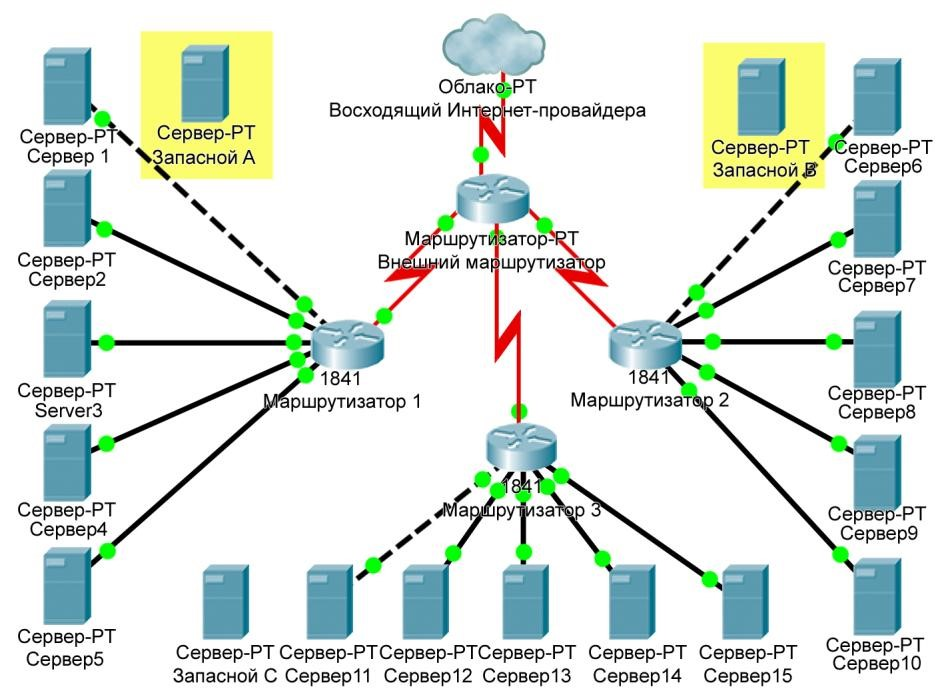

Оглавление

<a href="#_Toc454891579">Практическая работа №1-2: “ Монтаж кабельных сред технологий Ethernet ” 3</a>

<a href="#_Toc454891580">Лабораторная работа №1: “ Обучение работе со средством моделирования Packet Tracer ” 11</a>

<a href="#_Toc454891581">Лабораторная работа №2-3: “ Создание прототипа сети ” 15</a>

<a href="#_Toc454891582">Лабораторная работа №4: “Отслеживание прохождения пакетов через сеть ” 17</a>

<a href="#_Toc454891583">Лабораторная работа №5: “ Подключение к веб-серверу с помощью IP ” 19</a>

<a href="#_Toc454891584">Лабораторная работа №6: “ Настройка DHCP многофункционального устройства ” 20</a>

<a href="#_Toc454891585">Лабораторная работа №7: “Проверка NAT на многофункциональном устройстве.” 23</a>

<a href="#_Toc454891586">Практическая работа №3-4: “ Разбиение сети на подсети” 26</a>

<a href="#_Toc454891587">Лабораторная работа №8-9 “ Изучение веб-запросов.” 32</a>

<a href="#_Toc454891588">Лабораторная работа №10: “ Просмотр информации PDU, пересылаемых между клиентом и сервером.”
	34</a>

<a href="#_Toc454891589">Лабораторная работа №11-12: “Поиск и устранение неполадок беспроводного соединения.” 36</a>

<a href="#_Toc454891590">Лабораторная работа №13: “ Определение маршрутов следования данных в сети.” 38</a>

<a href="#_Toc454891591">Практическая работа №5-6: “Определение оборудования, удовлетворяющего требованиям заказчика
	” 43</a>

<a href="#_Toc454891592">Глоссарий 56</a>

<a href="#_Toc454891593">Литература 81</a>

<h1>Практическая работа №1-2: “ Монтаж кабельных сред технологий Ethernet ”</h1>

<strong>Задача </strong>

• Создать и протестировать прямой и перекрестный кабели UTP (неэкранированная витая пара) для сети Ethernet. 

Исходные данные / подготовка 

В этой лабораторной работе требуется создать и обжать прямые соединительные кабели и перекрестные кабели для
	Ethernet. В прямом кабеле цвет провода контакта 1 на одном конце совпадает с цветом провода контакта 1 на другом
	конце кабеля. Для остальных семи контактов ситуация аналогична. Кабель будет создан на основе стандарта TIA/EIA
	T568A или T568B для Ethernet, который определяет цвета проводов для каждого контакта. Прямые соединительные кабели
	обычно используются для прямого подключения узла к концентратору или компьютеру либо к настенному креплению в
	офисе. 

В перекрестном кабеле вторая и третья пары на разъеме RJ-45 на одном конце кабеля перекрещены по отношению к другому
	концу. Выводы данного кабеля соответствуют стандарту T568A на одном конце и стандарту T568B на другом. Перекрестные
	кабели обычно используются для подключения к концентраторам и коммутаторам или прямого соединения двух узлов для
	создания простой сети. Данная лабораторная работа состоит из двух частей. Ее можно выполнять индивидуально, парами
	или в группе. 

Требуются следующие ресурсы: 

два куска кабеля длиной 0,6 – 0,9 м (2 – 3 фута) категории 5 или 5e; 

не менее четырех разъемов RJ-45 (может потребоваться больше при неправильном соединении проводов); 

обжимной инструмент RJ-45; 

тестер кабелей Ethernet; 

кусачки. 

<table>
	<tr>
		<td></td>
		<td colspan="2">
Стандарт T568A<strong> </strong>
</td>
		<td></td>
	</tr>
	<tr>
		<td>
<strong>№ контакта </strong>
</td>
		<td>
<strong>№ пары </strong>
</td>
		<td>
<strong>Цвет провода </strong>
</td>
		<td>
<strong>Функция </strong>
</td>
	</tr>
	<tr>
		<td>
1 
</td>
		<td>
2 
</td>
		<td>
Белый/зеленый<strong> </strong>
</td>
		<td>
Передача<strong> </strong>
</td>
	</tr>
	<tr>
		<td>
2 
</td>
		<td>
2 
</td>
		<td>
Зеленый<strong> </strong>
</td>
		<td>
Передача<strong> </strong>
</td>
	</tr>
	<tr>
		<td>
3 
</td>
		<td>
3 
</td>
		<td>
Белый/оранжевый<strong> </strong>
</td>
		<td>
Прием<strong> </strong>
</td>
	</tr>
	<tr>
		<td>
4 
</td>
		<td>
1 
</td>
		<td>
Синий<strong> </strong>
</td>
		<td>
Не используется<strong> </strong>
</td>
	</tr>
	<tr>
		<td>
5 
</td>
		<td>
1 
</td>
		<td>
Белый/синий<strong> </strong>
</td>
		<td>
Не используется<strong> </strong>
</td>
	</tr>
	<tr>
		<td>
6 
</td>
		<td>
3 
</td>
		<td>
Оранжевый<strong> </strong>
</td>
		<td>
Прием<strong> </strong>
</td>
	</tr>
	<tr>
		<td>
7 
</td>
		<td>
4 
</td>
		<td>
Белый/коричневый<strong> </strong>
</td>
		<td>
Не используется<strong> </strong>
</td>
	</tr>
	<tr>
		<td>
8 
</td>
		<td>
4 
</td>
		<td>
Коричневый<strong> </strong>
</td>
		<td>
Не используется<strong> </strong>
</td>
	</tr>
</table>

<table>
	<tr>
		<td colspan="4">
Стандарт T568B<strong> </strong>
</td>
	</tr>
	<tr>
		<td>
<strong>№ контакта </strong>
</td>
		<td>
<strong>№ пары </strong>
</td>
		<td>
<strong>Цвет провода </strong>
</td>
		<td>
<strong>Функция </strong>
</td>
	</tr>
	<tr>
		<td>
1 
</td>
		<td>
2 
</td>
		<td>
Белый/оранжевый<strong> </strong>
</td>
		<td>
Передача<strong> </strong>
</td>
	</tr>
	<tr>
		<td>
2 
</td>
		<td>
2 
</td>
		<td>
Оранжевый<strong> </strong>
</td>
		<td>
Передача<strong> </strong>
</td>
	</tr>
	<tr>
		<td>
3 
</td>
		<td>
3 
</td>
		<td>
Белый/зеленый<strong> </strong>
</td>
		<td>
Прием<strong> </strong>
</td>
	</tr>
	<tr>
		<td>
4 
</td>
		<td>
1 
</td>
		<td>
Синий<strong> </strong>
</td>
		<td>
Не используется<strong> </strong>
</td>
	</tr>
	<tr>
		<td>
5 
</td>
		<td>
1 
</td>
		<td>
Белый/синий<strong> </strong>
</td>
		<td>
Не используется<strong> </strong>
</td>
	</tr>
	<tr>
		<td>
6 
</td>
		<td>
3 
</td>
		<td>
Зеленый<strong> </strong>
</td>
		<td>
Прием<strong> </strong>
</td>
	</tr>
	<tr>
		<td>
7 
</td>
		<td>
4 
</td>
		<td>
Белый/коричневый<strong> </strong>
</td>
		<td>
Не используется<strong> </strong>
</td>
	</tr>
	<tr>
		<td>
8 
</td>
		<td>
4 
</td>
		<td>
Коричневый<strong> </strong>
</td>
		<td>
Не используется<strong> </strong>
</td>
	</tr>
</table>

Часть А. Создание и тестирование прямого соединительного кабеля Ethernet 

Шаг 1. Получение и подготовка кабеля 

а. Определите требуемую длину кабеля. Это может быть расстояние от устройства, такого как компьютер, до устройства, к
	которому он подключается (например, концентратор или коммутатор), или между устройством и штепсельным разъемом
	RJ-45. Добавьте к этому расстоянию не менее 30,48 см (12 дюймов). Согласно стандарту TIA/EIA максимальная длина
	кабеля равна 5 м (16,4 фута). Стандартные длины кабелей Ethernet: 6 м (2 фута), 1,83 м (6 футов) или 3,05 м (10
	футов). 

б. Какая длина кабеля выбрана и почему? 

____________________________________________________________________________ 

в. Отрежьте кусок кабеля требуемой длины. Для соединительных кабелей (кабели между конечными сетевыми устройствами,
	такими как ПК, и разъемом RJ-45) обычно используется скрученный кабель UTP, так как такие кабели дольше служат при
	многократном сгибании. Они называются скрученными, так как каждый из проводов в кабеле сделан из нескольких жил из
	чистой меди, а не из одного одножильного провода. Одножильный провод используется для трасс кабелей между разъемом
	RJ-45 и монтажным блоком. 

г. С помощью инструмента для снятия изоляции очистите от оболочки оба конца кабеля на 5,08 см (2 дюйма). 

Шаг 2. Подготовка и вставка проводов 

а. Определите, какой стандарт будет использоваться. 

[T568A | T568B] 

б. Определите правильную таблицу на основе используемого стандарта соединений проводов. 

в. Разверните пары кабелей и упорядочите их примерно в требуемом порядке на основе выбранного стандарта. 

г. Расплетите короткий участок пар и упорядочите их в порядке, точно соответствующем стандарту. <strong>Очень важно
	расплетать как можно меньший участок. Скручивание очень важно, так как обеспечивает подавление помех.</strong>

д. Выпрямите и разгладьте провода между большим и указательным пальцами. 

е. Убедитесь, что порядок проводов кабеля все еще соответствует стандарту. 

ж. Обрежьте прямой участок кабеля на расстоянии 1,25 – 1,9 см (1/2 – 3/4 дюйма) от края кабельной оболочки. Если
	оставить более длинный участок, кабель будет восприимчив к перекрестным помехам (помехам, создаваемым соседними
	проводами). 

з. При вставке проводов выступ (штырь, торчащий из разъема RJ-45) должен находиться с обратной стороны и быть
	направленным вниз. Вставьте провода в разъем RJ-45 до упора, все провода должны заходить в разъем на максимальную
	длину. 

Шаг 3. Осмотр, обжим и повторный осмотр 

а. Осмотрите кабель и проверьте правильность цветового кода при подключении проводов к правильным номерам
	контактов. 

б. Осмотрите конец разъема. Восемь проводов должны быть плотно сжаты на конце разъема RJ-45. Некоторая часть оболочки
	кабеля должна заходить в разъем. Это ослабляет напряжение кабеля. Если оболочка заходит в разъем недостаточно
	глубоко, то в конечном итоге это может привести к повреждению кабеля. 

в. Если все правильно выровнено и вставлено, вставьте разъем RJ-45 и кабель в обжимной инструмент. Обжимной
	инструмент обожмет разъем RJ-45 двумя поршнями. 

г. Повторно осмотрите разъем. В случае неправильной установки обрежьте конец и повторите процесс. 

Шаг 4. Обработка другого конца кабеля 

а. Use the previously described steps to attach an RJ-45 connector to the other end of the cable. Выполните ранее
	описанные действия, чтобы установить разъем RJ-45 на другом конце кабеля. 

б. Повторно осмотрите разъем. В случае неправильной установки обрежьте конец и повторите процесс. 

в. Какой стандарт [T568A | T568B] используется для соединительных кабелей в вашей школе? 

______________________________________________________________________________ 

Шаг 5. Тестирование кабеля 

а. С помощью кабельного тестера проверьте работоспособность прямого кабеля. Если кабель не прошел тест, заново
	выполните данную лабораторную работу. 

б. С помощью данного кабеля подключите ПК к сети (необязательно). 

в. Нажмите кнопку «<strong>Пуск</strong>» и выберите команду «<strong>Выполнить</strong>» (необязательно). 

г. Введите команду <strong>cmd</strong> и нажмите клавишу «<strong>ВВОД</strong>» (необязательно). 

д. В командной строке введите <strong>ipconfig</strong> (необязательно). 

е. Запишите IP-адрес основного шлюза (необязательно). _________________________________ 

ж. В командной строке введите команду <strong>ping</strong> с IP-адресом основного шлюза (необязательно). Если кабель
	работоспособен, проверка подключения должна быть успешной (подразумевается, что других сетевых проблем нет, а
	основной шлюз маршрутизатора подключен и работоспособен). 

Часть Б. Создание и тестирование перекрестного кабеля Ethernet 

Шаг 1. Получение и подготовка кабеля 

а. Определите требуемую длину кабеля. Это может быть расстояние между концентраторами, от концентратора до
	коммутатора, между коммутаторами, от компьютера до маршрутизатора или между компьютерами. Добавьте к этому
	расстоянию не менее 30,48 см (12 дюймов). Какая длина кабеля выбрана и почему? 

____________________________________________________________________________ 

б. Отрежьте кусок кабеля требуемой длины и с помощью инструмента для снятия изоляции очистите от оболочки оба конца
	кабеля на 5,08 см (2 дюйма). 

Шаг 2. Подготовка и вставка проводов в соответствии со стандартом T568A 

а. Найдите таблицу T568A в начале данного документа. 

б. Разверните пары кабелей и упорядочите их примерно в требуемом порядке на основе стандарта T568A. 

в. Расплетите короткий участок пар и упорядочите их в порядке, точно соответствующем стандарту. Очень важно
	расплетать как можно меньший участок. Скручивание очень важно, так как обеспечивает подавление помех. 

г. Выпрямите и разгладьте провода между большим и указательным пальцами. 

д. Убедитесь, что порядок проводов кабеля соответствует стандарту. 

е. Обрежьте прямой участок кабеля на расстоянии 1,25 – 1,9 см (1/2 – 3/4 дюйма) от края кабельной оболочки. Если
	оставить более длинный участок, кабель будет восприимчив к перекрестным помехам (помехам, создаваемым соседними
	проводами). 

ж. При вставке проводов выступ (штырь, торчащий из разъема RJ-45) должен находиться с обратной стороны и быть
	направленным вниз. Вставьте провода в разъем RJ-45 до упора, все провода должны заходить в разъем на максимальную
	длину. 

Шаг 3. Осмотр, обжим и повторный осмотр 

а. Осмотрите кабель и проверьте правильность цветового кода при подключении проводов к правильным номерам
	контактов. 

б. Осмотрите конец разъема. Восемь проводов должны быть плотно сжаты на конце разъема RJ-45. Некоторая часть оболочки
	кабеля должна заходить в разъем. Это ослабляет напряжение кабеля, которое в конечном итоге может привести к
	повреждению кабеля. 

в. Если все правильно выровнено и вставлено, вставьте разъем RJ-45 и кабель в обжимной инструмент. Обжимной
	инструмент обожмет разъем RJ-45 двумя поршнями. 

г. Повторно осмотрите разъем. В случае неправильной установки обрежьте конец и повторите процесс. 

Шаг 4. Обработка другого конца кабеля в соответствии со стандартом T568B 

а. Выполните ранее описанные действия (но используя таблицу и стандарт T568B), чтобы установить разъем RJ-45 на
	другом конце кабеля. 

б. Повторно осмотрите разъем. В случае неправильной установки обрежьте конец и повторите процесс. 

в. Какой стандарт [T568A | T568B] лучше использовать дома, если есть домашняя сеть или требуется ее создать? 

Шаг 5. Тестирование кабеля 

а. С помощью кабельного тестера проверьте работоспособность перекрестного кабеля. Если кабель не прошел тест, заново
	выполните данную лабораторную работу. 

б. С помощью данного кабеля соедините два ПК. 

в. На обоих компьютерах нажмите кнопку «<strong>Пуск</strong>» и выберите команду «<strong>Выполнить</strong>». 

<strong>ПРИМЕЧАНИЕ.</strong> Если выполнение команды «<strong>Пуск</strong>» на данном ПК недоступно, визуально
	проверьте состояние световых индикаторов сетевой интерфейсной платы. Если кабель работоспособен, они должны
	светиться (обычно зеленым или желтым светом). 

г. На обоих компьютерах введите команду <strong>cmd</strong> и нажмите клавишу «<strong>ВВОД</strong>». 

д. В командной строке обоих компьютеров введите <strong>ipconfig</strong>. 

е. Запишите IP-адреса обоих компьютеров. 

Компьютер 1: _________________________ 

Компьютер 2: _________________________ 

ж. В командной строке одного компьютера введите команду <strong>ping</strong> с IP-адресом другого компьютера. Если
	кабель работоспособен, проверка подключения должна быть успешной. Также выполните проверку подключения на втором
	компьютере. 

<strong>ПРИМЕЧАНИЕ.</strong> Для успешного выполнения проверки подключения на целевом компьютере необходимо временно
	отключить межсетевой экран Windows. Если нужна помощь по данному вопросу, см. лабораторную работу 3.1.5. В случае
	отключения межсетевого экрана не забудьте потом его снова включить. 

Шаг 6. Вопросы для обсуждения 

а. Какая часть процесса создания таких кабелей оказалась наиболее трудной? Сравните свое мнение с мнением других
	учащихся. 

б. Все ли четыре пары кабелей скручены одинаково? Обсудите причины в каждом случае. 

в. Спросите на местном предприятии или посетите веб-узел http://www.workopolis.com/HU , HU чтобы
	узнать, сколько зарабатывает начинающий монтажник кабелей и какие требования к ним предъявляются. Запишите ниже
	полученную информацию. 

____________________________________________________________________________ 

____________________________________________________________________________ 

г. Многие технические специалисты включают перекрестный кабель в свой инструментарий. Как вы думаете, когда следует
	использовать перекрестный кабель и в каких ситуациях такой кабель используется сетевым техником? 

____________________________________________________________________________ 

____________________________________________________________________________ 

<h1>Лабораторная работа №1: “ Обучение работе со средством моделирования Packet Tracer ”</h1>

<strong>Задачи</strong>

<ul>
	<li>Понять основные принципы работы с Packet Tracer.</li>
	<li>Создание/имитация простой сети Ethernet с помощью двух узлов и концентратора.</li>
	<li>Наблюдение поведения трафика в сети.</li>
	<li>Наблюдение за потоком данных широковещательных рассылок по протоколу ARP и обменов пакетами данных (ping).</li>
</ul>

<em>Подсказка. Чтобы инструкции во время выполнении упражнения отображались, поставьте флажок «Top» (вверх) в нижнем
	левом углу окна с инструкциями.</em>

<strong>Шаг 1. Создание логической схемы сети с двумя ПК и концентратором.</strong>

В нижнем левом углу окна Packet Tracer отображены восемь значков, представляющих категории или группы устройств,
	например, Routers (маршрутизаторы), Switches (коммутаторы) или End Devices (конечные устройства).   При
	перемещении курсора над категориями устройств отображается имя категории в окне. Для выбора определенного устройства
	выберите сначала категорию. После выбора категории устройств рядом со значками категорий появится список устройств.
	Выберите нужное устройство.

<table>
	<tr>
		<td></td>
		<td>
a.
</td>
		<td>
Выберите пункт <strong>End Devices</strong> (конечные устройства) из списка вариантов в левом нижнем
			углу. Перетащите два однотипных ПК на область проектирования сети.
</td>
	</tr>
	<tr>
		<td></td>
		<td>
б.
</td>
		<td>
Выберите <strong>Hubs</strong> (концентраторы) из списка вариантов в левом нижнем углу. Добавьте
			концентратор к прототипу сети, перетащив типовой концентратор на область проектирования сети.
</td>
	</tr>
	<tr>
		<td></td>
		<td>
в.
</td>
		<td>
Выберите значок <strong>Connections</strong> (соединения) из списка вариантов в левом нижнем углу.
			Выберите тип кабеля <strong>Copper Straight-through</strong> (медный прямой). Щелкните первый узел <strong>PC0</strong> и
			назначьте выбранный кабель разъему интерфейса <strong>FastEthernet</strong>. Щелкните концентратор <strong>Hub0</strong> и
			выберите порт соединения <strong>Port0</strong> для соединения с <strong>PC0</strong>.
</td>
	</tr>
	<tr>
		<td></td>
		<td>
г.
</td>
		<td>
Повторите этот шаг для второго ПК <strong>PC1</strong> для его подключения к<strong>Port1</strong> на
			концентраторе.
</td>
	</tr>
</table>

*На концах кабельного соединения должны появиться зеленые точки. Если этого не произошло, проверьте выбранный тип
	кабеля.

<strong>Шаг 2. Настройка имен узлов и IP-адресов на компьютерах</strong>

<table>
	<tr>
		<td></td>
		<td>
a.
</td>
		<td>
Щелкните значок PC0. Появится окно PC0.
</td>
	</tr>
	<tr>
		<td></td>
		<td>
б.
</td>
		<td>
В окне PC0 выберите вкладку <strong>Config</strong> (конфигурация). Измените<strong>Display Name</strong> (отображаемое
			имя) ПК на <strong>PC-A</strong>. (Откроется окно с сообщением о том, что изменение имени устройства может
			оказать влияние на оценку упражнения. Не обращайте внимания на это окно с сообщением об ошибке.) Выберите
			вкладку<strong>FastEthernet</strong> слева и добавьте IP-адрес <strong>192.168.1.1</strong> и маску подсети <strong>255.255.255.0</strong>.
			Закройте окно конфигурации PC-A, нажав на кнопку <strong>x</strong> в правом верхнем углу окна.
</td>
	</tr>
	<tr>
		<td></td>
		<td>
в.
</td>
		<td>
Щелкните значок PC1.
</td>
	</tr>
	<tr>
		<td></td>
		<td>
г.
</td>
		<td>
Выберите вкладку <strong>Config</strong> (конфигурация). Измените <strong>Display Name</strong>(отображаемое
			имя) ПК на <strong>PC-B</strong>. Выберите вкладку<strong>FastEthernet</strong> слева и добавьте
			IP-адрес <strong>192.168.1.2</strong> и маску подсети <strong>255.255.255.0</strong>. Закройте окно
			конфигурации PC-B.
</td>
	</tr>
</table>

<strong>Шаг 3. Наблюдение за потоком данных от PC-A к PC-B при создании сетевого трафика</strong>

<table>
	<tr>
		<td></td>
		<td>
a.
</td>
		<td>
Включите режим <strong>Simulation</strong> (моделирование), выбрав вкладку, частично скрытую за вкладкой <strong>Realtime</strong> (в
			реальном времени) в нижнем правом углу. На вкладке изображен секундомер.
</td>
	</tr>
	<tr>
		<td></td>
		<td>
б.
</td>
		<td>
Нажмите кнопку <strong>Edit Filters</strong> (редактировать фильтры) в области<strong>Event List
			Filters</strong> (фильтры списка событий). После нажатия кнопки <strong>Edit Filters</strong> (редактировать
			фильтры) откроется всплывающее окно. Во всплывающем окне щелкните пункт <strong>Show All/None</strong> (показать
			все/ничего) для отмены выделения всех фильтров. Выберите только
			фильтры <strong>ARP</strong> и <strong>ICMP</strong>.
</td>
	</tr>
	<tr>
		<td></td>
		<td>
в.
</td>
		<td>
Выберите <strong>Simple PDU</strong> (простой PDU), щелкнув значок с изображением закрытого конверта на
			вертикальной панели инструментов. Переместите курсор в область отображения на экране.
			Щелкните <strong>PC-A</strong> для определения источника. Переместите курсор на <strong>PC-В</strong> и
			щелкните для определения адресата.  **Обратите внимание, что два конверта теперь находятся рядом с
			PC-A. Один конверт - это сообщение, передаваемое по протоколу ICMP, другой - сообщение, передаваемое по
			протоколу ARP. Event List (cписок событий) на панели «Simulation» (панель моделирования) точно отобразит,
			какой из конвертов представляет сообщение, передаваемое по протоколу ICMP, а какой - сообщение, передаваемое
			по протоколу ARP.
</td>
	</tr>
	<tr>
		<td></td>
		<td>
г.
</td>
		<td>
Нажмите кнопку <strong>Auto Capture / Play</strong> (автозахват / воспроизведение) в области <strong>Play
			Controls</strong> (регуляторы воспроизведения) на панели «Simulation» (панель моделирования). Под
			кнопкой <strong>Auto Capture / Play</strong> (автозахват / воспроизведение) имеется горизонтальная полоса с
			вертикальной кнопкой (ползунком), регулирующей скорость моделирования. При перетаскивании ползунка
			вправо/влево увеличивается/снижается скорость моделирования.
</td>
	</tr>
	<tr>
		<td></td>
		<td>
д.
</td>
		<td>
Воспроизведение анимации закончится при появлении окна с сообщением <em>No More Events</em> (больше
			событий нет). Это означает, что все запросы событий выполнены. Нажмите кнопку <strong>OK</strong> для
			закрытия окна с сообщением. 
</td>
	</tr>
	<tr>
		<td></td>
		<td>
e.
</td>
		<td>
Нажмите кнопку <strong>Reset Simulation</strong> (восстановить моделирование) на панели «Simulation»
			(панель моделирования). Обратите внимание, что конверт типа ARP отсутствует. Процесс моделирования вернулся
			в исходное состояние, но при этом изменения конфигурации или записи в динамической таблице, например, записи
			в ARP-таблице, отменены не были. ARP-запрос не обязателен для выполнения команды <strong>ping</strong>,
			поскольку PC-A уже имеет MAC-адрес в ARP-таблице. 
</td>
	</tr>
	<tr>
		<td></td>
		<td>
ж.
</td>
		<td>
Нажмите кнопку <strong>Capture / Forward</strong> (захват / вперед). ICMP-конверт переместится от
			отправителя к концентратору и остановится. Кнопка <strong>Capture / Forward</strong> (захват / вперед)
			позволяет запустить моделирование на один шаг вперед. Нажимайте кнопку <strong>Capture / Forward</strong> (захват
			/ вперед) до тех пор, пока не выполните событие.
</td>
	</tr>
	<tr>
		<td></td>
		<td>
з.
</td>
		<td>
Нажмите кнопку <strong>Power Cycle Devices</strong> (силовые устройства) снизу слева, над значками
			устройств.
</td>
	</tr>
	<tr>
		<td></td>
		<td>
и.
</td>
		<td>
Откроется окно с запросом подтвердить сброс. Нажмите кнопку<strong>Yes</strong> (да). ICMP- и
			ARP-конверты появятся снова. Кнопка <strong>Reset Network</strong> (сброс сети) отменит все несохраненные
			изменения конфигурации и сотрет все записи в динамической таблице, например, записи ARP- и MAC-таблицы.

		</td>
	</tr>
</table>

<strong>Шаг 4. Отображение ARP-таблицы на каждом ПК</strong>

<table>
	<tr>
		<td></td>
		<td>
a.
</td>
		<td>
Нажмите кнопку <strong>Auto Capture / Play</strong> (автозахват / воспроизведение) для заполнения
			ARP-таблицы на ПК. Нажмите кнопку <strong>OK</strong> при появлении окна <em>No More Events</em> (событий
			больше нет).
</td>
	</tr>
	<tr>
		<td></td>
		<td>
б.
</td>
		<td>
Выберите инструмент масштабирования с изображением увеличительного стекла на вертикальной панели
			инструментов.
</td>
	</tr>
	<tr>
		<td></td>
		<td>
в.
</td>
		<td>
Щелкните значок <strong>PC-A</strong>. Появится ARP-таблица для PC-A. Обратите внимание, что PC-A не
			имеет записи в ARP-таблице для PC-B. Отобразите ARP-таблицу для PC-B. Закройте все окна с ARP-таблицами.

		</td>
	</tr>
	<tr>
		<td></td>
		<td>
г.
</td>
		<td>
Щелкните <strong>инструмент Select</strong> (выбор) на вертикальной панели инструментов справа. (Это
			первый по счету значок на панели инструментов.) 
</td>
	</tr>
	<tr>
		<td></td>
		<td>
д.
</td>
		<td>
Щелкните <strong>PC-A</strong> и выберите вкладку <strong>Desktop</strong> (рабочий стол). 
</td>
	</tr>
	<tr>
		<td></td>
		<td>
e.
</td>
		<td>
Выберите <strong>Command Prompt</strong> (командная строка), введите команду<strong>arp -a</strong> и
			нажмите клавишу <em>ВВОД</em>, чтобы отобразить ARP-таблицу на рабочем столе. Закройте окно конфигурации
			PC-A.
</td>
	</tr>
	<tr>
		<td></td>
		<td>
ж.
</td>
		<td>
Изучите ARP-таблицу для <strong>PC-B</strong>.
</td>
	</tr>
	<tr>
		<td></td>
		<td>
з.
</td>
		<td>
Закройте окно конфигурации PC-B.
</td>
	</tr>
	<tr>
		<td></td>
		<td>
и.
</td>
		<td>
Нажмите кнопку <strong>Check Results</strong> (проверить результаты) внизу данного окна с инструкциями
			для проверки правильности топологии.
</td>
	</tr>
</table>
<h1>Лабораторная работа №2-3: “ Создание прототипа сети ”</h1>

Задача

<ul>
	<li>Построить прототип сети с помощью Packet Tracer</li>
</ul>

Исходные данные.

Заказчик потребовал спроектировать простую сеть с двумя ПК, подключенными к коммутатору. Проверьте соответствие
	аппаратных средств и конфигурации требованиям заказчика.

Шаг 1. Проектирование топологии сети

<table>
	<tr>
		<td></td>
		<td>
a.
</td>
		<td>
Добавьте два ПК и коммутатор Cisco 2950T.
</td>
	</tr>
	<tr>
		<td></td>
		<td>
б.
</td>
		<td>
С помощью прямых кабелей подключите компьютер <strong>PC0</strong> к интерфейсу <strong>Fa0/1</strong> на
			коммутаторе <strong>Switch0</strong> и компьютер <strong>PC1</strong> к интерфейсу <strong>Fa0/2</strong> на
			коммутаторе <strong>Switch0</strong>.
</td>
	</tr>
	<tr>
		<td></td>
		<td>
в.
</td>
		<td>
Настройте PC0 с помощью вкладки <strong>Config</strong> (конфигурация) в окне конфигурации PC0:

			<ol>
				<li>IP-адрес: 192.168.10.10</li>
				<li>Маска подсети: 255.255.255.0</li>
			</ol>
		</td>
	</tr>
	<tr>
		<td></td>
		<td>
г.
</td>
		<td>
Настройте PC1 с помощью вкладки <strong>Config</strong> (конфигурация) в окне конфигурации PC1:

			<ol>
				<li>IP-адрес: 192.168.10.11</li>
				<li>Маска подсети: 255.255.255.0</li>
			</ol>
		</td>
	</tr>
</table>

Шаг 2. Тестирование соединения PC0 и PC1

<table>
	<tr>
		<td></td>
		<td>
a.
</td>
		<td>
С помощью команды <strong>ping</strong> выполните тестирование соединения.

			<ol>
				<li>Щелкните PC0.</li>
				<li>Выберите вкладку <strong>Desktop</strong> (рабочий стол). </li>
				<li>Выберите <strong>Command Prompt</strong> (командная строка).</li>
				<li>Введите <strong>ping 192.168.10.11</strong> и нажмите клавишу <em>ВВОД</em>.</li>
			</ol>
		</td>
	</tr>
	<tr>
		<td></td>
		<td>
б.
</td>
		<td>
Успешное тестирование с помощью команды <strong>ping</strong> указывает на то, что сеть была
			сконфигурирована правильно и прототип сети подтверждает конфигурацию аппаратно-программных средств. Успешное
			тестирование с помощью команды <strong>ping</strong> должно дать следующие результаты:

			
<strong>PC&gt;ping 192.168.10.11  Pinging 192.168.10.11 with 32 bytes of data:  Reply
				from 192.168.10.11: bytes=32 time=170ms TTL=128  Reply from 192.168.10.11: bytes=32 time=71ms
				TTL=128  Reply from 192.168.10.11: bytes=32 time=70ms TTL=128  Reply from 192.168.10.11:
				bytes=32 time=68ms TTL=128   Ping statistics for 192.168.10.11:   Packets: Sent = 4,
				Received = 4, Lost = 0 (0% loss),  Approximate round trip times in milli-seconds:   Minimum =
				68ms, Maximum = 170ms, Average = 94ms</strong>

			
Закройте окно конфигурации.
</td>
	</tr>
	<tr>
		<td></td>
		<td>
в.
</td>
		<td>
Нажмите кнопку <strong>Check Results</strong> (проверить результаты) внизу окна с инструкциями для
			проверки выполнения упражнения.
</td>
	</tr>
</table>
<h1>Лабораторная работа №4: “Отслеживание прохождения пакетов через сеть ”</h1>

Задача

<ul>
	<li>С помощью команд <strong>ping</strong> и <strong>tracert</strong> проверить возможность подключения от источника
		к адресату. </li>
</ul>

Исходные данные

Администратор сети хочет проверить путь пакета до веб-сервера назначения.

Шаг 1. Проверка возможности подключения от узла-источника к узлу-назначения.

<table>
	<tr>
		<td></td>
		<td>
a.
</td>
		<td>
Откройте командную строку узла-источника и отправьте адресату<strong>эхо-запрос</strong>:  Выберите
			PC0. Откройте вкладку <strong>Desktop</strong> (рабочий стол) &gt; <strong>Command Prompt</strong>(командная
			строка). &lt;
</td>
	</tr>
	<tr>
		<td></td>
		<td>
б.
</td>
		<td>
Введите <strong>ping 192.168.3.2</strong> и нажмите клавишу <em>ВВОД</em>.  *Наличие ответа
			подтверждает возможность подключения от узла к устройству назначения. Он не определяет пройденный пакетом
			путь.   **Первые несколько <strong>pings</strong> могут задержаться на время загрузки устройств.
			Если задерживаются все <strong>pings</strong> повторите команду.
</td>
	</tr>
</table>

Шаг 2. Определение пройденного пути с помощью команды tracert

<table>
	<tr>
		<td></td>
		<td>
a.
</td>
		<td>
В том же окне <strong>Command Prompt</strong> (командная строка) для PC0 введите <strong>tracert
			192.168.3.2</strong> и нажмите клавишу <em>ВВОД</em>.  *Команда <strong>tracert</strong> должна
			отображаться для четырех переходов (hop), четвертый переход (hop) - и есть искомый адресат. Эта процедура не
			только проверяет связь между устройствами, но также предоставляет информацию о точном пути пакетов до
			каждого из участков сети.
</td>
	</tr>
	<tr>
		<td></td>
		<td>
б.
</td>
		<td>
Закройте окно конфигурации PC0.
</td>
	</tr>
</table>

Шаг 3. Просмотр пути пакета в режиме моделирования

<table>
	<tr>
		<td></td>
		<td>
a.
</td>
		<td>
Откройте окно режима моделирования, щелкнув вкладку<strong>Simulation</strong> (моделирование). Она
			расположена позади вкладки<strong>Realtime</strong> (в реальном времени) в правом нижнем углу. 
</td>
	</tr>
	<tr>
		<td></td>
		<td>
б.
</td>
		<td>
Нажмите кнопку <strong>Add Simple PDU</strong> (добавить простой PDU). Это значок закрытого конверта,
			который находится в правой части экрана. После это щелкните PC0 и PC1. Добавится пакет <strong>ping</strong> от
			источника к адресату.
</td>
	</tr>
	<tr>
		<td></td>
		<td>
в.
</td>
		<td>
Нажмите кнопку <strong>Edit Filters</strong> (редактировать фильтры) для вызова списка фильтров.
			Убедитесь, что флажок стоит только в поле «ICMP».
</td>
	</tr>
	<tr>
		<td></td>
		<td>
г.
</td>
		<td>
В окне рабочей области щелкните облако сети для ее расширения и отображения маршрутизаторов, подключенных
			в рамках облака. Источник и адресат находятся за пределами экрана. Отображаются только маршрутизаторы и
			пакеты в рамках облака, которыми обмениваются эти устройства. 
</td>
	</tr>
	<tr>
		<td></td>
		<td>
д.
</td>
		<td>
Нажмите кнопку <strong>Auto Capture / Play</strong> (автозахват / воспроизведение) на панели «Simulation»
			(панель моделирования) и просмотрите путь пакета к адресату.   *Обратите внимание, что, согласно
			списку «Event List» (список событий), между источником и адресатом находится три маршрутизатора. Именно этот
			путь отобразился ранее в окне командной строки, после подачи команды <strong>tracert</strong>.
</td>
	</tr>
</table>
<h1>Лабораторная работа №5: “ Подключение к веб-серверу с помощью IP ”</h1>

Задача

<ul>
	<li>Выполнить наблюдение рассылки пакетов по сети Интернет с помощью IP-адресов.  Шаг 1. Проверка
		подключение к веб-серверу
	</li>
</ul>
<table>
	<tr>
		<td></td>
		<td>
a.
</td>
		<td>
Откройте окно командной строки узла источника.

			<ol>
				<li>Выберите PC0.</li>
				<li>Откройте вкладку <strong>Desktop</strong> (рабочий стол) &gt; <strong>Command Prompt</strong> (командная
					строка).
				</li>
			</ol>
		</td>
	</tr>
	<tr>
		<td></td>
		<td>
б.
</td>
		<td>
Проверьте подключение к веб-серверу.

			<ol>
				<li>Из командной строки отправьте <strong>ping</strong> на IP-адрес веб-сервера, введя <strong>ping
					172.33.100.50</strong> и нажав клавишу <em>ВВОД</em>.  *Наличие ответа подтверждает
					непрерывность канала от клиента к веб-серверу назначения. Вначале, из-за загрузки устройств и работы
					ARP, запрос может задержаться. 
				</li>
				<li>Закройте окно командной строки, нажав на кнопку <strong>&quot;x&quot;</strong> в правом верхнем углу
					окна.  Окно рабочего стола PC0 должно оставаться открытым.
				</li>
			</ol>
		</td>
	</tr>
</table>

Шаг 2. Подключение к веб-серверу через веб-клиент

<table>
	<tr>
		<td></td>
		<td>
a.
</td>
		<td>
Откройте клиент веб-обозревателя узла источника.

			<ol>
				<li>Откройте веб-клиент из окна настольного компьютера PC0, выбрав команду <strong>Web Browser</strong> (веб-обозреватель).
				</li>
			</ol>
		</td>
	</tr>
	<tr>
		<td></td>
		<td>
б.
</td>
		<td>
Введите<strong> 172.33.100.50</strong> в блок URL и нажмите кнопку «Перейти».  *Веб-клиент
			подключится к веб-серверу с использованием IP-адреса и откроет веб-сайт.
</td>
	</tr>
	<tr>
		<td></td>
		<td>
в.
</td>
		<td>
Закройте окно конфигурации PC0. Упражнение закончено.
</td>
	</tr>
</table>
<h1>Лабораторная работа №6: “ Настройка DHCP многофункционального устройства ”</h1>

Задачи

<ul>
	<li>Подключить три ПК к многофункциональному устройству Linksys-WRT300N.</li>
	<li>Изменить настройку DHCP на определенный сетевой диапазон.</li>
	<li>Настроить клиенты на получение IP-адреса через DHCP</li>
</ul>

Исходные данные

Пользователь хочет соединить между собой 3 ПК с помощью устройства Linksys-WRT300N. Все три ПК должны получать
	IP-адреса автоматически от устройства Linksys.

Шаг 1. Настройка топологии сети

<table>
	<tr>
		<td></td>
		<td>
a.
</td>
		<td>
Добавьте в рабочую область три ПК.
</td>
	</tr>
	<tr>
		<td></td>
		<td>
б.
</td>
		<td>
Добавьте в рабочую область устройство Linksys-WRT300N.
</td>
	</tr>
	<tr>
		<td></td>
		<td>
в.
</td>
		<td>
Подключите каждый из ПК к портам Ethernet устройства Linksys прямым кабелем.
</td>
	</tr>
</table>

Шаг 2. Проверка выбранных по умолчанию настроек DHCP

<table>
	<tr>
		<td></td>
		<td>
a.
</td>
		<td>
Щелкните маршрутизатор Linksys-WRT300N для вызова окна конфигурации.
</td>
	</tr>
	<tr>
		<td></td>
		<td>
б.
</td>
		<td>
Щелкните вкладку <strong>Config</strong> (настройка) и измените <strong>Display Name</strong>(отображаемое
			имя) на <strong>DHCP Enabled Router</strong> (маршрутизатор с включенным DHCP). *Примечание. Откроется
			всплывающее окно, предупреждающее, что изменение отображаемого имени может негативно сказаться на
			оценке.  Продолжите процесс изменения отображаемого имени, учитывая, что имя должно точно
			соответствовать заданию упражнения.
</td>
	</tr>
	<tr>
		<td></td>
		<td>
в.
</td>
		<td>
Выберите вкладку <strong>GUI</strong> (графический интерфейс). *Откроется страница <strong>Setup /
			Basic Setup</strong> (настройка / базовая настройка) графического интерфейса Linksys.
</td>
	</tr>
	<tr>
		<td></td>
		<td>
г.
</td>
		<td>
Прокрутите страницу основных настроек и просмотрите настройки по умолчанию, включая IP-адрес устройства
			Linksys. *Обратите внимание, что функция DHCP включена, клиентам доступен начальный адрес диапазона DHCP
			и диапазон адресов.
</td>
	</tr>
</table>

Шаг 3. Изменение IP-адреса устройства Linksys по умолчанию

<table>
	<tr>
		<td></td>
		<td>
a.
</td>
		<td>
Откройте раздел <strong>Router IP</strong> (IP маршрутизатора) и измените IP-адрес устройства Linksys на <strong>192.168.5.1</strong>.
		
</td>
	</tr>
	<tr>
		<td></td>
		<td>
б.
</td>
		<td>
Прокрутите страницу графического интерфейса до конца и нажмите кнопку <strong>Save Settings</strong> (сохранить
			параметры).
</td>
	</tr>
	<tr>
		<td></td>
		<td>
в.
</td>
		<td>
Вернитесь в раздел IP маршрутизатора и убедитесь, что изменение внесено.
</td>
	</tr>
</table>

Шаг 4. Изменение диапазона адресов DHCP по умолчанию

<table>
	<tr>
		<td></td>
		<td>
a.
</td>
		<td>
Обратите внимание, что начальный IP-адрес в настройках сервера DHCP изменился и находится в той же сети,
			что и IP-адрес устройства Linksys: <strong>192.168.5.100</strong>.
</td>
	</tr>
	<tr>
		<td></td>
		<td>
б.
</td>
		<td>
Измените <strong>Starting IP Address</strong> (начальный IP-адрес) со
			значения<strong>192.168.5.100</strong> на значение <strong>192.168.5.26</strong>.
</td>
	</tr>
	<tr>
		<td></td>
		<td>
в.
</td>
		<td>
Измените значение <strong>Maximum number of Users</strong> (максимальное количество пользователей)
			на: <strong>75</strong>
</td>
	</tr>
	<tr>
		<td></td>
		<td>
г.
</td>
		<td>
Прокрутите страницу графического интерфейса до конца и нажмите кнопку <strong>Save Settings</strong> (сохранить
			параметры).
</td>
	</tr>
	<tr>
		<td></td>
		<td>
д.
</td>
		<td>
Вернитесь в раздел &quot;Настройка сервера DHCP&quot; и убедитесь, что изменение внесено. *Убедитесь,
			что диапазон доступных клиентам адресов изменился соответствующим образом.
</td>
	</tr>
	<tr>
		<td></td>
		<td>
e.
</td>
		<td>
Закройте окно настройки Linksys.
</td>
	</tr>
</table>

Шаг 5. Настройка DHCP на рабочих станциях клиента

<table>
	<tr>
		<td></td>
		<td>
a.
</td>
		<td>
Включите DHCP на рабочей станции <strong>PC0</strong>.

			<ol>
				<li>Щелкните рабочую станцию PC0.</li>
				<li>Щелкните вкладку <strong>Config</strong> (настройка). Откройте подменю интерфейса <strong>FastEthernet</strong>. 
				</li>
				<li>Включите DHCP, нажав кнопку <strong>DHCP</strong> на панели IP Configuration (настройка IP). *Обратите
					внимание, что IP-адрес и маска подсети присваиваются автоматически. 
				</li>
				<li>Закройте окно настройки. </li>
			</ol>
		</td>
	</tr>
	<tr>
		<td></td>
		<td>
б.
</td>
		<td>
Проверьте настройки IP клиента, где не включен DHCP.

			<ol>
				<li>Щелкните рабочую станцию PC1.</li>
				<li>Щелкните вкладку <strong>Desktop</strong> (рабочий стол) &gt; <strong>Command Prompt</strong> (командная
					строка).
				</li>
				<li>Введите <strong>ipconfig</strong> и нажмите клавишу <em>ВВОД</em>. *Обратите внимание, что
					значение всех настроек - 0.0.0.0. Статически IP-адрес не присвоен, автоматически компьютер его от
					DHCP не получил.
				</li>
			</ol>
		</td>
	</tr>
	<tr>
		<td></td>
		<td>
в.
</td>
		<td>
Включите DHCP на PC1 и PC2 с помощью вкладки <strong>Config</strong>(настройка), как указано в шаге
			5a. *Обратите внимание, что PC1 и PC2 автоматически получили разные IP-адреса, отличающиеся от адреса
			PC0, и одинаковую маску подсети. 
</td>
	</tr>
	<tr>
		<td></td>
		<td>
г.
</td>
		<td>
Закройте окно настройки.
</td>
	</tr>
</table>

Шаг 6. Проверка подключения

<table>
	<tr>
		<td></td>
		<td>
a.
</td>
		<td>
Щелкните рабочую станцию PC1 и выберите вкладку <strong>Desktop</strong>(рабочий стол) &gt; <strong>Command
			Prompt</strong> (командная строка).
</td>
	</tr>
	<tr>
		<td></td>
		<td>
б.
</td>
		<td>
Введите <strong>ipconfig</strong> для просмотра IP-конфигурации PC1.
</td>
	</tr>
	<tr>
		<td></td>
		<td>
в.
</td>
		<td>
Введите <strong>ping 192.168.5.1</strong>, чтобы отправить эхо-запрос устройству Linksys. 
</td>
	</tr>
	<tr>
		<td></td>
		<td>
г.
</td>
		<td>
Введите <strong>ping 192.168.5.26</strong> для отправки эхо-запроса рабочей станции PC0.  *Оба
			устройства должны дать ответ.
</td>
	</tr>
	<tr>
		<td></td>
		<td>
д.
</td>
		<td>
Закройте окно настройки и нажмите кнопку <strong>Check Results</strong>(проверить результаты) в нижней
			части окна для проверки работы.
</td>
	</tr>
	<tr>
		<td></td>
		<td>
e.
</td>
		<td>
Выберите вкладку <strong>Assessment Items</strong> (оцениваемые пункты) для просмотра ошибок
			конфигурации.
</td>
	</tr>
</table>
<h1>Лабораторная работа №7: “Проверка NAT на многофункциональном устройстве.”</h1>

Задачи

<ul>
	<li>Проверить конфигурацию NAT в графическом интерфейсе Linksys</li>
	<li>Подключить к устройству Linksys четыре ПК и включить DHCP. </li>
	<li>Проверить трафик, проходящий по сети с использованием NAT.</li>
</ul>

Шаг 1. Проверка внешней конфигурации Linksys

<table>
	<tr>
		<td></td>
		<td>
a.
</td>
		<td>
Щелкните устройство Linksys и откройте окно настройки. *Примечание. Это может занять несколько
			секунд.
</td>
	</tr>
	<tr>
		<td></td>
		<td>
б.
</td>
		<td>
Получите доступ к меню Linksys GUI, нажав вкладку <strong>GUI</strong>(графический интерфейс). 
</td>
	</tr>
	<tr>
		<td></td>
		<td>
в.
</td>
		<td>
Нажмите пункт меню <strong>Status</strong> (Статус) в правом верхнем углу. Это последний пункт меню,
			расположенный справа от страницы графического интерфейса Linksys. По умолчанию открывается страница <strong>Router</strong> (маршрутизатор).
		
</td>
	</tr>
	<tr>
		<td></td>
		<td>
г.
</td>
		<td>
Прокрутите вниз страницу <strong>Router</strong> (Маршрутизатор) до панели<strong>Internet
			Connection</strong> (Подключение к Интернету). Присвоение IP-адреса устройству Linksys осуществляется ISP.
			Если IP-адрес не присвоен, отображается 0.0.0.0. (Устройство Linksys находится в процессе получения адреса
			от сервера ISP DHCP.) Если IP-адрес не отображается, закройте окно, подождите несколько секунд и повторите
			попытку.  *Отображаемый адрес присвоен интернет-порту устройства Linksys. Это частный адрес или общий?
		
</td>
	</tr>
</table>

Шаг 2. Проверка внутренней конфигурации Linksys

<table>
	<tr>
		<td></td>
		<td>
a.
</td>
		<td>
Нажмите кнопку подменю <strong>Local Network</strong> (локальная сеть) в синей строке меню.
</td>
	</tr>
	<tr>
		<td></td>
		<td>
б.
</td>
		<td>
Прокрутите окно вниз для изучения информации локальной сети. Это адрес, присвоенный внутренней сети
			Linksys.
</td>
	</tr>
	<tr>
		<td></td>
		<td>
в.
</td>
		<td>
Прокрутите страницу далее и найдите данные о сервере DHCP и диапазон IP-адресов, которые можно присвоить
			подключенным узлам. *Это частные или общие адреса? 
</td>
	</tr>
	<tr>
		<td></td>
		<td>
г.
</td>
		<td>
Закройте окно настройки Linksys.
</td>
	</tr>
</table>

Шаг 3. Подключение четырех ПК к устройству Linksys

<table>
	<tr>
		<td></td>
		<td>
a.
</td>
		<td>
Добавьте в рабочую область PT четыре ПК и подключите их к устройству Linksys прямым кабелем. Перед тем,
			как переходить к следующему шагу, убедитесь, что все индикаторы каналов горят зеленым. Это займет несколько
			секунд.
</td>
	</tr>
	<tr>
		<td></td>
		<td>
б.
</td>
		<td>
Откройте вкладку <strong>Config</strong> (настройка) и включите получение IP-адреса через сервер DHCP
			Linksys для каждого устройства.
</td>
	</tr>
	<tr>
		<td></td>
		<td>
в.
</td>
		<td>
Проверьте IP-конфигурации всех компьютеров с помощью команды<strong>ipconfig /all</strong> в <strong>Command
			Prompt</strong> (командной сроке), находящейся под вкладкой <strong>Desktop</strong> (рабочий стол). *Примечание.
			Эти устройства получат частные адреса. Они не работают в Интернете, поэтому придется использовать
			преобразование NAT.
</td>
	</tr>
	<tr>
		<td></td>
		<td>
г.
</td>
		<td>
Закройте окна настройки всех ПК.
</td>
	</tr>
</table>

Шаг 4. Просмотр преобразования NAT в Linksys

<table>
	<tr>
		<td></td>
		<td>
a.
</td>
		<td>
Войдите в режим моделирования, щелкнув вкладку <strong>Simulation</strong>(моделирование) в правом нижнем
			углу. Вкладка <strong>Simulation</strong>(моделирование) расположена после
			закладки <strong>Realtime</strong> (в реальном времени), на ней изображен секундомер.
</td>
	</tr>
	<tr>
		<td></td>
		<td>
б.
</td>
		<td>
Просмотрите трафик, создав сложный PDU в режиме моделирования. 

			<ol>
				<li>Откройте панель «Simulation» (панель моделирования), выберите <strong>Edit Filters</strong> (редактировать
					фильтры) и поставьте флажки в полях TCP и HTTP. 
				</li>
				<li>Добавьте сложный PDU, щелкнув открытый конверт, который находится над значком режима
					моделирования. 
				</li>
				<li>Щелкните один из ПК, чтобы выбрать его источником.</li>
			</ol>
		</td>
	</tr>
	<tr>
		<td></td>
		<td>
в.
</td>
		<td>
Установите настройки сложного PDU, изменив в окне «Create Complex PDU» (создать сложный PDU):

			<ol>
				<li>в разделе PDU Settings (настройки PDU) &gt; Select Application (выбранное приложение) должно быть
					указано <strong>HTTP</strong>. 
				</li>
				<li>Щелкните сервер <strong>ciscolearn.nat.com</strong> и сделайте его адресатом; </li>
				<li>в разделе Source Port (порт источника) введите <strong>1000</strong>;</li>
				<li>в разделе Simulation Settings (настройки моделирования) выберите Periodic Interval (периодический
					интервал) и введите значение <strong>120</strong> секунд; 
				</li>
				<li>Создайте PDU, щелкнув поле Create PDU (создать PDU) в окне Create Complex PDU (создать сложный
					PDU).
				</li>
			</ol>
		</td>
	</tr>
	<tr>
		<td></td>
		<td>
г.
</td>
		<td>
Дважды щелкните панель «Simulation» (панель моделирования), чтобы отсоединить ее от окна PT. Это
			позволяет перемещать панель «Simulation» (панель моделирования) для просмотра всей топологии сети.
</td>
	</tr>
	<tr>
		<td></td>
		<td>
д.
</td>
		<td>
Просмотрите поток трафика, нажав кнопку <strong>Auto Capture / Play</strong>(автозахват /
			воспроизведение) на панели «Simulation» (панель моделирования). Ускорьте анимацию с помощью ползунка
			управления воспроизведением.  *Когда появится окно Buffer Full (буфер заполнен) закройте его, щелкнув
			значок <strong>x</strong> в правом верхнем углу окна.
</td>
	</tr>
</table>

Шаг 5. Просмотр заголовков пакетов, переданных по сети

<table>
	<tr>
		<td></td>
		<td>
a.
</td>
		<td>
Проверьте заголовки пакетов, которыми обменивается ПК и веб-сервер.

			<ol>
				<li>Откройте панель моделирования и дважды щелкните 3-ю строку в списке событий. В рабочей области
					отобразится конверт, соответствующий этой строке. 
				</li>
				<li>Щелкните значок в виде конверта в рабочей области, чтобы просмотреть информацию о пакетах и
					заголовках.
				</li>
			</ol>
		</td>
	</tr>
	<tr>
		<td></td>
		<td>
б.
</td>
		<td>
Щелкните вкладку <strong>Inbound PDU Details</strong> (сведения о входящем PDU). Изучите пакетную
			информацию для исходного (SRC) и конечного IP-адресов.
</td>
	</tr>
	<tr>
		<td></td>
		<td>
в.
</td>
		<td>
Щелкните вкладку <strong>Outbound PDU Details</strong> (сведения об исходящем PDU). Изучите пакетную
			информацию для исходного (SRC) и конечного IP-адресов. *Обратите внимание, что IP-адрес источника
			изменился.
</td>
	</tr>
	<tr>
		<td></td>
		<td>
г.
</td>
		<td>
Для просмотра заголовков всего процесса выберите остальные строки событий.
</td>
	</tr>
	<tr>
		<td></td>
		<td>
д.
</td>
		<td>
Когда закончите, нажмите кнопку <strong>Check Results</strong> (проверить результаты), расположенную в
			нижней части окна с инструкциями.
</td>
	</tr>
</table>
<h1>Практическая работа №3-4: “ Разбиение сети на подсети”</h1>

<strong>Цель </strong>

 Создать план IP-адресации для небольшой сети. 

<strong>Основная информация и сведения для подготовки </strong>

В этой лабораторной работе необходимо выполнить функции сотрудника поставщика услуг Интернета (ISP), заключающиеся в
	оказании услуг по установке и поддержке у клиентов. 

Клиент позвонил ISP, жалуясь на проблемы с электронной почтой и перебои в работе Интернета. На предыдущем вызове
	техник создал схему существующей сети клиента. 

Существующая сеть 

ISP готовит проект усовершенствования сети. Предварительная топологическая схема представлена ниже. 

веб-страница повестки дня также не снято создание плана IP-адресации. Один из сетевых проектировщиков ISP сделал
	некоторые заметки на эскизе проектируемой сети и указал некоторые требования. Проектировщик просит вас разработать
	план IP-адресации для данной сети. 

<strong>Эскиз проектировщика</strong>

3 <strong> </strong>

Шаг 1. Анализ сети 

а. Согласно эскизу проектировщика определите минимальное количество узлов, необходимое подсети для обеспечения
	нормальной работы проектируемой сети. 1) Самая большая подсеть должна поддерживать ______________ узлов. 

2) Для поддержки такого количества узлов необходимо ______________ отведенных для них бит. 

б. Какое минимальное количество подсетей необходимо для новой сети? _________ 

в. Может ли эта сеть быть разделена на подсети согласно требованиям? _________ 

Пример. Если необходимы четыре подсети, самая большая из которых должна поддерживать 128 узлов, то мы столкнемся с
	проблемой, потому что подсеть сети класса С, разбитая на 4 подсети, может поддерживать только 62 узла. 

 г. Заполните пустые места, чтобы суммировать требования к подсетям для проектируемой сети: 

Для этой сети требуется _________ подсети, каждая из которых поддерживает 29 узлов. 

Следовательно, для идентификации подсети заняты _________ бита, определяющие узел. При таких значениях эта сеть
	поддерживает ________ подсетей, каждая из которых содержит _____________ узлов. 

Шаг 2. Расчет пользовательской маски подсети 

Когда число битов, отведенных на ID подсети, известно, можно вычислить маску подсети. В сети класса С маска подсети
	по умолчанию содержит 24 бита, или 255.255.255.0. Какой будет пользовательская маска подсети? Пользовательская маска
	подсети для данной сети будет _____._____._____._____, или /_____. 

Шаг 3. Определение IP-адресов узлов 

Поскольку маска подсети определена, можно создать схему адресации сети. Схема адресации состоит из номеров подсетей,
	широковещательного адреса подсети и диапазона IP-адресов, назначаемых узлам. 

а. Заполните таблицу, в которой представлены все возможные подсети для сети 192.168.111.0. 

<table>
	<tr>
		<td>
<strong>Подсеть </strong>
</td>
		<td>
<strong>Адрес подсети </strong>
</td>
		<td>
<strong>Диапазон IP-адресов узлов </strong>
</td>
		<td>
<strong>Широковещательный адрес </strong>
</td>
	</tr>
	<tr>
		<td>

</td>
		<td>

</td>
		<td>

</td>
		<td>

</td>
	</tr>
	<tr>
		<td>

</td>
		<td>

</td>
		<td>

</td>
		<td>

</td>
	</tr>
	<tr>
		<td>

</td>
		<td>

</td>
		<td>

</td>
		<td>

</td>
	</tr>
	<tr>
		<td>

</td>
		<td>

</td>
		<td>

</td>
		<td>

</td>
	</tr>
	<tr>
		<td>

</td>
		<td>

</td>
		<td>

</td>
		<td>

</td>
	</tr>
	<tr>
		<td>

</td>
		<td>

</td>
		<td>

</td>
		<td>

</td>
	</tr>
	<tr>
		<td>

</td>
		<td>

</td>
		<td>

</td>
		<td>

</td>
	</tr>
	<tr>
		<td>

</td>
		<td>

</td>
		<td>

</td>
		<td>

</td>
	</tr>
</table>

б. Следующая таблица прилагалась к схеме с заметками проектировщика вместе с просьбой о ее заполнении. Узлам будут
	присвоены IP-адреса следующим образом (заполните приведенную ниже таблицу): 

<table>
	<tr>
		<td>
<strong>Устройство </strong>
</td>
		<td>
<strong>Интерфейс </strong>
</td>
		<td>
<strong>IP-адрес </strong>
</td>
		<td>
<strong>Подключение к </strong>
</td>
		<td>
<strong>IP-адрес </strong>
</td>
	</tr>
	<tr>
		<td>
1841 
</td>
		<td>
Serial 0/0/0 
</td>
		<td>
11.11.11.100 
</td>
		<td>
Маршрутизатор ISP 
</td>
		<td>
11.11.11.1 
</td>
	</tr>
	<tr>
		<td>

</td>
		<td>
Fa 0/0 
</td>
		<td>
____.____.____.____ 
</td>
		<td>
Проводные узлы 
</td>
		<td>
Диапазон проводного узла: ____.____.____.____ до 

			
____.____.____.____ 
</td>
	</tr>
	<tr>
		<td>

</td>
		<td>
Fa 0/1 
</td>
		<td>
____.____.____.____ 
</td>
		<td>
Интернет Linksys 
</td>
		<td>
____.____.____.____ 
</td>
	</tr>
	<tr>
		<td>
Linksys 
</td>
		<td>
Интернет 
</td>
		<td>
____.____.____.____ 
</td>
		<td>
1841 Fa 0/1 
</td>
		<td>
____.____.____.____ 
</td>
	</tr>
	<tr>
		<td>

</td>
		<td>
Шлюз локальной сети 
</td>
		<td>
____.____.____.____ 
</td>
		<td>
Беспроводные узлы 
</td>
		<td>
Диапазон беспроводного узла: ____.____.____.____ до 

			
____.____.____.____ 
</td>
	</tr>
</table>

Шаг 4. Рассмотрение альтернативных вариантов организации подсети 

А что, если бы было более 30 узлов, которые должны поддерживаться проводной либо беспроводной частью сети. Можно
	использовать меньше битов и создать меньше подсетей, при том, что каждая будет поддерживать большее число узлов в
	расчете на подсеть. 

а. Сколько потребуется битов, чтобы создать четыре подсети? ___________ 

б. Сколько битов останется для узлов в каждой подсети? ___________ 

в. Какое максимальное количество узлов сможет поддерживать каждая подсеть? 

________________________________________________________________________________ 

г. Какой будет маска подсети в точечно-десятичном формате и в формате косая черта-номер (/#)?
	________________________________________________________________________________ 

д. Если начать с той же сети 192.168.1.0, как и ранее, и разбить ее на четыре подсети, какие IP адреса будут у
	подсетей? 

________________________________________________________________________________ 

Шаг 5. Вопросы для обсуждения 

а. Помогает ли разбиение сети на подсети решить проблему нехватки IP адресов? Поясните свой ответ. 

____________________________________________________________________________ 

____________________________________________________________________________ 

____________________________________________________________________________ 

____________________________________________________________________________ 

____________________________________________________________________________ 

б. Согласно схеме с заметками проектировщика беспроводная подсеть должна содержать до 30 компьютеров. В парах или
	маленьких группах обсудите, создает ли это ситуацию, в которой IP-адреса могут быть потрачены впустую. Важно ли это?
	Почему? 

в. Существуют альтернативные методы разбиения сетей на подсети с помощью технологий CIDR и VLSM. Будет ли оправдано
	использование технологии VLSM для разбиения на подсети данной сети? Обсудите это в небольших группах. 

<h1>Лабораторная работа №8-9 “ Изучение веб-запросов.”</h1>

Задача

Просмотрите трафик клиента или сервера, отправленного с ПК на веб-сервер при запросе к веб-службам.   Шаг 1.
	Проверка соединения с веб-сервером

<table>
	<tr>
		<td></td>
		<td>
a.
</td>
		<td>
Нажмите кнопку «External Client» (внешний клиент) и перейдите к<strong>Command Prompt</strong> (командная
			строка) из вкладки <strong>Desktop</strong>(рабочий стол).
</td>
	</tr>
	<tr>
		<td></td>
		<td>
б.
</td>
		<td>
С помощью команды <strong>ping</strong> проверьте достижимость
			URL-адреса<strong>ciscolearn.web.com</strong>. *Обратите внимание, что IP-адрес включен в выходные
			данные команды <strong>ping</strong>. Такой адрес предоставляется DNS-сервером. При пересылке любого трафика
			через сеть используются сведения об IP-адресе.
</td>
	</tr>
	<tr>
		<td></td>
		<td>
в.
</td>
		<td>
Закройте окно Command Prompt (командная строка), однако окно рабочего стола &quot;External Client&quot;
			(внешний клиент) оставьте открытым.
</td>
	</tr>
</table>

Шаг 2. Подключение к веб-серверу

<table>
	<tr>
		<td></td>
		<td>
a.
</td>
		<td>
Откройте <strong>Веб-обозреватель</strong> с рабочего стола.
</td>
	</tr>
	<tr>
		<td></td>
		<td>
б.
</td>
		<td>
В строке URL-адреса введите <strong>ciscolearn.web.com</strong>.  *Убедитесь в возможности чтения
			отображаемой веб-страницы. Оставьте данную страницу открытой.
</td>
	</tr>
</table>

Шаг 3. Просмотр HTML-кода

<table>
	<tr>
		<td></td>
		<td>
a.
</td>
		<td>
Щелкните ссылку сервера <strong>ciscolearn.web.com</strong>.
</td>
	</tr>
	<tr>
		<td></td>
		<td>
б.
</td>
		<td>
Перейдите на вкладку <strong>Config</strong> (настройка) &gt; <strong>HTTP</strong>.
</td>
	</tr>
	<tr>
		<td></td>
		<td>
в.
</td>
		<td>
Сравните текст с HTML-кодами, записанный на сервере, со страницей, отображаемой в веб-обозревателе
			внешнего клиента. Может потребоваться повторно развернуть окно внешнего клиента, если оно свернулось при
			открытии окна сервера.
</td>
	</tr>
	<tr>
		<td></td>
		<td>
г.
</td>
		<td>
Закройте окно внешнего клиента и веб-сервера.
</td>
	</tr>
</table>

Шаг 4. Обзор трафика между клиентом и веб-сервером.

<table>
	<tr>
		<td></td>
		<td>
a.
</td>
		<td>
Войдите в режим моделирования, для чего нажмите вкладку<strong>Simulation</strong> (моделирование) в
			правом нижнем углу. Вкладка<strong>Simulation</strong> (моделирование) расположена за вкладкой <strong>Realtime</strong> (в
			реальном времени) и обозначается символом секундомера.
</td>
	</tr>
	<tr>
		<td></td>
		<td>
б.
</td>
		<td>
Дважды щелкните панель «Simulation» (панель моделирование), чтобы заблокировать ее из PT-окна. Это
			позволяет перемещать панель «Simulation» (панель моделирование) для просмотра всей топологии сети.
</td>
	</tr>
	<tr>
		<td></td>
		<td>
в.
</td>
		<td>
Просмотрите трафик путем создания сложного PDU в режиме моделирования.

			<ol>
				<li>В <strong>Simulation Panel</strong> (панели моделирования) выберите команду <strong>Edit
					Filters</strong> (изменить фильтры) и поставьте флажки в полях TCP и HTTP. 
				</li>
				<li>Добавьте <strong>Complex PDU</strong> (сложный PDU), щелкнув значок открытого конверта,
					расположенный над значком режима моделирования.
				</li>
				<li>Щелкните External Client (внешний клиент) и сделайте его источником. Откроется окно Complex PDU
					(сложный PDU).
				</li>
				<li>Щелкните имя сервера <strong>ciscolearn.web.com</strong> и сделайте его адресатом. Обратите
					внимание, что IP-адрес веб-сервера появился в поле адресата окна сложного PDU.
				</li>
			</ol>
		</td>
	</tr>
	<tr>
		<td></td>
		<td>
г.
</td>
		<td>
Укажите параметры <strong>Complex PDU</strong> (сложный PDU), изменив следующие настройки в окне Complex
			PDU (сложный PDU):

			<ol>
				<li>Раздел <strong>PDU Settings</strong> (параметры PDU) &gt; <strong>Select Application</strong>(выбор
					приложения) должно быть установлено <strong>HTTP</strong>.
				</li>
				<li>В разделе <strong>Source Port</strong> (порт источника) введите: <strong>1000</strong>.</li>
				<li>В разделе <strong>Simulation Settings</strong> (настройки моделирования) выберите <strong>Periodic
					Interval</strong> (периодический интервал) и введите <strong>120</strong> секунд.
				</li>
				<li>Создайте PDU, щелкнув поле <strong>Create PDU</strong> (создать PDU) в окне <strong>Create Complex
					PDU</strong> (создание сложного PDU).
				</li>
			</ol>
		</td>
	</tr>
	<tr>
		<td></td>
		<td>
д.
</td>
		<td>
Просмотрите поток трафика, щелкнув кнопку <strong>Auto Capture / Play</strong>(автозахват /
			воспроизведение) на панели «Simulation» (панель моделирования). Ускорьте анимацию с помощью ползунка
			управления воспроизведением. *При появлении окна Buffer Full (буфер заполнен) закройте его, щелкнув
			значок <strong>x</strong>.
</td>
	</tr>
	<tr>
		<td></td>
		<td>
e.
</td>
		<td>
Прокрутите список событий. Обратите внимание на количество пакетов, переданных от источника к адресату.
			HTTP — это протокол TCP, требующий установки соединения и подтверждения получения пакетов, что значительно
			повышает объем трафика.
</td>
	</tr>
</table>
<h1>Лабораторная работа №10: “ Просмотр информации PDU, пересылаемых между клиентом и
	сервером.”</h1>

Задача

Просмотреть трафик клиента или сервера, поступающий от ПК к серверу при запрашивании веб-служб.  

Шаг 1. Обзор трафика между клиентом и веб-сервером

<table>
	<tr>
		<td></td>
		<td>
a.
</td>
		<td>
Войдите в режим моделирования, щелкнув вкладку <strong>Simulation</strong>(моделирование) в правом нижнем
			углу. Вкладка <strong>Simulation</strong>(моделирование) расположена за вкладкой <strong>Realtime</strong> (в
			реальном времени) и обозначается символом секундомера.
</td>
	</tr>
	<tr>
		<td></td>
		<td>
б.
</td>
		<td>
Просмотрите трафик путем создания сложного PDU в режиме моделирования.

			<ol>
				<li>На <strong>панели &quot;Simulation&quot;</strong> (панель моделирования) выберите команду <strong>Edit
					Filters</strong> (изменить фильтры) и поставьте флажки в полях TCP и HTTP. 
				</li>
				<li>Добавьте <strong>Complex PDU</strong> (сложный PDU), щелкнув значок открытого конверта,
					расположенный над значком режима моделирования.
				</li>
				<li>Щелкните External Client (внешний клиент) и сделайте его источником.</li>
			</ol>
		</td>
	</tr>
	<tr>
		<td></td>
		<td>
в.
</td>
		<td>
Укажите параметры <strong>Complex PDU</strong> (сложный PDU), изменив следующие настройки в окне <strong>Create
			Complex PDU</strong> (создание сложного PDU).

			<ol>
				<li>Раздел <strong>PDU Settings</strong> (параметры PDU) &gt; <strong>Select Application</strong>(выбор
					приложения) должно быть установлено <strong>HTTP</strong>.
				</li>
				<li>Щелкните имя сервера <strong>ciscolearn.web.com</strong> и сделайте его адресатом.</li>
				<li>В разделе <strong>Source Port</strong> (порт источника) введите <strong>1000</strong>.</li>
				<li>В разделе <strong>Simulation Settings</strong> (настройки моделирования) выберите <strong>Periodic
					Interval</strong> (периодический интервал) и введите <strong>120</strong> секунд.
				</li>
				<li>Создайте PDU, щелкнув кнопку <strong>Create PDU</strong> (создать PDU) в окне <strong>Create Complex
					PDU</strong> (создание сложного PDU).
				</li>
			</ol>
		</td>
	</tr>
	<tr>
		<td></td>
		<td>
г.
</td>
		<td>
Дважды щелкните <strong>&quot;Simulation Panel&quot;</strong> (панель моделирования), чтобы
			разблокировать ее из PT-окна. Это позволяет перемещать панель моделирования для просмотра всей топологии
			сети.
</td>
	</tr>
	<tr>
		<td></td>
		<td>
д.
</td>
		<td>
Просмотрите поток трафика, нажав кнопку <strong>Auto Capture / Play</strong>(автозахват /
			воспроизведение) на <strong>&quot;Simulation Panel&quot;</strong> (панель моделирования). Ускорьте анимацию
			с помощью ползунка управления воспроизведением. *При появлении окна <strong>Buffer Full</strong> (буфер
			заполнен) закройте его, щелкнув значок <strong>x</strong>.
</td>
	</tr>
</table>

Шаг 2. Просмотр информации заголовков пакетов, передаваемых по сети

<table>
	<tr>
		<td></td>
		<td>
a.
</td>
		<td>
Проверьте заголовки пакетов, передаваемых между клиентами и сервером.

			<ol>
				<li>На <strong>&quot;Simulation Panel&quot;</strong> (панель моделирования) и щелкните любую строку в
					окне Event List (список событий). В рабочей области отобразится конверт, соответствующий этой
					строке. 
				</li>
				<li>Щелкните значок в виде конверта в рабочей области, чтобы просмотреть информацию о пакете и
					заголовке. 
				</li>
				<li>В окне <strong>OSI Model</strong> (модель OSI) отображается, на каком уровне модели OSI
					обрабатывается данный пакет. *Обратите внимание, что уровень может быть выше или ниже, в
					зависимости от принимающего устройства. Коммутатор отображает пакет только до 2-го уровня. Тогда как
					для ПК и сервера пакеты отображаются вплоть до 4-го уровня.
				</li>
				<li>В окне <strong>OSI Model</strong> (модель OSI) прочтите описание пакета.</li>
				<li>Щелкните <strong>Inbound PDU Details</strong> (сведения о входящих PDU) или <strong>Outbound PDU
					Details</strong> (сведения о исходящих PDU), чтобы просмотреть информацию о действительно
					отправленных пакетах. *Обратите внимание на MAC-адрес в кадре, IP-адрес в пакете и номера портов
					источника и назначения в сегменте.
				</li>
				<li>Щелкните другие строки списка событий и просмотрите описания.</li>
			</ol>
		</td>
	</tr>
</table>
<h1>Лабораторная работа №11-12: “Поиск и устранение неполадок беспроводного соединения.”</h1>

Задача

Выявление и устранение неправильной настройки беспроводного устройства.

Исходные данные

Владелец небольшой компании узнал, что беспроводной пользователь не может подключиться к сети. На всех ПК настроена
	статическая IP-адресация. Выявите причину проблемы и устраните ее.

Шаг 1. Проверка подключения

<table>
	<tr>
		<td></td>
		<td>
a.
</td>
		<td>
На каждом беспроводном ПК откройте вкладку <strong>Desktop &gt; Web Browser</strong> (рабочий стол &gt;
			веб-обозреватель) и введите URL-адрес<strong>ciscolearn.more.com</strong>. Определите все ПК, которые не
			могут соединиться с веб-сервером.
</td>
	</tr>
	<tr>
		<td></td>
		<td>
б.
</td>
		<td>
Какие беспроводные ПК не могут подключиться к веб-серверу? *Примечание. Всем устройствам требуется
			время для завершения процесса загрузки. Подождите ответа на запрос к веб-серверу в течение одной минуты.

		</td>
	</tr>
</table>

Шаг 2. Проверка IP-конфигурации ПК

<table>
	<tr>
		<td></td>
		<td>
a.
</td>
		<td>
Из вкладки <strong>Desktop</strong> (рабочий стол) откройте <strong>Command Prompt</strong>(командная
			строка) того ПК, которому не удается подключиться.
</td>
	</tr>
	<tr>
		<td></td>
		<td>
б.
</td>
		<td>
Введите команду <strong>ipconfig /all</strong>.
</td>
	</tr>
	<tr>
		<td></td>
		<td>
в.
</td>
		<td>
Какая информация об IP-адресации доступна?
</td>
	</tr>
</table>

Шаг 3. Проверка настроек беспроводного соединения на беспроводном клиенте

<table>
	<tr>
		<td></td>
		<td>
a.
</td>
		<td>
Откройте вкладку <strong>Config</strong> (настройка) того ПК, которому не удается подключиться.
</td>
	</tr>
	<tr>
		<td></td>
		<td>
б.
</td>
		<td>
Откройте вкладку <strong>Desktop</strong> (рабочий стол) &gt; <strong>Wireless</strong>(беспроводное
			соединение) и проверьте настройки беспроводного соединения.
</td>
	</tr>
	<tr>
		<td></td>
		<td>
в.
</td>
		<td>
Запишите SSID, настройки безопасности и настройки IP-адреса.
</td>
	</tr>
</table>

Шаг 4. Проверка настроек беспроводного соединения устройства Linksys

<table>
	<tr>
		<td></td>
		<td>
a.
</td>
		<td>
Откройте графический интерфейс Linksys.
</td>
	</tr>
	<tr>
		<td></td>
		<td>
б.
</td>
		<td>
Откройте страницу <strong>Basic Setup</strong> (базовая настройка) и проверьте настройки <strong>DHCP
			Server Setting</strong> (настройка сервера DHCP). DHCP включен?
</td>
	</tr>
	<tr>
		<td></td>
		<td>
в.
</td>
		<td>
Откройте вкладку <strong>Wireless</strong> (беспроводное соединение).
</td>
	</tr>
	<tr>
		<td></td>
		<td>
г.
</td>
		<td>
Проверьте настройки на вкладке <strong>Wireless</strong> (беспроводное соединение). Что такое SSID?
			Совпадает ли SSID с настроенным на клиенте?
</td>
	</tr>
	<tr>
		<td></td>
		<td>
д.
</td>
		<td>
Откройте подменю <strong>Wireless Security</strong> (безопасность беспроводного соединения).
</td>
	</tr>
	<tr>
		<td></td>
		<td>
e.
</td>
		<td>
Проверьте настройки безопасности. Включен ли WEP? Совпадает ли ключ с ключом, заданным в настройке
			клиента?
</td>
	</tr>
</table>

Шаг 5. Внесение необходимых изменений в настройки беспроводных клиентов

<table>
	<tr>
		<td></td>
		<td>
a.
</td>
		<td>
С помощью вкладки <strong>Config</strong> (настройка) внесите необходимые изменения в настройки
			беспроводного ПК.
</td>
	</tr>
	<tr>
		<td></td>
		<td>
б.
</td>
		<td>
С вкладки <strong>Desktop</strong> (рабочий стол) откройте окно <strong>Web Browser</strong>(веб-обозреватель),
			подключитесь к <strong>ciscolearn.more.com</strong> и проверьте, смогло ли изменение настройки решить
			проблему.
</td>
	</tr>
	<tr>
		<td></td>
		<td>
в.
</td>
		<td>
Для проверки сделанной работы нажмите кнопку <strong>Check Results</strong>(проверить результаты) в
			нижней части окна инструкций.
</td>
	</tr>
</table>
<h1>Лабораторная работа №13: “ Определение маршрутов следования данных в сети.”</h1>

Задачи:

<ul>
	<li>определение разницы между успешными и безуспешными попытками отправки эхо-запроса;</li>
	<li>определение разницы между успешными и безуспешными попытками трассировки маршрута.</li>
</ul>

Исходные данные

В этом упражнении выполняется проверка сквозного подключения с помощью отправки эхо-запросов и трассировки маршрута.
	По окончании выполнения упражнения вы сможете определять разницу между успешными и безуспешными попытками отправки
	эхо-запроса и трассировки маршрута.

<strong>Примечание.</strong> Перед началом выполнения этого упражнения убедитесь в том, что сеть конвергентна. Для
	быстрой конвергенции сети переключайтесь между режимами имитации и реального времени до тех пор, пока все индикаторы
	соединений не станут зелеными.

Шаг 1. Проверка подключения с помощью отправки эхо-запроса с узла и маршрутизатора.

<table>
	<tr>
		<td></td>
		<td>
а.
</td>
		<td>
Щелкните по узлу N-Host, выберите вкладку <strong>Desktop</strong>, затем выберите <strong>Command
			Prompt</strong>. В окне командной строки отправьте эхо-запрос на сервер Cisco по адресу www.cisco.com. 

			
Packet Tracer PC Command Line 1.0 

			
PC&gt;<strong>ping www.cisco.com </strong>

			

			
Pinging 64.100.1.185 with 32 bytes of data:

			

			
Request timed out. 

			
Reply from 64.100.1.185: bytes=32 time=185ms TTL=123 

			
Reply from 64.100.1.185: bytes=32 time=281ms TTL=123 

			
Reply from 64.100.1.185: bytes=32 time=287ms TTL=123

			
Ping statistics for 64.100.1.185: 

			
 Packets: Sent = 4, Received = 3, Lost = 1 (25% loss), 

			
Approximate round trip times in milli-seconds: 

			
 Minimum = 185ms, Maximum = 287ms, Average = 251ms

			
PC&gt;
</td>
	</tr>
	<tr>
		<td></td>
		<td>
б.
</td>
		<td>
Из выходных данных видно, что узлу N-Host удалось получить IP-адрес сервера Cisco. Этот IP-адрес был
			получен с помощью DNS. Обратите также внимание на то, что первый эхо-запрос оказался неудачным. Скорее
			всего, причина заключается в недостаточной конвергенции ARP между устройством-источником и устройством
			назначения. Если продолжить отправку эхо-запросов, все запросы будут завершаться удачно.  
</td>
	</tr>
	<tr>
		<td></td>
		<td>
в.
</td>
		<td>
Отправьте из командной строки узла N-Host эхо-запрос на узел E-Host по адресу 192.168.4.10. Эти запросы
			не пройдут. Чтобы не ждать завершения четырех безуспешных эхо-запросов, нажмите <strong>Ctrl+C</strong> для
			прерывания исполнения команды, как показано ниже.

			
PC&gt;<strong>ping 192.168.4.10</strong>

			
Pinging 192.168.4.10 with 32 bytes of data:

			
Request timed out. 

			
Request timed out.

			
Ping statistics for 192.168.4.10: 

			
 Packets: Sent = 3, Received = 0, Lost = 3 (100% loss),

			
Control-C 

			
^C 

			
PC&gt;
</td>
	</tr>
	<tr>
		<td></td>
		<td>
г.
</td>
		<td>
Щелкните по маршрутизатору N-Branch и выберите вкладку <strong>CLI</strong>. Нажмите
			клавишу<strong>Enter</strong> для перехода в командную строку маршрутизатора. Из командной строки
			маршрутизатора отправьте эхо-запрос на сервер Cisco по адресу www.cisco.com. 

			
N-Branch&gt;<strong>ping www.cisco.com</strong>

			
Translating &quot;www.cisco.com&quot;...domain server (64.100.1.242) 

			
Type escape sequence to abort. 

			
Sending 5, 100-byte ICMP Echos to 64.100.1.185, timeout is 2 seconds: 

			
.!!!! 

			
Success rate is 80 percent (4/5), round-trip min/avg/max = 210/211/213 ms

			
N-Branch&gt;
</td>
	</tr>
	<tr>
		<td></td>
		<td>
д.
</td>
		<td>
Как вы видите, выходные данные эхо-запроса с маршрутизатора отличаются от данных запроса с компьютера.
			Обратите внимание, что маршрутизатор N-Branch разрешил доменное имя в тот же самый IP-адрес, который узел
			N-Host использовал для отправки своих эхо-запросов. Обратите также внимание на то, что первый эхо-запрос не
			прошел, что отмечено точкой (.), а следующие четыре эхо-запроса были успешными, что отмечено
			восклицательными знаками (!).
</td>
	</tr>
	<tr>
		<td></td>
		<td>
е.
</td>
		<td>
Из вкладки CLI на маршрутизаторе N-Branch отправьте эхо-запрос на узел E-Host по адресу 192.168.4.10.
			Запрос опять не пройдет. Чтобы не дожидаться безуспешного завершения всех попыток,
			нажмите <strong>Ctrl+C</strong>.

			
N-Branch&gt;<strong>ping 192.168.4.10</strong>

			
Type escape sequence to abort. 

			
Sending 5, 100-byte ICMP Echos to 192.168.4.10, timeout is 2 seconds: 

			
... 

			
Success rate is 0 percent (0/4)

			
N-Branch&gt; 
</td>
	</tr>
</table>

Шаг 2. Проверка подключения с помощью команды traceroute с узла и маршрутизатора.

<table>
	<tr>
		<td></td>
		<td>
а.
</td>
		<td>
Щелкните по узлу N-Host, выберите вкладку <strong>Desktop</strong>, затем выберите<strong>Command
			Prompt</strong>. В окне командной строки отправьте команду трассировки на сервер Cisco по адресу
			www.cisco.com.

			
PC&gt;<strong>tracert www.cisco.com</strong>

			
Tracing route to 64.100.1.185 over a maximum of 30 hops: 

			
 1 92 ms 77 ms 86 ms 192.168.1.1 

			
 2 91 ms 164 ms 84 ms 64.100.1.101 

			
 3 135 ms 168 ms 151 ms 64.100.1.6 

			
 4 185 ms 261 ms 161 ms 64.100.1.34 

			
 5 257 ms 280 ms 224 ms 64.100.1.62 

			
 6 310 ms 375 ms 298 ms 64.100.1.185

			
Trace complete.

			
PC&gt; 
</td>
	</tr>
	<tr>
		<td></td>
		<td>
б.
</td>
		<td>
Из этих выходных данных видно, что трассировка маршрута на всем участке до сервера Cisco с адресом
			64.100.1.185 завершилась успешно. Каждый переход представляется тремя ответами маршрутизатора для
			трассировки сообщений от узла N-Host. Трассировка продолжается до тех пор, пока не будет получено три ответа
			от целевого устройства (64.100.1.185).  
</td>
	</tr>
	<tr>
		<td></td>
		<td>
в.
</td>
		<td>
Отправьте из командной строки узла N-Host команду трассировки на узел E-Host по адресу 192.168.4.10.
			Трассировка не пройдет, однако обратите внимание, что команда <strong>tracert</strong> проверяет до 30
			переходов. Чтобы не дожидаться завершения всех 30 попыток, нажмите <strong>Ctrl+C</strong>.

			
PC&gt;<strong>tracert 192.168.4.10</strong>

			
Tracing route to 192.168.4.10 over a maximum of 30 hops: 

			
 1 103 ms 45 ms 91 ms 192.168.1.1 

			
 2 56 ms 110 ms 125 ms 64.100.1.101 

			
 3 174 ms 195 ms 134 ms 64.100.1.6 

			
 4 246 ms 183 ms 179 ms 64.100.1.34 

			
 5 217 ms 285 ms 226 ms 64.100.1.62 

			
 6 246 ms 276 ms 245 ms 64.100.1.154 

			
 7 * * * Request timed out. 

			
 8 * * * Request timed out. 

			
 9 * * * Request timed out. 

			
 10 

			
Control-C 

			
^C 

			
PC&gt;

			
Команда <strong>tracert</strong> полезна при поиске потенциального источника проблемы. Последнее из
				ответивших устройств имеет адрес 64.100.1.154, поэтому начинать поиск и устранение неисправностей можно
				с выяснения того, какое устройство имеет IP-адрес 64.100.1.154. Источником проблемы может быть не само
				устройство, однако трассировка позволяет определить точку начала работы, в то время как эхо-запрос
				просто предоставляет информацию о том, доступно или недоступно целевое устройство.
</td>
	</tr>
	<tr>
		<td></td>
		<td>
г.
</td>
		<td>
Щелкните по маршрутизатору N-Branch и выберите вкладку CLI. Нажмите клавишу Enter для перехода в
			командную строку маршрутизатора. В окне командной строки отправьте команду трассировки на сервер Cisco по
			адресу www.cisco.com.

			
N-Branch&gt;<strong>traceroute www.cisco.com</strong>

			
Translating &quot;www.cisco.com&quot;...domain server (64.100.1.242) 

			
Type escape sequence to abort. 

			
Tracing the route to 64.100.1.185

			
 1 64.100.1.101 60 msec 32 msec 59 msec 

			
 2 64.100.1.6 98 msec 65 msec 65 msec 

			
 3 64.100.1.34 138 msec 147 msec 147 msec 

			
 4 64.100.1.62 189 msec 148 msec 145 msec 

			
 5 64.100.1.185 219 msec 229 msec 293 msec 

			
N-Branch&gt;

			
Как вы видите, выходные данные команды <strong>traceroute</strong> на маршрутизаторе очень похожи на
				выходные данные на обычном узле. Единственное различие заключается в том, что на узле IP-адрес
				указывается через три миллисекунды.  
</td>
	</tr>
	<tr>
		<td></td>
		<td>
д.
</td>
		<td>
На вкладке <strong>CLI</strong> маршрутизатора N-Branch выполните трассировку маршрута к узлу E-Host с
			адресом 192.168.4.10. Сбой трассировки произойдет на том же самом IP-адресе, что и при трассировке с узла
			N-Host. Для прерывания выполнения команды можно нажать <strong>Ctrl+C</strong>.

			
N-Branch&gt;<strong>traceroute 192.168.4.10</strong>

			
Type escape sequence to abort. 

			
Tracing the route to 192.168.4.10

			
 1 64.100.1.101 41 msec 19 msec 32 msec 

			
 2 64.100.1.6 33 msec 92 msec 117 msec 

			
 3 64.100.1.34 98 msec 102 msec 102 msec 

			
 4 64.100.1.62 166 msec 172 msec 156 msec 

			
 5 64.100.1.154 157 msec 223 msec 240 msec 

			
 6 * * * 

			
 7 * * * 

			
 8 * * * 

			
 9 

			
N-Branch&gt;
</td>
	</tr>
</table>

Шаг 3. Повторение команд отправки эхо-запроса и трассировки.

В ходе этого курса вам часто придется отправлять эхо-запросы и выполнять трассировку маршрута для проверки
	подключения и устранения неисправностей. Для тренировки отправьте эхо-запрос и выполните трассировку маршрута с
	узлов W-Host и S-Host на любое устройство в сети. Можно также отправить эхо-запросы и выполнить трассировку маршрута
	и маршрутизатора N-Branch на другие устройства.

<h1>Практическая работа №5-6: “Определение оборудования, удовлетворяющего требованиям
	заказчика ”</h1>

Цели 

 Подбор интерфейсных плат, соответствующих потребностям и бюджету организации. 

 Сравнение соотношения между стоимостью и гибкостью. 

 Добавление нового оборудования, поддерживающего расширение и дальнейшее развитие компании. 

Основная информация и сведения для подготовки 

Владелец небольшой организации ISP третьего уровня предоставляет доступ в Интернет для малых предприятий в своем
	районе. 10 клиентов начали заниматься электронной коммерцией и интересуются возможностью размещения своих веб-услуг
	в центре управления сетью провайдера высшего уровня для обеспечения более быстрого доступа к Интернет-магистрали. В
	связи с растущей популярностью электронной коммерции поставщик услуг Интернета решил добавить услуги по размещению
	серверов в список предложений обслуживания. 

Для подключения клиентских веб-серверов к Интернету необходимо приобрести новые маршрутизаторы. Поставщик услуг
	Интернета выбирает между несколькими недорогостоящими маршрутизаторами Cisco 1841 и одной или двумя более крупными
	моделями Cisco 2811. Задача — оценить, какая из моделей наиболее полно отвечает требованиям предлагаемой услуги
	колокации, а также определить необходимое количество маршрутизаторов и интерфейсных плат. Далее указаны
	предъявляемые требования. 

 Максимальный объем бюджета для приобретения маршрутизаторов и интерфейсных плат не должен превышать 10 тысяч
	долларов США на первый год. 

 Начальная конфигурация должна поддерживать 10 клиентских серверов. 

 Постоянно должно быть доступно не менее 20% запаса мощности. Если запас мощности падает ниже 20%,
	должно быть приобретено новое оборудование. 

 Предполагается, что темпы роста спроса на услуги размещения серверов на узле составят не менее 20% за каждый квартал
	(каждые три месяца). 

 Восходящее соединение очень важно. Для подключения к поставщику услуг Интернета высшего уровня требуются 2
	последовательных порта. Чтобы обеспечить доступность резервных маршрутов, у каждого маршрутизатора должно быть
	собственное соединение с поставщиком восходящего потока. 

из 

Ваша задача — рекомендовать решение, оптимально соответствующее требованиям первого года оказания услуг размещения
	серверов, не выходящее за рамки бюджета в 10 тысяч долларов США. В данном упражнении руководствуйтесь следующими
	ценами на оборудование: 

<table>
	<tr>
		<td>
Маршрутизатор 1841 
</td>
		<td>
$1 500 
</td>
	</tr>
	<tr>
		<td>
Маршрутизатор 2811 
</td>
		<td>
$2 500 
</td>
	</tr>
	<tr>
		<td>
Плата коммутатора Ethernet HWIC-4ESW с четырьмя портами 
</td>
		<td>
$500 
</td>
	</tr>
	<tr>
		<td>
Последовательная интерфейсная плата WIC-2T с двумя портами 
</td>
		<td>
$700 
</td>
	</tr>
	<tr>
		<td>
Коммутационный сетевой модуль Ethernet NM-ESW-161 с шестнадцатью портами 
</td>
		<td>
$1 500 
</td>
	</tr>
</table>

<strong>Шаг 1. Оценка масштабируемости маршрутизатора Cisco 1841 </strong>(Начните упражнение, открыв файл
	«Determining Business Needs.pka».) 

а) Щелкните маршрутизатор 1841 в рабочей зоне. 

б) На вкладке <strong>«Физическая топология»</strong> <strong>(Physical)</strong> в окне <strong>«Просмотр
	физического устройства» (Physical Device View)</strong> переведите выключатель питания в положение 0, чтобы
	отключить маршрутизатор. 

в) Щелкните каждый модуль в столбце <strong>«Модули» (Modules)</strong> слева от окна <strong>«Просмотр физического
	устройства» (Physical Device View)</strong> и прочтите описание каждого модуля в поле ниже маршрутизатора. 

г) Какой модуль поддерживает наибольшее количество портов Ethernet? Сколько всего портов у модуля? 

____________________________________________________________________________ 

д) Перетащите модуль с наибольшим количеством портов Ethernet в пустой слот маршрутизатора, показанный в окне
	<strong>«Просмотр физического устройства» (Physical Device View)</strong>. 

е) Какой модуль поддерживает наибольшее количество последовательных портов? Сколько всего портов у модуля? 

____________________________________________________________________________ 

ж) Перетащите модуль с наибольшим количеством последовательных портов в пустой слот маршрутизатора, показанный в окне
	<strong>«Просмотр физического устройства» (Physical Device View)</strong>. Переведите выключатель питания в
	положение <strong>1</strong>, чтобы включить маршрутизатор. 

з) Наряду с портами, поддерживаемыми интерфейсной платой, маршрутизатор 1841 поддерживает еще два порта. Если для
	каждого клиентского сервера используется по одному порту Ethernet, какое максимальное количество серверов может
	поддерживать маршрутизатор 1841 с добавленными модулями? 

____________________________________________________________________________ 

и) Уровень развития должен составлять не менее 20%. Сколько портов должно быть выделено для поддержки этого темпа
	развития? 

____________________________________________________________________________ 

к) Какова будет общая сумма затрат на приобретение маршрутизатора при использовании конфигурации из шага ж? 

____________________________________________________________________________ 

л) Сколько маршрутизаторов 1841 необходимо для поддержки начальной конфигурации с 10 клиентскими серверами? Какова
	будет их общая стоимость? 

____________________________________________________________________________ 

м) Сколько свободных портов поддерживает это оборудование? Обеспечивает ли это количество портов необходимый уровень
	развития в 20%? 

____________________________________________________________________________ 

н) Перечислите необходимое оборудование и укажите расходы на его эксплуатацию для каждого квартала в списке расходов
	в раздаточном материале А, выделив ресурсы, необходимые для обеспечения уровня развития в 20% на каждый квартал.
	(Подсказка. Округлите значения до ближайшего целого числа. Например, если рост в 20% обеспечивают 2,4 сервера, то в
	списке нужно указать 3 новых сервера.) 

о) На основании расчетов в списке расходов скажите, как скоро потребуется приобретение нового маршрутизатора
	1841. 

____________________________________________________________________________ 

п) Какое количество оборудования можно приобрести в рамках исходного бюджета в 10 тысяч долларов США? 

____________________________________________________________________________ 

р) Сколько клиентских серверов можно поддерживать с помощью оборудования, приобретенного в рамках исходного
	бюджета? 

____________________________________________________________________________ 

<strong>Шаг 2. Оценка масштабируемости маршрутизатора Cisco 2811. </strong>

(Вернитесь в окно упражнения Packet Tracer.) 

а) Щелкните маршрутизатор 2811 в рабочей зоне. 

б) На вкладке <strong>«Физическая топология»</strong> <strong>(Physical)</strong> в окне <strong>«Просмотр
	физического устройства» (Physical Device View)</strong> переведите выключатель питания в положение 0, чтобы
	отключить маршрутизатор. 

в) Щелкните каждый модуль в столбце <strong>«Модули» (Modules)</strong> и прочтите описание каждого модуля в поле
	ниже маршрутизатора. 

Модули с названиями, начинающимися на «NM», являются сетевыми. Модули с названиями, начинающимися на «HWIC» или
	«WIC», — интерфейсные платы. 

г) Какой сетевой модуль поддерживает наибольшее количество портов Ethernet? Сколько всего портов у модуля? 

____________________________________________________________________________ 

д) Перетащите модуль с наибольшим количеством портов Ethernet в пустой слот маршрутизатора, показанный в окне
	<strong>«Просмотр физического устройства» (Physical Device View)</strong>. 

Разъем сетевого модуля — это самый большой разъем с левой стороны маршрутизатора. 

е) Сколько доступно пустых слотов интерфейсной платы? 

____________________________________________________________________________ 

ж) Какая интерфейсная плата поддерживает наибольшее количество портов Ethernet? Сколько всего портов у модуля? 

____________________________________________________________________________ 

з) Перетащите интерфейсную плату с наибольшим количеством портов Ethernet в три из четырех оставшихся слотов
	маршрутизатора, показанных в окне <strong>«Просмотр физического устройства» (Physical Device View)</strong>. 

и) Какая интерфейсная плата поддерживает наибольшее количество последовательных портов? Сколько всего у нее
	портов? 

____________________________________________________________________________ 

к) Перетащите интерфейсную плату с наибольшим количеством последовательных портов в пустой слот маршрутизатора,
	показанный в окне <strong>«Просмотр физического устройства» (Physical Device View)</strong>. Переведите выключатель
	питания в положение <strong>1</strong>, чтобы включить маршрутизатор. 

Оставшиеся вопросы в раздаточном материале для шага 2 помогут оценить масштабируемость маршрутизатора 2811. Запишите
	свои ответы в этом раздаточном материале. 

л) Наряду с портами, предоставляемыми модулями, маршрутизатор 2811 поддерживает еще два порта Fast Ethernet. Если для
	каждого клиентского сервера используется по одному порту Ethernet, какое максимальное количество серверов может
	поддерживать маршрутизатор 2811 с добавленными модулями? 

____________________________________________________________________________ 

м) Темп развития должен составлять 20%. Сколько портов должно быть выделено для поддержки этого темпа развития? 

____________________________________________________________________________ 

н) Какова общая стоимость этой конфигурации? 

____________________________________________________________________________ 

о) Сколько маршрутизаторов 2811 необходимо для поддержки начальной конфигурации с 10 клиентскими серверами? Какова
	будет их общая стоимость? 

____________________________________________________________________________ 

п) Сколько свободных портов поддерживает данное оборудование? Обеспечивает ли это количество портов необходимый
	уровень развития в 20%? 

____________________________________________________________________________ 

р) Перечислите необходимое оборудование и укажите расходы на его эксплуатацию для каждого квартала в списке расходов
	в раздаточном материале B, выделив ресурсы, необходимые для обеспечения уровня развития в 20% на каждый квартал.
	(Подсказка. Округлите значения до ближайшего целого числа. Например, если рост в 20% обеспечивают 2,4 сервера, то в
	списке нужно указать 3 новых сервера.) 

с) На основании расчетов в списке расходов скажите, как скоро потребуется приобретение нового маршрутизатора
	2811. 

____________________________________________________________________________ 

____________________________________________________________________________ 

т) Какое количество оборудования можно приобрести в рамках исходного бюджета в 10 тысяч долларов США? 

____________________________________________________________________________ 

у) Сколько клиентских серверов можно поддерживать с помощью оборудования, приобретенного в рамках исходного
	бюджета? 

 ____________________________________________________________________________ 

На следующих схемах представлены исходные и конечные топологии сети для маршрутизаторов 1841 и 2811. Данные топологии
	помогут определить оптимальное решение, удовлетворяющее как текущие, так и будущие потребности в рамках имеющегося
	бюджета. 

Топология лаборатории с использованием маршрутизаторов 1841 

<strong>Топология A (начало работы — первый квартал) — предлагаемое исходное решение по размещению серверов с
	использованием маршрутизаторов Cisco 1841. </strong>

<strong>Топология A (конец четвертого квартала) — расширенный проект по размещению серверов с использованием
	маршрутизаторов Cisco 1841.</strong>

Топология лаборатории с использованием маршрутизаторов 2811 

<strong>Топология B (начало работы — первый квартал) — предлагаемое исходное решение по размещению серверов с
	использованием маршрутизатора Cisco 2811.</strong>

<strong>Топология B (конец четвертого квартала) — расширенное решение по размещению серверов с использованием
	маршрутизатора Cisco 2811. </strong>

<strong>Шаг 3. Рекомендация решения по размещению серверов. </strong>

а) Какое решение по обеспечению оптимальной масштабируемости в рамках указанного бюджета можно порекомендовать на
	основании оценки маршрутизаторов 1841 и 2811? Объясните причины выбора. 

____________________________________________________________________________ 

____________________________________________________________________________ 

____________________________________________________________________________ 

____________________________________________________________________________ 

б) Какие другие решения стоит рассмотреть? 

____________________________________________________________________________ 

____________________________________________________________________________ 

<strong>Шаг 4. Вопросы для обсуждения. </strong>

а) При каждом добавлении нового оборудования к стойке размещения серверов стойка должна отключаться. Это приводит к
	перебоям в обслуживании клиентов, подключенных к этой стойке. Если такие перебои будут происходить достаточно часто,
	клиенты могут уйти к другому провайдеру. На основании опыта, полученного от применения конфигураций 1841 и 2811,
	посоветуйте решение, которое снизит до минимума время простоя сети. Объясните причины выбора. 

____________________________________________________________________________ 

____________________________________________________________________________ 

____________________________________________________________________________ 

б) Доступность и надежность сети представляют огромную важность для электронной коммерции. Что произойдет с доступом
	в Интернет клиентских веб-серверов при отказе одного из маршрутизаторов в сети размещения серверов? Какое решение
	отрицательно скажется на работе большинства пользователей при таком сбое маршрутизатора? 

____________________________________________________________________________ 

____________________________________________________________________________ 

____________________________________________________________________________ 

в) Что можно сделать для улучшения надежности сети размещения серверов и сокращения времени простоя до минимума? 

____________________________________________________________________________ 

____________________________________________________________________________ 

____________________________________________________________________________ 

<strong>Раздаточный материал A. План на 1-ый год. Оборудование. Расходы на приобретение решения по размещению
	серверов A (Cisco 1841). </strong>

<table>
	<tr>
		<td rowspan="2">
<strong>Сроки</strong>

			
(квартал 

			
1, 2, 3 или 4) 
</td>
		<td rowspan="2">
<strong>Количество требуемых серверных портов </strong>

			
(включая запас мощности 20%) 
</td>
		<td colspan="5">
<strong>Требуемое оборудование</strong>
</td>
	</tr>
	<tr>
		<td>
<strong>Количество</strong>
</td>
		<td>
<strong>Описание</strong>
</td>
		<td>
<strong>Стоимость единицы продукции</strong>
</td>
		<td colspan="2">
<strong>Совокупные расходы</strong>

			
(количество x стоимость единицы продукции) 
</td>
	</tr>
	<tr>
		<td>

</td>
		<td>

</td>
		<td>

</td>
		<td>

</td>
		<td>

</td>
		<td colspan="2">

</td>
	</tr>
	<tr>
		<td>

</td>
		<td>

</td>
		<td>

</td>
		<td>

</td>
		<td>

</td>
		<td colspan="2">

</td>
	</tr>
	<tr>
		<td>

</td>
		<td>

</td>
		<td>

</td>
		<td>

</td>
		<td>

</td>
		<td colspan="2">

</td>
	</tr>
	<tr>
		<td>

</td>
		<td>

</td>
		<td>

</td>
		<td>

</td>
		<td>

</td>
		<td colspan="2">

</td>
	</tr>
	<tr>
		<td>

</td>
		<td>

</td>
		<td>

</td>
		<td>

</td>
		<td>

</td>
		<td colspan="2">

</td>
	</tr>
	<tr>
		<td>

</td>
		<td>

</td>
		<td>

</td>
		<td>

</td>
		<td>

</td>
		<td colspan="2">

</td>
	</tr>
	<tr>
		<td>

</td>
		<td>

</td>
		<td>

</td>
		<td>

</td>
		<td>

</td>
		<td colspan="2">

</td>
	</tr>
	<tr>
		<td>

</td>
		<td>

</td>
		<td>

</td>
		<td>

</td>
		<td>

</td>
		<td colspan="2">

</td>
	</tr>
	<tr>
		<td>

</td>
		<td>

</td>
		<td>

</td>
		<td>

</td>
		<td>

</td>
		<td colspan="2">

</td>
	</tr>
	<tr>
		<td>

</td>
		<td>

</td>
		<td>

</td>
		<td>

</td>
		<td>

</td>
		<td colspan="2">

</td>
	</tr>
	<tr>
		<td>

</td>
		<td>

</td>
		<td>

</td>
		<td>

</td>
		<td>

</td>
		<td colspan="2">

</td>
	</tr>
	<tr>
		<td>

</td>
		<td>

</td>
		<td>

</td>
		<td>

</td>
		<td>

</td>
		<td colspan="2">

</td>
	</tr>
	<tr>
		<td>

</td>
		<td>

</td>
		<td>

</td>
		<td>

</td>
		<td>

</td>
		<td colspan="2">

</td>
	</tr>
	<tr>
		<td>

</td>
		<td>

</td>
		<td>

</td>
		<td>

</td>
		<td>

</td>
		<td colspan="2">

</td>
	</tr>
	<tr>
		<td>

</td>
		<td>

</td>
		<td>

</td>
		<td>

</td>
		<td>

</td>
		<td colspan="2">

</td>
	</tr>
	<tr>
		<td colspan="6">
<strong>СОВОКУПНЫЕ РАСХОДЫ НА ОБОРУДОВАНИЕ ДЛЯ 1-ГО ГОДА</strong>
</td>
		<td>

</td>
	</tr>
</table>

<strong>Раздаточный материал B. План на 1-ый год. Оборудование. Расходы на приобретение решения по размещению
	серверов B (Cisco 2811). </strong>

<table>
	<tr>
		<td rowspan="2">
<strong>Сроки</strong>

			
(квартал 

			
1, 2, 3 или 4) 
</td>
		<td rowspan="2">
<strong>Количество требуемых серверных портов </strong>

			
(включая запас мощности 20%) 
</td>
		<td colspan="4">
<strong>Требуемое оборудование</strong>
</td>
	</tr>
	<tr>
		<td>
<strong>Количество</strong>
</td>
		<td>
<strong>Описание</strong>
</td>
		<td>
<strong>Стоимость единицы продукции</strong>
</td>
		<td>
<strong>Совокупные расходы</strong>

			
(количество x стоимость единицы продукции) 
</td>
	</tr>
	<tr>
		<td>

</td>
		<td>

</td>
		<td>

</td>
		<td>

</td>
		<td>

</td>
		<td>

</td>
	</tr>
	<tr>
		<td>

</td>
		<td>

</td>
		<td>

</td>
		<td>

</td>
		<td>

</td>
		<td>

</td>
	</tr>
	<tr>
		<td>

</td>
		<td>

</td>
		<td>

</td>
		<td>

</td>
		<td>

</td>
		<td>

</td>
	</tr>
	<tr>
		<td>

</td>
		<td>

</td>
		<td>

</td>
		<td>

</td>
		<td>

</td>
		<td>

</td>
	</tr>
	<tr>
		<td>

</td>
		<td>

</td>
		<td>

</td>
		<td>

</td>
		<td>

</td>
		<td>

</td>
	</tr>
	<tr>
		<td>

</td>
		<td>

</td>
		<td>

</td>
		<td>

</td>
		<td>

</td>
		<td>

</td>
	</tr>
	<tr>
		<td>

</td>
		<td>

</td>
		<td>

</td>
		<td>

</td>
		<td>

</td>
		<td>

</td>
	</tr>
	<tr>
		<td>

</td>
		<td>

</td>
		<td>

</td>
		<td>

</td>
		<td>

</td>
		<td>

</td>
	</tr>
	<tr>
		<td>

</td>
		<td>

</td>
		<td>

</td>
		<td>

</td>
		<td>

</td>
		<td>

</td>
	</tr>
	<tr>
		<td>

</td>
		<td>

</td>
		<td>

</td>
		<td>

</td>
		<td>

</td>
		<td>

</td>
	</tr>
	<tr>
		<td>

</td>
		<td>

</td>
		<td>

</td>
		<td>

</td>
		<td>

</td>
		<td>

</td>
	</tr>
	<tr>
		<td>

</td>
		<td>

</td>
		<td>

</td>
		<td>

</td>
		<td>

</td>
		<td>

</td>
	</tr>
	<tr>
		<td>

</td>
		<td>

</td>
		<td>

</td>
		<td>

</td>
		<td>

</td>
		<td>

</td>
	</tr>
	<tr>
		<td>

</td>
		<td>

</td>
		<td>

</td>
		<td>

</td>
		<td>

</td>
		<td>

</td>
	</tr>
	<tr>
		<td>

</td>
		<td>

</td>
		<td>

</td>
		<td>

</td>
		<td>

</td>
		<td>

</td>
	</tr>
	<tr>
		<td></td>
		<td></td>
		<td colspan="3">
<strong>СОВОКУПНЫЕ РАСХОДЫ НА ОБОРУДОВАНИЕ ДЛЯ 1-ГО ГОДА</strong>
</td>
		<td>

</td>
	</tr>
</table>

<h1>Глоссарий</h1>

CIDR-запись.<em> См. </em>префиксная запись.

<em>DCE-устройство frame Relay</em> (Frame Relay DCE) — коммутатор в технологии Frame Relay.

<em>DTE-устройство Frame Relay</em> (Frame Relay DTE) — оборудование пользователя, подключенное к каналу доступа
	среды Frame Relay; обычно — маршрутизатор.

<em>Hello-интервал</em> (Hello interval) — таймер интерфейса в протоколах EIGRP и OSPF, указывающий, как часто
	маршрутизатор должен пересылать Hello-сообщения.

<em>Hello-сообщения</em> — сообщения, используемые в протоколе OSPF для обнаружения соседних маршрутизаторов и
	установления с ними связи. В протоколе EIGRP <em>используются для</em> обнаружения <em>соседних</em> маршрутизаторов
	и установления с ними связи. В протоколе STP данным термином называют периодические уведомления от корневого моста в
	распределенном дереве.

<em>Hello-таймер</em> (Hello timer) — интервал времени в протоколе связующего дерева (Spanning-Tree Protocol),
	используемый для рассылки Hello-сообщений BPDU.

<em>IP-протокол управления</em> (IP Control Protocol — IPCP) — протокол, обеспечивающий включение и выключение, а
	также конфигурирование IP-протокола для канала с РРР-соединением “точка-точка”.

<em>vlan.dat</em> — файл, в котором хранится база данных конфигурации сетей VLAN в коммутаторах компании Cisco.

<em>VPN-клиент</em> (VPN client) — программное обеспечение, размещаемое в компьютерах и портативных компьютерах,
	чтобы обеспечить их подключение к удаленным сетевым устройствам посредством технологий VPN.

<em>Автоматическое суммирование</em> (autosummarization) — функция протоколов маршрутизации, которая позволяет
	маршрутизатору, к которому подключены подсети из одной классовой сети, анонсировать суммарный маршрут только к
	полной классовой сети в анонсах маршрутизации.

<em>Административное расстояние</em> (administrative distance) — параметр, используемый маршрутизаторами компании
	Cisco для выбора маршрута, который будет установлен в таблицу маршрутизации. Каждому из протоколов маршрутизации
	присвоено свое значение административного расстояния. Чем меньше административное расстояние, тем более
	предпочтительным и доверительным является источник маршрутной информации.

<em>Адрес подсети</em> (subnet number или subnet address) — в протоколе IP v4 четырехбайтовое <em>число,
	записываемое</em> в десятичной <em>форме с</em> точками между байтами, которое описывает все адреса в подсети. В
	числовом выражении — наименьший адрес в подсети, который является зарезервированным и не может быть назначен узлу.

<em>Алгоритм Диффи-Хеллмана</em> (Diffie-Heliman) — алгоритм, предложенный Вайт- филдом Диффи (Whitefield Diffie) и
	Мартином Хеллманом (Heilman) в 1976 году. Первая система шифрования с использованием “открытого ключа” или
	“асимметричного” криптографического ключа. В настоящее время является частью стандарта IPSec.

<em>Алгоритм диффузионного обновления</em> (Diffusing Update Algorithm — DUAL) — алгоритм сходимости, используемый в
	протоколе EICRP. Обеспечивает отсутствие циклов на протяжении всего маршрута. Позволяет маршрутизаторам,
	задействованным в изменении топологии, выполнять синхронизацию одновременно, не затрагивая маршрутизаторы, на
	которые не повлияли изменения.

<em>Алгоритм предпочтительного выбора кратчайшего маршрута Дейкстры</em> (Shortest Path First Algorithm — SPF) —
	алгоритм маршрутизации, включающий в связное дерево, в первую очередь, кратчайшие маршруты. Обычно используется в
	алгоритмах маршрутизации с учетом состояния каналов.

<em>Альтернативный порт</em> (alternate port) — в протоколе RSTP стандарта 802. lw специальное состояние интерфейса,
	который получил Hello-сообщение протокола BPDU, сигнализирующее о том, что этот порт может заменить корневой в
	будущем. Такое состояние также используется в реализации протокола STP стандарта 802.Id от компании Cisco.

<em>Анонс состояния канала</em> (Link-State Advertisement — LSA) — название структуры данных в протоколе OSPF,
	размещаемой внутри базы LSDB, в которой описаны детали разных компонентов сети, в том числе маршрутизаторов и
	каналов (подсетей).

<em>Анонсируемое расстояние</em> (reported distance) — метрика маршрута к какой-либо известной маршрутизатору подсети
	с точки зрения смежных устройств.

<em>Арендованный канал (leased line)</em> — разновидность последовательного канала связи между двумя точками без
	коммутации, зарезервированная исключительно для использования заказчиком поставщиком услуги, обычно — местной
	телефонной компанией. Поскольку оператор связи или телефонная компания обычно не выделяет физического кабеля между
	двумя площадками, а предоставляет виртуальный канал, стоимость такой линии может быть ниже.

<em>Асинхронный метод передачи</em> (asynchronous) — соглашение о пересылке цифровых сигналов. Источник и приемник
	работают на собственных скоростях и не пытаются подстроить их друг под друга.

<em>База данньрс состояний каналов</em> (Link-State Database — LSDB) — структура данных в оперативной памяти
	OSPF-маршрутизатора, в которой хранятся LSA-анонсы, используемые для построения полной топологии сети.

<em>База топологии</em> (topology database) — специализированная структурированная база данных, в которой описана
	сетевая топология для протокола маршрутизации.

<em>Бесклассовая маршрутизация</em> (classless routing) — разновидность IPv4-Mapui- рутизации, в которой описано, как
	именно должны использоваться стандартный (default) маршрут и маршруты к сетям. Стандартный маршрут используется в
	том случае, когда сеть — получатель пакета в явном виде не присутствует в таблице маршрутизации.

<em>Бесклассовый протокол маршрутизации</em> (classless routing protocol) — более новый протокол маршрутизации,
	пересылающий в своих обновлениях таблиц маршрутизации адрес подсети и маску. Такой протокол маршрутизации не
	ориентирован на класс сети и поддерживает маски VLSM и суммирование маршрутов вручную.

<em>Бесконечность</em> (infinity) — в контексте IP-протокола маршрутизации некоторое значение, представляющее собой
	максимально возможную метрику маршрута для данного протокола, сигнализирующую о том, что маршрут не может быть
	использован.

<em>Булево “И”</em> (Boolean AND) — математическая операция, выполняемая над парой двоичных чисел, результатом
	которой является одно двоичное число. 1 И 1 дает в результате 1, все остальные комбинации в результате дают 0.

<em>Вариация</em> (variance) — значение, умножаемое на наименьшую метрику одного из маршрутов к сети-получателю. Если
	полученное число больше метрик остальных маршрутов, то такие маршруты будут установлены в таблицу маршрутизации и
	будет выполняться балансировка нагрузки по нескольким путям согласно метрикам этих маршрутов. Используется в
	протоколах EIGRP и IGRP, поскольку метрики маршрутов к одной и той же подсети редко бывают одинаковыми.

<em>Веб-VPN</em> (web VPN)— специализированная служба, реализованная компанией Cisco для подключения веб-браузером с
	помощью SSL-технологий к VPN-серверу, чтобы получить доступ к службам и ресурсам корпоративной сети пользователя.

<em>Виртуальная локальная сеть</em> (Virtual LAN — VLAN) — группа устройств, принадлежащих одной или нескольким
	локальным сетям и сконфигурированных таким образом (с помощью управляющего программного обеспечения), что обмен
	данными между ними происходит так, как будто они подключены к одному кабелю, хотя на самом деле они находятся в
	разных сегментах сети LAN. Поскольку сети VLAN основаны на логическом, а не на физическом соединении, они необычайно
	гибки.

<em>Виртуальная частная сеть</em> (Virtual Private Network — VPN) — частная сеть, создаваемая в открытой сетевой
	инфраструктуре, такой, например, как глобальная сеть Интернет. В сетях VPN пакеты шифруются, поэтому обеспечивается
	конфиденциальность передаваемых данных, а оконечные точки сети аутентифицируются, что обеспечивает их идентичность.

<em>Виртуальный канал</em> (Virtual circuit — VC) — логический канал, обеспечивающий надежное соединение между двумя
	сетевыми устройствами. Определяется парой VP1/VC1 или идентификатором DLCI и может быть постоянным (permanent, PVC)
	или коммутируемым (switched, SVC). Виртуальные каналы применяются в сетях Frame Relay, Х.25 и ATM.

<em>Внешний глобальный адрес</em> (outside global) — адрес, идентифицирующий узел во внешней (незащищенной) сети,
	например в глобальной сети Интернет, при использовании технологии преобразования адресов (NAT).

<em>Внешний локальный адрес</em> (outside local) — адрес в заголовках пакетов, находящихся за NAT-устройством в
	локальной корпоративной (т.е. частной) сети, идентифицирующий узел во внешней (незащищенной) сети, например в
	глобальной сети Интернет, при использовании технологии преобразования адресов (NAT).

<em>Внутренний глобальный адрес</em> (inside global) — адрес, заменяющий существующий адрес в заголовках пакетов,
	которые передаются из локальной сети (т.е. из-за NAT- устройства), и использующийся для маршрутизации таких пакетов
	в глобальной (открытой) сети Интернет.

<em>Внутренний локальный адрес</em> (inside local) — адрес в заголовках пакетов, находящихся за NAT-устройством в
	локальной корпоративной (т.е. частной) сети и подлежащий замене при передаче в открытую сеть.

<em>Время хранения информации</em> (holddown) — состояние, присваиваемое маршруту в дистанционно-векторных протоколах
	маршрутизации и сигнализирующее о том, что маршрутизатор не будет принимать анонсы о таком маршруте в течение
	определенного времени и не будет его анонсировать. Такой интервал времени используется для удаления информации о
	неправильном или нерабочем маршруте на всех маршрутизаторах в сети. Таймер хранения информации для маршрута обычно
	запускается в том случае, когда канал, соответствующий маршруту, отказывает.

<em>Вторичный IP^адрес</em> (secondary IP address) — дополнительный адрес (или адреса), сконфигурированный на
	интерфейсе маршрутизатора с указанием ключа secondary в команде ip address.

<em>Выделенный порт</em> (designated port) — один из интерфейсов коммутатора (или коммутаторов), подключенного к
	одному и тому же сегменту или домену коллизий в протоколах STP и RSTP, находящийся в режиме передачи фреймов. Порт
	коммутатора, анонсирующий BPDU-сообщение с самым низким значением стоимости становится выделенным.

<em>Выключенный порт</em> (disabled port) — порт, который с точки зрения протокола STP выключен, т.е. не находится в
	рабочем или подключенном состоянии (up/up).

<em>Высокоуровневый протокол управления каналом</em> (High-Level Data Link Control — HDLC) — бит-ориентированный
	синхронный протокол канального уровня, разработанный организацией ISO. Основан на протоколе SDLC и определяет метод
	инкапсуляции данных в синхронных последовательных каналах с помощью символов кадрирования и контрольных сумм.

<em>Глобальный одноадресатный адрес</em> (global unicast address) — разновидность одноад- ресатного адреса IPv6,
	относящегося к диапазону открытых глобально уникальных IP-адресов, зарегистрированного в Ассоциации ICANN, ее
	региональных представительствах или в крупных провайдерах услуг сети Интернет.

<em>Граничный маршрутизатор автономной системы</em> (Autonomous System Border Router— ASBR) — OSPF-маршрутизатор,
	получающий маршруты из альтернативного источника, т.е. другого протокола маршрутизации, который является внешним по
	отношению к домену маршрутизации OSPF.

<em>Граничный маршрутизатор зоны</em> (Area Border Router — ABR) — маршрутизатор в протоколе OSPF, интерфейсы
	которого относятся к разным зонам.

<em>Двойной стек</em> (dual stack) — метод работы устройства в протоколе IPv6, в котором в маршрутизаторе
	одновременно запущены протоколы IPv6 и IPv4.

<em>Двусторонний канал</em> (two-way state) — состояние соединения со смежным маршрутизатором в протоколе OSPF,
	сигнализирующее о том, что два устройства успешно обменялись Hello-пакетами и параметры настройки протокола
	маршрутизации в них совпали.

<em>Динамический список контроля доступа</em> (dynamic ACL) — разновидность списка контроля доступа, в котором для
	потоков данных от узла к узлу динамически создаются правила за счет того, что пользователь сначала подключается с
	помощью протокола Telnet к устройству и проходит в нем аутентификацию.

<em>Дистанционно-векторный протокол маршрутизации</em> (distance vector routing protocol) — относится к классу
	алгоритмов маршрутизации, последовательно анализирующих переходы на маршруте для построения связующего дерева
	кратчайшего пути. В дистанционно-векторных протоколах требуется, чтобы каждый маршрутизатор при каждом обновлении
	маршрутизации рассылал полностью свою таблицу маршрутизации, но только своим соседям. Алгоритмы
	дистанционно-векторной маршрутизации подвержены проблеме образования кольцевых маршрутов, однако в вычислительном
	отношении они проще алгоритмов маршрутизации по состоянию канала. Такие алгоритмы также называются алгоритмами
	маршрутизации Беллмана-Форда (Bellman- Ford). Примерами протоколов этого класса являются RIP и IGRP.

<em>Дуплексная передача</em> (full duplex) — возможность одновременной передачи данных между отправляющей и
	принимающей станциями в двух направлениях.

<em>Задержка пересылки</em> (forward delay) — таймер протокола STP, равный 15 секундам, используемый для указания
	того, как долго интерфейс будет находиться в состоянии прослушивания (Listening) или самообучения (Learning).

<em>Закрытый (частный) ключ</em> (private key) — закрытый идентификатор в системах шифрования с парой
	“закрытый-открытый ключ”. Используется для расшифровки данных, которые могут быть зашифрованы открытым ключом.

<em>Запрет</em> (deny) — правило в списке контроля доступа (ACL), указывающее, что пакет должен быть отброшен.

<em>Запрос состояния канала</em> (link-state request) — OSPF-пакет, используемый для отправки запроса соседнему
	маршрутизатору на получение определенного LSA-анонса.

<em>Зацикливание пакетов</em> (counting to infinity) — вредный побочный эффект в дистанционно-векторных протоколах
	маршрутизации, выражающийся в том, что метрика маршрута через какой-либо отказавший маршрутизатор постепенно
	увеличивается до тех пор, пока не достигнет максимального значения (которое в таких протоколах маршрутизации
	называют бесконечным (infinity)).

<em>Идентификатор маршрутизатора</em> (Router ID — RID) — 32-битовое число в протоколе OSPF, которое уникальным
	образом идентифицирует маршругизатор.

<em>Идентификатор моста</em> (bridge ID — BID) — 8-байтовый идентификатор мостов и коммутаторов, используемый в
	протоколах STP и RSTP. Состоит из двухбайтовго поля приоритета и шестибайтового поля идентификатора системы (System
	ID), в качестве которого обычно используется МАС-адрес.

<em>Идентификатор подключения канального уровня</em> (Data-Link Connection Identifier — DLCI) — значение, которое
	определяет PVC или SYC в сети Frame Relay. В базовой спецификации Frame Relay DLCl-идентификаторы являются
	локальными (для указания одного и того же соединения подключенные устройства могут использовать разные значения).

<em>Изолирование проблемы</em> (problem isolation) — этап процесса поиска и устранения неисправностей, на котором
	сетевой инженер пытается выделить основные причины отказа.

<em>Изолированные подсети</em> (discontiguous network) — вариант дизайна сети IPv4, в котором подсети одной и той же
	классовой сети разделены подсетью другой классовой сети.

<em>Именованный список контроля доступа</em> (named access list) — список ACL, в котором правила проверки пакетов
	объединены в единую группу с помощью некоторого общего названия, а не номера списка.

<em>Инверсная маска</em> (wildcard mask) — маска, используемая в ACL-списках операционной системы Cisco IOS, а также
	в протоколах маршрутизации OSPF и EIGRP.

<em>Интерфейс базовой скорости</em> (Basic Rate Interface — BRI) — интерфейс сети ISDN, состоящий из двух В-каналов и
	одного D-канала в сети с коммутацией каналов для передачи <em>голоса</em>, <em>видео и данных.</em>

<em>Интерфейс локшьного управления</em> (Local Management Interface — LMI) — набор усовершенствований основной
	спецификации Frame Relay. Включает в себя механизм извещений об активности, который проверяет состояние канала
	передачи данных, механизм широковещательных рассылок, который позволяет работать с широковещательными
	DLCI-интерфейсами, механизм глобальной адресации, который дает DLCI-интерфейсам глобальное, а не локальное значение
	в сетях Frame Relay, а также механизм определения состояния виртуального канала, который предоставляет отчет о
	текущем состоянии известных коммутатору DLCI-интерфейсов.

<em>Интерфейс основной скорости</em> (Primary Rate Interface — PRI) — интерфейс сети ISDN для доступа на основной
	скорости передачи. Доступ на основной скорости по одному D-каналу со скоростью 64Кбит/с плюс 23 (Т1) или 30 (Е1)
	В-каналов для передачи голоса либо данных.

<em>Канал EtherChannel</em> — созданная компанией Cisco Systems спецификация логического набора нескольких
	интерфейсов Ethernet, которые используются для образования единой конечной точки маршрутизации или организации
	мостового соединения с высокой пропускной способностью.

<em>Канал доступа к сети</em> (access link) — в технологии Frame Relay последовательный канал, соединяющий
	DTE-устройство (обычно — маршрутизатор) с коммутатором Frame Relay. В каналах доступа используются те же самые
	стандарты физического уровня, что и в выделенных двухточечных каналах.

<em>Классовая адресация</em> (classful addressing) — концепция адресации технологии IPv4, в которой предполагается,
	что адрес состоит из трех частей: сетевой, части подсети и узловой, а также всегда относится к какой-либо классовой
	сети.

<em>Классовая маршрутизация</em> (classful routing) — разновидность 1Ру4-маршрутиза- ции, в которой описано, как
	именно должен использоваться стандартный (default) маршрут и маршруты к сетям. Стандартный маршрут используется
	только в том случае, когда классовая сеть-получатель пакета в явном виде не присутствует в таблице маршрутизации.

<em>Классовая сеть</em> (classfi.il network) — сеть класса А, В или С протокола IPv4; называется классовой потому,
	что подчиняется правилам классовой адресации.

<em>Классовый протокол маршрутизации</em> (classful routing protocol) — протокол, не передающий маску подсети в
	обновлениях совместно с адресом подсети и. следовательно, ориентирующийся на класс сети — А, В или С. Не
	поддерживает маски VLSM.

<em>Клиентский режим VTP</em> (VTP client mode) — один из трех режимов протокола VTP в коммутаторах, позволяющий
	устройству получить информацию о сетях VLAN от других коммутаторов, но запрещающий коммутатору в этом режиме
	распространять изменения в конфигурации сетей и изменять локальные настройки сетей VLAN.

<em>Кодирование</em> (encoding) — метод представления электрических или световых сигналов в линии, посредством
	которых кодируются биты. Например, устройство может закодировать двоичную единицу и нуль сигналами с разной
	частотой.

<em>Коммутатор (switch)</em> — устройство, соединяющее сегменты локальной сети LAN и использующее таблицу МАС-адресов
	для определения сегментов, в которые следует переслать фреймы. Такой принцип работы позволяет существенно уменьшить
	объем нецелесообразно рассылаемых данных. Коммутаторы работают с гораздо большими скоростями, чем мосты, на
	канальном уровне эталонной модели OSI.

<em>Коммутация каналов</em> (circuit switching) — технология, в которой во время сеанса связи должен существовать
	физический канал между отправителем и получателем.

Широко используется в сетях телефонных компаний. С технологической точки зрения коммутацию каналов можно
	рассматривать как противоположность коммутации пакетов и сообщений, а с точки зрения методов доступа — как
	противоположность методу конкуренции и передачи маркеров. Примером сетевой технологии с коммутацией каналов является
	ISDN.

<em>Коммутация пакетов</em> (packet switching) — сетевая технология, в которой разные узлы обмениваются друг с другом
	пакетами данных по одному разделяемому каналу связи.

<em>Коммутируемый виртуальный кана.1</em> (Switched virtual circuit — SVC) — виртуальный канал, который
	устанавливается динамически при необходимости.

<em>Конвергенция</em> (convergence) — способность группы устройств объединенной сети, использующих конкретный
	протокол маршрутизации, согласовать друг с другом информацию о топологии сети после того, как в ней произошли
	изменения. Требуемое для этого время определяет скорость конвергенции.

<em>Конечное оборудование линии передачи данных</em> (Data Circuit-terminating Equipment — DCE) — устройство,
	используемое для конвертирования данных пользователя из цифрового формата DTE в форму, приемлемую для оборудования
	служб распределенной сети.

<em>Корневой коммутатор</em> (root switch) — устройство, которое выиграло выборы в локальной коммутируемой сети из-за
	того, что имеет наименьший идентификатор моста (Bridge ID). В протоколе STP периодически рассылает Hello-сообщения
	BPDU (каждые 2 секунды).

<em>Корневой мост</em> (root bridge) — то же самое, что корневой коммутатор.

<em>Корневой порт</em> (root port) — один из портов некорневого коммутатора, стоимость маршрута для которого к
	корневому минимальна в протоколе STP. Должен находиться в режиме передачи (forwarding).

<em>Корректировка маршрута в обратном направлении</em> (poison reverse) — изменение маршрутной информации с явным
	указанием на недостижимость сети или подсети, вместо того чтобы не включать недоступный участок в обновление.
	Обратное обновление с откорректированным маршрутом используется для защиты от больших кольцевых маршрутов.

<em>Кумулятивный DHCP-сервер</em> (stateful DHCP) — термин из технологии IPv6, описывающий ситуацию, когда сервер
	отслеживает, каким именно клиентским устройствам какие IP-адреса были выданы.

<em>Локальный канальный адрес</em> (link local address) — разновидность адреса в технологии IPv6, описывающего
	интерфейс в канале передачи данных. Пакеты, пересылаемые на такой адрес, никогда не передаются маршрутизатором в
	другие подсети. Используется для коммуникаций, пакеты которых никогда не покидают пределы канала, например для
	обнаружения соседних устройств в канале или широковещательной среде.

<em>Магистральный интерфейс</em> (trunk) — физическое и логическое соединение между двумя коммутаторами, по которому
	передается сетевой трафик. В современных коммутаторах используются магистральные соединения стандартов 802.1Q и ISL.

<em>Магистральный протокол сетей VLAN</em> (VLAN Trunking Protocol — VTP) — фирменный протокол компании Cisco,
	используемый для обмена сообщениями коммутаторов компании Cisco, содержащих информацию о том, какие сети VLAN есть в
	устройствах и каковы их идентификаторы и названия.

<em>Максимально возможная единица передачи данных</em> (Maximum Transmission Unit — MTU) — максимальный размер (в
	байтах) пакета данных, который можно передать через данный интерфейс.

<em>Маршрутизируемый протокол</em> (routed protocol) — протокол, отвечающий за передачу данных, например AppleTalk,
	DECnet или IP.

<em>Маршрутное обновление состояния канала</em> (link-state update) — OSPF-пакет, используемый для пересылки
	LSA-анонса соседнему маршрутизатору.

<em>Маска подсети</em> (subnet mask) — 32-разрядная маска адреса, используемая IP-протоколом для описания битов
	сетевой и узловой частей в адресе подсети. Сетевой части адреса соответствуют двоичные единицы в маске, узловой —
	нули.

<em>Маска подсети переменной длины (Variable-Length Subnet Mask</em> — VLSM) — возможность задавать различные маски
	для одной и той же сети класса А, В или С в различных подсетях. Позволяет оптимизировать доступное адресное
	пространство.

<em>Маски постоянной длины</em> (Static-Length Subnet Mask — SLSM) — дизайн сети, в котором одна и та же маска
	используется для разбиения классовой сети А, В или С на подсети.

<em>Межкоммутаторный канал</em> (Inter-Switch Link — ISL) — собственный протокол компании Cisco, который сохраняет
	информацию виртуальной LAN при обмене трафиком между коммутаторами и маршрутизаторами.

<em>Метод многоканальной передачи в двухточечных каналах</em> (Multilink РРР — MLP) — метод разделения, рекомбинации
	и последовательной передачи дейтаграмм по нескольким логическим каналам данных.

<em>Метрика</em> (metric) — числовое значение, вырабатываемое каким-либо алгоритмом для каждого маршрута в сети.
	Обычно чем меньше метрика, тем предпочтительнее маршрут.

<em>Модуль данных мостового протокола</em> (Bridge Protocol Data Unit — BPDU) — служебное сообщение протокола
	связующего дерева (Spanning-Tree Protocol), которое посылается через заданные интервалы для обмена информацией между
	мостами и коммутаторами сети.

<em>Модуль обслуживания канала/модуль обработки данных</em> (Channel Service Unit/Data Service Unit — CSU/DSU) —
	устройство, работающее со стандартами первого уровня в последовательных каналах, устанавливаемое оператором связи и
	определяющее, как телекоммуникационное оборудование будет взаимодействовать с последовательным портом
	маршрутизатора.

<em>Направленный широковещательный адрес</em> (directed broadcast address) — широковещательный адрес подсети.

<em>Некумулятивная автоконфигурация</em> (stateless autoconfiguration) — функция в технологии IPv6, посредством
	которой узлу или маршрутизатору может быть назначен одноадресатный адрес без использования кумулятивного
	DHCP-сервера.

<em>Неполное обновление маршрутов</em> (partial update) — обновление, содержащее некоторое подмножество из известных
	устройству маршрутов.

<em>Неполносвязная топология</em> (partial-mesh topology) — топология, в сети с которой по крайней мере одно
	устройство имеет несколько соединений с другими устройствами сети, однако при этом сеть не обладает полносвязной
	структурой. Вместе с тем неполносвязная топология обеспечивает определенный уровень избыточности за счет наличия
	нескольких альтернативных маршрутов.

<em>Неправильное Hello-сообщение</em> (inferior Hello) — сообщение, содержащее больший в числовом выражении
	идентификатор корневого моста, чем у локального устройства, или НеИо-сообщение, в котором указан тот же самый
	идентификатор корневого моста, но с большей стоимостью.

<em>Неразрывная сеть</em> (contiguous network) — в адресации IPv4 сеть, в которой при пересылке пакетов между двумя
	любыми подсетями классовой сети данные передаются только через смежные сети, относящиеся к той же самой классовой
	сети.

<em>Некумулятивный DHCP-сервер</em> (stateless DHCP) — термин из технологии IPv6, описывающий ситуацию, когда сервер
	не выдает адреса клиентским устройствам, а поставляет вспомогательную информацию, например IP-адрес DNS-сервера, и
	не отслеживает информацию о клиентах.

<em>Нешироковещательная среда с многостанционным доступом</em> (nonbroadcast multiaccess — NBMA) — определенный тип
	сети уровня 2, в которой к сети подключено больше двух устройств, но они не могут обмениваться широковещательными
	фреймами.

<em>Нулевая подсеть</em> (zero subnet) — подсеть в классовой сети IPv4, в которой в адресе подсети стоят двоичные
	нули. В десятичном виде нулевая подсеть может быть легко идентифицирована, поскольку ее адрес совпадает с адресом
	сети.

<em>Обратное явное уведомление о перегрузке</em> (Backward Explicit Congestion Notification — BECN) — бит,
	устанавливаемый в фреймах Frame Relay, передаваемых в направлении, обратном тому, в котором передаются сами фреймы,
	вызвавшие перегрузку маршрута. DTE-оборудование, получая фреймы с BECN-битом, может потребовать, чтобы
	высокоуровневые протоколы уменьшили скорость передачи в соответствующем направлении.

<em>Обратный маршрут</em> (reverse route) — с точки зрения узла маршрут, по которому пересылаются пакеты к нему от
	удаленного устройства.

<em>Оптимальное расстояние</em> (Feasible Distance — FD) — метрика наилучшего маршрута к подсети.

<em>Оптимальный маршрут</em> (successor) — наилучший маршрут (с наименьшей метрикой) в протоколе EIGRP, который
	устанавливается в таблицу маршрутизации.

<em>Отбрасывание фреймов</em> (discarding state) — состояние порта в протоколе RSTP, в котором принимаемые
	интерфейсом фреймы с данными не обрабатываются и не передаются дальше; обрабатываются и пересылаются только
	служебные сообщения протокола.

<em>Откорректированный маршрут</em> (poisoned route) — маршрут к подсети, метрика которого равна максимальному
	значению, называемому обычно бесконечным. Такой маршрут в анонсе протокола маршрутизации свидетельствует о том, что
	где-то перестал работать канал.

<em>Открытый ключ</em> (public key) — открытый идентификатор в системах шифрования с парой “закрытый-открытый ключ”.
	Используется для шифрования данных, которые могут быть зашифрованы закрытым ключом.

<em>Открытый протокол обнаружения кратчайших маршрутов</em> (Open Shortest Path First — OSPF) — популярный протокол
	внутреннего шлюза, в котором используются база данных состояния каналов и алгоритм первого кратчайшего маршрута
	(Shortest Path First — SPF) для расчета оптимальных маршрутов к подсетям.

<em>Отсечение трафика в протоколе УТР</em> (VTP pruning) — функция протокола VTP, позволяющая устройству динамически
	выбрать, через какой интерфейс пересылать либо блокировать трафик для определенных сетей VLAN в зависимости от того,
	есть ли порты, принадлежащие таким сетям VLAN в соседних коммутаторах.

<em>Пакет описания базы данных</em> (database description) — специализированный OSPF- пакет, в котором содержатся
	краткие описания LSA-анонсов базы LSDB.

<em>Передача</em> (forward) — процесс доставки фрейма к получателю с помощью маршрутизирующего устройства.

<em>Передача голоса по сети IP</em> (Voice over IP — VoIP) — передача, позволяющая маршрутизатору передавать по
	объединенным IP-сетям голосовой трафик (например, телефонные переговоры или факсимильные сообщения) с теми же
	функциями, надежностью и качеством, что и по телефонной линии.

<em>Перекрывающиеся подсети</em> (overlapping subnets) — результат неправильного дизайна IP-подсетей, когда диапазон
	адресов одной подсети перекрывается диапазоном другой.

<em>Периодическое обновление маршрутов</em> (periodic update) — обновление, рассылаемое протоколами маршрутизации
	через равные интервалы времени. Характерны для дистанционно-векторных протоколов маршрутизации.

<em>Подсеть</em> (subnet) — некоторая часть сети класса А, В или С, выделенная сетевым инженером. С помощью подсетей
	можно сэкономить адресное пространство и создать группы IP-адресов.

<em>Подынтерфейс</em> (subinterface) — один из виртуальных интерфейсов на общем физическом интерфейсе.

<em>Поле типа протокола</em> (protocol type field) — поле в заголовке фрейма в локальной сети, идентифицирующее
	следующий за ним заголовок верхнего уровня. Включает в себя поле DIX Ethernet Туре, поле стандарта IEEE 802.2 DSAP и
	поле типа протокола SNAP.

<em>Полная синхронизация</em> (full state) — состояние соседнего маршрутизатора в протоколе OSPF, когда два
	устройства полностью закончили обмен своими базами LSDB.

<em>Полносвязная топология</em> (full mesh) — вариант топологии сети, в котором все устройства соединены со всеми и
	могут напрямую взаимодействовать.

<em>Полный анонс</em> (full update) — вариант анонса маршрутов в IP-протоколах маршрутизации, в котором перечислены
	все известные устройству маршруты.

<em>Порт</em> (port) — в IP-терминологии процесс верхнего уровня, который принимает данные от нижних уровней.
	Представляет собой поле в TCP- или UDP-заголовке, идентифицирующее приложение, которое пересылает (порт отправителя)
	или принимает (порт получателя) поток сегментов данных. В коммутируемых локальных сетях портом называют интерфейс
	коммутатора.

<em>Постоянный виртуальный канал</em> (Permanent Virtual Circuit — PVC) — постоянно действующий виртуальный канал
	между DTE-устройством сети Frame Relay, идентифицируемый значением DLCI в канале доступа к провайдеру услуги. Каналы
	PVC экономят полосу пропускания, необходимую для установки и разрыва соединения, если виртуальный канал должен
	существовать постоянно. Постоянные виртуальные каналы являются логическим аналогом физического выделенного канала.

<em>Префикс подсети</em> (subnet prefix) — префикс, назначенный каждому из каналов в технологии IPv6. Является
	аналогом подсети в протоколе IPv4.

<em>Префикс провайдера</em> (ISP prefix) — префикс, описывающий блок адресов, присвоенный какому-либо провайдеру
	одним из регистраторов IP-адресов технологии IPv6.

<em>Префикс регистратора</em> (registry prefix) — 1Ру6-префикс, описывающий блок открытых глобально уникальных
	адресов в протоколе IP версии 6, выделенный региональному Интернет-регистратору Ассоциацией ICANN.

<em>Префикс сайта</em> (site prefix) — префикс, описывающий открытый глобально уникальный блок адресов IPv6, который
	был присвоен какой-либо организации, например компании, предприятию или государственному учреждению. Такой блок
	обычно присваивается специализированным Интернет-регистратором или провайдером.

<em>Префиксная запись</em> (prefix notation) — краткий формат записи маски подсети, в котором указывается только
	количество единичных битов в маске после косой черты. Например, /24 описывает маску с 24 единичными битами, т.е.
	маску сети класса С. Зачастую количество единичных битов в маске сети называют длиной префикса.

<em>Привязка адреса в технологии Frame Relay</em> (Frame Relay mapping) — информация, связывающая локальный
	идентификатор DLC1 с адресом уровня 3 на другом конце виртуального канала.

<em>Прозрачный режим VTP</em> (VTP transparent mode) — один из трех режимов протокола VTP в коммутаторах, позволяющий
	сконфигурировать локальные сети VLAN в устройстве, но не рассылать информацию о них соседним коммутаторам.

<em>Простейший протокол передачи файлов</em> (Trivial File Transfer Protocol — TFTP) — упрошенная версия протокола
	FTP, который позволяет компьютерам обмениваться файлами по сети, использующая в качестве транспортного механизма
	дейтаграммы.

<em>Протокол аутентификации по паролю</em> (Password Authentication Protocol — PAP) — механизм аутентификации в
	протоколе РРР, в котором используется двухэтапный процесс проверки идентичности устройств и пароль передается в
	нешифрованном виде.

<em>Протокол аутентификации с предварительным согласованием вызова</em> (Challenge Handshake Authentication Protocol
	— CHAP) — протокол, предназначенный для обеспечения безопасности в линиях с РРР-инкапсуляиией, которая предотвращает
	несанкционированный доступ путем идентификации удаленного узла. Затем маршрутизатор или сервер доступа определяет
	полномочия доступа данного пользователя.

<em>Протокол внешнего шлюза</em> (Exterior Gateway Protocol — EGP) — протокол маршрутизации, предназначенный для
	обмена маршрутной информацией между разными автономными системами.

<em>Протокол внутреннего шлюза</em> (Interior Gateway Protocol — IGP) — интернет- протокол, использующийся для обмена
	маршрутной информацией внутри автономных систем. Примерами широко используемых протоколов класса IGP являются 1GRP,
	OSPFhRIP.

<em>Протокол двухточечного соединения</em> (Point-to- Point Protocol — РРР) — преемник протокола SLIP, который
	обеспечивает соединения “маршрутизатор-маршрутизатор” и “хост-сеть” по синхронным и асинхронным каналам. SLIP был
	разработан для работы с IP, но РРР может работать с несколькими протоколами сетевого уровня, такими как IP, IPX и
	ARA.

<em>Протокол защищенных сокетов</em> (Secure Socket Layer — SSL) — протокол, используемый в средствах безопасности.
	Интегрирован в наиболее распространенные веббраузеры и обеспечивает функции шифрования и аутентификации для браузера
	и веб-сайта.

<em>Протокол маршрутизации</em> (routing protocol) — протокол, осуществляющий реализацию какого-либо алгоритма
	маршрутизации. Примерами протоколов маршрутизации могут служить протоколы IGRP, OSPF и RTP.

<em>Протокол маршрутизации внутреннего шлюза</em> (Interior Gateway Routing Protocol — IGRP) — устаревший, более не
	поддерживаемый протокол внутреннего шлюза (Interior Gateway Protocol — IGP) компании Cisco.

<em>Протокол маршрутной информации</em> (Routing Information Protocol — RIP) — протокол IGP-типа, поставлявшийся c
	BSD UNIX-системами. Самый распространенный протокол маршрутизации в локальных сетях. Протокол RIP использует в
	качестве метрики счетчик транзитных узлов. Первая версия протокола устарела и постепенно становится непопулярной, а
	вторая, RIPv2, еще широко используется, поскольку содержит много дополнительных функций, в том числе поддержку масок
	VLSM.

<em>Протокол обнаружения соседних устройств</em> (Neighbor Discovery Protocol — NDP) — часть стека протоколов IPv6,
	используемая для обнаружения соседних устройств и обмена информацией о них в одной и той же подсети. Заменяет
	протокол ARP технологии IPv4.

<em>Протокол обратного преобразования адресов</em> (Inverse Address Resolution Protocol — Inverse ARP) — метод
	создания динамических маршрутов в сети. Позволяет серверу обнаружить сетевой адрес устройства, связанного с
	виртуальным каналом.

<em>Протокол определения адресов</em> (Address Resolution Protocol — ARP) — интернет- протокол, используемый для
	определения привязки IP-адреса к МАС-адресу. Описан в документе RFC 826.

<em>Протокол передачи файлов</em> (File Transfer Protocol — FTP) — протокол уровня приложений, который является
	частью стека протоколов TCP/IP и предназначен для передачи файлов между сетевыми узлами. Описан в RFC 959.

<em>Протокол связующего дерева</em> (Spanning Tree Protocol— STP) — используемый в мостах и коммутаторах протокол, в
	котором задействован алгоритм связующего дерева для обеспечения динамического самообучения мостов и предотвращения
	образования кольцевых маршрутов. Мосты обмениваются BPDU-сообщениями, которые позволяют обнаружить кольцевые
	маршруты и устранить их посредством отключения отдельных интерфейсов.

<em>Протокол управления каналом</em> (LCP — Link Control Protocol) — протокол установки, конфигурирования и проверки
	соединения канального уровня в РРР-инкап- суляции.

<em>Процедура доступа к каналу для служб передачи фреймов</em> (Link Access Procedure Frame Bearer Services — LAPF) —
	стандарт, согласно которому формируются заголовок и концевик технологии Frame Relay. В заголовке согласно ей
	содержатся идентификатор DLCI, биты FECN, BECN и DE.

<em>Прямой маршрут</em> (forward route) — с точки зрения какого-либо узла маршрут, по которому данный узел пересылает
	пакеты удаленному устройству.

<em>Разделяемый ключ</em> (shared key) — ключ для шифрования, известный как отправителю, так и получателю.

<em>Разрешение</em> (permit) — правило списка контроля доступа (ACL), гласящее, что пакет с указанными параметрами
	должен быть передан дальше маршрутизатором.

<em>Разрешение на уничтожение фрейма</em> (discard eligible — DE) — специальное поле в заголовке Frame Relay,
	сигнализирующее о том, что коммутатор может отбросить соответствующий фрейм, если сеть перегружена.

<em>Расширенный вариант команды</em> ping (extended ping) — вариант команды, в котором можно задать множество
	параметров, а не только IP-адрес получателя.

<em>Расширенный протокол маршрутизации внутреннего шлюза</em> (Enhanced Interior Gateway Routing Protocol — EIGRP) —
	обновленная версия протокола IGRP, разработанная компанией Cisco. Для этого протокола характерна очень быстрая
	конвергенция, высокая эффективность и экономия полосы пропускания сети. Сочетает в себе самые лучшие функции
	дистанционно-векторных протоколов и протоколов с учетом состояния каналов.

<em>Расширенный список контроля доступа</em> (extended access list) — набор команд access-list в глобальной
	конфигурации системы 10S, посредством которого проверяются различные характеристики IP-пакета, например IP-адрес
	отправителя и получателя, а также TCP и UDP-порты, чтобы принять решение о том, следует такой <em>пакет отбросить
		или передать дальше.</em>

<em>Расщепление горизонта</em> (split horizon) — технология, используемая в дистанционно-векторных протоколах
	маршрутизации для предотвращения кольцевых маршрутов. Принцип ее работы заключается в том, что если какая-либо
	подсеть присутствует в анонсе от смежного маршрутизатора, то в обратном направлении смежному устройству информация о
	такой подсети не пересылается.

<em>Региональный интернет-регистратор</em> (Regional Internet Registry — RIR) — одна из пяти организаций,
	распределяющих глобально уникальные открытые адреса в адресных пространствах IPv4 и I Pv6.

<em>Резервный выделенный маршрутизатор</em> (backup designated router) — OSPF-мар- шрутизатор в многостанционной
	сети, отслеживающий работоспособность выделенного маршрутизатора (Designated Router — DR) и перехватывающий его роль
	в случае отказа DR-устройства.

<em>Резервный маршрут</em> (feasible successor) — маршрут, который не является оптимальным в протоколе EIGRP, но
	может быть практически мгновенно использован, если основной оптимальный маршрут пропадает. Должен соответствовать
	условию резервирования.

<em>Резервный порт</em> (backup port) — в протоколе RSTP (стандарт 802. lw) специальная роль порта в ситуации, когда
	несколько интерфейсов коммутатора подключены к одному домену коллизий. В такой ситуации один из многих портов будет
	выделенным (Designated Port — DP), а все остальные (один и больше) — резервными и смогут заменить выделенный в
	случае его отказа.

<em>Рефлексивный список доступа</em> (reflexive access list) — список, содержащий элементы с условными выражениями,
	которые определяют критерии доступа для 1Р-паке- тов. Эти элементы проверяются в определенном порядке и при
	нахождении совпадения проверка прекращается.

<em>Самообучение</em> (learn) — процесс, в ходе которого прозрачные мосты и коммутаторы обнаруживают МАС-адреса,
	инспектируя поле адреса отправителя в фреймах, и каждый новый МАС-адрес, а также номер порта, через который он был
	получен, заносится в таблицу коммутации.

<em>Сбалансированный гибридный класс</em> (balanced hybrid) — один из трех классов протоколов маршрутизации. Два
	других класса — дистанционно-векторные и протоколы маршрутизации с учетом состояния каналов. Протокол EIGRP является
	единственным представителем класса гибридных протоколов маршрутизации с точки зрения компании Cisco.

<em>Сегмент</em> (segment). 1. Часть сети, ограниченная мостами, маршрутизаторами или коммутаторами, например в
	Ethernet-сети. В среде Ethernet сегмент может представлять собой как один участок кабеля, так и единый домен
	коллизий, в котором есть много кабелей. 2. В спецификации протокола TCP — логически сгруппированная информация на
	транспортном уровне эталонной модели OSI, иногда называемая <em>L4PDU.</em>

<em>Сегментация</em> (segmentation) — процесс разбиения больших блоков данных от приложения на маленькие, размер
	которых соответствует используемой среде и технологии передачи данных.

<em>Серверный режим VTP</em> (VTP server mode) — один из трех режимов протокола VTP в коммутаторах, позволяющий
	устройству рассылать изменения в конфигурации сетей VLAN другим устройствам, а также удалять и добавлять сети VLAN.

<em>Симметричность</em> (symmetric) — характеристика многих технологий доступа к сети Интернет, предполагающая, что
	нисходящий и восходящий каналы имеют одну и ту же скорость передачи данных и емкость.

<em>Синхронность</em> (synchronous) — вставка временных меток в поток битов. На практике устройство на одном конце
	линии подстраивается под скорость передачи другого конца линии, тем не менее, принимая поток данных, оборудование
	обнаруживает небольшие отклонения и должно постоянно подстраивать свою скорость.

<em>Скорость Вс</em> (Вс — Committed burst) — в терминологии технологии Frame Relay количество битов, которые могут
	быть пересланы устройством через заданный интервал времени. Этот параметр используется для того, чтобы измерить
	скорость передачи данных DTE-устройством через виртуальный канал и убедиться в том, что она соответствует
	оговоренным в контракте клиента величинам.

<em>Скорость доступа</em> (Access Rate — AR) — скорость передачи битов через канал доступа к сети в Frame Relay.

<em>Служба BPDU Guard</em> — специализированная служба коммутаторов локальных сетей компании Cisco, прослушивающая
	входящие BPDU-сообщения протокола STP и выключающая пользовательский интерфейс, если через него получено такое
	сообщение. Основная функция этой службы — предотвращение кольцевых маршрутов в ситуации, когда к порту коммутатора
	подключается другой коммутатор вместо пользовательской станции.

<em>Согласованная скорость передачи</em> (Committed Information Rate — CIR) — усредненная по минимальному приращению
	времени скорость передачи информации по сети Frame Relay в нормальных условиях. Одна из основных метрик, подлежащих
	согласованию между провайдером и его клиентом. Измеряется в битах в секунду.

<em>Соседний маршрутизатор</em> (neighbor) — в протоколах маршрутизации устройство, с которым данный маршрутизатор
	обменивается маршрутной информацией.

<em>Состояние блокировки</em> (Blocking State) — в протоколе стандарта 802.Id состояние порта, в котором он не
	обрабатывает принимаемые фреймы с данными и не пересылает их дальше, но обрабатывает сообщения протокола STP.

<em>Состояние канала</em> (link state) — один из классов алгоритмов, используемых в протоколах маршрутизации.
	Протоколы с учетом состояния каналов строят базу данных с множеством деталей о каналах (подсетях) и их состоянии
	(работает, выключен), на основании которой строится таблица оптимальных маршрутов.

<em>Состояние передачи</em> (forwarding state) — состояние порта в протоколе STP, в котором передаются
	пользовательские фреймы.

<em>Состояние прослушивания</em> (listening state) — временное состояние порта в протоколе STP, в которое он
	переходит сразу же из заблокированного режима. Коммутатор очищает таблицу МАС-адресов в этом состоянии и игнорирует
	фреймы, полученные через интерфейс.

<em>Состояние самообучения</em> (learning state) — временное состояние порта в протоколе STP, в котором через
	интерфейс не передаются фреймы, но устройство обнаруживает МАС-адреса во входящих фреймах и заносит их в таблицу
	коммутации.

<em>Список контроля доступа</em> (Access Control List — ACL) — список правил, используемых маршрутизатором да
	контроля потока пакетов через маршрутизатор, например, чтобы закрыть потоки пакетов с определенных IP-адресов для
	определенных интерфейсов.

<em>Стандарт IEEE 802.11</em> — основной стандарт беспроводных локальных сетей.

<em>Стандарт IEEE 802.lad</em>— стандарт Института IEEE, являющийся аналогом фирменной технологии EtherChannel
	компании Cisco.

<em>Стандарт IEEE 802.Id</em>— стандарт Института IEEE для протокола распределенного связующего дерева (spanning tree
	protocol).

<em>Стандарт IEEE 802. IQ</em>— стандарт Института IEEE для магистрального протокола сетей VLAN. В нем присутствует
	концепция собственной сети VLAN (native), в которой в заголовок не добавляются дополнительные данные, а во все
	остальные виртуальные сети добавляется дополнительный 4-байтовый заголовок после стандартного поля типа или длины
	фрейма.

<em>Стандарт IEEE 802. Is</em> — стандарт Института IEEE для связующего дерева из нескольких экземпляров (Multiple
	Instances of Spanning Tree— MIST), позволяющего выполнять балансировку нагрузки для нескольких сетей VLAN.

<em>Стандарт IEEE 802. lw</em> — стандарт Института IEEE для улучшенной версии протокола STP, называемой быстрым
	протоколом STP (Rapide STP), конвергенция которого лучше, чем у обычно протокола STP.

<em>Стандарт IEEE 802.3</em> — стандарт Института IEEE для Ethemet-сетей.

<em>Стандартный список доступа</em> (standard access list) — список доступа, в котором <em>может быть проверен
	только</em> IP-адрес <em>отправителя и по нему</em> принято решение передавать пакет дальше или отбросить.

<em>Суммарный маршрут</em> (summary route) — маршрут, созданный с помощью конфигурационных команд и объединяющий в
	себе несколько подсетей в виде одной записи в таблице маршрутизации, что заметно уменьшает ее размер.

<em>Суммирование маршрутов</em> (route summarization) — процесс комбинирования нескольких маршрутов в один,
	анонсируемый соседним устройствам. Суммирование используется для уменьшения размера таблиц маршрутизации устройств.

<em>Таблица маршрутизации</em> (routing table) — разновидность базы данных, хранящаяся в маршрутизаторе или другом
	устройстве объединенной сети, в которой содержится информация о маршрутах к конкретным сетям-получателям и в
	большинстве случаев метрики, связанные с этими маршрутами.

<em>Таблица соседних устройств</em> (neighbor table) — список обнаруженных соседних маршрутизаторов в протоколах
	EIGRP и OSPF.

<em>Таймер MaxAge</em> — специализированный таймер протокола STP, указывающий, как долго коммутатор может ожидать
	получения Hello-пакетов от корневого устройства, прежде чем начать перестройку топологической схемы сети.

<em>Таймер обновлений маршрутизации</em> (update timer) — таймер, период которого задает частоту рассылки обновлений
	маршрутизаций. Дистанционно-векторные протоколы маршрутизации рассылают анонсы маршрутов с использованием таймеров.

<em>Терминальное оборудование</em> (Data Terminal Equipment — DTE) — устройство, расположенное на пользовательском
	конце интерфейса “пользователь-сеть”, которое может выступать в качестве источника данных, получателя данных или и
	того, и другого. Устройство DTE соединяется с сетью данных посредством устройства DCE (например, модема) и для
	синхронизации зачастую использует временные сигналы, генерируемые DCE. Терминальное оборудование включает в себя
	такие устройства, как компьютеры, трансляторы протоколов и мультиплексоры. С точки зрения провайдера DTE-устройство
	находится вне сети провайдера услуги и обычно представляет собой маршрутизатор.

<em>Тестовый пакет</em> (keepalive) — сообщение, отправляемое одним сетевым устройством, которое сигнализирует
	другому сетевому устройству о работоспособности виртуального канала между ними.

<em>Технология CIDR</em> (Classless Interdomain Routing) — бесклассовая междоменная маршрутизация, основанная на
	открытом RFC-стандарте. Позволяет маршрутизаторам группировать маршруты для сокращения объема маршрутной информации,
	передаваемой основньми маршрутизаторами. С ее помощью несколько 1Р-сетей выглядят для внешних сетей как одна сеть.
	Классовыми называются сети, относящиеся к сетям классов А, В и С в адресном пространстве IPv4.

<em>Технология Frame Relay</em>— международный стандартный протокол канального уровня, с помощью которого реализуется
	служба коммутации фреймов, позволяющая DTE-устройствам (обычно — маршрутизаторам) пересылать данные многим
	устройствам-получателям через один физический канал.

<em>Технология IPSec</em> (IP Security) — набор открытых стандартов обеспечения конфиденциальности данных,
	целостности данных, а также аутентификации данных между равноправными участниками обмена данными. Предоставляет эти
	виды обеспечения безопасности на IP-уровне. Использует IKE для согласования протоколов и алгоритмов, основанных на
	локальной политике, и для генерации ключей шифрования и аутентификации, используемых IPSec. Может защищать один или
	более потоков данных между двумя узлами, между двумя шлюзами обеспечения безопасности или между узлом и шлюзом
	обеспечения безопасности.

<em>Технология NAT-PT</em> — механизм трансляции пакетов между сетями стандартов IPv6 и IPv4.

<em>Технология PortFast</em>— STP-функция коммугаторов, позволяющая переключить порт в режим передачи сразу же после
	включения порта, минуя этапы прослушивания и самообучения (listening and learning). Конфигурируется в портах, к
	которым подключены пользователи.

<em>Трансляция адресов с использованием портов</em> (Port Address Translation — PAT) — метод трансляции, который
	позволяет пользователю сохранять адреса в глобальном адресном пуле, позволяя транслировать порты отправителей в
	ТСР-соединениях или UDP-диалогах. Разные локальные адреса затем преобразуются в глобальные, где трансляция порта
	обеспечивает их уникальность.

<em>Трансляция сетевых адресов</em> (Network Address Translation — NAT) — механизм, позволяюший экономнее расходовать
	глобально уникальные IP-адреса. Позволяет подключаться к Интернету организации с локально уникальными адресами путем
	трансляции этих адресов в глобально маршрутизируемое адресное пространство.

<em>Триггерный анонс</em> (triggered update) — анонс маршрутов, генерируемый в ответ на изменение топологии сети и
	отправляемый сразу же, а не по истечении какого-либо времени.

<em>Уникальный локальный адрес</em> (unique local address) — разновидность IPv6-aapeca, заменяющего стандартный адрес
	формата IPv4.

<em>Ускоренный протокол связующего дерева</em> (Rapid Spanning Tree Protocol — RSTP) — улучшенная версия протокола
	STP, конвергирующая и работающая быстрее стандартного протокола STP(IEEE 802. Id). Описан в стандарте IEEE 802. lw.

<em>Условие резервирования</em> (feasibility condition) — условие, заключающееся в следующем: если в протоколе EIGRP
	маршрутизатор обнаружил несколько маршрутов к одной подсети, а метрика оптимального маршрута равна X, то маршруты
	соответствуют условию резервирования, когда их анонсируемая метрика меньше или равна X.

<em>Фильтр</em> (filter) — обычно процесс или устройство, которое определяет, передавать ли трафик дальше на основе
	заданных критериев, таких как адрес отправителя, адрес получателя или протокол.

<em>Фреймирование</em> (framing) — соглашение уровня 2 о том, как устройства интерпретируют биты, пересылаемые на
	уровне 1. Например, если электрические сигналы были приняты из кабеля и преобразованы в двоичный код, фреймирование
	позволяет определить информационные поля в блоке данных.

<em>Цифровая сеть с комплексным обслуживанием</em> (Integrated Services Digital Network — ISDN) — протокол,
	используемый телефонными компаниями и позволяющий передавать по телефонным сетям данные, голос и другие типы
	трафика. Часто используется в качестве доступа к сети Интернет и как средство установки резервного канала между
	маршрутизаторами на случай отказа основного WAN-соединения.

<em>Частные адреса</em> (private addresses) — зарезервированные IP-адреса в классах сетей А, В и С, которые
	предназначены для использования только внутри локальной сети какой-либо организации. Описаны в документе RFC 1918 и
	не маршрутизируются в сети Интернет.

<em>Широковещательный адрес подсети</em> (broadcast subnet) — адрес, который должен выделить инженер, разбивая сеть
	класса А, В или С на подсети, в узловой части которого все биты равны единице. Для последней подсети совпадает с
	широковещательным адресом классовой сети. Последнюю подсеть классовой сети зачастую называют широковещательной.

<em>Широковещательный домен</em> (broadcast domain) — множество устройств, которые получают широковещательные фреймы,
	исходящие от любого устройства из этого множества. Обычно широковещательные домены ограничены маршрутизаторами, так
	как маршрутизаторы не передают широковещательные фреймы.

<em>Явное уведомление о заторе в прямом направлении</em> (Forward Explicit Congestion Notification — FECN) — набор
	битов в сетях Frame Relay, предназначенный для уведомления DTE-получателей фреймов о загруженности участка сети
	между отправителем и получателем. Благодаря набору битов FECN DTE-получатели фреймов могут указать протоколам
	верхних уровней на необходимость соответствующей корректировки потока данных.

<h1>Литература</h1>

1. Попов И.И., Максимов Н.В. Компьютерные сети: Учебное пособие для студентов учреждений среднего профессионального
	образования. - М.: ФОРУМ.ИНФРА-М, 2014. 

2. Олифер В.Г., Олифер Н.А. Компьютерные сети. Принципы, технологии, протоколы. - СПб.: Питер, 2015.

3. Фейт С. «TCP/IP. Архитектура, протоколы, реализация», 2013.

4. Таненбаум Э. Компьютерные сети. - Питер, 2016.

