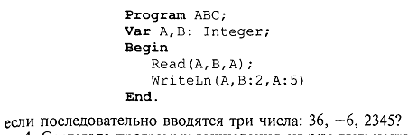
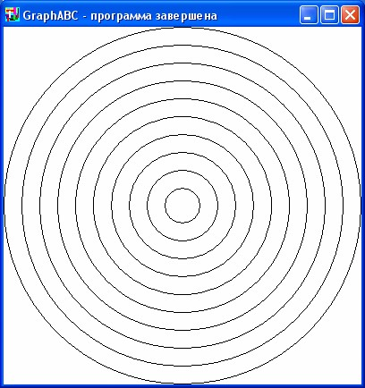
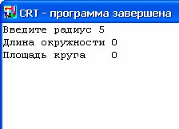

Лабораторное занятие/лабораторный практикум - это практическая деятельность студентов, направленная на овладение техникой эксперимента, умение решать практические задания путем постановки опыта. В ходе лабораторной работы у студентов формируются умения наблюдать, сравнивать, сопоставлять, анализировать, делать выводы и обобщения, самостоятельно вести исследования, пользоваться различными приемами измерений, оформлять результаты в виде таблиц, схем, графиков.

Оглавление

<a href="#_Toc454876041">ЛР №1. «Непосредственный режим работы»	6</a>

<a href="#_Toc454876042">ЛР №2 «Линейные программы»	10</a>

<a href="#_Toc454876043">ЛР №3 «Составление программ с DATA–READ»	14</a>

<a href="#_Toc454876044">ЛР №4 «Переходы и ветви»	17</a>

<a href="#_Toc454876045">ЛР№5 «Двойные и тройные ветви»	19</a>

<a href="#_Toc454876046">ЛР№6 «Простые и арифметические циклы»	21</a>

<a href="#_Toc454876047">ЛР №7 «Сложные циклические структуры»	25</a>

<a href="#_Toc454876048">ЛР №8 «Циклы с параметрами»	27</a>

<a href="#_Toc454876049">ЛР №9 «Решение задач»	29</a>

<a href="#_Toc454876050">ЛР №10 «Использование подпрограмм в задачах»	30</a>

<a href="#_Toc454876051">ЛР №11-12 «Линейные массивы»	31</a>

<a href="#_Toc454876052">ЛР №13-14 «Решение задач на массивы»	37</a>

<a href="#_Toc454876053">ЛР №15 «Решение финансовой задачи»	39</a>

<a href="#_Toc454876054">ЛР №16-17 «Двумерные массивы»	41</a>

<a href="#_Toc454876055">ЛР №18- 20 «Операции с символьными переменными»	43</a>

<a href="#_Toc454876056">ЛР №21 «Решение математических задач»	45</a>

<a href="#_Toc454876057">ЛР №22-23 «Организация файла последовательного доступа»	46</a>

<a href="#_Toc454876058">ЛР №24-25 «Демонстрационные программы»	48</a>

<a href="#_Toc454876059">ЛР №26-27 «Графика»	50</a>

<a href="#_Toc454876060">ЛР № 28-29 «Указатели в связанных списках».	52</a>

<a href="#_Toc454876061">ЛР №30 «Изучение интегрированной среды»	53</a>

<a href="#_Toc454876062">ЛР №31 «Объявление и создание экземпляров класса»	54</a>

<a href="#_Toc454876063">ЛР №32 «Создание наследованного класса»	55</a>

<a href="#_Toc454876064">ЛР №33 «Использование кнопочных компонентов»	56</a>

<a href="#_Toc454876065">ЛР №34 «Компоненты для работы с текстом»	57</a>

<a href="#_Toc454876066">ЛР №35 «Компоненты ввода и отображения чисел»	58</a>

<a href="#_Toc454876067">ЛР №36 «Компоненты диалогов и систем меню»	59</a>

<a href="#_Toc454876068">ЛР №37 «Разработка оконного приложения».	60</a>

<a href="#_Toc454876069">ABC PASCAL	61</a>

<a href="#_Toc454876070">Редактор	61</a>

<a href="#_Toc454876071">Структура программы	62</a>

<a href="#_Toc454876072">Идентификаторы и служебные слова	62</a>

<a href="#_Toc454876073">Целочисленные вычисления на языке Pascal	63</a>

<a href="#_Toc454876074">Использование модуля CRT	70</a>

<a href="#_Toc454876075">Таблица цветов	71</a>

<a href="#_Toc454876076">Графический модуль GraphABC	72</a>

<a href="#_Toc454876077">WindowHeigth	73</a>

<a href="#_Toc454876078">psClear 	psDot  psDashDotDot	74</a>

<a href="#_Toc454876079">Использование цикла for для построения изображений	79</a>

<a href="#_Toc454876080">Оператор if	80</a>

<a href="#_Toc454876081">Оператор if	80</a>

<a href="#_Toc454876082">Оператор if (сокращенная форма)	82</a>

<a href="#_Toc454876083">Вложенные операторы if	82</a>

<a href="#_Toc454876084">Вложенные циклы	85</a>

<a href="#_Toc454876085">Оператор case	86</a>

<a href="#_Toc454876086">Вещественные вычисления на языке Pascal	90</a>

<a href="#_Toc454876087">Подпрограммы на языке Pascal	92</a>

<a href="#_Toc454876088">Подпрограммы на языке Pascal	94</a>

<a href="#_Toc454876089">Способы передачи параметров	96</a>

<a href="#_Toc454876090">МАССИВЫ	98</a>

<a href="#_Toc454876091">Основные приемы работы с массивами	100</a>

<a href="#_Toc454876092">Задание 12	102</a>

<a href="#_Toc454876093">СОРТИРОВКА МАССИВОВ	104</a>

<a href="#_Toc454876094">Задание 13	106</a>

<a href="#_Toc454876095">РАБОТА С ФАЙЛАМИ	106</a>

<a href="#_Toc454876096">СИМВОЛЬНЫЕ ПЕРЕМЕННЫЕ И СТРОКИ СИМВОЛОВ	109</a>

<a href="#_Toc454876097">МНОЖЕСТВА	113</a>

<a href="#_Toc454876098">Вычислительные программы – квадратное уравнение	114</a>

<a href="#_Toc454876099">Список литературы	116</a>
<h1>ЛР №1. «Непосредственный режим работы»</h1>
  Порядок выполнения работы 

1. Ознакомьтесь  с  теоретическими  основами  в настоящих указаниях и конспектах лекций. 

2. Получите задание у преподавателя. 

3. Сд<strong>елайте скриншоты (кнопка клавиатуры PrtSc) выполненных заданий в текстовом (Word) файле <em>Фамилия_ЛР</em></strong>

4. Составьте отчет по лабораторной работе. 

5. Отчитайте работу преподавателю.

<strong>Основные сведения</strong>

Первая версия языка Паскаль была разработана в 1968 году. Ее разработчиком является швейцарский ученый Никлаус Вирт. Свое название язык получил в честь создателя первой механической вычислительной машины француза Блеза Паскаля. На основе языка Паскаль в 1985 г. фирма Borland выпустила версию Turbo Pascal версии 3.0. С этого времени язык Паскаль используется во всем мире в учебных заведениях в качестве первого изучаемого языка программирования. 

Структура программы на Паскале. По определению стандартного Паскаля программа состоит из заголовка программы и тела программы (блока), за которым следует точка — признак концапрограммы. В свою очередь, блок содержит разделы описаний ираздел операторов. 

Program &lt;имя программы&gt;; 

Label &lt;раздел меток&gt;; 

Const &lt;раздел констант&gt;; 

Туре &lt;раздел типов&gt;; 

Var &lt;раздел переменных&gt;; 

Procedure (Function) &lt;раздел подпрограмма-

Begin 

&lt;раздел операторов&gt; 

End. 

Раздел операторов имеется в любой программе и является основным. Предшествующие разделы носят характер описаний и нвсе обязательно присутствуют в каждой программе.

Примеры программ. Уже было сказано, что Паскаль разрабатывался Н. Виртом как учебный язык. Основной принцип, заложенный в нем, — это поддержка структурной методики программирования. Этот же принцип лежит в основе псевдокода, который мы здесь называем Алгоритмическим языком (АЯ). По сути дела, расхождение между АЯ и Паскалем заключается в следующем: АЯ — русскоязычный, Паскаль — англоязычный; синтаксис Паскаля определен строго и однозначно в отличие от сравнительно свободного синтаксиса АЯ. 

Запись программы на Паскале похожа на английский перевод алгоритма, записанного на Алгоритмическом языке. Сравните алгоритм деления простых дробей, записанный на АЯ с соответствующей программой на Паскале. 

Здесь использовано следующее равенство: 

<strong>Задание на лабораторную работу</strong>

 Ввести и отладить программу, приведенную выше, ответить на вопросы

<strong>Контрольные вопросы:</strong>
<ul><li><ol><li>Как изменить размер окна программы?</li><li>Как сохранить файл из программы?</li><li>Каков порядок настройки и сохранения настроек конфигурации?</li><li>Какие команды редактора текстов выполняются чаще и что они означают?</li><li>Какие цветовые установки вы использовали в своей работе?</li></ol></li></ul>
              6.    Список горячих клавиш

Сд<strong>елайте скриншоты (кнопка клавиатуры PrtSc) выполненных заданий в текстовом (Word) файле <em>Фамилия_ЛР</em></strong>

Составьте отчет по лабораторной работе. 

5. Отчитайте работу преподавателю.
<h1>ЛР №2 «Линейные программы»</h1>
  <strong>Порядок выполнения работы </strong>

1. Ознакомьтесь  с  теоретическими  основами  в настоящих указаниях и конспектах лекций. 

2. Получите задание у преподавателя. 

3. Сд<strong>елайте скриншоты (кнопка клавиатуры PrtSc) выполненных заданий в текстовом (Word) файле <em>Фамилия_ЛР</em></strong>

4. Составьте отчет по лабораторной работе. 

5. Отчитайте работу преподавателю.

<strong>Основные сведения</strong>

Необходимо строгое соблюдение правил правописания (синтаксиса) программы. В частности, в Паскале однозначно определено назначение знаков пунктуации. Точка с запятой (;) ставится в конце заголовка программы, в конце раздела описания переменных, после каждого оператора. Перед словом End точку с запятой можно не ставить. Запятая (,) является разделителем элементов во всевозможных списках: списке переменных в разделе описания, списке вводимых и выводимых величин. 

Строгий синтаксис в языке программирования необходим прежде всего для транслятора. Транслятор — это программа, которая исполняется формально. Если, допустим, разделителем в списке перемен- ных должна быть запятая, то любой другой знак будет восприниматься как ошибка. Если точка с запятой является разделителем операторов, то транслятор в качестве оператора воспринимает всю часть текста программы от одной точки с запятой до другой. Если вы забыли поставить этот знак между какими-то двумя операторами, то транслятор будет принимать их за один, что неизбежно приведет к ошибке. 

Основное назначение синтаксических правил — придать однозначный смысл языковым конструкциям. Если какая-то конструкция может трактоваться двусмысленно, значит, в ней обязательно содержится ошибка. Лучше не полагаться на интуицию, а выучить правила языка. В Паскале нет специальных слов для обозначения начала цикла (нц) и конца цикла (кц). На 

все случаи есть универсальные слова Begin и End.

Характерной чертой данной программы является использование в тексте комментариев. Комментарий — это любая последовательность символов, заключенных в фигурные скобки {...}. Можно употреблять также следующие ограничители комментариев (*...*). Комментарий не определяет никаких действий программы и является лишь пояснительным текстом. Он может присутствовать в любом месте программы, где можно поставить пробел. Программист пишет комментарии не для компьютера, а для себя. 

Комментарий придает тексту программы большую ясность. Хорошо откомментированные программы называют самодокументированными. Во многих подобных программах объем комментариев превышает объем вычислительных операторов. 

Удачное использование комментариев — признак хорошего стиля

программирования.Чтобы выполнить программу на ЭВМ, ее нужно ввести в память, оттранслировать и исполнить. Для того чтобы проделать всю эту ра

боту, на компьютере должны быть специальные средства программного обеспечения.

<strong>Задача № 1.</strong> Решить квадратное уравнение 

<strong>Формулировка.</strong> Даны вещественные числа <strong>a</strong>, <strong>b</strong> и <strong>c</strong>, причем <strong>a</strong> отлично от 0. Решить квадратное уравнение <em>ax</em>2 + <em>bx</em> + <em>c</em> = 0 или сообщить о том, что действительных решений нет.

<strong>Задача № 2.</strong> Вычислить значение функции Y(x)=ex+sin(x), при x=1.2

<strong>Задача№ 3 </strong>Записать область, изображенную на рисунке, математическим выражением. Проверить, принадлежит ли этой области точка с заданными координатами.

Координаты исследуемой точки (0,5; 1,5);

<strong>Сделайте скриншоты (кнопка клавиатуры PrtSc) выполненных заданий в текстовом (Word) файле </strong><em>Фамилия_ЛР</em>

<strong>Составьте отчет по лабораторной работе. </strong>

<strong>Отчитайте работу преподавателю.</strong>
<h1>ЛР №3 «Составление программ с DATA–READ»</h1>
  <strong>Порядок выполнения работы </strong>

1. Ознакомьтесь  с  теоретическими  основами  в настоящих указаниях и конспектах лекций. 

2. Получите задание у преподавателя. 

3. Сд<strong>елайте скриншоты (кнопка клавиатуры PrtSc) выполненных заданий в текстовом (Word) файле </strong><em>Фамилия_ЛР</em>

4. Составьте отчет по лабораторной работе. 

5. Отчитайте работу преподавателю.

<strong>Основные сведения:</strong>

<strong>Оператор ввода </strong>– read, readln. Оператор read при чтении данных с консоли используется крайне редко, в основном используется оператор readln. Параметры оператора – только переменные и только стандартных типов, возможно использование оператора вообще без аргументов для создания ситуации ожидания нажатия клавиши <em>Enter</em>. По оператору readln программа приостанавливает свою работу, ожидая ввода данных от пользователя. Пользователь набирает желаемые значения переменных, разделяя их пробелами (или <em>Enter</em>) и нажимает <em>Enter</em>. Оператор интерпретирует введенные символы, переводя их во внутреннее (машинное) представление соответствующих переменных. Если это не удается (например, вместо целого числа введены буквы), программа аварийно завершает свою работу. 

 

Пример:  readln(a,b); 

Недопустимо: readln(a+3); 

 

Для того чтобы пользователь знал что «хочет» ввести программа, полезно перед оператором readln выводить подсказку с помощью оператора write или writeln. 

 

Например:   

 

 write('Введите количество учеников в классе ');  readln(n); 

 

Обратите внимание на пробел перед вторым апострофом. Он сделан для того, чтобы ввод пользователя отделялся от подсказки. 

 

<strong>Задача № 1.</strong> . Что будет напечатано в результате работы программы

<strong>Задача № 2.</strong> . Что будет напечатано в результате работы программы

<strong>Задача№ 3 </strong>. Что будет напечатано в результате работы программы

<strong>	Сделайте скриншоты (кнопка клавиатуры PrtSc) выполненных заданий в текстовом (Word) файле <em>Фамилия_ЛР</em></strong>

<strong>Составьте отчет по лабораторной работе. </strong>

<strong>Отчитайте работу преподавателю.</strong>
<h1>ЛР №4 «Переходы и ветви»</h1>
  <strong>Порядок выполнения работы </strong>

1. Ознакомьтесь  с  теоретическими  основами  в настоящих указаниях и конспектах лекций. 

2. Получите задание у преподавателя. 

3. Сд<strong>елайте скриншоты (кнопка клавиатуры PrtSc) выполненных заданий в текстовом (Word) файле <em>Фамилия_ЛР</em></strong>

4. Составьте отчет по лабораторной работе. 

5. Отчитайте работу преподавателю.

<strong>Задача №1</strong> Проверить, являются ли два натуральных числа  дружественными

<strong>Формулировка.</strong> Даны два натуральных числа. Проверить, являются ли они дружественными.

Примечание: дружественными числами называются два различных натуральных числа, для которых сумма всех собственных делителей первого числа равна второму числу и сумма всех собственных делителей второго числа равна первому числу.

Например, 220 и 284 – пара дружественных чисел, потому что:

Сумма собственных делителей 220: 1 + 2 + 4 + 5 + 10 + 11 + 20 + 22 + 44 + 55 + 110 = 284

Сумма собственных делителей 284: 1 + 2 + 4 + 71 + 142 = 220

<strong>Задача № 2 . </strong>Найти наибольший общий делитель двух натуральных чисел

<strong>Формулировка.</strong> Даны два натуральных числа. Найти их наибольший общий делитель.

Примечание: наибольшим общим делителем (сокращенно пишут НОД) двух натуральных чисел <strong>m</strong> и <strong>n</strong> называется наибольший из их общих делителей. Обозначение: НОД(m, n).

Примечание 2: общим делителем двух натуральных чисел называется натуральное число, на которое натуральное число, которое является делителем обоих этих чисел.

Например, найдем НОД(12, 8):

Выпишем все делители числа 12: 1, 2, 3, 4, 6, 12;

Выпишем все делители числа 8: 1, 2, 4, 8;

Выпишем все общие делители чисел 12 и 8: 1, 2, 4. Из них наибольшее число – 4. Это и

<strong>Задача № 3</strong> Вычислить значение функции Y для любого, заданного пользователем, значения аргумента X

1. y=	a=		b=

<strong>Сделайте скриншоты (кнопка клавиатуры PrtSc) выполненных заданий в текстовом (Word) файле <em>Фамилия_ЛР</em></strong>

<strong>Составьте отчет по лабораторной работе. </strong>

<strong>Отчитайте работу преподавателю.</strong>
<h1>ЛР№5 «Двойные и тройные ветви»</h1>
  <strong>Порядок выполнения работы </strong>

1. Ознакомьтесь  с  теоретическими  основами  в настоящих указаниях и конспектах лекций. 

2. Получите задание у преподавателя. 

3. Сд<strong>елайте скриншоты (кнопка клавиатуры PrtSc) выполненных заданий в текстовом (Word) файле <em>Фамилия_ЛР</em></strong>

4. Составьте отчет по лабораторной работе. 

<strong>Основные сведения</strong>

В Паскале нет операции или стандартной функции возведения  числа в произвольную степень. Для вычисления  рекомендуется поступать следующим образом: • если у — целое значение, то степень вычисляется через умножение; например, большие степени следует вычис

лять умножением в цикле; 

• если у — вещественное значение, то используется следующая 

математическая формула: 

. 

<strong>Задача № 1. </strong>Найти наименьшее общее кратное двух натуральных чисел

<strong>Формулировка.</strong> Даны два натуральных числа. Найти их наименьшее общее кратное.

Примечание: наименьшим общим кратным двух чисел <strong>m</strong> и <strong>n</strong> называется наименьшее натуральное число, которое делится на <strong>m</strong> и <strong>n</strong>. Обозначение: НОК(m, n)

<strong>Задача № 2. </strong>Вычислить xn

<strong>Формулировка.</strong> Даны натуральные числа <strong>x</strong> и <strong>n</strong> (которое также может быть равно 0). Вычислить <strong><em>xn</em></strong>. 

<strong>Задача № 3. </strong>Даны три действительных числа. Возвести в квадрат неотрицательные из этих чисел и в четвёртую степень – отрицательные.

<strong>Сделайте скриншоты (кнопка клавиатуры PrtSc) выполненных заданий в текстовом (Word) файле <em>Фамилия_ЛР</em></strong>

<strong>Составьте отчет по лабораторной работе. </strong>

<strong>Отчитайте работу преподавателю.</strong>
<h1>ЛР№6 «Простые и арифметические циклы»</h1>
<strong>Порядок выполнения работы </strong>

1. Ознакомьтесь  с  теоретическими  основами  в настоящих указаниях и конспектах лекций. 

2. Получите задание у преподавателя. 

3. Сд<strong>елайте скриншоты (кнопка клавиатуры PrtSc) выполненных заданий в текстовом (Word) файле <em>Фамилия_ЛР</em></strong>

4. Составьте отчет по лабораторной работе. 

<strong>Основные сведения</strong>

Бинарные арифметические операции стандартного Паскаля описаны в табл. 3.3. В ней / обозначает целые типы, R — вещественные типы.

К арифметическим величинам могут быть применены стандар

тные функции Паскаля. Структура обращения к функции пред

ставлена на рис. 

Функция выступает как операнд в выражении. Например, в следующем операторе присваивания 

X:=2*Sin(A)/Ln(3.5)+Cos(C-D ) 

операндами являются три функции: sin, In, cos. Их запись такая же, 

как в математике. Аргументы называются фактическими параметрами и являются в общем случае выражениями арифметического 

типа. Аргументы записываются в круглых скобках. Результат вычисления функции — величина соответствующего типа. 

Табл. 3.4 содержит описания математических стандартных функций Турбо Паскаля.  Для того чтобы правильно записывать арифметические выражения, нужно соблюдать следующие правила: 

1. Все символы пишутся в строчку на одном уровне. Проставляются все знаки операций (нельзя пропускать знак умножения). 

2. Не допускаются два следующих подряд знака операций (нельзя А+-В; можно А+ (-в)) . 

3. Операции с более высоким приоритетом выполняются раньше операций с меньшим приоритетом. Порядок убывания приоритетов: 

• вычисление функции; 

• унарная операция смены знака (-); 

• *, / , div, mod; 

• +, -• 

4. Несколько записанных подряд операций одинакового приоритета выполняются последовательно слева направо. 

5. Часть выражения, заключенная в скобки, вычисляется в первую очередь. (Например, (А+В) * (С—D) — умножение производится после сложения и вычитания.) 

Не следует записывать выражений, не имеющих математического смысла. Например, деление на нуль, логарифм отрицательного числа и т. п.

<strong>Задача № 1.</strong> Для следующей формулы записать соответствующие арифме

тические выражения на Паскале:

<strong>Задача № 2</strong>. Определить результат гадания на ромашке: любит — не любит, взяв за исходное заданное число лепестков л.

<strong>Задача № 3.</strong> Проанализировать возраст человека, чтобы отнести к одной из четырех групп: дошкольник, ученик, работник, пенсионер. Возраст вводится с клавиатуры.

<strong>Сделайте скриншоты (кнопка клавиатуры PrtSc) выполненных заданий в текстовом (Word) файле <em>Фамилия_ЛР</em></strong>

<strong>Составьте отчет по лабораторной работе. </strong>

<strong>Отчитайте работу преподавателю.</strong>
<h1>ЛР №7 «Сложные циклические структуры»</h1>
<strong>Порядок выполнения работы </strong>

1. Ознакомьтесь  с  теоретическими  основами  в настоящих указаниях и конспектах лекций. 

2. Получите задание у преподавателя. 

3. Сд<strong>елайте скриншоты (кнопка клавиатуры PrtSc) выполненных заданий в текстовом (Word) файле <em>Фамилия_ЛР</em></strong>

4. Составьте отчет по лабораторной работе. 

<strong>Задача № 1.</strong> Решить следующую систему линейных уравнений:   

<strong>Задача № 2.</strong> Получить каноническое разложение числа на простые сомножители

<strong>Формулировка.</strong> Дано натуральное число <strong>n (n &gt; 1)</strong>. Получить его каноническое разложение на простые сомножители, то есть представить в виде произведения простых сомножителей. При этом в разложении допустимо указывать множитель 1. Например, 264 = 2 * 2 * 2 * 3 * 11 (программе допустимо выдать ответ 264 = 1 * 2 * 2 * 2 * 3 * 11).

<strong>Решение.</strong> Данная задача имеет достаточно красивое решение.

Из <em>основной теоремы арифметики</em> известно, что для любого натурального числа больше 1 существует его каноническое разложение на простые сомножители, причем это разложение единственно с точностью до порядка следования множителей. То есть, например, 12 = 2 * 2 * 2 и 12 = 3 * 2 * 2 – это одинаковые разложения.

<strong>Задача № 3</strong>. Проверить монотонность последовательности цифр числа

<strong>Формулировка.</strong> Дано натуральное число <strong>n</strong>. Проверить, представляют его ли цифры его восьмеричной записи строго монотонную последовательность. При этом последовательность из одной цифры считать строго монотонной.

Примечание: в математике строго возрастающие и строго убывающие последовательности называются строго монотонными. В строго возрастающей последовательности каждый следующий член <strong>больше</strong> предыдущего. Например: 1, 3, 4 ,7, 11, 18. В строго убывающей последовательности каждый следующий член <strong>меньше</strong> предыдущего. Например: 9, 8, 5, 1.

<strong>Решение.</strong> Здесь нам нужно будет последовательно получить разряды восьмеричной записи числа, двигаясь по записи числа справа налево. Как мы уже знаем, последний разряд числа в восьмеричной системе счисления есть остаток от деления этого числа на 8.

<strong>Сделайте скриншоты (кнопка клавиатуры PrtSc) выполненных заданий в текстовом (Word) файле <em>Фамилия_ЛР</em></strong>

<strong>Составьте отчет по лабораторной работе. </strong>

<strong>Отчитайте работу преподавателю.</strong>
<h1>ЛР №8 «Циклы с параметрами»</h1>
<strong>Порядок выполнения работы </strong>

1. Ознакомьтесь  с  теоретическими  основами  в настоящих указаниях и конспектах лекций. 

2. Получите задание у преподавателя. 

3. Сд<strong>елайте скриншоты (кнопка клавиатуры PrtSc) выполненных заданий в текстовом (Word) файле <em>Фамилия_ЛР</em></strong>

4. Составьте отчет по лабораторной работе. 

<strong>Задача № 1</strong>. Решить квадратное уравнение заданного вида с параметром

<strong>Формулировка.</strong> Дано натуральное число <strong>n</strong>. Вывести на экран решения всех квадратных уравнений вида <em>x2</em> + <em>2ax</em> – 3 = 0 для всех <strong>a</strong> от 1 до <strong>n</strong>.

<strong>Задача № 2.</strong> Вычислить факториал

<strong>Формулировка.</strong> Дано натуральное число <strong>n</strong> (которое также может быть равно нулю). Вычислить <strong>n!</strong>

Примечание: <strong>n!</strong> (факториал числа <strong>n</strong>, читается «<em>эн факториал</em>») – произведение всех натуральных чисел до <strong>n</strong> включительно.

Задача № 3. Вычислить число сочетаний из n по k

<strong>Формулировка.</strong> Даны натуральные числа <strong>n</strong> и <strong>k</strong> (<strong>k</strong> не превышает <strong>n</strong>). Вычислить число сочетаний из <strong>n</strong> по <strong>k</strong>.

Примечание: в комбинаторике сочетанием из <strong>n</strong> по <strong>k</strong> называется набор <strong>k</strong> элементов, выбранных из данных <strong>n</strong> элементов; при этом наборы, отличающиеся только порядком следования элементов, считаются одинаковыми. Обозначение числа сочетаний из <strong>n</strong> по <strong>k</strong> элементов: . При этом считается, что ,  и  для любого натурального <strong>n</strong>.

Например, найдем все 2-элементные сочетания 3-элементного множества {1, 2, 3}. Таковыми являются {1, 2}, {1, 3} и {2, 3}. То есть, таковых сочетаний 3. При этом, например, {1, 2} и {2, 1} – одинаковые сочетания, так как они отличаются только порядком следования элементов.

<strong>Решение.</strong> Из комбинаторики известна формула:

<strong>Сделайте скриншоты (кнопка клавиатуры PrtSc) выполненных заданий в текстовом (Word) файле <em>Фамилия_ЛР</em></strong>

<strong>Составьте отчет по лабораторной работе. </strong>

<strong>Отчитайте работу преподавателю.</strong>
<h1>ЛР №9 «Решение задач»</h1>
<strong>Функции, определяемые пользователем, в языках Си и Си++</strong>

<strong>Порядок выполнения работы </strong>

1. Ознакомьтесь  с  теоретическими  основами  в настоящих указаниях и конспектах лекций. 

2. Получите задание у преподавателя. 

3. Сд<strong>елайте скриншоты (кнопка клавиатуры PrtSc) выполненных заданий в текстовом (Word) файле <em>Фамилия_ЛР</em></strong>

4. Составьте отчет по лабораторной работе. 

<strong>Основные сведения</strong>

<strong>Задача № 1. </strong>

Даны три положительных числа. Определить, можно ли построить треугольник с длинами сторон, равными этим числам. Если можно, ответить на вопрос, является ли он остроугольным

<strong>Задача № 2. </strong>

Даны координаты вершин прямоугольника: (х1г уj), (х2, у2), (х3, уз) г (х4г у4). Определить площадь части прямоугольника, расположенной в I координатной четверти.

<strong>Сделайте скриншоты (кнопка клавиатуры PrtSc) выполненных заданий в текстовом (Word) файле <em>Фамилия_ЛР</em></strong>

<strong>Составьте отчет по лабораторной работе. </strong>

<strong>Отчитайте работу преподавателю.</strong>
<h1>ЛР №10 «Использование подпрограмм в задачах»</h1>
<strong>Порядок выполнения работы </strong>

1. Ознакомьтесь  с  теоретическими  основами  в настоящих указаниях и конспектах лекций. 

2. Получите задание у преподавателя. 

3. Сд<strong>елайте скриншоты (кнопка клавиатуры PrtSc) выполненных заданий в текстовом (Word) файле <em>Фамилия_ЛР</em></strong>

4. Составьте отчет по лабораторной работе.

<strong>Задача № 1</strong>. Составить программу нахождения наибольшего значения из трех величин — max (я, Ь, с). Для ее решения можно использовать вспомогательный алгоритм нахождения максимального значения из двух, поскольку справедливо 

равенство: max (a, b, с) = max (max (A, b), с).

Задача № 2. Составить программу на Паскале для вычисления наибольшего общего делителя для суммы, разности и произведения двух чисел..

<strong>Сделайте скриншоты (кнопка клавиатуры PrtSc) выполненных заданий в текстовом (Word) файле <em>Фамилия_ЛР</em></strong>

<strong>Составьте отчет по лабораторной работе. </strong>

<strong>Отчитайте работу преподавателю.</strong>
<h1>ЛР №11-12 «Линейные массивы»</h1>
<strong>Порядок выполнения работы </strong>

1. Ознакомьтесь  с  теоретическими  основами  в настоящих указаниях и конспектах лекций. 

2. Получите задание у преподавателя. 

3. Сд<strong>елайте скриншоты (кнопка клавиатуры PrtSc) выполненных заданий в текстовом (Word) файле <em>Фамилия_ЛР</em></strong>

4. Составьте отчет по лабораторной работе. 

<strong>Общие сведения:</strong>

<strong>Массивы</strong> - это совокупность однотипных элементов, расположенных в памяти подряд и имеющих общий идентификатор. Доступ к отдельному элементу в массиве осуществляется с использованием порядкового(-ых) номера(-ов), или индекса(-ов). В зависимости от количества используемых индексов массивы делятся на одномерные (используют один индекс), двумерные (два индекса), многомерные (три и более индекса). 

Массивы имеют прямые аналоги в математике в виде векторов для одномерных массивов или матриц для двумерных массивов. Использование массивов становится актуальным в программе, когда есть необходимость единообразной обработки больших объемов однотипной информации (совокупность измерений в ходе эксперимента, данные об однородных характеристиках некоторых объектов предметной области, сами наборы объектов предметной области). Использование массивов для информации такого типа позволяет циклически повторять одни и те же процедуры для разных элементов, параметризуя цикл лишь индексом очередного обрабатываемого элемента.

Рассмотрим, как определяется самый массив в языке Си в самом простом – статическом одномерном – случае. Определение подобного массива выглядит следующим образом:

<strong>класс_памяти тип имя_массива [константное_выражение] </strong>

<strong>		={иниициализатор};</strong>

<em>Тип</em> задает тип элементов объявляемого массива. Элементами массива не могут быть функции (но могут быть указатели на них) и элементы типа void.

<em>Имя_массива</em> – идентификатор, под которым массив будет доступен в программе.

<em>Константное_выражение</em> в квадратных скобках задает количество элементов массива. 

<em>Инициализатор</em> позволяет присвоить начальные значения элементам массива еще на этапе определения (необязательная часть определения).

<em>Класс_памяти</em> определяет, к какому классу памяти будет относиться массив (необязательная часть определения). Для массивов допустимыми являются все классы памяти, кроме регистрового.

Примеры определения массивов в программе:

int sample [I0]; //определяем  массив из 5-ти целых чисел

static float mas[5]; //определяем статический массив из 5-ти вещественных 

					//элементов

extern int m[];//описываем массив m, определенный в другом месте программы

const int N=20;

double array[N*2]; //задаем размер массива через именованную константу

#define Nmax 10

int sample [Nmax] //задаем размер массива через макроимя 

Определение массива резервирует в памяти непрерывный блок размером <em>количество_элементов_массива*размер_элемента_в байтах. </em>Каждый элемент массива доступен под своим индексом. Важной особенностью языков Си и Си++ является индексирование элементов массива с 0. На рис.1 изображен снимок памяти для массива целых чисел из 5-ти элементов. Стрелкой показано направление возрастание адресов.

int mas[5];

Рис.1. Одномерный массив из пяти целых чисел в памяти.

Принципиальным моментом определения массива с использованием приведенного выше синтаксиса является необходимость задать размер массива константой. Это означает, что количество элементов, под которое резервируется место в массиве, должно быть задано еще на этапе компиляции. Массивы, определенные таким способом, носят название статических. Ошибочным будет такое определение массива:

int N;

cout&lt;&lt;”Введите количество элементов массива”;

cin&gt;&gt;N;

int mas[N]; //ошибка, размер массива задается не константой

Если количество элементов N, объединяемых в массив, заранее неизвестно, то придется либо определять массив заведомо большего размера, а использовать только первые N элементов (этот вариант неэффективно расходует память), либо использовать динамические массивы, на которые требование о предопределенности размера не распространяется (динамические массивы будут рассмотрены ниже в настоящих методических указаниях).

При объявлении массива константное_выражение может быть опущено в случаях, если:

- при определении массив явно инициализируется,

- массив объявлен как формальный параметр функции,

- имеет место описание массива, явно определенного в другом месте программы (ниже по тексту текущего модуля или в другом модуле).

Инициализация массива выглядит следующим образом:

int mas[5]={10, 20, 30, 40, 50};

Таким образом, в инициализаторе через запятую перечисляются выражения, которые будут присвоены в порядке очередности соответствующим элементам массива. Как уже отмечалось, при явной инициализации допускается не указывать размер массива, количество элементов будет определено по количеству выражений в инициализаторе:

int mas[]={1, 2, 3, 4}; //выделяем память под 4 элемента

Размер массива в таком случае всегда можно определить, разделив размер всего массива на размер одного элемента:

int masSize=sizeof(mas)/sizeof(m[0]);

Если количество выражений в инициализаторе K меньше , чем объявленный размер массива N, то начальные значения получат только первые K элементов, а остальные будут инициализированы по умолчанию в соответствии с классом памяти массива. Если же окажется, что K&gt;N, компилятор зафиксирует ошибку.

int mas[5]={1, 2, 3}; //последние два элемента не получат значения

int mas2[6]={1, 2, 3, 4, 5, 6}; //ошибка, слишком длинный инициализатор

int mas3[5]={1, ,2, , 3}; //ошибка, опускать выражения можно только в конце 

						//списка

Обращение к элементам массива осуществляется с помощью индексированного имени. Обращение к элементу массива должно иметь вид:

имя_массива[целочисленное_выражение]

Значение этого выражения равно элементу массива с индексом, равным выражению в скобках. Как уже отмечалось,  первый по порядку элемент массива получает индекс 0. Таким образом, для массива <em>mas</em> из <em>n</em> элементов можно обращаться к элементам от <em>mas</em>[0] до <em>mas</em>[<em>n</em>-1]. Необходимо отметить, что программа не отслеживает корректность используемых при обращении к массиву индексов, поэтому если программист будет использовать некорректные значения индексов (отрицательные или большие чем <em>n</em>-1), то это  приведет к обращению к ячейкам памяти, располагающихся перед или после массива и может нарушить целостность других объектов программы.

Выражение обращения к элементу массива является леводопустимым (если только сам массив не объявлен как константный).  Поэтому выражение обращения к элементам массива можно использовать не только для получения их значения, но для изменения:

int mas[5]; mas[0]=1; cin&gt;&gt;mas[1]; int i=2; mas[i+1]=mas[i];

При работе с массивами в программе характерны циклы перебора всех (или какой-то части) элементов массива. Вот как, например, можно присвоить всем элементам массива случайные числа:

const int N=10;

	int mas[N];

	for(int i=0; i&lt;N;i++)  //перебираем все элементы массива от 0 до N-1

	  mas[i]=rand();

Рассмотрим несколько типовых алгоритмов обработки информации в  одномерных массивах. Если необходимо вычислить сумму элементов массива:

const int N=10;

int mas[N];

//вводим все элементы массива с клавиатуры

for (int i=0;i&lt;N;i++)

  cin&gt;&gt;mas[i];

//в переменной Sum будет накапливать сумму

int Sum=0; //начальное значение суммы - 0

for (int i=0;i&lt;N;i++)

  Sum+=mas[i]; //прибавляем к уже накопленной сумме значение

  // i-го элемента массива

cout&lt;&lt;Sum;

Для поиска максимального элемента массива применяем следующий алгоритм: в переменной <em>imax</em> будем хранить номер максимального из всех уже рассмотренных элементов массива. Присвоим этой переменной 0, тем самым делая предположение, что максимален первый по порядку элемент массива. После этого перебираем остальные элементы массива и сравниваем их со значением текущего максимума – значения <em>mas</em>[<em>imax</em>]. Если очередной элемент больше текущего максимума – он сам становится таковым. Когда с текущим максимумом сравним все элементы массива, в <em>imax</em> будет хранится номер максимального элемента всего массива и остается только вывести его и само значение максимума на экран.

<strong>Задача № 1. </strong>

В массиве целых чисел из n элементов перемножить элементы, лежащие между минимальным и максимальным

<strong>Задача № 2. </strong>

. Составить программу решения следующей задачи. Дана 

вещественная матрица А[м] [N]. Требуется вычислить и вывести 

евклидовы нормы строк этой матрицы.

<strong>Задача № 3. </strong>

Дана целочисленная квадратная матрица. Определить:

1) Количество столбцов, содержащих нулевые элементы. 

2) В какой строке наибольшее количество отрицательных элементов.

<strong>Задача № 4.</strong> В данном одномерном массиве 100 элементов. Найти количество положительных, отрицательных и нулевых элементов, имеющих номера позиции, кратные трем. Описать на ЯП Паскаль. Исполнить для n=10
<table><tr><td>
i
</td><td>
1
</td><td>
2
</td><td>
3
</td><td>
4
</td><td>
5
</td><td>
6
</td><td>
7
</td><td>
8
</td><td>
9
</td><td>
10
</td></tr><tr><td>
A[i]
</td><td>
0
</td><td>
28
</td><td>
35
</td><td>
-49
</td><td>
0
</td><td>
-12
</td><td>
77
</td><td>
0
</td><td>
-11
</td><td>
999
</td></tr><tr><td></td><td></td><td></td><td></td><td></td><td></td><td></td><td></td><td></td><td></td><td></td></tr></table>
<strong>Задача №4</strong>

Разработать программу подсчета количества слов в предложении на языке программирования Паскаль. St= «Шило в мешке не утаишь.»

<strong>Сделайте скриншоты (кнопка клавиатуры PrtSc) выполненных заданий в текстовом (Word) файле <em>Фамилия_ЛР</em></strong>

<strong>Составьте отчет по лабораторной работе. </strong>

<strong>Отчитайте работу преподавателю.</strong>
<h1>ЛР №13-14 «Решение задач на массивы»</h1>
<strong>Порядок выполнения работы </strong>

1. Ознакомьтесь  с  теоретическими  основами  в настоящих указаниях и конспектах лекций. 

2. Получите задание у преподавателя. 

3. Сд<strong>елайте скриншоты (кнопка клавиатуры PrtSc) выполненных заданий в текстовом (Word) файле <em>Фамилия_ЛР</em></strong>

4. Составьте отчет по лабораторной работе. 

<strong>Задача № 1. </strong>

Определить первоначальную и остаточную стоимость оборудования, а также сумму первоначальной стоимости, сумму износа оборудования и сумму остаточной стоимости. Написать программу на ЯП Паскаль.
<table><tr><td rowspan="3">
№
</td><td rowspan="3">
Виды оборудования
</td><td rowspan="2">
Кол-во штук
</td><td rowspan="2">
Цена, млн. руб.
</td><td rowspan="2">
Первичная стоимость, млн. руб.
</td><td colspan="2">
Износ
</td><td rowspan="2">
Остаточная стоимость
</td></tr><tr><td>
%
</td><td>
млн. руб.
</td></tr><tr><td>
К
</td><td>
CN
</td><td>
PS
</td><td>
PR
</td><td>
IZ
</td><td>
OS
</td></tr><tr><td></td><td>
Энергетические газотурбинные установки
</td><td>
9
</td><td>
47,5
</td><td></td><td>
30
</td><td></td><td></td></tr><tr><td></td><td>
Паровые  турбогенераторы
</td><td>
5
</td><td>
17,6
</td><td></td><td>
42
</td><td></td><td></td></tr><tr><td></td><td>
Электродвигатели
</td><td>
6
</td><td>
0,53
</td><td></td><td>
29
</td><td></td><td></td></tr><tr><td></td><td>
Двигатели внутреннего сгорания
</td><td>
7
</td><td>
0,14
</td><td></td><td>
54
</td><td></td><td></td></tr></table>
<strong>Задача № 2. </strong>

В целочисленной последовательности чисел есть нулевые элементы. Создать массив из номеров нулевых элементов. Описать задачу на ЯП программирования 
<table><tr><td>
i
</td><td>
1
</td><td>
2
</td><td>
3
</td><td>
4
</td><td>
5
</td><td>
6
</td><td>
7
</td><td>
8
</td></tr><tr><td>
A[i]
</td><td>
0
</td><td>
5
</td><td>
0
</td><td>
7
</td><td>
4
</td><td>
0
</td><td>
0
</td><td>
1
</td></tr></table>
	

<strong>Задача № 3.</strong>

Отсортировать последовательность некоторых чисел. И выяснить, на сколько максимальный элемент больше минимального.  Написать программу на одном из предложенных языков.
<table><tr><td>
i
</td><td>
1
</td><td>
2
</td><td>
3
</td><td>
4
</td><td>
5
</td><td>
6
</td><td>
7
</td><td>
8
</td><td>
9
</td><td>
10
</td></tr><tr><td>
A[i]
</td><td>
54
</td><td>
54
</td><td>
5468
</td><td>
5
</td><td>
8
</td><td>
454
</td><td>
545
</td><td>
4
</td><td>
8
</td><td>
1
</td></tr></table>
<strong>Задача № 4 </strong>

Ввести шесть чисел (7, 2, 10, -3, 25, -13) и найти произведение чисел больших 5. Программу написать на двух языках программирования.

<strong>Сделайте скриншоты (кнопка клавиатуры PrtSc) выполненных заданий в текстовом (Word) файле <em>Фамилия_ЛР</em></strong>

<strong>Составьте отчет по лабораторной работе. </strong>

<strong>Отчитайте работу преподавателю.</strong>
<h1>ЛР №15 «Решение финансовой задачи»</h1>
<strong>Порядок выполнения работы </strong>

1. Ознакомьтесь  с  теоретическими  основами  в настоящих указаниях и конспектах лекций. 

2. Получите задание у преподавателя. 

3. Сд<strong>елайте скриншоты (кнопка клавиатуры PrtSc) выполненных заданий в текстовом (Word) файле <em>Фамилия_ЛР</em></strong>

4. Составьте отчет по лабораторной работе. 

<strong>Задача № 1. </strong>

Вычислить заработную плату рабочих сдельщиков. Написать программу на ЯП Паскаль.
<table><tr><td>
№

I
</td><td>
Фамилия
</td><td>
Сдельная расценка 

CR
</td><td colspan="2">
Кол-во изготовленных изделий

K
</td><td colspan="2">
Сдельная зарплата

ZP
</td><td colspan="2">
% премии

PR
</td><td colspan="2">
Зарплата с % премии

ZPR
</td><td>
Итоговая зарплата

IZP
</td></tr><tr><td>
1
</td><td>
Александров
</td><td>
60.40
</td><td colspan="2">
352
</td><td colspan="2"></td><td colspan="2">
25
</td><td colspan="2"></td><td></td></tr><tr><td>
2
</td><td>
Иванов
</td><td>
58.10
</td><td colspan="2">
353
</td><td colspan="2"></td><td colspan="2">
25
</td><td colspan="2"></td><td></td></tr><tr><td>
3
</td><td>
Кондратьев
</td><td>
58.70
</td><td colspan="2">
345
</td><td colspan="2"></td><td colspan="2">
20
</td><td colspan="2"></td><td></td></tr><tr><td>
4
</td><td>
Лебедев
</td><td>
65.20
</td><td colspan="2">
331
</td><td colspan="2"></td><td colspan="2">
20
</td><td colspan="2"></td><td></td></tr><tr><td>
5
</td><td>
Михеев
</td><td>
65.20
</td><td colspan="2">
309
</td><td colspan="2"></td><td colspan="2">
15
</td><td colspan="2"></td><td></td></tr><tr><td>
6
</td><td>
Петров
</td><td>
62.20
</td><td colspan="2">
299
</td><td colspan="2"></td><td colspan="2">
10
</td><td colspan="2"></td><td></td></tr><tr><td>
7
</td><td>
Ковалев
</td><td>
51.10
</td><td colspan="2">
358
</td><td colspan="2"></td><td colspan="2">
25
</td><td colspan="2"></td><td></td></tr><tr><td>
8
</td><td>
Федин
</td><td>
52.00
</td><td colspan="2">
381
</td><td colspan="2"></td><td colspan="2">
30
</td><td colspan="2"></td><td></td></tr><tr><td colspan="4">
ИТОГО:
</td><td colspan="2"></td><td colspan="2"></td><td colspan="2"></td><td colspan="2"></td></tr></table>
Задача № 2. 

Задача № 3. 

<strong>Сделайте скриншоты (кнопка клавиатуры PrtSc) выполненных заданий в текстовом (Word) файле <em>Фамилия_ЛР</em></strong>

<strong>Составьте отчет по лабораторной работе. </strong>

<strong>Отчитайте работу преподавателю.</strong>
<h1>ЛР №16-17 «Двумерные массивы»</h1>
<strong>Порядок выполнения работы </strong>

1. Ознакомьтесь  с  теоретическими  основами  в настоящих указаниях и конспектах лекций. 

2. Получите задание у преподавателя. 

3. Сд<strong>елайте скриншоты (кнопка клавиатуры PrtSc) выполненных заданий в текстовом (Word) файле <em>Фамилия_ЛР</em></strong>

4. Составьте отчет по лабораторной работе. 

<strong>Задача № 1</strong>. Получить следующую матрицу:

<strong>Задача № 2. </strong>Получить следующую матрицу:

<strong>Задача № 3</strong> Заполнить квадратную матрицу порядка п натуральными числами 1, 2, 3, .... л2, записывая их по спирали . Например, для л = 5 получим следующую матрицу: 

<strong>Сделайте скриншоты (кнопка клавиатуры PrtSc) выполненных заданий в текстовом (Word) файле <em>Фамилия_ЛР</em></strong>

<strong>Составьте отчет по лабораторной работе. </strong>

<strong>Отчитайте работу преподавателю.</strong>
<h1>ЛР №18- 20 «Операции с символьными переменными»	</h1>
<strong>Порядок выполнения работы </strong>

1. Ознакомьтесь  с  теоретическими  основами  в настоящих указаниях и конспектах лекций. 

2. Получите задание у преподавателя. 

3. Сд<strong>елайте скриншоты (кнопка клавиатуры PrtSc) выполненных заданий в текстовом (Word) файле <em>Фамилия_ЛР</em></strong>

4. Составьте отчет по лабораторной работе. 

<strong>Задача № 1. </strong>

<strong>Задача № 2. </strong>

<strong>Задача № 3 </strong>

<strong>Сделайте скриншоты (кнопка клавиатуры PrtSc) выполненных заданий в текстовом (Word) файле <em>Фамилия_ЛР</em></strong>

<strong>Составьте отчет по лабораторной работе. </strong>

<strong>Отчитайте работу преподавателю.</strong>
<h1>ЛР №21 «Решение математических задач»</h1>
<strong>Порядок выполнения работы </strong>

1. Ознакомьтесь  с  теоретическими  основами  в настоящих указаниях и конспектах лекций. 

2. Получите задание у преподавателя. 

3. Сд<strong>елайте скриншоты (кнопка клавиатуры PrtSc) выполненных заданий в текстовом (Word) файле <em>Фамилия_ЛР</em></strong>

4. Составьте отчет по лабораторной работе. 

<strong>Задача № 1.</strong> Дано натуральное число п. Найти сумму первой и последней цифр этого числа.

<strong>Задача № 2. </strong>

Дано натуральное число п &lt; 99. Дописать в конце и в начале этого числа цифру к.

<strong>Задача № 3</strong>. 

Дано натуральное число N. Найти и вывести все числа в интервале от 1 до N - 1, у которых произведение цифр совпадает с суммой цифр заданного числа. Если таких чисел нет, вывести на экран слово «нет». Например: при N=44 выводятся числа 18 и 24.

<strong>Сделайте скриншоты (кнопка клавиатуры PrtSc) выполненных заданий в текстовом (Word) файле <em>Фамилия_ЛР</em></strong>

<strong>Составьте отчет по лабораторной работе. </strong>

<strong>Отчитайте работу преподавателю.</strong>
<h1>ЛР №22-23 «Организация файла последовательного доступа»</h1>
<strong>Порядок выполнения работы </strong>

1. Ознакомьтесь  с  теоретическими  основами  в настоящих указаниях и конспектах лекций. 

2. Получите задание у преподавателя. 

3. Сд<strong>елайте скриншоты (кнопка клавиатуры PrtSc) выполненных заданий в текстовом (Word) файле <em>Фамилия_ЛР</em></strong>

4. Составьте отчет по лабораторной работе. 

<strong>Задача № 1. </strong>

Заполнить файл последовательного доступа  целыми числами, полученными с помощью генератора случайных чисел. Получить в файле  компоненты файла , являющиеся четными.

<strong>Задача № 2. </strong>

Записать в файл последовательного доступа N целых чисел, полученных с помощью генератора случайных чисел. Определить количество пар противоположных чисел среди компонентов этого файла.

<strong>Задача № 3. </strong>

Записать в файл прямого доступа N действительных чисел. Найти наибольшее из модулей компонентов с нечетными номерами этого файла.

<strong>Задача № 4. </strong>

Записать в файл последовательного доступа N действительных чисел. Найти разность первого и последнего чисел этого файла

<strong>Сделайте скриншоты (кнопка клавиатуры PrtSc) выполненных заданий в текстовом (Word) файле <em>Фамилия_ЛР</em></strong>

<strong>Составьте отчет по лабораторной работе. </strong>

<strong>Отчитайте работу преподавателю.</strong>
<h1>ЛР №24-25 «Демонстрационные программы»</h1>
<strong>Порядок выполнения работы </strong>

1. Ознакомьтесь  с  теоретическими  основами  в настоящих указаниях и конспектах лекций. 

2. Получите задание у преподавателя. 

3. Сд<strong>елайте скриншоты (кнопка клавиатуры PrtSc) выполненных заданий в текстовом (Word) файле <em>Фамилия_ЛР</em></strong>

4. Составьте отчет по лабораторной работе. 

<strong>Задача № 1. </strong>

Багаж пассажира характеризуется количеством и общей массой вещей. Дан файл Bagazh, содержащий сведения о багаже нескольких пассажиров. Сведения о багаже каждого пассажира представляют собой запись с двумя полями: одно поле целого типа (количество вещей) и одно поле действительное (масса вещей в килограммах). Определить: а)	багаж, средняя масса одной вещи в котором отличается не более чем на т [кг] от общей средней массы одной вещи;

б)	число пассажиров, имеющих более двух вещей, и число пассажиров, количество вещей которых превосходит среднее;

в)	имеется ли пассажир, багаж которого состоит из одной вещи массой менее т [кг].

<strong>Задача № 2. </strong>

Дан файл BibI, содержащий сведения о книгах. Сведения о каждой из книг включают в себя фамилию автора, название книги и год издания. Определить:

а)	названия книг указанного автора, изданных с 1960 г.;

б)	имеется ли книга с названием «Информатика». Если имеется, вывести на печать фамилию ее автора и год издания. Если таких книг несколько, вывести имеющиеся сведения обо всех этих книгах

<strong>Сделайте скриншоты (кнопка клавиатуры PrtSc) выполненных заданий в текстовом (Word) файле <em>Фамилия_ЛР</em></strong>

<strong>Составьте отчет по лабораторной работе. </strong>

<strong>Отчитайте работу преподавателю.</strong>
<h1>ЛР №26-27 «Графика»</h1>
<strong>Порядок выполнения работы </strong>

1. Ознакомьтесь  с  теоретическими  основами  в настоящих указаниях и конспектах лекций. 

2. Получите задание у преподавателя. 

3. Сд<strong>елайте скриншоты (кнопка клавиатуры PrtSc) выполненных заданий в текстовом (Word) файле <em>Фамилия_ЛР</em></strong>

4. Составьте отчет по лабораторной работе. 

<strong>Задача № 1. </strong>

В треугольной пирамиде построить сечение, параллельное основанию.

<strong>Задача № 2. </strong>

В треугольной пирамиде провести сечение, проходящее через сторону основания и наклоненное к нему под углом 30°.

<strong>Задача № 3. </strong>

В прямоугольном параллелепипеде построить сечение, проходящее через одно из его ребер и точку пересечения диагоналей противолежащей этому ребру грани.

<strong>Задача № 4. </strong>

В прямой четырехугольной призме провести сечение, проходящее через диагональ нижнего основания и одну из вершин верхнего основания

<strong>Сделайте скриншоты (кнопка клавиатуры PrtSc) выполненных заданий в текстовом (Word) файле <em>Фамилия_ЛР</em></strong>

<strong>Составьте отчет по лабораторной работе. </strong>

<strong>Отчитайте работу преподавателю.</strong>
<h1>ЛР № 28-29 «Указатели в связанных списках».</h1>
<strong>Порядок выполнения работы </strong>

1. Ознакомьтесь  с  теоретическими  основами  в настоящих указаниях и конспектах лекций. 

2. Получите задание у преподавателя. 

3. Сд<strong>елайте скриншоты (кнопка клавиатуры PrtSc) выполненных заданий в текстовом (Word) файле <em>Фамилия_ЛР</em></strong>

4. Составьте отчет по лабораторной работе. 

<strong>Задача № 1. </strong>

Вставить в список L новый элемент F за каждым вхождением элемента Е.

<strong>Задача № 2. </strong>

Удалить из списка L все отрицательные элементы.

<strong>Задача № 3. </strong>

Заполнить список последовательностью случайных различных целых чисел и просуммировать элементы этого списка, расположенные между минимальным и максимальным элементами (если минимальный элемент предшествует максимальному).

<strong>Задача № 4. </strong>

Дан список, содержащий целые числа. Сформировать из его элементов, абсолютные значения которых являются простыми числами, новый список

<strong>Сделайте скриншоты (кнопка клавиатуры PrtSc) выполненных заданий в текстовом (Word) файле <em>Фамилия_ЛР</em></strong>

<strong>Составьте отчет по лабораторной работе. </strong>

<strong>Отчитайте работу преподавателю.</strong>
<h1>ЛР №30 «Изучение интегрированной среды»</h1>
<strong>Порядок выполнения работы </strong>

1. Ознакомьтесь  с  теоретическими  основами  в настоящих указаниях и конспектах лекций. 

2. Получите задание у преподавателя. 

3. Сд<strong>елайте скриншоты (кнопка клавиатуры PrtSc) выполненных заданий в текстовом (Word) файле <em>Фамилия_ЛР</em></strong>

4. Составьте отчет по лабораторной работе. 

<strong>Задача № 1. </strong>

Разместить объекты в динамической памяти, описав указатели на них.

<strong>Задача № 2. </strong>

Построить сложное иерархическое меню, в котором пробел будет открывать главное меню, а последовательным нажатием клавиш &lt;Enter&gt; и пробела будет разворачиваться подсвеченный пункт в подменю или, если пункт находится на нижнем уровне, клавиша &lt;Enter&gt; будет сворачивать подменю. Нажатием клавиши &lt;Esc&gt; работа программы должна заканчиваться

<strong>Сделайте скриншоты (кнопка клавиатуры PrtSc) выполненных заданий в текстовом (Word) файле <em>Фамилия_ЛР</em></strong>

<strong>Составьте отчет по лабораторной работе. </strong>

<strong>Отчитайте работу преподавателю.</strong>
<h1>ЛР №31 «Объявление и создание экземпляров класса»</h1>
<strong>Порядок выполнения работы </strong>

1. Ознакомьтесь  с  теоретическими  основами  в настоящих указаниях и конспектах лекций. 

2. Получите задание у преподавателя. 

3. Сд<strong>елайте скриншоты (кнопка клавиатуры PrtSc) выполненных заданий в текстовом (Word) файле <em>Фамилия_ЛР</em></strong>

4. Составьте отчет по лабораторной работе. 

<strong>Задача № 1. </strong>

Построить описание класса, содержащего информацию о почтовом адресе организации. Предусмотреть при этом возможность раздельного изменения составных частей адреса, создания и уничтожения объектов этого класса.

<strong>Задача № 2. </strong>

Построить систему классов для описания плоских геометрических фигур: крута, квадрата, прямоугольника. Предусмотреть при этом методы для создания объектов, перемещения на плоскости, изменения размеров и вращения на заданный угол

<strong>Сделайте скриншоты (кнопка клавиатуры PrtSc) выполненных заданий в текстовом (Word) файле <em>Фамилия_ЛР</em></strong>

<strong>Составьте отчет по лабораторной работе. </strong>

<strong>Отчитайте работу преподавателю.</strong>
<h1>ЛР №32 «Создание наследованного класса»</h1>
<strong>Порядок выполнения работы </strong>

1. Ознакомьтесь  с  теоретическими  основами  в настоящих указаниях и конспектах лекций. 

2. Получите задание у преподавателя. 

3. Сд<strong>елайте скриншоты (кнопка клавиатуры PrtSc) выполненных заданий в текстовом (Word) файле <em>Фамилия_ЛР</em></strong>

4. Составьте отчет по лабораторной работе. 

<strong>Задача № 1. </strong>Создать новый объект TNeatMenu — «наследника» TMenu, который в отличие от своего «предка» будет восстанавливать вид экрана. Для этого следует добавить новое поле Store, где будет храниться прежний экран во время действия нового меню, перекрыть метод Init и добавить метод Done, восстанавливающий состояние экрана.

<strong>Задача № 2. </strong>

Составить описание класса для работы с цепными списками строк (строками произвольной длины). Обеспечить при этом выполнение операций включения в список, удаления из списка элемента с заданным значением, удаления всего списка или конца списка, начиная с указанного элемента.

<strong>Задача № 3. </strong>

Составить описание класса прямоугольников со сторонами, параллельными осям координат. Предусмотреть при этом возможность перемещения прямоугольников на плоскости, изменения их размеров, построения наименьшего прямоугольника, содержащего два заданных прямоугольника, и прямоугольника, являющегося общей частью (пересечением) двух прямоугольников.

<strong>Сделайте скриншоты (кнопка клавиатуры PrtSc) выполненных заданий в текстовом (Word) файле <em>Фамилия_ЛР</em></strong>

<strong>Составьте отчет по лабораторной работе. </strong>

<strong>Отчитайте работу преподавателю.</strong>
<h1>ЛР №33 «Использование кнопочных компонентов»</h1>
<strong>Порядок выполнения работы </strong>

1. Ознакомьтесь  с  теоретическими  основами  в настоящих указаниях и конспектах лекций. 

2. Получите задание у преподавателя. 

3. Сд<strong>елайте скриншоты (кнопка клавиатуры PrtSc) выполненных заданий в текстовом (Word) файле <em>Фамилия_ЛР</em></strong>

4. Составьте отчет по лабораторной работе. 

<strong>Задача № 1. </strong>

Определить объект TFish — аквариумная рыбка, имеющий координаты, скорость, размер, цвет и направление движения. Методами этого объекта являются:

Init — устанавливает значения полей объекта и рисует рыбку на экране методом Draw;

Draw — рисует рыбку в виде уголка с острием в точке Coord, направленным по ходу ее движения;

Look — проверяет несколько точек на линии движения рыбки, и если хотя бы одна из них отличается по цвету от воды, возвращает ей цвет и указывает расстояние до рыбки;

Run — перемещает рыбку в текущем направлении на расстояние, зависящее от ее текущей скорости. Иногда случайным образом изменяет направление движения рыбки. Если же на пути рыбки возникает препятствие, направление движения изменяется до тех пор, пока препятствие не исчезнет из ее поля зрения.
<h1>ЛР №34 «Компоненты для работы с текстом»</h1>
<strong>Порядок выполнения работы </strong>

1. Ознакомьтесь  с  теоретическими  основами  в настоящих указаниях и конспектах лекций. 

2. Получите задание у преподавателя. 

3. Сд<strong>елайте скриншоты (кнопка клавиатуры PrtSc) выполненных заданий в текстовом (Word) файле <em>Фамилия_ЛР</em></strong>

4. Составьте отчет по лабораторной работе. 

<strong>Задача № 1. </strong>

Составить программу обработки двунаправленных связанных списков. (Связанный список данных состоит из указателей на его начало и конец, а каждый элемент такого списка представляет собой реализацию отдельного объекта.) При этом обеспечить возможность следующих операций:

создание связанного списка (выделение для него памяти);

уничтожение связанного списка (освобождение используемой памяти);

инициализация связанного списка;

деинициализация связанного списка;

вставка элемента в середину связанного списка перед существующим элементом;

присоединение элемента к концу связанного списка;

удаление элемента из связанного списка;

возвращение первого элемента связанного списка;

возвращение последнего элемента связанного списка
<h1>ЛР №35 «Компоненты ввода и отображения чисел»</h1>
<strong>Порядок выполнения работы </strong>

1. Ознакомьтесь  с  теоретическими  основами  в настоящих указаниях и конспектах лекций. 

2. Получите задание у преподавателя. 

3. Сд<strong>елайте скриншоты (кнопка клавиатуры PrtSc) выполненных заданий в текстовом (Word) файле <em>Фамилия_ЛР</em></strong>

4. Составьте отчет по лабораторной работе. 

<strong>Задача № 1. </strong>

Составить описание объектного типа TMatr, обеспечивающего размещение матрицы произвольного размера, предусмотрев при этом возможность изменения числа строк и столбцов, а также вывода на экран подматрицы любого размера и всей матрицы.

<strong>Задача № 2. </strong>

Составить описание класса многочленов от одной переменной, задаваемых степенью многочлена и массивом коэффициентов. Предусмотреть при этом методы вычисления значения многочлена для заданного аргумента, операции сложения, вычитания и умножения многочленов с получением нового объекта- многочлена, печать (вывод на экран) описания многочлена

<strong>Сделайте скриншоты (кнопка клавиатуры PrtSc) выполненных заданий в текстовом (Word) файле <em>Фамилия_ЛР</em></strong>

<strong>Составьте отчет по лабораторной работе. </strong>

<strong>Отчитайте работу преподавателю.</strong>
<h1>ЛР №36 «Компоненты диалогов и систем меню»</h1>
<strong>Порядок выполнения работы </strong>

1. Ознакомьтесь  с  теоретическими  основами  в настоящих указаниях и конспектах лекций. 

2. Получите задание у преподавателя. 

3. Сд<strong>елайте скриншоты (кнопка клавиатуры PrtSc) выполненных заданий в текстовом (Word) файле <em>Фамилия_ЛР</em></strong>

4. Составьте отчет по лабораторной работе. 

<strong>Задача № 1. </strong>

Создать структуру с именем Marshrut с полями: название начального, конечного пунктов, длина маршрута. Сформировать односвязный список. Затем напечатать этот список в отсортированном по выбранному полю порядке. Затем удалить из списка информацию о тех маршрутах, которые заканчиваются в заданном пункте. И снова напечатать список.

<strong>Задача № 2. </strong>

Описать структуру с именем WORKER, с полями: фамилия, имя, должность, год поступления на работу. Сформировать односвязный список. Реализовать возможность просмотра списка, удаления элемента по фамилии, вставки нового элемента в произвольное место списка.

<strong>Сделайте скриншоты (кнопка клавиатуры PrtSc) выполненных заданий в текстовом (Word) файле <em>Фамилия_ЛР</em></strong>

<strong>Составьте отчет по лабораторной работе. </strong>

<strong>Отчитайте работу преподавателю.</strong>
<h1>ЛР №37 «Разработка оконного приложения».</h1>
<strong>Порядок выполнения работы </strong>

1. Ознакомьтесь  с  теоретическими  основами  в настоящих указаниях и конспектах лекций. 

2. Получите задание у преподавателя. 

3. Сд<strong>елайте скриншоты (кнопка клавиатуры PrtSc) выполненных заданий в текстовом (Word) файле <em>Фамилия_ЛР</em></strong>

4. Составьте отчет по лабораторной работе. 

<strong>Задача № 1. </strong>

Составить анкету для студентов включающую в себя следующие вопросы:

Сколько вам лет?

На каком факультете вы учитесь?

В какой группе вы учитесь?

Нравится ли вам учиться?

Результат содержащий всю информацию, полученную при анкетировании, должен быть представлен сразу.

<strong>Задача № 2. </strong>

Вычислить доход по вкладу. Программа должна обеспечивать расчет простых и сложных процентов. (Простые проценты начисляются в конце срока вклада. Сложные проценты начисляются ежемесячно, прибавляются к первоначальной сумме вклада и в следующем месяце проценты начисляются на новую сумму.)

<strong>делайте скриншоты (кнопка клавиатуры PrtSc) выполненных заданий в текстовом (Word) файле <em>Фамилия_ЛР</em></strong>

<strong>Составьте отчет по лабораторной работе.</strong>
<h1>ABC PASCAL</h1>
<strong> </strong>
<h2>Редактор </h2>
<strong><em>Горячие клавиши </em></strong>
<ul><li><strong>F2</strong>, <strong>Ctrl-S</strong> - сохранить файл </li><li><strong>F3</strong>, <strong>Ctrl-O</strong> - загрузить файл </li><li><strong>F12</strong> - сохранить файл под новым именем </li><li><strong>Ctrl-Shift-S</strong> - сохранить все открытые файлы </li><li><strong>Ctrl-Shift-0</strong> ... <strong>Ctrl-Shift-9</strong> - установить закладку с номером 0...9 </li><li><strong>Ctrl-0</strong> ... <strong>Ctrl-9</strong> - перейти к закладке с номером 0...9 </li><li><strong>Ctrl-Tab</strong>, <strong>Ctrl-Shift-Tab </strong>- перейти к следующему/предыдущему окну редактора </li></ul>
<strong><em> </em></strong>

<strong><em>Окно вывода </em></strong>
<ul><li>Под окном редактора расположено окно вывода. Оно предназначено для вывода данных процедурами write и writeln, а также для вывода сообщений об ошибках и предупреждений во время работы программы. </li><li>Окно вывода может быть скрыто. Клавиша <strong>F5</strong> и кнопка  показывают/скрывают окно вывода. Для скрытия окна вывода используется также клавиша <strong>Esc</strong>. </li><li>Окно вывода обязательно открывается при любом выводе в него. </li><li>Для очистки окна вывода следует нажать комбинацию клавиш <strong>Ctrl-Del</strong> или кнопку . </li></ul>
<strong><em> </em></strong>

<strong><em>Окно ввода  </em></strong>
<ul><li>Окно ввода открывается при выполнении процедур read и readln в ходе работы программы: </li><li>Ввод данных в окно ввода сопровождается эхо-выводом в окно вывода (см. рис). После нажатия клавиши Enter данные из окна ввода попадают в соответствующие переменные, окно ввода закрывается, и программа продолжает работать дальше. </li></ul>
<strong><em> </em></strong>

<strong><em>Запуск и остановка программы </em></strong>
<ul><li>Для запуска программы в текущем окне редактора следует нажать клавишу <strong>F9</strong> или кнопку  панели инструментов.  </li><li>Программа вначале компилируется во внутреннее представление, после чего, если не найдены ошибки, программа начинает выполняться. При выполнении программы кнопка запуска программы становится неактивной, кнопка останова программы, наоборот, активной и в строке статуса отображается информация &quot;Программа выполняется&quot;. </li><li>Выполнение программы можно в любой момент прервать нажатием комбинации клавиш <strong>Ctrl-F2</strong> или кнопки . При этом в окне вывода появится сообщение  <strong>Программа прервана пользователем.</strong> </li><li>Если текущая программа не является модулем, то при ее запуске на вкладке перед именем появляется жирная точка, что свидетельствует о том, что данную программу запускали последней. Если текущая программа является модулем, то компилируется не она, а программа, чье имя на вкладке помечено точкой. </li><li>При выводе в графическое окно модуля GraphABC программу можно прервать нажатием клавиши <strong>Esc</strong>, при этом графическое окно будет закрыто. </li></ul>
<strong><em> </em></strong>

<strong><em>Пошаговое выполнение программы </em></strong>
<ul><li>Режим пошагового выполнения предназначен для отладки программы. Для выполнения одного шага (одной строки) программы следует нажать клавишу <strong>F8</strong> или кнопку   (шаг без входа в подпрограмму), либо клавишу <strong>F7</strong> или кнопку   (шаг со входом в подпрограмму). Для выполнения программы до данной строки следует установить на нее курсор и нажать клавишу <strong>F4</strong> или кнопку .  </li><li>Прервать программу, находящуюся в режиме пошагового выполнения, можно с помощью комбинации клавиш <strong>Ctrl-F2</strong> или кнопки . Если программа находится в режиме пошагового выполнения, то ее можно выполнить до конца, нажав <strong>F9</strong>.  </li></ul>
<strong><em>Окно отладки </em></strong>
<ul><li>Окно отладки позволяет просматривать во время пошагового исполнения программы значения переменных. По умолчанию оно располагается в правом верхнем углу окна редактора и имеет следующий вид:  </li><li>Для добавления переменной или выражения в окно отладки следует нажать комбинацию клавиш <strong>Ctrl-</strong></li></ul>
<strong>F5</strong> или кнопку . Можно также перетащить из редактора в окно отладки выделенное выражение или при активном окне отладки нажать клавишу <strong>Ins</strong>. Допускаются выражения, содержащие функции, в т.ч. и определенные в программе. 
<ul><li>Окно отладки включается/выключается нажатием комбинации клавиш <strong>Ctrl-Shift-W</strong>.  </li><li>Для удаления строки из окна отладки следует выделить эту строку и нажать клавишу <strong>Del</strong> или воспользоваться командой контекстного меню окна отладки. </li><li>Для изменения строки в окне отладки следует дважды щелкнуть на ней. </li><li>Для очистки окна отладки следует нажать комбинацию клавиш <strong>Ctrl-</strong></li></ul>
<strong>Del</strong> или воспользоваться командой контекстного меню окна отладки. 
<ul><li>Если выражение неверно, его вычисление вызывает ошибку или в данном контексте недоступны некоторые переменные, то при выполнении программы в столбце &quot;Значение&quot; появляется сообщение &quot;нельзя вычислить&quot;. </li></ul>
 

 
<h1>Структура программы </h1>
Программа на языке Pascal ABC имеет следующий вид: 

<strong> program</strong> имя программы; раздел подключения модулей раздел описаний <strong>begin </strong>  операторы <strong>end</strong>.  

 
<ul><li>Первая строка называется заголовком программы и не является обязательной.   </li><li>Раздел подключения модулей начинается со служебного слова uses, за которым следует список имен модулей, перечисляемых через запятую. </li><li>Раздел описаний может включать разделы описания переменных, констант, типов, процедур и функций, которые следуют друг за другом в произвольном порядке. </li><li>Раздел подключения модулей и раздел описаний могут отсутствовать. </li><li>Операторы отделяются один от другого символом &quot;точка с запятой&quot;. </li></ul>
 

 
<h1>Идентификаторы и служебные слова </h1>
Идентификаторы служат в качестве имен программ, модулей, процедур, функций, типов, переменных и констант. Идентификатором считается любая последовательность латинских букв или цифр, начинающаяся с буквы. Буквой считается также символ подчеркивания &quot;_&quot;. Например, a1, _h, b123 - идентификаторы, а 1a, ф2 – нет. 

 

Служебные слова служат для оформления конструкций языка и не могут быть использованы в качестве имен. Список всех служебных слов языка Pascal ABC приведен ниже: 

 

and array as begin break case class const constructor continue destructor div do downto else end exit external external sync file finalization for forward function if in inherited initialization is mod not of or private procedure program property protected public  record repeat set shl  shr sizeof string then to  type unit until uses var while with xor 

 

 
<h1>Целочисленные вычисления на языке Pascal </h1>
 

<strong>Program</strong> Prog1; <strong>var</strong> a, b : integer; <strong>begin</strong> 

 write('Введите число ');  readln(a);  b:=a*a; 

 writeln('Квадрат этого числа = ',b); <strong>end</strong>. 

 

<strong>Термины: </strong>
<table><tr><td>
var 	 
</td><td>
– начало <em>секции описания переменных</em> 
</td></tr><tr><td>
a, b, Prog1  
</td><td>
– <em>идентификаторы</em> (имена) различных объектов 
</td></tr><tr><td>
a, b  	 
</td><td>
– <em>переменные</em> целочисленного (integer) типа 
</td></tr><tr><td>
integer   
</td><td>
– <em>целочисленный тип</em>  
</td></tr></table>
write, writeln – <em>операторы вывода </em>readln  	– <em>оператор ввода</em> 

b:=a+1  <strong>– </strong><em>оператор присваивания</em> (переменной b присваивается значение выражения a+1) begin ... end – <em>операторные скобки</em>  

 

<strong>Идентификатор (</strong>или<strong> имя) </strong>– последовательность английских букв и цифр, начинающаяся с буквы. Служит для обозначения различных сущностей в программе. Идентификатор не должен совпадать с ключевыми словами. В языке Pascal большие и малые буквы не различаются (в других языках программирования могут различаться). 

<strong>Переменная </strong>– это величина, которая может менять свое значение. Переменная всегда должна быть явно описана как принадлежащая какому-либо типу данных. 

<strong>Тип данных</strong> – множество значений, которые может принимать объект (чаще всего это переменная) данного типа. Кроме множества значений тип данных задает множество допустимых операций. Например, целочисленный тип <em>integer</em> определяет диапазон целых чисел от –2 147 483 648 до +2 147 483 647, в целочисленных выражениях можно применять операции сложения, вычитания и т.п. 

<strong>Непосредственные константы</strong> – это числа, используемые в арифметических выражениях. Например, в операторе b:=a+1 единица – это непосредственная константа. 

<strong>Правила записи целых чисел</strong>. Целые числа записываются так же, как и в математике. Цифрам может предшествовать знак &quot;–&quot; или &quot;+&quot; (последнее обычно не нужно). Пробелы между знаком и цифрами, а также между цифрами недопустимы. Примеры правильных записей чисел:  1, 123,  –4567, 003, +012.  

<strong>Оператор</strong> – инструкция языка Паскаль. Операторы отделяются точкой с запятой друг от друга. Операторы можно объединить в <em>составной оператор</em>, заключив их в операторные скобки  <strong>begin</strong> ... <strong>end</strong>. 

<strong> </strong>

<strong> </strong>

<strong>Оператор присваивания</strong>. Оператор присваивания обозначается двумя символами :=, между которыми нет пробела. Слева от знака оператора должна стоять переменная, а справа – <em>выражение</em>. Суть оператора заключается в вычислении выражения и присвоения получившегося значения переменной.  

 

Примеры:  a:=2; a:=2+3;  a:=b*2+1;     

Неправильные примеры: a+1:=a;  2:=b+3; 

 

Очень часто используется оператор вида  a:=a+1; Он не содержит ошибки. Вначале берется старое значение переменной, к нему прибавляется единица, и результат записывается в опять в переменную a. Таким образом, этот оператор увеличивает значение переменной a на единицу. 

 

Важно следить, чтобы все переменные, используемые в правой части оператора присваивания были определены к моменту вычисления оператора. В противном случае результат будет непредсказуем.  

 

Существует два способа задать переменной значение: оператор присваивания и оператор ввода (read или readln).  

 

<strong>Согласование типов в операторе присваивания</strong>. Общее правило таково: тип выражения в правой части оператора присваивания должен совпадать с типом переменной в левой части оператора присваивания. Т.е. если переменная имеет тип integer, то справа должно быть выражение, значение которого есть также целое число. 

 

<strong>Арифметическое выражение</strong> – целочисленное арифметическое выражение состоит из переменных, констант, знаков операций, скобок и вызовов функций. Правила построения выражения очень похожи те, которые употребляются в математике, за исключением деления, для которого существуют две операции, обозначаемые ключевыми словами div и mod. Надо запомнить, что знак операции умножения * никогда не опускается в отличие от алгебры. Операции имеют обычный приоритет: умножение и деление выполняется раньше, чем сложение и вычитание. Вычисление функций (см. далее) выполняется еще раньше. В остальном операции выполняются слева направо. Для изменения порядка операций используются круглые скобки. Уровень вложенности скобок не ограничен. 

  

<em>Бинарные<a href="#footnote-2" id="footnote-ref-2">[1]</a> арифметические операции над типом integer </em>
<table><tr><td>
<strong>Операция </strong>
</td><td>
<strong>Обозначение </strong>
</td><td>
<strong>Пример </strong>
</td></tr><tr><td>
сложение 
</td><td>
+ 
</td><td>
a+3 
</td></tr><tr><td>
вычитание 
</td><td>
– 
</td><td>
c–d 
</td></tr><tr><td>
умножение 
</td><td>
* 
</td><td>
2*3 
</td></tr><tr><td>
деление нацело 
</td><td>
div 
</td><td>
a div 2 
</td></tr><tr><td>
остаток от деления 
</td><td>
mod 
</td><td>
a mod 2 
</td></tr></table>
 

Деление на цело:  5 div 2 = 2, остаток от деления нацело:  5 mod 2 = 1 

 

Пример:  

 
<table><tr><td>
<strong>Выражение в математической записи: </strong>
</td><td>
(<em>a</em>+ 2<em>b</em>)(<em>a</em>−<em>b</em>) 
</td><td>
<em>x </em>+ <em>y</em>

 

2
</td></tr><tr><td>
<strong>Выражение на Паскале  (в целых числах): </strong>
</td><td>
(a+2*b)*(a–b) 
</td><td>
(x+y) div 2 
</td></tr></table>
 

Кроме бинарных операций в Паскале используются унарные<a href="#footnote-3" id="footnote-ref-3">[2]</a> операции – и + (в последнем особого смысла нет). Например, в выражении  –2*(–a–b) минус перед переменной a является унарной операцией, а минус перед двойкой может рассматриваться и как унарная операция и как запись отрицательной константы. 

 

<em>Целочисленные типы языка ABC Pascal</em><strong> </strong>

 
<table><tr><td>
<strong>Тип </strong>
</td><td>
<strong>Размер в байтах </strong>
</td><td>
<strong>Диапазон </strong>
</td></tr><tr><td>
integer 
</td><td>
4 
</td><td>
-2147483648 … 2147483647 
</td></tr><tr><td>
byte 
</td><td>
1 
</td><td>
0 .. 255 
</td></tr><tr><td>
word 
</td><td>
2 
</td><td>
0 .. 65 535 
</td></tr></table>
 

При выполнении оператора присваивания следует следить за тем, чтобы значение целочисленного выражения не вышло за допустимый диапазон целого числа. Например, если переменная a имеет тип word, то в операторе a:=512*128; произойдет ошибка, так как значение выражения является 65536, а это число больше верхней границы типа word. Отметим, что если бы переменная a описана как integer, то оператор a:=512*128; является допустимым. Без особой необходимости не следует использовать типы byte и word. 

 

<strong>Консольный ввод/вывод </strong>– исторически самый «древний» способ диалога с компьютером. У первых ЭВМ консоль – это электрическая пишущая машинка, подключенная к компьютеру, печатающая на рулонной бумаге (как факс). Оператор мог вводить информацию в компьютер, завершая команду нажатием клавиши перевода строки (Enter). Компьютер отвечал, заставляя консоль печатать цифры и символы. Несмотря на простоту такого интерфейса<a href="#footnote-4" id="footnote-ref-4">[3]</a>, он весьма эффективен и до сих пор используется в самых современных операционных системах. В Windows-системах консоль обычно представляет текстовое окно шириной 80 символов, а высотой 25 символов<a href="#footnote-5" id="footnote-ref-5">[4]</a>. При достижении ввода или вывода последней строки все строки скроллируются на одну позицию вверх, а первая строка исчезает.<strong> </strong>

<strong> </strong>

<strong>Операторы вывода </strong>– write и writeln выводят заданную информацию на консоль. Оператор writeln после этого еще и переводит курсор на следующую строку (при достижении последней строки осуществляется скроллинг). Операторы могут иметь произвольное число аргументов, разделенных запятыми. В качестве аргументов могут выступать буквальные константы (например, строки символов) и переменные стандартных типов (в т.ч. и целочисленные).   

 

Пример:  write('Текстовая строка'); writeln(a,b); 

<strong> </strong>

<strong>Форматы вывода. </strong>В операторах write и writeln можно указывать формат, определяющий число позиций, используемых для вывода целого числа на экран, например: 

   	writeln('Ответ ',a:5); 

Это означает, что для вывода значения, хранящегося в переменной a следует зарезервировать 5 символов, т.е. если число будет не пятизначным, то при выводе оно будет дополнено слева пробелами. Если число «не помещается» в формат, он будет автоматически «растянут», так чтобы число «влезло». 

<strong> </strong>

<strong>Оператор ввода </strong>– read, readln. Оператор read при чтении данных с консоли используется крайне редко, в основном используется оператор readln. Параметры оператора – только переменные и только стандартных типов, возможно использование оператора вообще без аргументов для создания ситуации ожидания нажатия клавиши <em>Enter</em>. По оператору readln программа приостанавливает свою работу, ожидая ввода данных от пользователя. Пользователь набирает желаемые значения переменных, разделяя их пробелами (или <em>Enter</em>) и нажимает <em>Enter</em>. Оператор интерпретирует введенные символы, переводя их во внутреннее (машинное) представление соответствующих переменных. Если это не удается (например, вместо целого числа введены буквы), программа аварийно завершает свою работу. 

 

Пример:  readln(a,b); 

Недопустимо: readln(a+3); 

 

Для того чтобы пользователь знал что «хочет» ввести программа, полезно перед оператором readln выводить подсказку с помощью оператора write или writeln. 

 

Например:   

 

 write('Введите количество учеников в классе ');  readln(n); 

 

Обратите внимание на пробел перед вторым апострофом. Он сделан для того, чтобы ввод пользователя отделялся от подсказки. 

 

<strong>Встроенные функции</strong> – в языке Pascal предусмотрено большое число различных встроенных функций. Функции можно применять в выражениях, аргумент(ы) функции всегда заключаются в скобки, например:  x:=x-abs(x). Функции требуют аргументы определенных типов (например, целого типа) и возвращают значение также определенного типа (может не совпадать с типом аргумента). Ниже приведен список арифметических функций, имеющих целочисленный аргумент . 

 
<table><tr><td>
<strong>Функция </strong>
</td><td>
<strong>Описание </strong>
</td></tr><tr><td>
sqr(n) 
</td><td>
Возвращает квадрат аргумента. Необходимо помнить о диапазоне возвращаемого значения. 
</td></tr><tr><td>
abs(n) 
</td><td>
Возвращает модуль (абсолютное значение) числа. 
</td></tr><tr><td>
pred(n) 
</td><td>
Возвращает значение, на единицу меньшее аргумента. 
</td></tr><tr><td>
succ(n) 
</td><td>
Возвращает значение, на единицу большее аргумента. 
</td></tr><tr><td>
odd(n) 
</td><td>
Возвращает TRUE, если аргумент нечетный, иначе – FALSE 
</td></tr><tr><td>
even(n) 
</td><td>
Возвращает TRUE, если аргумент четный, иначе – FALSE 
</td></tr><tr><td>
chr(n) 
</td><td>
Возвращает символ (тип char) с кодом n. 
</td></tr><tr><td>
random(n) 
</td><td>
Возвращает случайное число в диапазоне от 0 до n-1. 
</td></tr></table>
 <em>2 – Использование модуля CRT </em>
<h1>Использование модуля CRT </h1>
<strong> </strong>

Язык Паскаль имеет специальную библиотеку работы с экраном в текстовом режиме. Она называется CRT<a href="#footnote-6" id="footnote-ref-6">[5]</a>. Эта библиотека содержит набор подпрограмм, позволяющих задавать цвет выводимых букв, цвет фона, устанавливать курсор в желаемую позицию. В текстовом режиме считается, что окно содержит 25 строк по 80 колонок. В каждой позиции может быть один символ (буква, цифра, специальные знаки). Графические объекты (прямые, окружности и т.п.) в текстовом окне не допустимы. Модуль CRT эмулирует текстовый терминал первых персональных компьютеров. 

  

Подключение библиотеки к программе осуществляется предложением Uses: 

 

<strong>Program</strong> Card; 

<strong>Uses</strong> CRT; { <em>Это предложение вставляется сразу после Program</em> } 

 

Далее могут идти описания переменных, затем begin и тело программы.  

 

Разберем действия отдельных процедур: 

 
<ul><li><strong>ClrScr</strong> – очищает экран или текущее окно (от англ. Clear Screen), закрашивая его текущим цветом фона, установленным процедурой TextBackGround. По умолчанию – цвет экрана белый. </li><li><strong>TextColor</strong>(<em>цвет</em>) – устанавливает текущий цвет букв, который будет исполь– зоваться операторами write и writeln. По умолчанию используется светло-серый цвет букв. </li><li><strong>TextBackgroud</strong>(<em>цвет</em>) – устанавливает текущий цвет фона, который будет использоваться операторами write и writeln. </li><li><strong>GotoXY</strong>(<em>колонка</em>, <em>строка</em>) – переводит курсор в указанную позицию; вывод, осуществляемый последующим оператором write или writeln будет начинаться с этой позиции. Обычно экран в текстовом режиме содержит <strong>80 колонок</strong> и <strong>25 строк</strong>. </li><li><strong>ReadKey</strong> – ожидание нажатия на любую клавишу (далее мы рассмотрим другое применение этой подпрограммы). </li></ul>
 

<em>2 – Использование модуля CRT </em>

В качестве цвета может использоваться число от 0 до 15, но лучше пользоваться определенными в модуле CRT константами: 

<strong> </strong>
<h2>Таблица цветов </h2>
 
<table><tr><td>
Black 
</td><td>
Черный 
</td><td>
DarkGray 
</td><td>
Темно-серый 
</td></tr><tr><td>
Blue 
</td><td>
Синий 
</td><td>
LightBlue 
</td><td>
Светло-синий 
</td></tr><tr><td>
Green 
</td><td>
Зеленый 
</td><td>
LightGreen 
</td><td>
Светло-зеленый 
</td></tr><tr><td>
Cyan 
</td><td>
Небесно голубой 
</td><td>
LightCyan 
</td><td>
Ярко-голубой 
</td></tr><tr><td>
Red 
</td><td>
Красный 
</td><td>
LightRed 
</td><td>
Светло-красный 
</td></tr><tr><td>
Magenta 
</td><td>
Малиновый 
</td><td>
LightMagenta 
</td><td>
Светло-малиновый 
</td></tr><tr><td>
Brown 
</td><td>
Коричневый 
</td><td>
Yellow 
</td><td>
Желтый 
</td></tr><tr><td>
LightGray 
</td><td>
Светло-серый 
</td><td>
White 
</td><td>
Белый 
</td></tr></table>
 

 

Рассмотрим еще несколько полезных подпрограмм. 

 
<ul><li><strong>Window</strong>(<em>x1,y1,x2,y2</em>) – создание окна вывода. В случае задания окна, все операторы write и writeln выводят только в него, процедура ClrScr будет очищать только это окно. </li><li><strong>WhereX</strong>, <strong>WhereY</strong> – две функции, позволяющие узнать координаты местонахождения курсора. <em>Пример использования</em>: GotoXY(WhereX+10,WhereY+2). </li></ul>
 Рассмотрим использование подпрограмм этой библиотеки на примере создания заставки программы. 

 

<strong>Program</strong> Card;   

<strong>Uses</strong> CRT;  { <em>Подключить модуль CRT</em> } <strong>begin</strong> 

 ClrScr;               { <em>Очистить экран</em> } 

 TextColor(White);     { <em>Установить белый цвет букв</em> } 

 TextBackGround(Blue); { <em>Установить синий цвет фона</em> } 

 GotoXY(36,13);     { <em>Поставить курсор в 36 колонку, 13 строку</em> }  write(' Привет '); { <em>Вывести текст</em> } 

 ReadKey;           { <em>Ожидать нажатия любой клавиши</em> } <strong>end</strong>. 

 

<strong>Наберите текст этой программы и выполните её</strong>. 

<strong>Задание №2*: </strong>

Модуль Sounds содержит процедуры и функции для работы со звуком:  

<strong>n:=LoadSound(fname)</strong> – загружает звук из файла с именем fname в оперативную память и возвращает описатель звука в целую переменную n (звуковой файл должен может иметь любой формат);  

<strong>PlaySound(n)</strong> – начинает проигрывание звука с описателем n;  

<strong>StopSound(n)</strong> – останавливает проигрывание звука с описателем n;  

<strong>RewindSound(n)</strong> – &quot;перематывает&quot; звук с описателем n на начало;  

<strong>DestroySound(n)</strong> – удаляет звук с описателем n из оперативной памяти, описатель звука при этом становится недействительным;  

<strong>SoundLength(n)</strong> – возвращает длительность звука с описателем n в миллисекундах. 

 

Пример использования модуля sound: 

 

<strong>Program </strong>Player<strong>;</strong> <strong>Uses </strong>Sounds, CRT<strong>;</strong> <strong>var</strong> n: integer; <strong>begin</strong>    n:=LoadSound('C:\WINDOWS\MEDIA\ringin.wav'); // укажите расположение файла   PlaySound(n);  

  Sleep(SoundLength(n));    DestroySound(n); <strong>end</strong>. 

 
<h1>Графический модуль GraphABC </h1>
 

Система ABC Pascal обладает великолепной графической библиотекой. Для ее модключения после заголовка программы необходимо написать Uses GraphABC. Модуль GraphABC содержит константы, типы, процедуры и функции для рисования в графическом окне. Они подразделяются на несколько групп: 
<ul><li>Графические примитивы 	• Действия с кистью </li><li>Действия с цветом 	• Действия со шрифтом </li><li>Действия с точками и прямоугольниками 	• Действия с рисунками </li><li>Действия с пером 	• Действия с графическим окном </li></ul>
 

Рассмотрим сразу пример: 

 

<strong>Program</strong> Gr01; 

<strong>Uses</strong> GraphABC; <strong>begin</strong> 

 SetWindowSize(256,256); 

 SetPenColor(RGB(0,0,255)); 

 Line(0,0, WindowWidth, WindowHeight) 

 Line(0,WindowHeight, WindowWidth, 0) <strong>end</strong>. 

 

Процедура SetWindowSize устанавливает размер графического окна 256×256 пикселей. Процедура SetPenColor определяет цвет рисования линий. Функция RGB возвращает цвет, заданный своими <em>Red</em>, <em>Green</em>, <em>Blue</em> компонентами. Процедура Line рисует линию из точки, заданной первой парой координат, в точку, заданную второй парой координат. Функции WindowWidth и WindowHeight возвращают текущие значения ширины и высоты графического окна (следовательно, если вы поменяете размер окна в процедуре SetWindowSize, то линии все равно будут проводиться из угла в угол). 

 

 

<em>Оконные координаты </em>
<ul><li>Координата x растет слева на право от 0 до значения WindowWidth </li><li>Координата y растет сверху вниз от 0 до значения WindowHeight </li></ul>
 

	0	WindowWidth 
<h2>WindowHeigth</h2>
 

<em> </em>

<em>Задание цвета </em>

Как известно восприятие цвета у человека трехцветное. Основываясь на этом, в графических библиотеках используется именно такое трехкомпонентное представление цвета. Цвет задается с помощью функции  

rgb(<em>Red,Green,Blue</em>) 

Здесь 
<ul><li><em>Red</em> – число от 0 до 255, соответствующее интенсивности красной компоненты  </li><li><em>Green</em> – число от 0 до 255, соответствующее интенсивности зеленой компоненты </li><li><em>Blue</em> – число от 0 до 255, соответствующее интенсивности синей компоненты </li></ul>
<em> </em>

Функция формирует целое число (integer), которое может использоваться везде в графической библиотеке, где требуется указание цвета. Есть несколько предопределенных цветов: 
<table><tr><td>
clBlack – черный  clPurple – фиолетовый  clWhite – белый  clMaroon – темно-красный  clRed – красный  clNavy – темно-синий  clGreen – зеленый  clBrown – коричневый  clBlue – синий  clSkyBlue – голубой  clYellow – желтый      
</td><td>
clCream – кремовый  clAqua – бирюзовый  clOlive – оливковый  clFuchsia – сиреневый  clTeal – сине-зеленый  clGray – серый  clLime – ярко-зеленый  clLightGray – светло-серый  clMoneyGreen – цвет зеленых денег  clDarkGray – темно-серый 
</td></tr></table>
 

<em> </em>

<em>Задание стиля и цвета пера </em>
<ul><li>SetPenColor(цвет) – устанавливает цвет пера, задаваемый параметром color. </li><li>SetPenWidth(<em>ширина</em>) – устанавливает ширину пера. </li><li>SetPenStyle(<em>стиль</em>) – устанавливает стиль пера (сплошной, пунктир и т.п.), возможные значения указаны в таблице (стиль применим только к ширине пера 1 пиксел) psSolid 	psDash 	psDashDot </li></ul><h2>	psClear 	psDot 	psDashDotDot </h2>
 

Текущее перо используется для рисования линий, прямоугольников, ломаных, окружностей, эллипсов, дуг и т.п. 

 

<em>Пример: </em>

<strong>Program</strong> Gr02; 

<strong>Uses</strong> GraphABC; 

<strong>Var</strong> i : integer; <strong>begin</strong> 

 SetWindowSize(512,512);  SetPenStyle(psDash); 

 SetBrushStyle(bsClear); 

 Circle(256,256,WindowHeight div 2); <strong>end</strong>. 

<em> </em>

<em>Задание стиля и цвета кисти </em>
<ul><li>SetBrushColor(<em>цвет</em>) – устанавливает цвет кисти </li><li>SetBrushPicture(<em>имя файла</em>) – устанавливает в качестве образца для закраски кистью образец, хранящийся в файле, при этом текущий цвет кисти при закраске игнорируется. </li><li>ClearBrushPicture – очищает рисунок-образец, выбранный для кисти. </li><li>SetBrushStyle(<em>стиль</em>) – устанавливает стиль кисти, задаваемый параметром bs. </li></ul>
 

Возможные стили кисти: <em>bsSolid   bsClear  bsCross   bsDiagCross   bsHorizontal   bsBDiagonal   bsVertical   bsFDiagonal </em>

Текущей кистью закрашиваются все замкнутые фигуры, контур фигур рисуется текущим пером. Чтобы нарисовать не закрашенную фигуру, используйте  SetBrushColor(bsClear). 

 

<em>Пример: </em>

<strong>Program</strong> Gr03; 

<strong>Uses</strong> GraphABC; 

<strong>Var</strong> i,j : integer; <strong>begin</strong> 

 SetWindowSize(512,512); 

 SetBrushColor(rgb(128,0,255)); 

 SetBrushStyle(bsDiagCross); 

 Rectangle(10,10,WindowWidth-10,WindowHeight-10); <strong>end</strong>. 

 

<em>Некоторые графические примитивы<a href="#footnote-7" id="footnote-ref-7">[6]</a> </em>
<ul><li>Line(x1,y1,x2,y2) – рисует отрезок с началом в точке (x1,y1) и концом в точке (x2,y2). </li><li>Circle(x,y,r) – рисует окружность с центром в точке (x,y) и радиусом r. </li><li>Ellipse(x1,y1,x2,y2) –  рисует эллипс, заданный своим описанным прямоугольником с координатами противоположных вершин (x1,y1) и (x2,y2). </li><li>Rectangle(x1,y1,x2,y2) – рисует прямоугольник, заданный координатами противоположных вершин (x1,y1) и (x2,y2). </li><li>RoundRect(x1,y1,x2,y2,w,h) – рисует прямоугольник со скругленными краями; (x1,y1) и (x2,y2) задают пару противоположных вершин, а w и h – ширину и высоту эллипса, используемого для скругления краев. </li><li>Arc(x,y,r,a1,a2) –  рисует дугу окружности с центром в точке (x,y) и радиусом r, заключенной между двумя лучами, образующими углы a1 и a2 с осью OX (a1 и a2 – вещественные, задаются в градусах и отсчитываются против часовой стрелки). </li><li>Pie(x,y,r,a1,a2) – рисует сектор окружности, ограниченный дугой (параметры процедуры имеют тот же смысл, что и в процедуре Arc). </li><li>Chord(x,y,r,a1,a2) – рисует фигуру, ограниченную дугой окружности и отрезком, соединяющим ее концы (параметры процедуры имеют тот же смысл, что и в процедуре Arc). </li><li>FloodFill(x,y,color) – закрашивает область одного цвета, начиная с точки (x,y) цветом color. </li></ul>
<em>Задание: </em>

Напишите программу, использующую не менее трех процедур рисования, которая рисовала бы несложный рисунок (домик, автомобиль, и т.п.) 

<strong> </strong>

<em>Пример решения задания </em>

 

<strong>program</strong> avto; <strong>uses</strong> graphABC; <strong>var</strong> i : integer; <strong>begin</strong> 

  SetWindowSize (800,600); 

 

  SetPenStyle (psClear); // верхняя часть автомобиля   setBrushColor (Clgreen);   rectangle (250,250,550,351); 

   setBrushColor (ClAqua);   // окна   rectangle (255,255,395,345);   rectangle (405,255,545,345); 

   

  setBrushColor (Clgreen); // корпус   rectangle (50,350,750,500); 

   

  setBrushColor (ClYellow); // фары   rectangle (749,375,764,400);   setBrushColor (ClRed);   rectangle (35,375,51,400); 

   setBrushColor (ClLightGray); // бампер   RoundRect (725,450,775,475,10,10);   RoundRect (25,450,75,475,10,10); 

 

  SetPenStyle (psSolid); // двери 

  Line(250,350,250,425); 

  Line(250,425,300,500); 

  Line (400,250,400,500); 

  Line (550,350,550,425); 

  Line (550,425,500,500); 

   

  setBrushColor (ClBlack);  //  колеса   Circle (200,500,50);   setBrushColor (ClLightGray); 

  Circle (200,500,25); 

   setBrushColor (ClBlack);   Circle (600,500,50);   setBrushColor (ClLightGray); 

  Circle (600,500,25); <strong>end</strong>.   <em>4. Цикл for </em>

 

<strong>Цикл for </strong>используется для повторения фрагментов программы заданное число раз.  

 

Синтаксис оператора: 

   <strong>for</strong> i:=N1 <strong>to</strong> N2 <strong>do</strong> оператор;  

или 

   <strong>for</strong> i:=N1 <strong>to</strong> N2 <strong>do</strong>     <strong>begin </strong>     оператор1;       оператор2;  

     ....    <strong>end</strong>; 

  Здесь  i  	– индекс цикла (обязательно переменная целочисленного типа),  

N1  – целочисленное выражение, определяющее нижнюю границу индекса цикла, 

N2  – целочисленное выражение, определяющее верхнюю границу индекса цикла, 

 	N2 должно быть больше или равно N1, для того чтобы цикл выполнился хоть один раз. 

 

Алгоритм выполнения оператора такой: 

 
<ol><li>Индексу цикла присваивается значение выражения N1. </li><li>Проверяется условие i&lt;=N2. Если условие истинно, то переход к п. 3, иначе к п.6. </li><li>Выполняются операторы тела цикла. </li><li>Значение индекса цикла увеличивается на единицу (автоматически!). </li><li>Переход к п. 2. </li><li>Конец цикла. </li></ol>
 

Пример: 

Построить таблицу квадратов чисел от 1 до 10. 

 

<strong>Program</strong> Square; или проще: <strong>var</strong> i, j : integer; <strong> </strong>

<strong>begin Program</strong> Square;  <strong>for</strong> i:=1 to 10 do <strong>var</strong> i: integer;  <strong>begin begin </strong>

  j:=sqr(i);   <strong>for</strong> i:=1 to 10 do 

  writeln(i:4,j:4);     writeln(i:4,sqr(i):4);  <strong>end</strong>; <strong>end.</strong> <strong>end. </strong>

 

Обратите внимание на указание формата вывода целого числа в операторе writeln.Число после двоеточия указывает на количество символов, отводимых для представления целого числа. Если число занимает меньшее количество цифр, то при выводе оно слева дополняется необходимым числом пробелов. 

<em>4. Цикл for </em>

<strong> </strong>

<strong>Цикл</strong> <strong>for</strong> … <strong>downto</strong>  

Иногда возникает желание выполнить цикл for наоборот, так чтобы индекс цикла не возрастал, а убывал. Эту возможность реализует следующая конструкция:    <strong>for</strong> i:=N2 <strong>to</strong> N1 <strong>do</strong> оператор;  

Здесь подразумевается, что N2 должно быть больше или равно N1. 

 
<h2>Использование цикла for для построения изображений </h2>
Использование цикла for весьма эффективно при построении изображений. Например, следующая программа строит набор концентрических окружностей. 

<strong>Program</strong> Concentric; 

<strong> </strong>

<strong>uses</strong> graphABC; 

<strong> var</strong> i : integer; // для цикла for <strong>begin </strong>

 

  SetWindowSize (400,400); 

  SetBrushStyle (bsClear); 

<em> </em>

<em>  // строятся 10 окружностей с        // радиусами 20, 40, ... 200 </em>  <strong>for</strong> i:=1 <strong>to</strong> 10 <strong>do</strong> Circle(200,200,i*20); <strong>end</strong>. 

 

 

Вот более сложный пример, разберитесь с ним сами. Ответьте на вопрос: «Почему используется цикл не <strong>for … to</strong>, а <strong>for … downto</strong>?» 

<strong>Program</strong> Concentric2; <strong>uses</strong> graphABC; 

<strong>var</strong> i : integer; // для цикла for <strong>begin</strong> 

  SetWindowSize (400,400); 

  SetPenStyle(psClear); 

   

  <strong>for</strong> i:=20 <strong>downto</strong> 1 <strong>do</strong>   <strong>begin</strong> 

   SetBrushColor (RGB(10*i,0,0));    Circle(200,200,i*10);   <strong>end</strong>;  <strong>end. </strong>

 

 

Интересных эффектов можно добиться, используя так называемый «генератор случайных чисел». Встроенная функция random(<em>N</em>) возвращает случайное число в диапазоне  от 0 до <em>N</em>–1. Посмотрите, как эта возможность применяется в следующей программе. 

<strong>Program</strong> RandomLines; <strong>uses</strong> graphABC; <strong>var</strong> i : integer;  <strong>begin</strong> 

  SetWindowSize (400,400);   <strong>for</strong> i:=1 <strong>to</strong> 200 <strong>do</strong> 

    Line(Random(400),Random(400),Random(400),Random(400)); <strong>end</strong>. <strong> </strong>

<strong>Задание №5.</strong> Дополните вашу графическую программу узором, получаемым с помощью цикла for.
<h1>Оператор if </h1>
<strong> </strong>

В языке Pascal существуют операторы, позволяющие изменить линейный ход программы. Их можно разделить на две группы: <em>развилки</em> и <em>циклы</em>. 

 
<table><tr><td>
<strong>Развилки </strong>
</td><td>
<strong>Циклы </strong>
</td></tr><tr><td>
if ... then ... else ... 
</td><td>
while 
</td></tr><tr><td>
if ... then 
</td><td>
repeat ... until 
</td></tr><tr><td>
case 
</td><td>
for 
</td></tr></table>
 

Развилки 

 
<h2>Оператор if   </h2>
 

Синтаксис<a href="#footnote-8" id="footnote-ref-8">[7]</a> оператора:     

 

<strong>if</strong> <em>логическое условие</em> <strong>then</strong> <em>оператор-1</em> <strong>else</strong> <em>оператор-2</em>; 

 

Пример:   

<strong>if</strong> x&gt;0 <strong>then</strong> z:=1 <strong>else</strong> z:=–1; 

 

Выполнение оператора начинается с проверки логического условия, если оно истинно, то выполняется <em>оператор-1</em>, иначе <em>оператор-2</em>. В качестве оператора может выступать простой оператор или составной оператор. <strong>Составной оператор</strong> – это группа операторов, заключенная в операторные скобки begin ... end. 

 

Пример: 

 

 <strong>if</strong> x&gt;0 <strong>then</strong> <strong>begin</strong> 

 	 	 	z:=1; 

   	 	x:=2*x; 

 	 	   <strong>end</strong> 

        <strong>else</strong> <strong>begin</strong>                z:=-1; 

 	 	 	x:=-x;  	 	   <strong>end</strong>;  

 

Обратите внимание, что перед else точка с запятой не ставится. Точка с запятой используется только для разделения операторов друг от друга. Можно было бы и не ставить запятую после операторов x:=2*x  и  x:=-x, поскольку begin и end не являются операторами, а являются скобками. Паскаль будет интерпретировать8 точку с запятой перед end, как наличие пустого оператора между ней и end. 

 

Обратите внимание на запись “лесенкой”, она не обязательна, но весьма желательна, поскольку помогает наглядно увидеть алгоритмическую структуру программы. Правило такое: end пишем под begin.  
<h2>Оператор if (сокращенная форма) </h2>
 

Часто встречается ситуация, когда ветвь else не нужна. В этом случае ее можно опустить. 

Например:  

if x&lt;0 then x:=-x;  

Обратите внимание, что точка с запятой ставится после оператора x:=-x в отличие от полной формы. 

 

Пример программы с оператором if 

 

<strong>Program</strong> OddEven; { Определение четного или нечетного числа } <strong>var</strong> n : integer; <strong>begin </strong>

 write('Введите число '); readln(n);  <strong>if</strong> odd(n) <strong>then</strong> writeln('Число нечетное')            <strong>else</strong> writeln('Число четное'); <strong>end</strong>. 

 
<h2>Вложенные операторы if  </h2>
 

Иногда возникает необходимость устроить развилку на более чем две ветви. В этом случае операторы if можно вкладывать один в другой. С точки зрения алгоритмической корректности лучше, если вложенный оператор находится в ветви else. Приведем сразу пример программы 

 

<strong>Program</strong> Sign; 

{ Определение знака числа } <strong>var</strong> n : integer; <strong>begin </strong>

write('Введите число '); readln(n);  <strong>if</strong> n&gt;0 <strong>then</strong> writeln('Число положительное') 

        <strong>else</strong> <strong>if</strong> n=0 <strong>then</strong> writeln('Число ноль')      	 	     <strong>else</strong> writeln('Число отрицательное') <strong>end</strong>. 

 

Обратите внимание, что после вложенный оператор if можно не заключать в операторные скобки begin ... end, поскольку оператор if синтаксически рассматривается как один оператор. 

 

Если имеются вложенные операторы if, один из которых неполный, например: 

 

<strong>if</strong> n&gt;0 <strong>then</strong> <strong>if</strong> n=0 <strong>then</strong> writeln('У вас ноль')                 <strong>else</strong> writeln('Число положительное') 

 

возникает неоднозначность: к какому if относится else. Принято, что else относится к ближайшему if, т.е. таки образом, как отражает запись данного примера. Если следовать правилу, помещая, по возможности, вложенные операторы в ветвь else, то таких ситуаций не будет. 

<strong>Логические выражения</strong>. В операторе if используются логические выражения, имеющие тип boolean<a href="#footnote-9" id="footnote-ref-9">[8]</a>. Про такие выражения можно сказать только являются ли они истинными (true) или ложными (false). Простейший случай логического выражения – логическая переменная. 

Пример: var b : boolean; 

. . . . . . b:=true; . . . . . . 

if b then writeln('Все в порядке'); 

 

Такие логические переменные называют <em>флагами</em>, иногда их использование оказывается очень эффективным решением. 

 

<strong>Операции сравнения</strong>. Существует шесть бинарных<a href="#footnote-10" id="footnote-ref-10">[9]</a> операций сравнения, у которых операнды могут быть самых разных типов (целые, вещественные, символьные строковые). 

 
<table><tr><td>
&lt; 
</td><td>
меньше 
</td><td>
&lt;=
</td><td>
меньше или равно 
</td></tr><tr><td>
&gt; 
</td><td>
больше 
</td><td>
&gt;=
</td><td>
больше или равно 
</td></tr><tr><td>
= 
</td><td>
равно 
</td><td>
&lt;&gt;
</td><td>
не равно 
</td></tr></table>
 

Эти операции весьма часто используются для построения различных логических условий. Например: if a&gt;0 then a:=1 else a:=-1. С точки зрения языка Pascal a&gt;0 представляет собой логическое выражение (можно написать даже так: b:=a&gt;0, если b – переменная булевского типа). 

 

<strong>Логические операции</strong>. Для составления сложных логических выражений могут использоваться две бинарные логические операции AND, OR и одна унарная11 NOT.  

 

and – результат операции истинен тогда и только тогда, когда истины оба операнда. or  – результат операции истинен тогда, когда истинен хотя бы один операнд. not – имеет результат противоположный операнду. 

 

Примеры операторов if со сложными условиями: 

 

<strong>if</strong> (x&gt;=0) <strong>and</strong> (x&lt;=1) <strong>then</strong> writeln('X находится в диапазоне от 0 до 1'); 

 

<strong>if</strong> <strong>not</strong> ((x&gt;=0) <strong>and</strong> (x&lt;=1)) <strong>then</strong> writeln('X вне диапазона 0-1'); 

 <strong>if</strong> (x&lt;0) <strong>or</strong> (x&gt;1) <strong>then</strong> writeln('X вне диапазона 0-1'); 

 

Обратите внимание на скобки. Операции сравнения имеют самый низший приоритет, поэтому заключены в скобки. Приоритет операции and соответствует операции умножения, or – сложению, not – унарному минусу (т.е. самый высокий). 
<h2>Вложенные циклы  </h2>
Довольно часто возникает ситуация, при которой в теле одного цикла встречается другой оператор цикла. Такие циклы называют вложенными циклами. Приведем простой пример. Выведем на экран таблицу умножения целых чисел от 1 до 10. 

 

<strong>Program</strong> Table;  1   2   3   4   5   6   7   8   9  10 <strong>var</strong> i,j : integer;  2   4   6   8  10  12  14  16  18  20 <strong>begin</strong>  3   6   9  12  15  18  21  24  27  30  <strong>for</strong> i:=1 <strong>to</strong> 10 <strong>do</strong>  4   8  12  16  20  24  28  32  36  40  <strong>begin</strong>  5  10  15  20  25  30  35  40  45  50   <strong>for</strong> j:=1 <strong>to</strong> 10 <strong>do</strong> write(i*j:4);  6  12  18  24  30  36  42  48  54  60 

 7  14  21  28  35  42  49  56  63  70 

  writeln  8  16  24  32  40  48  56  64  72  80  <strong>end</strong>  9  18  27  36  45  54  63  72  81  90 <strong>end. </strong>10  20  30  40  50  60  70  80  90 100 

 

Здесь внутри тела внешнего цикла по переменной i, находится вложенный цикл по переменной j, который выводит в операторе write (не writeln!) произведение i*j, выделяя 4 позиции для результата. Далее идет оператор writeln, который переводит курсор на новую строку. Внешний цикл повторяет 10 раз эту операцию, формируя, таким образом, 10 строк таблицы, которая приведена справа. 	<em>6. 	 case </em>
<h2>Оператор case  </h2>
 

Оператор case используется для создания развилки на более чем 2 ветви. Понять его работу поможет следующий пример. 

 

<strong>Program</strong> YourMark; { ваша отметка } <strong>var</strong> n : integer; <strong>begin </strong>

 write('Введите вашу отметку '); readln(n);  <strong>case</strong> n <strong>of</strong> 
<ol><li>: writeln('Плохо'); </li><li>: writeln('Удовлетворительно');   4 : writeln('Хорошо'); </li></ol>
  5 : writeln('Отлично');  <strong>end</strong>; <strong>end</strong>. 

 

Обратите внимание, что оператор case заканчивается скобкой end. 

Если пользователь введет отметку, не попадающую в диапазон 2-5, то никаких действий выполняться не будет. Можно, конечно, обработать и эту ситуацию. Тогда синтаксис оператора case будет такой: 

 

<strong>Program</strong> YourMark2; { ваша отметка } <strong>var</strong> n : integer; <strong>begin </strong>

 write('Введите вашу отметку '); readln(n);  <strong>case</strong> n <strong>of</strong> 
<ol><li>: writeln('Плохо'); </li><li>: writeln('Удовлетворительно');   4 : writeln('Хорошо');   5 : writeln('Отлично') </li></ol>
  <strong>else</strong> writeln('Вы ввели недопустимую отметку!')  <strong>end</strong>; <strong>end</strong>. 

 

Обратите внимание на отсутствие точки с запятой перед else и двоеточия после else. 

Кроме единичных значений <em>переключателя</em> n можно указывать диапазон значений. 

<strong>Program</strong> YourMark3; { ваша отметка } <strong>var</strong> n : integer; <strong>begin </strong>

 write('Введите вашу отметку '); readln(n);  <strong>case</strong> n <strong>of</strong> 

  2..3 : writeln('Это все очень плохо!'); 

  4    : writeln('Хорошо!');   5..6 : writeln('Так держать!') 

  <strong>else</strong>   writeln('Вы ввели недопустимую отметку!')  <strong>end</strong>; <strong>end</strong>. 

Обратите внимание на отсутствие точки с запятой перед else и двоеточия после else. 

	<em>6. 	 case </em>

<strong> </strong>

<strong>Операторы цикла While и Repeat … Until </strong>

<strong> </strong>

Мы уже познакомились с оператором цикла for, который используется в тех случаях, когда число повторений тела цикла известно заранее. В языке Pascal существуют еще два оператора цикла, которые используются в тех случаях, когда число повторений цикла заранее не известно, либо сложно вычислимо. 

 

<strong>Цикл While </strong>используется для повторения оператора (группы операторов) произвольное число раз, которое может быть заранее и не известно, причем <em>проверка условия выполнения тела цикла происходит перед выполнением тела цикла. </em>

Синтаксис оператора: 

   <strong>while </strong>условие <strong>do</strong> оператор;  

или 

   <strong>while </strong>условие <strong>do </strong>   <strong>begin </strong>     оператор1;       оператор2;  

     ....    <strong>end</strong>; 

Суть выполнения оператора заключается в проверке логического условия, если оно оказывается <em>истинным</em>, выполняются операторы тела цикла до тех пор, пока логическое условие не станет <em>ложным</em>. Если условие было ложным перед выполнением цикла, то операторы цикла никогда не выполняются. Если условие остается истинным всегда, то цикл никогда не закончится. Говорят, что программа зацикливается. 

 

<strong>Цикл repeat … until </strong>похож на цикл while. Его синтаксис: 

   <strong>repeat </strong>     оператор1;       оператор2;  

     ....    <strong>until </strong>условие; 

Обратите внимание, что, несмотря на несколько операторов в теле цикла, begin и end отсутствуют. Сам оператор представляет собой скобки. Цикл начинается с выполнения операторов, затем проверяется условие, если оно <em>ложно</em>, то цикл повторяется, а если <em>истинно</em>, то завершается. Если условие истинно и перед выполнением цикла, то цикл выполняется один раз. Если условие остается ложным всегда, то программа зацикливается. 

Построим таблицу квадратов чисел от 1 до 10 с помощью цикла while и repeat … until. <strong>Program</strong> SquareW; <strong>var</strong> i : integer; <strong>begin </strong> i:=1  <strong>while</strong> i&lt;=10 <strong>do</strong>  <strong> begin </strong>   writeln(i:4,sqr(i):4);    i:=i+1;  <strong>end</strong>; <strong>end. </strong>

<strong>Program</strong> SquareR; <strong>var</strong> i : integer; <strong>begin </strong> i:=1  <strong>repeat </strong>   writeln(i:4,sqr(i):4);    i:=i+1;  <strong>until</strong> i&gt;10; <strong>end.</strong> 

<em>7. Циклы while и repeat until </em>

Рассмотрим следующий пример.  Необходимо построить вложенные друг в друга концентрические окружности. Радиус самой большой окружности – 400 пикселей, а радиус каждой вложенной – в два раза меньше предыдущей, т.е. 200, 100, 50, … Радиус последней – 1 пиксель. 

 

Для решения этой задачи разумно использовать цикл while или repeat until, поскольку действительно сразу сложно понять сколько будет окружностей (хотя, конечно, можно сосчитать). 

 

<strong>Program</strong> Circles; <strong>Program</strong> Circles; <strong>Uses</strong> GraphABC; <strong>Uses</strong> GraphABC; 

<strong>var</strong> r : integer; <strong>var</strong> r : integer; <strong>begin</strong> <strong>begin</strong> 

 SetWindowSize(800,800);  SetWindowSize(800,800); 

 r:=400;  r:=400; 

    

 <strong>repeat</strong>  <strong>while</strong> (r&gt;=1) <strong>do</strong> 

  circle(400,400,r);  <strong>begin</strong>   r:=r <strong>div</strong> 2;   circle(400,400,r); 

 <strong>until</strong> r&lt;1;   r:=r <strong>div</strong> 2; 

<strong> </strong> <strong>end</strong>; <strong>end</strong>. <strong>end</strong>. 

 

Рассмотрим еще один пример. Программа должна рисовать случайные расположенные окружности случайного цвета и случайного размера (но не больше 10 пикселей) до тех пор, пока пользователь не нажмет на какую либо клавишу. 

 

<strong>Program</strong> Circles; 

<strong>Uses</strong> GraphABC, CRT; <strong>var</strong> r : integer; <strong>begin</strong> 

 SetWindowSize(500,500);  <strong>repeat</strong> 

  SetBrushColor(random($FFFFFF));   circle(random(500),random(500),random(10));   delay(10);  <strong>until</strong> keypressed; <strong>end</strong>. 

  

Здесь используются несколько новых для нас приемов. Во-первых, функция <strong>keypressed</strong>, определенная в модуле CRT. Она возвращает значение <strong>true</strong>, если пользователь нажал любую клавишу. Оператор выбора цвета окружности SetBrushColor в качестве параметра использует значение <strong>random($FFFFFF)</strong>. Аргумент функции random представляет максимально возможное числовое значение цвета, записанное в шестнадцатеричной системе исчисления, таким образом окружности будут заливаться случайным цветом от 0 (соответствует черному цвету) до $FFFFFF (соответствует белому цвету). К таким обозначениям цветов мы вернемся во время изучения языка HTML. Функция <strong>delay(n)</strong> выполняет задержку выполнения программы на n миллисекунд. Мы ее используем для того, чтобы окружности не выводились слишком быстро. 

 
<h2>Вещественные вычисления на языке Pascal </h2>
 

До сих пор мы оперировали целыми числами. Однако в физических вычислениях в вычислениях, связанными с измерениями, мы сталкиваемся с другим классом чисел. В математике их называют вещественными (или действительными). Подмножеством вещественных чисел являются рациональные числа. В языке Pascal вводится тип данных <strong>real</strong>, который является моделью вещественных чисел в математике. 

 

Рассмотрим сразу пример: 

 

<strong>Program</strong> Krug; 

<strong>Uses</strong> CRT; 

 

// <em>Вычисление длины окружности</em> 

 

<strong>var</strong> r    : <strong>real</strong>; // <em>Радиус окружности</em> 

    s    : <strong>real</strong>; // <em>Длина окружности</em> 

<strong>begin</strong> 	 

 <strong>write</strong>('Введите радиус: '); <strong>readln</strong>(r);  s:=2*3.1415926*r; 

 <strong>writeln</strong>('Длина окружности: ',s:8:2); <strong>end</strong>. 

 

Обратите внимание на описание переменных (тип real). Конечно, переменные можно описывать и несколько в одном операторе (r, s : real), но мы захотели добавить комментарии к описанию, поэтому описали переменные в отдельных операторах.  

Ввод вещественных чисел с клавиатуры ничем не отличается от ввода целых чисел. Вещественные числа могут, как и целые, участвовать в арифметических выражениях. К ним применимы операции  сложения +,  вычитания –, умножения *, а также деления /. <em>Деление выполняется обычным способом</em>, как в математике, т.е. 5/2 будет 2.5. Деление на цело (div), остаток от деления (mod) для вещественных чисел не определены! 

Запись вещественных чисел может быть в двух формах. Первая форма называется «с фиксированной точкой». Пример:   

 

3.5,   2.0,    +36.6,    –40.123. 

Обратите внимание на то, что в качестве разделителя целой и дробной части используется <em>точка</em>, а не запятая. Вторая форма записи называется «с плавающей точкой». Эта запись похожа на стандартизованное представление чисел в математике (например 

6.67 10⋅ 21 ). В языке Pascal такое число можно записать в следующем виде  6.67E21, т.е. вместо ·10 в языке Pascal пишется буква E (большая или маленькая, всё равно). Приведем еще примеры записи вещественных чисел с плавающей точкой:   

 

3E1,    –2e+10,     +1.234E–10,     65.2e+20. 

Часть числа до буквы E называется <em>мантиссой</em>, а после буквы E – <em>порядком</em> или <em>экспонентой.</em> 

 

Вывод вещественных чисел с помощью оператора write/writeln происходит обычным способом. При выводе мы можем применять форматы вывода, отделяя их от переменной двоеточием. Формат вывода может состоять из одного или двух чисел, разделенных двоеточием (см. пример). При указании двух чисел <em>первое</em> определяет число позиций, резервируемых <em>для</em> <em>вывода всего числа</em>, а <em>второе</em> – число позиций <em>для дробной части</em>. Если в качестве формата вывода используется одно число, то оно определяет число позиций, резервируемых для вывода всего числа, а само число выводится в формате <em>с плавающей точкой</em>. В этом случае рекомендуется задавать значение формата не меньше 10, так как под экспоненту отводится пять позиций и еще две позиции выделяется под знак числа и десятичную точку. Если при выводе формат числа не указывать, то Pascal попытается вывести число наиболее компактным способом. Лучше уяснить действие форматов поможет следующий пример: 

 

<strong>Program</strong> Formats; <strong>Uses</strong> CRT; <strong>var</strong> x    : real; 

 <strong>begin</strong>  x:=1234.567;  writeln(x);  writeln(x:8:3);  writeln(x:8:2);  writeln(x:8:1);  writeln(x:12);  writeln(x:14); <strong>end</strong>. 

 

Рассмотрим еще одну программу, которая строит таблицу длин окружностей радиусами от 0.1 до 1 см с шагом 0.1 (заметьте, что для числа π используется встроенная константа <strong>pi</strong>): 

 

<strong>Program</strong> Table; <strong>Uses</strong> CRT; <strong>var</strong> r, s : real; <strong>begin</strong> 

 r:=0.1;         // Начальное значение  <strong>repeat</strong> 

  s:=2*pi*r;     // Вычисление длины   <strong>writeln</strong>(r:3:1,s:6:2); // Вывод   r:=r+0.1;     // Увеличение радиуса на 0.1  <strong>until</strong> r&gt;1.0;   // Условие окончания цикла <strong>end</strong>.  

 

 

 
<h2>Подпрограммы на языке Pascal </h2>
<em>Функции </em>

При решении сложных задач разумно разбить алгоритм на несколько более простых составляющих. В языке Pascal существуют специальные средства для этого – <em>подпрограммы</em>. Есть два вида подпрограмм: <em>процедуры</em> и <em>функции</em>. Функция получает информацию от вызывающей программы через свои параметры. Параметры, описанные в заголовке функции, называются <em>формальными</em> параметрами. Параметры, указанные при вызове функции называют <em>фактическими</em>. <strong>Типы и число фактических параметров должны соответствовать типу и числу формальных параметров.</strong> Следующий пример иллюстрирует работу функций. 

 

 

<strong>Program</strong> Table; 

 

<strong>Uses</strong> CRT; // <em>Подключение модулей</em> 

 

  // <em>Описания функций, требующихся в программе</em> 

 

  <strong>function</strong> cube(x:real):real;  // <em>возведение в куб</em>   <strong>begin</strong>    cube:=x*x*x;  // <em>имени функции присваивается значение</em>   <strong>end</strong>; 

   

  <strong>function</strong> sign(x:real):integer;  // <em>вычисление знака числа</em>   <strong>begin</strong>    <strong>if</strong> x&gt;0 <strong>then</strong> sign:=1           <strong>else</strong> <strong>if</strong> x=0 <strong>then</strong> sign:=0                       <strong>else</strong> sign:=-1;   <strong>end</strong>; 

 

  //  ==== <em>Начало главной программы</em> ========== 

   

  <strong>var</strong>   a : real;    // <em>блок описания переменных</em>   <strong>const</strong> a1 = -5.0;   // <em>блок описания констант (постоянных)</em>         a2 = +5.0;         st =  0.5;   <strong>begin</strong>     a:=a1;     <strong>while</strong> (a&lt;=a2) <strong>do</strong>     <strong>begin</strong> 

     writeln(a:4:1,cube(a):10:3,sign(a):3); // <em>вызов функций</em>      a:=a+st;     <strong>end</strong>;   <strong>end</strong>. 

 

Обратите внимание, что внутри тела функции (заключенного в операторные скобки begin … end) вы <strong>обязаны</strong> хотя бы один раз <strong>имени функции присвоить значение</strong>. В этой программе также используется новый материал, не связанный с функциями, – это константы. Значение констант задается через знак равенства (а не присваивания). Тип константы определяется из типа присваиваемого значения. Константы, в отличие от переменных, не могут менять свое значение. 

<em>9. Подпрограммы-функции </em>

Рассмотрим еще один пример, в котором функция имеет два параметра разного типа. 

   

<strong>Program</strong> Power2; 

 

<strong>Uses</strong> CRT; 

  <strong>function</strong> power(x : real; n : integer) : real; // <em>возведение в степень</em>  <strong>var</strong> i : integer; // <em>локальные переменные</em>      r : real;  <strong>begin</strong>    r:=1.0; 

   <strong>for</strong> i:=1 <strong>to</strong> n <strong>do</strong> r:=r*x; // <em>накопление произведения</em>    power:=r;                // <em>результат присвоить имени функции</em>  <strong>end</strong>; 

 

  //  ==== <em>Начало главной программы</em> ================ 

   

  <strong>var</strong>   i : integer;    // <em>блок описания переменных</em>   <strong>begin</strong>      <strong>for</strong> i:=1 <strong>to</strong> 10 <strong>do</strong>        writeln(i:2,power(2.0,i):6:0);   <strong>end</strong>. 

   

   

В данном примере функция имеет два формальных параметра (типа real и типа integer), а также две <em>локальных переменных</em>. <strong>Имена локальных переменных действуют только внутри тела функции</strong>. Переменная <em>i</em> в главной программе, и переменная <em>i</em> внутри функции – это две <em>разных</em> переменных. При вызове функции первый <em>фактический параметр</em> соответствует первому <em>формальному параметру</em>. Второй параметр – второму. 

 

<em>10. Подпрограммы-процедуры </em>
<h2>Подпрограммы на языке Pascal </h2>
<em>Процедуры </em>

Для выполнения каких-либо действий (а не вычислений значений) существуют <strong>подпрограммы-процедуры</strong>. Они также могут принимать параметры, как и <em>подпрограммыфункции</em>.  Давайте сразу проиллюстрируем работу процедуры на примере графической программы.  

 

В стандартной графической библиотеке нет процедуры, рисующей треугольники. Давайте создадим такую процедуру и проверим ее работу. 

 

<strong>Program</strong> UseProc;  

<strong>Uses</strong> GraphABC; 

 

 <strong>Procedure</strong> Triangle(x1,y1,x2,y2,x3,y3:integer); 

 // <em>Процедура рисует треугольник </em> <strong>begin</strong>   line(x1,y1,x2,y2);   line(x2,y2,x3,y3);   line(x3,y3,x1,y1);  <strong>end</strong>; 

 

 // <em>Главная программа</em>  <strong>begin</strong> 

  SetWindowSize(500,500); 

  Triangle(100,200,400,300,250,150);   Triangle(10,20,30,40,50,10);  <strong>end</strong>. 

 

Как мы видим, процедура Trianlge имеет шесть целочисленных параметров и вызывает функции трижды функции Line для соединения точек. Создав такую процедуру, мы можем использовать ее столько раз, сколько нам надо в главной программе. 

 

 

<em>10. Подпрограммы-процедуры </em>

<strong>Модули </strong>(Units)<strong> </strong>

 

Вы, наверное, обратили внимание на неудобство, связанное с тем, что все подпрограммы (как процедуры, так и функции) размещаются перед главной программой. Хотелось бы разместить их в отдельную библиотеку. Такая возможность есть, её предоставляют <strong>модули. </strong>

<strong> </strong>

Поместим описание процедуры Triangle в модуль MyGraph. 

 

<strong>Unit</strong> MyGraph;   // Заголовок модуля. Имя файла модуля должно совпадать 

                // с именем модуля! Т.е. в нашем случае оно должно быть                  // <strong>MyGraph.pas</strong>, иначе главая программа его не найдет! 

 

<strong>Uses</strong> GraphABC;  // Модули могут использовать другие модули 

 

<strong>Procedure</strong> Triangle(x1,y1,x2,y2,x3,y3:integer); 

 // <em>Эта процедура находится в модуле MyGraph</em>  <strong>begin</strong>   line(x1,y1,x2,y2);   line(x2,y2,x3,y3);   line(x3,y3,x1,y1);  <strong>end</strong>; 

  <strong>end</strong>. // Этот оператор – завершение модуля. 

 

 

Теперь главная программа будет выглядеть так: 

 

<strong>Program</strong> UseProc; 

 

<strong>Uses</strong> GraphABC, MyGraph; // <em>Использование стандартного и собственного модуля</em> 

 <strong>begin</strong> 

  SetWindowSize(500,500);   // <em>Эта процедура описана в </em><strong><em>GraphABC</em></strong> 

  Triangle(100,200,400,300,250,150); // <em>Эта процедура описана в </em><strong><em>MyGraph</em></strong> 

  Triangle(10,20,30,40,50,10); <strong>end</strong>. 

 

 

Модули могут содержать неограниченное число процедур, функций, а также описаний глобальных переменных, констант (об этом позже). 

 

<em>11. Способ передачи параметров </em>
<h2>Способы передачи параметров </h2>
<em>Параметры-значения и параметры-переменные </em>

Каким образом подпрограмма может вернуть главной программе какую-либо информацию? До сих пор это могла делать только <em>подпрограмма-функция</em>, возвращая через свое имя только <em>одно значение</em>. А как поступить, если надо вернуть из подпрограммы несколько значений?  

 

Для примера напишем подпрограмму, которая должна вычислить длину окружности 

( <em>L</em>= π2 <em>r </em>) и площадь круга (<em>S </em>= π<em>r</em>2 ) по заданному радиусу.  

 

 

<strong>Program</strong> ProcUse; 

 

<strong>Uses</strong> CRT; 

 

<em> // вычисление длины окружности и площади круга </em>

 <strong>Procedure</strong> Pr(R,L,S:real);  <strong>begin</strong> 

  L:=2*PI*R; 

  S:=PI*sqr(R);  <strong>end</strong>; 

  

  

<em> // ГЛАВНАЯ ПРОГРАММА </em> <strong>var</strong> rad, len, area : real;  <strong>begin</strong> 

  write('Введите радиус '); readln(rad);   Pr(rad, len, area); 

  writeln('Длина окружности ', len);   writeln('Площадь круга    ', area);  <strong>end</strong>. 

 

 

Попробуйте выполнить данную программу. Вы обнаружите странный результат: какое бы значение радиуса вы не вводили, результат будет один и тот же: длина окружности и площадь круга будут равны 0! В чем дело?  

 

Оказывается тот способ передачи параметров подпрограмме, который мы использовали не подходит для решения нашей задачи. Используемый до сих пор способ называется <strong>передача параметров по значению</strong>. Суть его заключается в том, что подпрограмма создает <em>копии</em> параметров (в другой терминологии – <em>локальные переменные</em> подпрограммы), в которые помещаются <em>значения</em>, заданные в <em>фактических</em> параметрах в главной программе. Т.е. по смыслу такие параметры являются <em>входными</em>, т.е. предназначенными для передачи информации из главной программы в подпрограмму, но не наоборот. Однако этот подход имеет тот плюс, что подпрограмма <em>гарантирует</em>, что она не изменит фактические параметры. 

 

<em>11. Способ передачи параметров </em>

Второй способ называется <strong>передача параметров по ссылке</strong>. Изменим заголовок процедуры Pr на следующий: 

 

<strong>Procedure</strong> Pr(R: real; <strong>var</strong> L,S:real); 

 

Обратите внимание на появившееся ключевое слово <strong>var</strong>. Оно говорит о том, что два последних параметра процедуры будут являться <strong>изменяемыми</strong>. Для таких параметров используется другой способ сопоставления с фактическими (передаются на самом деле адреса параметров). В связи с этим необходимо запомнить, что в качестве формальных параметров, соответствующих параметрам переменным, могут использоваться только переменные, но не константы! Т.е. вызов Pr(5,6,7) ошибочен, возможно, лишь Pr(5,a,b), где a и b – вещественные переменные. Первый параметр мы оставили, как и раньше, обычным параметром, передаваемым по значению.  

 

Выполним теперь программу. Работает! 

 

 

 

 

 

   
<h2>МАССИВЫ </h2>
<em>Тема имеет исключительно важное значение </em>

В практике программирования часто встречаются задачи, в которых требуется применение регулярных, пронумерованных данных: таблицы, результаты наблюдений, проекции векторов, числовые матрицы, каталоги библиотек и т.д. Для работы с такими данными практически во всех языках программирования существует понятие массива. 

<strong>Массив – это регулярная структура данных, которая состоит из пронумерованных компонент одного и того же типа.</strong> Этот тип мы будем называть <em>базовым типом</em>. 

Массивы могут быть одномерными: 
<table><tr><td>
A1 
</td><td>
A2 
</td><td>
A3 
</td><td>
A4 
</td><td>
A5 
</td><td>
A6 
</td><td>
A7 
</td><td>
A8 
</td></tr></table>
 

и многомерными (например, двумерными): 
<table><tr><td>
A11
</td><td>
A12
</td><td>
A13
</td><td>
A14
</td></tr><tr><td>
A21
</td><td>
A22
</td><td>
A23
</td><td>
A24
</td></tr><tr><td>
A31
</td><td>
A32
</td><td>
A33
</td><td>
A34
</td></tr></table>
 

С точки зрения машинной реализации, все массивы – одномерные, разница лишь в том, как пронумерованы элементы массива.  

Описание одномерного массива, если считать его элементы целыми числами выглядит следующим образом: 

A : <strong>array</strong> [1..8] <strong>of</strong> integer; 

здесь  <strong>array</strong> – ключевое слово, которое и обозначает собственно массив, в квадратных скобках указан <em>диапазон</em> первого и единственного <em>индекса</em>.  

В Pascal’е в качестве диапазона индекса может выступать любой отрезок перечислимого типа, например ‘A’..’H’, либо 0..7. Однако на практике чаще всего удобнее в качестве индексов использовать отрезок целого типа, причем нижний (меньший) индекс разумно выбирать единицей или нулем.  

Одной из самых неприятных ошибок программирования – является ошибка обращения к несуществующему элементу массива, или как говорят, ошибка выхода индекса за допустимый диапазон. Поэтому предыдущее определение массива A лучше переписать так: 

<strong>Const</strong> N = 8; 

<strong>Var</strong> A : <strong>array</strong> [1..N] <strong>of</strong> integer; 

и в дальнейшем в программе при работе с массивом использовать не конкретные числа, а <em>константы</em>, которые определяют диапазон индексов, кроме того, программу можно будет легко модифицировать для работы с массивом другой размерности, так как необходимо будет изменить всего лишь одну строчку!  

Иногда формальность описания следует развить, выделив <em>описание типа отдельно</em>, это будет абсолютно необходимо, если вы собираетесь использовать в процедурах и функциях параметры-массивы. 

<strong>Const </strong>N = 8; 

<strong>Type  </strong>TA =<strong> array</strong> [1..N] <strong>of</strong> integer; <strong>Var</strong>   A : TA; 

Дополнительные удобства этого подхода заключаются в том, что массивы, описанные в разных местах как массивы типа TA, будут являться совместимыми по типу, а в случае описания массивов A и B одинаковым способом, но без объявления типамассива, они будут считаться несовместимыми. Например, 

<strong>Const </strong>N = 8; 

<strong>Type </strong>TA =<strong> array</strong> [1..N] <strong>of</strong> integer; 

<strong>Var</strong> A : TA; 

<strong>Var</strong> B : TA; 

здесь A и B – массивы одного и того же типа. А здесь: 

<strong>Const </strong>N = 8; 

<strong>Var </strong>A : <strong>array</strong> [1..N] <strong>of</strong> integer; 

<strong>Var</strong> B : <strong>array</strong> [1..N] <strong>of</strong> integer; 

здесь A и B – массивы будут считаться разных типов. Хотя следующее описание определяет массивы одинаковых типов: 

<strong> 	 	 	Const </strong>N = 8; 

<strong> 	 	 	Var </strong>A,B : <strong>array</strong> [1..N] <strong>of</strong> integer; 

В качестве базового типа допустим абсолютно любой тип, в том числе и массив, т.е. 

допустим массив массивов: 

	<strong> 	Const </strong>M = 5; 

	   	 N = 8; 

	 	<strong>Var   </strong>A : <strong>array</strong> [1..M] <strong>of array</strong> [1..N] <strong>of</strong> integer; 

Подобная ситуация встречается довольно часто, поэтому для нее существует разумное сокращение: 

<strong>Const </strong>M = 5;    N = 8; 

<strong>Var   </strong>A : <strong>array</strong> [1..M,1..N] <strong>of</strong> integer; 

Следует учесть, что многомерные массивы, даже при небольших диапазонах индексов имеют тенденцию занимать много памяти. 

 

<strong> </strong>
<h2>Основные приемы работы с массивами </h2>
 

Рассмотрим выполнение элементарных манипуляций с массивами. Самая простая задача – заполнение всех элементов одним и тем же значением: 

{<em>Инициализация массива</em>} <strong>for</strong> i:=1 <strong>to</strong> N <strong>do</strong> A[i]:=0; 

Обратите внимание, как осуществляется доступ к элементам массива – после имени массива <em>в квадратных скобках указывается индекс</em>, который может быть произвольным выражением, лишь бы его значение не выходило за указанный при описании диапазон. Подобная конструкция допустима везде, где допустима простая переменная.  

Цикл <strong>for</strong> – чрезвычайно удобная и полезная вещь при работе с массивами. Оператор вида <strong>for </strong>i:=1<strong> to </strong>N<strong> do </strong>– можно «переводить» как «выполнить для всех элементов массива».  

Если два массива одного типа, то допустимо присваивание одного массива другому одним оператором: 

B:=A; 

Следующие два примера показывают, как осуществить ввод-вывод с небольшим сервисом: 

{<em>ввод массива</em>} <strong>for</strong> i:=1 <strong>to</strong> N <strong>do begin</strong> 

  write('<em>Ввeдите</em> ',i,'<em>-й элемент</em>: '); readln(A[i]) <strong>end</strong>;  

Из этого примера видно, что массив вводится поэлементно, и как организовать нехитрый сервис. Вывод производится аналогично: 

{<em>вывод массива</em>} 

<strong>for</strong> i:=1 <strong>to</strong> N <strong>do</strong> writeln('<em>A[</em>',i,'<em>]=</em>',A[i]); 

Теперь рассмотрим самую первую нашу задачу на обработку массива – поиск максимального элемента. Поступим следующим образом: пусть максимальный элемент массива – первый, заведем для него специальную переменную; затем будем просматривать поочередно последующие элементы, и если окажется, что нам встретится элемент больший, чем уже определенное число, то заменим его на этот элемент массива. Таким образом, когда мы просмотрим весь массив, окажется, что наша переменная содержит искомое значение: 

{<em>определение максимального значения</em>} max:=A[1]; 

<strong>for</strong> i:=2 <strong>to</strong> N <strong>do</strong> <strong>if</strong> A[i]&gt;max <strong>then</strong> max:=A[i]; writeln('Maximum=',max); 

 

Напишем теперь целиком программу, использовав полученные знания: 

 

<strong>Program Massiv;  </strong>

<strong>Const</strong> N = 10; 

<strong>Var</strong> A : <strong>array</strong> [1..N] <strong>of</strong> integer; <strong>    </strong>i, max : integer; 

<strong> begin  </strong>

<strong>  for</strong> i:=1 <strong>to</strong> N <strong>do </strong>// <em>Ввод массива</em><strong>   begin</strong> 

    write(<em>'Ввeдите</em> ',i,'-<em>й</em> <em>элемент</em>: ');  readln(A[i])   <strong>end</strong>;  

 

  max:=A[1]; // <em>Поиск максимального значения</em>   <strong>for</strong> i:=2 <strong>to</strong> N <strong>do</strong> <strong>if</strong> A[i]&gt;max <strong>then</strong> max:=A[i];   writeln(<em>'Maximum</em>=',max); 

<strong> end</strong>. 

   
<h3>Задание 12 </h3>
<strong> </strong>
<ol><li>Внимательно прочитать текст. Знать определение массива и способы его описания.  </li></ol>
(2<em> балла</em>) 

 
<ol><li>Напишите программу, которая вводит с клавиатуры значения массива, состоящего из 10 элементов, а затем выводит его.  </li></ol>
(2<em> балла</em>) 
<ol><li>Модифицируйте предыдущую программу, так чтобы она выводила элементы массива в обратном порядке (используйте цикл <strong>for</strong> i:=N <strong>downto</strong> 1 <strong>do</strong>) .  </li></ol>
(1<em> балл</em>) 
<ol><li>По аналогии с примером на стр. 35 напишите программу, находящую минимальный элемент массива и выводящую его значение. </li></ol>
(2<em> балла</em>) 
<ol><li>Модифицируйте предыдущий пример, так чтобы программа определяла максимальный и минимальный элемент массива.  </li></ol>
(1<em> балл</em>) 
<ol><li>*  Напишите программу, которая бы определяла среднее арифметическое значение </li></ol>
элементов массива (конечно, это будет вещественная величина типа real) 

(* 3<em> балла</em>) 

 
<ol><li>*  Напишите программу, которая бы вводила значения элементов целочисленного массива, а затем рисовала бы N окружностей, радиусы которых бы равнялись введенным значениям. </li></ol>
(* 3<em> балла</em>) 

 

<em>Задачи, отмеченные *, являются необязательными и их баллы – дополнительными. 13. Сортировка массивов </em>
<h2>СОРТИРОВКА МАССИВОВ </h2>
<em>Тема имеет исключительно важное значение </em>

 

 

Первой серьезной задачей программирования, с которой сталкивается начинающий программист – это задача сортировки массива. Под сортировкой понимается упорядочивание элементов массива по возрастанию (или по убыванию) без создания копии массива (т.е. «на месте»). 

Самый простой алгоритм – это линейная сортировка. Рассмотрим рис. 13.1. Проведем последовательно сравнение первого элемента со всеми последующими, при если при очередном сравнении (например сразу 4 и 2) выяснится, что элементы стоят в «неправильном» порядке – переставим их местами, затем продолжим сравнение (рис. 13.2). По окончании одного прохода, можно сказать, что в первом элементе массива находится минимальный элемент (Рис. 13.4). 

	<em>Рис 13.1 	Рис 13.2 </em>

<em> </em>

	<em>Рис 13.3 	Рис 13.4 </em>

<em> </em>

Далее применим указанную процедуру к неотсортированному «остатку» массива (рис. 

13.5) до тех пор, пока не переставим два последних элемента (рис. 13.6-13.7). 
<table><tr><td>
<em>Рис 13.5 </em>
</td><td>
<em>Рис 13.6 </em> 
</td></tr></table><table><tr><td>
<em>Рис 13.6 </em>
</td><td>
<em>Рис 13.7 </em>
</td></tr></table>
 

Алгоритм линейной сортировки очень прост, но не экономичен, среднее число 

<em>N </em>2

просмотров и перестановок пропорционально квадрату числа элементов (точнее ∼	 ).  

2

<em>13. Сортировка массивов </em>

Приведем программу сортировки. Обратите внимание, что мы использовали массив в качестве параметра процедуры. Для этого необходимо создать тип Massiv (стр. 34). Часто для экономии памяти массив передают через var-параметр (стр. 32), даже если не предполагается его модифицировать в подпрограмме. Т.е. заголовок процедуры print мог бы выглядеть следующим образом: <strong>procedure</strong> print(<strong>var</strong> m : Massiv); . 

 

<strong>Program</strong> LinerSort; 

 

<strong>Const</strong> N = 10; <em>// Число элементов массива</em> 

 

<strong>Type</strong>  Massiv = <strong>array</strong> [1..N] of integer; <em>// Определение типа Massiv</em> 

  <strong>procedure</strong> swap(<strong>var</strong> x,y: integer);<em> // Перестановка элементов местами </em><strong>var</strong> z : integer; <strong>begin</strong>  z:=x; x:=y; y:=z; <strong>end</strong>; 

 <strong>procedure</strong> print(m : Massiv); <em>// Вывод массива</em> <strong>var</strong> i : integer; <strong>begin</strong> 

 <strong>for</strong> i:=1 <strong>to</strong> N <strong>do</strong> write(m[i]:5);  writeln; <em>// Новая строка</em> <strong>end</strong>; 

 

 

<em>// Переменные главной программы </em><strong>Var</strong>   a : Massiv;       i,j : integer; 

 <strong>begin</strong> 

<em> // Заполнение массива случайными числами в диапазоне от 0 до 99 </em> <strong>for</strong> i:=1 <strong>to</strong> N <strong>do</strong> a[i]:=random(100);  print(a); <em>// Вывод массива </em>

  

 <strong>for</strong> i:=1 <strong>to</strong> N-1 <strong>do</strong> <em>// Внешний цикл до N-1      (обратите внимание!) </em>   <strong>for</strong> j:=i+1 to N <strong>do</strong> <em>// Внутренний цикл от i+1 (обратите внимание!) </em>     <strong>if</strong> (a[i]&gt;a[j]) <strong>then</strong> swap(a[i],a[j]); <em>// Перестановка элементов </em>

      

 print(a); <em>// Вывод отсортированного массива</em> <strong>end</strong>. 

 

<strong> </strong>
<h3>Задание 13 </h3><ol><li>Внимательно прочитать текст. Оформите сортировку массива в виде отдельной процедуры (здесь уже применение var-параметра будет обязательным).  </li></ol>
(2<em> балла</em>) 
<ol><li>Добавьте в процедуру сортировки операторы, которые позволил ли бы узнать сколько раз происходят перестановки в процессе сортировки. Выясните этот вопрос для N=10, 100, 1000. </li></ol>
(3<em>балла</em>) 

	<em>14 	сфайлами </em>
<h2>РАБОТА С ФАЙЛАМИ </h2>
 

Многим программам требуется сохранять и читать информацию, используя файловую систему компьютера. В языке Pascal изначально были предусмотрены специальные операторы и типы данных для работы с файлами. 

В ABC Pascal есть два вида файлов: текстовые и типизированные. В типизированных файлах обмен с внешними устройствами производится без какого либо преобразования данных, т.е., например, числа типа <em>integer</em> непосредственно копируются на диск, занимая по 4 байта каждое. Попытка просмотра такого файла в текстовом редакторе обречена на неудачу, мы увидим лишь бессмысленный набор знаков. Однако скорость ввода/вывода для таких файлов будет максимальной. Типизированные файлы мы рассмотрим позже в связи с типом данных <em>record</em>. 

Работа с текстовым файлами очень похожа на работу с обычным консольным вводом/выводом. Числовые данные преобразуются в цифры в соответствии с заданными форматами (стр. 15 и стр. 26). Строковый и символьный тип данных выводится без преобразований. Следует учесть, что текстовый файл может быть открыт либо на чтение, либо на запись 

Созданный текстовый файл можно прочитать в простом текстовом редакторе (notepad, aditor, в редакторе ABC Pascal, [можно и в Word<a href="#footnote-11" id="footnote-ref-11">[10]</a>]). В текстовом файле ABC Pascal используется кодировка Win-1251, в которой один символ занимает один байт. Текстовый файл можно создать в редакторе (в соответствии с указанными правилами) и прочитать в программе на ABC Pascal. 

Рассмотрим сразу простой пример – вывод таблицы квадратов первых 10 чисел в текстовый файл table.txt. <strong>Program</strong> TextOut; 

 

<strong>const</strong> name = 'text.txt'; // <em>имя файла в текущем каталоге </em>

 

<strong>var</strong> f : <strong>text</strong>;            // <em>файловая переменная</em>     n : integer;         // <em>переменная для цикла for</em> 

     <strong>begin</strong> 

 <strong>assign</strong>(f,name); // <em>связывание файловой переменной с именем файла на диске</em>  <strong>rewrite</strong>(f);     // <em>создание и открытие файла на запись</em> 

 for n:=1 to 10 do <strong>writeln(f</strong>,n:2,sqr(n):4); // <em>вывод в файл writeln(f,...);</em>  <strong>close</strong>(f); // <em>закрытие файла, сохранение всех еще незаписанных данных на диск</em> <strong>end</strong>. 

 

В этом пример надо обратить внимание на несколько операторов: 
<ol><li><strong>f : text</strong> – переменная специального встроенного типа «текстовый файл»; </li><li><strong>assign(f,name)</strong> – сопоставление файлу f в программе файла name на диске; </li><li><strong>rewrite(f) </strong> – «перезаписывает» файл f, т.е. либо создает новый пустой файл, либо уничтожает старый (будьте осторожны поэтому) и опять создает новый пустой файл; </li><li><strong>writeln(f,…) </strong>– модификация уже известного оператора writeln, отличается от привычного только тем, что первый параметр – имя файловой переменной </li><li><strong>close(f)</strong> – файлы надо обязательно закрывать, особенно файлы, открытые на запись (как в приведенном примере), иначе часть данных может быть утеряна.  	<em>14 	сфайлами </em></li><li>Вместо оператора <strong>rewrite</strong>, файл можно открыть оператором <strong>append</strong>, в этом случае будет произведено открытие уже существующего файла в режиме дозаписи в конец файла.<a href="#footnote-12" id="footnote-ref-12">[11]</a> </li><li>Рассмотрим теперь пример чтения уже существующего файла, в качестве файла используем созданный в предыдущем примере файл text.txt.  </li><li><strong>Program</strong> TextIn; </li><li><strong>Uses</strong> CRT; </li><li> </li><li><strong>const</strong> name = 'text.txt'; // <em>имя файла в текущем каталоге </em></li><li> </li><li><strong>var</strong> f : <strong>text</strong>;         // <em>файловая переменная</em>     a,b : integer;    // <em>переменные для чтения</em> </li><li>     <strong>begin</strong> </li><li> <strong>assign</strong>(f,name); // <em>связывание файловой переменной с именем файла на диске </em> <strong>reset</strong>(f);       // <em>открытие существующего файла на чтение</em>  <strong>repeat</strong>   <strong>readln(f</strong>,a,b);    // <em>чтение из файла информации из целой строки</em>   writeln(a:5,b:5); // <em>вывод в окно CRT</em> </li><li> <strong>until</strong> <strong>Eof</strong>(f);      // Функция eof возвращает true при достижении конца файла  <strong>close</strong>(f);          // <em>закрытие файла</em> <strong>end</strong>. </li><li> </li><li>В этом пример надо обратить внимание на следующее: </li><li><strong>reset(f)</strong> – открытие существующего файла на чтение, если файла нет, то произойдет ошибка выполнения программы; </li><li><strong>readln(f,</strong>…) – оператор чтения из файла, при работе с файлами действие операторов <strong>read(f,…)</strong> и <strong>readln(f,…)</strong> различно, первый прочитает необходимую информацию посредине строки, так что следующий оператор чтения продолжит чтение со средины строки. Оператор <strong>readln</strong> после чтения информации пропустит все оставшиеся до конца строки символы, таким образом следующий оператор чтения начнет ввод с начала следующей строки; </li><li>Функция <strong>eof(f)</strong> возвращает всегда ложное значение, кроме одного единственного случая: достигнут конец строки. Для того, чтобы обойти всякие тонкие случаи, когда в конце файла есть несколько символов «конец строки» или лишние пробелы и символы табуляции, рекомендуются использовать функцию <strong>SeekEof(f)</strong> –  ее действие аналогично eof, но она возвращает true, если до конца файла есть только «пустые» символы: конец строки, табуляция и пробелы<a href="#footnote-13" id="footnote-ref-13">[12]</a>. </li><li><strong> </strong></li><li> (2 б<em>алла</em>) </li></ol><h2>СИМВОЛЬНЫЕ ПЕРЕМЕННЫЕ И СТРОКИ СИМВОЛОВ </h2><ol><li><em> </em></li></ol><table><tr><td><ol><li><em>Пример: </em></li><li>var c : char; </li><li>… c:='a'; readln(c); c:=ReadKey; </li></ol></td></tr></table><ol><li>В языке Pascal присутствуют два типа для работы с символьной информацией. Переменные типа char могут принимать значение одного из 256 символов стандартной таблицы кодировки. Константы типа <strong>char</strong> записываются в виде одного символа в апострофах. Символьные переменные можно вводить оператором readln, но при этом придется еще нажимать <em>Enter</em> для подтверждения ввода. В модуле CRT есть очень удобная функция <strong>ReadKey</strong>, которая вводит символьную переменную без подтверждения ввода. </li><li>Для работы с символьными переменными в языке Pascal есть две специальные функции: ord и chr. Первая функция возвращает код (порядковый номер в таблице кодировки) символа, например ord('A') вернет значение 65. Вторая функция имеет обратный смысл, по коду, возвращает символ, т.е. chr(65) будет символ 'A'.  Следующий пример выводит все символы кодовой таблицы, начиная с кода 32<a href="#footnote-14" id="footnote-ref-14">[13]</a> и заканчивая кодом 255. Оператор if в цикле производит переход на новую строку после вывода линейки из 32 символов. Результат работы программы приведен справа. </li><li><strong>Program</strong> ANSI; <strong>Uses</strong> CRT; <strong>var</strong> c : char;     i : integer;  <strong>begin</strong> </li><li>  <strong>for</strong> i:=32 <strong>to</strong> 255 <strong>do</strong>   <strong>begin</strong>    write(<strong>Chr</strong>(i)); </li><li>   <strong>if</strong> (i+1) <strong>mod</strong> 32 = 0 <strong>then</strong> writeln;   <strong>end</strong>; <strong>end</strong>. </li><li> </li><li>В языке Turbo Pascal появился специальный тип string, который имеет черты массива символов, а также некоторые дополнительные удобные возможности. Тип string реализован и в языке ABC Pascal. </li><li>Строки в Pascal ABC имеют тип string и состоят из не более чем 255 символов. При описании <strong>var</strong> s: <strong>string</strong>; под переменную s отводится 256 байт, при этом в нулевом байте хранится длина строки. </li><li> </li><li>Для экономии памяти предусмотрено описание вида <strong>var</strong> s1: <strong>string</strong>[40]; </li><li>В этом случае под строку отводится 41 байт (нулевой байт – под длину строки). В случае присваивания переменной s1 строки из более чем 40 символов лишние символы отсекаются, и длина строки s1 полагается равной 40. </li><li>При выполнении операции <em>конкатенации </em>(«склеивания») вида <strong>s1+s1</strong> результат считается строкой типа string, т.е. занимает 256 байт. Однако если при конкатенации результат будет занимать более 255 символов, то программа завершится с ошибкой. Строки можно сравнивать, подразумевается их упорядоченность по алфавиту. </li><li>К символам в строке можно обращаться, используя индекс: s[i] обозначает <em>i</em>-й символ в строке. Обращение к нулевому символу s[0] считается ошибочным.  </li><li>Для того чтобы узнать длину строки следует воспользоваться встроенной функцией <strong>Length</strong>(s). Чтобы изменить длину строки, следует воспользоваться процедурой <strong>SetLength</strong>(s,n). Если индекс <em>i</em> выходит за пределы памяти, отводимой под строку, то выдается сообщение об ошибке. Однако если индекс <em>i </em>выходит лишь за пределы длины строки, то сообщение об ошибке не выдается. </li><li>Тип char и тип string могут быть параметрами процедур и функций, а также возвращаться функциями. Для иллюстрации работы со строками и символами напишем функцию, заменяющую в строки заданный символ на другой и возвращающую результат. </li><li> </li><li><strong>Program</strong> Strings; // замена символов a на b в строке s </li><li> </li><li><strong>function</strong> replace(s : <strong>string</strong>; a,b : <strong>char</strong>):<strong>string</strong>;  <strong>var</strong> i : <strong>integer</strong>;  <strong>begin</strong>   <strong>for</strong> i:=1 <strong>to</strong> <strong>Length</strong>(s) <strong>do</strong>  // цикл для всех символов строки     <strong>if</strong> s[i]=a <strong>then</strong> s[i]:=b; // замена символов   replace:=s;               // имени функции присваивается значение  <strong>end</strong>;  <strong>begin</strong> </li><li>  <strong>writeln</strong>(replace('мама мыла раму','м','н')); // Проверка работы функции <strong>end</strong>. </li><li> </li><li>Тип char или string может использоваться для чтения информации из текстового файла, например: </li><li> </li><li><strong>Program</strong> ReadText; <strong>Uses</strong> CRT; </li><li><strong>var</strong> name : <strong>string</strong>;  // Имя файла      s    : <strong>string</strong>;  // Буфер для чтения строки     f    : <strong>text</strong>;    // Файловая переменная     n    : <strong>integer</strong>; // Счетчик строк <strong>begin</strong> </li><li>  write('Введите имя файла: '); <strong>readln</strong>(name); // Ввод имени файла   <strong>assign</strong>(f,name); <strong>reset</strong>(f); // Открытие файла </li><li>  n:=0;   	 	 	 // Обнуление счетчика </li><li>  <strong>while</strong> <strong>not</strong> <strong>eof</strong>(f) <strong>do       </strong>// Чтение «пока не конец файла»   <strong>begin</strong> </li><li>    readln(f,s);      // Чтение одной строки из файла f     writeln(n:4,': ',s);   // Вывод номера и строки на экран     inc(n);                // inc(n) – операция увеличения на единицу       <strong>if</strong> n <strong>mod</strong> 25 = 0 <strong>then</strong> readln; // Пауза после каждой 25-й строки    <strong>end</strong>;    <strong>close</strong>(f);  <strong>end</strong>. </li><li> Для работы с текстовыми строками в языке Pascal существует набор функций, который немного расширен в реализации ABC Pascal. Приведем справочник по этим функциям. </li><li> </li><li><strong>Стандартные процедуры и функции для работы со строками </strong></li><li> </li></ol><table><tr><td colspan="2"><ol><li><strong>Имя и параметры</strong> 	<strong>Типы параметров</strong> </li></ol></td><td colspan="5"><ol><li><strong>Тип возвраща- Действие</strong> <strong>емого значения</strong> </li></ol></td></tr><tr><td colspan="2"><ol><li>Length(s)  	s - <strong>string</strong> </li></ol></td><td colspan="3"><ol><li>integer </li></ol></td><td colspan="2"><ol><li>возвращает длину строки s </li></ol></td></tr><tr><td colspan="2"><ol><li>Copy(s,index,count)  s - <strong>string</strong>, index и count - integer </li></ol></td><td colspan="3"><ol><li><strong>string</strong> </li></ol></td><td colspan="2"><ol><li>возвращает подстроку строки s длины count, начиная с позиции index </li></ol></td></tr><tr><td colspan="2"><ol><li>Delete(s,index,count) s - <strong>string</strong>, index и count - integer </li></ol></td><td colspan="3"><ol><li>  </li></ol></td><td colspan="2"><ol><li>удаляет в строке s count символов начиная с позиции index </li></ol></td></tr><tr><td colspan="2"><ol><li>Insert(subs,s,index)  s, subs - </li></ol></td><td colspan="3"><ol><li>  </li></ol></td><td colspan="2"><ol><li>вставляет подстроку subs в строку s с позиции index </li></ol></td></tr><tr><td></td><td colspan="2"><ol><li><strong>string</strong>, index - integer </li></ol></td><td colspan="3"></td><td></td></tr><tr><td><ol><li>Pos(subs,s)  </li></ol></td><td colspan="2"><ol><li>s, subs - </li><li><strong>string</strong> </li></ol></td><td colspan="3"><ol><li>integer </li></ol></td><td><ol><li>возвращает позицию первой подстроки subs в строке s (или 0 если подстрока не найдена) </li></ol></td></tr><tr><td><ol><li>SetLength(s,n)  </li></ol></td><td colspan="4"><ol><li>s - <strong>string</strong>, n   </li><li>- integer </li></ol></td><td colspan="2"><ol><li>устанавливает длину строки s равной n </li></ol></td></tr><tr><td><ol><li>Str(x,s) </li><li>Str(x:n,s) </li><li>Str(x:n:m,s)  </li></ol></td><td colspan="4"><ol><li>s - <strong>string</strong>, x   </li><li>- integer, </li><li>real и n, m - integer </li></ol></td><td colspan="2"><ol><li>преобразует x к строковому представлению (во втором и третьем случаях согласно формату вывода, устанавливаемому n и m) и записывает результат в строку s </li></ol></td></tr><tr><td rowspan="2"><ol><li>Val(s,v,code) </li></ol></td><td colspan="4"><ol><li>s - <strong>string</strong>, v   </li><li>- integer, real, и code </li></ol></td><td colspan="2" rowspan="2"><ol><li>преобразует строку s к числовому представлению и записывает результат в переменную v. Если преобразование возможно, то в переменной code возвращается 0, если невозможно, то в code возвращается ненулевое значение </li></ol></td></tr><tr><td colspan="3"><ol><li>- integer </li></ol></td><td></td></tr><tr><td><ol><li>Concat(s1,...,sn)  </li></ol></td><td colspan="3"><ol><li>s1,..., sn - </li><li><strong>string</strong> </li></ol></td><td><ol><li><strong>string</strong> </li></ol></td><td colspan="2"><ol><li>возвращает строку, являющуюся результатом слияния строк s1,..., sn. Результат тот же, что у выражения s1+s2+...+sn </li></ol></td></tr><tr><td><ol><li>UpCase(c)  </li></ol></td><td colspan="3"><ol><li>c - <strong>char</strong> </li></ol></td><td><ol><li><strong>char</strong> </li></ol></td><td colspan="2"><ol><li>возвращает символ c, </li><li>преобразованный к верхнему регистру</li></ol></td></tr><tr><td><ol><li>LowCase(c)  </li></ol></td><td colspan="3"><ol><li>c - <strong>char</strong> </li></ol></td><td><ol><li><strong>char</strong> </li></ol></td><td colspan="2"><ol><li>возвращает символ c, </li><li>преобразованный к нижнему регистру </li></ol></td></tr><tr><td><ol><li>UpperCase(s)  </li></ol></td><td colspan="3"><ol><li>s - <strong>string</strong> </li></ol></td><td><ol><li><strong>string</strong> </li></ol></td><td colspan="2"><ol><li>возвращает строку s, преобразованную к верхнему регистру </li></ol></td></tr><tr><td><ol><li>LowerCase(s)  </li></ol></td><td colspan="3"><ol><li>s - <strong>string</strong> </li></ol></td><td><ol><li><strong>string</strong> </li></ol></td><td colspan="2"><ol><li>возвращает строку s, преобразованную к нижнему регистру </li></ol></td></tr><tr><td><ol><li>Trim(s)  </li></ol></td><td colspan="3"><ol><li>s - <strong>string</strong> </li></ol></td><td><ol><li><strong>string</strong> </li></ol></td><td colspan="2"><ol><li>возвращает копию строки s с удаленными лидирующими и заключительными пробелами </li></ol></td></tr></table><ol><li> </li></ol><h2>МНОЖЕСТВА </h2><ol><li>В языке Pascal есть очень интересный тип данных <em>множество</em>. Множество представляет собой набор элементов одного порядкового типа. Элементы множества считаются неупорядоченными; каждый элемент может входить во множество не более одного раза. Тип множества описывается следующим образом: </li><li><strong>set of </strong>базовый тип; </li><li>В качестве базового может быть любой порядковый тип с элементами, для которых функция <strong>Ord</strong> возвращает значения в диапазоне от 0 до 255. К таким типам, из изученных нами, относятся тип <strong>char </strong>и<strong> byte </strong>(а также их подмножества).<a href="#footnote-15" id="footnote-ref-15">[14]</a> Аналогично массивам можно определить название нового типа в секции <strong>type</strong>, например: <strong>type</strong>  </li><li>  ByteSet = <strong>set</strong> <strong>of</strong> byte; </li><li>  CharSet = <strong>set</strong> <strong>of</strong> char; </li><li>  Digits  = <strong>set</strong> <strong>of</strong> '0'..'9'; // <em>подмножества типа char</em> </li><li> </li><li>Сами множества задаются в виде перечисления их элементов (возможно с использованием диапазонов), заключенные в квадратные скобки: </li><li> </li><li><strong>var</strong> Vowels : CharSet;  // <em>можно было написать vowels : set of char;</em>     Good   : Digits;   // <em>можно было написать good : set of '0'..'9';</em> </li><li> </li><li>… </li><li>Vowels:=['A', 'E', 'O', 'I', 'U']; // Элементы явно перечислены </li><li>Good:=['3'.. '5', '10'];	 	// <em>Диапазон и отдельный элемент  </em></li><li>Для проверки принадлежности элемента множеству существует операция in: </li><li><strong> </strong></li><li><strong>var</strong> c : char;   </li><li>…  <strong>if</strong> c <strong>in</strong> Vowels <strong>then</strong> inc(n); // <em>Если с – гласная, то увеличить n на 1</em> </li><li> </li><li>На обороте страницы приведена программа, которая вводит текстовую строку с экрана и выводит ее на экран азбукой Морзе, заодно проигрывая ее. В этой программе используется много нового: работа с модулем Sound, массив из строк, индексация массива не целыми числами, а типом char, функция задержки выполнения Sleep, функция перевода буквы в верхний регистр Upcase, работа с множеством. </li><li> </li></ol><table><tr><td><ol><li>Файл </li><li>morse.txt </li><li><strong> </strong></li><li><strong>·- </strong></li><li><strong>-··· </strong></li><li><strong>·-- </strong></li><li><strong>--· </strong></li><li><strong>-·· </strong></li><li><strong>· </strong></li><li><strong>···- </strong></li><li><strong>--·· </strong></li><li><strong>·· </strong></li><li><strong>·--- </strong></li><li><strong>-·- </strong></li><li><strong>·-·· </strong></li><li><strong>-- </strong></li><li><strong>-· </strong></li><li><strong>--- </strong></li><li><strong>·--· </strong></li><li><strong>·-· </strong></li><li><strong>··· </strong></li><li><strong>- </strong></li><li><strong>··- </strong></li><li><strong>··-· </strong></li><li><strong>···· </strong></li><li><strong>-·-· </strong></li><li><strong>---· </strong></li><li><strong>---- </strong></li><li><strong>--·- </strong></li><li><strong>--·-- </strong></li><li><strong>-·-- </strong></li><li><strong>-··- </strong></li><li><strong>··-·· </strong></li><li><strong>··-- </strong></li><li><strong>·-·- </strong></li></ol></td></tr></table><h2>Вычислительные программы – квадратное уравнение </h2><ol><li>Квадратным уравнением называ<em>d </em>=0ется уравнение вида <em>ax bx c</em>2 + + =0 </li><li>На первом этапе его решения определяется так называемый дискриминант: </li><li><em>d b</em>= −2 4<em>ac</em> </li><li>Далее рассматривают три случая </li><li><em>d </em>&lt;0 – в этом случае вещественных решений нет<a href="#footnote-16" id="footnote-ref-16">[15]</a>; </li><li>−<em>b</em></li><li><em>d </em>= 0 – один корень, определяемый формулой 	; </li><li>2<em>a</em></li><li>	− ±<em>b	d</em></li><li><em>d </em>&gt;0 – два корня, вычисляемых по формуле <em>x</em>1,2 =, где знак «+» 2<em>a </em>соответствует первому корню, а знак «–» – второму корню. </li><li> </li><li>Составим программу для решения этой задачи: </li><li> </li><li><strong>Program</strong> SquareEquation; </li><li><strong>var</strong> a, b, c : <strong>real</strong>; // <em>Коэффициенты уравнения</em>  	 	d : <strong>real</strong>; // <em>Дискриминант</em> 	 </li><li>     x1, x2 : <strong>real</strong>; // Корни уравнения </li><li> <strong>begin </strong></li><li> write('Введите a, b, c '); readln(a,b,c); // <em>Ввод исходных данных</em>  d:=b*b-4*a*c; // <em>Вычисление дискриминанта</em> </li><li> </li><li> <strong>if</strong> d&lt;0 <strong>then</strong> writeln('Решений нет')         <strong>else</strong> <strong>if</strong> d=0 <strong>then</strong> <strong>begin</strong>                           x1:=-b/(2*a);                           write('x=',x1)                          <strong>end</strong>                     <strong>else</strong> <strong>begin</strong>                           x1:=(-b+sqrt(d))/(2*a);                           x2:=(-b-sqrt(d))/(2*a); </li><li>                          write('x1=',x1,'  x2=',x2)                          <strong>end</strong>  	 	     <strong>end</strong>. </li><li> </li><li>Последнюю ветвь else можно оптимизировать, убрав повторяющиеся вычисления (особенно вычисление квадратного корня) </li><li>                     <strong>else</strong> <strong>begin </strong></li><li><strong>                          </strong>d:=sqrt(d); a:=2*a;                           x1:=(-b+d)/a;                           x2:=(-b-d)/a;                           write('x1=',x1,'  x2=',x2)                          <strong>end</strong>        </li><li> </li></ol><h1>Список литературы</h1><ol><li>Семакин И.Г. Основы алгоритмизации и программирования.  Учебник для студентов учреждений среднего профессионального образования — 3-е изд., стер. — М. : Издательский центр «Академия», 2014. 400 с.</li><li>Семакин И., Шестаков А. Основы алгоритмизации и</li><li>программирования. Практикум. Учебное пособие М.: Академия, 2014г. – 144с.</li><li>Голицына О.Л., Попов И.И. Основы алгоритмизации и</li><li>программирования: учебное пособие. М.: Форум, 2013г. – 432с.</li><li>С. Скиена. Алгоритмы. Руководство по разработке. СПб.: БХВ-</li><li>Петербург, 2011г. – 720с.</li><li>Т.Х. Кормен. Алгоритмы. Вводный курс. М.: Вильямс. 2014г. – 208с.</li><li>Кнут Д. Искусство программирования. Том 1. Основные алгоритмы.</li><li>М.: Вильямс, 2010г.-720с.</li><li>     7. Лясин Д.Н., Фадеева М.В.. Основы алгоритмизации. </li><li>         Методические указания – Волжский: ВПИ (филиал)     ВолгГТУ,2014.</li></ol><ol><li id="footnote-2">
	 Бинарные операции – имеющие два операнда, располагающиеся слева и справа от оператора  <a href="#footnote-ref-2">↑</a>
</li><li id="footnote-3">
	 Унарная операция – имеющая только один операнд.  <a href="#footnote-ref-3">↑</a>
</li><li id="footnote-4">
	 Интерфейс – в данном случае способ общения человека с компьютером.  <a href="#footnote-ref-4">↑</a>
</li><li id="footnote-5">
	 В системе ABC Pascal отдельное окно консоли появляется только при использовании модуля CRT.  <a href="#footnote-ref-5">↑</a>
</li><li id="footnote-6">
	 От английского Cathode Ray Tube – Электронно-лучевая трубка (ЭЛЧ)  <a href="#footnote-ref-6">↑</a>
</li><li id="footnote-7">
	 Дополнительную информацию можно получить в справочной системе ABC Pascal, раздел <em>Стандартные модули – Модуль GraphABC</em>.  <a href="#footnote-ref-7">↑</a>
</li><li id="footnote-8">
	 Синтаксис оператора – правила его записи. 8 Интерпретировать – толковать.  <a href="#footnote-ref-8">↑</a>
</li><li id="footnote-9">
	 Назван в честь Дж. Буля – основателя математической логики.  <a href="#footnote-ref-9">↑</a>
</li><li id="footnote-10">
	 Бинарные операции – имеющие два операнда, на которые действует эта операция. 11 Унарная операция – имеющая только один операнд.  <a href="#footnote-ref-10">↑</a>
</li><li id="footnote-11">
	 Для этого в MS Word при создании файла надо выбрать тип «*.txt – обычный текст», а при открытии указать, что мы открываем текстовый файл в кодировке Win-1251.  <a href="#footnote-ref-11">↑</a>
</li><li id="footnote-12">
	 В ABC Pascal существуют функции FileExists(name), проверяющая, существует ли файл с таким именем, и CanCreateFile(name), проверяющая можно ли создать файл с таким именем.   <a href="#footnote-ref-12">↑</a>
</li><li id="footnote-13">
	 В ABC Pascal существуют две аналогичные функции Eoln и SeekEoln, которые вместо конца файла ищут конец строки.  <a href="#footnote-ref-13">↑</a>
</li><li id="footnote-14">
	 Коды с 0 по 31 являются служебными и в таблице ANSI им не соответствуют никакие печатные символы.   <a href="#footnote-ref-14">↑</a>
</li><li id="footnote-15">
	 Другие возможные базовые типы – перечисления (об этом позже).  <a href="#footnote-ref-15">↑</a>
</li><li id="footnote-16">
	 Решение есть только в комплексных числах  <a href="#footnote-ref-16">↑</a>
</li></ol>