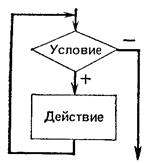
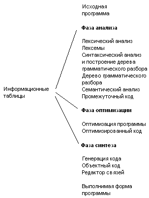
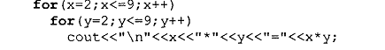
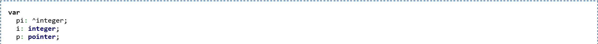
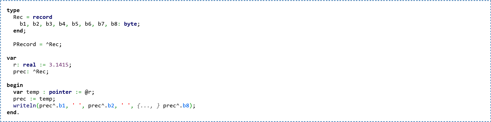
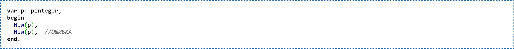

Оглавление

<a href="#_Toc454722569">Раздел 1. Введение в программирование	5</a>

<a href="#_Toc454722570">Тема 1.1. Основы алгоритмизации	5</a>

<a href="#_Toc454722571">Лекция№1 Алгоритмы. Свойства и способы описания линейных алгоритмов.	5</a>

<a href="#_Toc454722572">Лекция№2 Составные команды (следования, ветвления, цикла)	11</a>

<a href="#_Toc454722573">Лекция№3 Команда присваивания. Заголовок алгоритма	16</a>

<a href="#_Toc454722574">Лекция№4    Табличные величины, виды таблиц	21</a>

<a href="#_Toc454722575">Лекция№5    Вспомогательные алгоритмы  Тестирование ПО	27</a>

<a href="#_Toc454722576">Тема 1.2. Языки программирования	33</a>

<a href="#_Toc454722577">Лекция№6 Языки программирования, их классификация.	33</a>

<a href="#_Toc454722578">Лекция»7  Принципы построения ПО. Трансляторы	40</a>

<a href="#_Toc454722579">Лекция№ 8 Стадии разработки программного продукта.                                                Этапы решения задач на ПК.	47</a>

<a href="#_Toc454722580">Лекция №9 Величины. Типы данных.	52</a>

<a href="#_Toc454722581">Раздел 2. Основные конструкции языков программирования	57</a>

<a href="#_Toc454722582">Тема 2.1. Операторы языка программирования	57</a>

<a href="#_Toc454722583">Лекция№10 Синтаксис языка. Арифметические выражения	57</a>

<a href="#_Toc454722584">Лекция№ 11 Ввод и вывод данных.	63</a>

<a href="#_Toc454722585">Лекция№ 12  Условный оператор. Оператор выбора.	67</a>

<a href="#_Toc454722586">Лекция№13   Циклы с пост и предусловием Цикл с параметром Вложенные циклы	72</a>

<a href="#_Toc454722587">Раздел 3. Структурное и модульное программирование	78</a>

<a href="#_Toc454722588">Тема 3.1. Процедуры и функции	78</a>

<a href="#_Toc454722589">Лекция№14  Общие сведения о подпрограммах  Определение и вызов подпрограмм	78</a>

<a href="#_Toc454722590">Тема 3.2. Структуризация в программировании	84</a>

<a href="#_Toc454722591">Лекция№15    Основы и методы структурного программирования	84</a>

<a href="#_Toc454722592">Тема 3.3. Модульное  программирование	88</a>

<a href="#_Toc454722593">Лекция№16    Понятие и структура модуля. Компиляция и компоновка программы	88</a>

<a href="#_Toc454722594">Раздел 4. Структуры данных	92</a>

<a href="#_Toc454722595">Тема 4.1. Массивы	92</a>

<a href="#_Toc454722596">Лекция №17 Понятие массива. Особенности программирования массивов	92</a>

<a href="#_Toc454722597">Тема 4.2. Строки	97</a>

<a href="#_Toc454722598">Лекция№18    Символьный и строковый типы. Объявление типов.	97</a>

<a href="#_Toc454722599">Лекция№19   Поиск, удаление, замена и добавление символов в строке.	103</a>

<a href="#_Toc454722600">Лекция№20    Операции со строками. Функции и процедуры. Решение задач.	108</a>

<a href="#_Toc454722601">Тема 4.3. Множества	114</a>

<a href="#_Toc454722602">Лекция№21    Понятие и объявление множества. Операции над множествами.	114</a>

<a href="#_Toc454722603">Тема 4.4. Записи	121</a>

<a href="#_Toc454722604">Лекция№22 Определение типа записи. Правила работы с записями.	121</a>

<a href="#_Toc454722605">Тема 4.5. Файлы	125</a>

<a href="#_Toc454722606">Лекция№23 Типы файлов. Файлы последовательного доступа.	125</a>

<a href="#_Toc454722607">Тема 4.6. Указатели	131</a>

<a href="#_Toc454722608">Лекция№ 25. Указатели и применение динамически распределяемой памяти.	131</a>

<a href="#_Toc454722609">Тема 4.6	137</a>

<a href="#_Toc454722610">Лекция№26. Структуры данных на основе указателей.	137</a>

<a href="#_Toc454722611">Раздел 5. Объектно-ориентированное программирование	143</a>

<a href="#_Toc454722612">Тема 5.1 Основные принципы объектно-ориентированного программирования (ООП)	143</a>

<a href="#_Toc454722613">Лекция№27. Базовые понятия ООП. Основные принципы ООП.	143</a>

<a href="#_Toc454722614">Тема 5.1	147</a>

<a href="#_Toc454722615">Лекция№28. Классы объектов. Компоненты и их свойства.	147</a>

<a href="#_Toc454722616">Тема 5.2 Интегрированная среда разработчика	152</a>

<a href="#_Toc454722617">Лекция№29. Интерфейс среды разработчика: основные окна, интегрированной среде	152</a>

<a href="#_Toc454722618">Тема 5.3 Этапы разработки приложения	158</a>

<a href="#_Toc454722619">Лекция№30. Проектирование, тестирование и отладка приложения.	158</a>

<a href="#_Toc454722620">Тема 5.4 Иерархия классов	164</a>

<a href="#_Toc454722621">Лекция№31. Классы объектно-ориентированного языка программирования.	164</a>

<a href="#_Toc454722622">Лекция№32. Наследование. Перегрузка методов	170</a>

<a href="#_Toc454722623">Тема 5.5. Визуальное событийно-управляемое программирование	174</a>

<a href="#_Toc454722624">Лекция№33. Основные компоненты интегрированной среды разработки	174</a>

<a href="#_Toc454722625">Тема 5.5.	179</a>

<a href="#_Toc454722626">Лекция№34. События компонентов  Процедуры, определенные пользователем.	179</a>

<a href="#_Toc454722627">Тема 5.6. Разработка оконного приложения	183</a>

<a href="#_Toc454722628">Лекция№35. Создание интерфейса оконного приложения. Компиляция и запуск приложения.	183</a>

<a href="#_Toc454722629">Раздел 1. Введение в программирование	188</a>

<a href="#_Toc454722630">Тема 1.1. Основы алгоритмизации	188</a>

<a href="#_Toc454722631">Лекция№1 Алгоритмы. Свойства и способы описания линейных алгоритмов.	188</a>

<a href="#_Toc454722632">Лекция№2 Составные команды (следования, ветвления, цикла)	193</a>

<a href="#_Toc454722633">Лекция№3 Команда присваивания. Заголовок алгоритма	198</a>

<a href="#_Toc454722634">Лекция№4    Табличные величины, виды таблиц	203</a>

<a href="#_Toc454722635">Лекция№5    Вспомогательные алгоритмы  Тестирование ПО	209</a>

<a href="#_Toc454722636">Тема 1.2. Языки программирования	215</a>

<a href="#_Toc454722637">Лекция№6 Языки программирования, их классификация.	215</a>

<a href="#_Toc454722638">Лекция»7  Принципы построения ПО. Трансляторы	221</a>

<a href="#_Toc454722639">Лекция№ 8 Стадии разработкт программного продукта.                                                Этапы решения задач на ПК.	227</a>

<a href="#_Toc454722640">Лекция №9 Величины. Типы данных.	232</a>

<a href="#_Toc454722641">Раздел 2. Основные конструкции языков программирования	238</a>

<a href="#_Toc454722642">Тема 2.1. Операторы языка программирования	238</a>

<a href="#_Toc454722643">Лекция№10 Синтаксис языка. Арифметические выражения	238</a>

<a href="#_Toc454722644">Лекция№ 11 Ввод и вывод данных.	244</a>

<a href="#_Toc454722645">Лекция№ 12  Условный оператор. Оператор выбора.	247</a>

<a href="#_Toc454722646">Лекция№13   Циклы с пост и предусловием Цикл с параметром Вложенные циклы	253</a>

<a href="#_Toc454722647">Раздел 3. Структурное и модульное программирование	259</a>

<a href="#_Toc454722648">Тема 3.1. Процедуры и функции	259</a>

<a href="#_Toc454722649">Лекция№14  Общие сведения о подпрограммах  Определение и вызов подпрограмм	259</a>

<a href="#_Toc454722650">Тема 3.2. Структуризация в программировании	265</a>

<a href="#_Toc454722651">Лекция№15    Основы и методы структурного программирования	265</a>

<a href="#_Toc454722652">Тема 3.3. Модульное  программирование	269</a>

<a href="#_Toc454722653">Лекция№16    Понятие и структура модуля. Компиляция и компоновка программы	269</a>

<a href="#_Toc454722654">Раздел 4. Структуры данных	273</a>

<a href="#_Toc454722655">Тема 4.1. Массивы	273</a>

<a href="#_Toc454722656">Лекция №17 Понятие массива. Особенности программирования массивов	273</a>

<a href="#_Toc454722657">Тема 4.2. Строки	278</a>

<a href="#_Toc454722658">Лекция№18    Символьный и строковый типы. Объявление типов.	278</a>

<a href="#_Toc454722659">Лекция№19   Поиск, удаление, замена и добавление символов в строке.	284</a>

<a href="#_Toc454722660">Лекция№20    Операции со строками. Функции и процедуры. Решение задач.	290</a>

<a href="#_Toc454722661">Тема 4.3. Множества	296</a>

<a href="#_Toc454722662">Лекция№21    Понятие и объявление множества. Операции над множествами.	296</a>

<a href="#_Toc454722663">Тема 4.4. Записи	303</a>

<a href="#_Toc454722664">Лекция№22 Определение типа записи. Правила работы с записями.	303</a>

<a href="#_Toc454722665">Тема 4.5. Файлы	308</a>

<a href="#_Toc454722666">Лекция№23 Типы файлов. Файлы последовательного доступа.	308</a>

<a href="#_Toc454722667">Тема 4.6. Указатели	316</a>

<a href="#_Toc454722668">Лекция№ 25. Указатели и применение динамически распределяемой памяти.	316</a>

<a href="#_Toc454722669">Тема 4.6	322</a>

<a href="#_Toc454722670">Лекция№26. Структуры данных на основе указателей.	322</a>

<a href="#_Toc454722671">Раздел 5. Объектно-ориентированное программирование	329</a>

<a href="#_Toc454722672">Тема 5.1 Основные принципы объектно-ориентированного программирования (ООП)	329</a>

<a href="#_Toc454722673">Лекция№27. Базовые понятия ООП. Основные принципы ООП.	329</a>

<a href="#_Toc454722674">Тема 5.1	333</a>

<a href="#_Toc454722675">Лекция№28. Классы объектов. Компоненты и их свойства.	333</a>

<a href="#_Toc454722676">Тема 5.2 Интегрированная среда разработчика	339</a>

<a href="#_Toc454722677">Лекция№29. Интерфейс среды разработчика: основные окна, интегрированной среде	339</a>

<a href="#_Toc454722678">Тема 5.3 Этапы разработки приложения	345</a>

<a href="#_Toc454722679">Лекция№30. Проектирование, тестирование и отладка приложения.	345</a>

<a href="#_Toc454722680">Тема 5.4 Иерархия классов	351</a>

<a href="#_Toc454722681">Лекция№31. Классы объектно-ориентированного языка программирования.	351</a>

<a href="#_Toc454722682">Лекция№32. Наследование. Перегрузка методов	357</a>

<a href="#_Toc454722683">Тема 5.5. Визуальное событийно-управляемое программирование	362</a>

<a href="#_Toc454722684">Лекция№33. Основные компоненты интегрированной среды разработки	362</a>

<a href="#_Toc454722685">Тема 5.5.	367</a>

<a href="#_Toc454722686">Лекция№34. События компонентов  Процедуры, определенные пользователем.	367</a>

<a href="#_Toc454722687">Тема 5.6. Разработка оконного приложения	372</a>

<a href="#_Toc454722688">Лекция№35. Создание интерфейса оконного приложения. Компиляция и запуск приложения.	372</a>

<a href="#_Toc454722689">Литература	376</a>
<h3>Раздел 1. Введение в программирование</h3><h3>Тема 1.1. Основы алгоритмизации</h3><h3>Лекция№1 Алгоритмы. Свойства и способы описания линейных алгоритмов.</h3>
	

План лекции

1. Определение алгоритма  Свойства

2. Типы алгоритмов

4. Способы описания алгоритмов 

5. Примеры

Средства наглядности: презентация 

Алгоритм  — набор команд (инструкций), определяющих порядок действий исполнителя для решения поставленной задачи, достижения некоторого результата.

Исполнитель алгоритма  устройство, имеющее систему команд. Идеальными исполнителями являются машины, роботы, компьютеры.

. Свойства алгоритмов:

          1.Дискретность 

- алгоритм представляет собой последовательность элементарных шагов     (команд исполнителя).

    2. Детерминированность

— при одних и тех же входных данных получается один и тот же результат, т.е. любое действие должно быть строго и недвусмысленно определено в каждом случае;

    3. Завершаемость (конечность) -

  каждый алгоритм завершается за конечное число шагов при любом наборе исходных данных.

          4.Результативность -                                                                                                                          после выполнения алгоритма известно, что считать результатом, алгоритм должен приводить к правильному результату для всех допустимых входных значениях.

          5.   Массовость — применимость алгоритма ко множеству исходных данных.

Порядок выполнения алгоритма:
<ol><li>Действия в алгоритме выполняются в порядке их записи</li><li>Нельзя менять местами никакие два действия алгоритма</li><li>Нельзя не закончив одного действия переходить к следующему</li></ol>
Типы алгоритмов:

          1.Линейные                                                                                                                                                             (описание действий, которые выполняются однократно в заданном порядке; имеет линейную структуру).

           2.Разветвляющиеся                                                                                                                                (алгоритм, в котором в зависимости от условия выполняется либо одна, либо другая последовательность действий);

          3.Циклические                                                                                                                                     (описание действий, которые должны повторятся указанное число раз или пока не выполнено заданное условие);

4,Вспомогательные                                                                                                                             (алгоритм, который можно использовать в других алгоритмах, указав только его 

Способы описания алгоритмов 

Способы записи алгоритмов определяются исполнителем. Команды, которые может выполнять исполнитель наз. СИСТЕМОЙ КОМАНД ИСПОЛНИТЕЛЯ (СКИ). Способы записи бывают: 

на естественном языке;

на специальном (формальном) языке (псевдокод);

с помощью формул, рисунков, таблиц;

с помощью стандартных графических объектов (геометрических фигур) 

Псевдокод представляет собой систему обозначений и правил, предназначенную для единообразной записи алгоритмов. Он занимает промежуточное место между естественным и формальным языком.

Правила  оформления  блок-схем  можно  посмотреть  в  ГОСТ 19.701-90. 

ГОСТ 19.002-80. Схемы алгоритмов и программ. Правила выполнения. 

ГОСТ 19.003-80. Схемы алгоритмов и программ. Обозначения условные 

графические.  

Каждому  действию  алгоритма  соответствует  геометрическая  фигура 

(блочный  символ).  Перечень  наиболее  часто  употребляемых  символов 

приведен в таблице ниже.
<table><tr><td>
Название
</td><td>
Символ (рисунок)
</td><td>
Выполняемая функция (пояснение)
</td></tr><tr><td>
1. Блок вычислений
</td><td>

</td><td>
Выполняет вычислительное действие или группу действий
</td></tr><tr><td>
2. Логический блок
</td><td>

</td><td>
Выбор направления выполнения алгоритма в зависимости от условия
</td></tr><tr><td>
3. Блоки ввода/вывода
</td><td>

</td><td>
Ввод или вывод данных вне зависимости от физического носителя
</td></tr><tr><td></td><td>

</td><td>
Вывод данных на печатающее устройство
</td></tr><tr><td>
4. Начало/конец (вход/выход)
</td><td>

</td><td>
Начало или конец программы, вход или выход в подпрограмму
</td></tr><tr><td>
5. Предопределенный процесс
</td><td>

</td><td>
Вычисления по стандартной или пользовательской подпрограмме
</td></tr><tr><td>
6. Блок модификации
</td><td>

</td><td>
Выполнение действий, изменяющих пункты алгоритма
</td></tr><tr><td>
7. Соединитель
</td><td>

</td><td>
Указание связи между прерванными линиями в пределах одной страницы
</td></tr><tr><td>
8. Межстраничный соединитель
</td><td>

</td><td>
Указание связи между частями схемы, расположенной на разных страницах
</td></tr></table>
 Правила построения блок-схем:

1. Блок-схема выстраивается в одном направлении либо сверху вниз, либо слева направо

2. Все повороты соединительных линий выполняются под углом 90 градусов

      Пример алгоритма:

        Дано: x, y, z.

Найти max

Алгоритм 1. (словесное описание)

Алгоритм 2. (псевдокод)

Пример. А.2., представленный блоксхемой

Контрольные вопросы 

1.  Дайте  определение  алгоритма.  В  каких  сферах  человеческой 

деятельности применимы алгоритмы? 

2.  Какие свойства алгоритмов вам известны? Объясните на примере 

разработанных вами алгоритмов суть этих принципов. 

3.  Какие  существуют  формы  записи  алгоритмов?  Опишите  их 

достоинства и недостатки. В каких случаях они применяются?  

4.Перечислите основные правила составления алгоритмов. 

.
<h2>Лекция№2 Составные команды (следования, ветвления, цикла)</h2>
План лекции

1.Определение команды (оператора)

2.Команда следования

3.Команда ветвления

4.Команда цикла

Элементарной структурной единицей любого алгоритма является <strong>простая команда (оператор)</strong>, обозначающая один элементарный шаг переработки или отображения информации. Простая команда на языке схем алгоритма изображается в виде функционального блока, имеющего один вход и один выход.

Из простых команд и проверки условий образуются <strong><em>составные команды</em></strong><em>,</em> имеющие более сложную структуру. Рассмотрим основные типы составных команд алгоритма.

Команда следования

Эта команда образуется из последовательности команд, следующих одна за другой. Под действием понимается либо простая, либо составная команда. Эти команды могут записываться либо в строчку, либо в столбец — одна под одной.

Наличие скобок позволяет рассматривать команду следования как единое действие, распадающееся на последовательность более простых действий.

 Команда ветвления

            

       б) неполное ветвление       а) полное ветвление       

 С помощью <strong>команды ветвления (развилки)</strong> осуществляется выбор одного из двух возможных действий в зависимости от условия.

Действия, указанные после служебных слов <strong>то и иначе,</strong> могут быть простыми или составными командами. При исполнении команды ветвления выполняется только одно из действий: если условие соблюдено, то выполняется действие 1, в противном случае — действие 2.

В том случае, когда условие соблюдено, продолжение исполнения алгоритма происходит по стрелке <strong>«+»,</strong> в противном случае — по стрелке  <strong>«—».</strong>

Команда ветвления может использоваться <strong>в сокращенной форме (коррекция)</strong><em>,</em> когда в случае несоблюдения условия никакое действие не выполняется.

<strong>Циклический алгоритм</strong> – Команда повторения (цикл)  - описание действий, которые должны повторяться указанное число раз или пока не выполнено заданное условие.

Большинство алгоритмов содержат серии многократно повторяемых команд. Если такие команды записывать в виде составной команды следования, то каждую повторяемую команду пришлось бы выписать ровно столько раз, сколько раз она повторяется.. Поэтому для обозначения многократно повторяемых действий используют специальную конструкцию, называемую <strong>циклом</strong>.

<strong>Цикл</strong> - управляющая структура, организующая многократное выполнение указанного действия.

 

Составная <strong>команда цикла</strong><em>,</em> называемая также <strong>командой повторения</strong><em>,</em> содержит <strong>условие</strong>. состоит из двух частей: <strong>условия цикла</strong>, которое используется для определения количества повторений, и <strong>тела цикла(</strong>перечень повторяющихся действий).<strong> </strong>У любого цикла есть <strong>параметр</strong>. <strong>Параметр цикла</strong> – это переменная, которая изменяется в теле цикла, а также участвует в условии его окончания. 

Циклические алгоритмы бывают двух типов: Циклы со счетчиком(параметром), в которых какие-то действия выполняются определенное число раз; (безусловные циклы или арифметические циклы ) Циклы с условием, в которых тело цикла выполняется, в зависимости от какого-либо условия. Различают циклы с предусловием и постусловием.

<strong>Схема цикла с предусловием</strong>

                                     

Под действием, как и прежде, понимается простая или составная команда. Исполнение такой команды повторения состоит в том, что сначала проверяется условие (отсюда и название — <strong><em>цикл с предусловием</em></strong>), и если оно соблюдено, то выполняется команда, записанная после служебного слова <strong>повторять.</strong> После этого снова проверяется условие. Выполнение цикла завершается, когда условие перестает соблюдаться. Для этого необходимо, чтобы команда, выполняемая в цикле, влияла на условие. (этот тип цикла называют также циклом «пока»). . Можно сказать что условие цикла &quot;пока&quot; - это условие входа в цикл. В частном случае может оказаться что действие не выполнялось ни разу. Условие цикла необходимо подобрать так, чтобы действия, выполняемые в цикле, не привели к нарушению его истинности, иначе произойдет зацикливание. <strong>Зацикливание</strong> - бесконечное повторение выполняемых действий. 

<strong>Схема цикла с постусловием</strong>

<strong>Команда повторения с постусловием</strong> выполняется аналогично, только условие проверяется после выполнения команды, а повторение выполнения команды происходит в том случае, когда условие не соблюдено, т. е. повторение производится до соблюдения условия (поэтому этот тип цикла называют также циклом «до»). Таким образом, тело цикла будет реализовано хотя бы один раз. Если условие не выполняется, то происходит возврат к выполнению действий. Если условие истинно, то осуществляется выход из цикла. Для предотвращения зацикливания необходимо предусмотреть действия, приводящие к истинности условия.

 <strong>Циклы со счетчиком(параметром) </strong>используют, когда заранее известно, какое число повторений тела цикла необходимо выполнить. Например, на уроке физкультуры вы должны пробежать некоторое количество кругов вокруг стадиона.

В общем случае схема циклического алгоритма с условием будет выглядеть так: <strong>Пока -</strong> условие <strong>повторять -</strong> действие..Назовите правила с

Для создания циклов со счётчиком ( параметром) необходимо использовать правила:

Параметр цикла, его начальное и конечное значения и шаг должны быть одного типа

Запрещено изменять в теле цикла значения начальное, текущее и конечное для параметра

Запрещено входить в цикл минуя блок модификации

Если начальное значение больше конечного, то шаг - число отрицательное

После выхода из цикла значение переменной параметра неопределенно и не может использоваться в дальнейших вычислениях

Из цикла можно выйти не закончив его, тогда переменная параметр сохраняет свое последнее значение

Контрольные вопросы

 1 Дайте определение команды (оператора).

2. 3.Объясните роль условия в команде ветвления

3.Чтотакое «тело цикла» ? 

4.Назовите правила создания цикла со счетчиком.
<h2>Лекция№3 <strong>Команда присваивания. Заголовок алгоритма</strong></h2>
План лекции

1.Формат команды присваивания

2.Свойства присваивания

3.Пример

4. Заголовок алгоритма. 

Команда присваивания - команда исполнителя, в результате которой переменная получает новое значение. Формат команды:

&lt;<strong>имя переменной</strong>&gt;:=&lt;<strong>выражение</strong>&gt;

Исполнение команды присваивания происходит в таком порядке: сначала вычисляется &lt;выражение&gt;, затем, полученное значение присваивается переменной.  <strong>Пример.</strong> 

Например, запись A:=B+5 читается так: «переменной A присвоить значение выражения B плюс 5».

Знаки присваивания<strong> «:=» </strong>и равенства<strong> «=» —</strong> разные знаки:

знак «=» означает равенство двух величин, записанных по обе стороны от этого знака;

знак <strong>«:=»</strong> предписывает выполнение операции присваивания.

 

Например, запись A:=A+1 выражает не равенство значений A и A+1, а указание увеличить значение переменной A на единицу.

 

При выполнении команды присваивания сначала вычисляется значение выражения, стоящего справа от знака <strong>«:=»</strong>, затем результат присваивается переменной, стоящей слева от знака <strong>«:=»</strong>. При этом тип выражения должен быть совместим с типом соответствующей переменной.

Свойства присваивания:

1. пока переменной не присвоено значение, она остаётся неопределённой;

2. значение, присвоенное переменной, сохраняется в ней вплоть до выполнения следующего присваивания этой переменной нового значения;

3. если мы присваиваем некоторой переменной очередное значение, то предыдущее её значение теряется безвозвратно.

В дальнейшем будет предполагаться, что <strong>исполнителем алгоритмов работы с величинами является компьютер</strong>. Любой алгоритм может быть построен из команд <strong>присваивания</strong>, <strong>ввода</strong>, <strong>вывода</strong>, <strong>ветвления</strong> и <strong>цикла</strong>. 

Команда присваивания означает следующие действия, выполняемые компьютером:                                1) вычисляется выражение;                                                                                                                                                                     2) полученное значение присваивается переменной.

В блок-схемах команды присваивания изображаются в прямоугольниках. Такой блок называется вычислительным. 

При описании алгоритмов не обязательно соблюдать строгие правила записи выражений, это можно делать в обычной математической форме, так как это еще не язык программирования со строгим синтаксисом. В рассматриваемом алгоритме имеется команда ввода: ввод a, b, c, d. В блок-схемах команда ввода записывается в параллелограмме — блоке ввода-вывода. При выполнении этой команды процессор прерывает работу и ожидает действий пользователя.      Пользователь должен набрать на устройстве ввода (клавиатуре) значения вводимых переменных и нажать клавишу ввода. Значения следует вводить в том же порядке, в каком эти переменные рас- положены в списке ввода. Обычно с помощью команды ввода присваиваются значения исходных данных, а команда присваивания используется для получения промежуточных и конечных величин. Полученные компьютером результаты решения задачи должны быть сообщены пользователю, для чего и предназначена команда вывода: вывод m, n. С помощью этой команды результаты выводятся на экран или через устройство печати на бумагу. 

Пример

Составим алгоритм, в результате которого переменные A и B литерного типа обменяются своими значениями.

Решение вида A:=B B:=A неверно, так как после выполнения первой команды присваивания первоначальное значение переменной A будет безвозвратно утеряно. Вторая команда присвоит переменной B текущее значение переменной A. В результате обе переменные получат одно и то же значение.

 Для решения исходной задачи введём промежуточную переменную M. . Тогда задачу обмена значениями можно решить последовательным выполнением трех команд присваивания.  Алгоритм обмена значениями переменных A и B запишем так:

Этой задаче аналогична следующая ситуация. Имеются два стакана: один — с молоком, другой — с водой. Требуется произвести между ними обмен содержимым. Ясно, что в этом случае необходим третий стакан — пустой. Последовательность действий при обмене будет такой: 1) перелить молоко из 1-го стакана в 3-й; 2) воду из 2-го стакана в 1-й; 3) молоко из 3-го стакана во 2-й. 

а) Имя алгоритма  

При работе на ЭВМ принято давать имена, состоящие из не более 8 символов, без пробелов, на первом месте обязательно буква, после имени состоящем из восьми символов через точку пишется расширитель имени, состоящем из не более трех символов на первом месте обязательно буква. Например: KWUR.E, BASIC.COM, LR4B.SC2 и т.д. б) Список величин (входные и выходные величины) с указанием их типа.  в) аргументы (входные данные) и результаты (выходные данные). Общий вид заголовка алгоритма работы с величинами таков:  алг имя алгоритма (список величин с указанием типов) ~~ дано имена аргументов (имена входных величин) ~~~~ надо имена результатов (имена выходных величин) ~~~~ нач ~~~ серия  кон

Как мы уже знаем, заголовок алгоритма описывает условие задачи, а тело алгоритма — ее решение. Чтобы записать заголовок алгоритма, обычно достаточно внимательно изучить условие, не думая пока о решении.

При построении алгоритмов с аргументами важно точно определить количество аргументов и их типы. Для этого нужно изучить условие задачи и выделить в нем ту информацию, которую необходимо задать, прежде чем приступать к решению. Этой информации будут соответствовать аргументы алгоритма.

Например, в задаче «квадрат» такой дополнительной информацией была сторона квадрата, поэтому у алгоритма появился один аргумент.

В общем случае переменным в условии задачи соответствуют аргументы в заголовке алгоритма.

 

Контрольные вопросы

1.Опишите порядок выполнения команды присваивания.

2.Назовите свойства присваивания.

3.Верно ли решение вида A:=B B:=A ? Почему?

4.Приведите пример заголовка алгоритма

 
<h2>Лекция№4    Табличные величины, виды таблиц</h2>
План лекции

1.Виды таблиц.

2. Примеры использования таблиц.

3. Табличные величины в алгоритмах.

Определение. Таблица – это упорядоченная последовательность величин одного типа, имеющая имя. Например;

Расписание звонков:

Таблица умножения Пифагора;

Поля игры “Морской бой”.

Из всего многообразия таблиц можно выделить простые и сложные.

Простые таблицы бывают линейные и прямоугольные. К типу линейных таблиц можно отнести расписание звонков. Таблица умножения Пифагора относится к типу прямоугольных таблиц.

Сложные таблицы – это такие таблицы, которые состоят из простых.

Например, таблица “Расписание уроков на неделю”:

При решении задач человек очень часто пользуется таблицами. Таблицы бывают разными, но наиболее часто встречаются линейные и прямоугольные. Эти два вида таблиц мы с вами и будем рассматривать.

И так, таблицы бывают линейные и прямоугольные. В линейной таблице только одна строка, в прямоугольной их несколько. Каждой таблице дается свое название. Каждый элемент таблицы носит тоже название, что и сама таблица, различают же их по номерам строк и столбцов, в которых они находятся.

Рассмотрим примеры использования таблиц в практической деятельности человека.

Пример 1. На метеостанции каждый час измеряется температуры воздуха и значения измерения записываются в таблицу:
<table><tr><td>
Время измерения, ч
</td><td></td><td></td><td></td><td></td><td>
…
</td><td></td><td></td></tr><tr><td>
Температура, 0С
</td><td></td><td></td><td>
15,5
</td><td></td><td>
…
</td><td></td><td>
17,5
</td></tr></table>
Эта линейная таблица содержит 24 элемента, занумерованные от 0 до 23. Второй элемент имеет значение 15,5, а нулевой элемент – 17. Время измерения в таблице имеет значение номера столбца, в котором находятся показания температуры.

Пример 2. На метеостанции вычисляют среднюю температуру воздуха каждые сутки и записывают в другую таблицу. Пусть нас интересует средняя температура с 22 по 28 апреля:
<table><tr><td>
Дата
</td><td></td><td></td><td></td><td></td><td></td><td></td><td></td></tr><tr><td>
Средняя температура, 0С
</td><td></td><td>
15,5
</td><td></td><td></td><td></td><td></td><td>
17,5
</td></tr></table>
Данная линейная таблица содержит семь элементов, занумерованных от 22 до 28.

Очевидно, что при хранении таблицы порядковые номера хранить нет необходимости: зная начало нумерации, можно путем отсчета найти любой элемент таблицы. Кроме того, полезно знать и самый большой порядковый номер, так как это позволяет определить заранее размер таблицы. Таким образом, чтобы указать, что некоторая величина является линейной таблицей, нужно задать тип элементов таблицы, ее имя, начальный и конечный порядковые номера ее элементов.

В первом примере таблицу можно записать так: вещтаб <em>температура</em> [0:23 ], во втором – вещтаб <em>средняя температура</em> [22:28].

Для удобства использования табличных величин в алгоритмах, их обычно обозначают одной буквой латинского алфавита.

Напримеры: вещтаб F[7:12], нат таб D[1:12], лит таб G[5:9].

Таблица F
<table><tr><td></td><td></td><td></td><td></td><td></td><td></td></tr><tr><td>
-2,8
</td><td></td><td>
0,69
</td><td></td><td>
-23,87
</td><td></td></tr></table>
F[7]:=-2,8; F[8]:=0; F[9]:=0,69; F[10]:=8; F[11]:=-23,87; F[12]:=11.

Таблица D
<table><tr><td></td><td></td><td></td><td></td><td></td><td></td><td></td><td></td><td></td><td></td><td></td><td></td></tr><tr><td></td><td></td><td></td><td></td><td></td><td></td><td></td><td></td><td></td><td></td><td></td><td></td></tr></table>
D[1]:=3; D[2]:=12; D[3]:=1; … ; D[12]:=100.

Таблица G
<table><tr><td></td><td></td><td></td><td></td><td></td></tr><tr><td>
Петров
</td><td>
Иванов
</td><td>
Сидоров
</td><td>
Волков
</td><td>
Курочкин
</td></tr></table>
G[5]:= «Петров»; G[6]:= «Иванов»; … ; G[9]:= «Курочкин».

 

Рассмотрим примеры использования прямоугольных таблиц. Таблицы сложения и умножения однозначных чисел в различных системах счисления. Эти таблицы имеют несколько строк, значит они прямоугольные.

Таблица S Таблица Р
<table><tr><td>
+
</td><td></td><td></td><td></td><td></td><td>
 
</td><td>
×
</td><td></td><td></td><td></td><td></td></tr><tr><td></td><td></td><td></td><td></td><td>
105
</td><td>
 
</td><td></td><td></td><td></td><td></td><td></td></tr><tr><td></td><td></td><td></td><td>
105
</td><td>
115
</td><td>
 
</td><td></td><td></td><td></td><td>
115
</td><td></td></tr><tr><td></td><td></td><td>
105
</td><td>
115
</td><td>
125
</td><td>
 
</td><td></td><td></td><td>
115
</td><td>
145
</td><td>
225
</td></tr><tr><td></td><td>
105
</td><td>
115
</td><td>
125
</td><td>
135
</td><td>
 
</td><td></td><td></td><td>
135
</td><td>
225
</td><td>
315
</td></tr></table>
наттаб S[1:4,1:4] наттаб Р[1:4,1:4]

 

 При измерении температуры в течение месяца ежедневно каждый час данные можно вводить в таблицу:
<table><tr><td>
время дата
</td><td></td><td></td><td></td><td></td><td></td><td></td><td>
…
</td><td></td><td></td></tr><tr><td></td><td></td><td></td><td>
15,5
</td><td></td><td></td><td>
14,7
</td><td>
…
</td><td></td><td>
17,5
</td></tr><tr><td></td><td></td><td></td><td>
16,5
</td><td></td><td></td><td></td><td>
…
</td><td></td><td></td></tr><tr><td></td><td></td><td>
15,5
</td><td></td><td>
14,5
</td><td></td><td>
14,3
</td><td>
…
</td><td></td><td>
16,5
</td></tr><tr><td>
…
</td><td>
..
</td><td>
…
</td><td>
…
</td><td>
…
</td><td>
…
</td><td>
…
</td><td>
…
</td><td>
…
</td><td>
…
</td></tr><tr><td></td><td></td><td></td><td>
15,5
</td><td></td><td></td><td>
14,7
</td><td>
…
</td><td></td><td>
17,5
</td></tr><tr><td></td><td></td><td></td><td>
16,5
</td><td></td><td>
15,5
</td><td></td><td>
…
</td><td></td><td></td></tr></table>
вещтаб <em>температура</em> [1:31,0:23]

 

При указании нумерации в прямоугольных таблицах на первом месте пишутся строки, а на втором столбцы. Каждый элемент таблицы носит тоже имя, что и сама таблица, различают же его по номеру строки и столбца, в которых он находится.

Например: S[2,4]:=115; P[3,4]:=225; <em>температура</em>[30,5]:=14,7.

Табличные величины удобно использовать в алгоритмах. Рассмотрим примеры таких алгоритмов.
<table><tr><td>
Пример 1.
</td><td>
алг таблица сложения (наттаб S[1:4,1:4]) рез S начнатi,j i:=1 пока i≤4 нц j:=1 пока j≤4 нц S[i,j]:=i+j еслиS[i,j]≥5 то S[i,j]:=10+ (S[i,j]-5) все j:=j+1 кц i:=i+1 кцкон
</td></tr><tr><td>
 
</td><td></td></tr><tr><td>
Пример 2
</td><td>
алг таблица умножения (наттаб Р[1:4,1:4]) рез Рначнат i,j i:=1 пока i≤4 нц j:=1 пока j≤4 нц Р[i,j]:=i×jпока Р[i,j]≥5 нц Р[i,j]:= Р[i,j]-5 а:=а+1 кц Р[i,j]:=а×10+ Р[i,j]; j:=j+1 кц i:=i+1 кц кон
</td></tr><tr><td>
Пример 3
</td><td>
алг таблицы сложения и умножения (наттаб S[1:4,1:4],наттаб Р[1:4,1:4 ) рез Р,S начнат i,j i:=1 пока i≤4 нцj:=1 пока j≤4 нц a:=0 S[i,j]:=i+j Р[i,j]:=i×j пока Р[i,j]≥5нц Р[i,j]:= Р[i,j]-5 а:=а+1 кц если S[i,j]≥5 тоS[i,j]:=10+ (S[i,j]-5) все Р[i,j]:=а×10+ Р[i,j] j:=j+1 кцi:=i+1 кц кон
</td></tr></table>
 

При сложении или умножении номера строки и столбца мы получаем число в десятичной системе счисления. 5 = 10, значит необходимо определить количество пятерок в полученной сумме или произведении. Это количество определяется в алгоритме «таблица умножения» с помощью команды повторения. В алгоритме «таблица сложения» учитывается тот факт, что 4+4=8, т.е. больше одной пятерки при сложении в сумме содержаться не может, поэтому достаточно использовать команду ветвления. Можно в обоих алгоритмах использовать команду повторения. Более того, оба эти алгоритма можно объединить в один .

Составим алгоритм для вычисления средней суточной температуры воздуха в течении месяца (Пример 4). Для удобства записи назовем таблицу «температура» одной буквой «Т». Для сохранения значений средней температуры в течении месяца создадим линейную таблицу на 31 элемент и назовем ее «С». Каждый элемент первой таблицы будет различаться по номеру строки и столбца – Т[i,j], а каждый элемент второй таблицы будет различаться по номеру столбца – С[i]. Среднесуточную температуру будем вычислять по правилу вычисления среднего арифметического, и сохранять результат в созданной нами линейной таблице.
<table><tr><td>
Пример 4
</td><td>
алг среднесуточная температура (вещтаб Т[1:31,0:23], вещтаб С[1:31]) арг Т рез С начнат i,j i:=1 пока i≤31 нц j:=0 пока j≤23 нц k:=k+ T[i,j] j:=j+1 кц C[i]:=k/24 i:=i+1 кцкон
</td></tr></table>
 

Контрольные вопросы

1.Виды таблиц.

2. Примеры использования таблиц.

3. Табличные величины в алгоритмах
<h2>Лекция№5    Вспомогательные алгоритмы  Тестирование ПО</h2>
План лекции

1.Вспомогательный алгоритм

2. Процедуры

3. Функции

4.Тестирование

5.Рекомендации по тестированию

5. Виды тестирования

<strong>Вспомогательный алгоритм</strong> представляет собой модуль, к которому можно многократно обращаться из основного алгоритма. Использование вспомогательных алгоритмов может существенно уменьшить размер алгоритма и упростить его разработку. Вспомогательный алгоритм многократно используется в основном алгоритме с различными значениями некоторых входящих величин, называемых параметрами.

Для реализации вспомогательных алгоритмов служат подпрограммы или процедуры. <strong>Подпрограмма</strong> — самостоятельный фрагмент программы, оформленный в виде, допускающем многократное обращение к нему из разных точек программы. <strong>Обращение к подпрограмме</strong> — переход к выполнению подпрограммы с заданием информации, необходимой для ее выполнения и возврата.

Существует два вида подпрограмм: процедуры и функции. Разница между ними состоит в том, что функция через свое имя возвращает одно значение определенного типа и может, использоваться в выражениях наряду со встроенными функциями .

Процедура
<table><tr><td>
<strong>Алгоритмический язык</strong>
</td><td>
<strong>Паскаль</strong>
</td></tr><tr><td>
алг &lt;имя процедуры&gt;

(&lt;список параметров&gt;)

&lt;операторы&gt;

кон
</td><td>
procedure &lt;имя  процедуры&gt;

(&lt;список параметров&gt;);

&lt;описание&gt;

begin

&lt;операторы&gt;

end
</td></tr><tr><td colspan="2">
Процедура оформляется следующим образом:
</td></tr></table>
Вызов процедуры из основной программы производится оператором вызова процедуры: 

<strong>&lt;имя процедуры&gt;(&lt;список значеиий&gt;).</strong>

В процедуру могут передаваться параметры, то есть некоторые переменные, которые могут использоваться внутри процедуры. 

Для того чтобы передать параметр по ссылке, в Паскале в описании формальных параметров в теле процедуры используется ключевое слово var:

procedure SubTest(a,b:integer; var c:real, var d:integer);

здесь параметры а и b передаются по значению, а параметры с и d — по ссылке.

Функции

Функции по своей сути похожи на процедуры, но возвращают одно значение через свое имя.
<table><tr><td>
<strong>Бейсик</strong>
</td><td>
<strong>Паскаль</strong>
</td></tr><tr><td>
FUNCTION &lt;имя&gt;(&lt;параметры&gt;)

&lt;операторы&gt;

END FUNCTION
</td><td>
function &lt;имя&gt;(&lt;параметры&gt;):&lt;тип результата&gt;;

&lt;описания&gt;

begin

&lt;операторы&gt;

end
</td></tr><tr><td colspan="2">
Описание функции:
</td></tr></table>
Для того чтобы вернуть значение из функции, необходимо внутри тела функции переменной, имя которой совпадает с именем функции, присвоить необходимое значение. Эту переменную не надо объявлять в области описания.

Вызов функции производится в выражениях и операторах подобно стандартным функциям языка:

<strong>&lt;Переменная&gt; := &lt;Функция&gt; (&lt;Параметры&gt;)</strong>

Реализация алгоритмов с помощью подпрограмм — процедур и функций — называется <strong>процедурным программированием</strong>. В последние годы все большую популярность приобретают методы объектного и событийного программирования.

Тестирование ПО

&quot;Тестирование программ может использоваться для демонстрации наличия ошибок,

но оно никогда не покажет их отсутствие&quot;Эдсгер Вибе Дейкстра

Необходимо различать понятия тестирование и отладка.

Тестирование направлено на выявление ошибок в программе, которая считается работающей. В то время как, <a href="javascript:termInfo(&quot;отладкой&quot;)">отладкой</a> называют процесс локализации и исправления обнаруженных ошибок.

Программа подвергается постоянному тестированию на протяжении всего процесса работы над ней.

Основным условием для тестирования является наличие известных наборов исходных данных и соответствующих им результатов выходных данных. Укажем некоторые рекомендации к тестированию программ 

1) Все результаты тестирования необходимо строго фиксировать на бумаге, так чтобы их можно было воспроизвести после того как будут внесены изменения в программу.

2) Необходимо тестировать граничные условия. Например, необходимо постоянно проверять, что тело цикла повторяется нужное число раз, а условное выражение корректно разветвляет вычисления.

3) Необходимо тестировать пред- и постусловия. Другими словами, прежде чем использовать данные в вычислениях, необходимо удостовериться в их корректности. Например, при вычислении частного двух чисел делитель не должен быть равен 0; индекс массива не должен превышать допустимый диапазон.

4) Следует проверять коды возвратов функций. Например, если по каким-либо причинам вызов библиотечной функции fopen(), осуществляющей открытие файла, завершилось неудачей, то дальнейшая работа с данным файлом должна быть прервана.

Альфа-тестирование – тестирование готового продукта на специально созданных задачах.

Бета-тестирование – опробование бесплатной тестовой версии программного продукта на реальных задачах.

Если «альфа-» и «бета-тестирование» относятся к стадиям до выпуска продукта (а также, неявно, к объёму тестирующего сообщества и ограничениям на методы тестирования), тестирование «белого ящика» и «чёрного ящика» имеет отношение к способам, которыми тестировщик достигает цели..

При тестировании с использованием <a href="javascript:termInfo(&quot;стратегии `белого ящика`&quot;)">стратегии &quot;белого ящика&quot;</a> (иногда можно встретить термин &quot;прозрачный ящик&quot;) полагают, что структура программного обеспечения известна, этим и объясняется название стратегии. В данном случае тесты подбирают таким образом, чтобы пройти хотя бы один раз по каждой ветви алгоритма.

При тестировании с использованием <a href="javascript:termInfo(&quot;стратегии `черного ящика`&quot;)">стратегии &quot;черного ящика&quot;</a> полагают, что структура программного обеспечения неизвестна, то есть программа рассматривается как &quot;черный ящик&quot; при этом известны только наборы входных и выходных данных. В данном случае, тестовые данные формируют только на основе спецификации программы, без учета информации о ее структуре. Регрессионное тестирование. После внесения изменений в очередную версию программы, регрессионные тесты подтверждают, что сделанные изменения не повлияли на работоспособность остальной функциональности приложения. 

При тестировании сложных программных систем стратегия &quot;белого ящика&quot; не позволяет выявить пропущенный маршрут, поэтому, возможно, что некоторые ошибки в программе останутся не обнаруженными. Также эта стратегия не позволяет выявить ошибки, связанные с обрабатываемыми входными данными. В свою очередь, при использовании стратегии &quot;черного ящика&quot; невозможно подобрать такие тестовые наборы, чтобы выполнить проверку всех возможных комбинаций исходных данных. В этой связи, на практике, как правило, используют комбинации двух стратегий.

В заключение отметим, что даже после внедрения в эксплуатацию процесс тестирования не прекращается. 

Контрольные вопросы

.Вспомогательный алгоритм

2. Процедуры

3. Функции

4.Тестирование

5.Рекомендации по тестированию

5. Виды тестирования
<h2>Тема 1.2. Языки программирования</h2><h2>Лекция№6 Языки программирования, их классификация. </h2>
План лекции

1. ЯП: определение, классификация.

2. История ЯП. Презентация

3. Достоинства/ недостатки ЯП.

4. Эволюция ЯП BASIC,  Pascal  

Средства наглядности: презентации

<strong>Язык программирования</strong> - это формализованный язык, который представляет собой совокупность алфавита, правил написания конструкций (синтаксис) и правил толкования конструкций (семантика).

В настоящее время насчитывается несколько сотен языков программирования, рассчитанных на разные сферы применения ЭВМ, т. е. на разные классы решаемых с помощью ЭВМ задач. Эти языки классифицируют по разным уровням, учитывая степень зависимости языка от конкретной ЭВМ.

Общепринятой и строгой классификации языков программирования не существует. Поэтому в курсе представлена классификация наиболее распространенных языков, сложившаяся исторически: 
<table><tr><td>
Языки программирования
</td><td></td><td></td></tr><tr><td>
Низкого уровня
</td><td>
Высокого уровня
</td><td></td></tr><tr><td>
Машинный
</td><td>
Машинно-зависимые
</td><td>
Машинно-независимые
</td></tr><tr><td>
 
</td><td>
Ассемблер
</td><td>
Универсальные
</td></tr><tr><td>
 
</td><td>
Автокод
</td><td>
Проблемно-ориентированные
</td></tr><tr><td>
 
</td><td>
 
</td><td>
Объектно-ориентированные
</td></tr><tr><td>
 
</td><td>
 
</td><td>
Командные языки баз данных
</td></tr></table>
На самом нижнем уровне классификации находится машинный язык, т. е. внутренний язык ЭВМ, на котором в конечном итоге представляется и исполняется программа. 

<strong>Универсальные языки</strong> высокого уровня обеспечивают создание различных программ (задач), например Алгол, Си, ПЛ/1 и т.д..

<strong>Проблемно-ориентированные языки</strong> создавались под какие-то конкретные классы задач, например, Фортран - научные расчеты, Кобол - экономические расчеты, Лисп и Пролог - искусственный интеллект и т.д.

<strong>Объектно-ориентированные языки</strong> четвертого поколения (4GL — <strong>forth-generation language</strong>) и программирование основаны на создании модели системы, как совокупности объектов и использует следующие базовые понятия: класс, объект, событие, свойства объекта, метод обработки. Первым языком программирования этой группы был - Симула-67. В настоящее время к этим языкам относятся - С++, Visual Basic, Java Script и динамический HTML и другие современные языки программирования.

<strong>Командные языки баз данных</strong>предназначены длярасширения возможностей среды управления базами данных, для создания собственных функций интерфейса - взаимодействия с пользователем.

<strong>История языков программирования</strong>.

<strong>Неструктурные языки (широко использовались 40-е годы)</strong>

Преимущества. 

Оптимизация программы под аппаратную архитектуру.

Как следствие, обеспечение высокой эффективности вычислений.

Недостатки

Для каждого типа вычислительной машины должен был быть написан свой вариант исходного кода.

Применение: быстрые численные расчеты, создание драйверов устройств.

Примеры языков: Ассемблеры.

<strong>Директивные (структурные) языки (появились в 50-е годы)</strong>

Преимущества

Повторное использование ранее написанных блоков кода.

Высокая степень независимости программы от типа вычислительной машины.

Повышение эффективности труда разработчиков, в том числе и за счет абстрагирования от конкретных деталей аппаратного обеспечения.

Недостатки

Некоторая потеря в скорости вычислений.

Применение: создание операционных систем и системных программ, разработка небольших пользовательских приложений, научные расчеты.

Примеры языков: FORTRAN, C, Pascal.

<strong>Декларативные (функциональные и логические) языки (зародились в 60-е годы)</strong>

Программный код на декларативном языке программирования представляет собой описание действий, которые можно осуществлять, а не последовательный набор команд.

Преимущества

Легче формализуется математическими средствами.

Как следствие, программы проще тестировать, т.е. проверять на наличие ошибок.

Высокая степень абстракции.

Недостатки

Снижение скорости работы программы.

Применение: доказательство теорем, возможность обработки разнородных данных.

<strong>Функциональные языки</strong>

Программу на функциональном языке можно представить как функцию с одним или несколькими аргументами.

Преимущества

Автоматическое динамическое распределение памяти компьютера для хранения данных.

Программист получает возможность абстрагироваться от представления данных и других рутинных операциях и сосредоточиться на предметной области.

Недостатки

Нелинейная структура программы, следовательно, такое программирование сложно для понимания.

Относительно невысокая эффективность вычислений.

Применение: обработка рекурсивных структур данных, обработка символьной информации.

Примеры языков: Haskell.

<strong>Логические языки</strong>

Программа представляет собой совокупность правил или логических высказываний. Преимущества

Возможность откатов, т.е. возвращения к предыдущей подцели при отрицательном результате одного из вариантов в процессе поиска решения. Это избавляет от необходимости поиска решения путем полного перебора вариантов.

Недостатки

Узкий класс решаемых задач.

Применение: эмуляция искусственного интеллекта, разработка экспертных систем.

Примеры языков: Prolog.

<strong>Объектно-ориентированные языки</strong>

Программа представляет собой описание объектов, их свойств (или атрибутов), классов и отношений между ними, способов взаимодействия.

Преимущества

Смысловая близость к предметной области любой структуры и назначения. Механизм наследования свойств и методов позволяет строить производные понятия на основе базовых, создавая тем самым модели предметной области.

Использование ранее созданных библиотек классов позволяет сэкономить время.

Полиморфизм обеспечивает гибкость и универсальность программного обеспечения.

Удобство разработки ПО группой лиц.

Недостатки

Сложность полной формализации реального мира создает в дальнейшем трудности тестирования созданного ПО.

Применение: разработка больших пользовательских приложений.

Примеры языков (большинство современных языков программирования поддерживают концепцию объектно-ориентированного программирования): C++, Python.

<strong><em>Языки сценариев</em></strong>

Программа представляет собой совокупность возможных сценариев обработки данных. Выбор конкретного сценария зависит от наступления того или иного события.

Преимущества

Основные достоинства данного класса языков программирования унаследованы от объектно-ориентированных языков.

Легкость использования с инструментальными средствами автоматизированного проектирования и быстрого создания ПО.

Недостатки

Сложность тестирования.

Большое количество вариантов, которые требуется предусмотреть.

Большая вероятность побочных эффектов.

Применение: интернет технологии. Примеры языков: JavaScript, Python, PHP

Эволюция ЯП  BASIC,  Pascal

Контрольные вопросы

1.ЯП: определение, классификация.

2. История ЯП. Презентация

3. Достоинства/ недостатки ЯП.

4. Эволюция ЯП BASIC,  Pascal  . Презентация
<h2>Лекция»7  Принципы построения ПО. Трансляторы</h2>
План лекции

1.Примеры ПО

2. Состав ПО

3. Разработка ПО

4.Трансляторы

5. Трансляция  

Средства наглядности: презентация

<strong>Программное обеспечение (ПО)</strong>

– (Семакин И.Г., Хеннер Е.К.) это совокупность программ, хранящихся в долговременной памяти компьютера.

ПРИМЕРЫ ПРОГРАММНОГО ОБЕСПЕЧЕНИЯ

<strong>Системное ПО</strong>

Операционные системы: Windows, Linux и др.

Файловые менеджеры: Total Commander, FAR.

Антивирусные программы:DrWeb, Антивирус Касперского, Avast

Архиваторы:Winrar, Winzip, 7-zip

Программы обслуживания дисков: Defrag, Norton Disk Doctor

<strong>Инструментальное ПО</strong>

Системы программирования: Borland Delphi ,Borland C++ Builder, Microsoft Visual Basic , Microsoft Visual C++

Среды программирования, облегчающие разработчику создание программы: Microsoft Visual Studio.

В программном обеспечении компьютера есть необходимая часть, без которой на нем просто ничего не сделать. Она называется системным ПО.  Кроме системного ПО в состав программного обеспечения компьютера входят еще прикладные программы и системы программирования.

<strong>Состав прикладного программного обеспечения</strong>

Программы, с помощью которых пользователь может решать свои информационные задачи, не прибегая к программированию, называются прикладными программами.

Программы общего назначения: текстовые и графические редакторы, системы управления базами данных (СУБД), табличные процессоры, коммуникационные (сетевые) программы.

. Операционная система - это набор программ, управляющих оперативной памятью, процессором, внешними устройствами и файлами, ведущих диалог с пользователем .

Системное ПО – это комплекс программ, обеспечивающих выполнение общих для всех программ технических задач, взаимодействие с аппаратурой, диалог с пользователем.

Операционные оболочки - программы, выполняющие роль посредника между пользователем и ПО компьютера

Сервисные -  Множество специальных программ обслуживающего (сервисного)  характера.

<strong>Разраб</strong>о́<strong>тка ПО</strong> (<a href="https://ru.wikipedia.org/wiki/Английский_язык">англ.</a> <em>software development</em>) — это род деятельности) и процесс, направленный на создание и поддержание работоспособности, качества и надежности <a href="https://ru.wikipedia.org/wiki/Программное_обеспечение">программного обеспечения</a>, используя технологии, методологию и практики из <a href="https://ru.wikipedia.org/wiki/Информатика">информатики</a>, <a href="https://ru.wikipedia.org/wiki/Управление_проектами">управления проектами</a>, <a href="https://ru.wikipedia.org/wiki/Математика">математики</a>, <a href="https://ru.wikipedia.org/wiki/Инженерия">инженерии</a> и других областей знания<a href="https://ru.wikipedia.org/wiki/Википедия:Ссылки_на_источники">[</a>

Разработка ПО может быть разделена на несколько разделов. Это:

<a href="https://ru.wikipedia.org/wiki/Требования_к_программному_обеспечению"><strong>Требования к ПО</strong></a><strong> (</strong>извлечение, анализ, спецификация и ратификация )

<a href="https://ru.wikipedia.org/wiki/Проектирование_программного_обеспечения"><strong>Проектирование ПО</strong></a><strong> </strong>

Проектирование ПО средствами <a href="https://ru.wikipedia.org/wiki/Автоматизированная_Разработка_Программного_Обеспечения">Автоматизированной Разработки Программного Обеспечения (CASE)</a> и стандарты формата описаний, такие как Унифицированный Язык Моделирования (<a href="https://ru.wikipedia.org/wiki/UML">UML</a>), используя различные подходы: <a href="https://ru.wikipedia.org/wiki/Проблемно-ориентированное_проектирование">проблемно-ориентированное проектирование</a> и т. д.

<a href="https://ru.wikipedia.org/wiki/Программирование"><strong>Программирование</strong></a><strong> </strong>(создание ПО с помощью языков программирования)

<a href="https://ru.wikipedia.org/wiki/Тестирование_программного_обеспечения"><strong>Тестирование программного обеспечения</strong></a><strong>( </strong>поиск и исправление ошибок в программе)

<a href="https://ru.wikipedia.org/wiki/Сопровождение_программного_обеспечения"><strong>Сопровождение программного обеспечения</strong></a><strong> (</strong>программные системы часто имеют проблемы совместимости и переносимости, а также нуждаются в последующих модификациях)

<a href="https://ru.wikipedia.org/wiki/Конфигурационное_управление"><strong>Управление конфигурацией ПО</strong></a><strong> (</strong>стандартизированный и структурированный методы)

<a href="https://ru.wikipedia.org/wiki/Управление_разработкой_программного_обеспечения"><strong>Управление разработкой ПО </strong></a>

<a href="https://ru.wikipedia.org/wiki/Процесс_разработки_программного_обеспечения"><strong>Процесс разработки ПО </strong></a> (основными парадигмами считаются <a href="https://ru.wikipedia.org/wiki/Гибкая_методология_разработки">agile</a> или <a href="https://ru.wikipedia.org/wiki/Модель_водопада">waterfall</a>)

Инструменты разработки ПО, см. <a href="https://ru.wikipedia.org/wiki/CASE">CASE</a>: методика оценки сложности системы, выбора средств разработки и применения программной системы.

<a href="https://ru.wikipedia.org/wiki/Качество_программного_обеспечения"><strong>Качество программного обеспечения</strong></a><strong>:</strong> методика оценки критериев качества программного продукта и требований к надёжности.

<a href="https://ru.wikipedia.org/wiki/Локализация_программного_обеспечения">Локализация программного обеспечения</a> -  ветвь <a href="https://ru.wikipedia.org/w/index.php?title=Языковая_промышленность&amp;action=edit&amp;redlink=1">языковой промышленности</a>.

Опыт управления разработкой программ отражается в соответствующих руководствах, обычаях и стандартах. Если при разработке используется несколько стандартов и нормативных документов, то имеет смысл составить <a href="https://ru.wikipedia.org/wiki/Профиль_(стандарты)">профиль</a>.

<strong>Участники процесса разработки ПО: </strong><a href="https://ru.wikipedia.org/wiki/Конечный_пользователь">пользователь</a>, <a href="https://ru.wikipedia.org/wiki/Заказчик">заказчик</a>, <a href="https://ru.wikipedia.org/wiki/Программист">разработчик</a>, руководитель проекта, <a href="https://ru.wikipedia.org/wiki/Аналитик_программного_обеспечения">аналитик</a>, <a href="https://ru.wikipedia.org/wiki/Тестировщик">тестировщик</a>, поставщик.

<strong>Трансляторы</strong>

Чтобы вычислительная машина могла выполнить программу, написанную на каком-либо языке программирования, в её программном обеспечении должна быть программа-транслятор для этого языка.

<strong>Интерпретатор </strong>переводит каждую команду программы с одновременным её выполнением и, если обнаруживает ошибку, сообщает о ней и прекращает выполнение программы. 	 	<strong>	</strong>

<strong>Компилятор </strong>переводит всю программу целиком и в конце работы выдаёт список ошибок, если они обнаружены.

<strong>Трансляция</strong> - процесс перевода программы<strong>, </strong>написанной на алгоритмическом языке, на машинный язык (в коды компьютера).

<strong>Транслятор - программа-переводчик.</strong>

<strong>Компиляция:</strong> процесс трансляции и выполнения программы четко разделены во времени.

<strong>Интерпретация: </strong>последовательно чередуются перевод группы инструкций языка в коды и их выполнение

Компиляция выгодней по времени выполнения и памяти.

Интерпретация удобней для организации диалоговых программ. 

 По типу выходных данных различают два основных вида трансляторов:

компилирующие окончательный выполнимый код;

компилирующие интерпретируемый код, для выполнения которого требуется дополнительное программное обеспечение.

Окончательным выполнимым кодом являются приложения, реализованные как EXE-файлы, DLL-библиотеки, COM-компоненты. К интерпретируемому коду можно отнести байт-код JAVA-программ, выполняемый посредством виртуальной машины JVM.

Языки, формирующие окончательный выполнимый код, называются компилируемыми языками (С, C++, FORTRAN, Pascal). Языки, реализующие интерпретируемый код, называются интерпретируемыми языками(Java, LISP, Perl, Prolog).

В процессе трансляции выполняется <strong>анализ</strong> исходной программы, а затем <strong>синтез</strong> выполнимой формы данной программы. В зависимости от числа просмотров исходной программы, выполняемых компилятором, трансляторы разделяются на однопроходные, двухпроходные и трансляторы, использующие более двух проходов.

К достоинствам однопроходного компилятора можно отнести высокую скорость компиляции, а к недостаткам - получение, как правило, не самого эффективного кода.

Широкое распространение получили двухпроходные компиляторы. Они позволяют при первом проходе выполнить анализ программы и построить информационные таблицы, используемые при втором проходе для формирования объектного кода.

<strong>Рис. 2.1. </strong>Основные этапы трансляции программы

На этапе лексического анализа выполняется выделение основных составляющих программы – лексем ( ключевые слова, идентификаторы, символы операций, комментарии, пробелы и разделители). Составляется таблица символов, в которой каждому идентификатору сопоставлен свой адрес, чтобы вместо конкретного значения (строки символов) использовать его адрес в таблице символов. Требует применения сложных контекстно-зависимых алгоритмов.

На этапе синтаксического анализа выполняется разбор полученных лексем с целью получения семантически понятных синтаксических единиц (выражения, объявление, оператор языка программирования, вызов функции), которые затем обрабатываются семантическим анализатором. На этапе семантического анализа выполняется обработка синтаксических единиц и создание <em>промежуточного кода</em>. 

К наиболее общим задачам, решаемым семантическим анализатором, относятся:

обнаружение ошибок времени компиляции;

заполнение таблицы символов конкретными значениями;

замена макросов их определениями;

выполнение директив времени компиляции.

<strong>Макросом</strong> называется некоторый предварительно определенный код, который на этапе компиляции вставляется в программу во всех местах указания вызова данного макроса.

На фазе синтеза программы производится: генерация кода; редактирование связей.

Процесс генерации кода состоит из преобразования <em>промежуточного кода</em> (или оптимизированного кода) в объектный код. При этом в зависимости от языка программирования получаемый объектный код может быть представлен в выполнимой форме или как объектный модуль, подлежащий дальнейшей обработке редактором связей.

Так, процесс генерации кода.

Редактор связей.

Контрольные вопросы

Примеры ПО

2. Состав ПО

3. Разработка ПО

4.Трансляторы

5. Трансляция  Презентация

<strong>Тема1.2 ЯП</strong>
<h2>Лекция№ 8 Стадии разработки программного продукта.                                                Этапы решения задач на ПК.</h2>
План лекции
<ol><li>Постановка задачи</li><li>Анализ</li><li>Проектирование</li><li>Программирование</li><li>Оформление документации</li><li>Испытания Эксплуатация</li><li>Этапы решения задачи на ЭВМ.</li></ol>
При разработке программного продукта можно выделить следующие стадии:

<a href="http://bigor.bmstu.ru/?cnt/?doc=OP2/stad1.mod/?cou=OP2/OP_T.cou/?bck=OP2/stad.mod"><strong>Стадия предпроектных исследований и технического задания</strong></a><strong> (</strong>постановка задачи)— определение требований к программному продукту и осуществление формальной постановки задачи. 

Часто её называют стадией постановки задачи., чтобы позволить программисту или аналитику однозначно определить, что будет делать создаваемая программа. Постановка решаемой на компьютере задачи должна включать список ее входных данных, список требуемых результатов и любые инструкции (правила), которых нужно следовать при решении задачи. В результате согласования между заказчиком и исполнителем всех перечисленных вопросов составляют техническое задание (ТЗ) в соответствии с ГОСТ 19.201-78, которое служит основанием для дальнейшей работы. 

<a href="http://bigor.bmstu.ru/?cnt/?doc=OP2/stad2.mod/?cou=OP2/OP_T.cou/?bck=OP2/stad.mod"><strong>Стадия технического предложения</strong></a><strong> (анализ)</strong>— определение методов решения задачи.

Выполняется анализ задачи – это определение и детализация логического порядка действий, которые нужно выполнить над исходными данными, чтобы получить требуемое решение. 

<a href="http://bigor.bmstu.ru/?cnt/?doc=OP2/stad3.mod/?cou=OP2/OP_T.cou/?bck=OP2/stad.mod"><strong>Стадия эскизного проектирования</strong></a>(проектирование) — разработка структуры программного продукта, выбор структур для хранения данных, построение и оценка алгоритмов подпрограмм и определение особенностей взаимодействия программы с вычислительной средой (другими программами, операционной системой и техническими средствами).

На этой стадии при использовании процедурного подхода сложные задачи разбиваются на подзадачи, для которых может строиться своя модель и выбираться свой метод решения. При этом результаты одной подзадачи могут использоваться как исходные данные в другой.

Целесообразно проверить правильность выбранных моделей и методов, выполнив их вручную для некоторых значений исходных данных.

Одновременно с написанием алгоритма, необходимо точно определить тип и структуру обработанных данных. В одних случаях данными могут быть несколько обычных чисел, в других организация данных будет более сложной.

При определении структуры данных с каждым объектом данных должно быть связано осмысленное имя или идентификатор. При разработке программы идентификаторы будут связаны с расположением данных в памяти.

На данной стадии разрабатываются и оцениваются алгоритмы подпрограмм.

Разработка алгоритма состоит в пошаговом описании предлагаемого решения задачи. Каждый шаг должен быть описан в виде кратких и точных операторов с использованием структурированного языка или псевдокода.

Каждой процедуре должно быть дано содержательное имя или идентификатор, для того, чтобы ее можно было вызвать по имени как модуль из другой процедуры:

<strong>Пример 1</strong>

<strong>find_area</strong> (Найти площадь),

<strong>calc_balance</strong> (Вычислить_баланс)

<strong>prepare_fit</strong> (Подготовить_декларацию)

Разработка алгоритма завершается, когда каждый из операторов может быть записан непосредственно на языке программирования.

<a href="http://bigor.bmstu.ru/?cnt/?doc=OP2/stad4.mod/?cou=OP2/OP_T.cou/?bck=OP2/stad.mod"><strong>Стадия технического проектирования</strong></a> (программирование)— составление программы на выбранном <a href="javascript:termInfo(&quot;языке программирования&quot;)">языке программирования</a>, ее отладка и тестирование. 

Разработанные алгоритмы реализуют, составляя по ним текст программы с использованием конкретного языка программирования. Далее программу необходимо перевести в последовательность машинных команд (машинный код). Для этого используется специальная программа — компилятор.

Если исходный текст программы не содержит ошибок, то компилятор создает исполнимый код программы. Далее программа выполняется. При этом необходимо выявить ошибки выполнения..

Процесс локализации и исправления ошибок получил название отладки программы. При отладке программы часто используют специальные программы – отладчики, которые позволяют выполнить любой фрагмент программы в пошаговом режиме и проверить содержимое интересующих нас переменных.

Отлаженная программа подвергается тестированию. Тестирование — это процесс выполнения программы при различных наборах данных с целью обнаружения логических ошибок. Для поиска логических ошибок также можно использовать отладчик: по шагам отследить процесс получения результатов. 

<a href="http://bigor.bmstu.ru/?cnt/?doc=OP2/stad5.mod/?cou=OP2/OP_T.cou/?bck=OP2/stad.mod"><strong>Стадия рабочего проектирования</strong></a> — оформление документации.

Документация должна включать: описание постановки задачи; описание     анализа задачи; описание определения структуры данных;

описание алгоритма; текст программы с <a href="javascript:termInfo(&quot;комментариями&quot;)">комментариями</a>;

тесты с входными и выходными данными; записи о процедурах внедрения;

руководство пользователя; записи о всех модификациях.

<a href="http://bigor.bmstu.ru/?cnt/?doc=OP2/stad6.mod/?cou=OP2/OP_T.cou/?bck=OP2/stad.mod"><strong>Стадии испытаний и внедрения в эксплуатацию</strong></a><strong> </strong>— всестороннее тестирование программы и сопровождение при внедрении в эксплуатацию.

Эргономические цели и показатели качества программного продукта

Эргономика включается в процессы разработки и тестирования программного продукта как часть системы качества. Разработка пользовательского интерфейса (ПИ) ведется параллельно дизайну программного продукта в целом и в основном предшествует его осуществлению.  Графический интерфейс пользователя ( англ. graphical user interface, GUI – система средств для взаимодействия пользователя с компьютером. С точки зрения эргономики, самое важное в программе — создать такой пользовательский интерфейс, который сделает работу эффективной и производительной, а также обеспечит удовлетворенность пользователя от работы с программой.

<strong>Этапы решения задачи на ЭВМ</strong>.

Работа по решению любой задачи с использованием компьютера включает в себя следующие шесть этапов: 1.постановка задачи, 2.формализация задачи, 3.построение алгоритма, 4.составление программы на языке программирования, 5.отладка и 6.тестирование программы. 

6. Проведение расчетов и анализ полученных результатов.

  Часто эту последовательность называют технологической цепочкой решения задачи на ЭВМ (непосредственно к программированию из этого списка относятся п. 3 … 5).

 На этапе постановки задачи следует четко определить, что дано и что требуется найти.  Третий этап — это построение алгоритма. Опытные программисты часто сразу пишут программы на определенном языке, не прибегая к каким-либо специальным средствам описания алгоритмов (блок-схемам, псевдокодам), однако в учебных целях полезно сначала использовать эти средства, а затем переводить полученный алгоритм на язык программирования. Первые три этапа — это работа без компьютера. Последующие два этапа — это собственно программирование на определенном языке в определенной системе программирования.

 На последнем — шестом — этапе разработанная программа уже используется в практических целях. 

Таким образом, программист должен уметь строить алгоритмы, знать языки программирования, уметь работать в соответствующей системе программирования. Основой профессиональной грамотности программиста является развитое алгоритмическое мышление.

Контрольные вопросы
<ol><li>Постановка задачи</li><li>Анализ</li><li>Проектирование</li><li>Программирование</li><li>Оформление документации</li><li>Испытания Экксплуатация</li><li>Этапы решения задачи на ЭВМ.</li></ol><h2>Лекция №9 Величины. Типы данных.</h2>
План лекции
<ol><li>Константы и переменные</li><li>Простые и структурированные типы данных</li></ol>
     3.   Основные типы данных

Совокупность величин, с которыми работает компьютер, принято называть  данными. 

Всякая величина занимает свое определенное место в памяти ЭВМ ( ячейку памяти). тип. В  алгоритмах и языках программирования величины подразделяются на констан-ты и переменные. Константа — неизменная величина, и в алгоритме она представляется собственным значением, например: 15, 34.7, k, True и др. Переменные величины могут изменять свои значения в ходе выполнения программы и представляются в алгоритме символическими именами — идентификаторами, например: X, S2, cod15 и др. Любые константы и переменные занимают ячейку памяти, а значения этих величин определяются двоичным кодом в этой ячейке.

Типы величин: целые, вещественные, логические  и символьные Это понятие является фундаментальным в программировании.

Рис. 1.1. Уровни данных относительно программы

Типы величин характеризуются множеством допустимых значений, множеством допустимых операций, формой внутреннего представления (табл. 1.1).

Типы констант определяются по контексту (т.е. по форме записи в тексте), а типы переменных устанавливаются в описаниях переменных. По структуре данные подразделяются на простые  и структурированные. Для простых величин, называемых также скалярными, справедливо утверждение  одна величина —  одно значение, а для структурированных — одна величина — множество значений. 

               таблица 1.1. Основные типы данных

К структурированным величинам относятся массивы, строки, множества и др.

Любые данные ТП характеризуются своими типами. Тип определяет:
<ol><li>Формат представления данных в памяти компьютера</li><li>Множество допустимых значений, принимаемое переменной или константой, принадлежащей к выбранному типу</li><li>Множество допустимых операций применимых к этому типу</li></ol>
Тип переменной определяется при ее декларации. Одна из базовых концепций Паскаля заключается в жесткой проверке соответствия типов в операциях присваивания.  Типы данных в языке ТП делятся на 5 основных классов:
<ol><li>Простые типы</li><li>Структурированные типы</li><li>Ссылочные типы</li><li>Процедурные типы</li><li>Объектные типы</li></ol>
К простым типам относятся: целочисленные типы, логический тип, символьный тип, перечисляемый тип, интервальный тип, вещественные типы.  Среди этих видов выделяют подмножества типов, отличных от вещественного, называемых порядковым типом. 

В TP имеется 5 предопределенных, целочисленных типов. Каждый тип обозначает определенное подмножество целых чисел:  
<table><tr><td>
Тип
</td><td>
Диапазон
</td><td>
Формат
</td></tr><tr><td>
Короткое целое shortint
</td><td>
-128..127
</td><td>
8 бит со знаком
</td></tr><tr><td>
Целое integer
</td><td>
-32768..32767
</td><td>
16 бит со знаком
</td></tr><tr><td>
Длинное целое longint
</td><td>
-2147483648..2147483647
</td><td>
32 бита со знаком
</td></tr><tr><td>
Длиной в байт byte
</td><td>
0..255
</td><td>
8 бит без знака
</td></tr><tr><td>
Длиной в слово word
</td><td>
0..65535
</td><td>
16 бит без знака
</td></tr></table>
 Верхнее граничное значение и нижнее граничное значение целочисленных типов задаются как константы и имеют соответствующее имя.  В тексте программы данные целочисленных типов записываются в десятичном или шестнадцатеричном формате и не должны содержать десятичные точки.  Над целочисленными данными возможно выполнение операций сложения, вычитания и умножения, а также операций сравнения.

К логическим типам относятся данные типов Boolean, ByteBool, WordBool, LongBool.  Значением каждого данного логического типа могут являться 2 значения: TRUE (1) и FALSE (0).  Для данных логического типа применимы только две операции сравнения: равно и не равно.  Переменные типа Boolean и ByteBool занимают один байт; переменная WordBool - 2 байта. Интервальный тип данных определяется посредством задания подмножества значений одного из ранее определенных типов. Можно использовать все простые типы, за исключением вещественного. При задании диапазона указывается наименьшее и наибольшее значения, разделенные двумя точками. При этом оба значения обязательно одного типа.  К вещественному типу относится подмножество вещественных чисел, представленных в формате с плавающей точкой и фиксированным числом цифр.  В ТП имеется 5 видов вещественных типов:  
<table><tr><td>
Тип
</td><td>
Диапазон
</td><td>
Точность
</td><td>
Формат
</td></tr><tr><td>
Real (вещественное)
</td><td>
2.9*10-39..1.7*1038
</td><td>
11-12 знаков
</td><td>
6 байт
</td></tr><tr><td>
Single (с одинарной точностью)
</td><td>
1.5*10-45..3.4*1038
</td><td>
7-8 знаков
</td><td>
4 байта
</td></tr><tr><td>
Double (с двойной точностью)
</td><td>
5.0*10-324..1.7*10308
</td><td>
15-16 знаков
</td><td>
8 байт
</td></tr><tr><td>
Extended (с повышенной точностью)
</td><td>
3.4*10-4932..1.1*104932
</td><td>
19-20 знаков
</td><td>
10 байт
</td></tr><tr><td>
Comp (сложное)
</td><td>
-9.2*1018..9.2*1018
</td><td>
19-20 знаков
</td><td>
8 байт
</td></tr></table>
 Действия над типами с одинарной, двойной, повышенной точностью и сложным типом могут выполняться только при наличии числового сопроцессора. Поэтому считается что постоянно доступным является только тип Real. 

Контрольные вопросы
<ol><li>Константы и переменные</li><li>Простые и структурированные типы данных</li></ol>
     3.   Основные типы данных
<h2>Раздел 2. Основные конструкции языков программирования</h2><h2>Тема 2.1. Операторы языка программирования</h2><h2>Лекция№10 Синтаксис языка. Арифметические выражения</h2>
План лекции
<ol><li>Описание синтаксиса языка</li><li>Синтаксические определения  </li><li>Арифметические выражения</li></ol>
<strong>Язык программирования</strong> - это формализованный язык, который представляет собой совокупность алфавита, правил написания конструкций (синтаксис) и правил толкования конструкций (семантика).

Описание синтаксиса языка включает определение <a href="javascript:termInfo(&quot;алфавита&quot;)">алфавита</a> и правил построения различных конструкций языка из символов алфавита и более простых конструкций. Для этого обычно используют форму Бэкуса-Наура (БНФ) или синтаксические диаграммы.

СИМВОЛЫ языка-это основные неделимые знаки, в терминах которых пишутся все тексты на языке.

   ЭЛЕМЕНТАРНЫЕ  КОНСТРУКЦИИ -это минимальные единицы языка,  имеющие

самостоятельный смысл. Они образуются из основных символов языка.

   ВЫРАЖЕНИЕ в алгоритмическом языке состоит  из  элементарных  конструкций и  символов,  оно задает правило вычисления некоторого значения.

   ОПЕРАТОР задает полное описание некоторого действия, которое необходимо выполнить.  Для описания сложного действия может потребоваться

группа операторов.   В этом случае операторы объединяются в СОСТАВНОЙ

ОПЕРАТОР или БЛОК.

   Действия, заданные операторами, выполняются над ДАННЫМИ. Предложения алгоритмического языка, в которых даются сведения о типах данных,

называются ОПИСАНИЯМИ или неисполняемыми операторами.

   Объединенная единым алгоритмом совокупность описаний и  операторов образует ПРОГРАММУ на алгоритмическом языке.

   В процессе изучения алгоритмического языка необходимо отличать алгоритмический язык  от того языка,  с помощью которого осуществляется

описание изучаемого алгоритмического языка. Обычно изучаемый язык называют просто   языком,  а язык,  в терминах которого дается описание

изучаемого языка - МЕТАЯЗЫКОМ.

   Синтаксические определения  могут  быть заданы формальными или неформальным способами. Существуют три формальных способа:

   -металингвистическая символика, называемая Бэкуса-Наура формулами;

   -синтаксические диаграммы;

   -скобочные конструкции.

бом.

 О С Н О В Н Ы Е   С И М В О Л Ы

   Основные символы языка-буквы,  цифры и специальные символы-состав-

ляют его   алфавит.   ТУРБО ПАСКАЛЬ включает следующий набор основных

символов:

   1) 26 латинских строчных и 26 латинских прописных букв:

     A B C D E F G H I J K L M N O P Q R S T U V W X Y Z

     a b c d e f g h i j k l m n o p q r s t u v w x y z

   2) _ подчеркивание

   3) 10 цифр:

     0 1 2 3 4 5 6 7 8 9

   4) знаки операций:

     +   -   *   /   =   &lt;&gt;   &lt;   &gt;   &lt;=   &gt;=   :=  @

   5) ограничители:

     .   ,   '   (   )   [   ]   (.  .)   {  }  (*  *)   ..   :   ;

   6) спецификаторы:

     ^  #  $

   7) служебные (зарезервированные) слова:

ABSOLUTE          EXPORTS           LIBRARY           SET

ASSEMBLER         EXTERNAL          MOD               SHL

AND               FAR               NAME              SHR…

   Кроме перечисленных, в набор основных символов входит пробел. Про-

белы нельзя использовать внутри сдвоенных символов и  зарезервирован-

ных слов.

    

 Э Л Е М Е Н Т А Р Н Ы Е   К О Н С Т Р У К Ц И И

    

   Элементарные конструкции языка ПАСКАЛЬ включают в себя имена, чис-

ла и строки.

Примеры.

0, 1, ... 9

называют терминалами (лексемами) — это &quot;конечные символы&quot;, т.е. по умолчанию известные в ЯП.

&lt;цифра&gt;      так называемый нетерминал (нетерминальный символ).

Он определяется через терминалы, другие нетерминалы и самого себя. Причем в последнем случае правило задания нетерминала называется рекурсивным (как определение нетерминала &lt;идентификатор&gt;)  РБНФ (Расширенные БНФ)

[] — 0 или 1 повторение.

{} — 0 и более повторений

Пример.

Грамматика языка — совокупность всех синтаксических правил данного ЯП, обычно заданных в форме БНФ.

Грамматика не учитывает все виды ошибок, в ЯП формулируются дополнительные семантические правила.

Лексемы Паскаля

спецсимволы: := += *

ключевые слова (begin, end, if, for)

идентификаторы (a, b1)

константы (2, 'ABC', #5)

комментарии (3 вида)

{...}

(*...*) //...

Переменные и их описание

Основные сведения

Переменная — это ячейка памяти компьютера, имеющая имя и тип.

Тип определяет размер переменной и множество принимаемых ею значений.

В языке Pascal любая переменная перед использованием должна быть описана.  Обычно переменные описываются в разделе описаний.

Синтаксис в виде РБНФ

Пример секции описания переменных.

Арифметические выражения

Основные сведения

Каждое выражение имеет тип. Выражение называется арифметическим, если его тип — числовой.  Выражение строится посредством операций (унарных или бинарных) и операндов.

В арифметических выражениях если a и b — одного типа, то и a op b принадлежит к тому же типу. Исключением является операция &quot;/&quot;:

a / b — вещественное.

Если a и b принадлежат к различным типам, то выражение принадлежит к &quot;старшему&quot; типу.  Например:

Стандартные функции

В арифметические выражения могут входить стандартные функции:

Порядок выполнения операций в арифметических выражениях

Операции с большим приоритетом выполняются первыми

Функции вычисляются до операций

Выражение в скобках вычисляется раньше

Операции с одинаковым приоритетом выполняются слева направо, если идут подряд. Операции div и mod для целых

x div y = x / y, округленное до ближайшего целого по направлению к нулю. Это результат от целочисленного деления.  x mod y = x ‐ (x div y) * y. Это остаток от целочисленного деления.

Пример использования  

Целочисленные операции часто применяются для определения четности числа:

Контрольные вопросы
<ol><li>Описание синтаксиса языка</li><li>Синтаксические определения  </li><li>Арифметические выражения</li></ol>
<strong>Раздел 2 Тема 2.1</strong>
<h2>Лекция№ 11 Ввод и вывод данных. </h2>
План лекции

1.Синтаксис и семантика оператора  ввода

2. Обработка ошибок ввода

3. Синтаксис и семантика оператора  вывода

4. Форматы вывода

Ввод данных — это передача информации от внешних устройств в оперативную память. Вводятся, как правило, исходные данные решаемой задачи. Вывод — обратный процесс, когда данные передаются из оперативной памяти на внешние носители 

(принтер, дисплей, магнитные устройства и т.д.). Результаты решения всякой задачи должны быть выведены на один из этих носителей.

Оператор ввода

Синтаксис

Семантика

Происходит считывание данных с клавиатуры и запись их в переменные из &lt;списка переменных&gt; где &lt;список переменных&gt;— это последовательность имен переменных, разделенных запятыми. Слово read переводится как читать(Точнее говоря, Read — это оператор обращения к стандартной процедуре ввода.)

. Вводить данные нужно либо через пробел, либо по нажатию &lt;Enter&gt;, при этом программа не перейдет к выполнению следующего оператора, пока не будут считаны все данные.

Другой вариант оператора ввода с клавиатуры имеет вид:

Здесь слово ReadLn означает read line — читать строку. Этот оператор отличается от Read только тем, что после считывания последнего в списке значения для одного оператора ReadLn данные для следующего оператора будут считываться с начала но

вой строки.

Имеются также стандартные функции ReadInteger, ReadReal, ReadlnInteger, ReadlnReal:

С процедурой ввода связан ряд ошибок времени выполнения (например, если переменная используется в качестве делителя, и вводится 0, или, если должно быть получено целое число, а вводится 'ABC'). Эти ошибки нужно уметь обрабатывать.

Оператор try/except и обработка ошибок ввода

Операторы, которые могут получать ошибку, заключаются специальный охранный блок  оператор try.

Синтаксис

Семантика

Если внутри блока try происходит ошибка выполнения, то все последующие операторы в блоке игнорируются, и выполнение программы переходит к блоку except. По выходе из except программа продолжает работу.

Если ошибки не происходит, то выполняются все операторы в блоке try, блок except не выполняется, и программа продолжает работу.

Оператор вывода

Синтаксис

Семантика

Выражения в списке вычисляются, и их значения выводятся на экран.  В случае writeln после вывода осуществляется переход на новую строку.

Форматы вывода

Вывод с помощью write[ln]Format

Пример вывода с использованием форматной строки.

Будет выведено:

В форматной строке тоже можно использовать формат вывода.  

{0, 10}: 10 — это ширина поля вывода  

{0, 10:f3}: 3 — это количество знаков в дробной части для вещественного числа (показывает это спецификатор f).  

{0, 10:e3} — экспоненциальный формат.

Контрольные вопросы

1.Синтаксис и семантика оператора  ввода

2. Обработка ошибок ввода

3. Синтаксис и семантика оператора  вывода

4. Форматы вывода

<strong>Раздел 2</strong> Тема 2.2 Условный оператор
<h2>Лекция№ 12  Условный оператор. Оператор выбора.</h2>
План лекции

1.Составной оператор

2 Синтаксис, семантика оператора IF

3..<strong> </strong>Правила записи

4. Синтаксис, семантика оператора <strong>case</strong>

ОПЕРАТОР задает полное описание некоторого действия, которое необходимо выполнить.  Для описания сложного действия может потребоваться группа операторов.   В этом случае операторы объединяются в СОСТАВНОЙ ОПЕРАТОР или БЛОК.

Пример 3. Упорядочить по возрастанию значения в двух переменных а, Ь: 

В данном примере использован составной оператор — последовательность операторов, заключенная в фигурные скобки. В Си фигурные скобки выполняют роль операторных скобок по аналогии с Begin, End в Паскале. 

Обратите внимание на то, что перед закрывающей фигурной скобкой точку с запятой надо ставить обязательно, а после скобки точка с запятой не ставится.

<strong>Условный оператор IF  </strong>

IF	a=28	THEN	WriteLn (f)	ELSE		k:=44

Переводится он так:

ЕСЛИ	a=28	ТО	печатай f	ИНАЧЕ	присвой переменной k значение 44<em>.</em>

Оператор if можно записывать и без части else. Например,  if s&lt;t then w:=a+1. Это означает, что если s&lt;t, то нужно выполнить оператор w:=a+1, в противном случае ничего не делать, а просто перейти к следующему оператору. 

<strong>Правила записи оператора IF</strong>

Вспомним правило расстановки точек с запятыми. Они применяются для того, чтобы отделять друг от друга операторы, выполняющиеся друг за другом. Поэтому и после оператора if мы тоже ставили точку с запятой, если после него шел какой-нибудь оператор. Перед end точку с запятой ставить не возбраняется, а 

<strong>перед ELSE точку с запятой ставить запрещено.</strong>

      IF условие       THEN оператор       [ ELSE оператор ]

Квадратные скобки здесь означают, что их содержимое можно писать, а можно и не 

Примеры работы оператора if:
<table><tr><td>
ФРАГМЕНТ ПРОГРАММЫ
</td><td>
ЧТО НА ЭКРАНЕ
</td></tr><tr><td>
a:=10; <strong>if</strong> a&gt;2 <strong>then</strong> WriteLn ('!!!') <strong>else</strong> WriteLn ('!')
</td><td>
!!!
</td></tr><tr><td>
a:=4;   <strong>if</strong> a&gt;5 <strong>then</strong> a:=a+10 <strong>else</strong> a:=a-1;    WriteLn (a)
</td><td>
3
</td></tr><tr><td>
s:=6;   <strong>if</strong> s-8&lt;0 <strong>then</strong> s:=s+10;    WriteLn (s)
</td><td>
16
</td></tr><tr><td>
s:=6;   <strong>if</strong> s&lt;0 <strong>then</strong> s:=s+10; s:=s+1;   WriteLn (s)
</td><td>
7
</td></tr></table>
Пояснение: Обратите внимание, что в последнем примере оператор if кончается оператором s:=s+10, а не s:=s+1. Поэтому оператор s:=s+1 будет выполняться всегда, независимо от величины s. 

В условии оператора if сравниваемые строки должны совпадать полностью. Научившись выполнять операции над строками, вы научитесь избегать таких ситуаций. 

Синтаксис

Семантика

Примеры использования для решения задач

Пример 1. Нахождение минимума  

Дано: x, y  

Найти: min

Оператор <strong>case</strong> выбора варианта

Синтакстис

Семантика

Вначале вычисляется выражение&lt;переключатель&gt;, после чего его значение ищется в одном из

&lt;списков выбора&gt;.  

Если значение попадает в какойто &lt;список выбора&gt;, то выполняется соответствующий ему оператор, иначе, если есть ветвь else, то выполняется оператор по ветке else.

Ограничения  выражениепереключатель должно иметь так называемый порядковый тип:

целый символьный перечислимый

НО НЕ строковый или вещественный.

 значения в &lt;списках выбора&gt; не должны пересекаться.

Примеры использования оператора выбора

Пример 1. День недели

Пример 2. Цифра или буква

Контрольные вопросы

1.Составной оператор

2. Синтаксис, семантика оператора IF

3.<strong> </strong>Правила записи

4. Синтаксис, семантика оператора <strong>case</strong>

<strong>Тема 2.3. Операторы цикла</strong>
<h2>Лекция№13   Циклы с пост и предусловием Цикл с параметром Вложенные циклы</h2>
План лекции

1.Оператор цикла while

2.Оператор цикла repeat (do while)

3.Вложенные циклы

4.Оператор цикла с параметром (for)

Циклы

Цикл — разновидность управляющей конструкции в высокоуровневых языках программирования, предназначенная для организации многократного исполнения набора инструкций. Основная цель циклов – сократить размер текста программы. 

В языке Си  операторы while, do while и for , в  языке Pascal операторы while,  repeat

Оператор цикла while<em> </em>называется циклом с предусловием и имеет следующий формат:  <strong>while (выражение) оператор </strong>

В качестве выражения допускается использовать любое выражение языка Си, а в качестве тела любой оператор, в том числе пустой или составной. Схема выполнения оператора while следующая: 

1. Вычисляется выражение. 

2. Если выражение ложно, то выполнение оператора while заканчивается и выполняется следующий по порядку оператор. Если выражение истинно, то выполняется тело оператора while. 

3. Процесс повторяется с пункта 1.

В операторе while вначале происходит проверка условия продолжения цикла, которая предваряет непосредственно циклические вычисления, поэтому оператор while удобно использовать в ситуациях, когда тело оператора не всегда нужно выполнять, а также когда заранее неизвестно количество необходимых для выполнения шагов цикла. 

Синтаксис цикла while                                                Семантика цикла while

                                   

В качестве примера использования оператора цикла рассмотрим программу вычисления факториала целого положительного числа NL Сопоставим программу решения этой задачи, написанную на Паскале, с программой на Си. Пример…см.учебник СемакинаИ.Г. стр65/стр.202, метуказ. Лясина Д.В. ОП лаб2

Синтаксис цикла repeat (ЯП Паскаль), цикла do whil (ЯП С++)

Циклы с постусловием (repeat) - сначала делается повторение цикла, а потом проверяется условие и если оно выполняется, то происходит следующее повторение цикла.

Исполнение цикла повторяется до того момента, когда  станет равным true.  Семантика цикла repeat

Оператор цикла do while называется оператором цикла с постусловием и используется в тех случаях, когда необходимо выполнить тело цикла хотя бы один раз. Формат оператора имеет следующий вид: 

do {тело} while (выражение); 

Схема выполнения оператора do while (рис.2):

1. Выполняется тело цикла (которое может быть составным оператором).

2. Вычисляется выражение.

3. Если выражение ложно, то выполнение оператора do while заканчивается и выполняется следующий по порядку оператор. Если выражение истинно, то выполнение оператора продолжается с пункта 1. 

Зацикливание происходит, если:

условие цикла с предусловием всегда истинно

условие цикла с постусловием всегда ложно, иными словами равно нулю.

Пример

Использование в качестве выражения константы 1 приводит к тому, что условие повторения цикла все время остается истинным и работа цикла никогда не заканчивается. Тело в этом цикле представляет собой пустой оператор. При исполнении такого оператора программа будет «топтаться на месте».  см. учебник Семакина стр.202

Итерация — однократное повторение тела икла. Отличия между циклами while и repeat while тело может не выполниться ни разу ,repeat тело выполнится хотя бы один раз.

Пример 1. Сумма нечетных двузначных чисел

С использованием while                                      С использованием repeat

                                      

Моделирование repeat с помощью while  Моделирование while с помощью repeat

                          

Вложенные циклы

Операторы while и do while могут быть вложенными. 

Пример: 

       int i,j,k;

       ...

       i=0;  j=0;  k=0;

       do { i++;

            j--;

            while (a[k] &lt; i)  k++;

           }

       while (i&lt;30 &amp;&amp; j&lt;-30);

Следующий фрагмент программы на Си++ содержит два вложенных цикла for. В нем запрограммировано получение на экране таблицы умножения.

Вывод. При наличии нескольких вложенных циклов, в первую очередь, нужно оптимизировать самый внутренний.

Оператор цикла с параметром (for)

Формат оператора цикла с параметром: 

<strong>for (выражение_1; выражение_2; выражение_3) оператор; </strong>

Выражение 1 выполняется только один раз в начале цикла. Обычно оно определяет начальное значение параметра цикла (инициализирует параметр цикла). Выражение 2 — это условие выполнения цикла. Выражение 3 обычно определяет изменение параметра цикла, оператор — тело цикла, которое может быть простым или составным. В последнем случае используются фигурные скобки. 

Синтаксис

Семантика

Ограничения:

выражения 1 и 2 должны быть совместимы по присваиванию с переменной 

переменная должна иметь порядковый тип (такой же, как и в case — целый, символьный или перечислимый) переменная цикла for не должна меняться внутри цикла for                                                                                                                             переменная цикла for должна быть описана в той же п/п, где  используется цикл

:

Контрольные вопросы
<ol><li>Оператор цикла while</li><li>Оператор цикла repeat (do while)</li><li>Вложенные циклы</li><li>Оператор цикла с параметром (for)</li></ol><h2>Раздел 3. Структурное и модульное программирование</h2><h2>Тема 3.1. Процедуры и функции</h2><h2>Лекция№14  Общие сведения о подпрограммах  Определение и вызов подпрограмм</h2>
План лекции
<ol><li>Вспомогательные алгоритмы</li><li>Процедуры  Описание и вызов процедуры</li><li>Функции Описание и вызов функции </li><li>Функции обратного вызова (callback)</li></ol>
.

Вспомогательные алгоритмы

Вспомогательный алгоритм — это алгоритм, который используется для реализации другого алгоритма. Вспомогательные алгоритмы имеют: имя, список параметров.  Некоторые параметры являются входными, а некоторые — выходными

Если один из выходных параметров возвращается особым образом, так что алгоритм можно использовать в выражении, то такой алгоритм называется алгоритмомфункцией.

В программировании вспомогательные алгоритмы называются подпрограммами и делятся на: процедуры  и функции.

Подпрограммы позволяют избежать дублирования кода при решении однотипных задач. Алгоритм один раз описывается, а затем может быть многократно вызван с различным набором параметров из другого алгоритма.

Процедуры

Пример.  Даны 3 пары положительных чисел.  

Найти их среднее арифметическое и среднее геометрическое.

Очевидно, удобно сделать подпрограмму, которой бы на вход подавались два числа, а выходными параметрами являлись их среднее арифметическое и среднее геометрическое соответственно.

Строка  называется заголовком процедуры.

Теперь можем многократно использовать описанную процедуру в основной программе:

Оператор вызова процедуры

Синтаксис описания процедуры

Замечание. Pascal допускает внутренне описание подпрограмм (вложенность подпрограмм) 

Синтаксис вызова процедуры

Семантика вызова процедуры

имя должно быть именем процедуры, описанной ранее (или именем текущей процедуры) количество фактических параметров должно совпадать с количеством формальных параметров фактические параметры переменные должны быть именами переменных, типы которых совпадают с типами соответствующих формальных параметров

фактические параметры  значения должны быть выражениями, типы которых совместимы по присваиванию с типами соответствующих формальных параметров

Входно  выходные параметры описываются с ключевым словом var, как и выходные.

Пример 1. Увеличение значения переменной на заданное число.

Функции

Функции являются другой разновидностью подпрограмм. Это подпрограмма, возвращающая одно значение особым образом так, что ее вызов можно использовать в выражении.  Точнее, — вызов процедуры является оператором, а вызов функции — выражением. Пример. Функция sign(x) — знак числа

 называется заголовком функции, а integer — это тип возвращаемого значения.

В каждой функции неявно определена переменная Result, хранящая возвращаемое значение функции и имеющая тот же тип. Присваивание значения Result в теле функции обязательно по всем ветвям алгоритма

Функции очень похожи на процедуры. Но функция в отличие от процедуры обладает некоторыми свойствами переменной величины и поэтому описание функции отличается от описания процедуры следующими двумя вещами:
<ul><li>В заголовке функции после скобок с формальными параметрами должен быть указан тип функции (у нас это Integer).</li><li>Внутри описания функции между BEGIN и END ей хотя бы раз должно быть присвоено какое-нибудь значение (у нас это perimetr:=2*(dlina+shirina)). </li></ul>
Параметры по умолчанию

Предварительное объявление подпрограмм

Forward объявление делается для подпрограмм, которые обязательно будут описаны ниже. Если программа не будет описана в этом же файле, то, в конце компиляции этого файла, мы получим ошибку компилятора о forward, который был объявлен, но не описан.

Процедурные переменные

Процедурный тип и переменные

Переменная называется процедурной если ей можно присваивать процедуры или функции указанного типа. После присваивания процедурной переменной имени процедуры, эта процедура может быть вызвана через переменную:

Такой способ вызова процедуры является чрезвычайно гибким, поскольку позволяет менять вызываемое действие в процессе работы программы.

Замечание. До первого присваивания процедурная переменная имеет тип nil. В этот момент вызывать процедуру через переменную нельзя — будет ошибка выполнения.

Функции обратного вызова (callback)

Процедурные переменные могут являться параметрами других процедур.  

При вызове этих процедур им на вход в качестве параметров передаются имена процедур, которые будут вызваны позже внутри основной процедуры. Другими словами, мы передаем в процедуру действие, которое должно быть вызвано (будет вызвано) в определенный момент в этой процедуре. (обратный вызов ( callback)).  

Примечание. Прямой вызов — это передача процедуры в качестве параметра.

Контрольные вопросы
<ol><li>Вспомогательные алгоритмы</li><li>Процедуры  Описание и вызов процедуры</li><li>Функции Описание и вызов функции </li><li>Функции обратного вызова (callback)</li></ol>
История создания структурного программирования (реферат)
<h2>Тема 3.2. Структуризация в программировании</h2><h2>Лекция№15    Основы и методы структурного программирования</h2>
План лекции

1. Основные положения структурного программирования

2. Элементы структурного программирования

3. Метод разработки «сверху вниз»

4. Метод разработки «снизу вверх»

Технология <a href="javascript:termInfo(&quot;структурного программирования&quot;)">структурного программирования</a> базируется на процедурной декомпозиции, при которой программа представляется в виде иерархической структуры блоков. Структурный подход к программированию был предложен в 70-ых годах ХХ века Э. Дейкстрой, разработан и дополнен Н. Виртом , Х.Д. Милсом, Д. Е. Кнутом и др. Цель структурного программирования — повышение качества и надежности разрабатываемых программ, сокращение сроков разработки. см. учебник Семакина И.Г. стр.268

<strong>Основные положения структурного программирования</strong>
<ul><li>Программа должна содержать только основные структуры алгоритмов: базовые (<a href="javascript:termInfo(&quot;следование&quot;)">следование</a>, <a href="javascript:termInfo(&quot;ветвление&quot;)">ветвление</a>, <a href="javascript:termInfo(&quot;цикл-пока&quot;)">цикл-пока</a>) и дополнительные к базовым (<a href="javascript:termInfo(&quot;выбр&quot;)">выбр</a>, <a href="javascript:termInfo(&quot;цикл-до&quot;)">цикл-до</a>,<a href="javascript:termInfo(&quot;счетный цикл&quot;)">счетный цикл</a>). Эти конструкции могут быть вложены друг в друга, но никакие другие средства управления последовательностью выполнения операций не должны использоваться (например, <a href="javascript:termInfo(&quot;оператор безусловного перехода&quot;)">оператор безусловного перехода</a>).</li><li>Повторяющиеся фрагменты программы или фрагменты, представляющие из себя логически целостные вычислительные блоки, оформляются как подпрограммы (<a href="javascript:termInfo(&quot;функции&quot;)"><em>функции</em></a>). Тогда в тексте основной программы вместо самих фрагментов будут присутствовать вызовы соответствующих функций. При <a href="javascript:termInfo(&quot;вызове функции&quot;)"><em>вызове функции</em></a> управление передается на выполнение этой функции. После чего управление возвращается на оператор, следующий за вызовом функции.</li><li>Разработка программы ведется пошагово, методом &quot;сверху-вниз&quot;.</li></ul>
Сначала разрабатывается структура основной программы, которая должна состоять в основном из вызовов функций, каждая из которых выполняет определенное действие. Вместо самих функций, в программу вставляются &quot;заглушки&quot;. &quot;Заглушка&quot;- это функция, имеющая &quot;пустое&quot; тело, то есть &quot;заглушка&quot; ничего не делает. Полученная программа отлаживается. После того, как программист убедился, что функции вызываются в правильном порядке, то есть структура основной программы верна, последовательно разрабатываются функции-&quot;заглушки&quot;. При этом разработка каждой функции ведется также, как и основной программы. Разработка программы заканчивается тогда, когда не останется ни одной &quot;заглушки&quot;. Такая последовательность разработки программы позволяет программисту отлаживать небольшой логически законченный фрагмент программы. При этом ошибки локализуются именно в отлаживаемой функции. К разработке следующей функции можно переходить только тогда, когда данная функция будет работать безошибочно.

Кроме этого программы должны быть &quot;самодокументированы&quot;. Это предполагает широкое и грамотное использование <a href="javascript:termInfo(&quot;комментариев&quot;)">комментариев</a> и <a href="javascript:termInfo(&quot;идентификаторов&quot;)">идентификаторов</a>.

При подготовке текста программы необходимо использовать отступы, которые должны отражать вложенность операторов. Это позволяет визуально отслеживать структуру программы.

Структурное программирование позволяет быстро и качественно не только разрабатывать программы, но и модифицировать их в процессе эксплуатации.

.

Элементы структурного программирования

   Структуризованная программа  (или  подпрограмма)  - это программа, составленная из фиксированного множества базовых конструкций.   Рассмотрим основные  определения и способы образования этих конструкций в схемах алгоритмов.

{}

   Из операций, развилок и слияний строятся базовые конструкции: следование, ветвление,  цикл. Применяя только эти три конструкции, можно реализовать алгоритм решения любой задачи.

   Конструкция, представляющая собой последовательное выполнение двух или более операций, называется следованием.

   Конструкция, состоящая из развилки, двух операций и слияния, называется ветвлением. Одна из операций может отсутствовать.

   Конструкция, имеющая линии управления, ведущие к предыдущим операциям или развилкам, называется циклом.

   Конструкции следование,   ветвление  и  цикл можно представить как операции, так  как они имеют единственный вход и единственный  выход.

Произвольную последовательность   операций можно представить как одну операцию.

   Операция может  быть  реализована  любым  оператором языка ПАСКАЛЬ (простым или составным), либо группой операторов, за исключением оператора перехода GOTO.

   В языке ПАСКАЛЬ количество базовых конструкций увеличено до шести, это:

       -следование,  -ветвление; -цикл с предусловием; -цикл с постусловием;

       -цикл с параметром; -вариант.

Методы разработки подпрограмм

1.Метод разработки «сверху вниз» 

Сначала строится основной алгоритм, затем вспомогательные алгоритмы.

Этот метод используется, когда: основной алгоритм понят, и его можно сразу             записать;  задача четко поставлена; имеется ровно одна задача, которую необходимо решить.

Замечание. В коде главной программы имеются вызовы других подпрограмм, которые реализуются позже (возможно, другими разработчиками);  

На период, пока они не написаны, вместо них могут использоваться «заглушки» (подпрограммы с тривиальными телами).

Код каждой разрабатываемой подпрограммы также может разрабатываться методом сверху вниз.

2.Метод разработки «снизу вверх»

Вначале составляется «нижняя» подпрограмма, она всесторонне тестируется, и потом пишется основная программа или подпрграмма.

Метод используется, когда: на момент начала решения задача нечетко поставлена; когда задача — большая; нет ясно выраженного главного алгоритма, а есть множество взаимосвязанных задач (примером может служить программа, реализующая деятельность университета).

Первый подход еще называют методом последовательной детализации, второй — сборочным методом.

Вспомогательные алгоритмы самого нижнего уровня состоят только из простых команд. 

Метод последовательной детализации применяется в любом конструировании сложных объектов. Методика последовательной детализации позволяет организовать работу коллектива программистов над сложным проектом. 

Если между главным алгоритмом и «нижними» подпрограммами имеется несколько уровней, то имеет смысл сочетать оба метода разработки.

Контрольные вопросы

1.Основные положения структурного программирования

2. Элементы структурного программирования

3. Метод разработки «сверху вниз»

4. Метод разработки «снизу вверх»
<h2>Тема 3.3. Модульное  программирование</h2><h2>Лекция№16    Понятие и структура модуля. Компиляция и компоновка программы</h2>
План лекции
<ol><li>Модуль Примеры </li><li>Синтаксис модуля  Семантические ограничения</li><li>Схема компиляции программы с модулями</li><li>Компоновка</li></ol>
Модуль — это совокупность взаимосвязанных процедур, функций, типов, переменных и констант, предназначенных для решения ряда однотипных задач, и помещенных в специальным образом оформленный файл.

Модули разбивают большой проект на относительно независимые части, при этом, каждая часть &quot;живет своей жизнью&quot;: модуль, написанный для одного программного проекта, может быть использован в другом программном проекте.

Различают модули в виде исходных текстов и откомпилированные модули.  

Откомпилированные модули уменьшают суммарное время компиляции и позволяют скрывать программный код от модификации.

Приме:  Модуль MyLib                  

Модуль в языке Object Pascal состоит из двух разделов:

раздел интерфейса,  раздел реализации

В разделе интерфейса описываются все переменные константы, типы, заголовки подпрограмм, которые можно будет использовать в других модулях, подключающих данный.

В разделе реализации содержится

реализация подпрограмм, заголовки которых приведены в разделе интерфейса описание вспомогательных констант, переменных, типов и подпрограмм, которые нужны для реализации подпрограмм из раздела интерфейса и не видны из других модулей.

Синтаксис модуля

  

Семантические ограничения

тем не менее, если A ссылается на B в разделе интерфейса, а B ссылается на A в разделе реализации, то это допустимо:

потому что модули компилируются в два этапа: интерфейс, реализация.

1. Компилируется файл основной программы.  2. Если в нем встречена секция uses, то компилируются модули из этой секции слева направо.  3. Каждый модуль компилируется так же, как и основная программа по пунктам 12:

Если в модуле подключаются другие модули, то компилируются они,

и так происходит до тех пор, пока компилятор не дойдет до модулей, не содержащих подключения других модулей.

По окончании компиляции модуля его откомпилированный вариант (.pcu в PascalABC.NET) записывается на диск.  

После записи откомпилированного модуля на диск компилятор возвращается к основному модулю (вызывающему) или программе, и докомпилирует его до конца. Основная программа после компиляции хранится в оперативной памяти.  

Первый этап компиляции закончен. Начинается заключительный этап компиляции — линковка (компоновка). Специальная программа — линковщик — собирает из откомпилированных модулей единый исполняемый файл (.exe в Windows).

Стандартные откомпилированные модули хранятся в специальной папке, например, в PascalABC.NET — в папке \LIB. Если модуль претендует на звание стандартного, его можно туда поместить.

Контрольные вопросы
<ol><li>.  Модуль Примеры </li><li>Синтаксис модуля  Семантические ограничения</li><li>Схема компиляции программы с модулями  Компоновка</li></ol><h2>Раздел 4. Структуры данных</h2><h2>Тема 4.1. Массивы</h2><h2>Лекция №17 Понятие массива. Особенности программирования массивов</h2>
План лекции
<ol><li>Определение массива</li><li>Виды массивы</li><li>Динамические массивы</li><li>Сортировка массивов</li></ol>
<strong>Массив</strong> - упорядоченная структура, предназначенная для хранения однотипных данных. 

Упорядочение элементов в массиве происходит по их индексам. 

Индекс - порядковый номер элемента. Индексов может быть несколько. Такие массивы называются многомерными (с одним индексом — одномерными соответственно).

Массив задается именем (заглавные латинские буквы), типом данных и размерностью. 

Размерность - максимально возможное количество элементов в массиве. В один момент времени можно обратиться только к одному элементу массива. Для этого указывается имя массива и в скобках индекс элемента. 

Массивы делятся на одномерные (линейные) и двумерные. 

Прообразом в математике для одномерного массива является вектор. Для двумерного – матрица.

<strong>Массивом</strong> можно назвать ряд ячеек памяти, отведенных для хранения значений индексированной переменной.

Какие бывают  массивы

Массивы могут быть одномерные, двумерные, трехмерные, четырехмерные и т.д.:

array [1..10] of Integer			-одномерный массив		10 ячеек

array [1..10, 1..5] of	 Integer			-двумерный массив		50 ячеек

array [1..10, 1..5, 1..2] of Integer		-трехмерный массив		100 ячеек

array [1..10, 1..5, 1..2, 1..3] of Integer	-четырехмерный массив	300 ячеек

Массивы бывают не только числовые, но и символьные, строковые и прочие. Подходит любой известный нам тип. Например:

array [1..50] of Char

Это означает, что в каждой из 50 ячеек должно находиться не число, а произвольный символ. 

Пример.

Как и диапазонный тип, индексы могут иметь типы: целый, символьный,  перечислимый.

Кроме того, в качестве индекса может выступать порядковый тип, например:

Обращение к элементам массивов

Чтобы обратиться к элементу массива, нужно использовать конструкцию

В некоторых компиляторах можно специальными директивами отключить проверку выхода за границы диапазона, это увеличивает скорость выполнения.  

Динамические массивы

Динамическим называется массив, память под который выделяется в процессе работы программы. В pascalABC.NET имеются встроенные динамические массивы, которые описываются следующим образом:

Динамические массивы индексируются с нуля, тип индекса  только целое.

Выделение памяти

Для выделения памяти динамическому массиву имеется два варианта. Объектный стиль:

Процедурный стиль:

Здесь n может быть не только константой, но и переменной.

В обоих случаях элементы массивов заполняются нулями.

Сортировки массивов

<strong>Сортировкой</strong> называется процесс расположения элементов массива в порядке убывания (возрастания) из значений.  Пример :    Алгоритм выполнения сортировки называется <strong>методом сортировки</strong>. К наиболее распространенным методам относятся:
<ol><li>Простым выбором</li><li>Простой перестановкой</li><li>Пузырьковый метод</li><li>На каждом шаге находится минимальный (максимальный) неотсортированной части. Он меняется с первым элементом в неотсортированной части, после чего отсортированная часть увеличивается на один элемент. На первом шаге весь массив считается неотсортированным. Сортировка заканчивается за (n-1) шаг. Это самый компактный алгоритм сортировки. Его можно оптимизировать, проверяя случай</li></ol>
&quot;холостого&quot; прохода по элементам массива. Т.е. если за проход ни один элемент не изменил позицию, значит массив уже отсортирован и проверять дальше нет смысла 1. Пример: 241795
<table><tr><td>
 1 шаг: 1 | 42795  2 шаг: 12 | 4795  3 шаг: 124 | 795  4 шаг: 1245 | 97  5 шаг: 124579
</td><td>
 

</td></tr></table>
Контрольные вопросы
<ol><li>Определение массива</li><li>Виды массивы</li><li>Динамические массивы</li><li>Сортировка массивов</li></ol><h2>Тема 4.2. Строки</h2><h2>Лекция№18    Символьный и строковый типы. Объявление типов.</h2>
План лекции

1. Объекты символьного типа

2. Кодирование управляющих символов

3. Инициализация переменных

4. Функция <strong>gets</strong>  Терминатор

Символьная информация очень часто является предметом обработки в программах на языках высокого уровня. Примером могут служить как простой вывод текстовой информации на экран для информирования пользователя о ходе вычислительного процесса или результатах его работы, так, например, обработка информации из текстового файла, требующая выполнения специфических операций слияния строк, удаления подстрок из текста, изменения порядка следования слов или фраз и т.п. Для решения задач подобного класса в языке Си поддерживается работа со строками – объектами, хранящими символьную информацию.

Фактически, строки рассматриваются как массивы, элементами которых являются объекты символьного типа (char или unsigned char). Однако, смысловая связь элементов строки, объединяющая буквы в слова, а слова в предложения, обособляет строки от массивов других типов, поэтому для них предусмотрены как специальные способы обозначения, так и алгоритмы обработки в виде специализированных функций.

Строковые константы в языках Си и Си++ помещаются в кавычки:

<strong>“Это строка на языке Си”</strong>

Этот объект имеет в программе тип <strong>char * </strong>и указывает на то место в памяти программы, где расположена данная строка. При этом размер выделенного под строку участка памяти (при условии кодировки информации в стандарте ANSI) равен количеству символов строки и еще один символ (терминатор строки '\0').

Символьные константы заключаются в апострофы:

<strong>‘A’</strong> – символ А, <strong>' '</strong> – символ пробел. 

Эти объекты имеют тип <strong>char</strong> и их значение – код соответствующего символа в кодировке ASCII. Если известен ASCII-код символа, то его можно представить в программе в виде <strong>'\код8'</strong> или <strong>‘\xкод16'</strong>, где <strong>код8</strong> – код символа в восьмеричной системе счисления, а <strong>код16</strong> – в шестнадцатеричной. Например, следующий код:

cout&lt;&lt;“\x48\x45\x4c\x4c\x4f”;	

выведет на экран строку <strong>HELLO</strong>, поскольку <strong>‘\x48’</strong>-код символа <strong>‘H’</strong>, <strong>‘\x45’</strong> – символа ‘<strong>E’ </strong>и т.д.

Для кодирования управляющих символов в языке Си используются также специализированные <strong>Esc</strong>-последовательности:<strong>'\n'</strong> –перевод строки
<table><tr><td>
<strong>‘\t'</strong> – горизонтальная табуляция
</td><td>
<strong>'\a'</strong> – сигнал-звонок
</td></tr><tr><td>
<strong>‘\r'</strong> –возврат курсора к началу строки 
</td><td>
<strong>‘\b’</strong> – возврат на одну позицию
</td></tr><tr><td>
<strong>'\\'</strong> – обратный слеш
</td><td>
<strong>'\f'</strong> – перевод страницы
</td></tr><tr><td>
<strong>'\''</strong> – апостроф
</td><td>
<strong>‘\v’</strong> – вертикальная табуляция
</td></tr><tr><td>
<strong>'\”’</strong> – кавычка
</td><td></td></tr></table>
			Если строковые данные изменяются в процессе выполнения программы, то их необходимо хранить  в переменных. Строковая переменная определяется в языке Си как массив:

       char str[20];

	Как всякую переменную, строку можно инициализировать при определении с помощью константной строки:

       char str[20]=”Привет”;

	Инициализацию можно осуществлять и поэлементно, но такая форма записи неудобна:

	char str[20]={'П’, ’р’, ‘и’, ‘в’, ‘е’ ‘т’, ‘\0’};

	Обращает на себя внимание необходимость в таком случае обязательно указывать терминатор ‘\0’ (символ, определящий конец полезной информации в строке) в конце строки. В константных строках терминатор добавляется в конец строки автоматически.

	После такого определения можно работать с каждым символом строки как с обычным элементом массива:

 	str[0]=’п’;   //теперь строка начинается со строчной буквы

	cout&lt;&lt;str[2]; //выводим на экран букву <strong>и</strong>

	Несмотря на схожесть строк с определением обычных массивов, они имеют ряд уникальных свойств. Так, например, ввод-вывод элементов целочисленного массива всегда осуществляется поэлементно:

	int mas[20];

	for (i=0; i&lt;20; i++)	

  	  cin &gt;&gt; mas[i];  	//вводим очередной элемент массива

	Однако, поэлементный (побуквенный) ввод текстовой информации, когда каждый символ необходимо подтверждать клавишей <strong>Enter</strong> был бы неудобен. В этой связи функции ввода вывода языков Си и Си++ поддерживают работу со строками, позволяя вводить или выводить содержимое строки целиком:
<table><tr><td>
Ввод строки с клавиатуры

char str[20];

cin &gt;&gt; str;//или scanf(”%s”, str)  
</td><td>
Вывод содержимого строки на экран

 cout &lt;&lt; str; //или printf(”%s”, str);  
</td></tr></table>
   

 Необходимо сразу отметить, что ввод текстовой информации с использованием функции <strong>scanf</strong> или объекта <strong>cin</strong> не всегда допустим, поскольку эти объекты считают пробел за разделитель вводимых объектов и поэтому позволяют вводить строку до первого пробела. Если необходим ввод данных, содержащих пробелы, лучше воспользоваться специальной функцией <strong>gets</strong>:

<strong>	char *gets(char *s);</strong>

	В отличие от стандартных средств ввода данных, <strong>gets</strong> допускает ввод пробельных символов (пробел, символ табуляции).

char str[20];

gets( str); // можно вводить строку с пробелом

	Использование функции <strong>gets</strong> небезопасно: пользователь может ввести символов больше, чем зарезервировано под строку, и это приведет к порче областей данных, смежных с занимаемой строкой. Безопасной версией функции является gets_s:

<strong>	char *gets(char *s, size_t sizeInCharacters);</strong>

где параметр <em>sizeInCharacters</em> задает максимально возможное количество считываемых из входного потока символов:

char str[20];

gets_s( str, 20); //безопасно от переполнения буфера

          На практике можно использовать также функцию <strong>fgets</strong> в форме:

	fgets(str, sizeof(str), stdin); /* считать из входного потока stdin(c клавиатуры) не более sizeof(str) символов в строку str */

	Вывод содержимого строки с использованием стандартных средств (<strong>cout, printf</strong>) не вызывает проблем, но существует и специализированная функция для вывода строк <strong>puts</strong>:	

<strong>int puts(const char *s);	</strong>

char str[20];

…

puts( str ); //выводим содержимое строки на экран

Важную роль в  обработке данных в строке играет так называемый <strong>терминатор</strong> -  символ с нулевым кодом, завершающий информационную часть строковой переменной. Рассмотрим фрагмент программы:

char str[20]=”Hello”, str1[30];

puts( str ); 

gets_s(str1, 30);

fputs(str1);

Что будет выведено на экран в первом и втором случае? Все 20 символов строки <em>str</em> или только строка “Hello”, занимающая ее первые несколько символов? Во втором случае на экран выведется 30 символов строки <em>str1</em> или только та строка, которую перед этим введет пользователь? Очевидно, что на экран должна выводиться лишь полезная, информационная часть строки, а ее хвост, заполненный компьютерным «мусором», должен игнорироваться при выводе и выполнении других функций обработки строки.

Для отделения информационной строки от неинициализированной ее части используется терминатор <strong>'\0'. </strong>Все функции для работы со строками языка Си учитывают наличие терминатора. Когда строка вводится с клавиатуры, после всех введенных символов в строку добавляется терминатор. Запись константной строки <strong>”…”</strong> предполагает наличие терминатора на месте закрывающейся кавычки. Функции обработки строк (объединения, поиска, сравнения и т.д.) просматривают содержимое строки до терминатора. Поэтому непредсказуемо закончится действие такого фрагмента:

char str[6]=”Hello”; //5 символов строки+ терминатор

str[5]='!';  //изменяем символ с индексом 5 – это был терминатор

fputs(str); /* строка выводится, пока не встретится терминатор, но мы его удаили из строки */

Приведенный пример будет выводить информацию, начиная с адреса начала строки в памяти, до тех пока не встретит байт с нулевым значением. Данный пример подчеркивает необходимость осторожного использования операций посимвольного изменения данных в строке.

Контрольные вопросы

	1. В какой форме можно представить строковую информацию в языке Си?

	2. Что такое терминатор строки и какую роль он играет при обработке данных в строке?

3. Почему при вводе информации в строку предпочтительнее использовать функцию fgets?
<h3>Лекция№19   Поиск, удаление, замена и добавление символов в строке.</h3>
План лекции
<ol><li>Получение длины строки</li><li>Копирование строки</li><li>Конкатенация</li><li>Лексикографическое сопоставление</li></ol>
Переменная типа строка предназначена для обработки цепочек символов. Каждый символ является элементом типа char. Строки могут вводиться с помощью стандартных операторов read/readln и выводиться стандартными операторами write/writeln.  Объявляются переменные типа строка в разделе var. При объявлении указываются идентификатор переменной, зарезервированное слово string и, в квадратных скобках, целое число - максимально возможная длина строки. Наибольшая длина строки составляет 256 символов. Если переменная имеет значение с максимальной длиной строки, то при объявлении переменной ограничиваются зарезервированным словом.  Пример:  var     identificator_1: string;     identificator_2: string[20];     identificator_3: string[255];  Значение строкового типа также как и значение типа char при записи внутри программы заключаются в апострофы.  Пример:     identificator_1:='это - компьютер';  Для обработки текстовой информации типичными являются операции вставки и замены подстрок, их поиска и удаления, слияния и сравнения строк. Для реализации этих операций удобно использовать специализированные функции из библиотек string.h, stdlib.h, stdio.h. Например, для получения длины строки (ее информационной части до терминатора) используется функция <strong>strlen</strong> библиотеки string.h:

<strong>int strlen(char * string);</strong>

Рассмотрим задачу копирования одной строки в другую. Простое копирование с использованием операции присваивания недопустимо.

Гораздо удобнее воспользоваться стандартной функцией копирования строк strcpy:

<strong>char *strcpy(char *dest, const char *src); </strong>

 Эта функция копирует содержимое строки src в строку dest, как результат возвращает адрес строки приемника dest.

char str[100]=“One, two, three”, temp[50]; strcpy(temp, str); //копируем содержимое строки str в temp puts(temp);

strcpy(temp, “four, five”);

puts(temp);

 Использование функции <strong>strcpy</strong> в программе небезопасно, если источник копируемой строки ненадежен если пользователь введет больше 49 символов, то копирование строки <em>str</em> приведет к переполнению строки <em>temp</em>, объем копируемой информации превысит объем зарезервированной под строку памяти и это приведет к изменению смежных с занимаемыми <em>temp </em>областями памяти.

Безопасной версией функции копирования строк является функция 

errno_t strcpy_s(char *strDestination, size_t numberOfElements,

   const char *strSource );

Функция <strong>strcpy_s</strong> копирует содержимое в адресе  <em>strSource</em>, включая конечный символ-терминатор строки, в строку-приемник, указанную параметром  <em>strDestination</em>. Строка назначения должна быть достаточно велика для хранения строки источника и его конечного нуль-символа. 

Еще одной часто используемой операцией со строками является их объединение (конкатенация). Операцию можно реализовать с использованием функции <strong>strcat</strong>

<strong>char *strcat(char *dest,  const char *src); </strong>

Объединяет исходную строку <em>src</em> и результирующую строку <em>dest</em>, присоединяя первую к последней. Возвращает адрес приемника <em>des</em>t. 

char str[100]=“One, two, three”;

strcat(str, “, four”); puts(str); //на экран выведет <strong>One, two, three, four</strong>

Использование функции <strong>strcat</strong> также может быть небезопасным, поскольку отсутствует контроль над количеством копируемых символов и результирующая строка способна переполнить приемник.

Еще одной функцией, позволяющей контролировать количества добавляемых к строке символов, язвлеятся <strong>strncat</strong>:

<strong>char *strncat(char *dest, const char *src, int maxlen); </strong>

Эта функция объединяет результирующую строку <em>dest</em>  и не более <em>maxlen</em> символов  строки <em>src</em>. 

Таким образом, должно соблюдаться неравенство:

<strong>strlen ( dest ) + maxlen + 1 ≤ sizeof ( dest )</strong>

Важной и очень часто используемой операцией в программе является процедура сравнения строк.  Под сравнением здесь понимается лексикографическое сопоставление строк, и меньшей при таком сравнении будет та строка, которая в условном словаре будет стоять выше (раньше). Такое сравнение должно выполняться попарным последовательным сравнением кодов символов строк слева направо до первого несовпадения или до конца одной из строк.

Выполнить сравнение строк может функция <strong>strcmp</strong>:

<strong>int strcmp(char *s1, char *s2); </strong>

Эта функция сравнивает две строки и возвращает отрицательное значение, если s1&lt;s2; нуль, если s1=s2; положительное значение, если s1&gt;s2. Отношение  s1&gt;s2носит лексикографический характер, по которому, например:

“abc”&gt;”aaa”      “bcd”&gt;“abc”

“aaa”&gt;”aa”         “abc”&gt;”Abc”

Используя данную функцию, можно, например, защитить свою программу паролем. На практике часто можно встретить вариант сравнения, не использующий операции отношения:

if (!strcmp(str, “мой пароль”))

 Функция сравнения имеет ряд модификаций:

<strong>int stricmp(char *s1, char *s2); </strong>

Операцию поиска подстроки в строке можно реализовать с использованием функции <strong>strstr</strong>:

<strong>char *strstr(char *s1, const char *s2); </strong>

Функция ищет в строке <em>s1</em> строку <em>s2</em>. Возвращает адрес первого символа вхождения строки <em>s2</em>. Если строка отсутствует - возвращает нуль. 

char str1[20]=“One, two, three, two”;

char str2[10]=“two”; cout&lt;&lt;strstr(str1,str2); //на экран выведет <strong>two, three, two</strong>

В приведенном примере функция <strong>strstr</strong> найдет первое вхождение строки “two” в <em>str1</em> и вернет адрес первого символа ‘t’. Далее выводится содержимое строки <em>str</em> с этой позиции.

В состав стандартных библиотек языка Си не входит функция удаления подстроки. Но ее можно реализовать с помощью других функций. Удалить подстроку длинною <em>k</em> символов, начиная с позиции <em>i</em>, можно вызовом <strong>strcpy</strong>:

strcpy(str+i, str+i+k);

Контрольные вопросы
<ol><li>Почему использование функций strcpy и strcat может быть потенциально опасным для программы?</li><li>. Что такое лексикографический порядок следования строк? Как реализуется лексикографическое сравнение строк в языке Cи?</li></ol>
   
<h2>Лекция№20    Операции со строками. Функции и процедуры. Решение задач.</h2>
План лекции

1.Таблица функций языка Си для строк

2. Функции языка Си для преобразования

3. Функциия <strong>strtok </strong>

В таблице 1 приведены некоторые дополнительные функции, которые могут быть использованы для обработки информации в строках

Таблица 1. Функции языка Си для работы со строками
<table><tr><td>
Прототип функции
</td><td>
Выполняемое действие
</td></tr><tr><td>
<strong>char *strchr(const char *s, int c);</strong>
</td><td>
Ищет в строке <strong>s</strong> первое вхождение символа <strong>c</strong>, начиная с начала строки. В случае успеха возвращает указатель на найденный символ, иначе возвращает нуль.
</td></tr><tr><td>
<strong>char *strrchr(const char *s, int c);</strong>
</td><td>
Аналогично предыдущему, только поиск осуществляется с конца строки.
</td></tr><tr><td>
<strong>int strcspn(const char *s1, const char *s2);</strong>
</td><td>
Возвращает длину максимальной начальной подстроки строки <strong>s1</strong>, не содержащей символов из второй строки <strong>s2</strong>.
</td></tr><tr><td>
<strong>char *strdup(const char *s);</strong>
</td><td>
Копирует строку во вновь выделенный блок памяти, <strong><em>самостоятельно</em></strong> выделяя из кучи необходимое для размещения копии количество байтов. Возвращает указатель на сдублированную строку. Удалить эту строку можно с помощью операции delete, указав в качестве параметра указатель на эту строку. Если памяти недостаточно - возвращается нуль.
</td></tr><tr><td>
<strong>char *strlwr(char *s);</strong>
</td><td>
Преобразует все прописные (большие) буквы в строчные (малые) в строке <strong>s</strong>.
</td></tr><tr><td>
<strong>char *strupr(char *s);</strong>
</td><td>
Преобразует все строчные (малые) буквы в прописные (большие) в строке <strong>s</strong>.
</td></tr><tr><td>
<strong>char *strnset(char *s, int c, int n);</strong>
</td><td>
Заполняет строку <strong>s</strong> символами <strong>c</strong>. Параметр <strong>n</strong> задает количество размещаемых символов в строке.
</td></tr><tr><td>
<strong>char *strpbrk(const char *s1, const char *s2);</strong>
</td><td>
Ищет в строке <strong>s1</strong> первое вхождение любого символа из строки <strong>s2</strong>. Возвращает указатель на первый найденный символ или нуль - если символ не найден.
</td></tr><tr><td>
<strong>char *strrev(char *s);</strong>
</td><td>
Изменяет порядок следования символов в строке на обратный (кроме завершающего нулевого символа). Функция возвращает строку <strong>s</strong>.
</td></tr><tr><td>
<strong>char *strset(char *s, int c);</strong>
</td><td>
Заменяет все символы строки <strong>s</strong> заданным символом <strong>c</strong>.
</td></tr><tr><td>
<strong>int strspn(const char *s1, const char *s2);</strong>
</td><td>
Вычисляет длину максимальной начальной подстроки строки <strong>s1</strong>, содержащей только символы из строки <strong>s2</strong>.
</td></tr></table>
Еще один тип часто использующихся при работе со строками операций - преобразование числовых данных в строковые и обратно. Функции, реализующие эти операции, представлены в таблице 2.

Таблица 2. Функции языка Си для преобразования числовых данных в строковые и обратно
<table><tr><td>
Прототип функции
</td><td>
Выполняемое действие
</td></tr><tr><td>
<strong>double atof(const char *s);</strong>
</td><td>
Преобразует строку <strong>s</strong> в число с плавающей точкой типа <strong>double</strong>
</td></tr><tr><td>
<strong>int atoi(const char *s);</strong>
</td><td>
Преобразует строку <strong>s</strong> в число типа <strong>int</strong>. Возвращает значение или нуль, если строку преобразовать нельзя.
</td></tr><tr><td>
<strong>char *itoa(int value, char *s, int radix);</strong>
</td><td>
Преобразует значение целого типа <strong>value</strong> в строку <strong>s</strong>. Возвращает указатель на результирующую строку. Значение <strong>radix</strong> - основание системы счисления, используемое при преобразовании (от 2 до 36)
</td></tr><tr><td>
<strong>char *ecvt(double value, int ndig, int *dec, int *sign);</strong>
</td><td>
Преобразует значение <strong>value</strong> типа <strong>double</strong> в завершающуюся нулем строку. Возвращает адрес статического буфера, который перезаписывается при каждом вызове этой функции. Чтобы сохранить результат, можно воспользоваться, например, функцией <strong>strcpy()</strong>. Значение <strong>ndig</strong> – требуемое количество цифр результата. Значение <strong>dec</strong> - указатель на целое значение, где размещается позиция десятичной точки (<strong><em>результирующая строка не содержит символа десятичной точки</em></strong>). Если число отрицательное, <strong>sign</strong> получает значение 1, если положительное – 0.
</td></tr></table>
Для преобразования данных из числового типа в строку можно использовать также функцию <strong>sprintf</strong>, а для обратного – <strong>sscanf</strong>:

char str[10], str1[10]; int x=-30;

double y=123.45678;

sprintf(str, “%d”, x);

puts(str);   //выведет <strong>-30</strong>

sprintf(str1, “%5.2lf”, y);

puts(str1);   //выведет <strong>123.46</strong> 

При работе со строками зачастую встает задача разбиения строки на лексемы – подстроки с использованием одного или нескольких разделителей. Так, например, может быть поставлена задача разбить строку на предложения – тогда разделителями будут служить знаки пунктуации, завершающие предложения: '<strong>.’,  ‘!’, ‘?’.  </strong>Если же встанет задача разбить предложения на слова, то в качестве разделителей придется использовать символы '<strong> ’,  ‘,’, ‘:’, </strong>'-<strong>’,  ‘»’, ‘”’,  ‘;’. </strong>Разбиение строки на лексемы можно выполнить алгоритмически, отыскивая в строке символы-разделители и занося подстроки, заключенные между ними в отдельные элементы массива строк-лексем. Но гораздо удобнее будет воспользоваться специализированной функцией <strong>strtok,</strong> которая выполнит подобное разбиение автоматически. Эта функция имеет следующий прототип:

char * strtok( char * string, const char * delims );

	Как уже упоминалось, эта функция ищет в строке <em>string</em> лексемы, представляющие собой последовательность символов,  разделенных знаками-разделителями. Для поиска последовательности лексем функцию <strong>strtok </strong>необходимо вызвать несколько раз, каждый вызов будет возвращать адрес очередной найденной лексемы. 

	При первом вызове функции необходимо передать адрес строки для поиска в качестве первого аргумента (<em>string</em>). Функция начинает поиск с первого символа переданной строки. При последующих вызовах функции передается нулевой указатель, что заставляет ее искать следующую лексему начиная с позиции  окончания последней найденной лексемы. Позиция окончания лексемы определяется по совпадению очередного символа строки <em>string</em> с одним из символов строки разделителей <em>delims</em>. Этот конечный маркер лексемы заменяется нулевым символом, и адрес лексемы возвращается функцией. Следующий вызов функции <strong>strtok</strong> начинаются нулевого символа - маркера конца предыдущей лексемы. Если функция <strong>strtok</strong> при очередном вызове не найдет ни одной лексемы – она вернет нулевой указатель. Из приведенного описания понятно, что исходная строка <em>string</em> при обработке функцией <strong>strtok </strong>претерпевает изменения (в нее добавляются множество символов-терминаторов для обозначения конца лексемы), поэтому, возможно, имеет смысл сначала сделать копию строки для использования в функции <strong>strtok</strong>. Рассмотрим пример разбиения строки на отдельные слова с использованием функции <strong>strtok</strong>: 

	char str[51];

	char seps[]=&quot; ,.!?-\n&quot;;

     puts(&quot;Введите строку&quot;);

	gets_s(str, 50);

	char *pWord;

	//находим первую лексему

 	pWord = strtok(str, seps);

	//пока находятся новые лексем (слова в строке)

	while (pWord) {

		//выводим лексему на экран

		puts(pWord);

           //ищем следующую лексему

		pWord = strtok(NULL, seps);

	}

    //Выводм на экран исходную строку

    puts(str);

Если запустить этот код и ввести с клавиатуры строку 

<em>Делу время – потехе час</em>!

На экране получим список слов этой строки:

<em>Делу</em>

<em>время</em>

<em>потехе</em>

<em>час</em>

<em>Делу</em>

Необходимо обратить внимание, что при попытке вывести исходную строку после ее обработки функцией <strong>strtok,</strong> получаем только первое слово. Это связано с тем, что функция заменила вхождения в строку разделителей из строки <em>seps</em> на символы конца строки.

Приведенные выше определения и примеры ориентированы на работу с кодировкой символов ASCII, где каждый символ кодируется одним байтом. Однако, эта кодировка постепенно перестает быть общеупотребимой, уступая более универсальным, многобайтовым. Примером здесь может служить кодировка Unicode. Стандарт Unicode был предложен некоммерческой организацией Unicode Consortium, образованной в 1991 г. Для представления каждого символа в этом стандарте используются два байта, что позволяет закодировать очень большое число символов из разных письменностей: в документах Unicode могут соседствовать русские, латинские, греческие буквы, китайские иероглифы и математические символы. 

	Для хранения символов Unicode необходимо два байта, из-за чего их называют широкими символами (wide characters). В языке Си им соответствует тип <strong>wchar_t</strong>. 

wchar_t wstr=L”Hello”;

Объявленная строка wstr в общем случае может иметь разный размер в различных компиляторах, при программировании под Win32 в средах C++ Builder и Microsoft Visual Studio она будет иметь размер 12 байт (2 байта на каждый символ и двухбайтовый терминатор). Лексемные широкие строки предваряются символом L : <strong>L ”содержимое строки ”</strong>. Для работы с широкими символами в библиотеке string.h имеется набор специальных  функций, схожих по названию и выполняемым действиям рассмотренным выше однобайтным вариантам: <strong>wcscat</strong> (конкатенация строк), <strong>_wcspcpy</strong> (копирования строк),  <strong>wcscmp</strong> (сравнение строк) и т.п. Полный перечень функций для работы с многобайтовыми строками можно посмотреть в документации по библиотеке <strong>string.h</strong>. 

Контрольные вопросы

1 Преобразования числовых данных в строковые и обратно

		2.	Разбиения строки на лексемы
<h2>Тема 4.3. Множества</h2><h2>Лекция№21    Понятие и объявление множества. Операции над множествами.</h2>
План лекции
<ol><li>Свойства множеств</li><li> Операции объединения, пересечения, разности</li><li>Множестваконстанты. Пустое множество.</li></ol>
Множеством в Паскале называется набор значений какого-нибудь порядкового типа, подчиняющийся специфическим правилам, о которых мы поговорим дальше. В программе множество записывается в виде списка этих значений в квадратных скобках. Например,  [7,5,0,4]  или  [‘п’ , ’ж’ , ’л’].  Множество не должно состоять более, чем из 256 элементов и не должно содержать элементов с порядковыми номерами меньше 0 и больше 255.

Если в множестве элемент повторяется, то считается, что он входит туда только один раз. Например, множества  [2,5,2]  и  [2,5]  эквивалентны.

Порядок элементов в множестве не играет роли. Множества  [2,5] и [5,2] эквивалентны.

В описании тип множества задается словами <strong>set of</strong>. Например, конструкция

VAR a : set of Byte

говорит о том, что задана переменная, значением которой может быть любое множество из любого числа элементов типа Byte. Так, в некоторый момент процесса выполнения программы значением a может быть множество [210, 3, 92], а через пару секунд - [8, 5, 3, 26, 17].

Конструкция   VAR c: set of (april, may, june) говорит о том, что переменная c<strong> </strong>может иметь значением любое множество из имен april, may, june. Например, [april,  june].

Конструкция   VAR d: set of 10..18  говорит о том, что переменная d<strong> </strong>может иметь значением любое множество целых чисел из диапазона от 10 до 18. 

Над множествами определено несколько операций. Рассмотрим три из них: <strong>объединение</strong> (+), <strong>пересечение</strong> (*) и <strong>разность</strong> (-). 
<table><tr><td>
Операция
</td><td>
Результат
</td><td>
Пояснение
</td></tr><tr><td>
[1,4,4,5] <strong> + </strong> [1,2,3,4]
</td><td>
[1,2,3,4,5]
</td><td>
В результирующее множество входят элементы, имеющиеся хотя бы в одном из исходных множеств
</td></tr><tr><td>
[1,4,4,5] <strong> *</strong>  [1,2,3,4]
</td><td>
[1,4]
</td><td>
В результирующее множество входят только те элементы, которые имеются в каждом из исходных множеств
</td></tr><tr><td>
[1,2,3,4] <strong> -</strong>  [1,3,5]
</td><td>
[2,4]
</td><td>
В результирующее множество входят те элементы “уменьшаемого”, которые не встречаются в “вычитаемом”
</td></tr></table>
Операция   [1,2]*[3,4]   будет иметь результатом [ ],  то есть пустое множество. 

Вот операции сравнения множеств:
<table><tr><td>
if a =   b  then ...
</td><td>
Если множества a и b состоят из одинаковых элементов ...
</td></tr><tr><td>
if a &lt;&gt; b  then ...
</td><td>
Если множества a и b отличаются хотя бы одним элементом ...
</td></tr><tr><td>
if a &lt;= b  then ...
</td><td>
Если a является <strong>подмножеством</strong> b, то есть все элементы a являются элементами b ...
</td></tr><tr><td>
if a &gt;= b  then ...
</td><td>
Если b является <strong>подмножеством</strong> a, то есть все элементы b являются элементами a ...
</td></tr></table>
Операция проверки вхождения элемента E в множество a:

				if  E <strong>in</strong> a  then ...

Например, 	a:= [1,2,4];    if 2 in a  then ... {Если 2 входит в множество a ....}

К сожалению, Паскаль не желает выводить множества на печать, точно так же, как он не желает печатать перечислимые типы. Поэтому просто так узнать, из каких элементов состоит множество, не удастся. Вот один из обходных путей:  

Пусть задано множество a, описанное, как set of Byte. Будем пробовать уменьшать его на все элементы подряд, от 1 до 255, и каждый раз, когда это удается, распечатывать соответствующее число. Вот подходящий фрагмент, в котором мне понадобится “для транзита” еще одно множество b: 

<strong>for </strong>i:=1 <strong>to</strong> 255 <strong>do</strong> <strong>begin </strong>	b:=a-[i];						<strong>if </strong>a&lt;&gt;b <strong>then begin</strong> WriteLn(i); a:=b <strong>end end</strong> {for}	

Вот гораздо более короткий и естественный путь:

<strong>for</strong>  i:=0  <strong>to</strong>  255 <strong>do</strong>    <strong>if</strong>   i   <strong>in</strong>  a  <strong>then</strong>  WriteLn(i)

Я думаю, что работа с множествами Паскаля - любопытное и полезное занятие. Например, она нужна математикам, чтобы проверять свои теоремы. Я проиллюстрирую работу с множествами на простеньком примере:

Медиум загадывает шестерку чисел, каждое в диапазоне от 0 до 10 (числа могут и совпадать). Экстрасенс отгадывает их, называя свою шестерку. Есть ли между шестерками совпадающие числа? Если есть, то распечатать их.   

Сначала решим задачу традиционными методами, а именно с применением массивов, а не множеств:

<strong>CONST</strong>	razmer  = 10;  kol  = 6;

<strong>VAR</strong>		Medium, Extrasens	:<strong>array</strong>[1..kol] <strong>of</strong>  0..razmer; 			i, j, k						:Integer; <strong>BEGIN</strong>  				{<strong>Формируем случайным образом две шестерки:</strong>} 	Randomize;

	<strong>for</strong> i:= 1 <strong>to</strong> kol <strong>do</strong> <strong>begin</strong> 		Medium[i]	:=Random(razmer+1); 				Extrasens[i]	:=Random(razmer+1) 		

	<strong>end</strong> {for}; 				{<strong>Проверяем две шестерки на совпадение:</strong>} 	k:=0;											{Нам придется подсчитывать количество совпадений.  k - счетчик} 	<strong>for</strong> i:= 1 <strong>to</strong> kol <strong>do</strong>  		<strong>for</strong> j:= 1 <strong>to</strong> kol <strong>do</strong> 			<strong>if</strong> Medium[i] = Extrasens[j] <strong>then</strong> <strong>begin</strong> 				k:=k+1; 				WriteLn(Medium[i])				{Распечатываем совпадения} 			<strong>end</strong> {if}; 	<strong>if</strong> k=0 	<strong>then</strong> WriteLn(‘Не угадал ни разу‘) <strong>END.</strong>

У данной программы есть недостатки. Пусть медиум загадал числа  2  4  1  5  4  8, а экстрасенс назвал  1   4   9  6  1  4.  Программа распечатает числа  4  4  1  1  4  4, а достаточно было бы только 1  4.  К тому же пришлось организовывать счетчик совпадающих чисел, чтобы иметь возможность ответить, угадано ли хоть одно число.

А теперь применяем множества:

<strong>CONST</strong>	razmer  = 10;  kol  = 6;

<strong>VAR</strong>  		Medium, Extrasens, a		:<strong>set</strong> <strong>of</strong>  0..razmer; 			i								:Integer; <strong>BEGIN</strong>  			{<strong>Формируем случайным образом две шестерки:</strong>}

	Randomize; 	Medium:=[ ];     Extrasens:=[ ];						{Начинаем формировать “с нуля”, то есть с пустых множеств} 	<strong>for</strong> i:= 1 <strong>to</strong> kol <strong>do</strong> <strong>begin</strong> 		Medium		:= Medium 	+  [Random(razmer+1)];  {Наращиваем по одному элементу в множестве медиума} 		Extrasens	:= Extrasens	+  [Random(razmer+1)]  {Наращиваем по одному элементу в множестве экстрасенса} 	<strong>end</strong> {for}  	a:= Medium * Extrasens;						{Множество a содержит совпадающие числа. Вот так – одним махом.} 	<strong>if</strong> a=[ ]  	<strong>then</strong> WriteLn(‘Не угадал ни разу‘) 				<strong>else</strong> <strong>begin</strong> 						WriteLn(‘Есть совпадения, вот они: ‘); 																{<strong>Распечатываем элементы множества a:</strong>} 						<strong>for</strong> i:=0 <strong>to</strong> razmer <strong>do</strong> <strong>if</strong> i <strong>in</strong> a <strong>then</strong> WriteLn(i);

				<strong>end</strong> {else} <strong>END.</strong>

Описание множеств. Множестваконстанты. Пустое множество.

Операции над множествами:

Вывод множеств.

Цикл foreach по множеству.

Пример использования множеств: решето Эратосфена. Алгоритм.

Лекция 25

Алгоритм Эратосфена

Код алгоритма Эратосфена

Контрольные вопросы
<ol><li>Свойства множеств</li><li> Операции объединения, пересечения, разности</li><li>Множестваконстанты. Пустое множество.</li></ol><h2>Тема 4.4. Записи</h2><h2>Лекция№22 Определение типа записи. Правила работы с записями.</h2>
План лекции

1.Объявление записи

2. Обращение к записи

3.Поля записи

Пример:   Для реализации объединения данных разного типа в языке Pascal существует специальная структура <strong>- запись</strong>. Объявление записи начинается с зарезервированного словаrecord, за которым перечисляются имена и типы всех составляющих записей ее полей. Заканчивается объявление скобкой end.  Пример:  type     karta = record        family: string[20];        name: string[15];        age: integer;     end;  При обращении к записи в программе указывается имя записи и через точку имя поля.  Пример:     karta.family:='Иванов';     karta.name:='Иван';     karta.age:=20;  Для упрощения обращения к записи может быть использован оператор работы со структурой with.  Пример:  with karta do     begin        family:='Иванов';        name:='Иван';        age:=20;     end;  Полями записи наряду с простыми типами могут быть и данные структурированных типов, например, массивы или записи.  Пример 1:  var z: record        pole1: string;        pole2: array [1..10] of byte;     end;  Begin     for i:=1 to 10 do     read (z.pole2[i]);  End.   Пример 2: объявите запись, содержащую сведения о фамилии, дате рождения и адресе студента.  var student: record        fam: string[15];        data: record              day: 1..31;              mes: 1..12;              year: integer;        end;        adres: record              street: string[15];              dom: byte;              kvart: byte;        end;     end;  Begin     with student do        begin           fam:= 'Иванов';           with data do              begin                 day:= 30;                 mes:= 4;                 year:= 1987;              end;           with adres do              begin                 street:= 'Туполева';                 dom:= 22;                 kvart:= 154;              end;        end;  End.  Для использования в программе набора с одинаковыми полями используются массивы записей.  Пример: объявить массив из десяти записей.  1 вариант решения:  var A: array [1..10] of record        fam: string;        name: string;     end;  2 вариант решения:  type student = record        fam: string;        name: string;     end;  var A: array [1..10] of student;

Контрольные вопросы

1.  Объявление записи

2. Обращение к записи

3.Поля записи
<h2>Тема 4.5. Файлы</h2><h2>Лекция№23 Типы файлов. Файлы последовательного доступа.</h2>
План лекции
<ol><li>Определение</li><li>Классификация</li><li>Понятие файловой переменной, файлового указателя</li><li>2 способа открытия файла</li><li>Буферизация в файлах</li></ol>
Файлы

Файл — именованная область на диске, содержащая некоторую информацию.

Преимущества:
<ol><li>Хранят данные в промежутках между запусками программ.</li><li>Размер данных в файле может существенно превышать оперативную память компьютера.</li></ol>
Классификация файлов

Файлы обычно классифицируют по двум признакам:  1. По типу компонент:

текстовые;

двоичные:

типизированные; бестиповые.

2. По способу доступа:

последовательный; произвольный.

Текстовые файлы

Тип text. Состоят из строк переменной длины, в конце каждой из которых находится символ перехода на новую строку (#13#10 в Windows, #10 в Linux). В

PascalABC.NET это константа NewLine.  

Двоичные файлы: информация хранится в виде двоичного кода.

Типизированные файлы

Тип file of &lt;type&gt;. Содержат данные фиксированного типа &lt;type&gt;.

Бестиповые файлы

Тип file. Могут хранить данные различных типов.

В двоичных файлах информация хранится в том виде, как она хранится в оперативной памяти, а в текстовых числовая информация преобразуется к строковому виду и обратно, что занимает больше времени.  

Файл называется

файлом произвольного доступа, если можно перейти к его iму элементу за время, не зависящее от размеров файла («за константное время»), файлом последовательного доступа, если переход к iму элементу требует количество операций, пропорциональное i («требует линейного времени»).

Все файлы, содержащие элементы разного размера могут иметь только последовательный доступ к элементам. Таковыми являются:

текстовые, бестиповые файлы.

Типизированные файлы имеют произвольный доступ.

Понятие файловой переменной, файлового указателя

Перед тем, как работать с информацией в файле, его надо открыть.  После этого можно выполнять операции чтения из файла и записи в файл.  По окончании работы его нужно закрыть.

Закрытый файл можно:

переименовывать перемещать копировать удалять

С каждым открытым файлом связан так называемый файловый указатель, который указывает на текущую позицию в файле.  

Файловый указатель создается при открытии файла, и, как правило, устанавливается на 1й элемент файла.  

После каждой операции чтения или записи файловый указатель продвигается вперед на размер считанных элементов.

Паскальпрограмма

2 способа открытия файла
<ol><li>Reset(f) — открытие текстового файла на чтение, а двоичного — на чтение и запись;  файл должен существовать; файловый указатель — на начало файла;</li><li>Rewrite(f) — создание нового файла (если такого файла не существовало) или обнуление существующего;  файловый указатель — в начало;  </li></ol>
текстовые файлы при этом открываются только на запись, а двоичные — на чтение и запись;

Функция Eof(f) [расшифровывается как End Of File] возвращает true, если файловый указатель находился за концом файла.

После работы с данными в файле его необходимо закрыть с помощью Close(f).  

Если, не закрывая, выполнить Reset(f), то файловый указатель просто перейдет к началу.

Буферизация в файлах

С каждым файлом связан некий буфер памяти, в который информация из файла частично считывается, и, из которого записывается в нужную часть файла.

Наличие буфера ускоряет операции чтения и записи, поскольку они выполняются преимущественно не с внешним устройством (файлом), а с участком оперативной памяти.

Если забыть закрыть файл, открытый на запись, то можно потерять лишь данные, сохраненные в буфере.

Подпрограммы для работы с закрытыми файлами

Типичные ошибки вводавывода при работе с файлами
<ol><li>Файл открыли, но забыли выполнить Assign.</li><li>Открыли, но файла нет на диске (или нет прав доступа на чтение).</li><li>Попытка считывания за концом файла.</li></ol>
Все эти ошибки нужно обрабатывать с помощью исключений.

Пример 1. Файл не существует.

Оператор try..finally

Этот оператор отличается тем, что не обрабатывает исключение, а лишь выполняет некоторое завершающее действие, которое должно быть совершено в любом случае. Для обработки нужен внешний блок try..except.

Пример 2. Попытка считывания за концом файла.

Контрольные вопросы
<ol><li>Определение</li><li>Классификация</li><li>Понятие файловой переменной, файлового указателя</li><li>2 способа открытия файла</li><li>Буферизация в файлах</li></ol>
Лекция№24 Файлы произвольного доступа. Создание структуры записи.

План лекции

     Файлы произвольного доступа

<strong>     </strong>Структура описания файловой переменной

Чтение элементов файла

Последовательность действий для создания и заполнения файла

Файл называется

файлом произвольного доступа, если можно перейти к его iму элементу за время, не зависящее от размеров файла («за константное время»), файлом последовательного доступа, если переход к iму элементу требует количество операций, пропорциональное i («требует линейного времени»).

Все файлы, содержащие элементы разного размера могут иметь только последовательный доступ к элементам

Прямой доступ к записям файла. В стандарте языка Паскаль до

пустим только последовательный доступ к элементам файла. Од

ной из дополнительных возможностей, реализованных в Турбо 

Паскале, является прямой доступ к записям файла. 

Как уже отмечалось, элементы файла пронумерованы в порядке 

их занесения в файл, начиная с нуля. Задав номер элемента файла, 

можно непосредственно установить на него указатель. После этого 

можно читать или перезаписывать данный элемент. Установка ука

зателя на нужный элемент файла производится процедурой 

Seek(FV,n) 

Здесь F V — имя файловой переменной, п — порядковый номер

элемента. В следующем примере эта процедура будет использована. Пример 2. Имеется файл, сформированный программой из пре

дыдущего примера. Пусть некоторые студенты пересдали экзамен 

и получили новые оценки. Составить программу внесения резуль

татов переэкзаменовки в файл. Программа будет запрашивать но

мер студента в ведомости и его новую оценку. Работа заканчивает

ся, если вводится несуществующий номер (9999). 

 

Пример требует некоторых пояснений. Список студентов в ве

домости пронумерован, начиная от 1, а записи в файле нумеру

ются от 0. Поэтому, если п — это номер в ведомости, то номер 

соответствующей записи в файле равен п-1 . После прочтения 

записи «номер п-1» указатель смещается к следующей п-й запи

си. Для повторного занесения на то же место исправленной запи

си повторяется установка указателя.

Файловый тип переменной — это структурированный тип, представляющий собой совокупность однотипных элементов, количество которых заранее (до исполнения программы) не определено.

Структура описания файловой переменной: 

Var &lt;имя переменной&gt;: Fil e Of &lt;тип элемента&gt;; 

где &lt;тип элемента&gt; может быть любым, кроме файлового.

Например: 

Var Fi: File Of Integer; 

Fr: File Of Real; 

Fc: File Of Char;	

Файл можно представить как последовательную цепочку элементов (эл.), пронумерованных от 0, заканчивающуюся специальным кодом, называемым маркером конца (&lt;м. к.&gt;):  

Количество элементов, хранящихся в данный момент в файле, называется его текущей длиной. Существует специальная ячейка памяти, которая хранит адрес элемента файла, предназначенного для текущей обработки (записи или чтения). Этот адрес называется указателем или окном файла. 

Для того чтобы начать запись в файл, его следует открыть для записи. Это обеспечивает процедура Rewrite (FV) ; где FV — имя файловой переменной. При этом указатель устанавливается на начало файла. Если в файле есть информация, то она исчезает. 

Схематически выполнение процедуры Rewrite можно представить так: 

 Стрелка внизу отмечает позицию указателя. 

Запись в файл осуществляется процедурой Write (FV, V); где v — переменная того же типа, что и файл FV. Запись происходит туда, где установлено окно (указатель). Сначала записывается значение, затем указатель смещается в следующую позицию. Если новый элемент вносится в конец файла, то сдвигается маркер конца. 

Схема выполнения оператора:

Пример 1. В файловую переменную Fx занести 20 вещественных 

чисел, последовательно вводимых с клавиатуры.

Для чтения элементов файла с его начала следует открыть файл для чтения. Это делает процедура Reset (FV). В результате указатель устанавливается на начало файла. При этом вся информация в файле сохраняется. Схема выполнения процедуры:

Чтение из файла осуществляется процедурой Read (FV, v) ; гдеv — переменная того же типа, что и файл FV. Значение текущегоэлемента файла записывается в переменную v; указатель смещается к следующему элементу. 

 

Пример 1. В файловую переменную Fx занести 20 вещественных 

чисел, последовательно вводимых с клавиатуры. 

Для чтения элементов файла с его начала следует открыть файл для чтения. Это делает процедура Reset (FV). В результате указатель устанавливается на начало файла. При этом вся информация в файле сохраняется. Подведем итог сказанному. Для создания и заполнения файла требуется следующая последовательность действий: 

1. Описать файловую переменную. 

2. Описать переменную того же типа, что и файл. 

3. Произвести назначение (Assign). 

4. Открыть файл для записи (Rewrite). 

5. Записать в файл данные (Write). 

6. Закрыть файл (Close). 

Ее результат — целое число, равное текущей длине файла. 

Замечание: согласно стандарту Паскаля в файл, открытый опе

ратором Rewrite, можно только записывать информацию, а файл,

открытый оператором Reset , можно использовать только для чте

ния. В Турбо Паскале допускается запись (Write) в файл, откры

тый для чтения (Reset). Это создает определенные удобства для

модификации файлов.

Контрольные вопросы

<strong>Тема 4.6. Указатели</strong>
<h2>Лекция№ 25. Указатели и применение динамически распределяемой памяти.</h2>
План лекции
<ol><li>Определение указателя</li><li>Типы указателей</li><li>Бестиповые указатели</li><li>Динамическая память</li></ol>
Оперативная память состоит из последовательный ячеек. Каждая ячейка имеет номер, называемый адресом.  В 32битных системах можно адресовать 232 байт ( 4Гб) памяти, в 64битных — 2 64 соответственно.

Переменная (или константа), хранящая адрес, называется указателем.

Для чего нужны указатели

Указатели повышают гибкость доступа к данным:

Вместо самих данных можно хранить указатель на них. Это позволяет хранить данные в одном экземпляре и множество указателей на эти данные.

Через разные указатели эти данные можно обновлять (пример — корпоративная БД).

Указателю можно присвоить адрес другого объекта (вместо старого появился новый телефонный справочник).

С помощью указателей можно создавать сложные структуры данных.

Типы указателей

Указатели делятся на:

     1.Типизированные (указывают на объект некоторого типа)  

Имеют тип: ^&lt;тип&gt;     Пример. ^integer — указатель на integer

      2.Бестиповые (хранят адрес ячейки памяти неизвестного типа)  

Преимущество: могут хранить что угодно  Имеют тип: pointer Пример кода.

@ — унарная операция взятия адреса

Операция разадресации (разыменования)

^ — операция разыменования  pi^ — то, на что указывает pi, т.е. другое имя i или ссылка на i.

Тут надо вспомнить определение ссылки:  Ссылка — другое имя объекта.

Нулевой указатель

Все глобальные неинициализированные указатели хранят специальное значение nil, что говорит о том, что они никуда не указывают.  Указатель, хранящий значение nil называется нулевым.

Попытка разыменовать нулевой указатель приводит к ошибке времени выполнения.

Бестиповые указатели

Бестиповому указателю можно присвоить адрес переменной любого типа, т.е. бестиповой указатель совместим по присваиванию с любым типовым указателем.

Попытка разыменовать бестиповой указатель приводит к ошибке компиляции. Т.е. он может только хранить адреса.

Оказывается, любой типизированный указатель совместим по присваиванию с бестиповым, т.е. следующий код верен:

Вопрос. Нельзя ли интерпретировать память, на которую указывает p, как принадлежащую к определенному типу?  Ответ — да, можно. Вот как это сделать:

Доступ к памяти, имеющей другое внутреннее представление

Замечание. Важно, что типы real и Rec имеют один размер.

Переменная типа динамический массив является указателем на данные массива, хранящиеся в динамической памяти.

  

Динамическая память

Особенности динамической памяти

Память, принадлежащая программе, делится на:

       1.Статическую  (память, занимаемая глобальными переменными и константами)

      2.  Автоматическую  (память, занимаемая локальными данными, т.е. стек программы)

      3.Динамическую  (память, выделяемая программе по специальному запросу)

В дополнение к статической и автоматической памяти, которые фиксированы после запуска программы, программа может получать нефиксированное количество динамической памяти. Ограничения на объём выделяемой динамической памяти связаны лишь с настройками операционной системы и объемом оперативной памяти компьютера.  

Основная проблема — явно выделенную динамическую память необходимо возвращать, иначе не хватит памяти другим программам.

Для явного выделения и освобождения динамической памяти используются процедуры:

По окончании работы программы, вся затребованная программой динамическая память возвращается ОС.  

Но лучше освобождать динамическую память явно! Иначе в процессе работы программы она может занимать большие объёмы (ещё не освобождённой) памяти, что вредит общей производительности системы. Ошибки при работе с динамической памятью

1.

Ошибка разыменования нулевого указателя (попытка использовать невыделенную динамическую память).

2.

Утечка памяти (память, которая выделилась в результате первого вызова New(p), принадлежит программе, но не контролируется никаким указателем.

2a.

Утечка памяти в подпрограмме: обычно если динамическая память выделяется в подпрограмме, то она должна в этой же подпрограмме возвращаться. Исключение составляют т.н. &quot;создающие&quot; п/п:

Ответственность за удаление памяти, выделенной в подпрограмме, лежит на программисте, вызвавшем эту подпрограмму.

Out of Memory (очень большие утечки памяти, в результате которых динамическая память может «исчерпаться»).

Контрольные вопросы
<ol><li>Определение указателя</li><li>Типы указателей</li><li>Бестиповые указатели</li><li>Динамическая память</li></ol><h2>Тема 4.6</h2><h2>Лекция№26. Структуры данных на основе указателей.</h2>
План лекции
<ol><li>Определение ДСД</li><li>Виды ДСД</li><li>Стеки</li><li>Очереди</li><li>Линейные списки</li></ol>
   

Динамические структуры данных – связные структуры данных, память под которые выделяется (и освобождается при необходимости) динамически в процессе работы программы. В качестве динамически объединяемых элементов выступают всегда объекты структурного типа данных, поскольку основной принцип формирования динамических структур - наличие в объекте полей двух типов: один для хранения полезной информации (информационный блок), другой для связывания структур между собой (адресный блок). На языке Си структурный тип для объектов, объединяемых в динамическую структуру, определяется следующим образом:

struct Node { …   //информационный блок    Node *field1, *field2, *mas[10];//адресный блок 

};

Здесь информационный блок включает в себя полезную информацию, хранящуюся в элементе, а адресный блок может включать в себя набор указателей, позволяющих связать отдельные элементы между собой в единый список, дерево,  очередь и другие типы динамических структур. Количество указателей и способ их интерпретации могут существенно отличаться для различных типов динамических структур. К динамическим структурам относятся:
<ul><li>однонаправленные (односвязные) списки;</li><li>двунаправленные (двусвязные) списки;</li><li>многосвязные списки;</li><li>стеки;</li><li>деки;</li><li>очереди;</li><li> циклические списки (кольца);</li><li>бинарные деревья;</li><li>графы.</li></ul>
   Рассмотрим основные правила  работы  с  динамическими  структурами данных типа стек, очередь и список, базируясь на приведенное описание компоненты.

СТЕКИ

   Стеком называется динамическая структура данных, добавление компоненты в которую и исключение компоненты из  которой  производится  из одного конца, называемого вершиной стека. Стек работает по принципу

      <strong>LIFO (Last-In, First-Out)</strong> -

поступивший последним, обслуживается первым.

   Обычно над стеками выполняется три операции:

    -начальное формирование стека (запись первой компоненты);

    -добавление компоненты в стек;

    -выборка компоненты (удаление).

   Для формирования стека и работы с ним необходимо иметь  две  переменные типа указатель,  первая из которых определяет вершину стека, а вторая - вспомогательная. Пусть описание этих переменных имеет вид:

<strong>    var pTop, pAux: Pointer</strong>;

где pTop - указатель вершины стека;

    pAux - вспомогательный указатель.

                                        

ОЧЕРЕДИ

   Очередью называется динамическая структура данных, добавление компоненты в которую производится в один конец, а выборка осуществляется с другого конца. Очередь работает по принципу:

        <strong>FIFO (First-In, First-Out) -</strong>

поступивший первым, обслуживается первым.

   Для формирования очереди и работы с ней необходимо иметь три переменные типа указатель,  первая из которых определяет начало  очереди, вторая - конец очереди, третья - вспомогательная.

   Описание компоненты очереди и переменных типа указатель дадим сле-

дующим образом:

  type

   PComp=^Comp;

   Comp=record

         D:T;

         pNext:PComp

        end;

  var

   pBegin, pEnd, pAux: PComp;

где pBegin - указатель начала очереди, pEnd - указатель конца  очереди, pAux - вспомогательный указатель.

   Тип Т определяет тип данных компоненты очереди.

ЛИНЕЙНЫЕ  СПИСКИ

Виды списков

Линейный односвязный список 

Циклический односвязный список 

Двусвязный линейный список 

Циклический двусвязный список 

   В стеки или очереди компоненты можно добавлять только  в  какой  - либо один конец структуры данных, это относится и к извлечению компонент.

   Связный (линейный) список является структурой данных, в произвольно выбранное место которого могут включаться данные, а также изыматься оттуда.

   Каждая компонента списка определяется ключом.  Обычно ключ -  либо число, либо  строка символов. Ключ располагается в поле данных компоненты, он может занимать как отдельное поле записи, так и быть частью поля записи.

   Основные отличия связного списка от стека и очереди следующие:

   -для чтения доступна любая компонента списка;

   -новые компоненты можно добавлять в любое место списка;

   -при чтении компонента не удаляется из списка.

   

   Для формирования списка и работы с ним необходимо иметь пять пере-

менных типа указатель,  первая из которых определяет  начало  списка,

вторая - конец списка, остальные- вспомогательные.

   Описание компоненты списка и переменных типа указатель дадим  сле-

дующим образом:

   type

    PComp= ^Comp;

    Comp= record

           D:T;

           pNext:PComp

          end;

   var

    pBegin, pEnd, pCKey, pPreComp, pAux: PComp;

где pBegin - указатель начала списка, pEnd - указатель  конца списка,

pCKey, pPreComp, pAux - вспомогательные указатели.

Контрольные вопросы
<ol><li>Определение ДСД</li><li>Виды ДСД</li><li>Стеки</li><li>Очереди</li><li>Линейные списки</li></ol>
   
<h2>Раздел 5. Объектно-ориентированное программирование</h2><h2>Тема 5.1 Основные принципы объектно-ориентированного программирования (ООП)</h2><h2>Лекция№27. Базовые понятия ООП. Основные принципы ООП.</h2>
План лекции
<ol><li>Концепция ООП</li><li>Принципы ООП</li><li>Элементы ООП</li><li>История</li></ol>
<strong>Объе́ктно-ориенти́рованное программи́рование (ООП)</strong> — методология программирования, основанная на представлении программы в виде совокупности объектов, каждый из которых является экземпляром определенного класса[1], а классы образуют иерархию наследования

Необходимо обратить внимание на следующие важные части этого определения: <strong>1)</strong> объектно-ориентированное программирование использует в качестве основных логических конструктивных элементов объекты, а не алгоритмы; <strong>2)</strong> каждый объект является экземпляром определенного класса; <strong>3)</strong> классы образуют иерархии. Программа считается объектно-ориентированной, только если выполнены все три указанных требования. В частности, программирование, не использующее наследование, называется не объектно-ориентированным, а программированием с помощью абстрактных типов данных

<strong>Концепция объектно-ориентированного программирования</strong>

Концепцию ООП характеризует следующее:
<ol><li>В качестве строительных блоков разрабатываемых приложений используются объекты.</li><li>Каждому классу соответствует некоторый объектный тип, представляющий собой совокупность элементов данных и методов (для операций над данными), скомпонованных вместе для удобства использования.</li><li>Каждый объект – переменная, являющаяся представителем (экземпляром) определённого <em>класса.</em></li><li>Классы связаны друг с другом соотношениями, с помощью которых объекты могут расширяться; при этом описания существующих объектов могут многократно использоваться при описании новых объектов.</li><li>Представителями класса могут быть представители, как непосредственного класса, так и любого класса предка.</li></ol>
Концепция ООП базируется на трёх основных принципах:

         инкапсуляция;

         полиморфизм;

         наследование.

 <strong>Инкапсуляция</strong>

<em>Инкапсуляция</em> – объединение данных и действий над ними в одном объектном типе.

 <strong>Наследование</strong>

<em>Наследование</em> – это способность одного класса использовать характеристики (описание) другого. Наследование устанавливает между двумя классами отношение «предок – потомок». Предок – это класс, предоставляющий свои возможности и характеристики (описание) другим классам через механизм наследования. Класс, который использует характеристики класса посредством наследования, называется потомком. Непосредственный предок, от которого происходит данный класс, называется родителем.

В Object Pascal используется модель простого наследования, т.е. класс-потомок может иметь только одного родителя, класс-предок может иметь несколько потомков.

<strong>Полиморфизм</strong>

<em>Полиморфизм</em> – это возможность определения единого по имени действия (метода в виде процедуры или функции), применимого ко всем объектам иерархии наследования, т.е. возможность иметь несколько методов с одним и тем же именем для различных объектов одной иерархии. Это средство для развития объектов в потомках. Оно реализуется тем, что объект-потомок может добавлять и переопределять методы, т.е. заменять методы предка на новые с теми же именами.

<a href="https://ru.wikipedia.org/wiki/Класс_(программирование)"><strong>Класс</strong></a><strong> </strong>

Класс является описываемой на языке терминологии исходного кода моделью ещё не существующей сущности (объекта). Фактически он описывает устройство объекта, являясь своего рода чертежом. Говорят, что объект — это <strong>экземпляр</strong> класса. При этом в некоторых исполняющих системах класс также может представляться некоторым объектом при выполнении программы посредством <a href="https://ru.wikipedia.org/wiki/Динамическая_идентификация_типа_данных">динамической идентификации типа данных</a>. Обычно классы разрабатывают таким образом, чтобы их объекты соответствовали объектам предметной области.

<a href="https://ru.wikipedia.org/wiki/Объект_(программирование)"><strong>Объект</strong></a><strong> </strong>

Сущность в <a href="https://ru.wikipedia.org/wiki/Адресация_памяти">адресном пространстве</a> вычислительной системы, появляющаяся при создании экземпляра класса (например, после запуска результатов <a href="https://ru.wikipedia.org/wiki/Компиляция_(программирование)">компиляции</a> и<a href="https://ru.wikipedia.org/wiki/Линковка">связывания</a> исходного кода на выполнение)

<strong>История</strong>

ООП возникло в результате развития идеологии <a href="https://ru.wikipedia.org/wiki/Процедурное_программирование">процедурного программирования</a>, где данные и подпрограммы (процедуры, функции) их обработки формально не связаны. Для дальнейшего развития объектно-ориентированного программирования часто большое значение имеют понятия события (так называемое <a href="https://ru.wikipedia.org/wiki/Событийно-ориентированное_программирование">событийно-ориентированное программирование</a>) и компонента (<a href="https://ru.wikipedia.org/wiki/Компонентное_программирование">компонентное программирование</a>, КОП).

Взаимодействие объектов происходит посредством сообщений. Результатом дальнейшего развития ООП, по-видимому, будет <a href="https://ru.wikipedia.org/wiki/Агентно-ориентированный_подход">агентно-ориентированое программирование</a>, где <em>агенты</em> — независимые части кода на уровне выполнения. Взаимодействие агентов происходит посредством изменения <em>среды</em>, в которой они находятся.

Языковые конструкции, конструктивно не относящиеся непосредственно к объектам, но сопутствующие им для их безопасной (<a href="https://ru.wikipedia.org/wiki/Обработка_исключений">исключительные ситуации</a>, проверки) и эффективной работы, инкапсулируются от них в аспекты (в <a href="https://ru.wikipedia.org/wiki/Аспектно-ориентированное_программирование">аспектно-ориентированном программировании</a>). <a href="https://ru.wikipedia.org/wiki/Субъектно-ориентированное_программирование">Субъектно-ориентированное программирование</a> расширяет понятие объекта посредством обеспечения более унифицированного и независимого взаимодействия объектов. Может являться переходной стадией между ООП и агентным программированием в части самостоятельного их взаимодействия.

Первым языком программирования, в котором были предложены основные понятия, впоследствии сложившиеся в парадигму, была <a href="https://ru.wikipedia.org/wiki/Симула">Симула</a>, но термин «объектная ориентированность» не использовался в контексте использования этого языка. Взгляд на программирование «под новым углом» (отличным от процедурного) предложили <a href="https://ru.wikipedia.org/wiki/Кэй,_Алан_Куртис">Алан Кэй</a> и <a href="https://ru.wikipedia.org/w/index.php?title=Ингаллс,_Дэн&amp;action=edit&amp;redlink=1">Дэн Ингаллс</a> в языке <a href="https://ru.wikipedia.org/wiki/Smalltalk">Smalltalk</a>. Здесь понятие класса стало основообразующей идеей для всех остальных конструкций языка (то есть класс в Смолтоке является примитивом, посредством которого описаны более сложные конструкции). 

Наиболее распространённые в промышленности языки (С++, Delphi, C#, Java и др.) воплощают объектную модель Симулы. Примерами языков, опирающихся на модель Смолтока, являются Python, Ruby.

Контрольные вопросы
<ol><li>Концепция ООП</li><li>Принципы ООП</li><li>Элементы ООП</li></ol>
      4.   История
<h2>Тема 5.1</h2><h2>Лекция№28. Классы объектов. Компоненты и их свойства.</h2>
План лекции
<ol><li>Определение класса</li><li>Объявление класса</li><li>Поля</li><li>Свойства</li><li>Палитра компонентов</li></ol>
<em>Класс</em> – это структура языка, включающая, помимо описания данных, описание процедур и функций, которые могут быть выполнены над представителем класса – объектом.

Переменные в зависимости от предназначения именуются полями или свойствами. Процедуры и функции класса – методами. Соответствующий классу тип называется объектным типом.

 Пример объявления простого класса:
<table><tr><td>
<strong>type</strong>

TPerson = <strong>class</strong> (TObject)

private

fname: string[15]; faddress: string[35];

public

procedure Show;

<strong>end;</strong>
</td></tr></table>
 

TPerson – это имя класса, fname и faddress – имена полей, show – имя метода.

Согласно принятому в Delphi соглашению, имена полей должны начинаться с буквы f (от слова field – поле).

Описание класса помещают в программе в раздел описания типов (type).

Тексты на Object Pascal представляются в виде модулей (pas – файлов). Классы могут быть объявлены в секции интерфейса (interface) или в секции реализации (implementation) модуля. Определение классов внутри подпрограмм и других блоков не допускается.

Объект или экземпляр объекта – это конкретный экземпляр, созданный в соответствии с его объявлением с помощью класса.

Объект может <em>содержать</em> другой объект. Например, объект формы может содержать объект кнопки.

Объект может быть <em>ассоциирован</em> с другим объектом, т.е. содержать ссылку на другой объект. Он может вызывать его методы и использовать его поля.

Переменная типа класс – это переменная объектного типа и называется <em>экземпляром класса</em> или <em>объектом</em>.

 Объекты как представители класса объявляются в программе в разделе var, например:
<table><tr><td>
<strong>Var</strong> student: TPerson; professor: TPerson;
</td></tr></table>
 <strong>Поля</strong>

<em>Поля</em> – это данные, уникальные для каждого экземпляра класса. Они предназначены для хранения данных во время работы экземпляра класса (объекта). Поле объявляется как обычная переменная и может быть любого типа. В описании класса поля должны предшествовать методам и свойствам.

При создании новых классов на базе ранее созданных класс-потомок наследует все поля класса-родителя. Удаление и переопределение полей невозможно. Допускается добавление новых полей.

Поля и методы у разных объектов одного типа одни и те же. Методы – это процедуры и функции, определённые внутри класса и предназначенные для операций над полями и свойствами.

В Delphi у всех стандартных классов все поля недоступны и заменены базирующимися на них свойствами. Свойства компонентов Delphi определяют их внешний вид и поведение.

<strong>Свойства</strong>

<em>Свойства</em> – это высокоуровневые атрибуты компонентов класса.

В объектах Delphi пользователь полностью отгорожен от полей объекта с помощью свойств. Внешне свойства напоминают поля, но внутри содержат методы, обеспечивающие доступ к свойствам. При каждом обращении к такому методу выполняются соответствующие действия, т.е. к свойствам класса доступ возможен только через методы.

Каждому свойству соответствует поле, содержащее значение свойства, и два метода, обеспечивающих доступ к значению поля.

<strong>Методы</strong>

<em>Метод</em> – это подпрограмма (процедура или функция), которая определена как элемент класса. Описание метода аналогично описанию обычной подпрограммы модуля. Внутри одного класса можно объявить столько методов, сколько надо.

 К<strong>омпоненты и палитра компонентов</strong>

<em>Палитра компонентов</em> – это каталог, состоящий из визуальных и невизуальных компонентов. <em>Компонент</em> – это структурная единица Delphi. Основу ООП в Delphi составляет набор компонентов, который позволяет Delphi с помощью компонентов использовать множество возможностей, присущих Windows.

Окно формы – это окно Windows.. Сама форма также является компонентом. Новая форма, которая создаётся при загрузке Delphi или при создании нового проекта, является главной формой приложения.

Палитра компонентов расположена в правой части главного окна и имеет вид многостраничного блокнота, где на каждой странице размещён набор пиктограмм её компонентов. Активизировать группу компонентов требуемой страницы надо щелчком мыши на её закладке.

<strong>Компоненты Delphi</strong>

 Библиотека визуальных компонентов (Visual Component Library — VCL) Delphi содержит множество предопределенных типов компонентов, из которых пользователь может строить свою прикладную программу. Палитра компонентов расположена справа в полосе инструментальных панелей интегрированной среды разработки Delphi.

 Поскольку число страниц в палитре велико и не все закладки видны на экране одновременно, в правой части палитры компонентов имеются две кнопки со стрелками, направленными влево и вправо. Эти кнопки позволяют перемещать отображаемую на экране часть палитры.

Имена компонентов, соответствующих той или иной пиктограмме, можно узнать из всплывающей подсказки, появляющейся, если задержать над этой пиктограммой курсор мыши. Если выбрать в палитре компонент и нажать клавишу F1, то отобразится справка по типу данного компонента.

 Имена на ярлычках выглядят, например, так: <strong>MainMenu</strong>, <strong>Button</strong> и т.д. Однако, в Delphi все имена классов в действительности начинаются с символа «Т», например, <strong>TMainMenu</strong>, <strong>TButton</strong>.

 Все компоненты системы Delphi можно разделить на:

        визуальные, т.е. те, которые будут представлены на форме во время выполнения приложения в том же виде, что и при разработке приложения (например, кнопки, метки и пр.);

        не визуальные, т.е. те, вид которых во время выполнения приложения не совпадает с тем, что представлено во время разработки (например, меню, окна диалога).

 

Контрольные вопросы
<ol><li>Определение класса</li><li>Объявление класса</li><li>Поля</li><li>Свойства</li><li>Палитра компонентов</li></ol><h2>Тема 5.2 Интегрированная среда разработчика</h2><h2>Лекция№29. Интерфейс среды разработчика: основные окна, интегрированной среде</h2>
 План лекции
<ol><li>Определение </li><li>Преимущества интегрированной среды</li></ol>
      3.  Окна интегрированной среды

<strong>Интерфейс</strong> (interface) – это средства взаимодействия, средства связи, сопряжения, согласования. Этим термином в информатике обозначают довольно широкий круг понятий:
<ul><li>физический (аппаратный) интерфейс (на уровне электронных компонентов),</li><li>интерфейс программиста (комплекс правил и соглашений о стыковке программных модулей),</li><li>интерфейс пользователя как набор средств диалога, взаимодействия программы (машины) с человеком.</li></ul>
Интегрированная среда разработки - это совокупность программных средств, поддерживающая все этапы разработки программного обеспечения от написания исходного текста программы до ее компиляции и отладки, и обеспечивающая простое и быстрое взаимодействие с другими инструментальными средствами (<a href="http://de.ifmo.ru/bk_netra/page.php?index=72&amp;layer=1&amp;tutindex=25">программным отладчиком-симулятором</a>, <a href="http://de.ifmo.ru/bk_netra/page.php?index=71&amp;layer=1&amp;tutindex=25">внутрисхемным эмулятором</a>, <a href="http://de.ifmo.ru/bk_netra/page.php?index=75&amp;layer=1&amp;tutindex=25">эмулятором ПЗУ</a> и программатором).

.

При традиционном подходе, начальный этап написания программы строится следующим образом:

Исходный текст набирается при помощи какого-либо текстового редактора. По завершении набора, работа с текстовым редактором прекращается и запускается кросс компилятор. Как правило, вновь написанная программа содержит синтаксические ошибки, и компилятор сообщает о них на консоль оператора.

Вновь запускается текстовый редактор, и оператор должен найти и устранить выявленные ошибки, при этом сообщения о характере ошибок выведенные компилятором уже не видны, так как экран занят текстовым редактором.

И этот цикл может повторяться не один раз. Если программа имеет большой объем, собирается из различных частей, и подвергается длительному редактированию или модернизации, то даже этот начальный этап может потребовать много сил и времени. После этого наступает этап отладки программы и к редактору с компилятором добавляется эмулятор или симулятор, за работой которого хотелось бы следить прямо по тексту программы в текстовом редакторе.

Избежать большого объема однообразных действий и тем самым существенно повысить эффективность процесса разработки и отладки позволяют т.н. интегрированные среды (оболочки) разработки (Integrated Development Environment, IDE).

Работа в интегрированной среде дает программисту:

Возможность использования встроенного многофайлового текстового редактора, специально ориентированного на работу с исходными текстами программ;

Диагностика выявленных при компиляции ошибок, и исходный текст программы, доступный редактированию, выводятся одновременно в многооконном режиме;

Возможность организации и ведения параллельной работы над несколькими проектами. Менеджер проектов позволяет использовать любой проект в качестве шаблона для вновь создаваемого проекта;

Перекомпиляции подвергаются только редактировавшиеся модули;

Возможность загрузки отлаживаемой программы в имеющиеся средства отладки, и работы с ними без выхода из оболочки;

Возможность подключения к оболочке практически любых программных средств.

В последнее время, функции интегрированных сред разработки становятся стандартной принадлежностью программных интерфейсов эмуляторов и отладчиков-симуляторов.

Окно Конструктора формы первоначально находится в центре экрана и имеет заголовок В нем выполняется проектирование формы, для чего на форму из Палитры компонентов помещаются необходимые компоненты. При этом проектирование заключается в визуальном конструировании формы, а работа разработчика похожа на работу в среде простого графического редактора. Сам Конструктор формы во время ее проектирования остается &quot;за кадром&quot;, и разработчик имеет дело с самой формой, поэтому часто окно Конструктора также называют окном формы или просто формой.

Окно Редактора кода (заголовок Unitl.pas) после запуска системы программирования находится под окном Конструктора формы и почти полностью перекрывается им. Редактор кода (Редактор) представляет собой обычный текстовый редактор, с помощью которого можно редактировать текст модуля и другие текстовые файлы приложения, например, файл проекта. Каждый редактируемый файл находится в окне Редактора на отдельной странице, доступ к которой осуществляется щелчком на соответствующем ярлычке. Первоначально в окне Редактора кода на странице Code содержится одна закладка исходного кода модуля формы разрабатываемого приложения.

Переключение между окнами Конструктора формы и Редактора кода удобно выполнять с помощью клавиши &lt;F12&gt;.

Окно Проводника кода (Exploring Unitl.pas) пристыковано слева от окна Редактора кода. В нем в виде дерева отображаются все объекты модуля формы, например, переменные и процедуры (рис. 1.2). В окне Проводника кода можно удобно просматривать объекты приложения и быстро переходить к нужным объектам, что особенно важно для больших модулей. Вызов окна Проводника кода выполняется по команде Code Explorer (Проводник кода) меню View (Вид).

Окно Инспектора объектов находится в левой части экрана и отображает свойства и события объектов для текущей формы Formi. Его можно вызвать на экран командой View | Object Inspector (Просмотр | Инспектор объектов) или нажатием клавиши &lt;F11&gt;.

Окно Инспектора объектов имеет две страницы: Properties (Свойства) и Events (События).

Страница Properties отображает информацию о текущем (выбранном) компоненте в окне Конструктора формы и при проектировании формы позволяет удобно изменять многие свойства компонентов.

Страница Events определяет процедуру, которую компонент должен выполнить при возникновении указанного события. Если для какого- либо события существует процедура, то в процессе выполнения приложения при возникновении этого события процедура вызывается автоматически. Такие процедуры служат для обработки соответствующих событий, поэтому их называют процедурами-обработчиками или обработчиками. Отметим, что события также являются свойствами, которые указывают на свои обработчики.

В конкретный момент времени Инспектор объектов отображает свойства и события текущего (выбранного) компонента, имя и тип которого отображаются в списке под заголовком окна Инспектор объектов. Компонент, расположенный на форме, можно выбрать щелчком мыши на нем или выбором в списке Инспектора объектов. Каждый компонент имеет свой набор свойств и событий, определяющих его особенности.

Начиная с 4-й версии, Delphi поддерживает технологию Dock-окон, которые могут стыковаться (соединяться) друг с другом с помощью мыши. Стыкующимися окнами являются инструментальные (не диалоговые) окна интегрированной среды разработки, в том числе окна Инспектора объектов и Проводника кода. Со стыкованными окнами удобнее выполнять такие операции, как перемещение по экрану или изменение размеров.

Для соединения двух окон следует с помощью мыши поместить одно из них на другое, и после изменения вида рамки перемещаемого окна отпустить его, после чего это окно автоматически пристыкуется сбоку от второго окна. Разделение окон выполняется перемещением пристыкованного окна за двойную линию, размещенную под общим заголовком. После соединения окна представляют собой одно общее окно, разделенное на несколько частей. При стыковке/расстыковке окно изменяет свое название. Так, окно Проводника кода, состыкованное с окном Редактором кода, имеет общее с ним название, например, Unitl.pas, в то время как при отстыковке название изменяется на Exploring Unitl.pas. Окна Инспектора объектов и Обозревателя дерева объектов при стыковке объединяют свои названия (через запятую указываются названия каждого

Скрытое окно вызывается на экран командой пункта View (Просмотр) главного меню. Например, окно Проводника кода выводится на экран командой View | Code Explorer (Просмотр | Проводник кода).

Контрольные вопросы
<ol><li>Определение </li><li>Преимущества интегрированной среды</li></ol>
      3.  Окна интегрированной среды
<h2>Тема 5.3 Этапы разработки приложения</h2><h2>Лекция№30. Проектирование, тестирование и отладка приложения.</h2>
План лекции

1.Определение

2. Создание приложения в среде Delphi

3. Создание приложения в среде Visual Basic

Процесс разработки новых приложений состоит из 4-х основных этапов: 1. Проектирование. Определяются цели и задачи, способы их решения, а также определяется структура данных и язык программирования, на котором будет написано приложение. 2. Создание интерфейса. В программную среду разработки вводятся необходимые управляющие элементы: кнопки, текстовые поля, флажки, переключатели и другие элементы. 3. Отладка. Все управляющие элементы связываются программным кодом и путем ввода конкретных значений происходит проверка работоспособности кода и отлавливание возможных ошибок. Логические ошибки самые коварные в этом плане. Этот этап по времени самый длительный. 4. Заключительный этап. Идет компиляция кода и создание дистрибутива. Компиляция - процесс перевода программного кода в машинный язык, понятный каждому компьютеру. Здесь же идет подключение необходимых программных библиотек для полной работоспособности приложения. На выходе получаем законченный продукт - файл с расширением &quot;.ехе&quot;.

Создание приложения в среде Delphi можно условно разделить на несколько этапов:

<strong>1. Создание графического интерфейса будущего приложения</strong>

С помощью Панели инструментов на форму помещаются управляющие элементы, которые должны обеспечить взаимодействие приложения с пользователем.

<strong>2. Задание значений свойств объектов графического интерфейса</strong>

С помощью окна «Свойства объекта» задаются значения свойств управляющих элементов, помещенных ранее на форму.

<strong>3. Создание и редактирование программного кода</strong>

Для создания заготовки событийной процедуры необходимо осуществить двойной щелчок мышью по управляющему элементу. В окне «Редактор кода» появится заготовка событийной процедуры, имя которой состоит из двух частей: имени формы, содержащий управляющий элемент, и имени объекта и имени события (например,TForm1.Button1Click). Затем в окне «Редактор кода» производится ввод и редактирование программного кода процедуры.

<strong>4. Сохранение проекта</strong>

Т.к. проект включает в себя несколько файлов, рекомендуется для каждого проекта создать отдельную папку на диске. Сохранение проекта производится с помощью меню File:

– Сначала необходимо сохранить форму и связанный с ней программный модуль (файл с расширением pas) с помощью команды Save As.… По умолчанию для файла формы предлагается имя Unit1.pas.

– Далее необходимо сохранить файл главного модуля, который содержит описание проекта (файл с расширением dpr) с помощью команды Save Project As…

– В процессе сохранения в папку проекта записываются вспомогательные файлы: файл с расширением res, описывающий ресурсы; файл с расширением dfm, описывающий форму, и некоторые другие файлы.

<strong>5. Компиляция проекта в приложение</strong>

Сохраненный проект может выполняться только в самой системе программирования Delphi. Для того чтобы преобразовать проект в приложение, которое может выполняться непосредственно в среде операционной системы, необходимо сохранить проект в исполнимом файле (типа exe). Для компиляции проекта в исполнимый файл используется команда [Project-Compile].

Среда разработки Delphi ориентирована на создание самых разнообразных приложений баз данных. Это и небольшие локальные программы, и многоуровневые распределенные системы, использующие новейшие технологии. Но, несмотря на сложность приложения, в его основе всегда лежит базовый механизм обеспечения доступа к данным. Он создается триадой компонентов:

Компонент Набора данных (TTable, TQuery, TStoredProc);

компонент TDataSource;

один или несколько компонентов отображения данных..

В целом, благодаря компонентному подходу, разработка простого приложения баз данных оказывается ничуть не сложнее создания обычного приложения. Достаточно разместить на форме несколько компонентов, настроить их свойства и вы получаете работающее приложение баз данных.

.

 Интегрированная среда разработки Visual Basic

<strong>Visual Basic</strong> - это система программирования, предназначенная для написания программ, работающих под управлением операционной системы Windows. Используя Visual Basic, можно разрабатывать очень сложные приложения практически для любой области современных компьютерных технологий: бизнес-приложения, игры, мультимедиа, базы данных

В Visual Basic реализована модель объектно-ориентированного событийно - управляемого программирования.

Программы, работающие в среде Windows, называются приложениями. На этапе разработки приложения в среде Visual Basic называются проектами. Проект содержит набор взаимодействующих форм, программных модулей, модуль проекта и вспомогательные файлы. 

Форма – основной элемент внешнего интерфейса проекта, аналог окна Windows. Она имеет строку заголовка с кнопками управления и системным меню, а также возможности управления мышью. Все это не надо программировать, форма, включённая в проект, обладает этими свойствами. Обычно в проекте бывает несколько форм. 

. Обычно в проекте один программный модуль, он хранится в файле с расширением bas.

.

Этапы разработки приложения в среде Visual Basic

Создание интерфейса (этап проектирования)

На этом этапе необходимо сначала продумать ожидаемый алгоритм работы пользователя с будущим приложением, возможные события при работе приложения, порядок их возникновения. Кроме того, надо выявить будущих пользователей, максимально точно описать предъявляемые ими требования к проекту. Тогда можно приступать непосредственно к проектированию, но и здесь вопросов много:   какие меню понадобятся,  какого размера окно требуется для приложения, сколько всего будет окон, должен ли пользователь иметь возможность изменять размеры окна, какие элементы управления рационально использовать для решения задачи и как их разместить максимально удобно для пользователя?… В результате на форму с помощью мыши помещаются те или иные управляющие элементы, а в окне Properties задаются их свойства. После того как разработка интерфейса завершена, кнопки управления, поля и другие элементы, размещенные на форме, автоматически будут распознавать действия пользователя, такие, например, как движение мыши или щелчок ее кнопки.

Создание программного кода

Теперь начинается процесс, похожий на традиционное программирование: создание программного кода для активизации визуального интерфейса, подготовленного на первом этапе. Смысл состоит в том, что объекты Visual Basic только распознают события типа щелчков мыши, а то, как они реагируют на эти события, зависит от программного кода, написанного программистом. При этом, алгоритмическая часть Visual Basic практически ничем не отличается от традиционного языка Basic.

 Для создания или редактирования кода надо вызвать окно Редактора кода. Окно используется для размещения, просмотра и редактирования всех текстовых элементов программы - описания констант, переменных, массивов, процедур и пр. 

Отладка, тестирование, компиляция

Для выполнения отладки (проверки правильности функционирования проекта и исправления найденных ошибок) в Visual Basic существует набор специальных инструментов, в первую очередь команды меню Debug. Отладка и тестирование – непременные этапы работы над любым проектом, особенно большим и сложным. Проект может функционировать лишь в среде Visual Basic. После его создания, отладки и тестирования выполняется компиляция: создается исполняемый модуль с расширением exe, независимый от среды Visual Basic. Так получается готовое приложение.

Контрольные вопросы

. 1.Определение

2. Создание приложения в среде Delphi

3. Создание приложения в среде Visual Basic

 
<h2>Тема 5.4 Иерархия классов</h2><h2>Лекция№31. Классы объектно-ориентированного языка программирования.</h2>
План лекции

1.Определение класса ООП

2.Виды классов

3. Отношения между классами

<strong>Иерархия классов</strong> в <a href="https://ru.wikipedia.org/wiki/Информатика">информатике</a> означает классификацию объектных типов, рассматривая объекты как реализацию <a href="https://ru.wikipedia.org/wiki/Класс_(программирование)">классов</a> (класс похож на заготовку, а объект — это то, что строится на основе этой заготовки) и связывая различные классы отношениями наподобие «наследует», «расширяет», «является его абстракцией», «определение интерфейса».

<strong>Класс</strong> — разновидность <a href="https://ru.wikipedia.org/wiki/Абстрактный_тип_данных">абстрактного типа данных</a> в <a href="https://ru.wikipedia.org/wiki/Объектно-ориентированное_программирование">объектно-ориентированном программировании</a> (ООП), характеризуемый способом своего построения. Класс определяет одновременно как интерфейс, так и реализацию для всех своих экземпляров, а вызов метода-конструктора обязателен.

В объектно-ориентированной программе с применением классов каждый объект является «<em>экземпляром</em>» некоторого конкретного класса, и других объектов не предусмотрено. То есть «<em>экземпляр класса</em>» в данном случае означает не «пример некоторого класса» или «отдельно взятый класс», а «объект, типом которого является какой-то класс». В современных <a href="https://ru.wikipedia.org/wiki/Объектно-ориентированный_язык_программирования">объектно-ориентированных языках программирования</a> (в том числе в <a href="https://ru.wikipedia.org/wiki/Php">php</a>, <a href="https://ru.wikipedia.org/wiki/Java">Java</a>, <a href="https://ru.wikipedia.org/wiki/C%2B%2B">C++</a>, <a href="https://ru.wikipedia.org/wiki/Оберон_(язык_программирования)">Oberon</a>, <a href="https://ru.wikipedia.org/wiki/Python">Python</a>, <a href="https://ru.wikipedia.org/wiki/Ruby">Ruby</a>, <a href="https://ru.wikipedia.org/wiki/Smalltalk">Smalltalk</a>, <a href="https://ru.wikipedia.org/wiki/Object_Pascal">Object Pascal</a>) создание класса сводится к написанию некоторой структуры, содержащей набор полей и методов (среди последних особую роль играют конструкторы, деструкторы, финализаторы). Практически класс может пониматься как некий шаблон, по которому создаются объекты — экземпляры данного класса. Все экземпляры одного класса созданы по одному шаблону, поэтому имеют один и тот же набор полей и методов.

Например, абстрактный тип данных «строка текста» может быть оформлен в виде класса, и тогда все строки текста в программе будут являться объектами — экземплярами класса «строка текста».

. Сам класс в итоге определяется как список своих <em>членов</em>, а именно <a href="https://ru.wikipedia.org/wiki/Поле_класса">полей</a> (<a href="https://ru.wikipedia.org/wiki/Свойство_(программирование)">свойств</a>) и <a href="https://ru.wikipedia.org/wiki/Функция_(программирование)">методов/функций/процедур</a>. В зависимости от языка программирования к этому списку могут добавиться константы, атрибуты и внешние определения.

Как и структуры, классы могут задавать поля — то есть переменные, принадлежащие либо непосредственно самому классу (статические), либо экземплярам класса (обычные). 

В ООП при использовании классов весь исполняемый код программы (алгоритмы) будет оформляться в виде так называемых «методов», «функций» или «процедур», что соответствует обычному <a href="https://ru.wikipedia.org/wiki/Структурное_программирование">структурному программированию</a>, однако теперь они могут (а во многих языках обязаны) принадлежать тому или иному классу. 

Как и поля, код в виде методов/функций/процедур, принадлежащих классу, может быть отнесен либо к самому классу, либо к экземплярам класса. Метод, принадлежащий классу и соотнесенный с классом (статический метод) может быть вызван сам по себе и имеет доступ к статическим переменным класса. Метод, соотнесенный с экземпляром класса (обычный метод), может быть вызван только у самого объекта, и имеет доступ как к статическим полям класса, так и к обычным полям конкретного объекта (при вызове этот объект передастся скрытым параметром метода). Объектно-ориентированный подход за время своего развития накопил множество рекомендаций (<a href="https://ru.wikipedia.org/wiki/Шаблоны_проектирования">паттернов</a>) по созданию классов и <a href="https://ru.wikipedia.org/wiki/Иерархия_классов">иерархий классов</a>.

Виды классов

1.<a href="https://ru.wikipedia.org/wiki/Суперкласс_(информатика)">Базовый (родительский) класс</a> (суперкласс) -  <a href="https://ru.wikipedia.org/wiki/Класс_(программирование)">класс</a>, на основе которого создаются другие классы. Классы, полученные на основе суперкласса, называются <em>дочерними классами</em>, <em>производными классами</em> или <a href="https://ru.wikipedia.org/wiki/Подкласс_(информатика)">подклассами</a>.

Суперкласс позволяет создавать обобщенный интерфейс, заключающий в себе настраиваемую функциональность за счет использования <a href="https://ru.wikipedia.org/wiki/Виртуальный_метод">виртуальных функций</a>.

Механизм суперклассов широко используется в <a href="https://ru.wikipedia.org/wiki/Объектно-ориентированное_программирование">объектно-ориентированном программировании</a> благодаря <a href="https://ru.wikipedia.org/wiki/Повторное_использование_(информатика)">возможности повторного использования</a>, что достигается благодаря общим возможностям, инкапсулированным в модульные объекты.

<em>Базовый класс</em> — это класс, не имеющий суперкласса, и поэтому находится в основании дерева подклассов. Большинство объектно-ориентированных систем программирования обеспечивает библиотеку классов, на основании которых разработчик создает свои собственные.

В случае, когда язык или библиотека имеют лишь один базовый класс, то он именуется <a href="https://ru.wikipedia.org/wiki/Высший_тип">высшим типом</a>.

В языке <a href="https://ru.wikipedia.org/wiki/UML">UML</a> класс может иметь собственный набор <em>корневых</em> (root) свойств для обозначения, что это именно базовый класс.

В C++-стиле (который используется в C# и других языках) термин «базовый класс» используется вместо термина «суперкласс».

Языки программирования могут поддерживать абстрактные и конкретные суперклассы.

В ряде языков программирования все классы явно или неявно наследуются от некого базового класса. <a href="https://ru.wikipedia.org/wiki/Smalltalk">Smalltalk</a> был одним из первых языков, в которых использовалась эта концепция. К таким языкам <a href="https://ru.wikipedia.org/wiki/Java">Java</a> (java.lang.Object), <a href="https://ru.wikipedia.org/wiki/C_Sharp">C#</a> (System.Object), <a href="https://ru.wikipedia.org/wiki/Delphi_(язык_программирования)">Delphi</a> (TObject).

2. <a href="https://ru.wikipedia.org/wiki/Подкласс_(информатика)">Производный класс (наследник, потомок)</a>- это <a href="https://ru.wikipedia.org/wiki/Класс_(программирование)">класс</a>, <a href="https://ru.wikipedia.org/wiki/Наследование_(программирование)">наследующий</a> некоторые (или все) свойства от своего <a href="https://ru.wikipedia.org/wiki/Суперкласс_(программирование)">суперкласса</a>.

Подклассы и суперклассы часто обозначаются как <em>производные</em> или <em>порождённые</em> (derived) и <em>базовые</em> (base) классы соответственно, причём эти термины закреплены создателем <a href="https://ru.wikipedia.org/wiki/C%2B%2B">C++</a> — <a href="https://ru.wikipedia.org/wiki/Страуструп,_Бьёрн">Бьёрном Страуструпом</a>, который нашёл эти термины более интуитивно понимаемыми по сравнению с традиционной номенклатурой названий.

3. <a href="https://ru.wikipedia.org/wiki/Абстрактный_класс">Абстрактный класс</a> в <a href="https://ru.wikipedia.org/wiki/Объектно-ориентированное_программирование">объектно-ориентированном программировании</a> — базовый <a href="https://ru.wikipedia.org/wiki/Класс_(программирование)">класс</a>, который не предполагает создания экземпляров. Абстрактные классы реализуют на практике один из принципов ООП — <a href="https://ru.wikipedia.org/wiki/Полиморфизм_(программирование)">полиморфизм</a>. Абстрактный класс можно рассматривать в качестве <a href="https://ru.wikipedia.org/wiki/Интерфейс_(объектно-ориентированное_программирование)">интерфейса</a> к семейству классов, порождённому им, но, в отличие от классического интерфейса, абстрактный класс может иметь определённые методы, а также свойства.

Абстрактные методы часто являются и <a href="https://ru.wikipedia.org/wiki/Виртуальная_функция">виртуальными</a>, в связи с чем понятия «абстрактный» и «виртуальный» иногда путают.

В <a href="https://ru.wikipedia.org/wiki/Delphi_(язык_программирования)">Delphi</a> может быть объявлен абстрактный класс с абстрактными методами:

TAbstractClass = <strong>class</strong> 

  <strong>procedure</strong> NonAbstractProcedure;

  <strong>procedure</strong> AbstractProcedure; abstract;

<strong>end</strong>;

Для такого класса может быть создан объект, но обращение к методу AbstractProcedure этого объекта во время выполнения вызовет ошибку.

.Интерфе́йс (от <a href="https://ru.wikipedia.org/wiki/Латинский_язык">лат.</a> <em>inter</em> — «между», и <em>face</em> — «поверхность») — <a href="https://ru.wikipedia.org/wiki/Синтаксис_(программирование)">синтаксическая</a> конструкция в коде программы, используемая для <a href="https://ru.wikipedia.org/wiki/Спецификация">специфицирования</a> услуг, предоставляемых <a href="https://ru.wikipedia.org/wiki/Класс_(программирование)">классом</a> или <a href="https://ru.wikipedia.org/wiki/Компонент_(программирование)">компонентом</a>.

Интерфейсы позволяют наладить <a href="https://ru.wikipedia.org/wiki/Множественное_наследование">множественное наследование</a> объектов и в то же время решить проблему <a href="https://ru.wikipedia.org/wiki/Ромбовидное_наследование">ромбовидного наследования</a>. В языке C++ она решается через наследование классов с использованием ключевого слова virtual.

Отношения между классами
<ul><li><a href="https://ru.wikipedia.org/wiki/Наследование_(программирование)">Наследование</a> (Генерализация) — объекты дочернего класса наследуют все свойства родительского класса.</li><li>Ассоциация — объекты классов вступают во взаимодействие между собой.</li><li><a href="https://ru.wikipedia.org/wiki/Агрегирование_(программирование)">Агрегация</a> — объекты одного класса входят в объекты другого.</li><li>Композиция — объекты одного класса входят в объекты другого и зависят друг от друга по времени жизни.</li><li>Класс-<a href="https://ru.wikipedia.org/wiki/Метакласс">Метакласс</a> — отношение, при котором экземплярами одного класса являются другие классы.</li></ul>
Контрольные вопросы

1.Определение класса ООП

2.Виды классов

3. Отношения между классами
<h2>Лекция№32. Наследование. Перегрузка методов</h2>
План лекции
<ol><li>Определение наследования</li><li>Типы наследования</li><li>Единый базовый класс</li><li>Перегрузка (методов</li></ol>
<strong>Наследование</strong> — механизм языка, позволяющий описать новый класс на основе уже существующего (родительского, базового) класса или интерфейса. Потомок может добавить собственные методы и свойства, а также пользоваться родительскими методами и свойствами. Позволяет строить иерархии. Является одним из основных принципов <a href="https://ru.wikipedia.org/wiki/Объектно-ориентированное_программирование">объектно-ориентированного программирования</a>.

Наследование обеспечивает в <a href="https://ru.wikipedia.org/wiki/Объектно-ориентированное_программирование">ООП</a> <a href="https://ru.wikipedia.org/wiki/Полиморфизм_подтипов">полиморфизм</a> и <a href="https://ru.wikipedia.org/wiki/Абстракция_данных">абстракцию данных</a>.

<strong>Типы наследования</strong>

Простое наследование

<a href="https://ru.wikipedia.org/wiki/Класс_(программирование)">Класс</a>, от которого произошло наследование, называется <em>базовым</em> или <em>родительским</em> (<a href="https://ru.wikipedia.org/wiki/Английский_язык">англ.</a> <em>base class</em>). Классы, которые произошли от базового, называются<em>потомками</em>, <em>наследниками</em> или <em>производными классами</em> (<a href="https://ru.wikipedia.org/wiki/Английский_язык">англ.</a> <em>derived class</em>).

В некоторых языках используются <a href="https://ru.wikipedia.org/wiki/Абстрактный_класс">абстрактные классы</a>. <em>Абстрактный класс</em> — это класс, содержащий хотя бы один <a href="https://ru.wikipedia.org/wiki/Абстрактный_метод">абстрактный метод</a>, он описан в программе, имеет<a href="https://ru.wikipedia.org/wiki/Поле_класса">поля</a>, <a href="https://ru.wikipedia.org/wiki/Функция_(программирование)">методы</a> и не может использоваться для непосредственного создания <a href="https://ru.wikipedia.org/wiki/Объект_(программирование)">объекта</a>. То есть от абстрактного класса можно только наследовать. 

Множественное наследование

При множественном наследовании у класса может быть более одного предка. В этом случае <a href="https://ru.wikipedia.org/wiki/Класс_(программирование)">класс</a> наследует <a href="https://ru.wikipedia.org/wiki/Метод_(программирование)">методы</a> всех предков. Достоинства такого подхода в большей гибкости. Множественное наследование реализовано в <a href="https://ru.wikipedia.org/wiki/C%2B%2B">C++</a>. Из других языков, предоставляющих эту возможность, можно отметить <a href="https://ru.wikipedia.org/wiki/Python">Python</a> и <a href="https://ru.wikipedia.org/wiki/Eiffel">Eiffel</a>. Множественное наследование поддерживается в языке <a href="https://ru.wikipedia.org/wiki/UML">UML</a>.

Множественное наследование — потенциальный источник ошибок, которые могут возникнуть из-за наличия одинаковых имен методов в предках

Большинство современных объектно-ориентированных языков программирования (<a href="https://ru.wikipedia.org/wiki/C_Sharp">C#</a>, <a href="https://ru.wikipedia.org/wiki/Java">Java</a>, <a href="https://ru.wikipedia.org/wiki/Delphi_(язык_программирования)">Delphi</a> и др.) поддерживают возможность одновременно наследоваться от класса-предка и реализовать методы нескольких интерфейсов одним и тем же классом. Этот механизм позволяет во многом заменить множественное наследование — методы интерфейсов необходимо переопределять явно, что исключает ошибки при наследовании функциональности одинаковых методов различных классов-предков.

<strong>Единый базовый класс</strong>

В ряде языков программирования все классы явно или неявно наследуются от некого базового класса. <a href="https://ru.wikipedia.org/wiki/Smalltalk">Smalltalk</a> был одним из первых языков, в которых использовалась эта концепция. К таким языкам <a href="https://ru.wikipedia.org/wiki/Java">Java</a> (java.lang.Object), <a href="https://ru.wikipedia.org/wiki/C_Sharp">C#</a> (System.Object), <a href="https://ru.wikipedia.org/wiki/Delphi_(язык_программирования)">Delphi</a> (TObject).

Абсолютно все <a href="https://ru.wikipedia.org/wiki/Класс_(программирование)">классы</a> в <a href="https://ru.wikipedia.org/wiki/Delphi_(язык_программирования)">Delphi</a> являются потомками класса <a href="https://ru.wikipedia.org/w/index.php?title=TObject&amp;action=edit&amp;redlink=1">TObject</a>. Если класс-предок не указан, то подразумевается, что новый класс является прямым потомком класса TObject.

Множественное наследование в Delphi частично поддерживается за счёт использования классов-помощников (Сlass Helpers).

Python

<a href="https://ru.wikipedia.org/wiki/Python">Python</a> поддерживает как одиночное, так и множественное наследование. 

Перегрузка методов (процедур и функций)

 — возможность использования одноимённых подпрограмм: процедур или функций в языках программирования.

Перегружаемые функции имеют одинаковое имя, но разное количество или типы аргументов. Это разновидность статического <a href="https://ru.wikipedia.org/wiki/Полиморфизм_(информатика)">полиморфизма</a>, при которой вопрос о том, какую из функций вызвать, решается по списку её аргументов. Этот подход применяется в <a href="https://ru.wikipedia.org/wiki/Статическая_типизация">статически типизированных</a> языках, которые проверяют типы аргументов при вызове функции. Перегруженная функция фактически представляет собой несколько разных функций, и выбор подходящей происходит на этапе компиляции. Перегрузку функций не следует путать с формами полиморфизма, где правильный метод выбирается во время выполнения, например, посредством виртуальных функций, а не статически.

Метод - это не что иное, как набор выполняемых инструкций. Методы также определяют интерфейс данных объекта. Ещё они помогают обеспечивать структурный подход к программированию. Программа может быть разделена на различные методы, которые является только логической группировкой связанных выполняемых инструкций. Методы помогают при отладке программы, поскольку отладчик может непосредственно перейти к специфическому методу и сделать необходимые исправления. Если программа размером в 1 КБ не содержит ни одного метода, то отладить такую программу будет достаточно трудно.   <em>Обратите внимание: Методы также называются функциями. </em>  Преимущества методов:  Есть два типа методов, а именно перегруженные методы и переопределённые методы.   Перегруженные методы - это методы, которые находятся в том же самом классе и имеют то же самое имя, но различные списки параметров. Переопределённые методы - это методы, которые находятся в суперклассе так же как и в подклассе.  

Обратите внимание: Перегруженные методы постоянно находятся в одном классе. Они имеют одну и ту же область видимости с классом. 

Перегрузка ценна тем, что она позволяет обращаться к схожим методам по общему имени. Таким образом, имя abs представляет общее действие, которое должно выполняться. Выбор нужной конкретной версии для данной ситуации — задача компилятора. Программисту нужно помнить только об общем выполняемом действии. Полиморфизм позволяет свести несколько имен к одному. Хотя приведенный пример весьма прост, если эту концепцию расширить, легко убедиться в том, что перегрузка может облегчить выполнение более сложных задач.

При перегрузке метода каждая версия этого метода может выполнять любые необходимые действия. Не существует никакого правила, в соответствии с которым перегруженные методы должны быть связаны между собой. Однако со стилистической точки зрения перегрузка методов предполагает определенную связь. Таким образом, хотя одно и то же имя можно использовать для перегрузки несвязанных методов, поступать так не следует. Например, имя sqr можно было бы использовать для создания методов, которые возвращают квадрат целочисленного значения и квадратный корень значения с плавающей точкой. Но эти две операции принципиально различны. Такое применение перегрузки методов противоречит ее исходному назначению. В частности, следует перегружать только тесно связанные операции.

Контрольные вопросы
<ol><li>Определение наследования</li><li>Типы наследования</li><li>Единый базовый класс</li><li>Перегрузка (методов</li></ol><h2>Тема 5.5. Визуальное событийно-управляемое программирование</h2><h2>Лекция№33. Основные компоненты интегрированной среды разработки</h2>
План лекции

1.Преимущества Visual Basic

2. Элементы среды разработчика

.

<strong>Visual Basic</strong> - это система программирования, предназначенная для написания программ, работающих под управлением операционной системы Windows. Используя Visual Basic, можно разрабатывать очень сложные приложения практически для любой области современных компьютерных технологий: бизнес-приложения, игры, мультимедиа, базы данных.

Причины столь широкой популярности и у Visual Basic, и у системы Windows примерно одинаковы: фирма Microsoft сумела такую сложную технологию, как написание компьютерных программ, сделать доступной широкому кругу пользователей путем применения графического интерфейса..

Одним из типов объектов Visual Basic являются элементы управления - это элементы, которые используются при разработке пользовательского интерфейса. С их помощью  можно дополнять программы новыми функциями, не вникая при этом в суть их работыТаким образом, языки визуального программирования обладают неоспоримым преимуществом — можно сконцентрироваться на том, что вы хотите получить от программы, а не на том, как это все запрограммировать.

Одним из основных преимуществ языка Visual Basic является возможность очень быстрого создания работоспособных приложений. С появлением версии Visual Basic 6.0 сбылась мечта программиста — простые приложения можно создавать, практически не прибегая к написанию программного кода, а в сложных приложениях рутинный процесс его создания сведен к минимуму. Мастера, включенные в состав Visual Basic, дают возможность быстро создавать прототипы приложений, готовых для обсуждения и согласования с заказчиком. Данная реализация языка ставит его практически в один ряд с такими средствами разработки, как Visual C++, Delphi и другими.

 Простота и мощность языка Visual Basic  позволили сделать его встроенным языком для приложений Microsoft Office. Многие независимые разработчики, например, известная своими программами в области бухгалтерского учета фирма &quot;1C&quot;, приобретают лицензии на использование языка Visual Basic в качестве внутреннего языка своих приложений. 

Фирма Microsoft интегрировала также специальную версию Visual Basic, известную под именем Visual Basic for Application (VBA) во все компоненты пакета Microsoft Office, Microsoft Project и некоторые другие программы. Кроме того, фирма Microsoft продала лицензию на VBA очень многим фирмам — производителям программного обеспечения. Поэтому в настоящее время Basic уже не считается учебным языком — знание Visual Basic и его диалектов (VBA, VBScript) становится необходимостью для современного программиста любого уровня

Среда Visual Basic является интегрированной: она предоставляет разработчику широкие возможности конструирования графического интерфейса приложения, редактирования методов и свойств объектов, отладки, тестирования и выполнения проекта. 

Основными элементами среды являются:

А) Главное окно среды напоминает окна Windows: есть строка заголовка, главное меню и панель инструментов. 

Заголовок состоит из названия системы программирования Microsoft Visual Basic, левее этих слов расположено название проекта - Project1. Это название Visual Basic присвоил автоматически, его можно заменить каким-либо более осмысленным. В правой части Строка меню и панель инструментов во многом совпадают с меню и панелью Windows, однако, в них имеются меню и инструменты, которые обеспечивают доступ к специальным средствам Visual Basic. 

Строка меню состоит из заголовков меню, которые содержат все команды, необходимые при работе с Visual Basic. Меню File, View, Edit, Window и Help являются характерными для Windows и приложений Windows, но имеют ряд особенностей. 

Б) Окно конструктора форм: В серединной части экрана расположено окно проектов, озаглавленное Project1 - Form1 (Form). Оно является основным во время создания интерфейса будущего приложения. Внутри этого окна размещено окно дизайнера (конструктора) форм, чаще его называют просто окном форм. Его название Form1, автоматически присваивается Visual Basic, и должно быть впоследствии изменено. На этапе конструирования проекта на поверхности окна форм размещают необходимое количество объектов, предназначенных для управления приложением. Поверхность окна форм в режиме конструирования покрыта точками. Эти точки являются узлами координатной сетки и служат для облегчения размещения объектов на форме.

В) Панель элементов (ToolBox): В левой части экрана вертикально расположена панель или палитра объектов (элементов). Она содержит набор специальных инструментов - графических объектов, которые можно размещать в окне форм. 

Г) Окно Свойства объекта (Properties): используется, чтобы задать свойства формы и размещенных на ней объектов на этапе проектирования. Это окно содержит перечень тех свойств объекта, которые пользователь может изменить. Значения свойств можно изменять непосредственно в окне Properties. Способы изменения свойств объекта: 

в правое поле можно ввести значение свойства. Свойство будет изменено, если новое значение допустимо; 

значение свойства можно выбрать из предложенного списка, нажав в правом поле кнопку с треугольником;

щелчок по кнопке с многоточием в правом поле вызовет стандартное диалоговое окно Windows, позволяющее выбрать допустимое значение свойства. 

Д) Окно Проводник проекта (Project Explorer): позволяет анализировать структуру проекта и его состав. Приложение Visual Basic на этапе разработки состоит из нескольких файлов, которые все вместе составляют проект.. Окно проводника содержит три кнопки - View Code - показать окно кодов, View Object - показать окно форм и Toggle Folders - открыть/закрыть папку, содержащую список объектов. 

Е) Еще одно окно - Code - окно Редактора кода в исходном состоянии среды не видно. Оно предназначено для создания и редактирования кода  программы и вызывается на экран по мере необходимости.

Контрольные вопросы

1.Преимущества Visual Basic

2. Элементы среды разработчика
<h2>Тема 5.5.</h2><h2>Лекция№34. События компонентов  Процедуры, определенные пользователем.</h2>
План лекции
<ol><li>Интерфейсные объекты</li><li>Графический интерфейс</li><li>Событийная процедура</li></ol>
Рассмотрим простую и естественную модель событийно-управляемого и визуального программирования, характерную для языка и среды Visual С++. В этой модели у приложения три составляющие: визуальная, системная и обработчик событий. Визуальная составляющая задает образ на экране, с которым будет работать пользователь. Она, как правило, разрабатывается визуальным инструментарием, позволяющим программисту создавать из элементов нужный образ на экране. Эти элементы являются объектами со своими свойствами и поведение.

Визуальная составляющая определяет интерфейс пользователя. Такие элементы интерфейса, как кнопки, окна редактирования, окна списков, называют <em>элементами управления</em> (controls). Эти и другие элементы интерфейса стандартизированы в стандарте пользовательского интерфейса CUA (Common User Access) в рамках общего стандарта SSA (system Application Architecture) фирмы IBM. Поэтому в разных <em>средах разработки</em> (Visual Basic, Visual C++, Delphi и др.) визуальный инструментарий содержит одни и те же элементы интерфейса. Такие же элементы интерфейса содержат разные приложения.

Элементы управления являются объектами, свойства и поведение которых определяется их переменными и методами. Они относятся к <em>интерфейсным объектам</em>.

Пользователь - это возмутитель спокойствия в мире объектов приложения. Он &quot;нажимает&quot; на кнопки, выбирает элементы списков, печатает тексты в окнах редактирования. Каждому его действию соответствует некоторое <em>событие</em>. Системная составляющая приложения, которая включает в себя средства операционной системы и средства среды программирования, определяет тип и параметры события и формирует сообщение объекту, с которым связано событие. Иначе говоря, системная составляющая находит нужный объект и запускает функцию-обработчик сообщения - соответствующий метод этого объекта. Таким образом, пользователь может взаимодействовать с элементами визуальной составляющей, а само взаимодействие обеспечивается системной составляющей.

<em>Обработчики событий</em> и связанных с ними сообщений составляют третий компонент приложения. Когда пользователь действует на элемент управления, происходит событие, распознаваемое системной составляющей, которая вызывает обработчик события. В работе системной составляющей важную роль играют сообщения, связанные с происшедшими событиями. В обработке события (т.е. в методе объекта) программист волен предусмотреть самые разные действия: может изменять свойства других объектов, вызывать методы других объектов, добавлять или удалять объекты визуальной составляющей, даже полностью изменить ее облик.

Программирование на Visual С++ полностью соответствует концепциям визуального и событийно-управляемого программирования. Чтобы создать приложение на Visual С++, нужно сделать две вещи: разработать с помощью визуального инструментария интерфейс пользователя и написать реакции на действия пользователя, т.е. для каждого возможного события - обрабатывающий его метод. 

 В языках визуального объектно-ориентированного программирования (например, Visual Basic) применяется визуальный метод создания графического интерфейса приложения и объектный метод построения его программного кода.           Графический интерфейс. Визуальное программирование позволяет делать графический интерфейс разрабатываемых приложений на основе форм и управляющих элементов.          В роли основных объектов при визуальном программировании выступают формы (Forms). Форма представляет собой окно, на котором размещаются управляющие элементы. Управляющие элементы — это командные кнопки (CommandButton), переключатели, или «флажки» (Checkbox), поля выбора, или «радиокнопки» (OptionsButton), списки (ListBox), текстовые поля (TextBox) и др.           Событийная процедура. Важное место в технологии визуального объектно-ориентированного программирования занимают события. В качестве события могут выступать щелчок кнопкой мыши на объекте, нажатие определенной клавиши, открытие документа и т. д. В качестве реакции на события запускается определенная процедура, которая способна изменять свойства объекта, вызывать его методы и т. д.     Например, если пользователь производит какое-либо воздействие на элемент графического интерфейса (нажимает командную кнопку), в качестве отклика     выполняется некоторая последовательность действий (событийная процедура).

     Имя процедуры включает в себя имя объекта и имя события.

     Объект_Событие       Каждая процедура представляет собой отдельный программный модуль, в начале и в конце которого ставятся ключевые слова Sub и End:           <strong>Sub Объект_Событие() Программный код End Sub</strong>     Разрабатываемое на языке Visual Basic приложение называется проектом. Проект включает в себя не только форму с размещенными на ней управляющими элементами, но и программные модули событийных процедур, которые описывают поведение объектов приложения и взаимодействие объектов между собой. 

Контрольные вопросы
<ol><li>Интерфейсные объекты</li><li>Графический интерфейс</li><li>Событийная процедура</li></ol><h2>Тема 5.6. Разработка оконного приложения</h2><h2>Лекция№35. Создание интерфейса оконного приложения. Компиляция и запуск приложения.</h2>
План лекции
<ol><li>Программы с оконным интерфейсом на Linux</li><li>Этапы создания программы с оконным интерфейсом </li></ol>
Программы с оконным интерфейсом на Linux

Многие современные программы имеют оконный интерфейс (или просто GUI – Graphical User Interface). Он делает намного удобнее общение с пользователем, позволяет ускорить выполнение ряда рутинных процедур, да и просто GUI – это эстетично и современно. Мы создадим одну очень короткую программу. Задача не в том, чтобы научиться создавать программы с оконным интерфейсом (этому будут потом посвящены отдельные руководства), а в том, чтобы продемонстрировать, что их сборка и распространение принципиально не отличаются от того, что мы видели в случае с консольными программами.

Ключевым звеном оконных программ является X-сервер. Он отвечает за прорисовку графических элементов. Программы, имеющие оконный интерфейс должны обращаться к X-серверу. Для обращения к нему служит специальный интерфейс (он называется Xlib). Однако существуют средства, позволяющие избежать непосредственного обращения к низкоуровневому интерфейсу (а работа с ним занимает длительное время). Два наиболее распространённых таких средства – это библиотеки GTK и Qt.

Напишем очень короткую программу с оконным интерфейсом с использованием библиотеки GTK+ 2.0.

Чтобы простым способом её скомпилировать, нужно воспользоваться обычным компилятором gcc, сообщив ему, что надо подключить библиотеку GTK+. Для этого мы вызываем утилиту pgk-config. Эта утилита ищет установленные в системе библиотеки и возвращает путь к ним. В данном случае нам нужна библиотека gtk+, что мы и указываем в параметре.

gcc main.c -o gtkdemo `pkg-config --cflags --libs gtk+-2.0`

Теперь давайте подготовим эту программку для распространения.

Создайте каталог проекта. Назовите его gtkdemo. В нём, как обычно, каталог src. В каталоге src – вышеуказанный файл main.c.

В корневом каталоге создайте файл configure.ac

Вы, конечно, заметили, что, помимо уже знакомых строк мы сюда включаем директиву PKG_CHECK_MODULES. Эта директива запускает уже знакомую утилиту pkg-config. Путь к заголовочным файлам библиотеки gtk+ сохраняется в переменной DEPS_CFLAGS. Путь к библиотечным файлам – в переменной DEPS_LIBS.

Ещё в корневом каталоге создайте файл Makefile.am

SUBDIRS = src

А в каталоге src – другой файл Makefile.am

bin_PROGRAMS = gtkdemo

gtkdemo_SOURCES = main.c

gtkdemo_LDADD = $(DEPS_LIBS)

AM_CPPFLAGS = $(DEPS_CFLAGS)

Здесь указывается, что адреса, найденные и сохранённые в этих двух переменных, должны быть подключены к проекту.

Всё! Собираем, как обычно.

aclocal

autoconf

touch NEWS README AUTHORS ChangeLog

autoheader

automake -a

./configure

make

make dist

Далее можете при желании инсталлировать программу.

make install

Или подготовить дистрибутив.

make dist

В этот дистрибутив будет входить и файл проекта (qtdemo.pro). Поэтому пользователи, получив такой пакет не должны запускать configure. Всё, что им надо, это дать следующие команды:

qmake

make

Хотя qmake не требует обязательного присутствия в дистрибутиве файла README, желательно такой файл создать, и описать подробно, как правильно устанавливать программу. Будет неприятно, если пользователь будет источать на вас весь запас бранных слов только из-за того, что у него не установлена библиотека Qt, или из-за того, что его не предупредили, что в данном пакете не надо запускать ./configure.

Курьёзно, что никто вам не запрещает пользоваться утилитой qmake для сборки самых обычных консольных программ, не имеющих никакого отношения к Qt. 

Если мы возьмём нашу последнюю версию, то там к программе требовалось подключить библиотеку libcalculate. 

Однако не забывайте, что для сборки программы из архива, полученного таким путём, пользователь также должен иметь программу qmake на своём компьютере. Поэтому пользуйтесь такими нестандартными возможностями с большой осторожностью.

Контрольные вопросы
<ol><li>Программы с оконным интерфейсом на Linux</li><li>Этапы создания программы с оконным интерфейсом </li></ol>
<strong>Список литературы</strong>
<ol><li>Семакин И.Г. Основы алгоритмизации и программирования.  Учебник для студентов учреждений среднего профессионального образования — 3-е изд., стер. — М. : Издательский центр «Академия», 2013. 400 с.</li><li>Семакин И., Шестаков А. Основы алгоритмизации и</li></ol>
программирования. Практикум. Учебное пособие М.: Академия, 2013г. – 144с.
<ol><li>Голицына О.Л., Попов И.И. Основы алгоритмизации и</li></ol>
программирования: учебное пособие. М.: Форум, 2014г. – 432с.
<ol><li>С. Скиена. Алгоритмы. Руководство по разработке. СПб.: БХВ-</li></ol>
Петербург, 2011г. – 720с.
<ol><li>Т.Х. Кормен. Алгоритмы. Вводный курс. М.: Вильямс. 2014г. – 208с.</li><li>Кнут Д. Искусство программирования. Том 1. Основные алгоритмы.</li></ol>
М.: Вильямс, 2010г.-720с.
