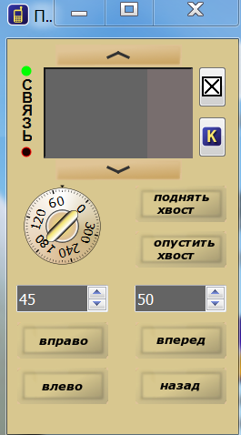
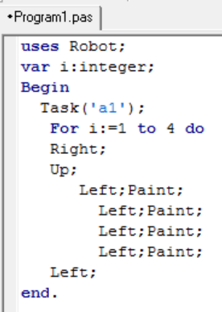

Оглавление

<a href="#_Toc454875898">Практическая работа№1 Простейшие алгоритмы	7</a>

<a href="#_Toc454875899">Практическая работа№2  Простейшие алгоритмы	10</a>

<a href="#_Toc454875900">Практическая работа №3 Составление линейных алгоритмов	15</a>

<a href="#_Toc454875901">Практическая работа №4 Составление алгоритмов	21</a>

<a href="#_Toc454875902">Практическая работа №5 Структура программы на языке Pascal	23</a>

<a href="#_Toc454875903">Практическая работа №6 Структура программы на языке Pascal	31</a>

<a href="#_Toc454875904">Практическая работа №7 Программирование алгоритмов	36</a>

<a href="#_Toc454875905">Практическая работа №8 Программирование алгоритмов	39</a>

<a href="#_Toc454875906">Практическая работа №9 Программирование алгоритмов	42</a>

<a href="#_Toc454875907">Список литературы	47</a>

	

<strong>Основы алгоритмизации</strong>

Цель:  ознакомиться  с  основными  принципами  алгоритмизации 

вычислительных  процессов, получить  практические  навыки  в  составлении алгоритмов решения практических задач.

  <strong>Основные сведения </strong>

<strong>Понятие алгоритма.</strong>

Единого определения понятия «алгоритм» нет. Приведем одно из возможных определений.

Алгоритм – это некоторый конечный набор рассчитанных на определенного исполнителя операций, в результате выполнения которых через определенное число шагов может быть достигнута поставленная цель или решена некоторая задача.

Пять важных свойств алгоритма – дискретность, конечность, детерминированность, результативность, массовость.

Дискретность – при выполнении алгоритм разбивается на конечную последовательность действий или шагов.

Конечность (завершаемость) – при корректно заданных исходных данных алгоритм должен завершать работу за конечное число шагов.

Детерминированность – это определенность (т.е. общепонятность и точность). В каждый момент времени следующий шаг работы однозначно определяется состоянием системы. Таким образом, алгоритм выдает один и тот же результат (ответ) для одних и тех же исходных данных, т.е. при повторениях алгоритма для одних и тех же исходных данных всегда получается одинаковый результат.

Результативность (направленность на получение искомого результата) – алгоритм должен завершаться определенными результатами.

Массовость (возможность использования различных данных при решении однотипных задач) – алгоритм должен быть применим к разным наборам исходных данных. Например, алгоритм решения квадратного уравнения должен быть применим к квадратным уравнениям с различными значениями коэффициентов.

Линейный алгоритм – алгоритм, в котором все действия (операции) выполняются один раз последовательно друг за другом

Способы записи (представления) алгоритма: 
<ul><li>формульный</li><li>словесный</li><li>табличный</li><li>с помощью блок-схем</li><li>с помощью программы</li></ul>
Наиболее наглядным способом записи алгоритма является изображение в виде последовательно блоков, каждый из которых предписывает выполнение определенных действий, то есть с помощью блок-схемы.

Составление алгоритмов графическим способом подчиняется двум ГОСТам:

1. ГОСТ 19.002-80, соответствует международному стандарту ИСО 2636-73. Регламентирует правила составления блок-схем.

2. ГОСТ 19.003-80, соответствует международному стандарту ИСО 1028-73. Регламентирует использование графических примитивов.
<table><tr><td>
Название
</td><td>
Символ (рисунок)
</td><td>
Выполняемая функция (пояснение)
</td></tr><tr><td>
1. Блок вычислений
</td><td>

</td><td>
Выполняет вычислительное действие или группу действий
</td></tr><tr><td>
2. Логический блок
</td><td>

</td><td>
Выбор направления выполнения алгоритма в зависимости от условия
</td></tr><tr><td>
3. Блоки ввода/вывода
</td><td>

</td><td>
Ввод или вывод данных вне зависимости от физического носителя
</td></tr><tr><td></td><td>

</td><td>
Вывод данных на печатающее устройство
</td></tr><tr><td>
4. Начало/конец (вход/выход)
</td><td>

</td><td>
Начало или конец программы, вход или выход в подпрограмму
</td></tr><tr><td>
5. Предопределенный процесс
</td><td>

</td><td>
Вычисления по стандартной или пользовательской подпрограмме
</td></tr><tr><td>
6. Блок модификации
</td><td>

</td><td>
Выполнение действий, изменяющих пункты алгоритма
</td></tr><tr><td>
7. Соединитель
</td><td>

</td><td>
Указание связи между прерванными линиями в пределах одной страницы
</td></tr><tr><td>
8. Межстраничный соединитель
</td><td>

</td><td>
Указание связи между частями схемы, расположенной на разных страницах
</td></tr></table>
 

Правила построения алгоритмов на языке блок-схем:

1. Блок-схема строится сверху вниз.

2. В любой блок-схеме имеется только один элемент, соответствующий началу алгоритма, и один элемент, соответствующий концу алгоритма.

3. Должен быть хотя бы один путь из начала блок-схемы к любому элементу.

4. Должен быть хотя бы один путь от каждого элемента блок-схемы в конец блок-схемы.

<strong>КуМир (Комплект Учебных МИРов)</strong> – система программирования, предназначенная для поддержки начальных курсов информатики и программирования в средней и высшей школе. 

Она разработана в Российской Академии наук в рамках плановых работ и распространяется свободно (на условиях лицензии GNU GPL v.2).

В 1985 году наш академик АП Ершов придумал язык русский алгоритмический язык, похожий на язык программирования ALGOL. Но поскольку в то время ещё не было компьютерной поддержки этого языка (те, кто преподавали информатику в первые её годы вхождения в школу, помнят, что всё делалось в безмашинном варианте, вручную, на бумаге), потом появились компьютеры с дисковой операционной системой (DOS). Но хорошей программной поддержки русского алгоритмического языка не было создано. Первый КуМир работал очень медленно, его интерфейс был очень примитивен. Про Кумир забыли, так как стали появляться другие, более удобные и функциональные языки. Теперь встал вопрос о том, что Кумир становится одним из (двух) языков, разрешенных на компьютерном ЕГЭ по информатике, то есть «поднимается» на уровень 10-11 классов. 
<h1>Практическая работа№1 Простейшие алгоритмы</h1>
Делайте скриншоты (кнопка клавиатуры PrtSc) выполненных заданий в текстовом (Word) файле <em>Фамилия_Практика </em>

<strong>Простейшие алгоритмы</strong>

Откройте программу «Кумир»

 

<strong>Исполнитель Кузнечик </strong>

<strong>Задание 1.</strong>
<ol><li>Откройте окно исполнителя Кузнечик.</li><li>Задание → Новое →</li></ol>

<ol><li>Откройте пульт для исполнителя Кузнечик. (для переноса программы в основное поле Кумира нажать кнопку  на пульте Кузнечика)</li><li>Используя пульт, напишите алгоритм для получения из числа 4 числа 25 (25 закрасить).</li></ol>
<em>Примечание: в этом задании Кузнечик умеет выполнять команды «вперед 5», «назад 2».</em>

Результат:

Программу сохранить как <em>Кузнечик25</em>. Сделайте скриншот и сохраните в файле <em>Фамилия_Практика .</em>

<strong>Задание 2.</strong>
<ol><li>Откройте окно исполнителя Кузнечик.</li><li>Задание → Новое →</li></ol>

<ol><li>Используя команды исполнителя Кузнечик, напишите алгоритм для получения из числа 33 числа 4 (без использования пульта).</li></ol>
Примечание: <em>в этом задании Кузнечик умеет выполнять команды «вперед 3», «назад 4».</em>

 Программу сохранить как <em>Кузнечик4.</em> Сделайте скриншот и сохраните в файле <em>Фамилия_Практика </em>
<h1>Практическая работа№2  Простейшие алгоритмы</h1>
Сделайте скриншоты (кнопка клавиатуры PrtSc) выполненных заданий в текстовом (Word) файле <em>Фамилия_Практика </em>

<strong>Исполнитель Черепаха</strong>

Настройка программы

Для того, чтобы начать писать программы, необходимо выбрать исполнителя. Это делается по команде меню: Вставка → Исполнитель Черепаха. После этого в окне программы появится сообщение «Использовать Черепаха». 

По команде: Вставка → алг-нач-кон вставим обязательные элементы будущей программы.

 Чтобы каждый раз не выполнять подобных действий сохраним шаблон по команде: Инструменты → Настройки → Новая программа: Взять из редактора. Также в настройках можно указать рабочую директорию для сохранения файлов.

Исполнитель

Вызов окна исполнителя «Черепаха» осуществляется по команде: Миры → Черепаха. Конкретная методика обучения не подразумевает использования окна «Пульт».

Выполнение программы

 Программа выполняется по команде: Выполнение → Выполнить непрерывно, или по клавише F9. Для выполнения программы по шагам: Выполнение → ШАГ, или по F8

Справочная система

 Система КуМир снабжена учебником: Инфо → Язык и система КуМир. Конкретно по исполнителю «Черепаха»: Инфо → Описание миров → Черепаха.     

Программа «Квадрат» построит квадрат со стороной 90

.

<strong>Задание 1.</strong> Нарисовать прямоугольник со сторонами 50 на 90.

Сохранить как <em>Задание_ 1Черепаха. </em>.

 Сделайте скриншот и сохраните в файле <em>Фамилия_Практика </em>

<strong>Задание 2.</strong> Написать программу построения квадрата со стороной 110 точек. 

<em>Недостатки: Многократно повторяются одни и те же команды; ограничение при рисовании сложных фигур</em>.

Изменить программу так, чтобы исключить повторение команд. 

Используйте команду Цикл «N раз».

<em>Использование цикла значительно сокращает программу, однако для того, чтобы построить еще один квадрат, необходимо вновь создавать цикл</em>.

Произвольный прямоугольник со стороной 90 и х: 

 Посмотреть для стороны х=140 и х=110.

<em>Использование переменной-параметра, передающего размер стороны квадрата, позволит не только создавать неограниченное количество фигур, но и многократно менять размеры квадрата</em>. 

Сделайте скриншот и сохраните в файле <em>Фамилия_Практика </em>

<strong>Задание 3.</strong> Измените программу так, чтобы симметрично построить еще один квадрат:

Одно из решений:

Сделайте скриншот и сохраните в файле <em>Фамилия_Практика </em>

Задание 4. Написать программу для выполнения рисунка:

Если возникают затруднения, то воспользуйтесь пультом управления черепашкой: Миры → Черепаха-пульт:

Для переноса программы из пульта в область поля Кумира воспользуйтесь кнопкой на пульте .

Одно из решений: 

. Сделайте скриншот и сохраните в файле <em>Фамилия_Практика </em>
<h1>Практическая работа №3 <strong>Составление линейных алгоритмов</strong></h1>
Делайте скриншоты (кнопка клавиатуры PrtSc) выполненных заданий в текстовом (Word) файле <em>Фамилия_Практика </em>

<strong>Исполнитель Робот</strong>

Этапы создания алгоритма

1.Командами Инструменты → Редактировать стартовую обстановку нарисовать на поле Робота стены и установить Робота в начальное положение.

2.Командами Робот → Сменить стартовую обстановку сохранить новую обстановку.

3.Командами Вставка → Использовать Робот указать исполнителя.

4.В окне документа записать алгоритм, используя меню Вставка.

5.Командами Выполнение → выполнить непрерывно (или по шагам) запустить алгоритм.

6.Рассмотреть результат выполнения алгоритма и при необходимости произвести его отладку.

Поле программных кодов Робота имеет вид<strong>. </strong>

В этом поле будем писать программу робота. Робот понимает 5 команд: <strong><em>вправо, влево, вверх, вниз, закрасить.</em></strong> 

Робот движется при исполнении программы в поле:

<strong>		</strong>

Составим программу «Ход конем»: попасть из точки А в точку Б → 

Составьте алгоритм →

При исполнении программы получите результат:

    <strong>					</strong>
<ol><li>         Составить простейший алгоритм на вычисление среднего арифметического 3 чисел. Данные вводятся с клавиатуры.</li></ol>

получите среднее арифметическое для чисел (сделайте скриншоты всех ответов в текстовом файле <em>Фамилия_Практика 4</em>):
<ul><li>18; 21, 45</li><li>8; 2; 3</li><li>125; 345; 568</li></ul><ol><li>Составить программу на нахождение гипотенузы в прямоугольном треугольнике по введенным с клавиатуры катетам. ()</li></ol>

вычислите гипотенузу для случаев (сделайте скриншоты всех ответов в текстовом файле <em>Фамилия_Практика </em>):
<ul><li>15; 18</li><li>6;8</li><li>12; 16</li></ul><ol><li>Составить программу на вычисление заданного с клавиатуры синуса угла (напоминаем что sin α надо перевести в радианную меру: , где пи=3,14</li></ol>

посчитать синусы (сделайте скриншоты всех ответов в текстовом файле <em>Фамилия_Практика 4</em>): 30; 45; 90 градусов

<strong><em>Задание 1.</em></strong>

Вкладка Робот → Сменить стартовую обстановку: robot → папка 01 → С.

Составим программу, состоящую из нескольких строк, для прохождения обстановки (робота из точки А в точку В)

<strong>					</strong>           

В одной строке команда от команды отделяется знаком «;». 

<strong>Задания по закрашиванию клеток </strong>

<strong>Задание 1.</strong>

robot → папка 01 → О

Результат:

Вкладка Программа → Сохраните как <em>Решение_О01</em>

Попробуйте использовать цикл:

Вкладка Программа → Сохраните как <em>Цикл_О01</em>. . Сделайте скриншот и сохраните в <strong>файле <em>Фамилия_Практика </em></strong>

<strong>Задание 2.</strong>

Вкладка Робот → Сменить стартовую обстановку: robot → папка 01 → G

Результат сохраните как <em>Решение_</em> <em>G01.</em>

Сделайте скриншот и сохраните в <strong>файле <em>Фамилия_Практика </em></strong>
<h1>Практическая работа №4<strong> Составление алгоритмов</strong></h1>
Делайте скриншоты (кнопка клавиатуры PrtSc) выполненных заданий в текстовом (Word) файле <em>Фамилия_Практика </em>

<strong>Редактирование стартовой обстановки</strong>

<strong>Задание 1. </strong>Редактирование стартовой обстановки.

Командами Инструменты → Редактировать стартовую обстановку нарисовать на поле Робота стены и установить Робота в начальное положение.

Сохранить стартовую обстановку как <em>Ким2009.</em>

Для данной стартовой обстановки составить алгоритм, используя ветвления, циклы. Например:

Сделайте скриншот и сохраните в <strong>файле <em>Фамилия_Практика </em></strong>

<strong>Задание 2.</strong>Создать стартовую остановку и назвать ее <em>8х8квадрат </em>(Робот находится в верхнем левом углу поля. Стен и закрашенных клеток нет.) 

Составьте алгоритм (используя вспомогательные алгоритмы), который закрашивает в шахматном порядке квадрат 8 х 8. Конечное положение Робота может быть произвольным.

Например:

Сделайте скриншот и сохраните в <strong>файле <em>Фамилия_Практика </em></strong>

Практическая работа №5 Структура программы на языке Pascal 

1.  Основные сведения 

<strong>Первая версия языка Паскаль была разработана в 1968 году.</strong> Ее разработчиком является швейцарский ученый Никлаус Вирт. Свое название язык получил в честь создателя первой механической вычислительной машины француза Блеза Паскаля. На основе языка Паскаль в 1985 г. фирма Borland выпустила версию Turbo Pascal версии 3.0. С этого времени язык Паскаль используется во всем мире в учебных заведениях в качестве первого изучаемого языка программирования. 

Одно из достоинств языка – лаконичность. Язык был создан в то время, когда языков высокого уровня было не много, к тому же все они, в отличие от языка Pascal, были созданы для решения конкретных задач. Приспособлен для обучения программированию. Основан на ряде фундаментальных понятий структурного программирования. Большой набор поддерживаемых структурных типов данных. Распространенность языка обеспечила ему большую базу различных программных систем. Надежность программ, обеспечивающаяся избыточностью информации в исходном коде. Послужил основой для разработки других языков программирования (Delphi).

<strong>Это одни из самых старых языков программирования.</strong> Его создатели – Джон Кемени и Том Куртц, работавшие в Дортмундском колледже в 1964 году. Свой язык они назвали по первым буквам слов «Beginner’s All Purpose Symbolic Instructions Code». <strong>Интерпретатор</strong> Basic был первым программным продуктом фирмы Microsoft, основанной Полом Аленом и Уильямом Гейтсом в 1975 году. В дальнейшем он не только поставлялся как программа, но и зашивался в ПЗУ компьютеров.

Система Pascal ABC основана на языке Delphi Pascal и призвана осуществить постепенный переход от простейших программ к объектно-ориентированному программированию. 

<strong>Наиболее часто встречающиеся ошибки при работе в системе программирования Pascal ABC:</strong>

·	«неожиданный символ» - символ введен не с регистра английских букв;

·	«ожидался символ &quot;точка&quot;, &quot;точка с запятой&quot;, Begin и др.»- отсутствует необходимый символ или команда;

·	«неизвестное имя» - неправильно введена команда;

·	«ошибка ввода» - неверно указано имя файла;

·	«ожидался конец файла» - ошибки в команде end.

&quot;.	

<strong>Исполнитель Робот в среде Паскаль АВС</strong>

Команды исполнителя Робот содержатся в модуле Robot: 

Right – перемещает Робота вправо;

Left – перемещает Робота влево;

Up – перемещает Робота вверх; 

Down – перемещает Робота вниз; 

Paint – закрашивает текущую ячейку;

WallFromLeft – возвращает True если слева от Робота стена; 

WallFromRight – возвращает True если справа от Робота стена; 

WallFromUp – возвращает True если сверху от Робота стена; 

WallFromDown – возвращает True если снизу от Робота стена; 

FreeFromLeft – возвращает True если слева от Робота свободно; 

FreeFromRight – возвращает True если справа от Робота свободно; 

FreeFromUp – возвращает True если сверху от Робота свободно; 

FreeFromDown – возвращает True если снизу от Робота свободно; 

CellIsPainted – возвращает True если ячейка, в которой находится Робот, закрашена; 

CellIsFree – возвращает True если ячейка, в которой находится Робот, не закрашена. 

 

Для вызова задания для исполнителя Робот используется следующий шаблон программы:

<strong>uses Robot;</strong>

<strong>Begin </strong>

<strong>  Task('c1'); </strong>

<strong>end. </strong>

Здесь Task - процедура, содержащаяся в модуле Robot и вызывающая задание с указанным именем.

Имеются следующие группы заданий для исполнителя Робот:

a – вводные задания;

c – цикл с параметром;

if – логические выражения;

w – циклы с условием;

сif – циклы + логические выражения;

count – переменные-счетчики;

cc – вложенные циклы;

p – процедуры без параметров;

pp – процедуры с параметрами.

Для создания произвольного поля размера 9 x 11 используется процедура StandardField без параметров, а для создания поля размера N x M - процедура Field(N,M). Робот при этом помещается в центр поля.

Исполнитель Робот действует на прямоугольном клеточном поле. Между некоторыми клетками, а также по периметру поля находятся стены. Основная цель Робота – закрасить указанные клетки и переместиться в конечную клетку.

Большой желтый квадрат изображает Робота, маленький желтый квадрат в левом верхнем углу клетки - конечное положение Робота, черными точками помечены клетки, которые надо закрасить.

<strong>Задание 1.</strong>

Записали программу для получения задания <strong>Task('a1')</strong>

→ кнопка клавиатуры F9 или кнопка :

→ 

Составить программу для решения задания с использованием языка Паскаль.

Например, два варианта:

   или 

Проверку на правильность написания осуществлять сначала тестируя при нажатии кнопки  интерфейса Паскаля АВС, а затем  в интерфейсе задания.

Сохранить как <strong><em>Program_а1.pas.</em> Сделайте скриншот (кнопка клавиатуры PrtSc) выполненного задания в текстовом (Word) файле <em>Фамилия_Практика</em>.</strong>

<strong>Задание 2.</strong>

<strong>Записали программу для получения задания Task('a2')</strong>

 → 

Составить программу для решения задания с использованием языка Паскаль.

Например,

Сохранить как <strong><em>Program_а2.pas..</em> Сделайте скриншот (кнопка клавиатуры PrtSc) выполненного задания в текстовом (Word) файле <em>Фамилия_Практика</em></strong>

<strong>Задание 3.</strong>

<strong>записали программу для получения задания Task('с1')</strong>

Выполнить задание и сохранить как сохранить как <strong><em>Program_с1.pas.</em> Сделайте скриншот (кнопка клавиатуры PrtSc) выполненного задания в текстовом (Word) файле <em>Фамилия_Практика</em>.</strong>

<strong>Задание 4. Выполнить задание сс1 и сохранить как сохранить как</strong> <strong><em>Program_сс1.pas.</em></strong>

Сделайте скриншот (кнопка клавиатуры PrtSc) выполненного задания в текстовом (Word) файле <em>Фамилия_Практика</em>.
<h1>Практическая работа №6 Структура программы на языке Pascal </h1>
<strong>Исполнитель Чертежник в среде Паскаль АВС</strong>

Команды исполнителя Чертежник содержатся в модуле Drawman: 

ToPoint(x,y)– перемещает перо Чертежника в точку (x,y);

OnVector(a,b)– перемещает перо Чертежника на вектор (a,b);

PenUp – поднимает перо Чертежника;

PenDown – опускает перо Чертежника.

Для вызова задания для исполнителя Чертежник используется следующий шаблон программы:

<strong>В конце программы перо Чертежника должно быть поднято и находиться в начале координат.</strong>

Здесь Task - процедура, содержащаяся в модуле Drawman и вызывающая задание с указанным именем.

Имеются следующие группы заданий для исполнителя Чертежник:

a – вводные задания;

c – цикл с параметром;

cc – вложенные циклы;

p – процедуры без параметров;

pp – процедуры с параметрами.

Для создания произвольного поля размера 20 x 30 используется процедура StandardField без параметров, а для создания поля размера N x M - процедура Field(N,M).

Исполнитель Чертежник<em> </em>предназначен для построения рисунков и чертежей на плоскости с координатами. Чертежник имеет перо, которое он может поднимать, опускать и перемещать. При перемещении опущенного пера за ним остается след.

Маленький квадрат изображает Чертежника, красным цветом изображены отрезки, которые надо нарисовать, а синим - уже нарисованные Чертежником отрезки. Когда перо Чертежника опущено, он изображается квадратом меньшего размера.

 <strong>Задание 1. </strong>Выполните а1 и сохраните как <em>Drawman_а1. pas.</em>

<strong> </strong>

В конце программы перо Чертежника должно быть поднято и находиться в начале координат.

<strong>Задание 2. </strong>Выполните а2 и сохраните как <em>Drawman_а2. pas.</em>

<strong> </strong>

В конце программы перо Чертежника должно быть поднято и находиться в начале координат.

Например:

<strong>Задание 3. </strong>Выполните с1 и сохраните как <em>Drawman_с1. pas.</em>

Например:

Сделайте скриншот (кнопка клавиатуры PrtSc) выполненного задания в текстовом (Word) файле <em>Фамилия_Практика</em>.

<strong>Задание 5. Выполните р2 и сохраните как <em>Drawman_р2. pas.</em></strong>

Сделайте скриншот (кнопка клавиатуры PrtSc) выполненного задания в текстовом (Word) файле <em>Фамилия_Практика</em>.
<h1>Практическая работа №7 Программирование алгоритмов</h1>
1.  Основные сведения 

Программы с линейной структурой состоят из операторов присваивания, ввода и вывода. 

Основные операторы

Основным элементарным действием в вычислительных алгоритмах является присваивание значения переменной величине. Если значение константы определено видом ее записи, то пере-

менная величина получает конкретное значение только в результате присваивания, которое может осуществляться двумя способами: с помощью команды присваивания и с помощью команды ввода.

Оператор присваивания :      - это основной оператор любого языка программирования. Данный оператор позволяет поместить определенное значение в необходимую вам переменную. 

<strong>Раздел описания переменных начинается со слова Var</strong> , за которым идет список имен однотипных переменных через запятую. В языке Паскаль существует два числовых типа величин: вещественный (Real) и целый (Integer). Имена переменных составляются из латинских букв и цифр, причем первым символом - буква.

Практически любая программа кроме всего прочего показывает на экране какие-нибудь числа или слова. Оператор, с которым мы познакомимся, приказывает компьютеру изобразить на экране монитора ту или иную информацию, состоящую из символов. Эту задачу выполняет процедура <strong>Write. </strong>То, что нужно изобразить, положено заключать в круглые скобки. 

<strong>Раздел операторов – основная часть программы. </strong>Начало и конец раздела отмечаются служебными словами BEGIN и END, которые являются операторными скобками. Между этими словами помещаются все команды алгоритма, записанные   на языке Паскаль (операторы). Разделителем операторов является точка с запятой. В самом конце программы ставится точка.

<strong>Ввод исходных данных с клавиатуры происходит по оператору READ или READLN (читать).</strong> Оператор READLN отличается от READ только тем, что после ввода данных курсор перемещается в начало новой строки. 

<strong>Задание 1. Даны катеты прямоугольного треугольника a и b. Найти его площадь S=0,5*a*b и периметр P=a+b+с = a + b + √(a2 + b2). Осуществите ввод чисел 3 и 4. <em>Сохранить как Program_ n1.</em></strong>

Например:

Writeln(' P = ',P: 10: 5) - Выдаст в консоль значение Р, всего 10 знаков, из них 5 знаков после десятичной запятой (точки)

<strong>Сделайте скриншот (кнопка клавиатуры PrtSc) выполненного задания в текстовом (Word) файле <em>Фамилия_Практика</em>.</strong>

<strong>Задание 2. </strong>Составьте программу вычисления площади треугольника по формуле Герона   , где полупериметр вычисляется по формуле , если даны длины сторон треугольника. Подставить следующие варианты сторон 4,5,6; 3,4,5. <em>Сохранить как Program_ n2.</em> Сделайте скриншот (кнопка клавиатуры PrtSc) выполненного задания в текстовом (Word) файле <em>Фамилия_Практика</em>.

<h1>Практическая работа №8 Программирование алгоритмов</h1>
<strong>Сделайте скриншот (</strong>кнопка клавиатуры PrtSc) выполненного задания в текстовом (Word) файле<strong> <em>Фамилия_Практика</em>.</strong>

<strong>Задание 1  Вывести на экран сообщение «Hello World!»</strong>

Формулировка. Вывести на экран сообщение «Hello, World!».

Некоторые учебные курсы по программированию рассматривают эту задачу как самую первую при изучении конкретного языка или основ программирования.

Решение. Эта задача включает в себя лишь демонстрацию использования оператора вывода write (или writeln), который будет единственным в теле нашей маленькой программы. С помощью него мы будем осуществлять вывод на экран константы 'Hello World!' типа string (или, как допускается говорить, строковой константы). В данном случае будем использовать оператор writeln.

Напомню, что при использовании оператора write курсор останется в той же строке, в которой осуществлялся вывод, и будет находиться на одну позицию правее восклицательного знака во фразе «Hello World!», а при использовании оператора writeln – на первой позиции слева в следующей строке.

Код: 
<table><tr><td>
program HelloWorld;

begin

  writeln('Hello World!')

end.
</td></tr></table>
<strong>Задание<em> </em>2  Вывести на экран три числа в порядке, обратном вводу</strong>

Формулировка. Вывести на экран три введенных с клавиатуры числа в порядке, обратном их вводу.

Другими словами, мы ввели с клавиатуры три числа (сначала первое, потом второе и третье), и после этого единственное, что нам нужно сделать – это вывести третье, затем второе и первое.

Решение. Так как с клавиатуры вводится три числа, необходимо завести три переменные. Обозначим их как a, b и c. Ввиду того, что нам ничего не сказано о том, в каком отрезке могут располагаться введенные числа, мы возьмем тип integer, так как он охватывает и положительные, и отрицательные числа в некотором диапазоне (от –2147483648 до 2147483647). Затем нам нужно использовать оператор вывода write (writeln), в списке аргументов которого (напомним, что список аргументов write (writeln) может содержать не только переменные, но и константы и арифметические выражения) эти переменные будут находиться в обратном порядке. В данном случае будем использовать оператор writeln, который после вывода результата переведет курсор на следующую строку:

writeln(c, b, a);

Однако если мы оставим его в таком виде, то увидим, что при выводе между переменными не будет никакого пробела, и они будут слеплены и визуально смотреться как одно число. Это связано с тем, что при вводе мы использовали пробелы для разделения чисел, а сами пробелы никаким образом не влияют на содержимое переменных, которые будут последовательно выведены оператором writeln без каких-либо дополнений. Чтобы избежать этого, нам нужно добавить в список аргументов writeln две текстовые константы-пробелы. Проще говоря, пробельная константа – это символ пробела, заключенный в одиночные апострофы (апостроф – символ «'»). Первая константа будет разделять переменные a и b, вторая – b и c. В результате наш оператор вывода будет таким:

writeln(c, ' ', b, ' ', a);

Теперь он работает так: выводит переменную c, затем одиночный символ пробела, затем переменную b, потом еще один символ пробела и, наконец, переменную a.

Код: 
<table><tr><td>
program WriteThree;

var

  a, b, c: integer;

begin

  readln(a, b, c);

  writeln(c, ' ', b, ' ', a)

end.
</td></tr></table><h1>Практическая работа №9 Программирование алгоритмов</h1>
<strong>Сделайте скриншот (</strong>кнопка клавиатуры PrtSc) выполненного задания в текстовом (Word) <strong>файле <em>Фамилия_Практика</em>.</strong>

<strong>Задача № 1  Вывести на экран квадрат введенного числа</strong>

Формулировка. Дано натуральное число меньше 256. Сформировать число, представляющее собой его квадрат.

Решение. Для ввода числа нам необходима одна переменная. Обозначим эту переменную как a. Так как нам ничего не сообщается о необходимости сохранить исходное число, то для получения квадрата мы можем использовать ту же самую переменную, в которую считывали число с клавиатуры.

В условии задачи дается ограничитель величины вводимого числа – фраза «меньше 256». Это означает, что оно может быть охвачено типом byte. Но что произойдет, если в переменную a будет введено число 255, и затем мы попытаемся присвоить ей его квадрат, равный 65025? Естественно, это вызовет переполнение типа данных, так как используемой для переменной a ячейки памяти не хватит для того, чтобы вместить число 65025. Значит, для ее описания мы должны использовать более емкий числовой тип. При этом типом минимальной размерности, охватывающим данный отрезок (от 1 (это 12) до 65025), является тип word. Его мы и будем использовать при описании a.

Далее нужно сформировать в переменной a квадрат. Для этого присвоим ей ее прежнее значение, умноженное само на себя:

a := a * a;

Теперь остается вывести результат на экран. Для этого будем использовать оператор writeln.

Код: 
<table><tr><td>
program SqrOfNum;

var

  a: word;

begin

  readln(a);

  a := a * a;

  writeln(a)

end.
</td></tr></table>
<strong>Задача № 2  Получить реверсную запись трехзначного числа</strong>

Формулировка. Сформировать число, представляющее собой реверсную (обратную в порядке следования разрядов) запись заданного трехзначного числа. Например, для числа 341 таким будет 143.

Давайте разберемся с условием. В нашем случае с клавиатуры вводится некоторое трехзначное число (трехзначными называются числа, в записи которых три разряда (то есть три цифры), например: 115, 263, 749 и т. д.). Нам необходимо получить в некоторой переменной число, которое будет представлять собой реверсную запись введенного числа. Другими словами, нам нужно перевернуть введенное число «задом наперед», представить результат в некоторой переменной и вывести его на экран.

Решение. Определимся с выбором переменных и их количеством. Ясно, что одна переменная нужна для записи введенного числа с клавиатуры, мы обозначим ее как n. Так как нам нужно переставить разряды числа n в некотором порядке, следует для каждого из них также предусмотреть отдельные переменные. Обозначим их как a (для разряда единиц), b (для разряда десятков) и c (для разряда сотен).

Теперь можно начать запись самого алгоритма. Будем разбирать его поэтапно:

Вводим число n;

Работаем с разрядами числа n. Как известно, последний разряд любого числа в десятичной системе счисления – это остаток от деления этого числа на 10. В терминах языка Pascal это означает, что для получения разряда единиц нам необходимо присвоить переменной a остаток от деления числа n на 10. Этому шагу соответствует следующий оператор:

a := n mod 10;

Получив разряд единиц, мы должны отбросить его, чтобы иметь возможность продолжить работу с разрядом десятков. Для этого разделим число n на 10. В терминах Pascal, опять же, это означает: присвоить переменной n результат от деления без остатка числа n на 10. Это мы сделаем с помощью оператора

n := n div 10;

Очевидно, что после выполнения п. 2 в переменной n будет храниться двухзначное число, состоящее из разряда сотен и разряда десятков исходного. Теперь, выполнив те же самые действия еще раз, мы получим разряд десятков исходного числа, но его уже нужно присваивать переменной b.

В результате в переменной n будет храниться однозначное число – разряд сотен исходного числа. Мы можем без дополнительных действий присвоить его переменной c.

Все полученные в переменных числа – однозначные. Теперь переменная n нам больше не нужна, и в ней нужно сформировать число-результат, в котором a будет находиться в разряде сотен, b – десятков, c – единиц. Легко понять, что для этого нам следует умножить a на 100, прибавить к полученному числу b, умноженное на 10 и c без изменения, и весь этот результат присвоить переменной c. Это можно записать так:

n := 100 * a + 10 * b + c;

Далее остается только вывести полученное число на экран.

Код: 
<table><tr><td>
program ReverseNum;

var

  n, a, b, c: word;

begin

  readln(n);

  a := n mod 10;

  n := n div 10;

  b := n mod 10;

  n := n div 10;

  c := n;

  n := 100 * a + 10 * b + c;

  writeln(n)

end.
</td></tr></table>
Проверим работу программы на произвольном варианте введенных данных. Для этого выполним ее «ручную прокрутку», проделав с введенным числом те же действия, которые должен выполнить алгоритм.

Пусть пользователем введено число 514. Покажем в таблице, какие значения будут принимать переменные после выполнения соответствующих строк. При этом прочерк означает, что значение переменных на данном шаге не определено, а красным цветом выделены переменные, которые изменяются:
<table><tr><td>
№ строки
</td><td>
n
</td><td>
a
</td><td>
b
</td><td>
c
</td></tr><tr><td>
7
</td><td>
514
</td><td>
—
</td><td>
—
</td><td>
—
</td></tr><tr><td>
8
</td><td>
514
</td><td>
4
</td><td>
—
</td><td>
—
</td></tr><tr><td>
9
</td><td>
51
</td><td>
4
</td><td>
—
</td><td>
—
</td></tr><tr><td>
10
</td><td>
51
</td><td>
4
</td><td>
1
</td><td>
—
</td></tr><tr><td>
11
</td><td>
5
</td><td>
4
</td><td>
1
</td><td>
—
</td></tr><tr><td>
12
</td><td>
5
</td><td>
4
</td><td>
1
</td><td>
5
</td></tr><tr><td>
13
</td><td>
415
</td><td>
4
</td><td>
1
</td><td>
5
</td></tr></table>
 Нетрудно понять, что написанная программа будет выводить правильный ответ для любого заданного трехзначного числа, так как в соответствии с алгоритмом заполнение данной таблицы возможно лишь единственным образом. Это значит, что мы можем представить число в виде абстрактного трехзначного числа <em>xyz</em>, (в нем каждая буква должна быть заменена на любое число от 0 до 9, конечно, за исключением тех случаев, когда оно перестает быть трехзначным), и работая с разрядами этого числа, показать, что в результате работы ответом будет число <em>zyx</em>.
<h1>Список литературы</h1><ol><li>Семакин И.Г. Основы алгоритмизации и программирования.  Учебник для студентов учреждений среднего профессионального образования — 3-е изд., стер. — М. : Издательский центр «Академия», 2013. 400 с.</li><li>Семакин И., Шестаков А. Основы алгоритмизации и</li></ol>
программирования. Практикум. Учебное пособие М.: Академия, 2013г. – 144с.
<ol><li>Голицына О.Л., Попов И.И. Основы алгоритмизации и</li></ol>
программирования: учебное пособие. М.: Форум, 2014г. – 432с.
<ol><li>С. Скиена. Алгоритмы. Руководство по разработке. СПб.: БХВ-</li></ol>
Петербург, 2011г. – 720с.
<ol><li>Т.Х. Кормен. Алгоритмы. Вводный курс. М.: Вильямс. 2014г. – 208с.</li><li>Кнут Д. Искусство программирования. Том 1. Основные алгоритмы.</li></ol>
М.: Вильямс, 2010г.-720с.
