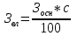

Оглавление

<a href="#_Toc454893476">Цели курсовой работы 2</a>

<a href="#_Toc454893477">Тематика курсовых работ 2</a>

<a href="#_Toc454893478">1 ОБЩАЯ ХАРАКТЕРИСТИКА ПРОЦЕССА ПРОЕКТИРОВАНИЯ ИНТЕРНЕТ-ПРИЛОЖЕНИЯ 2</a>

<a href="#_Toc454893479">2 ЗАДАНИЕ НА КУРСОВУЮ РАБОТУ 3</a>

<a href="#_Toc454893480">3 ОСНОВНЫЕ РАЗДЕЛЫ СОДЕРЖАНИЯ КУРСОВОЙ РАБОТЫ, ПОРЯДОК И ПОСЛЕДОВАТЕЛЬНОСТЬ ВЫПОЛНЕНИЯ 4</a>

<a href="#_Toc454893481">4. РАЗРАБОТКА ФУНКЦИОНАЛЬНОЙ МОДЕЛИ ИНТС 5</a>

<a href="#_Toc454893482">5. ИСХОДНЫЕ ДАННЫЕ ДЛЯ ПРОЕКТИРОВАНИЯ, СТАНДАРТЫ 6</a>

<a href="#_Toc454893483">6. ПРОЕКТИРОВАНИЕ ПОЛЬЗОВАТЕЛЬСКОГО ИНТЕРФЕЙСА 7</a>

<a href="#_Toc454893484">7. ПОСТРОЕНИЕ ИНФОРМАЦИОННО-ЛОГИЧЕСКОЙ МОДЕЛИ БАЗЫ ДАННЫХ 8</a>

<a href="#_Toc454893485">8. РАСПРЕДЕЛЕННАЯ ОБРАБОТКА ДАННЫХ 11</a>

<a href="#_Toc454893486">9. СТРУКТУРА ПРОГРАММНЫХ МОДУЛЕЙ, РАЗРАБОТКА АЛГОРИТМОВ, ЛОГИЧЕСКИЙ АНАЛИЗ СТРУКТУР ИНТС
	11</a>

<a href="#_Toc454893487">10. РАЗРАБОТКА МОДЕЛЕЙ ЗАЩИТЫ ДАННЫХ 14</a>

<a href="#_Toc454893488">11. АВТОМАТИЗАЦИЯ ПРОЦЕССА ПРОЕКТИРОВАНИЯ С ИСПОЛЬЗОВАНИЕМ CASE-ТЕХНОЛОГИЙ 15</a>

<a href="#_Toc454893489">12. ТРЕБОВАНИЯ К ОФОРМЛЕНИЮ ПОЯСНИТЕЛЬНОЙ ЗАПИСКИ 17</a>

<a href="#_Toc454893490">13. ПОРЯДОК ЗАЩИТЫ И ОТВЕТСТВЕННОСТЬ СТУДЕНТА ЗА ВЫПОЛНЕНИЕ ЗАДАНИЯ КУРСОВОЙ РАБОТЫ 20</a>

<a href="#_Toc454893491">14. СПИСОК ЛИТЕРАТУРЫ 20</a>

<a href="#_Toc454893492">ПРИМЕРНЫЙ СПИСОК ТЕМ КУРСОВЫХ РАБОТ ПО ДИСЦИПЛИНЕ «Технология разработки программного
	обеспечения» 22</a>

<h1>Цели курсовой работы</h1>

<em>Целью курсовой работы</em> является закрепление теоретических знаний, а также практических навыков проектирования
	и разработки Web-сайтов, полученных при изучении дисциплины «Технология разработки программного обеспечения» и
	смежных с ней дисциплин.

Курсовая работа представляет комплексную проектную, практическую, внедренческую разработку, которая в дальнейшем
	может стать основой выпускной дипломной работы. 

<h1>Тематика курсовых работ</h1>

<em>Темы курсовых работ</em> можно разбить на несколько групп:

<ol>
	<li>Проектирование и разработка интерактивных и динамических Web-сайтов для конкретных предметных областей.</li>
	<li>Возможности интеграции средств разработки Web-сайтов с системами управления и администрирования баз данных.</li>
	<li>Сравнительный анализ средств автоматизации проектирования Web-сайтов.</li>
	<li>Научно-исследовательские темы по любому из направлений по тематике «Web-дизайн и Web- программирование».</li>
</ol>
<h1>1. ОБЩАЯ ХАРАКТЕРИСТИКА ПРОЦЕССА ПРОЕКТИРОВАНИЯ ИНТЕРНЕТ-ПРИЛОЖЕНИЯ</h1>

Современные информационные технологии предоставляют широкий набор способов реализации Интернет-приложений, выбор
	которых осуществляется на основе требований со стороны предполагаемых пользователей, которые, как правило,
	изменяются в процессе разработки. Для теории принятия решений процесс проектирования системы – это процесс принятия
	проектно-конструкторских решений, направленных на получение версии системы, удовлетворяющей требования
	заказчика.

Под <em>проектом </em>будем понимать проектно-конструкторскую и технологическую документацию, в которой представлено
	описание проектных решений по созданию и эксплуатации системы в конкретной программно-технической среде.

Под <em>проектированием Интернет-системы (ИнтС) </em>понимается процесс преобразования входной информации об объекте
	проектирования, о методах проектирования и об опыте проектирования объектов аналогичного назначения в проект ИнтС. С
	этой точки зрения проектирование ИнтС сводится к последовательной формализации проектных решений на различных
	стадиях жизненного цикла системы: предпроектного анализа требований, технического и рабочего проектирования,
	внедрения и эксплуатации ИнтС.

Осуществление проектирования системы предполагает использование проектировщиками определенной технологии
	проектирования, соответствующей масштабу и особенностям разрабатываемого проекта.

<em>Технология проектирования Интернет-системы – </em>это совокупность методологии и средств проектирования системы,
	а также методов и средств организации проектирования (управление процессом создания и модернизации проекта системы).

В основе технологии проектирования лежит технологический процесс, который определяет действия, их последовательность,
	состав исполнителей, средства и ресурсы, требуемые для выполнения этих действий. 

<em>Технологический процесс </em>проектирования системы в целом делится на совокупность последовательно-параллельных,
	связанных и соподчиненных цепочек действий, каждое из которых может иметь свой предмет.

Проектирование системы – трудоемкий, длительный и динамический процесс. Технологии проектирования, применяемые в
	настоящее время, предполагают поэтапную разработку системы. Этапы по общности могут разделятся в стадии. 

Совокупность стадий и этапов, которые проходит система в своем развитии с момента принятия решения о создании системы
	до момента прекращения функционирования системы, называется <em>жизненным циклом системы.</em>

Суть содержания жизненного цикла разработки системы в различных подходах одинакова и сводится к выполнению следующих
	стадий: 

<em>Планирование и анализ требований </em>(предпроектная стадия) – системный анализ. Исследование и анализ
	существующей системы, определение требований к создаваемой системе, оформление технико-экономического обоснования и
	технического задания на разработку системы.

<em>Проектирование </em>(техническое проектирование, логическое проектирование).

Разработка в соответствии со сформулированными требованиями состава автоматизируемых функций и состава обеспечивающих
	подсистем, оформление технического проекта системы.

<em>Реализация проекта </em>(рабочее проектирование, физическое проектирование, программирование). Разработка и
	настройка программ, наполнение баз данных, создание рабочих инструкций для персонала, оформление рабочего проекта.

<em>Внедрение </em>(тестирование, опытная эксплуатация). Комплексная отладка подсистем, обучение персонала, поэтапное
	внедрение системы в эксплуатацию, оформление акта о приемо-сдаточных испытаниях системы.

<em>Эксплуатация системы </em>(сопровождение, модернизация). Сбор рекламаций и статистики о функционировании системы,
	исправление ошибок и недоработок, оформление требований к модернизации системы и ее выполнение. 

<h1>2. ЗАДАНИЕ НА КУРСОВУЮ РАБОТУ </h1>

Курсовая работа представляет собой самостоятельную разработку программной, аппаратной или технологической компоненты
	ИС.

Основные этапы выполнения курсовой работы являются <strong>контрольными заданиями</strong>, информирующими
	преподавателя о ходе выполнения работы студентом. 

В курсовой работе, как правило, должны быть представлены результаты отладки проектируемых компонент в средствах
	выбранной CASE-среды.

Тема курсовой работы утверждается в начале семестра на установочных консультациях.

По мере выполнения этапов курсовой работы, студенты в часы консультаций представляют материалы преподавателю, и в
	ходе диалога уточняют и формируют соответствующие разделы (консультации могут осуществляться через электронную
	почту). 

Студент обязан выполнять <em>этапы курсовой работы</em> в соответствии со следующим графиком:

– постановка задачи, анализ решений и функциональная разработка системы;

– разработка информационного обеспечения, функциональных модулей, интерфейсов;

– отладочные работы, оформление пояснительной записки, графических материалов;

<em>Защита</em> курсовой работы проводится по утвержденному графику.

<h1>3. ОСНОВНЫЕ РАЗДЕЛЫ СОДЕРЖАНИЯ КУРСОВОЙ РАБОТЫ, ПОРЯДОК И ПОСЛЕДОВАТЕЛЬНОСТЬ ВЫПОЛНЕНИЯ
</h1>

Пояснительная записка курсовой работы должна содержать следующие элементы:

<ol>
	<li>Титульный лист.</li>
	<li>Лист задания.</li>
	<li>Оглавление.</li>
	<li>Введение.</li>
	<li>Теоретическую часть.</li>
	<li>Практическую часть.</li>
	<li>Библиографию и список ссылок на Интернет-ресурсы.</li>
	<li>Приложения.</li>
	<li>Во<em> введении</em> обосновывается актуальность выбранной темы, т.е. предметной области, а также выбранной
		технологии и инструментальных средств проектирования и разработки.
	</li>
	<li><em>Системный анализ предметной области </em>(показать специфику предметной области, которую необходимо учесть
		при разработке Интернет-приложения).
	</li>
	<li><em>Постановку задачи </em>(включая все ее компоненты)<em>. Требования к ИнтС.</em></li>
	<li><em>Описание этапов проектирования ИнтС.</em></li>
</ol>

<em>Проектирование структуры ИнтС (описание компонентов системы согласно специфике работы, определение состава
	элементов системы, синтез конструктивных компонентов системы, проектирование нескольких вариантов будущей системы,
	выбор наилучшего варианта для реализации с обоснованием). </em>

<ol>
	<li><em>Выбор средств реализации проекта. Требования к техническому обеспечению.</em></li>
	<li><em>Описание этапов реализации ИнтС.</em>
		<ol>
			<li><em>Даталогическое проектирование баз данных (создание системы таблиц, обеспечение целостности данных,
				запросы к базе данных, .</em></li>
			<li><em>Поэтапное описание реализации компонентов ИтнС.</em></li>
		</ol>
	</li>
	<li><em>Описание этапов тестирования и внедрения.</em></li>
	<li><em> Заключение</em><strong> </strong>должно содержать оценку полученных результатов и изложение основных
		направлений дальнейшего совершенствования работы.
	</li>
</ol>

В <em>приложения к пояснительной записке</em> могут быть включены следующие материалы:

<ol>
	<li>Словарь терминов, используемых в данной предметной области.</li>
	<li>Логическая и физическая структуры Web-сайта.</li>
	<li>Формы входных документов.</li>
	<li>Формы выходных документов.</li>
	<li>Распечатки реализованных запросов.</li>
	<li>Распечатки реализованных отчетов.</li>
	<li>Программные коды компонентов приложения.</li>
	<li>Инструкция по использованию ИнтС.</li>
	<li>Графические объекты (ссылка на которые осуществляется из основной части пояснительной записки):
		<ol>
			<li>Экранные формы.</li>
			<li>Дополнительные схемы для подробного описания структуры ИнтС.</li>
		</ol>
	</li>
</ol>
<h1>4. РАЗРАБОТКА ФУНКЦИОНАЛЬНОЙ МОДЕЛИ ИНТС</h1>

Предпроектная стадия, включающая проведение необходимых исследований по формированию структуры ИнтС и получении в
	конечном счете задания на проектирование, предполагает проведение работы по сбору необходимой информации в связи с
	особенностями предметной области.

Функциональная модель предполагает наличие схем, подробно описывающих назначение (функции) каждого элемента в
	структуре системы. Для построения функциональной модели системы можно использовать различные подходы: структурный
	анализ или объектно-ориентированный подход.

Структурным анализом SADT (Structured Analysis and Design Technique) принято называть метод исследования системы с
	помощью ее графического модельного представления, которое начинается с общего обзора и последующей детализации, в
	иерархическую структуру со все большим числом уровней. Для таких методов характерно: разбиение на уровни абстракции
	с ограничением числа элементов на каждом из уровней (обычно от 3 до 9); ограниченный контекст, включающий лишь
	существенные на каждом уровне детали; дуальность данных и операций над ними; использование строгих формальных правил
	записи; последовательное приближение к конечному результату.

Анализ является первым этапом создания ИС, на котором требования заказчика уточняются, формализуются и
	документируются. Фактически на этом этапе дается ответ на вопрос: «Что должна делать будущая система?». Именно здесь
	лежит ключ к успеху всего проекта.

Структурный анализ начинается с исследования того, как организована система управления предприятием, с обследования
	функциональной и информационной структуры системы управления. По результатам обследования аналитик на первой стадии
	анализа строит обобщенную логическую модель исходной предметной области, отображающую ее функциональную структуру,
	особенности основной деятельности и информационное пространство, в котором эта деятельность осуществляется.
	Используя специальную терминологию, можно сказать, что аналитик строит модель «как есть».

Вторая стадия работы, к которой привлекаются заинтересованные представители заказчика, а при необходимости и
	независимые эксперты, состоит в анализе модели «как есть», выявлении ее недостатков и узких мест, определение путей
	совершенствования системы управления на основе выделенных критериев качества.

Третья стадия анализа, содержащая элементы проектирования, – создание усовершенствованной обобщенной логической
	модели, отображающей реорганизованную предметную область или ее часть, которая подлежит автоматизации. Эту модель
	можно назвать моделью «как надо», т.е. здесь происходит формализация системы.

На ряду со структурным подходом существует и более мощный подход называемый объектно-ориентированным ООП. Эта
	методология создана для проектирования больших и сложных систем и имеет ряд преимуществ перед структурным
	подходом.

ООП базируется на создании объектной модели, которая описывает структуру объектов, составляющих систему, их атрибуты,
	операции, взаимосвязи с другими объектами. Цель разработки объектной модели – описать объекты, составляющие в
	совокупности проектируемую систему, а также выявить и указать различные зависимости между объектами.

<em>Декомпозиция проблемы на объекты – </em>творческий, плохо формализуемый процесс. В объектной модели должны быть
	отражены те понятия и объекты реального мира, которые важны для разрабатываемой системы. В объектной модели
	отражается прежде всего прагматика разрабатываемой системы, что выражается в использовании терминологии прикладной
	области, связанной с использованием разрабатываемой системы.

Объектная модель имеет четыре главных элемента: абстрагирование, инкапсуляция, модульность, иерархия.

Эти элементы являются <em>главными </em>в том смысле, что без любого из них модель не будет объектно-ориентированной.
	Кроме главных, имеются еще три дополнительных элемента: типизация, параллелизм, сохраняемость. 

<em>Абстракция</em> выделяет существенные характеристики некоторого объекта, отличающие его от всех других видов
	объектов и, таким образом, четко определяет его концептуальные границы с точки зрения наблюдателя. 

<em>Инкапсуляция</em> – это процесс отделения друг от друга элементов объекта, определяющих его устройство и
	поведение; инкапсуляция служит для того, чтобы изолировать контрактные обязательства абстракции от их реализации.

<em>Модульность</em> – это свойство системы, которая была разложена на внутренне связные, но слабо связанные между
	собой модули. 

<em>Иерархия</em> – это упорядочение абстракций, расположение их по уровням.

<em>Типизация</em> – это способ защититься от использования объектов одного класса вместо другого, или по крайней
	мере управлять таким использованием. 

<em>Параллелизм</em> – это свойство, отличающее активные объекты от пассивных. 

<em>Сохраняемость</em> – способность объекта существовать во времени, переживая породивший его процесс, и (или) в
	пространстве, перемещаясь из своего первоначального адресного пространства.

<h1>5. ИСХОДНЫЕ ДАННЫЕ ДЛЯ ПРОЕКТИРОВАНИЯ, СТАНДАРТЫ</h1>

Методы, которые используются для изучения предметной области и технологии получения от экспертов сведений о системе,
	подлежащей описанию, называются сбором данных, а в информатике она больше известна как опрос (интервьюирование) или
	извлечение знаний. Но как бы она не называлась, способность собрать необходимую информацию, основанную на знаниях
	экспертов, весьма существенна для построения точной и полезной модели. Поэтому технология сбора информации
	составляет важную часть структурной методологии SADT.

Опрос – это сбор сведений. Первый опрос служит точкой отсчета в процессе моделирования. Чтобы провести опрос,
	аналитик вначале выбирает наилучший источник информации (документ или конкретного человека), а затем организует его
	&quot;опрос&quot;. Цель опроса – получение порции информации, необходимой для начала либо для продолжения построения
	определенной части модели. После первого опроса SADT – модель используется для определения той информации, которую
	необходимо получить в ходе следующего опроса. В соответствии с иерархией модели может быть проведена
	последовательность опросов для выяснения все более конкретных деталей рассматриваемой области.

Обычно источниками информации служат эксперты. Часто именно они являются наилучшими источниками, потому что им
	знакомы текущие нюансы и недокументированные аспекты системы. Самое важное – это то, что экспертам известны факты,
	которые не отражены в документах или которые трудно объяснить. Их можно получить только путем опроса экспертов.
	Чтобы подготовиться к такому опросу, нужно исследовать другие источники информации, например документы. Существует
	множество различных стратегий для извлечения информации из этих источников: чтение документов, наблюдение за
	выполняемыми операциями, анкетирование, использование собственных знаний, составление описания.

Документы – хороший источник информации, потому что они чаще всего доступны и их можно &quot;опрашивать&quot; в
	удобном для себя темпе. Чтение документов – прекрасный способ получить первоначальное представление о системе и
	сформулировать вопросы к экспертам.

Наблюдение за работой моделируемой системы – хорошая стратегия получения информации. Оно должно проводиться всегда,
	когда есть такая возможность. Через наблюдение, а возможно, и участие аналитики получают информацию о происходящих
	день за днем операциях из первых рук. Во время наблюдения за работой системы часто возникают вопросы, которые
	никогда бы не появились, если бы аналитик только читал документы или разговаривал с экспертами. Однако следует
	соблюдать осторожность. Слишком долгие наблюдения могут привести к избыточному привыканию к текущему состоянию дел.
	Из-за потери объективности можно не увидеть альтернативные пути описания функций системы.

Анкетирование проводится для того, чтобы опросить большие группы экспертов в сжатые сроки. Его можно использовать,
	например, когда необходимо быстро получить сведения о работе какой-либо определенной части системы с разных позиций.
	Анкетирование при опросе экспертов позволяет выявить, какие части системы более всего нуждаются в улучшении. На
	практике, однако, информация, полученная от экспертов с помощью анкет, оказывается недостаточно достоверной.

Еще одна полезная стратегия – придумать описание и дать его экспертам для корректировки. Придуманные описания могут
	дать альтернативные схемы функционирования системы – схемы, о которых эксперты никогда не думали.

Однако для реализации таких схем нужна поддержка. Предварительно нужно изучить предметную область и найти хотя бы
	одну доброжелательно настроенную группу экспертов, прежде чем пытаться придумать описание. В этом случае описание
	будет иметь шансы отразить реальность. Придуманные описания могут, однако, потерпеть неудачу, если эксперты не
	готовы воспринимать новые возможности. В идеале, прежде чем прибегать к этой стратегии, автор должен установить
	надежные контакты с несколькими экспертами.

<h1>6. ПРОЕКТИРОВАНИЕ ПОЛЬЗОВАТЕЛЬСКОГО ИНТЕРФЕЙСА</h1>

Проектирования интерфейса пользователя – сложная многофакторная и многовариантная задача, требующая системного
	подхода. В настоящее время считается доказанным, что решение данной задачи заключается не в том, чтобы рационально
	«вписать» человека в контур управления, а в том, чтобы, исходя из задач управления объектом, разработать систему
	взаимодействия двух равноправных партнеров (человек-оператор и аппаратно-программный комплекс информационной
	системы).

Цель создания эффективного эргономичного пользовательского интерфейса состоит в том, чтобы отобразить информацию
	настолько эффективно насколько это возможно для человеческого восприятия и структурировать отображение на дисплее
	таким образом, чтобы привлечь внимание к наиболее важным единицам информации.

Пользователь должен иметь возможность манипулировать объектами в среде приложения. Неплохо, если они (графические
	элементы) будут ему понятны и станут нести в себе информацию о том, что это такое и что произойдет, если выбрать или
	произвести действие над каким-то объектом. Иллюстрация этой идеи – панель быстрого доступа Word'a. Что еще, кроме
	как сохранение файла, можно ожидать от кнопки с изображением дискеты? Необходимо, чтобы пользователь имел наглядное
	средство отображения информации на различных этапах решения задач, он должен видеть, как его действия влияют на
	объекты, расположенные на экране.

Создание эффективного интерфейса заключается в быстром, насколько это возможно, развитии у пользователей простой
	концептуальной модели интерфейса. Концепция согласованности состоит в том, что при работе с компьютером у
	пользователя формируется система ожидания одинаковых реакций на одинаковые действия, что постоянно подкрепляет
	пользовательскую модель интерфейса. 

Приложение должно проектироваться таким образом, чтобы пользователь в любой момент и на любом этапе работы мог
	получить помощь, контекстную справку или подсказку.

Безусловно, пользователю нужно дать возможность экспериментировать в приложении (нажатие любых кнопок, изменение
	настроек и т.д.). Но при этом необходимо избавить его от тупиковых ситуаций: все последствия экспериментов должны
	быть исправимы, а в лучшем случае еще и обратимы.

Интерфейс должен предоставлять информацию о том, что происходит в данный момент на компьютере. Нельзя допускать,
	чтобы пользователь долгое время ожидал реакции приложения на некоторое свое действие.

Цветовая гамма, компоновка элементов, пиктограммы, звуки, анимация – все должно помогать пользователю при выполнении
	задачи. Но здесь важно не переборщить, т.к. в этом случае внимание человека начнет рассеиваться, у него появится
	раздражение и, как следствие снизится эффективность работы. 

Начальным этапом разработки пользовательского интерфейса являются создание его ассоциативной модели, после чего
	осуществляется проработка концептуального дизайна. Здесь необходимо разработать необходимый набор интерфейсных
	элементов, каждый из которых должен обладать определенным цветом, формой, надписью и т. п., и все вместе они должны
	составлять единую систему, вызывающую стойкую систему ассоциаций у пользователей.

Цвет – мощный визуальный инструмент, который необходимо использовать очень осторожно, чтобы не вызвать неадекватной
	реакции пользователя. Целесообразно ограничить число цветов до 4 на экране и до 7 для последовательности экранов.
	Для неактивных элементов рекомендуется использовать бледные цвета. Необходимо использовать цвета согласно
	представлениям пользователя. Например, для картографа зеленый цвет – лес, желтый – пустыня, синий – вода. Если цвет
	используется для кодировки информации, необходимо удостовериться, что код адекватно воспринимается пользователем:
	красный – опасность/стоп, зеленый – нормально/продолжение работы, желтый – предостережение. Для привлечения внимания
	наиболее эффективны белый, желтый и красный цвета.

Меню необходимый элемент любой автоматизированной системы, позволяющий пользователю выполнять задачи внутри
	приложения и управлять процессом решения. Достоинство меню в том, что пользователи не должны помнить название
	элемента или действия, которое они хотят выполнить – они должны только распознать его среди пунктов меню.

Сообщения необходимы для направления пользователя в нужную сторону, подсказок и предупреждений для выполнения
	необходимых действий на пути решения задачи. Они также включают подтверждения действий со стороны пользователя и
	подтверждения, что задачи были выполнены системой успешно либо по каким-то причинам не выполнены. Сообщения могут
	быть обеспечены в форме диалога, экранных заставок и т.п.

<h1>7. ПОСТРОЕНИЕ ИНФОРМАЦИОННО-ЛОГИЧЕСКОЙ МОДЕЛИ БАЗЫ ДАННЫХ</h1>

Логическая модель описывает понятия предметной области, их взаимосвязь, а также ограничения на данные, налагаемые
	предметной областью.

Примеры понятий –&quot;сотрудник&quot;, &quot;отдел&quot;, &quot;проект&quot;, &quot;зарплата&quot;. Примеры
	взаимосвязей между понятиями –&quot;сотрудник числится ровно в одном отделе&quot;, &quot;сотрудник может выполнять
	несколько проектов&quot;, &quot;над одним проектом может работать несколько сотрудников&quot;. Примеры ограничений –
	&quot;возраст сотрудника не менее 16 и не более 60 лет&quot;.

Логическая модель данных является начальным прототипом будущей базы данных. Логическая модель строится в терминах
	информационных единиц, но <em>без привязки к конкретной СУБД. </em>Более того, логическая модель данных
	необязательно должна быть выражена средствами именно <em>реляционной </em>модели данных. Основным средством
	разработки логической модели данных в настоящий момент являются различные варианты <em>ER-диаграмм
		(Entity-Relationship, диаграммы сущность-связь).</em>

Одну и ту же ER-модель можно преобразовать как в реляционную модель данных, так и в модель данных для иерархических и
	сетевых СУБД, или в постреляционную модель данных. Решения, принятые на предыдущем уровне, при разработке модели
	предметной области, определяют некоторые границы, в пределах которых можно развивать логическую модель данных, в
	пределах же этих границ можно принимать различные решения. Например, модель предметной области складского учета
	содержит понятия &quot;склад&quot;, &quot;накладная&quot;, &quot;товар&quot;. При разработке соответствующей
	реляционной модели эти термины обязательно должны быть использованы, но различных способов реализации тут много –
	можно создать одно отношение, в котором будут присутствовать в качестве атрибутов &quot;склад&quot;, &quot;накладная&quot;,
	&quot;товар&quot;, а можно создать три отдельных отношения, по одному на каждое понятие.

При разработке логической модели данных возникают вопросы: хорошо ли спроектированы отношения? Правильно ли они
	отражают модель предметной области, а следовательно и саму предметную область?

Для того чтобы оценить качество принимаемых решений на уровне логической модели данных, необходимо сформулировать
	некоторые критерии качества в терминах физической модели и конкретной реализации и посмотреть, как различные
	решения, принятые в процессе <em>логического </em>моделирования, влияют на качество <em>физической </em>модели и на
	скорость работы базы данных. 

Таких критериев может быть очень много и выбор их произволен. Некоторые из таких критериев являются важными с точки
	зрения получения качественной базы данных: адекватность базы данных предметной области, легкость разработки и
	сопровождения базы данных, скорость выполнения операций обновления данных (вставка, обновление, удаление кортежей),
	скорость выполнения операций выборки данных.

База данных должна адекватно отражать предметную область. Это означает, что должны выполняться следующие
	условия. 

1. Состояние базы данных в каждый момент времени должно соответствовать состоянию предметной области.

2. Изменение состояния предметной области должно приводить к соответствующему изменению состояния базы данных.

3. Ограничения предметной области, отраженные в модели предметной области, должны некоторым образом отражаться и
	учитываться базе данных.

Практически любая база данных, за исключением совершенно элементарных, содержит некоторое количество программного
	кода в виде триггеров и хранимых процедур.

<em>Хранимые процедуры – </em>это процедуры и функции, хранящиеся непосредственно в базе данных в откомпилированном
	виде и которые могут запускаться пользователями или приложениями, работающими с базой данных. Основное назначение
	хранимых процедур –реализация бизнес-процессов предметной области.

<em>Триггеры – </em>это хранимые процедуры, связанные с некоторыми событиями, происходящими во время работы базы
	данных. В качестве таких событий выступают операции вставки, обновления и удаления строк таблиц. Если в базе данных
	определен некоторый триггер, то он запускается <em>автоматически </em>всегда при возникновении события, с которым
	этот триггер связан. Триггер срабатывает независимо от того, кто из пользователей и каким способом инициировал
	событие, вызвавшее запуск триггера. Таким образом, основное назначение триггеров – автоматическая поддержка
	целостности базы данных.

Очевидно, что чем больше программного кода в виде триггеров и хранимых процедур содержит база данных, тем сложнее ее
	разработка и дальнейшее сопровождение.

На уровне логического моделирования определяются реляционные отношения и атрибуты этих отношений. На этом уровне
	можно определять какие-либо физические структуры хранения (индексы, хеширование и т.п.). Единственное, чем можно
	управлять – это распределение атрибутов по различным отношениям. 

Можно описать немного отношений с большим количеством атрибутов, или сформировать большое количество отношений,
	каждое из которых содержит мало атрибутов. Таким образом, необходимо попытаться ответить на вопрос – влияет ли
	количество отношений и количество атрибутов в отношениях на скорость выполнения операций обновления данных. Такая
	постановка не является достаточно корректной, т.к. скорость выполнения операций с базой данных зависит от физической
	реализации базы данных. Тем не менее, целесообразно <em>качественно </em>оценить это влияние при <em>одинаковых
		подходах к физическому моделированию.</em>

Основными операциями, изменяющими состояние базы данных, являются операции вставки, обновления и удаления записей. В
	базах данных, требующих постоянных изменений (складской учет, системы продаж билетов и т.п.) производительность
	определяется скоростью выполнения большого количества небольших операций вставки, обновления и удаления.

Обычно, вставка записи производится в одну из свободных страниц памяти, выделенной для данной таблицы. СУБД постоянно
	хранит информацию о наличии и расположении свободных страниц. Если для таблицы не созданы индексы, то операция
	вставки выполняется фактически с одинаковой скоростью независимо от размера таблицы и от количества атрибутов в
	таблице. Если в таблице имеются индексы, то при выполнении операции вставки записи индексы должны быть перестроены.
	Таким образом, скорость выполнения операции вставки <em>уменьшается при увеличении количества индексов </em>у
	таблицы и <em>мало зависит от числа строк </em>в таблице.

Для операции обновления и удаления записей из таблицы, прежде, чем обновить или удалить запись, ее необходимо найти.
	Если таблица не индексирована, то единственным способом поиска является последовательное сканирование таблицы в
	поиске нужной записи. В этом случае, скорость операций обновления и удаления существенно увеличивается с увеличением
	количества записей в таблице и не зависит от количества атрибутов. Но на самом деле неиндексированные таблицы
	практически никогда не используются. Для каждой таблицы обычно объявляется один или несколько индексов,
	соответствующий потенциальным ключам. При помощи этих индексов поиск записи производится очень быстро и практически
	не зависит от количества строк и атрибутов в таблице (хотя, конечно, некоторая зависимость имеется). Если для
	таблицы объявлено несколько индексов, то при выполнении операций обновления и удаления эти индексы должны быть
	перестроены, на что тратится дополнительное время. Таким образом, скорость выполнения операций обновления и удаления
	также <em>уменьшается при увеличении количества индексов у </em>таблицы и <em>мало зависит от числа строк </em>в
	таблице.

Одно из назначений базы данных – предоставление информации пользователям. Информация извлекается из реляционной базы
	данных при помощи оператора SQL –SELECT. Одной из наиболее дорогостоящих операций при выполнении оператора SELECT
	является операция соединение таблиц. Таким образом, чем больше взаимосвязанных отношений было создано в ходе
	логического моделирования, тем больше вероятность того, что при выполнении запросов эти отношения будут соединяться,
	и, следовательно, тем медленнее будут выполняться запросы. Таким образом, увеличение количества отношений приводит к
	замедлению выполнения операций выборки данных, особенно, если запросы заранее неизвестны. 

<h1>8. РАСПРЕДЕЛЕННАЯ ОБРАБОТКА ДАННЫХ</h1>

Распределенная обработка данных – методика выполнения прикладных программ группой систем.

Сущность ее заключается в том, что пользователь получает возможность работать с сетевыми службами и прикладными
	процессами, расположенными в нескольких взаимосвязанных абонентских системах. При этом возможны несколько видов
	работ, которые он может выполнять: удаленный запрос, например, команда, позволяющая посылать одиночную заявку на
	выполнение обработки данных; удаленная трансакция, осуществляющая направление группы запросов прикладному процессу;
	распределенная трансакция, дающая возможность использования нескольких серверов и прикладных процессов, выполняемых
	в группе абонентских систем.

Для распределенной обработки осуществляется сегментация прикладных программ. Передача данных происходит при помощи
	удаленного вызова процедур либо электронной почты. Первая технология характеризуется высоким быстродействием, а
	вторая – низкой стоимостью. Известны также программные средства Системы Управления Распределенной Базой Данных
	(СУРБД), содержатся инструментальные средства распределенной среды обработки данных. 

Распределенная среда обработки данных – представляет собой технологию распределенной обработки данных.

Эта среда обычно - набор сетевых служб, предназначенный для выполнения прикладных процессов, рассредоточенных по
	группе абонентских систем гетерогенной сети. Среда чаще всего имеет трехступенчатую архитектуру: прикладная
	программа – база данных – клиент. Функции, выполняемые средой, включают прикладные службы:

<ul>
	<li>каталогов, позволяющую клиентам находить нужные им серверы;</li>
	<li>интерфейса многопоточной обработки;</li>
	<li>удаленного вызова процедур;</li>
	<li>обслуживания файлов;</li>
	<li>безопасности данных;</li>
	<li>времени, синхронизирующей часы в абонентских системах.</li>
</ul>

Программное Обеспечение среды погружается, как правило, в Сетевую Операционную Систему. Серверы могут иметь свои,
	различные операционные системы. В роли сервера может, также, выступать главный компьютер со своей операционной
	системой.

Функционирование распределенной среды требует выполнения ряда административных задач. К ним, в первую очередь,
	относятся средства:

<ul>
	<li>задачи регистрации и контроля за лицензиями пользователей на работу с прикладными программами;</li>
	<li>унифицированных интерфейсов прикладных программ;</li>
	<li>обеспечения безопасности данных;</li>
	<li>инвентаризации программного и технического обеспечения абонентских систем, работающих в сети.</li>
</ul>

С точки зрения логического управления среда обработки данных делится на ячейки распределенной среды обработки. В
	каждую из них может включаться от нескольких единиц до тысяч абонентских систем. Размеры ячеек территориально не
	ограничены. Входящие в одну и ту же ячейку системы могут быть расположены даже на разных континентах.

<h1>9. СТРУКТУРА ПРОГРАММНЫХ МОДУЛЕЙ, РАЗРАБОТКА АЛГОРИТМОВ, ЛОГИЧЕСКИЙ АНАЛИЗ СТРУКТУР ИНТС
</h1>

Современные технологии разработки программного обеспечения информационных систем предполагают большое разнообразие
	концепций, подходов и методик. Наиболее популярные из них это структурный и объектный подходы.

Структурный метод, о котором шла речь при разработке информационного обеспечения, при создании программного
	обеспечения базируется на использовании технологии моделирования потоков данных.

Диаграммы потоков данных (DFD) являются основным средством моделирования функциональных требований к проектируемой
	информационной системе. С их помощью эти требования . представляются в виде иерархии функциональных компонентов
	(процессов), связанных , потоками данных. Главная цель такого представления – продемонстрировать, как каждый процесс
	преобразует свои входные данные в выходные, а также выявить отношения между этими процессами. Диаграммы потоков
	данных известны очень давно.

В основе методологии (Gane/Sarson) лежит построение модели анализируемой системы – проектируемой или реально
	существующей. В соответствии с методологией модель системы определяется как иерархия диаграмм потоков данных (ДПД
	или DFD), описывающих асинхронный процесс преобразования информации от ее ввода в систему до выдачи пользователю.
	Диаграммы верхних уровней иерархии (контекстные диаграммы) определяют основные процессы или подсистемы системы с
	внешними входами и выходами. Они детализируются при помощи диаграмм нижнего уровня. Такая декомпозиция продолжается,
	создавая многоуровневую иерархию диаграмм, до тех пор, пока не будет достигнут такой уровень декомпозиции, на
	котором процесс становятся элементарными и детализировать их далее невозможно.

Источники информации (внешние сущности) порождают информационные потоки (потоки данных), переносящие информацию к
	подсистемам или процессам.

Те в свою очередь преобразуют информацию и порождают новые потоки, которые переносят информацию к другим процессам
	или подсистемам, накопителям данных или внешним сущностям – потребителям информации. Таким образом, основными
	компонентами диаграмм потоков данных являются:

<ul>
	<li>внешние сущности;</li>
	<li>системы/подсистемы;</li>
	<li>процессы;</li>
	<li>накопители данных;</li>
	<li>потоки данных.</li>
</ul>

Внешняя сущность представляет собой материальный предмет или физическое лицо, представляющее собой источник или
	приемник информации, например, заказчики, персонал, поставщики, клиенты. Определение некоторого объекта или системы
	в качестве внешней сущности указывает на то, что она находится за пределами границ анализируемой системы. В процессе
	анализа некоторые внешние сущности могут быть перенесены внутрь диаграммы анализируемой системы, если это
	необходимо, или, наоборот, часть процессов может быть вынесена за пределы диаграммы и представлена как внешняя
	сущность.

Процесс представляет собой преобразование входных потоков данных в выходные в соответствии с определенным алгоритмом.
	Физически процесс может быть реализован различными способами: это может быть подразделение организации (отдел),
	выполняющее обработку входных документов и выпуск отчетов, программа, аппаратно реализованное логическое устройство
	и т.д.

Номер процесса служит для его идентификации. В поле имени вводится наименование процесса в виде предложения с
	активным недвусмысленным глаголом в неопределенной форме (вычислить, рассчитать, проверить, определить, создать,
	получить), за которым следуют существительные в винительном падеже, например:

· &quot;Ввести сведения о клиентах&quot;;

· &quot;Выдать информацию о текущих расходах&quot;;

· &quot;Проверить кредитоспособность клиента&quot;.

Использование таких глаголов, как &quot;обработать&quot;, &quot;модернизировать&quot; или &quot;отредактировать&quot;
	означает, как правило, недостаточно глубокое понимание данного процесса и требует дальнейшего анализа. 

Информация в поле физической реализации показывает, какое подразделение организации, программа или аппаратное
	устройство выполняет данный процесс. 

Накопитель данных представляет собой абстрактное устройство для хранения информации, которую можно в любой момент
	поместить в накопитель и через некоторое время извлечь, причем способы помещения и извлечения могут быть любыми.

Накопитель данных в общем случае является прообразом будущей базы данных и описание хранящихся в нем данных должно
	быть увязано с информационной моделью.

Поток данных на диаграмме изображается линией, оканчивающейся стрелкой, которая показывает направление потока. Каждый
	поток данных имеет имя, отражающее его содержание.

Первым шагом при построении иерархии ДПД является построение контекстных диаграмм. Обычно при проектировании
	относительно простых систем строится единственная контекстная диаграмма со звездообразной топологией, в центре
	которой находится так называемый главный процесс, соединенный с приемниками и источниками информации, посредством
	которых с системой взаимодействуют пользователи и другие внешние системы. Если же для сложной системы ограничиться
	единственной контекстной диаграммой, то она будет содержать слишком большое количество источников и приемников
	информации, которые трудно расположить на листе бумаги нормального формата, и кроме того, единственный главный
	процесс не раскрывает структуры распределенной системы. Признаками сложности (в смысле контекста) могут быть:

<ul>
	<li>наличие большого количества внешних сущностей (десять и более);</li>
	<li>распределенная природа системы;</li>
	<li>многофункциональность системы с уже сложившейся или выявленной</li>
	<li>группировкой функций в отдельные подсистемы.</li>
</ul>

Для сложных систем строится иерархия контекстных диаграмм. При этом контекстная диаграмма верхнего уровня содержит не
	единственный главный процесс, а набор подсистем, соединенных потоками данных. Контекстные диаграммы следующего
	уровня детализируют контекст и структуру подсистем. 

Разработка контекстных диаграмм решает проблему строгого определения функциональной структуры сиси на самой ранней
	стадии ее проектирования, что особенно важно для сложных многофункциональных систем, в разработке которых участвуют
	разные организации и коллективы разработчиков.

Для каждой подсистемы, присутствующей на контекстных диаграммах, выполняется ее детализация при помощи ДПД. Каждый
	процесс на ДПД, в свою очередь, может быть детализирован при помощи ДПД или миниспецификации.

Миниспецификация (описание логики процесса) должна формулировать его основные функции таким образом, чтобы в
	дальнейшем специалист, выполняющий реализацию проекта, смог выполнить их или разработать соответствующую
	программу.

При построении иерархии ДПД переходить к детализации процессов следует только после определения содержания всех
	потоков и накопителей данных, которое описывается при помощи структур данных. Структуры данных конструируются из
	элементов данных и могут содержать альтернативы, условные вхождения и итерации. Условное вхождение означает, что
	данный компонент может отсутствовать в структуре. Альтернатива означает, что в структуру может входить один из
	перечисленных элементов. Итерация означает вхождение любого числа элементов в указанном диапазоне, Для каждого
	элемента данных может указываться его тип (непрерывные или дискретные данные). Для непрерывных данных может
	указываться единица измерения (кг, см и т.п.), диапазон значений, точность представления и форма физического
	кодирования. Для дискретных данных может указываться таблица допустимых значений. 

<h1>10. РАЗРАБОТКА МОДЕЛЕЙ ЗАЩИТЫ ДАННЫХ</h1>

Большое внимание в настоящее время уделяется вопросам формирования принципов построения механизмов защиты информации
	(ЗИ) и системы требований к ним. На основе имеющегося опыта можно сформулировать следующие фундаментальные принципы
	организации защиты информации:

<ul>
	<li>системность;</li>
	<li>специализированность;</li>
	<li>неформальность.</li>
</ul>

Основные требования принципа <em>системности </em>сводятся к тому, что для обеспечения надежной защиты информации в
	современных Информационных системах (ИС) должна быть обеспечена надежная и согласованная защита во всех структурных
	элементах, на всех технологических участках автоматизированной обработки информации и во все время функционирования
	ИС.

<em>Специализированность </em>как принцип организации защиты предполагает два аспекта:

1) ввиду специфических особенностей рассматриваемой проблемы надежный механизм защиты может быть спроектирован и
	организован лишь профессиональными специалистами по защите информации,

2) для обеспечения эффективного функционирования механизма защиты в составе ИС должны функционировать специалисты по
	защите информации.

В соответствии с данным принципом значительное распространение за рубежом получает специализация по различным
	аспектам ЗИ. В США, например, на вопросах ЗИ специализируется свыше 100 фирм. 

Принцип <em>неформальности </em>означает, что методология проектирования механизма защиты и обеспечения его
	функционирования в основе своей является неформальной. Эта неформальность интерпретируется в том смысле, что в
	настоящее время не существует инженерной методики проектирования механизма защиты в традиционном понимании этого
	термина.

<em>Общие требования к механизму защиты </em>следующие:

1) адекватность, т.е. обеспечение требуемого уровня защиты (определяется степенью секретности подлежащей обработке
	информации) при минимальных издержках на создание механизма защиты и обеспечение его функционирования;

2) удобство для пользователей, основу чего составляет требование, чтобы механизм защиты не создавал для пользователей
	дополнительных трудностей, требующих значительных усилий для их преодоления; минимизация привилегий в доступе,
	предоставляемых пользователям, т.е. каждому пользователю должны предоставляться только действительно необходимые ему
	права по обращению к ресурсам системы и данным;

3) полнота контроля, т.е. обязательный контроль всех обращений к защищаемым данным; наказуемость нарушений, причем
	наиболее распространенной мерой наказания является отказ в доступе к системе;

4) экономичность механизма, т.е. обеспечение минимальности расходов на создание и эксплуатацию механизма;

5) несекретность проектирования, т.е. механизм защиты должен функционировать достаточно эффективно даже в том случае,
	если его структура и содержание известны злоумышленнику.

В автоматизированных банках данных должно быть предусмотрено наличие в них средств идентификации пользователей и
	ресурсов системы с периодической сменой идентифицирующей информации, многоаспектного разграничения доступа к
	элементам баз данных (по элементам, по разрешенным процедурам, по условиям операций и др.), криптографического
	закрытия данных, регистрации обращений к защищаемым данным, контроля за использованием защищаемых данных и т.д. 

Основные положения по разработке систем ЗИ могут быть сформулированы так:

1) защита информации является не разовым мероприятием и даже не совокупностью мероприятий, а непрерывным процессом,
	который должен протекать (осуществляться) во все время и на всех этапах жизненного цикла ИС;

2) осуществление непрерывного процесса защиты информации возможно лишь на базе промышленного производства средств
	защиты;

3) создание эффективных механизмов защиты может быть осуществлено высококвалифицированными
	специалистами-профессионалами в области защиты информации;

4) поддержание и обеспечение надежного функционирования механизмов защиты информации в ИС сопряжено с решением
	специфических задач и поэтому может осуществляться лишь профессионально подготовленными специалистами.

Сохранность информации может быть нарушена в двух основных случаях: при получении несанкционированного доступа к
	информации и нарушении функционирования ЭВМ. Система защиты от этих угроз включает следующие основные элементы:
	защиту ИС и ее аппаратуры, организационные мероприятия по обеспечению сохранности информации, защиту операционной
	системы, файлов, терминалов и каналов связи. Следует при этом иметь в виду, что все типы защиты взаимосвязаны и при
	выполнении своих функций хотя бы одной из них сводит на нет усилия других. Предлагаемые и реализованные схемы защиты
	информации в ИС очень разнообразны, что вызвано в основном выбором наиболее удобного и легко осуществимого метода
	контроля доступа, т.е. изменением функциональных свойств системы.

В качестве классификационного признака для схем защиты можно выбрать их функциональные свойства. На основе и этого
	признака выделяются системы: без схем защиты; с полной защитой; с единой схемой защиты.

<h1>11. АВТОМАТИЗАЦИЯ ПРОЦЕССА ПРОЕКТИРОВАНИЯ С ИСПОЛЬЗОВАНИЕМ CASE-ТЕХНОЛОГИЙ</h1>

Под термином &quot;CASE-средства&quot; (Computer Aided Software Engineering) понимаются программные средства,
	поддерживающие процессы создания и сопровождения ИС, включая анализ и формулировку требований, проектирование
	прикладного ПО и баз данных, генерацию кода, тестирование, документирование, обеспечение качества, конфигурационное
	управление и управление проектом, а также другие процессы. CASE-средства вместе с системным ПО и техническими
	средствами образуют полную среду разработки ИС.

Появлению CASE-технологии и CASE-средств предшествовали исследования в области методологии программирования.
	Программирование обрело черты системного подхода с разработкой и внедрением языков высокого уровня, методов
	структурного и модульного программирования. CASE-технология представляет собой методологию проектирования ИС, а
	также набор инструментальных средств, позволяющих в наглядной форме моделировать предметную область, анализировать
	эту модель на всех этапах разработки и сопровождения ИС и разрабатывать приложения в соответствии с информационными
	потребностями пользователей. Большинство существующих CASE-средств основано на методологиях структурного (в
	основном) или объектно-ориентированного анализа и проектирования, использующих спецификации в виде диаграмм или
	текстов для описания внешних требований, связей между моделями системы, динамики поведения системы и архитектуры
	программных средств .

Наиболее трудоемкими этапами разработки ИС являются этапы анализа и проектирования, в процессе которых CASE-средства
	обеспечивают качество принимаемых технических решений и подготовку проектной документации.

Графические средства моделирования предметной области позволяют разработчикам в наглядном виде изучать существующую
	ИС, перестраивать ее в соответствии с поставленными целями и имеющимися ограничениями.

CASE-средства обладают следующими основными особенностями:

а) имеют мощные графические средства для описания и документирования ИС, обеспечивающие удобный интерфейс с
	разработчиком и развивающие его творческие возможности;

б) осуществляют интеграцию отдельных компонент CASE-средств, обеспечивающую управляемость процессом разработки
	систем;

в) используют специальным образом организованное хранилище проектных метаданных (репозитория).

Интегрированное CASE-средство должно содержать следующие компоненты:

а) репозиторий, являющийся основой CASE-средства. Он должен обеспечивать хранение версий проекта и его отдельных
	компонентов, синхронизацию поступления информации от различных разработчиков при групповой разработке, контроль
	метаданных на полноту и непротиворечивость;

б) графические средства анализа и проектирования, обеспечивающие создание и редактирование иерархически связанных
	диаграмм (DFD, ERD и др.), образующих модели ИС;

в) средства разработки приложений, включая языки 4GL и генераторы кодов;

г) средства конфигурационного управления;

д) средства документирования;

е) средства тестирования;

ж) средства управления проектом;

з) средства реинжиниринга.

Современный рынок программных средств насчитывает около 300 различных CASE-средств, наиболее мощные из которых
	используются практически всеми ведущими западными фирмами.

Все современные CASE-средства могут быть классифицированы в основном по типам и категориям. Классификация по типам
	отражает функциональную их ориентацию на те или иные процессы ЖЦ.

Классификация по категориям определяет степень интегрированности по выполняемым функциям и включает следующее :

а) отдельные локальные средства, решающие небольшие автономные задачи (tools);

б) набор частично интегрированных средств, охватывающих большинство этапов жизненного цикла систем (toolkit);

в) полностью интегрированные средства, поддерживающие весь ЖЦ систем и связанные общим репозиторием.

Помимо этого CASE-средства можно классифицировать по следующим признакам:

а) применяемым методологиям и моделям систем и БД;

б) степени интегрированности с СУБД;

в) доступным платформам.

Классификация по типам в основном совпадает с компонентным составом CASE-средств.

На сегодняшний день российский рынок программного обеспечения располагает следующими наиболее развитыми
	CASE-средствами: Vantage Team Builder (Westmount I-CASE), Designer/2000, Silverrun, Erwin, Bpwin, S-Designor,
	CASE-Аналитик, CASE /4/0, PRO-IV, System Architect, Visible Analyst Workbench, EasyCASE.

<h1>12. ТРЕБОВАНИЯ К ОФОРМЛЕНИЮ ПОЯСНИТЕЛЬНОЙ ЗАПИСКИ</h1>

Каждая страница текста пояснительной записки должна быть напечатана на одной стороне белой бумаги формата А4
	(210х297). Размеры полей листа и оформление текста представлены в таблице 1. 

Таблица 1

<strong>Компьютерная верстка текста</strong>

<table>
	<tr>
		<td>
<strong>Наименование элементов</strong>
</td>
		<td></td>
	</tr>
	<tr>
		<td>
<strong>Заголовок раздела (1,2,3…5)</strong>
</td>
		<td></td>
	</tr>
	<tr>
		<td>
Новая страница 
</td>
		<td>
Да
</td>
	</tr>
	<tr>
		<td>
Шрифт
</td>
		<td>
Times New Romаn
</td>
	</tr>
	<tr>
		<td>
Размер шрифта (Caps Lock)
</td>
		<td>
14 пт (полуж.)
</td>
	</tr>
	<tr>
		<td>
Интервал перед, пт (Формат – Абзац)
</td>
		<td>
0
</td>
	</tr>
	<tr>
		<td>
Интервал после, пт (Формат – Абзац)
</td>
		<td>
20
</td>
	</tr>
	<tr>
		<td>
Выравнивание
</td>
		<td>
По центру
</td>
	</tr>
	<tr>
		<td>
Междустрочное расстояние
</td>
		<td>
1,5 инт.
</td>
	</tr>
	<tr>
		<td>
<strong>Заголовок подраздела (1.2…2.2.3)</strong>
</td>
		<td></td>
	</tr>
	<tr>
		<td>
Новая страница 
</td>
		<td>
Нет
</td>
	</tr>
	<tr>
		<td>
Шрифт
</td>
		<td>
Times New Romаn
</td>
	</tr>
	<tr>
		<td>
Размер шрифта 
</td>
		<td>
14 пт (полуж.)
</td>
	</tr>
	<tr>
		<td>
Выравнивание
</td>
		<td>
По центру
</td>
	</tr>
	<tr>
		<td>
Межстрочное расстояние
</td>
		<td>
1,5 инт.
</td>
	</tr>
	<tr>
		<td>
<strong>Основной текст</strong>
</td>
		<td></td>
	</tr>
	<tr>
		<td>
Шрифт
</td>
		<td>
Times New Romаn
</td>
	</tr>
	<tr>
		<td>
Размер шрифта 
</td>
		<td>
14 пт
</td>
	</tr>
	<tr>
		<td>
Абзацный отступ, см
</td>
		<td>
1,25
</td>
	</tr>
	<tr>
		<td>
Выравнивание
</td>
		<td>
По ширине
</td>
	</tr>
	<tr>
		<td>
Межстрочное расстояние
</td>
		<td>
1,5 инт.
</td>
	</tr>
	<tr>
		<td>
<strong>Размер символов в математических выражениях соответствует шрифту</strong>
</td>
		<td>
14 пт
</td>
	</tr>
	<tr>
		<td>
<strong>Подписи к рисункам и заголовкам таблиц</strong>
</td>
		<td></td>
	</tr>
	<tr>
		<td>
Шрифт
</td>
		<td>
Times New Romаn
</td>
	</tr>
	<tr>
		<td>
Размер шрифта
</td>
		<td>
12 пт
</td>
	</tr>
	<tr>
		<td>
<strong>Параметры документа</strong>
</td>
		<td></td>
	</tr>
	<tr>
		<td>
Размер бумаги, мм
</td>
		<td>
А4 (210х297)
</td>
	</tr>
	<tr>
		<td>
Верхнее поле, мм
</td>
		<td>
20
</td>
	</tr>
	<tr>
		<td>
Нижнее поле, мм
</td>
		<td>
20
</td>
	</tr>
	<tr>
		<td>
Правое поле, мм
</td>
		<td>
10
</td>
	</tr>
	<tr>
		<td>
Левое поле, мм
</td>
		<td>
30
</td>
	</tr>
</table>

Переносы слов в заголовках не допускаются. Точку в конце заголовка не ставят. Если заголовок состоит из двух
	предложений, их разделяют точкой. Подчеркивать заголовки не допускается. Не допускаются сокращения заголовков и иная
	редакция.

Сокращения слов в тексте и подписях под иллюстрациями, как правило, не допускаются. Исключение составляют сокращения
	слов, установленные ГОСТ 2.316-68 или общепринятые на русском языке.

К общепринятым сокращениям относятся: 

<ul>
	<li><em>во всех случаях</em> – т. е. (то есть);<em> </em></li>
	<li><em>в конце фразы</em> – и т. п. (и тому подобное), и т. д. (и так далее), и др. (и другие), и мн. др. (и многие
		другие), и пр. (и прочие);
	</li>
	<li><em>при ссылках и сносках – </em>см. (смотри), ср. (сравни), табл. (таблица), рис. (рисунок), с. (страница),
		вып. (выпуск), журн. (журнал), изд. (издание), л. (лист), п. (пункт), пп. (пункты), разд. (раздел), черт.
		(чертеж), сб. (сборник), ст. (статья).
	</li>
</ul>

<strong>Нумерация страниц и разделов</strong>

<ol>
	<li>Страницы записки нумеруют арабскими цифрами. Нумерация страниц сквозная. Титульный лист и задание включают в
		общую нумерацию. На титульном листе и листах задания номера страниц не ставят, но в нумерации учитывают. На
		последующих страницах номер проставляют <strong>в низу листа посередине </strong>(без точек и тире).
	</li>
	<li>Разделы нумеруются в пределах всей записки арабскими цифрами с точкой и записываются с абзацного отступа.
		Введение и заключение не нумеруются.
	</li>
	<li>Нумерация подразделов включает в себя номер раздела и порядковый номер подраздела, разделенных точкой. В конце
		номера должна быть точка, например: «2.3.» (третий подраздел второго раздела).
	</li>
	<li>Пункты нумеруются арабскими цифрами в пределах каждого подраздела. Номер пункта состоит из номеров раздела,
		подраздела и пункта, разделенных точками. В конце номера должна быть точка, например «1.1.2.» (второй пункт
		первого подраздела, первого раздела).
	</li>
	<li>Внутри пунктов или подпунктов могут быть приведены перечисления, причем перед каждым пунктом перечисления ставят
		тире, а при необходимости делать ссылки на него в тексте - букву со скобкой. При дальнейшей детализации
		перечислений используют арабские цифры со скобкой, а запись производят с абзацного отступа.
	</li>
</ol>

<strong>Иллюстрации и их нумерация</strong>

<ol>
	<li>Допускается выполнение иллюстраций (графиков, диаграмм, фото) на персональном компьютере в цветном
		изображении.
	</li>
	<li>Допускается включение сложных, качественных иллюстраций, выполненных на копировальном аппарате.</li>
	<li>Иллюстрации располагаются после первой ссылки на них или на следующей странице в таком положении, чтобы их было
		удобно рассматривать без поворота записки или с поворотом по часовой стрелке на 90°.
	</li>
	<li>Иллюстрации обозначаются словом «Рис.» и нумеруются последовательно арабскими цифрами за исключением
		иллюстраций, приведенных в приложении. В приложении перед арабской цифрой указывается буквенное обозначение
		приложения: «Рис. А.1».
	</li>
	<li>Номер рисунка с заголовком. Заголовок должен дополнять текст записки, а не повторять его. Текст заголовка пишут
		с прописной буквы и в конце не ставят никаких знаков, например: «Рис. 5 Меню пользователя»;
	</li>
	<li>Нумерация иллюстраций сквозная в пределах документа.</li>
	<li>Рисунок или чертеж, размеры которого больше формата А4, учитывают как одну страницу. На листах с иллюстрациями,
		расположенными с поворотом по часовой стрелке, номер страницы не ставится.
	</li>
</ol>

<strong>Таблицы и их нумерация</strong>

<ol>
	<li>Таблицей называется цифровой и текстовой материал, сгруппированный в определенном порядке в горизонтальные
		строки и вертикальные графы (столбцы), разделенные линиями.
	</li>
	<li>Оформление таблиц выполняется по ГОСТ Р1.5-2002. Нумерация таблиц должна быть сквозной в пределах документа.
	</li>
	<li>Заголовки граф таблицы начинают с прописных букв, а подзаголовки - со строчных букв, если они составляют одно
		предложение с заголовком. В конце заголовков и подзаголовков знаки препинания не ставятся.
	</li>
	<li>Заголовки указываются в единственном числе.</li>
	<li>При переносе таблицы на другой лист повторяют заголовок таблицы.</li>
	<li>Если таблица располагается на трех страницах и более, на первой странице пишут ее заголовок, например: <em>«Таблица
		17»</em>, на последней странице таблицы - фразу «<em>Окончание табл.</em> 17», а на промежуточных страницах
		таблицы - фразу «<em>Продолжение табл.</em> 17».
	</li>
</ol>

7. Таблицы должны располагаться как можно ближе к ссылкам на них.

<strong>Формулы и их нумерация</strong>

<ol>
	<li>Уравнения и формулы следует выделять из текста в отдельную строку.</li>
	<li>Формулы сопровождаются в пределах документа сквозной нумерацией арабскими цифрами, например, (2) – вторая
		формула.
	</li>
	<li>Номер формулы во всех случаях заключается в круглые скобки и пишется у правого края страницы на уровне формул.
	</li>
	<li>В многострочной формуле номер формулы пишут против последней строки.</li>
	<li>Ссылки в тексте на формулу также дают в круглых скобках, например: «Найдем это значение по формуле (4)».</li>
</ol>

Пример

 (2)

где, с - процент надбавки к основной оплате труда за выслугу лет, %

<strong>Содержание</strong>

Содержание включает наименование всех разделов, подразделов и пунктов (если они имеют наименование) с указанием
	номеров страниц, на которых размещается начало материала. Содержание должно быть автоматическим.

<strong>Приложения</strong>

<ol>
	<li>Приложения<em> </em>представляют собой материал, дополняющий текст расчетно-пояснительной записки (таблицы
		большого формата, громоздкие расчеты, описание алгоритмов задач, схемы тестирования, иллюстрации
		вспомогательного характера и т. д.).
	</li>
	<li>Каждое приложение следует начинать с новой страницы. Посредине страницы пишут «Приложение…» с указанием его
		обозначения.
	</li>
	<li>Приложение должно иметь содержательный заголовок, располагаемый отдельной строкой симметрично относительно
		текста и начинающийся с прописной буквы.
	</li>
	<li>Приложения сопровождаются в пределах документа русскими буквами (за исключением букв Ё,З,О, Ь, Ы, Ъ), например,
		Приложение Б.
	</li>
	<li>Если приложение только одно, оно обозначается «Приложение».</li>
	<li>Приложения, как правило, оформляют на листах формата А4.</li>
	<li>Текст каждого приложения при необходимости может быть разбит на разделы, подразделы, пункты, подпункты, которые
		нумеруют в пределах каждого приложения. При этом перед порядковым номером ставят обозначение этого приложения.
		Иллюстрации и таблицы нумеруют в пределах каждого приложения.
	</li>
	<li>Приложения должны иметь общую с предыдущими частями расчетно-пояснительной записки сквозную нумерацию страниц.
	</li>
	<li>Все имеющиеся приложения должны быть перечислены в разделе «Содержание» с указанием их обозначений и
		заголовков.
	</li>
</ol>

<h1>13. ПОРЯДОК ЗАЩИТЫ И ОТВЕТСТВЕННОСТЬ СТУДЕНТА ЗА ВЫПОЛНЕНИЕ ЗАДАНИЯ КУРСОВОЙ РАБОТЫ</h1>

На защите курсовой работы для большей наглядности и убедительности доклад необходимо дополнить презентацией.
	Презентация оформляется в электронном виде. 

Презентация должна содержать следующую структуру:

<ul>
	<li>титульный лист,</li>
	<li>актуальность и постановка задачи,</li>
	<li>логическая модель базы данных;</li>
	<li>алгоритм программы;</li>
	<li>основные формы базы данных;</li>
	<li>выходные данные разработанной программы;</li>
	<li>методы защиты разработанной программы.</li>
</ul>

Также можно добавить заключительный слайд, например, со словами &quot;Доклад окончен, спасибо за внимание&quot;.

Так как время доклада обычно составляет 5 – 7 минут, то целесообразнее презентации разместить на 10 – 15 слайдах.

<h1>14. СПИСОК ЛИТЕРАТУРЫ</h1>
<ol>
	<li>Рудаков А.В. Технология разработки программных продуктов. – М.: “Издательский центр “Академия”, 2013;</li>
	<li>Рудаков А. В. Технология разработки программных продуктов. Практикум. – М.: “Издательский центр “Академия”,
		2014;
	</li>
	<li>Котляров В. П. Основы тестирования программного обеспечения. – М.: “Интернет-Университет Информационных
		Технологий; БИНОМ. Лаборатория знаний”, 2012;
	</li>
	<li>Э. Орама, Г. Уилсона. Идеальная разработка ПО. Рецепты лучших программистов. – СПб.: “Питер”, 2012;</li>
	<li>Партыка Т. Л., Попов И.И. Информационная безопасность. – М.: “Форум”, “ИНФРА- М”, 2010;</li>
	<li>Н. В. Макарова, В. Б. Волков. Информатика. – СПб.: “Питер”, 2011;</li>
	<li>Вендров А.М. Проектирование программного обеспечения экономических информационных систем: Учебник. - 2-е изд.,
		перераб. и доп. – М.: Финансы и статистика, 2012;
	</li>
	<li>C/C++. Структурное Программирование: Практикум / Т. А. Павловская. Ю. А. Щупак. – СПб.: “Питер”, 2013;</li>
	<li>Лафоре. Р. Объектно-ориентированное программирование в C++. – СПб.: “Питер”, 2013;</li>
</ol>
<h1>ПРИМЕРНЫЙ СПИСОК ТЕМ КУРСОВЫХ РАБОТ ПО ДИСЦИПЛИНЕ «Технология разработки программного
	обеспечения»</h1>
<table>
	<tr>
		<td>
1.
</td>
		<td>
Прототипирование и макетирование сайта автошколы 
</td>
	</tr>
	<tr>
		<td>
2.
</td>
		<td>
Прототипирование и макетирование сайта автосалона с использованием системы управления содержимым сайта
			(CMS)
</td>
	</tr>
	<tr>
		<td>
3.
</td>
		<td>
Прототипирование и макетирование сайта салона красоты с использованием системы управления содержимым
			сайта (CMS)
</td>
	</tr>
	<tr>
		<td>
4.
</td>
		<td>
Прототипирование и макетирование сайта транспортной компании с использованием системы управления
			содержимым сайта (CMS)
</td>
	</tr>
	<tr>
		<td>
5.
</td>
		<td>
Прототипирование и макетирование сайта фирмы по установке пластиковых окон ПВХ с использованием системы
			управления содержимым сайта (CMS)
</td>
	</tr>
	<tr>
		<td>
6.
</td>
		<td>
Создание интернет-магазина по продаже бытовой техники
</td>
	</tr>
	<tr>
		<td>
7.
</td>
		<td>
Создание интернет-магазина по продаже компьютерной техники
</td>
	</tr>
	<tr>
		<td>
8.
</td>
		<td>
Прототипирование и макетирование сайта цементного завода с использованием системы управления содержимым
			сайта (CMS)
</td>
	</tr>
	<tr>
		<td>
9.
</td>
		<td>
Прототипирование и макетирование сайта образовательного учреждения с использованием системы управления
			содержимым сайта (CMS)
</td>
	</tr>
	<tr>
		<td>
10.
</td>
		<td>
Прототипирование и макетирование сайта приюта для собак с использованием системы управления содержимым
			сайта (CMS)
</td>
	</tr>
	<tr>
		<td>
11.
</td>
		<td>
Прототипирование и макетирование сайта городской библиотеки с использованием системы управления
			содержимым сайта (CMS)
</td>
	</tr>
	<tr>
		<td>
12.
</td>
		<td>
Прототипирование и макетирование сайта фильмотеки с использованием системы управления содержимым сайта
			(CMS)
</td>
	</tr>
	<tr>
		<td>
13.
</td>
		<td>
Создание интернет-магазина по продаже строительных материалов
</td>
	</tr>
	<tr>
		<td>
14.
</td>
		<td>
Прототипирование и макетирование сайта городской больницы с использованием системы управления содержимым
			сайта (CMS)
</td>
	</tr>
	<tr>
		<td>
15.
</td>
		<td>
Прототипирование и макетирование сайта с музыкальным контентом (CMS)
</td>
	</tr>
	<tr>
		<td>
16.
</td>
		<td>
Создание интернет-магазина по продаже автомобильной акустики
</td>
	</tr>
	<tr>
		<td>
17.
</td>
		<td>
Создание интернет-магазина по продаже мебели
</td>
	</tr>
	<tr>
		<td>
16.
</td>
		<td>
Прототипирование и макетирование сайта машиностроительного завода с использованием системы управления
			содержимым сайта (CMS)
</td>
	</tr>
	<tr>
		<td>
17.
</td>
		<td>
Прототипирование и макетирование сайта агентства недвижимости с использованием системы управления
			содержимым сайта (CMS)
</td>
	</tr>
	<tr>
		<td>
18.
</td>
		<td>
Прототипирование и макетирование сайта гостиницы с использованием системы управления содержимым сайта
			(CMS)
</td>
	</tr>
	<tr>
		<td>
19.
</td>
		<td>
Создание интернет-магазина по продаже электронных книг
</td>
	</tr>
	<tr>
		<td>
20.
</td>
		<td>
Прототипирование и макетирование сайта автошколы с использованием системы управления содержимым сайта
			(CMS)
</td>
	</tr>
	<tr>
		<td>
21.
</td>
		<td>
Прототипирование и макетирование сайта автосалона с использованием системы управления содержимым сайта
			(CMS)
</td>
	</tr>
</table>
