
<a href="#_Toc454873021">Лекция 1. Программные продукты и их характеристики 3</a>

<a href="#_Toc454873022">Лекция 2. Стадии разработки программ и программной документации 8</a>

<a href="#_Toc454873023">Лекция 3. Методы проектирования программных продуктов 13</a>

<a href="#_Toc454873024">Лекция 4. Проектирование интерфейса пользователя 18</a>

<a href="#_Toc454873025">Лекция 5. Структурное программирование 23</a>

<a href="#_Toc454873026">Лекция 6. Объектно-ориентированное программирование 26</a>

<a href="#_Toc454873027">Лекция 7. Консультационное обеспечение качества программ 30</a>

<a href="#_Toc454873028">Лекция 8. Экзамены и тесты как средства поиска ошибок в программном обеспечении 35</a>

<a href="#_Toc454873029">Лекция 9. Инструментальные средства разработки программ 39</a>

<a href="#_Toc454873030">Лекция 10. Коллективная разработка программных продуктов 43</a>

<a href="#_Toc454873031">Литература 46</a>

<h1>Лекция 1. Программные продукты и их характеристики</h1>

План:

<ol>
	<li>Введение.</li>
	<li>Понятие жизненного цикла программного продукта</li>
	<li>Процесс создания программ</li>
	<li>Понятие качества ПС</li>
</ol>

<strong>Введение</strong>

В основном именно программное обеспечение, или, иными словами, программные продукты, обеспечивают возможность
	широкого использования компьютеров. Стоит нам переустановить программное обеспечение компьютера или добавить
	какой-либо новый программный продукт, и мы сможем решать на этом компьютере совершенно новые задачи. Следовательно,
	используемые программные продукты должны соответствовать определенным критериям, обеспечивающим надежность работы
	компьютера и удобство работы пользователя.

Если аппаратура компьютера, даже самые простейшие ее компоненты, с самого начала разрабатывались и выпускались в
	соответствии с установленным технологическим процессом, то какой-то определенной технологии разработки программных
	продуктов первое время не существовало. Разработчики опирались в основном на свой личный опыт, используя кустарные
	способы разработки. Такой подход не мог не отразиться на качестве разрабатываемых программных продуктов, сроках их
	разработки и, следовательно, на их стоимости. Данная ситуация была названа кризисом программирования.

Чтобы выйти из кризиса, необходимо было создать индустриальные способы разработки программных продуктов, т.е.
	технологию их разработки, которая включала бы в себя различные передовые инженерные методы и средства создания
	программных продуктов. В дальнейшем эти методы и средства были объединены общим понятием «программная инженерия»
	(software engineering).

<em>Программное средство (ПС) –</em> это программа или логически связанная совокупность программ на носителях данных,
	снабженная программной документацией.

Программная документация позволяет понять, какие функции выполняет та или иная программа, как подготовить исходные
	данные и запустить требуемую программу в процесс ее выполнения, а также: что означают получаемые результаты (или
	каков эффект выполнения этой программы). 

Будем считать, что в ПС имеется ошибка, если оно не выполняет функции, описанные в документации по ее
	применению. 

<em>Надежность ПС</em> - это его способность безотказно выполнять определенные функции при заданных условиях в
	течение заданного периода времени с достаточно большой вероятностью.

<em>Технология программирования</em> – это система научно-обоснованных принципов, методов и средств, обеспечивающих
	создание и развитие ПС, в течении всего жизненного периода (жизненного цикла) программного средства.

Состав технологии программирования:

<ol>
	<li>принципы и методы организации труда при разработке, эксплуатации ПС;</li>
	<li>принципы и методы разработки самих программ;</li>
	<li>средства инструментальной поддержки и автоматизации, позволяющие унифицировать разработку ПС.</li>
</ol>

<strong>Понятие жизненного цикла программного продукта</strong>

<em>Программный продукт (ПП)</em> представляет собой набор компьютерных программ, процедур и связанной с ними
	документации и данных.

<em>Жизненный цикл программного продукта</em> — это период времени, начинающийся с момента принятия решения о
	необходимости создания ПП и заканчивающийся в момент его полного изъятия из эксплуатации.

Структуру жизненного цикла ПП, состав процессов, действия и задачи, которые должны быть выполнены во время создания
	ПП, определяет и регламентирует международный стандарт ISO/IEC 12207: 1995 «Information Technology — Software Life
	Cycle Processes» (ISO — International Organization for Standardization — Международная организация по
	стандартизации; IEC — International Electrotechnical Commission — Международная комиссия по электротехнике; название
	стандарта «Информационные технологии — Процессы жизненного цикла программ»).

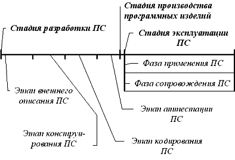

Под <em>процессом</em> понимают совокупность взаимосвязанных действий, преобразующих входные данные в выходные.
	Каждый процесс характеризуется определенными задачами и методами их решения, а также исходными данными, полученными
	от других процессов, и результатами.

Каждый процесс разделен на набор действий, каждое действие — на набор задач. Запуск и выполнение процесса, действия
	или задачи осуществляются другими процессами.

В соответствии со стандартом ISO/IEC 12207 все процессы жизненного цикла ПП разделены на три базовые группы: основные
	процессы; вспомогательные (поддерживающие) процессы; организационные процессы.

<strong>Процесс создания программ</strong>

<em>Внешнее описание </em>ПС является описанием его поведения с точки зрения внешнего по отношению к нему наблюдателю
	с фиксацией требований относительно его качества. Внешнее описание ПС начинается с определения требований к ПС со
	стороны пользователей (заказчика). 

<em>Конструирование </em>ПС охватывает процессы: разработку архитектуры ПС, разработку структур программ ПС и их
	детальную спецификацию. 

<em>Кодирование: </em>создание текстов программ на языке программирования, их отладка и тестирование ПС. 

На этапе <em>аттестации </em>ПС производится оценка качества ПС, после успешного завершения которого, разработка ПС
	считается законченной. 

<em>Программное изделие (ПИ)</em> - экземпляр или копия, снятая с разработанного ПС. <em>Изготовление </em>ПИ - это
	процесс генерации и/или воспроизведения (снятия копии) программ и программных документов ПС с целью их поставки
	пользователю для применения по назначению. <em>Производство </em>ПИ - это совокупность работ по обеспечению
	изготовления требуемого количества ПИ в установленные сроки.<em> Стадия производства </em>ПС в жизненном цикле ПС
	является, по-существу, вырожденной (не существенной), так как представляет рутинную работу, которая может быть
	выполнена автоматически и без ошибок.

Стадия <em>эксплуатации </em>ПС охватывает процессы хранения, внедрения и сопровождения ПС, а также транспортировки и
	применения ПИ по своему назначению. Она состоит из двух параллельно проходящих фаз: фазы применения ПС и фазы
	сопровождения ПС. 

<em>Применение </em>ПС - это использование ПС для решения практических задач на компьютере путем выполнения ее
	программ. 

<em>Сопровождение </em>ПС - это процесс сбора информации о его качестве в эксплуатации, устранения обнаруженных в нем
	ошибок, его доработки и модификации, а также извещения пользователей о внесенных в него изменениях. 

<strong>Понятие качества ПС.</strong>

<em>Качество </em>ПС - это совокупность его черт и характеристик, которые влияют на его способность удовлетворять
	заданные потребности пользователей.

Качество ПС является удовлетворительным, когда оно обладает указанными свойствами в такой степени, чтобы
	гарантировать успешное его использование.

Критерии качества ПС:

<ul>
	<li>функциональность,</li>
	<li>надежность,</li>
	<li>легкость применения,</li>
	<li>эффективность,</li>
	<li>сопровождаемость,</li>
	<li>мобильность.</li>
</ul>

<em>Функциональность </em>- это способность ПС выполнять набор функций, удовлетворяющих заданным или подразумеваемым
	потребностям пользователей. Набор указанных функций определяется во внешнем описании ПС. 

<em>Легкость применения </em>- это характеристики ПС, которые позволяют минимизировать усилия пользователя по
	подготовке исходных данных, применению ПС и оценке полученных результатов, а также вызывать положительные эмоции
	определенного или подразумеваемого пользователя. 

<em>Эффективность </em>- это отношение уровня услуг, предоставляемых ПС пользователю при заданных условиях, к объему
	используемых ресурсов. 

<em>Сопровождаемость </em>- это характеристики ПС, которые позволяют минимизировать усилия по внесению изменений для
	устранения в нем ошибок и по его модификации в соответствии с изменяющимися потребностями пользователей. 

<em>Мобильность </em>- это способность ПС быть перенесенным из одной среды (окружения) в другую, в частности, с одной
	ЭВМ на другую. 

Обязательные критерии качества: функциональность и надежность.

Вопросы:

<ol>
	<li>Программное средство</li>
	<li>Понятие жизненного цикла программного продукта</li>
	<li>Процесс создания программ</li>
	<li>Понятие качества ПС</li>
</ol>
<h1>Лекция 2. Стадии разработки программ и программной документации</h1>

План:

<ol>
	<li>Классы программных продуктов</li>
	<li>Организационные процессы жизненного цикла программного продукта</li>
	<li>Взаимосвязь между процессами жизненного цикла программного продукта</li>
	<li>Microsoft Solutions Framework</li>
	<li>Rational Unified Process</li>
	<li>eXtreme Programming</li>
</ol>

<strong>Классы программных продуктов</strong>

<em>Системное программное обеспечение (System Software)</em> - совокупность программ и программных комплексов для
	обеспечения работы компьютера

<em>Пакет прикладных программ (aplication program package)</em> комплекс взаимосвязанных программ для решения задач
	определенного класса конкретной предметной области.

<em>Инструментарий технологии программирования</em> - совокупность программ и программных комплексов для
	обеспечивающих технологию разработки и внедрения программных продуктов

<strong>Организационные процессы жизненного цикла программного продукта</strong>

<strong><em>Процесс управления (management process</em></strong>) состоит из действий и задач, которые могут
	выполняться любой стороной, управляющей своими процессами. Данная сторона (менеджер) отвечает за управление выпуском
	продукта, проектом и задачами соответствующих процессов, таких как приобретение, поставка, разработка, эксплуатация,
	сопровождение и др. Процесс управления включает в себя: инициирование и определение области управления;
	планирование;управление работами по созданию ПП и контроль за их выполнением; проверку и оценку; завершение работ.

При<em> инициировании и определении области управления</em> менеджер должен определить необходимые для управления
	ресурсы (персонал, оборудование и технология) и убедиться, что они имеются в его распоряжении, причем в достаточном
	количестве.

<em>Планирование</em> подразумевает выполнение, как минимум, следующих задач: составление графиков выполнения работ;
	оценку затрат; выделение требуемых ресурсов; распределение ответственности; оценку рисков, связанных с конкретными
	задачами; создание инфраструктуры управления.

<strong><em>Процесс создания инфраструктуры (infrastructure process)</em></strong> охватывает выбор и поддержку
	(сопровождение) технологии, стандартов и инструментальных средств, выбор и установку аппаратных и программных
	средств, используемых для разработки, эксплуатации или сопровождения ПП. Процесс создания инфраструктуры включает в
	себя: подготовительную работу;

создание инфраструктуры; сопровождение инфраструктуры.

<em>Подготовительная работа</em> заключается в координации с другими организационными процессами и планировании работ
	по созданию инфраструктуры с учетом выбранных технологий, стандартов, инструментальных, программных и аппаратных
	средств.

<em>Создание инфраструктуры</em> включает в себя все действия по разработке в соответствии с выбранной концепцией и
	планом инфраструктуры для выполнения работ по созданию ПП.

<em>Сопровождение инфраструктуры</em> вызвано необходимостью сопровождения ПП и возможными модификациями продукта в
	со- ь таетствии с изменившимися требованиями к нему.

<strong><em>Процесс усовершенствования (improvement process)</em></strong> предусматривает оценку, измерение,
	контроль и усовершенствование процессов жизненного цикла ПП. Данный процесс включает в себя: создание процесса;
	оценку процесса;

усовершенствование процессов жизненного цикла ПП. <em>Создание процесса</em> усовершенствования процессов жизненного
	цикла ПП позволяет на основе контроля за ходом выполнения процессов жизненного цикла, измерения характеристик и
	оценки полученных результатов существенно улучшить качество разрабатываемого ПП и сократить сроки его создания.

<em>Оценка процесса</em> разработки ПП позволяет выявить его сильные и слабые стороны и на основе полученных
	результатов провести необходимые улучшения.

<em>Усовершенствование процессов жизненного цикла ПП</em> направлено на повышение производительности труда всех
	участвующих в них специалистов за счет совершенствования используемой технологии, методов управления, выбора
	инструментальных средств и обучения персонала. Усовершенствование основано на анализе достоинств и недостатков
	каждого процесса. Такому анализу в большой степени способствует накопление в организации исторической, технической,
	экономической и иной информации по реализованным проектам.

<strong><em>Процесс обучения (training process)</em></strong> охватывает первоначальное обучение и последующее
	постоянное повышение квалификации персонала. Приобретение, поставка, разработка, эксплуатация и сопровождение
	программного продукта в значительной степени зависят от уровня знаний и квалификации персонала. Например,
	разработчики ПП должны пройти необходимое обучение методам и средствам программной инженерии. Содержание процесса
	обучения определяется требованиями к проекту. Для этого процесса должны быть запланированы необходимые ресурсы и
	технические средства обучения. Кроме того, должны быть разработаны и представлены методические материалы,
	необходимые для обучения пользователей в соответствии с учебным планом.

Процесс обучения включает в себя:

подготовительную работу;

разработку учебных материалов;

реализацию плана обучения.

<strong>Взаимосвязь между процессами жизненного цикла программного продукта</strong>

В<em> договорном аспекте</em> заказчик и поставщик вступают в договорные отношения и реализуют соответственно
	процессы приобретения и поставки.

В<em> аспекте управления</em> заказчик, поставщик, разработчик, оператор, служба сопровождения и другие стороны,
	участвующие в жизненном цикле ПП, управляют выполнением своих процессов. Менеджер является связующим звеном между
	организационными и основными процессами.

В<em> аспекте эксплуатации</em> оператор, эксплуатирующий систему, предоставляет необходимые услуги пользователям.

В<em> инженерном аспекте</em> разработчик или служба сопровождения решают соответствующие технические задачи,
	разрабатывая или модифицируя ПП.

В<em> аспекте поддержки</em> службы, реализующие вспомогательные процессы, предоставляют необходимые услуги всем
	остальным участникам работ. В рамках аспекта поддержки можно выделить аспект управления качеством ПП.

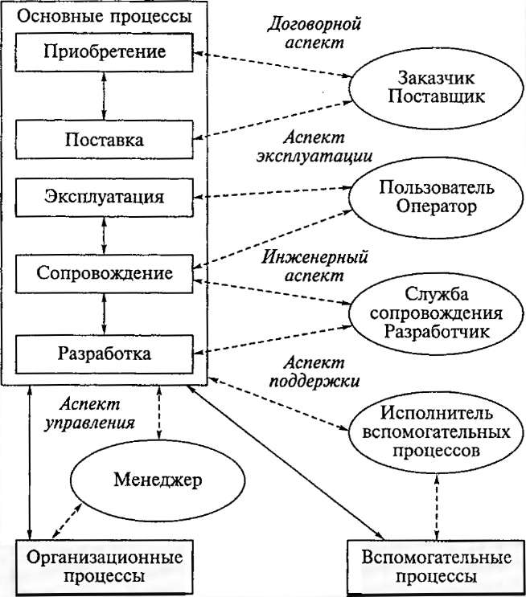

<strong>рис.</strong> 1.1. Связь между процессами жизненного цикла программного продукта

<strong>Microsoft Solutions Framework</strong>

Microsoft Solutions Framework (MSF) - это методология ведения проектов и разработки решений, базирующаяся на
	принципах работы над продуктами самой фирмы Microsoft и предназначенная для использования в организациях,
	нуждающихся в концептуальной схеме для построения современных решений.

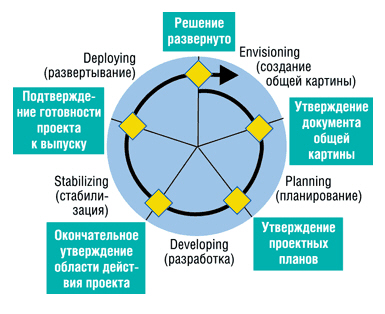

 <strong>Рис. 1.2.</strong>  Жизненный цикл в MSF

При управлении проектом четко ставится цель, которую необходимо достичь в результате, и учитываются ограничения,
	накладываемые на проект. Все виды ограничений могут быть отнесены к одному из трех видов: ограничения ресурсов,
	ограничения времени и ограничения возможностей. Эти три вида ограничений и приоритетность задач по их преодолению
	образуют треугольник приоритетов в MSF.

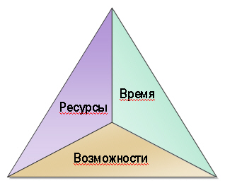

 <strong>Рис. 1.3.</strong>  Треугольник приоритетов в MSF

<strong>Rational Unified Process</strong>

Rational Unified Process - это методология создания программного обеспечения, оформленная в виде размещаемой на Web
	базы знаний, которая снабжена поисковой системой.

<strong>eXtreme Programming</strong>

Экстремальное программирование - сравнительно молодая методология разработки программных систем, основанная на
	постепенном улучшении системы и разработки ее очень короткими итерациями. 

Вопросы:

<ol>
	<li>Классы программных продуктов</li>
	<li>Организационные процессы жизненного цикла программного продукта</li>
	<li>Взаимосвязь между процессами жизненного цикла программного продукта</li>
	<li>Microsoft Solutions Framework</li>
	<li>Rational Unified Process</li>
	<li>eXtreme Programming</li>
</ol>
<h1>Лекция 3. Методы проектирования программных продуктов</h1>

План:

<ol>
	<li>Понятие жизненного цикла программы</li>
	<li>Каскадная модель</li>
	<li>Поэтапная модель с промежуточным контролем</li>
	<li>Спиральная модель ЖЦ</li>
	<li>V-образная модель</li>
	<li>Модель прототипирования</li>
	<li>Модель быстрой разработки приложений</li>
	<li>Многопроходная модель</li>
</ol>

<strong>Понятие жизненного цикла программы</strong>

Жизненный цикл ПС - период его разработки и эксплуатации (использования), начиная от момента возникновения замысла ПС
	и заканчивая прекращением всех видов его использования.

Жизненный цикл ИС можно представить как ряд событий, происходящих с системой в процессе ее создания и
	использования.

Модель жизненного цикла отражает различные состояния системы, начиная с момента возникновения необходимости в данной
	ИС и заканчивая моментом ее полного выхода из употребления. Модель жизненного цикла - структура, содержащая
	процессы, действия и задачи, которые осуществляются в ходе разработки, функционирования и сопровождения программного
	продукта в течение всей жизни системы, от определения требований до завершения ее использования.

В настоящее время известны и используются следующие модели жизненного цикла:

<ul>
	<li>Каскадная модель (рис. 2.1) предусматривает последовательное выполнение всех этапов проекта в строго
		фиксированном порядке. Переход на следующий этап означает полное завершение работ на предыдущем этапе.
	</li>
</ul>

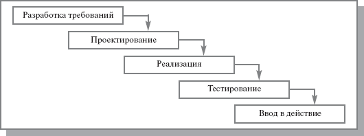

<strong>Рис. 2.1.</strong>  Каскадная модель ЖЦ ИС

<ul>
	<li>Поэтапная модель с промежуточным контролем (рис. 2.2). Разработка ИС ведется итерациями с циклами обратной связи
		между этапами. Межэтапные корректировки позволяют учитывать реально существующее взаимовлияние результатов
		разработки на различных этапах; время жизни каждого из этапов растягивается на весь период разработки.
	</li>
</ul>

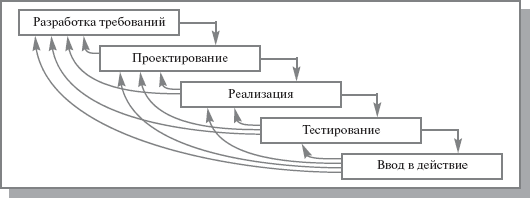

<strong>Рис. 2.2.</strong>  Поэтапная модель с промежуточным контролем

<ul>
	<li>Спиральная модель (рис. 2.3). На каждом витке спирали выполняется создание очередной версии продукта, уточняются
		требования проекта, определяется его качество и планируются работы следующего витка. Особое внимание уделяется
		начальным этапам разработки - анализу и проектированию, где реализуемость тех или иных технических решений
		проверяется и обосновывается посредством создания прототипов (макетирования).
	</li>
</ul>

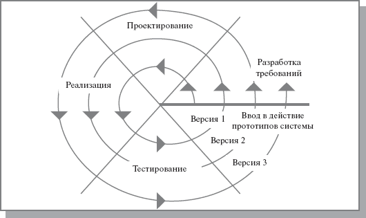

 <strong>Рис. 2.3.</strong>  Спиральная модель ЖЦ ИС

А также их разновидности.

<ul>
	<li>V-образная модель. Особое внимание уделяется верификации и аттестации ПП. Модель показывает, что тестирование
		продукта обсуждается, проектируется и планируется, начиная с ранних этапов жизненного цикла разработки. От
		каскадной модели V-образная модель унаследовала последовательную структуру, в соответствии с которой каждая
		последующая фаза начинается только после успешного завершения предыдущей фазы.
	</li>
</ul>

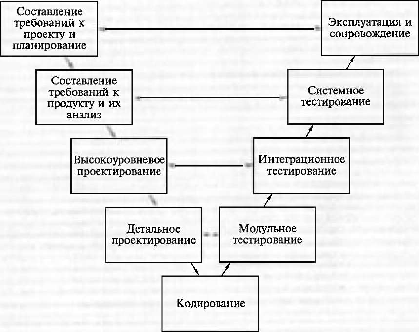

<strong>Рис. 2.4.</strong>  V-образная модель

<ul>
	<li><em>Модель прототипирования</em> позволяет создать прототип ПП до или в течение этапа составления требований к
		ПП. В результате прототипирования разработчик демонстрирует пользователям готовый прототип, а пользователи
		оценивают его функционирование. После этого определяются проблемы, над устранением которых совместно работают
		пользователи и разработчики. Этот процесс продолжается до тех пор, пока пользователи не будут удовлетворены
		степенью соответствия ПП, поставленным перед ним требованиям.
	</li>
</ul>

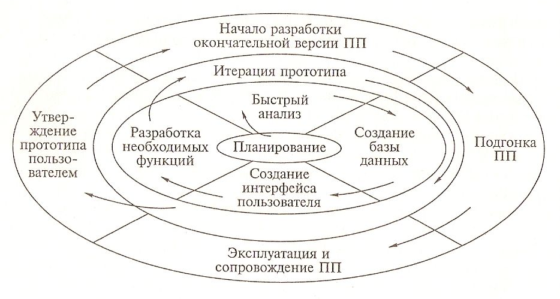

<strong>Рис. 2.5.</strong>  Модель прототипирования

<ul>
	<li><em>Модель быстрой разработки приложений (RAD-модель).</em> В RAD-модели конечный пользователь играет решающую
		роль. В тесном взаимодействии с разработчиками он участвует в формировании требований и апробации их на
		работающих прототипах. При автоматизации программирования и повторном использовании кода, применяемых в
		RAD-модели, большую часть работы составляют планирование и проектирование.
	</li>
</ul>

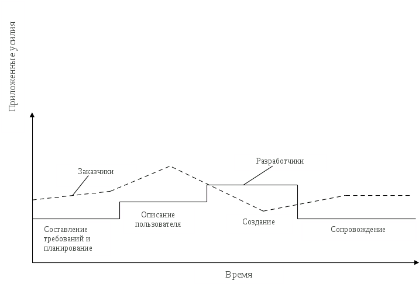

<strong>Рис. 2.6.</strong>  Модель быстрой разработки приложений (RAD-модель).

<ul>
	<li><em>Многопроходная модель </em>— это несколько итераций процесса построения прототипа ПП с добавлением на каждой
		следующей итерации новых функциональных возможностей или повышением эффективности ПП. Сначала выполняются
		конструирование, тестирование и реализация базовых функций, составляющих основу ПП. Последующие итерации
		направлены на улучшение функциональных возможностей ПП.
	</li>
</ul>

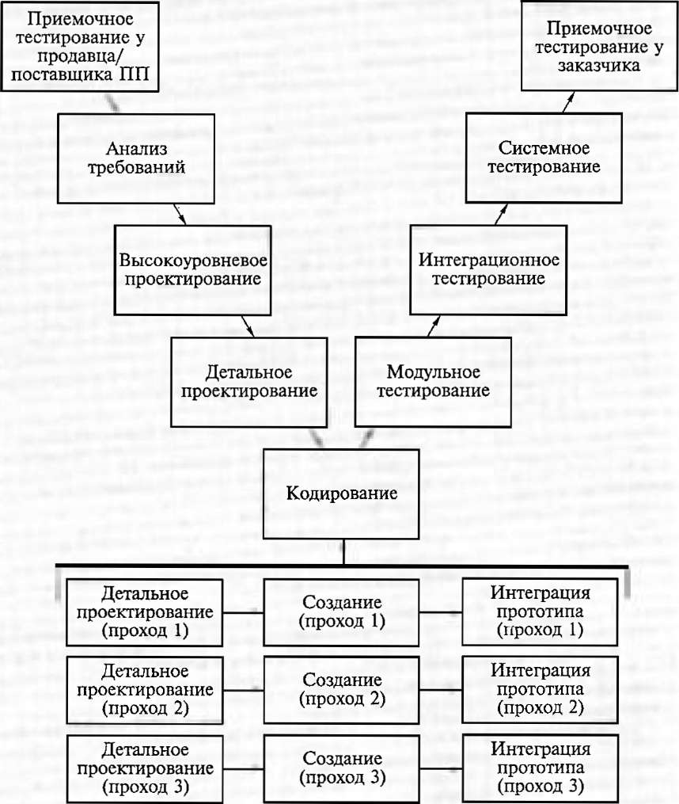

<strong>Рис. 2.7.</strong>  Многопроходная модель

На практике наибольшее распространение получили две основные модели жизненного цикла:

<ul>
	<li>каскадная модель (характерна для периода 1970-1985 гг.);</li>
	<li>спиральная модель (характерна для периода после 1986.г.).</li>
</ul>

Вопросы:

<ol>
	<li>Понятие жизненного цикла программы</li>
	<li>Каскадная модель</li>
	<li>Поэтапная модель с промежуточным контролем</li>
	<li>Спиральная модель ЖЦ</li>
	<li>V-образная модель</li>
	<li>Модель прототипирования</li>
	<li>Модель быстрой разработки приложений</li>
	<li>Многопроходная модель</li>
</ol>
<h1>Лекция 4. Проектирование интерфейса пользователя</h1>

План:

<ol>
	<li>Этапы разработки программного обеспечения</li>
	<li>Анализ требований, предъявленных системе</li>
	<li>Определение спецификаций</li>
	<li>Проектирование</li>
	<li>Кодирование.</li>
	<li>Тестирование</li>
</ol>

<strong>Этапы разработки программного обеспечения</strong>

Как правило, выделяют шесть этапов (в скобках указано распределение затрат по этапам

разработки): 

- анализ требований, предъявляемых системе(10%); 

- определение спецификаций(10%); 

- проектирование(15%); 

- кодирование(20%); 

- тестирование: 

1. автономное(25%); 

2. комплексное(20%); 

- эксплуатация и сопровождение; 

<strong>Анализ требований, предъявленных системе. </strong>

На этом этапе формулируются целевое назначение и основные свойства разрабатываемой

программной системы. 

1. Если предметом разработки является не программная система, а более сложная система, 

включающая в себя программы только в качестве составной части, требования формируются ко

всему предмету разработки. 

2. Если предметом разработки является программная система, то тогда используются методы

составления исходных описаний. Одним из самых эффективных методов исходных описаний

является метод структурного анализа, а именно декомпозиции объекта. 

В общем случае на этом этапе внимание должно быть сосредоточено на интерфейсе между

человеком и ЭВМ. Базовые требования для программных подсистем: 

- время обработки(работы) программы; 

- стоимость обработки; 

- вероятность ошибки; 

- реакция на непредсказуемые действия пользователя; 

Особое внимание следует уделять пространственно-временным ограничениям и средствам

системы, которые в будущем могут претерпеть изменения. К важнейшим требованиям относятся

ресурсные требования и затраты на реализацию системы. 

<strong>Определение спецификаций. </strong>

На этом этапе осуществляется точное описание реализуемых функций, а также задаются

структура входных и выходных данных, методы и средства их размещения. Определяются

алгоритмы обработки данных. 

Центральным вопросом определения спецификаций является проблема организации базы

данных(если новая система создается на основе старой, то частью спецификации является схема

приведения старой БД к ному формату), а так же комплекс вопросов связанный со структурой

файлов и работы с ними. 

Функциональные спецификации- это документ, являющийся основополагающим при

разработке системе, так как имеет ее конкретное описание. В них должны быть представлены

данные для тестирования элементов системы и системы целиком. В общем случае, спецификации

определяют те функции, которые должны выполнять система. 

Спецификации можно использовать для начальных оценок временных затрат, числа

специалистов и других необходимых ресурсов. 

<strong>Проектирование. </strong>

На стадии проектирования разрабатываются алгоритмы, задаваемые спецификациями, и

формируется общая структура вычислительной системы. При этом система разбивается на

составные части, чтобы ответственность за реализацию каждой составной части можно было бы

возложить на одного или группу разработчиков. При этом выдвигаются сформулированные

требования: 

- реализуемые функции; 

- размеры; 

- время выполнения; 

И тд. 

Схема проектирования программных систем: 

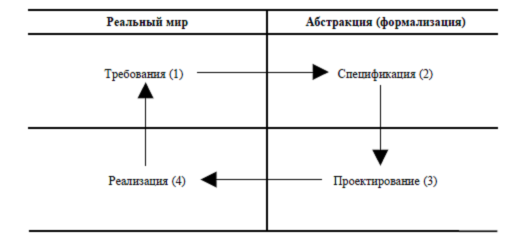

Проектирование– это описание процесса обработки информации, определенных в

спецификациях. Поскольку в начале проектирования решение ряда функциональных задач

зачастую не определено, процесс разбиения на подзадачи может быть весьма сложным. 

<strong>Кодирование. </strong>

Это этап разработки программного обеспечения, посредством алгоритмических языков

высокого уровня. По статистике64% всех ошибок вносятся на этапе проектирования и36% на

этапе кодирования. 

<strong>Тестирование. </strong>

Этап тестирования обычно в фин. затратах составляет половину расходов на создание

системы. В процессе тестирования используются данные, характерные для системы в рабочем

состоянии. 

Тестирование подразумевает три стадии: 

- Автономное. Модуль проверяется с помощью данных, подготовленных программистом. 

При этом программная среда модуля имитируется с помощью программ управления тестированием, 

содержащих фиктивные программы, вместо реальных., с которыми имеется обращение из модуля. 

Такую процедуру называют программным тестированием, а программу тестирования- UUT. 

- Комплексное. В процессе тестирования проводится совместная проверка групп

программных компонентов. На данном этапе обнаруживаются ошибки, пропущенные на стадии

автономного тестирования. Исправление этих ошибок может составлять до¼ общих затрат. 

- Системное. Завершающий этап проверки системы, то есть проверка системы в целом с

помощью независимых тестов. 

Вопросы:

<ol>
	<li>Этапы разработки программного обеспечения</li>
	<li>Анализ требований, предъявленных системе</li>
	<li>Определение спецификаций</li>
	<li>Проектирование</li>
	<li>Кодирование.</li>
	<li>Тестирование</li>
</ol>
<h1>Лекция 5. Структурное программирование</h1>

План:

<ol>
	<li>Общая характеристика структурного программирования</li>
	<li>Подчинение структур</li>
</ol>

<strong>Общая характеристика структурного программирования</strong>

На самом деле изложение структурного стиля не может уместиться в рамки одной лекции. Но данный стиль программирования
	(вернее, его вариант, основанный на <em>циклах</em> и массивах, слегка пополненный рекурсивными
	процедурами) описывается и навязывается как единственно возможный во всех ныне предлагаемых учебных пособиях по
	программированию на традиционных языках. В связи с этим мы имеем право предположить, что обучающийся знаком с ним
	(более того, знаком только с ним, и мы надеемся, что он еще не потерял способность воспринимать другие стили). И
	хотя Вы считаете, что с этим вариантом структурного стиля уже освоились, особенности, опускаемые в традиционных
	изложениях, могут полностью изменить Ваш взгляд на данный стиль.

В качестве методики структурного программирования <em>Э. Дейкстра</em> предложил пользоваться
	лишь конструкциями <em>цикла</em> и условного оператора, изгоняя go to как концептуально
	противоречащее этому стилю

Пожалуй, это первое <em>концептуальное противоречие</em>, явно отмеченное и учтенное в теории и
	практике программирования (и даже во всей современной науке). Но, поскольку не было даже наметок теории
	неформализуемых понятий, и на работу с ними переносили <em>опыт</em> работы с малыми
	формализациями, структурное противоречие было воспринято следующим образом.

Структурное <em>программирование</em> естественно возникает во многих классах задач, прежде
	всего в таких, где <strong>задача естественно расщепляется на подзадачи, а информация - на достаточно независимые
		структуры данных</strong>. Основной его <em>инвариант</em>:<strong>действия и условия
		локальны</strong>.

Необходимой чертой хорошей реализации структурного стиля программирования является соблюдение согласованности, а в
	идеале и единства, следующих компонентов программы:

<ol>
	<li><strong>Структура информационного пространства</strong>. Содержательно любую задачу можно описать как
		переработку объектов, полный набор которых называется <strong>информационным пространством</strong> задачи.
	</li>
	<li><strong>Структуры управления</strong>. Стиль структурного программирования в его общепринятом варианте
		предполагает использование строго ограниченного набора <em>управляющих конструкций</em>:
		последовательность операторов, условные и выбирающие операторы, все вычислительные ветви которых сходятся в
		одной точке программы, а также процедуры, вычисления которых всегда заканчиваются возвратом управления в точку
		вызова.
	</li>
	<li>К структурным операторам добавляются <strong>либо </strong><em>циклы</em>, <strong>либо </strong><em>рекурсии</em>.
	</li>
</ol>

<strong>Все структуры подчиняются структуре информационного пространства</strong>.

Это общее требование конкретизируется в следующие.

<ol>
	<li>Необходимо, чтобы структура управления программы была согласована со структурой ее информационного пространства.
		Каждой структуре управления соответствуют согласующиеся с ней структуры данных и часть информационного
		пространства. Это условие позволяет человеку легко отслеживать порядок выполнения конструкций в программе.
	</li>
	<li>Подзадачи могут обмениваться данными только посредством обращения к объектам из общей части их информационных
		пространств (в современных языках чаще всего к глобальным).
	</li>
	<li>Информационные потоки должны протекать согласно иерархии структур управления; мы должны четко видеть для каждого
		блока программы, что он имеет на входе и что дает на выходе. Таким образом, <strong>свойства каждого логически
			завершенного фрагмента программы должны ясно осознаваться и в идеале четко описываться в самом тексте
			программы и в сопровождающей ее </strong>документации.
	</li>
	<li>Описание переменных, представляющих перерабатываемые объекты, а также других, вспомогательных переменных при
		структурном программировании строго подчиняется разбиению задачи на подзадачи.
	</li>
	<li>Все <em>призраки</em> действуют на своем структурном месте и соответствуют идеальным
		сущностям, которые, согласно парадоксу изобретателя, должны вводиться для эффективного решения задачи.
	</li>
	<li>Все <em>подпорки</em> строго локализованы в том месте, где их вынуждены ввести. Желательно
		даже обозначать их по-другому, чем идеальные сущности, например, оставляя мнемонические имена лишь для идеальных
		сущностей, а <em>подпорки</em> именовать джокерами типа x или i. Необходимо строго следить
		за тем, чтобы <em>подпорки</em> не искажали идеальную структуру программы.
	</li>
</ol>

Вопросы:

<ol>
	<li>Общая характеристика структурного программирования</li>
	<li>Подчинение структур</li>
</ol>
<h1>Лекция 6. Объектно-ориентированное программирование</h1>

План:

<ol>
	<li>Объект</li>
	<li>Класс</li>
	<li>Инкапсуляция</li>
	<li>Наследование</li>
	<li>полиморфизм</li>
</ol>

Объектно-ориентированное программирование (ООП) - это новый подход к созданию программ. 

<strong>Объект</strong> - это структурированная переменная, содержащая всю информацию о некотором физическом предмете
	или реализуемом в программе понятии. 

<strong>Класс</strong> - это описание множества объектов программирования (объектов) и выполняемых над ними действий.

Это определение можно проиллюстрировать средствами классического C: 

<em>struct myclass /*класс - описание множества объектов*/ </em>

<em>{ int data1; </em>

<em>... }; </em>

<em>void method1(struct myclass *this,...) /*метод*/ </em>

<em>{ ... this-&gt;data1 ... } </em>

<em>void method2(struct myclass *this,...) /*метод*/ </em>

<em>{ ... this-&gt;data1 ... } </em>

<em>struct myclass obj1, obj2; /*объекты*/ </em>

<em>... method1(&amp;obj1,...); /*для работы с объектами*/ </em>

<em>... method2(&amp;obj2,...); /*применяются методы*/ </em>

Основные понятия объектно-ориентированного программирования: <strong>инкапсуляция</strong>,
	<strong>наследование</strong> и <strong>полиморфизм</strong>. 

“Эпизодическое” использование технологии ООП заключается в разработке отдельных, не связанных между собой классов и
	использовании их как необходимых программисту базовых типов данных, отсутствующих в языке. При этом общая структура
	программы остается традиционной (“от функции к функции”). Однако, строгое следование технологии ООП предполагает,
	что любая функция в про грамме представляет собой метод для объекта некоторого класса. Это не означает, что нужно
	вводить в программу какие попало классы ради того, чтобы написать необходимые для работы функции. Наоборот, класс
	должен формироваться в программе естественным образом, как только в ней возникает необходимость описания новых
	объектов программирования. С другой стороны, каждый новый шаг в разработке алгоритма также должен представлять собой
	разработку нового класса на основе уже существующих. В конце концов, вся программа в таком виде представляет собой
	объект некоторого класса с единственным методом run (выполнить). Именно этот переход (а не понятия класса и объекта,
	как таковые) создает психологический барьер перед программистом, осваивающим технологию ООП. 

Программирование “от класса к классу” включает в себя ряд новых понятий. Прежде всего, это - инкапсуляция данных.
	<strong><em>Инкапсуляция</em></strong> - это механизм, который объединяет данные и код, манипулирующий с этими
	данными, а также защищает и то, и другое от внешнего вмешательства или неправильного использования. 

В ООП код и данные могут быть объединены вместе (в так называемый “черный ящик”) при создании объекта. Внутри объекта
	коды и данные могут быть закрытыми или открытыми. Закрытые коды или данные доступны только для других частей того же
	самого объекта и, соответственно, недоступны для тех частей программы, которые существуют вне объекта. Открытые коды
	и данные, напротив, доступны для всех частей программы, в том числе и для других частей того же самого объекта. 

Для примера, рассмотрим такую структуру хранения информации как стек. Пользователя интересует выполнение операций:
	push(), top(), empty(), pop(), reset(), full(). Внутренняя реализация (адреса ячеек памяти, значения регистров
	процессора, имена массивов и т.д.) пользователя не интересует, то есть она должна быть скрыта от него. Пользователю
	нyжны только указанные операции, и он должен получить в свое распоряжение набор методов для их выполнения. Объектом
	программирования в этом случае является структура хранения информации типа стек. Соответственно, внутренняя
	организация объекта стек должна быть недоступна (закрыта) для пользователя, то есть все его попытки обратиться
	непосредственно к 

элементам, обеспечивающим функционирование структуры хранения данных, должны отвергаться (выдавать сообщение об
	ошибке). А вызов методов, напротив, должен приводить к выполнению желаемого действия и является общедоступным. 

 Вторым по значимости понятием является <strong><em>наследование</em></strong>. Новый, или производный класс может
	быть определен на основе уже имеющегося, или базового класса. При этом но- вый класс сохраняет все свойства старого:
	данные объекта базового класса включаются в данные объекта производного, а методы базового класса могут быть вызваны
	для объекта производного класса, причем они будут выполняться над данными включенного в него объекта базового
	класса. Иначе говоря, новый класс наследует как данные старого класса, так и методы их обработки. Если объект
	наследует свои свойства от одного родителя, то говорят об одиночном наследовании. Если же объект наследует данные и
	методы от нескольких базовых классов, то говорят о множественном наследовании. Простой пример наследования -
	определение структуры, отдельный член которой является ранее определенной структурой. 

Рассмотрим еще один пример. Например, базовый класс “животные” может иметь производные классы: “млекопитающие”,
	“рыбы”, “птицы” и т.д. Они будут наследовать все характеристики базового класса, но каждый из них может иметь и свои
	собственные свойства: 

“рыбы – плавники”, “птицы – крылья” и т.д. 

Третьим по значимости понятием является полиморфизм. <strong><em>Полиморфизм</em></strong> - это свойство, которое
	позволяет один и тот же идентификатор (одно и то же имя) использовать для решения двух и более схожих, но технически
	разных задач. Целью полиморфизма, применительно к ООП, является использование одного имени для задания действий,
	общих для ряда классов объектов. Такой полиморфизм основывается на возможности включения в данные объекта также и
	информации о методах их обработки (в виде указателей на функции). Принципиально важно, что такой объект становится
	“самодостаточным”. Будучи доступным в некоторой точке программы, даже при отсутствии полной информации о его типе,
	он всегда может корректно вызвать свойственные ему методы. Таким образом, полиморфная функция - это семейство
	функций с одним и тем же именем, но выполняющие различные действия в зависимости от условий вызова. 

Например, нахождение абсолютной величины в языке С требует трех разных функций: <em>int abs(int); long labs(long);
	double fabs(double); </em>

Эти функции подсчитывают и возвращают абсолютную величину целых, длинных целых и чисел с плавающей точкой
	соответственно. С точки зрения полиморфизма, каждую из этих функций может быть названа abs(), а тип данных, который
	используется при вызове функции, определяет, какая конкретная версия функции действительно выполняется. 

Вопросы:

<ol>
	<li>Объект</li>
	<li>Класс</li>
	<li>Инкапсуляция</li>
	<li>Наследование</li>
	<li>полиморфизм</li>
</ol>
<h1>Лекция 7. Консультационное обеспечение качества программ</h1>

План:

<ol>
	<li>ЕСПД</li>
	<li>стандарт ISO/IEC 12207: 1995-08-01</li>
	<li>Стандарты комплекса ГОСТ 34</li>
	<li>Перечень документов ЕСПД</li>
</ol>

<strong>Понятие о ЕСПД</strong>

Основу отечественной нормативной базы в области документирования ПС составляет комплекс стандартов Единой системы
	программной документации (ЕСПД). Основная и большая часть комплекса ЕСПД была разработана в 70-е и 80-е годы. Сейчас
	этот комплекс представляет собой систему межгосударственных стандартов стран СНГ (ГОСТ), действующих на территории
	Российской Федерации на основе межгосударственного соглашения по стандартизации. 

Стандарты ЕСПД в основном охватывают ту часть документации, которая создается в процессе разработки ПС, и связаны, по
	большей части, с документированием функциональных характеристик ПС. Следует отметить, что стандарты ЕСПД (ГОСТ 19)
	носят рекомендательный характер. Впрочем, это относится и ко всем другим стандартам в области ПС (ГОСТ 34,
	Международному стандарту ISO/IEC, и др.). Дело в том, что в соответствии с Законом РФ &quot;О стандартизации&quot;
	эти стандарты становятся обязательными на контрактной основе — то есть при ссылке на них в договоре на разработку
	(поставку) ПС. 

Говоря о состоянии ЕСПД в целом, можно констатировать, что большая часть стандартов ЕСПД морально устарела. 

К числу основных недостатков <strong>ЕСПД</strong> можно отнести: 

<ul>
	<li>ориентацию на единственную, &quot;каскадную&quot; модель жизненного цикла (ЖЦ) ПС;</li>
	<li>отсутствие четких рекомендаций по документированию характеристик качества ПС;</li>
	<li>отсутствие системной увязки с другими действующими отечественными системами стандартов по ЖЦ и документированию
		продукции в целом, например, ЕСКД;
	</li>
	<li>нечетко выраженный подход к документированию ПС как товарной продукции;</li>
	<li>отсутствие рекомендаций по самодокументированию ПС, например, в виде экранных меню и средств оперативной помощи
		пользователю (&quot;хелпов&quot;);
	</li>
	<li>отсутствие рекомендаций по составу, содержанию и оформлению перспективных документов на ПС, согласованных с
		рекомендациями международных и региональных стандартов.
	</li>
</ul>

Надо сказать, что наряду с комплексом ЕСПД официальная нормативная база РФ в области документирования ПС и в смежных
	областях включает ряд перспективных стандартов (отечественного и международного уровней). 

Международный стандарт <strong>ISO/IEC 12207: 1995-08-01</strong> на организацию ЖЦ продуктов программного
	обеспечения (ПО) — казалось бы весьма неконкретный, но вполне новый и отчасти &quot;модный&quot; стандарт. 

Стандарты комплекса <strong>ГОСТ 34</strong> на создание и развитие автоматизированных систем (АС) — обобщенные, но
	воспринимаемые как весьма жесткие по структуре ЖЦ и проектной документации. Но эти стандарты многими считаются
	бюрократическими до вредности и консервативными до устарелости. Насколько это так, а насколько ГОСТ 34 остается
	работающим с пользой — полезно разобраться. 

Тем не менее, до пересмотра всего комплекса, многие стандарты ЕСПД могут с пользой применяться в практике
	документирования ПС. Эта позиция основана на следующем: 

<ul>
	<li>стандарты ЕСПД вносят элемент упорядочения в процесс документирования ПС;</li>
	<li>предусмотренный стандартами ЕСПД состав программных документов вовсе не такой &quot;жесткий&quot;, как некоторым
		кажется: стандарты позволяют вносить в комплект документации на ПС дополнительные виды
	</li>
	<li>стандарты ЕСПД позволяют вдобавок мобильно изменять структуры и содержание установленных видов ПД исходя из
		требований заказчика и пользователя.
	</li>
</ul>

При этом стиль применения стандартов может соответствовать современному общему стилю адаптации стандартов к специфике
	проекта: заказчик и руководитель проекта выбирают уместное в проекте подмножество стандартов и ПД, дополняют
	выбранные ПД нужными разделами и исключают ненужные, привязывают создание этих документов к той схеме ЖЦ, которая
	используется в проекте. 

Стандарты ЕСПД (как и другие ГОСТы) подразделяют на группы, приведённые в таблице: 

<table>
	<tr>
		<td>
<strong>Kод группы</strong>
</td>
		<td>
<strong>Наименование группы</strong>
</td>
	</tr>
	<tr>
		<td>
0
</td>
		<td>
Общие положения
</td>
	</tr>
	<tr>
		<td>
1
</td>
		<td>
Основополагающие стандарты
</td>
	</tr>
	<tr>
		<td>
2
</td>
		<td>
Правила выполнения документации разработки
</td>
	</tr>
	<tr>
		<td>
3
</td>
		<td>
Правила выполнения документации изготовления
</td>
	</tr>
	<tr>
		<td>
4
</td>
		<td>
Правила выполнения документации сопровождения 
</td>
	</tr>
	<tr>
		<td>
5
</td>
		<td>
Правила выполнения эксплуатационной документации
</td>
	</tr>
	<tr>
		<td>
6
</td>
		<td>
Правила обращения программной документации
</td>
	</tr>
	<tr>
		<td>
7
</td>
		<td rowspan="2">
Резервные группы
</td>
	</tr>
	<tr>
		<td>
8
</td>
	</tr>
	<tr>
		<td>
9
</td>
		<td>
Прочие стандарты
</td>
	</tr>
</table>

Обозначение стандарта ЕСПД должно состоять из: 

<ul>
	<li>числа 19 (присвоенных классу стандартов ЕСПД);</li>
	<li>одной цифры (после точки), обозначающей код классификационной группы стандартов, указанной таблице;</li>
	<li>двузначного числа (после тире), указывающего год регистрации стандарта.</li>
</ul>

<strong>Перечень документов ЕСПД.</strong>

<ol>
	<li>ГОСТ 19.001-77 ЕСПД. Общие положения.</li>
	<li>ГОСТ 19.101-77 ЕСПД. Виды программ и программных документов.</li>
	<li>ГОСТ 19.102-77 ЕСПД. Стадии разработки.</li>
	<li>ГОСТ 19.103-77 ЕСПД. Обозначение программ и программных документов.</li>
	<li>ГОСТ 19.104-78 ЕСПД. Основные надписи.</li>
	<li>ГОСТ 19.105-78 ЕСПД. Общие требования к программным документам.</li>
	<li>ГОСТ 19.106-78 ЕСПД. Требования к программным документам, выполненным печатным способом.</li>
	<li>ГОСТ 19.201-78 ЕСПД. Техническое задание. Требования к содержанию и оформлению.</li>
	<li>ГОСТ 19.202-78 ЕСПД. Спецификация. Требования к содержанию и оформлению.</li>
	<li>ГОСТ 19.301-79 ЕСПД. Порядок и методика испытаний.</li>
	<li>ГОСТ 19.401-78 ЕСПД. Текст программы. Требования к содержанию и оформлению.</li>
	<li>ГОСТ 19.402-78 ЕСПД. Описание программы.</li>
	<li>ГОСТ 19.404-79 ЕСПД. Пояснительная записка. Требования к содержанию и оформлению.</li>
	<li>ГОСТ 19.501-78 ЕСПД. Формуляр. Требования к содержанию и оформлению.</li>
	<li>ГОСТ 19.502-78 ЕСПД. Описание применения. Требования к содержанию и оформлению.</li>
	<li>ГОСТ 19.503-79 ЕСПД. Руководство системного программиста. Требования к содержанию и оформлению.</li>
	<li>ГОСТ 19.504-79 ЕСПД. Руководство программиста.</li>
	<li>ГОСТ 19.505-79 ЕСПД. Руководство оператора.</li>
	<li>ГОСТ 19.506-79 ЕСПД. Описание языка.</li>
	<li>ГОСТ 19.508-79 ЕСПД. Руководство по техническому обслуживанию. Требования к содержанию и оформлению.</li>
	<li>ГОСТ 19.604-78 ЕСПД. Правила внесения изменений в программные документы, выполняемые печатным способом.</li>
	<li>ГОСТ 19.701-90 ЕСПД. Схемы алгоритмов, программ, данных и систем. Условные обозначения и правила выполнения.
	</li>
	<li>ГОСТ 19.781-90. Обеспечение систем обработки информации программное.</li>
</ol>

Из всех стандартов ЕСПД остановимся только на тех, которые могут чаще использоваться на практике. Первым укажем
	стандарт, который можно использовать при формировании заданий на программирование. 

<em>ГОСТ (СТ СЭВ) 19.201-78 (1626-79). ЕСПД. Техническое задание. Требование к содержанию и оформлению. (Переиздан в
	ноябре 1987г с изм.1).</em>

Техническое задание (ТЗ) содержит совокупность требований к ПС и может использоваться как критерий проверки и приемки
	разработанной программы. Поэтому достаточно полно составленное (с учетом возможности внесения дополнительных
	разделов) и принятое заказчиком и разработчиком, ТЗ является одним из основополагающих документов проекта ПС. 

Техническое задание должно содержать следующие разделы: 

<ul>
	<li>введение;</li>
	<li>основания для разработки;</li>
	<li>назначение разработки;</li>
	<li>требования к программе или программному изделию;</li>
	<li>требования к программной документации;</li>
	<li>технико-экономические показатели;</li>
	<li>стадии и этапы разработки;</li>
	<li>порядок контроля и приемки;</li>
	<li>в техническое задание допускается включать приложения.</li>
</ul>

В зависимости от особенностей программы или программного изделия допускается уточнять содержание разделов, вводить
	новые разделы или объединять отдельные из них. 

Следующий стандарт <em>ГОСТ (СТ СЭВ) 19.101-77 (1626-79). ЕСПД. Виды программ и программных документов (Переиздан в
	ноябре 1987г с изм.1). </em> Устанавливает виды программ и программных документов для вычислительных машин,
	комплексов и систем независимо от их назначения и области применения. 

Вопросы:

<ol>
	<li>ЕСПД</li>
	<li>стандарт ISO/IEC 12207: 1995-08-01</li>
	<li>Стандарты комплекса ГОСТ 34</li>
	<li>Перечень документов ЕСПД</li>
</ol>
<h1>Лекция 8. Экзамены и тесты как средства поиска ошибок в программном обеспечении</h1>

План:

<ol>
	<li>Виды ошибок</li>
	<li>Виды контроля ПС</li>
	<li>Основные цели и принципы отладки</li>
	<li>Основные принципы организации тестирования ПС</li>
</ol>

<strong>Виды ошибок:</strong>

<ol>
	<li>Ошибки в описании задачи</li>
</ol>

Отсутствие взаимопонимания между программистом и заказчиком и качественное определение требований, приводит к
	получению нежелательных результатов, такие ошибки являются разрушительными и ведут к полному
	перепрограммированию.

<ol>
	<li>Ошибки в выборе алгоритма</li>
</ol>

Неэффективный алгоритм может привести весь процесс программирования также к нежелательному результату, т.е. не
	эффективный метод может привести к перепрограммированию.

<ol>
	<li>Ошибки анализа</li>
</ol>

Эти ошибки связаны с неполным учетом возникающих ситуаций (например, пренебрежение или не знание области допустимых
	значений переменных могут привести к нереальным результатам). Мелкие или крупные логические ошибки из которых можно
	выделить :

<ul>
	<li>
		<ol>
			<li>отсутствие заданий начальных значений</li>
			<li>не верное условие окончания цикла</li>
			<li>не верная индексация цикла</li>
			<li>отсутствие задания обнуления циклов.</li>
		</ol>
	</li>
</ul>
<ol>
	<li>Ошибки общего характера - ошибки из-за не достаточного знания тонкостей языка или самой системы или машины.</li>
	<li>Синтаксические ошибки - ошибки, вызванные не правильным написанием операторов.</li>
	<li>Семантические ошибки – неправильное использование написанных операторов.</li>
	<li>Ошибки в данных</li>
</ol>

<strong>Виды контроля ПС: </strong>

<ul>
	<li>Визуальный,</li>
	<li>Статический</li>
	<li>динамический</li>
</ul>

Визуальный контроль - это проверка программ “ за столом “, без использования компьютера. 

<ol>
	<li>сначала осуществляется чтение программы</li>
	<li>затем осуществляется сквозной контроль программы (ее ручная прокрутка на нескольких заранее подобранных простых
		тестах).
	</li>
</ol>

Статический контроль - это проверка программы по ее тексту (без выполнения) с помощью инструментальных средств. <em>Формы
	статического контроля:</em>

<ul>
	<li>
		<ol>
			<li>синтаксический контроль программы с помощью компилятора, при котором проверяется соответствие текста
				программы синтаксическим правилам языка программирования.
			</li>
			<li>контроль правдоподобия программы, то есть выявление в ее тексте конструкций, которые хотя и
				синтаксически корректны, но скорее всего содержат ошибку или свидетельствуют о ней. <em>Основные
					неправдоподобные ситуации</em> :
			</li>
		</ol>
	</li>
	<li>использование в программе неинициализированных переменных (то есть переменных, не получивших начального
		значения) ;
	</li>
	<li>наличие в программе описаний переменных, процедур, меток, файлов, в дальнейшем не используемых в ее тексте;</li>
	<li>наличие в тексте программы фрагментов, никогда не выполняющихся;</li>
	<li>наличие в тексте программы переменных, ни разу не используемых для чтения после присваивая им значений;</li>
	<li>наличие в тексте программы заведомо бесконечных циклов ;</li>
</ul>

Даже если присутствие в тексте программы неправдоподобных конструкций не приводит к ее неправильной работе,
	исправление этого фрагмента повысит ясность и эффективность программы, т. е. благотворно скажется на ее
	качестве.

<strong>Основные цели и принципы отладки</strong>

<strong><em>Отладка </em>ПС</strong> - это деятельность, направленная на обнаружение и исправление ошибок в ПС с
	использованием процессов выполнения его программ. 

<strong><em>Тестирование </em>ПС</strong> - это процесс выполнения его программ на некотором наборе данных, для
	которого заранее известен результат применения или известны правила поведения этих программ. Указанный набор данных
	называется тестовым или просто <em>тестом</em>. 

Таким образом, отладку можно представить в виде многократного повторения трех процессов: тестирования, в результате
	которого может быть констатировано наличие в ПС ошибки, поиска места ошибки в программах и документации ПС и
	редактирования программ и документации с целью устранения обнаруженной ошибки. 

<strong>Отладка = Тестирование + Поиск ошибок + Редактирование. </strong>

Каждому программисту известно, сколько времени и сил уходит на отладку программ. На этот этап приходится около 50%
	общей стоимости разработки программного обеспечения. Тестирование - это процесс выполнения программы с целью
	обнаружения в ней ошибок. Но Нельзя гарантировать, что тестированием ПС можно установить наличие каждой имеющейся в
	ПС ошибки. Поэтому возникает две задачи:

<ol>
	<li>подготовить такой набор тестов и применить к ПС, чтобы обнаружить в нем по возможности большее число ошибок.
		Однако чем дольше продолжается процесс тестирования (и отладки в целом), тем большей становится стоимость ПС.
	</li>
	<li>определить момент окончания отладки ПС (или отдельной его компоненты). Отладка заканчивается, когда тестами
		охвачено множество различных ситуаций, возникающих при выполнении программ ПС, и относительно редко появляются
		ошибки в ПС на последнем отрезке процесса тестирования.
	</li>
</ol>

<strong>Советы по организации тестирования</strong>

<ul>
	<li>необходимой частью каждого теста должно являться описание ожидаемых результатов работы программы, чтобы можно
		было быстро выяснить наличие или отсутствие ошибки в ней;
	</li>
	<li>должны являться правилом доскональное изучение результатов каждого теста, чтобы не пропустить малозаметную на
		поверхностный взгляд ошибку в программе;
	</li>
	<li>тестирования не должно планироваться исходя из предположения, что в программе не будут обнаружены ошибки;</li>
	<li>следует всегда помнить, что тестирование - творческий процесс, а не относиться к нему как к рутинному занятию.
	</li>
</ul>

<strong>Основные принципы организации тестирования ПС</strong>

Существует 4 этапа тестирования многомодульных ПС:

<ol>
	<li>тестирование отдельных модулей;</li>
	<li>совместное тестирование модулей;</li>
	<li>тестирование функций программного комплекса;</li>
	<li>тестирование всего комплекса в целом.</li>
</ol>

На первых двух этапах используются прежде всего методы структурного программирования. При структурном тестировании
	программа рассматривается как “белый ящик” (т.е. ее текст открыт для пользования). Происходит проверка логики
	программы. 

Вопросы:

<ol>
	<li>Виды ошибок</li>
	<li>Виды контроля ПС</li>
	<li>Основные цели и принципы отладки</li>
	<li>Основные принципы организации тестирования ПС</li>
</ol>

<h1>Лекция 9. Инструментальные средства разработки программ</h1>

План:

<ol>
	<li>Инструменты разработки программных средств</li>
	<li>Инструментальные среды разработки и сопровождения программных средств</li>
	<li>Инструментальные среды программирования</li>
	<li>CASE технологии</li>
</ol>

<strong>Инструменты разработки программных средств.</strong>

В процессе разработки программных средств в той или иной мере используется компьютерная поддержка процессов
	разработки ПС. 

Это достигается путем представления хотя бы некоторых программных документов ПС (прежде всего, программ) на
	компьютерных носителях данных (например, дисках) и предоставлению в распоряжение разработчика ПС <strong>специальных
		ПС </strong>или включенных в состав компьютера <strong>специальных устройств</strong>, созданных для какой-либо
	обработки таких документов. 

В качестве такого специального ПС можно указать <strong>компилятор</strong> с какого-либо языка программирования.

<em>Компилятор</em> избавляет разработчика ПС от необходимости писать программы на языке компьютера, который для
	разработчика ПС был бы крайне неудобен, - вместо этого он составляет программы на удобном ему языке
	программирования, которые соответствующий компилятор автоматически переводит на язык компьютера. 

В качестве специального устройства, поддерживающего процесс разработки ПС, может служит <strong>эмулятор</strong>
	какого-либо языка. 

<em>Эмулятор</em> позволяет выполнять (интерпретировать) программы на языке, отличном от языка компьютера,
	поддерживающего разработку ПС, например на языке компьютера, для которого эта программа предназначена. 

ПС, предназначенное для поддержки разработки других ПС, будем <strong>называть программным инструментом разработки
	ПС,</strong> а устройство компьютера, специально предназначенное для поддержки разработки ПС, будем называть<strong>
	аппаратным инструментом разработки ПС.</strong>

Инструменты разработки ПС могут использоваться в течении всего жизненного цикла ПС для работы с разными программными
	документами. Так текстовый редактор может использоваться для разработки практически любого программного
	документа. 

С точки зрения функций, которые инструменты выполняют при разработке ПС, их можно разбить на следующие четыре группы:
	· 

− редакторы,· 

− анализаторы,· 

− преобразователи,· 

− инструменты, поддерживающие процесс выполнения программ. 

<em>Редакторы</em> поддерживают конструирование (формирование) тех или иных программных документов на различных
	этапах жизненного цикла. 

Как уже упоминалось, для этого можно использовать один какойнибудь универсальный текстовый редактор. 

Однако, более сильную поддержку могут обеспечить специализированные редакторы: для каждого вида документов - свой
	редактор. В частности, на ранних этапах разработки в документах могут широко использоваться графические средства
	описания (диаграммы, схемы и т.п.). В таких случаях весьма полезными могут быть графические редакторы. 

На этапе программирования (кодирования) вместо текстового редактора 

<strong>Инструментальные среды разработки и сопровождения программных средств.</strong>

 Для таких инструментальных сред характерно: 

− во-первых, использование как программных, так и аппаратных инструментов, и, 

− во-вторых, определенная ориентация либо на конкретный язык программирования, либо на конкретную предметную
	область. 

Инструментальная среда не обязательно должна функционировать на том компьютере, на котором должно будет применяться
	разрабатываемое с помощью ее ПС. Часто такое совмещение бывает достаточно удобным (если только мощность
	используемого компьютера позволяет это): не нужно иметь дело с компьютерами разных типов, в разрабатываемое ПС можно
	включать компоненты самой инструментальной среды. 

Различают <strong>три основных класса инструментальных сред разработки и сопровождения ПС </strong>· 

− среды программирования, · 

− рабочие места компьютерной технологии,· 

− инструментальные системы технологии программирования. Среда программирования предназначена 

в основном для поддержки процессов программирования 

(кодирования), тестирования и отладки ПС. 

Рабочее место компьютерной технологии ориентировано на поддержку ранних этапов разработки ПС (спецификаций) и
	автоматической генерации программ по спецификациям. 

Инструментальная система технологии программирования предназначена для поддержки всех процессов разработки и
	сопровождения в течение всего жизненного цикла ПС и ориентирована на коллективную разработку больших программных
	систем с длительным жизненным циклом. 

Для таких систем стоимость сопровождения обычно превышает стоимость разработки. 

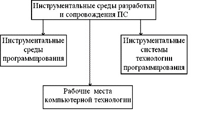

Рис. Основные классы инструментальных сред разработки и сопровождения ПС.

<strong>Инструментальные среды программирования.</strong>

Инструментальные среды программирования содержат прежде всего текстовый редактор, позволяющий конструировать
	программы на заданном языке программирования, инструменты, позволяющие компилировать или интерпретировать программы
	на этом языке, а также тестировать и отлаживать полученные программы. 

Различают следующие <strong>классы инструментальных сред программирования</strong>: 

− среды общего назначения;

 −языково-ориентированные среды. 

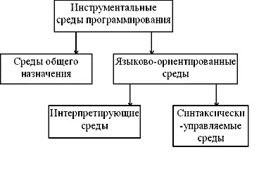

Рис. Классификация инструментальных сред программирования. 

<strong>Понятие компьютерной технологии разработки программных средств и ее рабочие места.</strong>

Имеются некоторые трудности в выработке строгого определения CASE-технологии (компьютерной технологии разработки
	ПС). 

CASE - это абревиатура от английского Computer-Aided Software Engineering (Компьютерно-Помогаемая Инженерия
	Программирования). Но без помощи (поддержки) компьютера ПС уже давно не разрабатываются (используется хотя бы
	компилятор). 

В действительности, в это понятие вкладывается более узкий (специальный) смысл, который постепенно размывается (как
	это всегда бывает, когда какое-либо понятие не имеет строгого определения). 

Первоначально под CASE понималась инженерия ранних этапов разработки ПС (определение требований, разработка внешнего
	описания и архитектуры ПС) с использованием программной поддержки 

(программных инструментов). 

 Вопросы:

<ol>
	<li>Инструменты разработки программных средств</li>
	<li>Инструментальные среды разработки и сопровождения программных средств</li>
	<li>Инструментальные среды программирования</li>
	<li>CASE технологии</li>
</ol>
<h1>Лекция 10. Коллективная разработка программных продуктов</h1>

План:

<ol>
	<li>Системы контроля версий</li>
	<li>CVS</li>
	<li>Subversion, SVN</li>
	<li>GIT</li>
	<li>Бесплатные VCS серверы</li>
</ol>

Системы контроля версий

• Системы управления версиями (Version Control Systems, VCS) или Системы управления исходным кодом (Source Management
	Systems, SMS) — важный аспект разработки современного ПО.

• VCS предоставляет следующие возможности:

o Поддержка хранения файлов в репозитории.

o Поддержка истории версий файлов в репозитории.

o Нахождение конфликтов при изменении исходного кода и обеспечение синхронизации при работе в многопользовательской
	среде разработки.

o Отслеживание авторов изменений.

Классификация:

• Централизованные/распределённые — в централизованных системах контроля версий вся работа производится с центральным
	репозиторием, в распределённых — у каждого разработчика есть локальная копия репозитория.

• Блокирующие/не блокирующие — блокирующие системы контроля версий позволяют наложить запрет на изменение файла, пока
	один из разработчиков работает над ним, в неблокирующих один файл может одновременно изменяться несколькими
	разработчиками.

• Для текстовых данных/для бинарных данных — для VCS для текстовых данных очень важна поддержка слияния изменений,
	для VCS с инарными данными важна возможность блокировки.

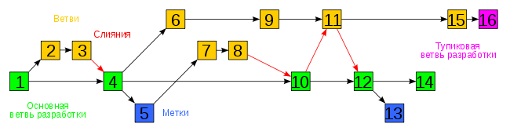<strong>Пример ветвления в проекте</strong>

<strong>CVS</strong>

Одна из наиболее старых систем контроля версий. Создана в 1984 году как развитие RCS (Revision Control System),
	которая не поддерживала совместную работу.

<strong>Subversion, SVN</strong>

Subversion, SVN — свободная централизованная система управления версиями, официально выпущенная в 2004 году компанией
	CollabNet Inc.

• Копирование объектов с разветвлением истории.

• Поддержка ветвления: создания ветвей (копированием директорий) и слияние ветвей (переносом изменений)

• Поддержка меток (копированием директорий).

• Поддержка разделение прав пользователей.

• История изменений и копии объектов (в том числе ветви и метки) хранятся в виде связанных разностных копий.

<strong>Subversion, SVN</strong>

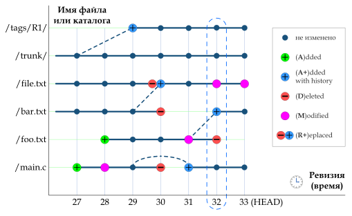

<strong>GIT</strong>

В 2005 году он решил запилить свою VCS с простыми мерджами и децентрализированной структурой.

Достоинства:

• Простая работа с ветками

• Развитые средства интеграции с другими VCS

• Продуманная система команд, позволяющая удобно встраивать git команды в скрипты

• Репозитории git могут распространяться и обновляться общесистемными файловыми утилитами, такими как rsync

Недостатки:

• Отсутствие переносимой на другие операционные системы поддержки путей в кодировке Unicode

• Команды ориентированы на наборы изменений, а не на файлы.

• Использование для идентификации ревизий хешей SHA1

• Проблемы с производительностью

<strong>GIT</strong>

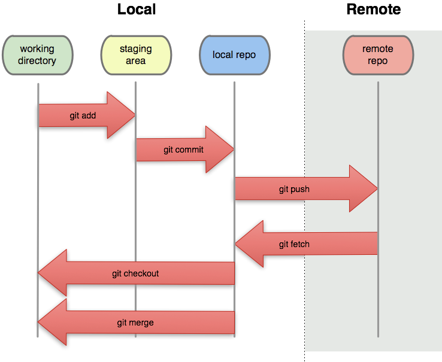

<strong>Бесплатные VCS серверы</strong>

Есть много сервисов, которые предоставляют открытые репозитории для совместной работы:

•sourceforge.net — SVN, Git, Mercurial, Bazaar, CVS репозитории.

•code.google.com — SVN, Git, Mercurial репозитории.

•github.com — Git репозитории.

•bitbucket.org — Git и Mercurial репозитории.

Вопросы:

<ol>
	<li>Системы контроля версий</li>
	<li>CVS</li>
	<li>Subversion, SVN</li>
	<li>GIT</li>
	<li>Бесплатные VCS серверы</li>
</ol>

<strong>Литература</strong>

<ol>
	<li>Рудаков А.В. Технология разработки программных продуктов. – М.: “Издательский центр “Академия”, 2013;</li>
	<li>Рудаков А. В. Технология разработки программных продуктов. Практикум. – М.: “Издательский центр “Академия”,
		2014;
	</li>
	<li>Котляров В. П. Основы тестирования программного обеспечения. – М.: “Интернет-Университет Информационных
		Технологий; БИНОМ. Лаборатория знаний”, 2012;
	</li>
	<li>Э. Орама, Г. Уилсона. Идеальная разработка ПО. Рецепты лучших программистов. – СПб.: “Питер”, 2012;</li>
	<li>Партыка Т. Л., Попов И.И. Информационная безопасность. – М.: “Форум”, “ИНФРА- М”, 2010;</li>
	<li>Н. В. Макарова, В. Б. Волков. Информатика. – СПб.: “Питер”, 2011;</li>
	<li>Вендров А.М. Проектирование программного обеспечения экономических информационных систем: Учебник. - 2-е изд.,
		перераб. и доп. – М.: Финансы и статистика, 2012;
	</li>
	<li>C/C++. Структурное Программирование: Практикум / Т. А. Павловская. Ю. А. Щупак. – СПб.: “Питер”, 2013;</li>
	<li>Лафоре. Р. Объектно-ориентированное программирование в C++. – СПб.: “Питер”, 2013;</li>
</ol>
