

Оглавление

<a href="#_Toc454872983">Лабораторная работа №1: “Классификация программных продуктов” 3</a>

<a href="#_Toc454872984">Лабораторная работа №2: “Жизненный цикл программ” 12</a>

<a href="#_Toc454872985">Лабораторная работа №3: “Документирование программных средств” 20</a>

<a href="#_Toc454872986">Лабораторная работа №4: “Документирование программных средств” 25</a>

<a href="#_Toc454872987">Лабораторная работа №5: “Структура программных продуктов” 32</a>

<a href="#_Toc454872988">Лабораторная работа №6: “Стиль программирования” 41</a>

<a href="#_Toc454872989">Лабораторная работа №7: “Языки программирования” 49</a>

<a href="#_Toc454872990">Лабораторная работа №8: “Модульное программирование” 58</a>

<a href="#_Toc454872991">Лабораторная работа №9, 10, 11, 12, 13, 14: “Структурное программирование” 64</a>

<a href="#_Toc454872992">Лабораторная работа №15, 16, 17, 18, 19: “Объектно-ориентированное программирование” 68</a>

<a href="#_Toc454872993">Лабораторная работа №20: “Программирование и оптимизация программ” 99</a>

<a href="#_Toc454872994">Литература 112</a>

<h1>Лабораторная работа №1: “Классификация программных продуктов”</h1>

<strong>Порядок выполнения работы </strong>

1. Ознакомьтесь с теоретическими основами в настоящих указаниях и конспектах лекций. 

2. Получите задание у преподавателя. 

3. Сделайте скриншоты (кнопка клавиатуры PrtSc) выполненных заданий в текстовом (Word) файле <em>Фамилия_ЛР</em>

4. Составьте отчет по лабораторной работе. 

5. Отчитайте работу преподавателю.

<strong>Цель работы</strong>

Изучение основ использования OpenGL и GLUT. Создание простейшего приложения с использованием OpenGL.

<strong>1. Что такое GLUT?</strong>

OpenGL является мультиплатформенной библиотекой, т.е. программы, написанные с помощью OpenGL, можно легко переносить
	на различные операционные системы, при этом получая один и тот же визуальный результат. Единственное, что плохо –
	это то, что для конкретной операционной системы необходимо по-своему производить настройку OpenGL. То есть,
	допустим, Вы написали OpenGL программу под Windows и захотели перенести её в Linux, код OpenGL должен перенестись
	без проблем, но операции с окнами, интерфейс управления, операции с устройствами ввода/вывода нужно заново
	переписать уже под другую операционную систему – Linux. К счастью, существует специальная мультиплатформенная
	библиотека, позволяющая решить вышеописанные проблемы. И называется эта библиотека – GLUT.

<strong>2. Основные шаги для построения минимальной программы</strong>

Прежде всего необходимо научиться самому основному – это созданию окна, в котором можно будет рисовать с помощью
	OpenGL. Минимальная программа, которая создает окно и что-нибудь рисует там, состоит из следующих шагов:

1. Инициализация GLUT

2. Установка параметров окна.

3. Создание окна.

4. Установка функций, отвечающих за рисование в окне и изменение формы окна.

5. Вход в главный цикл GLUT.

Рассмотрим все 5 пунктов поподробнее.

1. Инициализация GLUT производится командой: 

<em>void glutInit(int *argcp, char **argv);  </em>

Первый параметр представляет собой указатель на количество аргументов в командной строке, а второй – указатель на
	массив аргументов. Обычно эти значения берутся из главной функции программы: int main(int argc, char *argv[]).

2. Установка параметров окна содержит в себе несколько этапов. Прежде всего, необходимо указать размеры окна:

<em>void glutInitWindowSize(int width, int height);</em>

Первый параметр width – ширина окна в пикселях, второй height – высота окна в пикселях. Если эту команду опустить, то
	GLUT сам установит размеры окна по умолчанию, обычно это 300x300.

Далее можно задать положение создаваемого окна относительно верхнего левого угла экрана. Делается это командой:

<em>void glutInitWindowPosition(int x, int y); </em>

Необходимо также установить для окна режим отображения информации, т. е. установить для окна такие параметры, как:
	используемая цветовая модель, количество различных буферов, и т.д. Для этого в GLUT существует команда:

<em>void glutInitDisplayMode(unsigned int mode); </em>

У команды имеется единственный параметр, который может быть представлен одной из следующих констант или комбинацией
	этих констант с помощью побитового ИЛИ.

<table>
	<tr>
		<td>
Константа
</td>
		<td>
Значение
</td>
	</tr>
	<tr>
		<td>
GLUT_RGB
</td>
		<td>
Для отображения графической информации используются 3 компоненты цвета RGB
</td>
	</tr>
	<tr>
		<td>
GLUT_RGBA
</td>
		<td>
То же что и RGB, но используется также 4 компонента ALPHA (прозрачность)
</td>
	</tr>
	<tr>
		<td>
GLUT_INDEX
</td>
		<td>
Цвет задается не с помощью RGB компонентов, а с помощью палитры. Используется для старых дисплеев, где
			количество цветов, например, 256
</td>
	</tr>
	<tr>
		<td>
GLUT_SINGLE
</td>
		<td>
Вывод в окно осуществляется с использованием 1 буфера. Обычно используется для статического вывода
			информации
</td>
	</tr>
	<tr>
		<td>
GLUT_DOUBLE
</td>
		<td>
Вывод в окно осуществляется с использованием 2 буферов. Применяется для анимации, чтобы исключить эффект
			мерцания
</td>
	</tr>
	<tr>
		<td>
GLUT_ACCUM
</td>
		<td>
Использовать также буфер накопления (Accumulation Buffer). Этот буфер применяется для создания
			специальных эффектов, например отражения и тени
</td>
	</tr>
	<tr>
		<td>
GLUT_ALPHA
</td>
		<td>
Использовать буфер ALPHA. Этот буфер, как уже говорилось, используется для задания 4-го компонента
			цвета – ALPHA. Обычно применяется для таких эффектов, как прозрачность объектов и антиалиасинг
</td>
	</tr>
	<tr>
		<td>
GLUT_DEPTH
</td>
		<td>
Создать буфер глубины. Этот буфер используется для отсечения невидимых линий в 3D пространстве при выводе
			на плоский экран монитора
</td>
	</tr>
	<tr>
		<td>
GLUT_STENCIL
</td>
		<td>
Буфер трафарета используется для таких эффектов, как вырезание части фигуры, делая этот кусок прозрачным.
			Например, наложив прямоугольный трафарет на стену дома, Вы получите окно, через которое можно увидеть, что
			находится внутри дома
</td>
	</tr>
	<tr>
		<td>
GLUT_STEREO
</td>
		<td>
Этот флаг используется для создания стереоизображений. Используется редко, так как для просмотра такого
			изображения нужна специальная аппаратура
</td>
	</tr>
</table>

Вот пример использования этой команды: void glutInitDisplayMode(GLUT_RGB | GLUT_DOUBLE); 

3. Создание окна. После того как окно установлено, необходимо его создать. 

<em>int glutCreateWindow(const char *title);  </em>

Эта команда создаёт окно с заголовком, который Вы укажете в качестве параметра, и возвращает HANDLER окна в виде
	числа int. Этот HANDLER обычно используется для последующих операций над этим окном, таких как изменение параметров
	окна и закрытие окна. 

4. Установка функций, отвечающих за рисование в окне и изменение формы окна.

После того как окно, в которое будет выводиться графическая информация, подготовлено и создано, необходимо связать с
	ним процедуры, которые будут отвечать за вывод графической информации, следить за размерами окна, следить за
	нажатиями на клавиши и т.д. Самая первая и самая необходимая функция, которую мы рассмотрим, отвечает за рисование.
	Именно она всегда будет вызываться операционной системой, чтобы нарисовать (перерисовать) содержимое окна. Итак,
	задаётся эта функция командой:

<em>void glutDisplayFunc(void (*func)(void));</em>

Единственный параметр этой функции – это указатель на функцию, которая будет отвечать за рисование в окне. Например,
	чтобы функция void Draw(void), определенная в вашей программе, отвечала за рисование в окне, надо присоединить ее к
	GLUT следующим образом: glutDisplayFunc(Draw);

И ещё одна функция, которая является важной – это функция, которая отслеживает изменения окна. Как только у окна
	изменились размеры, необходимо перестроить вывод графической информации уже в новое окно с другими размерами. Если
	этого не сделать, то, например, увеличив размеры окна, вывод информации будет производиться в старую область окна, с
	меньшими размерами. Определить функцию, отвечающую за изменение размеров окна, нужно следующей командой:

<em>void glutReshapeFunc(void (*func)(int width, int height));</em>

Единственный параметр – это указатель на функцию, отвечающую за изменение размеров окна, которая как видно должна
	принимать два параметра width и height, соответственно ширина и высота нового (измененного) окна.

5. Вход в главный цикл GLUT.

Ну и последнее, что необходимо сделать, чтобы запустить программу – это войти в так называемый главный цикл GLUT.
	Этот цикл запускает на выполнение так называемое сердце GLUT, которое обеспечивает взаимосвязь между операционной
	системой и теми функциями, которые отвечают за окно, получают информацию от устройств ввода/вывода. Для того чтобы
	перейти в главный цикл GLUT, надо выполнить единственную команду:

<em>void glutMainLoop(void);</em>

Вот в принципе основные шаги для самой простейшей GLUT программы. Ниже приведена простейшая программа с
	использованием средств библиотеки GLUT, которая рисует в окне изображение сферы.

Команда <em>glFlush()</em> гарантирует, что команда рисования будет выполнена немедленно, а не сохранена в буфере.

И ещё, прежде чем использовать функции из GLUT, необходимо к программе подключить заголовок: #include &lt;GL/glut.h&gt;.

<strong>3. Создание консольного приложения, использующего OpenGL</strong>

Самым простым объектом, с помощью которого можно увидеть всю мощь OpenGL, является сфера. Давайте попытаемся ее
	изобразить. Для этого надо создать новый проект в VisualC++, выполнить следующие действия: 

1. Запустите MSVisualC++6.0.

2. Щелкните меню File-&gt;New-&gt;Win32 Console Application. 

3. Выберите каталог и имя проекта, впишите – sphere, щелкните OK. 

4. Выберите An Empty Project, щелкните Finish. 

5. Создайте в проекте файл sphere.c. 

6. Щелкните Build-&gt;Set Active Configuration и установите тип проекта sphere – Win32 Release 

7. Далее, щелкайте Project-&gt;Settings-&gt;Link-&gt;Object/library modules и добавьте туда opengl32.lib, glu32.lib и
	gllut32a.lib.

8. Теперь откомпилируйте и запустите Вашу программу.  Меню Build-&gt;Execute Sphere.exe 

Текст программы Sphere.exe:

#include &lt;windows.h&gt;

#include &lt;GL/gl.h&gt;

#include &lt;GL/glu.h&gt;

#include &lt;GL/glaux.h&gt;

#include &lt;GL/glut.h&gt;

void resize<strong>(</strong>int width<strong>,</strong>int height<strong>)</strong>

<strong>{</strong>

<strong>}</strong>

void display<strong>(</strong>void<strong>)</strong>

<strong>{</strong>

 glColor3d<strong>(</strong>1<strong>,</strong>1<strong>,</strong>0<strong>);</strong>

 glutSolidSphere<strong>(</strong>1.0<strong>,</strong> 25<strong>,</strong> 25<strong>);</strong>

 glFlush<strong>();</strong>

<strong>}</strong>

void init<strong>(</strong>void<strong>)</strong>

<strong>{</strong>

 glEnable<strong>(</strong>GL_COLOR_MATERIAL<strong>);</strong>

 glEnable<strong>(</strong>GL_LIGHTING<strong>);</strong>

 glEnable<strong>(</strong>GL_LIGHT0<strong>);</strong>

 glEnable<strong>(</strong>GL_DEPTH_TEST<strong>);</strong>

 glClearColor <strong>(</strong>0.0<strong>,</strong> 0.0<strong>,</strong> 0.0<strong>,</strong>
	0.0<strong>);</strong>

 glClear<strong>(</strong>GL_COLOR_BUFFER_BIT <strong>|</strong> GL_DEPTH_BUFFER_BIT<strong>);</strong>

 glMatrixMode<strong>(</strong> GL_PROJECTION <strong>);</strong>

 glLoadIdentity<strong>();</strong>

	glOrtho<strong>(-</strong>5.0<strong>,</strong>5.0<strong>,-</strong>5.0<strong>,</strong>5.0<strong>,</strong>2.0<strong>,</strong>12.0<strong>);</strong>

 gluLookAt<strong>(</strong> 0<strong>,</strong>0<strong>,</strong>5<strong>,</strong>
	0<strong>,</strong>1<strong>,</strong>0<strong>,</strong> 0<strong>,</strong>1<strong>,</strong>0
	<strong>);</strong>

 glMatrixMode<strong>(</strong> GL_MODELVIEW<strong>);</strong>

<strong>}</strong>

int main<strong>(</strong>int argc<strong>,</strong>char <strong>**</strong> argv<strong>)</strong>

<strong>{</strong>

 glutInitDisplayMode<strong>(</strong>GLUT_SINGLE <strong>|</strong> GLUT_RGB <strong>|</strong>
	GLUT_DEPTH<strong>);</strong>

 glutInitWindowPosition<strong>(</strong>50<strong>,</strong>10<strong>);</strong>

 glutInitWindowSize<strong>(</strong>400<strong>,</strong>400<strong>);</strong>

 glutCreateWindow<strong>(</strong>«Hello»<strong>);</strong>

 glutReshapeFunc<strong>(</strong>resize<strong>);</strong>

 init<strong>();</strong>

 glutDisplayFunc<strong>(</strong>display<strong>);</strong>

 glutMainLoop<strong>();</strong>

<strong>return</strong> 0<strong>;</strong>

<strong>}</strong>

<strong>4. Синтаксис команд OpenGl</strong>

Командами в OpenGl называются функции или процедуры. Для их описания используется следующий синтаксис:

<strong>type glCommand_name[1 2 3 4][b s i f d ub us ui][v](type1 arg1,-,typeN argN)</strong>

gl – это имя библиотеки, в которой описана эта функция: для базовых функций OpenGL, функций из библиотек GLU,
	GLUT, GLAUX это gl, glu, glut, aux соответственно.

Command_name имя команды [1 2 3 4]число аргументов команды [b s i f d ub us ui ]тип аргумента:

Доступны следующие типы: 

b – GLbyte байт; s – GLshort короткое целое; i – GLint целое; f – GLfloat дробное; d – GLdouble дробное с двойной
	точностью; ub – GLubyte беззнаковый байт; us – GLushort беззнаковое короткое целое; ui – GLuint беззнаковое целое;
	v – массив из n параметров указанного типа; 

[v] – наличие этого символа показывает, что в качестве параметров функции используется указатель на массив
	значений. 

Символы в квадратных скобках в некоторых названиях не используются. Например, команда glVertex2i() описана как
	базовая в библиотеке OpenGL, и использует в качестве параметров два целых числа, а команда glColor3fv() использует в
	качестве параметра указатель на массив из трех вещественных чисел.

Ниже приведены примеры использования команд OpenGL с различными типами аргументов.

 double array[] = {0.5, 0.75, 0.3, 0.7};

 ...

 glColor3dv(array);

 glColor3ub(200,100,0); // приводится к 200/256, 100/256, 0/256

 glColor3d(0.25,0.25,0); // темно-желтый

 glColot3ub(0,100,0); // темно-зеленый

 glColor3ub(0,0,255); // синий

<strong>Задание на лабораторную работу</strong>

1. Ввести и отладить программу, приведенную в п.3.

2.Заменить функцию glutSolidSphere на функцию, из указанных ниже с соответсвующими параметрами. Значения параметров
	устанавливайте порядка единицы – 0,5…1,7. Если Вы укажете слишком маленький размер, фигуру будет плохо видно; если
	слишком большой, то она получится урезанной. Это связано с тем, что ее край как бы вылезет из монитора. 

glutSolidCube(width) // куб 

glutSolidTorus(r,R) // тор 

glutSolidCylinder(r,height) // цилиндр 

glutSolidCone(r,height) // конус 

glutSolidIcosahedron(width) // многогранники 

glutSolidOctahedron(width) 

glutSolidTetrahedron(width) 

glutSolidDodecahedron(width) 

glutSolidTeapot(width) // рисует чайник 

3. С помощью вышеуказанных функций нарисовать проволочные фигуры, заменив и имена функций Solid на Wire. 

<strong>Контрольные вопросы</strong>

1. Назначение пакета OpenGl.

2. Назначение и использование библиотеки GLUT.

3. Синтаксис команд OpenGL.

4. Создание приложения с использованием OpenGL в среде Visual C++.

5. Режимы отображения информации в окне.

<h1>Лабораторная работа №2: “Жизненный цикл программ”</h1>

<strong>Порядок выполнения работы </strong>

1. Ознакомьтесь с теоретическими основами в настоящих указаниях и конспектах лекций. 

2. Получите задание у преподавателя. 

3. Сделайте скриншоты (кнопка клавиатуры PrtSc) выполненных заданий в текстовом (Word) файле <em>Фамилия_ЛР</em>

4. Составьте отчет по лабораторной работе. 

5. Отчитайте работу преподавателю.

<strong>Цель работы</strong>

Изучение команд OpenGL для рисования графических примитивов.

<strong>1. Примитивы OpenGL</strong>

Точки, линии, треугольники, четырехугольники,
	многоугольники – простые объекты, из которых состоят любые сложные фигуры. В предыдущей лаборатоной работе мы
	рисовали сферу, конус и тор. OpenGL непосредственно не поддерживает функций для создания таких сложных объектов,
	т.е. таких функций нет в opengl32.dll. Эти функции есть в библиотеке утилит glu32.dll, и устроены они следующим
	образом. Для того чтобы нарисовать сферу, функция glutSolidSphere использует функции из библиотеки glu32.dll, а те,
	в свою очередь, используют базовую библиотеку opengl32.dll и из линий или многоугольников строят сферу. Примитивы
	создаются следующим образом: 

 glBegin(GLenum mode); // указываем, что будем рисовать 

 glVertex[2 3 4][s i f d](...); // первая вершина

 // тут остальные вершины 

 glVertex[2 3 4][s i f d](...); // последняя вершина

 glEnd(); // закончили рисовать примитив

Сначала Вы говорите, что будете рисовать – glBegin с соответсвующим параметром. Возможные значения mode перечислены
	ниже в табл. 2.1. Далее Вы указываете вершины, определяющие объекты указанного типа. Обычно, Вы будете задавать
	вершину одним из четырех способов. 

glVertex2d(x,y); // две переменных типа double

glVertex3d(x,y,z); // три переменных типа double

glVertex2dv(array); // массив из двух переменных типа double

glVertex3dv(array); // массив из трех переменных типа double

И, наконец, Вы вызваете glEnd(), чтобы указать, что Вы закончили рисовать объекты типа, указанного в glBegin(). Далее
	мы подробно разберем создание всех примитивов.

Таблица 2.1

<table>
	<tr>
		<td>
Значение mode
</td>
		<td>
Описание
</td>
	</tr>
	<tr>
		<td>
GL_POINTS
</td>
		<td>
Каждый вызов glVertex задает отдельную точку
</td>
	</tr>
	<tr>
		<td>
GL_LINES
</td>
		<td>
Каждая пара вершин задает отрезок
</td>
	</tr>
	<tr>
		<td>
GL_LINE_STRIP
</td>
		<td>
Рисуется ломаная
</td>
	</tr>
	<tr>
		<td>
GL_LINE_LOOP
</td>
		<td>
Рисуется ломаная, причем ее последняя точка соединяется с первой
</td>
	</tr>
	<tr>
		<td>
GL_TRIANGLES
</td>
		<td>
Каждые три вызова glVertex задают треугольник
</td>
	</tr>
	<tr>
		<td>
GL_TRIANGLE_STRIP
</td>
		<td>
Рисуются треугольники с общей стороной
</td>
	</tr>
	<tr>
		<td>
GL_TRIANGLE_FAN
</td>
		<td>
То же самое, но по другому правилу соединяются вершины
</td>
	</tr>
	<tr>
		<td>
GL_QUADS
</td>
		<td>
Каждые четыре вызова glVertex задают четырехугольник
</td>
	</tr>
	<tr>
		<td>
GL_QUAD_STRIP
</td>
		<td>
Четырехугольники с общей стороной
</td>
	</tr>
	<tr>
		<td>
GL_POLYGON
</td>
		<td>
Многоугольник
</td>
	</tr>
</table>

<strong>2. Точки</strong>

Вы можете нарисовать столько точек, сколько вам нужно. Вызывая
	glVertex3d, вы устанавливаете новую точку. Размер точки можно устанавливать с помощью функции: 

<em>void glPointSize(GLfloat size);</em>

Режим сглаживания можно устанавливать вызовом функции 

<em>glEnable(GL_POINT_SMOOTH);</em>

Отключается, соответственно, вызовом glDisable() c этим параметром. Последние
	функции – glPointSize и glEnable/glDisable надо вызывать вне glBegin/glEnd, иначе они будут проигнорированы. 

Примеры рисования точек:

 // рисуем точки

 glPointSize(2); 

 glBegin(GL_POINTS); 

 glColor3d(1,0,0); 

 glVertex3d(-4.5,4,0); // первая точка

 glColor3d(0,1,0); 

 glVertex3d(-4,4,0); // вторая точка

 glColor3d(0,0,1); // третья

 glVertex3d(-3.5,4,0);

 glEnd();

 glPointSize(5); 

 glBegin(GL_POINTS); 

 glColor3d(1,0,0); 

 glVertex3d(-2,4,0); // первая точка

 glColor3d(0,1,0); 

 glVertex3d(-1,4,0); // вторая точка 

 glColor3d(0,0,1); // третья точка

 glVertex3d(0,4,0);

 glEnd();

<strong>3. Линии</strong>

Для линий Вы также можете изменять ширину, цвет, размер, сглаживание. Если вы зададите разные цвета для начала и
	конца линии, то ее цвет будет переливающимся. OpenGL по умолчанию делает интерполяцию. Так же Вы можете рисовать
	прерывистые линии, делается это путем наложения маски при помощи следующей функции: 

<em>void glLineStipple(GLint factor, GLushort pattern );</em>

Второй параметр задает саму маску. Например, если его значение равно 255(0x00FF), то, чтобы вычислить задаваемую
	маску, воспользуемся калькулятором. В двоичном виде это число выглядит так: 0000000011111111, т.е. всего 16 бит.
	Старшие восемь установлены в ноль, значит, тут линии не будет. Младшие установлены в единицу, тут будет рисоваться
	линия. Первый параметр определяет, сколько раз повторяется каждый бит. Скажем, если его установить равным 2, то
	накладываемая маска будет выглядить так: 

00000000000000001111111111111111

Далее приведен исходный текст с комментариями 

 glLineWidth(1); // ширину линии устанавливаем 1

 glBegin(GL_LINES);

 glColor3d(1,0,0); // красный цвет

 glVertex3d(-4.5,3,0); // первая линия

 glVertex3d(-3,3,0); 

 glColor3d(0,1,0); // зеленый

 glVertex3d(-3,3.3,0); // вторая линия

 glVertex3d(-4,3.4,0); 

 glEnd();

 glLineWidth(3); // ширина 3

 glBegin(GL_LINE_STRIP); // см. ниже

 glColor3d(1,0,0);

 glVertex3d(-2.7,3,0);

 glVertex3d(-1,3,0);

 glColor3d(0,1,0);

 glVertex3d(-1.5,3.3,0); 

 glColor3d(0,0,1);

 glVertex3d(-1,3.5,0); 

 glEnd();

 glLineWidth(5);

 glEnable(GL_LINE_SMOOTH); 

 glEnable(GL_LINE_STIPPLE); // разрешаем рисовать прерывистую линию

 glLineStipple(2,58360); // устанавливаем маску

 glBegin(GL_LINE_LOOP);

 glColor3d(1,0,0);

 glVertex3d(1,3,0);

 glVertex3d(4,3,0);

 glColor3d(0,1,0);

 glVertex3d(3,2.7,0); 

 glColor3d(0,0,1);

 glVertex3d(2.5,3.7,0); 

 glEnd();

 glDisable(GL_LINE_SMOOTH);

 glDisable(GL_LINE_STIPPLE);

<strong>4. Треугольники</strong>

Для треугольника можно задавать те же параметры, что и для линии, плюс есть еще одна функция glPolygonMode. Она
	устанавливает опции для отрисовки многоугольника. Первый параметр может принимать значения – GL_FRONT, GL_BACK и
	GL_FRONT_AND_BACK. Второй параметр указывает, как будет рисоваться многоугольник. Он принимает значения:
	GL_POINT(рисуются только точки), GL_LINE(рисуем линии) и GL_FILL(рисуем заполненный многоугольник). Первый параметр
	указывает: к лицевой, тыльной или же к обеим сторонам применяется опция, заданная вторым параметром. Треугольники
	можно рисовать, передав GL_TRIANGLE_STRIP или GL_TRIANGLE_FAN в glBegin. В первом случае, первая, вторая и третья
	вершины задают первый треугольник. Вторая, третья и четвертая вершины – второй треугольник. Третья, четвертая и
	пятая вершина – третий треугольник и т.д. Вершины n, n+1 и n+2 определят n-й треугольник. Во втором случае, первая,
	вторая и третья вершины задают первый треугольник. Первая, третья и четвертая вершины задают второй треугольник и
	т.д. Вершины 1, n+1, n+2 определяют n-й треугольник. Далее следует пример с комментариями. 

glPolygonMode(GL_FRONT_AND_BACK, GL_FILL); // см. выше

 glBegin(GL_TRIANGLES);

 glColor3d(1,0,0); // рисуем треугольник

 glVertex3d(-4,2,0);

 glVertex3d(-3,2.9,0);

 glVertex3d(-2,2,0);

 glEnd();

glLineWidth(2);

 glPolygonMode(GL_FRONT_AND_BACK, GL_LINE); //рисуем проволочные треугольники

glBegin(GL_TRIANGLE_STRIP); // обратите внимание на порядок вершин

 glColor3d(0,1,0);

 glVertex3d(1,2,0);

 glVertex3d(0,2.9,0);

 glVertex3d(-1,2,0);

 glVertex3d(0,1.1,0);

 glEnd();

 glEnable(GL_LINE_STIPPLE); 

 glPolygonMode(GL_FRONT_AND_BACK, GL_LINE);

 glBegin(GL_TRIANGLE_FAN);

 glColor3d(0,0,1);

 glVertex3d(4,2,0);

 glVertex3d(2.6,2.8,0);

 glVertex3d(2,2,0);

 glVertex3d(3,1.1,0);

 glEnd();

 glDisable(GL_LINE_STIPPLE);

<strong>5. Четырехугольники</strong>

Четырехугольники рисуются вызовом функции glBegin с параметром GL_QUADS или GL_QUAD_STRIP. Для первого случая каждые
	четыре вершины определяют свой четырехугольник. Во втором случае рисуются связанные четырехугольники. Первая,
	вторая, третья и четвертая вершины определяют первый четырехугольник. Третья, четвертая, пятая и шестая вершины –
	второй четырехугольник и т.д. (2n-1), 2n, (2n+1) и (2n+2) вершины задают n-й четырехугольник. Многоугольники
	задаются вызовом glBegin с параметром GL_POLYGON. Все вершины определяют один многоугольник. Для многоугольников
	можно задавать стили при помощи вышеописанной функции glPolygonMode, толщину линии, толщину точек и цвет.

<strong>Задание на лабораторную работу</strong>

1. Изобразить точки, линии, треугольники, многоугольники в одном окне. 

2. Построить изображение фигуры, заданной преподавателем.

<strong>Контрольные вопросы</strong>

1. Определение примитива. Примитивы OpenGL.

2. Рисование точек и линий средствами OpenGL.

3. Рисование треугольников и многоугольников средствами OpenGL.

4. Полосы из треугольников и прямоугольников.

<h1>Лабораторная работа №3: “Документирование программных средств”</h1>

<strong>Порядок выполнения работы </strong>

1. Ознакомьтесь с теоретическими основами в настоящих указаниях и конспектах лекций. 

2. Получите задание у преподавателя. 

3. Сделайте скриншоты (кнопка клавиатуры PrtSc) выполненных заданий в текстовом (Word) файле <em>Фамилия_ЛР</em>

4. Составьте отчет по лабораторной работе. 

5. Отчитайте работу преподавателю.

<strong>Цель работы</strong>

Изучение способов организации интерактивного взвамодействия с пользователем в программах, использующих OpenGL.

<strong>1. Взаимодействие с пользователем в OpenGL</strong>

Функции библиотеки GLUT реализуют так называемый событийно-управляемый механизм. Это означает, что есть некоторый
	внутренний цикл, который запускается после соответствующей инициализации и обрабатывает одно за другим все события,
	объявленные во время инициализации. К событиям относятся: щелчок мыши, закрытие окна, изменение свойств окна,
	передвижение курсора, нажатие клавиши, и «пустое» (idle) событие, когда ничего не происходит. Для проведения
	периодической проверки совершения того или иного события надо зарегистрировать функцию, которая будет его
	обрабатывать. Для этого используются функции вида:

void glutDisplayFunc (void (*func) (void))

void glutReshapeFunc (void (*func) (int width, int height))

void glutMouseFunc (void (*func) (int button, int state, int x, int y))

void glutIdleFunc (void (*func) (void))

void glutKeyboardFunc(void (*func)(unsigned int key, int x, int y)

void glutMotionFunc(void (*func)(int x, int y)); 

<em>void glutKeyboardFunc(void (*func)(unsigned int key, int x, int y); </em>

Определяет функцию (func), которая вызывается, когда нажата клавиша на клавиатуре. Возвращаемые параметры:

key – сгенерированный клавиатурой ASCII код;

x,y – координаты положения мыши в координатах отображаемого окна, в момент, когда была нажата кнопка на
	клавиатуре.

<em>void glutMouseFunc(void (*func)(int button, int state, int x, int y)); </em>

Определяет функцию (func) которая вызывается, когда кнопка мыши нажата или отпущена. Возвращаемый функцией параметр
	button может принимать значения GLUT_LEFT_BUTTON, GLUT_MIDDLE_BUTTON, или GLUT_RIGHT_BUTTON. Значение параметра
	state есть GLUT_UP или GLUT_DOWN в зависимости от того, была ли кнопка мыши нажата или отпущена, x and y параметры
	указывают на координаты в текущем окне, где находилась мышь в момент нажатия или отпускания кнопки.

<em>void glutMotionFunc(void (*func)(int x, int y)); </em>

Определяет функцию (func) которая вызывается, когда указатель мыши перемещается в пределах окна при нажатой одной или
	более кнопке, x and y параметры указывают на координаты в текущем окне, где находилась мышь в момент начала события
	<em>void glutPostRedisplay(void); </em>

Отмечает текущее окно как требующее перерисовки. На следующем шаге работы программы будет вызвана функция,
	зарегистрированная в glutDisplayFunc().

<em>void glutIdleFunc (void (*func) (void));</em>

glutIdleFunc() задает функцию, которая будет вызываться каждый раз, когда нет событий от пользователя.

<strong>2. Видовое преобразование</strong>

К видовым преобразованиям будем относить перенос, поворот и изменение масштаба вдоль координатных осей. Для
	проведения этих операций достаточно умножить на соответствующую матрицу каждую вершину объекта и получить измененные
	координаты этой вершины:

(x-, y-, z-, 1)T = M * (x, y, z, 1)T,

где M – матрица видового преобразования. Матрица M может быть создана с помощью следующих команд:

void glTranslate[f d](GLtype x, GLtype y, GLtype z)

void glRotate[f d](GLtype angle, GLtype x, GLtype y, GLtype z)

void glScale[f d](GLtype x, GLtype y, GLtype z)

glTranlsate..() производит перенос объекта, прибавляя к координатам его вершин значения своих параметров.

glRotate..() производит поворот объекта против часовой стрелки на угол angle (измеряется в градусах) вокруг вектора (
	x,y,z ).

glScale..() производит масштабирование объекта (сжатие или растяжение), домножая соответствующие координаты его
	вершин на значения своих параметров.

Все эти преобразования применимы к примитивам, описания которых будут находиться ниже в программе. В случае, если
	надо, например, повернуть один объект сцены, а другой оставить неподвижным, удобно сначала сохранить текущую видовую
	матрицу в стеке командой glPushMatrix(), затем вызвать glRotate..() с нужными параметрами, описать примитивы, из
	которых состоит этот объект, а затем восстановить текущую матрицу командой glPopMatrix().

<strong>3. Анимация</strong>

Если содержимое буфера кадра изменяется в процессе регенерации изображения, то зритель может увидеть совершенно
	нежелательные эффекты, например, дерганье изменяющейся картинки.

Эту проблему можно решить с использованием двойной буферизации – стандартной технологии организации компьютерной
	анимации. В этом случае в нашем распоряжении имеется два буфера кадра, которые принято называть рабочим и фоновым.
	Рабочий буфер – это тот, из которого выполняется регенерация изображения на экране, а в фоновом буфере изображение
	формируется программой. По командам из прикладной программы можно переключать функции буферов: сделать рабочим тот,
	который ранее был фоновым, а фоновым – тот, который ранее был рабочим. Механизм двойной буферизации устанавливается
	в процессе инициализации аргументом функции glutInitDisplayMode(). Вместо константы GLUT_SINGLE нужно задать
	константу GLUT_DOUBLE. Переключение буферов выполняется функцией glutSwapBuffers(). Все операторы формирования
	изображения включатся в функцию display(), но при использовании двойной буферизации в этой функции сначала нужно
	очистить рабочий буфер, вызвав команду glClear(), а последним оператором вызвать функцию переключения буферов
	glutSwapBuffers().

Программа рисования вращающегося квадрата 

#include &lt;GL/glut.h&gt;

#include &lt;stdlib.h&gt;

static GLfloat spin <strong>=</strong> 0.0<strong>;</strong>

void spinDisplay<strong>(</strong>void<strong>)</strong>

<strong>{</strong>

 spin <strong>=</strong> spin <strong>+</strong> 2.0<strong>;</strong>

<strong>if</strong> <strong>(</strong>spin <strong>&gt;</strong> 360.0<strong>)</strong>

 spin <strong>=</strong> spin – 360.0<strong>;</strong>

 glutPostRedisplay<strong>();</strong>

<strong>}</strong>

void display<strong>(</strong>void<strong>)</strong>

<strong>{</strong>

 glClear<strong>(</strong>GL_COLOR_BUFFER_BIT<strong>);</strong>

 glPushMatrix<strong>();</strong>

 glRotatef<strong>(</strong>spin<strong>,</strong> 0.0<strong>,</strong> 0.0<strong>,</strong> 1.0<strong>);</strong>

 glColor3f<strong>(</strong>1.0<strong>,</strong> 1.0<strong>,</strong> 1.0<strong>);</strong>

 glBegin<strong>(</strong>GL_POLYGON<strong>);</strong>

 glVertex2f<strong>(-</strong>25.0<strong>,-</strong>25.0<strong>);</strong>

 glVertex2f<strong>(</strong>25.0<strong>,-</strong>25.0<strong>);</strong>

 glVertex2f<strong>(</strong>25.0<strong>,</strong>25.0<strong>);</strong>

 glVertex2f<strong>(-</strong>25.0<strong>,</strong>25.0<strong>);</strong>

 glEnd<strong>(</strong> <strong>);</strong>

 glPopMatrix<strong>();</strong>

 glutSwapBuffers<strong>();</strong>

<strong>}</strong>

void init<strong>(</strong>void<strong>)</strong>

<strong>{</strong>

 glClearColor <strong>(</strong>0.0<strong>,</strong> 0.0<strong>,</strong> 0.0<strong>,</strong>
	0.0<strong>);</strong>

 glShadeModel <strong>(</strong>GL_FLAT<strong>);</strong>

<strong>}</strong>

void reshape<strong>(</strong>int w<strong>,</strong> int h<strong>)</strong>

<strong>{</strong>

 glViewport <strong>(</strong>0<strong>,</strong> 0<strong>,</strong> <strong>(</strong>GLsizei<strong>)</strong>
	w<strong>,</strong> <strong>(</strong>GLsizei<strong>)</strong> h<strong>);</strong>

 glMatrixMode<strong>(</strong>GL_PROJECTION<strong>);</strong>

 glLoadIdentity<strong>();</strong>

 glOrtho<strong>(-</strong>50.0<strong>,</strong> 50.0<strong>,</strong> <strong>-</strong>50.0<strong>,</strong>
	50.0<strong>,</strong> <strong>-</strong>1.0<strong>,</strong> 1.0<strong>);</strong>

 glMatrixMode<strong>(</strong>GL_MODELVIEW<strong>);</strong>

 glLoadIdentity<strong>();</strong>

<strong>}</strong>

int main<strong>(</strong>int argc<strong>,</strong> char<strong>**</strong> argv<strong>)</strong>

<strong>{</strong>

 glutInit<strong>(&amp;</strong>argc<strong>,</strong> argv<strong>);</strong>

 glutInitDisplayMode <strong>(</strong>GLUT_DOUBLE <strong>|</strong> GLUT_RGB<strong>);</strong>

 glutInitWindowSize <strong>(</strong>250<strong>,</strong> 250<strong>);</strong>

 glutInitWindowPosition <strong>(</strong>100<strong>,</strong> 100<strong>);</strong>

 glutCreateWindow <strong>(</strong>argv<strong>[</strong>0<strong>]);</strong>

 init <strong>();</strong>

 glutDisplayFunc<strong>(</strong>display<strong>);</strong>

 glutReshapeFunc<strong>(</strong>reshape<strong>);</strong>

 glutIdleFunc<strong>(</strong>spinDisplay<strong>);</strong>

 glutMainLoop<strong>();</strong>

<strong>return</strong> 0<strong>;</strong> /* ANSI C requires main to return int. */

<strong>}</strong>

<strong>Порядок выполнения лабораторной работы</strong>

1. Ввести и отладить программу рисования вращающегося квадрата.

2. Изменить программу п.1 таким образом, чтобы она управлялась нажатием клавиш на клавиатуре – при нажатии клавиши
	«x», квадрат вращается, при нажатии клавиши «X»- вращение прекращается, при нажатии клавиши «Esc» – программа
	завершает свою работу. 

3. Изменить программу п.1 таким образом, чтобы она управлялась нажатием клавиши мыши – при нажатии левой
	клавиши–квадрат вращается, при нажатии правой клавиши–вращение прекращается.

4. Нарисовать любую фигуру в одном из углов экрана. Обеспечить перемещение этой фигуры по экрану при нажатой и
	удерживаемой клавише мыши.

<strong>Контрольные вопросы</strong>

1. Назначение анимации. Методы создания анимации средствами OpenGL.

2. Диалоговые средства ввода. Реализация диалоговых средств ввода в библиотеке GLUT.

3. Видовое преобразование. Функции OpenGL, обеспечивающие видовое преобразование.

4. Матричное представление геометрических преобразований в однородных координатах.

<h1>Лабораторная работа №4: “Документирование программных средств”</h1>

<strong>Порядок выполнения работы </strong>

1. Ознакомьтесь с теоретическими основами в настоящих указаниях и конспектах лекций. 

2. Получите задание у преподавателя. 

3. Сделайте скриншоты (кнопка клавиатуры PrtSc) выполненных заданий в текстовом (Word) файле <em>Фамилия_ЛР</em>

4. Составьте отчет по лабораторной работе. 

5. Отчитайте работу преподавателю.

<strong>Цель работы</strong>

Изучение методов создания трехмерных объектов средствами OpenGL. Ислледование свойств полоских проекций трехмерных
	объектов.

<strong>1. Рисование трехмерного куба</strong>

Куб следует рассматривать как шесть многоугольников, которые определяют его грани. Массив вершин куба может быть
	представлен в следующем виде:

GLfloat vertices[][3]={{-1.0,-1.0,-1.0},{1.0,-1.0,-1.0},

{1.0,1.0,-1.0},{-1.0,1.0,-1.0},{-1.0,-1.0,1.0},

{1.0,-1.0,1.0},{1.0,1.0,1.0},{-1.0,1.0,1.0}};

Для определения граней куба можно использовать список точек–элементов массива вершин. Например, одна грань куба в
	тексте программы определяется следующим образом:

glBegin(GL_POLYGON);

 glVertex3fv(vertices[0]);

 glVertex3fv(vertices[3]);

 glVertex3fv(vertices[2]);

 glVertex3fv(vertices[1]);

glEnd();

Другие пять граней определяются аналогично. При определении трехмерных многогранников порядок перечисления вершин
	имеет большое значение. Следует учитывать, что многоугольник имеет две стороны – внутреннюю и внешнюю. Будем
	называть грань внешней, если при взгляде с внешней стороны объекта на эту грань ее вершины «обходятся» против
	часовой стрелки. Этот метод известен как «правило правой руки», поскольку, если расположить четыре согнутых пальца
	правой руки вдоль направления обхода контура, большой палец будет указывать наружную сторону грани. 

Список вершин можно использовать и для хранения информации, необходимой для раскрашивания куба. С вершинами в данном
	примере будут ассоциироваться чистые цвета вершин цветового куба (черный, белый, красный, зеленый, синий, голубой,
	фиолетовый, желтый):

GLfloat colors[][3]={{0.0,0.0,0.0},{1.0,0.0,0.0},

{1.0,1.0,0.0},{0.0,1.0,0.0},{0.0,0.0,1.0},

{1.0,0.0,1.0},{1.0,1.0,1.0},{0.0,1.0,1.0}};

Для управления режимом интерполяции цветов используется команда void <strong>glShadeModel</strong>(GLenummode), вызов
	которой с параметром GL_SMOOTH включает интерполяцию (установка по умолчанию), а с GL_FLAT отключает.

Функция quad() вычерчивает четырехугольник, заданный точками в списке вершин, а функция colorcube() задает шесть
	граней таким образом, чтобы все они были внешними.

GLfloat vertices[][3]={{-1.0,-1.0,-1.0},{1.0,-1.0,-1.0},

{1.0,1.0,-1.0},{-1.0,1.0,-1.0},{-1.0,-1.0,1.0},

{1.0,-1.0,1.0},{1.0,1.0,1.0},{-1.0,1.0,1.0}};

GLfloat colors[][3]={{0.0,0.0,0.0},{1.0,0.0,0.0},

{1.0,1.0,0.0},{0.0,1.0,0.0},{0.0,0.0,1.0},

{1.0,0.0,1.0},{1.0,1.0,1.0},{0.0,1.0,1.0}};

void polygon(int a, int b, int c, int d)

{

 glBegin(GL_POLYGON);

 glColor3fv(colors[a]);

 glVertex3fv(vertices[a]);

 glColor3fv(colors[b]);

 glVertex3fv(vertices[b]);

 glColor3fv(colors[c]);

 glVertex3fv(vertices[c]);

 glColor3fv(colors[d]);

 glVertex3fv(vertices[d]);

 glEnd();

}

void colorcube()

{

 polygon(0,3,2,1);

 polygon(2,3,7,6);

 polygon(0,4,7,3);

 polygon(1,2,6,5);

 polygon(4,5,6,7);

 polygon(0,1,5,4);

}

<strong>2. Проективные преобразования в OpenGL</strong>

В составе OpenGL имеются две функции для задания перспективных проекций и одна для задания параллельных проекций.
	Каждая из функций определяет зону видимости – пирамиду или параллелепипед. Объекты, не попадающие в эту зону,
	отсекаются и не включаются в отображаемую сцену.

<strong>3. Перспективные преобразования в OpenGL</strong>

Параметры пирамиды видимости задаются функцией <strong>glFrustum()</strong>, смысл аргументов которой поясняет рис.
	4.1.

<em>void </em><strong><em>glFrustum</em></strong><em>(GLdouble left, GLdouble right, GLdouble bottom, GLdouble top,
	GLdouble near, GLdouble far);</em>

Значения аргументов near и far, задающих положение передней и задней отсекающих плоскостей, должны быть
	положительными и отсчитываться от центра проецирования вдоль оси проецирования. 

Поскольку матрица проецирования умножается на текущую матрицу, сначала нужно задать режим работы с этой матрицей.
	Типичная последовательность операций представлена ниже. 

glMatrixMode(GL_PROJECTION);

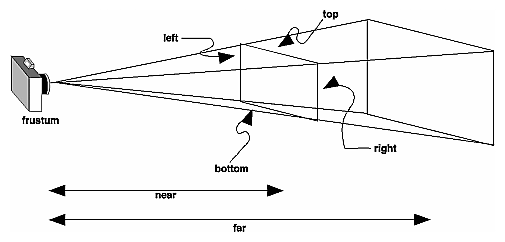

<em>Рис. 4.1</em>

glLoadIdentity();

glFrustum(xmin, xmax, ymin, ymax, near, far);

Во многих приложениях предпочтительнее задавать не линейные параметры, характеризующие положение углов усеченной
	пирамиды видимости, а угол и поле зрения. Однако если картинная плоскость является прямоугольником, а не квадратом,
	то нужно задавать пару углов зрения: один в вертикальной плоскости, другой- в горизонтальной (рис. 4.2).

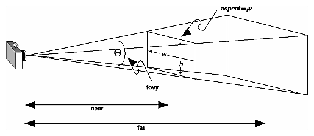

<em>Рис. 4.2</em>

<em>void </em><strong><em>gluPerspective</em></strong><em>(GLdouble fovy, GLdouble aspect,  GLdouble near,
	GLdouble far);</em>

Аргументы этой функции имеют следующий смысл:

<ul>
	<li>fovy – угол зрения в вертикальной плоскости;</li>
	<li>aspect – отношение ширины окна картинной плоскости к его высоте;</li>
	<li>near и far – расстояние от центра проецирования до передней и задней отсекающих плоскостей.</li>
</ul>

<strong>4. Параллельное проецирование в OpenGL</strong>

В составе OpenGL имеется только одна функция для задания параметров параллельного проецирования, которая формирует
	ортогональную проекцию. Зона видимости при этом превращается в параллелепипед (рис. 4.3.).

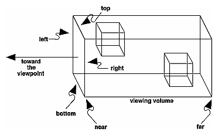

<em>Рис. 4.3</em>

<em>void </em><strong><em>glOrtho</em></strong><em>(GLdouble left, GLdouble right, GLdouble bottom,  GLdouble
	top, GLdouble near, GLdouble far); </em>

Аргументы вызова имеют тот же геометрический смысл, что и одноименные аргументы функции glFrustum().

<strong>5. Задание положения и ориентации камеры</strong>

В составе OpenGL имеется функция gluLookAt(), которая позволяет задать положение и ориентацию камеры (рис. 4.4).

<em>void </em><strong><em>gluLookAt</em></strong><em>(GLdouble eyex, GLdouble eyey, GLdouble eyez, GLdouble centerx,
	GLdouble centery, GLdouble centerz, GLdouble upx, GLdouble upy, GLdouble upz);</em>

Аргументы функции имеют следующий вид: 

<ul>
	<li>eyex, eyey, eyez – координаты точки наблюдения;</li>
	<li>centerx, centery, centerz – координаты контрольной точки объекта, указывающей центр сцены;</li>
	<li>upx, upy, upz- компоненты точки, которая задает положительное направления оси Y сцены.</li>
</ul>

<strong>Порядок выполнения работы</strong>

<ol>
	<li>Составить программу рисования куба.</li>
	<li>Получить перспективную и параллельную проекцию куба.</li>
	<li>Организовать перемещение камеры вокруг куба, изменяя координаты точки наблюдения – eyex, eyey, eyez. Для
		перемещения камеры использовать клавиатуру.
	</li>
</ol>

<strong>Контрольные вопросы</strong>

<ol>
	<li>Графический конвейер OpenGl.</li>
	<li>Виды проецирования. Параллельные и перспективные проекции.</li>
	<li>Способы получения триметрической, диметрической и изометрической проекции.</li>
</ol>

Перспективные проеции. Точки схода.

<h1>Лабораторная работа №5: “Структура программных продуктов”</h1>

<strong>Порядок выполнения работы </strong>

1. Ознакомьтесь с теоретическими основами в настоящих указаниях и конспектах лекций. 

2. Получите задание у преподавателя. 

3. Сделайте скриншоты (кнопка клавиатуры PrtSc) выполненных заданий в текстовом (Word) файле <em>Фамилия_ЛР</em>

4. Составьте отчет по лабораторной работе. 

5. Отчитайте работу преподавателю.

<strong>Цель работы</strong>

Изучение методов работы с растровыми примитивами OpenGl и методов наложения текстур.

<strong>1. Работа с изображением</strong>

Существует множество графических форматов – bmp, pcx, gif, jpeg и прочие. OpenGL напрямую не поддерживает ни один из
	них. В OpenGL нет функций чтения/записи графических файлов, но поддерживается работа с массивами пикселей. Вы
	загружаете графический файл, используя библиотеки других фирм, в память и работаете с ними средствами OpenGL. В
	массиве данные о пикселах могут располагаться разными способами: RGB, BGR, RGBA; могут присутствовать не все
	компоненты; каждый элемент массива может занимать один байт, два, четыре или восемь; выравнивание может быть по
	байту, слову или двойному слову. В общем, форматов расположения данных о графическом изображении в памяти очень
	много. 

Наиболее часто применяется формат, в котором информация о каждом пикселе хранится в формате RGB и занимает три байта,
	выравнивание по байту. В Auxiliary Library есть функция auxDIBImageLoad(LPCSTR), которая
	загружает в память bmp-файл и возвращает указатель на структуру: 

 typedef struct _AUX_RGBImageRec {

 GLint sizeX, sizeY;

 unsigned char *data;

} AUX_RGBImageRec; 

В OpenGL имеются функции для вывода массива пикселей на экран(glDrawPixels), копирования(glCopyPixels), масштабирования(gluScaleImage). Здесь
	мы рассмотрим только glDrawPixels. Все остальные функции работы с изображениями устроены похожим образом. Для того
	чтобы отобразить графический файл в окне OpenGL, вы должны загрузить его в память, указать выравнивание, установить
	точку, с которой начинается вывод изображения, и вывести его на экран. Создайте новый проект. Объявите глобальную
	переменную – 

AUX_RGBImageRec *image

Перед вызовом функции glutMainLoop() в функции main вставьте строку: 

image = auxDIBImageLoad(«photo.bmp»); 

Выравнивание устанавливается вызывом функции glPixelStorei с параметром
	GL_UNPACK_ALIGNMENT и вторым параметром – целым числом, которое указывает выравнивание. 

<em>void glPixelStore{if}(GLenum pname, TYPEparam); </em>

Функция установки способа хранения пикселов для выполнения следующих функций: glDrawPixels(), glReadPixels(),
	glBitmap(), glPolygonStipple(), glTexImage1D(), glTexImage2D(), glTexSubImage1D(), glTexSubImage2D(), and
	glGetTexImage().

Изображения выводятся прямо на экран. Поэтому все происходит в двухмерных координатах. Позиция, с которой начинается
	вывод изображения, указывается при помощи функции glRasterPos2d(x,y).

void glRasterPos{234}{sifd}(TYPE x, TYPE y, TYPE z, TYPE w); void glRasterPos{234}{sifd}v(TYPE *coords); 

Функция установки текущей позиции растра: x, y, z, w – однородные координаты, определяющие позицию растра. Если
	используется функция glRasterPos2*(), то z подразумевается равным 0, а w равным 1.

Также Вы можете установить размер пикселя, вызвав функцию glPixelZoom. Первый параметр этой функции – ширина, второй – высота пикселя. Вызов этой функции с
	аргументами (1,1), что соответствует нормальному пикселю. Замените (1,1) на (3,2) и Вы увидите, как картинка
	растянется в три раза по горизонтали и в два раза по вертикали. Это случилось потому, что теперь каждый пиксель
	изображения соответствует прямоугольнику 3х2 в окне. 

void glPixelZoom(GLfloat zoomx, GLfloat zoomy); 

Функция устанавливает фактор увеличения/уменьшения при выполнении операции записи пикселя в буфер кадра
	(glDrawPixels() или glCopyPixels()) по x и y координатам. По умолчанию zoomx и zoomy равны 1.0. Если оба значения
	равны 2, то каждый пиксель исходного изображения выводится в виде 4 пикселей в буфере кадра. Отрицательное значение
	фактора выполняет зеркальное отображение изображения относительно текущей позиции растра.

И, наконец, вывод осуществляет функция glDrawPixels. Первые два параметра – это ширина и высота. Далее, вы указываете
	формат, в котором хранится информация в памяти, и тип элементов массива. Последним указывается массив данных. 

void glDrawPixels(GLsizei width, GLsizei height, GLenum format,  GLenum type, const GLvoid *pixels); 

Функция выводит изображение прямоугольного массива пикселей размером width на height. Прямоугольник выводится,
	начиная с левого нижнего угла изображения в текущей позиции растра, format и type параметры могут принимать одно из
	значений, приведенных в Руководстве программиста по OpenGL. Массив pixels содержит данные о пикселях, которые должны
	быть выведены. 

В функцию display вставьте следующий код: 

glRasterPos2d(-4.5,-3); // нижний левый угол

glPixelZoom(1,1);

glPixelStorei(GL_UNPACK_ALIGNMENT, 1); // выравнивание

glDrawPixels(image-&gt;sizeX, image-&gt;sizeY, // ширина и высота

 GL_RGB, GL_UNSIGNED_BYTE, // формат и тип

 image-&gt;data); // сами данные

Также в OpenGL имеется функция glBitmap для отображения битовых массивов. Битовый массив – это последовательность
	байт, которые кодируют картинку из двух цветов. 

<strong>2. Наложение текстуры</strong>

Одного вывода изображений недостаточно для создания полноценных трехмерных сцен. Часто возникает потребность
	накладывать изображение на трехмерные объекты и поворачивать/сдвигать их. Для этих целей существуют текстуры. Также
	текстуры помогут вам покрыть весь объект в виде мозаики. Скажем, когда у вас имеется кирпичная стена, то вам не надо
	загружать изображение с кучей кирпичей. Достаточно загрузить один кирпич и указать, что эту текстуру нужно
	размножить по всей плоскости. 

Для того чтобы наложить текстуру на объект, вы должны: 

1. Загрузить графический файл в память. 

2. Создать имя-идентификатор текстуры. 

3. Сделать его активным. 

4. Создать саму текстуру в памяти. 

5. Установить параметры текстуры. 

6. Установить параметры взаимодействия текстуры с объектом. 

7. Связать координаты текстуры с объектом. 

1. Загрузка графического файла выполняется в соответствии с п. 1 лабораторной работы.

2. Создать имя-идентификатор текстуры. 

При использовании в сцене нескольких текстур в OpenGL применяется подход, напоминающий создание списков изображений.
	Вначале с помощью команды 

void glGenTextures(GLsizei n, GLuint*textures)

надо создать n идентификаторов для используемых текстур, которые будут записаны в массив textures.

Для единственной текстуры в приложении можно использовать следующую последовательность операторов:

static GLuint texName;

…

glGenTextures(1, &amp;texName);

3. Сделать имя текстуры активным.

Перед началом определения свойств очередной текстуры следует вызвать команду

void glBindTexture(GLenum target, GLuint texture),

где target может принимать значения GL_TEXTURE_1D или GL_TEXTURE_2D, а параметр texture должен быть равен
	идентификатору той текстуры, к которой будут относиться последующие команды. Для того чтобы в процессе рисования
	сделать текущей текстуру с некоторым идентификатором, достаточно опять вызвать команду glBindTexture() c
	соответствующим значением target и texture. Таким образом, команда glBindTexture() включает режим создания текстуры
	с идентификатором texture, если такая текстура еще не создана, либо режим ее использования, т. е. делает эту
	текстуру текущей. Например,

glBindTexture(GL_TEXTURE_2D, texName);

4. Создание текстуры в памяти.

Теперь создать саму текстуру в памяти. Массив байт в структуре AUX_RGBImageRec не является еще текстурой, потому что
	у текстуры много различных параметров. Создав текстуру, мы наделим ее определенными свойствами. Среди параметров
	текстуры вы указываете уровень детализации, способ масшабирования и связывания текстуры с объектом. Уровень
	детализации нужен для наложения текстуры на меньшие объекты, т.е. когда площадь на экране меньше размеров
	изображения. Нулевой уровень детализации соответствует исходному изображению размером 2nx2m,
	первый уровень – 2n-1x2m-1, k-й уровень – 2n-kx2m-k. Число уровней соответствует min(n,m). Для
	создания текстуры имеется две функции glTexImage[1/2]D и gluBuild[1/2]DMipmaps. 

glTexImage2D( gluBuild2DMipmaps(

 GLenum target, GLenum target, 

 GLint lavel, GLint components, 

 GLint components, GLsizei width,

 GLsizei width, GLsizei height,

 GLsizei height, GLenum format,

 GLint border, GLenum type,

 GLenum format, const GLvoid* pixels) 

 GLenum type,

 const GLvoid* pixels)

Основное различие в том, что первая функция создает текстуру одного определенного уровня детализации и воспринимает
	только изображения, размер которых кратен степени двойки. Вторая функция более гибкая. Она генерирует текстуры всех
	уровней детализации. Также эта функция не требует, чтобы размер изображения был кратен степени двойки. Она сама
	сожмет/растянет изображение подходящим образом, хотя возможно окажется, что и не вполне подходящим. Я воспользуюсь
	функцией glTexImage2D. Первый параметр этой функции должен быть GL_TEXTURE_2D. Второй – уровень детализации. Нам
	нужно исходное изображение, поэтому уровень детализации – ноль. Третий параметр указывает количество компонентов
	цвета. У нас изображение хранится в формате RGB. Поэтому значение этого параметра равно трем. Четвертый и пятый
	параметры – ширина и высота изображения. Шестой – ширина границы; у нас гарницы не будет, поэтому значение этого
	параметра – ноль. Далее, седьмой параметр – формат хранения пикселей в массиве – GL_RGB и тип – GL_UNSIGNED_BYTE. И,
	наконец, восьмой параметр – указатель на массив данных. Еще вы должны вызвать функцию glPixelStorei и задать, что
	выравнивание в массиве данных идет по байту.

 Добавьте следующий код в функцию main. 

glPixelStorei(GL_UNPACK_ALIGNMENT, 1);

glTexImage2D(GL_TEXTURE_2D, 0, 3, 

 photo_image-&gt;sizeX,

 photo_image-&gt;sizeY,

 0, GL_RGB, GL_UNSIGNED_BYTE,

 photo_image-&gt;data);

Аналогичный результат можно получить, вставив вызов gluBuild2DMipmaps с параметрами, указанными ниже. 

gluBuild2DMipmaps(GL_TEXTURE_2D, 3, 

 photo_image-&gt;sizeX,

 photo_image-&gt;sizeY,

 GL_RGB, GL_UNSIGNED_BYTE,

 photo_image-&gt;data);

5. Установить параметры текстуры. 

Теперь нужно установить параметры текстуры. Для этого служит функция

glTexParameter[if](GLenum target, GLenum pname, GLenum param)

Первый параметр принимает значение GL_TEXTURE_1D или GL_TEXTURE_2D. Второй – pname – определяет параметр текстуры,
	который вы будете изменять. И третий параметр – это устанавливаемое значение. Если вы воспользовались
	gluBuild2DMipmaps вместо glTexImage2D, то вам не надо устанавливать следующие параметры, так как уже сформированы
	текстуры всех уровней детализации, и OpenGL сможет подобрать текстуру нужного уровня, если площадь объекта не
	совпадает с площадью текстуры. В противном случае, Вы должны добавить следующие строки: 

glTexParameteri(GL_TEXTURE_2D, GL_TEXTURE_MIN_FILTER, GL_NEAREST);

glTexParameteri(GL_TEXTURE_2D, GL_TEXTURE_MAG_FILTER, GL_NEAREST); 

Вы указали, что для уменьшения и увеличения текстуры используется алгоритм
	GL_NEAREST. Это означает, что цветом пикселя объекта, на который накладывается текстура, становится цвет ближайшего
	пикселя элемента текстуры. Вместо GL_NEAREST можно указать GL_LINEAR, т.е. цвет элемента объекта будет вычисляться
	как среднее арифметическое четырех элементов текстуры. Имеются еще четыре алгоритма вычисления цвета элемента
	объекта. Их можно устанавливать, когда вы создали текстуру со всеми уровнями детализации, т.к. применяют алгоритмы
	GL_NEAREST и GL_LINEAR к одному или двум ближайшим уровням детализации. 

6. Установка параметров взаимодействия текстуры с объектом.

Вы можете установить взаимодействие текстуры с объектом. Тут имеются два режима при
	использовании трех компонентов цвета. Первый режим, установленный по умолчанию, – когда у вас учитывается цвет
	объекта и цвет текстуры. Результирующий цвет получается перемножением компонентов цвета текстуры на компоненты цвета
	объекта. Скажем, если цвет текстуры – (r,g,b), а цвет объекта, на который она накладывается, – (r0,g0,b0), то
	результирующим цветом будет – (r*r0,g*g0,b*b0). В случае, если цвет объекта черный – (0,0,0), то вы не увидите на
	нем текстуру, так как она вся будет черной. Второй режим взаимодействия, когда цвет объекта не учитывается.
	Результирующим цветом будет цвет текстуры. Эти параметры можно установить следующим образом. 

glTexEnv(GL_TEXTURE_ENV, GL_TEXTURE_ENV_MODE, GL_MODULATE)

glTexEnv(GL_TEXTURE_ENV, GL_TEXTURE_ENV_MODE, GL_DECAL)

По умолчанию используется режим GL_MODULATE. На этом заканчивается
	создание текстуры.

6. Связь координат текстуры с объектом. 

Осталось связать координаты текстуры с координатами объекта.

void glTexCoord{1234}{sifd}(TYPEcoords); void glTexCoord{1234}{sifd}v(TYPE *coords); 

Функция устанавливает соответствие текущих координат текстуры (s, t, r, q) с координатами вершины примитива OpenGL,
	следующей за этой командой. При исползовании функции glTexCoord2*() небходимо определить только координаты s и
	t.

Например, чтобы связать координаты текстуры с вершинами прямоугольника, можно использовать следующую
	последовательность команд в функции display: 

 glEnable(GL_TEXTURE_2D);

 glColor3d(1,1,1);

 glBindTexture(GL_TEXTURE_2D, space_tex );

 glBegin(GL_QUADS);

 glTexCoord2d(0,0); glVertex3d(-5,-5, -0.1);

 glTexCoord2d(0,1); glVertex3d(-5, 5, -0.1);

 glTexCoord2d(1,1); glVertex3d( 5, 5, -0.1);

 glTexCoord2d(1,0); glVertex3d( 5,-5, -0.1);

 glEnd();

 glDisable(GL_TEXTURE_2D);

glTexCoord2d сопоставляет координаты текстуры вершинам четырехугольника. Нижний левый угол текстуры имеет координаты
	(0,0), а верхний правый – (1,1). 

<strong>Порядок выполнения работы</strong>

1. Получить средствами OpenGL изображение .bmp- файла, заданного преподавателем.

2. Наложить изображение этого файла на все грани куба из лабораторной работы № 4.

<strong>Контрольные вопросы</strong>

<ol>
	<li>Вывод графических изображений на экран средствами OpenGL.</li>
	<li>Назначение текстуры. Наложение текстуры на объект средствами OpenGL.</li>
	<li>Форматы графических файлов.</li>
	<li>Организация видеопамяти персональных компьютеров в режимах SVGA.</li>
	<li> Организация видеопамяти персональных компьютеров в режимах VGA 12h, 13h.</li>
</ol>
<h1>Лабораторная работа №6: “Стиль программирования”</h1>

<strong>Порядок выполнения работы </strong>

1. Ознакомьтесь с теоретическими основами в настоящих указаниях и конспектах лекций. 

2. Получите задание у преподавателя. 

3. Сделайте скриншоты (кнопка клавиатуры PrtSc) выполненных заданий в текстовом (Word) файле <em>Фамилия_ЛР</em>

4. Составьте отчет по лабораторной работе. 

5. Отчитайте работу преподавателю.

<strong>Цель работы</strong>

Изучение способов включения источников света в сцену и методов учета свойств материала в OpenGL

<strong>1. Описание источников света в OpenGL</strong>

В системе OpenGl поддерживаются источники света четырех типов: фонового освещения (ambient lighting), точечные
	источники (point sources), прожекторы (spotlights), удаленные источники света (distant light). В одной программе
	может использоваться до восьми источников света. Каждый источник света имеет свой набор параметров, в том числе
	программный код включения/выключения. Параметры, описывающие источник света, соответствуют параметрам модели Фонга.
	Для установки векторных параметров используется функция glLightfv(), которая имеет следующий формат обращения:

glLightfv(source, parameter, pointer_to_array);

Существует четыре векторных параметра, которые определяют положение и направление лучей источника и цветовой состав
	его составляющих – фоновой, диффузионной и зеркальной.

Для установки скалярных параметров в OpenGL служит функция glLightf():

glLightf(source, parameter, value);

Пусть, например, требуется включить в сцену источник GL_LIGHT0, который должен находиться в точке (1.0, 2.0, 3.0).
	Положение источника сохраняется в программе в виде точки в однородных координатах:

GLfloat light0_pos[]={1.0, 2.0, 3.0, 1.0};

Если четвертый компонент этой точки равен нулю, то точечный источник превращается в удаленный, для которого
	существенно только направление лучей:

GLfloat light0_dir[]={1.0, 2.0, 3.0, 0.0};

Далее определяется цветовой состав фоновой, диффузионной и зеркальной составляющих источника. Если в рассматриваемом
	примере источник имеет белую зеркальную составляющую, а фоновая и диффузионная составляющие должны быть красными, то
	фрагмент программы, формирующий источник, выглядит следующим образом:

 GLfloat diffise0[]= {1.0, 0.0, 0.0, 1.0};

 GLfloat ambient0[]={1.0, 0.0, 0.0, 1.0};

 GLfloat specular0[]={1.0, 1.0, 1.0, 1.0};

 glEnable(GL_LIGHTING);

 glEnable(GL_LIGHT0);

 glLightfv(GL_LIGHT0, GL_POSITION, light0_pos);

 glLightfv(GL_LIGHT0, GL_AMBIENT, ambient0);

 glLightfv(GL_LIGHT0, GL_DIFFUSE, diffuse0);

 glLightfv(GL_LIGHT0, GL_SPECULAR, specular0);

Функция glEnable() вызывается дважды: сначала для включения режима анализа освещения, а затем для включения в сцену
	конкретного источника.

В сцену можно включить и глобальное фоновое освещение, которое не связано ни с каким отдельным источником освещения.
	Если, например, требуется слабо подсветить все объекты сцены белым цветом, в программу следует включит такой
	фрагмент кода:

GLfloat global_ambient[]={0.1, 0.1, 0.1, 1.0};

glLightModelfv(GL_LIGHT_MODEL_AMBIENT, global_ambient);

В модели освещения член, учитывающий расстояние до источника, имеет вид:

f(d)= 1/(a+ b*d+ c*d^2)

и постоянную, линейную и квадратичную составляющие. Соответствующие коэффициенты для каждого источника задаются
	индивидуально с помощью функции установки скалярных параметров, например:

glLightf(GL_LIGHT0, GL_CONSTANT_ATTENATION, a);

Для преобразование точечного источника в прожектор нужно задать направление луча прожектора (GL_SPOT_DIRECTION),
	показатель функции распределения интенсивности (GL_SPOT_EXPONENT) и угол рассеяния луча (GL_SPOT_CUTTOF). Эти
	параметры устанавливаются с помощью функций glLightf() и glLightfv().

Параметры, устанавливаемые для источников света по умолчанию приведены в таблице 6.1.

<em>Таблица 6.1</em>

<strong>Параметры, устанавливаемые для источников света по умолчанию</strong>

<table>
	<tr>
		<td>
Имя параметра
</td>
		<td>
Значение
</td>
		<td>
Содержание
</td>
	</tr>
	<tr>
		<td>
GL_AMBIENT
</td>
		<td>
(0.0, 0.0, 0.0, 1.0)
</td>
		<td>
ambient RGBA intensity of light
</td>
	</tr>
	<tr>
		<td>
GL_DIFFUSE
</td>
		<td>
(1.0, 1.0, 1.0, 1.0)
</td>
		<td>
diffuse RGBA intensity of light
</td>
	</tr>
	<tr>
		<td>
GL_SPECULAR
</td>
		<td>
(1.0, 1.0, 1.0, 1.0)
</td>
		<td>
specular RGBA intensity of light
</td>
	</tr>
	<tr>
		<td>
GL_POSITION
</td>
		<td>
(0.0, 0.0, 1.0, 0.0)
</td>
		<td>
(<em>x, y, z, w</em>) position of light
</td>
	</tr>
	<tr>
		<td>
GL_SPOT_DIRECTION
</td>
		<td>
(0.0, 0.0, -1.0)
</td>
		<td>
(<em>x, y, z</em>) direction of spotlight
</td>
	</tr>
	<tr>
		<td>
GL_SPOT_EXPONENT
</td>
		<td>
0.0
</td>
		<td>
spotlight exponent
</td>
	</tr>
	<tr>
		<td>
GL_SPOT_CUTOFF
</td>
		<td>
180.0
</td>
		<td>
spotlight cutoff angle
</td>
	</tr>
	<tr>
		<td>
GL_CONSTANT_ATTENUATION
</td>
		<td>
1.0
</td>
		<td>
constant attenuation factor
</td>
	</tr>
	<tr>
		<td>
GL_LINEAR_ATTENUATION
</td>
		<td>
0.0
</td>
		<td>
linear attenuation factor
</td>
	</tr>
	<tr>
		<td>
GL_QUADRATIC_ATTENUATION
</td>
		<td>
0.0
</td>
		<td>
quadratic attenuation factor
</td>
	</tr>
</table>

<strong>2. Спецификация материалов в OpenGL</strong>

В OpenGL свойства материалов соответствуют поддерживаемым параметрам источников света и модели отражения Фонга.
	Программист имеет возможность связывать разные материалы с внутренней и внешней сторонами одной и той же
	поверхности. Все параметры, обрабатываемые в модели отражения, задаются вызовом двух функций:

 glMaterialfv(face, type, pointer_to_array);

 glMaterilf(face, type, value);

Для определения коэффициентов отражения для фоновой, диффузионной и зеркальной составляющих (ka,
	kd, ks) по каждому из первичных цветов в программу нужно включить определение трех массивов:

 GLfloat ambient[]= {0.2, 0.2, 0.2, 1.0};

 GLfloat diffise[]= {1.0, 0.8, 0.0, 1.0};

 GLfloat specular[]= {1.0, 1.0, 1.0, 1.0};

Первый задает небольшое значение коэффициента отражения фоновой составляющей, причем коэффициент одинаков для всех
	первичных цветов, что эквивалентно отражению белого цвета. Для диффузной составляющей набор коэффициентов по
	отдельным цветам задает в результате отражение желтого цвета, а для зеркальной составляющей коэффициенты отражения
	по всем первичным цветам опять одинаковы. Если внешние и внутренние стороны поверхностей имеют одинаковые параметры
	материала, то при вызове функции glMaterialfv() ей в качестве параметра передается константа GL_FRONT_AND_BACK:

 glMaterialfv(G_FRONT_AND_BACK, GL_AMBIENT, ambient);

 glMaterialfv(G_FRONT_AND_BACK, GL_DIFFUSE, diffuse);

 glMaterialfv(G_FRONT_AND_BACK, GL_SPECULAR, specular);

Если параметры для зеркальной и диффузионной составляющих одинаковы, то можно задавать их одним вызовом функции
	glMaterialfv(), передав ей в качестве параметра type константу GL_DIFFUSE_AND_SPECULAR. При индивидуальном
	определении параметров материалов для внутренней и внешней стороны в качестве аргумента face используются
	соответственно константы GL_FRONT и GL_BACK. 

Коэффициент резкости бликов – показатель степени зеркального отражения в модели Фонга – задается вызовом функции
	glMaterialfv(), которой в качестве параметра type передается константа GL_SHININESS:

glMaterialfv(GL_FRONT_AND_BACK, GL_SHININESS, 100);

Свойства материала являются параметрами режима – их текущие значения ассоциируются со всеми объектами, задаваемыми в
	программе, до тех пор, пока не будут изменены с помощью функций glMaterilfv() или glMaterialf().

В системе OpenGL можно включить в сцену излучающую поверхность, которая сама по себе является источником света. Со
	всей такой поверхностью ассоциируется постоянный свет, который задается так же, как и другие свойства материала.
	Например, для придания такой поверхности сине-зеленого (бирюзового) цвета нужно включить в программу следующий
	фрагмент:

GLfloat emission[]={0.0, 0.3, 0.3, 1.0};

glMaterialfv(GL_FRONT_AND_BACK, GL_EMISSION, emission);

Параметры, устанавливаемые для свойств материалов по умолчанию, приведены в табл. 6.2.

<em>Таблица 6.2</em>

<strong>Значения по умолчанию для параметра glMaterial*()</strong>

<table>
	<tr>
		<td>
<strong>Имя параметра</strong>
</td>
		<td>
<strong>Значение</strong>
</td>
		<td>
<strong>Содержание</strong>
</td>
	</tr>
	<tr>
		<td>
GL_AMBIENT
</td>
		<td>
(0.2, 0.2, 0.2, 1.0)
</td>
		<td>
ambient color of material
</td>
	</tr>
	<tr>
		<td>
GL_DIFFUSE
</td>
		<td>
(0.8, 0.8, 0.8, 1.0)
</td>
		<td>
diffuse color of material
</td>
	</tr>
	<tr>
		<td>
GL_AMBIENT_AND_DIFFUSE
</td>
		<td></td>
		<td>
ambient and diffuse color of material
</td>
	</tr>
	<tr>
		<td>
GL_SPECULAR
</td>
		<td>
(0.0, 0.0, 0.0, 1.0)
</td>
		<td>
specular color of material
</td>
	</tr>
	<tr>
		<td>
GL_SHININESS
</td>
		<td>
0.0
</td>
		<td>
specular exponent
</td>
	</tr>
	<tr>
		<td>
GL_EMISSION
</td>
		<td>
(0.0, 0.0, 0.0, 1.0)
</td>
		<td>
emissive color of material
</td>
	</tr>
	<tr>
		<td>
GL_COLOR_INDEXES
</td>
		<td>
(0,1,1)
</td>
		<td>
ambient, diffuse, and specular color indices
</td>
	</tr>
</table>

<strong>3. Пример программы, использующей  источник света и свойства материала</strong>

#include &lt;GL/glut.h&gt;

#include &lt;stdlib.h&gt;

/* Initialize material property, light source, lighting model,

 * and depth buffer.

 */

void init<strong>(</strong>void<strong>)</strong>

<strong>{</strong>

 GLfloat mat_specular<strong>[]</strong> <strong>=</strong> <strong>{</strong> 1.0<strong>,</strong>
	1.0<strong>,</strong> 1.0<strong>,</strong> 1.0 <strong>};</strong>

 GLfloat mat_shininess<strong>[]</strong> <strong>=</strong> <strong>{</strong> 50.0 <strong>};</strong>

 GLfloat light_position<strong>[]</strong> <strong>=</strong> <strong>{</strong> 1.0<strong>,</strong>
	1.0<strong>,</strong> 1.0<strong>,</strong> 0.0 <strong>};</strong>

 glClearColor <strong>(</strong>0.0<strong>,</strong> 0.0<strong>,</strong> 0.0<strong>,</strong>
	0.0<strong>);</strong>

 glShadeModel <strong>(</strong>GL_SMOOTH<strong>);</strong>

 glMaterialfv<strong>(</strong>GL_FRONT<strong>,</strong> GL_SPECULAR<strong>,</strong>
	mat_specular<strong>);</strong>

 glMaterialfv<strong>(</strong>GL_FRONT<strong>,</strong> GL_SHININESS<strong>,</strong>
	mat_shininess<strong>);</strong>

 glLightfv<strong>(</strong>GL_LIGHT0<strong>,</strong> GL_POSITION<strong>,</strong>
	light_position<strong>);</strong>

 glEnable<strong>(</strong>GL_LIGHTING<strong>);</strong>

 glEnable<strong>(</strong>GL_LIGHT0<strong>);</strong>

 glEnable<strong>(</strong>GL_DEPTH_TEST<strong>);</strong>

 glEnable<strong>(</strong>GL_COLOR_MATERIAL<strong>);</strong>

<strong>}</strong>

void display<strong>(</strong>void<strong>)</strong>

<strong>{</strong>

 glClear <strong>(</strong>GL_COLOR_BUFFER_BIT <strong>|</strong> GL_DEPTH_BUFFER_BIT<strong>);</strong>

 glColor3f<strong>(</strong>1.0<strong>,</strong>0.0<strong>,</strong>0.0<strong>);</strong>

 glutSolidSphere <strong>(</strong>1.0<strong>,</strong> 20<strong>,</strong> 16<strong>);</strong>

 glFlush <strong>();</strong>

<strong>}</strong>

void reshape <strong>(</strong>int w<strong>,</strong> int h<strong>)</strong>

<strong>{</strong>

 glViewport <strong>(</strong>0<strong>,</strong> 0<strong>,</strong> <strong>(</strong>GLsizei<strong>)</strong>
	w<strong>,</strong> <strong>(</strong>GLsizei<strong>)</strong> h<strong>);</strong>

 glMatrixMode <strong>(</strong>GL_PROJECTION<strong>);</strong>

 glLoadIdentity<strong>();</strong>

<strong>if</strong> <strong>(</strong>w <strong>&lt;=</strong> h<strong>)</strong>

 glOrtho <strong>(-</strong>1.5<strong>,</strong> 1.5<strong>,</strong> <strong>-</strong>1.5<strong>*(</strong>GLfloat<strong>)</strong>h<strong>/(</strong>GLfloat<strong>)</strong>w<strong>,</strong>

 1.5<strong>*(</strong>GLfloat<strong>)</strong>h<strong>/(</strong>GLfloat<strong>)</strong>w<strong>,</strong>
	<strong>-</strong>10.0<strong>,</strong> 10.0<strong>);</strong>

<strong>else</strong>

 glOrtho
	<strong>(-</strong>1.5<strong>*(</strong>GLfloat<strong>)</strong>w<strong>/(</strong>GLfloat<strong>)</strong>h<strong>,</strong>

 1.5<strong>*(</strong>GLfloat<strong>)</strong>w<strong>/(</strong>GLfloat<strong>)</strong>h<strong>,</strong>
	<strong>-</strong>1.5<strong>,</strong> 1.5<strong>,</strong> <strong>-</strong>10.0<strong>,</strong> 10.0<strong>);</strong>

 glMatrixMode<strong>(</strong>GL_MODELVIEW<strong>);</strong>

 glLoadIdentity<strong>();</strong>

<strong>}</strong>

void keyboard<strong>(</strong>unsigned char key<strong>,</strong> int x<strong>,</strong> int y<strong>)</strong>

<strong>{</strong>

<strong>switch</strong> <strong>(</strong>key<strong>)</strong> <strong>{</strong>

<strong>case</strong> 27<strong>:</strong>

 exit<strong>(</strong>0<strong>);</strong>

<strong>break;</strong>

<strong>}</strong>

<strong>}</strong>

int main<strong>(</strong>int argc<strong>,</strong> char<strong>**</strong> argv<strong>)</strong>

<strong>{</strong>

 glutInit<strong>(&amp;</strong>argc<strong>,</strong> argv<strong>);</strong>

 glutInitDisplayMode <strong>(</strong>GLUT_SINGLE <strong>|</strong> GLUT_RGB <strong>|</strong> GLUT_DEPTH<strong>);</strong>

 glutInitWindowSize <strong>(</strong>500<strong>,</strong> 500<strong>);</strong>

 glutInitWindowPosition <strong>(</strong>100<strong>,</strong> 100<strong>);</strong>

 glutCreateWindow <strong>(</strong>argv<strong>[</strong>0<strong>]);</strong>

 init <strong>();</strong>

 glutDisplayFunc<strong>(</strong>display<strong>);</strong>

 glutReshapeFunc<strong>(</strong>reshape<strong>);</strong>

 glutKeyboardFunc<strong>(</strong>keyboard<strong>);</strong>

 glutMainLoop<strong>();</strong>

<strong>return</strong> 0<strong>;</strong>

<strong>}</strong>

<strong>4. Задание на лабораторную работу</strong>

<ol>
	<li>Отладить программу, приведенную в п.3.</li>
	<li>Отключить все источники света, кроме глобального фонового освещения.</li>
	<li>Добавить точечный источник света.</li>
	<li>Превратить точечный источник света в прожектор.</li>
</ol>

5. Изменить свойства материала в соответствии с вариантом, заданным преподавателем 

<strong>Контрольные вопросы</strong>

<ol>
	<li>Цветовые модели, используемые в компьютерной графике. RGB – модель.</li>
	<li>Методы закрашивания граней объекта Метод Гуро. Метод Фонга.</li>
	<li>Способы задания свойств источников света в OpenGL.</li>
</ol>

Способы задания свойств материала в OpenGL.

<h1>Лабораторная работа №7: “Языки программирования”</h1>

<strong>Порядок выполнения работы </strong>

1. Ознакомьтесь с теоретическими основами в настоящих указаниях и конспектах лекций. 

2. Получите задание у преподавателя. 

3. Сделайте скриншоты (кнопка клавиатуры PrtSc) выполненных заданий в текстовом (Word) файле <em>Фамилия_ЛР</em>

4. Составьте отчет по лабораторной работе. 

5. Отчитайте работу преподавателю.

<strong>Цель работы</strong>

Изучение средств OpenGL для изображения кривых и поверхностей

<strong>1. Кривые Безье</strong>

Кривая Безье задается векторной функцией одной переменной

C(u) = [ X(u), Y(u), Z(u)],

где <strong>u</strong> изменяется в некоторой области, например, [0.0, 1.0].

Фрагмент поверхности Безье задается векторной функцией двух переменных

S(u, v) = [ X(u, v), Y(u, v), Z(u, v) ].

Для каждого значения <strong>u</strong> и <strong>v</strong> формула C( ) или S( ) вычисляет точку на кривой
	(поверхности). При использовании Безье-вычисления сначала выбирают функцию C( ) или S( ), включают ее
	(Безье-вычислитель), а затем используют команду glEvalCoord1( ) или glEvalCoord2( ) вместо команды glVertex*( ). В
	этом случае вершина кривой или поверхности может использоваться точно так же, как и любая другая вершина, например,
	для формирования точки или линии. Кроме того, другие команды автоматически генерируют серии вершин, образующих
	пространство регулярной однородной сетки по оси <strong>u</strong> (или по осям <strong>u</strong> и
	<strong>v</strong> ). 

Если представляет набор контрольных точек, то уравнение C(u) =  – представляет собой кривую Безье при изменении
	<strong>u</strong> от 0.0 до 1.0, где – многочлен Бернштейна степени n, который задается следующим уравнением

В составе OpenGL имеются средства поддержки работы с кривыми и поверхностями Безье – Безье-вычислитель, которые
	позволяют вычислять значения полиномов Безье любого порядка. Безье вычислитель можно использовать для работы с
	полиномами от одной, двух, трех и четырех переменных.

Функция обработки полинома одной переменной настраивается в процессе инициализации OpenGL – программы посредством
	вызова функции 

glMap1f(type, u_min, u_max, stride, order, point array)

Аргумент type задает тип объекта, который будет представлен полиномом Безье. Можно назначить в качестве значения
	этого аргумента константы, задающие трех- и четырехмерные геометрические точки, цвет в формате RGBA, нормали,
	индексированные цвета и координаты текстур ( от одно- до четырехмерных).

 Указатель на массив опорных точек полинома передается функции через аргумент point_array. Аргументы u_min, u_max
	определяют область существования параметра полинома. Аргумент stride представляет собой количество значений
	параметра между сегментами кривой. Значение аргумента order должно быть равно количеству опорных точек. Для
	формирования кубической трехмерной кривой в форме В-сплайна, определенной на интервале (0,1), функции glMap1f()
	следует передать такой набор аргументов:

 point data[]= {…};

 glMap1f(GL_MAP_VERTEX_3, 0.0, 1.0, 3, 4, data);

После настройки функция активизируется посредством вызова:

 glEnable(type);

Если функция расчета активизирована, то можно получить от нее значения полинома, вызвав функцию:

 glEvalCoord1f(u);

Таким образом, обращение к glEvalCoord1f() может заменить обращение к функциям glVertex(), glColor(), glNormal().
	Пусть, например, функция расчета настроена на формирование кривой Безье на интервале (0,10) по некоторому массиву
	опорных точек. Набор из 100 точек кривой, равноотстоящих на этом интервале можно получить с помощью такого фрагмента
	программы:

glBegin(GL_LINE_STRIP)

for(i=0; i&lt;100; i++) glEvalCoord1f( (float)i/100.);

glEnd(); 

Если значения параметра u распределены равномерно, то для вычисления точек на кривой следует использовать функции
	glMapGrid1f() и glEvalMesh1(), например:

 glMapGrid1f(100, 0.0, 10.0);

 glEvalMesh1(GL_LINE, 0, 100);

После вызова glMapGrid1f() устанавливается равномерная сетка в 100 отсчетов, а после вызова функции glEvalMesh1()
	будет сформирована кривая.

Пример программы вычисления и рисования полинома Безье.

#include &lt;GL/glut.h&gt;

#include &lt;stdlib.h&gt;

GLfloat ctrlpoints<strong>[</strong>4<strong>][</strong>3<strong>]</strong> <strong>=</strong> <strong>{</strong>

<strong>{</strong> <strong>-</strong>4.0<strong>,</strong> <strong>-</strong>4.0<strong>,</strong>
	0.0<strong>},</strong> <strong>{</strong> <strong>-</strong>2.0<strong>,</strong> 4.0<strong>,</strong> 0.0<strong>},</strong>

<strong>{</strong>2.0<strong>,</strong> <strong>-</strong>4.0<strong>,</strong> 0.0<strong>},</strong>
	<strong>{</strong>4.0<strong>,</strong> 4.0<strong>,</strong> 0.0<strong>}};</strong>

void init<strong>(</strong>void<strong>)</strong>

<strong>{</strong>

 glClearColor<strong>(</strong>0.0<strong>,</strong> 0.0<strong>,</strong> 0.0<strong>,</strong>
	0.0<strong>);</strong>

 glShadeModel<strong>(</strong>GL_FLAT<strong>);</strong>

 glMap1f<strong>(</strong>GL_MAP1_VERTEX_3<strong>,</strong> 0.0<strong>,</strong> 1.0<strong>,</strong>
	3<strong>,</strong> 4<strong>,</strong> <strong>
		&amp;</strong>ctrlpoints<strong>[</strong>0<strong>][</strong>0<strong>]);</strong>

 glEnable<strong>(</strong>GL_MAP1_VERTEX_3<strong>);</strong>

<strong>}</strong>

void display<strong>(</strong>void<strong>)</strong>

<strong>{</strong>

 int i<strong>;</strong>

 glClear<strong>(</strong>GL_COLOR_BUFFER_BIT<strong>);</strong>

 glColor3f<strong>(</strong>1.0<strong>,</strong> 1.0<strong>,</strong> 1.0<strong>);</strong>

 glBegin<strong>(</strong>GL_LINE_STRIP<strong>);</strong>

<strong>for</strong> <strong>(</strong>i <strong>=</strong> 0<strong>;</strong> i <strong>&lt;=</strong>
	30<strong>;</strong> i<strong>++)</strong>

 glEvalCoord1f<strong>((</strong>GLfloat<strong>)</strong> i<strong>/</strong>30.0<strong>);</strong>

 glEnd<strong>();</strong>

 /* The following code displays the control points as dots. */

 glPointSize<strong>(</strong>5.0<strong>);</strong>

 glColor3f<strong>(</strong>1.0<strong>,</strong> 1.0<strong>,</strong> 0.0<strong>);</strong>

 glBegin<strong>(</strong>GL_POINTS<strong>);</strong>

<strong>for</strong> <strong>(</strong>i <strong>=</strong> 0<strong>;</strong> i <strong>&lt;</strong>
	4<strong>;</strong> i<strong>++)</strong>

 glVertex3fv<strong>(&amp;</strong>ctrlpoints<strong>[</strong>i<strong>][</strong>0<strong>]);</strong>

 glEnd<strong>();</strong>

 glFlush<strong>();</strong>

<strong>}</strong>

void reshape<strong>(</strong>int w<strong>,</strong> int h<strong>)</strong>

<strong>{</strong>

 glViewport<strong>(</strong>0<strong>,</strong> 0<strong>,</strong> <strong>(</strong>GLsizei<strong>)</strong>
	w<strong>,</strong> <strong>(</strong>GLsizei<strong>)</strong> h<strong>);</strong>

 glMatrixMode<strong>(</strong>GL_PROJECTION<strong>);</strong>

 glLoadIdentity<strong>();</strong>

<strong>if</strong> <strong>(</strong>w <strong>&lt;=</strong> h<strong>)</strong>

 glOrtho<strong>(-</strong>5.0<strong>,</strong> 5.0<strong>,</strong> <strong>-</strong>5.0<strong>*(</strong>GLfloat<strong>)</strong>h<strong>/(</strong>GLfloat<strong>)</strong>w<strong>,</strong>

 5.0<strong>*(</strong>GLfloat<strong>)</strong>h<strong>/(</strong>GLfloat<strong>)</strong>w<strong>,</strong>
	<strong>-</strong>5.0<strong>,</strong> 5.0<strong>);</strong>

<strong>else</strong>

	glOrtho<strong>(-</strong>5.0<strong>*(</strong>GLfloat<strong>)</strong>w<strong>/(</strong>GLfloat<strong>)</strong>h<strong>,</strong>

 5.0<strong>*(</strong>GLfloat<strong>)</strong>w<strong>/(</strong>GLfloat<strong>)</strong>h<strong>,</strong>
	<strong>-</strong>5.0<strong>,</strong> 5.0<strong>,</strong> <strong>-</strong>5.0<strong>,</strong>
	5.0<strong>);</strong>

 glMatrixMode<strong>(</strong>GL_MODELVIEW<strong>);</strong>

 glLoadIdentity<strong>();</strong>

<strong>}</strong>

void keyboard<strong>(</strong>unsigned char key<strong>,</strong> int x<strong>,</strong> int y<strong>)</strong>

<strong>{</strong>

<strong>switch</strong> <strong>(</strong>key<strong>)</strong> <strong>{</strong>

<strong>case</strong> 27<strong>:</strong>

 exit<strong>(</strong>0<strong>);</strong>

<strong>break;</strong>

<strong>}</strong>

<strong>}</strong>

int main<strong>(</strong>int argc<strong>,</strong> char<strong>**</strong> argv<strong>)</strong>

<strong>{</strong>

 glutInit<strong>(&amp;</strong>argc<strong>,</strong> argv<strong>);</strong>

 glutInitDisplayMode <strong>(</strong>GLUT_SINGLE <strong>|</strong> GLUT_RGB<strong>);</strong>

 glutInitWindowSize <strong>(</strong>500<strong>,</strong> 500<strong>);</strong>

 glutInitWindowPosition <strong>(</strong>100<strong>,</strong> 100<strong>);</strong>

 glutCreateWindow <strong>(</strong>argv<strong>[</strong>0<strong>]);</strong>

 init <strong>();</strong>

 glutDisplayFunc<strong>(</strong>display<strong>);</strong>

 glutReshapeFunc<strong>(</strong>reshape<strong>);</strong>

 glutKeyboardFunc <strong>(</strong>keyboard<strong>);</strong>

 glutMainLoop<strong>();</strong>

<strong>return</strong> 0<strong>;</strong>

<strong>}</strong>

<strong>2. Поверхности Безье</strong>

Математически фрагмент поверхности Безье задается уравнением

S(u,v)=

где – представляет собой множество контрольных точек, а функции – те же самые многочлены Бернштейна, что и для одного
	измерения. Значения могут представлять вершины, нормали, цвета или текстурные координаты. 

Поверхности Безье формируются в OpenGL примерно по той же методике, что и кривые, только роль функции инициализации
	играет не glMap1*(), а glMap2*(), а для считывания результатов следует обращаться к функции glEvalCoord2*() вместо
	glEvalCoord1*(). В обеих функциях нужно специфицировать данные, относящиеся к двум независимым параметрам u и v.
	Например, функция glMap2f() имеет такой формат вызова:

glMap2f(type, u_min, u_max, u_stride, u_order, v_min, v_max, v_stride, v_order, point_array);

Настройка функции вычисления на работу с бикубической поверхностью Безье, определенной на области (0,1)х(0,1),
	выполняется таким вызовом glMap2f():

glMap2f(GL_MAP_VERTEX_3, 0.0, 1.0, 3, 4, 0.0, 1.0, 12, 4, data);

Для обоих независимых переменных нужно задать порядок полинома (аргументы u_order и v_order) и количество значений
	параметра между сегментами (аргументы u_stride и v_stride), что обеспечивает дополнительную гибкость при
	формировании поверхности. Обратите внимание на то, что значение v_stride для второго параметра равно 12, поскольку в
	массиве опорных точек data данные хранятся по строкам. Поэтому для перехода к следующему элементу этой же строки
	нужно «перешагнуть» три числа в формате float, а для перехода к следующему элементу в этом же столбце нужно
	«перешагнуть» через 3*4=12 чисел в формате float. Способ вызова программы расчета зависит от того, какой результат
	мы хотим получить, – вывести на экран сеть или сформировать многоугольники для последующего раскрашивания. Если
	ставится задача сформировать на экране сеть, то соответствующий фрагмент программы должен выглядеть примерно
	так:

 for(j=0; j&lt;100; j++)

{

 glBegin(GL_LINE_STRIP);

 for(i=0; i&lt;100; i++)

 glEvalCoord2f((float)i/100.0, (float)j/100.0);

 glEnd();

 glBegin(GL_LINE_STRIP);

 for(i=0; i&lt;100; i++)

 glEvalCoord2f((float)j/100.0, (float)i/100.0);

 glEnd();

 }

Если же желательно сформировать множество многоугольников, то фрагмент должен выглядеть так:

 for(j=0; j&lt;99; j++)

 {

 glBegin(GL_QUAD_STRIP)

 for(i=0; i&lt;=100; i++)

 {

 glEvalCoord2f( (float)i/100.0, (float)j/100.0);

 glEvalCoord2f( (float)(i+1)/100.0, (float)j/100.0);

 }

 glEnd();

 } 

Для работы на равномерной сетке следует использовать функции glMapGrid2*() и glEvalMesh2(). Тогда в самое начало
	программы, в ту часть, которая отвечает за инициализацию, нужно включить такой фрагмент:

glMapGrid2f(100, 0.0, 1.0, 100, 0.0, 1.0);

В функции отображения display() нужно вызвать glEvalMesh2():

glEvalMesh2(GL_FILL, 0, 100, 0, 100);

Для работы алгоритмов тонирования (закрашивания) сформированной поверхности при настройке режима учета освещения
	нужно дополнительно вызвать функцию glEnable(), передав ей в качестве аргумента константу GL_AUTO_NORMAL:

glEnable(GL_AUTO_NORMAL);

Это позволит OpenGL автоматически вычислять вектор нормали к каждому участку формируемой поверхности и использовать
	этот вектор при закрашивании участков этой поверхности.

Пример программы аппроксимации с помощью поверхности Безье функции z=sin(x+y):

#include &lt;stdlib.h&gt;

#include &lt;GL/glut.h&gt;

#include &lt;math.h&gt;

#include &lt;stdio.h&gt;

GLfloat ctrlpoints<strong>[</strong>6<strong>][</strong>6<strong>][</strong>3<strong>];</strong>

void initlights<strong>(</strong>void<strong>)</strong>

<strong>{</strong>

 GLfloat ambient<strong>[]</strong> <strong>=</strong> <strong>{</strong>1.0<strong>,</strong> 1.0<strong>,</strong>
	1.0<strong>,</strong> 1.0<strong>};</strong>

 GLfloat position<strong>[]</strong> <strong>=</strong> <strong>{</strong>0.0<strong>,</strong> 0.0<strong>,</strong>
	2.0<strong>,</strong> 1.0<strong>};</strong>

 GLfloat mat_diffuse<strong>[]</strong> <strong>=</strong> <strong>{</strong>1.0<strong>,</strong>
	1.0<strong>,</strong> 1.0<strong>,</strong> 1.0<strong>};</strong>

 GLfloat mat_specular<strong>[]</strong> <strong>=</strong> <strong>{</strong>1.0<strong>,</strong>
	1.0<strong>,</strong> 1.0<strong>,</strong> 1.0<strong>};</strong>

 GLfloat mat_shininess<strong>[]</strong> <strong>=</strong> <strong>{</strong>50.0<strong>};</strong>

 glEnable<strong>(</strong>GL_LIGHTING<strong>);</strong>

 glEnable<strong>(</strong>GL_LIGHT0<strong>);</strong>

 glLightfv<strong>(</strong>GL_LIGHT0<strong>,</strong> GL_AMBIENT<strong>,</strong> ambient<strong>);</strong>

 glLightfv<strong>(</strong>GL_LIGHT0<strong>,</strong> GL_POSITION<strong>,</strong> position<strong>);</strong>

 glMaterialfv<strong>(</strong>GL_FRONT<strong>,</strong> GL_DIFFUSE<strong>,</strong> mat_diffuse<strong>);</strong>

 glMaterialfv<strong>(</strong>GL_FRONT<strong>,</strong> GL_SPECULAR<strong>,</strong>
	mat_specular<strong>);</strong>

 glMaterialfv<strong>(</strong>GL_FRONT<strong>,</strong> GL_SHININESS<strong>,</strong>
	mat_shininess<strong>);</strong>

<strong>}</strong>

void display<strong>(</strong>void<strong>)</strong>

<strong>{</strong>

 glClear<strong>(</strong>GL_COLOR_BUFFER_BIT <strong>|</strong> GL_DEPTH_BUFFER_BIT<strong>);</strong>

 glPushMatrix<strong>();</strong>

 glRotatef<strong>(</strong>85.0<strong>,</strong> 1.0<strong>,</strong> 0.0<strong>,</strong> 0.0<strong>);</strong>

 glEvalMesh2<strong>(</strong>GL_FILL<strong>,</strong> 0<strong>,</strong> 10<strong>,</strong> 0<strong>,</strong>
	10<strong>);</strong>

 glPopMatrix<strong>();</strong>

 glFlush<strong>();</strong>

<strong>}</strong>

void init<strong>(</strong>void<strong>)</strong>

<strong>{</strong>

 float x<strong>,</strong>y<strong>;</strong>

 int i<strong>,</strong>j<strong>;</strong>

<strong>for</strong> <strong>(</strong>i<strong>=</strong>0<strong>;</strong> i<strong>
	&lt;</strong>6<strong>;</strong>i<strong>++)</strong>

<strong>{</strong>

 x<strong>=</strong>3.1415<strong>/</strong>5.0<strong>*(</strong>float<strong>)</strong>i<strong>;</strong>

<strong>for(</strong>j<strong>=</strong>0<strong>;</strong> j<strong>&lt;</strong>6<strong>;</strong>
	j<strong>++)</strong>

<strong>{</strong>

 y<strong>=</strong>3.1415<strong>/</strong>5.0<strong>*(</strong>float<strong>)</strong>j<strong>;</strong>

 ctrlpoints<strong>[</strong>i<strong>][</strong>j<strong>][</strong>0<strong>]=</strong>x<strong>;</strong>

 ctrlpoints<strong>[</strong>i<strong>][</strong>j<strong>][</strong>1<strong>]=</strong>y<strong>;</strong>

	ctrlpoints<strong>[</strong>i<strong>][</strong>j<strong>][</strong>2<strong>]=</strong>sin<strong>(</strong>x<strong>+</strong>y<strong>);</strong>

<strong>}</strong>

<strong>}</strong>

 glClearColor<strong>(</strong>0.0<strong>,</strong> 0.0<strong>,</strong> 0.0<strong>,</strong>
	0.0<strong>);</strong>

 glEnable<strong>(</strong>GL_DEPTH_TEST<strong>);</strong>

 glMap2f<strong>(</strong>GL_MAP2_VERTEX_3<strong>,</strong> 0<strong>,</strong> 4<strong>,</strong>
	3<strong>,</strong> 4<strong>,</strong>

 0<strong>,</strong> 4<strong>,</strong> 18<strong>,</strong> 4<strong>,</strong> <strong>
	&amp;</strong>ctrlpoints<strong>[</strong>0<strong>][</strong>0<strong>][</strong>0<strong>]);</strong>

 glEnable<strong>(</strong>GL_MAP2_VERTEX_3<strong>);</strong>

 glEnable<strong>(</strong>GL_AUTO_NORMAL<strong>);</strong>

 glMapGrid2f<strong>(</strong>10<strong>,</strong> 0.0<strong>,</strong> 4.0<strong>,</strong> 10<strong>,</strong>
	0.0<strong>,</strong> 4.0<strong>);</strong>

 initlights<strong>();</strong> /* for lighted version only */

<strong>}</strong>

void reshape<strong>(</strong>int w<strong>,</strong> int h<strong>)</strong>

<strong>{</strong>

 glViewport<strong>(</strong>0<strong>,</strong> 0<strong>,</strong> 400<strong>,</strong> 400<strong>);</strong>

 glMatrixMode<strong>(</strong>GL_PROJECTION<strong>);</strong>

 glLoadIdentity<strong>();</strong>

 glOrtho<strong>(-</strong>1.0<strong>,</strong>2.0<strong>,</strong> <strong>-</strong>1.0<strong>,</strong>
	2.0<strong>,</strong> <strong>-</strong>2.0<strong>,</strong> 2.0<strong>);</strong>

 glMatrixMode<strong>(</strong>GL_MODELVIEW<strong>);</strong>

 glLoadIdentity<strong>();</strong>

<strong>}</strong>

void keyboard<strong>(</strong>unsigned char key<strong>,</strong> int x<strong>,</strong> int y<strong>)</strong>

<strong>{</strong>

<strong>switch</strong> <strong>(</strong>key<strong>)</strong> <strong>{</strong>

<strong>case</strong> 27<strong>:</strong>

 exit<strong>(</strong>0<strong>);</strong>

<strong>break;</strong>

<strong>}</strong>

<strong>}</strong>

int main<strong>(</strong>int argc<strong>,</strong> char <strong>**</strong>argv<strong>)</strong>

<strong>{</strong>

 glutInit<strong>(&amp;</strong>argc<strong>,</strong> argv<strong>);</strong>

 glutInitDisplayMode<strong>(</strong>GLUT_SINGLE <strong>|</strong> GLUT_RGB <strong>|</strong>
	GLUT_DEPTH<strong>);</strong>

 glutInitWindowSize <strong>(</strong>500<strong>,</strong> 500<strong>);</strong>

 glutInitWindowPosition <strong>(</strong>100<strong>,</strong> 100<strong>);</strong>

 glutCreateWindow<strong>(</strong>argv<strong>[</strong>0<strong>]);</strong>

 init<strong>();</strong>

 glutReshapeFunc<strong>(</strong>reshape<strong>);</strong>

 glutDisplayFunc<strong>(</strong>display<strong>);</strong>

 glutKeyboardFunc<strong>(</strong>keyboard<strong>);</strong>

 glutMainLoop<strong>();</strong>

<strong>return</strong> 0<strong>;</strong>

<strong>}</strong>

<strong>Порядок выполнения лабораторной работы</strong>

<ol>
	<li>Отладить и запустить программу рисования кривой Безье, приведенную в тексте лабораторной работы.</li>
	<li>Изобразить кривую Безье на основе данных, заданных преподавателем.</li>
	<li>Отладить и запустить программу рисования поверхности Безье, приведенную в тексте лабораторной работы.</li>
	<li>Изобразить поверхность Безье на основе данных, заданных преподавателем.</li>
</ol>

<strong>Контрольные вопросы</strong>

<ol>
	<li>Математические основы использования бета-сплайнов в компьютерной графике.</li>
	<li>Интерполяция и аппроксимация с использованием сплайнов.</li>
	<li>Кривые и поверхности Безье. Математические основы.</li>
</ol>

Построение кривых и поверхностей Безье средствами OpenGL.

<h1>Лабораторная работа №8: “Модульное программирование”</h1>

<strong>Порядок выполнения работы </strong>

1. Ознакомьтесь с теоретическими основами в настоящих указаниях и конспектах лекций. 

2. Получите задание у преподавателя. 

3. Сделайте скриншоты (кнопка клавиатуры PrtSc) выполненных заданий в текстовом (Word) файле <em>Фамилия_ЛР</em>

4. Составьте отчет по лабораторной работе. 

5. Отчитайте работу преподавателю.

<strong>Цель работы</strong>

Изучение механизма выбора OpenGL – средства, реализующего функции логического устройства типа «селектор» 

<strong>1. Выбор и обратная связь</strong>

Некоторые графические прикладные программы просто рисуют статическое изображение двух и трехмерных объектов. Другие
	приложения позволяют пользователю идентифицировать объект на экране, а затем перемещать, изменять, удалять или еще
	как-то управлять этими объектами. Графическая система OpenGL предназначена для поддержки таких интерактивных
	приложений. Для помощи в решении проблемы выбора объекта сцены для перемещения, вращения и других преобразований
	OpenGL использует механизм выбора, который автоматически сообщает, какие объекты нарисованы внутри указанной области
	окна.

Обычно OpenGL работает в режиме выбора. Другой режим, который может использоваться для выбора объектов – обратная
	связь. В режиме обратной связи вы используете ваши графические аппаратные средства и OpenGL для выполнения обычных
	вычислений сцены, однако вместо использования вычисленных результатов для рисования изображения на экране OpenGL
	возвращает вам информацию о рисунке.

И в режиме выбора и в режиме обратной связи информация о рисунке возвращается приложению вместо того, чтобы
	направляться в буфер кадра, как это делается в режиме исполнения. Таким образом, экран остается неизменным пока
	OpenGL находится в режиме выбора или обратной связи. В лабораторной работе рассматривается только один из указанных
	механизмов создания интерактивных приложений – режим выбора.

<strong>2. Выбор</strong>

Как правило, когда Вы планируете использование механизма выбора OpenGL, Вы сначала рисуете вашу сцену в буфер кадра,
	а затем включаете режим выбора и перерисовываете сцену. Когда вы находитесь в режиме выбора, содержимое буфера кадра
	не изменяется, пока вы не выйдете из этого режима. Когда вы выходите из режима выбора OpenGL, возвращает список
	примитивов, которые попадают в видимый объем. Каждый пересекающий (попадающий полностью или частично в видимый
	объем) примитив, вызывает ответ выбора (selection hit). Список примитивов возвращается в виде ответных записей (hit
	records), представляющих собой массив целочисленных имен и связанных данных, соответствующих текущему содержанию
	стека имен. Вы создаете стек имен (stack), загружая в него имена, когда вы используете команды рисования примитивов,
	находясь в режиме выбора. Таким образом, когда возвращен список имен, вы можете его использовать для определения
	примитивов, которые могли бы быть выбраны пользователем на экране.

В дополнение к этому механизму выбора OpenGL представляет сервисную программу, предназначенную для упрощения выбора в
	некоторых случаях, ограничивая рисование маленькой областью окна просмотра. Как правило, эта подпрограмма
	используется, чтобы определить, какие объекты рисуются в близи курсора.

<strong>3. Использование механизма выбора  в интерактивной графической программе</strong>

Чтобы использовать механизм выбора, вы должны выполнить следующие шаги:

1. Определить с помощью команды glSelectBuffer массив, который будет использоваться для возвращаемых ответных
	записей.

<ol>
	<li>Войти в режим выбора, задав константу GL_SELECT в команде glRenderMode.</li>
	<li>Инициализировать стек имен, используя команды glInitNames( ) и glPushName().</li>
	<li>Определить видимый объем, который вы хотите использовать для выбора. Обычно он отличается от видимого объема, в
		котором первоначально рисуется сцена. Поэтому, вы вероятно захотите сохранить, а затем восстановить текущее
		состояние преобразования с помощью команд glPushMatrix( ) и glPopMatrix( ).
	</li>
	<li>Поочередно вызывать команды рисования примитивов и команды управления стеком имен, чтобы каждому примитиву,
		представляющему интерес, было назначено соответствующее имя.
	</li>
	<li>Выйти из режима выбора и обработать возвращенные данные выбора (ответные записи).</li>
</ol>

Пример программы, использующей механизм выбора в интерактивной графической программе:

#include &lt;GL/glut.h&gt;

#include &lt;stdlib.h&gt;

#include &lt;stdio.h&gt;

void drawTriangle <strong>(</strong>GLfloat x1<strong>,</strong> GLfloat y1<strong>,</strong> GLfloat
	x2<strong>,</strong>

 GLfloat y2<strong>,</strong> GLfloat x3<strong>,</strong> GLfloat y3<strong>,</strong> GLfloat z<strong>)</strong>

<strong>{</strong>

 glBegin <strong>(</strong>GL_TRIANGLES<strong>);</strong>

 glVertex3f <strong>(</strong>x1<strong>,</strong> y1<strong>,</strong> z<strong>);</strong>

 glVertex3f <strong>(</strong>x2<strong>,</strong> y2<strong>,</strong> z<strong>);</strong>

 glVertex3f <strong>(</strong>x3<strong>,</strong> y3<strong>,</strong> z<strong>);</strong>

 glEnd <strong>();</strong>

<strong>}</strong>

<strong>{</strong>

 glColor3f <strong>(</strong>1.0<strong>,</strong> 1.0<strong>,</strong> 1.0<strong>);</strong>

 glBegin <strong>(</strong>GL_LINE_LOOP<strong>);</strong>

 glVertex3f <strong>(</strong>x1<strong>,</strong> y1<strong>,</strong> <strong>-</strong>z1<strong>);</strong>

 glVertex3f <strong>(</strong>x2<strong>,</strong> y1<strong>,</strong> <strong>-</strong>z1<strong>);</strong>

 glVertex3f <strong>(</strong>x2<strong>,</strong> y2<strong>,</strong> <strong>-</strong>z1<strong>);</strong>

 glVertex3f <strong>(</strong>x1<strong>,</strong> y2<strong>,</strong> <strong>-</strong>z1<strong>);</strong>

 glEnd <strong>();</strong>

 glBegin <strong>(</strong>GL_LINE_LOOP<strong>);</strong>

 glVertex3f <strong>(</strong>x1<strong>,</strong> y1<strong>,</strong> <strong>-</strong>z2<strong>);</strong>

 glVertex3f <strong>(</strong>x2<strong>,</strong> y1<strong>,</strong> <strong>-</strong>z2<strong>);</strong>

 glVertex3f <strong>(</strong>x2<strong>,</strong> y2<strong>,</strong> <strong>-</strong>z2<strong>);</strong>

 glVertex3f <strong>(</strong>x1<strong>,</strong> y2<strong>,</strong> <strong>-</strong>z2<strong>);</strong>

 glEnd <strong>();</strong>

 glBegin <strong>(</strong>GL_LINES<strong>);</strong> /* 4 lines */

 glVertex3f <strong>(</strong>x1<strong>,</strong> y1<strong>,</strong> <strong>-</strong>z1<strong>);</strong>

 glVertex3f <strong>(</strong>x1<strong>,</strong> y1<strong>,</strong> <strong>-</strong>z2<strong>);</strong>

 glVertex3f <strong>(</strong>x1<strong>,</strong> y2<strong>,</strong> <strong>-</strong>z1<strong>);</strong>

 glVertex3f <strong>(</strong>x1<strong>,</strong> y2<strong>,</strong> <strong>-</strong>z2<strong>);</strong>

 glVertex3f <strong>(</strong>x2<strong>,</strong> y1<strong>,</strong> <strong>-</strong>z1<strong>);</strong>

 glVertex3f <strong>(</strong>x2<strong>,</strong> y1<strong>,</strong> <strong>-</strong>z2<strong>);</strong>

 glVertex3f <strong>(</strong>x2<strong>,</strong> y2<strong>,</strong> <strong>-</strong>z1<strong>);</strong>

 glVertex3f <strong>(</strong>x2<strong>,</strong> y2<strong>,</strong> <strong>-</strong>z2<strong>);</strong>

 glEnd <strong>();</strong>

<strong>}</strong>

void drawScene <strong>(</strong>void<strong>)</strong>

<strong>{</strong>

 glMatrixMode <strong>(</strong>GL_PROJECTION<strong>);</strong>

 glLoadIdentity <strong>();</strong>

 gluPerspective <strong>(</strong>40.0<strong>,</strong> 4.0<strong>/</strong>3.0<strong>,</strong>
	1.0<strong>,</strong> 100.0<strong>);</strong>

 glMatrixMode <strong>(</strong>GL_MODELVIEW<strong>);</strong>

 glLoadIdentity <strong>();</strong>

 gluLookAt <strong>(</strong>7.5<strong>,</strong> 7.5<strong>,</strong> 12.5<strong>,</strong> 2.5<strong>,</strong>
	2.5<strong>,</strong> <strong>-</strong>5.0<strong>,</strong> 0.0<strong>,</strong> 1.0<strong>,</strong>
	0.0<strong>);</strong>

 glColor3f <strong>(</strong>0.0<strong>,</strong> 1.0<strong>,</strong> 0.0<strong>);</strong> /* green triangle */

 drawTriangle <strong>(</strong>2.0<strong>,</strong> 2.0<strong>,</strong> 3.0<strong>,</strong>
	2.0<strong>,</strong> 2.5<strong>,</strong> 3.0<strong>,</strong> <strong>-</strong>5.0<strong>);</strong>

 glColor3f <strong>(</strong>1.0<strong>,</strong> 0.0<strong>,</strong> 0.0<strong>);</strong> /* red triangle */

 drawTriangle <strong>(</strong>2.0<strong>,</strong> 7.0<strong>,</strong> 3.0<strong>,</strong>
	7.0<strong>,</strong> 2.5<strong>,</strong> 8.0<strong>,</strong> <strong>-</strong>5.0<strong>);</strong>

 glColor3f <strong>(</strong>1.0<strong>,</strong> 1.0<strong>,</strong> 0.0<strong>);</strong> /* yellow triangles
	*/

 drawTriangle <strong>(</strong>2.0<strong>,</strong> 2.0<strong>,</strong> 3.0<strong>,</strong>
	2.0<strong>,</strong> 2.5<strong>,</strong> 3.0<strong>,</strong> 0.0<strong>);</strong>

 drawTriangle <strong>(</strong>2.0<strong>,</strong> 2.0<strong>,</strong> 3.0<strong>,</strong>
	2.0<strong>,</strong> 2.5<strong>,</strong> 3.0<strong>,</strong> <strong>-</strong>10.0<strong>);</strong>

 drawViewVolume <strong>(</strong>0.0<strong>,</strong> 5.0<strong>,</strong> 0.0<strong>,</strong>
	5.0<strong>,</strong> 0.0<strong>,</strong> 10.0<strong>);</strong>

<strong>}</strong>

void processHits <strong>(</strong>GLint hits<strong>,</strong> GLuint buffer<strong>[])</strong>

<strong>{</strong>

 unsigned int i<strong>,</strong> j<strong>;</strong>

 GLuint names<strong>,</strong> <strong>*</strong>ptr<strong>;</strong>

 printf <strong>(</strong>«hits <strong>=</strong> <strong>%</strong>d\n»<strong>,</strong> hits<strong>);</strong>

 ptr <strong>=</strong> <strong>(</strong>GLuint <strong>*)</strong> buffer<strong>;</strong>

<strong>for</strong> <strong>(</strong>i <strong>=</strong> 0<strong>;</strong> i <strong>&lt;</strong>
	hits<strong>;</strong> i<strong>++)</strong> <strong>{</strong> /* for each hit */

 names <strong>=</strong> <strong>*</strong>ptr<strong>;</strong>

 printf <strong>(</strong>» number of names <strong>for</strong> hit <strong>=</strong>
	<strong>%</strong>d\n»<strong>,</strong> names<strong>);</strong> ptr<strong>++;</strong>

 printf<strong>(</strong>» z1 is <strong>%</strong>g<strong>;</strong>&quot;, (float) *ptr/0x7fffffff); ptr++;

 printf<strong>(</strong>» z2 is <strong>%</strong>g\n»<strong>,</strong> <strong>(</strong>float<strong>)</strong>
	<strong>*</strong>ptr<strong>/</strong>0x7fffffff<strong>);</strong> ptr<strong>++;</strong>

 printf <strong>(</strong>» the name is «<strong>);</strong>

<strong>for</strong> <strong>(</strong>j <strong>=</strong> 0<strong>;</strong> j <strong>&lt;</strong> names<strong>;</strong>
	j<strong>++)</strong> <strong>{</strong> /* for each name */

 printf <strong>(</strong>&quot;%d «, *ptr); ptr++;

<strong>}</strong>

 printf <strong>(</strong>&quot;\n»);

<strong>}</strong>

<strong>}</strong>

#define BUFSIZE 512

void selectObjects<strong>(</strong>void<strong>)</strong>

<strong>{</strong>

 GLuint selectBuf<strong>[</strong>BUFSIZE<strong>];</strong>

 GLint hits<strong>;</strong>

 glSelectBuffer <strong>(</strong>BUFSIZE<strong>,</strong> selectBuf<strong>);</strong>

<strong>(</strong>void<strong>)</strong> glRenderMode <strong>(</strong>GL_SELECT<strong>);</strong>

 glInitNames<strong>();</strong>

 glPushName<strong>(</strong>0<strong>);</strong>

 glPushMatrix <strong>();</strong>

 glMatrixMode <strong>(</strong>GL_PROJECTION<strong>);</strong>

 glLoadIdentity <strong>();</strong>

 glOrtho <strong>(</strong>0.0<strong>,</strong> 5.0<strong>,</strong> 0.0<strong>,</strong> 5.0<strong>,</strong>
	0.0<strong>,</strong> 10.0<strong>);</strong>

 glMatrixMode <strong>(</strong>GL_MODELVIEW<strong>);</strong>

 glLoadIdentity <strong>();</strong>

 glLoadName<strong>(</strong>1<strong>);</strong>

 drawTriangle <strong>(</strong>2.0<strong>,</strong> 2.0<strong>,</strong> 3.0<strong>,</strong>
	2.0<strong>,</strong> 2.5<strong>,</strong> 3.0<strong>,</strong> <strong>-</strong>5.0<strong>);</strong>

 glLoadName<strong>(</strong>2<strong>);</strong>

 drawTriangle <strong>(</strong>2.0<strong>,</strong> 7.0<strong>,</strong> 3.0<strong>,</strong>
	7.0<strong>,</strong> 2.5<strong>,</strong> 8.0<strong>,</strong> <strong>-</strong>5.0<strong>);</strong>

 glLoadName<strong>(</strong>3<strong>);</strong>

 drawTriangle <strong>(</strong>2.0<strong>,</strong> 2.0<strong>,</strong> 3.0<strong>,</strong>
	2.0<strong>,</strong> 2.5<strong>,</strong> 3.0<strong>,</strong> 0.0<strong>);</strong>

 drawTriangle <strong>(</strong>2.0<strong>,</strong> 2.0<strong>,</strong> 3.0<strong>,</strong>
	2.0<strong>,</strong> 2.5<strong>,</strong> 3.0<strong>,</strong> <strong>-</strong>10.0<strong>);</strong>

 glPopMatrix <strong>();</strong>

 glFlush <strong>();</strong>

 hits <strong>=</strong> glRenderMode <strong>(</strong>GL_RENDER<strong>);</strong>

 processHits <strong>(</strong>hits<strong>,</strong> selectBuf<strong>);</strong>

<strong>}</strong>

void init <strong>(</strong>void<strong>)</strong>

<strong>{</strong>

 glEnable<strong>(</strong>GL_DEPTH_TEST<strong>);</strong>

 glShadeModel<strong>(</strong>GL_FLAT<strong>);</strong>

<strong>}</strong>

void display<strong>(</strong>void<strong>)</strong>

<strong>{</strong>

 glClearColor <strong>(</strong>0.0<strong>,</strong> 0.0<strong>,</strong> 0.0<strong>,</strong>
	0.0<strong>);</strong>

 glClear<strong>(</strong>GL_COLOR_BUFFER_BIT <strong>|</strong> GL_DEPTH_BUFFER_BIT<strong>);</strong>

 drawScene <strong>();</strong>

 selectObjects <strong>();</strong>

 glFlush<strong>();</strong>

<strong>}</strong>

void keyboard<strong>(</strong>unsigned char key<strong>,</strong> int x<strong>,</strong> int y<strong>)</strong>

<strong>{</strong>

<strong>switch</strong> <strong>(</strong>key<strong>)</strong> <strong>{</strong>

<strong>case</strong> 27<strong>:</strong>

 exit<strong>(</strong>0<strong>);</strong>

<strong>break;</strong>

<strong>}</strong>

<strong>}</strong>

/* Main Loop */

int main<strong>(</strong>int argc<strong>,</strong> char<strong>**</strong> argv<strong>)</strong>

<strong>{</strong>

 glutInit<strong>(&amp;</strong>argc<strong>,</strong> argv<strong>);</strong>

 glutInitDisplayMode <strong>(</strong>GLUT_SINGLE <strong>|</strong> GLUT_RGB <strong>|</strong> GLUT_DEPTH<strong>);</strong>

 glutInitWindowSize <strong>(</strong>200<strong>,</strong> 200<strong>);</strong>

 glutInitWindowPosition <strong>(</strong>100<strong>,</strong> 100<strong>);</strong>

 glutCreateWindow <strong>(</strong>argv<strong>[</strong>0<strong>]);</strong>

 init<strong>();</strong>

 glutDisplayFunc<strong>(</strong>display<strong>);</strong>

 glutKeyboardFunc<strong>(</strong>keyboard<strong>);</strong>

 glutMainLoop<strong>();</strong>

<strong>return</strong> 0<strong>;</strong>

<strong>}</strong>

<strong>Порядок выполнения лабораторной работы</strong>

<ol>
	<li>Отладить и запустить программу, приведенную в тексте лабораторной работы.</li>
	<li>Составить интерактивную графическую программу, использующую механизм выбора по заданию преподавателя.</li>
</ol>

<strong>Контрольные вопросы</strong>

<ol>
	<li>Программистская модель интерактивной машинной графики.</li>
	<li>Классы логических устройств ввода. Селектор.</li>
	<li>Реализация логического устройства ввода типа «селектор» средствами OpenGL.</li>
</ol>
<h1>Лабораторная работа №9, 10, 11, 12, 13, 14: “Структурное программирование”</h1>

<strong>Цель работы:</strong> Получить практические навыки по установке и управлению CMS Wordpress

<strong>CMS Wordpress</strong>

<strong>WordPress</strong> — CMS с открытым исходным кодом, распространяемая под GNU GPL. Написан на PHP, в качестве
	базы данных использует MySQL. Сфера применения — от блогов до достаточно сложных новостных ресурсов и даже
	интернет-магазинов. Встроенная система «тем» и «плагинов» вместе с удачной архитектурой позволяет конструировать
	практически любые проекты.

На сегодняшний день WordPress — самая популярная система для ведения блогов. 

<ul>
	<li>возможность публикации с помощью сторонних программ и сервисов;</li>
	<li>моментальная публикация;</li>
	<li>простота установки, настройки;</li>
	<li>поддержка веб-стандартов (XHTML, CSS);</li>
	<li>поддержка RSS, Atom, trackback, pingback;</li>
	<li>подключаемые модули (плагины) с уникальной простой системой их взаимодействия с кодом;</li>
	<li>поддержка так называемых «тем», позволяющих легко менять как внешний вид, так и способы вывода данных;</li>
	<li>«темы» реализованы как наборы файлов-шаблонов на PHP, что положительно сказывается на скорости и гибкости;</li>
	<li>громадные библиотеки «тем» и «плагинов»;</li>
	<li>заложенный потенциал архитектуры позволяет легко реализовывать сложные решения;</li>
	<li>наличие ЧПУ (человеко-понятный URL);</li>
	<li>наличие русских переводов.</li>
</ul>

<strong>Борьба со спамом</strong>

Стандартно в WordPress входит плагин Akismet, который достаточно эффективно борется с этим злом. Кроме этого можно
	создать черный список и фильтры из слов. С их помощью можно просто заблокировать любой комментарий, который содержит
	запрещенное слово или отправить его на модерацию. Наибольшую же эффективность в борьбе со спамом можно добиться с
	помощью т.н. капчи — картинки с набором символов. В этом случае ставится полный заслон от автоматических
	спам-роботов. Установка большинства плагинов антиспама очень проста, зачатую достаточно только его активировать в
	админ-панели (например, популярная SpamKarma). С помощью специального плагина есть возможность модерировать
	спам-комментарии. Причем доступны как обычные комментарии, так и пинги и трекбаки. В целом же плагинов для антиспама
	множество (я насчитал больше семидесяти).

<strong>Интеграция с форумом</strong>

Для WordPress'а разработан и рекомендуется форум BBPress (есть и руссификация), который полностью интегрируется в
	блог. Правда, возможности у этого форум более чем скромные. На официальном сайте WordPress'а используется именно
	этот форум. Также существуют плагины, которые позволяют частично интегрировать некоторые популярные форумы в блог.
	Правда для этого требуются хорошие знания программирования, и при этом, все равно стопроцентной интеграции не
	получится — все-таки это разные системы.

<strong>Шаблоны оформления</strong>

Для WordPress'а созданы тысячи шаблонов и многие из них выполнены на очень хорошем дизайнерском уровне. Устройство
	WordPress таково, что под него несложно переделать, скажем, html-шаблон. В шаблонах испольуются обычные PHP-функции,
	поэтому никаких сложностей с изучением т.н. языков шаблонов нет. По созданию шаблонов существует довольно много
	статей, даже есть он-лайн генератор. Готовые шаблоны достаточно загрузить в отдельный каталог и после этого в
	админ-панели выбрать понравившийся. Существует также возможность переключать шаблоны и посетителями.

<strong>Расширенная функциональность (плагины)</strong>

WordPress можно расширить за счет плагинов — это различные php-скрипты, которые автоматически подключаются к
	основному «ядру». Таким образом можно не просто добавить нужную функциональность, но и изменить уже существующую.
	Создать плагин не очень сложно, все зависит от уровня знания PHP. Подключение к WordPress'у совсем просто: плагин
	копируется в специальный каталог и активируется в админ-панели. Некоторые плагины можно настраивать, некоторые нужно
	прописывать в шаблоне, а некоторые работают полностью автоматически. 

Плагинов для WordPress написано несколько тысяч (только на одном wp-plugins.net — 2568, но думаю, что целом цифру
	можно удвоить), поэтому можно найти плагин практически под любые нужды. Исключение составляют плагины, которые
	требуют значительной переделки шаблона. С ними обычно приходится повозиться. 

<strong>Поддержка авторов (один блог) и многопользовательские блоги</strong>

WordPress достаточно хорошо зарекомендовал себя как многоавторский блог. Во всяком случае стандартные возможности у
	него не вызывают опасений. А вот для того, чтобы расширить их, потребуется использование дополнительных плагинов.
	Например это касается добавления произвольных полей в профиль автора, аватарка, фото и т.п. Парадокс в том, что в
	WordPress'е уже заложен практически весь потенциал для этого, но так и не доведен до конца. 

Для управления авторами используется система ролей. С помощью специального плагина можно легко (визуально)
	отредактировать любую роль или разрешить/запретить выполнять какие-либо действия отдельному автору. 

Для многопользовательских блогов существует отдельная версия: WordPress Multi User. Требования и возможности у неё
	практически такие же как и у обычного WordPress'а, хотя есть некоторые отличия. На WordPressMU работает один из
	крупнейших блог-сервисов WordPress.com, на котором зарегистрировано почти 1,3 миллиона блогов. 

<strong>Комментирование</strong>

Для любой записи можно разрешить или запретить комментирование. Отдельно можно разрешить прием пингов/трекбаков, а
	также автоматический пинг по адресам, указаным в тексте записи. При помощи отдельных плагинов можно сделать
	древовидные комментарии, а также разбить отображение комментариев по страницам. Можно добавить аватарки или favicon.
	Текстовый редактор комментария можно снабдить кнопками форматирования и смайлами. Есть также плагин (работает на
	AJAX), который позволяет в течение некоторого времени редактировать посетителю свой комментарий.

<strong>Экспорт/импорт данных</strong>

WordPress позволяет экспортировать записи и комментарии блога в XML-файл. Можно экспортировать записи отдельного
	автора. Для импорта записей в WordPress можно воспользоваться 9 способами. Это основные блоговские «движки»
	(например: ЖЖ, Blogger, Textpattern), а также в RSS и свой XML-формат.

<strong>Установка Wordpress</strong>

 Для установки Wordpress на локальный компьютер необходимо установить пакет Denwer для выполнения PHP-скриптов и
	работой с базой данных MySQL.

<h1>Лабораторная работа №15, 16, 17, 18, 19: “Объектно-ориентированное программирование”</h1>

Цель: научимся соединяться с базой данных, вытаскивать из нее информацию, подключать блоки к сайту. 

В итоге получится простой сайт, написанный на php, который состоит из нескольких страниц (главная, основная
	терминология, история и т.д.). Каждая страница имеет фиксированный дизайн, таблица фиксированной ширины, разбитая на
	2 части, под шапку и под контент. Контент также разбит на 2 части, часть для навигации и часть для самого текста.
	Кроме видимой части, существует невидимая часть, которая занимается управлением сайтом. В ней можно редактировать,
	добавлять и удалять статьи (рис. 1). 

<strong> </strong>

<strong>Рассмотрим структуру будущего сайта: </strong>

Общая часть будет иметь несколько php файлов и две папки (img – папка с изображениями, blocks – хранит в себе блоки).
	Файл index.php будет отвечать за главную страницу. 

Администраторская часть будет состоять из нескольких файлов, отвечающих за редактирование и т.д. 

Также нам понадобится база данных для всего сайта, она будет хранить тексты для каждой страницы и т.д. 

<strong>2 Определяем сайт и создаем каркас </strong>

Создадим папки для сайта, главный файл и подключим таблицу стилей. 

Во первых необходимо убедится что у вас установлен сервер. 

 Затем создаем папку kssite, размещенную по адресу 

C:\WebServers\home\localhost\www\kssite. После создания папки переходим в программу Adobe Dreamweaver, на вкладке
	файлы выбираем управление webсайтами (рис. 2). 

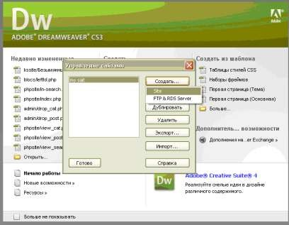

Рисунок 2 – Управление сайтами 

В появившемся окне выбираем папку, которую создали и нажимаем ok 

(рис. 3). 

Рисунок 3 – Определение сайта 

Выбираем готово (рис. 4). 

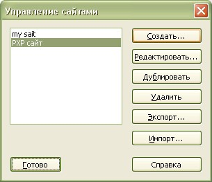

Рисунок 4 – Управление сайтами 

Теперь сайт загружен (рис. 5)! 

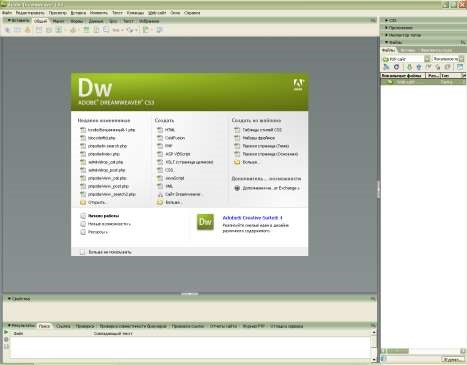

Рисунок 5 – Загруженный сайт 

Создадим первый PHP файл, для этого в появившемся окне выберем PHP файл. Сохраним его как index.php (рис. 6). 

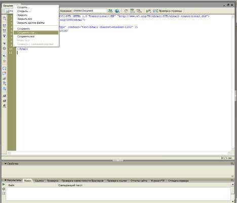

Рисунок 6 – Создание PHP файла 

 Сравните, чтобы ваш код и кодировка были такими же (рис. 7). 

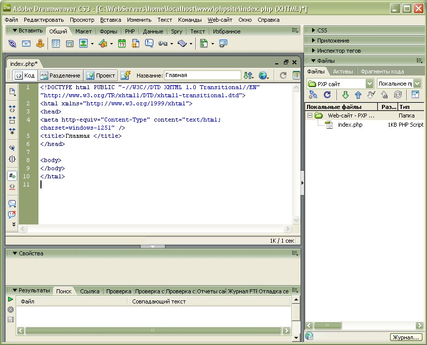

Рисунок 7 – Необходимая кодировка 

Если отличаются данные параметры, то пройдите на вкладку редактировать\установки и выберете необходимые параметры
	(рис. 8). 

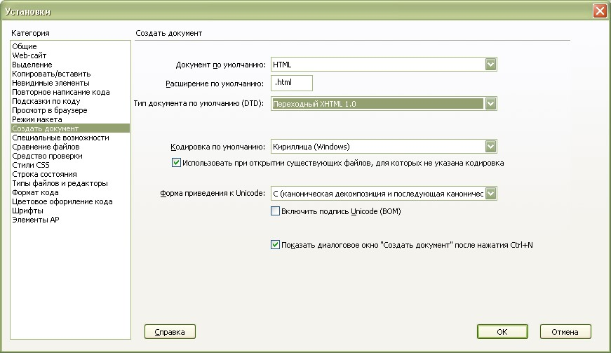

Рисунок 8 – Установки 

Подцепим таблицу стилей (рис. 9): 

Для этого выбираем файл\создать\CSS и сохраняем файл под именем style.css. В данном файле будут храниться все стили
	необходимые для оформления сайта. 

Переходим в файл index.PHP, выбираем проект\стиль 

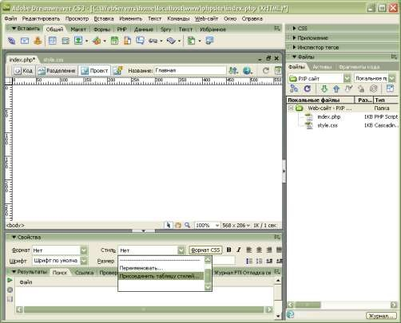

Рисунок 9 – Присоединение таблицы стилей к сайту Выбираем нашу таблицу и нажимаем ок (рис. 10). 

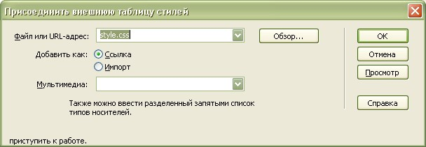

Рисунок 10 – Выбор таблицы стилей Создадим основной каркас сайта: 

Для этого в проекте во вкладке общий выберем таблицу и дадим ей следующие параметры (рис. 11). 

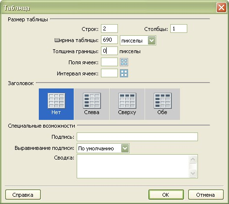

Рисунок 11 – Создание таблицы Должно получиться следующее (рис. 12): 

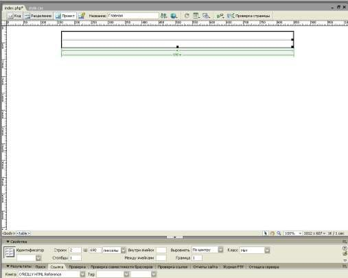

Рисунок 12 – Вид таблицы 

Поставим выравнивание по центру и цвет рамки белый. 

Пропишем стиль для рамки. 

Для этого в файле style.css пропишем: 

.main_border {border: 1px solid #000000;} 

Затем переходим к проекту, снизу видим тег &lt;table&gt;, нажимаем на него правой кнопкой и выбирает стиль
	.main_border. 

Сохраним все изменения и откроем сайт в браузере (рис. 13). 

Рисунок 13 – Таблица в браузере 

Пропишем стиль для абзацев: 

p {font-family:Verdana; font-size:12px; margin: 15px;} 

<strong>3 Приводим сайт к исходному виду </strong>

В данном уроке создадим фон, шапку сайта. 

Создайте шапку сайта размером 690 на 100 пикселей. Создайте в папке kssite папку img и поместите туда созданную шапку
	сайта. 

Затем переходим в Adobe Dreamweaver. В файле index.php открываем проект сайта. Справа открываем папку img и мышкой
	перетаскиваем изображение в таблицу. В появившемся окне нажимаем вкладку ok (рис. 14).

Рисунок 14 – Окно специальных возможностей тега image 

Должно получиться следующее (рис. 15): 

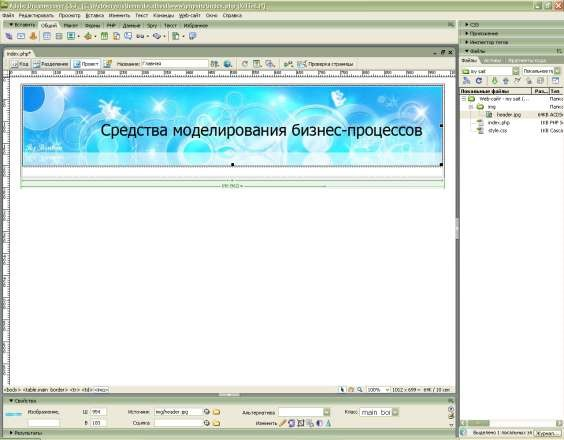

Рисунок 15 – Готовая шапка сайта 

В нижнюю ячейку добавим таблицу, чтобы разбить ее на две части, в левой части будут располагаться кнопки, в правой –
	сам текст (рис. 16). 

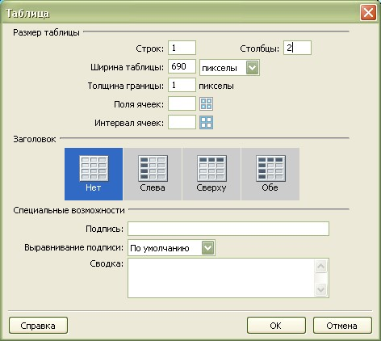

Рисунок 16 – Добавление таблицы 

Ширину левой ячейки зададим примерно 175px. Перейдем в код и пропишем это. Ширину правой ячейки можно удалить. 

Получим: 

&lt;td width=&quot;175px&quot;&gt;&amp;nbsp;&lt;/td&gt; 

        &lt;td &gt;&amp;nbsp;&lt;/td&gt; 

Левой ячейке придадим слегка голубоватый цвет. Для этого пропишем стиль: 

.left {background-color: #EDF5FE; border-right:1px solid #99CCFF;} 

Сохраняем стиль, переходим в проект файла index. Снизу правой кнопкой нажимаем на тег &lt;td&gt; и выбираем наш класс
	(рис. 17). 

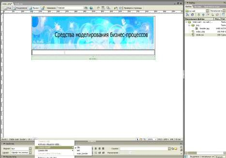

Рисунок 17 – Выбор класса для таблицы 

Создадим фон сайта. Для этого пропишем стиль: 

body {background-color: #FFFFFF; font-family: Verdana; font-size:12px; 

} 

Сохраняем и проверяем в браузере. Вот что должно получиться (рис.18): 

Рисунок 18 – Фон сайта 

Теперь можно вставить текст. Подготовьте текст для главной страницы. И скопируйте его в проект файла index.php в
	правую ячейку. Должно получиться следующее (рис. 19). 

Рисунок 19 – Сайт с текстом в браузере 

Создадим навигацию сайта. Для этого мы подготовили HTML и CSS код для навигации. 

CSS код: 

p.title { 

background-color:#0265DD; 

color: #ffffff; font-weight:bold; margin:5px; 

padding:5px; 

} 

#search-result { 

width: 50%; 

} 

#box111 { /*height: 50%;*/ width: 200%; /*position:absolute; top: 20%; 

left: 45%;*/ 

} 

#coolmenu{ border: 1px solid gray; /*Стиль рамки */ border-bottom-width: 0; width: 93%; /*Ширина меню */ 

background-color: #f6f6f6; /*Фоновый цвет ячейки*/ margin:5px; /*Ширина отступов*/ 

} 

* html #coolmenu{ 

width: 150px;/*Ширина меню для Internet Explorer*/ 

} 

#coolmenu a{ font: bold 13px Verdana; /*Шрифт текста*/ padding: 2px; /*Внутренний отсутп текста ссылки от краев
	ячейки*/ padding-left: 4px;/*Внутренний отсутп текста ссылки от левого края ячейки*/ display: block; width: 100%;
	/*Ширина ячейки*/ color: #000000; /*Цвет текста*/ 

text-decoration: none; /*Подчеркивание у ссылок - нет*/ border-bottom: 1px solid gray; 

} 

html&gt;body #coolmenu a{ 

width: auto; 

} 

#coolmenu a:hover{ 

background-color: #cccccc; /*Фоновый цвет ячейки при наведение курсора*/ color: #000000; /*Цвет текста при наведении
	курсора*/ 

Скопируйте его в файл со стилями. HTML код: 

&lt;p align=&quot;center&quot; class=&quot;title&quot;&gt; Навигация 

       &lt;/p&gt;           

 &lt;/div&gt; &lt;div p=&quot;coolmenu&quot;&gt; 

&lt;center&gt; 

&lt;/center&gt;  

&lt;center&gt;&lt;a href=&quot;index.php&quot;&gt;  

&lt;img src=&quot;img/11.gif&quot;align=&quot;center&quot;&gt;&lt;/a&gt;&lt;/center&gt; &lt;br&gt; 

&lt;center&gt;&lt;a href=&quot;termin.php&quot;&gt;  

&lt;img src=&quot;img/22.gif&quot;align=&quot;center&quot;&gt;&lt;/a&gt;&lt;/center&gt; &lt;br&gt; 

&lt;center&gt;&lt;a href=&quot;history.php&quot;&gt;  

&lt;img src=&quot;img/33.gif&quot;align=&quot;center&quot;&gt;&lt;/a&gt;&lt;/center&gt; &lt;br&gt; 

&lt;center&gt;&lt;a href=&quot;perechen.php&quot;&gt;  

&lt;img src=&quot;img/34.gif&quot;align=&quot;center&quot;&gt;&lt;/a&gt;&lt;/center&gt; &lt;br&gt; 

&lt;center&gt;&lt;a href=&quot;analiz.php&quot;&gt;  

&lt;img src=&quot;img/44.gif&quot;align=&quot;center&quot;&gt;&lt;/a&gt;&lt;/center&gt; &lt;br&gt; 

&lt;center&gt;&lt;a href=&quot;type.php&quot;&gt;  

&lt;img src=&quot;img/55.gif&quot;align=&quot;center&quot;&gt;&lt;/a&gt;&lt;/center&gt; &lt;br&gt; 

&lt;center&gt;&lt;a href=&quot;end.php&quot;&gt;  

&lt;img src=&quot;img/66.gif&quot;align=&quot;center&quot;&gt;&lt;/a&gt;&lt;/center&gt; &lt;br&gt; 

&lt;center&gt;&lt;a href=&quot;literatura.php&quot;&gt;  

&lt;img src=&quot;img/88.gif&quot;align=&quot;center&quot;&gt;&lt;/a&gt;&lt;/center&gt; 

Скопируйте его в левый блок, предварительно поставив вертикальное выравнивание по верхнему краю. Затем перейдите в
	код и вставьте данный фрагмент кода. Для навигации мы использовали нарисованные кнопки. Можете их заменить на текст.
	Сохраните и проверьте в браузере (рис. 20). 

Рисунок 20 – Внешний вид сайта и его каркас 

Внешний вид и каркас сайта готовы! 

<strong>4 Разбиваем сайт на PHP блоки </strong>

Разобьем сайт на блоки. Один блок будет содержать шапку сайта, а второй – левый блок, те навигацию. Это будет очень
	удобно, тк если что-то необходимо будет изменить на сайте, нужно будет изменить лишь один файл. 

В папке kssite создадим папку blocks. 

Найдем в файле index.php код, отвечающий за шапку сайта и вырежем данный фрагмент: 

&lt;tr&gt; 

    &lt;td&gt;&lt;img src=&quot;img/header.jpg&quot; width=&quot;686&quot; height=&quot;130&quot;
	/&gt;&lt;/td&gt; 

  &lt;/tr&gt; 

На его месте впишем следующую строчку: 

&lt;? include (&quot;blocks/header.php&quot;); ?&gt; 

Данной строчкой мы подключили файл header.php находящийся в папке blocks. Теперь создадим в папке blocks файл
	header.php и скопируем в него ранее вырезанный код шапки нашего сайта. Сохраняем файлы и проверяем сайт в браузере.
	Все отлично работает! 

То же самое проделаем с навигацией. 

Вырежем из файла index.php код навигации: 

   &lt;p align=&quot;center&quot; class=&quot;title&quot;&gt; Навигация 

       &lt;/p&gt;           

 &lt;/div&gt;  

 &lt;div p=&quot;coolmenu&quot;&gt; 

&lt;center&gt; 

&lt;/center&gt;  

&lt;center&gt;&lt;a href=&quot;index.php&quot;&gt;  

&lt;img src=&quot;img/11.gif&quot;align=&quot;center&quot;&gt;&lt;/a&gt;&lt;/center&gt; &lt;br&gt; 

&lt;center&gt;&lt;a href=&quot;termin.php&quot;&gt;  

&lt;img src=&quot;img/22.gif&quot;align=&quot;center&quot;&gt;&lt;/a&gt;&lt;/center&gt; &lt;br&gt; 

&lt;center&gt;&lt;a href=&quot;history.php&quot;&gt;  

&lt;img src=&quot;img/33.gif&quot;align=&quot;center&quot;&gt;&lt;/a&gt;&lt;/center&gt; &lt;br&gt; 

&lt;center&gt;&lt;a href=&quot;perechen.php&quot;&gt;  

&lt;img src=&quot;img/34.gif&quot;align=&quot;center&quot;&gt;&lt;/a&gt;&lt;/center&gt; &lt;br&gt; 

&lt;center&gt;&lt;a href=&quot;analiz.php&quot;&gt;  

&lt;img src=&quot;img/44.gif&quot;align=&quot;center&quot;&gt;&lt;/a&gt;&lt;/center&gt; &lt;br&gt; 

&lt;center&gt;&lt;a href=&quot;type.php&quot;&gt;  

&lt;img src=&quot;img/55.gif&quot;align=&quot;center&quot;&gt;&lt;/a&gt;&lt;/center&gt; &lt;br&gt; 

&lt;center&gt;&lt;a href=&quot;end.php&quot;&gt;  

&lt;img src=&quot;img/66.gif&quot;align=&quot;center&quot;&gt;&lt;/a&gt;&lt;/center&gt; &lt;br&gt; 

&lt;center&gt;&lt;a href=&quot;literatura.php&quot;&gt;  

&lt;img src=&quot;img/88.gif&quot;align=&quot;center&quot;&gt;&lt;/a&gt;&lt;/center&gt; 

Вставим на его место строку для подключения файла lefttd: 

&lt;? include (&quot;blocks/lefttd.php&quot;); ?&gt; 

Создадим в папке blocks файл lefttd.php и вставим в него вырезанный код. Не забудьте сохранить и проверить
	получившееся в браузере! 

<strong>5 Добавляем базовые страницы </strong>

В данном уроке заполним информацией остальные страницы. 

Для начала перейдите в проект файла index.php, нажмите на тег &lt;td&gt; и выберете выравнивание по верхнему
	краю. 

Теперь можно скопировать файл index.php и создать страницу для основной терминологии. Сохраним копию файла index.php
	как termin.php. Скопируем в проект файла termin.php уже подготовленную информацию. В названии пропишем «Основная
	терминология» (рис. 21). 

Рисунок 21 – Проект файла termin.php Сохраняем и проверяем в браузере (рис. 22): 

Рисунок 22 – Страница «Основная терминология» Аналогично создаем остальные страницы. 

<strong>6 Создаем БД и заполняем таблицы </strong>

Для создания БД заходим на localhost и проходим по ссылке <a href="http://localhost/Tools/phpMyAdmin">http://localhost/Tools/phpMyAdmin.</a>
	Создаем базу kssite (рис. 23). 

Рисунок 23 – Создание базы данных 

Добавим таблицу с настройками, которая будет содержать тексты. 

Создаем таблицу main, в ней нам понадобится 4 поля (рис. 24). 

Рисунок 24 – Добавление таблицы в БД 

Задаем следующие параметры и нажимаем сохранить (рис. 25). 

Рисунок 25 – Параметры таблицы settings 

Видим что у нас появилась таблица main в нашей базе. Будем ее заполнять, для этого нажимаем кнопку вставить (рис.
	26). 

Рисунок 26 – Форма для заполнения полей в таблице settings 

Вводим название страницы index, копируем заголовок данной страницы и вырезаем из файла index.php текст страницы с
	тегами. Тоже самое делаем для файла termin.php. Затем выбираем вставить новую запись и нажимаем пошел 

(рис. 27). 

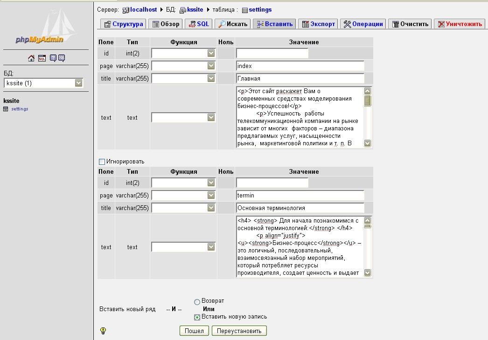

Рисунок 27 – Заполнение полей в таблице settings 

Данные с остальных страниц занесите в базу самостоятельно! После создания последней записи вместо вставить новую
	запись выберете возврат. 

Выберем нашу таблицу и нажмем обзор (рис. 28). Все записи добавились в таблицу! 

Рисунок 28 – Обзор таблицы settings 

<strong>7 Извлекаем данные из БД </strong>

В данном уроке будем вытаскивать информацию на свои места. 

Переходим в dreamweaver, в файл index. Соединимся с нашей базой. 

Для начала мы должны соединиться с mysql сервером: 

&lt;? mysql_connect (&quot;localhost&quot;,&quot;root&quot;,&quot;&quot;); ?&gt; 

И занесем это в переменную db 

&lt;? 

$db = mysql_connect (&quot;localhost&quot;,&quot;root&quot;,&quot;&quot;); ?&gt; 

Далее пропишем функцию выбора БД. 

&lt;?php 

$db = mysql_connect (&quot;localhost&quot;,&quot;root&quot;,&quot;&quot;); mysql_select_db(&quot;kssite&quot;,$db); ?&gt; 

Вынесем эту информацию в отдельный файл, чтобы впоследствии при подключении к базе обращаться к функции include. 

Создадим новый файл bd.php и сохраним его в папку blocks (рис. 29). 

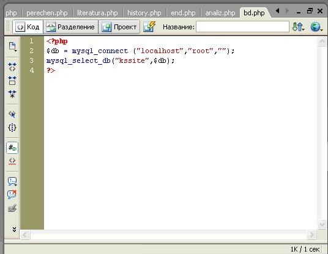

Рисунок 29 – файл bd.php 

Чтобы подключить базу к файлу index.php пропишем в нем: 

&lt;?php 

include (&quot;blocks/bd.php&quot;); ?&gt; 

Сформируем запрос к БД и поместим его в переменную result и далее из этой переменной вытащим массив с данными в
	переменную myrow (рис. 30). 

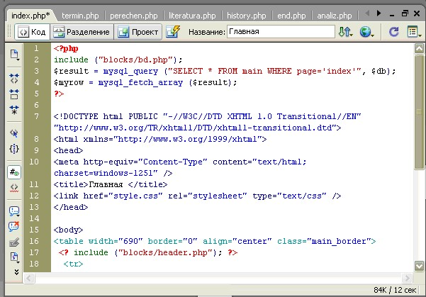

Рисунок 30 – Формирование запроса к БД 

Для вывода текста и заголовка на их месте пропишем следующее: 

&lt;?php echo $myrow ['title']; ?&gt; на месте заголовка; &lt;?php echo $myrow ['text']; ?&gt; на месте текста. 

Сохраняем изменения и проверяем в браузере. Должен отобразиться текст. В остальных файлах пропишите функцию include и
	через оператор echo введите текст и заголовок статьи, аналогично файлу index.php. 

<strong>8 Создание блока админа </strong>

В данном уроке создадим блок администратора, из которого можно будет редактировать уроки. Данная часть невидима. 

Создадим внутри нашего сайта папку admin. Администраторский блок по внешнему виду обычно похож на сайт, поэтому в нее
	можно скопировать файл index.php, стили, папки blocks и img. Далее переходим в Adobe Dreamweaver и займемся
	редактированием блока администратора. Из базы мы ничего не будем извлекать, поэтому соединение с БД и извлечение из
	нее информации удаляем. 

Между тегами &lt;title&gt; пропишем: «Главная страница блока администратора». Вместо текста пропишем: «&lt;p&gt;Добро
	пожаловать в админский блок!&lt;/p&gt;». Сохраняем изменения, переходим в браузере и в адрес прописываем: <a
			href="http://localhost/kssite/admin/">http://localhost/kssite/admin/ </a>(рис. 31). 

Должно получиться следующее: 

Рисунок 31 – Админская страница 

Теперь займемся файлом lefttd.php, уберем в нем кнопки и добавим кнопку редактирования. Скопируем в папку img файл
	10.gif – кнопка редактирования (рис. 32). 

Оставим следующий код: 

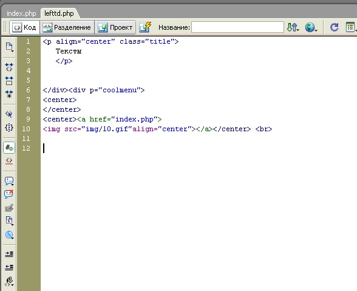

Рисунок 32 – Создание кнопки редактирования 

Проверьте в браузере (рис. 33): 

Рисунок 33 – Кнопка редактирования текстов в админской странице 

В следующем уроке непосредственно займемся редактированием текстов. 

<strong>9 Редактирование текстов из админки </strong>

В папке admin создадим php файл под названием edit_text.php (рис. 34). 

Создадим цикл из которого выводятся названия всех страниц: 

Рисунок 34 – Код файла edit.php 

В файле lefttd.php исправим ссылку на edit_text. Сохраним изменения и проверим их в браузере (рис. 35). 

Рисунок 35 – Вывод текстов для редактирования 

Займемся файлом red_text, который будет уже заниматься редактированием. Файл red_text выглядит следующим образом
	(рис. 36): 

Рисунок 36 – Код файла red_text.php 

В итоге у вас должна выводиться в браузере форма для редактирования текстов при нажатии на название статьи (рис.
	37): 

Рисунок 37 – Форма для редактирования текста в браузере 

<strong>10 Доступ к админке по паролю </strong>

Создаем в папке admin файл lock.php и копируем в него следующий код: 

&lt;?php 

include(&quot;blocs/bd.php&quot;); 

if (!isset($_SERVER['PHP_AUTH_USER'])) 

{ 

 Header (&quot;WWW-Authenticate: Basic realm=\&quot;Admin Page\&quot;&quot;); 

 Header (&quot;HTTP/1.0 401 Unauthorized&quot;); exit(); 

} 

else { if (!get_magic_quotes_gpc()) { 

$_SERVER['PHP_AUTH_USER']= mysql_escape_string($_SERVER['PHP_AUTH_USER']); 

 $_SERVER['PHP_AUTH_PW']= mysql_escape_string($_SERVER['PHP_AUTH_PW']); 

 } 

 $query = &quot;SELECT pass FROM userlist WHERE 

user='&quot;.$_SERVER['PHP_AUTH_USER'].&quot;'&quot;; 

$lst = @mysql_query($query); 

 if (!$lst) { 

 Header (&quot;WWW-Authenticate: Basic realm=\&quot;Admin Page\&quot;&quot;); 

 Header (&quot;HTTP/1.0 401 Unauthorized&quot;); exit(); 

 } 

 if (mysql_num_rows($lst) == 0) 

 { 

 Header (&quot;WWW-Authenticate: Basic realm=\&quot;Admin Page\&quot;&quot;); 

 Header (&quot;HTTP/1.0 401 Unauthorized&quot;); exit(); 

 } 

 $pass = @mysql_fetch_array($lst); 

 if ($_SERVER['PHP_AUTH_PW']!= $pass['pass']) 

 { 

 Header (&quot;WWW-Authenticate: Basic realm=\&quot;Admin Page\&quot;&quot;); 

 Header (&quot;HTTP/1.0 401 Unauthorized&quot;); exit(); 

 } 

} 

?&gt;  

Теперь необходимо подключить данный файл ко всем файлам админского блока. Для этого в начале каждого файла, который
	находится в папке admin прописываем следующую строчку: 

&lt;? 

include (&quot;lock.php&quot;); 

?&gt; 

Теперь нам необходимо создать табличку, в которой будет три пола id, user и pass. Перейдем в phpmyadmin, выберем нашу
	базу и создадим таблицу userlist. Задаем ей следующие параметры (рис. 38): 

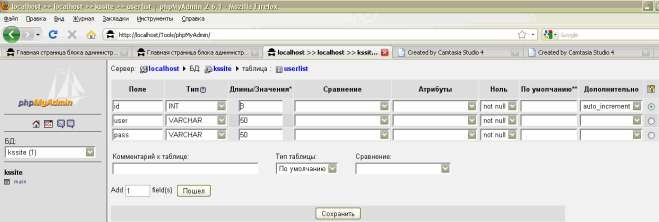

Рисунок 38 – Параметры таблицы userlist Вставим в таблицу запись, например (рис. 39): 

Рисунок 39 – Заполнение таблицы userlist 

Выбираем возврат и нажимаем “пошел”. 

Сохраняем все изменения и пытаемся в браузере зайти на админскую страницу (рис. 40). 

Рисунок 40 – Окно запроса пароля в админской странице 

<h1>Лабораторная работа №20: “Программирование и оптимизация программ”</h1>

<strong>Цель. </strong>Отработка навыков веб-мастеринга. 

<strong>Ожидаемый результат. </strong>Создание ТЗ на разработку сайта и его реализация. 

<strong>Цель работы </strong>– составить ТЗ на разработку корпоративного сайта. 

<strong> </strong>

<strong>Ход работы </strong>

<strong> </strong>

<strong>3.1.2. Общие сведения</strong>

<strong>Назначение документа</strong>

Настоящее Техническое задание определяет требования и порядок разработки веб-сайта «upload».

<strong>Наименование Исполнителя и Заказчика</strong>

Заказчик: __________».

Исполнитель: _________.

<strong>Краткие сведения о компании</strong>

Компания _______________ занимается продажей компьютерной техники. До настоящего времени веб-сайта у компании не
	было.

<strong>Основание для разработки сайта</strong>

Основанием для разработки сайта является Договор №__ между Исполнителем и Заказчиком.

<strong>Плановые сроки начала и окончания работ по созданию сайта</strong>

Начало работ: 21.04.2016

Окончание работ: 21.05.2016

Содержание и длительность отдельных этапов работ приведены в разделе 4 настоящего ТЗ. Сроки, состав и очерёдность
	работ являются ориентировочными и могут изменяться по согласованию с Заказчиком.

<strong>Порядок оформления и предъявления результатов работ</strong>

Работы по созданию сайта производятся и принимаются поэтапно.

По окончании каждого из этапов работ, перечисленных в разделе 4 настоящего ТЗ, Исполнитель представляет Заказчику
	соответствующие результаты, и стороны подписывают Акт сдачи-приёмки работ.

<strong>3.1.3. Назначение и цели создания сайта</strong>

<strong>Назначение сайта</strong>

Сайт должен представлять ООО «Маяк» в Интернете, поддерживать её положительный и современный имидж, знакомить
	посетителей с продукцией компании.

<strong>Цели создания сайта</strong>

Цель сайта – познакомить посетителей с компанией, направлениями её деятельности и продукцией, предоставить информацию
	о способах приобретения продукции.

<strong>Целевая аудитория</strong>

В целевой аудитории веб-сайта можно выделить следующие группы:

<ol>
	<li>Покупатели;</li>
	<li>Партнёры;</li>
	<li>Посетители тренингов.</li>
</ol>

<strong>3.1.4. Требования к сайту</strong>

<strong>Требования к структуре и функционированию сайта</strong>

Сайт должен представлять собой информационную структуру, доступную в сети Интернет под доменным именем «upload».

Сайт должен состоять из взаимосвязанных разделов с чётко разделёнными функциями.

<strong>Требования к персоналу</strong>

Для поддержания сайта и эксплуатации веб-интерфейса системы управления сайтом (CMS) от персонала не должно
	требоваться специальных технических навыков, знания технологий или программных продуктов, за исключением общих
	навыков работы с персональным компьютером и стандартным веб-браузером (MS Internet Explorer 7.0 или выше).

<strong>Требования к сохранности информации</strong>

В системе управления сайтом должен быть предусмотрен механизм резервного копирования структуры и содержимого базы
	данных. Процедура резервного копирования должна производиться сотрудником, ответственным за поддержание сайта, не
	реже 1 раза в неделю. Резервное копирование графического содержимого должно осуществляться вручную.

<strong>Требования к разграничению доступа</strong>

Информация, размещаемая на сайте, является общедоступной.

Пользователей сайта можно разделить на 3 части в соответствии с правами доступа:

Посетители имеют доступ только к общедоступной части сайта.

Доступ к административной части имеют пользователи с правами редактора и администратора.

Редактор может редактировать материалы разделов.

Администратор может выполнять все те же действия, что и Редактор, и кроме того:

- добавлять пользователей с правами Редактора;

- добавлять и удалять разделы сайта.

Доступ к административной части должен осуществляться с использованием уникального логина и пароля. Логин выдаётся
	администратором сайта. Пароль генерируется автоматически и высылается пользователю на адрес, указанный при
	регистрации. В первый раз при попытке войти в административную часть система должна предлагать пользователю сменить
	пароль (ввести вручную новый пароль).

Для обеспечения защиты от несанкционированного доступа к административной части при составлении паролей рекомендуется
	придерживаться следующих правил:

<ol>
	<li>Длина пароля должна быть не менее 8 символов.</li>
</ol>

Пароль должен состоять из цифр и латинских букв в разных регистрах; желательно включать в пароль другие символы,
	имеющиеся на клавиатуре (например, символы / ? ! &lt; &gt; [ ] { } и т.д.)

Пароль не должен являться словарным словом или набором символов, находящихся рядом на клавиатуре. В идеале пароль
	должен состоять из бессмысленного набора символов.

Все пароли необходимо менять с определённой периодичностью, оптимальный срок - от трёх месяцев до года.

<strong>Требования к функциям (задачам), выполняемым сайтом</strong>

Сайт должен состоять из следующих разделов:

- Главная страница

- Корзина покупок

- Товары

<strong>Навигация</strong>

Пользовательский интерфейс сайта должен обеспечивать наглядное, интуитивно понятное представление структуры
	размещённой на нем информации, быстрый и логичный переход к разделам и страницам. Навигационные элементы должны
	обеспечивать однозначное понимание пользователем их смысла: ссылки на страницы должны быть снабжены заголовками,
	условные обозначения соответствовать общепринятым. Графические элементы навигации должны быть снабжены
	альтернативной подписью.

Система должна обеспечивать навигацию по всем доступным пользователю ресурсам и отображать соответствующую
	информацию. Для навигации должна использоваться система контент-меню. Меню должно представлять собой текстовый блок
	(список гиперссылок) в левой колонке или в верхней части страницы (в зависимости от утверждённого дизайна).

Для разделов, содержащих подразделы, должно быть предусмотрено выпадающее подменю.

При выборе какого-либо из пунктов меню пользователем должна загружаться соответствующая ему информационная страница
	(новостная лента, форма обратной связи и пр.), а в блоке меню (или в основной части страницы в зависимости от
	утверждённого дизайна) открываться список подразделов выбранного раздела. 

<strong>Наполнение сайта (контент)</strong>

Страницы всех разделов сайта должны формироваться программным путём на основании информации из базы данных на
	сервере.

Модификация содержимого разделов должна осуществляться посредством администраторского веб-интерфейса (системы
	управления сайтом), который без применения специальных навыков программирования (без использования программирования
	и специального кодирования или форматирования) должен предусматривать возможность редактирования информационного
	содержимого страниц сайта. Наполнение информацией должно проводиться с использованием шаблонов страниц сайта. 

В рамках разработки сайта Исполнитель должен обеспечить ввод представленной Заказчиком статической информации в
	создаваемые динамические разделы (с учётом предусмотренной настоящим ТЗ функциональности). Текстовая информация
	должна предоставляться Заказчиком в виде отдельных файлов формата MS Word 2003 (DOC). Названия файлов должны
	соответствовать названиям разделов. Перед передачей текстов Исполнителю они должны быть вычитаны и отредактированы.
	Графический материал должен предоставляться в формате JPG. По возможности, названия графических файлов должны
	отражать содержимое файла. Изображения для галерей и разделов сайта должны размещаться в папках или архивах с
	названиями соответственно галерее или разделу сайта, для которых они предназначаются.

Исполнитель должен обеспечить обработку иллюстраций для приведения их в соответствие с техническими требованиями и
	HTML-вёрстку подготовленных материалов. При необходимости дополнительной обработки (набор, вычитка, сканирование,
	ретушь, монтаж, перевод и т.п.) силами Исполнителя она должна осуществляться в рамках отдельного соглашения с
	Заказчиком.

После сдачи сайта в эксплуатацию информационное наполнение разделов, включая обработку и подготовку к публикации
	графических материалов, должно осуществляться Заказчиком самостоятельно или на основании отдельного договора на
	поддержку сайта.

<strong>3.1.5. Система навигации (карта сайта)</strong>

Взаимосвязь между разделами и подразделами сайта (карта сайта) представлена на рисунке Ошибка: источник перекрёстной
	ссылки не найден.

Рисунок – Карта сайта.

<strong>Требования к функциональным возможностям</strong>

<strong>Система управления контентом (CMS)</strong>

Система управления контентом (административная часть сайта) должна предоставлять возможность добавления,
	редактирования и удаления содержимого статических и динамических страниц. Также должна быть предусмотрена
	возможность добавления информации без отображения на сайте. 

Система управления контентом должна иметь стандартный для Windows интерфейс, отвечающий следующим требованиям:

- реализация в графическом оконном режиме;

- единый стиль оформления;

- интуитивно понятное назначение элементов интерфейса;

- отображение на экране только тех возможностей, которые доступны конкретному пользователю;

- отображение на экране только необходимой для решения текущей прикладной задачи информации;

- отображение на экране хода длительных процессов обработки;

- диалог с пользователем должен быть оптимизирован для выполнения типовых и часто используемых операций.

- для операций по массовому вводу информации должна быть предусмотрена минимизация количества нажатий на клавиатуру
	для выполнения стандартных действий.

<strong>Типовые статические страницы</strong>

Типовые страницы могут изменяться, редактироваться или дополняться в административной части сайта.

Для каждой типовой статической страницы в административной части заполняются такие поля:

- Заголовок (длина не более 125 символов).

- Полный текст страницы (количество сопроводительных иллюстраций в нём не ограничено, количество символов в одной
	статье – не более 15000; тексту может быть придано подчёркнутое, <em>наклонное</em> и <strong>жирное</strong>
	начертание).

<strong>3.1.6. Требования к дизайну</strong>

<strong>Общие требования</strong>

Стиль сайта можно описать как современный, деловой. В качестве фонового цвета рекомендуется использовать белый.
	Оформление не должно ущемлять информативность: хотя на сайте и должно быть довольно много графики, он должен быть
	удобен пользователям в плане навигации и интересен для многократного посещения.

<strong>Типовые навигационные и информационные элементы</strong>

- Шапка сайта

- Основное меню

- Боковое меню

- Основное поле контента

- Подложка

<strong>Шапка сайта</strong>

Шапка сайта должна содержать логотип и название компании, изображение (коллаж), а также контактную информацию.
	Логотип является ссылкой на главную страницу сайта. 

<strong>Основное и боковое меню</strong>

Основное меню должно располагаться в верхней части окна (под шапкой) и содержать ссылки на все разделы первого
	уровня.

Боковое меню должно располагаться в левой части окна и содержать ссылки на разделы, связанные тематически с текущим,
	если таковые существуют для выбранного раздела первого уровня.

<strong>Основное поле контента</strong>

Основное поле контента должно располагаться в центре страницы. В этом поле отображается основное содержание
	выбранного раздела. Стилевое оформление материалов и их элементов (ссылок, заголовков, основного текста,
	изображений, форм, таблиц и т.п.) должно быть единым для всех страниц веб-сайта.

<strong>3.1.7.
	Эскизы страниц</strong>

<strong>Страница с товарами</strong>

В верхней части типовой страницы должна располагаться шапка и навигационное меню сайта; левая часть страницы содержит
	боковое меню; в правой боковой области расположен текстовой контент, содержащий текст или иллюстрации

Рисунок – Страница товаров.

<strong>Типовая статическая страница</strong>

В верхней части типовой страницы должна располагаться шапка и навигационное меню сайта; центральная часть содержит
	рекламу (баннер); нижняя часть содержит два полезных модуля, а в самом низу положка

Рисунок – Типовая страница.

<strong>3.1.8. Требования к видам обеспечения</strong>

<strong>Требования к хранению
	данных</strong>

Все данные сайта должны храниться в структурированном виде под управлением реляционной СУБД. Исключения составляют
	файлы данных, предназначенные для просмотра и скачивания (изображения, видео, документы и т.п.). Такие файлы
	сохраняются в файловой системе, а в БД размещаются ссылки на них.

<strong>Требования к языкам
	программирования</strong>

Для реализации статических страниц и шаблонов должны использоваться язык CSS. Исходный код должен разрабатываться в
	соответствии со стандартами W3C . Для реализации интерактивных элементов клиентской части должны использоваться
	языки JavaScript и PHP. Для реализации динамических страниц должен использоваться язык PHP.

<strong>Требования к лингвистическому
	обеспечению</strong>

Сайт должен быть выполнен на русском и английском языках. Должна быть предусмотрена возможность переключения между
	русским и английским языками на любой из страниц сайта.

<strong>Требования к программному обеспечению</strong>

Программное обеспечение клиентской части должно удовлетворять следующим требованиям:

<ul>
	<li>
		<ul>
			<li>Веб-браузер: Internet Explorer 7.0 и выше, или Firefox 3.5 и выше, или Opera 9.5 и выше, или Safari
				3.2.1 и выше, или Chrome 2 и выше;
			</li>
			<li>Включённая поддержка javascript, Flash и cookies.</li>
		</ul>
	</li>
</ul>

<strong>Требования
	к аппаратному обеспечению</strong>

Аппаратное обеспечение серверной части должно удовлетворять следующим требованиям:

<ol>
	<li>ОС: Windows XP / Vista / 7 или выше;</li>
	<li>Память: 256 Mb или выше;</li>
	<li>Места на диске:500 Mb;</li>
	<li>Наличие интернет-соединения;</li>
</ol>

<strong>Состав и содержание работ по созданию сайта</strong>

Подробное описание этапов работы по созданию сайта приведено в таблице.

Таблица. Этапы создания сайта.

<table>
	<tr>
		<td>
№ п/п
</td>
		<td>
Виды работ
</td>
		<td>
Трудоёмкость, дней
</td>
	</tr>
	<tr>
		<td></td>
		<td>
Получение ТЗ
</td>
		<td>
2
</td>
	</tr>
	<tr>
		<td></td>
		<td>
Сбор информации и ознакомление с предметной областью
</td>
		<td>
5
</td>
	</tr>
	<tr>
		<td></td>
		<td>
Выбор объектного построения программы
</td>
		<td>
2
</td>
	</tr>
	<tr>
		<td></td>
		<td>
Разработка общей методики создания продукта
</td>
		<td>
2
</td>
	</tr>
	<tr>
		<td></td>
		<td>
Разработка основного алгоритма
</td>
		<td>
12
</td>
	</tr>
	<tr>
		<td></td>
		<td>
Создание интерфейса
</td>
		<td>
5
</td>
	</tr>
	<tr>
		<td></td>
		<td>
Отладка
</td>
		<td>
4
</td>
	</tr>
	<tr>
		<td></td>
		<td>
Подготовка технической документации
</td>
		<td>
7
</td>
	</tr>
	<tr>
		<td></td>
		<td>
Сдача продукта
</td>
		<td>
2
</td>
	</tr>
	<tr>
		<td></td>
		<td>
ИТОГО:
</td>
		<td>
41
</td>
	</tr>
</table>
<h1>Литература</h1>
<ol>
	<li>Рудаков А.В. Технология разработки программных продуктов. – М.: “Издательский центр “Академия”, 2013;</li>
	<li>Рудаков А. В. Технология разработки программных продуктов. Практикум. – М.: “Издательский центр “Академия”,
		2014;
	</li>
	<li>Котляров В. П. Основы тестирования программного обеспечения. – М.: “Интернет-Университет Информационных
		Технологий; БИНОМ. Лаборатория знаний”, 2012;
	</li>
	<li>Э. Орама, Г. Уилсона. Идеальная разработка ПО. Рецепты лучших программистов. – СПб.: “Питер”, 2012;</li>
	<li>Партыка Т. Л., Попов И.И. Информационная безопасность. – М.: “Форум”, “ИНФРА- М”, 2010;</li>
	<li>Н. В. Макарова, В. Б. Волков. Информатика. – СПб.: “Питер”, 2011;</li>
	<li>Вендров А.М. Проектирование программного обеспечения экономических информационных систем: Учебник. - 2-е изд.,
		перераб. и доп. – М.: Финансы и статистика, 2012;
	</li>
	<li>C/C++. Структурное Программирование: Практикум / Т. А. Павловская. Ю. А. Щупак. – СПб.: “Питер”, 2013;</li>
	<li>Лафоре. Р. Объектно-ориентированное программирование в C++. – СПб.: “Питер”, 2013;</li>
</ol>
